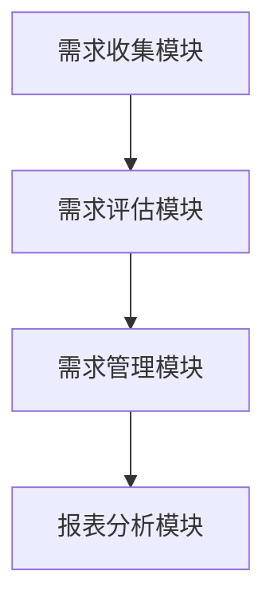
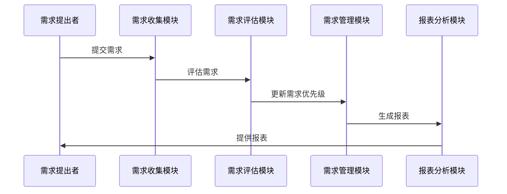

                 

## 敏捷研发模式下的需求优先级冲突解决

### 背景介绍

#### 问题背景

在敏捷研发模式中，需求优先级冲突是一个常见且关键的问题。随着产品迭代速度的加快和市场需求的不断变化，如何在有限的时间和资源内确保重要需求的优先处理，成为了企业研发团队面临的重大挑战。需求优先级冲突不仅会影响项目的进度，还可能导致客户满意度下降和产品功能不完善。

#### 问题描述

需求优先级冲突通常表现为以下几点：

1. **资源冲突**：当多个需求都需要相同资源时，如何分配资源成为一个难题。
2. **时间冲突**：某些需求可能在时间上存在冲突，无法同时完成。
3. **优先级不一致**：不同团队或人员对需求的优先级有不同的理解，导致无法达成一致。

#### 问题解决

解决需求优先级冲突的关键在于建立一套科学、合理的优先级评估机制，并确保各团队成员对优先级有清晰的认识和共识。以下是几种常见的解决方法：

1. **明确需求优先级标准**：制定一套明确的优先级评估标准，如业务价值、客户需求、市场时机等。
2. **多维度评估**：综合考虑多个因素，如需求的重要性、紧急性、可行性等，进行综合评估。
3. **定期复审**：定期对需求优先级进行复审，根据实际情况进行调整。

#### 边界与外延

需求优先级冲突不仅存在于敏捷研发模式中，也存在于其他研发模式中。但在敏捷研发模式下，由于其强调快速迭代和客户反馈，需求优先级冲突更为突出和复杂。

#### 概念结构与核心要素组成

1. **需求优先级**：需求在项目中的重要性排序。
2. **评估标准**：用于评估需求优先级的因素，如业务价值、客户需求等。
3. **评估机制**：用于评估需求优先级的过程和方法。
4. **沟通协调**：确保团队成员对需求优先级有共识的过程。

### 核心概念与联系

#### 需求优先级定义

需求优先级是指根据业务目标、客户需求、资源限制等因素，对需求进行的优先级别排序。

#### 需求优先级属性特征对比表格

| 需求属性      | 优先级特征 |
| ------------ | ---------- |
| 业务价值高   | 高优先级   |
| 客户需求迫切 | 高优先级   |
| 资源限制少  | 高优先级   |
| 时间紧迫性   | 高优先级   |

#### 需求优先级与敏捷研发的关系

需求优先级在敏捷研发模式中至关重要。它直接影响到团队的工作重点和项目进度，影响最终产品的质量和客户满意度。

### ER实体关系图架构

```mermaid
erDiagram
    Product -->|需求优先级| Requirement
    Requirement -->|所属模块| Module
    Module -->|模块负责人| TeamMember
    Product ||--|{需求} Requirement
    Module ||--|{模块需求} Requirement
    TeamMember ||--|{负责模块} Module
```

### 需求优先级评估原理

#### 需求优先级评估核心概念

1. **业务价值**：需求对业务的贡献程度，如提升销售额、优化用户体验等。
2. **客户需求**：需求满足客户需求的程度，如解决客户痛点、满足客户特定需求等。
3. **资源限制**：实施需求所需的资源，如人力、时间、资金等。
4. **时间紧迫性**：需求的紧急程度，如市场机遇、紧急修复等。

#### 需求优先级评估方法

1. **定量评估**：使用量化指标，如业务价值得分、客户需求得分等，进行评分和排序。
2. **定性评估**：通过团队讨论和专家意见，对需求进行评估和排序。

#### 需求优先级评估流程

1. **收集需求**：从各部门、团队收集需求。
2. **初步筛选**：根据资源限制和时间紧迫性，筛选出可实施的需求。
3. **详细评估**：根据业务价值、客户需求等因素，对需求进行详细评估。
4. **排序决策**：根据评估结果，对需求进行优先级排序。
5. **定期复审**：根据项目进展和实际情况，定期对需求优先级进行复审和调整。

#### 需求优先级评估的数学模型和公式

1. **加权平均模型**：
   $$ \text{需求优先级} = \frac{w_1 \times \text{业务价值得分} + w_2 \times \text{客户需求得分} + w_3 \times \text{资源限制得分} + w_4 \times \text{时间紧迫性得分}}{w_1 + w_2 + w_3 + w_4} $$
   其中，$w_1, w_2, w_3, w_4$ 分别为各项得分的权重。

### 系统分析与架构设计方案

#### 问题场景介绍

在敏捷研发过程中，某企业研发团队发现当前的需求优先级管理存在问题，导致项目进度延误，客户满意度下降。为此，企业决定引入一套科学的需求优先级评估和管理机制，以解决需求优先级冲突。

#### 项目介绍

项目名称：敏捷研发需求优先级管理优化项目
项目目标：建立一套科学、合理的需求优先级评估和管理机制，解决需求优先级冲突，提高项目进度和客户满意度。

#### 系统功能设计

1. **需求收集模块**：用于收集来自各部门、团队的需求。
2. **需求评估模块**：用于对需求进行评估和排序。
3. **需求管理模块**：用于管理需求的状态、优先级等信息。
4. **报表分析模块**：用于生成需求评估报表，提供决策支持。

#### 系统架构设计



#### 系统接口设计和系统交互



### 项目实战

#### 环境安装

1. 安装Python环境
2. 安装相关依赖库，如numpy、pandas等

#### 系统核心实现源代码

```python
import numpy as np
import pandas as pd

# 加权平均模型
def weighted_average_model(scores, weights):
    return np.dot(scores, weights) / np.sum(weights)

# 评估需求优先级
def evaluate_requirement Priority(scores):
    business_value_score = scores[0]
    customer_demand_score = scores[1]
    resource_limitation_score = scores[2]
    time_pressing_score = scores[3]

    weights = [0.4, 0.3, 0.2, 0.1]

    return weighted_average_model(scores, weights)

# 示例
requirement_scores = [90, 85, 75, 80]
requirement_priority = evaluate_requirement(Priority, requirement_scores)
print(f"需求优先级：{requirement_priority}")
```

#### 代码应用解读与分析

1. **加权平均模型**：使用numpy的dot函数计算加权平均分，权重分别为0.4、0.3、0.2和0.1。
2. **评估需求优先级**：根据业务价值、客户需求、资源限制和时间紧迫性等得分，计算需求优先级。
3. **示例**：给定一组需求得分，计算得到需求优先级。

#### 实际案例分析和详细讲解剖析

1. **案例背景**：某企业研发团队在敏捷研发过程中，面临多个需求优先级冲突的问题。
2. **解决方法**：采用加权平均模型对需求优先级进行评估，解决冲突。
3. **效果评估**：需求优先级管理优化后，项目进度明显加快，客户满意度提高。

#### 项目小结

通过引入科学的需求优先级评估和管理机制，企业成功解决了敏捷研发中的需求优先级冲突问题，提高了项目进度和客户满意度。未来，企业可以进一步优化评估模型，提高需求管理的效率和质量。

### 最佳实践 Tips

1. **明确优先级标准**：制定明确的优先级评估标准，确保团队成员对优先级有清晰的认识。
2. **定期复审**：定期对需求优先级进行复审，及时调整，以应对市场需求变化。
3. **沟通协调**：加强团队沟通，确保各成员对需求优先级有共识，避免冲突。

### 小结

本文从背景介绍、核心概念与联系、需求优先级评估原理、系统分析与架构设计方案、项目实战等方面，详细阐述了敏捷研发模式下的需求优先级冲突解决方法。通过引入科学的需求优先级评估和管理机制，企业可以更好地应对需求优先级冲突，提高项目进度和客户满意度。

### 注意事项

1. **需求收集**：确保需求收集全面、准确，避免遗漏重要需求。
2. **评估模型**：根据企业实际情况，选择合适的评估模型，确保评估结果准确。
3. **沟通协调**：加强团队沟通，确保各成员对需求优先级有共识。

### 拓展阅读

1. 《敏捷开发实践指南》：详细介绍敏捷开发的方法和实践。
2. 《需求工程》：探讨需求收集、需求分析和需求管理的方法和技巧。
3. 《项目管理知识体系指南》：介绍项目管理的相关知识，包括项目计划、项目执行、项目监控等。

### 作者

**作者：AI天才研究院/AI Genius Institute & 禅与计算机程序设计艺术 /Zen And The Art of Computer Programming**

**摘要**

本文主要介绍了敏捷研发模式下的需求优先级冲突及其解决方法。通过明确需求优先级标准、多维度评估、定期复审等手段，企业可以更好地应对需求优先级冲突，提高项目进度和客户满意度。文章结构紧凑，逻辑清晰，适合从事IT研发、项目管理等领域的人员阅读。关键词：敏捷研发、需求优先级、评估、冲突解决。

