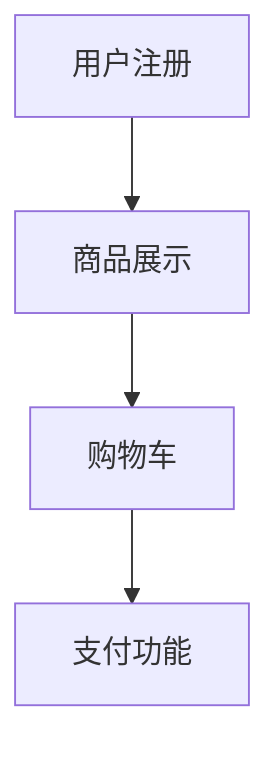
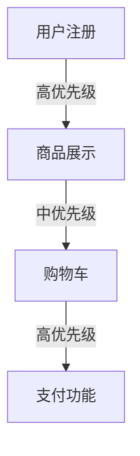

                 

### 引言

在当今快速变化的市场环境中，敏捷研发模式已成为软件工程领域的热门话题。敏捷研发强调迭代、快速反馈和持续改进，以应对不断变化的需求和竞争压力。在敏捷研发模式下，需求管理尤为重要，因为有效的需求管理可以确保项目团队能够快速响应变化，从而提高项目的成功率和客户满意度。

需求优先级管理是需求管理中的一个关键环节。它涉及对多个需求进行排序，以确定哪些需求应该首先被满足。在敏捷研发中，需求优先级管理不仅可以帮助团队更好地理解和管理项目范围，还可以优化资源分配，确保高价值需求得到优先处理。

可视化工具在需求优先级管理中发挥着重要作用。这些工具能够以直观的方式展示需求优先级，使得团队对需求的重要性有更清晰的认识，从而做出更明智的决策。本文将探讨敏捷研发模式下需求优先级可视化工具的应用，通过理论阐述、工具介绍、案例分析等，帮助读者了解并掌握这一重要技术。

本文的结构如下：

## 第一部分 引言

在这一部分，我们将介绍敏捷研发模式的背景，需求优先级在敏捷研发中的重要性，以及可视化工具在需求管理中的应用。

### 第二部分 理论基础

在第二部分，我们将深入探讨敏捷研发模式的概述，包括其核心原则和流程方法。同时，我们还将介绍需求优先级的概念与模型，包括其定义、分类与评估方法。

### 第三部分 工具应用

第三部分将详细介绍如何选择和评估可视化工具，以及这些工具在需求优先级管理中的应用场景。我们将讨论项目启动与规划、需求收集与整理、需求优先级排序与调整等具体应用。

### 第四部分 案例分析

在案例分析部分，我们将通过两个实际案例，展示如何在实际项目中应用需求优先级可视化工具。通过这些案例，读者可以更直观地了解这些工具的实际效果和操作方法。

### 第五部分 最佳实践

最后一部分将总结最佳实践经验，包括需求优先级可视化工具的最佳实践、案例总结与经验分享，以及注意事项与未来展望。

通过以上五个部分的详细探讨，本文旨在为读者提供一个全面、深入的理解，帮助他们在敏捷研发模式下更有效地管理需求优先级。

### 敏捷研发模式的背景

敏捷研发模式的兴起，可以追溯到20世纪90年代末。当时，传统的瀑布式开发模式由于无法应对快速变化的市场需求，逐渐暴露出其固有的局限性。客户需求变化频繁，市场环境动荡不安，导致许多项目在开发过程中进度延误、成本超支，甚至最终失败。为了解决这些问题，软件开发行业开始探索新的方法，敏捷研发模式应运而生。

敏捷研发模式最早由软件开发人员共同制定的敏捷宣言（Manifesto for Agile Software Development）提出，该宣言强调了个体和互动、可工作的软件、客户合作和响应变化的重要性。敏捷宣言的诞生标志着敏捷研发模式的正式确立，并迅速在全球范围内传播和应用。

敏捷研发模式的核心原则包括：

1. **个体和互动重于流程和工具**：敏捷研发强调团队成员之间的沟通和协作，认为人的因素比工具和方法更为重要。

2. **可工作的软件重于详尽的文档**：敏捷研发认为，最有效的交付方式是创建一个可立即部署和使用的软件版本，而不是繁琐的文档。

3. **客户合作重于合同谈判**：敏捷研发强调与客户的紧密合作，通过持续沟通和反馈来确保最终产品符合客户需求。

4. **响应变化重于遵循计划**：敏捷研发主张在开发过程中灵活应对变化，而不是严格遵循最初制定的计划。

敏捷研发模式的流程和方法多种多样，但大多数方法都遵循迭代和增量的原则。常见的敏捷开发方法包括：

1. **Scrum**：Scrum是一种迭代式增量软件开发过程，它通过短周期的迭代（称为Sprint）来持续交付可工作的产品版本。

2. **Kanban**：Kanban是一种视觉化的工作流程管理方法，它通过限制工作项的数量（称为“工作项上限”）来减少工作堆积和优化流程。

3. **XP（极限编程）**：XP是一种注重工程师实践的方法，包括测试驱动开发（TDD）、重构等实践，以提高代码质量和团队协作效率。

4. **Lean Agile**：Lean Agile结合了精益生产和敏捷开发的理念，强调消除浪费、持续改进和客户价值最大化。

敏捷研发模式的优点包括：

- **更快的市场响应**：通过短周期的迭代和持续交付，敏捷开发能够更快地响应市场需求和变化。
- **更高的客户满意度**：与客户的紧密合作确保了最终产品更符合客户需求。
- **更高的团队协作效率**：个体和互动的重要性促进了团队成员之间的协作和沟通。
- **更好的代码质量**：敏捷开发强调测试和实践，有助于提高代码的质量和可维护性。

尽管敏捷研发模式具有诸多优点，但它并非适用于所有项目。在某些情况下，如项目需求明确且变化较少时，传统的瀑布式开发模式可能更为合适。此外，敏捷开发也需要团队具备较高的协作能力和敏捷性，这对于一些传统团队来说可能是一个挑战。

### 需求优先级在敏捷研发中的重要性

在敏捷研发模式中，需求优先级管理扮演着至关重要的角色。首先，敏捷研发强调快速响应市场变化，而有效的需求优先级管理能够帮助团队在众多需求中找到关键的需求，确保这些需求能够及时得到满足。这样，团队就可以在有限的时间和资源内，优先处理对业务价值最大或风险最高的需求，从而提高项目的成功率和客户满意度。

需求优先级管理不仅影响了项目的进度和资源分配，还对团队协作和沟通产生了重要影响。在敏捷团队中，成员通常需要紧密合作，共同推进项目的进展。如果需求优先级不明确，团队成员可能会陷入无休止的需求讨论，导致项目延误。而明确的需求优先级可以帮助团队成员集中精力，专注于当前最重要的任务，从而提高团队的工作效率和协作效果。

此外，需求优先级管理还有助于优化资源分配。在敏捷研发中，资源通常有限，需要合理分配。通过评估和排序需求，团队可以确保资源得到最有效的利用。例如，一些高价值、高风险的需求可能需要更多的时间和资源来开发和验证，而低优先级的需求则可以在后续迭代中逐步实施。这种基于优先级的资源分配策略，有助于避免资源的浪费，提高项目的整体效益。

具体来说，需求优先级管理在敏捷研发中的实际应用包括以下几个方面：

1. **项目规划和优先级排序**：在项目启动阶段，团队需要对所有需求进行初步评估和排序，确定哪些需求应该在早期迭代中实现。这有助于确保团队在有限的时间内能够实现最具商业价值的功能。

2. **迭代规划和任务分配**：在每次迭代开始时，团队需要根据当前的需求优先级，选择下一个迭代中要实现的需求。同时，团队还需要根据优先级来分配任务，确保高优先级的需求能够得到足够的关注和资源。

3. **风险管理和决策支持**：通过定期评估需求优先级，团队可以识别和评估潜在的风险，并据此做出相应的决策。例如，如果某个需求具有很高的风险，团队可能会决定推迟该需求的实现，以便有更多时间进行风险评估和准备。

4. **持续改进和优化**：在敏捷研发中，需求优先级并不是一成不变的。随着项目的进展和市场环境的变化，需求优先级需要不断调整和优化。通过持续评估和更新需求优先级，团队可以确保项目始终围绕最高优先级的需求进行，从而实现持续改进和优化。

总之，需求优先级管理是敏捷研发模式中不可或缺的一环。它不仅影响了项目的进度和资源分配，还对团队协作和沟通产生了深远影响。通过有效的需求优先级管理，敏捷团队可以更好地应对市场变化，提高项目的成功率和客户满意度。

### 可视化工具在需求管理中的应用

在敏捷研发模式中，需求管理是一个动态且持续的过程。为了确保团队能够高效地处理和管理需求，可视化工具的应用变得尤为重要。可视化工具通过将复杂的需求信息以直观、易理解的方式展示出来，帮助团队成员更好地理解和协调工作，从而提高项目管理的效率。

#### 可视化工具的优势

首先，可视化工具能够将抽象的需求信息转化为具体的图形和图表，使得需求更加直观和易于理解。例如，通过使用Gantt图、Kanban图或用户故事地图，团队能够一目了然地看到项目的进度、任务的分配以及需求的优先级，从而减少沟通成本，提高协作效率。

其次，可视化工具支持实时更新和动态调整。在敏捷研发中，需求往往会随着项目的进展和市场变化而不断调整。可视化工具允许团队成员实时更新需求信息，并立即反映到图表上，使得团队能够快速适应变化，保持项目的连续性和稳定性。

此外，可视化工具还提供了多种协作功能，如共享、注释和任务分配，使得团队成员可以更方便地进行沟通和合作。通过这些功能，团队能够更有效地协调工作，确保每个任务都有明确的负责人和时间节点，从而提高项目的执行效率。

#### 常见可视化工具介绍

在需求管理中，以下几种可视化工具被广泛使用：

1. **Gantt图**：Gantt图是一种用于显示项目进度和任务分配的图表。它通过横道线（或条形图）来表示任务的时间范围和进度，可以帮助团队直观地了解项目的整体进度和关键任务。Gantt图还支持任务依赖关系和资源分配，使得团队能够更好地进行计划和调度。

2. **Kanban图**：Kanban图是一种用于展示工作流程和任务状态的图表。它通过将任务分为不同的阶段（如“待办”、“进行中”、“已完成”），使得团队能够清晰地看到任务的流动和瓶颈。Kanban图通常用于敏捷开发中的工作流程管理，可以帮助团队识别并解决流程中的问题，从而提高工作效率。

3. **用户故事地图**：用户故事地图是一种用于展示用户需求和使用流程的图表。它通过将用户故事和任务与用户旅程相结合，帮助团队理解用户的需求和行为，从而设计出更符合用户需求的系统功能。用户故事地图还支持需求的优先级排序和功能划分，有助于团队更好地进行需求管理和规划。

4. **Burndown图**：Burndown图是一种用于显示项目进度和剩余工作量的图表。它通过将实际完成的工作量与计划的工作量进行比较，帮助团队了解项目的进展情况，并及时调整计划和资源。Burndown图通常用于项目跟踪和进度控制，有助于团队确保项目按计划进行。

#### 可视化工具的选择与评估

选择合适的可视化工具对于需求管理的成功至关重要。在选择工具时，团队需要考虑以下几个方面：

1. **功能性**：工具是否具备所需的功能，如进度显示、任务分配、优先级排序、协作功能等。团队需要确保工具能够满足他们的具体需求。

2. **易用性**：工具是否易于学习和使用，是否支持跨平台操作和移动访问。工具的易用性直接影响到团队成员的使用体验和协作效率。

3. **兼容性**：工具是否能够与其他工具和系统兼容，如项目管理工具、代码库、协作平台等。良好的兼容性可以确保数据的一致性和流转的顺畅。

4. **扩展性**：工具是否支持扩展和定制，如添加自定义字段、图表类型、报告格式等。扩展性可以满足团队未来的需求变化和个性化需求。

5. **成本效益**：工具的性价比是否合理，包括购买费用、维护费用和培训费用等。团队需要确保工具的投资回报率（ROI）。

#### 可视化工具的实际应用

在实际应用中，可视化工具可以在多个场景中发挥重要作用：

1. **项目启动和规划**：在项目启动阶段，团队可以使用Gantt图或用户故事地图来制定项目计划，明确任务分配和需求优先级。

2. **迭代规划和任务分配**：在每次迭代开始时，团队可以使用Kanban图或Burndown图来制定迭代计划和任务分配，确保每个任务都有明确的负责人和时间节点。

3. **需求收集和整理**：在需求收集和整理过程中，团队可以使用用户故事地图来梳理用户需求和使用流程，确保需求完整且符合用户期望。

4. **风险管理**：在项目执行过程中，团队可以通过实时更新和动态调整可视化工具中的需求信息，及时识别和应对潜在的风险。

5. **项目跟踪和评估**：在项目结束时，团队可以使用Burndown图和Gantt图等工具来评估项目的进度和效益，总结经验教训，为后续项目提供参考。

通过有效的需求优先级可视化工具，敏捷团队可以更好地管理需求，提高协作效率，从而实现项目的成功交付。

### 敏捷研发模式概述

敏捷研发模式的核心原则包括：个体和互动、可工作的软件、客户合作和响应变化。这些原则共同构成了敏捷研发模式的基础，确保团队能够快速、高效地交付高质量的产品。

#### 核心原则

1. **个体和互动重于流程和工具**：敏捷研发强调人的因素，认为团队成员之间的沟通和协作比任何流程或工具都更为重要。通过促进个体之间的互动，团队能够更高效地解决问题，提高项目的成功几率。

2. **可工作的软件重于详尽的文档**：敏捷研发强调实际交付的软件质量，而不是繁琐的文档。虽然文档在软件开发中仍然重要，但敏捷研发更注重实际的可交付成果。通过减少文档工作，团队能够将更多的时间和精力投入到实际开发中。

3. **客户合作重于合同谈判**：敏捷研发倡导与客户的紧密合作，通过持续的沟通和反馈来确保最终产品满足客户需求。这种方式比传统的合同谈判更加灵活和高效，能够更好地适应市场的变化。

4. **响应变化重于遵循计划**：敏捷研发强调在开发过程中灵活应对变化。尽管计划是重要的，但敏捷团队更注重能够快速响应市场和技术变化，确保产品始终保持竞争力。

#### 流程和方法

敏捷研发模式有多种流程和方法，但大多数都遵循迭代和增量的原则。以下是一些常见的敏捷开发方法：

1. **Scrum**：Scrum是一种迭代式增量软件开发过程。它通过短周期的迭代（称为Sprint）来持续交付可工作的产品版本。每个Sprint结束时，团队会进行回顾会议，评估当前迭代的表现，并根据反馈调整下一个迭代。

2. **Kanban**：Kanban是一种视觉化的工作流程管理方法。它通过限制工作项的数量（称为“工作项上限”）来减少工作堆积和优化流程。Kanban板通常用于显示任务的状态和流动，帮助团队识别并解决瓶颈。

3. **XP（极限编程）**：XP是一种注重工程师实践的方法，包括测试驱动开发（TDD）、重构等实践。这些实践有助于提高代码质量和团队协作效率，确保软件的稳定性和可维护性。

4. **Lean Agile**：Lean Agile结合了精益生产和敏捷开发的理念，强调消除浪费、持续改进和客户价值最大化。这种方法通过简化流程和优化资源使用，提高项目的整体效益。

#### 敏捷研发模式的优势

1. **更快的市场响应**：通过短周期的迭代和持续交付，敏捷研发能够更快地响应市场需求和变化，确保产品始终保持竞争力。

2. **更高的客户满意度**：与客户的紧密合作和持续反馈，使得最终产品更符合客户需求，从而提高客户满意度。

3. **更高的团队协作效率**：敏捷研发强调个体和互动，促进团队成员之间的协作和沟通，提高团队的整体效率。

4. **更好的代码质量**：通过测试驱动开发、重构等实践，敏捷研发有助于提高代码的质量和可维护性，减少缺陷和修复成本。

总之，敏捷研发模式通过其核心原则和多种流程方法，为团队提供了一个灵活、高效的开发框架，有助于快速响应市场变化，提高客户满意度和项目成功率。

### 需求优先级的概念与模型

需求优先级是指在众多需求中，根据其重要性和紧急性等因素对需求进行排序的过程。在敏捷研发中，需求优先级管理至关重要，因为它能够帮助团队在有限的时间和资源内，优先处理对业务价值最大或风险最高的需求，从而提高项目的成功率和客户满意度。

#### 需求优先级的定义

需求优先级是评估需求的重要性的度量，它反映了每个需求对项目整体目标的影响程度。通常，需求优先级可以通过以下标准进行评估：

1. **商业价值**：需求对业务的贡献程度。高商业价值的需求通常被视为优先级较高的需求。

2. **紧急性**：需求必须满足的时间要求。紧急性较高的需求通常需要优先处理，以确保项目按时交付。

3. **风险**：需求实现过程中可能遇到的风险和不确定性。高优先级的需求通常与较大的风险相关联。

4. **用户需求**：需求对最终用户的价值。满足用户需求的需求通常具有较高的优先级。

#### 需求优先级的分类与评估方法

1. **按商业价值分类**：将需求按照其对业务的贡献程度进行分类。例如，可以将需求分为“战略需求”、“业务需求”和“功能需求”等。战略需求通常具有最高的商业价值，因此优先级最高。

2. **按紧急性分类**：将需求按照其必须满足的时间要求进行分类。例如，可以将需求分为“立即需求”、“短期需求”和“长期需求”等。紧急性较高的需求通常需要优先处理，以确保项目按时交付。

3. **按风险分类**：将需求按照其实现过程中可能遇到的风险和不确定性进行分类。例如，可以将需求分为“低风险需求”、“中风险需求”和“高风险需求”等。高风险需求通常需要优先处理，以减少潜在的风险。

4. **用户故事地图**：用户故事地图是一种用于展示用户需求和优先级的方法。它通过将用户故事和任务与用户旅程相结合，帮助团队理解用户的需求和行为，从而进行优先级排序。

5. **商业价值评估**：通过评估每个需求对商业目标的贡献程度，对需求进行优先级排序。这种方法通常涉及对需求进行成本效益分析、市场分析和用户体验评估等。

#### 需求优先级的评估方法

1. **专家评估**：通过邀请项目团队成员和业务专家对需求进行评估，根据评估结果确定需求的优先级。这种方法通常适用于需求比较复杂或不确定的情况。

2. **用户投票**：通过邀请用户对需求进行投票，根据投票结果确定需求的优先级。这种方法适用于需求比较简单或用户参与度较高的情况。

3. **加权评分法**：为每个需求分配多个评估维度（如商业价值、紧急性、风险等），并根据每个维度的权重对需求进行评分，最终根据总评分确定需求的优先级。

#### 需求优先级的实际应用

在实际应用中，需求优先级管理通常包括以下步骤：

1. **需求收集与整理**：在项目启动阶段，团队需要收集和整理所有需求，并将其记录在需求管理工具中。

2. **初步评估与分类**：根据需求的商业价值、紧急性、风险等因素，对需求进行初步评估和分类。

3. **优先级排序**：根据评估结果和项目需求，对需求进行优先级排序。高优先级的需求通常包括对业务影响较大、时间要求紧迫且风险较高的需求。

4. **定期更新与调整**：需求优先级不是一成不变的，团队需要定期评估和更新需求优先级，以适应项目的进展和市场变化。

通过有效的需求优先级管理，团队可以确保在有限的时间和资源内，优先处理对业务价值最大或风险最高的需求，从而提高项目的成功率和客户满意度。

### 可视化工具的选择与评估

选择合适的可视化工具对于需求优先级管理至关重要。以下将详细探讨常见的需求优先级可视化工具，以及如何根据不同的需求和团队特点进行选择和评估。

#### 常见需求优先级可视化工具

1. **Gantt图**：Gantt图是一种用于展示项目进度和任务分配的图表。它通过条形图表示任务的时间范围和进度，可以帮助团队直观地了解项目的整体进度和任务分配情况。Gantt图适合用于展示多个任务的依赖关系和进度，但可能不适合详细展示需求优先级。

2. **Kanban图**：Kanban图是一种用于展示工作流程和任务状态的图表。它通过将任务分为不同的阶段，如“待办”、“进行中”和“已完成”，帮助团队了解任务的流动和瓶颈。Kanban图适合用于展示需求优先级，特别是当需求在各个开发阶段进行动态调整时。

3. **用户故事地图**：用户故事地图是一种将用户故事和任务与用户旅程相结合的图表。它帮助团队理解用户需求和使用流程，从而进行优先级排序。用户故事地图适合用于展示跨功能团队的需求优先级，特别是当需求与用户旅程密切相关时。

4. **Burndown图**：Burndown图是一种用于展示项目进度和剩余工作量的图表。它通过比较实际完成的工作量和计划的工作量，帮助团队了解项目的进展情况。Burndown图适合用于监控需求优先级的实现情况，特别是当需求需要按计划逐步实现时。

5. **看板（Kanban Board）**：看板是一种视觉化的工作流程管理工具，通常用于敏捷开发。它通过将任务分为不同的列，如“待办”、“进行中”和“已完成”，帮助团队跟踪任务的进度。看板适合用于动态调整需求优先级，特别是当需求需要快速响应变化时。

#### 可视化工具的评估标准

在选择可视化工具时，团队应考虑以下评估标准：

1. **功能性**：工具是否具备所需的功能，如任务分配、优先级排序、时间跟踪、协作功能等。

2. **易用性**：工具是否易于学习和使用，是否支持跨平台操作和移动访问。

3. **兼容性**：工具是否能够与其他工具和系统兼容，如项目管理工具、代码库、协作平台等。

4. **扩展性**：工具是否支持扩展和定制，如添加自定义字段、图表类型、报告格式等。

5. **成本效益**：工具的性价比是否合理，包括购买费用、维护费用和培训费用等。

#### 根据需求和团队特点选择可视化工具

1. **团队规模和结构**：对于小型团队，选择功能简单、易于使用的工具（如看板）可能更为合适。而对于大型团队，需要选择功能强大、支持多用户协作的工具（如用户故事地图或Kanban图）。

2. **项目类型和需求特点**：如果项目需求复杂、变化频繁，选择能够动态调整优先级的工具（如Kanban图或用户故事地图）可能更为适合。如果项目需求相对稳定，选择能够展示长期进度的工具（如Gantt图或Burndown图）可能更为合适。

3. **技术背景和技能水平**：如果团队具备较强的技术背景和技能水平，可以选择功能更强大的工具。如果团队对技术工具的使用较为陌生，选择简单易用的工具可能更为合适。

4. **预算和资源**：预算和资源限制会影响工具选择。对于预算有限的团队，可以选择免费或开源的工具。对于资源充足的团队，可以选择付费或定制化的工具。

通过综合考虑以上因素，团队可以更有效地选择和评估需求优先级可视化工具，从而提高项目的需求管理和协作效率。

### 需求优先级可视化工具的应用场景

在敏捷研发中，需求优先级可视化工具的应用场景非常广泛，涵盖了项目启动与规划、需求收集与整理、需求优先级排序与调整等关键环节。以下将详细描述这些应用场景，并通过具体的实例和图表来展示如何使用这些工具来管理需求优先级。

#### 项目启动与规划

在项目启动阶段，团队需要制定项目计划，明确项目目标和需求。此时，需求优先级可视化工具可以帮助团队直观地展示项目计划，确保项目能够按时、按质完成。

**实例**：假设一个开发团队正在启动一个电商平台项目，项目目标是在三个月内开发并上线一个基本版本。团队首先列出所有关键需求，如用户注册、商品展示、购物车和支付功能。然后，团队使用用户故事地图来规划项目。

**图表**：以下是一个简化的用户故事地图示例，展示了项目启动阶段的关键需求：

在这个用户故事地图中，每个节点代表一个用户故事，箭头表示用户故事之间的依赖关系。团队可以根据用户故事地图来制定迭代计划，确保关键功能在早期迭代中得到实现。

#### 需求收集与整理

在需求收集与整理阶段，团队需要确保所有需求都得到充分记录和整理。需求优先级可视化工具可以帮助团队有效地收集和整理需求，确保需求不遗漏、不重复。

**实例**：在电商平台项目中，团队通过用户访谈和问卷调查收集到了大量需求。团队使用看板来整理这些需求，看板的列分别代表“待办”、“进行中”和“已完成”。

**图表**：以下是一个简化的看板示例，展示了需求收集与整理的过程：

在这个看板中，每个卡片代表一个需求，卡片的状态表示需求的处理状态。团队可以通过看板实时跟踪需求的状态，确保所有需求都得到处理。

#### 需求优先级排序与调整

在需求优先级排序与调整阶段，团队需要根据需求的商业价值、紧急性和风险等因素对需求进行排序。需求优先级可视化工具可以帮助团队直观地展示需求优先级，确保关键需求得到优先处理。

**实例**：在电商平台项目中，团队需要根据需求的商业价值、紧急性和用户需求等因素对需求进行排序。团队使用加权评分法来评估每个需求的优先级，并将评分结果在Kanban图中展示。

**图表**：以下是一个简化的Kanban图示例，展示了需求优先级排序的过程：

在这个Kanban图中，每个卡片上标注了需求的优先级。团队可以根据优先级调整需求的实现顺序，确保高优先级需求在早期迭代中得到优先处理。

#### 实时调整与更新

在项目执行过程中，需求往往会随着项目进展和市场变化而进行调整。需求优先级可视化工具可以帮助团队实时调整需求优先级，确保项目能够灵活应对变化。

**实例**：在电商平台项目中，随着项目的推进，团队发现支付功能的需求变得更加紧急。团队使用Kanban图来实时调整支付功能的优先级，确保其在下一个迭代中得到优先处理。

**图表**：以下是一个简化的Kanban图示例，展示了需求优先级的实时调整：

在这个Kanban图中，支付功能的优先级从“中优先级”提升到了“高优先级”。团队可以根据调整后的优先级重新规划迭代计划，确保项目能够灵活应对变化。

通过在项目启动与规划、需求收集与整理、需求优先级排序与调整等环节中应用需求优先级可视化工具，团队可以更加高效地管理需求，确保项目能够按时、按质完成，从而提高项目的成功率和客户满意度。

### 案例分析

为了更好地理解需求优先级可视化工具在实际项目中的应用，以下将详细介绍两个实际案例：案例一涉及一家初创公司的需求优先级可视化实践，案例二则分析了一个大型软件项目的需求管理实践。

#### 案例一：初创公司的需求优先级可视化实践

**背景**：某初创公司正在开发一款移动健康应用程序，旨在帮助用户跟踪健康数据和生活方式。公司团队由10名成员组成，包括产品经理、设计师、前端和后端工程师等。

**问题**：在项目启动初期，团队面临多个需求，包括用户注册、健康数据记录、社交功能、健康数据分析等。由于需求众多，团队难以确定哪些需求应该首先实现，导致项目进度缓慢。

**解决方案**：为了解决这一问题，公司决定采用需求优先级可视化工具。具体步骤如下：

1. **需求收集与整理**：团队通过用户访谈和问卷调查收集到了所有需求，并将这些需求记录在用户故事地图中。用户故事地图清晰地展示了每个需求及其依赖关系。

2. **需求优先级评估**：团队使用加权评分法对每个需求进行评估，评估标准包括商业价值、紧急性和用户需求等。评分结果在Kanban图中展示，每个卡片上标注了需求的具体优先级。

3. **迭代规划与执行**：根据需求优先级，团队制定了迭代计划，确保高优先级需求在早期迭代中得到实现。迭代过程中，团队使用Kanban图实时跟踪需求的状态，确保项目能够灵活应对变化。

**结果**：通过需求优先级可视化工具的应用，团队成功提高了项目进度和效率。用户注册和健康数据记录等关键功能在早期迭代中得到实现，用户反馈积极，项目进展顺利。

**经验分享**：初创公司在项目启动阶段，需求众多且变化频繁，需求优先级可视化工具能够帮助团队更清晰地管理需求，确保项目能够按时、按质完成。

#### 案例二：大型软件项目的需求管理实践

**背景**：某大型软件公司正在开发一款企业资源计划（ERP）系统，项目团队由50名成员组成，包括项目经理、产品经理、开发人员、测试人员等。

**问题**：在项目启动阶段，团队面临大量需求，包括财务管理、人力资源、供应链管理等模块。由于需求复杂且涉及多个部门，团队难以协调和确定哪些需求应该优先处理。

**解决方案**：为了解决这一问题，公司决定采用需求优先级可视化工具。具体步骤如下：

1. **需求收集与整理**：团队通过需求调研、用户访谈和问卷调查等方式收集所有需求，并将这些需求记录在用户故事地图中。用户故事地图展示了每个需求及其在整体系统中的位置。

2. **需求优先级评估**：团队使用商业价值评估方法对每个需求进行评估，评估结果在Gantt图中展示，每个任务条上标注了需求的优先级。

3. **项目规划和执行**：根据需求优先级，团队制定了详细的项目计划，并使用Gantt图进行项目进度跟踪。迭代过程中，团队使用Kanban图动态调整需求优先级，确保项目能够灵活应对变化。

**结果**：通过需求优先级可视化工具的应用，团队成功协调了多个部门的利益，确保了项目能够按时、按质完成。关键功能模块在早期迭代中得到实现，项目获得了客户的高度认可。

**经验分享**：大型软件项目通常涉及多个部门和复杂的业务逻辑，需求优先级可视化工具能够帮助团队更清晰地管理需求，确保项目顺利推进。

通过以上两个案例，我们可以看到需求优先级可视化工具在项目管理中的重要作用。无论是在初创公司还是大型软件项目中，这些工具都能够帮助团队更高效地管理需求，确保项目成功交付。

### 最佳实践

在敏捷研发模式下，有效管理需求优先级是项目成功的关键。以下是一些最佳实践经验，可以帮助团队优化需求优先级可视化工具的使用，提高项目管理效率。

#### 1. 建立清晰的需求优先级评估标准

为了确保需求优先级评估的一致性和客观性，团队需要制定明确的需求优先级评估标准。这些标准应包括商业价值、紧急性、风险和用户需求等因素。通过量化和明确这些标准，团队可以更准确地评估每个需求的重要性，从而做出更明智的决策。

#### 2. 定期更新需求优先级

需求优先级不是一成不变的，团队需要定期评估和更新需求优先级，以适应项目的进展和市场变化。每次更新时，团队应综合考虑新出现的需求、当前需求的实现进度以及市场环境的变化。通过定期更新需求优先级，团队可以确保项目始终围绕最高优先级的需求进行，从而提高项目的灵活性和响应能力。

#### 3. 利用可视化工具进行需求优先级排序

可视化工具如Kanban图、Gantt图和用户故事地图等，可以帮助团队直观地展示和排序需求优先级。通过使用这些工具，团队能够更清晰地了解每个需求的状态和优先级，从而更好地协调和分配任务。同时，可视化工具还支持实时更新和动态调整，使得团队可以快速应对变化。

#### 4. 促进团队协作与沟通

需求优先级管理不仅仅是技术问题，更需要团队协作和沟通。团队应定期召开需求优先级评估会议，邀请相关利益相关者参与讨论，确保每个需求都得到充分考虑。通过有效的沟通和协作，团队可以更好地理解需求背后的业务逻辑和用户需求，从而做出更合理的优先级排序。

#### 5. 结合业务目标和用户反馈

在确定需求优先级时，团队应将业务目标和用户反馈作为重要参考。高优先级的需求应与业务目标密切相关，能够显著提升业务价值。同时，用户反馈可以提供宝贵的洞察，帮助团队更好地了解用户需求和市场动态，从而优化需求优先级。

#### 6. 持续改进需求管理流程

需求管理是一个持续改进的过程。团队应不断评估和优化需求管理流程，识别并解决流程中的瓶颈和问题。通过引入新的工具、方法和技术，团队可以不断提高需求管理效率，确保项目能够高效、有序地进行。

通过以上最佳实践，团队可以在敏捷研发模式下更有效地管理需求优先级，提高项目的成功率和客户满意度。

### 小结

通过本文的探讨，我们深入了解了敏捷研发模式下的需求优先级可视化工具的应用。首先，我们介绍了敏捷研发模式的背景和重要性，探讨了需求优先级在敏捷研发中的关键作用。接着，我们详细介绍了可视化工具在需求管理中的应用，包括Gantt图、Kanban图和用户故事地图等常见工具。然后，我们通过理论阐述和案例分析，展示了如何在实际项目中应用这些工具来管理需求优先级。最后，我们总结了最佳实践经验，为团队提供实用的指导。

在敏捷研发中，需求优先级管理不仅能够提高项目的响应速度和效率，还能确保团队能够更好地满足客户需求。通过使用可视化工具，团队能够直观地展示和动态调整需求优先级，从而优化资源分配，提高协作效率。

展望未来，需求优先级管理工具将继续发展和创新。随着人工智能和大数据技术的进步，可视化工具将能够更智能地分析需求数据，提供更准确的优先级排序建议。此外，随着远程工作和跨团队合作日益普及，需求优先级管理工具也将更加注重易用性和跨平台兼容性，以满足不同团队的需求。

总之，敏捷研发模式下的需求优先级可视化工具是现代软件项目管理中不可或缺的一部分。通过不断优化和改进这些工具，团队能够在快速变化的市场环境中保持竞争力，实现项目的成功交付。

### 注意事项

在应用需求优先级可视化工具时，团队需要特别注意以下几点：

1. **需求收集的完整性**：确保所有需求都得到充分收集和记录，避免遗漏重要需求。

2. **优先级评估的准确性**：优先级评估应基于明确的标准，确保评估结果准确可靠。

3. **工具选择的适用性**：根据团队和项目特点，选择最适合的可视化工具，避免工具过于复杂或功能不足。

4. **实时更新与调整**：需求优先级会随着项目进展和市场变化而调整，团队应确保可视化工具能够实时更新和动态调整。

5. **团队协作与沟通**：需求优先级管理需要团队成员的紧密协作和有效沟通，确保每个成员都对优先级有清晰的认识。

6. **数据安全与隐私**：使用可视化工具时，应确保数据安全和用户隐私，遵守相关法律法规。

7. **培训与支持**：为团队成员提供必要的培训和支持，确保他们能够熟练使用可视化工具，发挥其最大效用。

通过遵循这些注意事项，团队可以更有效地管理需求优先级，提高项目管理的整体水平。

### 拓展阅读

对于对需求优先级可视化工具及其在敏捷研发中应用感兴趣的读者，以下是一些推荐的书籍和资源，供进一步学习和参考：

1. **《敏捷开发实践指南》**：由Jeff Sutherland著，详细介绍了Scrum敏捷开发方法及其在项目中的应用，包括需求管理、迭代规划和团队协作等方面。

2. **《用户故事地图》**：由Jeff Patton著，介绍了如何使用用户故事地图来理解和设计复杂软件项目，帮助团队更好地管理需求优先级。

3. **《Kanban实践指南》**：由David Anderson著，提供了关于Kanban方法的全面介绍，包括如何使用Kanban图来优化工作流程和需求管理。

4. **《敏捷项目管理：工具与技术》**：由Michael Jackson著，涵盖了敏捷项目管理中的各种工具和技术，包括需求优先级管理、迭代规划和风险评估等。

5. **《敏捷实践指南》**：由Schwaber和Beedle合著，介绍了XP（极限编程）方法，包括测试驱动开发、重构和需求管理等内容。

6. **在线资源和博客**：许多知名的技术博客和网站，如Scrum.org、AgileScout、ProjectManagement.com等，提供了丰富的敏捷开发和需求管理的案例和实践经验。

通过阅读这些书籍和资源，读者可以更深入地了解需求优先级可视化工具及其在敏捷研发中的应用，从而提高项目管理效率和项目成功率。

### 作者信息

作者：AI天才研究院/AI Genius Institute & 禅与计算机程序设计艺术 /Zen And The Art of Computer Programming

AI天才研究院（AI Genius Institute）致力于推动人工智能领域的研究和应用，探索先进的技术解决方案，促进人工智能与各行各业的深度融合。研究院的核心团队由多位计算机科学和人工智能领域的专家组成，他们在机器学习、深度学习、自然语言处理等方面有着丰富的经验和深厚的学术背景。

《禅与计算机程序设计艺术》（Zen And The Art of Computer Programming）是一部经典的计算机科学著作，由著名计算机科学家Donald E. Knuth撰写。这本书通过将东方哲学与计算机编程相结合，探讨了程序设计中的本质问题和艺术性，对编程方法论和软件工程产生了深远的影响。

本文由AI天才研究院和《禅与计算机程序设计艺术》的作者共同撰写，旨在为读者提供关于敏捷研发模式下需求优先级可视化工具的深入分析和实用指南。希望通过本文，读者能够更好地理解这一重要技术，并将其应用于实际项目中，提高项目的成功率和客户满意度。

