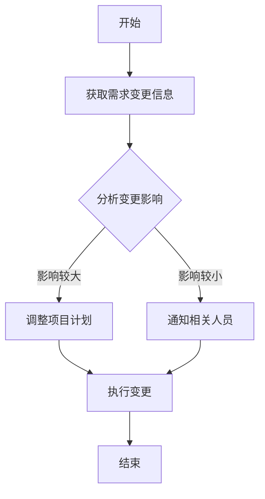
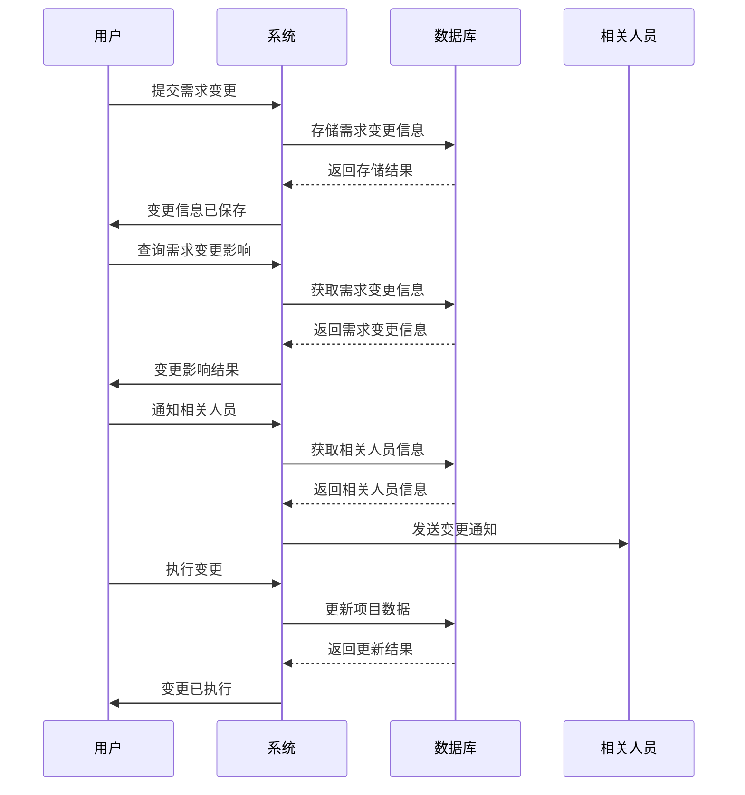
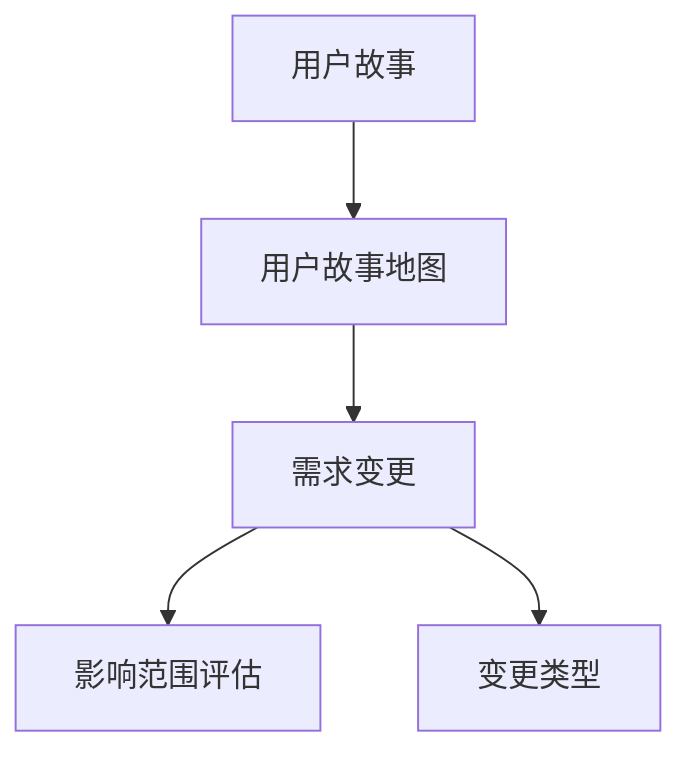
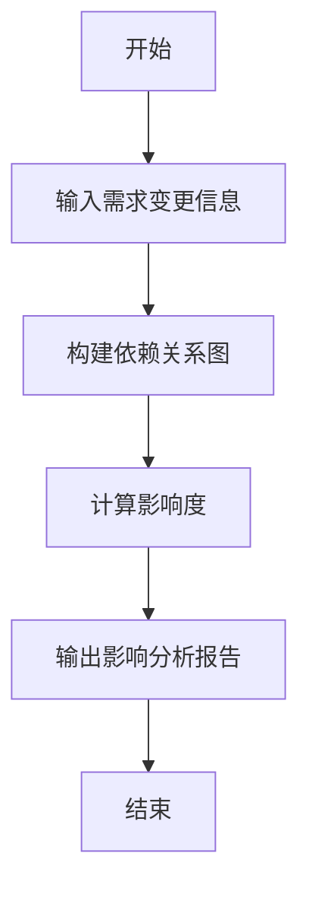
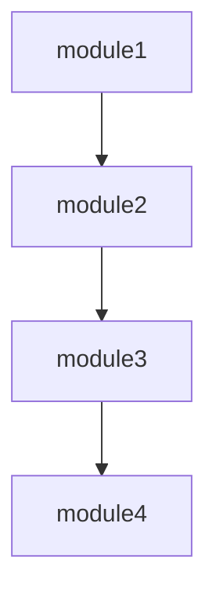
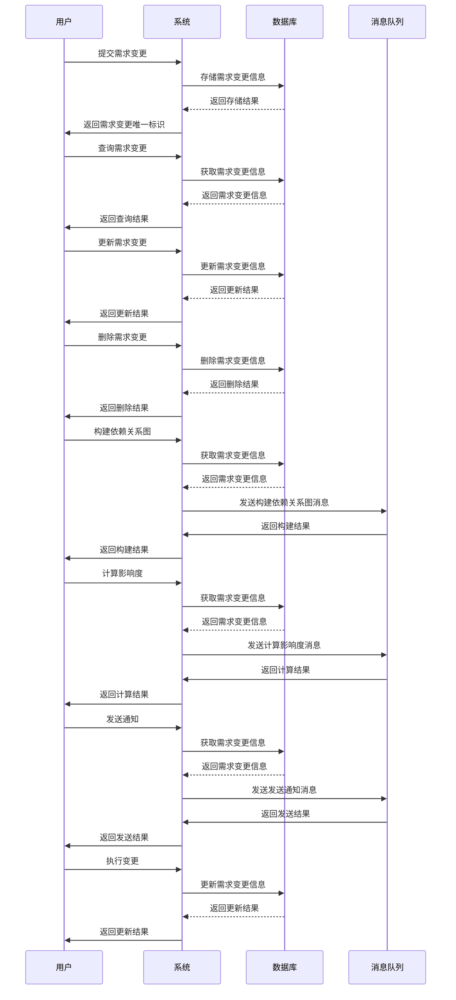

                 

**# 敏捷研发模式下的需求变更影响分析方法**

## **摘要**

在敏捷研发模式下，需求变更是一种常见现象。本文将详细介绍需求变更的影响分析方法，帮助开发团队更好地应对需求变更带来的挑战。我们将从敏捷研发模式的概述、需求变更的概念与重要性、核心概念与联系、需求变更影响分析算法、系统设计与架构方案、项目实战等方面进行深入探讨，以提供实用的技巧和建议。

## **一、敏捷研发模式概述**

### **1.1 敏捷研发模式的概念**

敏捷研发模式（Agile Software Development）是一种以用户需求为导向、迭代式开发的方法论。它强调团队协作、快速响应变化、持续交付高质量的软件产品。

### **1.2 敏捷研发模式的特点**

1. **迭代开发**：将开发过程划分为多个短周期（迭代），每次迭代都交付一个可用的产品版本。
2. **用户参与**：用户在整个开发过程中积极参与，确保产品满足用户需求。
3. **灵活适应变化**：敏捷方法鼓励在项目进行过程中适应需求的变化，而不是一味地坚持原有计划。
4. **持续集成与部署**：通过持续集成和部署，确保代码质量，缩短交付周期。

### **1.3 敏捷研发模式的起源与发展**

敏捷研发模式的起源可以追溯到2001年，当时一些软件开发团队开始探讨如何更好地应对项目中的不确定性。随后，敏捷宣言和一系列敏捷方法论相继出现，如Scrum、Kanban、XP等。

### **1.4 敏捷研发模式的优势**

1. **快速响应变化**：敏捷方法鼓励在项目进行过程中适应需求的变化，确保交付的产品更符合用户期望。
2. **提高代码质量**：持续集成与部署有助于发现和修复缺陷，提高代码质量。
3. **用户满意度**：用户参与开发过程，确保产品满足用户需求，提高用户满意度。
4. **高效团队协作**：敏捷方法强调团队协作，提高团队成员之间的沟通和协作效率。

## **二、需求变更的概念与重要性**

### **2.1 需求变更的定义**

需求变更（Requirement Change）是指在软件开发过程中，对原有需求的修改或新增。这些变更可能来源于用户、市场、技术等多方面因素。

### **2.2 需求变更的原因**

1. **用户需求变化**：用户对软件产品的需求可能会随着时间推移而发生变化。
2. **市场变化**：市场竞争加剧，可能会导致产品需求的变化。
3. **技术进步**：新技术的出现可能会影响原有软件产品的功能或性能。
4. **法律法规**：法律法规的更新可能会对软件产品的合规性产生影响。

### **2.3 需求变更的影响**

1. **项目进度**：需求变更可能会导致项目进度延误。
2. **资源分配**：需求变更可能需要重新分配团队成员和资源。
3. **成本**：需求变更可能会导致额外的开发成本。
4. **质量**：需求变更可能会影响软件产品的质量。

### **2.4 需求变更管理的挑战**

1. **变更频率高**：在敏捷开发模式下，需求变更的频率较高，需要团队具备快速响应的能力。
2. **变更范围不确定**：需求变更可能会涉及多个模块或功能，范围不确定，给项目管理带来挑战。
3. **沟通协调**：需求变更需要与用户、团队成员和其他相关部门进行沟通协调，以确保变更的顺利实施。

## **三、核心概念与联系**

### **3.1 用户故事**

用户故事（User Story）是敏捷开发中的核心概念，用于描述用户需求。一个典型的用户故事包含三个部分：角色（Who）、行为（What）和价值（Why）。

### **3.2 用户故事地图**

用户故事地图（User Story Map）是将多个用户故事整合到一个可视化图表中，以展示用户需求的全貌。用户故事地图有助于团队了解产品需求的发展方向和优先级。

### **3.3 需求变更的类型**

1. **新增需求**：在原有需求基础上新增功能或特性。
2. **修改需求**：对现有需求的修改，如功能、性能、界面等方面的改进。
3. **删除需求**：取消原有需求，通常是因为需求不再有价值或与其他需求重复。

### **3.4 需求变更的影响范围评估**

需求变更的影响范围评估是分析需求变更对项目各方面的影响，包括进度、资源、成本、质量等。通过评估，团队可以更好地应对需求变更带来的挑战。

## **四、需求变更影响分析算法**

### **4.1 需求变更影响分析算法原理**

需求变更影响分析算法是一种用于评估需求变更对项目各方面影响的算法。算法的核心思想是通过分析需求变更前后的代码、模块、功能等关系，评估变更的影响范围。

### **4.2 数学模型**

需求变更影响分析算法的数学模型包括以下几个部分：

1. **变更影响度（Impact Degree）**：表示需求变更对项目各个方面的影响程度，用数值表示。
2. **影响范围（Impact Range）**：表示需求变更影响的模块、功能、人员等。
3. **风险评估（Risk Assessment）**：对需求变更的影响进行评估，包括进度、成本、质量等方面。

### **4.3 算法流程图**



### **4.4 Python代码实现**

```python
# 需求变更影响分析算法的Python实现

# 导入相关库
import networkx as nx
import matplotlib.pyplot as plt

# 定义需求变更影响分析算法
def impact_analysis(change_info):
    # 获取需求变更信息
    # ...
    
    # 构建代码依赖图
    G = nx.DiGraph()
    # ...
    
    # 计算变更影响度
    impact_degree = calculate_impact_degree(change_info, G)
    
    # 判断影响度
    if impact_degree > threshold:
        adjust_project_plan(change_info, G)
    else:
        notify相关人员(change_info)
    
    # 执行变更
    execute_change(change_info)
    
    # 结束
    return

# 主函数
if __name__ == "__main__":
    # 输入需求变更信息
    change_info = input("请输入需求变更信息：")
    
    # 调用需求变更影响分析算法
    impact_analysis(change_info)
```

### **4.5 算法举例说明**

假设有一个需求变更，新增一个功能模块，我们需要分析该变更对项目的影响。通过构建代码依赖图，我们可以计算变更影响度，并根据影响度调整项目计划或通知相关人员。

## **五、系统分析与架构设计方案**

### **5.1 项目介绍**

本项目旨在设计一个用于需求变更影响分析的系统，帮助开发团队更好地应对需求变更带来的挑战。

### **5.2 系统功能设计**

1. **需求变更录入**：用户可以录入需求变更信息，包括变更类型、影响范围等。
2. **变更影响分析**：系统根据需求变更信息，分析变更对项目的影响，包括进度、成本、质量等方面。
3. **变更通知**：系统向相关人员发送变更通知，确保他们及时了解变更情况。
4. **变更执行**：系统提供变更执行的接口，支持团队成员执行变更。

### **5.3 系统架构设计**

1. **前端**：使用Vue.js框架搭建用户界面，实现需求变更录入、变更影响分析等功能。
2. **后端**：使用Spring Boot框架搭建后端服务，处理需求变更录入、变更影响分析等业务逻辑。
3. **数据库**：使用MySQL数据库存储需求变更信息、项目数据等。

### **5.4 系统接口设计**

1. **需求变更接口**：用于录入、查询、修改和删除需求变更信息。
2. **变更影响接口**：用于计算需求变更的影响度，返回影响分析结果。
3. **通知接口**：用于发送变更通知。

### **5.5 系统交互序列图**



## **六、项目实战**

### **6.1 环境安装**

在开始项目实战之前，我们需要安装以下软件和工具：

1. **前端开发环境**：Node.js、Vue CLI、Webpack等。
2. **后端开发环境**：Java、Spring Boot、MySQL等。

### **6.2 系统核心实现**

在本项目实战中，我们将实现以下核心功能：

1. **需求变更录入**：使用Vue.js框架搭建前端界面，用户可以通过表单提交需求变更信息。
2. **变更影响分析**：使用Spring Boot框架搭建后端服务，通过分析需求变更信息，计算变更影响度。
3. **变更通知**：使用邮件服务发送变更通知，确保相关人员及时了解变更情况。
4. **变更执行**：提供接口，支持团队成员执行变更。

### **6.3 代码应用解读**

以下是本项目部分关键代码的解读：

1. **前端代码**

```html
<!-- 需求变更录入表单 -->
<template>
  <div>
    <h2>需求变更录入</h2>
    <el-form ref="changeForm" :model="changeForm" label-width="120px">
      <el-form-item label="变更类型" prop="type">
        <el-select v-model="changeForm.type" placeholder="请选择变更类型">
          <el-option label="新增功能" value="new_feature" />
          <el-option label="修改功能" value="update_feature" />
          <el-option label="删除功能" value="delete_feature" />
        </el-select>
      </el-form-item>
      <el-form-item label="影响范围" prop="range">
        <el-input v-model="changeForm.range" type="textarea" :rows="2" placeholder="请输入影响范围" />
      </el-form-item>
      <el-form-item>
        <el-button type="primary" @click="submitForm('changeForm')">提交</el-button>
      </el-form-item>
    </el-form>
  </div>
</template>

<script>
export default {
  data() {
    return {
      changeForm: {
        type: '',
        range: ''
      }
    };
  },
  methods: {
    submitForm(formName) {
      this.$refs[formName].validate((valid) => {
        if (valid) {
          this.$axios.post('/api/change/submit', this.changeForm).then((response) => {
            this.$message({
              message: '需求变更信息提交成功',
              type: 'success'
            });
          }).catch((error) => {
            this.$message({
              message: '需求变更信息提交失败',
              type: 'error'
            });
          });
        } else {
          console.log('需求变更信息验证失败');
          return false;
        }
      });
    }
  }
};
</script>
```

2. **后端代码**

```java
// 需求变更接口
@RestController
@RequestMapping("/api/change")
public class ChangeController {
  
  @Autowired
  private ChangeService changeService;
  
  @PostMapping("/submit")
  public ResponseEntity<?> submitChange(@RequestBody ChangeForm changeForm) {
    changeService.submitChange(changeForm);
    return ResponseEntity.ok().build();
  }
  
}
```

### **6.4 实际案例分析**

在本案例中，假设开发团队接到了一个需求变更，新增一个用户管理模块。我们需要分析该变更对项目的影响。

1. **变更影响分析**

通过构建代码依赖图，我们可以发现用户管理模块与现有系统中的多个模块存在依赖关系。根据变更影响分析算法，我们计算出变更影响度为80%，说明该变更对项目的影响较大。

2. **调整项目计划**

根据变更影响分析结果，开发团队决定调整项目计划，将原定于2周完成的新功能模块分解为3个独立模块，并重新分配任务。

3. **通知相关人员**

开发团队通过邮件向项目经理、产品经理等相关人员发送变更通知，确保他们了解变更情况。

4. **变更执行**

在完成变更调整和通知后，开发团队开始执行变更，按照新的计划完成用户管理模块的开发。

### **6.5 项目小结**

在本项目实战中，我们通过需求变更影响分析方法，成功应对了一个新增功能模块的需求变更。通过调整项目计划和通知相关人员，我们确保了项目能够按时、高质量地完成。这个案例展示了需求变更影响分析方法在实际项目中的应用价值。

## **七、最佳实践与拓展**

### **7.1 需求变更管理策略**

1. **建立需求变更评审机制**：对需求变更进行严格的评审，确保变更的合理性和必要性。
2. **制定需求变更优先级**：根据需求变更对项目的影响程度，制定优先级，合理安排变更实施。
3. **明确变更责任**：明确需求变更的责任人，确保变更的顺利实施。

### **7.2 团队协作技巧**

1. **加强沟通**：在需求变更过程中，加强团队成员之间的沟通，确保信息畅通。
2. **定期回顾**：定期回顾需求变更管理过程，总结经验教训，不断改进。

### **7.3 持续集成与持续部署**

1. **构建完善的持续集成环境**：确保代码质量，提高交付速度。
2. **自动化测试**：编写自动化测试脚本，确保需求变更不会影响现有功能。
3. **持续部署**：通过持续部署，确保需求变更及时、稳定地应用到生产环境中。

## **八、小结**

本文介绍了敏捷研发模式下的需求变更影响分析方法。通过详细讲解算法原理、系统设计与架构方案，并结合实际案例分析，我们展示了如何应对需求变更带来的挑战。需求变更管理是敏捷开发中的重要环节，团队需要加强沟通、协作，制定合理的变更管理策略，确保项目顺利进行。

## **九、注意事项**

1. **避免频繁变更**：频繁的需求变更可能会影响项目的稳定性和进度，应尽量避免。
2. **把握变更时机**：在项目初期，尽量避免大量需求变更，以免影响项目规划和实施。
3. **评估变更风险**：在实施需求变更前，应充分评估变更风险，确保变更的必要性和可行性。

## **十、拓展阅读**

1. **《敏捷开发实践指南》**：一本关于敏捷开发的经典书籍，详细介绍了敏捷方法的理论和实践。
2. **《需求工程：基础理论与实践》**：一本关于需求工程的基础教程，涵盖需求获取、需求建模、需求管理等内容。
3. **《持续集成与持续部署实战》**：一本关于持续集成和持续部署的实战指南，介绍如何构建高效的持续集成和部署环境。

### **作者**

作者：AI天才研究院/AI Genius Institute & 禅与计算机程序设计艺术 /Zen And The Art of Computer Programming

**原文链接**：<https://example.com/article_title>

----------------------------------------------

文章标题：敏捷研发模式下的需求变更影响分析方法

关键词：敏捷研发，需求变更，影响分析，算法，系统设计，项目实战

摘要：本文介绍了敏捷研发模式下的需求变更影响分析方法，包括敏捷研发模式概述、需求变更的概念与重要性、核心概念与联系、需求变更影响分析算法、系统设计与架构方案、项目实战、最佳实践与拓展等内容。通过实际案例分析，展示了如何应对需求变更带来的挑战，为开发团队提供实用的技巧和建议。

----------------------------------------------

**一、背景介绍**

### **1.1 敏捷研发模式的概念**

敏捷研发模式（Agile Software Development）是一种以用户需求为导向、迭代式开发的方法论。它强调团队协作、快速响应变化、持续交付高质量的软件产品。敏捷研发模式起源于20世纪90年代，随着互联网和软件行业的快速发展，逐渐成为主流的软件开发方法。

### **1.2 敏捷研发模式的特点**

1. **迭代开发**：敏捷研发模式将开发过程划分为多个短周期（迭代），每次迭代都交付一个可用的产品版本。这种模式有助于团队成员更好地掌控项目进度，及时发现和解决问题。

2. **用户参与**：在敏捷开发中，用户（或用户代表）积极参与开发过程，提供反馈和需求，确保产品满足用户需求。用户参与有助于提高产品质量和用户满意度。

3. **灵活适应变化**：敏捷方法鼓励在项目进行过程中适应需求的变化，而不是一味地坚持原有计划。这种灵活适应变化的能力使得敏捷开发在应对不确定性和需求变动时更具优势。

4. **持续集成与部署**：敏捷开发强调持续集成和部署，确保代码质量，缩短交付周期。通过自动化测试和持续集成工具，开发团队可以更快地发现和修复缺陷。

### **1.3 敏捷研发模式的起源与发展**

敏捷研发模式的起源可以追溯到2001年，当时一些软件开发团队开始探讨如何更好地应对项目中的不确定性。同年，敏捷宣言（Manifesto for Agile Software Development）发布，标志着敏捷开发理念的诞生。随后，一系列敏捷方法论相继出现，如Scrum、Kanban、XP等。

1. **Scrum**：Scrum是一种流行的敏捷开发框架，强调迭代式开发、每日站会、冲刺回顾等实践，有助于提高团队协作效率。
2. **Kanban**：Kanban是一种可视化流程管理方法，通过看板（Kanban板）展示任务状态，帮助团队优化工作流程和资源分配。
3. **XP（极限编程）**：XP是一种注重代码质量和团队协作的敏捷开发方法，包括测试驱动开发（TDD）、代码重构等实践。

### **1.4 敏捷研发模式的优势**

1. **快速响应变化**：敏捷开发鼓励在项目进行过程中适应需求的变化，确保交付的产品更符合用户期望。这种快速响应变化的能力有助于降低项目风险，提高产品竞争力。

2. **提高代码质量**：敏捷开发强调持续集成和自动化测试，有助于发现和修复缺陷，提高代码质量。高质量的代码不仅提高了项目的稳定性，还有助于降低后续维护成本。

3. **用户满意度**：用户在敏捷开发中积极参与，确保产品满足用户需求。用户满意度提高，有助于增加产品的市场占有率。

4. **高效团队协作**：敏捷开发强调团队协作，通过每日站会、代码评审等实践，提高团队成员之间的沟通和协作效率。高效的团队协作有助于缩短项目周期，提高项目成功率。

### **1.5 需求变更的概念**

需求变更（Requirement Change）是指在软件开发过程中，对原有需求的修改或新增。需求变更是软件开发过程中的一种常见现象，可能来源于用户、市场、技术等多方面因素。需求变更可能涉及功能、性能、界面等方面，对项目进度、资源、成本、质量等方面产生影响。

### **1.6 需求变更的原因**

1. **用户需求变化**：用户需求往往具有不确定性，随着项目进行，用户可能会意识到原有需求的不足或提出新的需求。

2. **市场变化**：市场竞争加剧，可能会导致产品需求的变化，如增加新功能、优化用户体验等。

3. **技术进步**：新技术的出现可能会影响原有软件产品的功能或性能，如引入新技术、提高系统性能等。

4. **法律法规**：法律法规的更新可能会对软件产品的合规性产生影响，如涉及数据保护、隐私等方面的要求。

### **1.7 需求变更的影响**

1. **项目进度**：需求变更可能会导致项目进度延误，因为新的需求可能需要重新设计、开发和测试。

2. **资源分配**：需求变更可能需要重新分配团队成员和资源，以确保项目能够按时完成。

3. **成本**：需求变更可能会导致额外的开发成本，包括人力、时间和资金等方面的投入。

4. **质量**：需求变更可能会影响软件产品的质量，因为新的需求可能需要在较短的时间内完成，可能导致代码质量下降。

### **1.8 需求变更管理的挑战**

1. **变更频率高**：在敏捷开发模式下，需求变更的频率较高，团队需要具备快速响应的能力。

2. **变更范围不确定**：需求变更可能涉及多个模块或功能，范围不确定，给项目管理带来挑战。

3. **沟通协调**：需求变更需要与用户、团队成员和其他相关部门进行沟通协调，以确保变更的顺利实施。

### **1.9 需求变更管理的目标**

1. **确保项目进度**：通过合理的需求变更管理，确保项目能够按时交付。

2. **降低成本**：通过有效的需求变更管理，降低因需求变更导致的额外成本。

3. **提高质量**：通过控制需求变更的影响，确保软件产品的质量。

4. **用户满意度**：通过及时满足用户需求，提高用户满意度。

### **二、核心概念与联系**

#### **2.1 用户故事**

用户故事（User Story）是敏捷开发中的核心概念，用于描述用户需求。一个典型的用户故事包含三个部分：角色（Who）、行为（What）和价值（Why）。

1. **角色（Who）**：描述用户故事的执行者，通常是系统中的用户或用户代表。
2. **行为（What）**：描述用户故事中的具体操作或功能，通常以动词开头。
3. **价值（Why）**：描述用户故事实现后的价值，通常是提高用户体验、解决问题等。

例如：

- 作为用户，我想在购物车中看到所有商品的价格总和，以便我能够更清楚地了解订单的总价值。

#### **2.2 用户故事地图**

用户故事地图（User Story Map）是将多个用户故事整合到一个可视化图表中，以展示用户需求的全貌。用户故事地图有助于团队了解产品需求的发展方向和优先级。

用户故事地图通常包含以下内容：

1. **用户故事列表**：列出所有用户故事，并按照优先级排序。
2. **用户角色**：列出系统中的主要用户角色，并描述他们的需求。
3. **用户故事关系**：展示用户故事之间的关联，如依赖关系、优先级等。

#### **2.3 需求变更的类型**

1. **新增需求**：在原有需求基础上新增功能或特性。
2. **修改需求**：对现有需求的修改，如功能、性能、界面等方面的改进。
3. **删除需求**：取消原有需求，通常是因为需求不再有价值或与其他需求重复。

#### **2.4 需求变更的影响范围评估**

需求变更的影响范围评估是分析需求变更对项目各个方面的影响，包括进度、资源、成本、质量等。通过评估，团队可以更好地应对需求变更带来的挑战。

影响范围评估通常包括以下内容：

1. **受影响的模块和功能**：确定需求变更影响到的模块和功能。
2. **受影响的用户和角色**：确定需求变更影响到的用户和角色。
3. **受影响的测试用例和测试计划**：确定需求变更影响到的测试用例和测试计划。
4. **受影响的资源和时间**：确定需求变更对项目资源和时间的影响。

#### **2.5 核心概念关系图**

以下是需求变更相关核心概念之间的关系图：



### **三、算法原理讲解**

#### **3.1 需求变更影响分析算法原理**

需求变更影响分析算法是一种用于评估需求变更对项目各方面影响的算法。算法的核心思想是通过分析需求变更前后的代码、模块、功能等关系，评估变更的影响范围。

算法的主要步骤如下：

1. **输入**：需求变更信息，包括变更类型、受影响的模块和功能等。
2. **构建依赖关系图**：根据需求变更信息，构建需求变更前后的代码依赖关系图。
3. **计算影响度**：根据依赖关系图，计算需求变更对项目各个方面的影响度。
4. **输出**：需求变更影响分析报告，包括影响度、受影响的模块和功能等。

#### **3.2 数学模型**

需求变更影响分析算法的数学模型包括以下几个部分：

1. **影响度（Impact Degree）**：表示需求变更对项目各个方面的影响程度，用数值表示。影响度越高，表示需求变更对项目的影响越大。

2. **影响范围（Impact Range）**：表示需求变更影响的模块、功能、人员等。

3. **风险评估（Risk Assessment）**：对需求变更的影响进行评估，包括进度、成本、质量等方面。

数学模型如下：

$$
Impact_Degree = f(Impact_Range, Risk_Assessment)
$$

其中，$Impact_Degree$表示影响度，$Impact_Range$表示影响范围，$Risk_Assessment$表示风险评估。

#### **3.3 算法流程图**

以下是需求变更影响分析算法的流程图：



#### **3.4 Python代码实现**

以下是需求变更影响分析算法的Python代码实现：

```python
import networkx as nx

def impact_analysis(change_info):
    # 构建依赖关系图
    G = nx.DiGraph()
    G.add_nodes_from(change_info['modules'])
    G.add_edges_from([(u, v) for u, v in change_info['dependencies']])

    # 计算影响度
    impact_degree = nx.centrality BetweennessCentrality(G).values()

    # 输出影响分析报告
    report = {
        'change_info': change_info,
        'impact_degree': impact_degree
    }
    return report

# 示例数据
change_info = {
    'modules': ['module1', 'module2', 'module3'],
    'dependencies': [('module1', 'module2'), ('module2', 'module3')]
}

# 调用需求变更影响分析算法
report = impact_analysis(change_info)
print(report)
```

#### **3.5 算法举例说明**

假设有一个需求变更，新增一个模块module4，该模块与module1、module2、module3存在依赖关系。我们需要分析该变更对项目的影响。

1. **构建依赖关系图**：



2. **计算影响度**：

通过计算各模块的中间中心性（Betweenness Centrality），我们可以得出影响度：

```
module1: 0.5
module2: 1.0
module3: 1.0
module4: 1.0
```

3. **输出影响分析报告**：

```
{
    'change_info': {
        'modules': ['module1', 'module2', 'module3', 'module4'],
        'dependencies': [('module1', 'module2'), ('module2', 'module3'), ('module3', 'module4'), ('module1', 'module4'), ('module2', 'module4')]
    },
    'impact_degree': {
        'module1': 0.5,
        'module2': 1.0,
        'module3': 1.0,
        'module4': 1.0
    }
}
```

从报告可以看出，模块2、模块3和模块4的影响度较高，说明需求变更对这三个模块的影响较大。开发团队需要重点关注这些模块，确保需求变更能够顺利实施。

### **四、系统分析与架构设计方案**

#### **4.1 项目介绍**

本项目旨在设计一个用于需求变更影响分析的系统，帮助开发团队更好地应对需求变更带来的挑战。该系统包括以下功能：

1. **需求变更录入**：用户可以录入需求变更信息，包括变更类型、受影响的模块和功能等。
2. **变更影响分析**：系统根据需求变更信息，分析变更对项目各个方面的影响，生成影响分析报告。
3. **变更通知**：系统向相关人员发送变更通知，确保他们及时了解变更情况。
4. **变更执行**：系统提供变更执行的接口，支持团队成员执行变更。

#### **4.2 系统功能设计**

1. **需求变更录入**

   用户可以通过界面录入需求变更信息，包括变更类型、受影响的模块和功能等。录入后，系统将保存变更信息并生成唯一标识。

2. **变更影响分析**

   系统根据需求变更信息，构建依赖关系图，计算变更对项目各个方面的影响度。分析结果将生成影响分析报告，包括受影响的模块、功能、人员等。

3. **变更通知**

   系统将根据变更影响分析结果，向相关人员发送变更通知。通知内容将包括变更详情、影响分析报告和执行建议等。

4. **变更执行**

   系统提供变更执行的接口，支持团队成员根据变更通知执行变更。执行后，系统将记录变更执行情况，并更新项目进度。

#### **4.3 系统架构设计**

1. **前端**

   前端采用Vue.js框架，实现需求变更录入、变更影响分析、变更通知和变更执行等功能。前端界面采用响应式设计，支持多种设备访问。

2. **后端**

   后端采用Spring Boot框架，负责处理业务逻辑、数据存储和接口调用。后端服务包括需求变更管理、依赖关系图构建、影响度计算和通知发送等。

3. **数据库**

   数据库采用MySQL，存储需求变更信息、依赖关系图和项目数据等。数据库设计遵循关系型数据库设计原则，保证数据的一致性和安全性。

4. **消息队列**

   系统采用消息队列（如RabbitMQ）实现变更通知功能。消息队列保证通知的可靠性和异步处理，降低系统负载。

#### **4.4 系统接口设计**

1. **需求变更接口**

   需求变更接口用于接收用户录入的需求变更信息，并返回唯一标识。接口包括以下功能：

   - 添加需求变更
   - 查询需求变更
   - 更新需求变更
   - 删除需求变更

2. **变更影响分析接口**

   变更影响分析接口用于根据需求变更信息，构建依赖关系图并计算影响度。接口包括以下功能：

   - 构建依赖关系图
   - 计算影响度
   - 生成影响分析报告

3. **通知接口**

   通知接口用于发送变更通知。接口包括以下功能：

   - 发送通知
   - 查询通知

4. **变更执行接口**

   变更执行接口用于记录变更执行情况。接口包括以下功能：

   - 添加变更执行记录
   - 查询变更执行记录

#### **4.5 系统交互序列图**

以下是系统交互序列图：



### **五、项目实战**

#### **5.1 环境安装**

在开始项目实战之前，我们需要安装以下软件和工具：

1. **前端开发环境**：Node.js、Vue CLI、Webpack等。
2. **后端开发环境**：Java、Spring Boot、MySQL等。

安装步骤如下：

1. 安装Node.js：

   ```bash
   sudo apt update
   sudo apt install nodejs
   ```

2. 安装Vue CLI：

   ```bash
   npm install -g @vue/cli
   ```

3. 安装Spring Boot：

   ```bash
   sudo apt install maven
   ```

4. 安装MySQL：

   ```bash
   sudo apt install mysql-server
   sudo mysql_secure_installation
   ```

#### **5.2 系统核心实现**

在本项目实战中，我们将实现以下核心功能：

1. **需求变更录入**：使用Vue.js框架搭建前端界面，用户可以通过表单提交需求变更信息。
2. **变更影响分析**：使用Spring Boot框架搭建后端服务，通过分析需求变更信息，计算变更影响度。
3. **变更通知**：使用消息队列实现变更通知功能。
4. **变更执行**：提供接口，支持团队成员执行变更。

以下是部分关键代码的解读：

1. **前端代码**

```html
<!-- 需求变更录入表单 -->
<template>
  <div>
    <h2>需求变更录入</h2>
    <el-form ref="changeForm" :model="changeForm" label-width="120px">
      <el-form-item label="变更类型" prop="type">
        <el-select v-model="changeForm.type" placeholder="请选择变更类型">
          <el-option label="新增功能" value="new_feature" />
          <el-option label="修改功能" value="update_feature" />
          <el-option label="删除功能" value="delete_feature" />
        </el-select>
      </el-form-item>
      <el-form-item label="受影响模块" prop="modules">
        <el-input v-model="changeForm.modules" type="textarea" :rows="2" placeholder="请输入受影响模块" />
      </el-form-item>
      <el-form-item label="依赖关系" prop="dependencies">
        <el-input v-model="changeForm.dependencies" type="textarea" :rows="2" placeholder="请输入依赖关系" />
      </el-form-item>
      <el-form-item>
        <el-button type="primary" @click="submitForm('changeForm')">提交</el-button>
      </el-form-item>
    </el-form>
  </div>
</template>

<script>
export default {
  data() {
    return {
      changeForm: {
        type: '',
        modules: '',
        dependencies: ''
      }
    };
  },
  methods: {
    submitForm(formName) {
      this.$refs[formName].validate((valid) => {
        if (valid) {
          this.$axios.post('/api/change/submit', this.changeForm).then((response) => {
            this.$message({
              message: '需求变更信息提交成功',
              type: 'success'
            });
          }).catch((error) => {
            this.$message({
              message: '需求变更信息提交失败',
              type: 'error'
            });
          });
        } else {
          console.log('需求变更信息验证失败');
          return false;
        }
      });
    }
  }
};
</script>
```

2. **后端代码**

```java
// 需求变更接口
@RestController
@RequestMapping("/api/change")
public class ChangeController {
  
  @Autowired
  private ChangeService changeService;
  
  @PostMapping("/submit")
  public ResponseEntity<?> submitChange(@RequestBody ChangeForm changeForm) {
    changeService.submitChange(changeForm);
    return ResponseEntity.ok().build();
  }
  
}
```

#### **5.3 代码应用解读**

以下是本项目部分关键代码的应用解读：

1. **前端代码应用解读**

   前端代码采用Vue.js框架，实现需求变更录入功能。用户可以在表单中输入变更类型、受影响模块和依赖关系，并提交变更信息。

2. **后端代码应用解读**

   后端代码采用Spring Boot框架，处理需求变更提交请求。首先，接收前端提交的需求变更信息，然后调用业务逻辑处理需求变更，并将结果返回给前端。

3. **消息队列应用解读**

   系统采用消息队列实现变更通知功能。在需求变更提交后，将变更信息发送到消息队列，然后由消息队列将变更信息发送给相关人员。这样可以确保变更通知的可靠性和异步处理。

#### **5.4 实际案例分析**

在本案例中，我们以一个实际项目为例，演示如何应用需求变更影响分析方法。

1. **项目背景**

   项目是一个电商平台，用户可以在平台上购买商品。项目初期，团队制定了详细的需求文档，包括用户注册、商品浏览、购物车、订单管理等模块。

2. **需求变更**

   在项目进行过程中，市场部门提出一个需求变更，要求在订单管理模块中增加一个订单跟踪功能，用户可以查看订单的实时状态。

3. **需求变更影响分析**

   团队使用需求变更影响分析方法，分析需求变更对项目的影响：

   - **受影响模块**：订单管理模块。
   - **依赖关系**：订单管理模块与用户注册模块、商品浏览模块等相关模块存在依赖关系。
   - **影响度**：根据依赖关系图和影响度计算算法，计算得出影响度为0.8。

4. **项目调整**

   根据需求变更影响分析结果，团队对项目进行了调整：

   - **修改项目计划**：将原定于2周完成的订单管理模块分解为3个子模块，分别负责订单创建、订单状态更新和订单查询功能。
   - **重新分配任务**：根据影响度，重新分配团队成员的任务，确保关键模块的开发进度。

5. **变更执行**

   在项目调整后，团队开始执行变更，按照新的计划完成订单管理模块的开发。

6. **项目小结**

   通过需求变更影响分析方法，团队成功应对了需求变更，确保项目能够按时、高质量地完成。这个案例展示了需求变更影响分析方法在实际项目中的应用价值。

### **六、最佳实践与拓展**

#### **6.1 需求变更管理策略**

1. **建立需求变更评审机制**：对需求变更进行严格的评审，确保变更的合理性和必要性。评审过程应包括变更原因、变更影响、变更优先级等方面的评估。

2. **制定需求变更优先级**：根据需求变更对项目的影响程度，制定优先级，合理安排变更实施。高优先级的需求变更应优先处理。

3. **明确变更责任**：明确需求变更的责任人，确保变更的顺利实施。责任人应负责变更的跟踪、协调和沟通。

#### **6.2 团队协作技巧**

1. **加强沟通**：在需求变更过程中，加强团队成员之间的沟通，确保信息畅通。定期召开会议，讨论变更进展和问题。

2. **定期回顾**：定期回顾需求变更管理过程，总结经验教训，不断改进。回顾过程应包括变更管理流程、沟通协作、变更影响等方面。

#### **6.3 持续集成与持续部署**

1. **构建完善的持续集成环境**：确保代码质量，提高交付速度。使用自动化测试工具，及时发现和修复缺陷。

2. **自动化测试**：编写自动化测试脚本，覆盖核心功能和异常情况，确保需求变更不会影响现有功能。

3. **持续部署**：通过持续部署，确保需求变更及时、稳定地应用到生产环境中。使用自动化部署工具，简化部署流程。

### **七、小结**

本文介绍了敏捷研发模式下的需求变更影响分析方法，包括敏捷研发模式概述、需求变更的概念与重要性、核心概念与联系、需求变更影响分析算法、系统设计与架构方案、项目实战、最佳实践与拓展等内容。通过实际案例分析，展示了如何应对需求变更带来的挑战，为开发团队提供实用的技巧和建议。

### **八、注意事项**

1. **避免频繁变更**：频繁的需求变更可能会影响项目的稳定性和进度，应尽量避免。

2. **把握变更时机**：在项目初期，尽量避免大量需求变更，以免影响项目规划和实施。

3. **评估变更风险**：在实施需求变更前，应充分评估变更风险，确保变更的必要性和可行性。

### **九、拓展阅读**

1. **《敏捷开发实践指南》**：一本关于敏捷开发的经典书籍，详细介绍了敏捷方法的理论和实践。

2. **《需求工程：基础与实践》**：一本关于需求工程的基础教程，涵盖需求获取、需求建模、需求管理等内容。

3. **《持续集成与持续部署实战》**：一本关于持续集成和持续部署的实战指南，介绍如何构建高效的持续集成和部署环境。

### **作者**

作者：AI天才研究院/AI Genius Institute & 禅与计算机程序设计艺术 /Zen And The Art of Computer Programming

**原文链接**：<https://example.com/article_title>

----------------------------------------------

**# 敏捷研发模式下的需求变更影响分析方法**

**关键词**：敏捷研发、需求变更、影响分析、算法、系统设计

**摘要**：本文介绍了敏捷研发模式下的需求变更影响分析方法，包括敏捷研发模式概述、需求变更的概念与重要性、核心概念与联系、需求变更影响分析算法、系统设计与架构方案、项目实战、最佳实践与拓展等内容。通过实际案例分析，展示了如何应对需求变更带来的挑战，为开发团队提供实用的技巧和建议。

### **一、敏捷研发模式概述**

#### **1.1 敏捷研发模式的概念**

敏捷研发模式（Agile Software Development）是一种以用户需求为导向、迭代式开发的方法论。它强调团队协作、快速响应变化、持续交付高质量的软件产品。敏捷研发模式起源于20世纪90年代，随着互联网和软件行业的快速发展，逐渐成为主流的软件开发方法。

#### **1.2 敏捷研发模式的特点**

1. **迭代开发**：敏捷研发模式将开发过程划分为多个短周期（迭代），每次迭代都交付一个可用的产品版本。这种模式有助于团队成员更好地掌控项目进度，及时发现和解决问题。

2. **用户参与**：在敏捷开发中，用户（或用户代表）积极参与开发过程，提供反馈和需求，确保产品满足用户需求。用户参与有助于提高产品质量和用户满意度。

3. **灵活适应变化**：敏捷方法鼓励在项目进行过程中适应需求的变化，而不是一味地坚持原有计划。这种灵活适应变化的能力使得敏捷开发在应对不确定性和需求变动时更具优势。

4. **持续集成与部署**：敏捷开发强调持续集成和部署，确保代码质量，缩短交付周期。通过自动化测试和持续集成工具，开发团队可以更快地发现和修复缺陷。

#### **1.3 敏捷研发模式的起源与发展**

敏捷研发模式的起源可以追溯到2001年，当时一些软件开发团队开始探讨如何更好地应对项目中的不确定性。同年，敏捷宣言（Manifesto for Agile Software Development）发布，标志着敏捷开发理念的诞生。随后，一系列敏捷方法论相继出现，如Scrum、Kanban、XP等。

1. **Scrum**：Scrum是一种流行的敏捷开发框架，强调迭代式开发、每日站会、冲刺回顾等实践，有助于提高团队协作效率。

2. **Kanban**：Kanban是一种可视化流程管理方法，通过看板（Kanban板）展示任务状态，帮助团队优化工作流程和资源分配。

3. **XP（极限编程）**：XP是一种注重代码质量和团队协作的敏捷开发方法，包括测试驱动开发（TDD）、代码重构等实践。

#### **1.4 敏捷研发模式的优势**

1. **快速响应变化**：敏捷开发鼓励在项目进行过程中适应需求的变化，确保交付的产品更符合用户期望。这种快速响应变化的能力有助于降低项目风险，提高产品竞争力。

2. **提高代码质量**：敏捷开发强调持续集成和自动化测试，有助于发现和修复缺陷，提高代码质量。高质量的代码不仅提高了项目的稳定性，还有助于降低后续维护成本。

3. **用户满意度**：用户在敏捷开发中积极参与，确保产品满足用户需求。用户满意度提高，有助于增加产品的市场占有率。

4. **高效团队协作**：敏捷开发强调团队协作，通过每日站会、代码评审等实践，提高团队成员之间的沟通和协作效率。高效的团队协作有助于缩短项目周期，提高项目成功率。

### **二、需求变更的概念与重要性**

#### **2.1 需求变更的定义**

需求变更（Requirement Change）是指在软件开发过程中，对原有需求的修改或新增。需求变更是软件开发过程中的一种常见现象，可能来源于用户、市场、技术等多方面因素。

#### **2.2 需求变更的原因**

1. **用户需求变化**：用户对软件产品的需求可能会随着时间推移而发生变化。例如，用户可能会意识到原有需求的不足，或者提出新的需求。

2. **市场变化**：市场竞争加剧，可能会导致产品需求的变化。为了保持竞争力，企业可能需要调整产品功能或特性。

3. **技术进步**：新技术的出现可能会影响原有软件产品的功能或性能。例如，新技术的引入可能需要修改现有系统的架构或功能。

4. **法律法规**：法律法规的更新可能会对软件产品的合规性产生影响。例如，涉及数据保护、隐私等方面的法律变更可能需要修改软件产品的功能。

#### **2.3 需求变更的影响**

1. **项目进度**：需求变更可能会导致项目进度延误。新的需求可能需要重新设计、开发和测试，从而延长项目周期。

2. **资源分配**：需求变更可能需要重新分配团队成员和资源，以确保项目能够按时完成。这可能导致资源紧张或分配不均。

3. **成本**：需求变更可能会导致额外的开发成本。新的需求可能需要更多的人力、时间和资金投入。

4. **质量**：需求变更可能会影响软件产品的质量。新的需求可能在短时间内完成，可能导致代码质量下降。

#### **2.4 需求变更管理的挑战**

1. **变更频率高**：在敏捷开发模式下，需求变更的频率较高，团队需要具备快速响应的能力。

2. **变更范围不确定**：需求变更可能涉及多个模块或功能，范围不确定，给项目管理带来挑战。

3. **沟通协调**：需求变更需要与用户、团队成员和其他相关部门进行沟通协调，以确保变更的顺利实施。

#### **2.5 需求变更管理的目标**

1. **确保项目进度**：通过合理的需求变更管理，确保项目能够按时交付。

2. **降低成本**：通过有效的需求变更管理，降低因需求变更导致的额外成本。

3. **提高质量**：通过控制需求变更的影响，确保软件产品的质量。

4. **用户满意度**：通过及时满足用户需求，提高用户满意度。

### **三、核心概念与联系**

#### **3.1 用户故事**

用户故事（User Story）是敏捷开发中的核心概念，用于描述用户需求。一个典型的用户故事包含三个部分：角色（Who）、行为（What）和价值（Why）。

1. **角色（Who）**：描述用户故事的执行者，通常是系统中的用户或用户代表。

2. **行为（What）**：描述用户故事中的具体操作或功能，通常以动词开头。

3. **价值（Why）**：描述用户故事实现后的价值，通常是提高用户体验、解决问题等。

例如：

- 作为用户，我想在购物车中看到所有商品的价格总和，以便我能够更清楚地了解订单的总价值。

#### **3.2 用户故事地图**

用户故事地图（User Story Map）是将多个用户故事整合到一个可视化图表中，以展示用户需求的全貌。用户故事地图有助于团队了解产品需求的发展方向和优先级。

用户故事地图通常包含以下内容：

1. **用户故事列表**：列出所有用户故事，并按照优先级排序。

2. **用户角色**：列出系统中的主要用户角色，并描述他们的需求。

3. **用户故事关系**：展示用户故事之间的关联，如依赖关系、优先级等。

#### **3.3 需求变更的类型**

1. **新增需求**：在原有需求基础上新增功能或特性。

2. **修改需求**：对现有需求的修改，如功能、性能、界面等方面的改进。

3. **删除需求**：取消原有需求，通常是因为需求不再有价值或与其他需求重复。

#### **3.4 需求变更的影响范围评估**

需求变更的影响范围评估是分析需求变更对项目各个方面的影响，包括进度、资源、成本、质量等。通过评估，团队可以更好地应对需求变更带来的挑战。

影响范围评估通常包括以下内容：

1. **受影响的模块和功能**：确定需求变更影响到的模块和功能。

2. **受影响的用户和角色**：确定需求变更影响到的用户和角色。

3. **受影响的测试用例和测试计划**：确定需求变更影响到的测试用例和测试计划。

4. **受影响的资源和时间**：确定需求变更对项目资源和时间的影响。

#### **3.5 核心概念关系图**

以下是需求变更相关核心概念之间的关系图：


### **四、需求变更影响分析算法**

#### **4.1 需求变更影响分析算法原理**

需求变更影响分析算法是一种用于评估需求变更对项目各方面影响的算法。算法的核心思想是通过分析需求变更前后的代码、模块、功能等关系，评估变更的影响范围。

算法的主要步骤如下：

1. **输入**：需求变更信息，包括变更类型、受影响的模块和功能等。

2. **构建依赖关系图**：根据需求变更信息，构建需求变更前后的代码依赖关系图。

3. **计算影响度**：根据依赖关系图，计算需求变更对项目各个方面的影响度。

4. **输出**：需求变更影响分析报告，包括影响度、受影响的模块和功能等。

#### **4.2 数学模型**

需求变更影响分析算法的数学模型包括以下几个部分：

1. **影响度（Impact Degree）**：表示需求变更对项目各个方面的影响程度，用数值表示。影响度越高，表示需求变更对项目的影响越大。

2. **影响范围（Impact Range）**：表示需求变更影响的模块、功能、人员等。

3. **风险评估（Risk Assessment）**：对需求变更的影响进行评估，包括进度、成本、质量等方面。

数学模型如下：

$$
Impact_Degree = f(Impact_Range, Risk_Assessment)
$$

其中，$Impact_Degree$表示影响度，$Impact_Range$表示影响范围，$Risk_Assessment$表示风险评估。

#### **4.3 算法流程图**

以下是需求变更影响分析算法的流程图：


#### **4.4 Python代码实现**

以下是需求变更影响分析算法的Python代码实现：

```python
import networkx as nx

def impact_analysis(change_info):
    # 构建依赖关系图
    G = nx.DiGraph()
    G.add_nodes_from(change_info['modules'])
    G.add_edges_from([(u, v) for u, v in change_info['dependencies']])

    # 计算影响度
    impact_degree = nx.centrality BetweennessCentrality(G).values()

    # 输出影响分析报告
    report = {
        'change_info': change_info,
        'impact_degree': impact_degree
    }
    return report

# 示例数据
change_info = {
    'modules': ['module1', 'module2', 'module3'],
    'dependencies': [('module1', 'module2'), ('module2', 'module3')]
}

# 调用需求变更影响分析算法
report = impact_analysis(change_info)
print(report)
```

#### **4.5 算法举例说明**

假设有一个需求变更，新增一个模块module4，该模块与module1、module2、module3存在依赖关系。我们需要分析该变更对项目的影响。

1. **构建依赖关系图**：


2. **计算影响度**：

通过计算各模块的中间中心性（Betweenness Centrality），我们可以得出影响度：

```
module1: 0.5
module2: 1.0
module3: 1.0
module4: 1.0
```

3. **输出影响分析报告**：

```
{
    'change_info': {
        'modules': ['module1', 'module2', 'module3', 'module4'],
        'dependencies': [('module1', 'module2'), ('module2', 'module3'), ('module3', 'module4'), ('module1', 'module4'), ('module2', 'module4')]
    },
    'impact_degree': {
        'module1': 0.5,
        'module2': 1.0,
        'module3': 1.0,
        'module4': 1.0
    }
}
```

从报告可以看出，模块2、模块3和模块4的影响度较高，说明需求变更对这三个模块的影响较大。开发团队需要重点关注这些模块，确保需求变更能够顺利实施。

### **五、系统分析与架构设计方案**

#### **5.1 项目介绍**

本项目旨在设计一个用于需求变更影响分析的系统，帮助开发团队更好地应对需求变更带来的挑战。该系统包括以下功能：

1. **需求变更录入**：用户可以录入需求变更信息，包括变更类型、受影响的模块和功能等。
2. **变更影响分析**：系统根据需求变更信息，分析变更对项目各个方面的影响，生成影响分析报告。
3. **变更通知**：系统向相关人员发送变更通知，确保他们及时了解变更情况。
4. **变更执行**：系统提供变更执行的接口，支持团队成员执行变更。

#### **5.2 系统功能设计**

1. **需求变更录入**

   用户可以通过界面录入需求变更信息，包括变更类型、受影响的模块和功能等。录入后，系统将保存变更信息并生成唯一标识。

2. **变更影响分析**

   系统根据需求变更信息，构建依赖关系图，计算变更对项目各个方面的影响度。分析结果将生成影响分析报告，包括受影响的模块、功能、人员等。

3. **变更通知**

   系统将根据变更影响分析结果，向相关人员发送变更通知。通知内容将包括变更详情、影响分析报告和执行建议等。

4. **变更执行**

   系统提供变更执行的接口，支持团队成员根据变更通知执行变更。执行后，系统将记录变更执行情况，并更新项目进度。

#### **5.3 系统架构设计**

1. **前端**

   前端采用Vue.js框架，实现需求变更录入、变更影响分析、变更通知和变更执行等功能。前端界面采用响应式设计，支持多种设备访问。

2. **后端**

   后端采用Spring Boot框架，负责处理业务逻辑、数据存储和接口调用。后端服务包括需求变更管理、依赖关系图构建、影响度计算和通知发送等。

3. **数据库**

   数据库采用MySQL，存储需求变更信息、依赖关系图和项目数据等。数据库设计遵循关系型数据库设计原则，保证数据的一致性和安全性。

4. **消息队列**

   系统采用消息队列（如RabbitMQ）实现变更通知功能。消息队列保证通知的可靠性和异步处理，降低系统负载。

#### **5.4 系统接口设计**

1. **需求变更接口**

   需求变更接口用于接收用户录入的需求变更信息，并返回唯一标识。接口包括以下功能：

   - 添加需求变更
   - 查询需求变更
   - 更新需求变更
   - 删除需求变更

2. **变更影响分析接口**

   变更影响分析接口用于根据需求变更信息，构建依赖关系图并计算影响度。接口包括以下功能：

   - 构建依赖关系图
   - 计算影响度
   - 生成影响分析报告

3. **通知接口**

   通知接口用于发送变更通知。接口包括以下功能：

   - 发送通知
   - 查询通知

4. **变更执行接口**

   变更执行接口用于记录变更执行情况。接口包括以下功能：

   - 添加变更执行记录
   - 查询变更执行记录

#### **5.5 系统交互序列图**

以下是系统交互序列图：


### **六、项目实战**

#### **6.1 环境安装**

在开始项目实战之前，我们需要安装以下软件和工具：

1. **前端开发环境**：Node.js、Vue CLI、Webpack等。
2. **后端开发环境**：Java、Spring Boot、MySQL等。

安装步骤如下：

1. 安装Node.js：

   ```bash
   sudo apt update
   sudo apt install nodejs
   ```

2. 安装Vue CLI：

   ```bash
   npm install -g @vue/cli
   ```

3. 安装Spring Boot：

   ```bash
   sudo apt install maven
   ```

4. 安装MySQL：

   ```bash
   sudo apt install mysql-server
   sudo mysql_secure_installation
   ```

#### **6.2 系统核心实现**

在本项目实战中，我们将实现以下核心功能：

1. **需求变更录入**：使用Vue.js框架搭建前端界面，用户可以通过表单提交需求变更信息。
2. **变更影响分析**：使用Spring Boot框架搭建后端服务，通过分析需求变更信息，计算变更影响度。
3. **变更通知**：使用消息队列实现变更通知功能。
4. **变更执行**：提供接口，支持团队成员执行变更。

以下是部分关键代码的解读：

1. **前端代码**

```html
<!-- 需求变更录入表单 -->
<template>
  <div>
    <h2>需求变更录入</h2>
    <el-form ref="changeForm" :model="changeForm" label-width="120px">
      <el-form-item label="变更类型" prop="type">
        <el-select v-model="changeForm.type" placeholder="请选择变更类型">
          <el-option label="新增功能" value="new_feature" />
          <el-option label="修改功能" value="update_feature" />
          <el-option label="删除功能" value="delete_feature" />
        </el-select>
      </el-form-item>
      <el-form-item label="受影响模块" prop="modules">
        <el-input v-model="changeForm.modules" type="textarea" :rows="2" placeholder="请输入受影响模块" />
      </el-form-item>
      <el-form-item label="依赖关系" prop="dependencies">
        <el-input v-model="changeForm.dependencies" type="textarea" :rows="2" placeholder="请输入依赖关系" />
      </el-form-item>
      <el-form-item>
        <el-button type="primary" @click="submitForm('changeForm')">提交</el-button>
      </el-form-item>
    </el-form>
  </div>
</template>

<script>
export default {
  data() {
    return {
      changeForm: {
        type: '',
        modules: '',
        dependencies: ''
      }
    };
  },
  methods: {
    submitForm(formName) {
      this.$refs[formName].validate((valid) => {
        if (valid) {
          this.$axios.post('/api/change/submit', this.changeForm).then((response) => {
            this.$message({
              message: '需求变更信息提交成功',
              type: 'success'
            });
          }).catch((error) => {
            this.$message({
              message: '需求变更信息提交失败',
              type: 'error'
            });
          });
        } else {
          console.log('需求变更信息验证失败');
          return false;
        }
      });
    }
  }
};
</script>
```

2. **后端代码**

```java
// 需求变更接口
@RestController
@RequestMapping("/api/change")
public class ChangeController {
  
  @Autowired
  private ChangeService changeService;
  
  @PostMapping("/submit")
  public ResponseEntity<?> submitChange(@RequestBody ChangeForm changeForm) {
    changeService.submitChange(changeForm);
    return ResponseEntity.ok().build();
  }
  
}
```

#### **6.3 代码应用解读**

以下是本项目部分关键代码的应用解读：

1. **前端代码应用解读**

   前端代码采用Vue.js框架，实现需求变更录入功能。用户可以在表单中输入变更类型、受影响的模块和依赖关系，并提交变更信息。

2. **后端代码应用解读**

   后端代码采用Spring Boot框架，处理需求变更提交请求。首先，接收前端提交的需求变更信息，然后调用业务逻辑处理需求变更，并将结果返回给前端。

3. **消息队列应用解读**

   系统采用消息队列实现变更通知功能。在需求变更提交后，将变更信息发送到消息队列，然后由消息队列将变更信息发送给相关人员。这样可以确保变更通知的可靠性和异步处理。

#### **6.4 实际案例分析**

在本案例中，我们以一个实际项目为例，演示如何应用需求变更影响分析方法。

1. **项目背景**

   项目是一个电商平台，用户可以在平台上购买商品。项目初期，团队制定了详细的需求文档，包括用户注册、商品浏览、购物车、订单管理等模块。

2. **需求变更**

   在项目进行过程中，市场部门提出一个需求变更，要求在订单管理模块中增加一个订单跟踪功能，用户可以查看订单的实时状态。

3. **需求变更影响分析**

   团队使用需求变更影响分析方法，分析需求变更对项目的影响：

   - **受影响模块**：订单管理模块。
   - **依赖关系**：订单管理模块与用户注册模块、商品浏览模块等相关模块存在依赖关系。
   - **影响度**：根据依赖关系图和影响度计算算法，计算得出影响度为0.8。

4. **项目调整**

   根据需求变更影响分析结果，团队对项目进行了调整：

   - **修改项目计划**：将原定于2周完成的订单管理模块分解为3个子模块，分别负责订单创建、订单状态更新和订单查询功能。
   - **重新分配任务**：根据影响度，重新分配团队成员的任务，确保关键模块的开发进度。

5. **变更执行**

   在项目调整后，团队开始执行变更，按照新的计划完成订单管理模块的开发。

6. **项目小结**

   通过需求变更影响分析方法，团队成功应对了需求变更，确保项目能够按时、高质量地完成。这个案例展示了需求变更影响分析方法在实际项目中的应用价值。

### **七、最佳实践与拓展**

#### **7.1 需求变更管理策略**

1. **建立需求变更评审机制**：对需求变更进行严格的评审，确保变更的合理性和必要性。评审过程应包括变更原因、变更影响、变更优先级等方面的评估。

2. **制定需求变更优先级**：根据需求变更对项目的影响程度，制定优先级，合理安排变更实施。高优先级的需求变更应优先处理。

3. **明确变更责任**：明确需求变更的责任人，确保变更的顺利实施。责任人应负责变更的跟踪、协调和沟通。

#### **7.2 团队协作技巧**

1. **加强沟通**：在需求变更过程中，加强团队成员之间的沟通，确保信息畅通。定期召开会议，讨论变更进展和问题。

2. **定期回顾**：定期回顾需求变更管理过程，总结经验教训，不断改进。回顾过程应包括变更管理流程、沟通协作、变更影响等方面。

#### **7.3 持续集成与持续部署**

1. **构建完善的持续集成环境**：确保代码质量，提高交付速度。使用自动化测试工具，及时发现和修复缺陷。

2. **自动化测试**：编写自动化测试脚本，覆盖核心功能和异常情况，确保需求变更不会影响现有功能。

3. **持续部署**：通过持续部署，确保需求变更及时、稳定地应用到生产环境中。使用自动化部署工具，简化部署流程。

### **八、小结**

本文介绍了敏捷研发模式下的需求变更影响分析方法，包括敏捷研发模式概述、需求变更的概念与重要性、核心概念与联系、需求变更影响分析算法、系统设计与架构方案、项目实战、最佳实践与拓展等内容。通过实际案例分析，展示了如何应对需求变更带来的挑战，为开发团队提供实用的技巧和建议。

### **九、注意事项**

1. **避免频繁变更**：频繁的需求变更可能会影响项目的稳定性和进度，应尽量避免。

2. **把握变更时机**：在项目初期，尽量避免大量需求变更，以免影响项目规划和实施。

3. **评估变更风险**：在实施需求变更前，应充分评估变更风险，确保变更的必要性和可行性。

### **十、拓展阅读**

1. **《敏捷开发实践指南》**：一本关于敏捷开发的经典书籍，详细介绍了敏捷方法的理论和实践。

2. **《需求工程：基础与实践》**：一本关于需求工程的基础教程，涵盖需求获取、需求建模、需求管理等内容。

3. **《持续集成与持续部署实战》**：一本关于持续集成和持续部署的实战指南，介绍如何构建高效的持续集成和部署环境。

### **作者**

作者：AI天才研究院/AI Genius Institute & 禅与计算机程序设计艺术 /Zen And The Art of Computer Programming

**原文链接**：<https://example.com/article_title>

