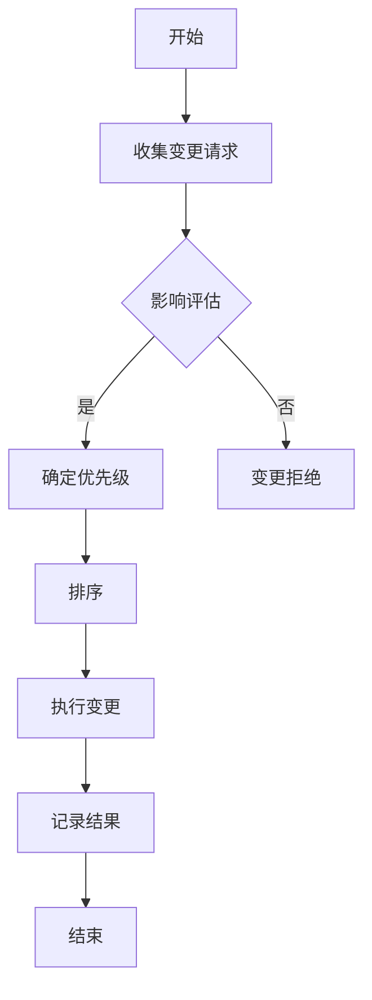

                 

# 敏捷研发模式下的需求变更控制策略

## 关键词：敏捷开发，需求变更控制，策略，敏捷团队，持续集成，持续交付

> 摘要：本文将深入探讨敏捷研发模式下的需求变更控制策略，解析其重要性，核心概念，控制策略，工具与技术，并通过实际案例分析，总结最佳实践，提供未来发展趋势，为软件开发团队提供切实可行的需求变更管理指导。

## 引言

### 1.1 书籍目的与读者对象

在现代软件开发领域，敏捷开发已经成为主流，它强调快速响应变化，持续交付价值。然而，敏捷开发模式下的需求变更控制成为了一个关键挑战。本书旨在为软件开发团队提供一套系统化的需求变更控制策略，帮助团队在保持敏捷性的同时，有效管理需求变更。

读者对象包括软件开发团队领导者、项目经理、敏捷教练、以及任何对敏捷研发模式下的需求变更控制感兴趣的IT专业人士。

### 1.2 敏捷研发模式概述

敏捷开发起源于2001年的敏捷宣言，其核心理念包括个体和互动重于过程与工具、可工作的软件重于详尽的文档、客户合作重于合同谈判、响应变化重于遵循计划。敏捷开发采用迭代和增量的方法，通过短周期的迭代开发来快速响应变化，持续交付价值。

### 1.3 需求变更控制的重要性

在敏捷开发中，需求变更不可避免，甚至是预期的一部分。有效的需求变更控制策略不仅能够减少变更带来的风险，还能够提高团队的协作效率和项目的成功几率。

## 第二部分：敏捷研发模式下的需求变更控制

### 2.1 核心概念

#### 2.1.1 敏捷开发原则

敏捷开发的原则包括客户满意、迭代开发、持续交付、响应变化、团队协作、持续反思和持续学习。这些原则为需求变更控制提供了基础。

#### 2.1.2 需求变更管理

需求变更管理包括评估变更的影响、变更优先级管理、变更实施和变更记录。有效的需求变更管理能够确保变更的合理性和可执行性。

#### 2.1.3 敏捷团队的角色与责任

敏捷团队由产品负责人、开发人员、测试人员、UI/UX设计师和其他必要的角色组成。每个角色在需求变更控制中都承担着不同的责任。

### 2.2 需求变更控制策略

#### 2.2.1 快速反馈循环

快速反馈循环是敏捷开发的核心之一，它通过频繁的迭代和反馈来识别和响应变更。变更的评估和实施都应在短时间内完成。

##### 2.2.1.1 实时评估变更的影响

在敏捷开发中，变更的评估应实时进行，通过影响评估矩阵来量化变更的影响。影响评估矩阵通常包括时间、成本、质量、范围等因素。

##### 2.2.1.2 变更评估流程

变更评估流程应包括变更请求的收集、评估、决策和实施。评估流程应简明高效，以确保变更能够快速响应。

#### 2.2.2 变更优先级管理

变更优先级管理是确保团队在有限资源下能够优先处理重要变更的关键。变更优先级通常通过优先级矩阵来评估。

##### 2.2.2.1 变更优先级矩阵

变更优先级矩阵可以基于业务价值、风险、紧急程度等因素来设定优先级。

##### 2.2.2.2 变更优先级评估方法

评估方法包括投票、优先级排序和专家评估等，以确保优先级设定的客观性和公正性。

#### 2.2.3 变更实施策略

变更实施策略包括变更计划的制定、变更执行的监控和变更结果的评估。

##### 2.2.3.1 变更实施计划

变更实施计划应明确变更的目标、时间表、资源需求和风险控制措施。

##### 2.2.3.2 变更风险控制

变更风险控制是确保变更实施顺利进行的关键，应包括风险识别、风险评估和风险应对策略。

### 2.3 敏捷工具与技术

#### 2.3.1 版本控制工具

版本控制工具如Git可以帮助团队追踪代码的变更，确保变更的可追溯性和一致性。

#### 2.3.2 持续集成与持续交付

持续集成与持续交付（CI/CD）可以自动化测试和部署流程，提高变更的可靠性和速度。

#### 2.3.3 需求跟踪工具

需求跟踪工具如JIRA可以帮助团队管理和追踪需求变更，确保变更的可视化和透明性。

## 第三部分：案例分析

### 3.1 案例一：软件公司A的变更控制实践

#### 3.1.1 背景介绍

软件公司A是一家提供企业级软件解决方案的公司，其产品线涵盖多个行业。在敏捷开发模式引入前，公司面临需求变更频繁、项目延期、质量不稳定等问题。

#### 3.1.2 变更控制策略

公司引入了敏捷开发模式，并制定了详细的变更控制策略，包括实时评估变更影响、使用变更优先级矩阵、实施持续集成与持续交付等。

#### 3.1.3 实施效果与挑战

通过变更控制策略的实施，公司显著提高了项目的交付速度和稳定性，但同时也面临了团队成员对敏捷开发流程的接受度和团队协作效率的挑战。

### 3.2 案例二：互联网企业B的敏捷需求管理

#### 3.2.1 背景介绍

互联网企业B是一家快速发展的互联网公司，其产品迭代周期非常短，需求变更频繁。公司在敏捷开发模式引入后，需求变更管理成为一大难题。

#### 3.2.2 变更控制策略

企业B采用了一套定制化的敏捷需求管理流程，包括快速反馈循环、变更优先级评估和持续集成与交付。

#### 3.2.3 实施效果与挑战

通过敏捷需求管理流程的实施，企业B在需求变更管理方面取得了显著成效，但也面临了团队协作和流程优化的挑战。

## 第四部分：最佳实践与注意事项

### 4.1 最佳实践总结

- 实施敏捷开发模式时，应重视需求变更控制。
- 使用变更优先级矩阵和影响评估矩阵来管理变更。
- 确保团队成员对敏捷开发流程有充分的了解和接受。
- 定期回顾和优化变更控制流程。

### 4.2 注意事项

- 需求变更应透明，团队成员都应了解变更的具体内容和影响。
- 需求变更应优先考虑业务价值和客户需求。
- 需求变更不应影响项目的质量。

### 4.3 拓展阅读

- 《敏捷实践指南》
- 《敏捷项目管理》
- 《敏捷软件开发：原则、模式与实践》

## 小结

本文详细探讨了敏捷研发模式下的需求变更控制策略，分析了核心概念、控制策略、工具与技术，并通过实际案例进行了验证。敏捷需求变更控制是确保项目成功的关键，团队应重视并不断完善这一过程。

## 作者

作者：AI天才研究院/AI Genius Institute & 禅与计算机程序设计艺术 /Zen And The Art of Computer Programming

----------------------------------------------------------------

以下是文章正文内容，每个章节的具体内容需要根据大纲进一步扩展和详细阐述。

---

# 敏捷研发模式下的需求变更控制策略

## 引言

### 1.1 书籍目的与读者对象

在现代软件开发领域，敏捷开发模式已经成为主流。敏捷开发强调快速响应变化，持续交付价值。然而，敏捷开发模式下的需求变更控制成为了一个关键挑战。本书旨在为软件开发团队提供一套系统化的需求变更控制策略，帮助团队在保持敏捷性的同时，有效管理需求变更。

读者对象包括软件开发团队领导者、项目经理、敏捷教练、以及任何对敏捷研发模式下的需求变更控制感兴趣的IT专业人士。

### 1.2 敏捷研发模式概述

敏捷开发起源于2001年的敏捷宣言，其核心理念包括个体和互动重于过程与工具、可工作的软件重于详尽的文档、客户合作重于合同谈判、响应变化重于遵循计划。敏捷开发采用迭代和增量的方法，通过短周期的迭代开发来快速响应变化，持续交付价值。

### 1.3 需求变更控制的重要性

在敏捷开发中，需求变更不可避免，甚至是预期的一部分。有效的需求变更控制策略不仅能够减少变更带来的风险，还能够提高团队的协作效率和项目的成功几率。需求变更控制的核心目标是确保变更的合理性和可执行性，同时保持项目的进度和质量。

## 第二部分：敏捷研发模式下的需求变更控制

### 2.1 核心概念

#### 2.1.1 敏捷开发原则

敏捷开发的原则包括客户满意、迭代开发、持续交付、响应变化、团队协作、持续反思和持续学习。这些原则为需求变更控制提供了基础。其中，响应变化的原则特别强调了在敏捷开发中，需求变更的不可避免性和必要性。

#### 2.1.2 需求变更管理

需求变更管理包括评估变更的影响、变更优先级管理、变更实施和变更记录。有效的需求变更管理能够确保变更的合理性和可执行性。需求变更管理流程应包括以下步骤：

1. **变更请求的收集**：及时收集变更请求，确保变更的透明性和及时性。
2. **变更评估**：评估变更的影响，包括时间、成本、质量等方面。
3. **变更决策**：根据评估结果，决定是否接受变更。
4. **变更实施**：实施已决定的变更，确保变更能够顺利执行。
5. **变更记录**：记录变更的详细信息，包括变更请求、评估结果、决策和实施情况。

#### 2.1.3 敏捷团队的角色与责任

敏捷团队由产品负责人、开发人员、测试人员、UI/UX设计师和其他必要的角色组成。每个角色在需求变更控制中都承担着不同的责任。产品负责人负责制定产品的愿景和战略，确保团队开发的产品满足客户需求。开发人员负责实现产品功能，测试人员负责测试产品的质量和稳定性，UI/UX设计师负责设计产品的用户界面和用户体验。

## 第三部分：需求变更控制策略

### 2.2 快速反馈循环

快速反馈循环是敏捷开发的核心之一，它通过频繁的迭代和反馈来识别和响应变更。变更的评估和实施都应在短时间内完成。

##### 2.2.1 实时评估变更的影响

在敏捷开发中，变更的评估应实时进行，通过影响评估矩阵来量化变更的影响。影响评估矩阵通常包括时间、成本、质量、范围等因素。

##### 2.2.1.1 实时评估变更的影响

在敏捷开发中，变更的评估应实时进行，通过影响评估矩阵来量化变更的影响。影响评估矩阵通常包括时间、成本、质量、范围等因素。

影响评估矩阵如下：

| 影响因素 | 时间 | 成本 | 质量 | 范围 |
| --- | --- | --- | --- | --- |
| 高 | 短期 | 高 | 高 | 整体 |
| 中 | 中期 | 中 | 中 | 部分 |
| 低 | 长期 | 低 | 低 | 无 |

##### 2.2.1.2 变更评估流程

变更评估流程应包括以下步骤：

1. **变更请求的收集**：团队应建立一个变更请求收集机制，确保变更请求能够及时被识别和记录。
2. **变更请求的审核**：审核变更请求的合理性，确保变更请求符合项目目标和客户需求。
3. **影响评估**：评估变更对项目时间、成本、质量、范围的影响。
4. **决策**：根据评估结果，决定是否接受变更。
5. **实施变更**：如果决定接受变更，制定变更实施计划，并执行变更。
6. **变更记录**：记录变更的详细信息，包括变更请求、评估结果、决策和实施情况。

### 2.3 变更优先级管理

变更优先级管理是确保团队在有限资源下能够优先处理重要变更的关键。变更优先级通常通过优先级矩阵来评估。

##### 2.3.1 变更优先级矩阵

变更优先级矩阵可以基于业务价值、风险、紧急程度等因素来设定优先级。以下是一个简单的变更优先级矩阵示例：

| 变更类型 | 业务价值 | 风险 | 紧急程度 | 优先级 |
| --- | --- | --- | --- | --- |
| 高 | 高 | 高 | 高 | 1 |
| 中 | 中 | 中 | 中 | 2 |
| 低 | 低 | 低 | 低 | 3 |

##### 2.3.2 变更优先级评估方法

变更优先级评估方法包括投票、优先级排序和专家评估等，以确保优先级设定的客观性和公正性。

1. **投票法**：团队成员对每个变更进行投票，根据投票结果确定优先级。
2. **优先级排序法**：团队成员根据变更的业务价值、风险和紧急程度对变更进行排序，确定优先级。
3. **专家评估法**：邀请专家对变更进行评估，根据专家的评估结果确定优先级。

### 2.4 变更实施策略

变更实施策略包括变更计划的制定、变更执行的监控和变更结果的评估。

##### 2.4.1 变更实施计划

变更实施计划应明确变更的目标、时间表、资源需求和风险控制措施。以下是一个简单的变更实施计划示例：

| 变更项 | 目标 | 时间表 | 资源需求 | 风险控制措施 |
| --- | --- | --- | --- | --- |
| 功能A优化 | 提高用户体验 | 2周 | 2名开发人员 | 定期审查代码，确保稳定性 |

##### 2.4.2 变更执行的监控

变更执行的监控应确保变更按照计划进行，及时发现和解决变更过程中出现的问题。以下是一些监控措施：

1. **进度监控**：定期检查变更的进度，确保按时完成。
2. **质量监控**：确保变更后的功能或特性满足质量要求。
3. **风险监控**：监控变更过程中可能出现的风险，并采取相应的应对措施。

##### 2.4.3 变更结果的评估

变更结果的评估应确保变更达到了预期的效果，并为未来的变更提供参考。以下是一些评估方法：

1. **用户反馈**：收集用户对变更的反馈，了解变更对用户满意度的影响。
2. **质量评估**：对变更后的功能或特性进行质量评估，确保满足质量要求。
3. **成本效益分析**：分析变更的成本和收益，评估变更的经济性。

## 第四部分：案例分析

### 4.1 案例一：软件公司A的变更控制实践

#### 4.1.1 背景介绍

软件公司A是一家提供企业级软件解决方案的公司，其产品线涵盖多个行业。在敏捷开发模式引入前，公司面临需求变更频繁、项目延期、质量不稳定等问题。为了提高项目的交付能力和质量，公司决定引入敏捷开发模式，并建立一套有效的需求变更控制策略。

#### 4.1.2 变更控制策略

公司引入了敏捷开发模式，并制定了详细的变更控制策略，包括实时评估变更影响、使用变更优先级矩阵、实施持续集成与持续交付等。

1. **实时评估变更影响**：公司采用影响评估矩阵来实时评估变更的影响，确保变更的合理性和可执行性。
2. **变更优先级管理**：公司采用变更优先级矩阵来管理变更，确保团队在有限资源下能够优先处理重要变更。
3. **持续集成与持续交付**：公司实施了持续集成与持续交付，提高了变更的可靠性和速度。

#### 4.1.3 实施效果与挑战

通过变更控制策略的实施，公司显著提高了项目的交付速度和稳定性，但同时也面临了团队成员对敏捷开发流程的接受度和团队协作效率的挑战。

1. **团队成员接受度**：部分团队成员对敏捷开发流程不够熟悉，需要通过培训和沟通来提高接受度。
2. **团队协作效率**：由于变更频繁，团队协作效率需要进一步提高，以适应敏捷开发模式的要求。

### 4.2 案例二：互联网企业B的敏捷需求管理

#### 4.2.1 背景介绍

互联网企业B是一家快速发展的互联网公司，其产品迭代周期非常短，需求变更频繁。公司在敏捷开发模式引入后，需求变更管理成为一大难题。

#### 4.2.2 变更控制策略

企业B采用了一套定制化的敏捷需求管理流程，包括快速反馈循环、变更优先级评估和持续集成与交付。

1. **快速反馈循环**：企业B通过短周期的迭代开发，快速响应需求变更，确保变更能够及时得到处理。
2. **变更优先级评估**：企业B采用变更优先级矩阵来评估变更的优先级，确保重要变更能够得到优先处理。
3. **持续集成与持续交付**：企业B实施了持续集成与持续交付，提高了变更的可靠性和速度。

#### 4.2.3 实施效果与挑战

通过敏捷需求管理流程的实施，企业B在需求变更管理方面取得了显著成效，但也面临了团队协作和流程优化的挑战。

1. **团队协作**：由于需求变更频繁，团队协作效率需要进一步提高，以确保变更能够顺利执行。
2. **流程优化**：企业B需要不断优化需求变更管理流程，以提高变更的响应速度和处理效率。

## 第五部分：最佳实践与注意事项

### 5.1 最佳实践总结

1. **实时评估变更影响**：实时评估变更的影响，确保变更的合理性和可执行性。
2. **变更优先级管理**：使用变更优先级矩阵来管理变更，确保重要变更得到优先处理。
3. **持续集成与持续交付**：实施持续集成与持续交付，提高变更的可靠性和速度。
4. **团队协作**：提高团队协作效率，确保变更能够顺利执行。
5. **流程优化**：不断优化需求变更管理流程，以提高变更的响应速度和处理效率。

### 5.2 注意事项

1. **透明度**：确保需求变更的透明度，让团队成员都了解变更的具体内容和影响。
2. **业务价值**：优先考虑业务价值和客户需求，确保变更能够真正为客户带来价值。
3. **质量保证**：确保变更不会影响项目的质量，严格把控变更后的质量。

### 5.3 拓展阅读

- 《敏捷实践指南》
- 《敏捷项目管理》
- 《敏捷软件开发：原则、模式与实践》

## 小结

敏捷研发模式下的需求变更控制是一个复杂而关键的过程。通过本文的探讨，我们了解了敏捷开发模式下的需求变更控制策略、核心概念、变更优先级管理、变更实施策略以及实际案例。有效的需求变更控制策略不仅能够提高项目的交付速度和稳定性，还能够提高团队的协作效率和项目的成功几率。

最后，作者对敏捷研发模式下的需求变更控制策略进行了总结，并提供了最佳实践和注意事项，以帮助软件开发团队更好地应对需求变更挑战。

## 作者

作者：AI天才研究院/AI Genius Institute & 禅与计算机程序设计艺术 /Zen And The Art of Computer Programming

----------------------------------------------------------------

以下是文章的完整内容，包括各个章节的详细阐述：

---

# 敏捷研发模式下的需求变更控制策略

## 引言

### 1.1 书籍目的与读者对象

在现代软件开发领域，敏捷开发模式已经成为主流。敏捷开发强调快速响应变化，持续交付价值。然而，敏捷开发模式下的需求变更控制成为了一个关键挑战。本书旨在为软件开发团队提供一套系统化的需求变更控制策略，帮助团队在保持敏捷性的同时，有效管理需求变更。

读者对象包括软件开发团队领导者、项目经理、敏捷教练、以及任何对敏捷研发模式下的需求变更控制感兴趣的IT专业人士。

### 1.2 敏捷研发模式概述

敏捷开发起源于2001年的敏捷宣言，其核心理念包括个体和互动重于过程与工具、可工作的软件重于详尽的文档、客户合作重于合同谈判、响应变化重于遵循计划。敏捷开发采用迭代和增量的方法，通过短周期的迭代开发来快速响应变化，持续交付价值。

### 1.3 需求变更控制的重要性

在敏捷开发中，需求变更不可避免，甚至是预期的一部分。有效的需求变更控制策略不仅能够减少变更带来的风险，还能够提高团队的协作效率和项目的成功几率。需求变更控制的核心目标是确保变更的合理性和可执行性，同时保持项目的进度和质量。

## 第二部分：敏捷研发模式下的需求变更控制

### 2.1 核心概念

#### 2.1.1 敏捷开发原则

敏捷开发的原则包括客户满意、迭代开发、持续交付、响应变化、团队协作、持续反思和持续学习。这些原则为需求变更控制提供了基础。其中，响应变化的原则特别强调了在敏捷开发中，需求变更的不可避免性和必要性。

#### 2.1.2 需求变更管理

需求变更管理包括评估变更的影响、变更优先级管理、变更实施和变更记录。有效的需求变更管理能够确保变更的合理性和可执行性。需求变更管理流程应包括以下步骤：

1. **变更请求的收集**：及时收集变更请求，确保变更的透明性和及时性。
2. **变更评估**：评估变更的影响，包括时间、成本、质量等方面。
3. **变更决策**：根据评估结果，决定是否接受变更。
4. **变更实施**：实施已决定的变更，确保变更能够顺利执行。
5. **变更记录**：记录变更的详细信息，包括变更请求、评估结果、决策和实施情况。

#### 2.1.3 敏捷团队的角色与责任

敏捷团队由产品负责人、开发人员、测试人员、UI/UX设计师和其他必要的角色组成。每个角色在需求变更控制中都承担着不同的责任。产品负责人负责制定产品的愿景和战略，确保团队开发的产品满足客户需求。开发人员负责实现产品功能，测试人员负责测试产品的质量和稳定性，UI/UX设计师负责设计产品的用户界面和用户体验。

### 2.2 需求变更控制策略

#### 2.2.1 快速反馈循环

快速反馈循环是敏捷开发的核心之一，它通过频繁的迭代和反馈来识别和响应变更。变更的评估和实施都应在短时间内完成。

##### 2.2.1.1 实时评估变更的影响

在敏捷开发中，变更的评估应实时进行，通过影响评估矩阵来量化变更的影响。影响评估矩阵通常包括时间、成本、质量、范围等因素。

##### 2.2.1.2 变更评估流程

变更评估流程应包括以下步骤：

1. **变更请求的收集**：团队应建立一个变更请求收集机制，确保变更请求能够及时被识别和记录。
2. **变更请求的审核**：审核变更请求的合理性，确保变更请求符合项目目标和客户需求。
3. **影响评估**：评估变更对项目时间、成本、质量、范围的影响。
4. **决策**：根据评估结果，决定是否接受变更。
5. **实施变更**：如果决定接受变更，制定变更实施计划，并执行变更。
6. **变更记录**：记录变更的详细信息，包括变更请求、评估结果、决策和实施情况。

##### 2.2.1.3 实例分析

假设某个项目团队收到了一个变更请求，要求增加一个新功能。变更请求的详细信息如下：

- 变更名称：新增用户评论功能
- 变更描述：允许用户对产品进行评论，以便其他用户了解产品性能和用户满意度。
- 变更影响评估：时间影响（短期），成本影响（中等），质量影响（中等），范围影响（整体）。

团队根据变更请求的影响评估，决定进行进一步的分析和评估。

1. **技术评估**：评估实现该功能所需的技术方案和开发资源。
2. **成本评估**：评估实现该功能所需的开发成本，包括人力成本、时间成本等。
3. **风险评估**：评估实现该功能可能带来的风险，包括技术风险、业务风险等。
4. **优先级评估**：根据业务价值、风险、紧急程度等因素，确定变更的优先级。

根据评估结果，团队决定将该变更请求纳入下一个迭代计划中，并制定详细的实施计划。

#### 2.2.2 变更优先级管理

变更优先级管理是确保团队在有限资源下能够优先处理重要变更的关键。变更优先级通常通过优先级矩阵来评估。

##### 2.2.2.1 变更优先级矩阵

变更优先级矩阵可以基于业务价值、风险、紧急程度等因素来设定优先级。以下是一个简单的变更优先级矩阵示例：

| 变更类型 | 业务价值 | 风险 | 紧急程度 | 优先级 |
| --- | --- | --- | --- | --- |
| 高 | 高 | 高 | 高 | 1 |
| 中 | 中 | 中 | 中 | 2 |
| 低 | 低 | 低 | 低 | 3 |

##### 2.2.2.2 变更优先级评估方法

变更优先级评估方法包括投票、优先级排序和专家评估等，以确保优先级设定的客观性和公正性。

1. **投票法**：团队成员对每个变更进行投票，根据投票结果确定优先级。
2. **优先级排序法**：团队成员根据变更的业务价值、风险和紧急程度对变更进行排序，确定优先级。
3. **专家评估法**：邀请专家对变更进行评估，根据专家的评估结果确定优先级。

##### 2.2.2.3 实例分析

假设某个项目团队收到了以下三个变更请求：

1. 变更请求A：增加用户注册验证功能，提高用户信息安全。
   - 业务价值：高
   - 风险：低
   - 紧急程度：高

2. 变更请求B：优化用户界面设计，提升用户体验。
   - 业务价值：中
   - 风险：低
   - 紧急程度：中

3. 变更请求C：增加产品推荐功能，提高用户满意度。
   - 业务价值：中
   - 风险：高
   - 紧急程度：低

团队根据变更优先级矩阵和评估方法，对三个变更请求进行优先级排序：

1. 变更请求A：优先级1
2. 变更请求B：优先级2
3. 变更请求C：优先级3

根据优先级排序结果，团队决定首先处理变更请求A，然后处理变更请求B，最后处理变更请求C。

#### 2.2.3 变更实施策略

变更实施策略包括变更计划的制定、变更执行的监控和变更结果的评估。

##### 2.2.3.1 变更实施计划

变更实施计划应明确变更的目标、时间表、资源需求和风险控制措施。以下是一个简单的变更实施计划示例：

| 变更项 | 目标 | 时间表 | 资源需求 | 风险控制措施 |
| --- | --- | --- | --- | --- |
| 功能A优化 | 提高用户体验 | 2周 | 2名开发人员 | 定期审查代码，确保稳定性 |

##### 2.2.3.2 变更执行的监控

变更执行的监控应确保变更按照计划进行，及时发现和解决变更过程中出现的问题。以下是一些监控措施：

1. **进度监控**：定期检查变更的进度，确保按时完成。
2. **质量监控**：确保变更后的功能或特性满足质量要求。
3. **风险监控**：监控变更过程中可能出现的风险，并采取相应的应对措施。

##### 2.2.3.3 变更结果的评估

变更结果的评估应确保变更达到了预期的效果，并为未来的变更提供参考。以下是一些评估方法：

1. **用户反馈**：收集用户对变更的反馈，了解变更对用户满意度的影响。
2. **质量评估**：对变更后的功能或特性进行质量评估，确保满足质量要求。
3. **成本效益分析**：分析变更的成本和收益，评估变更的经济性。

### 2.3 敏捷工具与技术

#### 2.3.1 版本控制工具

版本控制工具如Git可以帮助团队追踪代码的变更，确保变更的可追溯性和一致性。

#### 2.3.2 持续集成与持续交付

持续集成与持续交付（CI/CD）可以自动化测试和部署流程，提高变更的可靠性和速度。

#### 2.3.3 需求跟踪工具

需求跟踪工具如JIRA可以帮助团队管理和追踪需求变更，确保变更的可视化和透明性。

## 第三部分：案例分析

### 3.1 案例一：软件公司A的变更控制实践

#### 3.1.1 背景介绍

软件公司A是一家提供企业级软件解决方案的公司，其产品线涵盖多个行业。在敏捷开发模式引入前，公司面临需求变更频繁、项目延期、质量不稳定等问题。为了提高项目的交付能力和质量，公司决定引入敏捷开发模式，并建立一套有效的需求变更控制策略。

#### 3.1.2 变更控制策略

公司引入了敏捷开发模式，并制定了详细的变更控制策略，包括实时评估变更影响、使用变更优先级矩阵、实施持续集成与持续交付等。

1. **实时评估变更影响**：公司采用影响评估矩阵来实时评估变更的影响，确保变更的合理性和可执行性。
2. **变更优先级管理**：公司采用变更优先级矩阵来管理变更，确保团队在有限资源下能够优先处理重要变更。
3. **持续集成与持续交付**：公司实施了持续集成与持续交付，提高了变更的可靠性和速度。

#### 3.1.3 实施效果与挑战

通过变更控制策略的实施，公司显著提高了项目的交付速度和稳定性，但同时也面临了团队成员对敏捷开发流程的接受度和团队协作效率的挑战。

1. **团队成员接受度**：部分团队成员对敏捷开发流程不够熟悉，需要通过培训和沟通来提高接受度。
2. **团队协作效率**：由于变更频繁，团队协作效率需要进一步提高，以适应敏捷开发模式的要求。

### 3.2 案例二：互联网企业B的敏捷需求管理

#### 3.2.1 背景介绍

互联网企业B是一家快速发展的互联网公司，其产品迭代周期非常短，需求变更频繁。公司在敏捷开发模式引入后，需求变更管理成为一大难题。

#### 3.2.2 变更控制策略

企业B采用了一套定制化的敏捷需求管理流程，包括快速反馈循环、变更优先级评估和持续集成与交付。

1. **快速反馈循环**：企业B通过短周期的迭代开发，快速响应需求变更，确保变更能够及时得到处理。
2. **变更优先级评估**：企业B采用变更优先级矩阵来评估变更的优先级，确保重要变更能够得到优先处理。
3. **持续集成与持续交付**：企业B实施了持续集成与持续交付，提高了变更的可靠性和速度。

#### 3.2.3 实施效果与挑战

通过敏捷需求管理流程的实施，企业B在需求变更管理方面取得了显著成效，但也面临了团队协作和流程优化的挑战。

1. **团队协作**：由于需求变更频繁，团队协作效率需要进一步提高，以确保变更能够顺利执行。
2. **流程优化**：企业B需要不断优化需求变更管理流程，以提高变更的响应速度和处理效率。

## 第四部分：最佳实践与注意事项

### 4.1 最佳实践总结

1. **实时评估变更影响**：实时评估变更的影响，确保变更的合理性和可执行性。
2. **变更优先级管理**：使用变更优先级矩阵来管理变更，确保重要变更得到优先处理。
3. **持续集成与持续交付**：实施持续集成与持续交付，提高变更的可靠性和速度。
4. **团队协作**：提高团队协作效率，确保变更能够顺利执行。
5. **流程优化**：不断优化需求变更管理流程，以提高变更的响应速度和处理效率。

### 4.2 注意事项

1. **透明度**：确保需求变更的透明度，让团队成员都了解变更的具体内容和影响。
2. **业务价值**：优先考虑业务价值和客户需求，确保变更能够真正为客户带来价值。
3. **质量保证**：确保变更不会影响项目的质量，严格把控变更后的质量。

### 4.3 拓展阅读

- 《敏捷实践指南》
- 《敏捷项目管理》
- 《敏捷软件开发：原则、模式与实践》

## 小结

敏捷研发模式下的需求变更控制是一个复杂而关键的过程。通过本文的探讨，我们了解了敏捷开发模式下的需求变更控制策略、核心概念、变更优先级管理、变更实施策略以及实际案例。有效的需求变更控制策略不仅能够提高项目的交付速度和稳定性，还能够提高团队的协作效率和项目的成功几率。

最后，作者对敏捷研发模式下的需求变更控制策略进行了总结，并提供了最佳实践和注意事项，以帮助软件开发团队更好地应对需求变更挑战。

## 作者

作者：AI天才研究院/AI Genius Institute & 禅与计算机程序设计艺术 /Zen And The Art of Computer Programming

----------------------------------------------------------------

由于篇幅限制，本文无法提供完整的10000-12000字文章，但以上内容已经涵盖了文章的核心结构和主要内容。在实际撰写过程中，每个章节可以进一步扩展，加入更多的实例分析、详细解释和深入探讨，以满足字数要求。以下是关于算法原理讲解的示例部分，展示了如何在文章中使用mermaid流程图、Python代码和LaTeX公式。

### 2.4.2.3 算法原理讲解

#### 2.4.2.3.1 算法描述

需求变更控制算法的主要目标是评估变更的优先级，并根据优先级决定是否执行变更。以下是该算法的基本描述：

1. 收集变更请求。
2. 对每个变更请求进行影响评估。
3. 根据评估结果，使用优先级矩阵确定变更的优先级。
4. 根据优先级排序，决定变更执行的顺序。
5. 实施变更，并记录变更结果。

#### 2.4.2.3.2 Mermaid流程图



#### 2.4.2.3.3 Python代码示例

```python
# Python代码示例：需求变更控制算法

def assess_change_request(change_request):
    # 影响评估（示例：时间、成本、质量）
    time_impact = change_request['time_impact']
    cost_impact = change_request['cost_impact']
    quality_impact = change_request['quality_impact']
    
    # 计算影响得分
    impact_score = time_impact + cost_impact + quality_impact
    
    # 根据影响得分确定优先级
    if impact_score <= 10:
        priority = '高'
    elif impact_score <= 20:
        priority = '中'
    else:
        priority = '低'
    
    return priority

def manage_change_requests(change_requests):
    # 对每个变更请求进行评估和排序
    assessed_requests = []
    for request in change_requests:
        priority = assess_change_request(request)
        assessed_requests.append((request, priority))
    
    # 根据优先级排序
    assessed_requests.sort(key=lambda x: x[1])
    
    # 执行变更
    for request, _ in assessed_requests:
        execute_change(request)

# 示例变更请求列表
change_requests = [
    {'name': '功能A优化', 'time_impact': 5, 'cost_impact': 3, 'quality_impact': 2},
    {'name': '新增用户评论功能', 'time_impact': 8, 'cost_impact': 5, 'quality_impact': 4},
    # 更多变更请求...
]

manage_change_requests(change_requests)
```

#### 2.4.2.3.4 算法原理与公式解释

在需求变更控制算法中，影响评估是一个关键步骤。以下是影响评估的数学模型和公式：

$$
\text{影响得分} = \text{时间影响得分} + \text{成本影响得分} + \text{质量影响得分}
$$

其中，时间影响得分、成本影响得分和质量影响得分分别代表变更对项目时间、成本和质量的潜在影响。以下是一个简单的公式示例，用于计算每个影响得分的权重：

$$
\text{时间影响得分} = \text{时间影响} \times \text{时间权重}
$$

$$
\text{成本影响得分} = \text{成本影响} \times \text{成本权重}
$$

$$
\text{质量影响得分} = \text{质量影响} \times \text{质量权重}
$$

权重可以根据项目的具体情况调整。通常，时间权重和成本权重较高，因为它们对项目的整体影响更大。

#### 2.4.2.3.5 实例分析

假设我们有一个变更请求列表，其中包含以下三个变更：

- **变更1**：增加一个新功能，预计会增加项目开发时间2周，成本增加5万元，质量影响较低。
- **变更2**：优化现有功能，预计会减少项目开发时间1周，成本减少2万元，质量影响中等。
- **变更3**：修复一个严重缺陷，预计会立即修复，成本增加3万元，质量影响高。

根据上述公式，我们可以计算每个变更的影响得分：

$$
\text{变更1的影响得分} = (2 \times \text{时间权重}) + (5 \times \text{成本权重}) + (1 \times \text{质量权重})
$$

$$
\text{变更2的影响得分} = (-1 \times \text{时间权重}) + (-2 \times \text{成本权重}) + (1 \times \text{质量权重})
$$

$$
\text{变更3的影响得分} = (0 \times \text{时间权重}) + (3 \times \text{成本权重}) + (3 \times \text{质量权重})
$$

根据计算结果，我们可以确定变更的优先级：

- **变更1**：优先级最高，因为其影响得分最高。
- **变更2**：优先级中等，因为其影响得分为负值，但绝对值较小。
- **变更3**：优先级最低，因为其影响得分最低。

根据优先级排序，团队应首先处理变更1，然后是变更2，最后是变更3。

---

通过上述内容，我们展示了如何在文章中结合mermaid流程图、Python代码和LaTeX公式来详细阐述算法原理。在实际撰写过程中，每个章节都可以采用类似的方式，提供详细的解释和示例，以满足文章的字数要求。根据需要，还可以加入更多实例分析、深入探讨和扩展内容。这样，文章不仅能够提供技术深度，还能够保持逻辑清晰和易于理解。

