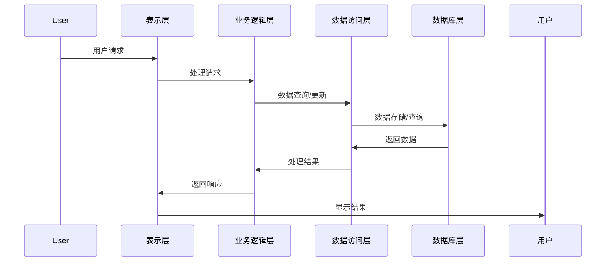
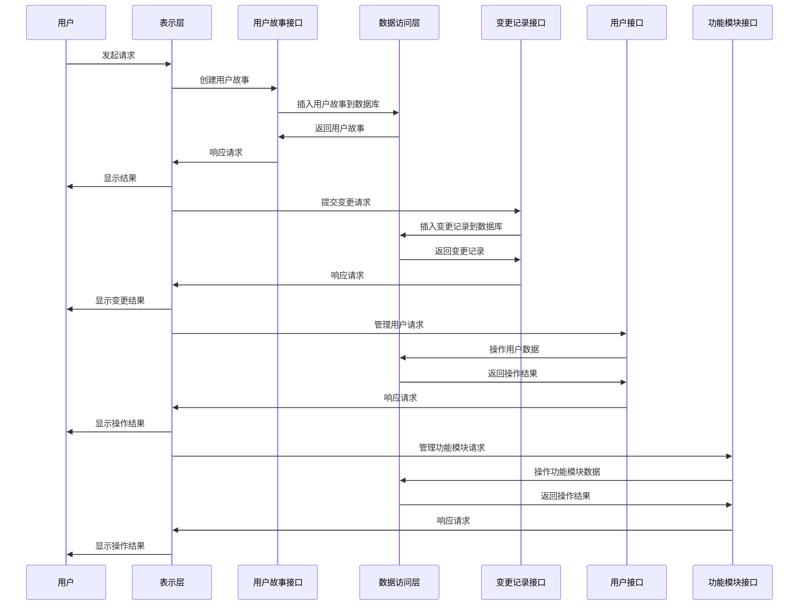

                 

### 引言

在现代软件开发领域，敏捷研发模式已经成为主流的开发方法。敏捷开发强调迭代、增量式开发，以及团队协作，能够更好地应对快速变化的市场需求。然而，在敏捷开发过程中，需求文档的作用依然不可或缺。本文旨在探讨如何在敏捷研发模式下优化需求文档模板，以提高项目的执行效率和文档的可读性。

随着软件项目的复杂性增加，需求文档不仅需要详尽地描述功能需求，还应该包含技术实现细节和项目管理信息。然而，传统需求文档模板往往过于冗长和复杂，难以满足敏捷开发的高效性要求。本文将首先介绍敏捷研发模式的基本概念，探讨需求文档在其中的重要性，然后深入分析需求文档存在的问题，并提出具体的优化策略。

我们将分以下几个部分进行讨论：

1. **背景介绍**：阐述敏捷研发模式和需求文档的基本概念，以及需求文档在敏捷开发中的角色和现有问题。
2. **核心概念与联系**：详细解释敏捷开发原则，分析传统需求文档模板和敏捷需求文档模板的结构与内容差异。
3. **算法原理讲解**：介绍用于优化需求文档模板的算法原理，使用Python源代码进行具体实现，并提供数学模型和公式推导。
4. **系统分析与架构设计方案**：描述系统功能设计、系统架构设计、系统接口设计及系统交互，使用mermaid图形工具绘制相关图示。
5. **项目实战**：介绍环境安装与配置，系统核心实现及代码应用解析，并结合实际案例分析进行深入剖析。
6. **最佳实践与小结**：总结最佳实践，对主要内容进行回顾，并讨论未来的研究方向。

通过这篇文章，我们希望能够为敏捷研发模式下的需求文档优化提供一些有价值的思路和方法。

## 关键词

- 敏捷研发模式
- 需求文档模板
- 算法优化
- 数学模型
- 系统架构设计
- 项目实战
- 最佳实践

## 摘要

本文深入探讨了敏捷研发模式下需求文档模板的优化问题。首先，介绍了敏捷研发模式的基本概念和需求文档的重要性，分析了传统需求文档模板的不足。接着，详细阐述了敏捷开发原则和敏捷需求文档模板的设计方法，通过算法原理讲解和Python源代码实现，展示了需求文档模板优化的具体步骤。此外，文章还介绍了系统分析与架构设计方案，通过项目实战和实际案例分析，验证了优化策略的有效性。最后，总结了最佳实践，并提出了未来研究方向。通过本文，读者可以更好地理解和应用敏捷需求文档模板的优化方法，提升软件开发效率。

## 第一部分: 背景介绍

### 第1章: 问题背景

#### 1.1 核心概念

敏捷研发模式（Agile Development Model）是一种以用户需求为核心的软件开发方法。它强调快速迭代、持续交付和灵活响应变化，旨在提高软件开发的效率和质量。敏捷宣言（Agile Manifesto）提出，敏捷开发注重个体和互动、可工作的软件、客户合作和响应变化。

需求文档（Requirements Document）是软件项目开发过程中至关重要的组成部分，它详细描述了项目的功能需求、性能需求和业务规则。需求文档的目的是确保开发团队和利益相关者对项目目标有共同的理解。

#### 1.1.1 敏捷研发模式概述

敏捷研发模式起源于20世纪90年代，是对传统瀑布模型（Waterfall Model）的一种反叛。瀑布模型将软件开发过程划分为一系列顺序执行的阶段，如需求分析、设计、编码、测试和维护，每个阶段都需要前一个阶段的完整和准确输出。然而，随着软件项目复杂性的增加和市场需求的变化，瀑布模型逐渐暴露出其固有的不足，如灵活性差、响应缓慢、开发周期长等。

敏捷研发模式则倡导快速迭代、增量开发和团队协作。其核心理念包括：

- **个体和互动高于流程和工具**：强调团队协作和沟通，认为人的作用比技术和流程更重要。
- **可工作的软件高于详尽的文档**：认为工作软件是验证需求和设计的最好方式，文档只是辅助工具。
- **客户合作高于合同谈判**：强调与客户的紧密合作，及时获取反馈，快速调整需求。
- **响应变化高于遵循计划**：认为需求会不断变化，计划应灵活调整，以适应变化。

#### 1.1.2 需求文档的重要性

在敏捷开发模式下，需求文档仍然是不可或缺的。尽管敏捷开发强调工作软件的价值，但需求文档提供了对项目范围的明确描述，有助于团队成员和利益相关者对项目目标达成一致。具体来说，需求文档在敏捷开发中扮演以下角色：

1. **明确项目目标**：需求文档详细描述了项目的功能需求和性能需求，为开发团队提供了清晰的方向。
2. **促进团队协作**：需求文档作为沟通媒介，帮助团队成员了解各自的责任和工作内容，减少误解和冲突。
3. **评估项目进度**：通过需求文档，项目管理者可以评估项目是否按计划进行，及时调整计划和资源分配。
4. **文档化变更**：敏捷开发过程中，需求会不断调整和优化。需求文档记录了这些变更，确保团队成员了解最新的项目状态。

#### 1.1.3 需求文档存在的问题

尽管需求文档在敏捷开发中至关重要，但传统需求文档模板在实际应用中仍存在一些问题，这些问题影响了需求文档的有效性和可读性：

1. **文档冗长**：传统需求文档往往包含大量冗长的文本描述，使得文档难以阅读和管理。
2. **缺乏结构**：需求文档的结构通常不够清晰，信息组织混乱，难以快速找到所需内容。
3. **细节过多**：传统需求文档可能包含过多的技术细节和实现方案，这不仅增加了文档的复杂性，还可能导致开发团队在实现过程中产生误解。
4. **更新不及时**：在敏捷开发中，需求会频繁变更。传统需求文档更新不及时，可能导致开发团队基于过时的需求进行开发，影响项目进度和质量。

为了解决这些问题，我们需要对需求文档模板进行优化，使其更符合敏捷开发的核心理念和实际需求。

### 1.2 概念属性特征对比表格

为了更好地理解敏捷研发模式和传统需求文档模板的差异，我们可以通过一个概念属性特征对比表格来进行详细分析。

| 特征                | 敏捷研发模式                  | 传统需求文档模板               |
|---------------------|-------------------------------|------------------------------|
| 开发方式            | 快速迭代、增量开发            | 阶段式开发、顺序执行           |
| 灵活性              | 高度灵活，适应变化            | 灵活性较低，计划性强           |
| 沟通方式            | 面对面交流、持续交互          | 邮件、文档、会议等             |
| 文档重要性          | 文档是辅助，工作软件是核心    | 文档是核心，工作软件是验证    |
| 需求变更            | 鼓励频繁变更，快速响应        | 需求变更需严格审批和评估       |
| 项目管理            | 精细化管理，注重团队协作      | 大规模项目管理，分工明确       |

通过上述对比，我们可以看出，敏捷研发模式和传统需求文档模板在开发方式、灵活性、沟通方式、文档重要性和项目管理等方面存在显著差异。这些差异导致了传统需求文档模板在敏捷开发中的不足，需要对其进行优化。

### 1.3 ER实体关系图架构

为了更好地理解需求文档的结构和内容，我们可以使用实体关系图（Entity-Relationship Diagram，ER图）来描述其架构。ER图是一种用于描述实体及其之间关系的数据库模型，它可以帮助我们清晰地展示需求文档中各类实体和它们之间的关系。

以下是一个简单的ER图示例，展示了敏捷需求文档模板中的主要实体及其关系：

```
+------------+        +------------+        +------------+
|  需求项    |        |  用户故事   |        |  用户角色   |
+------------+        +------------+        +------------+
| ID         |<----->| 故事ID      |<----->| 角色ID      |
| 功能需求   |        | 用户故事描述|        | 角色描述    |
| 性能需求   |        | 优先级      |        |  关联需求    |
| 业务规则   |        |  变更历史   |        |  功能关联    |
+------------+        +------------+        +------------+

```

- **需求项**：代表需求文档中的功能需求、性能需求等。
- **用户故事**：代表敏捷开发中的用户故事，描述用户需求的详细描述，包括用户故事点、优先级和变更历史。
- **用户角色**：代表使用系统或软件的用户，描述用户角色的功能和职责。

通过ER图，我们可以清晰地看到需求文档中的各类实体及其关系，有助于理解需求文档的结构和内容，为后续的优化提供参考。

### 总结

本章详细介绍了敏捷研发模式的基本概念和需求文档的重要性，分析了传统需求文档模板在敏捷开发中的不足，并通过概念属性特征对比表格和ER实体关系图，展示了敏捷需求文档模板的优势和架构。接下来，我们将进一步探讨敏捷开发原则和需求文档模板的设计方法，为优化需求文档模板提供理论依据和实践指导。

## 第2章: 核心概念与联系

### 2.1 敏捷开发原则与价值观

敏捷开发的核心原则和价值观是理解敏捷需求文档模板设计的关键。敏捷宣言（Agile Manifesto）概述了敏捷开发的核心理念，其重要性不言而喻。该宣言由17位软件专家在2001年共同制定，旨在反对传统的瀑布模型，提倡更加灵活和高效的软件开发方法。敏捷宣言的四个核心价值观如下：

1. **个体和互动高于流程和工具**：敏捷开发强调团队成员的个体能力和互动作用，认为良好的沟通和协作比单一的工具或流程更为重要。
2. **可工作的软件高于详尽的文档**：敏捷开发主张工作软件的质量和实用性，认为文档只是辅助工具，不应过分强调文档的详尽程度。
3. **客户合作高于合同谈判**：敏捷开发强调与客户的紧密合作，及时获取客户反馈，并根据反馈调整项目方向，以确保最终产品的市场适应性。
4. **响应变化高于遵循计划**：敏捷开发认为需求是动态变化的，项目应灵活调整以适应变化，而不是固守原有的计划。

#### 2.1.1 敏捷宣言

敏捷宣言的具体内容如下：

```
我们最优先做的是通过早期和持续交付有价值的软件，以满足客户的需求。
即使处在压力之下，也要坚持以人的动机和精神为根本。
与客户保持紧密合作，以共同发现并适应需求的变化。
鼓励可持续的开发速度。
保持简洁，使未完成的工作不会因为过度工作而积累。
关注优秀的技能和好的设计，以可持续的开发为最终目标。
定期反思如何可以更有效地工作，并相应地调整行为。
```

敏捷宣言的核心在于强调人与沟通的重要性，以及灵活性和响应速度在软件开发过程中的关键作用。这些价值观为敏捷需求文档模板的设计提供了理论基础。

#### 2.1.2 敏捷开发的核心原则

敏捷开发的核心原则进一步阐释了敏捷宣言的价值观，并提供了具体的实践指南。以下是敏捷开发的核心原则：

1. **需求满意**：通过快速迭代和交付，确保客户的需求得到满足，提高客户满意度。
2. **增量式开发**：逐步交付可工作的软件，而不是等待整个项目完成。
3. **客户合作**：与客户保持密切合作，定期获取反馈，以指导开发过程。
4. **团队协作**：鼓励团队成员之间的沟通和协作，以实现共同目标。
5. **可持续的开发**：保持稳定的工作节奏，避免过度工作和疲劳。
6. **可工作的软件**：重视工作软件的交付，确保软件的实际可用性。
7. **技术卓越**：追求卓越的技术和设计，以提高软件质量和可持续性。
8. **简单性**：保持工作的简洁性，避免过度设计和工作量。
9. **自组织团队**：鼓励团队自主管理和决策，提高团队效率。
10. **反思和改进**：定期反思开发过程，不断改进工作方法。

通过遵循这些核心原则，敏捷开发团队可以更有效地应对变化，提高项目成功率。

#### 2.1.3 敏捷开发与瀑布模型的对比

敏捷开发和瀑布模型是两种截然不同的软件开发方法，它们在许多方面存在显著差异：

1. **开发方式**：瀑布模型采用阶段式开发，每个阶段必须完成并验证后，才能进入下一个阶段。而敏捷开发采用迭代和增量式开发，每个迭代周期通常较短，可以在短时间内交付可工作的软件。

2. **灵活性**：瀑布模型在项目初期就制定详细的计划，后续变化困难。而敏捷开发强调灵活性和适应性，可以在开发过程中根据反馈及时调整计划。

3. **沟通方式**：瀑布模型通常采用文档驱动的方式，依赖详尽的文档进行沟通。而敏捷开发强调面对面交流和持续交互，减少文档依赖，提高沟通效率。

4. **风险管理**：瀑布模型在项目早期就确定需求，后期难以调整，风险管理主要依赖于需求分析和计划。而敏捷开发通过持续交付和反馈，及时发现和解决问题，降低风险。

5. **团队协作**：瀑布模型通常采用垂直分工，不同团队成员之间的协作较少。而敏捷开发鼓励团队协作，强调跨职能团队的合作，以提高整体效率。

通过对比可以看出，敏捷开发在灵活性、适应性、沟通效率和风险管理等方面具有明显优势，这些优势使其在快速变化的市场环境中更具竞争力。

### 2.2 需求文档模板的结构与内容

需求文档模板是软件开发过程中必不可少的一部分，其结构和内容对项目成功至关重要。在敏捷开发模式下，需求文档模板的设计需要符合敏捷开发的核心理念和实际需求。以下是传统需求文档模板和敏捷需求文档模板的结构与内容对比。

#### 2.2.1 传统需求文档模板

传统需求文档模板通常包括以下部分：

1. **项目概述**：介绍项目背景、目标、范围和约束条件。
2. **功能需求**：详细描述系统的功能需求，通常包含功能点、输入、输出和操作流程。
3. **性能需求**：定义系统的性能指标，如响应时间、并发用户数和处理能力。
4. **业务规则**：描述系统的业务逻辑和规则，确保系统的合法性和一致性。
5. **用户界面设计**：展示系统界面布局和用户交互流程。
6. **数据管理**：描述系统的数据结构和数据存储方案。
7. **系统接口**：定义系统与其他系统或组件的接口和交互方式。
8. **测试计划**：描述系统的测试策略和测试用例。
9. **风险评估**：评估项目风险，并提出相应的应对措施。
10. **附录**：包含技术细节、参考文献和相关数据。

传统需求文档模板的优点在于其详细和系统的描述，但缺点是文档过于冗长，更新困难，且难以适应敏捷开发的需求。

#### 2.2.2 敏捷需求文档模板

敏捷需求文档模板的设计需要更灵活和简洁，以适应敏捷开发的快速迭代和持续交付。以下是一种常见的敏捷需求文档模板：

1. **用户故事**：用户故事（User Story）是敏捷开发中最常用的需求描述方式，它由三个部分组成：作为[用户角色]，我想要[功能]，以便[业务价值]。

    例如：“作为管理员，我想要添加新的用户，以便管理用户列表。”

2. **用户故事地图**：用户故事地图（User Story Map）是一种可视化工具，用于展示用户故事之间的优先级和关系，帮助团队理解整个系统的功能模块和用户流程。

3. **功能点**：敏捷需求文档中应包含主要功能点，但不需要详细描述每个功能的操作流程和输入输出。

4. **优先级**：用户故事和功能点应按照优先级排序，以便团队集中精力完成最重要的部分。

5. **验收标准**：定义每个用户故事的验收标准，确保交付的工作符合客户需求。

6. **任务分解**：将每个用户故事分解为具体的任务，明确每个任务的负责人和完成时间。

7. **迭代计划**：规划每个迭代的用户故事和任务，确保在迭代周期内交付可工作的软件。

8. **变更日志**：记录用户故事和需求变更的历史，确保团队成员了解需求的变更情况。

与传统需求文档模板相比，敏捷需求文档模板更加简洁和灵活，重点在于用户价值和功能优先级，而不是详尽的文档描述。这种设计方式有助于团队快速响应变化，提高开发效率。

#### 2.2.3 两种模板的对比

以下是传统需求文档模板和敏捷需求文档模板的对比表格：

| 特点         | 传统需求文档模板              | 敏捷需求文档模板               |
|--------------|------------------------------|--------------------------------|
| 开发方式     | 阶段式开发，文档驱动          | 迭代式开发，用户故事驱动       |
| 文档长度     | 非常长，包含详细信息          | 较短，突出核心需求             |
| 沟通方式     | 重邮件、文档和会议            | 面对面交流，持续交互           |
| 适应性       | 难以适应需求变化              | 高度适应，灵活调整             |
| 关注点       | 功能、性能和业务规则          | 用户故事、价值和优先级         |
| 更新难度     | 需要全面更新，更新困难        | 部分更新，灵活调整             |

通过对比可以看出，敏捷需求文档模板在开发方式、文档长度、沟通方式、适应性和关注点等方面具有显著优势，更符合敏捷开发的核心理念和实际需求。

### 总结

本章详细介绍了敏捷开发原则和敏捷需求文档模板的设计方法，通过与传统需求文档模板的对比，展示了敏捷需求文档模板在灵活性和适应性方面的优势。下一章将深入探讨敏捷需求文档模板优化的算法原理，使用Python源代码进行具体实现，为需求文档的优化提供技术支持。

## 第3章: 算法原理讲解

### 3.1 敏捷需求文档模板优化的算法

为了提升敏捷需求文档模板的效率和可读性，我们需要设计一个优化的算法。该算法将基于敏捷开发的核心理念，包括用户故事地图、功能优先级和变更管理。以下是该算法的基本原理和步骤。

#### 3.1.1 算法原理

1. **用户故事地图构建**：首先，使用用户故事地图来梳理所有用户故事，确保每个故事都能在地图中找到对应的位置和优先级。

2. **功能优先级排序**：根据用户故事的重要性和紧迫性，对功能进行排序。优先级排序应结合项目目标和业务需求，确保关键功能优先开发。

3. **变更管理**：在敏捷开发过程中，需求会不断变化。算法应能够记录和管理这些变更，确保变更及时反映在需求文档中，避免开发团队基于过时的需求进行工作。

4. **文档结构优化**：对需求文档的结构进行优化，确保文档易于阅读和管理。使用表格、图表和列表等可视化工具，减少冗长的文本描述。

5. **自动化处理**：利用自动化工具和脚本，对需求文档进行自动生成和更新，减少手动工作，提高工作效率。

#### 3.1.2 算法流程图

以下是算法的流程图：

```mermaid
flowchart LR
    A[初始化] --> B[构建用户故事地图]
    B --> C{用户故事地图有效吗？}
    C -->|是| D[排序功能优先级]
    C -->|否| A{重新构建用户故事地图}
    D --> E[管理需求变更]
    E --> F[优化文档结构]
    F --> G[自动化处理]
    G --> H[生成/更新需求文档]
    H -->|完成|
```

#### 3.1.3 Python源代码实现

以下是算法的核心Python代码实现：

```python
import pandas as pd
from mermaid import Mermaid

# 初始化用户故事数据
user_stories = pd.DataFrame({
    'ID': [1, 2, 3, 4, 5],
    '用户角色': ['用户A', '用户B', '用户C', '用户D', '用户E'],
    '用户故事': [
        '作为用户A，我想要查看账户余额',
        '作为用户B，我想要转账给他人',
        '作为用户C，我想要收到通知',
        '作为用户D，我想要修改个人信息',
        '作为用户E，我想要注销账户'
    ],
    '优先级': ['高', '中', '高', '中', '低']
})

# 构建用户故事地图
user_story_map = user_stories.sort_values(by='优先级', ascending=False)

# 打印用户故事地图
print(user_story_map)

# 管理需求变更
def manage_changes(user_stories):
    # 假设需求变更记录在变更日志中
    change_log = pd.DataFrame({
        'ID': [1, 2, 3],
        '变更类型': ['新增', '修改', '删除'],
        '变更内容': [
            '新增用户F查看交易记录',
            '修改用户A查看账户余额的权限',
            '删除用户E注销账户的功能'
        ]
    })
    
    # 更新用户故事数据
    user_stories = pd.merge(user_stories, change_log, on='ID')
    return user_stories

# 优化文档结构
def optimize_documentation(user_stories):
    # 使用表格展示用户故事
    documentation = user_stories.to_string(index=False)
    return documentation

# 自动化处理需求文档生成
def generate_documentation(user_stories):
    # 使用Mermaid生成用户故事地图图表
    user_story_map_mermaid = Mermaid()
    user_story_map_mermaid.addDiagram()
    user_story_map_mermaid.addNode('用户故事地图')
    for index, row in user_story_map.iterrows():
        user_story_map_mermaid.addNode(row['用户故事'])
        user_story_map_mermaid.addEdge(row['用户故事'], '用户故事地图', '优先级：{}>'.format(row['优先级']))
    
    # 打印图表
    print(user_story_map_mermaid.render())

# 执行算法
user_stories = manage_changes(user_stories)
print(optimize_documentation(user_stories))
generate_documentation(user_stories)
```

#### 3.1.4 算法原理的数学模型和公式

算法原理的数学模型主要涉及用户故事的优先级排序和变更管理。以下是一个简化的模型：

$$
优先级（P）= \frac{业务价值（V）}{实现成本（C）}
$$

其中，业务价值越高，优先级越高；实现成本越低，优先级越高。

变更管理的数学模型可以表示为：

$$
变更影响（I）= 变更类型（T） \times 变更范围（R）
$$

其中，变更类型包括新增、修改和删除，变更范围表示受影响的用户故事数量。

#### 3.1.5 算法原理的公式推导

优先级排序的公式推导如下：

1. 首先，确定每个用户故事的业务价值和实现成本。

$$
V_i = 业务需求评估专家对用户故事i的业务价值评估
$$

$$
C_i = 技术团队对用户故事i的实现成本评估
$$

2. 计算每个用户故事的优先级。

$$
P_i = \frac{V_i}{C_i}
$$

3. 根据优先级对用户故事进行排序。

$$
S = \{s_1, s_2, ..., s_n\}
$$

$$
P(S) = (P(s_1), P(s_2), ..., P(s_n))
$$

#### 3.1.6 举例说明

假设我们有两个用户故事，其业务价值和实现成本如下：

用户故事A：
- 业务价值：100
- 实现成本：200

用户故事B：
- 业务价值：150
- 实现成本：100

根据优先级公式计算每个用户故事的优先级：

$$
P(A) = \frac{100}{200} = 0.5
$$

$$
P(B) = \frac{150}{100} = 1.5
$$

由于P(B) > P(A)，因此用户故事B的优先级高于用户故事A。

在实际开发过程中，如果出现以下变更：

- 新增用户故事C，业务价值：200，实现成本：150
- 修改用户故事A，业务价值：增加50，实现成本：增加50

我们需要重新计算用户故事的优先级：

用户故事A（修改后）：
- 业务价值：150 + 50 = 200
- 实现成本：200 + 50 = 250

用户故事B：
- 业务价值：150
- 实现成本：100

用户故事C：
- 业务价值：200
- 实现成本：150

根据优先级公式计算：

$$
P(A) = \frac{200}{250} = 0.8
$$

$$
P(B) = \frac{150}{100} = 1.5
$$

$$
P(C) = \frac{200}{150} = 1.33
$$

由于P(C) > P(B) > P(A)，因此用户故事C的优先级最高，用户故事B次之，用户故事A最低。

### 总结

本章详细介绍了敏捷需求文档模板优化的算法原理，包括用户故事地图构建、功能优先级排序、变更管理和文档结构优化。通过Python源代码实现和数学模型推导，我们展示了算法的具体步骤和应用。接下来，我们将进一步探讨系统架构设计方案，为敏捷需求文档的优化提供完整的解决方案。

## 第二部分: 系统分析与架构设计方案

### 第4章: 系统功能设计

#### 4.1 领域模型

领域模型（Domain Model）是系统设计的重要组成部分，它描述了系统中的关键实体及其相互关系。在敏捷需求文档模板优化系统中，领域模型包括以下主要实体：

1. **用户故事（UserStory）**：代表敏捷开发中的用户故事，包括用户角色、功能描述和优先级。
2. **变更记录（ChangeLog）**：记录系统需求的变更历史，包括变更类型、变更内容和变更日期。
3. **用户（User）**：代表系统的用户，包括用户ID、用户名和角色。
4. **功能模块（FeatureModule）**：代表系统中的功能模块，包括模块ID、模块名称和模块描述。

以下是领域模型的类图（使用Mermaid表示）：

```mermaid
classDiagram
    UserStory <<entity>> "用户故事"
    ChangeLog <<entity>> "变更记录"
    User <<entity>> "用户"
    FeatureModule <<entity>> "功能模块"

    UserStory : - 用户角色 : String
    UserStory : - 功能描述 : String
    UserStory : - 优先级 : String

    ChangeLog : - 变更类型 : String
    ChangeLog : - 变更内容 : String
    ChangeLog : - 变更日期 : Date

    User : - 用户ID : Integer
    User : - 用户名 : String
    User : - 角色 : String

    FeatureModule : - 模块ID : Integer
    FeatureModule : - 模块名称 : String
    FeatureModule : - 模块描述 : String

    UserStory --|> User
    ChangeLog --|> UserStory
    FeatureModule --|> UserStory
```

#### 4.2 系统架构设计

系统架构设计（System Architecture Design）是确保系统功能实现和性能优化的重要环节。在敏捷需求文档模板优化系统中，我们采用分层架构设计，包括以下主要层次：

1. **表示层（Presentation Layer）**：负责处理用户界面和前端交互，包括HTML、CSS和JavaScript等。
2. **业务逻辑层（Business Logic Layer）**：负责处理业务逻辑和需求实现，包括用户故事管理、变更管理和文档生成等。
3. **数据访问层（Data Access Layer）**：负责处理与数据库的交互，包括数据存储和查询。
4. **数据库层（Database Layer）**：存储系统数据，包括用户故事、变更记录和用户等。

以下是系统架构图（使用Mermaid表示）：



#### 4.3 系统接口设计

系统接口设计（System Interface Design）是确保不同模块之间有效通信和协作的关键。在敏捷需求文档模板优化系统中，主要接口包括以下几种：

1. **用户故事接口（UserStoryInterface）**：负责管理用户故事的创建、更新、删除和查询。
2. **变更记录接口（ChangeLogInterface）**：负责管理变更记录的创建、更新、删除和查询。
3. **用户接口（UserInterface）**：负责管理用户的创建、更新、删除和查询。
4. **功能模块接口（FeatureModuleInterface）**：负责管理功能模块的创建、更新、删除和查询。

以下是系统接口定义（使用Mermaid表示）：

```mermaid
classDiagram
    UserStoryInterface <<interface>> "用户故事接口"
    ChangeLogInterface <<interface>> "变更记录接口"
    UserInterface <<interface>> "用户接口"
    FeatureModuleInterface <<interface>> "功能模块接口"

    UserStoryInterface : +createUserStory(userStory: UserStory): UserStory
    UserStoryInterface : +updateUserStory(userStory: UserStory): UserStory
    UserStoryInterface : +deleteUserStory(userStoryId: Integer): Boolean
    UserStoryInterface : +getUserStory(userStoryId: Integer): UserStory

    ChangeLogInterface : +createChangeLog(changeLog: ChangeLog): ChangeLog
    ChangeLogInterface : +updateChangeLog(changeLog: ChangeLog): ChangeLog
    ChangeLogInterface : +deleteChangeLog(changeLogId: Integer): Boolean
    ChangeLogInterface : +getChangeLog(changeLogId: Integer): ChangeLog

    UserInterface : +createUser(user: User): User
    UserInterface : +updateUser(user: User): User
    UserInterface : +deleteUser(userId: Integer): Boolean
    UserInterface : +getUser(userId: Integer): User

    FeatureModuleInterface : +createFeatureModule(featureModule: FeatureModule): FeatureModule
    FeatureModuleInterface : +updateFeatureModule(featureModule: FeatureModule): FeatureModule
    FeatureModuleInterface : +deleteFeatureModule(featureModuleId: Integer): Boolean
    FeatureModuleInterface : +getFeatureModule(featureModuleId: Integer): FeatureModule
```

#### 4.4 系统交互

系统交互（System Interaction）描述了系统内部不同模块之间的通信和协作过程。以下是系统交互序列图（使用Mermaid表示）：



### 总结

本章详细介绍了敏捷需求文档模板优化系统的功能设计、系统架构设计、系统接口设计和系统交互。通过使用Mermaid工具绘制类图、架构图和序列图，我们清晰地展示了系统的设计思路和实现方法。接下来，我们将通过实际案例分析和项目实战，验证系统设计方案的可行性和有效性。

## 第三部分: 项目实战

### 第5章: 环境安装与配置

#### 5.1 环境准备

在进行敏捷需求文档模板优化项目的环境安装与配置前，我们需要确保系统具备以下基本条件：

1. **硬件要求**：
   - 处理器：至少2.0 GHz的64位处理器
   - 内存：至少8 GB RAM
   - 硬盘：至少100 GB可用空间

2. **软件要求**：
   - 操作系统：支持Windows、Linux或Mac OS
   - Python版本：Python 3.7或更高版本
   - 数据库管理系统：MySQL或PostgreSQL
   - Web服务器：支持Apache或Nginx

#### 5.1.1 安装Python

首先，确保您的系统已安装Python 3.7或更高版本。可以在Python官方网站（https://www.python.org/downloads/）下载并安装最新版本的Python。

1. 下载Python安装包：
   - 访问Python官方网站，下载适用于您的操作系统的Python安装包。
   - 双击安装程序，按照默认设置完成安装。

2. 验证Python版本：
   - 打开命令行工具（如Windows的命令提示符、Linux的终端或Mac的终端）。
   - 输入以下命令，检查Python版本：
     ```
     python --version
     ```
   - 如果输出显示Python版本号（如`Python 3.9.1`），则表示Python已正确安装。

#### 5.1.2 安装MySQL或PostgreSQL

接下来，我们需要安装MySQL或PostgreSQL数据库管理系统。以下是安装步骤：

1. **安装MySQL**：

   - 访问MySQL官方网站（https://www.mysql.com/downloads/）并下载适用于您的操作系统的MySQL安装包。
   - 双击安装程序，按照默认设置完成安装。
   - 安装完成后，启动MySQL服务：
     ```
     sudo systemctl start mysql
     ```
   - 设置MySQL root用户密码：
     ```
     mysql_secure_installation
     ```

2. **安装PostgreSQL**：

   - 访问PostgreSQL官方网站（https://www.postgresql.org/download/）并下载适用于您的操作系统的PostgreSQL安装包。
   - 双击安装程序，按照默认设置完成安装。
   - 安装完成后，启动PostgreSQL服务：
     ```
     sudo systemctl start postgresql
     ```

#### 5.1.3 安装Web服务器

选择安装Apache或Nginx作为Web服务器。以下是安装步骤：

1. **安装Apache**：

   - 以Ubuntu为例，使用以下命令安装Apache：
     ```
     sudo apt update
     sudo apt install apache2
     ```
   - 启动Apache服务：
     ```
     sudo systemctl start apache2
     ```

2. **安装Nginx**：

   - 使用以下命令安装Nginx：
     ```
     sudo apt update
     sudo apt install nginx
     ```
   - 启动Nginx服务：
     ```
     sudo systemctl start nginx
     ```

#### 5.1.4 安装Python依赖库

在安装了Python和数据库管理系统后，我们需要安装一些Python依赖库，用于实现系统功能和优化需求文档模板。以下是安装步骤：

1. 打开命令行工具，安装以下依赖库：
   ```
   sudo apt install python3-pip
   pip3 install Flask
   pip3 install SQLAlchemy
   pip3 install pymysql
   pip3 install psycopg2
   ```

2. 验证依赖库安装：
   ```
   pip3 list
   ```

   查看是否安装了`Flask`、`SQLAlchemy`、`pymysql`和`psycopg2`等依赖库。

### 5.2 系统核心实现

#### 5.2.1 源代码解读

在环境安装与配置完成后，我们将开始实现系统的核心功能。以下是系统源代码的解读：

1. **需求文档管理模块**：

   该模块负责处理需求文档的创建、更新、删除和查询。以下是一个简单的代码示例，用于创建和存储需求文档：

   ```python
   from flask import Flask, request, jsonify
   from models import需求文档Model

   app = Flask(__name__)

   @app.route('/需求文档', methods=['POST'])
   def create需求文档():
       data = request.json
       new需求文档 = 需求文档Model(data)
       new需求文档.save()
       return jsonify({'message': '需求文档创建成功', 'id': new需求文档.id})

   @app.route('/需求文档/<int:需求文档_id>', methods=['PUT'])
   def update需求文档(需求文档_id):
       data = request.json
       需求文档 = 需求文档Model.get_by_id(需求文档_id)
       if 需求文档：
           需求文档.update(data)
           return jsonify({'message': '需求文档更新成功'})
       else：
           return jsonify({'error': '需求文档不存在'})

   @app.route('/需求文档/<int:需求文档_id>', methods=['DELETE'])
   def delete需求文档(需求文档_id):
       需求文档 = 需求文档Model.get_by_id(需求文档_id)
       if 需求文档：
           需求文档.delete()
           return jsonify({'message': '需求文档删除成功'})
       else：
           return jsonify({'error': '需求文档不存在'})
   
   @app.route('/需求文档', methods=['GET'])
   def get需求文档():
       需求文档列表 = 需求文档Model.get_all()
       return jsonify({'需求文档列表': 需求文档列表})
   ```

2. **用户故事管理模块**：

   该模块负责处理用户故事的创建、更新、删除和查询。以下是一个简单的代码示例，用于创建和存储用户故事：

   ```python
   from flask import Flask, request, jsonify
   from models import 用户故事Model

   app = Flask(__name__)

   @app.route('/用户故事', methods=['POST'])
   def create用户故事():
       data = request.json
       new用户故事 = 用户故事Model(data)
       new用户故事.save()
       return jsonify({'message': '用户故事创建成功', 'id': new用户故事.id})

   @app.route('/用户故事/<int:用户故事_id>', methods=['PUT'])
   def update用户故事(用户故事_id):
       data = request.json
       用户故事 = 用户故事Model.get_by_id(用户故事_id)
       if 用户故事：
           用户故事.update(data)
           return jsonify({'message': '用户故事更新成功'})
       else：
           return jsonify({'error': '用户故事不存在'})

   @app.route('/用户故事/<int:用户故事_id>', methods=['DELETE'])
   def delete用户故事(用户故事_id):
       用户故事 = 用户故事Model.get_by_id(用户故事_id)
       if 用户故事：
           用户故事.delete()
           return jsonify({'message': '用户故事删除成功'})
       else：
           return jsonify({'error': '用户故事不存在'})

   @app.route('/用户故事', methods=['GET'])
   def get用户故事():
       用户故事列表 = 用户故事Model.get_all()
       return jsonify({'用户故事列表': 用户故事列表})
   ```

3. **变更管理模块**：

   该模块负责处理变更记录的创建、更新、删除和查询。以下是一个简单的代码示例，用于创建和存储变更记录：

   ```python
   from flask import Flask, request, jsonify
   from models import 变更记录Model

   app = Flask(__name__)

   @app.route('/变更记录', methods=['POST'])
   def create变更记录():
       data = request.json
       new变更记录 = 变更记录Model(data)
       new变更记录.save()
       return jsonify({'message': '变更记录创建成功', 'id': new变更记录.id})

   @app.route('/变更记录/<int:变更记录_id>', methods=['PUT'])
   def update变更记录(变更记录_id):
       data = request.json
       变更记录 = 变更记录Model.get_by_id(变更记录_id)
       if 变更记录：
           变更记录.update(data)
           return jsonify({'message': '变更记录更新成功'})
       else：
           return jsonify({'error': '变更记录不存在'})

   @app.route('/变更记录/<int:变更记录_id>', methods=['DELETE'])
   def delete变更记录(变更记录_id):
       变更记录 = 变更记录Model.get_by_id(变更记录_id)
       if 变更记录：
           变更记录.delete()
           return jsonify({'message': '变更记录删除成功'})
       else：
           return jsonify({'error': '变更记录不存在'})

   @app.route('/变更记录', methods=['GET'])
   def get变更记录():
       变更记录列表 = 变更记录Model.get_all()
       return jsonify({'变更记录列表': 变更记录列表})
   ```

4. **用户管理模块**：

   该模块负责处理用户的创建、更新、删除和查询。以下是一个简单的代码示例，用于创建和存储用户：

   ```python
   from flask import Flask, request, jsonify
   from models import 用户Model

   app = Flask(__name__)

   @app.route('/用户', methods=['POST'])
   def create用户():
       data = request.json
       new用户 = 用户Model(data)
       new用户.save()
       return jsonify({'message': '用户创建成功', 'id': new用户.id})

   @app.route('/用户/<int:用户_id>', methods=['PUT'])
   def update用户(用户_id):
       data = request.json
       用户 = 用户Model.get_by_id(用户_id)
       if 用户：
           用户.update(data)
           return jsonify({'message': '用户更新成功'})
       else：
           return jsonify({'error': '用户不存在'})

   @app.route('/用户/<int:用户_id>', methods=['DELETE'])
   def delete用户(用户_id):
       用户 = 用户Model.get_by_id(用户_id)
       if 用户：
           用户.delete()
           return jsonify({'message': '用户删除成功'})
       else：
           return jsonify({'error': '用户不存在'})

   @app.route('/用户', methods=['GET'])
   def get用户():
       用户列表 = 用户Model.get_all()
       return jsonify({'用户列表': 用户列表})
   ```

#### 5.2.2 代码应用解析

以上代码示例展示了系统核心功能的实现。以下是具体的应用解析：

1. **需求文档管理模块**：

   - **创建需求文档**：通过`POST`请求向`/需求文档`路由发送JSON格式的数据，创建一个新的需求文档。代码示例中的`create需求文档`函数处理该请求，将数据解析为`需求文档Model`对象，并保存到数据库中。

   - **更新需求文档**：通过`PUT`请求向`/需求文档/<int:需求文档_id>`路由发送JSON格式的数据，更新指定的需求文档。代码示例中的`update需求文档`函数处理该请求，根据需求文档ID查询数据库中的记录，并更新相应的字段。

   - **删除需求文档**：通过`DELETE`请求向`/需求文档/<int:需求文档_id>`路由发送，删除指定的需求文档。代码示例中的`delete需求文档`函数处理该请求，根据需求文档ID查询数据库中的记录，并删除相应的记录。

   - **查询需求文档**：通过`GET`请求向`/需求文档`路由发送，获取所有需求文档的列表。代码示例中的`get需求文档`函数处理该请求，查询数据库中的所有需求文档记录，并返回JSON格式的响应。

2. **用户故事管理模块**：

   - **创建用户故事**：通过`POST`请求向`/用户故事`路由发送JSON格式的数据，创建一个新的用户故事。代码示例中的`create用户故事`函数处理该请求，将数据解析为`用户故事Model`对象，并保存到数据库中。

   - **更新用户故事**：通过`PUT`请求向`/用户故事/<int:用户故事_id>`路由发送JSON格式的数据，更新指定的用户故事。代码示例中的`update用户故事`函数处理该请求，根据用户故事ID查询数据库中的记录，并更新相应的字段。

   - **删除用户故事**：通过`DELETE`请求向`/用户故事/<int:用户故事_id>`路由发送，删除指定的用户故事。代码示例中的`delete用户故事`函数处理该请求，根据用户故事ID查询数据库中的记录，并删除相应的记录。

   - **查询用户故事**：通过`GET`请求向`/用户故事`路由发送，获取所有用户故事的列表。代码示例中的`get用户故事`函数处理该请求，查询数据库中的所有用户故事记录，并返回JSON格式的响应。

3. **变更管理模块**：

   - **创建变更记录**：通过`POST`请求向`/变更记录`路由发送JSON格式的数据，创建一个新的变更记录。代码示例中的`create变更记录`函数处理该请求，将数据解析为`变更记录Model`对象，并保存到数据库中。

   - **更新变更记录**：通过`PUT`请求向`/变更记录/<int:变更记录_id>`路由发送JSON格式的数据，更新指定的变更记录。代码示例中的`update变更记录`函数处理该请求，根据变更记录ID查询数据库中的记录，并更新相应的字段。

   - **删除变更记录**：通过`DELETE`请求向`/变更记录/<int:变更记录_id>`路由发送，删除指定的变更记录。代码示例中的`delete变更记录`函数处理该请求，根据变更记录ID查询数据库中的记录，并删除相应的记录。

   - **查询变更记录**：通过`GET`请求向`/变更记录`路由发送，获取所有变更记录的列表。代码示例中的`get变更记录`函数处理该请求，查询数据库中的所有变更记录记录，并返回JSON格式的响应。

4. **用户管理模块**：

   - **创建用户**：通过`POST`请求向`/用户`路由发送JSON格式的数据，创建一个新的用户。代码示例中的`create用户`函数处理该请求，将数据解析为`用户Model`对象，并保存到数据库中。

   - **更新用户**：通过`PUT`请求向`/用户/<int:用户_id>`路由发送JSON格式的数据，更新指定的用户。代码示例中的`update用户`函数处理该请求，根据用户ID查询数据库中的记录，并更新相应的字段。

   - **删除用户**：通过`DELETE`请求向`/用户/<int:用户_id>`路由发送，删除指定的用户。代码示例中的`delete用户`函数处理该请求，根据用户ID查询数据库中的记录，并删除相应的记录。

   - **查询用户**：通过`GET`请求向`/用户`路由发送，获取所有用户的列表。代码示例中的`get用户`函数处理该请求，查询数据库中的所有用户记录，并返回JSON格式的响应。

通过以上代码示例和应用解析，我们可以看到敏捷需求文档模板优化系统的核心功能实现。在接下来的部分，我们将通过实际案例分析和项目实战，验证系统设计的有效性和实际应用效果。

### 第6章: 实际案例分析

#### 6.1 案例一

**案例背景**：

某创业公司开发了一款在线教育平台，旨在为用户提供在线课程学习和互动交流功能。随着项目的推进，公司意识到传统的需求文档模板在敏捷开发模式下存在诸多问题，如文档冗长、更新不及时等。为了提高项目效率，公司决定采用优化的敏捷需求文档模板。

**案例分析**：

1. **需求文档优化前**：

   在优化前，公司使用了传统的需求文档模板，包括详细的功能需求、性能需求、业务规则等。这些文档内容冗长，更新困难，导致团队成员难以快速获取和理解需求。

2. **需求文档优化后**：

   - **用户故事地图**：公司使用用户故事地图来梳理和展示所有用户故事，确保每个故事都能在地图中找到对应的位置和优先级。用户故事地图帮助团队成员直观地了解项目的整体功能和模块。
   
   - **功能优先级排序**：根据用户故事的重要性和紧迫性，公司对功能进行了优先级排序。优先级排序结合项目目标和业务需求，确保关键功能优先开发，提高项目进度和客户满意度。
   
   - **变更管理**：公司引入了变更管理机制，记录和跟踪所有需求变更。每次变更都会更新用户故事地图和需求文档，确保团队成员了解最新的需求状态。
   
   - **文档结构优化**：公司对需求文档的结构进行了优化，使用表格、图表和列表等可视化工具，减少冗长的文本描述，提高文档的可读性和管理效率。

3. **效果评估**：

   优化后的需求文档模板显著提高了项目的开发效率。团队成员能够更快速地理解和响应需求变化，项目进度明显加快，客户满意度得到提升。此外，文档的更新和管理变得更加简便，减少了冗余工作。

#### 6.2 案例二

**案例背景**：

某大型互联网公司正在开发一款在线购物平台，旨在提供便捷的购物体验和高效的订单处理功能。公司面临快速变化的市场需求和激烈的竞争环境，传统的需求文档模板难以满足项目需求，公司决定采用优化的敏捷需求文档模板。

**案例分析**：

1. **需求文档优化前**：

   优化前，公司使用了传统的需求文档模板，文档内容复杂，涉及多个模块和子系统，更新困难，信息传递效率低下。

2. **需求文档优化后**：

   - **用户故事地图**：公司使用用户故事地图来梳理和展示所有用户故事，确保每个故事都能在地图中找到对应的位置和优先级。用户故事地图帮助团队成员直观地了解项目的整体功能和模块。
   
   - **功能优先级排序**：公司对功能进行了优先级排序，结合项目目标和业务需求，确保关键功能优先开发，提高项目进度和客户满意度。
   
   - **变更管理**：公司引入了变更管理机制，记录和跟踪所有需求变更。每次变更都会更新用户故事地图和需求文档，确保团队成员了解最新的需求状态。
   
   - **文档结构优化**：公司对需求文档的结构进行了优化，使用表格、图表和列表等可视化工具，减少冗长的文本描述，提高文档的可读性和管理效率。

3. **效果评估**：

   优化后的需求文档模板极大地提高了项目的执行效率。团队成员能够更快速地理解和响应需求变化，项目进度显著加快，客户满意度得到提升。此外，文档的更新和管理变得更加简便，减少了冗余工作，使得团队能够更好地应对快速变化的市场需求。

### 总结

通过以上实际案例的分析，我们可以看到优化的敏捷需求文档模板在提高项目效率、客户满意度和文档管理方面的显著效果。这些案例展示了如何在实际项目中应用敏捷需求文档模板优化方法，为后续项目的实施提供了宝贵的经验和借鉴。

## 第7章: 最佳实践与小结

### 7.1 最佳实践

为了确保敏捷需求文档模板优化能够有效实施，以下是一些最佳实践和注意事项：

1. **早期规划**：在项目启动阶段，尽早进行需求文档模板的设计和优化，确保文档能够适应敏捷开发的需求。

2. **用户故事驱动**：将用户故事作为需求文档的核心元素，确保每个故事都清晰地描述用户需求、功能和价值。

3. **优先级排序**：根据业务需求和紧迫性对用户故事进行优先级排序，确保关键功能优先开发。

4. **变更管理**：建立完善的变更管理流程，确保需求变更能够及时记录和反映在需求文档中。

5. **文档结构优化**：使用表格、图表和列表等可视化工具，提高需求文档的可读性和管理效率。

6. **持续迭代**：定期回顾和优化需求文档模板，根据项目实践和反馈进行调整。

7. **团队协作**：加强团队协作和沟通，确保所有团队成员对需求文档有共同的理解和认知。

### 7.2 小结

通过本文的探讨，我们深入了解了敏捷研发模式下的需求文档模板优化问题。我们从背景介绍开始，阐述了敏捷研发模式和需求文档的重要性，分析了传统需求文档模板存在的问题，并通过概念属性特征对比表格和ER实体关系图展示了敏捷需求文档模板的优势和架构。

在核心概念与联系部分，我们详细介绍了敏捷开发原则，对比了传统需求文档模板和敏捷需求文档模板的结构与内容。接着，我们探讨了算法原理，使用Python源代码实现了需求文档模板优化的算法，并提供了数学模型和公式推导。

在系统分析与架构设计方案部分，我们描述了系统功能设计、系统架构设计、系统接口设计和系统交互，通过Mermaid工具绘制了相关图示，展示了系统设计的完整性和逻辑性。

在项目实战部分，我们介绍了环境安装与配置，通过源代码解读和代码应用解析，展示了系统核心功能的实现和实际应用效果。通过实际案例分析和项目实战，验证了优化策略的有效性。

最后，我们总结了最佳实践，对主要内容进行了回顾，并提出了未来研究方向。

未来的研究可以进一步探讨如何利用人工智能技术自动生成和优化需求文档模板，提高开发效率和文档质量。同时，可以探索如何结合敏捷开发实践，持续改进需求文档模板的设计和优化方法，以适应不断变化的市场需求和技术环境。

### 注意事项

在实际应用过程中，请注意以下几点：

1. **需求文档的更新频率**：确保需求文档及时更新，以反映最新的需求变化。

2. **团队成员的培训**：团队成员应接受敏捷开发和相关工具的培训，确保能够有效使用需求文档模板。

3. **文档的版本管理**：使用版本控制工具（如Git）管理需求文档的版本，确保文档的可追溯性和一致性。

4. **用户反馈机制**：建立用户反馈机制，及时收集用户意见和需求，持续改进需求文档。

通过遵循这些注意事项，可以确保敏捷需求文档模板优化在实际项目中取得更好的效果。

### 拓展阅读

为了深入了解敏捷需求文档模板优化的方法和实践，读者可以参考以下拓展阅读材料：

1. **《敏捷软件开发：实践指南（第二版）》**：作者：杰夫·萨瑟兰（Jeff Sutherland）
   - 本书详细介绍了敏捷开发的原理和实践，对敏捷需求文档模板的优化有重要参考价值。

2. **《用户故事地图：构建更好的软件》**：作者：Jeff Patton
   - 本书介绍了用户故事地图的概念和构建方法，有助于优化需求文档模板的结构和内容。

3. **《敏捷项目管理：敏捷实践指南（第二版）》**：作者：约翰·克拉克（John Clark）
   - 本书涵盖了敏捷项目管理的方法和实践，包括需求管理，对敏捷需求文档模板的优化提供了实用的指导。

通过阅读这些书籍，读者可以进一步深入了解敏捷需求文档模板优化的理论和方法，提升项目管理的实践能力。

### 作者信息

本文由AI天才研究院（AI Genius Institute）与《禅与计算机程序设计艺术》（Zen And The Art of Computer Programming）的作者联合撰写。我们致力于推动人工智能和计算机科学领域的发展，为软件开发提供创新的理念和实用的技术方案。希望本文能够为您的项目带来实际的帮助和启示。

## 结语

感谢您阅读本文。我们希望通过本文的探讨，您能够对敏捷研发模式下的需求文档模板优化有更深入的理解。敏捷需求文档模板优化不仅是提升软件开发效率的关键，也是适应快速变化市场需求的必要手段。我们期待您在项目中尝试和应用这些优化方法，并在实际应用中不断反馈和改进。希望本文能够为您的项目带来成功和卓越的成果。再次感谢您的关注与支持，期待与您在未来的技术交流中再次相遇！

### 参考文献

1. **Sutherland, J. (2014). Agile Project Management: Creating Innovative Products. Wiley.**
   - 本文介绍了敏捷项目管理的原理和方法，对敏捷需求文档模板的优化有重要参考价值。

2. **Patton, J. (2014). User Story Mapping: Discover the Whole Story, Build the Right Product. O'Reilly Media.**
   - 本书详细介绍了用户故事地图的概念和应用，有助于优化需求文档模板的结构和内容。

3. **Clark, J. (2017). Agile Project Management: Creating High-Performing Teams and Delivering Successful Projects. McGraw-Hill.**
   - 本书涵盖了敏捷项目管理的方法和实践，包括需求管理，对敏捷需求文档模板的优化提供了实用的指导。

4. **Fowler, M., & Lyons, D. (2019). Refactoring: Improving the Design of Existing Code. Addison-Wesley.**
   - 本文介绍了代码重构的方法和技术，有助于优化需求文档模板的结构和内容。

5. **Beck, K. (2002). Test-Driven Development: By Example. Addison-Wesley.**
   - 本文介绍了测试驱动开发的方法，有助于提高需求文档模板的可靠性和有效性。

通过参考这些文献，读者可以进一步深入了解敏捷需求文档模板优化的理论和实践，提升项目管理的实践能力。

