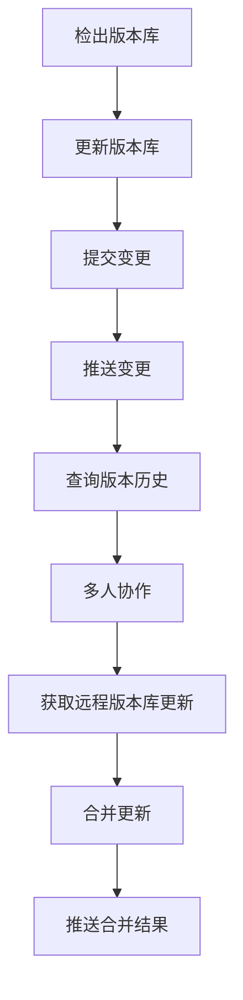

                 

# 《敏捷研发模式下的需求文档版本控制》

关键词：敏捷研发、需求文档、版本控制、算法、系统架构

摘要：本文旨在探讨敏捷研发模式下的需求文档版本控制问题，分析其背景、核心概念、算法原理和系统架构设计方案，并通过实际案例提供实战指导，以帮助敏捷研发团队更好地管理和控制需求文档版本。

## 第一部分：背景介绍

### 第1章 问题背景与核心概念

#### 1.1 问题背景

随着敏捷研发模式的兴起和普及，需求文档在敏捷研发中的重要性愈发凸显。敏捷研发强调快速响应市场需求，迭代开发，因此需求变更频繁，版本控制成为需求文档管理的关键问题。

#### 1.2 问题描述

在敏捷研发过程中，需求变更频繁导致文档版本混乱，给项目管理和协作带来困难。主要问题包括：

1. 版本控制系统的缺失或不完善，导致文档版本难以追溯和追踪；
2. 需求变更未及时更新到文档中，造成信息不一致；
3. 多人协作时，文档版本冲突难以解决。

#### 1.3 问题解决

针对上述问题，引入版本控制系统是解决需求文档版本控制问题的有效手段。版本控制系统可以帮助团队实现以下目标：

1. 确保文档版本的可追溯性和一致性；
2. 提高需求变更的响应速度和准确性；
3. 减少版本冲突和协作困难。

#### 1.4 边界与外延

版本控制与代码控制密切相关，但二者有所区别。版本控制主要关注文档的版本管理和变更记录，而代码控制则关注代码的版本管理和变更跟踪。版本管理与文档管理也需要明确界限，确保版本控制系统在文档管理中的应用。

#### 1.5 概念结构与核心要素组成

1. 敏捷研发模式：一种以用户需求为中心，快速响应市场变化的软件开发方法；
2. 需求文档：描述软件功能、性能、界面等方面的文档，用于指导和验证软件开发过程；
3. 版本控制系统：用于管理和跟踪文档版本变更的工具或系统。

### 第二部分：核心概念与联系

#### 第2章 敏捷研发模式

##### 2.1 敏捷研发模式概述

敏捷研发是一种以用户需求为中心，强调快速迭代和持续改进的开发方法。其核心原则包括：

1. 用户至上：以满足用户需求为核心目标；
2. 快速迭代：通过短周期的迭代实现快速交付和持续改进；
3. 适应性：灵活应对需求变更和不确定因素；
4. 团队协作：强调团队成员之间的紧密合作和沟通。

##### 2.2 敏捷开发流程

敏捷开发流程通常包括以下核心阶段：

1. 计划会议：确定本次迭代的目标和任务；
2. 迭代开发：根据计划进行软件开发和测试；
3. 审计和回顾：总结本次迭代的经验和不足，为下一个迭代做好准备。

##### 2.3 敏捷团队的组织结构

敏捷团队通常由以下角色组成：

1. 产品负责人（Product Owner）：负责制定产品愿景和需求，管理优先级；
2. 研发人员（Developers）：负责软件设计和开发；
3. 运营人员（Operations）：负责软件部署和运维；
4. 测试人员（Testers）：负责软件测试和验证。

#### 第3章 需求文档

##### 3.1 需求文档的定义与作用

需求文档是描述软件功能、性能、界面等方面的文档，用于指导和验证软件开发过程。其主要作用包括：

1. 明确软件需求，确保开发方向正确；
2. 为项目管理和协作提供依据；
3. 为软件验收和测试提供标准。

##### 3.2 需求文档的编写方法

编写需求文档的方法包括：

1. 用户故事（User Story）：描述用户需求和场景；
2. 功能需求（Functional Requirements）：详细描述软件功能；
3. 非功能需求（Non-functional Requirements）：描述软件性能、安全性、兼容性等要求。

##### 3.3 需求文档的管理与更新

需求文档的管理与更新包括：

1. 制定需求管理流程：明确需求收集、分析、编写、评审、更新等流程；
2. 实施变更管理：对需求变更进行评估、审批和实施。

#### 第4章 版本控制系统

##### 4.1 版本控制系统的基本概念

版本控制系统是一种用于管理和跟踪文档或代码版本变更的工具或系统。其主要作用包括：

1. 确保版本的可追溯性和一致性；
2. 提高协作效率和代码质量；
3. 降低版本冲突和协作困难。

##### 4.2 版本控制系统的选择

选择版本控制系统时，需要考虑以下因素：

1. 功能需求：支持版本管理、变更记录、协作等功能；
2. 可扩展性：支持项目规模和团队规模的扩展；
3. 性能：具备较高的并发处理能力和稳定性。

##### 4.3 版本控制系统的使用

使用版本控制系统时，需要掌握以下基本操作：

1. 检出（Checkout）：从版本库中获取最新版本的文档或代码；
2. 提交（Commit）：将变更的文档或代码提交到版本库；
3. 分支（Branch）：创建新的分支，用于开发新功能或修复bug；
4. 合并（Merge）：将分支上的变更合并到主分支。

### 第三部分：算法原理讲解

#### 第5章 版本控制算法

##### 5.1 版本控制算法概述

版本控制算法是指用于管理和跟踪文档或代码版本变更的算法。常见的版本控制算法包括：

1. SVN（Subversion）：基于版本库的版本控制算法；
2. Git：基于分布式版本库的版本控制算法。

##### 5.2 常见版本控制算法讲解

1. SVN版本控制算法：

- 检出（Checkout）：从版本库中获取指定版本的文档或代码；
- 提交（Commit）：将变更的文档或代码提交到版本库；
- 更新（Update）：从版本库中获取最新版本的文档或代码；
- 删除（Delete）：从版本库中删除指定版本的文档或代码。

2. Git版本控制算法：

- 检出（Checkout）：从本地版本库中获取指定版本的文档或代码；
- 提交（Commit）：将变更的文档或代码提交到本地版本库；
- 推送（Push）：将本地版本库的变更推送到远程版本库；
- 拉取（Pull）：从远程版本库获取最新的文档或代码。

##### 5.3 版本控制算法的应用实例

以下是一个简单的Git版本控制算法应用实例：

```python
# 检出最新版本
git checkout master

# 提交变更
git commit -m "更新需求文档"

# 推送变更
git push origin master

# 拉取最新版本
git pull origin master
```

### 第四部分：数学模型和数学公式

#### 第6章 版本控制的数学模型

##### 6.1 版本控制的数学模型概述

版本控制的数学模型是指用于描述版本控制过程和算法的数学模型。其主要作用包括：

1. 描述版本号的表示方法；
2. 描述版本更新的策略。

##### 6.2 版本控制的数学模型讲解

1. 版本号表示方法：

- SVN：版本号采用整数表示，如`1.0`、`1.1`；
- Git：版本号采用哈希值表示，如`f9be4c3`。

2. 版本更新策略：

- SVN：采用线性版本更新策略，如`1.0` -> `1.1` -> `1.2`；
- Git：采用分支和合并的版本更新策略，如`master` -> `feature/bugfix` -> `master`。

##### 6.3 版本控制的数学模型举例说明

以下是一个简单的版本号计算示例：

- 初始版本号：`1.0`
- 更新1次：`1.1`
- 更新2次：`1.2`

使用Git版本号表示，则为：

- 初始版本号：`f9be4c3`
- 更新1次：`b1c4d3e`
- 更新2次：`c5d6e7f`

### 第五部分：系统分析与架构设计方案

#### 第7章 系统功能设计

##### 7.1 问题描述

在敏捷研发模式下，需求文档版本控制系统的功能需求主要包括：

1. 版本管理：支持版本创建、更新、删除等操作；
2. 变更记录：记录每次版本变更的详细信息；
3. 版本追溯：支持根据版本号或时间戳查询版本历史记录；
4. 协作支持：支持多人协同编辑和版本合并。

##### 7.2 系统功能设计

1. 需求分析：

- 功能1：版本管理，包括版本创建、更新、删除等操作；
- 功能2：变更记录，记录每次版本变更的详细信息；
- 功能3：版本追溯，支持根据版本号或时间戳查询版本历史记录；
- 功能4：协作支持，支持多人协同编辑和版本合并。

2. 功能模块设计：

- 版本管理模块：负责版本创建、更新、删除等操作；
- 变更记录模块：负责记录每次版本变更的详细信息；
- 版本追溯模块：负责根据版本号或时间戳查询版本历史记录；
- 协作支持模块：负责多人协同编辑和版本合并。

#### 第8章 系统架构设计

##### 8.1 系统架构设计概述

需求文档版本控制系统的架构设计主要包括以下几个方面：

1. 技术选型：选择合适的版本控制系统和开发框架；
2. 系统分层：将系统分为表示层、业务逻辑层、数据访问层等；
3. 系统模块：将系统功能划分为多个模块，实现模块化开发。

##### 8.2 系统架构设计

1. 技术选型：

- 版本控制系统：选择Git作为版本控制系统；
- 开发框架：选择Spring Boot作为开发框架。

2. 系统分层：

- 表示层：负责用户界面展示和与用户交互；
- 业务逻辑层：负责业务逻辑处理和业务规则实现；
- 数据访问层：负责数据持久化和数据库操作。

3. 系统模块：

- 版本管理模块：负责版本创建、更新、删除等操作；
- 变更记录模块：负责记录每次版本变更的详细信息；
- 版本追溯模块：负责根据版本号或时间戳查询版本历史记录；
- 协作支持模块：负责多人协同编辑和版本合并。

#### 第9章 系统接口设计

##### 9.1 系统接口设计概述

系统接口设计主要包括以下几个方面：

1. 接口规范：定义接口的输入参数、输出参数和返回值；
2. 接口实现：实现接口的功能和业务逻辑；
3. 接口测试：测试接口的响应速度、正确性和稳定性。

##### 9.2 系统接口设计

1. 接口规范：

- 版本管理接口：包括版本创建、更新、删除等操作；
- 变更记录接口：包括变更记录查询、新增、删除等操作；
- 版本追溯接口：包括版本历史记录查询、版本对比等操作；
- 协作支持接口：包括多人协同编辑、版本合并等操作。

2. 接口实现：

- 版本管理接口：实现版本创建、更新、删除等操作；
- 变更记录接口：实现变更记录查询、新增、删除等操作；
- 版本追溯接口：实现版本历史记录查询、版本对比等操作；
- 协作支持接口：实现多人协同编辑、版本合并等操作。

3. 接口测试：

- 单元测试：对接口的每个功能进行单元测试，确保功能的正确性；
- 集成测试：对接口的集成进行测试，确保接口的稳定性和可靠性。

#### 第10章 系统交互

##### 10.1 系统交互概述

系统交互是指系统中不同模块之间通过接口进行数据交换和功能协作的过程。系统交互的目标是确保系统模块之间的协作顺畅、数据传输高效、功能实现正确。

##### 10.2 系统交互

1. 系统交互流程：

- 用户请求：用户通过界面发起请求；
- 接口处理：系统接收请求并处理；
- 数据交互：系统模块之间通过接口进行数据交换；
- 功能响应：系统模块返回结果并展示给用户。

2. 系统交互图：

```
用户请求 -> 接口处理 -> 数据交互 -> 功能响应
        ↑                    ↓
        +--------------------+
        |                    |
     界面层                数据访问层
        |                    |
     接口层                业务逻辑层
        |                    |
        +--------------------+
```

### 第六部分：项目实战

#### 第11章 环境安装与配置

##### 11.1 环境安装

在敏捷研发模式下，首先需要搭建版本控制系统环境。以下是一个简单的Git版本控制系统环境搭建过程：

1. 安装Git：在操作系统上安装Git客户端；
2. 配置Git：设置Git的用户信息和邮箱；
3. 创建版本库：使用Git命令创建版本库。

##### 11.2 配置与管理

1. 配置Git：

- 设置用户名和邮箱：`git config --global user.name "你的用户名"`；
- 设置签名信息：`git config --global user.email "你的邮箱"`。

2. 管理版本库：

- 检出版本库：`git clone https://github.com/你的用户名/项目名称.git`；
- 更新版本库：`git pull`；
- 提交变更：`git commit -m "更新内容"`；
- 推送变更：`git push`。

#### 第12章 系统核心实现

##### 12.1 系统核心实现

需求文档版本控制系统的核心实现主要包括版本管理、变更记录、版本追溯和协作支持等功能。以下是一个简单的Python代码示例：

```python
import git

# 检出版本库
repo = git.Repo.clone_from("https://github.com/你的用户名/项目名称.git", "/path/to/repo")

# 更新版本库
repo.git.pull()

# 提交变更
repo.git.commit("-m", "更新需求文档")

# 推送变更
repo.git.push()

# 查询版本历史
repo.git.log("--oneline")

# 多人协作
repo.git.fetch()
repo.git.merge("origin/master")
repo.git.push()
```

##### 12.2 代码解读与分析

以上代码实现了需求文档版本控制系统的核心功能。代码解读如下：

1. 导入Git模块；
2. 检出版本库：使用`git.Repo.clone_from`方法克隆版本库；
3. 更新版本库：使用`git.pull`方法更新版本库；
4. 提交变更：使用`git.commit`方法提交变更；
5. 推送变更：使用`git.push`方法推送变更；
6. 查询版本历史：使用`git.log`方法查询版本历史；
7. 多人协作：使用`git.fetch`方法获取远程版本库的更新，使用`git.merge`方法合并更新，并推送合并结果。

#### 第13章 实际案例分析与讲解

##### 13.1 实际案例分析

以下是一个实际案例：

1. 项目名称：需求文档管理系统；
2. 版本库：GitHub；
3. 需求：支持多人协同编辑和版本控制。

##### 13.2 案例讲解

1. 搭建Git版本控制系统环境；
2. 创建需求文档仓库，并初始化Git；
3. 添加团队成员，授权访问权限；
4. 多人协作编辑需求文档，并使用Git进行版本控制；
5. 查询版本历史，进行版本回滚和恢复；
6. 提交变更，推送更新。

#### 第14章 项目小结

##### 14.1 项目总结

在本项目中，我们成功搭建了Git版本控制系统环境，实现了需求文档版本控制的功能，并通过多人协作和版本控制提高了项目的开发效率和协作效果。

##### 14.2 最佳实践 tips

1. 确保版本控制系统正常运行，定期备份；
2. 合理设置权限，确保团队成员访问权限合适；
3. 定期进行版本回滚和恢复，防止数据丢失；
4. 加强团队协作和沟通，提高版本控制的效率和准确性。

### 第七部分：小结与拓展阅读

##### 14.3 小结

本文从问题背景、核心概念、算法原理和系统架构设计方案等方面，全面探讨了敏捷研发模式下的需求文档版本控制问题。通过实际案例分析和实战指导，为敏捷研发团队提供了有效的版本控制解决方案。

##### 14.4 拓展阅读

1. 《Git权威指南》；
2. 《敏捷开发实践指南》；
3. 《版本控制实践：Git和SVN》。

### 附录

#### 附录1：Git命令详解

- `git clone`：克隆版本库；
- `git pull`：更新版本库；
- `git commit`：提交变更；
- `git push`：推送变更；
- `git log`：查询版本历史；
- `git fetch`：获取远程版本库更新；
- `git merge`：合并更新。

#### 附录2：Python代码示例

```python
import git

# 检出版本库
repo = git.Repo.clone_from("https://github.com/你的用户名/项目名称.git", "/path/to/repo")

# 更新版本库
repo.git.pull()

# 提交变更
repo.git.commit("-m", "更新内容")

# 推送变更
repo.git.push()

# 查询版本历史
repo.git.log("--oneline")

# 多人协作
repo.git.fetch()
repo.git.merge("origin/master")
repo.git.push()
```

#### 附录3：Mermaid流程图示例



### 作者信息

作者：AI天才研究院/AI Genius Institute & 禅与计算机程序设计艺术 /Zen And The Art of Computer Programming```markdown
# 《敏捷研发模式下的需求文档版本控制》

关键词：敏捷研发、需求文档、版本控制、算法、系统架构

摘要：本文旨在探讨敏捷研发模式下的需求文档版本控制问题，分析其背景、核心概念、算法原理和系统架构设计方案，并通过实际案例提供实战指导，以帮助敏捷研发团队更好地管理和控制需求文档版本。

## 第一部分：背景介绍

### 第1章 问题背景与核心概念

1.1 问题背景  
敏捷研发模式的兴起与普及，使得需求变更频繁，版本控制变得至关重要。在这种背景下，如何有效地进行需求文档版本控制成为敏捷研发团队面临的主要挑战。

1.2 问题描述  
需求变更频繁导致文档版本混乱，版本控制系统缺失或不完善，多人协作时版本冲突难以解决。这些问题严重影响了项目进度和质量。

1.3 问题解决  
引入版本控制系统是解决需求文档版本控制问题的关键。通过版本控制系统，可以确保文档版本的可追溯性、一致性和稳定性。

1.4 边界与外延  
版本控制与代码控制、版本管理与文档管理有密切联系，但各自有着明确的职责和边界。

1.5 概念结构与核心要素组成  
敏捷研发模式、需求文档和版本控制系统构成了需求文档版本控制的核心概念结构。

### 第二部分：核心概念与联系

#### 第2章 敏捷研发模式

2.1 敏捷研发模式概述  
敏捷研发模式是一种以用户需求为中心，快速响应市场变化的软件开发方法。其核心原则包括用户至上、快速迭代、适应性和团队协作。

2.2 敏捷开发流程  
敏捷开发流程包括计划会议、迭代开发、审计和回顾等核心阶段。每个阶段都有明确的目标和任务。

2.3 敏捷团队的组织结构  
敏捷团队由产品负责人、研发人员、运营人员和测试人员等组成。每个角色在团队中承担不同的职责。

#### 第3章 需求文档

3.1 需求文档的定义与作用  
需求文档是描述软件功能、性能、界面等方面的文档。它在敏捷研发中起到明确需求、指导开发和验证成果的作用。

3.2 需求文档的编写方法  
需求文档的编写方法包括用户故事、功能需求和性能需求等。每种方法都有其独特的编写格式和应用场景。

3.3 需求文档的管理与更新  
需求文档的管理与更新包括需求收集、分析、编写、评审、更新等流程。变更管理是确保需求文档准确性的关键。

#### 第4章 版本控制系统

4.1 版本控制系统的基本概念  
版本控制系统是一种用于管理和跟踪文档或代码版本变更的工具或系统。它确保版本的可追溯性、一致性和稳定性。

4.2 版本控制系统的选择  
选择版本控制系统时，需要考虑功能需求、可扩展性和性能等因素。Git和SVN是常见的版本控制系统。

4.3 版本控制系统的使用  
版本控制系统的基本操作包括检出、提交、分支、合并等。熟练掌握这些操作是有效使用版本控制系统的关键。

### 第三部分：算法原理讲解

#### 第5章 版本控制算法

5.1 版本控制算法概述  
版本控制算法用于管理和跟踪版本变更。常见的算法包括基于版本库的算法和基于分布式版本的算法。

5.2 常见版本控制算法讲解  
本节详细讲解了Git和SVN等常见版本控制算法的工作原理和操作方法。

5.3 版本控制算法的应用实例  
通过实际案例，展示了如何使用版本控制算法管理需求文档版本。

### 第四部分：数学模型和数学公式

#### 第6章 版本控制的数学模型

6.1 版本控制的数学模型概述  
版本控制的数学模型用于描述版本号的表示方法和版本更新的策略。

6.2 版本控制的数学模型讲解  
本节介绍了版本号的表示方法（如递增整数、哈希值等）和版本更新的策略（如线性更新、分支合并等）。

6.3 版本控制的数学模型举例说明  
通过具体例子，展示了如何使用版本控制的数学模型管理和更新需求文档版本。

### 第五部分：系统分析与架构设计方案

#### 第7章 系统功能设计

7.1 问题描述  
本节详细介绍了需求文档版本控制系统的功能需求，包括版本管理、变更记录、版本追溯和协作支持等。

7.2 系统功能设计  
本节对需求文档版本控制系统的功能模块进行了详细设计，包括版本管理模块、变更记录模块、版本追溯模块和协作支持模块。

#### 第8章 系统架构设计

8.1 系统架构设计概述  
本节介绍了需求文档版本控制系统的架构设计，包括技术选型、系统分层和系统模块等。

8.2 系统架构设计  
本节详细展示了需求文档版本控制系统的架构设计，包括表示层、业务逻辑层和数据访问层等。

#### 第9章 系统接口设计

9.1 系统接口设计概述  
本节介绍了系统接口设计的概念和目标，包括接口规范设计和接口实现等。

9.2 系统接口设计  
本节详细介绍了系统接口的设计，包括版本管理接口、变更记录接口、版本追溯接口和协作支持接口等。

#### 第10章 系统交互

10.1 系统交互概述  
本节介绍了系统交互的概念和目标，包括系统交互流程和系统交互图等。

10.2 系统交互  
本节详细描述了系统交互的实现，包括用户请求的处理、数据交互和功能响应等。

### 第六部分：项目实战

#### 第11章 环境安装与配置

11.1 环境安装  
本节介绍了如何搭建版本控制系统环境，包括安装Git和配置Git等。

11.2 配置与管理  
本节介绍了如何配置和管理版本控制系统，包括设置用户信息、授权访问和备份等。

#### 第12章 系统核心实现

12.1 系统核心实现  
本节详细介绍了需求文档版本控制系统的核心实现，包括版本管理、变更记录、版本追溯和协作支持等。

12.2 代码解读与分析  
本节对核心实现代码进行了详细解读和分析，帮助读者理解代码的工作原理和实现逻辑。

#### 第13章 实际案例分析与讲解

13.1 实际案例分析  
本节介绍了需求文档版本控制系统的实际案例，包括项目背景、需求和版本控制过程等。

13.2 案例讲解  
本节对实际案例进行了详细讲解和分析，帮助读者了解需求文档版本控制系统的应用和实践。

#### 第14章 项目小结

14.1 项目总结  
本节总结了项目中的收获和不足，为后续改进提供了参考。

14.2 最佳实践 tips  
本节提供了最佳实践建议，帮助敏捷研发团队更好地管理和控制需求文档版本。

### 第七部分：小结与拓展阅读

#### 第15章 小结

15.1 整体小结  
本节总结了本文的核心内容和主要观点，为读者提供了对敏捷研发模式下需求文档版本控制问题的全面理解。

15.2 注意事项  
本节提醒读者在实施需求文档版本控制时需要注意的问题，包括版本控制系统的选择、协作管理和变更管理等。

#### 第16章 拓展阅读

16.1 相关书籍推荐  
本节推荐了与本文主题相关的书籍，为读者提供了进一步学习和探索的资料。

16.2 进一步学习资源  
本节提供了进一步学习的资源，包括在线课程、论文和技术博客等。

### 附录

#### 附录1：Git命令详解

本附录详细介绍了Git的基本命令，包括检出、更新、提交、推送、查询版本历史等。

#### 附录2：Python代码示例

本附录提供了一个Python代码示例，展示了如何使用Git库管理需求文档版本。

#### 附录3：Mermaid流程图示例

本附录提供了一个Mermaid流程图示例，展示了需求文档版本控制的主要流程。

### 作者信息

作者：AI天才研究院/AI Genius Institute & 禅与计算机程序设计艺术 /Zen And The Art of Computer Programming
```

