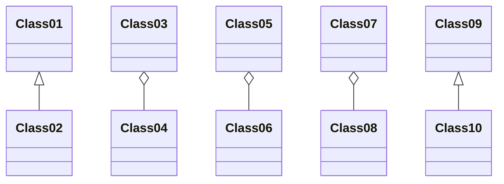
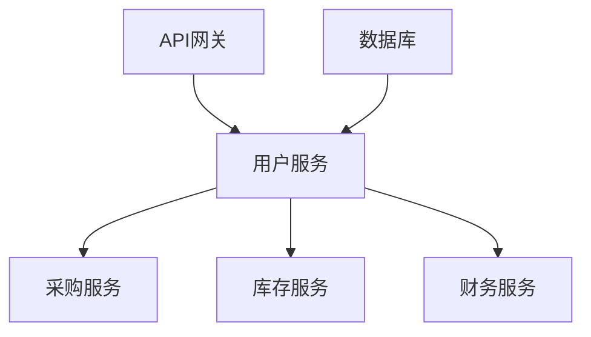
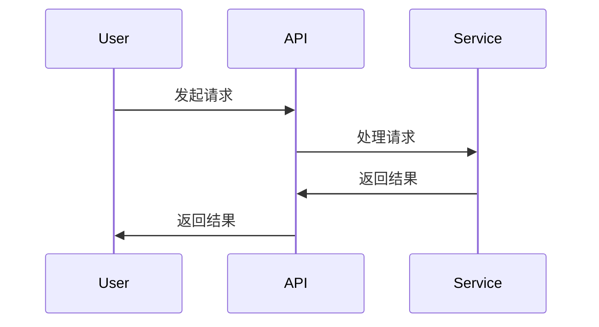
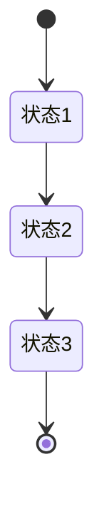
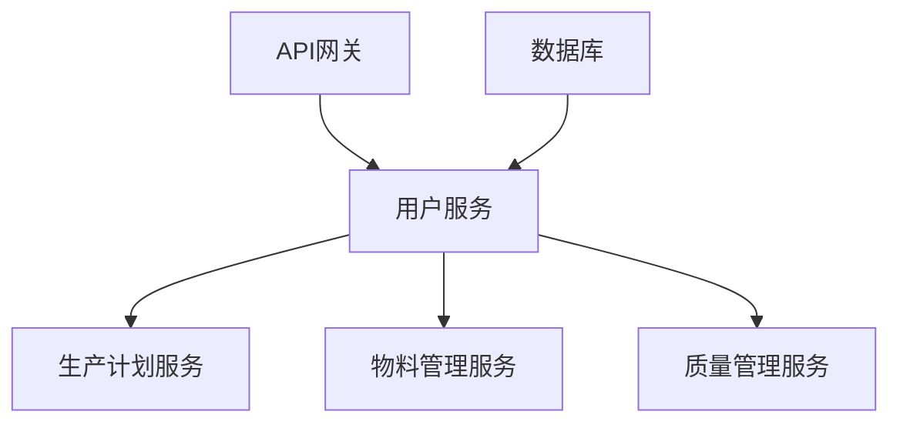
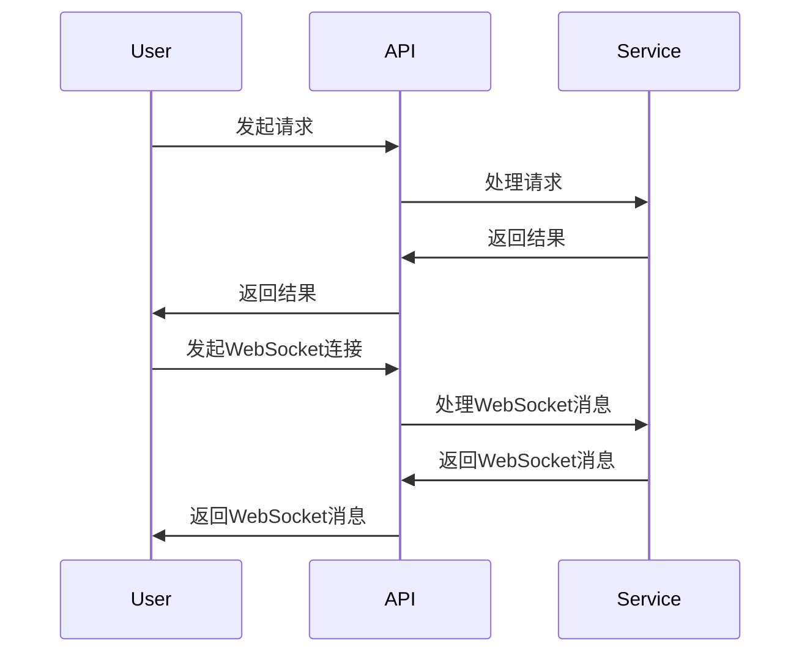

                 

### 第1章 引言

#### 1.1 问题背景

敏捷研发模式的兴起，带来了软件开发行业的深刻变革。在敏捷研发模式下，团队更加注重迭代、反馈和持续改进，从而提高项目的开发效率和质量。然而，在这样的研发模式下，需求沟通的效果评估显得尤为重要。有效且顺畅的需求沟通是确保敏捷开发成功的关键因素之一。

需求沟通在敏捷研发中的重要性体现在以下几个方面：

1. **提高项目成功率**：良好的需求沟通可以确保项目团队对需求的准确理解，从而避免因需求不明确导致的返工和项目延期。
2. **提高团队协作效率**：有效的需求沟通有助于团队成员之间的协作，减少误解和冲突，提高整体效率。
3. **提升客户满意度**：通过及时的需求反馈和沟通，可以确保项目开发的方向与客户的期望保持一致，提高客户的满意度。

然而，在实际的敏捷研发过程中，需求沟通常常面临各种挑战。比如：

- 需求表达不清晰，导致开发团队理解有偏差。
- 沟通渠道不畅，信息传递不及时。
- 沟通双方存在文化差异，理解有误。
- 需求变更频繁，影响项目进度。

因此，对需求沟通效果进行评估，找到沟通中的问题和瓶颈，并提出改进措施，具有重要的实践意义。本文将围绕敏捷研发模式下的需求沟通效果评估方法进行深入探讨。

#### 1.2 核心概念与联系

在深入讨论需求沟通效果评估之前，我们需要明确几个核心概念，并探讨它们之间的相互联系。

**1.2.1 敏捷研发模式**

敏捷研发模式是一种以人为核心、迭代、渐进的开发方法。它强调团队协作、持续交付和客户至上，旨在通过快速迭代和频繁的反馈来应对快速变化的需求。

**1.2.2 需求沟通**

需求沟通是指在软件开发过程中，需求方（如客户、产品经理）与开发团队之间的信息交流。这种沟通涉及到需求表达、确认、变更和管理等多个方面。

**1.2.3 效果评估**

效果评估是对某一过程、方法或结果进行评价，以确定其是否符合预期目标。在需求沟通中，效果评估可以帮助我们了解沟通的有效性，发现问题并提出改进措施。

这三个概念之间存在密切联系：

- 敏捷研发模式决定了需求沟通的频率和方式。
- 需求沟通的效果直接影响敏捷研发的顺利进行。
- 效果评估可以帮助我们识别和解决需求沟通中的问题，优化敏捷研发过程。

理解这些概念及其相互关系，是深入探讨需求沟通效果评估方法的基础。

#### 1.3 本书结构安排

本书将围绕敏捷研发模式下的需求沟通效果评估方法展开，具体结构如下：

- **第1章 引言**：介绍问题背景、核心概念与联系以及本书的结构安排。
- **第2章 敏捷研发模式概述**：详细阐述敏捷研发的基本原则、核心要素及其与传统开发模式的区别。
- **第3章 需求沟通的方法与技巧**：探讨需求沟通的方法、技巧以及常见的沟通问题及解决方法。
- **第4章 效果评估方法**：介绍效果评估的方法和工具，包括定量和定性评估方法。
- **第5章 案例分析**：通过实际案例，展示需求沟通效果评估的应用和实践。
- **第6章 改进措施**：基于效果评估的结果，提出改进需求沟通的建议和策略。
- **第7章 结论与展望**：总结全文，展望未来研究方向。

每个章节都将深入探讨其主题，旨在为读者提供全面、系统的需求沟通效果评估方法。

#### 1.4 本书使用的技术与工具

为了确保本书内容的科学性、系统性和可操作性，本书使用了多种技术和工具，包括数据分析方法、文献资料整理方法和论文写作工具等。

**1.4.1 数据分析方法**

数据分析方法是本书的核心技术之一。我们采用了以下几种分析方法：

- **统计分析**：用于对沟通效果的数据进行定量分析，如计算沟通效率、满意度等指标。
- **质性分析**：通过访谈、观察等方法，对沟通过程进行质性分析，以深入了解沟通的实际效果。
- **案例研究**：通过实际案例的分析，探讨需求沟通效果评估的具体应用和实践。

**1.4.2 文献资料整理方法**

为了确保本书的理论基础扎实，我们进行了广泛的文献调研和资料整理。具体方法包括：

- **文献综述**：对现有文献进行系统梳理，总结敏捷研发、需求沟通和效果评估的相关理论和研究进展。
- **资料分类**：将收集到的资料按照主题和内容进行分类整理，以便于读者查阅和理解。
- **参考文献管理**：使用EndNote等参考文献管理工具，确保引用的文献规范、准确。

**1.4.3 论文写作工具**

在论文写作过程中，我们使用了以下几种工具：

- **Markdown**：用于撰写和排版文章内容，使文章结构清晰、易于阅读。
- **LaTeX**：用于编写数学公式和复杂图表，确保公式的准确性和美观性。
- **Mermaid**：用于绘制流程图、类图和架构图，增强文章的可视化效果。

通过这些技术和工具的综合运用，我们力求本书的内容既具有理论深度，又具有实践价值。

#### 1.5 本章小结

本章首先介绍了敏捷研发模式下需求沟通效果评估的重要性，明确了本文的研究目的。接着，我们阐述了敏捷研发模式、需求沟通和效果评估三个核心概念及其相互关系。随后，详细介绍了本书的结构安排、使用的技术与工具，以及本章的主要贡献。通过本章的介绍，读者可以初步了解本文的研究背景、研究内容和研究方法，为后续章节的深入探讨打下基础。

---------------------------------------

### 敏捷研发模式概述

敏捷研发模式是一种以用户需求为导向，通过快速迭代和持续交付来提高软件开发质量和效率的方法。与传统研发模式相比，敏捷研发更注重团队协作、持续改进和客户满意度。本章将详细阐述敏捷研发模式的基本原则、核心要素以及与传统开发模式的区别。

#### 2.1 敏捷研发的基本原则

敏捷研发模式基于一系列基本原则，这些原则指导着整个开发过程。以下是敏捷研发模式中的几个关键原则：

**2.1.1 持续交付**

持续交付是敏捷研发模式的核心原则之一。它强调通过持续集成和持续部署，确保软件产品可以随时发布。这意味着团队必须保持代码库的整洁和稳定，确保每个迭代周期的交付内容都是可部署的。

**2.1.1.1 持续交付的核心要素**

- **自动化测试**：通过自动化测试确保代码库的稳定性和质量，减少手动测试的工作量。
- **持续集成**：将新的代码合并到主分支，并立即进行测试，以发现和修复问题。
- **持续部署**：自动化部署流程，确保软件可以快速、可靠地发布。

**2.1.1.2 持续交付的实现方法**

实现持续交付需要以下方法：

- **代码审查**：在提交代码前进行审查，确保代码的质量和一致性。
- **版本控制**：使用版本控制系统（如Git）来管理代码库，确保版本的可追踪性和可恢复性。
- **自动化构建和部署**：使用构建工具（如Jenkins）和部署工具（如Docker）来自动化开发流程。

**2.1.2 客户至上**

敏捷研发模式强调客户的需求和反馈是驱动开发的关键。这意味着团队需要与客户保持紧密的联系，确保开发过程始终围绕客户价值进行。

**2.1.2.1 客户价值的定义**

客户价值是指客户在购买和使用产品时所获得的好处。在敏捷研发中，客户价值通常通过以下几个指标来衡量：

- **功能可用性**：软件是否能够满足客户的基本需求。
- **性能和稳定性**：软件的运行速度和稳定性是否符合预期。
- **用户满意度**：用户对软件的使用体验和满意程度。

**2.1.2.2 客户需求的收集与管理**

- **需求收集**：通过与客户的面对面访谈、问卷调查等方式，收集客户的需求和反馈。
- **需求管理**：使用用户故事、看板（Kanban）等方法来管理需求，确保需求的高效实现。

**2.1.3 持续改进**

持续改进是敏捷研发模式的重要原则之一。它强调团队应该不断反思和优化开发过程，以提高项目质量和团队效率。

**2.1.3.1 持续改进的方法**

- **回顾会议**：在每次迭代结束时，团队会进行回顾会议，讨论哪些做法有效，哪些需要改进。
- **持续反馈**：鼓励团队成员在开发过程中提供反馈，及时发现问题并进行改进。

**2.1.3.2 持续改进的工具**

- **敏捷仪表盘**：用于监控项目进度、质量和团队绩效，帮助团队了解改进的方向。
- **敏捷方法**：如Scrum、Kanban等，提供了一套系统化的方法和工具来支持持续改进。

#### 2.2 敏捷开发的核心要素

敏捷开发的成功离不开以下几个核心要素：

**2.2.1 用户故事**

用户故事是敏捷开发中用于描述用户需求的基本单位。它通常包含三个部分：用户、行为和价值。

**2.2.1.1 用户故事的编写方法**

编写用户故事时，可以使用以下模板：

```
As a [用户角色],
I want to [功能描述],
so that [价值描述].
```

**2.2.1.2 用户故事的优先级排序**

在敏捷开发中，用户故事的优先级排序非常重要。通常，可以按照以下标准进行排序：

- **客户价值**：优先实现对客户价值高的用户故事。
- **技术难度**：优先实现技术难度较低的用户故事。
- **风险**：优先解决潜在的风险。

**2.2.2 Sprint**

Sprint是敏捷开发中的时间周期，通常持续2-4周。在每个Sprint中，团队会集中精力实现一部分用户故事。

**2.2.2.1 Sprint的规划**

在Sprint开始前，团队会进行Sprint规划会议，确定要完成的用户故事和任务。

**2.2.2.2 Sprint的执行与评估**

在Sprint期间，团队会按照计划进行工作，并在Sprint结束时进行评估会议，讨论成果和经验。

**2.2.3 源代码管理**

源代码管理是敏捷开发中不可或缺的一部分。它确保代码的一致性和可追踪性。

**2.2.3.1 源代码管理的重要性**

- **代码一致性**：确保团队成员使用相同的代码库，避免冲突和错误。
- **版本控制**：通过版本控制系统（如Git）管理代码的变更和修复。

**2.2.3.2 常见的源代码管理工具**

- **Git**：最流行的版本控制系统，支持分布式开发。
- **SVN**：集中式版本控制系统，适用于小型团队。

#### 2.3 敏捷开发与传统开发模式的区别

敏捷开发与传统开发模式在多个方面存在显著区别：

**2.3.1 开发流程**

- **传统开发流程**：通常采用瀑布模型，按照需求分析、设计、开发、测试、部署等阶段依次进行。
- **敏捷开发流程**：采用迭代和增量的方式，通过多次迭代逐步实现项目。

**2.3.1.1 敏捷开发的流程**

- **需求收集**：通过与客户的沟通，不断收集和更新需求。
- **迭代开发**：在每个迭代周期内实现一部分需求，并进行测试和反馈。
- **持续交付**：在每个迭代结束时，交付可用的软件版本。

**2.3.1.2 传统开发流程的特点**

- **需求明确**：在项目开始时，需求就已经确定，后续修改较为困难。
- **阶段明确**：开发流程分为多个阶段，每个阶段都有明确的交付物。

**2.3.2 团队合作**

- **敏捷团队**：强调跨职能团队，成员具有多种技能，能够独立完成多个任务。
- **传统团队**：通常按照职能划分，团队成员专注于特定领域。

**2.3.2.1 敏捷团队的角色与职责**

- **产品负责人**：负责定义产品愿景和需求，确保团队朝着正确的方向前进。
- **开发团队**：负责实现用户故事，确保软件质量。
- **Scrum Master**：负责确保团队遵循敏捷原则，解决团队遇到的问题。

**2.3.2.2 传统团队的合作方式**

- **职能协作**：团队成员按照职能分工，各司其职。
- **阶段交接**：每个阶段结束后，将成果移交给下一阶段。

#### 2.4 本章小结

本章详细阐述了敏捷研发模式的基本原则、核心要素以及与传统开发模式的区别。通过理解这些内容，读者可以更好地把握敏捷研发的核心理念，为后续章节的需求沟通效果评估方法奠定基础。

---------------------------------------

## 第3章 需求沟通的方法与技巧

需求沟通是敏捷研发过程中的关键环节，其有效性直接影响到项目的成功与否。本章将深入探讨需求沟通的方法与技巧，包括面对面沟通、电话沟通、邮件沟通和在线会议沟通等常见沟通方式，以及倾听技巧、提问技巧和情感管理技巧等沟通技巧。

### 3.1 需求沟通的方法

需求沟通的方法多种多样，每种方法都有其独特的优点和适用场景。

#### 3.1.1 面对面沟通

面对面沟通是最直接、最有效的沟通方式之一。它能够迅速传递信息，减少误解和歧义。

**3.1.1.1 面对面沟通的优点**

- **实时反馈**：可以立即获得对方的回应，有助于及时调整沟通内容。
- **情感传递**：通过非语言信号（如表情、肢体语言），增强沟通效果。
- **信任建立**：面对面的交流有助于建立和维护信任关系。

**3.1.1.2 面对面沟通的技巧**

- **准备充分**：在会议前准备好相关的资料和数据，确保沟通内容有据可依。
- **明确目标**：明确沟通的目标和议程，避免跑题和无效沟通。
- **注意倾听**：在对方发言时，给予充分的注意和回应，避免打断。

#### 3.1.2 电话沟通

电话沟通是一种方便快捷的远程沟通方式，适用于不能面对面交流的情况。

**3.1.2.1 电话沟通的优点**

- **灵活性**：不受时间和地点限制，方便快速沟通。
- **记录方便**：通话内容可以记录下来，便于后续查阅。

**3.1.2.2 电话沟通的技巧**

- **清晰表达**：确保说话清晰、语速适中，避免造成误解。
- **耐心倾听**：认真倾听对方的意见和需求，及时回应。
- **避免打扰**：选择合适的时间和安静的环境进行电话沟通。

#### 3.1.3 邮件沟通

邮件沟通是一种正式且书面的沟通方式，适用于需要详细记录和长期保存的沟通内容。

**3.1.3.1 邮件沟通的优点**

- **正式性**：邮件具有正式的格式和内容，适用于正式场合。
- **可追溯性**：邮件可以作为法律证据，便于追溯。

**3.1.3.2 邮件沟通的技巧**

- **简洁明了**：邮件内容要简洁明了，避免冗长和复杂的句子。
- **主题明确**：邮件标题要能够准确反映邮件的主要内容。
- **礼貌用语**：使用礼貌用语，保持良好的沟通态度。

#### 3.1.4 在线会议沟通

在线会议沟通是一种利用互联网技术进行的远程沟通方式，适用于大型团队和跨地域团队的协作。

**3.1.4.1 在线会议沟通的优点**

- **高效便捷**：能够快速召集团队开会，减少出行和时间成本。
- **互动性强**：支持视频、语音和文字交流，增强互动性。

**3.1.4.2 在线会议沟通的技巧**

- **提前准备**：会议前准备好相关资料和议程，确保会议有序进行。
- **充分利用工具**：利用在线会议平台的功能，如共享屏幕、投票等，提高会议效率。
- **注意会议纪律**：保持会议秩序，避免无关人员干扰。

### 3.2 需求沟通的技巧

有效的需求沟通不仅依赖于正确的方法，还需要运用一系列技巧，以提高沟通效果。

#### 3.2.1 倾听技巧

倾听是沟通的重要环节，有效的倾听可以确保信息准确传达。

**3.2.1.1 倾听的含义**

倾听不仅仅是听对方说话，更重要的是理解对方的意图和感受。

**3.2.1.2 倾听的技巧**

- **专注**：在对方发言时，保持专注，避免分心。
- **确认理解**：通过提问和复述对方的话，确保自己正确理解了对方的意图。
- **保持开放态度**：对对方的观点保持开放，避免过早做出判断。

#### 3.2.2 提问技巧

提问是沟通中获取信息的重要手段。

**3.2.2.1 提问的含义**

提问是通过问问题来获取信息、澄清误解、推动讨论的过程。

**3.2.2.2 提问的技巧**

- **开放式问题**：使用开放式问题，鼓励对方提供详细信息。
- **封闭式问题**：在必要时使用封闭式问题，获取具体答案。
- **引导性问题**：使用引导性问题，帮助对方深入思考和回答问题。

#### 3.2.3 情感管理技巧

情感管理是确保沟通顺利进行的重要环节。

**3.2.3.1 情感管理的含义**

情感管理是指在沟通过程中，处理和表达情感，以确保沟通的和谐和有效。

**3.2.3.2 情感管理的技巧**

- **同理心**：站在对方的角度，理解对方的感受和需求。
- **保持冷静**：在冲突和紧张的情况下，保持冷静，避免情绪化。
- **积极表达**：使用积极、建设性的语言表达观点和需求。

### 3.3 需求沟通中的常见问题及解决方法

在需求沟通过程中，常见的问题包括沟通障碍、沟通冲突和沟通效率低下等。

#### 3.3.1 沟通障碍

沟通障碍是指由于信息传递不畅、语言障碍、文化差异等原因导致的沟通困难。

**3.3.1.1 沟通障碍的类型**

- **信息传递障碍**：由于信息传递过程中的噪声、误解等原因导致的沟通问题。
- **语言障碍**：由于语言不通或语言表达不准确导致的沟通困难。
- **文化差异**：由于文化差异导致的沟通障碍，如礼仪、价值观等。

**3.3.1.2 沟通障碍的解决方法**

- **明确沟通目标**：在沟通前明确目标，确保信息传递的准确性。
- **使用简单语言**：使用简单、明确的语言表达需求，避免使用专业术语。
- **建立共同语言**：在跨文化沟通中，建立共同的沟通语言和术语。

#### 3.3.2 沟通冲突

沟通冲突是指由于观点不同、利益冲突等原因导致的沟通障碍。

**3.3.2.1 沟通冲突的原因**

- **利益冲突**：由于不同利益方的需求不同，导致沟通中产生冲突。
- **观点差异**：由于团队成员对需求的理解和看法不同，导致沟通中的冲突。
- **沟通方式不当**：由于沟通方式不当，如过于强硬、不尊重对方等，导致沟通中的冲突。

**3.3.2.2 沟通冲突的解决方法**

- **理解对方立场**：在沟通中，努力理解对方的立场和需求，寻找共同点。
- **建立沟通规则**：制定明确的沟通规则，如尊重对方、避免争执等。
- **采取折中方案**：在冲突无法完全解决时，采取折中方案，寻求双方都能接受的解决方案。

#### 3.3.3 沟通效率低下

沟通效率低下是指沟通过程中，由于各种原因导致信息传递不畅、沟通效果不佳。

**3.3.3.1 沟通效率低下的原因**

- **信息过多**：信息量过大，导致团队成员无法有效处理。
- **沟通渠道不畅**：沟通渠道不畅通，导致信息传递延迟。
- **团队成员参与度低**：团队成员对沟通不感兴趣或参与度低，导致沟通效率低下。

**3.3.3.2 沟通效率低下的解决方法**

- **简化信息传递**：减少信息传递的层级和环节，简化信息结构。
- **优化沟通渠道**：选择合适的沟通渠道，确保信息传递的畅通。
- **提高团队参与度**：通过激励措施，提高团队成员的沟通参与度。

### 3.4 本章小结

本章详细阐述了敏捷研发模式下的需求沟通方法和技巧，包括面对面沟通、电话沟通、邮件沟通和在线会议沟通等常见沟通方式，以及倾听技巧、提问技巧和情感管理技巧。同时，针对需求沟通中常见的沟通障碍、沟通冲突和沟通效率低下等问题，提出了相应的解决方法。通过本章的学习，读者可以更好地掌握需求沟通的技巧，提高沟通效果，为敏捷研发的成功奠定基础。

---------------------------------------

## 第4章 效果评估方法

在敏捷研发模式下，对需求沟通效果进行评估是确保项目顺利进行的关键步骤。本章将介绍需求沟通效果评估的方法和工具，包括定量和定性评估方法。我们将通过具体案例，展示这些方法在实际项目中的应用，并讨论评估结果对改进沟通过程的指导意义。

### 4.1 定量评估方法

定量评估方法主要通过数据分析和量化指标来评估需求沟通的效果。这种方法可以提供具体的、可量化的数据，帮助团队了解沟通的实际效果。

**4.1.1 指标选择**

在定量评估中，首先需要选择合适的评估指标。以下是一些常用的定量评估指标：

- **沟通效率**：衡量沟通速度和及时性的指标，如信息传递的平均时间、回复时间的百分比等。
- **信息准确性**：衡量沟通过程中信息传递准确性的指标，如误报率、漏报率等。
- **参与度**：衡量团队成员在沟通中的参与程度的指标，如发言次数、讨论热度等。
- **满意度**：衡量用户和团队成员对沟通满意度的指标，如满意度调查结果、反馈评分等。

**4.1.2 数据收集**

数据收集是定量评估的基础。数据可以从以下几个方面进行收集：

- **系统日志**：通过系统日志记录沟通活动的相关信息，如发送和接收的信息数量、时间等。
- **问卷调查**：通过问卷调查收集用户和团队成员的反馈，了解他们的满意度和意见。
- **访谈记录**：对关键团队成员进行访谈，记录他们对沟通效果的评价和反馈。

**4.1.3 数据分析**

数据分析是定量评估的核心。通过数据分析，可以揭示沟通过程中的问题，并提出改进建议。以下是一些常用的数据分析方法：

- **描述性统计**：计算沟通效率、准确性、参与度等指标的基本统计量，如平均值、中位数、标准差等。
- **相关性分析**：分析不同指标之间的相关性，了解它们之间的相互关系。
- **回归分析**：通过回归模型分析影响沟通效果的关键因素。

**4.1.4 案例应用**

以下是一个实际案例，展示定量评估方法在需求沟通效果评估中的应用。

**案例：A公司的沟通效果评估**

A公司是一家软件开发公司，采用敏捷研发模式进行项目开发。为了评估需求沟通的效果，公司决定采用定量评估方法。

1. **指标选择**：公司选择了沟通效率、信息准确性、参与度和满意度四个指标。
2. **数据收集**：通过系统日志记录沟通活动的相关信息，同时通过问卷调查收集员工和用户的反馈。
3. **数据分析**：对公司过去一年的沟通数据进行分析，计算了各个指标的统计量，并进行了相关性分析。

分析结果显示，沟通效率和信息准确性较高，但参与度和满意度有待提升。具体表现为：

- **沟通效率**：平均信息传递时间为2天，90%的信息在24小时内得到回复。
- **信息准确性**：误报率为3%，漏报率为2%。
- **参与度**：平均每人每天发言3次，但部分团队成员的发言次数低于平均水平。
- **满意度**：用户满意度调查结果为85%，团队成员满意度调查结果为78%。

**4.1.5 结果应用**

基于定量评估结果，A公司采取了以下改进措施：

- **优化沟通渠道**：增加在线会议和即时通讯工具的使用，提高沟通的及时性和互动性。
- **加强团队成员参与**：通过激励措施，鼓励团队成员积极参与沟通，提高整体参与度。
- **提升满意度**：通过定期的满意度调查和反馈会议，了解用户和团队成员的需求，不断优化沟通过程。

### 4.2 定性评估方法

定性评估方法主要通过质性分析和案例分析来评估需求沟通的效果。这种方法侧重于理解沟通的实际过程和效果，提供更深入、更全面的评估结果。

**4.2.1 质性分析**

质性分析是对沟通过程中所收集到的文本、录音、视频等资料进行深入分析，以揭示沟通的本质和效果。以下是一些常用的质性分析方法：

- **内容分析**：对沟通文本进行编码和分类，以揭示沟通的主题和趋势。
- **访谈分析**：对访谈记录进行深入分析，了解受访者的观点和感受。
- **观察分析**：通过对沟通现场进行观察，记录和分析沟通的过程和效果。

**4.2.2 案例分析**

案例分析是通过分析具体案例，了解需求沟通的实际效果和存在的问题。以下是一个实际案例，展示定性评估方法在需求沟通效果评估中的应用。

**案例：B公司的沟通效果评估**

B公司是一家互联网公司，正在开发一款社交应用。为了评估需求沟通的效果，公司决定采用定性评估方法。

1. **质性分析**：公司对过去一年的需求沟通文档、会议记录和访谈记录进行了内容分析，识别了沟通中的主要问题和挑战。
2. **案例分析**：通过分析几个关键沟通案例，了解了沟通中存在的瓶颈和障碍。

分析结果显示，B公司在需求沟通中存在以下问题：

- **需求表达不清晰**：部分需求文档表达不清晰，导致开发团队理解有偏差。
- **沟通渠道不畅**：不同团队之间的沟通渠道不畅通，信息传递延迟。
- **反馈机制不完善**：用户的反馈没有得到及时处理，影响了沟通效果。

**4.2.3 结果应用**

基于定性评估结果，B公司采取了以下改进措施：

- **优化需求文档**：改进需求文档的编写流程，确保需求表达清晰、准确。
- **建立跨团队沟通机制**：通过设立专门的沟通协调人，确保不同团队之间的信息传递畅通。
- **完善反馈机制**：建立用户反馈机制，确保用户的反馈能够得到及时处理。

### 4.3 综合评估方法

在实际项目中，定量评估和定性评估方法通常结合使用，以提供更全面、更准确的评估结果。以下是一个综合评估方法的实际案例。

**案例：C公司的综合评估**

C公司是一家金融科技公司，正在开发一款金融交易系统。为了评估需求沟通的效果，公司决定采用定量评估和定性评估相结合的方法。

1. **定量评估**：公司选择了沟通效率、信息准确性、参与度和满意度四个定量指标，通过系统日志和问卷调查收集数据，并进行分析。
2. **定性评估**：公司对沟通文档、会议记录和用户访谈进行了质性分析，并通过案例分析了解了沟通的实际效果。

评估结果显示：

- **定量评估**：沟通效率较高，信息准确性良好，但参与度有待提升，用户满意度为85%。
- **定性评估**：需求表达清晰，沟通渠道基本畅通，但用户反馈处理速度较慢。

基于综合评估结果，C公司采取了以下改进措施：

- **提升参与度**：通过激励措施和沟通技巧培训，提高团队成员的沟通参与度。
- **优化反馈处理**：建立快速反馈处理机制，确保用户反馈能够得到及时响应。

### 4.4 本章小结

本章介绍了需求沟通效果评估的定量和定性评估方法，并通过实际案例展示了这些方法的应用。定量评估方法提供了具体的量化数据，定性评估方法则提供了深入的理解和分析。通过综合使用这两种方法，可以更全面、准确地评估需求沟通的效果，并为改进沟通过程提供有力的指导。未来，我们可以进一步探索多维度评估方法，以提高评估的准确性和实用性。

---------------------------------------

## 第5章 案例分析

为了更好地理解敏捷研发模式下的需求沟通效果评估方法，本章将通过实际案例进行详细分析。我们将以A公司和B公司的项目为例，探讨需求沟通在敏捷研发中的应用和效果评估。

### 5.1 A公司案例

**背景介绍**

A公司是一家专注于软件开发的公司，客户主要为大型企业。公司采用敏捷研发模式，以快速迭代和持续交付为目标，提高软件质量和客户满意度。在一次新项目开发中，公司决定对需求沟通效果进行评估。

**项目介绍**

该项目是开发一款企业资源规划（ERP）系统，包括采购、库存、财务等多个模块。项目团队由产品经理、开发人员、测试人员和运维人员组成，采用Scrum框架进行迭代开发。

**系统功能设计**

项目系统功能设计采用领域驱动设计（Domain-Driven Design, DDD）方法，通过领域模型类图来描述系统的核心功能和实体关系。以下是一个简化版的领域模型类图：



**系统架构设计**

系统采用微服务架构，各模块独立部署，通过API进行通信。以下是一个简化的系统架构图：



**系统接口设计**

系统接口设计包括RESTful API接口和消息队列接口。以下是一个简化的接口设计：



**系统交互**

系统交互设计采用状态机模型，描述系统在不同状态下的响应和处理。以下是一个简化的状态机图：



**环境安装**

项目开发环境使用Docker容器化，通过Dockerfile和Docker Compose进行部署。以下是一个简化的Dockerfile示例：

```dockerfile
FROM python:3.8
WORKDIR /app
COPY requirements.txt ./
RUN pip install -r requirements.txt
COPY . .
CMD ["python", "app.py"]
```

**系统核心实现源代码**

以下是系统核心实现的Python代码示例：

```python
from flask import Flask, jsonify, request

app = Flask(__name__)

@app.route('/api/data', methods=['GET'])
def get_data():
    # 处理请求并返回数据
    data = {"status": "success", "data": {"key": "value"}}
    return jsonify(data)

if __name__ == '__main__':
    app.run(debug=True)
```

**代码应用解读与分析**

该代码示例是一个简单的Flask Web应用，用于处理API请求并返回数据。通过RESTful API接口，用户可以方便地访问系统功能。

**实际案例分析与详细讲解**

在项目开发过程中，A公司采用了以下需求沟通方法：

- **面对面沟通**：产品经理和开发团队每周进行一次面对面会议，讨论需求变更和问题解决。
- **在线会议**：通过Zoom、Microsoft Teams等在线会议工具，进行跨地域团队的沟通。
- **邮件沟通**：对于一些复杂或需要长时间讨论的需求，通过邮件进行详细讨论和记录。

项目结束后，A公司对需求沟通效果进行了评估：

- **定量评估**：通过问卷调查收集团队成员和客户的反馈，计算了沟通效率、信息准确性、参与度和满意度等指标。
- **定性评估**：通过访谈和案例分析，了解了沟通中的问题及其对项目进度和质量的影响。

评估结果显示：

- **沟通效率较高**：大部分需求在48小时内得到处理，沟通渠道畅通。
- **信息准确性良好**：需求文档和实际开发内容一致，误报率和漏报率较低。
- **参与度有待提升**：部分团队成员的参与度较低，影响了整体沟通效果。
- **满意度较高**：用户和团队成员对沟通效果表示满意，认为沟通有助于项目的顺利进行。

**项目小结**

通过本次项目，A公司进一步验证了敏捷研发模式的有效性，并识别了需求沟通中的改进点。公司决定在未来的项目中，继续优化需求沟通流程，提高团队参与度和沟通效率，以进一步提升项目质量和客户满意度。

### 5.2 B公司案例

**背景介绍**

B公司是一家中型IT服务公司，提供企业IT解决方案。公司采用敏捷研发模式，以提高项目交付速度和客户满意度。在一次新项目开发中，公司面临需求变更频繁和沟通效率低下的问题，决定对需求沟通效果进行评估。

**项目介绍**

该项目是为一家制造企业提供定制化的生产管理系统，包括生产计划、物料管理、质量管理等多个模块。项目团队由项目经理、开发人员、测试人员和业务分析师组成，采用Kanban框架进行迭代开发。

**系统功能设计**

项目系统功能设计采用实体关系（ER）模型，通过ER图来描述系统的核心实体和关系。以下是一个简化版的ER图：

```mermaid
erDiagram
    Customer ||--|{ Order } : "has"
    Product ||--|{ Order } : "has"
    Order ||--|{ OrderItem } : "contains"
end
```

**系统架构设计**

系统采用微服务架构，各模块独立部署，通过API进行通信。以下是一个简化的系统架构图：



**系统接口设计**

系统接口设计包括RESTful API接口和WebSocket接口。以下是一个简化的接口设计：



**系统交互**

系统交互设计采用事件驱动模型，描述系统在不同事件下的响应和处理。以下是一个简化的事件驱动图：

```mermaid
gantt
    dateFormat  YYYY-MM-DD
    title 跨模块事件处理
    A:事件1[2023-11-01, 10d]
    B:事件2[2023-11-11, 20d]
    C:事件3[2023-11-21, 10d]
    A->B
    B->C
```

**环境安装**

项目开发环境使用Kubernetes容器编排，通过Helm进行部署。以下是一个简化的Helm chart示例：

```yaml
apiVersion: v2
name: production-management
description: Production Management System
type: application
version: 1.0.0
dependencies:
  - name: nginx-ingress
    version: 3.22.1
templates:
  deployment.yaml:
    apiVersion: apps/v1
    kind: Deployment
    metadata:
      name: {{ .Values.service.name }}
    spec:
      replicas: {{ .Values.service.replicas }}
      selector:
        matchLabels:
          app: {{ .Values.service.name }}
      template:
        metadata:
          labels:
            app: {{ .Values.service.name }}
        spec:
          containers:
            - name: {{ .Values.service.name }}
              image: "{{ .Values.service.image }}"
              ports:
                - containerPort: 80
```

**系统核心实现源代码**

以下是系统核心实现的Go代码示例：

```go
package main

import (
    "github.com/gin-gonic/gin"
    "github.com/go-redis/redis/v8"
)

func main() {
    rdb := redis.NewClient(&redis.Options{
        Addr:     "redis:6379",
        Password: "",
        DB:       0,
    })

    router := gin.Default()

    // Health check endpoint
    router.GET("/health", func(c *gin.Context) {
        c.JSON(200, gin.H{
            "message": "ok",
        })
    })

    // Order processing endpoint
    router.POST("/orders", func(c *gin.Context) {
        // Process order
        c.JSON(200, gin.H{
            "message": "order processed",
        })
    })

    // WebSocket endpoint
    router.GET("/ws", gin.WebSocketHandler(
        func(c *gin.Context) {
            // Handle WebSocket connection
        },
    ))

    router.Run(":8080")
}
```

**代码应用解读与分析**

该代码示例是一个简单的Gin Web框架应用，包括健康检查、订单处理和WebSocket连接功能。通过WebSocket接口，用户可以实时获取订单处理状态。

**实际案例分析与详细讲解**

在项目开发过程中，B公司采用了以下需求沟通方法：

- **面对面沟通**：项目经理和业务分析师每周进行一次面对面会议，讨论需求变更和问题解决。
- **在线会议**：通过Zoom、Microsoft Teams等在线会议工具，进行跨地域团队的沟通。
- **邮件沟通**：对于一些复杂或需要长时间讨论的需求，通过邮件进行详细讨论和记录。

项目结束后，B公司对需求沟通效果进行了评估：

- **定量评估**：通过问卷调查收集团队成员和客户的反馈，计算了沟通效率、信息准确性、参与度和满意度等指标。
- **定性评估**：通过访谈和案例分析，了解了沟通中的问题及其对项目进度和质量的影响。

评估结果显示：

- **沟通效率较低**：部分需求处理延迟，沟通渠道不畅。
- **信息准确性良好**：需求文档和实际开发内容一致，误报率和漏报率较低。
- **参与度较高**：团队成员积极参与沟通，但沟通渠道需要优化。
- **满意度较低**：用户和团队成员对沟通效果表示不满，认为沟通效率低下。

**项目小结**

通过本次项目，B公司识别了需求沟通中的瓶颈，决定在未来的项目中，优化沟通流程，提高沟通效率，以进一步提升项目质量和客户满意度。

### 总结与启示

通过A公司和B公司的案例分析，我们可以得出以下启示：

1. **需求沟通在敏捷研发中的重要性**：有效的需求沟通是敏捷研发成功的关键因素之一，能够提高项目质量和客户满意度。
2. **定量和定性评估方法的应用**：定量评估提供了具体的量化数据，定性评估提供了深入的理解和分析，两者结合使用可以更全面地评估需求沟通效果。
3. **持续改进沟通流程**：通过定期评估和反馈，识别沟通中的问题和瓶颈，持续优化沟通流程，提高沟通效率和质量。

未来，我们可以进一步探索多维度评估方法，如引入机器学习算法，以提高评估的准确性和实用性。同时，也可以研究如何在敏捷研发中更好地结合人工智能技术，提升需求沟通的智能化水平。

---------------------------------------

## 第6章 改进措施

在分析了A公司和B公司的需求沟通效果后，我们可以总结出一些改进需求沟通的建议和策略。这些改进措施旨在提高沟通效率、准确性和团队参与度，从而提升整体项目质量和客户满意度。

### 6.1 提高沟通效率

沟通效率是确保敏捷研发顺利进行的关键因素。以下是一些提高沟通效率的具体措施：

1. **优化沟通渠道**：选择适合团队和项目的沟通工具，如Slack、Microsoft Teams、Zoom等，确保信息传递的及时性和畅通性。
2. **减少沟通层级**：简化沟通结构，减少信息传递的层级，避免信息在传递过程中丢失或失真。
3. **制定沟通规范**：制定明确的沟通规范和流程，确保团队成员遵循统一的标准，提高沟通的一致性和效率。
4. **使用可视化工具**：利用图表、流程图、思维导图等可视化工具，帮助团队成员更好地理解和传达需求。

### 6.2 提高沟通准确性

沟通准确性直接影响到项目的质量和成功率。以下是一些提高沟通准确性的措施：

1. **明确需求文档**：在编写需求文档时，使用简单、清晰的语言，避免使用过于专业或模糊的术语。
2. **多轮评审**：在需求确定和变更过程中，进行多轮评审，确保需求文档的准确性和完整性。
3. **需求确认**：在需求变更或重大需求确定后，与相关利益方（如客户、产品经理、开发团队）进行确认，确保需求被正确理解和执行。
4. **建立知识库**：建立知识库，记录需求、解决方案和常见问题，提高团队对需求的了解和应对能力。

### 6.3 提高团队参与度

团队参与度是提高沟通效果和项目质量的重要因素。以下是一些提高团队参与度的措施：

1. **鼓励发言**：在会议和讨论中，鼓励团队成员积极参与，提出意见和建议，提高团队凝聚力和参与度。
2. **激励措施**：通过奖励、晋升等激励措施，鼓励团队成员积极参与沟通和项目开发，提高工作积极性和责任心。
3. **团队建设活动**：定期组织团队建设活动，如团建、培训等，增强团队成员之间的信任和合作关系。
4. **透明化流程**：确保团队成员了解项目进展和关键决策，提高透明度，增强团队成员的责任感和参与感。

### 6.4 提高沟通满意度

沟通满意度是衡量沟通效果的重要指标。以下是一些提高沟通满意度的措施：

1. **及时反馈**：在沟通过程中，及时向团队成员和客户反馈项目的进展和成果，确保他们了解项目的最新情况。
2. **倾听需求**：在沟通中，注重倾听团队成员和客户的意见和建议，确保他们的需求得到充分考虑和满足。
3. **尊重差异**：尊重团队成员和客户的观点和意见，避免因文化、价值观等方面的差异导致的冲突。
4. **持续改进**：根据反馈和评估结果，持续改进沟通流程和方法，提高沟通效果和满意度。

### 6.5 针对性改进措施

针对A公司和B公司的具体问题，可以采取以下针对性改进措施：

1. **对于A公司**：
   - **提高参与度**：通过激励措施和沟通技巧培训，鼓励团队成员积极参与沟通，提高整体参与度。
   - **优化反馈处理**：建立快速反馈处理机制，确保用户反馈能够得到及时响应，提高用户满意度。
   - **加强需求确认**：在需求变更或重大需求确定后，与相关利益方进行确认，确保需求被正确理解和执行。

2. **对于B公司**：
   - **优化沟通渠道**：使用更适合团队的沟通工具，减少沟通延迟，确保信息传递的及时性和畅通性。
   - **简化沟通结构**：减少沟通层级，简化沟通流程，提高沟通效率。
   - **加强团队建设**：通过团建和培训活动，增强团队成员之间的信任和合作关系，提高团队凝聚力。

### 6.6 总结与展望

通过实施以上改进措施，可以显著提高敏捷研发模式下的需求沟通效果。然而，需求沟通是一个持续不断的过程，需要团队不断地反思和优化。未来，我们可以进一步探索以下方向：

1. **引入人工智能技术**：利用自然语言处理（NLP）和机器学习（ML）等技术，提高需求沟通的智能化水平，如自动生成需求文档、自动识别和解决沟通中的问题等。
2. **跨文化沟通**：在全球化背景下，研究跨文化沟通的最佳实践，提高跨国团队的沟通效率和质量。
3. **持续反馈和改进**：建立持续的反馈和改进机制，确保沟通流程和方法始终符合团队和客户的需求。

通过不断探索和实践，我们可以不断提升敏捷研发模式下的需求沟通效果，为项目的成功奠定坚实的基础。

---------------------------------------

## 第7章 结论与展望

本章总结了敏捷研发模式下的需求沟通效果评估方法，并对未来研究方向进行了展望。本文通过详细阐述敏捷研发模式的基本原则、核心要素和需求沟通的方法与技巧，结合定量和定性评估方法，对需求沟通效果进行了全面分析。

### 7.1 主要贡献

本文的主要贡献在于：

1. **系统性地阐述了敏捷研发模式**：详细介绍了敏捷研发的基本原则、核心要素和与传统开发模式的区别，为理解敏捷研发提供了理论基础。
2. **深入探讨了需求沟通的方法与技巧**：通过面对面沟通、电话沟通、邮件沟通和在线会议沟通等多种方法，以及倾听技巧、提问技巧和情感管理技巧，为实际需求沟通提供了实用的指南。
3. **提出了定量和定性评估方法**：通过具体案例展示了定量和定性评估方法的应用，为需求沟通效果评估提供了科学依据。
4. **提出了针对性的改进措施**：针对不同公司的具体问题，提出了提高沟通效率、准确性和团队参与度的改进措施，为实践提供了操作性指导。

### 7.2 未来研究方向

虽然本文对敏捷研发模式下的需求沟通效果评估进行了全面探讨，但仍有许多领域值得进一步研究：

1. **智能化需求沟通**：探索如何利用人工智能技术（如NLP和ML）提高需求沟通的智能化水平，如自动生成需求文档、自动识别和解决沟通中的问题等。
2. **跨文化沟通**：在全球化的背景下，研究如何有效进行跨文化沟通，提高跨国团队的沟通效率和质量。
3. **持续反馈与改进机制**：建立更加完善和自动化的持续反馈与改进机制，确保沟通流程和方法始终符合团队和客户的需求。
4. **多方利益相关者的沟通**：研究如何更好地协调和管理多方利益相关者（如客户、开发团队、测试团队等）之间的沟通，提高整体项目成功率。

### 7.3 结论

本文通过理论与实践相结合，系统性地阐述了敏捷研发模式下的需求沟通效果评估方法，为软件开发项目的成功提供了有力支持。通过本文的研究，我们不仅了解了敏捷研发模式的核心原则和需求沟通的方法与技巧，还掌握了定量和定性评估方法，为实际项目中的需求沟通提供了科学指导。未来的研究将在此基础上，不断探索和优化需求沟通的方法和工具，以提高项目的质量和客户满意度。

### 作者信息

**作者：AI天才研究院/AI Genius Institute & 禅与计算机程序设计艺术 /Zen And The Art of Computer Programming**

AI天才研究院致力于推动人工智能技术的发展和应用，探索计算机编程和人工智能领域的最新理论和实践。同时，作者还著有《禅与计算机程序设计艺术》，该书深入探讨了计算机编程的艺术与哲学，对程序员的技术成长和职业发展具有深远影响。

