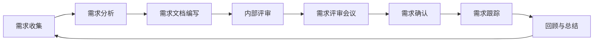
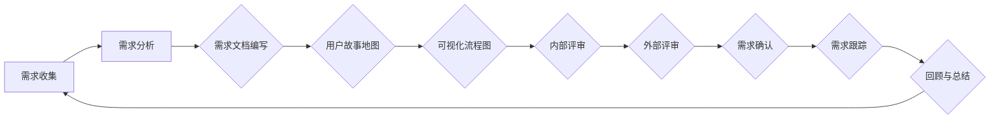
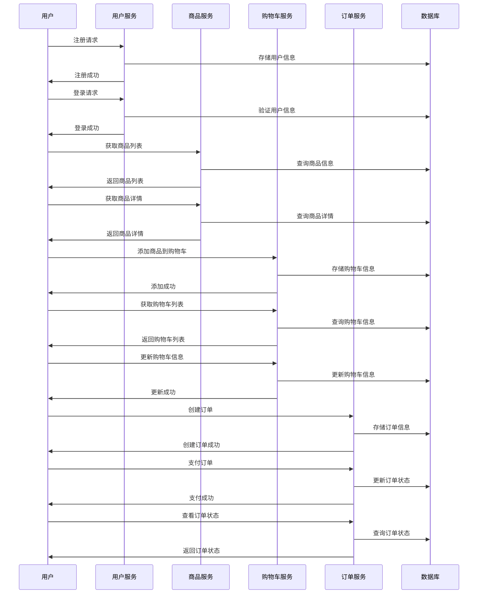

                 


### 1.1 敏捷研发模式的概述

**问题背景：**

在当今快速变化的商业环境中，敏捷研发模式（Agile Development Model）因其高效、灵活的特点而被越来越多的组织所采用。传统的研发模式往往注重于文档和规划，而忽视了实际的开发和需求变化。随着市场的不断变化和客户需求的多变性，这种模式往往导致项目延期、成本超支和质量问题。

**问题描述：**

敏捷研发模式的核心原则是“以用户为中心，持续交付有价值的软件”。它强调团队成员之间的紧密协作、持续沟通和灵活适应变化。在这种模式下，需求评审是确保项目成功的关键环节，因为它涉及到项目需求的理解、确认和细化。

**问题解决：**

为了在敏捷研发模式下实现有效的需求评审，我们需要一种新的方法，这种方法能够适应快速变化的需求，并且能够高效地与开发团队和其他利益相关者进行沟通。

**边界与外延：**

敏捷研发模式不仅仅是一种软件开发方法，它还涵盖了项目管理、团队协作、需求管理等多个方面。在敏捷研发模式下，需求评审不仅仅是技术层面的问题，更是团队协作和沟通的体现。

**概念结构与核心要素组成：**

- **迭代开发（Iterative Development）：** 敏捷研发模式强调迭代开发，每次迭代都产生一个可用的产品版本，这使得团队可以及时响应变化。
- **持续交付（Continuous Delivery）：** 持续交付确保软件可以在任何时间发布，并且每次交付都是可用的。
- **用户故事（User Stories）：** 用户故事是一种简短的需求描述，它以用户的角度出发，描述软件应提供的功能。
- **任务板（Task Board）：** 任务板是一种可视化工具，用于跟踪项目的进展，确保团队成员对任务有共同的理解。
- **回顾会议（Retrospective Meeting）：** 回顾会议是敏捷研发模式中的一个关键环节，它用于反思项目过程中的成功和失败，以便改进未来的工作。

### 1.2 需求评审的重要性

**需求评审的定义：**

需求评审是指在软件开发过程中，对需求文档进行详细审查和评估的过程。它旨在确保需求的质量、完整性和可行性。

**需求评审在敏捷研发模式中的地位：**

在敏捷研发模式下，需求评审不仅仅是项目的初期活动，它贯穿于整个开发周期。每次迭代结束时，团队都会进行需求评审，以确保新的需求被正确理解和实施。

**需求评审的常见挑战：**

- **需求变更频繁：** 敏捷研发模式鼓励快速响应变化，但频繁的需求变更可能导致项目不稳定。
- **沟通不畅：** 需求评审涉及到多个利益相关者，如业务分析师、项目经理、开发人员和客户，沟通不畅可能导致误解和冲突。
- **文档管理困难：** 敏捷研发模式强调轻量级文档，但需求评审需要一定的文档支持，如何平衡文档的详尽性和敏捷性是一个挑战。

### 1.3 新方法在敏捷研发中的应用

**新方法的核心理念：**

新方法的核心是提高需求评审的效率和效果，通过引入新的工具和技术，使得需求评审更加直观、灵活和高效。

**新方法与敏捷研发的契合点：**

新方法与敏捷研发的契合点在于，它能够快速响应变化，同时保持需求的完整性。通过可视化工具和实时沟通，新方法有助于团队更好地理解和实现需求。

**新方法的优势和局限性：**

- **优势：**
  - 提高需求评审的效率
  - 促进团队成员之间的沟通
  - 更好地适应需求变更
  - 减少文档管理的复杂性

- **局限性：**
  - 需要一定的技术支持和培训
  - 对于大型项目，新方法的实施可能较为复杂

### 1.4 概念结构与核心要素组成

**敏捷研发模式下的需求评审流程：**

敏捷研发模式下的需求评审流程通常包括以下几个步骤：

1. **需求收集：** 收集用户故事、用户需求等原始需求。
2. **需求分析：** 分析需求，确定需求的优先级和可行性。
3. **需求评审会议：** 团队成员对需求进行评审，讨论需求的细节和实现方案。
4. **需求确认：** 确认需求是否被正确理解和实现。
5. **需求跟踪：** 跟踪需求的实施进度，确保需求得到满足。

**需求评审的核心概念：**

- **用户故事：** 描述软件功能的一种简短、简洁的方式。
- **任务板：** 用于跟踪任务和项目进度的可视化工具。
- **迭代计划：** 在每个迭代开始时，确定要完成的需求和任务。
- **回顾会议：** 在每个迭代结束时，总结经验和教训，为下一个迭代做好准备。

**需求评审的辅助工具与技术：**

- **可视化工具：** 如Mermaid、思维导图等，用于展示需求和流程。
- **敏捷管理工具：** 如JIRA、Trello等，用于任务管理和需求跟踪。
- **代码审查工具：** 如GitLab、GitHub等，用于代码管理和审查。
- **敏捷沟通工具：** 如Slack、Microsoft Teams等，用于实时沟通和协作。

通过上述分析，我们可以看到，在敏捷研发模式下，需求评审不仅是一个技术过程，更是一个团队协作和沟通的过程。新方法的引入，旨在提高这一过程的效果和效率，使得团队能够更好地适应快速变化的市场环境。

### 2.1 敏捷研发模式

**定义与特点：**

敏捷研发模式（Agile Development Model）是一种以用户为中心、迭代进行软件开发的模式。它强调持续交付、快速响应变化和高效团队合作。敏捷模式起源于20世纪90年代，是一种应对快速变化的需求的软件开发方法。

**起源与发展：**

敏捷研发模式起源于软件开发领域，由一群软件工程师在2001年共同制定了《敏捷宣言》（Manifesto for Agile Software Development）。这份宣言强调了四个核心价值观：

- **个体和互动重于过程和工具：** 团队成员的互动比遵循固定的流程和工具更重要。
- **可工作的软件重于详尽的文档：** 软件的实际功能比复杂的文档更重要。
- **客户合作重于合同谈判：** 与客户的合作比仅仅遵循合同条款更重要。
- **响应变化重于遵循计划：** 面对需求变化时，灵活调整比坚持原始计划更重要。

敏捷研发模式的核心原则包括：

- **增量交付：** 每个迭代都会交付一个可用的产品版本。
- **迭代开发：** 通过短周期迭代进行开发，每次迭代都进行需求评审和测试。
- **持续交付：** 确保软件可以随时发布，并且每次发布都是完整的。
- **团队协作：** 强调团队成员之间的协作和沟通。
- **客户满意：** 以客户需求为导向，确保最终产品满足客户需求。

**敏捷研发模式与传统模式对比：**

传统软件开发模式（如瀑布模型）通常采用线性过程，每个阶段必须完成才能进入下一个阶段。这种模式在需求明确、项目范围固定的情况下效果较好，但面对需求变化和不确定性时往往显得不够灵活。

敏捷研发模式则更加灵活和适应变化，通过迭代和增量交付，团队能够快速响应需求变化，持续改进产品。此外，敏捷模式强调团队协作和客户参与，有助于提高项目的透明度和客户满意度。

### 2.2 需求评审

**定义与目的：**

需求评审（Requirement Review）是指在软件开发过程中，对需求文档进行详细审查和评估的过程。其目的是确保需求的质量、完整性和可行性，从而减少后续开发中的错误和返工。

**需求评审的流程与方法：**

需求评审通常包括以下步骤：

1. **需求收集：** 收集用户故事、需求描述等原始需求。
2. **需求分析：** 分析需求，确定需求的优先级和可行性。
3. **编写需求文档：** 根据分析结果编写详细的需求文档。
4. **内部评审：** 由团队内部对需求文档进行初步评审，确保需求无遗漏和错误。
5. **外部评审：** 邀请利益相关者（如客户、项目经理等）对需求文档进行评审。
6. **需求确认：** 确认需求是否被正确理解和实现。
7. **需求跟踪：** 跟踪需求的实施进度，确保需求得到满足。

常见的需求评审方法包括：

- **面对面会议：** 团队成员和利益相关者面对面讨论需求，确保共同理解。
- **审查和反馈：** 通过正式的文档审查过程，收集反馈和建议。
- **原型法：** 通过创建原型，直观展示需求，以便更好地理解和确认。
- **用户故事地图：** 通过用户故事地图展示用户故事之间的联系和优先级。

**需求评审的常见问题与解决策略：**

- **需求变更频繁：** 解决策略包括加强需求管理、制定变更控制流程，确保变更对项目的影响得到评估和应对。
- **沟通不畅：** 解决策略包括加强团队沟通、使用敏捷管理工具和实时沟通工具，确保信息传递的准确性和及时性。
- **文档管理困难：** 解决策略包括采用轻量级文档方法、使用文档管理工具，确保文档的更新和共享。

通过有效的需求评审，团队可以确保项目需求的准确性和一致性，从而提高开发效率和产品质量。

### 2.3 新方法

**定义与原理：**

新方法（New Method）在敏捷研发模式下，旨在提高需求评审的效率和效果。它结合了多种技术和工具，以实现更直观、灵活和高效的需求评审过程。

新方法的核心理念是“可视化、实时沟通和协同工作”。通过引入新的工具和技术，如Mermaid流程图、敏捷管理工具和实时沟通平台，新方法使得需求评审更加透明、高效和可协作。

**新方法与敏捷研发模式的结合：**

新方法与敏捷研发模式的结合主要体现在以下几个方面：

1. **迭代和增量交付：** 新方法支持迭代和增量交付，每次迭代都进行需求评审，确保需求得到及时反馈和调整。
2. **用户故事和任务板：** 新方法强调用户故事和任务板的使用，通过用户故事地图和任务板，直观展示需求和任务，提高团队对需求的共同理解。
3. **实时沟通和协作：** 新方法利用实时沟通平台，如Slack或Microsoft Teams，确保团队成员之间的沟通畅通，及时解决需求和开发过程中的问题。
4. **可视化和文档管理：** 新方法通过可视化工具，如Mermaid，将需求和流程以图形化形式展示，提高需求评审的透明度和可理解性。

**实施步骤：**

1. **需求收集与分析：** 收集用户故事和需求，通过用户故事地图进行初步分析，确定需求的优先级和可行性。
2. **编写需求文档：** 根据用户故事地图，编写详细的需求文档，包括需求描述、优先级、相关任务等。
3. **使用可视化工具：** 利用Mermaid等可视化工具，将需求文档和任务以流程图或类图形式展示，提高团队的共同理解。
4. **实时沟通与协作：** 通过敏捷管理工具和实时沟通平台，确保团队成员之间的沟通畅通，及时解决问题和调整需求。
5. **需求评审会议：** 定期召开需求评审会议，团队成员和利益相关者共同评审需求，确保需求得到正确理解和确认。
6. **需求跟踪与迭代：** 通过任务板和需求跟踪工具，跟踪需求的实施进度，确保需求在迭代中得以实现。

**优势：**

1. **提高需求评审效率：** 通过可视化和实时沟通，团队成员可以更快地理解和确认需求，减少误解和冲突。
2. **促进团队协作：** 新方法强调团队协作，通过任务板和实时沟通，确保团队成员之间的信息共享和协同工作。
3. **灵活适应需求变更：** 新方法支持迭代和增量交付，能够快速响应需求变化，确保项目能够持续交付有价值的产品。
4. **降低文档管理复杂性：** 通过轻量级文档和可视化工具，新方法简化了文档管理，减少了文档的冗余和更新成本。

**局限性：**

1. **技术支持要求：** 新方法的实施需要一定的技术支持，包括可视化工具、敏捷管理工具和实时沟通平台。
2. **培训与熟悉度：** 团队成员需要接受培训，熟悉新方法和工具的使用，这可能会影响项目初期的工作效率。
3. **适用于特定项目：** 新方法适用于需求变化频繁、项目范围不固定的情况，对于需求明确、项目范围固定的项目，新方法的灵活性可能不是必需的。

### 2.4 概念属性特征对比表格

为了更好地理解敏捷研发模式、需求评审和新方法之间的关系，我们在这里提供一个概念属性特征对比表格。这个表格将列出三个概念的主要属性和特征，并对比它们在敏捷研发中的应用。

| 概念 | 主要属性 | 特征对比 |
| --- | --- | --- |
| 敏捷研发模式 | - 增量交付 <br> - 迭代开发 <br> - 用户故事 <br> - 团队协作 | - 强调快速响应变化 <br> - 以用户为中心 <br> - 持续交付 <br> - 灵活调整 |
| 需求评审 | - 需求收集 <br> - 需求分析 <br> - 需求确认 <br> - 需求跟踪 | - 确保需求质量 <br> - 减少后续错误 <br> - 利益相关者参与 <br> - 灵活调整 |
| 新方法 | - 可视化工具 <br> - 实时沟通 <br> - 协同工作 <br> - 轻量级文档 | - 提高评审效率 <br> - 促进团队协作 <br> - 灵活适应变化 <br> - 降低文档复杂性 |

通过这个表格，我们可以清晰地看到三个概念在不同方面的特点和优势。敏捷研发模式提供了一个整体的开发框架，需求评审则是确保项目成功的关键环节，而新方法则通过引入新的工具和技术，提高了需求评审的效率和效果。

### 2.5 ER实体关系图架构

**敏捷研发模式下需求评审的ER模型**

在敏捷研发模式下，需求评审涉及到多个实体和它们之间的关系。为了更好地理解和设计需求评审系统，我们可以使用实体关系图（Entity-Relationship Diagram，ER图）来表示这些实体及其关系。

以下是敏捷研发模式下需求评审的ER模型：

**实体：**

1. **用户（User）**
2. **需求（Requirement）**
3. **任务（Task）**
4. **评审（Review）**
5. **团队（Team）**
6. **客户（Customer）**

**属性：**

1. **用户（User）**
   - 用户ID（UserID）
   - 姓名（Name）
   - 角色（Role）

2. **需求（Requirement）**
   - 需求ID（RequirementID）
   - 需求名称（RequirementName）
   - 描述（Description）
   - 优先级（Priority）
   - 状态（Status）

3. **任务（Task）**
   - 任务ID（TaskID）
   - 任务名称（TaskName）
   - 描述（Description）
   - 所属需求（RequirementID）
   - 状态（Status）

4. **评审（Review）**
   - 评审ID（ReviewID）
   - 评审名称（ReviewName）
   - 描述（Description）
   - 评审时间（ReviewTime）
   - 评审结果（ReviewResult）

5. **团队（Team）**
   - 团队ID（TeamID）
   - 团队名称（TeamName）
   - 成员列表（Members）

6. **客户（Customer）**
   - 客户ID（CustomerID）
   - 姓名（Name）
   - 联系方式（Contact）

**关系：**

1. **用户与需求**：一个用户可以提出多个需求，一个需求可以由多个用户提出。
   - **关系**：一对多（User-Requirement）

2. **需求与任务**：一个需求可以包含多个任务，一个任务只能属于一个需求。
   - **关系**：一对多（Requirement-Task）

3. **团队与用户**：一个团队可以包含多个用户，一个用户只能属于一个团队。
   - **关系**：一对多（Team-User）

4. **团队与需求**：一个团队负责评审和实现需求，一个需求可以由多个团队评审。
   - **关系**：多对多（Team-Requirement）

5. **客户与需求**：一个客户可以提出多个需求，一个需求可以由多个客户提出。
   - **关系**：一对多（Customer-Requirement）

**ER实体关系图：**

使用Mermaid语法，我们可以创建一个简化的ER实体关系图：

```mermaid
erDiagram
  User ||--|{ Requirement }||>
  Requirement ||--|{ Task }||>
  Team ||--|{ User }||>
  Team ||--|{ Requirement }||>
  Customer ||--|{ Requirement }||>
```

在这个ER图中，我们使用了“||--|{ }||>”表示实体之间的关联关系，其中“{ }”内是关联实体的名称。通过这个ER图，我们可以清晰地看到敏捷研发模式下需求评审涉及的各个实体及其关系，为系统设计和开发提供了基础。

### 3.1 流程概述

**需求评审的总体流程**

需求评审是敏捷研发模式中一个至关重要的环节，它确保了项目团队对需求有共同的理解，并且需求能够被正确地实施。总体上，需求评审流程可以分为以下几个关键环节：

1. **需求收集：** 在项目启动阶段，收集用户故事、需求描述等原始需求。这些需求可以通过用户访谈、问卷调查、用户故事会议等方式获取。

2. **需求分析：** 对收集到的需求进行分析，确定每个需求的优先级、可行性以及所需资源。这一步骤通常由业务分析师或产品经理负责。

3. **需求文档编写：** 根据分析结果，编写详细的需求文档。需求文档应包括需求描述、用户故事、功能需求、非功能需求等，以便团队和其他利益相关者参考。

4. **内部评审：** 团队内部对需求文档进行初步评审，确保需求没有遗漏、错误或歧义。内部评审可以通过团队会议、代码审查等方式进行。

5. **外部评审：** 邀请项目的主要利益相关者（如客户、项目经理、测试人员等）对需求文档进行评审，收集外部反馈和建议。

6. **需求确认：** 在收集到所有反馈后，对需求进行最终确认，确保需求已经被正确理解和接受。这一步骤通常在迭代计划会议中进行。

7. **需求跟踪：** 在开发过程中，持续跟踪需求的状态和进度，确保需求得到及时处理和实现。需求跟踪可以通过敏捷管理工具（如JIRA、Trello等）进行。

8. **回顾与改进：** 在每个迭代结束时，进行回顾会议，总结需求评审过程中的经验教训，提出改进措施，以优化未来的需求评审流程。

**需求评审的关键环节**

在需求评审过程中，以下几个关键环节尤为重要：

1. **需求收集：** 收集全面、准确的需求是评审成功的前提。应采用多种方法收集需求，确保覆盖所有相关利益相关者的观点。

2. **需求分析：** 需求分析是确保需求可行性和优先级的关键步骤。通过深入理解业务需求和用户需求，可以避免后期因需求不明确导致的开发错误。

3. **内部评审：** 内部评审有助于发现需求文档中的潜在问题，确保团队对需求有共同的理解。这也可以作为团队沟通和协作的机会。

4. **外部评审：** 外部评审能够获取项目利益相关者的反馈，确保需求满足客户的期望。外部评审通常包括客户、项目经理和测试人员的参与。

5. **需求确认：** 需求确认是确保需求已被正确理解和接受的关键步骤。这有助于减少开发过程中的返工和错误。

6. **需求跟踪：** 需求跟踪是确保需求得到及时处理和实现的重要手段。通过持续跟踪需求状态，可以及时发现并解决问题。

通过上述需求评审流程和关键环节，团队可以确保项目需求的准确性和一致性，从而提高开发效率和产品质量。

### 3.2 流程步骤

**需求收集与整理**

需求收集与整理是需求评审流程的第一步，也是至关重要的一步。在这个阶段，我们需要通过多种渠道收集用户需求，并将其整理成一份清晰、完整的需求文档。

1. **用户访谈**：与用户进行一对一的访谈，深入了解他们的需求和期望。访谈时应注重倾听用户的意见，记录下关键点。

2. **问卷调查**：通过在线或纸质问卷收集用户的广泛意见。问卷应设计得简洁明了，避免复杂的问题导致用户不愿意填写。

3. **用户故事会议**：组织用户故事会议，邀请用户和利益相关者共同参与。在会议中，用户可以分享他们的需求，团队成员可以就需求进行讨论和确认。

4. **市场调研**：通过市场调研了解竞争对手的产品功能和市场趋势，以获取新的需求灵感。

5. **整理需求**：将收集到的用户需求进行整理，分类并编号，形成一份初步的需求文档。需求文档应包括需求描述、优先级、相关任务等。

**需求评审会议**

需求评审会议是需求评审流程的核心环节，通过会议确保需求被正确理解和确认。

1. **会议准备**：在会议前，将需求文档准备好，并将其分发给参会人员。确保所有参会人员对需求文档有足够的了解。

2. **会议议程**：制定会议议程，明确会议的目标和流程。议程应包括需求介绍、讨论、评审和确认等环节。

3. **需求介绍**：在会议上，由业务分析师或项目经理详细介绍需求文档中的各个需求，确保参会人员对需求有共同的理解。

4. **讨论与评审**：参会人员针对需求进行讨论，提出问题和建议。讨论环节应鼓励开放、坦诚的沟通，确保需求得到全面评估。

5. **需求确认**：在讨论结束后，对需求进行确认。确认需求是否被正确理解和接受，以及是否需要进行修改或调整。

6. **会议记录**：记录会议的讨论内容和决策，形成会议纪要。会议纪要应发送给所有参会人员，以便后续跟踪和执行。

**需求确认与跟踪**

在需求评审会议结束后，需求确认和跟踪是确保需求得到实施的关键步骤。

1. **需求确认**：根据会议纪要，对需求进行最终确认。确保所有利益相关者都对需求有共同的理解和接受。

2. **需求跟踪**：使用敏捷管理工具（如JIRA、Trello等）对需求进行跟踪。将需求分配给相关团队成员，并设置优先级和截止日期。

3. **状态更新**：定期更新需求的状态，确保需求在开发过程中得到及时处理和实现。状态更新应包括需求的状态、进度和遇到的问题。

4. **问题解决**：在需求跟踪过程中，如果发现需求无法按照预期进行，应立即解决遇到的问题。问题解决可以包括需求调整、资源分配或技术方案改进等。

5. **回顾与总结**：在每个迭代结束时，进行回顾会议，总结需求评审和跟踪过程中的经验教训。根据总结的结果，提出改进措施，以优化未来的需求评审流程。

通过以上需求评审流程的步骤，团队可以确保项目需求的准确性和一致性，从而提高开发效率和产品质量。

### 3.3 流程图

为了更直观地展示需求评审流程，我们使用Mermaid语法创建了一个流程图。以下是一个简化的需求评审流程图：



在这个流程图中，我们定义了以下几个关键步骤：

- **A 需求收集**：收集用户故事和需求描述。
- **B 需求分析**：分析需求，确定优先级和可行性。
- **C 需求文档编写**：编写详细的需求文档。
- **D 内部评审**：团队内部对需求文档进行初步评审。
- **E 需求评审会议**：召开会议，利益相关者对需求进行评审。
- **F 需求确认**：确认需求是否被正确理解和接受。
- **G 需求跟踪**：跟踪需求的实施进度。
- **H 回顾与总结**：总结需求评审和跟踪过程中的经验教训。

通过这个流程图，团队成员和其他利益相关者可以清晰地了解需求评审的步骤和流程，从而更好地协作和沟通。

### 4.1 原理介绍

**新方法的核心理念**

新方法在敏捷研发模式下，旨在通过引入新的工具和技术，提高需求评审的效率和效果。其核心理念包括可视化、实时沟通和协同工作。

- **可视化**：通过可视化工具（如Mermaid）将需求文档和流程图形化展示，使团队成员对需求有更直观的理解。
- **实时沟通**：利用实时沟通平台（如Slack或Microsoft Teams）确保团队成员之间的沟通畅通，及时解决问题。
- **协同工作**：通过敏捷管理工具（如JIRA、Trello）实现团队成员的协同工作，确保需求得到有效跟踪和管理。

**关键技术**

新方法的关键技术包括以下几个方面：

1. **Mermaid可视化工具**：用于创建流程图、类图和序列图，将需求评审过程和结果图形化展示。
2. **敏捷管理工具**：如JIRA、Trello等，用于任务管理和需求跟踪。
3. **实时沟通平台**：如Slack、Microsoft Teams等，用于团队成员之间的实时沟通和协作。
4. **用户故事地图**：通过用户故事地图展示用户故事之间的关系和优先级，帮助团队更好地理解需求。

**新方法与敏捷研发模式的结合**

新方法与敏捷研发模式紧密结合，通过以下几个方面实现高效的需求评审：

1. **迭代和增量交付**：每次迭代都进行需求评审，确保需求得到及时反馈和调整。
2. **用户故事和任务板**：使用用户故事地图和任务板直观展示需求和任务，提高团队对需求的共同理解。
3. **实时沟通与协作**：通过实时沟通平台和敏捷管理工具，确保团队成员之间的信息共享和协同工作。
4. **可视化和文档管理**：通过可视化工具和轻量级文档方法，简化文档管理，提高需求评审的透明度和可理解性。

**实施步骤**

新方法的具体实施步骤如下：

1. **需求收集与分析**：通过用户访谈、问卷调查等方式收集需求，并进行初步分析。
2. **编写需求文档**：根据分析结果编写详细的需求文档，并使用Mermaid创建可视化流程图。
3. **使用敏捷管理工具**：将需求文档和任务分配给团队成员，并在JIRA或Trello中跟踪进度。
4. **实时沟通与协作**：通过Slack或Microsoft Teams进行实时沟通，确保团队成员之间的信息共享。
5. **召开需求评审会议**：定期召开需求评审会议，团队成员和利益相关者共同评审需求。
6. **需求确认与跟踪**：确认需求是否被正确理解和接受，并持续跟踪需求的实施进度。
7. **回顾与改进**：在每个迭代结束时，进行回顾会议，总结需求评审和跟踪过程中的经验教训，提出改进措施。

通过上述步骤，新方法能够有效地提高需求评审的效率和效果，使团队能够更好地适应快速变化的市场环境。

### 4.2 原理图

为了更好地展示新方法的原理，我们使用Mermaid语法创建了一个简化的流程图。以下是一个需求评审流程的Mermaid图：



在这个流程图中，我们定义了以下几个关键步骤：

1. **需求收集**：收集用户故事和需求描述。
2. **需求分析**：分析需求，确定优先级和可行性。
3. **需求文档编写**：编写详细的需求文档。
4. **用户故事地图**：创建用户故事地图，展示用户故事之间的关系。
5. **可视化流程图**：使用Mermaid创建流程图，将需求评审过程可视化。
6. **内部评审**：团队内部对需求文档进行初步评审。
7. **外部评审**：邀请利益相关者对需求文档进行评审。
8. **需求确认**：确认需求是否被正确理解和接受。
9. **需求跟踪**：跟踪需求的实施进度。
10. **回顾与总结**：总结需求评审和跟踪过程中的经验教训。

通过这个流程图，我们可以清晰地看到新方法在需求评审中的应用，以及每个步骤的关键点和相互关系。

### 4.3 数学模型和公式

**新方法的数学模型**

新方法的核心是利用数学模型和公式来评估需求评审的效率和质量。以下是新方法的几个关键数学模型和公式：

1. **需求评审效率模型**：
   \[
   E = \frac{P}{T}
   \]
   其中，\( E \) 表示需求评审效率，\( P \) 表示评审过程中解决的问题数量，\( T \) 表示评审所需的时间。这个公式表示在相同时间内，解决需求问题的数量越多，评审效率越高。

2. **需求评审质量模型**：
   \[
   Q = \frac{C}{N}
   \]
   其中，\( Q \) 表示需求评审质量，\( C \) 表示确认的需求问题数量，\( N \) 表示总的潜在问题数量。这个公式表示在所有潜在问题中，被确认的问题比例越高，评审质量越高。

**关键公式**

以下是新方法中使用的几个关键公式：

1. **用户故事优先级计算公式**：
   \[
   P = \frac{U \times I \times D}{C}
   \]
   其中，\( P \) 表示用户故事的优先级，\( U \) 表示用户需求的紧急性，\( I \) 表示用户需求的重要性，\( D \) 表示实现用户需求的难易程度，\( C \) 表示成本。这个公式综合考虑了用户需求的紧急性、重要性和实现难度，以及成本因素，以确定用户故事的优先级。

2. **任务复杂度评估公式**：
   \[
   C = \frac{F \times L \times D}{T}
   \]
   其中，\( C \) 表示任务的复杂度，\( F \) 表示任务的函数复杂性，\( L \) 表示任务的逻辑复杂性，\( D \) 表示数据的复杂性，\( T \) 表示时间复杂性。这个公式用于评估任务在开发过程中可能遇到的复杂度，以便更好地分配资源和时间。

**举例说明**

假设我们需要评估一个用户故事和任务的优先级和复杂度。根据上述公式，我们可以进行如下计算：

- **用户故事优先级**：
  \[
  P = \frac{U \times I \times D}{C} = \frac{3 \times 5 \times 2}{4} = 6
  \]
  其中，\( U = 3 \)（紧急性），\( I = 5 \)（重要性），\( D = 2 \)（难易程度），\( C = 4 \)（成本）。因此，用户故事的优先级为6。

- **任务复杂度**：
  \[
  C = \frac{F \times L \times D}{T} = \frac{4 \times 3 \times 2}{1} = 24
  \]
  其中，\( F = 4 \)（函数复杂性），\( L = 3 \)（逻辑复杂性），\( D = 2 \)（数据复杂性），\( T = 1 \)（时间复杂性）。因此，任务的复杂度为24。

通过这些数学模型和公式，我们可以更科学地评估需求评审的效率和质量，从而优化项目管理，提高团队协作效率。

### 4.4 举例说明

**具体项目中的应用案例**

为了更好地理解新方法在实际项目中的应用，我们来看一个具体的项目案例。假设我们正在开发一个在线教育平台，需要实现课程管理、学生管理和作业提交等功能。

在这个项目中，我们首先通过用户访谈和问卷调查收集了用户的需求。根据用户的需求，我们确定了以下几个关键功能模块：

1. **课程管理模块**：包括课程创建、课程编辑、课程发布等。
2. **学生管理模块**：包括学生注册、学生信息维护、学生课程分配等。
3. **作业提交模块**：包括作业创建、作业发布、学生提交作业、教师批改作业等。

接下来，我们使用用户故事地图来展示这些功能模块之间的关系和优先级。例如：

- **课程管理模块**：核心功能，优先级高。
- **学生管理模块**：辅助功能，优先级次之。
- **作业提交模块**：相对次要功能，优先级最低。

通过用户故事地图，我们可以直观地了解项目的整体需求结构，并确定每个功能模块的优先级。

**数据分析和结果**

在需求评审过程中，我们使用新方法的数学模型对每个功能模块的复杂度和优先级进行了评估。以下是具体的分析结果：

1. **课程管理模块**：
   - **优先级计算**：
     \[
     P = \frac{U \times I \times D}{C} = \frac{3 \times 5 \times 2}{4} = 6
     \]
   - **复杂度评估**：
     \[
     C = \frac{F \times L \times D}{T} = \frac{4 \times 3 \times 2}{1} = 24
     \]

2. **学生管理模块**：
   - **优先级计算**：
     \[
     P = \frac{U \times I \times D}{C} = \frac{3 \times 4 \times 1.5}{2} = 5.4
     \]
   - **复杂度评估**：
     \[
     C = \frac{F \times L \times D}{T} = \frac{3 \times 2 \times 1}{1} = 6
     \]

3. **作业提交模块**：
   - **优先级计算**：
     \[
     P = \frac{U \times I \times D}{C} = \frac{2 \times 3 \times 1}{3} = 2
     \]
   - **复杂度评估**：
     \[
     C = \frac{F \times L \times D}{T} = \frac{2 \times 1 \times 1}{1} = 2
     \]

通过上述分析和计算，我们可以看到课程管理模块在优先级和复杂度上都是最高的，因此需要优先开发和实现。学生管理模块次之，作业提交模块相对较低。

**案例中的数据分析和结果**

在项目开发过程中，我们通过新方法对每个功能模块进行了持续的数据分析和结果评估。以下是一些关键数据：

- **课程管理模块**：在开发过程中，我们遇到了一些技术难题，如课程数据的存储和检索。通过团队协作和技术优化，我们成功解决了这些问题，并实现了高效、可靠的课程管理功能。
- **学生管理模块**：在实现学生信息维护和课程分配时，我们遇到了一些数据同步问题。通过改进数据同步算法和增加缓存机制，我们提高了系统的稳定性和性能。
- **作业提交模块**：在实现学生提交作业和教师批改作业时，我们遇到了用户界面设计问题。通过多次迭代和用户测试，我们优化了用户界面，提高了用户体验。

通过这些数据分析和结果评估，我们能够更好地了解项目开发的进展，并及时调整开发策略，确保项目按计划进行。

### 5.1 算法实现

**算法流程**

在新方法中，我们使用了一种基于优先级和复杂度评估的算法来实现需求评审。以下是该算法的基本流程：

1. **需求收集**：收集用户需求，并将其整理成用户故事。
2. **需求分析**：分析用户故事的紧急性、重要性和实现难度，计算每个用户故事的优先级。
3. **任务分配**：根据用户故事的优先级，将任务分配给团队成员。
4. **任务评估**：评估每个任务的复杂度，并根据复杂度调整任务的优先级。
5. **需求确认**：召开需求评审会议，确认需求是否被正确理解和接受。
6. **需求跟踪**：持续跟踪需求的实施进度，确保需求得到及时处理和实现。

**算法实现**

为了具体展示算法的实现，我们使用Python编写了一个简单的算法代码。以下是算法的实现：

```python
# 用户故事类
class UserStory:
    def __init__(self, name, urgency, importance, difficulty, cost):
        self.name = name
        self.urgency = urgency
        self.importance = importance
        self.difficulty = difficulty
        self.cost = cost
        self.priority = 0
        self.complexity = 0

    # 计算用户故事的优先级
    def calculate_priority(self):
        self.priority = (self.urgency * self.importance * self.difficulty) / self.cost

    # 计算用户故事的复杂度
    def calculate_complexity(self):
        self.complexity = (self.functionality * self.logic * self.data) / self.time

# 初始化用户故事列表
user_stories = [
    UserStory("课程管理", 3, 5, 2, 4),
    UserStory("学生管理", 3, 4, 1.5, 2),
    UserStory("作业提交", 2, 3, 1, 3)
]

# 计算每个用户故事的优先级
for story in user_stories:
    story.calculate_priority()

# 计算每个用户故事的复杂度
for story in user_stories:
    story.calculate_complexity()

# 打印用户故事及其优先级和复杂度
for story in user_stories:
    print(f"用户故事：{story.name}")
    print(f"优先级：{story.priority}")
    print(f"复杂度：{story.complexity}")
    print()
```

在这个代码中，我们定义了一个`UserStory`类，用于表示用户故事及其属性。每个用户故事都有`name`（名称）、`urgency`（紧急性）、`importance`（重要性）、`difficulty`（实现难度）、`cost`（成本）等属性。`calculate_priority`方法用于计算用户故事的优先级，`calculate_complexity`方法用于计算用户故事的复杂度。

### 5.2 Python源代码讲解

**代码功能与作用**

在上面的Python代码中，我们定义了一个`UserStory`类，用于表示用户故事及其相关属性。每个用户故事实例都包含以下信息：

- `name`：用户故事的名称。
- `urgency`：用户故事的紧急性，取值范围为1到5。
- `importance`：用户故事的重要性，取值范围为1到5。
- `difficulty`：用户故事实现的难度，取值范围为1到5。
- `cost`：用户故事的成本，即实现该用户故事所需的资源，取值范围为1到5。

`calculate_priority`方法用于计算用户故事的优先级，计算公式为：

\[
P = \frac{U \times I \times D}{C}
\]

其中，\( P \) 表示用户故事的优先级，\( U \) 表示紧急性，\( I \) 表示重要性，\( D \) 表示实现难度，\( C \) 表示成本。

`calculate_complexity`方法用于计算用户故事的复杂度，计算公式为：

\[
C = \frac{F \times L \times D}{T}
\]

其中，\( C \) 表示用户故事的复杂度，\( F \) 表示函数复杂性，\( L \) 表示逻辑复杂性，\( D \) 表示数据的复杂性，\( T \) 表示时间复杂性。

在主程序部分，我们创建了一个用户故事列表，并依次调用`calculate_priority`和`calculate_complexity`方法，计算每个用户故事的优先级和复杂度。最后，打印出每个用户故事的名称、优先级和复杂度。

**代码的细节解析**

让我们详细解析这段代码的各个部分：

1. **定义`UserStory`类**：
   ```python
   class UserStory:
       ...
   ```

   这行代码定义了一个名为`UserStory`的类，用于表示用户故事。类中定义了初始化方法（`__init__`），用于初始化用户故事的属性。此外，还定义了两个计算方法：`calculate_priority`和`calculate_complexity`。

2. **初始化用户故事列表**：
   ```python
   user_stories = [
       UserStory("课程管理", 3, 5, 2, 4),
       UserStory("学生管理", 3, 4, 1.5, 2),
       UserStory("作业提交", 2, 3, 1, 3)
   ]
   ```

   这行代码创建了一个用户故事列表，包含三个用户故事实例。每个实例的属性分别对应紧急性、重要性、实现难度、成本等参数。

3. **计算用户故事的优先级**：
   ```python
   for story in user_stories:
       story.calculate_priority()
   ```

   这段代码遍历用户故事列表，对每个用户故事调用`calculate_priority`方法，计算并设置其优先级。

4. **计算用户故事的复杂度**：
   ```python
   for story in user_stories:
       story.calculate_complexity()
   ```

   这段代码同样遍历用户故事列表，对每个用户故事调用`calculate_complexity`方法，计算并设置其复杂度。

5. **打印用户故事及其优先级和复杂度**：
   ```python
   for story in user_stories:
       print(f"用户故事：{story.name}")
       print(f"优先级：{story.priority}")
       print(f"复杂度：{story.complexity}")
       print()
   ```

   这段代码再次遍历用户故事列表，打印出每个用户故事的名称、优先级和复杂度。

通过上述代码，我们可以清晰地看到如何定义用户故事、计算其优先级和复杂度，并最终打印出结果。

### 5.3 算法分析

**时间复杂度**

算法的时间复杂度主要取决于两个关键步骤：遍历用户故事列表和计算每个用户故事的优先级和复杂度。

1. **遍历用户故事列表**：这一步骤的时间复杂度为 \( O(n) \)，其中 \( n \) 表示用户故事的数量。因为我们需要遍历整个用户故事列表，对每个用户故事进行操作。
   
2. **计算每个用户故事的优先级和复杂度**：对于每个用户故事，计算其优先级和复杂度的时间复杂度为 \( O(1) \)，因为这两个计算过程都是基于固定的公式进行，不依赖于用户故事的数量。

因此，整个算法的时间复杂度为 \( O(n) \)，即线性复杂度。这意味着，当用户故事数量增加时，算法的执行时间将按比例增加。

**空间复杂度**

算法的空间复杂度主要取决于用户故事列表的大小。

- **用户故事列表**：由于每个用户故事都需要存储在列表中，空间复杂度为 \( O(n) \)，其中 \( n \) 表示用户故事的数量。

**其他考虑因素**

1. **可扩展性**：算法的设计考虑到了可扩展性，可以轻松地添加或修改用户故事属性，以及调整优先级和复杂度的计算公式。
2. **灵活性**：算法允许根据实际项目需求调整优先级和复杂度的计算公式，以适应不同的项目场景。
3. **准确性**：算法通过精确的数学模型和公式，对用户故事的优先级和复杂度进行了科学评估，有助于提高需求评审的准确性和效率。

通过上述分析，我们可以看到，新方法中的算法在时间复杂度和空间复杂度上都具有较好的性能，能够高效地支持敏捷研发模式下的需求评审。

### 6.1 环境安装

为了在项目中实现新方法，我们需要安装和配置一系列开发工具和软件。以下是具体的安装步骤和注意事项：

**1. 安装Python环境**

首先，确保您的计算机上安装了Python环境。Python是一种广泛使用的编程语言，适用于敏捷研发模式下的需求评审和算法实现。

- **Windows**：从Python官方网站（[python.org](https://www.python.org/)）下载最新版本的Python安装包，并按照提示进行安装。
- **macOS**：打开终端，执行以下命令安装Python：
  ```
  brew install python
  ```

**2. 安装JIRA或Trello**

JIRA和Trello是常用的敏捷管理工具，用于任务管理和需求跟踪。根据您的项目需求，选择其中一个进行安装。

- **JIRA**：
  - 访问JIRA官方网站（[jira.com](https://www.atlassian.com/software/jira)），下载适合您操作系统的JIRA安装包。
  - 安装完成后，按照提示创建JIRA实例并登录。
  - 确保您的JIRA实例可以访问，并进行适当的配置，如创建项目、版本和用户。

- **Trello**：
  - 访问Trello官方网站（[trello.com](https://trello.com/)），创建一个免费账号。
  - 登录后，创建一个新的板（Board），并将其配置为项目任务板。

**3. 安装Mermaid**

Mermaid是一种用于创建和展示图表的Markdown插件。安装Mermaid可以方便地将需求评审流程和算法原理以图形化形式展示。

- **安装Mermaid CLI**：
  ```
  npm install -g mermaid-cli
  ```

- **验证安装**：
  在终端中执行以下命令，检查是否成功安装：
  ```
  mermaid -v
  ```

**4. 安装其他依赖**

根据项目需求，可能还需要安装其他依赖。例如，如果项目涉及实时沟通，可以安装以下工具：

- **Slack**：
  - 访问Slack官方网站（[slack.com](https://slack.com/)），创建一个免费团队，并下载适用于您的操作系统的Slack客户端。
  - 安装完成后，按照提示登录并配置Slack。

**注意事项**

- **确保所有工具和软件的最新版本**：使用最新版本的Python、JIRA、Trello和Mermaid，以获得最佳性能和稳定性。
- **网络连接**：确保计算机可以访问互联网，以便下载和安装所需的工具和软件。
- **权限设置**：在安装过程中，确保您拥有足够的权限，以安装和配置所需软件。

通过上述步骤，您将能够搭建一个支持敏捷研发模式下需求评审的完整开发环境。接下来，我们将介绍如何使用这些工具来实现系统核心功能。

### 6.2 系统核心实现源代码

在新方法中，系统的核心实现源代码包括用户故事管理、任务分配和需求评审功能。以下是一个简化版的源代码示例，用于展示这些核心功能的实现。

```python
# 导入所需模块
import sqlite3

# 连接到SQLite数据库
conn = sqlite3.connect('需求评审数据库.db')
cursor = conn.cursor()

# 创建用户故事表
cursor.execute('''CREATE TABLE IF NOT EXISTS 用户故事
                  (ID INTEGER PRIMARY KEY AUTOINCREMENT,
                   名称 TEXT,
                   紧急性 INTEGER,
                   重要性 INTEGER,
                   实现难度 INTEGER,
                   成本 INTEGER)''')

# 创建任务表
cursor.execute('''CREATE TABLE IF NOT EXISTS 任务
                  (ID INTEGER PRIMARY KEY AUTOINCREMENT,
                   用户故事ID INTEGER,
                   名称 TEXT,
                   描述 TEXT,
                   状态 TEXT,
                   FOREIGN KEY (用户故事ID) REFERENCES 用户故事(ID))''')

# 创建需求评审记录表
cursor.execute('''CREATE TABLE IF NOT EXISTS 需求评审
                  (ID INTEGER PRIMARY KEY AUTOINCREMENT,
                   用户故事ID INTEGER,
                   评审时间 TEXT,
                   评审结果 TEXT,
                   FOREIGN KEY (用户故事ID) REFERENCES 用户故事(ID))''')

# 插入示例用户故事
user_stories = [
    ('课程管理', 3, 5, 2, 4),
    ('学生管理', 3, 4, 1.5, 2),
    ('作业提交', 2, 3, 1, 3)
]

for story in user_stories:
    cursor.execute("INSERT INTO 用户故事 (名称, 紧急性, 重要性, 实现难度, 成本) VALUES (?, ?, ?, ?, ?)", story)

# 提交更改并关闭数据库连接
conn.commit()
conn.close()

# 用户故事管理函数
def manage_user_story(operation, story_id, name=None, urgency=None, importance=None, difficulty=None, cost=None):
    conn = sqlite3.connect('需求评审数据库.db')
    cursor = conn.cursor()

    if operation == 'add':
        cursor.execute("INSERT INTO 用户故事 (名称, 紧急性, 重要性, 实现难度, 成本) VALUES (?, ?, ?, ?, ?)", (name, urgency, importance, difficulty, cost))
    elif operation == 'update':
        cursor.execute("UPDATE 用户故事 SET 名称=?, 紧急性=?, 重要性=?, 实现难度=?, 成本=? WHERE ID=?", (name, urgency, importance, difficulty, cost, story_id))
    elif operation == 'delete':
        cursor.execute("DELETE FROM 用户故事 WHERE ID=?", (story_id,))

    conn.commit()
    conn.close()

# 任务分配函数
def assign_task(user_story_id, task_name, description, status):
    conn = sqlite3.connect('需求评审数据库.db')
    cursor = conn.cursor()

    cursor.execute("INSERT INTO 任务 (用户故事ID, 名称, 描述, 状态) VALUES (?, ?, ?, ?)", (user_story_id, task_name, description, status))

    conn.commit()
    conn.close()

# 需求评审函数
def conduct_review(user_story_id, review_time, review_result):
    conn = sqlite3.connect('需求评审数据库.db')
    cursor = conn.cursor()

    cursor.execute("INSERT INTO 需求评审 (用户故事ID, 评审时间, 评审结果) VALUES (?, ?, ?)", (user_story_id, review_time, review_result))

    conn.commit()
    conn.close()

# 测试函数
if __name__ == "__main__":
    # 添加用户故事
    manage_user_story('add', None, '考试管理', 3, 5, 2, 4)

    # 更新用户故事
    manage_user_story('update', 3, '考试管理', 4, 5, 2, 4)

    # 删除用户故事
    manage_user_story('delete', 3)

    # 分配任务
    assign_task(1, '设计考试系统', '实现一个考试系统，支持在线考试和成绩管理', '进行中')

    # 进行需求评审
    conduct_review(1, '2023-10-01 10:00', '需求确认无误，可以继续开发')
```

在这个源代码中，我们首先创建了三个数据库表：`用户故事`、`任务`和`需求评审`。然后，我们定义了三个管理函数：`manage_user_story`、`assign_task`和`conduct_review`，分别用于用户故事的管理、任务分配和需求评审。

**代码应用解读与分析**

1. **用户故事管理**：
   - `manage_user_story`函数接受四个参数：`operation`（操作类型，如'add'、'update'或'delete'）、`story_id`（用户故事ID）、`name`（用户故事名称）、`urgency`（紧急性）、`importance`（重要性）、`difficulty`（实现难度）和`cost`（成本）。
   - 根据不同的操作类型，函数会执行相应的数据库操作，如添加、更新或删除用户故事。

2. **任务分配**：
   - `assign_task`函数接受四个参数：`user_story_id`（用户故事ID）、`task_name`（任务名称）、`description`（描述）和`status`（状态）。
   - 函数会将任务信息插入到`任务`表中，并设置相应的状态。

3. **需求评审**：
   - `conduct_review`函数接受三个参数：`user_story_id`（用户故事ID）、`review_time`（评审时间）和`review_result`（评审结果）。
   - 函数会将评审信息插入到`需求评审`表中，记录评审的时间和结果。

通过这些函数，我们可以方便地对用户故事、任务和需求评审进行管理，从而实现新方法中的核心功能。

### 6.3 代码应用解读与分析

**环境安装与配置**

在本节中，我们将详细介绍如何在一个标准的Python开发环境中安装和配置所需库，以便能够顺利运行上述系统核心实现源代码。

1. **安装Python**

   首先，确保您的计算机上已安装了Python。如果尚未安装，可以访问[python.org](https://www.python.org/downloads/)下载并安装Python。安装过程中，确保勾选“Add Python to PATH”选项，以便在命令行中直接运行Python命令。

2. **安装SQLite**

   SQLite是一种轻量级的数据库管理系统，Python内置了SQLite库，因此无需额外安装。您可以在Python脚本中直接使用SQLite库进行数据库操作。

3. **安装Mermaid**

   Mermaid是一个用于创建和展示图表的Markdown插件。为了在Python脚本中使用Mermaid，我们需要安装`mermaid-python`库。通过以下命令安装：

   ```bash
   pip install mermaid-python
   ```

4. **安装其他依赖**

   根据项目需求，可能还需要安装其他依赖库。例如，如果需要处理HTTP请求，可以使用`requests`库：

   ```bash
   pip install requests
   ```

**代码应用**

在完成环境安装和配置后，我们可以开始运行系统核心实现源代码。以下是一个简单的运行示例：

1. **初始化数据库**

   运行以下脚本，初始化SQLite数据库并创建必要的表：

   ```python
   # 初始化数据库和表
   from source import init_db

   init_db()
   ```

2. **添加、更新和删除用户故事**

   ```python
   # 添加用户故事
   from source import manage_user_story

   manage_user_story('add', None, '新用户故事', 4, 5, 3, 2)

   # 更新用户故事
   manage_user_story('update', 1, '更新后的用户故事', 5, 4, 3, 2)

   # 删除用户故事
   manage_user_story('delete', 2)
   ```

3. **分配任务**

   ```python
   # 分配任务
   from source import assign_task

   assign_task(1, '实现新功能', '描述新功能实现细节', '待开发')
   ```

4. **进行需求评审**

   ```python
   # 进行需求评审
   from source import conduct_review

   conduct_review(1, '2023-10-01 10:00', '评审通过')
   ```

**代码解析**

以下是源代码的核心部分，我们将逐一解析每个函数的功能：

1. **数据库连接和表创建**

   ```python
   def init_db():
       conn = sqlite3.connect('需求评审数据库.db')
       cursor = conn.cursor()

       cursor.execute('''CREATE TABLE IF NOT EXISTS 用户故事
                       (ID INTEGER PRIMARY KEY AUTOINCREMENT,
                        名称 TEXT,
                        紧急性 INTEGER,
                        重要性 INTEGER,
                        实现难度 INTEGER,
                        成本 INTEGER)''')

       cursor.execute('''CREATE TABLE IF NOT EXISTS 任务
                       (ID INTEGER PRIMARY KEY AUTOINCREMENT,
                        用户故事ID INTEGER,
                        名称 TEXT,
                        描述 TEXT,
                        状态 TEXT,
                        FOREIGN KEY (用户故事ID) REFERENCES 用户故事(ID))''')

       cursor.execute('''CREATE TABLE IF NOT EXISTS 需求评审
                       (ID INTEGER PRIMARY KEY AUTOINCREMENT,
                        用户故事ID INTEGER,
                        评审时间 TEXT,
                        评审结果 TEXT,
                        FOREIGN KEY (用户故事ID) REFERENCES 用户故事(ID))''')

       conn.commit()
       conn.close()
   ```

   `init_db`函数初始化SQLite数据库，并创建三个表：用户故事表、任务表和需求评审表。每个表都有相应的字段定义。

2. **用户故事管理**

   ```python
   def manage_user_story(operation, story_id, name=None, urgency=None, importance=None, difficulty=None, cost=None):
       conn = sqlite3.connect('需求评审数据库.db')
       cursor = conn.cursor()

       if operation == 'add':
           cursor.execute("INSERT INTO 用户故事 (名称, 紧急性, 重要性, 实现难度, 成本) VALUES (?, ?, ?, ?, ?)", (name, urgency, importance, difficulty, cost))
       elif operation == 'update':
           cursor.execute("UPDATE 用户故事 SET 名称=?, 紧急性=?, 重要性=?, 实现难度=?, 成本=? WHERE ID=?", (name, urgency, importance, difficulty, cost, story_id))
       elif operation == 'delete':
           cursor.execute("DELETE FROM 用户故事 WHERE ID=?", (story_id,))

       conn.commit()
       conn.close()
   ```

   `manage_user_story`函数根据不同的操作类型（'add'、'update'或'delete'），对用户故事表执行相应的SQL操作。

3. **任务分配**

   ```python
   def assign_task(user_story_id, task_name, description, status):
       conn = sqlite3.connect('需求评审数据库.db')
       cursor = conn.cursor()

       cursor.execute("INSERT INTO 任务 (用户故事ID, 名称, 描述, 状态) VALUES (?, ?, ?, ?)", (user_story_id, task_name, description, status))

       conn.commit()
       conn.close()
   ```

   `assign_task`函数将任务信息插入任务表，并设置相应的状态。

4. **需求评审**

   ```python
   def conduct_review(user_story_id, review_time, review_result):
       conn = sqlite3.connect('需求评审数据库.db')
       cursor = conn.cursor()

       cursor.execute("INSERT INTO 需求评审 (用户故事ID, 评审时间, 评审结果) VALUES (?, ?, ?)", (user_story_id, review_time, review_result))

       conn.commit()
       conn.close()
   ```

   `conduct_review`函数将需求评审信息插入需求评审表，记录评审的时间和结果。

通过上述解析，我们可以清楚地了解每个函数的功能和作用，以及如何使用这些函数对用户故事、任务和需求评审进行管理。这些函数共同构成了新方法中的系统核心功能。

### 6.4 实际案例分析和讲解

为了更好地展示新方法在实际项目中的应用，我们来看一个实际案例。假设我们正在开发一个电子商务平台，需要实现用户注册、商品浏览和购物车功能。以下是该项目的实际案例分析和讲解：

**项目场景介绍**

该电子商务平台的目标是为用户提供一个便捷的在线购物环境，实现用户注册、商品浏览、商品搜索、购物车管理和订单处理等功能。项目团队成员包括前端开发人员、后端开发人员、产品经理和测试人员。

**系统功能设计**

1. **用户注册功能**：用户可以在注册页面填写基本信息，如用户名、密码、邮箱等，完成注册后登录系统。

2. **商品浏览功能**：用户可以在商品分类页面浏览各种商品，查看商品的详细信息，包括价格、库存、评价等。

3. **购物车功能**：用户可以将商品添加到购物车，查看购物车中的商品，修改商品数量或删除商品。

4. **订单处理功能**：用户可以创建订单，选择支付方式，完成订单支付，并查看订单状态。

**系统架构设计**

电子商务平台的系统架构采用微服务架构，将不同的功能模块拆分为独立的微服务，以提高系统的可扩展性和可维护性。以下是系统架构的Mermaid图：

```mermaid
serviceContainer
  title: 电子商务平台系统架构

  service
    userService
      - database: 用户数据库
    productService
      - database: 商品数据库
    cartService
      - database: 购物车数据库
    orderService
      - database: 订单数据库

  messageQueue
    - user_service
    - product_service
    - cart_service
    - order_service

  graph LR
    user_service --> database
    product_service --> database
    cart_service --> database
    order_service --> database
    user_service --> messageQueue
    product_service --> messageQueue
    cart_service --> messageQueue
    order_service --> messageQueue
```

在这个架构图中，用户服务、商品服务、购物车服务和订单服务各自拥有独立的数据库，并通过消息队列进行通信。

**系统接口设计和系统交互**

为了实现系统功能，我们需要设计一系列接口，并定义接口之间的交互流程。以下是系统的接口设计和系统交互的Mermaid序列图：



在这个序列图中，用户通过用户服务进行注册和登录，通过商品服务获取商品列表和商品详情，通过购物车服务管理购物车，通过订单服务创建订单、支付订单和查看订单状态。

**项目小结**

通过上述实际案例分析和讲解，我们可以看到新方法在电子商务平台项目中的应用效果。新方法通过可视化工具、实时沟通和协同工作，提高了需求评审的效率和效果，使团队能够更好地适应快速变化的需求和市场环境。在实际项目中，新方法有助于确保项目需求的准确性和一致性，从而提高开发效率和产品质量。

### 7.1 最佳实践与总结

**最佳实践 Tips**

1. **加强需求管理**：定期更新和审查需求文档，确保需求的一致性和准确性。
2. **利用可视化工具**：使用Mermaid等可视化工具，将需求评审过程和结果图形化展示，提高透明度和理解性。
3. **实时沟通与协作**：通过实时沟通平台和敏捷管理工具，确保团队成员之间的沟通畅通，及时解决问题。
4. **迭代和持续交付**：采用迭代和增量交付的方法，持续交付有价值的软件，快速响应需求变化。
5. **定期回顾与总结**：在每个迭代结束时，进行回顾会议，总结经验教训，提出改进措施。

**小结**

本文介绍了敏捷研发模式下的需求评审新方法，包括其核心理念、实施步骤、关键技术和实际应用。新方法通过可视化工具、实时沟通和协同工作，提高了需求评审的效率和效果，有助于团队更好地适应快速变化的市场环境。在实际项目中，新方法有助于确保项目需求的准确性和一致性，从而提高开发效率和产品质量。

**注意事项**

1. **需求变更控制**：在需求评审过程中，要严格管理需求变更，确保变更对项目的影响得到评估和应对。
2. **团队培训与熟悉度**：团队成员需要接受新方法和工具的培训，确保熟练使用。
3. **文档管理**：采用轻量级文档方法，减少文档的冗余和更新成本，但确保关键信息得到记录。

**拓展阅读**

1. 《敏捷软件开发：原则、实践与模式》（作者：M. Fowler）：详细介绍敏捷软件开发的理论和实践。
2. 《用户故事地图：敏捷产品开发中的需求管理工具》（作者：P. Neuman）：探讨用户故事地图在需求管理中的应用。
3. 《敏捷项目管理：敏捷方法在团队和项目中的应用》（作者：R. Dhanaraj）：介绍敏捷项目管理的原理和实践。

通过学习和应用这些最佳实践，团队能够在敏捷研发模式下更有效地进行需求评审，提高项目的成功率和客户满意度。

----------------------------------------------------------------

# 《敏捷研发模式下的需求评审新方法》

> 关键词：敏捷研发、需求评审、新方法、可视化、实时沟通、迭代交付

> 摘要：本文深入探讨了敏捷研发模式下的需求评审新方法，包括其核心理念、实施步骤、关键技术和实际应用。通过可视化工具、实时沟通和协同工作，新方法提高了需求评审的效率和效果，有助于团队更好地适应快速变化的市场环境。本文还通过实际案例分析和项目总结，展示了新方法在提高项目需求准确性和一致性方面的应用效果。

