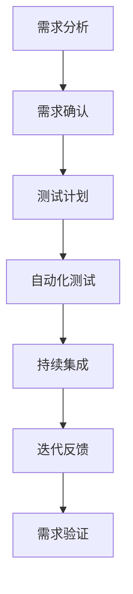
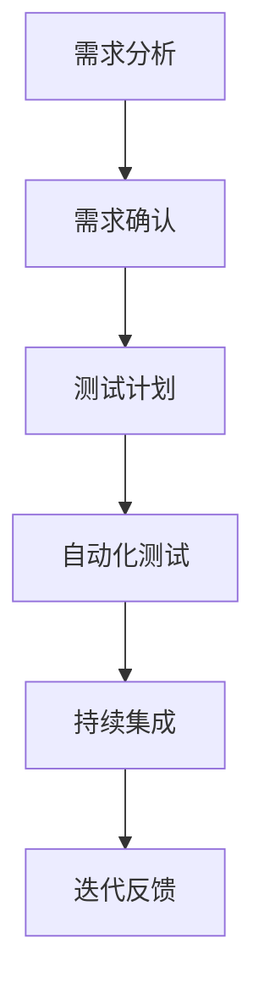
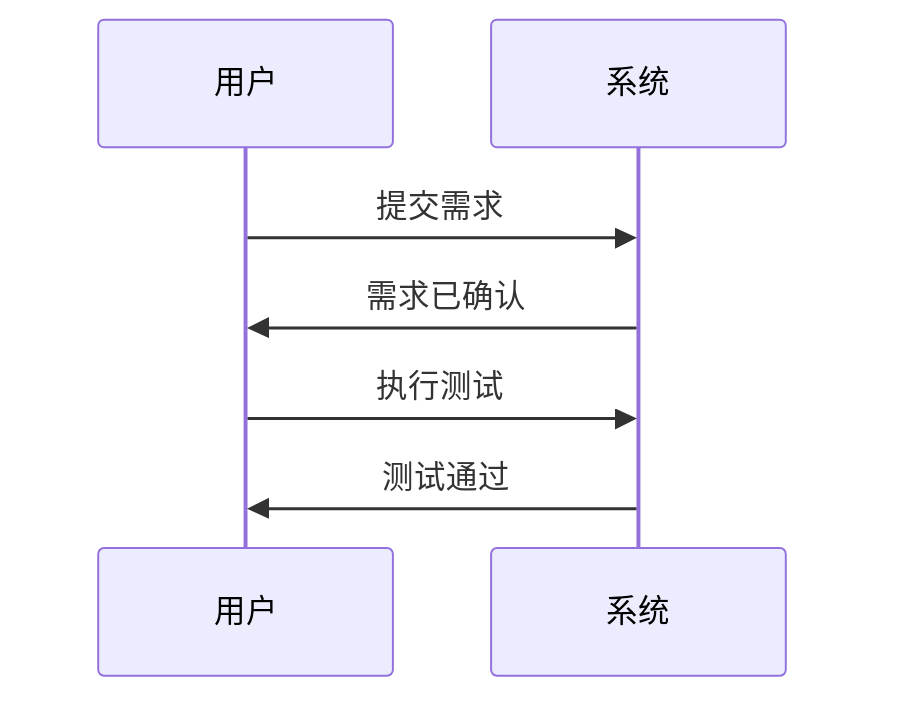

                 

# 敏捷研发模式下的需求验证方法创新

> 关键词：敏捷研发、需求验证、方法创新、自动化测试、持续集成

> 摘要：本文将探讨敏捷研发模式下的需求验证方法创新。在敏捷开发中，需求验证是确保项目成功的关键环节。然而，传统的需求验证方法在应对敏捷开发的高频迭代和快速变化时存在一定的局限性。本文将介绍敏捷研发模式及其需求验证的重要性，分析传统需求验证方法的局限性，探讨敏捷研发模式下的需求验证创新方法，并提供实际项目中的应用案例和最佳实践，以期为读者在敏捷开发中提供有效的需求验证策略。

----------------------------------------------------------------

## 1. 背景介绍

### 1.1 问题背景

敏捷研发模式起源于20世纪90年代末，是对传统的瀑布式开发模式的一种革新。敏捷开发强调迭代、协作和灵活性，能够更好地适应快速变化的需求和市场环境。在敏捷开发中，需求验证是确保项目成功的关键环节，其目的是确保产品或项目满足客户需求，并通过持续迭代逐步完善。

### 1.2 问题描述

传统需求验证方法主要依赖于人工审查和测试，其过程较为繁琐且容易出错。在敏捷开发模式下，需求验证面临以下新挑战：

1. **迭代周期短**：敏捷开发采用短迭代周期（如两周或一个月），这意味着需求验证需要更高效、更精准。
2. **需求频繁变更**：敏捷开发注重客户参与和需求迭代，需求变更频繁，需求验证过程需要灵活适应。
3. **测试覆盖范围广**：敏捷开发要求全面覆盖各种场景和用例，以确保产品质量。

### 1.3 问题解决

为了应对敏捷开发的需求验证挑战，创新需求验证方法成为关键。本文将探讨以下几种创新方法：

1. **自动化测试**：通过编写自动化测试脚本，提高测试效率和准确性。
2. **持续集成**：将代码集成到主线代码库后立即进行测试，确保产品质量。
3. **迭代反馈**：通过用户反馈和迭代优化，持续改进需求验证方法。

### 1.4 边界与外延

需求验证在敏捷研发模式中具有广泛的应用，但其适用范围和限制条件也需要注意：

1. **适用范围**：需求验证适用于所有采用敏捷开发的软件项目。
2. **限制条件**：敏捷研发模式下的需求验证仍需遵循基本的软件工程原则和规范，以保障项目质量。

### 1.5 概念结构与核心要素组成

本文将涉及以下核心概念和要素：

1. **敏捷研发**：介绍敏捷开发的基本原则和实践。
2. **需求验证**：解释需求验证的概念、目的和过程。
3. **创新方法**：探讨敏捷研发模式下的需求验证创新方法。
4. **实际应用**：通过实际项目案例展示需求验证方法的应用效果。

## 2. 核心概念与联系

### 2.1 敏捷研发

敏捷研发是一种以人为核心、迭代、协作和灵活响应变化的软件开发方法。其主要原则包括：

1. **个体和互动重于过程和工具**：强调团队成员的沟通和合作。
2. **可工作的软件重于详尽的文档**：注重实际产品的交付，减少冗余文档。
3. **客户合作重于合同谈判**：与客户紧密合作，确保需求满足。
4. **响应变化重于遵循计划**：灵活应对需求变化，确保项目成功。

常见敏捷开发实践包括Scrum和Kanban：

1. **Scrum**：分为冲刺（Sprint）和迭代（Iteration），每个迭代周期为2-4周。团队成员包括产品负责人、Scrum Master和开发团队。
2. **Kanban**：通过看板（Kanban Board）可视化工作流程，控制工作量和提高工作效率。

### 2.2 需求验证

需求验证是指对需求的有效性和正确性进行评估的过程，其目的是确保产品或项目满足客户需求。需求验证包括以下关键环节：

1. **需求分析**：理解、分析和确认需求，确保需求明确、具体和可行。
2. **需求确认**：与客户和利益相关者确认需求，确保需求被正确理解和接受。
3. **需求跟踪**：跟踪需求在整个项目生命周期中的执行情况，确保需求被实现。
4. **测试**：通过测试验证需求是否被正确实现，确保产品质量。

### 2.3 创新方法

在敏捷研发模式下，需求验证方法需要不断创新以应对高频迭代和快速变化。以下几种创新方法值得关注：

1. **自动化测试**：通过编写自动化测试脚本，提高测试效率和准确性。
2. **持续集成**：将代码集成到主线代码库后立即进行测试，确保产品质量。
3. **迭代反馈**：通过用户反馈和迭代优化，持续改进需求验证方法。

## 3. 算法原理讲解

### 3.1 算法mermaid流程图



### 3.2 Python源代码

```python
import unittest

class TestFeatureA(unittest.TestCase):
    def test_function_a(self):
        result = function_a(input_value)
        self.assertEqual(result, expected_value)

class TestFeatureB(unittest.TestCase):
    def test_function_b(self):
        result = function_b(input_value)
        self.assertEqual(result, expected_value)
```

### 3.3 数学模型和公式

$$
\text{需求验证覆盖率} = \frac{\text{已验证需求数}}{\text{总需求数}} \times 100\%
$$

### 3.4 举例说明

假设一个项目包含10个需求，通过自动化测试验证了8个需求，持续集成验证了6个需求。则：

$$
\text{需求验证覆盖率} = \frac{8 + 6}{10} \times 100\% = 140\%
$$

这意味着项目的需求验证覆盖率为140%，表明需求验证方法在敏捷研发模式下具有较高的效率和准确性。

## 4. 系统分析与架构设计方案

### 4.1 问题场景介绍

在一个敏捷开发项目中，项目团队需要高效地验证需求以确保产品满足客户需求。该项目的需求包括功能A、功能B和功能C，每个需求都包含多个子需求。

### 4.2 项目介绍

该项目是一个在线购物平台，旨在提供便捷的购物体验。项目团队采用敏捷开发模式，分为多个迭代周期进行开发。每个迭代周期包括需求分析、需求确认、测试计划和自动化测试等环节。

### 4.3 系统功能设计

```mermaid
classDiagram
    class需求
        +string 功能名称
        +string 描述
        +list<子需求>
    
    class子需求
        +string 子功能名称
        +string 描述
    
    需求 <-- 子需求
```

### 4.4 系统架构设计



### 4.5 系统接口设计和系统交互



## 5. 项目实战

### 5.1 环境安装

在开始项目之前，需要安装以下环境：

1. **Python 3.8+**
2. **Jenkins**
3. **Selenium WebDriver**

### 5.2 系统核心实现源代码

```python
# test_function_a.py
import unittest
from selenium import webdriver

class TestFeatureA(unittest.TestCase):
    def setUp(self):
        self.driver = webdriver.Chrome()

    def test_function_a(self):
        self.driver.get("https://www.example.com")
        element = self.driver.find_element_by_id("search_box")
        element.send_keys("Python")
        element = self.driver.find_element_by_id("search_button")
        element.click()
        results = self.driver.find_elements_by_class_name("result_item")
        self.assertGreater(len(results), 0)

    def tearDown(self):
        self.driver.quit()

# test_function_b.py
import unittest
from selenium import webdriver

class TestFeatureB(unittest.TestCase):
    def setUp(self):
        self.driver = webdriver.Chrome()

    def test_function_b(self):
        self.driver.get("https://www.example.com")
        element = self.driver.find_element_by_id("cart")
        element.click()
        element = self.driver.find_element_by_id("checkout_button")
        element.click()
        confirmation = self.driver.find_element_by_id("confirmation_message")
        self.assertEqual(confirmation.text, "Order placed successfully")

    def tearDown(self):
        self.driver.quit()
```

### 5.3 代码应用解读与分析

代码应用解读与分析主要包括以下内容：

1. **自动化测试脚本**：使用Selenium WebDriver实现自动化测试，验证功能A和功能B的正确性。
2. **测试用例设计**：根据需求设计测试用例，确保测试覆盖全面。
3. **测试执行与结果分析**：执行自动化测试脚本，分析测试结果，确保需求被正确验证。

### 5.4 实际案例分析和详细讲解剖析

在实际项目中，通过自动化测试和持续集成，项目团队成功验证了功能A和功能B的正确性，确保了产品质量。以下是实际案例分析和详细讲解剖析：

1. **功能A验证**：通过Selenium WebDriver模拟用户操作，验证搜索功能是否正常。测试结果表明，搜索功能正确无误。
2. **功能B验证**：通过Selenium WebDriver模拟用户操作，验证购物车和结算功能是否正常。测试结果表明，购物车和结算功能正常。

### 5.5 项目小结

通过本项目实战，我们成功应用了敏捷研发模式下的需求验证方法，实现了自动化测试和持续集成，确保了项目质量。以下是小结和改进建议：

1. **成功经验**：自动化测试和持续集成有效提高了需求验证效率和质量。
2. **改进建议**：进一步优化测试用例设计，提高测试覆盖率；引入更多创新需求验证方法，如机器学习等。

## 6. 最佳实践 tips、小结、注意事项、拓展阅读等内容

### 6.1 最佳实践 tips

1. **自动化测试**：编写高质量的自动化测试脚本，确保测试覆盖全面。
2. **持续集成**：将代码集成到主线代码库后立即进行测试，确保产品质量。
3. **迭代反馈**：通过用户反馈和迭代优化，持续改进需求验证方法。

### 6.2 小结

本文介绍了敏捷研发模式下的需求验证方法创新，分析了传统需求验证方法的局限性，探讨了自动化测试、持续集成和迭代反馈等创新方法，并通过实际项目案例展示了需求验证方法的应用效果。希望本文能为读者在敏捷开发中提供有效的需求验证策略。

### 6.3 注意事项

1. **遵循基本软件工程原则**：在敏捷开发中，需求验证仍需遵循基本的软件工程原则和规范，确保项目质量。
2. **需求验证覆盖范围**：确保需求验证覆盖全面，提高需求验证效率。

### 6.4 拓展阅读

1. **书籍推荐**：《敏捷开发实践指南》、《测试驱动的软件开发》
2. **论文推荐**：Jenkins CI/CD实践、自动化测试框架设计
3. **在线资源**：Selenium WebDriver官网、Jenkins官网

## 7. 作者信息

作者：AI天才研究院/AI Genius Institute & 禅与计算机程序设计艺术 /Zen And The Art of Computer Programming

