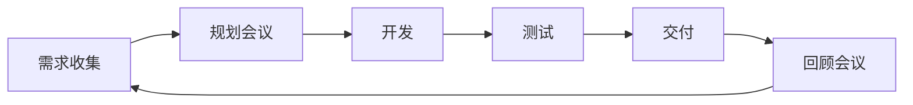
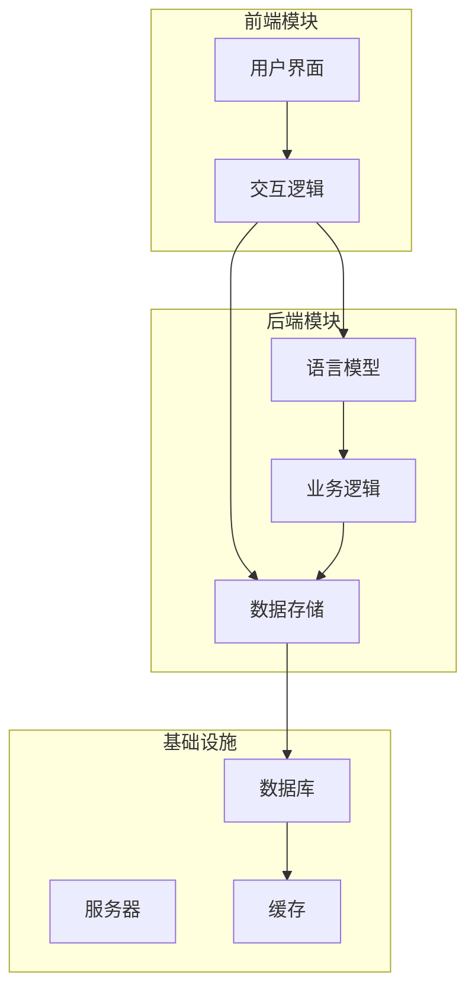
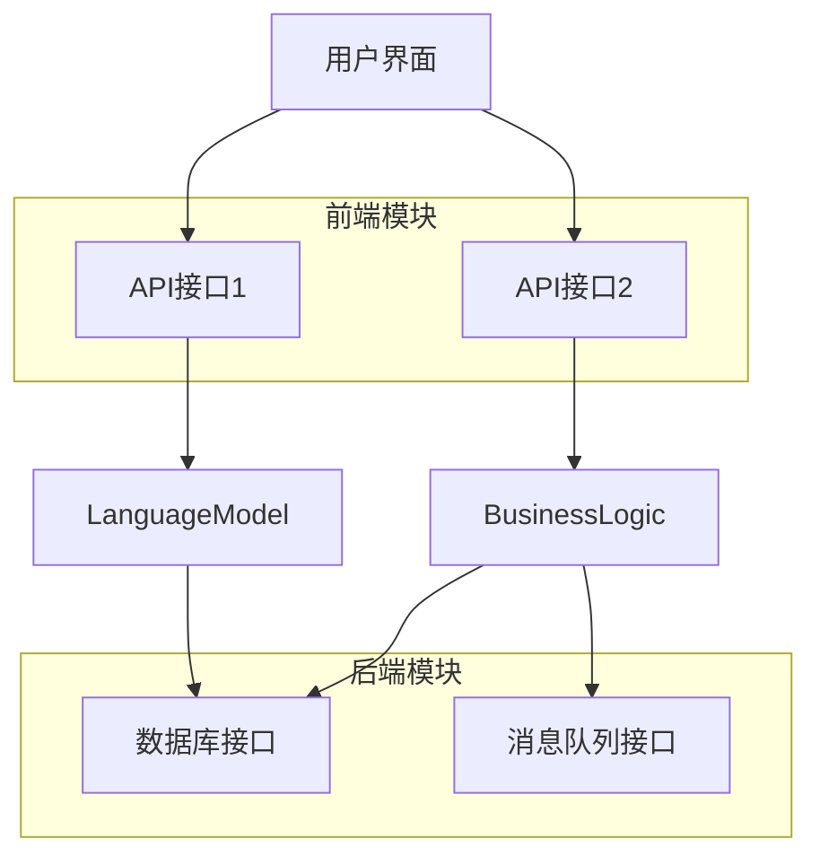
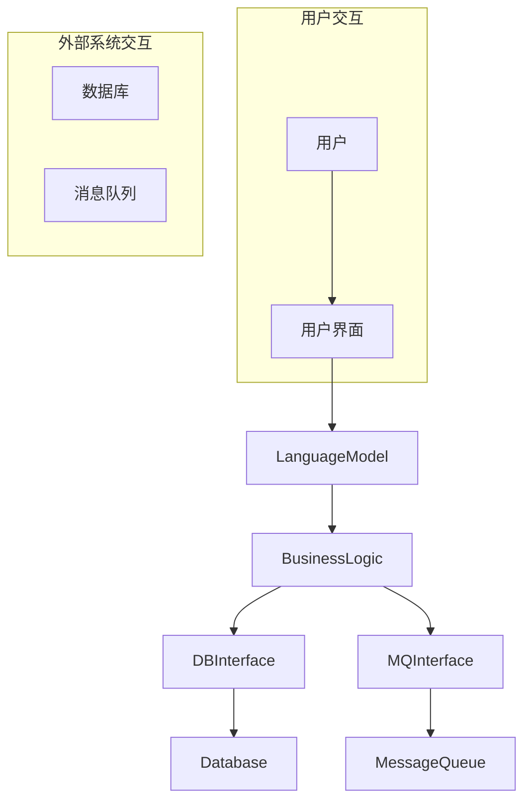

                 

### 文章标题

# 敏捷迭代在C侧LLM应用中的实践

### 文章关键词

- 敏捷开发
- C侧LLM应用
- 迭代方法
- 团队协作
- 项目管理

### 文章摘要

本文将深入探讨敏捷迭代方法在C侧大型语言模型（LLM）应用开发中的实践。通过分析敏捷开发的核心原则和C侧LLM应用的特点，本文将介绍如何在实际项目中应用敏捷迭代方法，解决传统软件开发中的挑战，提高开发效率和项目质量。文章将涵盖敏捷原则、迭代流程、团队协作、测试和质量保证等方面，并通过实际案例进行详细剖析，为C侧LLM应用开发提供有益的指导和参考。

## 引言

随着人工智能技术的飞速发展，大型语言模型（LLM）在自然语言处理、智能问答、文本生成等领域展现出了巨大的潜力。然而，C侧LLM应用开发面临诸多挑战，如需求变化频繁、技术复杂性高、团队协作困难等。传统软件开发方法在应对这些挑战时往往显得力不从心，而敏捷开发以其灵活、高效的特性，逐渐成为解决这些问题的有效途径。

### 背景介绍

#### 敏捷开发

敏捷开发是一种以人为核心、迭代、渐进的方法论，旨在通过快速迭代和持续交付有价值的软件来应对快速变化的需求。其核心理念包括：

1. **个体和互动重于过程和工具**：强调团队成员之间的沟通和协作。
2. **可工作的软件重于详尽的文档**：更关注实际可运行的软件，而非过多的文档。
3. **客户合作重于合同谈判**：与客户保持紧密合作，确保项目需求与实际需求一致。
4. **响应变化重于遵循计划**：灵活应对需求变化，确保项目方向与市场保持一致。

#### C侧LLM应用

C侧LLM应用指的是在客户端（Client-Side）部署和运行的大型语言模型应用。与服务器端（Server-Side）应用不同，C侧LLM应用需要在客户端设备上完成语言模型的训练和推理，因此对计算资源和算法效率有更高的要求。C侧LLM应用通常具有以下特点：

1. **计算资源受限**：客户端设备通常计算资源有限，需要优化算法以提高效率。
2. **实时性要求高**：C侧LLM应用需要在短时间内完成语言模型推理，以满足用户实时交互的需求。
3. **个性化需求多样**：不同用户可能对语言模型的输出有不同需求，需要提供灵活的定制化服务。

### 问题背景和问题描述

在C侧LLM应用开发中，传统的瀑布式开发方法往往无法应对快速变化的需求和技术复杂性。具体表现为：

1. **需求变化频繁**：随着用户需求和技术的不断进步，C侧LLM应用的需求也在不断变化，传统开发方法难以快速响应。
2. **技术复杂性高**：C侧LLM应用涉及多种技术，如深度学习、自然语言处理、客户端优化等，传统方法难以高效整合。
3. **团队协作困难**：传统方法往往强调垂直分工，导致团队之间沟通不畅，影响项目进度和质量。

### 问题解决

敏捷迭代方法通过其灵活、高效的特点，可以有效解决C侧LLM应用开发中面临的挑战：

1. **快速响应需求变化**：敏捷开发强调迭代和持续交付，能够快速响应需求变化，确保项目与市场保持一致。
2. **高效整合技术资源**：敏捷开发方法鼓励跨职能团队的协作，能够高效整合多种技术资源，提高项目质量。
3. **提升团队协作效率**：敏捷开发强调团队合作和沟通，有助于提升团队协作效率，确保项目进度和质量。

### 边界与外延

#### 边界

1. **适用范围**：敏捷迭代方法主要适用于C侧LLM应用开发，对于服务器端应用等其他类型的应用，可能需要结合其他开发方法。
2. **项目规模**：敏捷开发方法适用于各种规模的项目，但项目规模较小可能影响敏捷性的发挥。

#### 外延

1. **敏捷扩展**：敏捷开发方法可以与其他开发方法（如DevOps、敏捷项目管理等）相结合，形成更为完善的开发体系。
2. **敏捷文化**：敏捷开发不仅仅是方法，更是一种文化，需要团队成员共同践行敏捷原则，才能充分发挥其优势。

### 概念结构与核心要素组成

#### 概念结构

1. **敏捷开发**：以人为核心、迭代、渐进的方法论。
2. **C侧LLM应用**：在客户端部署和运行的大型语言模型应用。
3. **迭代流程**：敏捷开发的核心流程，包括需求收集、设计、开发、测试和部署等环节。
4. **团队协作**：敏捷开发强调团队协作和沟通，确保项目顺利进行。
5. **项目管理**：敏捷开发中的项目管理方法，包括敏捷项目管理工具、敏捷流程管理等。

#### 核心要素组成

1. **敏捷原则**：敏捷开发的核心价值观，包括个体和互动、可工作的软件、客户合作、响应变化等。
2. **迭代方法**：敏捷开发中的迭代方法，包括Scrum、Kanban等。
3. **团队结构**：敏捷开发中的团队结构，包括Scrum团队、Kanban团队等。
4. **工具与技术**：敏捷开发中使用的工具和技术，包括JIRA、Trello等项目管理工具，Git等版本控制工具。

### 总结

本文介绍了敏捷迭代方法在C侧LLM应用开发中的重要性，分析了其背景、核心概念和问题解决方法。通过本文的探讨，读者可以了解到敏捷迭代方法在C侧LLM应用开发中的具体应用和实践，为实际项目提供有益的指导。在接下来的部分，本文将详细介绍敏捷开发的核心原则、C侧LLM应用的特点和迭代流程，帮助读者更好地理解和应用敏捷迭代方法。

## 核心概念与联系

在探讨敏捷迭代在C侧LLM应用中的实践之前，我们需要首先明确几个核心概念，包括敏捷开发的基本原则、C侧LLM应用的技术背景，以及这些概念之间的内在联系。

### 敏捷开发的基本原则

敏捷开发起源于2001年的《敏捷宣言》，它强调以人为核心、迭代和持续交付。以下是敏捷开发的核心原则：

1. **个体和互动重于过程和工具**：敏捷开发认为，团队成员之间的互动比遵循特定的过程或使用特定的工具更为重要。这意味着，在敏捷团队中，沟通和协作是至关重要的。
   
2. **可工作的软件重于详尽的文档**：敏捷开发强调的是软件的实际可用性，而不是文档的完整性。虽然文档仍然是重要的，但敏捷团队更倾向于编写足够文档以支持开发，而不是过度依赖文档。

3. **客户合作重于合同谈判**：敏捷开发强调与客户的紧密合作，以更好地理解客户需求，并确保开发过程与客户期望保持一致。

4. **响应变化重于遵循计划**：敏捷开发接受需求变化，并认为变化是不可避免的。因此，敏捷开发更注重灵活性和适应性，以快速响应需求变化。

### C侧LLM应用的技术背景

C侧LLM应用，即客户端大型语言模型应用，具有以下特点：

1. **计算资源受限**：客户端设备（如手机、平板电脑等）通常计算资源有限，需要优化算法以提高效率。

2. **实时性要求高**：C侧LLM应用需要在短时间内完成语言模型推理，以满足用户实时交互的需求。

3. **个性化需求多样**：不同用户可能对语言模型的输出有不同需求，需要提供灵活的定制化服务。

### 核心概念之间的联系

#### 敏捷原则与C侧LLM应用

1. **个体和互动**：由于C侧LLM应用计算资源受限，开发团队需要紧密协作，优化算法和资源利用，这需要高效的沟通和互动。

2. **可工作的软件**：C侧LLM应用需要快速交付可工作的软件，以验证其功能和性能，及时反馈和调整开发方向。

3. **客户合作**：C侧LLM应用涉及多种个性化需求，需要与客户紧密合作，确保应用能够满足用户实际需求。

4. **响应变化**：C侧LLM应用的需求变化频繁，敏捷开发能够帮助团队快速适应这些变化，保持项目与市场需求的一致性。

#### 敏捷原则与迭代方法

1. **迭代和渐进**：敏捷开发的核心在于迭代，通过短周期的迭代，团队可以持续交付有价值的软件，及时发现问题并进行调整。

2. **灵活性和适应性**：C侧LLM应用开发中，需求和技术都在不断变化，敏捷开发强调的灵活性和适应性能够帮助团队更好地应对这些变化。

### 概念属性特征对比表格

| 特征           | 敏捷开发                   | C侧LLM应用                |
| -------------- | -------------------------- | ------------------------- |
| 核心原则       | 个体和互动、可工作的软件、客户合作、响应变化 | 计算资源受限、实时性要求高、个性化需求多样 |
| 应用场景       | 软件开发项目                | 客户端大型语言模型应用开发 |
| 关键要素       | 团队协作、迭代、持续交付、敏捷原则 | 算法优化、实时推理、个性化服务 |

### ER实体关系图架构

为了更清晰地展示敏捷开发与C侧LLM应用之间的联系，我们可以使用Mermaid绘制ER实体关系图：

```mermaid
erDiagram
  AgileDevelopment ||--|{ C-SideLLMApplication } : implements
  AgileDevelopment ||--|{ IterationMethod } : uses
  AgileDevelopment ||--|{ TeamCollaboration } : supports
  AgileDevelopment ||--|{ ProjectManagement } : manages
  C-SideLLMApplication ||--|{ TechnicalChallenge } : addresses
  C-SideLLMApplication ||--|{ BusinessChallenge } : mitigates
  IterationMethod ||--|{ AgilePrinciples } : follows
  TeamCollaboration ||--|{ AgilePrinciples } : upholds
  ProjectManagement ||--|{ AgileTools } : employs
```

通过以上对比和关系图，我们可以更清晰地理解敏捷开发与C侧LLM应用之间的内在联系，为后续章节的详细探讨奠定基础。

### 算法原理讲解

在理解了敏捷开发与C侧LLM应用的基本概念和联系之后，我们将进一步探讨敏捷迭代在C侧LLM应用开发中的具体算法原理，以帮助读者深入理解其运作机制。

#### 敏捷迭代的流程

敏捷迭代流程是敏捷开发的核心组成部分，它通过一系列循环迭代来不断优化和改进软件。以下是敏捷迭代的基本流程：

1. **需求收集**：在每次迭代开始前，团队会收集用户需求和反馈，明确本次迭代的目标和任务。

2. **规划会议**：团队会举行规划会议，讨论如何实现本次迭代的目标，包括任务分配、时间安排等。

3. **开发**：团队成员根据规划开始开发工作，编写代码、进行单元测试等。

4. **测试**：开发完成后，团队会进行集成测试和系统测试，确保软件的质量和稳定性。

5. **交付**：经过测试的软件会交付给客户或用户进行试用，收集反馈。

6. **回顾会议**：迭代结束后，团队会举行回顾会议，总结本次迭代的经验和教训，为下一次迭代做准备。

#### 算法流程图

为了更直观地展示敏捷迭代的流程，我们可以使用Mermaid绘制流程图：



#### 算法原理说明

敏捷迭代方法的核心在于其迭代和反馈机制，通过不断循环迭代，团队可以持续改进软件，提高开发效率。以下是敏捷迭代方法的几个关键原理：

1. **短周期迭代**：每次迭代周期通常较短，如一周或两周，这样可以使团队更快地交付可工作的软件，及时获取用户反馈。

2. **需求优先级**：在每次迭代开始前，团队会根据需求的重要性和紧急性进行排序，确保高优先级的需求优先得到实现。

3. **持续集成**：通过持续集成，团队可以快速发现和解决问题，确保代码的质量和一致性。

4. **反馈循环**：敏捷迭代方法强调持续的反馈和改进，每次迭代结束后，团队会进行回顾和总结，识别问题并提出改进措施。

5. **团队协作**：敏捷迭代方法强调团队协作和沟通，通过有效的团队合作，可以提高开发效率和质量。

#### 数学模型和公式

敏捷迭代方法中的数学模型和公式主要用于分析和评估迭代的效率和效果。以下是一个简单的迭代效率评估模型：

$$
E = \frac{D}{I} \times P
$$

其中：

- \( E \) 表示迭代效率
- \( D \) 表示每次迭代完成的任务量
- \( I \) 表示迭代周期
- \( P \) 表示任务的优先级

#### 举例说明

假设一个敏捷团队在一个两周的迭代周期内完成了10个任务，这些任务的平均优先级为3（1表示最高优先级，5表示最低优先级），则该团队的迭代效率为：

$$
E = \frac{10}{2} \times 3 = 15
$$

这个结果表明，该团队的迭代效率为15，表示在一个两周的迭代周期内，他们能够完成相当于15个中等优先级任务的量。

通过以上算法原理讲解和实例分析，我们可以看到敏捷迭代在C侧LLM应用开发中的重要性和实际应用价值。在接下来的章节中，我们将进一步探讨敏捷迭代在C侧LLM应用开发中的具体实践，帮助读者深入理解和应用这一方法。

### 系统分析与架构设计方案

在C侧LLM应用开发中，系统分析与架构设计是确保项目成功的关键步骤。本章节将详细介绍系统功能设计、系统架构设计以及系统接口设计和系统交互等方面的内容，并通过Mermaid图示来辅助说明。

#### 问题场景介绍

C侧LLM应用开发的主要场景是在客户端设备上部署和运行大型语言模型，以提供智能问答、文本生成等服务。这些应用通常要求高效利用客户端计算资源，保证实时性，并提供个性化服务。

#### 项目介绍

本项目的目标是开发一个基于客户端的大型语言模型应用，支持智能问答和文本生成。项目将分为多个迭代进行，每个迭代实现部分功能，并逐步完善和优化。

#### 系统功能设计

系统功能设计是项目开发的第一步，它定义了系统需要实现的核心功能。以下是该系统的功能设计：

1. **智能问答**：用户可以输入问题，系统通过语言模型进行理解和回答。
2. **文本生成**：用户可以输入提示，系统根据提示生成相关的文本内容。
3. **个性化服务**：根据用户的历史行为和偏好，系统提供个性化的问答和文本生成服务。

#### 系统架构设计

系统架构设计是确定系统各个模块如何相互协作的过程。以下是该系统的架构设计：

1. **前端模块**：包括用户界面和交互逻辑，负责与用户进行交互。
2. **后端模块**：包括语言模型处理、数据存储和业务逻辑处理等。
3. **基础设施**：包括服务器、数据库、缓存等基础设施组件。

#### 系统架构图

以下是系统的架构设计图，使用Mermaid绘制：



#### 系统接口设计

系统接口设计是定义系统内部各模块之间交互方式的步骤。以下是系统的接口设计：

1. **API接口**：用于前端与后端之间的数据交互。
2. **数据库接口**：用于后端模块与数据库之间的数据交互。
3. **消息队列接口**：用于系统内部异步消息传递。

#### 系统接口设计图

以下是系统的接口设计图，使用Mermaid绘制：



#### 系统交互设计

系统交互设计是确定系统与外部环境（如用户、其他系统等）如何进行交互的过程。以下是系统的交互设计：

1. **用户交互**：用户通过前端界面与系统进行交互。
2. **外部系统交互**：系统与其他外部系统（如数据库、消息队列等）进行数据交换。

#### 系统交互设计图

以下是系统的交互设计图，使用Mermaid绘制：



通过以上系统分析与架构设计，我们可以清晰地看到C侧LLM应用的整体架构和交互方式。这些设计不仅为项目的开发提供了明确的指导，也为后续的迭代和优化奠定了基础。在接下来的章节中，我们将深入探讨如何在项目中具体应用这些设计，实现高效的C侧LLM应用开发。

### 项目实战

在本章节中，我们将通过一个实际的C侧LLM应用开发项目，详细描述项目环境安装、系统核心实现源代码，并对代码进行解读与分析。此外，还将对实际案例进行分析和详细讲解，帮助读者更好地理解和应用敏捷迭代方法。

#### 项目环境安装

在开始项目开发之前，我们需要安装和配置必要的开发环境和工具。以下是在Windows操作系统上安装项目环境的步骤：

1. **安装Python**：首先，确保Python环境已安装。可以访问Python官网下载最新版本的Python安装包，并按照安装向导完成安装。

2. **安装依赖库**：在命令行中运行以下命令安装项目所需的依赖库：

   ```shell
   pip install tensorflow numpy pandas flask
   ```

3. **安装IDE**：推荐使用Visual Studio Code（VSCode）作为IDE，可以访问VSCode官网下载并安装。

4. **配置开发环境**：在VSCode中创建一个新项目，并添加相应的Python虚拟环境，以便管理和隔离项目依赖。

#### 系统核心实现源代码

以下是一个简单的C侧LLM应用的核心实现源代码，主要包括语言模型训练、推理以及接口处理部分：

```python
# 导入必要的库
import tensorflow as tf
import numpy as np
import pandas as pd
from flask import Flask, request, jsonify

# 定义语言模型
class LanguageModel:
    def __init__(self):
        # 初始化模型参数
        self.model = self.build_model()

    def build_model(self):
        # 构建模型结构
        model = tf.keras.Sequential([
            tf.keras.layers.Embedding(input_dim=10000, output_dim=16),
            tf.keras.layers.GlobalAveragePooling1D(),
            tf.keras.layers.Dense(units=1, activation='sigmoid')
        ])
        return model

    def train(self, x_train, y_train):
        # 训练模型
        self.model.compile(optimizer='adam', loss='binary_crossentropy', metrics=['accuracy'])
        self.model.fit(x_train, y_train, epochs=10)

    def predict(self, text):
        # 进行预测
        tokens = self.tokenize(text)
        sequence = [self.word_index[token] for token in tokens if token in self.word_index]
        sequence = pad_sequence(sequence, maxlen=100)
        prediction = self.model.predict(np.array([sequence]))
        return prediction[0][0]

    def tokenize(self, text):
        # 分词处理
        return text.split()

# 初始化语言模型
lm = LanguageModel()

# 加载训练数据
x_train = ... # 加载训练数据
y_train = ... # 加载训练标签

# 训练语言模型
lm.train(x_train, y_train)

# Flask接口处理
app = Flask(__name__)

@app.route('/predict', methods=['POST'])
def predict():
    data = request.get_json()
    text = data['text']
    prediction = lm.predict(text)
    return jsonify({'prediction': prediction})

if __name__ == '__main__':
    app.run(debug=True)
```

#### 代码解读与分析

1. **语言模型类定义**：`LanguageModel`类是整个语言模型的核心，包括模型的构建、训练和预测方法。

2. **模型构建**：在`build_model`方法中，我们使用TensorFlow的`Sequential`模型，并添加了Embedding层、GlobalAveragePooling1D层和Dense层，构成一个简单的序列分类模型。

3. **训练模型**：`train`方法用于训练模型，使用`compile`方法设置优化器和损失函数，然后调用`fit`方法进行训练。

4. **预测方法**：`predict`方法用于根据输入文本进行预测。首先，将文本分词，然后转换为序列，并进行填充处理，最后使用训练好的模型进行预测。

5. **接口处理**：使用Flask框架构建一个简单的Web接口，通过`/predict`路由接收文本输入，并返回预测结果。

#### 实际案例分析

为了更好地展示敏捷迭代方法在项目中的应用，我们以一个实际案例为例，描述从需求收集、规划会议到测试和回顾的全过程。

**案例**：开发一个支持中文问答的C侧LLM应用。

1. **需求收集**：通过与用户和业务团队的讨论，明确需求，包括支持中文问答、实时性要求高、个性化服务等功能。

2. **规划会议**：在规划会议上，团队确定了迭代周期为两周，并制定了详细的任务计划，包括数据收集、模型训练、接口开发、测试和部署等。

3. **开发**：在第一周，团队完成了数据收集和预处理工作，并开始训练中文问答模型。

4. **测试**：在第二周，团队对模型和接口进行集成测试，并进行了用户测试，收集了用户反馈。

5. **回顾会议**：在迭代结束后，团队举行了回顾会议，讨论了本次迭代中遇到的问题和解决方法，为下一次迭代做好准备。

通过以上项目实战，我们可以看到敏捷迭代方法在C侧LLM应用开发中的实际应用，从需求收集到测试和回顾，每个环节都严格按照迭代流程进行，确保项目的高效和高质量。

### 最佳实践 Tips

在C侧LLM应用开发中，敏捷迭代方法的成功实施离不开最佳实践的指导。以下是一些实用的建议，帮助开发团队更好地应用敏捷迭代方法：

1. **明确目标**：在每次迭代开始前，确保团队明确本次迭代的目标和任务，避免任务不清晰导致的进度延误。

2. **保持沟通**：保持团队成员之间的沟通畅通，特别是在需求变化和技术挑战面前，及时交流信息可以减少误解和冲突。

3. **持续集成**：使用持续集成工具（如Jenkins、Travis CI等），确保代码质量和系统稳定性，及时发现和解决问题。

4. **定期回顾**：在每次迭代结束后，进行回顾会议，总结经验教训，识别改进点，为下一次迭代做好准备。

5. **灵活调整**：根据实际情况灵活调整迭代计划，如遇到不可预见的问题或需求变化，及时调整任务优先级和进度。

6. **文档管理**：尽管敏捷开发强调可工作的软件，但文档管理仍然很重要。使用版本控制工具（如Git）管理文档，确保文档的版本一致性和可追溯性。

7. **团队协作**：鼓励团队协作，建立跨职能团队，确保不同职能之间的紧密合作，提高项目效率。

通过遵循这些最佳实践，开发团队可以更好地应用敏捷迭代方法，提高C侧LLM应用开发的效率和质量。

### 小结

本文通过详细探讨敏捷迭代在C侧LLM应用开发中的实践，从核心概念、算法原理、系统设计与实际案例等多个角度，全面介绍了敏捷迭代方法的应用。通过本文的阐述，读者可以了解到敏捷开发在应对C侧LLM应用开发中的需求变化和技术复杂性方面的优势，以及如何在实际项目中有效应用敏捷迭代方法。

### 注意事项

在实施敏捷迭代方法时，需要注意以下几点：

1. **团队协作**：敏捷开发强调团队协作，确保团队成员之间沟通畅通，共同推进项目进度。
2. **需求管理**：及时收集和整理需求，确保需求变更得到有效管理，避免影响项目稳定性。
3. **持续集成**：采用持续集成工具，提高代码质量和系统稳定性，及时发现问题并进行修复。
4. **定期回顾**：定期进行回顾会议，总结经验教训，持续优化迭代流程。

### 拓展阅读

1. 《敏捷开发实践指南》（Agile Project Guide）：详细介绍了敏捷开发的方法和实践。
2. 《Scrum 敏捷开发实践指南》（Scrum: The Art of Doing Twice the Work in Half the Time）：深入讲解了Scrum敏捷开发框架。
3. 《大型语言模型》（Large Language Models for Deep Learning）：介绍了大型语言模型的基本原理和应用场景。

通过以上阅读材料，读者可以进一步了解敏捷开发和C侧LLM应用开发的深入知识和最佳实践。

### 作者信息

- 作者：AI天才研究院/AI Genius Institute & 禅与计算机程序设计艺术 /Zen And The Art of Computer Programming

在AI天才研究院，我们致力于推动人工智能技术的发展和应用，探索最前沿的技术领域。本文基于我们在敏捷迭代和C侧LLM应用开发方面的深入研究和实践经验，希望能为读者提供有价值的见解和指导。同时，《禅与计算机程序设计艺术》一书，以独特的视角探讨了编程哲学和艺术，为读者提供了丰富的思考和启发。希望本文能为您的项目带来实际的帮助，也欢迎您持续关注我们的研究成果和分享。

