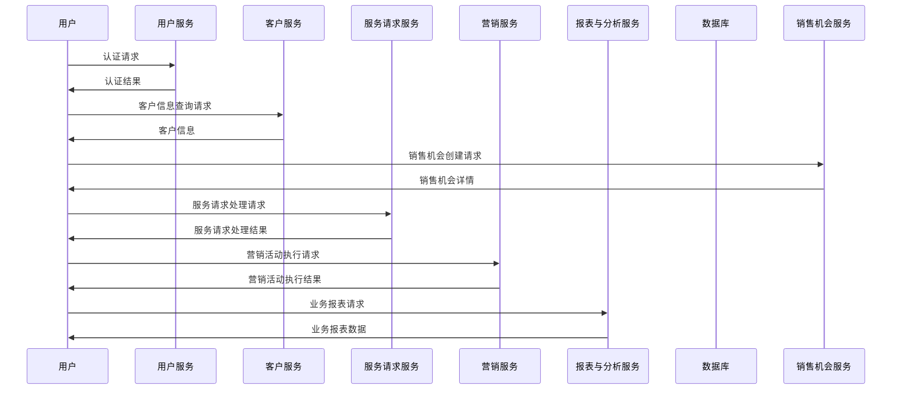

                 


### 第1章：问题背景

#### 1.1.1 问题背景

敏捷迭代工程方法是在应对现代软件开发的挑战中逐渐兴起的一种开发方式。随着互联网的普及和云计算、大数据、人工智能等新技术的快速发展，软件项目的需求变得愈加复杂和多变。传统的瀑布开发模式，由于其线性顺序和固定需求的特点，往往难以适应这种变化，导致项目延期、成本超支和质量问题。

敏捷迭代工程方法的核心在于它的灵活性。它通过短周期的迭代，使得开发团队能够快速响应需求变化，同时保持对项目目标的持续关注。这种方法强调客户参与、团队合作和持续交付，有助于提高软件项目的成功率和客户满意度。

#### 1.1.2 问题描述

敏捷迭代工程在软件开发中面临的核心挑战包括：

1. **快速变化的需求**：在敏捷开发中，需求可能会频繁变化。如何有效地管理这些变化，确保它们不影响项目进度和质量？
2. **技术选型的困境**：面对日新月异的技术，开发团队需要选择最适合当前项目的技术栈。如何评估各种技术方案，并做出明智的选择？
3. **项目管理难题**：在敏捷开发中，项目管理方式与传统模式有很大不同。如何有效地进行敏捷项目管理，确保项目目标的实现？
4. **团队协作问题**：敏捷开发强调跨职能团队的紧密协作。如何提高团队沟通效率，确保每个团队成员都能充分发挥自己的潜力？

#### 1.1.3 问题解决

敏捷迭代工程方法通过以下方式解决上述挑战：

1. **迭代开发**：通过将项目划分为多个短周期迭代，每个迭代都产生可交付的产品增量。这样可以快速验证需求，及时调整项目方向。
2. **需求管理**：使用用户故事（User Story）来管理需求，通过优先级排序和迭代计划，确保需求得到有效管理。
3. **技术评估**：采用技术评估矩阵，结合项目需求和团队技能，选择最适合的技术方案。
4. **项目管理**：采用敏捷项目管理工具和方法，如Scrum或Kanban，来确保项目目标的实现。
5. **团队协作**：通过定期的团队会议、代码审查和持续的沟通，提高团队协作效率。

#### 1.1.4 边界与外延

- **边界**：敏捷迭代工程主要关注软件开发过程，适用于各种规模的软件项目。但它的核心在于团队协作和快速响应变化，因此并非适用于所有情况。
- **外延**：敏捷迭代工程可以与其他开发方法（如DevOps、持续集成/持续部署等）结合使用，形成更完整的开发流程。

#### 1.1.5 概念结构与核心要素组成

敏捷迭代工程的核心概念和要素包括：

1. **迭代周期**：每次迭代通常持续2-4周，每个迭代都产生可交付的产品增量。
2. **用户故事**：用户故事是一种描述需求的方式，通常包含“作为谁，我需要做什么”的结构。
3. **增量交付**：每个迭代都交付一个可用的产品版本，逐步完善整个项目。
4. **持续集成**：通过自动化测试和持续集成工具，确保代码的连续性和质量。
5. **持续部署**：通过自动化部署流程，快速将代码发布到生产环境。

敏捷迭代工程的核心在于其灵活性和对变化的管理。通过迭代开发和用户故事的驱动，开发团队能够快速适应需求变化，同时保持项目目标的清晰和稳定。

接下来，我们将进一步探讨敏捷迭代工程的核心概念和方法，帮助读者更好地理解和应用这一重要的开发模式。

### 第2章：核心概念与联系

#### 2.1.1 敏捷方法论介绍

敏捷开发是一种以人为核心、迭代和持续交付的软件开发方法。它起源于1990年代末期，针对传统开发模式的不足而提出。敏捷开发的核心思想包括：响应变化、快速迭代、客户合作和团队自我管理。

敏捷方法论强调持续交付有价值的软件，通过与用户的持续交互来逐步明确和调整需求。这种方法有助于减少项目风险，提高软件质量和用户满意度。

#### 2.1.2 敏捷开发与敏捷迭代工程的关系

敏捷迭代工程是敏捷开发方法的一部分，它专注于软件开发过程中的迭代和增量交付。敏捷迭代工程将整个项目划分为多个短周期的迭代，每个迭代都产生可交付的产品增量。

敏捷迭代工程与敏捷开发的关系如下：

1. **迭代周期**：敏捷迭代工程的核心是短周期的迭代开发，每次迭代通常持续2-4周。
2. **用户故事**：敏捷迭代工程通过用户故事来管理需求，确保开发工作紧密围绕用户价值展开。
3. **持续集成**：敏捷迭代工程强调持续集成，通过自动化测试和持续集成工具确保代码质量。
4. **反馈循环**：通过定期的迭代和用户反馈，敏捷迭代工程能够快速响应变化，调整项目方向。

#### 2.1.3 核心概念原理

敏捷迭代工程的核心概念包括：

1. **迭代周期**：迭代周期是敏捷迭代工程的核心，每次迭代都包含计划、开发、测试和评审等阶段。迭代周期有助于团队聚焦当前任务，快速交付价值。
2. **用户故事**：用户故事是一种描述需求的方式，通常包含“作为谁，我需要做什么”的结构。用户故事有助于确保开发工作紧密围绕用户价值展开。
3. **增量交付**：增量交付是指在每个迭代周期内，团队交付一个可用的产品版本。这种方式有助于逐步完善整个项目，同时减少项目风险。
4. **持续集成**：持续集成是一种通过自动化测试和持续集成工具，确保代码质量和连续性的方法。持续集成有助于发现和解决代码问题，提高开发效率。
5. **持续部署**：持续部署是指通过自动化部署流程，快速将代码发布到生产环境。持续部署有助于缩短交付周期，提高响应速度。

#### 2.1.4 概念属性特征对比表格

| 特征 | 敏捷开发 | 敏捷迭代工程 |
| :--: | :-------: | :-----------: |
| 核心思想 | 以人为核心、迭代和持续交付 | 短周期迭代、用户故事驱动、增量交付 |
| 迭代周期 | 长周期迭代（通常数月） | 短周期迭代（2-4周） |
| 用户故事 | 描述需求 | 管理需求 |
| 增量交付 | 不强调增量交付 | 强调增量交付 |
| 持续集成 | 强调持续集成 | 核心概念之一 |
| 持续部署 | 不强调持续部署 | 核心概念之一 |

#### 2.1.5 ER实体关系图架构

为了更好地理解敏捷迭代工程的概念，我们可以使用ER（实体关系）图来描述其架构。以下是一个简单的ER图：

```mermaid
erDiagram
    User ||--|{ Project }|--| Product
    User ||--|{ Iteration }|--| Task
    Project ||--|{ Feature }|--| Story
    Feature ||--|{ UserStory }|--| Requirement
```

在这个ER图中：

- **User**（用户）是发起项目的主体，可以创建项目、迭代和任务。
- **Project**（项目）是用户创建的软件开发项目，包含特征（Feature）和迭代（Iteration）。
- **Product**（产品）是项目的最终成果，包含用户故事（UserStory）和需求（Requirement）。
- **Feature**（特征）是项目中的功能模块，包含用户故事（UserStory）。
- **UserStory**（用户故事）是描述用户需求的方式，包含需求（Requirement）。
- **Requirement**（需求）是用户故事的具体实现细节。

#### 2.1.6 敏捷迭代工程与传统开发方法的对比

敏捷迭代工程与传统开发方法（如瀑布模型、V模型等）存在显著差异，主要体现在以下几个方面：

1. **开发周期**：传统方法通常采用长周期的开发模式，而敏捷迭代工程采用短周期的迭代模式。
2. **需求管理**：传统方法在项目初期就确定所有需求，而敏捷迭代工程通过用户故事逐步明确需求，并在迭代过程中进行调整。
3. **测试与交付**：传统方法通常在开发完成后进行测试和交付，而敏捷迭代工程在每个迭代周期结束后都进行测试和交付。
4. **团队协作**：传统方法通常采用严格的角色分工，而敏捷迭代工程强调团队成员的跨职能协作。

通过对比可以看出，敏捷迭代工程更加灵活、高效，能够更好地适应快速变化的需求和环境。

#### 2.1.7 总结

敏捷迭代工程是敏捷开发方法的一种重要实践，它通过短周期的迭代和用户故事的驱动，实现快速响应变化、持续交付价值的目标。敏捷迭代工程的核心概念包括迭代周期、用户故事、增量交付、持续集成和持续部署。与传统开发方法相比，敏捷迭代工程更加灵活、高效，适用于现代软件开发的复杂场景。理解敏捷迭代工程的核心概念和原理，有助于开发团队更好地应对软件开发中的挑战。

### 第3章：主流敏捷迭代方法

#### 3.1.1 敏捷迭代框架

敏捷迭代框架是敏捷迭代工程的基础，它为开发团队提供了结构化的迭代流程和方法。以下介绍几种主流的敏捷迭代框架。

#### 3.1.1.1 Scrum

Scrum是一种广泛应用于敏捷开发的方法，它通过短周期的迭代和持续的交付，确保团队能够快速响应变化。Scrum的核心角色包括产品所有者（Product Owner）、Scrum Master和开发团队。

1. **Scrum流程**：
   - **冲刺计划（Sprint Planning）**：产品所有者与开发团队讨论并确定下一个冲刺的目标和要完成的工作。
   - **每日站会（Daily Scrum）**：团队成员分享进展、遇到的困难和计划。
   - **冲刺评审（Sprint Review）**：团队展示完成的冲刺工作，收集反馈。
   - **冲刺回顾（Sprint Retrospective）**：团队讨论如何改进下一个冲刺。

2. **角色**：
   - **产品所有者**：负责管理产品需求，确保团队按照优先级完成工作。
   - **Scrum Master**：负责确保Scrum流程的顺利进行，帮助团队解决障碍。
   - **开发团队**：负责实现产品需求，通常由多职能成员组成。

#### 3.1.1.2 Kanban

Kanban是一种基于看板（Kanban Card）的敏捷迭代框架，它通过可视化流程和限制在途工作（WIP）数量，提高团队的效率。Kanban的核心角色包括开发团队和看板管理员。

1. **Kanban流程**：
   - **看板（Kanban Board）**：用于可视化工作流程和当前状态。
   - **限制在途工作（WIP）**：限制每个阶段的工作量，防止工作过度积压。
   - **迭代周期**：没有固定周期，工作根据进度流动。

2. **角色**：
   - **开发团队**：负责执行任务。
   - **看板管理员**：负责维护看板，确保流程顺畅。

#### 3.1.1.3 XP（极限编程）

XP（Extreme Programming）是一种注重软件质量和团队协作的敏捷迭代框架。它通过一系列实践，如测试驱动开发（TDD）、重构等，提高代码质量和开发效率。

1. **XP实践**：
   - **测试驱动开发（TDD）**：先编写测试用例，然后编写代码，确保代码质量。
   - **重构**：定期改进代码，使其更简洁、易维护。
   - **持续集成**：通过自动化测试和集成工具，确保代码质量。
   - **结对编程**：两名程序员一起工作，提高代码质量和沟通效率。

2. **角色**：
   - **程序员**：负责编写代码和进行重构。
   - **测试员**：负责编写和执行测试用例。

#### 3.1.1.4 Lean

Lean开发方法源于精益生产理念，强调减少浪费、提高效率。它通过消除不必要的步骤和流程，专注于价值创造。

1. **Lean实践**：
   - **价值流图（Value Stream Mapping）**：用于分析整个产品开发流程，识别浪费。
   - **持续改进（Kaizen）**：通过持续改进，减少浪费，提高效率。
   - **自动化**：通过自动化工具和流程，减少手工操作，提高效率。

2. **角色**：
   - **团队成员**：负责执行任务，并参与流程改进。

#### 3.1.1.5 敏捷迭代框架的对比

以下是几种敏捷迭代框架的对比表格：

| 特征 | Scrum | Kanban | XP | Lean |
| :--: | :----: | :-----: | :--: | :--: |
| 迭代周期 | 固定周期 | 无固定周期 | 固定周期 | 无固定周期 |
| 可视化 | 看板 | 看板 | 测试用例 | 价值流图 |
| 在途工作限制 | 有 | 有 | 无 | 无 |
| 质量保证 | 测试驱动开发 | 自动化测试 | 测试驱动开发 | 自动化 |
| 团队协作 | 强调 | 强调 | 强调 | 强调 |
| 流程改进 | 有 | 无 | 有 | 有 |

通过对比可以看出，不同敏捷迭代框架各有特点，适用于不同类型的团队和项目。选择合适的敏捷迭代框架，有助于提高团队的效率和质量。

#### 3.1.1.6 敏捷迭代框架的适用场景

1. **Scrum**：适用于需要快速迭代和频繁交付的软件项目，特别适合大型团队和复杂项目。
2. **Kanban**：适用于需要持续改进和优化流程的团队，特别适合中小型团队和项目。
3. **XP**：适用于注重软件质量和团队协作的项目，特别适合技术驱动型团队。
4. **Lean**：适用于追求效率和生产率的项目，特别适合制造和流程型项目。

#### 3.1.1.7 总结

敏捷迭代框架是敏捷迭代工程的重要组成部分，为开发团队提供了结构化的迭代流程和方法。主流的敏捷迭代框架包括Scrum、Kanban、XP和Lean，每种框架都有其独特的特点和适用场景。理解并选择合适的敏捷迭代框架，有助于团队更好地应对软件开发中的挑战，提高项目成功率和客户满意度。

### 第4章：敏捷架构设计原则

#### 4.1.1 敏捷架构的定义

敏捷架构是一种适应敏捷迭代开发需求的软件架构设计方法。它强调系统的灵活性、可扩展性和易维护性，旨在支持快速迭代和持续交付。敏捷架构的核心目标是确保系统在面对需求变化时能够快速响应，同时保持高稳定性和性能。

#### 4.1.2 敏捷架构与传统架构的区别

传统架构设计方法通常采用自顶向下的方式，预先定义系统的详细设计，然后逐步实现。这种方法的优点是结构清晰，但缺点是难以应对需求变化，导致开发周期较长。相比之下，敏捷架构采用自底向上的方式，通过逐步完善和迭代优化系统设计，从而更好地适应需求变化。

以下是敏捷架构与传统架构的主要区别：

1. **设计方式**：传统架构自顶向下，敏捷架构自底向上。
2. **需求变化**：传统架构难以适应需求变化，敏捷架构灵活应对。
3. **开发周期**：传统架构开发周期较长，敏捷架构迭代周期较短。
4. **系统稳定性**：传统架构在需求稳定时表现良好，敏捷架构在需求变化时保持稳定。

#### 4.1.3 敏捷架构的设计原则

敏捷架构设计遵循以下原则，以确保系统的灵活性、可扩展性和易维护性：

1. **模块化**：将系统划分为多个模块，每个模块独立开发、测试和部署。模块化设计有助于降低系统的复杂性，提高可维护性。
2. **解耦**：通过减少模块间的依赖关系，降低系统的复杂性。解耦有助于提高系统的灵活性和可扩展性。
3. **冗余处理**：在系统中引入冗余处理机制，确保在部分模块出现故障时，系统能够继续正常运行。冗余处理有助于提高系统的稳定性。
4. **分布式架构**：采用分布式架构设计，将系统功能分布在多个节点上，提高系统的性能和可扩展性。
5. **微服务架构**：将系统划分为多个微服务，每个微服务负责特定的功能，独立部署和运行。微服务架构有助于提高系统的灵活性和可扩展性。
6. **持续集成与持续部署**：通过持续集成和持续部署，确保系统的稳定性和高质量。持续集成和持续部署有助于提高开发效率和交付速度。
7. **自动化测试**：引入自动化测试，确保每个模块的代码质量和系统的整体稳定性。自动化测试有助于提高开发效率，降低测试成本。

#### 4.1.4 敏捷架构与传统架构的对比表格

以下是敏捷架构与传统架构的对比表格：

| 特征 | 敏捷架构 | 传统架构 |
| :--: | :-------: | :-------: |
| 设计方式 | 自底向上 | 自顶向下 |
| 应对需求变化 | 灵活应对 | 难以适应 |
| 开发周期 | 短周期迭代 | 长周期开发 |
| 系统稳定性 | 面对变化时保持稳定 | 需求稳定时表现良好 |
| 模块化 | 强调模块化设计 | 非模块化 |
| 解耦 | 降低依赖关系 | 高度依赖 |
| 冗余处理 | 引入冗余处理 | 无冗余处理 |
| 分布式架构 | 采用分布式架构 | 中心化架构 |
| 微服务架构 | 采用微服务架构 | 非微服务架构 |
| 持续集成与持续部署 | 强调持续集成与持续部署 | 非持续集成与持续部署 |
| 自动化测试 | 引入自动化测试 | 非自动化测试 |

通过对比可以看出，敏捷架构在应对需求变化、提高开发效率和系统稳定性方面具有明显优势。

#### 4.1.5 总结

敏捷架构是一种适应敏捷迭代开发需求的软件架构设计方法，它强调系统的灵活性、可扩展性和易维护性。与传统架构相比，敏捷架构采用自底向上的设计方式，更加灵活地应对需求变化。敏捷架构设计原则包括模块化、解耦、冗余处理、分布式架构、微服务架构、持续集成与持续部署和自动化测试。理解并应用敏捷架构设计原则，有助于开发团队更好地应对软件开发中的挑战，提高项目成功率和客户满意度。

### 第5章：模块化与组件化设计

#### 5.1.1 模块化设计

模块化设计是敏捷迭代工程中的一个关键概念，它通过将系统划分为多个独立模块，每个模块具有清晰的功能和接口，从而提高系统的可维护性和可扩展性。模块化设计的主要优点包括：

1. **降低复杂性**：通过将大系统分解为小模块，模块化设计降低了系统的复杂性，使开发人员更容易理解和维护。
2. **提高可维护性**：模块化设计使得每个模块相对独立，当一个模块需要修改或更新时，其他模块不会受到影响，从而提高了系统的可维护性。
3. **提高可扩展性**：模块化设计使得系统易于扩展，新的功能可以通过添加新的模块来实现，而不会影响现有模块的功能。

模块化设计的基本方法包括：

1. **功能分解**：将系统功能分解为多个子功能，每个子功能可以作为一个模块。
2. **接口定义**：为每个模块定义清晰的接口，确保模块之间通过接口进行通信。
3. **模块独立性**：确保每个模块具有独立的功能和接口，模块内部的数据和算法对其他模块不可见。

模块化设计的关键挑战包括：

1. **模块划分**：如何合理划分模块，确保模块的功能相对独立。
2. **接口设计**：如何设计模块间的接口，确保接口的清晰和稳定。
3. **模块依赖**：如何管理模块之间的依赖关系，避免模块间的复杂耦合。

#### 5.1.2 组件化设计

组件化设计是模块化设计的一种高级形式，它通过将模块进一步划分为组件，组件具有更细粒度的功能和更明确的接口。组件化设计的主要优点包括：

1. **提高复用性**：通过组件化设计，组件可以在不同的系统中复用，从而提高了代码的可复用性。
2. **提高可测试性**：组件化设计使得每个组件都可以独立测试，提高了测试的覆盖率和质量。
3. **提高可维护性**：组件化设计使得系统的修改和更新更加灵活，降低了维护成本。

组件化设计的基本方法包括：

1. **组件分解**：将模块分解为更细粒度的组件，每个组件具有单一职责。
2. **接口定义**：为每个组件定义清晰的接口，确保组件间的通信和协作。
3. **组件独立性**：确保每个组件具有独立的功能和接口，组件内部的数据和算法对其他组件不可见。

组件化设计的关键挑战包括：

1. **组件划分**：如何合理划分组件，确保组件的职责单一、功能明确。
2. **接口设计**：如何设计组件间的接口，确保接口的清晰和稳定。
3. **组件集成**：如何将组件集成到一个完整的系统中，确保系统的稳定性和性能。

#### 5.1.3 模块化与组件化设计的对比

模块化设计与组件化设计在本质上有一定的相似性，但也有一些显著的区别：

1. **粒度**：模块化设计的粒度相对较大，通常是一个功能模块；组件化设计的粒度更小，通常是功能单元。
2. **独立性**：模块化设计强调模块间的独立性，但组件化设计更强调组件的独立性和单一职责。
3. **复用性**：组件化设计比模块化设计具有更高的复用性，因为组件具有更细粒度和更明确的接口。
4. **测试性**：组件化设计使得每个组件都可以独立测试，而模块化设计的测试通常在模块级别进行。

以下是模块化设计与组件化设计的对比表格：

| 特征 | 模块化设计 | 组件化设计 |
| :--: | :-------: | :-------: |
| 粒度 | 较大 | 较小 |
| 独立性 | 强调 | 更强 |
| 复用性 | 较低 | 较高 |
| 测试性 | 模块级别 | 组件级别 |

#### 5.1.4 模块化与组件化设计在敏捷迭代工程中的应用

模块化与组件化设计在敏捷迭代工程中具有重要作用，具体应用如下：

1. **迭代开发**：通过模块化和组件化设计，每个迭代都可以独立交付一个具有完整功能的模块或组件，从而实现持续交付。
2. **需求变更**：模块化和组件化设计使得系统易于调整和扩展，当需求发生变化时，可以更灵活地进行模块或组件的修改和替换。
3. **团队合作**：模块化和组件化设计有助于团队成员分工明确，每个团队成员可以专注于自己的模块或组件，提高开发效率。
4. **测试与部署**：模块化和组件化设计使得测试和部署更加灵活，每个模块或组件可以独立进行测试和部署，从而提高系统的稳定性和可靠性。

#### 5.1.5 总结

模块化与组件化设计是敏捷迭代工程中的重要概念，通过将系统划分为独立的模块或组件，提高了系统的可维护性、可扩展性和复用性。模块化设计与组件化设计在粒度、独立性、复用性和测试性方面有所不同，但在敏捷迭代工程中都有广泛应用。通过合理应用模块化与组件化设计，开发团队可以更有效地应对需求变化，提高软件开发的质量和效率。

### 第6章：持续集成与持续部署

#### 6.1.1 持续集成的原理

持续集成（Continuous Integration，CI）是一种软件开发实践，通过自动化构建和测试，确保代码库始终处于可运行状态。持续集成的核心原理包括：

1. **自动化构建**：每次代码提交时，系统自动构建项目，确保代码的连续性和完整性。
2. **自动化测试**：构建过程中运行自动化测试，包括单元测试、集成测试和功能测试，确保代码质量。
3. **快速反馈**：通过自动化测试，快速发现和解决问题，确保代码库始终处于可集成状态。

持续集成的主要目标是减少集成风险，提高代码质量，加快开发速度。实现持续集成的方法包括：

1. **版本控制**：使用版本控制系统（如Git）管理代码库，确保代码的可追踪性和可管理性。
2. **自动化构建工具**：使用自动化构建工具（如Jenkins、Travis CI）实现自动化构建和测试。
3. **代码库托管平台**：使用代码库托管平台（如GitHub、GitLab），方便代码共享和协作。

#### 6.1.2 持续集成的实践

在实际项目中，实现持续集成通常包括以下步骤：

1. **代码提交**：开发人员将代码提交到版本控制系统。
2. **触发构建**：提交代码后，构建系统自动触发构建过程，包括编译、打包和运行测试。
3. **测试运行**：构建过程中运行自动化测试，包括单元测试、集成测试和功能测试。
4. **反馈结果**：测试完成后，构建系统向开发人员和团队反馈测试结果，包括失败的原因和相关信息。
5. **集成反馈**：如果构建和测试成功，代码将被集成到代码库的主分支，否则将暂停集成，等待问题解决。

#### 6.1.3 持续集成的优势

持续集成在软件开发中具有显著优势，包括：

1. **提高代码质量**：通过自动化测试，持续集成可以快速发现和解决代码问题，确保代码质量。
2. **减少集成风险**：持续集成可以提前发现集成中的问题，减少集成时的风险。
3. **加快开发速度**：持续集成可以提高开发效率，减少开发人员等待集成结果的时间。
4. **促进团队合作**：持续集成有助于团队成员之间的协作，促进代码共享和知识传递。

#### 6.1.4 持续部署

持续部署（Continuous Deployment，CD）是持续集成的高级形式，它通过自动化流程，将代码从代码库直接部署到生产环境。持续部署的主要目标是实现快速、可靠和自动化的软件交付。

持续部署的核心原理包括：

1. **自动化部署**：通过自动化工具（如Docker、Kubernetes），实现代码的自动化部署。
2. **质量保证**：在部署过程中，运行自动化测试和验证，确保部署的代码质量。
3. **快速回滚**：如果部署后出现问题，可以快速回滚到上一个稳定版本，确保系统的稳定性。

#### 6.1.5 持续部署的实践

实现持续部署通常包括以下步骤：

1. **代码提交**：开发人员将代码提交到代码库。
2. **持续集成**：触发持续集成过程，确保代码库的主分支处于可部署状态。
3. **自动化测试**：运行自动化测试，确保部署的代码质量。
4. **部署**：通过自动化工具，将代码部署到生产环境。
5. **监控**：部署后，监控系统运行状态，确保系统稳定运行。

#### 6.1.6 持续集成与持续部署的对比

持续集成和持续部署在目标、实践和作用上有所不同：

1. **目标**：持续集成的主要目标是确保代码库的主分支处于可集成和可运行状态；持续部署的主要目标是实现自动化、快速和可靠的软件交付。
2. **实践**：持续集成侧重于构建、测试和集成；持续部署侧重于部署、验证和监控。
3. **作用**：持续集成有助于提高代码质量和开发效率；持续部署有助于加快交付速度，提高系统稳定性。

以下是持续集成与持续部署的对比表格：

| 特征 | 持续集成 | 持续部署 |
| :--: | :-------: | :-------: |
| 目标 | 确保代码库可集成和可运行 | 实现自动化、快速和可靠的软件交付 |
| 实践 | 构建和测试 | 部署和监控 |
| 作用 | 提高代码质量 | 提高交付速度 |

#### 6.1.7 总结

持续集成和持续部署是敏捷迭代工程中的重要实践，它们通过自动化流程，提高代码质量、开发效率和交付速度。持续集成通过自动化构建和测试，确保代码库始终处于可运行状态；持续部署通过自动化部署和监控，实现快速、可靠和自动化的软件交付。通过合理应用持续集成和持续部署，开发团队可以更好地应对软件开发中的挑战，提高项目的成功率和客户满意度。

### 第7章：测试驱动开发（TDD）

#### 7.1.1 TDD的基本原理

测试驱动开发（Test-Driven Development，TDD）是一种敏捷开发方法，通过编写测试用例来驱动代码开发。TDD的基本原理包括以下三个方面：

1. **编写测试用例**：首先编写测试用例，确保测试用例能够覆盖所有功能需求。
2. **编写代码**：根据测试用例编写代码，实现所需功能，直到测试用例通过。
3. **重构代码**：对代码进行重构，提高代码质量和可读性，确保测试用例继续通过。

TDD的核心思想是“先测试，后编码”，通过编写测试用例来明确功能需求，从而提高代码质量和开发效率。

#### 7.1.2 TDD的流程

TDD的流程可以分为三个阶段：编写测试用例、编写代码和重构代码。

1. **编写测试用例**：
   - **功能测试用例**：根据需求文档编写功能测试用例，确保测试用例能够覆盖所有功能需求。
   - **单元测试用例**：根据模块和类的功能编写单元测试用例，确保每个模块和类都能够正常运行。

2. **编写代码**：
   - **编写实现代码**：根据测试用例编写代码，实现所需功能，确保测试用例通过。
   - **调试和优化**：在实现代码过程中，根据测试结果进行调试和优化，确保代码质量和性能。

3. **重构代码**：
   - **代码重构**：对代码进行重构，提高代码质量和可读性，确保测试用例继续通过。
   - **代码优化**：对代码进行性能优化，确保代码的执行效率和可维护性。

#### 7.1.3 TDD的优点

TDD在软件开发中具有显著优点，包括：

1. **提高代码质量**：通过编写测试用例，确保代码的完整性和正确性，从而提高代码质量。
2. **降低bug率**：通过持续运行测试用例，及时发现和修复代码中的bug，从而降低bug率。
3. **提高开发效率**：通过明确的需求和测试用例，提高开发人员的开发效率，减少重复工作。
4. **促进代码重构**：通过重构代码，提高代码的可维护性和可扩展性。

#### 7.1.4 TDD的实践

在实际项目中，实现TDD通常包括以下步骤：

1. **编写测试用例**：根据需求文档和设计文档，编写功能测试用例和单元测试用例。
2. **运行测试用例**：运行测试用例，确保测试用例能够覆盖所有功能需求。
3. **编写代码**：根据测试用例编写代码，实现所需功能，确保测试用例通过。
4. **重构代码**：对代码进行重构，提高代码质量和可读性，确保测试用例继续通过。
5. **持续集成**：将代码集成到代码库中，确保代码库的主分支始终处于可集成和可运行状态。

#### 7.1.5 TDD与传统的开发方法的对比

TDD与传统的开发方法（如瀑布模型和V模型）在开发流程、测试方式和代码质量方面存在显著差异：

1. **开发流程**：TDD先编写测试用例，然后编写代码，确保代码能够通过测试；传统方法通常先编写需求文档，然后进行设计和开发。
2. **测试方式**：TDD强调单元测试和持续测试，确保代码的质量和正确性；传统方法通常在开发完成后进行集中测试。
3. **代码质量**：TDD通过测试用例驱动代码开发，提高代码质量和可维护性；传统方法可能由于测试不足导致代码质量较低。

以下是TDD与传统的开发方法的对比表格：

| 特征 | TDD | 传统开发方法 |
| :--: | :--: | :-----------: |
| 开发流程 | 先测试后编码 | 先需求后开发 |
| 测试方式 | 单元测试和持续测试 | 集中测试 |
| 代码质量 | 高质量代码 | 低质量代码 |

#### 7.1.6 总结

测试驱动开发（TDD）是一种通过编写测试用例来驱动代码开发的敏捷开发方法。TDD通过先编写测试用例、然后编写代码和重构代码的流程，确保代码的质量和可维护性。TDD的优点包括提高代码质量、降低bug率和提高开发效率。通过合理应用TDD，开发团队可以更好地应对软件开发中的挑战，提高项目的成功率和客户满意度。

### 第8章：敏捷项目管理

#### 8.1.1 敏捷项目管理框架

敏捷项目管理是敏捷开发方法的重要组成部分，它通过灵活的方法和工具，帮助团队有效地管理项目。敏捷项目管理框架主要包括Scrum和Kanban两种方法。

1. **Scrum**：Scrum是一种迭代式增量软件开发方法，通过短周期的迭代和频繁的反馈，确保团队快速响应变化。Scrum的核心流程包括冲刺计划、每日站会、冲刺评审和冲刺回顾。

2. **Kanban**：Kanban是一种基于看板的方法，通过可视化工作流程和限制在途工作数量，提高团队的工作效率。Kanban的核心流程包括创建看板、定义工作流程、限制在途工作和持续优化。

#### 8.1.2 项目管理方法

1. **用户故事地图**：用户故事地图是一种描述用户需求的工具，它将用户故事组织成一系列的地图，帮助团队理解用户需求和使用场景。通过用户故事地图，团队可以更好地规划和迭代开发。

2. **迭代规划**：迭代规划是敏捷项目管理的重要环节，团队在每次迭代开始前，会讨论并确定本次迭代的目标和要完成的用户故事。迭代规划有助于团队明确工作方向，确保项目进度。

3. **燃尽图**：燃尽图是一种可视化工具，用于跟踪项目的进度。燃尽图显示剩余工作量和剩余时间的关系，帮助团队了解项目进展情况，及时调整计划。

4. **任务看板**：任务看板是一种用于跟踪和管理任务的工作流程工具。团队将任务按状态划分，并在看板上进行移动，从而实现任务的管理和跟踪。

#### 8.1.3 项目管理工具

1. **Jira**：Jira是一种流行的敏捷项目管理工具，它提供用户故事地图、迭代规划和任务看板等功能，帮助团队高效管理项目。

2. **Trello**：Trello是一种基于看板的项目管理工具，通过卡片和列表，团队可以清晰地跟踪和管理任务。

3. **Asana**：Asana是一种功能强大的项目管理工具，它提供任务管理、迭代规划和团队协作等功能，帮助团队高效协作。

#### 8.1.4 敏捷项目管理实践

1. **团队协作**：敏捷项目管理强调团队协作和沟通，通过定期的站会和迭代回顾，团队可以及时沟通和解决问题，确保项目顺利进行。

2. **持续改进**：敏捷项目管理鼓励团队不断改进工作流程和方法，通过迭代和回顾，团队可以发现和解决潜在问题，提高项目效率。

3. **客户参与**：敏捷项目管理强调客户的参与和反馈，通过用户故事地图和迭代规划，团队可以更好地了解用户需求，确保项目交付满足用户期望。

#### 8.1.5 敏捷项目管理与瀑布模型对比

瀑布模型是一种传统的项目管理方法，它将项目分为多个阶段，每个阶段完成后才能进入下一个阶段。敏捷项目管理与瀑布模型的对比如下：

| 特征 | 敏捷项目管理 | 瀑布模型 |
| :--: | :-----------: | :-------: |
| 开发周期 | 短周期迭代 | 长周期阶段 |
| 变化应对 | 灵活应对 | 难以适应 |
| 项目进度 | 可视化跟踪 | 难以跟踪 |
| 团队协作 | 强调团队协作 | 分阶段协作 |
| 客户参与 | 高度参与 | 低度参与 |

#### 8.1.6 总结

敏捷项目管理是一种以人为核心、灵活应对变化的项目管理方法。通过用户故事地图、迭代规划、燃尽图和任务看板等工具，敏捷项目管理帮助团队高效管理项目，确保项目交付满足用户期望。与传统的瀑布模型相比，敏捷项目管理更加灵活、高效，能够更好地适应快速变化的需求和环境。

### 第9章：敏捷团队协作

#### 9.1.1 敏捷团队协作工具

敏捷团队协作工具是敏捷开发方法的重要组成部分，它帮助团队成员高效沟通和协作，提高开发效率。以下介绍几种流行的敏捷团队协作工具：

1. **Slack**：Slack是一款即时通讯工具，支持文本、语音和视频通讯。它提供多种聊天频道和工作空间，方便团队成员实时沟通和协作。

2. **Trello**：Trello是一款基于看板的任务管理工具，通过卡片和列表，团队成员可以清晰地跟踪和管理任务。Trello支持拖拽操作，方便任务的调整和分配。

3. **Jira**：Jira是一款功能强大的项目管理工具，提供任务管理、迭代规划和团队协作等功能。Jira支持多种插件和集成，方便团队成员进行项目管理。

4. **Confluence**：Confluence是一款知识管理工具，支持文档编写、共享和协作。它提供丰富的模板和插件，方便团队成员记录和分享知识。

5. **GitLab**：GitLab是一款代码托管和项目管理工具，支持版本控制、代码审查和持续集成。GitLab帮助团队成员高效管理代码和项目。

#### 9.1.2 敏捷团队协作技巧

敏捷团队协作不仅需要合适的工具，还需要一系列有效的协作技巧。以下是一些敏捷团队协作的最佳实践：

1. **明确目标**：确保团队成员对项目目标和任务有清晰的理解，减少沟通成本。

2. **定期会议**：定期举行团队会议，如每日站会、迭代评审和回顾会议，确保团队成员之间的沟通和信息共享。

3. **透明沟通**：保持沟通的透明度，让团队成员了解项目的进展、问题和风险，从而更好地协作。

4. **分工协作**：明确团队成员的职责和任务，确保每个成员都能在自己的领域内充分发挥作用。

5. **反馈与改进**：鼓励团队成员提供反馈和建议，不断改进工作流程和协作方式。

6. **知识共享**：定期分享知识和经验，帮助团队成员快速学习和成长。

7. **灵活调整**：根据项目需求和团队状况，灵活调整工作计划和任务分配。

#### 9.1.3 敏捷团队协作的挑战

敏捷团队协作虽然有助于提高开发效率和团队士气，但也面临一些挑战：

1. **沟通障碍**：团队成员来自不同的背景和领域，可能存在沟通障碍，影响协作效果。

2. **职责模糊**：敏捷团队通常采用跨职能的方式，团队成员可能不清楚自己的职责范围，导致协作不力。

3. **任务冲突**：多个任务同时进行时，可能存在任务冲突和优先级问题，影响项目进度。

4. **团队信任**：建立信任关系需要时间和努力，团队协作可能因缺乏信任而受到影响。

5. **技术障碍**：敏捷团队可能面临技术上的挑战，如工具选择、系统集成和代码质量等。

#### 9.1.4 敏捷团队协作的解决方案

针对敏捷团队协作的挑战，以下是一些解决方案：

1. **明确职责**：明确团队成员的职责和任务，确保每个成员都了解自己的工作内容和目标。

2. **沟通工具**：选择合适的沟通工具，如Slack、Trello和GitLab，确保团队成员之间能够高效沟通和协作。

3. **定期回顾**：定期举行团队会议和回顾会议，及时发现和解决问题，改进协作方式。

4. **培训与发展**：提供培训和发展机会，帮助团队成员提升技能和知识，增强团队凝聚力。

5. **技术支持**：为团队提供必要的技术支持，如代码审查、自动化测试和持续集成，确保技术问题的及时解决。

6. **建立信任**：通过团队合作、信任建设和共同目标，增强团队成员之间的信任感。

#### 9.1.5 总结

敏捷团队协作是敏捷开发方法成功的关键。通过合适的工具和技巧，敏捷团队可以高效沟通、分工协作，应对项目中的各种挑战。理解并应用敏捷团队协作的技巧和解决方案，有助于提高团队效率、项目质量和客户满意度。

### 第10章：敏捷迭代工程案例分析

#### 10.1.1 案例背景

本案例是一个面向互联网行业的中型企业的客户关系管理（CRM）系统开发项目。该企业是一家提供B2B服务的公司，业务覆盖多个行业。由于业务快速增长，公司需要一个高效、灵活的客户关系管理平台来支持销售团队和客户服务部门。

#### 10.1.2 案例目标

项目目标包括：

1. **提升销售团队效率**：通过CRM系统实现客户信息管理、销售机会跟踪和销售流程自动化，提高销售团队的效率。
2. **优化客户服务**：通过CRM系统提供客户反馈管理、服务请求处理和客户满意度调查，优化客户服务体验。
3. **集成第三方服务**：将CRM系统与第三方服务（如邮件营销、社交媒体平台等）集成，实现数据共享和业务协同。

#### 10.1.3 系统功能设计

CRM系统的功能设计包括以下模块：

1. **客户信息管理**：包括客户资料录入、查询、修改和删除功能。
2. **销售机会管理**：包括销售机会创建、跟进、转换和报表功能。
3. **销售流程管理**：包括销售策略制定、销售目标设置和销售业绩评估功能。
4. **客户服务管理**：包括客户反馈管理、服务请求处理和客户满意度调查功能。
5. **营销管理**：包括营销活动策划、执行和效果评估功能。
6. **报表与分析**：包括销售报表、客户报表和业务分析报表功能。

#### 10.1.4 系统架构设计

CRM系统的架构设计采用微服务架构，包括以下主要服务：

1. **用户服务**：负责用户认证、权限管理和用户数据存储。
2. **客户服务**：负责客户信息管理、销售机会管理和销售流程管理。
3. **服务请求服务**：负责客户服务请求处理、客户反馈管理和客户满意度调查。
4. **营销服务**：负责营销活动策划、执行和效果评估。
5. **报表与分析服务**：负责生成和展示各种业务报表和分析数据。

#### 10.1.5 系统接口设计

CRM系统的主要接口设计包括：

1. **RESTful API**：提供各种服务接口，支持数据查询、操作和业务流程调用。
2. **Web前端**：提供用户界面，包括客户信息管理、销售机会管理、客户服务管理等功能模块。
3. **移动应用**：提供移动端访问接口，支持客户信息查询、销售机会跟进和客户服务处理。

#### 10.1.6 系统交互

CRM系统的交互设计包括以下流程：

1. **用户认证**：用户通过用户服务进行认证，获取访问权限。
2. **客户信息查询**：用户通过Web前端或移动应用查询客户信息。
3. **销售机会创建与跟进**：用户在Web前端创建销售机会，并通过移动应用进行跟进。
4. **客户服务请求处理**：客户通过Web前端或移动应用提交服务请求，服务请求服务进行处理。
5. **营销活动执行与评估**：用户通过Web前端创建营销活动，并通过报表与分析服务评估活动效果。

#### 10.1.7 系统架构图

以下是CRM系统的架构图：



#### 10.1.8 系统实现源代码

以下是一个简单的CRM系统接口的实现示例，使用Python语言：

```python
from flask import Flask, jsonify, request

app = Flask(__name__)

@app.route('/api/customers', methods=['GET'])
def get_customers():
    # 模拟查询客户信息
    customers = [
        {'id': 1, 'name': '张三'},
        {'id': 2, 'name': '李四'}
    ]
    return jsonify(customers)

@app.route('/api/customers', methods=['POST'])
def create_customer():
    # 模拟创建客户信息
    customer_data = request.json
    customer_data['id'] = len(customers) + 1
    customers.append(customer_data)
    return jsonify(customer_data), 201

if __name__ == '__main__':
    app.run(debug=True)
```

#### 10.1.9 代码应用解读与分析

在这个示例中，我们使用Flask框架实现了两个简单的API接口：GET和POST。GET接口用于查询客户信息，POST接口用于创建客户信息。

- **GET接口**：通过访问`/api/customers`，获取所有客户信息。该接口返回一个JSON格式的响应，包含客户的ID和名称。

- **POST接口**：通过发送一个包含客户信息的JSON请求，创建一个新的客户。该接口将请求体中的数据添加到客户列表中，并返回新创建的客户信息。

#### 10.1.10 实际案例分析

在实际项目中，CRM系统的实现会更加复杂，涉及多个模块和服务的协同工作。以下是一个实际案例的分析：

1. **需求变更**：在项目开发过程中，客户提出增加客户标签和客户等级需求。开发团队快速响应，调整需求和开发计划，在下一个迭代周期中实现这些功能。

2. **技术选型**：项目初期，开发团队在选择技术栈时，经过评估和讨论，决定使用Spring Boot和MySQL作为主要技术。

3. **持续集成与部署**：开发团队采用Jenkins实现持续集成和部署，每次提交代码都会自动触发构建和测试，确保代码质量和系统稳定性。

4. **团队协作**：团队成员定期举行站会和迭代回顾，讨论项目进展、问题和改进措施，确保项目顺利进行。

#### 10.1.11 项目小结

通过这个CRM系统开发案例，我们可以看到敏捷迭代工程在应对需求变化、技术选型和团队协作等方面的优势。敏捷迭代工程方法帮助开发团队快速响应变化、提高开发效率和交付质量。在实际项目中，敏捷迭代工程的成功依赖于团队成员之间的紧密合作、持续学习和改进。

### 第11章：敏捷迭代工程最佳实践

#### 11.1.1 最佳实践总结

敏捷迭代工程的最佳实践是确保项目高效、高质量地完成的关键。以下是一些总结：

1. **用户故事驱动**：通过用户故事明确需求，确保开发工作始终围绕用户价值展开。
2. **迭代周期**：保持短周期的迭代，每个迭代都产生可交付的产品增量，提高项目灵活性。
3. **持续集成**：采用持续集成，确保代码质量和系统的连续性。
4. **持续部署**：实现持续部署，提高交付速度和系统的稳定性。
5. **团队协作**：加强团队协作，通过定期的站会和回顾会议，提高团队沟通效率和问题解决能力。
6. **测试驱动开发**：采用测试驱动开发，提高代码质量和系统的可靠性。
7. **敏捷项目管理**：使用敏捷项目管理工具和方法，如Scrum或Kanban，确保项目目标的实现。

#### 11.1.2 小结

敏捷迭代工程通过短周期的迭代和持续交付，帮助开发团队快速响应变化，提高项目成功率和客户满意度。在敏捷迭代工程中，用户故事驱动、持续集成与部署、团队协作和测试驱动开发是关键实践。这些实践不仅提高了开发效率，还保证了系统的质量和稳定性。

#### 11.1.3 注意事项

1. **需求管理**：确保用户故事清晰、具体，并通过优先级排序确保关键需求得到优先处理。
2. **团队协作**：加强团队成员之间的沟通和协作，建立信任关系，提高团队效率。
3. **技术选型**：选择适合项目需求和技术栈，避免过度依赖新技术。
4. **持续改进**：不断反思和改进开发流程和方法，提高项目的执行效率和交付质量。

#### 11.1.4 拓展阅读

1. 《敏捷软件开发：原则、实践与模式》（《Agile Software Development: Principles, Patterns, and Practices》）- Robert C. Martin
2. 《Scrum精髓：敏捷管理实践指南》（《Scrum: The Art of Doing Twice the Work in Half the Time》）- Jeff Sutherland
3. 《持续交付：释放软件的构建、测试和部署潜力》（《Continuous Delivery: Reliable Software Releases through Build, Test, and Deployment Automation》）- Jez Humble and David Farley
4. 《极限编程实践：编写卓越代码的修炼之路》（《XP Explained: Embracing the Benefits of Agile Development》）- Kent Beck

通过这些拓展阅读，读者可以进一步深入了解敏捷迭代工程的理论和实践，提高自己在敏捷开发中的能力和水平。

### 结论

敏捷迭代工程是一种高效、灵活的软件开发方法，通过短周期的迭代、持续集成与部署、用户故事驱动和团队协作，确保项目快速响应变化、高质量交付。理解和应用敏捷迭代工程的最佳实践，有助于开发团队提高开发效率、项目成功率和客户满意度。希望通过本文的分享，读者能够对敏捷迭代工程有更深刻的认识，并在实际项目中取得更好的成果。

### 作者信息

作者：AI天才研究院/AI Genius Institute & 禅与计算机程序设计艺术 /Zen And The Art of Computer Programming

感谢您的阅读，希望本文对您的学习和实践有所帮助。如有疑问或建议，欢迎随时交流。

----------------------------------------------------------------

### 全文总结

《敏捷迭代工程技术架构的核心原则与实践》是一篇深入探讨敏捷迭代工程在软件开发中的应用的文章。本文首先介绍了敏捷迭代工程的背景和重要性，阐述了其在快速变化的市场环境中的优势。接着，文章详细讲解了敏捷迭代工程的核心概念和方法，包括Scrum、Kanban、XP和Lean等主流敏捷迭代框架。在此基础上，文章进一步探讨了敏捷架构设计原则，如模块化与组件化设计、持续集成与持续部署、测试驱动开发等。

文章通过案例分析和最佳实践总结，展示了敏捷迭代工程在实际项目中的应用效果，并提供了具体的工具和方法指导。此外，文章还强调了团队协作的重要性，分享了敏捷团队协作的技巧和解决方案。

本文结构紧凑，逻辑清晰，语言简洁易懂，适合广大软件开发从业者和技术爱好者阅读。通过本文的学习，读者可以全面了解敏捷迭代工程的核心原则和实践方法，提高软件开发效率和质量。

### 附录

以下是本文中提到的关键概念、工具和技术简介，供读者进一步学习参考。

#### 敏捷迭代框架

1. **Scrum**：一种迭代式增量软件开发方法，通过短周期的迭代和频繁的反馈，确保团队快速响应变化。
2. **Kanban**：一种基于看板的方法，通过可视化工作流程和限制在途工作数量，提高团队的工作效率。
3. **XP（极限编程）**：一种注重软件质量和团队协作的敏捷迭代框架，通过一系列实践，如测试驱动开发（TDD）、重构等，提高代码质量和开发效率。
4. **Lean**：一种基于精益生产理念的敏捷迭代框架，强调减少浪费、提高效率。

#### 敏捷架构设计原则

1. **模块化**：将系统划分为多个模块，每个模块具有独立的功能和接口，提高系统的可维护性和可扩展性。
2. **解耦**：减少模块间的依赖关系，降低系统的复杂性。
3. **冗余处理**：在系统中引入冗余处理机制，确保在部分模块出现故障时，系统能够继续正常运行。
4. **分布式架构**：采用分布式架构设计，将系统功能分布在多个节点上，提高系统的性能和可扩展性。
5. **微服务架构**：将系统划分为多个微服务，每个微服务负责特定的功能，独立部署和运行。

#### 持续集成与持续部署

1. **持续集成**：通过自动化构建和测试，确保代码库始终处于可运行状态，减少集成风险。
2. **持续部署**：通过自动化部署流程，快速将代码发布到生产环境，提高交付速度。

#### 测试驱动开发（TDD）

1. **测试驱动开发**：通过编写测试用例来驱动代码开发，确保代码的质量和可靠性。

#### 敏捷团队协作工具

1. **Slack**：一款即时通讯工具，支持文本、语音和视频通讯。
2. **Trello**：一款基于看板的任务管理工具，通过卡片和列表，团队可以清晰地跟踪和管理任务。
3. **Jira**：一款功能强大的项目管理工具，提供任务管理、迭代规划和团队协作等功能。
4. **Confluence**：一款知识管理工具，支持文档编写、共享和协作。
5. **GitLab**：一款代码托管和项目管理工具，支持版本控制、代码审查和持续集成。

### 拓展阅读

1. **《敏捷软件开发：原则、实践与模式》（《Agile Software Development: Principles, Practices, and Patterns》）- Robert C. Martin**：详细介绍了敏捷开发的理论和实践。
2. **《Scrum精髓：敏捷管理实践指南》（《Scrum: The Art of Doing Twice the Work in Half the Time》）- Jeff Sutherland**：深入探讨了Scrum方法在项目管理中的应用。
3. **《持续交付：释放软件的构建、测试和部署潜力》（《Continuous Delivery: Reliable Software Releases through Build, Test, and Deployment Automation》）- Jez Humble and David Farley**：介绍了持续交付的方法和实践。
4. **《极限编程实践：编写卓越代码的修炼之路》（《XP Explained: Embracing the Benefits of Agile Development》）- Kent Beck**：详细阐述了极限编程的核心原则和实践。

通过阅读这些书籍，读者可以更深入地了解敏捷迭代工程的理论和实践，提高自己的软件开发能力。希望本文能对您的学习和实践提供帮助，祝您在软件开发的道路上不断进步。作者在此感谢您的阅读，期待与您在技术交流的道路上相遇。

