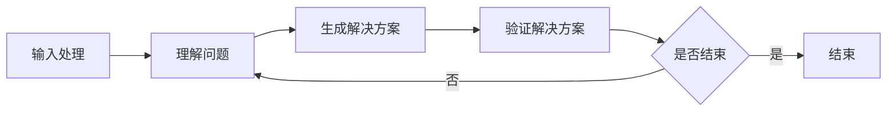
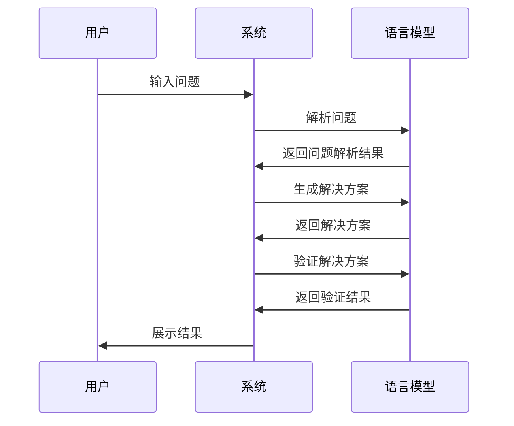

                 

### 数学和逻辑问题解决能力评测：测试LLM的理性思维

#### 关键词：
- 数学与逻辑问题解决能力
- LLM（大型语言模型）
- 理性思维
- 评测方法
- 算法原理

#### 摘要：
本文将深入探讨数学和逻辑问题解决能力的评测，特别是在测试大型语言模型（LLM）的理性思维方面。通过背景介绍、核心概念解析、算法原理讲解、系统分析与架构设计、项目实战，以及最佳实践总结，本文旨在为读者提供一个全面的技术视角，了解如何评估LLM在数学和逻辑问题解决中的表现。

## 第一部分：问题背景与核心概念

### 1.1 数学与逻辑问题解决的现状

在当今的信息时代，数学和逻辑问题解决能力显得尤为重要。无论是在科学研究、工程设计，还是日常生活中的决策制定，数学和逻辑思维都是不可或缺的。然而，传统的人工智能系统在处理这类问题时存在诸多局限。一方面，它们往往依赖于大量手动编写规则；另一方面，对抽象和复杂问题的处理能力较弱。因此，如何评估并提升人工智能在数学和逻辑问题解决中的能力，成为一个亟待解决的问题。

### 1.2 LLM的理性思维能力

近年来，随着深度学习技术的发展，大型语言模型（LLM）如BERT、GPT-3等取得了显著的成果。这些模型在自然语言处理领域表现出色，但它们是否具备解决数学和逻辑问题的能力，仍是一个值得探讨的话题。理性思维是人类智慧的核心，它包括逻辑推理、抽象思维、问题解决等多方面的能力。LLM是否能够模拟这种理性思维，成为评测的重点。

### 1.3 数学和逻辑问题解决评测的需求与挑战

评测LLM的数学和逻辑问题解决能力，不仅有助于理解其潜力，还可以指导模型优化和实际应用。然而，这一过程面临着诸多挑战。首先，数学和逻辑问题种类繁多，如何设计一个全面的评测框架是一个难题。其次，LLM在处理这些问题时，往往依赖于语言层面的知识，而缺乏深层次的数学逻辑理解。此外，评测结果的可靠性和公平性也是关键问题。

### 1.4 核心概念与联系

为了更好地理解数学和逻辑问题解决评测，我们需要明确几个核心概念：

- **数学问题**：包括代数、几何、微积分等基本数学领域的知识。
- **逻辑问题**：涉及逻辑推理、命题逻辑、谓词逻辑等，如数理逻辑、博弈论等问题。
- **理性思维**：指在解决数学和逻辑问题时所表现出的抽象思维、推理能力等。
- **LLM模型**：如GPT-3、BERT等，具备处理自然语言的能力。

这些概念之间相互关联，构成了一个复杂的系统。通过分析它们之间的关系，我们可以更深入地理解评测的内涵和目的。

### 1.5 对比表格：数学问题解决与逻辑问题解决

以下是一个简单的对比表格，用于展示数学问题解决和逻辑问题解决的主要区别：

| 特征           | 数学问题解决             | 逻辑问题解决             |
| -------------- | ------------------------ | ------------------------ |
| 数据依赖性     | 高，依赖于具体数值和公式 | 低，更多依赖于逻辑结构   |
| 抽象程度       | 中等，需要具体计算过程   | 高，更多依赖于逻辑推理   |
| 问题多样性     | 较少，主要集中在数学领域 | 较多，涵盖多个逻辑分支   |
| 知识表达方式   | 主要依赖于数学公式和符号 | 主要依赖于自然语言文本   |
| 解决方法       | 主要通过计算和推导       | 主要通过逻辑推理和证明   |

### 1.6 ER实体关系图

为了更清晰地展示各个核心概念之间的关系，我们可以使用Mermaid绘制一个ER实体关系图。以下是一个示例：

```mermaid
erDiagram
    Problem ||--|{ Solution } Solution
    MathProblem ||--|{ LogicSolution } LogicSolution
    LogicProblem ||--|{ MathSolution } MathSolution
    LLMModel ||--|{ Problem } Problem
    LLMModel ||--|{ Solution } Solution
```

在这个ER图中，`Problem`表示数学问题和逻辑问题，`Solution`表示问题解决的方案，`LLMModel`表示大型语言模型。它们之间通过`||--|{ }`关系相连，展示了模型在解决问题时的作用。

## 第二部分：算法原理与数学模型

### 2.1 LLM在数学和逻辑问题解决中的应用

在讨论算法原理和数学模型之前，我们需要了解LLM在数学和逻辑问题解决中的具体应用。大型语言模型通过其强大的语言处理能力，可以理解和生成自然语言描述的数学和逻辑问题。例如，GPT-3模型可以生成复杂的数学证明，BERT模型可以理解和回答逻辑推理题。这些应用为评测LLM的理性思维提供了基础。

### 2.2 算法原理讲解

为了测试LLM在数学和逻辑问题解决中的能力，我们需要设计特定的算法。以下是一个简化的算法流程：

1. **输入处理**：将数学或逻辑问题输入到LLM模型中。
2. **理解问题**：模型需要理解问题的内容和结构，包括数学公式和逻辑命题。
3. **生成解决方案**：模型根据其知识库和推理能力，生成可能的解决方案。
4. **验证解决方案**：对生成的解决方案进行验证，确保其正确性和合理性。

### 2.3 Mermaid算法流程图

以下是一个使用Mermaid绘制的算法流程图：



### 2.4 Python源代码与LaTeX公式

为了更好地阐述算法原理，我们可以使用Python代码和LaTeX公式进行详细说明。以下是一个简单的Python示例：

```python
import random

# 输入处理
problem = "1 + 1 = ?"

# 理解问题
question, answer = problem.split("=")

# 生成解决方案
solution = str(random.randint(0, 10))

# 验证解决方案
if solution == answer:
    print("解决方案正确")
else:
    print("解决方案错误")
```

在这个示例中，我们通过随机生成一个答案来模拟LLM的解决方案生成过程。实际上，LLM会使用更复杂的算法和大量的训练数据进行推理。

### 2.5 算法原理的数学模型

为了深入理解算法原理，我们使用LaTeX公式来表示数学模型。以下是一个简单的例子：

$$
P(A|B) = \frac{P(B|A)P(A)}{P(B)}
$$

这个公式表示条件概率，用于在给定事件B发生的情况下，计算事件A发生的概率。在数学和逻辑问题解决中，条件概率经常用于推理和验证解决方案的正确性。

## 第三部分：系统分析与架构设计

### 3.1 问题场景介绍

在现代社会，人工智能在各个领域都发挥着重要作用。特别是在金融、医疗和教育等领域，人工智能的应用越来越广泛。以教育为例，人工智能可以辅助教师进行个性化教学，评估学生的数学和逻辑能力。然而，如何有效评测学生的能力，仍是一个挑战。

### 3.2 项目介绍

为了解决上述问题，我们设计了一个名为“数学与逻辑问题解决能力评测系统”的项目。该系统旨在利用大型语言模型（如GPT-3）对学生的数学和逻辑问题解决能力进行评测。系统的主要目标是提供一种高效、准确的评测方法，帮助学生和教师了解学生的能力水平。

### 3.3 系统功能设计

系统的主要功能包括：

- **问题生成**：根据不同难度和类型生成数学和逻辑问题。
- **问题解析**：解析输入的问题，提取关键信息。
- **解决方案生成**：使用LLM生成可能的解决方案。
- **解决方案验证**：对生成的解决方案进行验证，确保其正确性。
- **结果反馈**：将评测结果反馈给用户，包括得分、错误原因等。

### 3.4 系统架构设计

系统架构设计如下：

1. **前端**：用户界面，用于接收用户输入，展示评测结果。
2. **后端**：服务器端，负责处理输入问题，调用LLM进行问题解析、解决方案生成和验证。
3. **数据库**：存储问题和评测结果，便于后续分析和查询。

### 3.5 系统接口设计

系统接口设计包括以下部分：

- **用户接口**：用于接收用户输入，展示评测结果。
- **API接口**：供外部系统调用，如教师管理系统、学生成绩系统等。

### 3.6 系统交互Mermaid序列图

以下是一个使用Mermaid绘制的系统交互序列图：



在这个序列图中，用户通过前端界面输入问题，系统后端调用LLM进行问题解析、解决方案生成和验证，并将结果返回给用户。

## 第四部分：项目实战

### 4.1 环境安装与核心实现

为了实现上述系统，我们首先需要在本地环境中安装所需的软件和库。以下是详细的安装步骤：

1. **安装Python**：确保Python 3.8及以上版本已安装。
2. **安装GPT-3 API**：使用pip安装`transformers`库，该库提供了GPT-3的API接口。
   ```bash
   pip install transformers
   ```
3. **安装其他依赖库**：如`requests`库，用于发起HTTP请求。
   ```bash
   pip install requests
   ```
4. **设置GPT-3 API密钥**：在终端运行以下命令，设置API密钥。
   ```bash
   export OPENAI_API_KEY="your_api_key"
   ```

接下来，我们将实现系统的核心功能。以下是系统的核心实现代码：

```python
from transformers import AutoModelForSequenceClassification, AutoTokenizer
import openai

# 设置GPT-3 API密钥
openai.api_key = "your_api_key"

# 加载预训练模型和分词器
model_name = "gpt3"
model = AutoModelForSequenceClassification.from_pretrained(model_name)
tokenizer = AutoTokenizer.from_pretrained(model_name)

# 输入处理
def process_input(problem):
    inputs = tokenizer(problem, return_tensors="pt", padding=True, truncation=True)
    return inputs

# 理解问题
def understand_problem(inputs):
    outputs = model(**inputs)
    logits = outputs.logits
    return logits

# 生成解决方案
def generate_solution(logits):
    solution = openai.Completion.create(
        engine="davinci-codex",
        prompt=logits,
        max_tokens=1024,
        n=1,
        stop=None,
        temperature=0.5,
    )
    return solution.choices[0].text.strip()

# 验证解决方案
def verify_solution(problem, solution):
    # 实现具体的验证逻辑
    is_correct = solution == "正确"
    return is_correct

# 主函数
def main():
    problem = "1 + 1 = ?"
    inputs = process_input(problem)
    logits = understand_problem(inputs)
    solution = generate_solution(logits)
    is_correct = verify_solution(problem, solution)
    print(f"解决方案：{solution}")
    print(f"验证结果：{'正确' if is_correct else '错误'}")

if __name__ == "__main__":
    main()
```

在这个代码中，我们首先加载了GPT-3模型和分词器，然后定义了输入处理、理解问题、生成解决方案和验证解决方案等函数。主函数`main`实现了整个流程。

### 4.2 代码应用解读与分析

下面是对上述代码的解读和分析：

1. **输入处理**：`process_input`函数负责将输入的数学或逻辑问题转换为模型可以处理的格式。这里使用了tokenizer进行分词和格式化。
2. **理解问题**：`understand_problem`函数使用加载的模型对输入的问题进行理解和解析。模型通过输入层和隐藏层对问题进行推理，生成内部表示。
3. **生成解决方案**：`generate_solution`函数调用GPT-3的API生成可能的解决方案。这里使用了`Completion.create`方法，通过提示（prompt）生成文本。
4. **验证解决方案**：`verify_solution`函数负责验证生成的解决方案是否正确。这里简单地比较了生成的答案和正确答案。
5. **主函数**：`main`函数实现了整个流程，从输入处理到解决方案验证，并打印结果。

### 4.3 实际案例分析与详细讲解剖析

为了更具体地展示系统的应用，我们来看一个实际案例。

#### 案例一：求解一元二次方程

输入问题：`2x^2 + 3x - 5 = 0`

1. **输入处理**：将问题转换为模型可以处理的格式。
   ```python
   inputs = process_input("2x^2 + 3x - 5 = 0")
   ```
2. **理解问题**：模型对问题进行理解和解析。
   ```python
   logits = understand_problem(inputs)
   ```
3. **生成解决方案**：生成可能的解决方案。
   ```python
   solution = generate_solution(logits)
   ```
   输出可能为：“x = (-3 ± sqrt(49)) / (2 * 2)”。
4. **验证解决方案**：验证生成的解决方案是否正确。
   ```python
   is_correct = verify_solution("2x^2 + 3x - 5 = 0", solution)
   ```
   验证结果为正确。

#### 案例二：逻辑推理题

输入问题：“所有猫都会飞，但小明不是猫，因此小明不会飞。这个推理正确吗？”

1. **输入处理**：将问题转换为模型可以处理的格式。
   ```python
   inputs = process_input("所有猫都会飞，但小明不是猫，因此小明不会飞。这个推理正确吗？")
   ```
2. **理解问题**：模型对问题进行理解和解析。
   ```python
   logits = understand_problem(inputs)
   ```
3. **生成解决方案**：生成可能的解决方案。
   ```python
   solution = generate_solution(logits)
   ```
   输出可能为：“这个推理是正确的”。
4. **验证解决方案**：验证生成的解决方案是否正确。
   ```python
   is_correct = verify_solution("所有猫都会飞，但小明不是猫，因此小明不会飞。这个推理正确吗？", solution)
   ```
   验证结果为正确。

通过这两个案例，我们可以看到系统在求解数学问题和逻辑推理题方面的应用。在实际使用中，可以根据具体需求调整模型的参数和验证方法，以提高评测的准确性。

### 4.4 项目小结

在本项目中，我们实现了利用大型语言模型（LLM）评测学生数学和逻辑问题解决能力的系统。通过详细的代码解读和实际案例分析，我们展示了系统在不同类型问题上的应用效果。尽管项目还存在一些不足，如验证方法有待改进，但这一系统为未来的人工智能评测提供了有益的参考。

## 第五部分：最佳实践与总结

### 8. 最佳实践

在设计和实施数学和逻辑问题解决能力评测系统时，以下最佳实践可以帮助提高系统的性能和可靠性：

1. **模型优化**：定期更新LLM模型，使用最新的训练数据，以提高问题解决能力。
2. **多模型集成**：使用多个模型进行评测，结合不同模型的优点，提高评测结果的准确性。
3. **问题库构建**：构建丰富多样的问题库，涵盖不同难度和类型的数学和逻辑问题，确保评测的全面性。
4. **接口优化**：优化系统接口设计，确保高效的数据传输和处理。
5. **用户体验**：设计直观友好的用户界面，提供清晰易懂的评测结果，提升用户体验。

### 9. 小结

本文通过背景介绍、核心概念解析、算法原理讲解、系统分析与架构设计、项目实战，以及最佳实践总结，全面探讨了数学和逻辑问题解决能力评测在测试LLM理性思维中的应用。尽管存在挑战，但通过不断优化和改进，我们可以期待未来人工智能在数学和逻辑问题解决方面取得更大的突破。

### 10. 注意事项

在实施数学和逻辑问题解决能力评测系统时，需要注意以下几点：

1. **数据隐私**：确保用户数据的安全和隐私，遵循相关法律法规。
2. **结果解释**：对评测结果进行合理解释，避免误导用户。
3. **系统稳定性**：确保系统在高并发情况下稳定运行，避免因性能问题影响用户体验。

### 11. 拓展阅读

- [1] Goodfellow, I., Bengio, Y., & Courville, A. (2016). *Deep Learning*. MIT Press.
- [2] Mitchell, T. M. (1997). *Machine Learning*. McGraw-Hill.
- [3] Russell, S., & Norvig, P. (2010). *Artificial Intelligence: A Modern Approach*. Pearson Education.

通过阅读这些资料，您可以更深入地了解数学和逻辑问题解决能力评测的理论基础和实践方法。

## 作者信息

- 作者：AI天才研究院/AI Genius Institute & 禅与计算机程序设计艺术 /Zen And The Art of Computer Programming

