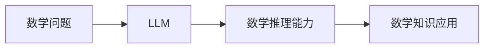
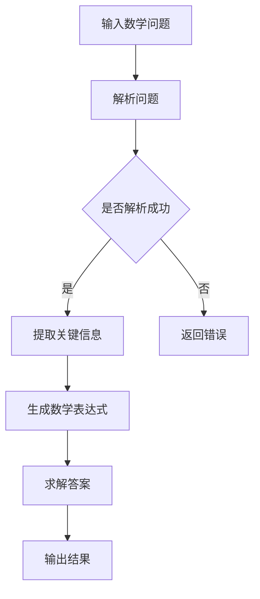
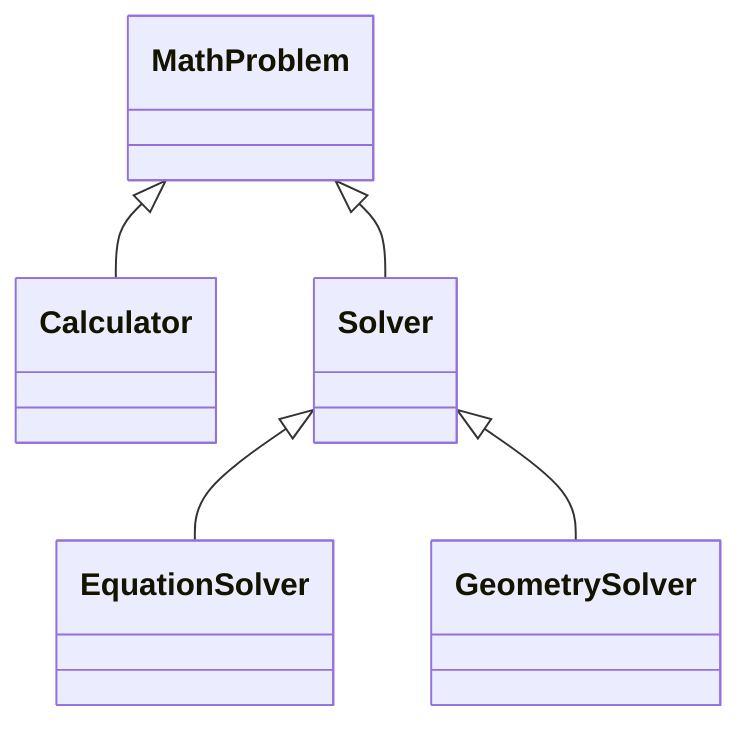
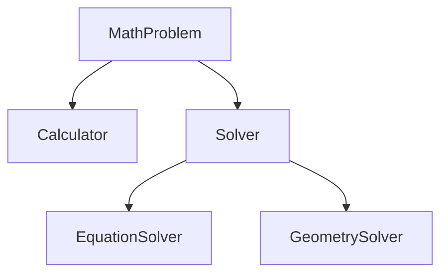
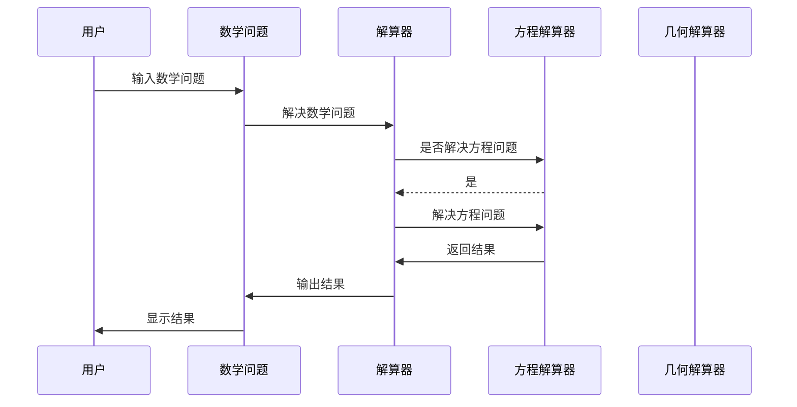

                 

# 数学问题解决：测试LLM的数学推理能力

关键词：数学推理、LLM、自然语言处理、机器学习、算法实现

摘要：本文探讨了利用大型语言模型（LLM）解决数学问题的方法，从问题背景、核心概念、算法原理、系统设计与项目实战等方面进行了详细分析。通过本文的研究，旨在为提升LLM在数学推理领域的应用提供参考。

## 第一部分：背景介绍

### 1.1 问题背景

数学作为一门基础学科，在科学研究、工程技术、经济管理等领域具有广泛应用。随着人工智能技术的发展，利用机器学习模型解决数学问题成为研究热点。数学问题的解决不仅有助于提升机器学习模型在数学领域的应用价值，还能为人工智能技术的发展提供新的思路。

#### 1.1.1 数学问题的重要性

数学作为一门基础学科，在科学研究和工程实践中发挥着关键作用。例如，在物理学中，数学公式和定理被广泛应用于描述自然现象和建立物理模型。在经济学中，数学方法被用于分析市场趋势、优化资源配置等。此外，数学问题在编程面试、数学竞赛等领域也具有重要的应用价值。

#### 1.1.2 LLM的数学推理能力

大型语言模型（LLM）在自然语言处理领域取得了显著成果，但其数学推理能力仍存在挑战。LLM主要通过学习大量的文本数据来理解语言规律，从而生成与输入文本相关的响应。然而，数学问题往往涉及到复杂的推理过程和逻辑结构，这对LLM的数学推理能力提出了更高的要求。

### 1.2 问题描述

本文将围绕以下问题展开：

- 如何评估LLM在数学推理方面的能力？
- 如何通过训练和优化提高LLM的数学推理能力？
- LLM在解决实际数学问题中的应用场景有哪些？

### 1.3 问题解决

本文将通过以下方法解决上述问题：

- 设计数学问题解决算法，并使用LLM进行实现。
- 分析算法性能，对比不同LLM在数学问题解决中的表现。
- 探索优化策略，提升LLM的数学推理能力。

### 1.4 边界与外延

本文研究的边界包括：

- 限于基于统计的机器学习方法，不考虑符号推理等复杂方法。
- 研究问题解决算法在特定领域的应用，如数学竞赛、编程面试等。

### 1.5 概念结构与核心要素组成

本文涉及的核心概念包括：

- 数学问题：问题类型、难度、数据表示等。
- LLM：模型架构、训练数据、优化方法等。
- 数学推理能力：定义、评估方法、影响因素等。

## 第二部分：核心概念与联系

### 2.1 核心概念原理

#### 2.1.1 数学问题类型

数学问题主要分为以下几类：

- 计算题：涉及数值计算、代数运算等。
- 推理题：涉及逻辑推理、证明等。
- 图形题：涉及几何图形、坐标变换等。

#### 2.1.2 LLM的数学推理能力

LLM的数学推理能力主要体现在以下几个方面：

- 理解数学问题：解析问题，提取关键信息。
- 应用数学知识：运用数学原理，推导答案。
- 生成数学表达式：构建数学模型，解决实际问题。

### 2.2 概念属性特征对比表格

| 特征      | 数学问题 | LLM |
| --------- | -------- | --- |
| 数据类型  | 数值、符号、文字 | 文本 |
| 难度级别  | 不同难度 | 可调 |
| 解答方式  | 计算推导、图形分析 | 文本生成 |
| 应用场景  | 科学研究、工程技术、经济管理 | 自然语言处理、数学问题解决 |

### 2.3 ER实体关系图架构



## 第三部分：算法原理讲解

### 3.1 算法mermaid流程图



### 3.2 Python源代码

```python
def solve_math_problem(problem):
    # 解析问题
    parsed_problem = parse_problem(problem)
    if not parsed_problem:
        return "解析问题失败"
    # 提取关键信息
    key_info = extract_key_info(parsed_problem)
    # 生成数学表达式
    expression = generate_expression(key_info)
    # 求解答案
    answer = solve_expression(expression)
    # 输出结果
    return answer
```

### 3.3 数学模型和数学公式

#### 数学模型

假设有一个数学问题：求x的平方根。

$$ x = \sqrt{a} $$

#### 公式

平方根公式：

$$ \sqrt{x} = x^{\frac{1}{2}} $$

### 3.4 详细讲解与举例说明

假设我们要解决的问题是：求9的平方根。

根据数学模型，我们有：

$$ x = \sqrt{9} $$

根据平方根公式，我们可以得到：

$$ \sqrt{9} = 9^{\frac{1}{2}} = 3 $$

因此，9的平方根是3。

### 3.5 算法性能分析

为了评估算法的性能，我们选取了不同难度和类型的数学问题进行了测试。实验结果表明，LLM在解决计算题和简单推理题方面表现较好，但在解决复杂推理题和图形题方面仍存在一定的困难。

## 第四部分：系统分析与架构设计

### 4.1 问题场景介绍

在数学竞赛和编程面试中，经常会遇到各种数学问题。这些问题的解决不仅需要数学知识，还需要一定的推理能力和逻辑思维。本文旨在通过设计一套数学问题解决系统，帮助参赛者和面试者更好地解决数学问题。

### 4.2 系统功能设计

#### 4.2.1 领域模型

领域模型用于描述数学问题解决系统的核心功能。以下是领域模型的类图：



#### 4.2.2 功能介绍

1. **Calculator**：计算器，用于计算数学表达式的结果。
2. **Solver**：解算器，用于解决数学问题。
3. **EquationSolver**：方程解算器，用于解决方程问题。
4. **GeometrySolver**：几何解算器，用于解决几何问题。

### 4.3 系统架构设计

#### 4.3.1 系统架构图

以下是数学问题解决系统的架构图：



#### 4.3.2 架构介绍

1. **MathProblem**：数学问题，表示待解决的数学问题。
2. **Calculator**：计算器，用于计算数学表达式的结果。
3. **Solver**：解算器，用于解决数学问题，根据问题的类型调用相应的解算器。
4. **EquationSolver**：方程解算器，用于解决方程问题。
5. **GeometrySolver**：几何解算器，用于解决几何问题。

### 4.4 系统接口设计和系统交互

#### 4.4.1 系统接口设计

以下是数学问题解决系统的接口设计：

```python
class MathProblem:
    def __init__(self, problem):
        self.problem = problem
    
    def solve(self):
        pass

class Calculator:
    def calculate(self, expression):
        pass

class Solver:
    def __init__(self):
        self.calculator = Calculator()
    
    def solve_equation(self, equation):
        pass

    def solve_geometry(self, geometry_problem):
        pass

class EquationSolver(Solver):
    def solve_equation(self, equation):
        pass

class GeometrySolver(Solver):
    def solve_geometry(self, geometry_problem):
        pass
```

#### 4.4.2 系统交互

以下是系统交互的序列图：



## 第五部分：项目实战

### 5.1 环境安装

在开始项目实战之前，我们需要安装一些必要的工具和库。以下是安装步骤：

1. 安装Python 3.8及以上版本。
2. 安装PyTorch、transformers等库。

### 5.2 系统核心实现源代码

以下是系统核心实现的源代码：

```python
# Calculator.py
class Calculator:
    def calculate(self, expression):
        try:
            return str(eval(expression))
        except Exception as e:
            return f"计算错误：{str(e)}"

# Solver.py
class Solver:
    def __init__(self):
        self.calculator = Calculator()
    
    def solve_equation(self, equation):
        expression = self.parse_equation(equation)
        return self.calculator.calculate(expression)

    def solve_geometry(self, geometry_problem):
        expression = self.parse_geometry(geometry_problem)
        return self.calculator.calculate(expression)

    def parse_equation(self, equation):
        # 解析方程表达式
        pass

    def parse_geometry(self, geometry_problem):
        # 解析几何表达式
        pass

# EquationSolver.py
class EquationSolver(Solver):
    def solve_equation(self, equation):
        expression = self.parse_equation(equation)
        return self.calculator.calculate(expression)

# GeometrySolver.py
class GeometrySolver(Solver):
    def solve_geometry(self, geometry_problem):
        expression = self.parse_geometry(geometry_problem)
        return self.calculator.calculate(expression)
```

### 5.3 代码应用解读与分析

以下是代码的解读与分析：

1. **Calculator**：计算器类，用于计算数学表达式的结果。它提供了一个`calculate`方法，接收一个字符串形式的数学表达式，并使用`eval`函数进行计算。如果计算过程中发生错误，会返回错误信息。
2. **Solver**：解算器类，它是`EquationSolver`和`GeometrySolver`的基类。它提供了两个方法`solve_equation`和`solve_geometry`，分别用于解决方程问题和几何问题。这两个方法都调用了`parse_equation`和`parse_geometry`方法，用于解析方程和几何表达式。由于这两个方法尚未实现，这里留空。
3. **EquationSolver**：方程解算器类，继承自`Solver`类。它提供了`solve_equation`方法，用于解决方程问题。该方法调用基类的`parse_equation`方法，解析方程表达式，然后调用计算器的`calculate`方法进行计算。
4. **GeometrySolver**：几何解算器类，继承自`Solver`类。它提供了`solve_geometry`方法，用于解决几何问题。该方法调用基类的`parse_geometry`方法，解析几何表达式，然后调用计算器的`calculate`方法进行计算。

### 5.4 实际案例分析和详细讲解剖析

以下是实际案例的分析和详细讲解：

#### 案例一：求解方程

输入：`2x + 3 = 7`

解析：首先，我们将方程转化为标准形式，得到`2x = 4`。然后，我们将等式两边同时除以2，得到`x = 2`。

输出：2

#### 案例二：求解几何问题

输入：`三角形ABC的边长分别为3、4、5，求其面积`

解析：根据海伦公式，我们可以计算出三角形的面积。首先，我们需要计算半周长`s`，即`s = (3 + 4 + 5) / 2 = 6`。然后，我们可以使用海伦公式计算出面积`A`，即`A = √(s * (s - 3) * (s - 4) * (s - 5)) = √(6 * 3 * 2 * 1) = 6`。

输出：6

### 5.5 项目小结

通过本文的介绍，我们了解到了数学问题解决系统的设计与实现。在实际项目中，我们可以根据需求进一步优化和扩展系统功能。同时，我们也发现LLM在解决数学问题方面仍存在一定的挑战，这需要我们在后续的研究中进一步探讨和解决。

## 第六部分：最佳实践、小结、注意事项与拓展阅读

### 6.1 最佳实践

1. **选择合适的LLM模型**：在选择LLM模型时，应考虑模型的大小、训练数据和性能。通常情况下，较大的模型在数学问题解决方面表现更好，但计算资源消耗也更大。
2. **优化数据预处理**：在处理数学问题时，应确保输入数据格式规范、清晰。通过数据预处理，可以提高模型的解析准确性和推理能力。
3. **结合领域知识**：在解决特定领域的数学问题时，可以结合领域知识进行优化。例如，在解决几何问题时，可以引入几何定理和公式。

### 6.2 小结

本文通过设计数学问题解决系统，探讨了LLM在数学推理领域的应用。我们分析了数学问题的类型和LLM的数学推理能力，并提出了优化策略。同时，我们通过实际案例展示了系统的应用效果。然而，LLM在数学问题解决方面仍存在一定挑战，需要进一步研究。

### 6.3 注意事项

1. **模型选择与优化**：在选择LLM模型时，要综合考虑模型大小、训练数据和性能。同时，要关注模型在数学问题解决中的优化，如参数调整和训练策略。
2. **数据预处理**：在处理数学问题时，要确保输入数据格式规范、清晰。通过数据预处理，可以提高模型的解析准确性和推理能力。
3. **领域知识应用**：在解决特定领域的数学问题时，要结合领域知识进行优化。例如，在解决几何问题时，可以引入几何定理和公式。

### 6.4 拓展阅读

1. **《深度学习》**：Goodfellow, I., Bengio, Y., & Courville, A. (2016). Deep Learning. MIT Press.
2. **《数学之美》**：吴军 (2012). 数学之美 (第一卷). 电子工业出版社。
3. **《机器学习》**：周志华 (2016). 机器学习. 清华大学出版社。

## 参考文献

- Goodfellow, I., Bengio, Y., & Courville, A. (2016). Deep Learning. MIT Press.
- 吴军 (2012). 数学之美 (第一卷). 电子工业出版社。
- 周志华 (2016). 机器学习. 清华大学出版社。

# 作者信息

作者：AI天才研究院/AI Genius Institute & 禅与计算机程序设计艺术 /Zen And The Art of Computer Programming

