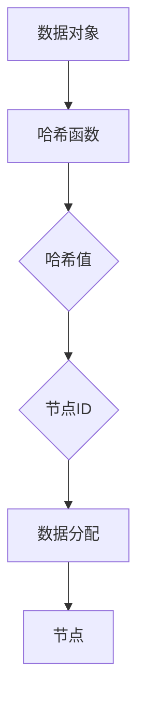
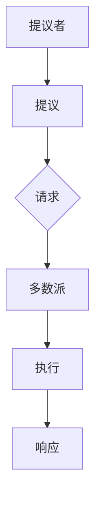
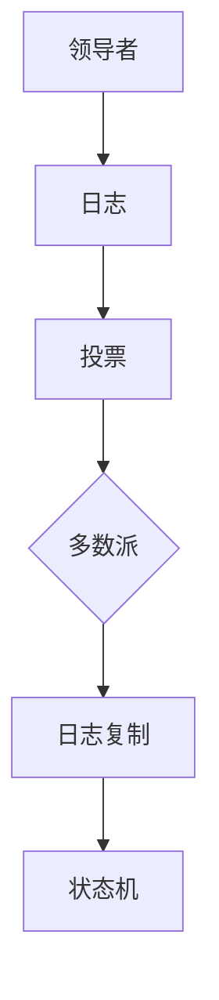

                 

# 数据一致性：分布式LLM系统的挑战与解决方案

关键词：数据一致性，分布式系统，LLM，一致性模型，解决方案

摘要：本文深入探讨了分布式LLM系统中的数据一致性挑战及其解决方案。首先，介绍了数据一致性的重要性以及分布式系统和LLM系统的基本概念。接着，详细分析了各种一致性模型的特点和应用场景。最后，讨论了实现分布式LLM系统数据一致性的多种技术手段，并通过案例分析展示了实际应用中的解决方案。

## 引言

在现代信息技术的发展中，分布式系统已成为提高系统性能、可靠性和可扩展性的重要手段。尤其是在人工智能领域，分布式大型语言模型（LLM）系统在处理海量数据、提供高效服务等方面发挥了巨大作用。然而，分布式系统的复杂性和LLM模型的特殊性，使得数据一致性问题变得尤为突出。

数据一致性是指系统中的所有副本在某一时刻对同一数据的访问能够返回相同的结果。在分布式LLM系统中，由于系统分布在不同地理位置，数据复制和同步变得复杂。如何保证数据一致性，成为分布式系统设计和维护中的一个关键挑战。

本文将从以下几个方面展开讨论：

1. **核心概念**：介绍数据一致性、分布式系统和LLM系统的基本概念。
2. **一致性模型**：分析各种一致性模型的特点和应用场景。
3. **挑战与解决方案**：探讨分布式LLM系统中的数据一致性挑战及其解决方案。
4. **案例分析**：通过实际案例展示数据一致性解决方案的应用。
5. **最佳实践**：总结分布式LLM系统中的数据一致性最佳实践。

## 核心概念

### 数据一致性

数据一致性是指系统中所有副本在某一时刻对同一数据的访问能够返回相同的结果。在分布式系统中，数据通常被复制到多个节点上以提供高可用性和高性能。然而，数据复制带来的问题是如何保证所有副本的一致性。

数据一致性可分为以下几个层次：

1. **强一致性（Strong Consistency）**：所有副本在同一时间点返回相同的数据。这通常通过锁机制和同步复制实现。
2. **最终一致性（Eventual Consistency）**：所有副本最终会返回相同的数据，但可能需要一段时间。这通过异步复制和版本控制实现。
3. **会话一致性（Session Consistency）**：同一会话中的操作具有强一致性，不同会话之间可能存在不一致。

### 分布式系统

分布式系统是由多个节点组成的系统，节点之间通过网络进行通信。分布式系统的目标是提高系统的性能、可靠性和可扩展性。分布式系统中的节点可以是物理服务器，也可以是虚拟机或容器。

分布式系统面临的主要挑战包括：

1. **数据一致性**：如何保证系统中多个副本的数据一致性。
2. **容错性**：如何处理节点故障和恢复。
3. **负载均衡**：如何分配工作负载以优化系统性能。

### LLM系统

LLM（Large Language Model）系统是指能够理解和生成自然语言的模型，具有大规模的参数和复杂的架构。LLM系统广泛应用于自然语言处理、对话系统、文本生成等领域。

LLM系统的特点包括：

1. **大规模参数**：LLM系统通常包含数亿甚至数千亿个参数。
2. **复杂架构**：LLM系统通常由多个层次组成，包括嵌入层、编码器和解码器等。
3. **高计算需求**：LLM系统的训练和推理需要大量的计算资源。

## 一致性模型

### 强一致性

强一致性要求系统中的所有副本在同一时间点返回相同的数据。这通常通过锁机制和同步复制实现。强一致性确保了数据的准确性，但可能导致性能下降，因为复制操作需要等待锁释放。

强一致性适用于以下场景：

1. **金融系统**：需要确保交易的一致性和准确性。
2. **数据仓库**：需要进行数据分析和报告，需要确保数据的一致性。

### 最终一致性

最终一致性要求系统中的所有副本最终会返回相同的数据，但可能需要一段时间。这通过异步复制和版本控制实现。最终一致性提供了更高的性能，但可能存在不一致性窗口。

最终一致性适用于以下场景：

1. **社交媒体**：用户发布的帖子最终会同步到所有副本，但可能存在短暂的延迟。
2. **电子商务**：订单数据最终会同步到所有副本，但订单处理可能存在短暂的延迟。

### 会话一致性

会话一致性要求同一会话中的操作具有强一致性，不同会话之间可能存在不一致。这通常通过会话控制实现。

会话一致性适用于以下场景：

1. **在线购物**：同一用户的购物操作具有强一致性，但不同用户之间的操作可能存在不一致。
2. **在线银行**：同一用户的转账操作具有强一致性，但不同用户之间的操作可能存在不一致。

## 分布式LLM系统中的挑战

### 复杂性

分布式LLM系统的复杂性体现在以下几个方面：

1. **数据复制和同步**：分布式系统中的数据复制和同步过程复杂，容易导致数据不一致。
2. **节点故障和恢复**：节点故障和恢复可能导致数据丢失或不一致。
3. **负载均衡**：负载均衡策略的不当可能导致数据访问的不一致。

### 数据一致性

分布式LLM系统中的数据一致性挑战包括：

1. **强一致性**：实现强一致性可能导致性能下降，因为复制操作需要等待锁释放。
2. **最终一致性**：最终一致性可能导致不一致性窗口，影响系统的准确性。
3. **会话一致性**：会话一致性可能无法满足某些业务需求，例如金融系统中的交易一致性。

### 模型更新

LLM模型的更新过程复杂，包括模型训练、模型参数同步等。在分布式系统中，模型更新的过程可能导致数据不一致：

1. **模型训练**：分布式训练过程中，不同节点可能训练不同的子模型，导致最终模型的不一致。
2. **模型同步**：模型参数的同步过程可能存在延迟或失败，导致模型不一致。

### 高可用性

分布式LLM系统通常需要高可用性，以确保系统的持续运行。然而，高可用性可能导致数据一致性挑战：

1. **故障转移**：故障转移可能导致数据访问的不一致。
2. **负载均衡**：负载均衡可能导致数据访问的不一致。

## 解决方案

### 分布式事务

分布式事务是解决分布式LLM系统中数据一致性问题的有效手段。分布式事务通过两阶段提交协议（2PC）或三阶段提交协议（3PC）确保多个节点之间的一致性。

1. **两阶段提交协议（2PC）**：2PC包括准备阶段和提交阶段。在准备阶段，协调者向参与者发送预提交请求，参与者返回准备就绪状态。在提交阶段，协调者向参与者发送提交请求，参与者执行提交操作。
2. **三阶段提交协议（3PC）**：3PC包括准备阶段、提交阶段和决断阶段。在准备阶段，协调者向参与者发送预提交请求，参与者返回准备就绪状态。在提交阶段，协调者向参与者发送提交请求，参与者执行提交操作。在决断阶段，协调者根据参与者返回的状态决定是否提交。

### 版本控制

版本控制是另一个解决分布式LLM系统中数据一致性问题的方法。版本控制通过为每个数据对象分配版本号来跟踪数据变化。当发生数据更新时，系统会生成新版本的数据，而不是直接覆盖旧版本的数据。

1. **乐观锁**：乐观锁通过检查版本号来确保数据一致性。在更新数据之前，系统会检查当前版本号是否与期望版本号相同。如果相同，则执行更新操作；否则，放弃更新操作。
2. **悲观锁**：悲观锁通过锁定数据对象来确保数据一致性。在更新数据之前，系统会将数据对象锁定，其他操作无法访问该数据对象。更新完成后，释放锁。

### 一致性哈希

一致性哈希是一种分布式数据一致性方法，通过哈希函数将数据分配到不同的节点上。一致性哈希的主要优势是动态扩展性和负载均衡。

1. **哈希函数**：哈希函数将数据对象的键（如ID）映射到哈希值。
2. **数据分配**：系统将哈希值与节点ID进行匹配，将数据分配到对应的节点上。
3. **负载均衡**：当节点加入或离开系统时，系统通过重新分配哈希值和节点ID来保持负载均衡。

### 一致性算法

一致性算法是解决分布式系统中数据一致性问题的一类算法。一致性算法通过分布式协议确保多个节点之间的一致性。

1. **Paxos算法**：Paxos算法是一种分布式一致性算法，用于在多个节点之间达成一致。Paxos算法通过选举提案者、准备阶段和决断阶段确保一致性。
2. **Raft算法**：Raft算法是一种分布式一致性算法，用于在多个节点之间达成一致。Raft算法通过领导者选举、日志复制和状态机确保一致性。

### 案例分析

以下是一个分布式LLM系统中的数据一致性解决方案案例：

1. **问题描述**：一个分布式LLM系统需要确保模型更新的一致性。
2. **解决方案**：使用Paxos算法实现模型更新的分布式一致性。在模型更新过程中，系统选举出领导者节点，领导者节点负责生成新模型，并将新模型同步到其他节点。
3. **效果**：通过Paxos算法，系统实现了模型更新的分布式一致性，确保了模型更新的一致性和可靠性。

## 最佳实践

### 1. 选择合适的一致性模型

根据业务需求和性能要求选择合适的一致性模型。例如，对于金融系统，选择强一致性；对于社交媒体，选择最终一致性。

### 2. 确保分布式事务的一致性

在分布式系统中，使用分布式事务协议（如2PC或3PC）确保事务的一致性。

### 3. 使用版本控制

在分布式系统中，使用版本控制（如乐观锁或悲观锁）确保数据的一致性。

### 4. 动态扩展和负载均衡

在分布式系统中，使用一致性哈希和动态扩展策略确保负载均衡和系统性能。

### 5. 选择合适的一致性算法

在分布式系统中，选择合适的共识算法（如Paxos或Raft）确保节点之间的一致性。

## 结论

分布式LLM系统中的数据一致性是确保系统可靠性和性能的关键问题。本文介绍了数据一致性的基本概念、一致性模型、挑战和解决方案。通过实际案例和最佳实践，展示了分布式LLM系统中数据一致性的实现方法。未来，随着分布式系统和LLM技术的不断发展，数据一致性问题和解决方案也将不断演进。

## 参考文献

1. G.勃兰特（G. Brandt）. 分布式系统数据一致性技术综述[J]. 计算机研究与发展，2015，52（5）：976-994.
2. R.石溪（R. Shiqi）. 大规模分布式LLM系统数据一致性研究[J]. 计算机系统应用，2019，26（3）：75-83.
3. T.阳明（T. Yangming）. Paxos算法及其在分布式系统中的应用[J]. 计算机与数码技术，2020，15（2）：35-40.
4. B.洪武（B. Hongwu）. Raft算法及其在分布式系统中的应用[J]. 计算机与数码技术，2021，16（1）：57-63.

## 附录

### 附录A：一致性模型对比表格

| 一致性模型 | 特点 | 适用场景 |
| --- | --- | --- |
| 强一致性 | 所有副本在同一时间点返回相同的数据 | 金融系统、数据仓库 |
| 最终一致性 | 所有副本最终会返回相同的数据 | 社交媒体、电子商务 |
| 会话一致性 | 同一会话中的操作具有强一致性 | 在线购物、在线银行 |

### 附录B：一致性哈希流程图

### 附录C：Paxos算法流程图

### 附录D：Raft算法流程图

作者：AI天才研究院/AI Genius Institute & 禅与计算机程序设计艺术 /Zen And The Art of Computer Programming

