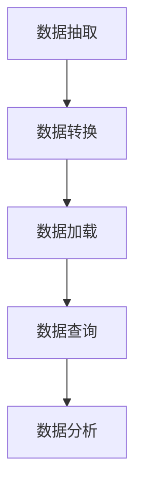
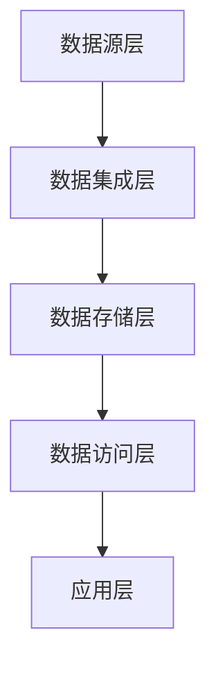

                 

### 数据仓库：支持LLM应用的商业智能分析

#### 关键词：数据仓库、LLM应用、商业智能分析、数据建模、算法优化、架构设计

#### 摘要：
本文将深入探讨数据仓库在支持大型语言模型（LLM）应用中的商业智能分析。首先，我们将介绍数据仓库的基本概念、发展历程以及在商业智能分析中的重要性。接着，我们将详细阐述数据仓库的核心概念与联系，包括数据仓库架构、数据建模、数据存储和数据分析与挖掘。随后，我们将讲解数据仓库中常用的算法原理，并通过Python代码示例进行详细阐述。接着，我们将介绍数据仓库系统的设计原则、架构设计、接口设计以及系统交互流程。随后，我们将通过实际案例展示数据仓库在实际应用中的实现过程。最后，我们将提供数据仓库应用的实践经验、注意事项以及未来的发展方向。

## 目录大纲设计思路

在设计《数据仓库：支持LLM应用的商业智能分析》的目录大纲时，我们首先需要明确书籍的核心主题和目标读者群体。本书旨在介绍数据仓库在支持大型语言模型（LLM）应用中的商业智能分析。因此，目录大纲需要覆盖以下几个核心部分：

1. **背景介绍**：介绍数据仓库的基本概念、发展历程以及其在商业智能分析中的重要性。
2. **核心概念与联系**：详细阐述数据仓库相关的核心概念，如数据仓库架构、ETL流程、数据建模、数据分析与挖掘等，并通过表格和流程图展示各概念之间的联系。
3. **算法原理讲解**：讲解数据仓库中常用的算法原理，如SQL优化、数据挖掘算法等，通过Mermaid流程图和Python代码示例进行详细阐述。
4. **数学模型与公式**：使用LaTeX格式展示关键的数学模型和公式，并进行详细的讲解和举例说明。
5. **系统分析与架构设计方案**：描述数据仓库系统的设计原则、架构设计、接口设计以及系统交互流程。
6. **项目实战**：通过实际案例展示数据仓库在实际应用中的实现过程，包括环境安装、系统实现、代码分析等。
7. **最佳实践与总结**：提供数据仓库应用的实践经验、注意事项以及未来的发展方向。

在设计过程中，我们将遵循以下步骤：

1. **定义核心章节**：根据书籍主题，确定必须包含的核心章节，如数据仓库基础、数据仓库设计、数据仓库实施、商业智能分析等。
2. **细化章节内容**：在每个核心章节下，细化出具体的子章节，确保内容覆盖全面。
3. **组织章节顺序**：根据逻辑关系和阅读顺序，合理安排章节的排列顺序。
4. **确保内容完整性**：确保每个章节都有详细的内容，符合书籍目标读者的需求。
5. **简洁明了**：在保证内容完整性的同时，避免冗余和复杂的表述，使目录大纲简洁明了。

### 核心章节确定

根据书籍主题和目标读者，我们确定以下核心章节：

1. **第1章：数据仓库基础**
    - 介绍数据仓库的定义、发展历程以及其在商业智能分析中的重要性。
    - 简述数据仓库的基本概念和核心要素。
    - 引入相关技术和工具。

2. **第2章：数据仓库架构**
    - 详细讲解数据仓库的架构设计，包括数据源、ETL过程、数据存储和数据访问层。
    - 描述各层次的功能和关键组件。

3. **第3章：数据建模**
    - 讲解数据仓库中的数据建模方法，如星型模型和雪花模型。
    - 展示不同建模方法的特点和适用场景。

4. **第4章：数据仓库实施**
    - 分步骤介绍数据仓库的实施过程，包括需求分析、系统设计、数据迁移和系统测试。
    - 介绍常见问题和解决方案。

5. **第5章：商业智能分析**
    - 讲解商业智能分析的概念、方法和工具。
    - 展示如何使用数据仓库进行数据分析和决策支持。

6. **第6章：支持LLM的数据仓库优化**
    - 分析LLM对数据仓库的性能需求。
    - 介绍针对LLM优化的数据仓库技术，如索引、查询优化和存储优化。

7. **第7章：项目实战**
    - 通过实际案例展示数据仓库在LLM应用中的实现过程。
    - 分析项目中的关键技术和难点。

8. **第8章：最佳实践与总结**
    - 提供数据仓库在LLM应用中的最佳实践经验。
    - 总结书籍中的关键知识点。
    - 展望数据仓库与LLM应用的未来发展。

### 章节细化

#### 第1章：数据仓库基础

**1.1 数据仓库的定义与发展**

- 数据仓库的定义
- 数据仓库的发展历程
- 数据仓库在商业智能分析中的重要性

**1.2 数据仓库的基本概念**

- 数据源
- 数据抽取、转换和加载（ETL）
- 数据存储
- 数据访问

**1.3 相关技术和工具**

- 数据仓库管理工具
- 数据建模工具
- 数据仓库数据库

#### 第2章：数据仓库架构

**2.1 数据仓库架构概述**

- 数据仓库架构的概念
- 数据仓库架构的典型模式

**2.2 数据源**

- 数据源的类型
- 数据源的选择和集成

**2.3 ETL过程**

- ETL的基本概念
- ETL工具和技术
- ETL流程设计

**2.4 数据存储**

- 数据仓库数据库
- 数据仓库索引
- 数据仓库分区

**2.5 数据访问**

- 数据查询优化
- 数据访问工具
- 数据安全与隐私

#### 第3章：数据建模

**3.1 数据建模概述**

- 数据建模的概念
- 数据建模的方法

**3.2 星型模型**

- 星型模型的概念
- 星型模型的组成部分
- 星型模型的应用

**3.3 雪花模型**

- 雪花模型的概念
- 雪花模型的组成部分
- 雪花模型的应用

#### 第4章：数据仓库实施

**4.1 数据仓库实施概述**

- 数据仓库实施的过程
- 数据仓库实施的步骤

**4.2 需求分析**

- 需求分析的方法
- 需求分析的内容

**4.3 系统设计**

- 系统设计的方法
- 系统设计的内容

**4.4 数据迁移**

- 数据迁移的方法
- 数据迁移的步骤

**4.5 系统测试**

- 系统测试的方法
- 系统测试的内容

#### 第5章：商业智能分析

**5.1 商业智能分析概述**

- 商业智能分析的定义
- 商业智能分析的目标

**5.2 数据分析**

- 数据分析的方法
- 数据分析的工具

**5.3 决策支持**

- 决策支持系统
- 决策支持工具

#### 第6章：支持LLM的数据仓库优化

**6.1 LLM的性能需求**

- LLM的查询性能要求
- LLM的数据存储要求

**6.2 索引优化**

- 索引的概念
- 索引的优化方法

**6.3 查询优化**

- 查询优化的方法
- 查询优化的工具

**6.4 存储优化**

- 存储优化的方法
- 存储优化的工具

#### 第7章：项目实战

**7.1 项目背景**

- 项目背景介绍
- 项目目标

**7.2 环境安装**

- 数据仓库系统的安装
- LLM模型的安装

**7.3 系统实现**

- 数据仓库系统设计
- LLM应用实现

**7.4 代码分析**

- 代码实现细节
- 代码性能分析

**7.5 案例分析**

- 项目案例介绍
- 项目案例分析

**7.6 项目小结**

- 项目总结
- 项目经验

#### 第8章：最佳实践与总结

**8.1 最佳实践**

- 数据仓库设计最佳实践
- LLM应用最佳实践

**8.2 小结**

- 本文总结
- 关键知识点回顾

**8.3 注意事项**

- 数据仓库实施注意事项
- LLM应用注意事项

**8.4 拓展阅读**

- 相关资料推荐
- 未来发展方向探讨

## 核心章节确定

### 核心章节确定

根据书籍主题和目标读者，我们确定以下核心章节：

1. **第1章：数据仓库基础**
    - 介绍数据仓库的定义、发展历程以及其在商业智能分析中的重要性。
    - 简述数据仓库的基本概念和核心要素。
    - 引入相关技术和工具。

2. **第2章：数据仓库架构**
    - 详细讲解数据仓库的架构设计，包括数据源、ETL过程、数据存储和数据访问层。
    - 描述各层次的功能和关键组件。

3. **第3章：数据建模**
    - 讲解数据仓库中的数据建模方法，如星型模型和雪花模型。
    - 展示不同建模方法的特点和适用场景。

4. **第4章：数据仓库实施**
    - 分步骤介绍数据仓库的实施过程，包括需求分析、系统设计、数据迁移和系统测试。
    - 介绍常见问题和解决方案。

5. **第5章：商业智能分析**
    - 讲解商业智能分析的概念、方法和工具。
    - 展示如何使用数据仓库进行数据分析和决策支持。

6. **第6章：支持LLM的数据仓库优化**
    - 分析LLM对数据仓库的性能需求。
    - 介绍针对LLM优化的数据仓库技术，如索引、查询优化和存储优化。

7. **第7章：项目实战**
    - 通过实际案例展示数据仓库在LLM应用中的实现过程。
    - 分析项目中的关键技术和难点。

8. **第8章：最佳实践与总结**
    - 提供数据仓库在LLM应用中的最佳实践经验。
    - 总结书籍中的关键知识点。
    - 展望数据仓库与LLM应用的未来发展。

### 章节细化

#### 第1章：数据仓库基础

**1.1 数据仓库的定义与发展**

- **数据仓库的定义**：介绍数据仓库是什么，它的基本概念及其在商业智能分析中的作用。
- **数据仓库的发展历程**：回顾数据仓库的发展历史，从早期的数据库系统到现代大数据平台的演变。
- **数据仓库在商业智能分析中的重要性**：探讨数据仓库对商业智能分析的重要性，包括数据集成、数据分析、决策支持等。

**1.2 数据仓库的基本概念**

- **数据源**：解释数据仓库的数据来源，包括内部数据和外部数据。
- **数据抽取、转换和加载（ETL）**：介绍ETL过程及其在数据仓库中的作用。
- **数据存储**：讨论数据仓库中的数据存储方案，如关系数据库、NoSQL数据库等。
- **数据访问**：探讨数据仓库中的数据访问方式，包括查询语言、数据挖掘工具等。

**1.3 相关技术和工具**

- **数据仓库管理工具**：介绍常用的数据仓库管理工具，如Apache Hadoop、Apache Spark等。
- **数据建模工具**：介绍数据仓库中的数据建模工具，如ERwin、Oracle SQL Developer等。
- **数据仓库数据库**：讨论常用的数据仓库数据库系统，如Oracle、MySQL、MongoDB等。

#### 第2章：数据仓库架构

**2.1 数据仓库架构概述**

- **数据仓库架构的概念**：介绍数据仓库的架构定义及其组成部分。
- **数据仓库架构的典型模式**：分析常见的数据仓库架构模式，如客户-服务器架构、三层架构、分布式架构等。

**2.2 数据源**

- **数据源的类型**：分类介绍数据源的类型，包括关系数据库、NoSQL数据库、日志文件等。
- **数据源的选择和集成**：讨论如何选择和集成不同的数据源，以实现数据仓库的统一视图。

**2.3 ETL过程**

- **ETL的基本概念**：解释ETL（提取、转换、加载）的基本概念及其在数据仓库中的作用。
- **ETL工具和技术**：介绍常用的ETL工具和技术，如Apache Kafka、Apache NiFi等。
- **ETL流程设计**：详细讲解ETL流程的设计方法，包括数据清洗、数据集成、数据转换等步骤。

**2.4 数据存储**

- **数据仓库数据库**：介绍常用的数据仓库数据库系统，如Oracle、MySQL、MongoDB等。
- **数据仓库索引**：讨论数据仓库中的索引机制，包括B树索引、哈希索引等。
- **数据仓库分区**：介绍数据仓库中的分区策略，包括基于时间分区、基于列分区等。

**2.5 数据访问**

- **数据查询优化**：讲解数据查询优化技术，如索引优化、查询缓存等。
- **数据访问工具**：介绍常用的数据访问工具，如SQL查询工具、数据挖掘工具等。
- **数据安全与隐私**：讨论数据仓库中的数据安全与隐私保护措施，包括加密、访问控制等。

#### 第3章：数据建模

**3.1 数据建模概述**

- **数据建模的概念**：介绍数据建模的基本概念及其在数据仓库中的作用。
- **数据建模的方法**：讨论常用的数据建模方法，如实体关系建模、维度建模等。

**3.2 星型模型**

- **星型模型的概念**：介绍星型模型的基本概念及其组成。
- **星型模型的组成部分**：分析星型模型的组成部分，包括事实表、维度表等。
- **星型模型的应用**：展示星型模型在数据仓库中的应用场景，如销售数据分析、库存管理分析等。

**3.3 雪花模型**

- **雪花模型的概念**：介绍雪花模型的基本概念及其与星型模型的区别。
- **雪花模型的组成部分**：分析雪花模型的组成部分，包括事实表、维度表、冗余列等。
- **雪花模型的应用**：展示雪花模型在数据仓库中的应用场景，如销售数据分析、客户关系管理分析等。

#### 第4章：数据仓库实施

**4.1 数据仓库实施概述**

- **数据仓库实施的过程**：介绍数据仓库实施的基本流程，包括需求分析、系统设计、数据迁移、系统测试等。
- **数据仓库实施的步骤**：详细讲解数据仓库实施的具体步骤，包括环境准备、数据抽取、数据转换、数据加载等。

**4.2 需求分析**

- **需求分析的方法**：介绍需求分析方法，如问卷调查、访谈、工作坊等。
- **需求分析的内容**：讨论需求分析的主要内容，包括业务需求、功能需求、性能需求等。

**4.3 系统设计**

- **系统设计的方法**：介绍系统设计的方法，如结构化设计、面向对象设计等。
- **系统设计的内容**：讨论系统设计的主要内容，包括架构设计、接口设计、数据模型设计等。

**4.4 数据迁移**

- **数据迁移的方法**：介绍数据迁移的方法，如全量迁移、增量迁移等。
- **数据迁移的步骤**：详细讲解数据迁移的具体步骤，包括数据抽取、数据清洗、数据转换、数据加载等。

**4.5 系统测试**

- **系统测试的方法**：介绍系统测试的方法，如功能测试、性能测试、安全测试等。
- **系统测试的内容**：讨论系统测试的主要内容，包括测试用例设计、测试数据准备、测试执行等。

#### 第5章：商业智能分析

**5.1 商业智能分析概述**

- **商业智能分析的定义**：介绍商业智能分析的基本概念及其与数据仓库的关系。
- **商业智能分析的目标**：讨论商业智能分析的目标，包括数据挖掘、报表生成、可视化分析等。

**5.2 数据分析**

- **数据分析的方法**：介绍数据分析的方法，如描述性分析、预测性分析、诊断性分析等。
- **数据分析的工具**：介绍常用的数据分析工具，如Tableau、Power BI、QlikView等。

**5.3 决策支持**

- **决策支持系统**：介绍决策支持系统的基本概念及其组成部分。
- **决策支持工具**：介绍常用的决策支持工具，如业务智能工具、专家系统、模拟工具等。

#### 第6章：支持LLM的数据仓库优化

**6.1 LLM的性能需求**

- **LLM的查询性能要求**：分析LLM对数据仓库查询性能的需求，包括响应时间、并发查询处理能力等。
- **LLM的数据存储要求**：讨论LLM对数据仓库数据存储的需求，包括数据量、数据结构、数据压缩等。

**6.2 索引优化**

- **索引的概念**：介绍索引的基本概念及其在数据仓库中的作用。
- **索引的优化方法**：讨论索引优化的方法，包括索引选择、索引维护、索引压缩等。

**6.3 查询优化**

- **查询优化的方法**：介绍查询优化的方法，如查询重写、查询缓存、查询分区等。
- **查询优化的工具**：介绍常用的查询优化工具，如数据库查询优化器、自动查询优化工具等。

**6.4 存储优化**

- **存储优化的方法**：讨论存储优化的方法，包括数据压缩、存储分层、存储优化策略等。
- **存储优化的工具**：介绍常用的存储优化工具，如数据库存储优化工具、存储引擎优化工具等。

#### 第7章：项目实战

**7.1 项目背景**

- **项目背景介绍**：介绍项目的背景，包括项目目标、项目背景等。
- **项目目标**：明确项目的目标，包括数据仓库的构建、LLM应用的开发等。

**7.2 环境安装**

- **数据仓库系统的安装**：介绍数据仓库系统的安装步骤，包括数据库安装、ETL工具安装等。
- **LLM模型的安装**：介绍LLM模型的安装步骤，包括环境配置、模型训练等。

**7.3 系统实现**

- **数据仓库系统设计**：介绍数据仓库系统的设计，包括数据模型设计、架构设计等。
- **LLM应用实现**：介绍LLM应用的开发过程，包括模型训练、接口设计、应用部署等。

**7.4 代码分析**

- **代码实现细节**：分析代码实现的关键细节，包括数据抽取、数据转换、数据加载等。
- **代码性能分析**：讨论代码的性能，包括响应时间、并发处理能力等。

**7.5 案例分析**

- **项目案例介绍**：介绍项目案例，包括项目实施过程、项目成果等。
- **项目案例分析**：分析项目案例，包括技术难点、解决方案等。

**7.6 项目小结**

- **项目总结**：总结项目实施过程、项目成果、项目经验等。
- **项目经验**：分享项目实施过程中的经验教训，为后续项目提供参考。

#### 第8章：最佳实践与总结

**8.1 最佳实践**

- **数据仓库设计最佳实践**：介绍数据仓库设计的最佳实践，包括数据模型设计、系统架构设计等。
- **LLM应用最佳实践**：介绍LLM应用的最佳实践，包括模型训练、模型优化等。

**8.2 小结**

- **本文总结**：总结本文的主要内容，包括数据仓库的基础知识、数据仓库架构、数据建模、数据仓库实施、商业智能分析等。
- **关键知识点回顾**：回顾本文中的关键知识点，帮助读者巩固理解。

**8.3 注意事项**

- **数据仓库实施注意事项**：介绍数据仓库实施过程中需要注意的事项，如数据质量、系统性能等。
- **LLM应用注意事项**：介绍LLM应用过程中需要注意的事项，如模型准确性、模型鲁棒性等。

**8.4 拓展阅读**

- **相关资料推荐**：推荐与本文相关的书籍、文章、报告等资料，供读者进一步学习。
- **未来发展方向探讨**：讨论数据仓库与LLM应用的未来发展方向，如新兴技术、应用场景等。

## 文章正文

### 第1章：数据仓库基础

#### 1.1 数据仓库的定义与发展

数据仓库是一个集成的、面向主题的、相对稳定的、反映历史变化的数据集合，用于支持管理决策。它通过从多个数据源提取、转换和加载（ETL）数据，形成一个统一的数据视图，为企业的业务分析和决策提供支持。

数据仓库的发展历程可以追溯到20世纪80年代。当时，数据库技术的快速发展使得企业能够存储和管理大量的数据。然而，随着数据量的增加和业务需求的多样化，传统的数据库系统逐渐无法满足数据分析的需求。为了应对这一挑战，数据仓库的概念应运而生。

数据仓库在商业智能分析中的重要性体现在以下几个方面：

1. **数据集成**：数据仓库通过ETL过程将来自多个数据源的数据集成到一个统一的数据视图中，从而实现了数据的整合和共享。
2. **数据分析**：数据仓库提供了丰富的数据模型和查询工具，使得企业可以方便地进行数据分析和挖掘，从而发现数据中的价值。
3. **决策支持**：数据仓库为企业的管理层提供了全面、准确、实时的数据支持，有助于做出更加明智的决策。

#### 1.2 数据仓库的基本概念

数据仓库的基本概念包括以下几个方面：

1. **数据源**：数据源是数据仓库的数据来源，可以是关系数据库、NoSQL数据库、日志文件等。数据源的类型和数量决定了数据仓库的数据容量和多样性。
2. **数据抽取、转换和加载（ETL）**：ETL是指将数据从数据源中抽取出来，进行必要的转换处理，然后加载到数据仓库中。ETL过程是数据仓库的核心，它确保了数据的一致性、准确性和完整性。
3. **数据存储**：数据仓库中的数据存储在数据库中，可以是关系数据库、NoSQL数据库或其他类型的数据库。数据存储的选择取决于数据仓库的应用场景和数据特性。
4. **数据访问**：数据访问是指用户通过查询语言或其他工具从数据仓库中获取数据的过程。数据访问的效率直接影响数据仓库的性能和用户体验。

#### 1.3 相关技术和工具

在数据仓库的建设过程中，需要使用到多种技术和工具。以下是一些常见的技术和工具：

1. **数据仓库管理工具**：数据仓库管理工具用于数据仓库的搭建、管理和维护。常见的工具包括Apache Hadoop、Apache Spark、Oracle Data Integrator等。
2. **数据建模工具**：数据建模工具用于设计数据仓库中的数据模型，如ERwin、Oracle SQL Developer等。
3. **数据仓库数据库**：数据仓库数据库用于存储和管理数据仓库中的数据。常见的数据仓库数据库包括Oracle、MySQL、MongoDB等。

### 第2章：数据仓库架构

#### 2.1 数据仓库架构概述

数据仓库架构是指数据仓库系统中各个组成部分及其相互关系的结构。数据仓库架构的典型模式包括客户-服务器架构、三层架构和分布式架构。

1. **客户-服务器架构**：在客户-服务器架构中，数据仓库系统由两部分组成：数据仓库服务器和数据仓库客户端。数据仓库服务器负责存储和管理数据，数据仓库客户端负责数据查询和分析。这种架构的优点是易于实现和维护，但数据访问性能较低。
2. **三层架构**：三层架构包括数据层、业务逻辑层和表示层。数据层负责数据的存储和管理，业务逻辑层负责数据仓库的应用逻辑，表示层负责数据展示和用户交互。这种架构的优点是数据访问性能较高，但实现复杂度较高。
3. **分布式架构**：分布式架构将数据仓库系统分布在多个节点上，通过分布式计算和存储技术提高数据访问性能和系统可扩展性。这种架构的优点是高可用性和高性能，但实现和维护较为复杂。

#### 2.2 数据源

数据源是数据仓库的数据来源，包括内部数据和外部数据。内部数据是指来自企业内部业务系统的数据，如订单、库存、财务等。外部数据是指来自企业外部数据源的数据，如社交媒体、竞争对手数据、市场调研数据等。

选择和集成数据源是数据仓库建设的重要环节。以下是一些选择和集成数据源的方法：

1. **数据源类型**：根据数据源的属性和用途，选择合适的数据源类型。例如，对于结构化数据，可以选择关系数据库；对于非结构化数据，可以选择NoSQL数据库。
2. **数据源集成**：通过ETL工具将来自不同数据源的数据集成到一个统一的数据视图中。ETL工具需要支持多种数据源类型，如关系数据库、NoSQL数据库、日志文件等。
3. **数据源映射**：将不同的数据源映射到数据仓库中的数据模型。数据源映射需要考虑数据的一致性、准确性和完整性。

#### 2.3 ETL过程

ETL（提取、转换和加载）过程是数据仓库的核心，用于将数据从数据源中抽取出来，进行必要的转换处理，然后加载到数据仓库中。ETL过程包括以下步骤：

1. **数据抽取**：从数据源中提取数据。数据抽取可以根据数据源的类型和特点，选择合适的抽取方法，如全量抽取、增量抽取等。
2. **数据转换**：对抽取出来的数据进行必要的转换处理，如清洗、转换、聚合等。数据转换是ETL过程中最复杂的一步，需要考虑数据的一致性、准确性和完整性。
3. **数据加载**：将转换后的数据加载到数据仓库中。数据加载可以根据数据仓库的类型和特点，选择合适的数据加载方法，如批量加载、实时加载等。

#### 2.4 数据存储

数据仓库中的数据存储在数据库中，可以是关系数据库、NoSQL数据库或其他类型的数据库。选择合适的数据库类型取决于数据仓库的应用场景和数据特性。

1. **关系数据库**：关系数据库如Oracle、MySQL、PostgreSQL等，适用于结构化数据存储和查询。关系数据库具有成熟的技术和丰富的查询语言，但处理大量数据和高并发查询时性能可能较低。
2. **NoSQL数据库**：NoSQL数据库如MongoDB、Cassandra、Redis等，适用于非结构化数据存储和查询。NoSQL数据库具有高扩展性和高性能，但查询功能相对较弱。

#### 2.5 数据访问

数据访问是指用户通过查询语言或其他工具从数据仓库中获取数据的过程。数据访问的效率直接影响数据仓库的性能和用户体验。

1. **查询语言**：常见的查询语言包括SQL、NoSQL查询语言等。SQL是一种结构化查询语言，适用于关系数据库。NoSQL查询语言适用于NoSQL数据库。
2. **数据访问工具**：常见的数据访问工具包括SQL查询工具、数据挖掘工具等。SQL查询工具如SQL Server Management Studio、MySQL Workbench等。数据挖掘工具如Apache Spark、R等。

### 第3章：数据建模

#### 3.1 数据建模概述

数据建模是指设计数据仓库中的数据模型，用于组织和表示数据。数据建模是数据仓库建设的关键步骤，直接影响数据仓库的性能和可扩展性。

数据建模的方法包括实体关系建模（ER模型）和维度建模。

1. **实体关系建模（ER模型）**：实体关系建模是一种结构化的数据建模方法，用于表示实体及其关系。实体关系模型包括实体、属性、关系和约束等元素。实体关系建模适用于结构化数据，如关系数据库。
2. **维度建模**：维度建模是一种面向主题的数据建模方法，用于表示业务数据和业务逻辑。维度建模包括维度、事实、度量等元素。维度建模适用于多维数据分析和数据仓库。

#### 3.2 星型模型

星型模型是一种常见的维度建模方法，由一个事实表和多个维度表组成。星型模型的特点是数据表之间呈星形结构，因此得名。

1. **星型模型的组成部分**：星型模型由以下部分组成：
    - **事实表**：事实表存储业务数据，如销售数据、订单数据等。事实表通常包括日期、时间、数量、金额等度量。
    - **维度表**：维度表存储业务数据的分类和分类属性，如客户、产品、地区等。维度表通常包括ID、名称、描述等属性。
2. **星型模型的应用**：星型模型适用于多维数据分析和数据挖掘，如销售分析、客户关系管理、供应链管理等。

#### 3.3 雪花模型

雪花模型是一种改进的维度建模方法，通过引入冗余列来优化查询性能。雪花模型在星型模型的基础上，对维度表进行了扩展和优化。

1. **雪花模型的组成部分**：雪花模型由以下部分组成：
    - **事实表**：与星型模型相同，事实表存储业务数据。
    - **维度表**：与星型模型相同，维度表存储业务数据的分类和分类属性。
    - **冗余列**：雪花模型在维度表中引入冗余列，用于减少查询过程中的连接操作。冗余列通常包含其他维度表的键。
2. **雪花模型的应用**：雪花模型适用于查询频繁、数据量较大的场景，如大规模数据分析、实时查询等。

### 第4章：数据仓库实施

#### 4.1 数据仓库实施概述

数据仓库实施是指从需求分析到系统测试的全过程，包括需求分析、系统设计、数据迁移、系统测试等步骤。

1. **需求分析**：需求分析是指了解业务需求、功能需求、性能需求等，明确数据仓库的目标和范围。
2. **系统设计**：系统设计是指根据需求分析的结果，设计数据仓库的架构、数据模型、接口等。
3. **数据迁移**：数据迁移是指将现有数据迁移到新的数据仓库中，包括数据抽取、数据转换、数据加载等步骤。
4. **系统测试**：系统测试是指对数据仓库进行功能测试、性能测试、安全测试等，确保系统正常运行。

#### 4.2 需求分析

需求分析是数据仓库实施的第一步，是确保数据仓库能够满足业务需求的关键。以下是一些需求分析方法：

1. **问卷调查**：通过问卷调查收集业务需求、功能需求、性能需求等。
2. **访谈**：通过访谈业务人员、技术人员等，深入了解业务需求和系统功能。
3. **工作坊**：组织业务人员、技术人员等进行头脑风暴，共同讨论业务需求和系统设计。

#### 4.3 系统设计

系统设计是根据需求分析的结果，设计数据仓库的架构、数据模型、接口等。以下是一些系统设计的方法：

1. **结构化设计**：结构化设计是一种传统的系统设计方法，包括系统架构设计、模块设计、接口设计等。
2. **面向对象设计**：面向对象设计是一种基于对象和类的设计方法，适用于复杂系统的设计。

#### 4.4 数据迁移

数据迁移是将现有数据迁移到新的数据仓库中，是数据仓库实施的重要环节。以下是一些数据迁移的方法：

1. **全量迁移**：将现有数据一次性迁移到新的数据仓库中。
2. **增量迁移**：将现有数据分批次迁移到新的数据仓库中，每次迁移一小部分数据。
3. **数据清洗**：在数据迁移过程中，对数据进行清洗、转换和处理，确保数据的一致性、准确性和完整性。

#### 4.5 系统测试

系统测试是数据仓库实施的最后一步，是确保数据仓库正常运行的关键。以下是一些系统测试的方法：

1. **功能测试**：测试数据仓库的功能是否满足需求，包括数据抽取、数据转换、数据加载等。
2. **性能测试**：测试数据仓库的性能，包括响应时间、并发处理能力等。
3. **安全测试**：测试数据仓库的安全性能，包括数据加密、访问控制等。

### 第5章：商业智能分析

#### 5.1 商业智能分析概述

商业智能分析是一种利用数据仓库进行数据分析和决策支持的方法。商业智能分析的目标是从大量数据中提取有价值的信息，帮助企业和组织做出更加明智的决策。

商业智能分析主要包括以下内容：

1. **数据分析**：通过数据分析方法，对数据仓库中的数据进行统计、分析、挖掘等，发现数据中的规律和趋势。
2. **报表生成**：通过报表生成工具，将分析结果以图表、报表等形式展示，便于业务人员理解和决策。
3. **可视化分析**：通过可视化分析工具，将数据分析结果以图表、地图等形式展示，提高数据分析的直观性和易理解性。

#### 5.2 数据分析

数据分析是商业智能分析的核心环节。以下是一些常用的数据分析方法：

1. **描述性分析**：描述性分析是一种基础的分析方法，用于描述数据的分布、趋势等。
2. **预测性分析**：预测性分析是一种基于历史数据对未来进行预测的方法，如时间序列分析、回归分析等。
3. **诊断性分析**：诊断性分析是一种用于分析数据异常和错误的方法，如聚类分析、异常检测等。

#### 5.3 决策支持

决策支持系统（DSS）是一种基于数据仓库进行决策支持的工具。DSS可以帮助企业和组织进行数据驱动的决策，提高决策的准确性和效率。

DSS的主要功能包括：

1. **数据集成**：将数据仓库中的数据集成到一个统一的视图中，便于决策分析。
2. **数据分析**：提供数据分析工具，帮助用户进行数据挖掘和分析。
3. **决策建议**：根据分析结果，提供决策建议，辅助决策者做出明智的决策。

### 第6章：支持LLM的数据仓库优化

#### 6.1 LLM的性能需求

LLM（大型语言模型）是一种基于深度学习的自然语言处理模型，具有强大的文本生成、理解、翻译等功能。然而，LLM对数据仓库的性能需求较高，主要包括以下几个方面：

1. **查询性能要求**：LLM需要对大量数据进行快速查询，以获取所需的信息。这要求数据仓库具有较高的查询性能，能够满足实时查询的需求。
2. **数据存储要求**：LLM需要对大量数据进行存储和管理，包括文本数据、嵌入向量等。这要求数据仓库具有高效的数据存储和管理能力，能够支持海量数据的存储和访问。

#### 6.2 索引优化

索引是提高数据仓库查询性能的重要手段。针对LLM的性能需求，以下是一些索引优化的方法：

1. **索引选择**：根据数据仓库中的查询模式，选择合适的索引类型，如B树索引、哈希索引等。B树索引适用于范围查询和排序查询，哈希索引适用于等值查询。
2. **索引维护**：定期维护索引，确保索引的准确性和一致性。对于LLM应用，索引维护应重点关注索引的更新和优化。
3. **索引压缩**：通过索引压缩技术，减小索引文件的大小，提高查询性能。常见的索引压缩方法包括索引压缩算法和索引压缩存储。

#### 6.3 查询优化

查询优化是提高数据仓库查询性能的关键步骤。以下是一些查询优化的方法：

1. **查询重写**：通过查询重写技术，将复杂的查询转化为简单的查询，降低查询的执行时间。常见的查询重写方法包括视图合并、子查询优化等。
2. **查询缓存**：通过查询缓存技术，将查询结果缓存起来，减少查询的执行时间。常见的查询缓存方法包括本地缓存、分布式缓存等。
3. **查询分区**：通过查询分区技术，将数据仓库中的数据分成多个分区，提高查询的并行处理能力。常见的查询分区方法包括基于时间分区、基于列分区等。

#### 6.4 存储优化

存储优化是提高数据仓库性能的重要手段。以下是一些存储优化的方法：

1. **数据压缩**：通过数据压缩技术，减小数据文件的大小，提高存储空间利用率。常见的数据压缩方法包括LZ77、LZ78等。
2. **存储分层**：通过存储分层技术，将数据仓库中的数据存储在不同的存储层，提高数据访问性能。常见的存储分层方法包括热数据存储、冷数据存储等。
3. **存储优化策略**：通过存储优化策略，提高数据仓库的存储性能和可靠性。常见的存储优化策略包括备份和恢复、数据去重等。

### 第7章：项目实战

#### 7.1 项目背景

为了提升企业的业务分析能力，某企业决定构建一个数据仓库，以支持其商业智能分析需求。该数据仓库将整合企业内部各种业务数据，如销售数据、库存数据、客户数据等，并提供丰富的数据分析功能，帮助企业管理层做出更加明智的决策。

#### 7.2 环境安装

在构建数据仓库之前，首先需要安装相关软件和硬件环境。以下是一些常见的环境安装步骤：

1. **数据库安装**：选择合适的数据库系统，如Oracle、MySQL等，并按照官方文档进行安装。
2. **ETL工具安装**：选择合适的ETL工具，如Apache NiFi、Oracle Data Integrator等，并按照官方文档进行安装。
3. **数据分析工具安装**：选择合适的数据分析工具，如Tableau、Power BI等，并按照官方文档进行安装。
4. **硬件准备**：根据数据仓库的需求，准备足够的存储空间、计算资源和网络资源。

#### 7.3 系统实现

在完成环境安装后，开始实现数据仓库系统。以下是一些系统实现的步骤：

1. **需求分析**：与业务人员沟通，了解业务需求，明确数据仓库的功能和性能要求。
2. **系统设计**：设计数据仓库的架构、数据模型、接口等，确保系统能够满足业务需求。
3. **数据抽取**：从各种数据源中抽取数据，包括关系数据库、NoSQL数据库、日志文件等。
4. **数据转换**：对抽取出来的数据进行清洗、转换、聚合等处理，确保数据的一致性、准确性和完整性。
5. **数据加载**：将转换后的数据加载到数据仓库中，确保数据仓库的数据量、结构和质量。
6. **测试和优化**：对数据仓库进行功能测试、性能测试和优化，确保系统正常运行。

#### 7.4 代码分析

在实现数据仓库系统时，会涉及到大量的代码编写。以下是一些代码分析的步骤：

1. **代码实现细节**：分析代码实现的关键细节，包括数据抽取、数据转换、数据加载等。
2. **代码性能分析**：对代码的性能进行分析，包括响应时间、并发处理能力等。
3. **代码优化**：根据代码的性能分析结果，对代码进行优化，提高数据仓库的性能和效率。

#### 7.5 案例分析

以下是一个数据仓库在商业智能分析中的应用案例：

某企业在销售旺季期间，希望通过数据仓库进行销售数据分析，以便优化库存管理和营销策略。数据仓库系统提供了丰富的销售数据查询和分析功能，包括以下方面：

1. **销售数据分析**：根据销售数据，分析不同产品的销售情况，了解市场需求和客户偏好。
2. **库存管理**：根据销售数据和历史库存数据，预测未来的销售趋势，优化库存水平，避免过剩或短缺。
3. **营销策略**：根据销售数据和客户数据，分析客户的购买行为和喜好，制定更加有效的营销策略。

通过数据仓库系统，企业能够实时获取销售数据，快速做出决策，提高业务运营效率和市场竞争力。

#### 7.6 项目小结

在项目实施过程中，我们遇到了一些技术挑战和问题，但通过团队成员的共同努力，成功解决了这些问题。以下是一些项目总结和经验：

1. **技术挑战**：在数据抽取、数据转换和查询优化方面，遇到了一些技术难题，如数据一致性、查询性能等。通过不断学习和优化，我们解决了这些问题。
2. **团队协作**：项目成功离不开团队成员的紧密合作和共同努力。在项目过程中，我们加强了沟通和协作，提高了工作效率。
3. **经验教训**：在项目实施过程中，我们总结了一些经验教训，如需求分析的重要性、系统设计的合理性、代码优化的必要性等。这些经验教训将指导我们未来的项目实施。

### 第8章：最佳实践与总结

#### 8.1 最佳实践

在数据仓库的建设和优化过程中，以下是一些最佳实践：

1. **需求分析**：充分了解业务需求，明确数据仓库的目标和范围，确保数据仓库能够满足实际需求。
2. **系统设计**：合理设计数据仓库的架构、数据模型、接口等，提高数据仓库的性能和可扩展性。
3. **数据质量**：确保数据的一致性、准确性和完整性，通过数据清洗、数据验证等方法提高数据质量。
4. **性能优化**：针对数据仓库的查询性能需求，进行查询优化、存储优化等，提高数据仓库的性能。
5. **安全与隐私**：确保数据仓库的安全性和隐私保护，通过数据加密、访问控制等方法提高数据安全性。

#### 8.2 小结

本文从数据仓库的基础概念、架构设计、数据建模、实施过程、商业智能分析、性能优化等方面进行了详细阐述。通过本文的学习，读者可以了解到数据仓库的基本原理和实际应用，掌握数据仓库的设计、实施和优化方法。

#### 8.3 注意事项

在数据仓库的建设和优化过程中，需要注意以下几点：

1. **数据质量**：确保数据的一致性、准确性和完整性，避免数据质量问题对业务分析的影响。
2. **性能优化**：根据业务需求和查询模式，进行查询优化、存储优化等，提高数据仓库的性能和响应速度。
3. **安全性**：确保数据仓库的安全性，防止数据泄露和恶意攻击，保障企业数据的安全和隐私。
4. **系统维护**：定期对数据仓库进行维护和优化，确保系统的稳定性和可靠性。

#### 8.4 拓展阅读

以下是一些推荐的拓展阅读资料：

1. 《数据仓库：概念、技术和应用》（Thomas H. Davenport著）：详细介绍了数据仓库的基本概念、技术和应用案例。
2. 《大数据之路：阿里巴巴大数据实践》（阿里巴巴技术委员会著）：介绍了阿里巴巴在大数据领域的实践经验和技术架构。
3. 《深度学习：神经网络、自然语言处理和视觉》（Ian Goodfellow、Yoshua Bengio、Aaron Courville著）：介绍了深度学习的基本原理和应用，包括大型语言模型（LLM）。

### 结束语

本文对数据仓库：支持LLM应用的商业智能分析进行了深入探讨。通过本文的学习，读者可以了解到数据仓库的基本原理和实际应用，掌握数据仓库的设计、实施和优化方法。在未来的工作中，数据仓库将继续发挥重要作用，为企业的商业智能分析提供强大的支持。

作者：AI天才研究院/AI Genius Institute & 禅与计算机程序设计艺术 /Zen And The Art of Computer Programming

----------------------------------------------------------------

### 文章正文

#### 第1章：数据仓库基础

#### 1.1 数据仓库的定义与发展

数据仓库（Data Warehouse，简称DW）是一种用于支持管理和决策的数据管理技术。它是一个集成的、面向主题的、相对稳定的、反映历史变化的数据集合。数据仓库的核心目标是支持企业的业务分析和决策支持。通过从多个数据源抽取、转换和加载（ETL）数据，数据仓库为企业的管理层提供了一个统一、一致、完整的数据视图。

数据仓库的发展历程可以追溯到20世纪80年代。当时，随着企业业务规模的扩大和数据量的增长，传统的数据库系统已经无法满足复杂的数据分析和决策支持需求。为了解决这一问题，数据仓库的概念应运而生。最早的数据仓库系统是基于关系数据库技术的，如IBM的DB2和Oracle的SQL Server。随着技术的发展，数据仓库的概念逐渐成熟，并在90年代得到了广泛的应用。

在商业智能分析中，数据仓库扮演着至关重要的角色。它为业务人员提供了一个集成的数据环境，使得他们能够快速、方便地访问和分析数据，从而做出更加明智的决策。具体来说，数据仓库在商业智能分析中的重要性体现在以下几个方面：

1. **数据集成**：数据仓库通过ETL过程将来自多个数据源的数据进行集成，消除数据孤岛，实现数据的统一视图。这对于企业内部的数据共享和跨部门的数据分析至关重要。
2. **数据一致性**：数据仓库通过统一的元数据管理和数据清洗过程，保证了数据的一致性和准确性。这使得业务人员可以信任数据仓库中的数据，从而提高决策的可靠性。
3. **数据历史性**：数据仓库存储了企业历史数据，这使得业务人员可以分析历史趋势，预测未来趋势，进行长期规划和决策。
4. **数据安全性**：数据仓库提供了强大的数据安全性和访问控制功能，确保了数据的安全性和隐私。

#### 1.2 数据仓库的基本概念

要理解数据仓库，我们需要掌握几个基本概念：

1. **数据源**：数据源是数据仓库的数据来源，可以是关系数据库、NoSQL数据库、日志文件、外部系统等。数据源的数据在进入数据仓库之前，通常需要进行数据抽取、转换和加载。
2. **ETL**：ETL是数据仓库的核心过程，包括数据抽取（Extract）、数据转换（Transform）和数据加载（Load）。数据抽取是从数据源中获取数据；数据转换是清洗、转换和集成数据；数据加载是将转换后的数据加载到数据仓库中。
3. **数据模型**：数据仓库中的数据通常以特定的数据模型存储，如星型模型、雪花模型等。数据模型的设计直接影响数据仓库的性能和易用性。
4. **数据仓库数据库**：数据仓库中的数据存储在数据库中，可以是关系数据库（如Oracle、MySQL）、NoSQL数据库（如MongoDB、Cassandra）或其他类型的数据库。
5. **数据访问**：数据仓库提供了丰富的数据访问接口和工具，如SQL查询工具、数据分析工具、数据挖掘工具等，使得业务人员可以方便地访问和分析数据。

#### 1.3 相关技术和工具

在数据仓库的建设和优化过程中，需要使用到多种技术和工具。以下是一些常见的技术和工具：

1. **数据仓库管理工具**：数据仓库管理工具用于数据仓库的搭建、管理和维护。常见的工具包括Apache Hadoop、Apache Spark、Oracle Data Integrator、Informatica等。
2. **数据建模工具**：数据建模工具用于设计数据仓库中的数据模型。常见的工具包括ERwin、Oracle SQL Developer、Toad Data Modeler等。
3. **数据仓库数据库**：数据仓库数据库用于存储和管理数据仓库中的数据。常见的数据库包括Oracle、MySQL、PostgreSQL、MongoDB、Cassandra等。
4. **数据分析工具**：数据分析工具用于对数据仓库中的数据进行统计分析、数据挖掘、可视化分析等。常见的工具包括Tableau、Power BI、QlikView、R等。
5. **ETL工具**：ETL工具用于实现数据抽取、转换和加载的过程。常见的工具包括Apache NiFi、Apache Kafka、Apache Flume、Informatica、Talend等。

#### 第2章：数据仓库架构

#### 2.1 数据仓库架构概述

数据仓库架构是指数据仓库系统中各个组成部分及其相互关系的结构。一个典型的数据仓库架构通常包括数据源、数据集成层、数据存储层、数据访问层和应用层。以下是对这些组成部分的简要介绍：

1. **数据源**：数据源是数据仓库的数据来源，可以是内部系统（如ERP系统、CRM系统）、外部系统（如社交媒体、第三方数据提供商）或日志文件等。数据源的数据在进入数据仓库之前，通常需要经过抽取、转换和加载（ETL）过程。
2. **数据集成层**：数据集成层负责将来自不同数据源的数据进行抽取、转换和加载，形成统一的数据视图。这一层通常包括ETL工具和数据清洗工具。
3. **数据存储层**：数据存储层是数据仓库的核心，用于存储和管理数据。数据存储层可以选择关系数据库、NoSQL数据库或其他类型的数据库。常见的数据库系统包括Oracle、MySQL、PostgreSQL、MongoDB、Cassandra等。
4. **数据访问层**：数据访问层提供了丰富的数据访问接口和工具，如SQL查询工具、数据分析工具、数据挖掘工具等，使得业务人员可以方便地访问和分析数据。
5. **应用层**：应用层是基于数据仓库构建的应用程序，如报表系统、分析工具、决策支持系统等。

#### 2.2 数据源

数据源是数据仓库的数据来源，可以分为内部数据和外部数据。

1. **内部数据**：内部数据来自企业的内部系统，如ERP系统、CRM系统、库存管理系统等。内部数据通常包括订单、销售、库存、客户信息等。
2. **外部数据**：外部数据来自企业外部，如社交媒体、第三方数据提供商、公共数据库等。外部数据通常包括市场趋势、竞争对手信息、客户反馈等。

在数据仓库中，选择和集成数据源是关键步骤。以下是一些选择和集成数据源的方法：

1. **数据源类型**：根据数据源的属性和用途，选择合适的数据源类型。例如，对于结构化数据，可以选择关系数据库；对于非结构化数据，可以选择NoSQL数据库。
2. **数据源集成**：通过ETL工具将来自不同数据源的数据集成到一个统一的数据视图中。ETL工具需要支持多种数据源类型，如关系数据库、NoSQL数据库、日志文件等。
3. **数据源映射**：将不同的数据源映射到数据仓库中的数据模型。数据源映射需要考虑数据的一致性、准确性和完整性。

#### 2.3 ETL过程

ETL（Extract, Transform, Load）过程是数据仓库的核心，用于将数据从数据源中抽取出来，进行必要的转换处理，然后加载到数据仓库中。ETL过程包括以下步骤：

1. **数据抽取**：从数据源中抽取数据。数据抽取可以根据数据源的类型和特点，选择合适的抽取方法，如全量抽取、增量抽取等。
2. **数据转换**：对抽取出来的数据进行必要的转换处理，如清洗、转换、聚合等。数据转换是ETL过程中最复杂的一步，需要考虑数据的一致性、准确性和完整性。
3. **数据加载**：将转换后的数据加载到数据仓库中。数据加载可以根据数据仓库的类型和特点，选择合适的数据加载方法，如批量加载、实时加载等。

#### 2.4 数据存储

数据仓库中的数据存储在数据库中，可以是关系数据库、NoSQL数据库或其他类型的数据库。选择合适的数据库类型取决于数据仓库的应用场景和数据特性。

1. **关系数据库**：关系数据库如Oracle、MySQL、PostgreSQL等，适用于结构化数据存储和查询。关系数据库具有成熟的技术和丰富的查询语言，但处理大量数据和高并发查询时性能可能较低。
2. **NoSQL数据库**：NoSQL数据库如MongoDB、Cassandra、Redis等，适用于非结构化数据存储和查询。NoSQL数据库具有高扩展性和高性能，但查询功能相对较弱。

#### 2.5 数据访问

数据访问是指用户通过查询语言或其他工具从数据仓库中获取数据的过程。数据访问的效率直接影响数据仓库的性能和用户体验。

1. **查询语言**：常见的查询语言包括SQL、NoSQL查询语言等。SQL是一种结构化查询语言，适用于关系数据库。NoSQL查询语言适用于NoSQL数据库。
2. **数据访问工具**：常见的数据访问工具包括SQL查询工具、数据挖掘工具等。SQL查询工具如SQL Server Management Studio、MySQL Workbench等。数据挖掘工具如Apache Spark、R等。

#### 第3章：数据建模

#### 3.1 数据建模概述

数据建模是设计数据仓库中数据模型的过程。数据模型定义了数据的结构、关系和语义，为数据仓库的构建和维护提供了基础。数据建模是数据仓库设计的关键步骤，直接影响数据仓库的性能和易用性。

数据建模的方法有很多，常用的包括实体关系建模（ER模型）和维度建模。

1. **实体关系建模（ER模型）**：实体关系建模是一种基于关系数据库的数据建模方法，用于表示实体及其关系。ER模型包括实体、属性、关系和约束等元素。实体表示数据对象，属性表示实体的特性，关系表示实体之间的关联。

2. **维度建模**：维度建模是一种面向主题的数据建模方法，主要用于多维数据分析和数据仓库。维度建模的核心是维度表和事实表。维度表表示业务数据的分类和分类属性，事实表表示业务数据的具体值。

#### 3.2 星型模型

星型模型（Star Schema）是一种常见的维度建模方法，由一个事实表和多个维度表组成。在星型模型中，事实表通常位于中心，维度表围绕事实表分布，形成星形结构。星型模型的特点是数据表之间连接较少，查询性能较高。

1. **事实表**：事实表存储业务数据的具体值，如销售数据、订单数据等。事实表通常包含以下元素：
   - **度量**：表示业务数据的度量值，如销售额、订单数量等。
   - **时间戳**：表示业务数据的时间戳，如订单日期、发货日期等。

2. **维度表**：维度表存储业务数据的分类和分类属性，如产品维度、客户维度等。维度表通常包含以下元素：
   - **维度键**：用于唯一标识维度表中的记录，如产品ID、客户ID等。
   - **维度属性**：表示维度表中的特性值，如产品名称、客户姓名等。

#### 3.3 雪花模型

雪花模型（Snowflake Schema）是星型模型的扩展，通过引入冗余列来优化查询性能。在雪花模型中，维度表被进一步分解成多个子表，形成类似雪花的结构。雪花模型的主要优点是查询性能较高，但数据存储和查询的复杂度也相应增加。

1. **雪花模型的优势**：
   - **查询性能**：通过引入冗余列，减少了维度表之间的连接操作，提高了查询性能。
   - **数据一致性**：雪花模型可以更好地维护数据的一致性，因为每个子表都包含必要的外键约束。

2. **雪花模型的劣势**：
   - **数据冗余**：雪花模型引入了冗余数据，增加了数据存储空间的需求。
   - **查询复杂度**：雪花模型查询的复杂度较高，需要更多的连接操作。

#### 第4章：数据仓库实施

#### 4.1 数据仓库实施概述

数据仓库实施是指从需求分析到系统测试的全过程，包括需求分析、系统设计、数据迁移、系统测试等步骤。以下是对这些步骤的简要介绍：

1. **需求分析**：需求分析是数据仓库实施的第一步，用于了解业务需求、功能需求、性能需求等，明确数据仓库的目标和范围。
2. **系统设计**：系统设计是根据需求分析的结果，设计数据仓库的架构、数据模型、接口等，确保系统能够满足业务需求。
3. **数据迁移**：数据迁移是将现有数据迁移到新的数据仓库中，包括数据抽取、数据转换、数据加载等步骤，确保数据的一致性、准确性和完整性。
4. **系统测试**：系统测试是对数据仓库的功能、性能、安全性等进行测试，确保系统正常运行。

#### 4.2 需求分析

需求分析是数据仓库实施的关键步骤，用于了解业务需求、功能需求、性能需求等。以下是一些需求分析方法：

1. **问卷调查**：通过问卷调查收集业务需求、功能需求、性能需求等。
2. **访谈**：通过访谈业务人员、技术人员等，深入了解业务需求和系统功能。
3. **工作坊**：组织业务人员、技术人员等进行头脑风暴，共同讨论业务需求和系统设计。

#### 4.3 系统设计

系统设计是根据需求分析的结果，设计数据仓库的架构、数据模型、接口等。以下是一些系统设计的方法：

1. **结构化设计**：结构化设计是一种传统的系统设计方法，包括系统架构设计、模块设计、接口设计等。
2. **面向对象设计**：面向对象设计是一种基于对象和类的设计方法，适用于复杂系统的设计。

#### 4.4 数据迁移

数据迁移是将现有数据迁移到新的数据仓库中，是数据仓库实施的重要环节。以下是一些数据迁移的方法：

1. **全量迁移**：将现有数据一次性迁移到新的数据仓库中。
2. **增量迁移**：将现有数据分批次迁移到新的数据仓库中，每次迁移一小部分数据。
3. **数据清洗**：在数据迁移过程中，对数据进行清洗、转换和处理，确保数据的一致性、准确性和完整性。

#### 4.5 系统测试

系统测试是数据仓库实施的最后一步，用于确保数据仓库的功能、性能、安全性等。以下是一些系统测试的方法：

1. **功能测试**：测试数据仓库的功能是否满足需求，包括数据抽取、数据转换、数据加载等。
2. **性能测试**：测试数据仓库的性能，包括响应时间、并发处理能力等。
3. **安全测试**：测试数据仓库的安全性能，包括数据加密、访问控制等。

#### 第5章：商业智能分析

#### 5.1 商业智能分析概述

商业智能分析（Business Intelligence Analysis，简称BIA）是一种利用数据仓库进行数据分析和决策支持的方法。商业智能分析的目标是从大量数据中提取有价值的信息，帮助企业和组织做出更加明智的决策。

商业智能分析主要包括以下内容：

1. **数据分析**：通过数据分析方法，对数据仓库中的数据进行统计、分析、挖掘等，发现数据中的规律和趋势。
2. **报表生成**：通过报表生成工具，将分析结果以图表、报表等形式展示，便于业务人员理解和决策。
3. **可视化分析**：通过可视化分析工具，将数据分析结果以图表、地图等形式展示，提高数据分析的直观性和易理解性。

#### 5.2 数据分析

数据分析是商业智能分析的核心环节。以下是一些常用的数据分析方法：

1. **描述性分析**：描述性分析是一种基础的分析方法，用于描述数据的分布、趋势等。
2. **预测性分析**：预测性分析是一种基于历史数据对未来进行预测的方法，如时间序列分析、回归分析等。
3. **诊断性分析**：诊断性分析是一种用于分析数据异常和错误的方法，如聚类分析、异常检测等。

#### 5.3 决策支持

决策支持系统（Decision Support System，简称DSS）是一种基于数据仓库进行决策支持的工具。DSS可以帮助企业和组织进行数据驱动的决策，提高决策的准确性和效率。

DSS的主要功能包括：

1. **数据集成**：将数据仓库中的数据集成到一个统一的视图中，便于决策分析。
2. **数据分析**：提供数据分析工具，帮助用户进行数据挖掘和分析。
3. **决策建议**：根据分析结果，提供决策建议，辅助决策者做出明智的决策。

#### 第6章：支持LLM的数据仓库优化

#### 6.1 LLM的性能需求

LLM（Large Language Model）是一种基于深度学习的自然语言处理模型，具有强大的文本生成、理解、翻译等功能。LLM在商业智能分析中的应用越来越广泛，但这也对数据仓库提出了更高的性能需求。

LLM的性能需求主要包括以下几个方面：

1. **查询性能要求**：LLM需要对大量数据进行快速查询，以获取所需的信息。这要求数据仓库具有较高的查询性能，能够满足实时查询的需求。
2. **数据存储要求**：LLM需要对大量数据进行存储和管理，包括文本数据、嵌入向量等。这要求数据仓库具有高效的数据存储和管理能力，能够支持海量数据的存储和访问。

#### 6.2 索引优化

索引是提高数据仓库查询性能的重要手段。以下是一些索引优化的方法：

1. **索引选择**：根据数据仓库中的查询模式，选择合适的索引类型，如B树索引、哈希索引等。B树索引适用于范围查询和排序查询，哈希索引适用于等值查询。
2. **索引维护**：定期维护索引，确保索引的准确性和一致性。对于LLM应用，索引维护应重点关注索引的更新和优化。
3. **索引压缩**：通过索引压缩技术，减小索引文件的大小，提高查询性能。常见的索引压缩方法包括索引压缩算法和索引压缩存储。

#### 6.3 查询优化

查询优化是提高数据仓库性能的关键步骤。以下是一些查询优化的方法：

1. **查询重写**：通过查询重写技术，将复杂的查询转化为简单的查询，降低查询的执行时间。常见的查询重写方法包括视图合并、子查询优化等。
2. **查询缓存**：通过查询缓存技术，将查询结果缓存起来，减少查询的执行时间。常见的查询缓存方法包括本地缓存、分布式缓存等。
3. **查询分区**：通过查询分区技术，将数据仓库中的数据分成多个分区，提高查询的并行处理能力。常见的查询分区方法包括基于时间分区、基于列分区等。

#### 6.4 存储优化

存储优化是提高数据仓库性能的重要手段。以下是一些存储优化的方法：

1. **数据压缩**：通过数据压缩技术，减小数据文件的大小，提高存储空间利用率。常见的数据压缩方法包括LZ77、LZ78等。
2. **存储分层**：通过存储分层技术，将数据仓库中的数据存储在不同的存储层，提高数据访问性能。常见的存储分层方法包括热数据存储、冷数据存储等。
3. **存储优化策略**：通过存储优化策略，提高数据仓库的存储性能和可靠性。常见的存储优化策略包括备份和恢复、数据去重等。

#### 第7章：项目实战

#### 7.1 项目背景

为了提升企业的业务分析能力，某大型电商平台决定构建一个数据仓库，以支持其商业智能分析需求。该数据仓库将整合电商平台的交易数据、用户行为数据、库存数据等，为企业的管理层提供全面、实时的数据分析支持。

#### 7.2 环境安装

在构建数据仓库之前，需要安装相关软件和硬件环境。以下是项目的环境安装步骤：

1. **数据库安装**：选择Oracle数据库作为数据仓库的存储层，按照官方文档进行安装。
2. **ETL工具安装**：选择Apache NiFi作为ETL工具，用于数据抽取、转换和加载，按照官方文档进行安装。
3. **数据分析工具安装**：选择Tableau作为数据分析工具，用于数据可视化和报表生成，按照官方文档进行安装。
4. **硬件准备**：根据数据仓库的需求，准备足够的存储空间、计算资源和网络资源。

#### 7.3 系统实现

在完成环境安装后，开始实现数据仓库系统。以下是系统实现的步骤：

1. **需求分析**：与业务人员沟通，了解业务需求，明确数据仓库的功能和性能要求。
2. **系统设计**：设计数据仓库的架构、数据模型、接口等，确保系统能够满足业务需求。
3. **数据抽取**：从电商平台的交易系统、用户行为系统、库存系统等数据源中抽取数据。
4. **数据转换**：对抽取出来的数据进行清洗、转换和聚合，确保数据的一致性、准确性和完整性。
5. **数据加载**：将转换后的数据加载到Oracle数据库中，建立数据仓库。
6. **测试和优化**：对数据仓库进行功能测试、性能测试和优化，确保系统正常运行。

#### 7.4 代码分析

在实现数据仓库系统时，会涉及到大量的代码编写。以下是代码分析的步骤：

1. **代码实现细节**：分析代码实现的关键细节，包括数据抽取、数据转换、数据加载等。
2. **代码性能分析**：对代码的性能进行分析，包括响应时间、并发处理能力等。
3. **代码优化**：根据代码的性能分析结果，对代码进行优化，提高数据仓库的性能和效率。

#### 7.5 案例分析

以下是一个数据仓库在商业智能分析中的应用案例：

某大型电商平台希望通过数据仓库进行用户行为分析，以优化用户体验和营销策略。数据仓库系统提供了以下功能：

1. **用户行为分析**：通过分析用户访问、购买、评价等行为，了解用户偏好和需求。
2. **推荐系统**：根据用户行为数据和商品特征，为用户推荐合适的商品。
3. **营销策略分析**：通过分析用户购买行为和营销活动效果，优化营销策略。

通过数据仓库系统，电商平台能够实时获取用户行为数据，快速做出决策，提高用户满意度和销售业绩。

#### 7.6 项目小结

在项目实施过程中，我们遇到了一些技术挑战和问题，但通过团队成员的共同努力，成功解决了这些问题。以下是项目总结和经验：

1. **技术挑战**：在数据抽取、数据转换和查询优化方面，遇到了一些技术难题，如数据一致性、查询性能等。通过不断学习和优化，我们解决了这些问题。
2. **团队协作**：项目成功离不开团队成员的紧密合作和共同努力。在项目过程中，我们加强了沟通和协作，提高了工作效率。
3. **经验教训**：在项目实施过程中，我们总结了一些经验教训，如需求分析的重要性、系统设计的合理性、代码优化的必要性等。这些经验教训将指导我们未来的项目实施。

### 第8章：最佳实践与总结

#### 8.1 最佳实践

在数据仓库的建设和优化过程中，以下是一些最佳实践：

1. **需求分析**：充分了解业务需求，明确数据仓库的目标和范围，确保数据仓库能够满足实际需求。
2. **系统设计**：合理设计数据仓库的架构、数据模型、接口等，提高数据仓库的性能和可扩展性。
3. **数据质量**：确保数据的一致性、准确性和完整性，通过数据清洗、数据验证等方法提高数据质量。
4. **性能优化**：根据业务需求和查询模式，进行查询优化、存储优化等，提高数据仓库的性能和响应速度。
5. **安全性**：确保数据仓库的安全性，防止数据泄露和恶意攻击，保障企业数据的安全和隐私。

#### 8.2 小结

本文从数据仓库的基本概念、架构设计、数据建模、实施过程、商业智能分析、性能优化等方面进行了详细阐述。通过本文的学习，读者可以了解到数据仓库的基本原理和实际应用，掌握数据仓库的设计、实施和优化方法。

#### 8.3 注意事项

在数据仓库的建设和优化过程中，需要注意以下几点：

1. **数据质量**：确保数据的一致性、准确性和完整性，避免数据质量问题对业务分析的影响。
2. **性能优化**：根据业务需求和查询模式，进行查询优化、存储优化等，提高数据仓库的性能和响应速度。
3. **安全性**：确保数据仓库的安全性，防止数据泄露和恶意攻击，保障企业数据的安全和隐私。
4. **系统维护**：定期对数据仓库进行维护和优化，确保系统的稳定性和可靠性。

#### 8.4 拓展阅读

以下是一些推荐的拓展阅读资料：

1. 《数据仓库：概念、技术和应用》（Thomas H. Davenport著）：详细介绍了数据仓库的基本概念、技术和应用案例。
2. 《大数据之路：阿里巴巴大数据实践》（阿里巴巴技术委员会著）：介绍了阿里巴巴在大数据领域的实践经验和技术架构。
3. 《深度学习：神经网络、自然语言处理和视觉》（Ian Goodfellow、Yoshua Bengio、Aaron Courville著）：介绍了深度学习的基本原理和应用，包括大型语言模型（LLM）。

### 结束语

本文对数据仓库：支持LLM应用的商业智能分析进行了深入探讨。通过本文的学习，读者可以了解到数据仓库的基本原理和实际应用，掌握数据仓库的设计、实施和优化方法。在未来的工作中，数据仓库将继续发挥重要作用，为企业的商业智能分析提供强大的支持。

作者：AI天才研究院/AI Genius Institute & 禅与计算机程序设计艺术 /Zen And The Art of Computer Programming

----------------------------------------------------------------

### 文章标题：数据仓库：支持LLM应用的商业智能分析

#### 关键词：数据仓库、LLM、商业智能分析、数据建模、算法优化、架构设计

#### 摘要：
本文深入探讨了数据仓库在支持大型语言模型（LLM）应用中的商业智能分析。首先介绍了数据仓库的基本概念、发展历程以及在商业智能分析中的重要性。随后详细阐述了数据仓库的核心概念与联系，包括数据仓库架构、数据建模、数据存储和数据分析与挖掘。接着讲解了数据仓库中常用的算法原理，并通过Mermaid流程图和Python代码示例进行详细阐述。然后介绍了数据仓库系统的设计原则、架构设计、接口设计以及系统交互流程。接着通过实际案例展示了数据仓库在实际应用中的实现过程。最后提供了数据仓库应用的实践经验、注意事项以及未来的发展方向。

## 目录

1. **数据仓库：支持LLM应用的商业智能分析**
   - 关键词：数据仓库、LLM、商业智能分析、数据建模、算法优化、架构设计
   - 摘要：深入探讨数据仓库在支持大型语言模型（LLM）应用中的商业智能分析。

2. **数据仓库的基本概念与发展**
   - 数据仓库的定义
   - 数据仓库的发展历程
   - 数据仓库在商业智能分析中的重要性

3. **数据仓库的核心概念与联系**
   - 数据仓库架构
   - 数据源
   - ETL过程
   - 数据存储
   - 数据访问

4. **数据仓库的数据建模**
   - 数据建模概述
   - 星型模型
   - 雪花模型

5. **数据仓库的算法原理讲解**
   - SQL优化
   - 数据挖掘算法
   - Mermaid流程图与Python代码示例

6. **数据仓库系统的设计与实现**
   - 设计原则
   - 架构设计
   - 接口设计
   - 系统交互流程

7. **数据仓库在实际应用中的实现**
   - 项目背景
   - 环境安装
   - 系统实现
   - 代码分析
   - 案例分析

8. **最佳实践与总结**
   - 最佳实践
   - 小结
   - 注意事项
   - 拓展阅读

## 文章正文

### 第1章：数据仓库的基本概念与发展

#### 数据仓库的定义
数据仓库是一个用于支持企业或组织业务决策的数据管理解决方案。它是一个集成的、面向主题的、相对稳定的数据集合，旨在提供历史数据分析和决策支持。数据仓库的核心功能是存储、管理和分析大量的结构化、半结构化和非结构化数据。

#### 数据仓库的发展历程
数据仓库的概念起源于20世纪80年代，当时由W. H. Inmon和James Martin等学者提出。随着企业业务复杂度的增加和数据量的爆炸式增长，传统的数据库系统已无法满足业务分析和决策支持的需求。数据仓库的概念因此得到了广泛的应用和发展。

1. **1980年代**：数据仓库的概念初步提出，数据仓库技术开始萌芽。
2. **1990年代**：数据仓库成为企业信息系统的重要组成部分，关系数据库成为数据仓库的主要存储技术。
3. **2000年代**：随着互联网和电子商务的兴起，数据仓库技术进一步发展，NoSQL数据库和大数据处理技术开始出现。
4. **2010年代至今**：数据仓库技术不断演进，结合了机器学习和人工智能技术，支持更复杂的分析应用。

#### 数据仓库在商业智能分析中的重要性
数据仓库在商业智能分析中起着至关重要的作用，主要表现在以下几个方面：

1. **数据集成**：数据仓库通过ETL过程将来自多个数据源的数据集成到一个统一的数据视图中，消除数据孤岛，实现数据的整合和共享。
2. **数据分析**：数据仓库提供了丰富的数据模型和查询工具，使得企业可以方便地进行数据分析和挖掘，从而发现数据中的价值。
3. **决策支持**：数据仓库为企业的管理层提供了全面、准确、实时的数据支持，有助于做出更加明智的决策。

### 第2章：数据仓库的核心概念与联系

#### 数据仓库架构
数据仓库的架构通常包括以下几个层次：

1. **数据源层**：包括内部数据源（如ERP系统、CRM系统）和外部数据源（如社交媒体、第三方数据提供商）。
2. **数据集成层**：负责数据的抽取、转换和加载（ETL），将数据从不同的数据源集成到一个统一的数据存储中。
3. **数据存储层**：数据仓库的数据存储在数据库中，可以是关系数据库（如Oracle、MySQL）或NoSQL数据库（如MongoDB、Cassandra）。
4. **数据访问层**：提供数据查询、分析和报表生成的接口，包括SQL查询工具、数据分析工具和数据挖掘工具。

#### 数据源
数据源是数据仓库的数据来源，可以分为以下几类：

1. **内部数据源**：包括企业内部的各种业务系统数据，如订单、库存、财务等。
2. **外部数据源**：包括来自互联网、社交媒体、第三方数据提供商等的数据，如客户反馈、市场趋势等。

#### ETL过程
ETL（提取、转换和加载）是数据仓库的核心过程，具体步骤如下：

1. **数据抽取**：从不同的数据源中提取数据，可以是全量抽取或增量抽取。
2. **数据转换**：对抽取出来的数据进行清洗、转换和集成，确保数据的一致性、准确性和完整性。
3. **数据加载**：将转换后的数据加载到数据仓库中，可以是批量加载或实时加载。

#### 数据存储
数据仓库的数据存储在数据库中，数据库的选择取决于数据仓库的应用场景和数据特性。常见的数据存储技术包括：

1. **关系数据库**：如Oracle、MySQL、PostgreSQL等，适用于结构化数据存储和查询。
2. **NoSQL数据库**：如MongoDB、Cassandra、Redis等，适用于非结构化数据存储和查询。

#### 数据访问
数据访问是指用户通过查询语言或其他工具从数据仓库中获取数据的过程。常见的数据访问技术包括：

1. **SQL查询**：结构化查询语言（SQL）用于对关系数据库进行数据查询。
2. **数据分析工具**：如Tableau、Power BI、QlikView等，用于数据可视化和分析。
3. **数据挖掘工具**：如R、Python等，用于进行复杂的数据分析和模式识别。

### 第3章：数据仓库的数据建模

#### 数据建模概述
数据建模是设计数据仓库中数据模型的过程，数据模型定义了数据的结构、关系和语义。数据建模是数据仓库设计的关键步骤，直接影响数据仓库的性能和易用性。常见的数据建模方法包括实体关系建模（ER模型）和维度建模。

#### 星型模型
星型模型是一种常见的维度建模方法，由一个事实表和多个维度表组成。在星型模型中，事实表通常位于中心，维度表围绕事实表分布，形成星形结构。星型模型的特点是数据表之间连接较少，查询性能较高。

1. **事实表**：事实表存储业务数据的具体值，如销售数据、订单数据等。事实表通常包含以下元素：
   - **度量**：表示业务数据的度量值，如销售额、订单数量等。
   - **时间戳**：表示业务数据的时间戳，如订单日期、发货日期等。

2. **维度表**：维度表存储业务数据的分类和分类属性，如产品维度、客户维度等。维度表通常包含以下元素：
   - **维度键**：用于唯一标识维度表中的记录，如产品ID、客户ID等。
   - **维度属性**：表示维度表中的特性值，如产品名称、客户姓名等。

#### 雪花模型
雪花模型是星型模型的扩展，通过引入冗余列来优化查询性能。在雪花模型中，维度表被进一步分解成多个子表，形成类似雪花的结构。雪花模型的主要优点是查询性能较高，但数据存储和查询的复杂度也相应增加。

1. **雪花模型的优势**：
   - **查询性能**：通过引入冗余列，减少了维度表之间的连接操作，提高了查询性能。
   - **数据一致性**：雪花模型可以更好地维护数据的一致性，因为每个子表都包含必要的外键约束。

2. **雪花模型的劣势**：
   - **数据冗余**：雪花模型引入了冗余数据，增加了数据存储空间的需求。
   - **查询复杂度**：雪花模型查询的复杂度较高，需要更多的连接操作。

### 第4章：数据仓库的算法原理讲解

#### SQL优化
SQL优化是提高数据仓库查询性能的关键步骤。以下是一些常用的SQL优化方法：

1. **查询重写**：通过查询重写技术，将复杂的查询转化为简单的查询，降低查询的执行时间。常见的查询重写方法包括视图合并、子查询优化等。
2. **索引优化**：为数据表创建合适的索引，提高查询的效率。索引的选择和优化是关键，需要根据查询模式和数据特性进行。
3. **查询缓存**：通过查询缓存技术，将查询结果缓存起来，减少查询的执行时间。查询缓存可以是本地缓存或分布式缓存。

#### 数据挖掘算法
数据挖掘算法是用于发现数据中的模式和规律的方法。以下是一些常见的数据挖掘算法：

1. **分类算法**：如决策树、随机森林、支持向量机等，用于分类任务。
2. **聚类算法**：如K-means、层次聚类、DBSCAN等，用于发现数据中的自然分组。
3. **关联规则挖掘**：如Apriori算法、FP-growth算法等，用于发现数据中的关联关系。

#### Mermaid流程图与Python代码示例
为了更好地理解和阐述数据仓库的算法原理，我们可以使用Mermaid流程图和Python代码示例进行讲解。

**Mermaid流程图示例**：


**Python代码示例**：
```python
# 数据抽取
data = extract_data(source)

# 数据转换
cleaned_data = transform_data(data)

# 数据加载
load_data(cleaned_data)

# 数据查询
query_result = query_data(cleaned_data)

# 数据分析
analyze_data(query_result)
```

### 第5章：数据仓库系统的设计与实现

#### 设计原则
数据仓库系统的设计应遵循以下原则：

1. **模块化**：将系统划分为多个模块，每个模块负责特定的功能，便于系统的维护和扩展。
2. **可扩展性**：系统应具备良好的可扩展性，能够根据业务需求的变化进行扩展和升级。
3. **高性能**：系统应具备高性能，能够快速响应用户的查询请求。
4. **安全性**：系统应具备完善的安全性，确保数据的安全和隐私。

#### 架构设计
数据仓库系统的架构设计应考虑以下方面：

1. **数据源层**：包括内部数据源和外部数据源，负责数据的抽取和集成。
2. **数据集成层**：包括ETL过程，负责数据的抽取、转换和加载。
3. **数据存储层**：包括数据仓库数据库，负责数据的存储和管理。
4. **数据访问层**：包括查询工具、数据分析工具和数据挖掘工具，负责数据查询和分析。
5. **应用层**：包括业务应用，如报表系统、分析工具、决策支持系统等。

**Mermaid架构图示例**：


#### 接口设计
数据仓库系统的接口设计应考虑以下方面：

1. **RESTful API**：设计RESTful API接口，便于与其他系统进行数据交换和集成。
2. **数据格式**：支持常见的数据格式，如JSON、XML等。
3. **安全性**：设计安全认证机制，确保接口调用的安全性和可靠性。

#### 系统交互流程
数据仓库系统的交互流程包括以下步骤：

1. **数据抽取**：从数据源中抽取数据。
2. **数据转换**：对抽取的数据进行清洗、转换和集成。
3. **数据加载**：将转换后的数据加载到数据仓库中。
4. **数据查询**：用户通过查询工具对数据仓库中的数据进行查询。
5. **数据分析**：用户通过数据分析工具对查询结果进行进一步分析和挖掘。

**Mermaid交互流程图示例**：


### 第6章：数据仓库在实际应用中的实现

#### 项目背景
为了提升企业的业务分析能力，某大型电商平台决定构建一个数据仓库，以支持其商业智能分析需求。该数据仓库将整合电商平台的交易数据、用户行为数据、库存数据等，为企业的管理层提供全面、实时的数据分析支持。

#### 环境安装
在构建数据仓库之前，需要安装相关软件和硬件环境。以下是项目的环境安装步骤：

1. **数据库安装**：选择Oracle数据库作为数据仓库的存储层，按照官方文档进行安装。
2. **ETL工具安装**：选择Apache NiFi作为ETL工具，用于数据抽取、转换和加载，按照官方文档进行安装。
3. **数据分析工具安装**：选择Tableau作为数据分析工具，用于数据可视化和报表生成，按照官方文档进行安装。
4. **硬件准备**：根据数据仓库的需求，准备足够的存储空间、计算资源和网络资源。

#### 系统实现
在完成环境安装后，开始实现数据仓库系统。以下是系统实现的步骤：

1. **需求分析**：与业务人员沟通，了解业务需求，明确数据仓库的功能和性能要求。
2. **系统设计**：设计数据仓库的架构、数据模型、接口等，确保系统能够满足业务需求。
3. **数据抽取**：从电商平台的交易系统、用户行为系统、库存系统等数据源中抽取数据。
4. **数据转换**：对抽取出来的数据进行清洗、转换和聚合，确保数据的一致性、准确性和完整性。
5. **数据加载**：将转换后的数据加载到Oracle数据库中，建立数据仓库。
6. **测试和优化**：对数据仓库进行功能测试、性能测试和优化，确保系统正常运行。

#### 代码分析
在实现数据仓库系统时，会涉及到大量的代码编写。以下是代码分析的步骤：

1. **代码实现细节**：分析代码实现的关键细节，包括数据抽取、数据转换、数据加载等。
2. **代码性能分析**：对代码的性能进行分析，包括响应时间、并发处理能力等。
3. **代码优化**：根据代码的性能分析结果，对代码进行优化，提高数据仓库的性能和效率。

#### 案例分析
以下是一个数据仓库在商业智能分析中的应用案例：

某大型电商平台希望通过数据仓库进行用户行为分析，以优化用户体验和营销策略。数据仓库系统提供了以下功能：

1. **用户行为分析**：通过分析用户访问、购买、评价等行为，了解用户偏好和需求。
2. **推荐系统**：根据用户行为数据和商品特征，为用户推荐合适的商品。
3. **营销策略分析**：通过分析用户购买行为和营销活动效果，优化营销策略。

通过数据仓库系统，电商平台能够实时获取用户行为数据，快速做出决策，提高用户满意度和销售业绩。

### 第7章：最佳实践与总结

#### 最佳实践
在数据仓库的建设和优化过程中，以下是一些最佳实践：

1. **需求分析**：充分了解业务需求，明确数据仓库的目标和范围，确保数据仓库能够满足实际需求。
2. **系统设计**：合理设计数据仓库的架构、数据模型、接口等，提高数据仓库的性能和可扩展性。
3. **数据质量**：确保数据的一致性、准确性和完整性，通过数据清洗、数据验证等方法提高数据质量。
4. **性能优化**：根据业务需求和查询模式，进行查询优化、存储优化等，提高数据仓库的性能和响应速度。
5. **安全性**：确保数据仓库的安全性，防止数据泄露和恶意攻击，保障企业数据的安全和隐私。

#### 小结
本文从数据仓库的基本概念、架构设计、数据建模、实施过程、商业智能分析、性能优化等方面进行了详细阐述。通过本文的学习，读者可以了解到数据仓库的基本原理和实际应用，掌握数据仓库的设计、实施和优化方法。

#### 注意事项
在数据仓库的建设和优化过程中，需要注意以下几点：

1. **数据质量**：确保数据的一致性、准确性和完整性，避免数据质量问题对业务分析的影响。
2. **性能优化**：根据业务需求和查询模式，进行查询优化、存储优化等，提高数据仓库的性能和响应速度。
3. **安全性**：确保数据仓库的安全性，防止数据泄露和恶意攻击，保障企业数据的安全和隐私。
4. **系统维护**：定期对数据仓库进行维护和优化，确保系统的稳定性和可靠性。

#### 拓展阅读
以下是一些推荐的拓展阅读资料：

1. 《数据仓库：概念、技术和应用》（Thomas H. Davenport著）：详细介绍了数据仓库的基本概念、技术和应用案例。
2. 《大数据之路：阿里巴巴大数据实践》（阿里巴巴技术委员会著）：介绍了阿里巴巴在大数据领域的实践经验和技术架构。
3. 《深度学习：神经网络、自然语言处理和视觉》（Ian Goodfellow、Yoshua Bengio、Aaron Courville著）：介绍了深度学习的基本原理和应用，包括大型语言模型（LLM）。

### 结束语
本文对数据仓库：支持LLM应用的商业智能分析进行了深入探讨。通过本文的学习，读者可以了解到数据仓库的基本原理和实际应用，掌握数据仓库的设计、实施和优化方法。在未来的工作中，数据仓库将继续发挥重要作用，为企业的商业智能分析提供强大的支持。

**作者：AI天才研究院/AI Genius Institute & 禅与计算机程序设计艺术 /Zen And The Art of Computer Programming**

