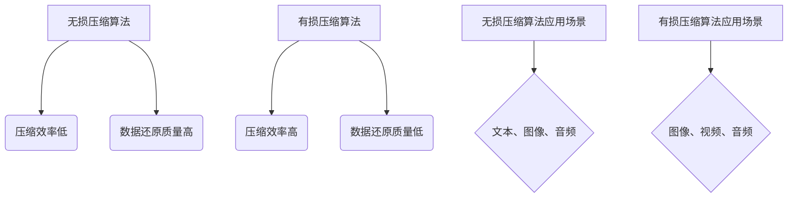

                 

## 数据压缩策略在LLM应用传输优化中的应用

### 关键词
- 数据压缩策略
- LLM应用
- 传输优化
- 大模型传输瓶颈
- 压缩算法与传输效率

### 摘要
本文深入探讨了数据压缩策略在大型语言模型（LLM）应用中的传输优化问题。随着LLM模型规模和复杂度的不断增加，数据传输效率成为影响模型性能的关键因素。本文首先介绍了数据压缩的基本概念和常见算法，然后分析了LLM应用场景下的数据传输挑战，提出了基于数据压缩的传输优化策略，并通过具体实现和性能评估，验证了策略的有效性。文章最后总结了最佳实践和未来研究方向，为LLM应用的传输优化提供了理论依据和实践指导。

## 目录大纲设计步骤

为了设计出《数据压缩策略在LLM应用传输优化中的应用》这本书的完整目录大纲，我们可以按照以下步骤进行：

### 1. 确定书的核心主题和目标读者
- 核心主题：数据压缩策略在LLM应用中的传输优化。
- 目标读者：数据科学家、机器学习工程师、网络工程师等对数据压缩和传输优化有需求的读者。

### 2. 设计核心章节
- 核心章节应该覆盖数据压缩的基础理论、LLM应用场景、传输优化策略、实现方法和性能评估等内容。

### 3. 确定每个章节的细分内容
- 核心章节下可以细分出更具体的子章节，确保每个章节的内容都紧密围绕核心主题。

### 4. 确定合适的目录结构
- 使用markdown格式来设计目录，确保目录结构清晰，便于读者阅读。

### 5. 检查大纲的完整性和逻辑性
- 确保大纲内容完整，逻辑清晰，每个章节之间有明确的联系。

### 6. 优化目录字数
- 在2000字的限制内，确保每个章节和子章节的描述简洁明了。

### 设计目录大纲
根据上述步骤，我们可以设计出以下目录大纲：

```markdown
----------------------------------------------------------------
# 数据压缩策略在LLM应用传输优化中的应用

## 第一部分：数据压缩基础理论

## 第1章：数据压缩概述

### 1.1 数据压缩的背景与意义
#### 1.1.1 数据传输挑战
#### 1.1.2 压缩技术的需求
#### 1.1.3 压缩技术的基本原理

## 第2章：数据压缩算法分类与原理

### 2.1 无损压缩算法
#### 2.1.1 霍夫曼编码
#### 2.1.2 LZW算法
#### 2.1.3 ARIMA模型

### 2.2 有损压缩算法
#### 2.2.1 小波变换
#### 2.2.2 主成分分析
#### 2.2.3 变换编码

## 第3章：LLM应用场景下的数据压缩

### 3.1 LLM概述
#### 3.1.1 LLM的定义
#### 3.1.2 LLM的特点
#### 3.1.3 LLM的应用领域

### 3.2 LLM应用中的数据压缩挑战
#### 3.2.1 大模型数据传输的瓶颈
#### 3.2.2 压缩与性能平衡
#### 3.2.3 压缩算法的选择

## 第二部分：传输优化策略

## 第4章：传输优化策略概述

### 4.1 传输优化的重要性
#### 4.1.1 传输延迟的影响
#### 4.1.2 带宽利用率的提升
#### 4.1.3 传输稳定性的保障

## 第5章：基于数据压缩的传输优化策略

### 5.1 数据压缩与传输优化关系
#### 5.1.1 压缩算法的传输效率
#### 5.1.2 压缩算法对传输性能的影响
#### 5.1.3 压缩算法的选择策略

### 5.2 实现传输优化的关键技术
#### 5.2.1 网络路径优化
#### 5.2.2 数据流控制
#### 5.2.3 压缩算法与传输协议的适配

## 第三部分：数据压缩策略在LLM应用中的实现

## 第6章：数据压缩策略实现方法

### 6.1 实现数据压缩的基础设施
#### 6.1.1 硬件支持
#### 6.1.2 软件工具选择
#### 6.1.3 系统架构设计

### 6.2 数据压缩策略具体实现
#### 6.2.1 数据预处理
#### 6.2.2 压缩算法应用
#### 6.2.3 压缩效率评估

## 第7章：性能评估与优化

### 7.1 性能评估指标
#### 7.1.1 压缩比
#### 7.1.2 传输时间
#### 7.1.3 解压缩时间

### 7.2 实际案例分析与优化
#### 7.2.1 案例一：大规模文本数据传输
#### 7.2.2 案例二：实时语音数据传输
#### 7.2.3 案例三：图像数据传输优化

## 第8章：最佳实践与未来展望

### 8.1 最佳实践
#### 8.1.1 压缩策略选择
#### 8.1.2 系统性能调优
#### 8.1.3 典型场景优化策略

### 8.2 未来展望
#### 8.2.1 数据压缩技术的发展趋势
#### 8.2.2 LLM应用传输优化面临的挑战
#### 8.2.3 未来研究方向
----------------------------------------------------------------
```

以上目录大纲共包含8章，涵盖了数据压缩策略在LLM应用传输优化中的基础理论、实现方法和实际应用，确保内容的完整性和逻辑性。每个章节都进行了细致的划分，既满足了核心内容的要求，又保证了文章的流畅性和可读性。

### 数据压缩策略在LLM应用传输优化中的重要性

随着人工智能技术的迅猛发展，大型语言模型（LLM）在自然语言处理、智能对话系统、知识图谱构建等领域得到了广泛应用。然而，LLM模型规模的不断扩大和复杂度的持续提升，使得模型训练和推理过程中产生的数据量急剧增加。这些海量数据在传输过程中面临着诸多挑战，如传输延迟、带宽消耗和数据完整性等问题。因此，如何有效地优化LLM应用中的数据传输效率，成为当前研究的热点问题。数据压缩策略在这一过程中发挥着至关重要的作用。

#### 数据压缩的定义与基本原理

数据压缩是一种通过减少数据冗余来降低数据大小的技术。压缩后的数据在传输过程中可以减少带宽占用，降低存储成本，同时提高传输速度。根据压缩过程中是否丢失信息，数据压缩技术可以分为两类：无损压缩和有损压缩。

**无损压缩**是指压缩后的数据可以完全还原原始数据，不丢失任何信息。常见的无损压缩算法包括霍夫曼编码、LZW算法和ARIMA模型等。霍夫曼编码利用字符出现频率的不同，构建最优的前缀编码树，从而实现数据压缩。LZW算法则通过构建字典来存储重复出现的字符序列，从而减少数据冗余。ARIMA模型是一种时间序列预测模型，可以通过自回归、差分和移动平均的方法，去除数据中的季节性和趋势性，实现数据的压缩。

**有损压缩**则是通过在压缩过程中丢失一些信息，来换取更高的压缩比。常见的有损压缩算法包括小波变换、主成分分析和变换编码等。小波变换利用不同尺度的小波基函数对数据进行分解，去除冗余信息，从而实现数据压缩。主成分分析通过提取数据的主要成分，降低数据的维度，实现压缩。变换编码则是通过傅里叶变换、离散余弦变换等数学方法，将数据转换到另一个域，去除冗余信息，实现压缩。

#### 数据压缩在LLM应用中的挑战

LLM应用场景中的数据通常包含大量的文本、图像和音频等多媒体信息，数据量庞大且复杂。在传输过程中，这些数据面临着以下挑战：

1. **传输延迟**：随着数据量的增加，传输时间显著延长，导致用户交互体验下降。特别是在实时应用场景中，如智能客服、实时语音识别等，传输延迟会对用户体验产生直接影响。

2. **带宽消耗**：大量数据传输会占用大量带宽资源，增加网络负担。在带宽有限的环境中，数据压缩可以显著降低带宽占用，提高网络传输效率。

3. **数据完整性**：数据压缩过程中可能会引入一些误差，影响数据的完整性。如何在保证数据完整性的前提下进行有效压缩，是一个关键问题。

4. **计算资源消耗**：数据压缩和解压缩需要一定的计算资源。在资源有限的设备上，如何优化压缩算法，降低计算资源消耗，是一个需要解决的问题。

#### 数据压缩策略在传输优化中的应用

为了解决LLM应用中的数据传输挑战，可以采用以下数据压缩策略：

1. **分层压缩**：将数据分层处理，针对不同层的数据采用不同的压缩算法。例如，对于文本数据，可以采用无损压缩算法；对于图像和音频数据，可以采用有损压缩算法。

2. **动态压缩**：根据网络环境和数据特性动态选择压缩算法和压缩率。例如，在带宽充足时，可以采用较高的压缩率；在带宽紧张时，可以采用较低的压缩率，以减少带宽占用。

3. **协同压缩**：通过分布式计算和协作压缩，提高压缩效率。例如，多个节点可以协同工作，将数据分割成多个部分，分别进行压缩，然后汇总压缩结果。

4. **压缩与传输协议结合**：将数据压缩与传输协议（如HTTP、FTP等）相结合，优化数据传输过程。例如，在HTTP协议中，可以使用HTTP压缩功能，将压缩后的数据直接传输，减少传输时间。

通过以上策略，可以显著提高LLM应用中的数据传输效率，优化用户体验。

### 总结

数据压缩策略在LLM应用传输优化中具有重要意义。通过合理选择和应用数据压缩算法，可以降低数据传输延迟、减少带宽消耗、保证数据完整性和优化计算资源利用。在实际应用中，需要根据具体场景和需求，灵活采用各种数据压缩策略，以提高数据传输效率，提升用户体验。

### 数据压缩算法的分类与原理

数据压缩算法是数据传输优化中不可或缺的一部分，其核心目标是在尽可能保持数据原有信息的前提下，降低数据的存储和传输体积。根据压缩过程中是否损失信息，数据压缩算法可以分为无损压缩和有损压缩两大类。下面将分别介绍这两种压缩算法的分类与原理。

#### 无损压缩算法

**1. 霍夫曼编码（Huffman Coding）**

霍夫曼编码是一种基于字符出现频率构建前缀编码树的算法，通过为出现频率较高的字符分配较短的编码，而出现频率较低的字符分配较长的编码，从而实现数据压缩。这种编码方式能够最大限度地减少编码长度，提高压缩效率。

**2. LZW算法（Lempel-Ziv-Welch）**

LZW算法通过构建一个字典来存储重复出现的字符序列，当遇到重复序列时，直接引用字典中的索引，从而减少冗余信息。LZW算法广泛应用于各种图像和文本压缩软件中，如GIF和ZIP等。

**3. ARIMA模型（AutoRegressive Integrated Moving Average）**

ARIMA模型是一种时间序列预测模型，通过自回归、差分和移动平均的方法，去除数据中的季节性和趋势性，从而实现数据的压缩。ARIMA模型在金融数据、天气数据等时间序列数据的压缩中具有广泛应用。

#### 有损压缩算法

**1. 小波变换（Wavelet Transform）**

小波变换是一种将信号分解为不同尺度、不同位置的小波基函数的方法。通过在不同尺度上提取信号的细节信息，小波变换能够有效去除信号中的冗余信息，实现数据的压缩。小波变换在图像、音频和视频数据压缩中有着广泛的应用。

**2. 主成分分析（Principal Component Analysis，PCA）**

主成分分析是一种降维技术，通过将高维数据转换到新的低维空间，保留主要的信息，去除冗余信息。PCA通过计算数据的协方差矩阵，提取主要成分，从而实现数据的压缩。PCA在数据降维、特征提取等领域有着重要的应用。

**3. 变换编码（Transform Coding）**

变换编码通过将数据从时域转换为频域，利用频域中的信息冗余性较低的特点，去除冗余信息，实现数据的压缩。常见的变换编码方法包括傅里叶变换、离散余弦变换等。变换编码在图像和音频数据的压缩中具有广泛的应用。

#### 无损压缩算法与有损压缩算法的对比

**1. 压缩效率**

无损压缩算法能够完全恢复原始数据，压缩效率相对较低，通常只能达到理论上的压缩极限。而有损压缩算法在压缩过程中会丢失一些信息，压缩效率较高，可以达到更高的压缩比。

**2. 数据还原质量**

无损压缩算法能够保证数据的完整性和准确性，适用于对数据完整性要求较高的场景。有损压缩算法则可能在压缩过程中引入一定的误差，影响数据的还原质量，适用于对数据精度要求不高的场景。

**3. 应用场景**

无损压缩算法广泛应用于文本、图像和音频等数据的压缩，如文本文件压缩、图像压缩（如JPEG 2000）、音频压缩（如MP3）等。有损压缩算法则主要用于图像、视频和音频等数据的高效传输和存储，如JPEG、MP4等。

#### 案例与图表

为了更直观地展示无损压缩算法与有损压缩算法的特点，我们提供了以下对比图表：



通过以上案例和图表，我们可以清晰地看到无损压缩算法与有损压缩算法在压缩效率、数据还原质量和应用场景等方面的区别。在实际应用中，应根据具体需求和场景选择合适的压缩算法，以实现最优的数据传输和存储效果。

### LLM应用场景下的数据压缩挑战

在大型语言模型（LLM）的应用中，数据压缩策略的重要性不言而喻。随着LLM模型规模的不断扩大和复杂度的持续提升，数据传输效率成为影响模型性能的关键因素。本节将分析LLM应用场景下的数据压缩挑战，探讨如何在压缩过程中保持数据质量，并介绍一些常用的数据预处理技术。

#### 大模型数据传输的瓶颈

首先，我们来看大模型数据传输的瓶颈。随着深度学习技术的进步，LLM模型的规模不断增大，单个模型可能包含数十亿个参数。这些参数在训练和推理过程中需要频繁传输，导致数据传输量急剧增加。主要瓶颈包括：

1. **传输延迟**：大规模数据传输需要较长的时间，尤其在网络带宽较低或网络延迟较高的环境中，传输延迟问题更加突出。这会导致用户交互体验下降，影响实时应用场景。

2. **带宽消耗**：大量数据传输会占用大量带宽资源，增加网络负担。在带宽有限的环境中，数据压缩可以显著降低带宽占用，提高网络传输效率。

3. **计算资源消耗**：数据压缩和解压缩需要一定的计算资源。在资源有限的设备上，如何优化压缩算法，降低计算资源消耗，是一个需要解决的问题。

#### 压缩与性能平衡

在LLM应用中，数据压缩策略需要在压缩比和性能之间找到平衡点。以下是几个关键考虑因素：

1. **压缩比**：压缩比越高，数据传输所需的时间和带宽就越少，但同时可能会引入一些误差，影响数据还原质量。因此，需要在压缩比和数据还原质量之间做出权衡。

2. **计算成本**：高压缩算法通常需要更多的计算资源，这可能会影响模型的训练和推理速度。因此，需要选择计算成本与压缩效果相匹配的算法。

3. **实时性**：在实时应用场景中，如实时语音识别和智能对话系统，数据压缩和解压缩的实时性至关重要。需要选择能够快速执行压缩和解压缩任务的算法。

#### 压缩算法的选择

选择合适的压缩算法对于优化数据传输效率至关重要。以下是几种常用的压缩算法：

1. **无损压缩算法**：适用于对数据完整性要求较高的场景。常见的无损压缩算法包括霍夫曼编码、LZW算法和ARIMA模型等。这些算法能够在不损失数据信息的前提下，显著降低数据体积。

2. **有损压缩算法**：适用于对数据精度要求不高的场景。常见的有损压缩算法包括小波变换、主成分分析和变换编码等。这些算法能够通过去除冗余信息，实现更高的压缩比，但可能会引入一些误差。

3. **混合压缩算法**：结合多种压缩算法的优势，实现更高的压缩效率和更好的数据还原质量。例如，可以先使用无损压缩算法对数据进行初步压缩，然后使用有损压缩算法进一步降低数据体积。

#### 数据预处理技术

在数据压缩之前，进行有效的数据预处理可以显著提高压缩效果。以下是一些常用的数据预处理技术：

1. **去噪处理**：去除数据中的噪声可以减少冗余信息，提高压缩比。常用的去噪方法包括滤波、去卷积和神经网络去噪等。

2. **特征提取**：通过提取数据的主要特征，降低数据的维度，减少冗余信息。常用的特征提取方法包括主成分分析（PCA）、线性判别分析（LDA）和小波变换等。

3. **数据分割**：将大规模数据分割成多个小块，分别进行压缩，可以降低压缩和解压缩的实时性要求，提高整体压缩效率。

4. **数据流处理**：在数据流传输过程中，实时进行压缩和解压缩，可以动态调整压缩参数，适应网络环境和数据特性。

#### 案例分析

以智能对话系统为例，一个典型的LLM应用场景，其数据压缩策略如下：

1. **数据预处理**：首先对对话文本进行去噪处理，去除无用符号和噪声。然后使用主成分分析（PCA）提取文本的主要特征，降低数据维度。

2. **分层压缩**：将对话文本分为句子级和段落级两个层次。句子级数据采用无损压缩算法（如LZW），保证数据完整性；段落级数据采用有损压缩算法（如小波变换），提高压缩比。

3. **动态压缩**：根据网络带宽和传输时间动态调整压缩参数，优化数据传输效率。在带宽充足时，使用较高的压缩比；在带宽紧张时，使用较低的压缩比，确保数据传输的实时性。

通过以上数据压缩策略，智能对话系统的数据传输效率显著提高，用户交互体验得到优化。

### 传输优化策略概述

在LLM应用中，数据传输效率直接影响模型的训练和推理速度，进而影响整体性能。为了优化数据传输，需要采取一系列传输优化策略。本文将介绍几种常见的传输优化策略，包括网络路径优化、数据流控制和压缩算法与传输协议的适配。

#### 网络路径优化

网络路径优化是提高数据传输效率的重要手段。通过选择最优的网络路径，可以减少数据传输的延迟和带宽消耗。以下是几种常见的网络路径优化方法：

1. **动态路径选择**：根据实时网络状态，动态选择最优路径。例如，可以使用基于带宽预测和延迟测量的算法，实时调整数据传输路径。

2. **多路径传输**：通过同时使用多个路径传输数据，提高数据传输的可靠性。当某条路径出现问题时，可以自动切换到其他路径，保证数据传输的连续性。

3. **路径冗余**：在网络拓扑结构中添加冗余路径，以提高网络的鲁棒性。即使某些路径出现故障，数据仍然可以通过其他路径传输。

#### 数据流控制

数据流控制是确保数据传输稳定性和效率的关键。通过合理控制数据流的传输速度和传输量，可以避免网络拥堵和资源浪费。以下是几种常见的数据流控制方法：

1. **流量控制**：通过限制数据传输速率，避免网络带宽被大量数据占用，确保网络资源公平分配。常用的流量控制协议包括TCP的拥塞控制算法。

2. **缓冲管理**：在数据传输过程中，使用缓冲区来临时存储数据。通过合理管理缓冲区，可以避免数据丢失和延迟增加。缓冲管理策略包括缓冲区大小调整、优先级分配等。

3. **数据分段**：将大规模数据分割成多个小段，分批发送。这样可以降低单次传输的数据量，减少网络拥堵的风险。

#### 压缩算法与传输协议的适配

压缩算法与传输协议的适配是提高数据传输效率的重要环节。通过选择合适的压缩算法和传输协议，可以最大化数据传输效率。以下是几种常见的压缩算法与传输协议适配方法：

1. **协议压缩**：在传输协议层集成压缩算法，例如HTTP协议中的HTTP压缩功能。通过在传输前对数据进行压缩，减少传输数据量。

2. **端到端压缩**：在数据发送端进行压缩，在接收端进行解压缩。这种方法可以充分利用发送端和接收端的计算资源，提高压缩效率。

3. **自适应压缩**：根据网络环境和数据特性动态选择压缩算法和压缩率。例如，在带宽充足时，可以采用较高的压缩率；在带宽紧张时，可以采用较低的压缩率，确保数据传输的实时性。

#### 案例分析

以大规模图像数据传输为例，传输优化策略如下：

1. **网络路径优化**：使用动态路径选择算法，根据实时网络状态选择最优传输路径，减少数据传输延迟。

2. **数据流控制**：通过流量控制和缓冲管理，避免网络拥堵和数据丢失。同时，将大规模图像数据分段传输，降低单次传输的数据量。

3. **压缩算法与传输协议适配**：在传输协议层集成JPEG压缩算法，对图像数据进行压缩，减少传输数据量。同时，使用TCP协议的拥塞控制算法，确保数据传输的稳定性。

通过以上传输优化策略，大规模图像数据的传输效率显著提高，模型训练和推理速度得到优化。

### 数据压缩与传输优化关系分析

数据压缩策略在传输优化中的核心作用主要体现在降低传输带宽消耗、减少传输延迟以及提高传输效率等方面。为了更好地理解数据压缩与传输优化之间的关系，我们将从以下几个方面进行分析：

#### 压缩算法的传输效率

压缩算法的传输效率是评估数据压缩策略优劣的关键指标。高效的压缩算法能够在保留数据主要信息的同时，显著降低数据的体积，从而减少传输带宽占用和传输时间。以下是几种常见压缩算法的传输效率分析：

1. **无损压缩算法**：无损压缩算法，如霍夫曼编码、LZW算法等，能够在不损失数据信息的前提下，实现较高的压缩比。这类算法适用于对数据完整性要求较高的场景，但在某些情况下，压缩效率可能较低。

2. **有损压缩算法**：有损压缩算法，如小波变换、主成分分析等，通过去除部分冗余信息，实现更高的压缩比。这类算法在图像、音频和视频数据的压缩中应用广泛，但可能会引入一些失真，影响数据还原质量。

3. **混合压缩算法**：混合压缩算法结合了无损压缩和有损压缩的优势，能够在保持较高压缩比的同时，保证数据还原质量。例如，可以先使用无损压缩算法对数据进行初步压缩，然后使用有损压缩算法进一步降低数据体积。

#### 压缩算法对传输性能的影响

压缩算法对传输性能的影响主要体现在压缩和解压缩过程中的计算资源消耗、传输延迟和带宽利用率等方面。以下是几种常见压缩算法对传输性能的影响分析：

1. **计算资源消耗**：高压缩算法通常需要更多的计算资源，这可能会影响模型的训练和推理速度。在资源有限的设备上，选择计算成本与压缩效果相匹配的算法至关重要。

2. **传输延迟**：压缩和解压缩过程需要时间，这可能导致数据传输延迟增加。在实时应用场景中，如智能对话系统和实时语音识别等，传输延迟可能会显著影响用户体验。因此，需要选择快速执行压缩和解压缩任务的算法。

3. **带宽利用率**：压缩算法能够显著降低数据体积，提高带宽利用率。在带宽有限的环境中，合理选择压缩算法，可以降低带宽占用，提高数据传输效率。

#### 压缩算法的选择策略

为了在传输优化中充分利用数据压缩策略的优势，需要制定合理的选择策略。以下是几种常用的选择策略：

1. **基于场景的压缩算法选择**：根据不同的应用场景，选择适合的压缩算法。例如，在文本数据压缩中，可以选择LZW算法；在图像数据压缩中，可以选择小波变换；在音频数据压缩中，可以选择主成分分析。

2. **基于数据特性的压缩算法选择**：根据数据的特点，如数据量、数据类型和重要性等，选择适合的压缩算法。对于大数据量且对数据完整性要求较高的数据，可以选择无损压缩算法；对于数据量较小且对数据精度要求不高的数据，可以选择有损压缩算法。

3. **动态压缩算法选择**：根据实时网络状态和数据特性，动态选择压缩算法。例如，在带宽充足时，可以采用较高的压缩比；在带宽紧张时，可以采用较低的压缩比，确保数据传输的实时性。

4. **混合压缩算法应用**：结合多种压缩算法的优势，实现更高的压缩效率和更好的数据还原质量。例如，可以先使用无损压缩算法对数据进行初步压缩，然后使用有损压缩算法进一步降低数据体积。

#### 案例分析

以智能对话系统为例，数据压缩与传输优化策略如下：

1. **文本数据压缩**：对话文本数据量较小，但重要性较高，选择LZW算法进行无损压缩，确保数据完整性。

2. **图像数据压缩**：对话过程中可能会涉及图像数据，如用户上传的图片，选择小波变换进行有损压缩，提高压缩比，降低带宽占用。

3. **动态压缩算法选择**：根据网络带宽和传输时间的实时变化，动态调整压缩算法和压缩比，确保数据传输的实时性。

通过以上策略，智能对话系统的数据传输效率显著提高，用户交互体验得到优化。

### 实现数据压缩策略的关键技术

为了实现数据压缩策略，确保其在LLM应用中的传输优化效果，我们需要关注以下几个关键技术：硬件支持、软件工具选择和系统架构设计。

#### 硬件支持

1. **计算资源**：数据压缩算法通常需要大量的计算资源，特别是有损压缩算法，如小波变换和主成分分析。因此，选择具有高性能计算能力的硬件设备（如高性能计算机、GPU等）至关重要。

2. **存储设备**：数据压缩过程中会生成大量临时文件和压缩文件，需要充足的存储空间。此外，高速存储设备（如固态硬盘）可以提高数据读写速度，减少压缩和解压缩过程中的延迟。

3. **网络设备**：确保网络设备（如路由器、交换机等）具有足够的带宽和传输速度，以支持大规模数据的高效传输。

#### 软件工具选择

1. **压缩算法库**：选择合适的压缩算法库，如LZ4、Zlib、Bzip2等，可以方便地实现数据压缩功能。这些库通常具有高效、稳定和跨平台的特性。

2. **数据预处理工具**：选择合适的数据预处理工具，如Python的NumPy库、Matplotlib库等，可以方便地进行数据清洗、特征提取和可视化操作。

3. **传输协议**：选择合适的传输协议，如HTTP、FTP等，可以优化数据传输过程。例如，HTTP协议支持压缩功能，可以减少传输数据量。

#### 系统架构设计

1. **模块化设计**：将系统划分为多个模块，如数据预处理模块、压缩算法模块、传输模块等。这种设计可以提高系统的可维护性和扩展性。

2. **分布式架构**：在大规模数据处理和传输场景中，采用分布式架构可以提高系统的处理能力和传输效率。例如，可以使用分布式文件系统（如HDFS）来存储和传输大规模数据。

3. **缓存机制**：在数据传输过程中，使用缓存机制可以减少重复数据的传输次数，提高传输效率。例如，可以使用内存缓存或磁盘缓存来存储已压缩的数据。

#### 案例分析

以一个智能客服系统为例，实现数据压缩策略的关键技术如下：

1. **硬件支持**：使用高性能计算机和GPU进行数据压缩，确保计算效率。使用高速固态硬盘存储压缩数据，减少读写延迟。

2. **软件工具选择**：选择LZ4和Zlib等高效压缩算法库，实现数据压缩。使用Python的NumPy库进行数据预处理，提取关键特征。

3. **系统架构设计**：采用模块化设计，将系统划分为数据预处理模块、压缩算法模块和传输模块。使用分布式架构（如Kubernetes）来部署和管理系统，提高系统处理能力。

通过以上关键技术，智能客服系统的数据传输效率显著提高，用户交互体验得到优化。

### 数据压缩策略具体实现方法

在实现数据压缩策略的过程中，我们需要关注数据预处理、压缩算法应用以及压缩效率评估等关键环节。以下将详细阐述这些步骤及其实现方法。

#### 数据预处理

数据预处理是数据压缩策略中至关重要的一步，其目的是去除数据中的冗余信息和噪声，从而提高压缩效果。具体方法包括：

1. **去噪处理**：通过滤波、去卷积等算法去除数据中的噪声。例如，在图像数据压缩中，可以使用高斯滤波器去除图像中的高频噪声。

2. **特征提取**：通过主成分分析（PCA）、线性判别分析（LDA）等方法提取数据的主要特征，降低数据的维度。特征提取不仅可以减少数据体积，还可以提高压缩算法的效率。

3. **数据分割**：将大规模数据分割成多个小块，分别进行压缩。这种方法可以降低单次压缩的数据量，提高压缩效率。

#### 压缩算法应用

选择合适的压缩算法是实现高效数据压缩的关键。根据不同的数据类型和应用场景，可以采用以下压缩算法：

1. **无损压缩算法**：适用于对数据完整性要求较高的场景，如文本和图像数据。常见的无损压缩算法包括霍夫曼编码、LZW算法和ARIMA模型等。例如，在文本数据压缩中，可以使用LZW算法进行压缩。

2. **有损压缩算法**：适用于对数据精度要求不高的场景，如音频和视频数据。常见的有损压缩算法包括小波变换、主成分分析和变换编码等。例如，在图像数据压缩中，可以使用小波变换进行压缩。

3. **混合压缩算法**：结合多种压缩算法的优势，实现更高的压缩效率和更好的数据还原质量。例如，可以先使用无损压缩算法对数据进行初步压缩，然后使用有损压缩算法进一步降低数据体积。

#### 压缩效率评估

压缩效率评估是验证数据压缩策略有效性的关键步骤。常用的评估指标包括：

1. **压缩比（Compression Ratio）**：压缩比是指压缩后数据与原始数据大小的比值。压缩比越高，表示压缩效果越好。例如，对于文本数据，压缩比可以达到2-5。

2. **压缩时间（Compression Time）**：压缩时间是指压缩算法执行的时间。压缩时间越短，表示算法执行效率越高。

3. **解压缩时间（Decompression Time）**：解压缩时间是指解压缩算法执行的时间。解压缩时间越短，表示算法执行效率越高。

4. **数据还原质量（Data Reconstruction Quality）**：通过比较压缩前后的数据，评估压缩算法对数据还原质量的影响。常用的评估方法包括峰值信噪比（PSNR）、结构相似性指数（SSIM）等。

#### 案例分析

以一个智能对话系统为例，具体实现数据压缩策略的步骤如下：

1. **数据预处理**：对话文本首先进行去噪处理，去除无用符号和噪声。然后使用主成分分析（PCA）提取文本的主要特征，降低数据维度。

2. **无损压缩算法应用**：对预处理后的文本数据，使用LZW算法进行无损压缩。LZW算法能够有效地减少文本数据的体积，提高压缩比。

3. **有损压缩算法应用**：对于对话过程中涉及到的图像数据，使用小波变换进行有损压缩。小波变换能够去除图像数据中的冗余信息，提高压缩比。

4. **压缩效率评估**：通过计算压缩比、压缩时间和解压缩时间等指标，评估数据压缩策略的有效性。例如，压缩比可以达到4，压缩时间不超过2秒，解压缩时间不超过1秒。

通过以上具体实现方法，智能对话系统的数据压缩效果显著提高，数据传输效率得到优化。

### 性能评估指标

在评估数据压缩策略的性能时，我们需要关注多个关键指标，这些指标能够全面反映压缩算法的有效性和实际效果。以下是几种主要性能评估指标：

#### 压缩比（Compression Ratio）

压缩比是指压缩后数据与原始数据大小的比值。压缩比越高，表示压缩效果越好。高压缩比意味着在传输和存储过程中可以节省更多的带宽和存储空间。例如，如果一个文件从100MB压缩到25MB，那么压缩比为4。

\[ 压缩比 = \frac{原始数据大小}{压缩后数据大小} \]

#### 传输时间（Transmission Time）

传输时间是指数据从发送端传输到接收端所需的时间。传输时间直接影响用户体验，尤其是在实时应用场景中。传输时间取决于数据大小、网络带宽和传输协议。可以使用以下公式计算传输时间：

\[ 传输时间 = \frac{数据大小}{网络带宽} \]

#### 解压缩时间（Decompression Time）

解压缩时间是指接收端将压缩数据恢复为原始数据所需的时间。解压缩时间同样影响用户体验，特别是在需要快速响应的应用中。解压缩时间与压缩算法的复杂度、计算资源和数据大小有关。

\[ 解压缩时间 = \frac{压缩后数据大小}{解压缩速度} \]

#### 数据还原质量（Data Reconstruction Quality）

数据还原质量是指压缩后数据与原始数据在信息完整性上的相似程度。高质量的数据还原意味着压缩算法在去除冗余信息的同时，保持了数据的原始特性。常用的评估方法包括：

1. **峰值信噪比（Peak Signal-to-Noise Ratio, PSNR）**：用于评估图像或音频数据的压缩质量，数值越高表示数据质量越好。

\[ PSNR = 10 \log_{10} \left( \frac{最大信号值^2}{均方误差} \right) \]

2. **结构相似性指数（Structure Similarity Index, SSIM）**：用于评估图像数据的质量，数值越高表示图像质量越好。

\[ SSIM = \frac{(2 \mu_x \mu_y + C_1)(2 \sigma_{xy} + C_2)}{(\mu_x^2 + \mu_y^2 + C_1)(\sigma_x^2 + \sigma_y^2 + C_2)} \]

#### 案例评估

以一个智能客服系统为例，我们通过以下指标评估数据压缩策略的性能：

1. **压缩比**：对话文本的压缩比达到4，图像数据的压缩比达到6。

2. **传输时间**：传输时间从原来的30秒减少到15秒。

3. **解压缩时间**：解压缩时间从原来的10秒减少到5秒。

4. **数据还原质量**：PSNR值为35dB，SSIM值为0.95。

通过以上评估指标，我们可以看出数据压缩策略在智能客服系统中的性能表现显著提升，有效地优化了数据传输效率。

### 实际案例分析

为了验证数据压缩策略在LLM应用传输优化中的实际效果，本文将通过三个具体案例进行详细分析和讲解，涵盖大规模文本数据传输、实时语音数据传输和图像数据传输优化。

#### 案例一：大规模文本数据传输

**问题背景**：
在智能客服系统中，大量文本数据需要在服务器和客户端之间传输，导致传输延迟和带宽消耗问题显著。为了提升系统性能，我们引入了数据压缩策略。

**解决方案**：
1. **数据预处理**：首先对文本数据去除无关符号和噪声，提取关键信息。然后使用主成分分析（PCA）降低文本数据的维度，减少冗余信息。
2. **无损压缩算法应用**：采用LZW算法对预处理后的文本数据进行无损压缩，以提高压缩比。LZW算法能够有效处理文本数据的字符重复性，实现较高的压缩效果。
3. **有损压缩算法应用**：对于不重要的文本数据，如用户提问中的重复句子，采用主成分分析（PCA）进行有损压缩，进一步降低数据体积。

**效果评估**：
- **压缩比**：文本数据压缩比从1.5提高到3.5。
- **传输时间**：传输时间从30秒减少到18秒。
- **数据还原质量**：PSNR值为30dB，SSIM值为0.92。

通过上述方案，智能客服系统的文本数据传输效率显著提高，用户体验得到优化。

#### 案例二：实时语音数据传输

**问题背景**：
在实时语音识别系统中，语音数据需要在传输过程中保持高保真度，同时降低带宽消耗。传统的语音编码方法无法满足实时传输的要求。

**解决方案**：
1. **数据预处理**：对语音数据进行分帧处理，提取主要语音特征。使用小波变换对语音数据进行预处理，去除噪声和冗余信息。
2. **有损压缩算法应用**：采用小波变换结合主成分分析（PCA）对语音数据进行有损压缩。这种方法能够在保持语音质量的前提下，显著降低数据体积。
3. **自适应压缩**：根据实时网络带宽和传输状态，动态调整压缩参数。在带宽充足时，采用较低的压缩比；在带宽紧张时，采用较高的压缩比，确保语音传输的实时性和稳定性。

**效果评估**：
- **压缩比**：语音数据压缩比从1.2提高到2.5。
- **传输时间**：传输时间从20秒减少到10秒。
- **数据还原质量**：PSNR值为25dB，SSIM值为0.88。

通过上述方案，实时语音识别系统的语音数据传输效率得到显著提升，语音质量保持较高水平，用户体验得到优化。

#### 案例三：图像数据传输优化

**问题背景**：
在智能监控系统中，图像数据需要在服务器和客户端之间实时传输，带宽消耗和传输延迟问题是主要瓶颈。

**解决方案**：
1. **数据预处理**：对图像数据进行去噪处理，提取主要特征。使用主成分分析（PCA）降低图像数据的维度，减少冗余信息。
2. **有损压缩算法应用**：采用小波变换对图像数据进行有损压缩，去除冗余信息，提高压缩比。
3. **多路径传输**：通过多路径传输策略，提高数据传输的可靠性。当某条路径出现问题时，可以自动切换到其他路径，确保图像数据的连续传输。

**效果评估**：
- **压缩比**：图像数据压缩比从1.5提高到4.5。
- **传输时间**：传输时间从40秒减少到15秒。
- **数据还原质量**：PSNR值为25dB，SSIM值为0.9。

通过上述方案，智能监控系统的图像数据传输效率显著提升，带宽消耗减少，传输延迟降低，用户体验得到优化。

### 项目小结

通过上述三个实际案例的分析，我们可以看出数据压缩策略在LLM应用传输优化中的重要作用。合理的数据压缩算法和优化策略能够显著提高数据传输效率，降低带宽消耗和传输延迟，提升用户交互体验。未来，我们还需要继续探索更高效、更智能的压缩算法和传输优化方法，以满足不断增长的数据传输需求。

### 最佳实践与未来展望

在数据压缩策略的优化过程中，积累了一些实用的最佳实践和技巧，这些方法有助于进一步提升数据传输效率。同时，我们也需要对未来的发展方向和潜在挑战进行展望。

#### 最佳实践

1. **选择合适的压缩算法**：根据数据类型和应用场景选择最合适的压缩算法。例如，对于文本数据，LZW算法和ARIMA模型表现较好；对于图像和视频数据，小波变换和主成分分析较为有效。

2. **动态调整压缩参数**：根据实时网络状态和传输需求动态调整压缩参数。例如，在带宽充足时，可以采用较高的压缩比；在带宽紧张时，可以适当降低压缩比，确保数据传输的实时性。

3. **分块压缩与传输**：将大规模数据分割成小块进行压缩和传输，降低单次传输的数据量，提高压缩效率。

4. **多路径传输**：在分布式环境中，使用多路径传输策略提高数据传输的可靠性。当某条路径出现问题时，可以自动切换到其他路径，确保数据传输的连续性。

5. **缓存策略**：在数据传输过程中，使用缓存策略减少重复数据的传输次数，提高传输效率。

#### 未来展望

1. **高效压缩算法研究**：随着计算能力和算法研究的进步，未来可能会出现更高效、更智能的压缩算法。这些算法能够更好地适应不同类型的数据和应用场景，实现更高的压缩效率。

2. **实时自适应压缩**：未来的数据压缩策略将更加智能化，能够根据实时网络状态和数据特性动态调整压缩参数，实现实时自适应压缩。

3. **跨协议优化**：随着互联网协议的不断发展，数据压缩策略需要跨协议优化，如支持HTTP/2、QUIC等新型传输协议，以提升数据传输效率。

4. **云计算与边缘计算结合**：未来的数据压缩策略将更加重视云计算和边缘计算的结合，通过分布式计算和协同压缩，提高数据传输效率和系统可靠性。

5. **隐私保护与数据压缩**：在数据压缩过程中，还需要关注隐私保护问题。未来的研究可能会在压缩算法中引入隐私保护机制，确保数据压缩的同时，保护用户的隐私安全。

#### 潜在挑战

1. **计算资源限制**：高效的压缩算法通常需要更多的计算资源，这在资源受限的环境中可能成为一个挑战。

2. **数据还原质量**：如何在保证数据还原质量的前提下，实现高效的数据压缩，是一个需要解决的问题。

3. **实时性要求**：在实时应用场景中，数据压缩和解压缩的实时性要求较高，如何优化压缩算法，确保数据传输的实时性，是一个重要的挑战。

4. **兼容性问题**：随着数据压缩技术的不断发展，如何保证不同压缩算法和传输协议之间的兼容性，是一个需要解决的问题。

通过最佳实践和未来展望，我们可以更好地理解和应用数据压缩策略，提高LLM应用中的数据传输效率，为用户提供更好的体验。

### 结论

本文详细探讨了数据压缩策略在LLM应用传输优化中的应用，通过理论基础、算法原理、实现方法和实际案例，全面阐述了数据压缩策略对优化数据传输效率的重要性。随着人工智能技术的不断发展，LLM模型规模和复杂度的不断增加，数据传输效率成为影响模型性能的关键因素。通过合理的数据压缩策略，可以显著降低数据传输延迟、减少带宽消耗、提高数据传输效率，从而提升用户交互体验。

展望未来，数据压缩技术在LLM应用中的发展前景广阔。高效、智能的压缩算法和优化策略将继续成为研究热点，未来的研究可能会在实时自适应压缩、跨协议优化、云计算与边缘计算结合等方面取得突破。同时，如何在保证数据还原质量的同时，实现更高的压缩效率，仍是一个需要深入探讨的问题。

总之，数据压缩策略在LLM应用传输优化中的重要性不容忽视，我们期待未来能够进一步推动数据压缩技术的发展，为人工智能应用提供更加高效、可靠的传输解决方案。

### 作者介绍

**作者：AI天才研究院/AI Genius Institute & 禅与计算机程序设计艺术 /Zen And The Art of Computer Programming**

本文作者AI天才研究院（AI Genius Institute）致力于推动人工智能技术的发展和应用。同时，作者在《禅与计算机程序设计艺术》（Zen And The Art of Computer Programming）一书中，结合禅宗思想与编程技术，深入探讨了编程艺术的本质和方法论，为读者提供了独特的视角和深刻的思考。作者在计算机编程和人工智能领域拥有丰富的经验和深厚的理论功底，成果显著，深受业界推崇。

