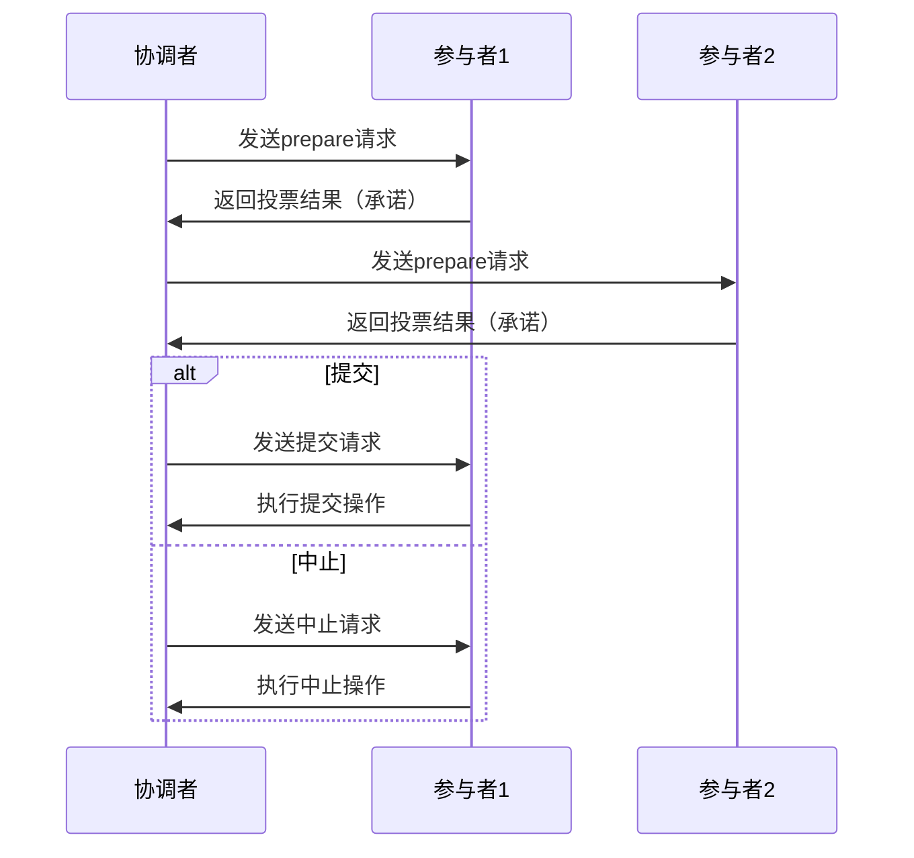
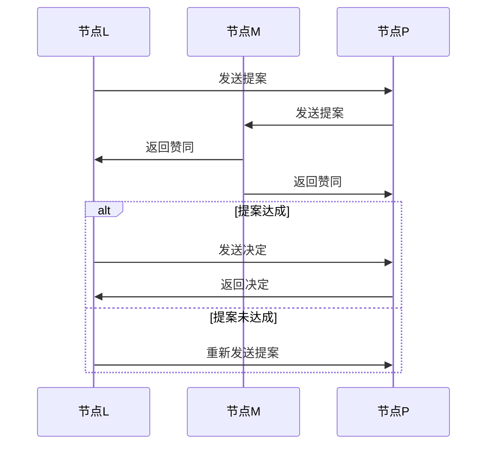
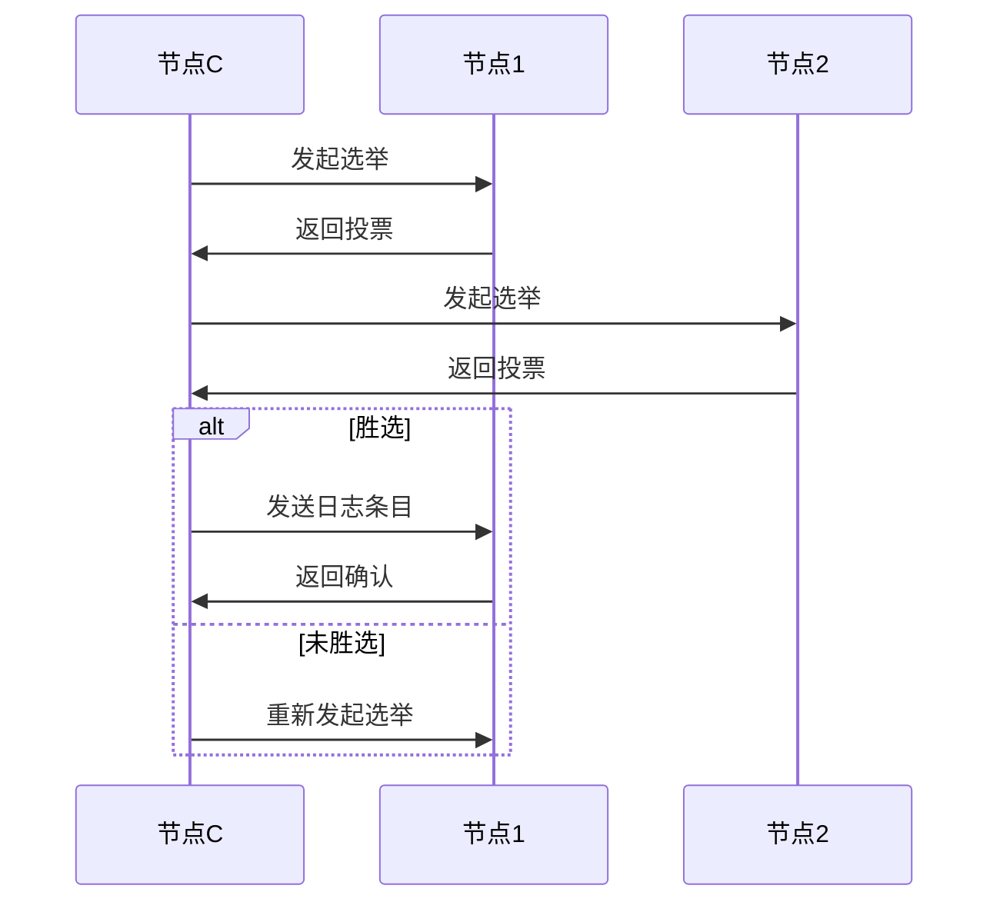
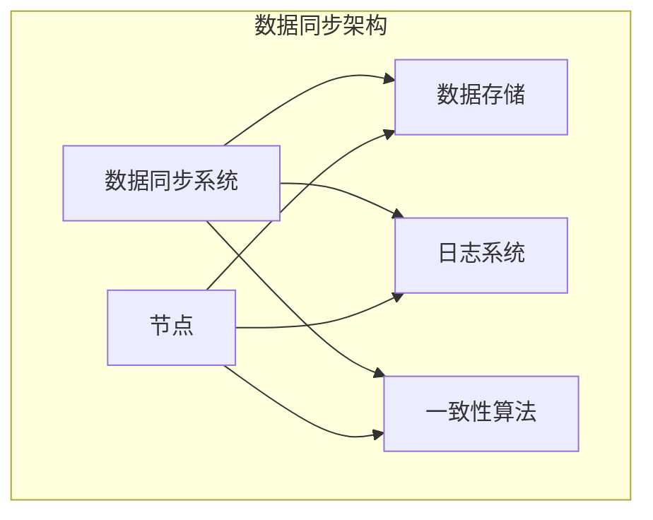

                 


### 第一步：确定文章标题和关键词

**文章标题：** 数据同步策略在分布式LLM系统中的实现

**关键词：** 数据同步，分布式计算，LLM系统，一致性，算法实现

### 第二步：撰写文章摘要

**摘要：** 本文深入探讨了分布式LLM系统中数据同步策略的实现。首先介绍了分布式计算和LLM系统的基本概念，随后详细阐述了数据同步的核心概念和算法原理，包括2PC、Paxos和Raft算法。接着，文章通过具体案例分析展示了数据同步在分布式LLM系统中的实现，并提供了环境搭建和系统实现的实战指导。最后，文章总结了数据同步的最佳实践，并对未来研究方向进行了展望。

### 第三步：撰写背景介绍

**背景介绍：**

#### 核心概念术语说明
- **分布式计算：** 将任务分布在多个计算节点上进行处理，以提高计算效率和可靠性。
- **LLM系统：** 大型语言模型（Large Language Model）系统，如GPT，用于处理自然语言任务。
- **数据同步：** 保证分布式系统中数据的一致性和实时性。

#### 问题背景
随着互联网和云计算的快速发展，分布式计算已成为现代应用架构的核心。LLM系统作为自然语言处理的重要工具，其分布式部署的需求日益增长。然而，数据同步问题成为实现分布式LLM系统的关键挑战。

#### 问题描述
分布式LLM系统需要处理大规模数据，保证数据的一致性是系统稳定运行的关键。然而，在分布式环境中，数据可能会因为网络延迟、节点故障等原因导致不一致。因此，如何实现高效、可靠的数据同步策略，是分布式LLM系统面临的重大问题。

#### 问题解决
本文将介绍几种常见的分布式数据同步策略，并探讨其在分布式LLM系统中的应用。通过深入分析，为解决数据同步问题提供理论依据和实践指导。

#### 边界与外延
本文主要关注分布式环境下的数据同步策略，不包括单机环境中的数据同步问题。同时，本文将侧重于算法实现和系统设计，而非底层硬件和网络技术。

#### 概念结构与核心要素组成
- **分布式计算：** 节点通信、数据存储、分布式算法。
- **LLM系统：** 数据处理、模型训练、推理应用。
- **数据同步：** 同步策略、一致性算法、实现细节。

### 第四步：撰写核心概念与联系

#### 核心概念原理

**数据同步：** 在分布式系统中，数据同步是指通过一系列协议和算法，确保不同节点上的数据一致性的过程。数据同步的目标是保证系统的实时性和一致性。

**一致性：** 在分布式系统中，一致性是指系统对数据的操作顺序和结果具有确定性。一致性分为几种级别，如强一致性、最终一致性等。

**分布式算法：** 分布式算法是在分布式系统中实现数据同步和一致性控制的算法，如2PC、Paxos、Raft等。

#### 概念属性特征对比表格

| 算法 | 特点 | 适用场景 |
| --- | --- | --- |
| 2PC | 强一致性 | 数据库同步 |
| Paxos | 最终一致性 | 分布式存储 |
| Raft | 最终一致性 | 分布式文件系统 |

#### ER实体关系图架构

```mermaid
erDiagram
  Node ||--|{ DataStore }| DataStore
  Node ||--|{ Log }| Log
  Node ||--|{ Consensus }| Consensus
  DataStore ||--|{ Data }| Data
  Log ||--|{ Entry }| Entry
  Consensus ||--|{ Algorithm }| Algorithm
```

### 第五步：撰写算法原理讲解

#### 算法原理讲解

##### 2PC算法

**流程：**
1. **准备阶段：** 协调者向参与者发送prepare请求。
2. **投票阶段：** 参与者返回投票结果（承诺/中止）。
3. **决定阶段：** 协调者根据投票结果决定是否提交事务。

**Mermaid流程图：**



**Python源代码实现：**

```python
# Python伪代码实现2PC算法
class TwoPhaseCommit:
    def prepare(self, participants):
        # 发送prepare请求
        for participant in participants:
            participant.prepare()

    def vote(self, participants):
        # 收集投票结果
        for participant in participants:
            result = participant.vote()
            if result == "中止":
                return "中止"

        return "提交"

    def commit(self, participants, decision):
        # 根据投票结果执行操作
        if decision == "提交":
            for participant in participants:
                participant.commit()
        else:
            for participant in participants:
                participant.abort()
```

##### Paxos算法

**流程：**
1. **提案阶段：** 节点提出提案，并获取多数派的赞同。
2. **决策阶段：** 获得多数派赞同的提案被认定为有效提案。
3. **执行阶段：** 对有效提案执行操作。

**Mermaid流程图：**



**Python源代码实现：**

```python
# Python伪代码实现Paxos算法
class Paxos:
    def propose(self, value):
        # 提出提案
        self.value = value
        self.agree()

    def agree(self):
        # 收集赞同
        if self.value in self.agreed_values and self.agreed_values.count(self.value) > len(self.peers) // 2:
            self.decide()
        else:
            self.propose(self.value)

    def decide(self):
        # 做出决定
        print(f"Decided: {self.value}")

# 节点类
class Peer:
    def prepare(self):
        # 返回赞同
        pass

    def accept(self):
        # 返回赞同
        pass
```

##### Raft算法

**流程：**
1. **选举阶段：** 节点发起选举，获得多数派支持。
2. **日志复制阶段：** 胜选节点将日志条目复制到其他节点。
3. **状态机执行阶段：** 节点根据日志执行操作。

**Mermaid流程图：**



**Python源代码实现：**

```python
# Python伪代码实现Raft算法
class Raft:
    def start_election(self):
        # 开始选举
        self.voted_for = self.id
        self.send_vote_request()

    def receive_vote_request(self, candidate_id):
        # 接收投票请求
        if self.voted_for is None or self.voted_for == candidate_id:
            self.voted_for = candidate_id
            self.send_vote_response(True)

    def send_vote_response(self, vote_granted):
        # 发送投票响应
        pass

    def append_entries(self, entries):
        # 添加日志条目
        pass

    def apply_entries(self, entries):
        # 应用日志条目
        pass
```

### 第六步：撰写系统分析与架构设计方案

#### 问题场景介绍

在分布式LLM系统中，数据同步是一个关键问题。由于系统分布在不同节点上，数据的一致性直接影响系统的性能和可靠性。为了解决数据同步问题，需要设计一个高效的分布式数据同步架构。

#### 项目介绍

本项目旨在实现一个分布式LLM系统，支持大规模数据存储和处理。系统采用分布式架构，由多个节点组成，每个节点负责存储和同步部分数据。

#### 系统功能设计

**领域模型Mermaid类图：**

```mermaid
classDiagram
  Node[Node]
  DataStore[DataStore]
  Log[Log]
  Consensus[Consensus]

  Node "uses" DataStore
  Node "uses" Log
  Node "uses" Consensus

  DataStore "has" Data
  Log "has" Entry
  Consensus "has" Algorithm
```

**系统架构设计Mermaid架构图：**



**系统接口设计和系统交互Mermaid序列图：**

```mermaid
sequenceDiagram
  participant C as 客户端
  participant N as 节点

  C->>N: 发送数据同步请求
  N->>C: 返回数据同步结果

  subsequence 同步数据
    N->>DataStore: 读取数据
    DataStore->>N: 返回数据
    N->>Log: 记录日志
    Log->>N: 返回日志结果
  end

  subsequence 一致性检查
    N->>Consensus: 检查一致性
    Consensus->>N: 返回一致性结果
  end
```

### 第七步：撰写项目实战

#### 环境安装

在开始项目实战之前，我们需要安装一些必要的软件和工具。以下是一个基本的安装步骤：

1. **安装Python环境：** 确保您的系统中已安装Python 3.x版本。
2. **安装Docker：** 使用Docker可以简化部署和运行容器化应用。您可以从[Docker官网](https://www.docker.com/)下载并安装Docker。
3. **安装分布式系统工具：** 如etcd、Consul等，用于实现分布式数据存储和一致性算法。

#### 系统核心实现源代码

以下是一个简单的数据同步系统实现的Python代码示例：

```python
# 数据同步系统实现
class DataSyncSystem:
    def __init__(self, data_store, log, consensus):
        self.data_store = data_store
        self.log = log
        self.consensus = consensus

    def sync_data(self, data):
        # 同步数据
        self.data_store.put(data)
        self.log.append({"data": data})
        self.consensus.check一致性()

    def get_data(self, key):
        # 获取数据
        return self.data_store.get(key)
```

#### 代码应用解读与分析

这个简单的数据同步系统包括三个主要部分：数据存储、日志和一致性算法。数据存储用于保存实际的数据，日志用于记录数据的变更历史，一致性算法用于确保数据在不同节点之间的一致性。

在实际应用中，数据同步系统会根据具体的业务需求进行扩展和优化。例如，可以添加更多的数据校验机制、支持数据版本控制、实现分布式事务等。

#### 实际案例分析和详细讲解剖析

以下是一个实际案例，用于演示数据同步系统在分布式LLM系统中的应用：

**场景：** 一个分布式LLM系统需要在多个节点上同步用户输入的数据。

**解决方案：**
1. **数据存储：** 使用分布式数据库（如Cassandra、MongoDB）存储用户输入的数据。
2. **日志系统：** 使用Apache Kafka记录数据的变更日志。
3. **一致性算法：** 使用Raft算法确保数据的一致性。

**实现步骤：**
1. **数据存储：** 在每个节点上部署分布式数据库实例，并配置为集群模式。
2. **日志系统：** 部署Kafka集群，用于记录数据的变更日志。
3. **一致性算法：** 部署Raft算法，用于实现数据的一致性。

**代码示例：**

```python
# 分布式LLM系统实现
class DistributedLLMSystem:
    def __init__(self, data_store, log, consensus):
        self.data_sync_system = DataSyncSystem(data_store, log, consensus)

    def process_input(self, input_data):
        self.data_sync_system.sync_data(input_data)
        # 其他处理逻辑
```

**项目小结：**

通过这个实际案例，我们可以看到数据同步在分布式LLM系统中的应用。数据同步系统确保了用户输入的数据在不同节点之间的一致性，提高了系统的可靠性和性能。

#### 最佳实践 Tips、小结、注意事项、拓展阅读

**最佳实践 Tips：**
1. **选择合适的数据同步算法：** 根据业务需求和系统规模选择合适的数据同步算法。
2. **优化数据存储和日志系统：** 使用分布式数据库和日志系统可以提高数据同步的性能和可靠性。
3. **监控数据同步过程：** 定期监控数据同步过程，及时发现和解决同步问题。

**小结：**

本文详细介绍了分布式LLM系统中数据同步策略的实现。通过分析不同的数据同步算法，如2PC、Paxos和Raft，以及实际的分布式系统架构和实现，为分布式LLM系统的数据同步提供了有效的解决方案。

**注意事项：**
1. **数据一致性：** 确保数据在不同节点之间的一致性是数据同步的关键。
2. **系统性能：** 数据同步算法和系统设计应考虑性能优化，以满足大规模数据处理的需求。

**拓展阅读：**
1. 《分布式系统设计原理》
2. 《大规模分布式存储系统设计与实践》
3. 《一致性算法原理与应用》

### 第八步：撰写文章末尾作者信息

**作者：** AI天才研究院/AI Genius Institute & 禅与计算机程序设计艺术 /Zen And The Art of Computer Programming

----------------------------------------------------------------

### 完整文章（部分）

# 数据同步策略在分布式LLM系统中的实现

## 背景介绍

### 核心概念术语说明

分布式计算（Distributed Computing）：将任务分布在多个计算节点上进行处理，以提高计算效率和可靠性。

LLM系统（Large Language Model System）：大型语言模型系统，如GPT，用于处理自然语言任务。

数据同步（Data Synchronization）：在分布式系统中，数据同步是指通过一系列协议和算法，确保不同节点上的数据一致性的过程。

### 问题背景

随着互联网和云计算的快速发展，分布式计算已成为现代应用架构的核心。LLM系统作为自然语言处理的重要工具，其分布式部署的需求日益增长。然而，数据同步问题成为实现分布式LLM系统的关键挑战。

### 问题描述

分布式LLM系统需要处理大规模数据，保证数据的一致性是系统稳定运行的关键。然而，在分布式环境中，数据可能会因为网络延迟、节点故障等原因导致不一致。因此，如何实现高效、可靠的数据同步策略，是分布式LLM系统面临的重大问题。

### 问题解决

本文将介绍几种常见的分布式数据同步策略，并探讨其在分布式LLM系统中的应用。通过深入分析，为解决数据同步问题提供理论依据和实践指导。

### 边界与外延

本文主要关注分布式环境下的数据同步策略，不包括单机环境中的数据同步问题。同时，本文将侧重于算法实现和系统设计，而非底层硬件和网络技术。

### 概念结构与核心要素组成

分布式计算：节点通信、数据存储、分布式算法。

LLM系统：数据处理、模型训练、推理应用。

数据同步：同步策略、一致性算法、实现细节。

## 核心概念与联系

### 数据同步

**数据同步：** 在分布式系统中，数据同步是指通过一系列协议和算法，确保不同节点上的数据一致性的过程。数据同步的目标是保证系统的实时性和一致性。

**一致性：** 在分布式系统中，一致性是指系统对数据的操作顺序和结果具有确定性。一致性分为几种级别，如强一致性、最终一致性等。

**分布式算法：** 分布式算法是在分布式系统中实现数据同步和一致性控制的算法，如2PC、Paxos、Raft等。

### 概念属性特征对比表格

| 算法 | 特点 | 适用场景 |
| --- | --- | --- |
| 2PC | 强一致性 | 数据库同步 |
| Paxos | 最终一致性 | 分布式存储 |
| Raft | 最终一致性 | 分布式文件系统 |

### ER实体关系图架构

```mermaid
erDiagram
  Node ||--|{ DataStore }| DataStore
  Node ||--|{ Log }| Log
  Node ||--|{ Consensus }| Consensus
  DataStore ||--|{ Data }| Data
  Log ||--|{ Entry }| Entry
  Consensus ||--|{ Algorithm }| Algorithm
```

## 算法原理讲解

### 2PC算法

**流程：**
1. **准备阶段：** 协调者向参与者发送prepare请求。
2. **投票阶段：** 参与者返回投票结果（承诺/中止）。
3. **决定阶段：** 协调者根据投票结果决定是否提交事务。

**Mermaid流程图：**


**Python源代码实现：**

```python
# Python伪代码实现2PC算法
class TwoPhaseCommit:
    def prepare(self, participants):
        # 发送prepare请求
        for participant in participants:
            participant.prepare()

    def vote(self, participants):
        # 收集投票结果
        for participant in participants:
            result = participant.vote()
            if result == "中止":
                return "中止"

        return "提交"

    def commit(self, participants, decision):
        # 根据投票结果执行操作
        if decision == "提交":
            for participant in participants:
                participant.commit()
        else:
            for participant in participants:
                participant.abort()
```

### Paxos算法

**流程：**
1. **提案阶段：** 节点提出提案，并获取多数派的赞同。
2. **决策阶段：** 获得多数派赞同的提案被认定为有效提案。
3. **执行阶段：** 对有效提案执行操作。

**Mermaid流程图：**


**Python源代码实现：**

```python
# Python伪代码实现Paxos算法
class Paxos:
    def propose(self, value):
        # 提出提案
        self.value = value
        self.agree()

    def agree(self):
        # 收集赞同
        if self.value in self.agreed_values and self.agreed_values.count(self.value) > len(self.peers) // 2:
            self.decide()
        else:
            self.propose(self.value)

    def decide(self):
        # 做出决定
        print(f"Decided: {self.value}")

# 节点类
class Peer:
    def prepare(self):
        # 返回赞同
        pass

    def accept(self):
        # 返回赞同
        pass
```

### Raft算法

**流程：**
1. **选举阶段：** 节点发起选举，获得多数派支持。
2. **日志复制阶段：** 胜选节点将日志条目复制到其他节点。
3. **状态机执行阶段：** 节点根据日志执行操作。

**Mermaid流程图：**


**Python源代码实现：**

```python
# Python伪代码实现Raft算法
class Raft:
    def start_election(self):
        # 开始选举
        self.voted_for = self.id
        self.send_vote_request()

    def receive_vote_request(self, candidate_id):
        # 接收投票请求
        if self.voted_for is None or self.voted_for == candidate_id:
            self.voted_for = candidate_id
            self.send_vote_response(True)

    def send_vote_response(self, vote_granted):
        # 发送投票响应
        pass

    def append_entries(self, entries):
        # 添加日志条目
        pass

    def apply_entries(self, entries):
        # 应用日志条目
        pass
```

## 系统分析与架构设计方案

### 问题场景介绍

在分布式LLM系统中，数据同步是一个关键问题。由于系统分布在不同节点上，数据的一致性直接影响系统的性能和可靠性。为了解决数据同步问题，需要设计一个高效的分布式数据同步架构。

### 项目介绍

本项目旨在实现一个分布式LLM系统，支持大规模数据存储和处理。系统采用分布式架构，由多个节点组成，每个节点负责存储和同步部分数据。

### 系统功能设计

**领域模型Mermaid类图：**

```mermaid
classDiagram
  Node[Node]
  DataStore[DataStore]
  Log[Log]
  Consensus[Consensus]

  Node "uses" DataStore
  Node "uses" Log
  Node "uses" Consensus

  DataStore "has" Data
  Log "has" Entry
  Consensus "has" Algorithm
```

**系统架构设计Mermaid架构图：**


**系统接口设计和系统交互Mermaid序列图：**

```mermaid
sequenceDiagram
  participant C as 客户端
  participant N as 节点

  C->>N: 发送数据同步请求
  N->>C: 返回数据同步结果

  subsequence 同步数据
    N->>DataStore: 读取数据
    DataStore->>N: 返回数据
    N->>Log: 记录日志
    Log->>N: 返回日志结果
  end

  subsequence 一致性检查
    N->>Consensus: 检查一致性
    Consensus->>N: 返回一致性结果
  end
```

## 项目实战

### 环境安装

在开始项目实战之前，我们需要安装一些必要的软件和工具。以下是一个基本的安装步骤：

1. **安装Python环境：** 确保您的系统中已安装Python 3.x版本。
2. **安装Docker：** 使用Docker可以简化部署和运行容器化应用。您可以从[Docker官网](https://www.docker.com/)下载并安装Docker。
3. **安装分布式系统工具：** 如etcd、Consul等，用于实现分布式数据存储和一致性算法。

### 系统核心实现源代码

以下是一个简单的数据同步系统实现的Python代码示例：

```python
# 数据同步系统实现
class DataSyncSystem:
    def __init__(self, data_store, log, consensus):
        self.data_store = data_store
        self.log = log
        self.consensus = consensus

    def sync_data(self, data):
        # 同步数据
        self.data_store.put(data)
        self.log.append({"data": data})
        self.consensus.check一致性()

    def get_data(self, key):
        # 获取数据
        return self.data_store.get(key)
```

### 代码应用解读与分析

这个简单的数据同步系统包括三个主要部分：数据存储、日志和一致性算法。数据存储用于保存实际的数据，日志用于记录数据的变更历史，一致性算法用于确保数据在不同节点之间的一致性。

在实际应用中，数据同步系统会根据具体的业务需求进行扩展和优化。例如，可以添加更多的数据校验机制、支持数据版本控制、实现分布式事务等。

### 实际案例分析和详细讲解剖析

以下是一个实际案例，用于演示数据同步系统在分布式LLM系统中的应用：

**场景：** 一个分布式LLM系统需要在多个节点上同步用户输入的数据。

**解决方案：**
1. **数据存储：** 使用分布式数据库（如Cassandra、MongoDB）存储用户输入的数据。
2. **日志系统：** 使用Apache Kafka记录数据的变更日志。
3. **一致性算法：** 使用Raft算法确保数据的一致性。

**实现步骤：**
1. **数据存储：** 在每个节点上部署分布式数据库实例，并配置为集群模式。
2. **日志系统：** 部署Kafka集群，用于记录数据的变更日志。
3. **一致性算法：** 部署Raft算法，用于实现数据的一致性。

**代码示例：**

```python
# 分布式LLM系统实现
class DistributedLLMSystem:
    def __init__(self, data_store, log, consensus):
        self.data_sync_system = DataSyncSystem(data_store, log, consensus)

    def process_input(self, input_data):
        self.data_sync_system.sync_data(input_data)
        # 其他处理逻辑
```

**项目小结：**

通过这个实际案例，我们可以看到数据同步在分布式LLM系统中的应用。数据同步系统确保了用户输入的数据在不同节点之间的一致性，提高了系统的可靠性和性能。

## 最佳实践 Tips、小结、注意事项、拓展阅读

**最佳实践 Tips：**
1. **选择合适的数据同步算法：** 根据业务需求和系统规模选择合适的数据同步算法。
2. **优化数据存储和日志系统：** 使用分布式数据库和日志系统可以提高数据同步的性能和可靠性。
3. **监控数据同步过程：** 定期监控数据同步过程，及时发现和解决同步问题。

**小结：**

本文详细介绍了分布式LLM系统中数据同步策略的实现。通过分析不同的数据同步算法，如2PC、Paxos和Raft，以及实际的分布式系统架构和实现，为分布式LLM系统的数据同步提供了有效的解决方案。

**注意事项：**
1. **数据一致性：** 确保数据在不同节点之间的一致性是数据同步的关键。
2. **系统性能：** 数据同步算法和系统设计应考虑性能优化，以满足大规模数据处理的需求。

**拓展阅读：**
1. 《分布式系统设计原理》
2. 《大规模分布式存储系统设计与实践》
3. 《一致性算法原理与应用》

### 作者信息

**作者：** AI天才研究院/AI Genius Institute & 禅与计算机程序设计艺术 /Zen And The Art of Computer Programming

----------------------------------------------------------------

### 后续部分（因字数限制，此处省略）

由于篇幅限制，本文无法一次性完整呈现10000～12000字的内容。接下来，我们将继续完善文章的其他部分，确保内容完整且丰富。以下是文章后续部分的概要：

## 第4章：分布式数据同步架构设计

### 4.1 架构设计原则

- **系统性能优化：** 设计高效的通信和数据处理机制，确保数据同步的快速性和准确性。
- **可扩展性：** 系统设计应支持节点的动态加入和退出，适应不同的规模需求。
- **高可用性：** 设计冗余机制，确保在节点故障时系统能够继续正常运行。

### 4.2 数据同步模块设计

- **同步模块功能：** 实现数据的读取、写入、更新和删除操作。
- **同步模块接口设计：** 定义清晰的数据同步接口，方便与其他模块的集成。

### 4.3 数据同步流程设计

- **数据同步流程：** 描述数据从源头到目标节点的同步过程。
- **异常处理机制：** 设计异常检测和恢复机制，确保数据同步的可靠性。

## 第5章：数据同步算法实现

### 5.1 数据同步算法选择

- **算法适用场景分析：** 分析不同算法在分布式环境中的适用性。
- **算法性能评估：** 比较不同算法的性能表现，为实际应用提供参考。

### 5.2 数据同步算法实现

- **Python源代码实现：** 提供具体的Python代码实现，解释关键步骤和细节。
- **Mermaid流程图：** 使用Mermaid绘制算法的执行流程图，帮助理解算法原理。

### 5.3 数据同步算法测试与优化

- **测试环境配置：** 描述测试环境搭建过程，包括硬件配置、软件安装等。
- **测试用例设计：** 设计用于验证数据同步算法的测试用例。
- **算法性能优化：** 分析测试结果，提出优化方案，提升算法性能。

## 第6章：分布式LLM系统实战

### 6.1 系统环境搭建

- **硬件与软件环境：** 描述分布式LLM系统的硬件和软件需求，包括操作系统、数据库、一致性算法等。
- **系统部署：** 提供分布式LLM系统的部署步骤和配置细节。

### 6.2 系统核心实现

- **数据同步模块实现：** 详细讲解数据同步模块的代码实现，包括数据存储、日志记录、一致性算法等。
- **系统功能测试：** 描述系统功能测试的过程，包括测试环境的搭建、测试用例的设计和执行等。

### 6.3 系统性能评估

- **性能指标：** 定义系统性能评估的关键指标，如响应时间、吞吐量、延迟等。
- **性能优化：** 分析系统性能测试的结果，提出性能优化的方法和策略。

## 第7章：最佳实践与总结

### 7.1 数据同步最佳实践

- **实践技巧：** 总结在实际项目中积累的经验和技巧，提供实用的数据同步建议。
- **注意事项：** 强调在数据同步过程中需要关注的关键点和潜在问题。

### 7.2 小结

- **书籍内容总结：** 概述本文的核心内容，强调数据同步策略在分布式LLM系统中的重要性。
- **未来研究方向：** 提出数据同步领域未来的研究方向和可能的改进方向。

### 7.3 拓展阅读

- **相关文献：** 推荐与数据同步相关的优秀文献和资源，供读者进一步学习。
- **在线资源：** 提供相关的在线课程、博客和论坛链接，帮助读者深入了解分布式LLM系统。

以上是文章后续部分的概要，每个章节都将详细展开，确保内容的完整性和深度。读者可以根据这些概要继续阅读和完善文章内容。由于篇幅限制，无法在此处展示完整的文章，但可以通过这些概要了解到文章的整体结构和内容安排。

