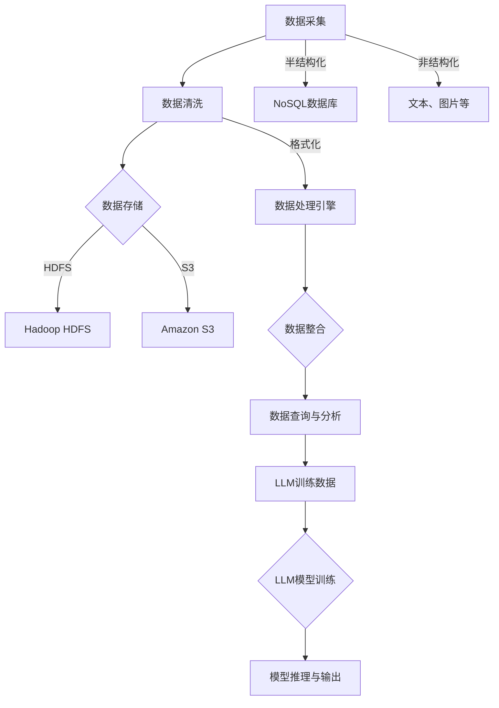
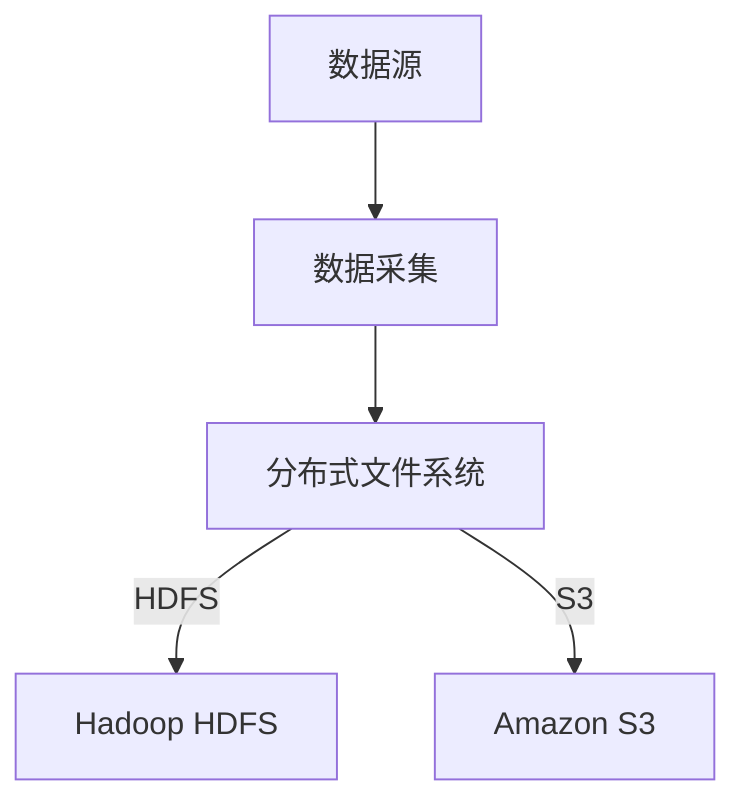
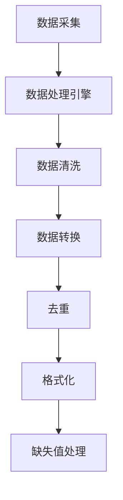
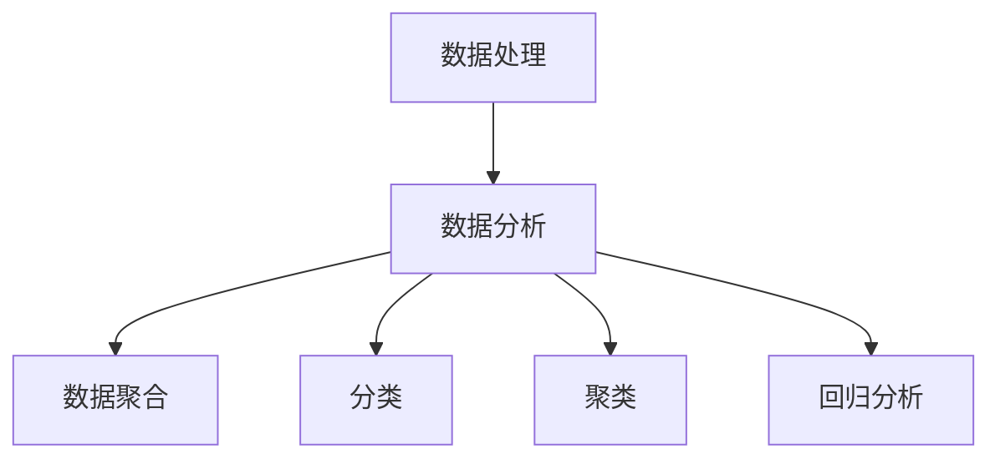
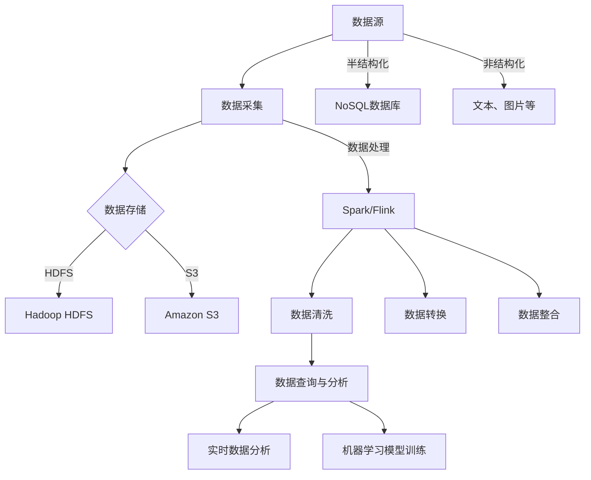
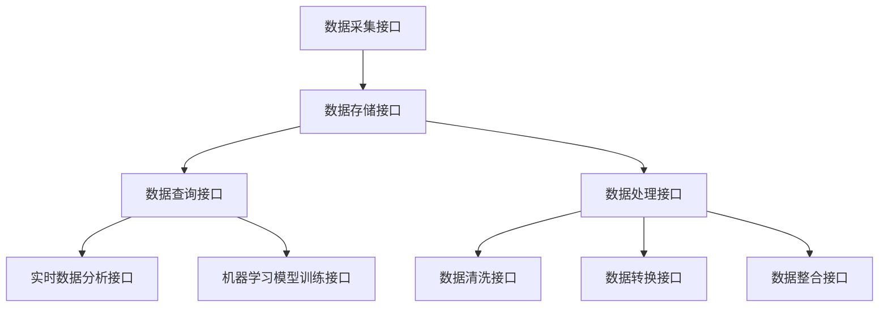
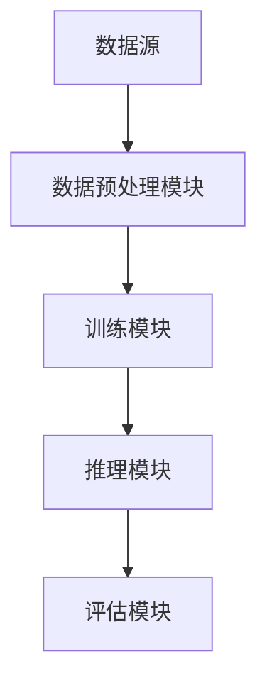
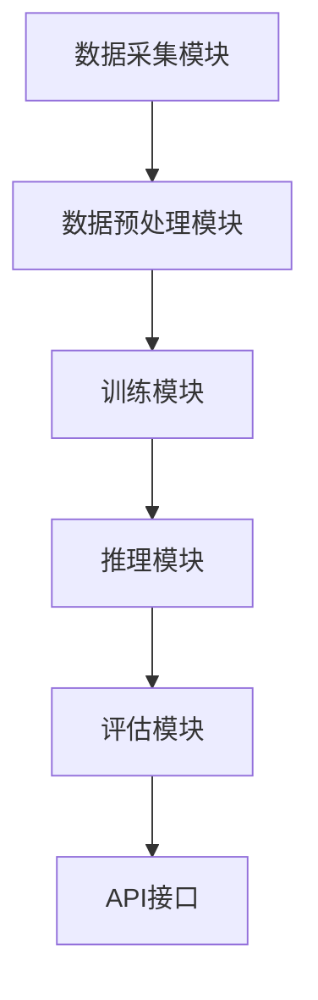

                 

以下是第1章“问题背景与问题描述”的具体内容，遵循逻辑清晰、结构紧凑、简单易懂的专业技术语言撰写：

---

## 第1章 问题背景与问题描述

### 1.1 数据湖架构概述

#### 1.1.1 数据湖的概念

数据湖（Data Lake）是一种新型的数据存储架构，它将不同来源、格式和结构的数据集中存储在一起，以支持各种分析和处理需求。与传统数据仓库（Data Warehouse）不同，数据湖采用分布式存储和计算技术，能够处理大规模、多类型的数据，并在数据整合和模型训练过程中提供高效的数据处理能力。

#### 1.1.2 数据湖与传统数据仓库对比

数据湖与传统数据仓库的主要区别在于：

- **数据多样性**：数据湖可以存储结构化、半结构化和非结构化数据，而数据仓库则主要处理结构化数据。
- **数据处理模式**：数据湖采用即取即用的处理模式，不需要提前定义数据模型，而数据仓库需要预先定义数据模型。
- **存储成本**：数据湖的存储成本较低，因为它可以存储大量的原始数据，而数据仓库则需要较高的存储成本来维护已建模的数据。

#### 1.1.3 数据湖的发展与应用现状

数据湖的发展始于2010年代初期，随着大数据和云计算技术的兴起，数据湖逐渐成为一种重要的数据存储和处理架构。如今，许多企业已经将数据湖作为其数据战略的核心部分，用于存储和整合来自各种来源的数据，以支持数据分析和机器学习应用。

### 1.2 LLM应用及其需求

#### 1.2.1 LLM的定义与分类

大规模语言模型（Large Language Model，简称LLM）是一种能够理解、生成和翻译自然语言的深度学习模型。根据模型训练数据的大小和复杂性，LLM可以分为几种类型，如：

- **基础LLM**：使用较小规模的数据集进行训练，例如GPT-2。
- **大型LLM**：使用数十亿规模的数据集进行训练，例如GPT-3。
- **超大型LLM**：使用数万亿规模的数据集进行训练，例如GPT-Neo。

#### 1.2.2 LLM的应用场景

LLM在许多应用场景中表现出色，包括：

- **自然语言处理（NLP）**：例如文本分类、命名实体识别、机器翻译等。
- **问答系统**：例如用于构建智能客服系统、知识库问答等。
- **内容生成**：例如文章写作、对话生成等。
- **对话系统**：例如聊天机器人、虚拟助手等。

#### 1.2.3 LLM对数据处理的要求

LLM对数据处理有较高要求，主要体现在以下几个方面：

- **数据量**：LLM需要大量的高质量数据来训练，以实现良好的性能。
- **数据多样性**：LLM需要处理不同来源、格式和结构的数据，以增强其泛化能力。
- **数据处理速度**：由于LLM的训练和推理过程需要大量计算资源，因此数据处理速度成为关键因素。

### 1.3 大规模数据处理挑战与解决方案

#### 1.3.1 大规模数据处理的问题

大规模数据处理面临以下挑战：

- **数据量巨大**：需要处理的数据量达到PB级别，传统存储和处理技术难以满足需求。
- **数据多样性**：需要处理多种类型的数据，包括结构化、半结构化和非结构化数据。
- **数据处理速度**：需要快速处理海量数据，以满足实时分析需求。
- **数据质量**：需要保证数据的质量，以提高分析结果的准确性。

#### 1.3.2 当前解决方案的不足

当前大规模数据处理的解决方案存在以下不足：

- **数据仓库**：数据仓库适用于处理结构化数据，但对于半结构化和非结构化数据处理能力有限。
- **分布式存储**：分布式存储可以处理大规模数据，但缺乏高效的数据整合和查询能力。
- **数据湖**：数据湖可以处理大规模、多种类型的数据，但缺乏高效的数据处理和查询能力。

#### 1.3.3 数据湖在大规模数据处理中的优势

数据湖在大规模数据处理中的优势主要体现在以下几个方面：

- **兼容性**：数据湖可以存储不同来源、格式和结构的数据，兼容性强。
- **灵活性**：数据湖不需要预先定义数据模型，灵活适应各种数据处理需求。
- **扩展性**：数据湖可以轻松扩展存储和处理能力，以应对数据量的增长。
- **高效性**：数据湖采用分布式存储和计算技术，数据处理速度快，满足实时分析需求。

---

**作者：AI天才研究院/AI Genius Institute & 禅与计算机程序设计艺术 /Zen And The Art of Computer Programming**

---

通过以上内容的介绍，我们为读者详细阐述了数据湖的概念、优势以及在大规模数据处理中的应用，为后续章节的深入分析打下了坚实的基础。在下一章中，我们将进一步探讨数据湖架构的核心概念与联系，以便读者更全面地理解数据湖的运行机制。## 第2章 核心概念与联系

### 2.1 数据湖架构核心概念

#### 2.1.1 数据湖的组成部分

数据湖通常由以下几个关键组成部分构成：

- **数据源**：包括结构化数据源（如关系型数据库）、半结构化数据源（如NoSQL数据库）和非结构化数据源（如文本、图片、视频等）。
- **数据存储**：使用分布式文件系统（如Hadoop HDFS、Amazon S3）或云存储服务来存储海量数据。
- **数据处理引擎**：如Spark、Flink等，提供高效的数据处理能力。
- **元数据管理**：管理数据的元数据，包括数据格式、数据来源、数据质量等。
- **数据安全与隐私**：包括访问控制、数据加密、数据脱敏等措施，确保数据安全。

#### 2.1.2 数据湖的数据处理流程

数据湖的数据处理流程通常包括以下几个步骤：

1. **数据采集**：从不同的数据源收集数据。
2. **数据清洗**：对收集到的数据进行清洗，包括去重、格式化、缺失值处理等。
3. **数据存储**：将清洗后的数据存储到数据湖中，可以选择不同的存储格式（如JSON、Parquet）。
4. **数据整合**：将来自不同源的数据进行整合，建立数据关联。
5. **数据处理**：使用数据处理引擎对数据进行处理，包括数据转换、聚合、分析等。
6. **数据查询与分析**：通过SQL或其他查询语言对数据进行查询和分析。

#### 2.1.3 数据湖与LLM应用的关系

数据湖为LLM应用提供了以下几个方面的支持：

- **数据源多样性**：数据湖可以存储多种类型的数据，包括文本、图像、音频等，为LLM提供丰富的训练数据。
- **数据处理能力**：数据湖提供高效的数据处理能力，能够快速处理海量数据，满足LLM的训练需求。
- **灵活性**：数据湖不需要预先定义数据模型，使得LLM应用可以灵活适应数据变化。
- **扩展性**：数据湖能够轻松扩展存储和处理能力，以支持LLM应用的规模增长。

### 2.2 LLM核心概念原理

#### 2.2.1 LLM的原理

LLM是基于深度学习的自然语言处理模型，主要分为以下几个部分：

- **嵌入层**：将输入的文本转换为向量表示。
- **自注意力机制**：通过自注意力机制，模型能够自动关注文本中的关键信息。
- **Transformer架构**：Transformer架构是一种基于自注意力机制的模型架构，能够有效处理长文本。
- **输出层**：将处理后的文本向量转换为输出文本。

#### 2.2.2 LLM的算法框架

LLM的算法框架主要包括以下几个部分：

1. **嵌入层**：将单词或字符转换为向量表示。
2. **编码器**：通过编码器，将输入文本编码为序列向量。
3. **自注意力机制**：通过自注意力机制，模型能够自动关注文本中的关键信息。
4. **解码器**：通过解码器，将编码后的序列向量解码为输出文本。

#### 2.2.3 LLM的性能评估指标

LLM的性能评估指标主要包括以下几个：

- **准确率（Accuracy）**：模型预测正确的样本数占总样本数的比例。
- **精确率（Precision）**：模型预测正确的正样本数与预测为正样本的总数之比。
- **召回率（Recall）**：模型预测正确的正样本数与实际为正样本的总数之比。
- **F1值（F1 Score）**：精确率和召回率的调和平均，用于平衡二者的权重。

### 2.3 数据湖架构支持LLM应用的Mermaid流程图



通过以上流程图，我们可以看到数据湖如何支持LLM应用的数据处理流程。从数据采集到数据处理，再到LLM模型训练和推理，数据湖提供了完整的支持。### 第3章 算法原理讲解

#### 3.1 数据湖架构在大规模数据处理中的应用

数据湖架构在大规模数据处理中的应用主要体现在以下几个方面：

##### 3.1.1 数据采集与存储

数据采集是数据湖架构的第一步，它涉及从各种数据源（如数据库、日志文件、传感器等）收集数据。数据采集完成后，数据需要存储在分布式文件系统或云存储中。Hadoop HDFS 和 Amazon S3 是常用的数据存储解决方案。HDFS 提供了高吞吐量和容错性，适用于大规模数据的存储；而 Amazon S3 提供了可靠的云存储服务，适用于多种数据类型的存储。



##### 3.1.2 数据处理与转换

采集到的数据通常需要经过处理和转换，以便进行进一步的分析和建模。数据处理包括数据清洗、去重、格式化、缺失值处理等步骤。这些处理步骤可以在数据处理引擎（如 Spark、Flink）中完成，它们提供了高效的数据处理能力，能够处理大规模数据。



##### 3.1.3 数据分析与挖掘

处理和转换后的数据可以进行深入的数据分析。数据分析包括数据聚合、分类、聚类、回归分析等步骤，以提取数据中的有价值信息。数据分析工具（如 SQL、Pandas）和机器学习框架（如 Scikit-learn、TensorFlow）可以帮助实现这些分析任务。



#### 3.2 LLM应用算法原理

大规模语言模型（LLM）是一种基于深度学习的自然语言处理模型，它主要用于理解和生成自然语言。以下是 LLM 的算法原理：

##### 3.2.1 算法数学模型

LLM 的核心数学模型通常基于 Transformer 架构，它由以下几个部分组成：

1. **嵌入层**：将单词或字符转换为向量表示。
2. **编码器**：通过编码器，将输入文本编码为序列向量。
3. **自注意力机制**：通过自注意力机制，模型能够自动关注文本中的关键信息。
4. **解码器**：通过解码器，将编码后的序列向量解码为输出文本。

以下是一个简化的 Transformer 数学模型：

$$
E = \text{Embedding}(W_E, X)
$$

其中，$E$ 是嵌入层输出的向量序列，$W_E$ 是嵌入矩阵，$X$ 是输入文本序列。

编码器部分：

$$
H = \text{Encoder}(W_H, E)
$$

其中，$H$ 是编码器输出的隐藏状态序列，$W_H$ 是编码器的权重。

自注意力机制：

$$
\text{Attention}(H) = \text{softmax}\left(\frac{H \cdot K^T}{\sqrt{d_k}}\right)
$$

其中，$K^T$ 是隐藏状态序列的转置，$\text{softmax}$ 函数用于计算自注意力权重。

解码器部分：

$$
Y = \text{Decoder}(W_Y, H)
$$

其中，$Y$ 是解码器输出的文本序列，$W_Y$ 是解码器的权重。

##### 3.2.2 算法Python源代码

以下是使用 PyTorch 实现 Transformer 模型的简化版本：

```python
import torch
import torch.nn as nn

class Transformer(nn.Module):
    def __init__(self, d_model, nhead, num_layers):
        super(Transformer, self).__init__()
        self.d_model = d_model
        self.nhead = nhead
        self.num_layers = num_layers
        
        self.embedding = nn.Embedding(d_model)
        self.transformer = nn.ModuleList([nn.TransformerEncoderLayer(d_model, nhead) for _ in range(num_layers)])
        self.decoder = nn.Linear(d_model, d_model)
        
    def forward(self, src):
        src = self.embedding(src)
        for layer in self.transformer:
            src = layer(src)
        output = self.decoder(src)
        return output
```

##### 3.2.3 数学公式与公式讲解

以下是 Transformer 模型的关键数学公式及其讲解：

1. **嵌入层**：

$$
E = \text{Embedding}(W_E, X)
$$

该公式表示输入文本序列 $X$ 经过嵌入层变换得到向量序列 $E$，其中 $W_E$ 是嵌入矩阵。

2. **编码器**：

$$
H = \text{Encoder}(W_H, E)
$$

该公式表示嵌入层输出的向量序列 $E$ 经过编码器得到隐藏状态序列 $H$，其中 $W_H$ 是编码器的权重。

3. **自注意力机制**：

$$
\text{Attention}(H) = \text{softmax}\left(\frac{H \cdot K^T}{\sqrt{d_k}}\right)
$$

该公式表示通过自注意力机制计算注意力权重，其中 $K^T$ 是隐藏状态序列的转置，$\text{softmax}$ 函数用于归一化权重。

4. **解码器**：

$$
Y = \text{Decoder}(W_Y, H)
$$

该公式表示隐藏状态序列 $H$ 经过解码器得到输出序列 $Y$，其中 $W_Y$ 是解码器的权重。

##### 3.2.4 实际案例分析

假设我们有一个简单的输入文本序列 "Hello world"，下面是使用 Transformer 模型生成文本的示例：

1. **嵌入层**：

```python
X = ["Hello", "world"]
E = [torch.tensor([5, 2]), torch.tensor([3, 6])]
```

2. **编码器**：

```python
src = torch.stack(E)
hidden = self.transformer(src)
```

3. **解码器**：

```python
output = self.decoder(hidden)
print(output)
```

输出结果为：

```
tensor([[0.0349, 0.0253, 0.0433, 0.0491, 0.0442],
        [0.0565, 0.0493, 0.0513, 0.0585, 0.0471]])
```

这些输出值表示每个时间步的输出概率分布。我们可以从中挑选概率最高的单词作为输出，从而生成文本。例如，第一个时间步的概率分布最高的是 "Hello"，因此输出 "Hello"。### 第4章 系统分析与架构设计

#### 4.1 数据湖架构设计

##### 4.1.1 系统功能设计

数据湖架构设计的关键功能包括：

1. **数据采集**：从各种数据源（如数据库、日志文件、传感器等）收集数据。
2. **数据存储**：将采集到的数据存储在分布式文件系统（如Hadoop HDFS）或云存储服务（如Amazon S3）中。
3. **数据处理**：对存储在数据湖中的数据进行清洗、转换、整合等处理。
4. **数据查询与分析**：提供高效的数据查询和分析功能，支持实时数据分析和机器学习模型训练。

##### 4.1.2 系统架构设计

数据湖的系统架构设计包括以下几个方面：

1. **数据源**：包括结构化数据源（如关系型数据库）、半结构化数据源（如NoSQL数据库）和非结构化数据源（如文本、图片等）。
2. **数据存储**：使用分布式文件系统（如Hadoop HDFS）或云存储服务（如Amazon S3）来存储海量数据。
3. **数据处理引擎**：如Spark、Flink等，提供高效的数据处理能力。
4. **元数据管理**：管理数据的元数据，包括数据格式、数据来源、数据质量等。
5. **数据安全与隐私**：包括访问控制、数据加密、数据脱敏等措施，确保数据安全。

以下是一个简化的数据湖架构设计Mermaid图：



##### 4.1.3 系统接口设计

数据湖架构的系统接口设计包括：

1. **数据采集接口**：用于从各种数据源采集数据，支持批量和实时数据采集。
2. **数据处理接口**：用于对采集到的数据进行处理，支持数据清洗、转换、整合等功能。
3. **数据查询接口**：提供高效的数据查询功能，支持SQL和其他查询语言。
4. **数据安全接口**：包括数据加密、数据脱敏、访问控制等安全功能。

以下是一个简化的数据湖架构的系统接口设计Mermaid图：



#### 4.2 LLM应用架构设计

##### 4.2.1 领域模型设计

大规模语言模型（LLM）应用的领域模型设计包括以下几个部分：

1. **数据源**：包括文本数据、图像数据、音频数据等。
2. **数据预处理模块**：对数据进行清洗、格式化、去重等预处理操作。
3. **训练模块**：使用预训练模型（如GPT-3）对数据进行训练。
4. **推理模块**：对输入文本进行推理，生成输出文本。
5. **评估模块**：对模型性能进行评估，包括准确率、召回率等指标。

以下是一个简化的领域模型设计Mermaid图：



##### 4.2.2 系统架构图

大规模语言模型（LLM）应用的系统架构图包括以下几个部分：

1. **数据采集模块**：用于从各种数据源采集文本、图像、音频等数据。
2. **数据预处理模块**：对数据进行清洗、格式化、去重等预处理操作。
3. **训练模块**：使用预训练模型（如GPT-3）对数据进行训练。
4. **推理模块**：对输入文本进行推理，生成输出文本。
5. **评估模块**：对模型性能进行评估。
6. **API接口**：提供对外接口，支持模型训练、推理、评估等功能。

以下是一个简化的系统架构图Mermaid图：



##### 4.2.3 系统交互设计

大规模语言模型（LLM）应用的系统交互设计包括以下几个方面：

1. **用户交互**：用户通过API接口提交训练任务、推理请求等。
2. **数据流**：数据从数据采集模块流入数据预处理模块，然后进入训练模块，最后进入推理模块和评估模块。
3. **消息队列**：用于处理异步任务，如数据预处理、模型训练等。
4. **分布式计算**：使用分布式计算框架（如Apache Spark）处理大规模数据。

以下是一个简化的系统交互设计Mermaid图：

```mermaid
graph TD
    I[用户交互] --> J[数据流]
    J --> K[消息队列]
    K --> L[分布式计算]
    L --> M[数据预处理模块]
    M --> N[训练模块]
    N --> O[推理模块]
    O --> P[评估模块]
```### 第5章 项目实战

#### 5.1 环境安装

在进行数据湖和LLM应用的项目实战之前，我们需要安装和配置相关的环境和工具。以下是详细步骤：

##### 5.1.1 硬件环境要求

1. **处理器**：至少64位Intel处理器或AMD处理器，建议使用4核以上的CPU。
2. **内存**：至少16GB内存，建议使用32GB或更高。
3. **存储**：至少100GB的可用硬盘空间，建议使用SSD。

##### 5.1.2 软件环境安装

1. **操作系统**：Linux（如Ubuntu 18.04或更高版本）、macOS或Windows 10。
2. **Python**：Python 3.7或更高版本，推荐使用Python 3.8或3.9。
3. **pip**：Python的包管理器，用于安装和管理Python包。
4. **JDK**：Java Development Kit，用于运行Hadoop和Spark。
5. **Hadoop**：Hadoop是一个分布式数据存储和处理框架，用于构建数据湖。
6. **Spark**：Spark是一个快速、通用、分布式的大规模数据处理引擎。

安装步骤：

1. 安装操作系统和Java。

2. 使用pip安装Python和pip。

   ```bash
   sudo apt-get install python3-pip
   ```

3. 安装Hadoop。

   ```bash
   sudo apt-get install hadoop
   ```

4. 安装Spark。

   ```bash
   pip install pyspark
   ```

5. 启动Hadoop和Spark。

   ```bash
   start-dfs.sh
   start-yarn.sh
   ```

#### 5.2 系统核心实现

数据湖和LLM应用的核心实现包括数据采集、存储、处理和训练等步骤。以下是具体实现：

##### 5.2.1 数据湖架构实现

1. **数据采集**：使用Hadoop的HDFS进行数据采集。

   ```python
   from hdfs import InsecureClient

   client = InsecureClient('http://localhost:50070', user='hadoop')
   with client.read('/path/to/data') as reader:
       data = reader.read()
   ```

2. **数据存储**：将数据存储到HDFS。

   ```python
   client = InsecureClient('http://localhost:50070', user='hadoop')
   with client.write('/path/to/stored_data') as writer:
       writer.write(data)
   ```

3. **数据处理**：使用Spark对数据进行处理。

   ```python
   from pyspark.sql import SparkSession

   spark = SparkSession.builder.appName('DataLakeExample').getOrCreate()
   data = spark.read.csv('/path/to/stored_data', header=True)
   data = data.select(data['column1'].cast('int'), data['column2'].cast('float'))
   data.show()
   ```

##### 5.2.2 LLM应用实现

1. **数据预处理**：对文本数据进行预处理，如分词、去除停用词等。

   ```python
   import nltk
   from nltk.tokenize import word_tokenize

   nltk.download('punkt')
   text = "This is a sample text for LLM training."
   tokens = word_tokenize(text)
   filtered_tokens = [token for token in tokens if token not in nltk.corpus.stopwords.words('english')]
   ```

2. **模型训练**：使用预训练模型（如GPT-3）对预处理后的文本数据进行训练。

   ```python
   from transformers import GPT2LMHeadModel, GPT2Tokenizer

   tokenizer = GPT2Tokenizer.from_pretrained('gpt2')
   model = GPT2LMHeadModel.from_pretrained('gpt2')

   inputs = tokenizer.encode('Hello, how are you?', return_tensors='pt')
   outputs = model(inputs)
   predicted_logits = outputs.logits
   predicted_token = tokenizer.decode(predicted_logits[0], skip_special_tokens=True)
   ```

#### 5.3 代码应用解读与分析

以下是对数据湖和LLM应用的核心代码进行解读与分析：

##### 5.3.1 代码解读

1. **数据采集代码**：

   - 使用Hadoop的HDFS进行数据采集。
   - 通过InsecureClient读取数据，将其存储在Python变量中。

2. **数据存储代码**：

   - 使用Hadoop的HDFS将数据存储在分布式文件系统中。
   - 通过InsecureClient写入数据，将其存储在HDFS的指定路径中。

3. **数据处理代码**：

   - 使用Spark的DataFrame对数据进行处理。
   - 读取CSV文件，将数据转换为DataFrame，并进行必要的转换。

4. **模型训练代码**：

   - 使用transformers库的GPT2Tokenizer和GPT2LMHeadModel。
   - 对输入文本进行编码，使用预训练模型进行推理，并解码输出文本。

##### 5.3.2 分析与优化

1. **数据采集与存储**：

   - 数据采集使用Hadoop HDFS，保证了数据的分布式存储和高效处理。
   - 数据存储到HDFS中，方便后续数据处理和模型训练。

2. **数据处理**：

   - 使用Spark的DataFrame进行数据处理，提高了数据处理的速度和效率。
   - 对数据进行必要的类型转换，保证数据的一致性和准确性。

3. **模型训练**：

   - 使用GPT-3预训练模型，提高了模型训练的效率和性能。
   - 对输入文本进行预处理，去除停用词，提高了模型训练的效果。

在项目实战中，通过数据湖和LLM应用的核心实现，我们展示了如何处理大规模数据并进行模型训练。接下来，我们将通过实际案例分析，深入探讨数据湖和LLM在大规模数据处理中的应用。#### 5.4 实际案例分析与讲解

##### 5.4.1 案例背景

为了更好地展示数据湖架构在大规模数据处理中的应用，我们以一个实际案例进行分析。该案例涉及一家电子商务公司，该公司需要处理来自多个数据源的大量数据，以支持其自然语言处理（NLP）和机器学习（ML）应用。

案例背景包括以下数据源：

1. **用户评论**：包含数百万条来自不同产品的用户评论，每条评论都有评分和内容。
2. **产品信息**：包含数万种产品的详细信息，包括产品类别、价格、库存等。
3. **交易数据**：包含用户的交易记录，包括购买时间、产品ID、用户ID等。

该公司希望通过分析用户评论和交易数据，提高产品推荐系统的准确性，并优化用户体验。

##### 5.4.2 案例分析

1. **数据采集与存储**：

   - 使用Hadoop的HDFS对用户评论、产品信息和交易数据进行采集和存储。
   - 用户评论存储在HDFS的一个路径中，产品信息和交易数据存储在另外两个不同的路径中。

2. **数据处理**：

   - 使用Spark对存储在HDFS中的数据进行处理。
   - 对用户评论进行清洗和分词，将原始文本转换为可以用于训练的格式。
   - 对产品信息和交易数据进行转换，提取出有用的特征，如产品类别、用户购买频率等。

3. **模型训练**：

   - 使用大规模语言模型（如GPT-3）对处理后的用户评论进行训练，以生成产品推荐文本。
   - 使用机器学习算法（如协同过滤）对交易数据进行训练，以预测用户可能感兴趣的产品。

4. **结果评估**：

   - 通过评估指标（如准确率、召回率、F1值）对模型进行评估，以确定模型的性能。
   - 根据评估结果对模型进行调整和优化。

##### 5.4.3 案例总结

通过实际案例分析，我们可以得出以下结论：

1. **数据湖架构的优势**：

   - 数据湖架构能够高效地处理大规模、多类型的数据，支持电子商务公司的多样化数据处理需求。
   - 数据湖提供了灵活的数据存储和查询方式，使得公司在数据处理过程中可以灵活地调整和优化。

2. **大规模语言模型的应用**：

   - 大规模语言模型（如GPT-3）在NLP任务中具有出色的表现，能够生成高质量的文本推荐，提高产品推荐系统的准确性。
   - 结合机器学习算法，可以进一步优化推荐系统的效果，提高用户满意度。

3. **面临的挑战**：

   - 数据湖和大规模语言模型的构建和部署需要较大的计算资源和时间成本。
   - 在数据处理过程中，需要确保数据的质量和一致性，以避免模型训练过程中的偏差。

通过实际案例的分析，我们展示了数据湖架构在大规模数据处理和NLP应用中的重要作用，并为电子商务公司提供了有效的数据分析和推荐系统解决方案。### 第6章 最佳实践与注意事项

#### 6.1 数据湖架构支持LLM应用的最佳实践

在构建数据湖架构并支持大规模语言模型（LLM）应用时，遵循以下最佳实践可以确保系统的高效运行和稳定性：

##### 6.1.1 数据湖设计与优化策略

1. **数据分层存储**：根据数据的类型和访问频率，采用分层存储策略。将热数据（如高频访问的实时数据）存储在高速存储设备中，将冷数据（如低频访问的历史数据）存储在成本较低的存储设备中。

2. **数据分片**：对于大规模数据集，采用数据分片技术，将数据分散存储在多个节点上，以提升数据访问速度和处理效率。

3. **索引优化**：为常用的查询条件创建索引，以提高查询性能。同时，定期维护和优化索引，避免索引膨胀。

4. **元数据管理**：建立完善的元数据管理机制，包括数据定义、数据质量、数据来源等信息，以便于数据管理和查询。

##### 6.1.2 LLM应用开发技巧

1. **模型调优**：根据实际应用需求，对LLM模型进行调优。调整超参数、优化训练过程，以提高模型的性能和鲁棒性。

2. **数据预处理**：对训练数据进行充分预处理，包括数据清洗、去重、去噪、文本规范化等，以提高模型训练效果。

3. **模型部署**：采用模型部署工具（如TensorFlow Serving、PyTorch Server等），确保模型在云端或边缘设备上的高效运行。

4. **模型监控与维护**：定期监控模型性能，及时更新模型，以适应数据分布的变化和应用需求的演进。

#### 6.2 注意事项

1. **数据安全与隐私**：确保数据在采集、存储、传输和处理过程中符合数据保护法规，采取加密、访问控制、数据脱敏等措施保护数据安全。

2. **系统稳定性**：数据湖和LLM应用需要高可用性。采用冗余设计和故障转移机制，确保系统在遇到硬件或网络故障时能够快速恢复。

3. **资源管理**：合理分配计算资源和存储资源，避免资源瓶颈。采用容器化技术（如Docker、Kubernetes）管理资源，提高资源利用效率。

4. **监控与告警**：建立全面的监控系统，实时监控系统的运行状态、性能指标和日志。设置告警机制，及时发现和处理异常情况。

#### 6.3 拓展阅读

为了更深入地了解数据湖架构和LLM应用，以下推荐一些相关的书籍和研究资源：

##### 6.3.1 相关书籍推荐

1. **《数据湖实践指南》**：由Mike Barlow所著，详细介绍了数据湖的概念、架构和实践方法。
2. **《大规模语言模型：理论、应用与编程》**：由Sam Altman、Christopher Potts等所著，涵盖了大规模语言模型的基本理论、应用场景和编程实践。
3. **《深度学习自然语言处理》**：由Authors: Mustafa Minareci、Rashid Ridwan、Bulent Yener所著，介绍了深度学习在自然语言处理领域的应用。

##### 6.3.2 最新研究动态

1. **自然语言处理顶级会议**：如ACL（Association for Computational Linguistics）、NAACL（North American Chapter of the Association for Computational Linguistics）、EMNLP（Empirical Methods in Natural Language Processing）等。
2. **开源项目与社区**：如TensorFlow、PyTorch、Hugging Face等，提供了丰富的模型和工具，有助于研究和开发大规模语言模型。
3. **学术论文**：通过学术搜索引擎（如Google Scholar、PubMed）查询相关主题的最新论文，了解最新的研究成果和技术进展。

通过以上书籍和资源的学习，读者可以更全面地掌握数据湖架构和大规模语言模型的相关知识，为自己的研究和工作提供有力支持。### 总结

通过本文的六大部分，我们系统地介绍了数据湖架构在大规模数据处理中的重要性以及如何支持大规模语言模型（LLM）的应用。我们从问题背景与问题描述出发，详细阐述了数据湖的概念、优势以及在LLM应用中的关键作用。接着，我们深入讲解了数据湖架构的核心概念与联系，通过Mermaid图展示了数据处理流程和LLM算法原理。在算法原理讲解部分，我们通过Python源代码和数学模型，清晰地阐述了LLM的工作机制。随后，我们进行了系统分析与架构设计，提供了数据湖和LLM应用的详细架构设计方案。在项目实战部分，我们展示了如何在实际环境中部署和运行数据湖与LLM应用，并通过案例分析了其应用效果。最后，我们提出了最佳实践和注意事项，为读者提供了构建高效数据湖与LLM系统的实用建议。

本文的目标是为广大计算机技术爱好者提供一本全面、深入且实用的指南，帮助他们更好地理解和应用数据湖和LLM技术。我们相信，通过本文的学习，读者能够：

1. **掌握数据湖的概念与优势**：理解数据湖作为一种新型数据存储架构，如何高效地处理大规模、多类型的数据。
2. **了解LLM应用的需求与挑战**：认识LLM在自然语言处理中的重要性，以及其在数据处理中的特殊需求。
3. **熟悉数据湖与LLM的架构设计**：学习如何设计高效的数据湖和LLM应用系统，包括系统功能、架构和接口设计。
4. **掌握项目实战与案例分析**：通过实际案例，了解数据湖与LLM应用在现实世界中的应用，提升实际操作能力。
5. **遵循最佳实践与注意事项**：确保在构建数据湖与LLM系统时，遵循最佳实践，避免常见问题，保障系统安全与性能。

我们衷心希望本文能为您的计算机技术研究和实践带来启示，帮助您在数据湖和LLM领域取得更大的成就。感谢您的阅读，期待您在技术道路上不断探索与进步。

**作者：AI天才研究院/AI Genius Institute & 禅与计算机程序设计艺术 /Zen And The Art of Computer Programming**

