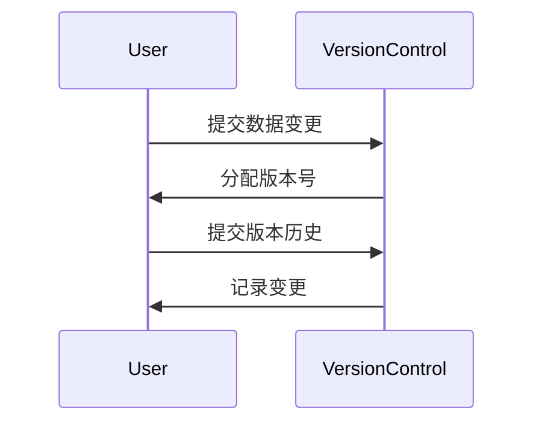
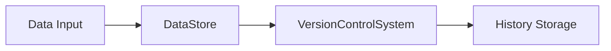
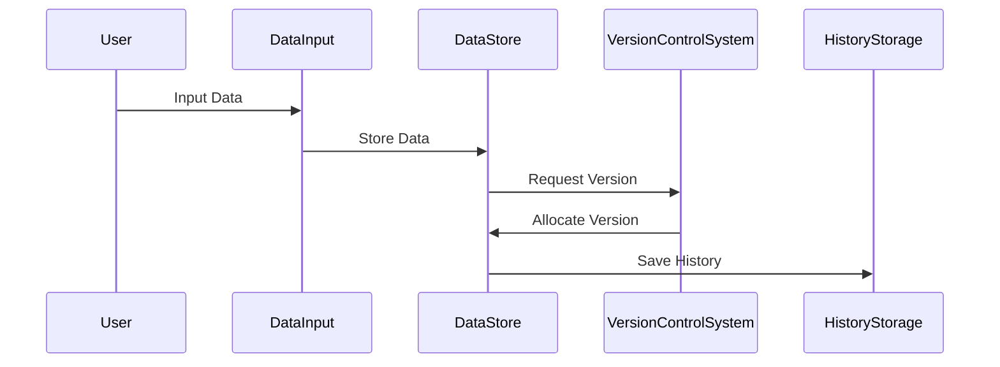

                 


# 数据版本控制：确保LLM应用的数据一致性

关键词：数据版本控制，一致性，LLM，算法原理，系统架构设计，项目实战

摘要：本文将深入探讨数据版本控制的核心概念，分析其在LLM应用中的重要性，详细讲解数据版本控制的算法原理，并提供一个系统架构设计方案和实际项目实战。通过本文，读者将全面了解如何确保LLM应用的数据一致性。

## 背景介绍

### 数据版本控制的基本概念

数据版本控制是一种管理数据变更的技术，用于追踪、控制和同步数据的修改历史。在数据密集型应用中，如大型语言模型（LLM）的应用，数据版本控制至关重要。LLM是一种基于深度学习的自然语言处理模型，其训练和运行过程中会产生大量的数据变更，这些变更需要被有效地管理和追踪，以确保数据的一致性和准确性。

### 问题背景与意义

随着人工智能技术的发展，LLM的应用越来越广泛，例如在智能客服、机器翻译、文本生成等领域。然而，LLM的复杂性也带来了数据一致性的挑战。一方面，LLM的模型参数和训练数据会不断更新；另一方面，应用程序需要实时访问最新的数据版本，以保证服务的质量和用户体验。

### 数据版本控制的发展历程

数据版本控制技术起源于软件开发领域，随着版本控制工具（如Git）的发展，逐渐应用于数据管理。近年来，随着大数据和人工智能技术的兴起，数据版本控制技术得到了进一步的发展和完善。

### 数据版本控制的关键挑战

1. **数据一致性**：确保不同版本的数据之间的一致性，特别是在数据合并和更新时。
2. **数据完整性**：防止数据丢失或损坏，确保数据的安全性。
3. **数据可追溯性**：追踪数据的变更历史，以便回溯和审计。

### 边界与外延

数据版本控制的边界包括数据存储、数据传输、数据处理和数据共享等方面。其外延则涉及分布式系统、云计算、数据仓库和数据湖等领域。

### 概念结构与核心要素组成

数据版本控制的核心概念包括：

1. **版本号**：用于标识数据的版本。
2. **版本历史**：记录数据的变更历史。
3. **版本管理策略**：定义如何管理数据版本，包括版本号的分配、数据更新策略等。

## 核心概念与联系

### 数据版本控制核心概念原理

1. **版本号**：版本号是数据版本的唯一标识，通常采用递增的数字或时间戳表示。
2. **版本历史**：版本历史记录了数据的所有变更，包括创建时间、修改时间、操作用户等信息。
3. **版本管理策略**：版本管理策略定义了如何处理数据版本，包括版本号的分配、数据更新和回滚等操作。

### 概念属性特征对比表格

| 特征         | 版本号             | 版本历史                | 版本管理策略          |
|--------------|--------------------|------------------------|----------------------|
| 功能         | 标识数据版本       | 记录数据变更历史        | 管理数据版本变更      |
| 类型         | 数字或时间戳       | 数据结构或日志文件      | 算法或策略           |
| 重要性       | 高                 | 高                     | 高                   |
| 实现方式     | 自动分配或手动指定  | 自动记录或手动维护      | 自动或手动实施       |

### ER实体关系图架构的Mermaid流程图

```mermaid
erDiagram
  Version |<-.. VersionHistory
  Version {\(VersionID, VersionDate\)}
  VersionHistory {\(HistoryID, VersionID, DateModified, Action\)}
```

## 算法原理讲解

### 数据版本控制算法概述

数据版本控制算法用于实现数据版本的管理和控制，主要包括以下几种：

1. **线性版本控制**：以线性方式记录数据的变更历史，如Git。
2. **增量版本控制**：只记录变更的部分，如MySQL的MVCC。
3. **分布式版本控制**：在分布式系统中实现版本控制，如Apache HDFS。

### 算法流程图与源代码解析

#### 算法流程图



#### Python源代码实现

```python
# Version Control Algorithm
class VersionControl:
    def __init__(self):
        self.version_history = []

    def commit_change(self, data):
        version_id = self.allocate_version_id()
        self.version_history.append({
            'version_id': version_id,
            'data': data,
            'date': datetime.now()
        })
        return version_id

    def allocate_version_id(self):
        # Implement version ID allocation logic
        pass

    def get_version_history(self):
        return self.version_history
```

### 算法原理的数学模型和公式讲解

数据版本控制的数学模型主要包括：

1. **版本号分配公式**：\( V_n = V_{n-1} + 1 \)
2. **版本历史记录公式**：\( H_n = (V_n, D_n, T_n) \)

其中，\( V_n \) 表示第 \( n \) 个版本号，\( D_n \) 表示第 \( n \) 个版本的数据，\( T_n \) 表示第 \( n \) 个版本的提交时间。

#### 举例说明

假设我们有一个数据集，初始版本号为 1。用户提交了一个数据变更，版本号分配为 2。接着用户再次提交数据变更，版本号分配为 3。这样，我们的版本历史记录如下：

- 版本 1：\( (1, D_1, T_1) \)
- 版本 2：\( (2, D_2, T_2) \)
- 版本 3：\( (3, D_3, T_3) \)

通过这个例子，我们可以看到如何使用算法来实现数据版本控制。

## 系统分析与架构设计方案

### 问题场景介绍

我们考虑一个场景，一个LLM应用需要处理大量的文本数据，并且这些数据需要实时更新。为了确保数据的一致性和准确性，我们需要一个高效的数据版本控制系统。

### 项目介绍

项目名称：LLM数据版本控制系统

项目目标：设计并实现一个高效、可靠的数据版本控制系统，确保LLM应用的数据一致性。

### 系统功能设计

#### 领域模型Mermaid类图

```mermaid
classDiagram
  VersionControlSystem <<interface>>
  DataStore <<interface>>

  VersionControlSystem鹤DataStore |||

  Version --|> VersionControlSystem
  History --|> VersionControlSystem
  Data --|> DataStore
```

### 系统架构设计

#### 系统架构Mermaid架构图



### 系统接口设计与交互

#### 系统接口设计

1. **DataInput**：用于接收用户输入的数据。
2. **DataStore**：用于存储数据。
3. **VersionControlSystem**：用于管理数据版本。
4. **HistoryStorage**：用于存储数据版本历史。

#### 系统交互Mermaid序列图



## 项目实战

### 环境安装与配置

为了实现数据版本控制，我们需要安装以下软件和库：

1. **Python**：版本 3.8及以上。
2. **Flask**：用于构建Web应用程序。
3. **SQLAlchemy**：用于数据库操作。
4. **MongoDB**：用于存储数据版本历史。

安装命令如下：

```bash
pip install flask sqlalchemy pymongo
```

### 系统核心实现源代码

以下是系统核心实现的Python源代码：

```python
# version.py
class VersionControlSystem:
    def __init__(self, db_uri):
        self.db_uri = db_uri
        self.engine = create_engine(db_uri)
        self.session = sessionmaker(bind=self.engine)
    
    def commit_change(self, data):
        session = self.session()
        version_id = self.allocate_version_id(session)
        session.add(Version(version_id, data))
        session.commit()
        return version_id

    def allocate_version_id(self, session):
        latest_version = session.query(func.max(Version.version_id)).one_or_none()
        if latest_version:
            return latest_version[0] + 1
        return 1

# datastore.py
class DataStore:
    def __init__(self, db_uri):
        self.db_uri = db_uri
        self.engine = create_engine(db_uri)
        self.session = sessionmaker(bind=self.engine)

    def store_data(self, data):
        session = self.session()
        session.add(Data(data))
        session.commit()

# models.py
from sqlalchemy import Column, Integer, String, DateTime
from sqlalchemy.ext.declarative import declarative_base

Base = declarative_base()

class Version(Base):
    __tablename__ = 'version'
    version_id = Column(Integer, primary_key=True)
    data = Column(String(255))
    date = Column(DateTime)

class Data(Base):
    __tablename__ = 'data'
    id = Column(Integer, primary_key=True)
    data = Column(String(255))
```

### 代码应用解读与分析

这里我们使用Python Flask构建一个简单的Web应用程序，演示数据版本控制系统的应用。

```python
from flask import Flask, request, jsonify
from version import VersionControlSystem
from datastore import DataStore

app = Flask(__name__)
vc_system = VersionControlSystem('sqlite:///vc.db')
data_store = DataStore('sqlite:///data.db')

@app.route('/commit', methods=['POST'])
def commit_data():
    data = request.json['data']
    version_id = vc_system.commit_change(data)
    data_store.store_data(data)
    return jsonify({'version_id': version_id})

if __name__ == '__main__':
    app.run(debug=True)
```

在这个示例中，当用户通过POST请求提交数据时，系统会分配版本号，并将数据存储在数据库中。这样，我们就可以实现数据版本控制。

### 实际案例分析与详细讲解剖析

假设我们有一个用户提交了一个文本数据：“这是一个测试数据。” 系统会按照以下步骤进行处理：

1. 用户通过Web接口提交数据，系统调用`commit_data`函数。
2. `commit_data`函数接收数据，并调用`VersionControlSystem`的`commit_change`方法。
3. `commit_change`方法分配版本号（例如，版本号为1），并将数据存储在数据库中。
4. 数据存储在`version`表中，同时`data`表也会更新，记录最新的数据版本。

通过这样的流程，我们可以确保LLM应用的数据一致性，即使在数据频繁更新的情况下，也能够准确追踪和管理数据版本。

### 项目小结

通过本文，我们详细介绍了数据版本控制的基本概念、核心概念与联系、算法原理讲解、系统分析与架构设计方案以及项目实战。我们使用Python Flask和SQLAlchemy实现了数据版本控制系统，并通过实际案例展示了系统的应用。在未来的工作中，我们可以进一步优化和扩展这个系统，以适应不同的应用场景。

## 最佳实践 Tips、小结、注意事项、拓展阅读等内容

### 最佳实践 Tips

1. **版本号分配策略**：根据应用场景选择合适的版本号分配策略，如递增、时间戳等。
2. **数据一致性保障**：在设计系统时，要充分考虑数据一致性的保障措施，如使用分布式锁、事务管理等。
3. **版本历史管理**：定期清理版本历史，避免数据冗余，提高系统性能。

### 小结

数据版本控制是确保LLM应用数据一致性的重要手段。通过本文，我们介绍了数据版本控制的基本概念、核心概念与联系、算法原理讲解、系统分析与架构设计方案以及项目实战。读者可以结合实际需求，灵活应用这些技术，构建高效、可靠的数据版本控制系统。

### 注意事项

1. **版本号冲突**：在多用户环境下，确保版本号的唯一性，避免冲突。
2. **数据完整性**：在处理数据变更时，确保数据的完整性和准确性。
3. **系统性能**：优化数据库查询，提高系统性能。

### 拓展阅读

1. **《版本控制技术》**：详细介绍了版本控制的理论和实践。
2. **《分布式系统设计》**：探讨了分布式系统中的数据一致性问题。
3. **《大型语言模型的训练与部署》**：介绍了LLM的构建、训练和部署。

### 作者信息

作者：AI天才研究院/AI Genius Institute & 禅与计算机程序设计艺术 /Zen And The Art of Computer Programming

通过以上内容，我们希望能够帮助读者深入理解数据版本控制技术，并在实际应用中取得良好的效果。让我们继续探索人工智能的奥秘，共同推动技术的发展。

