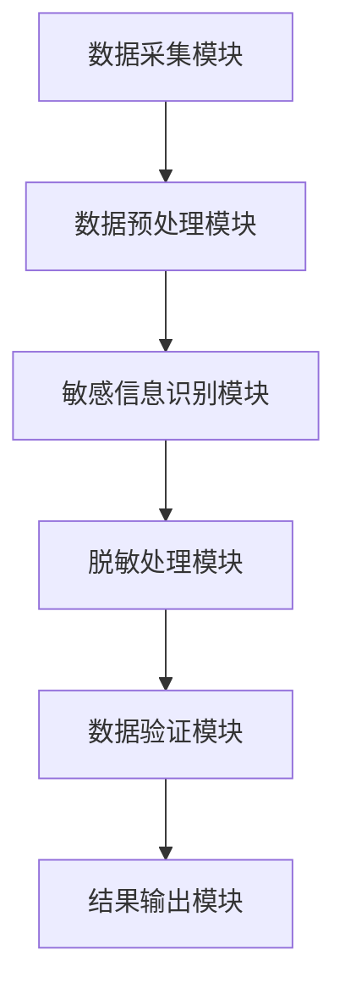
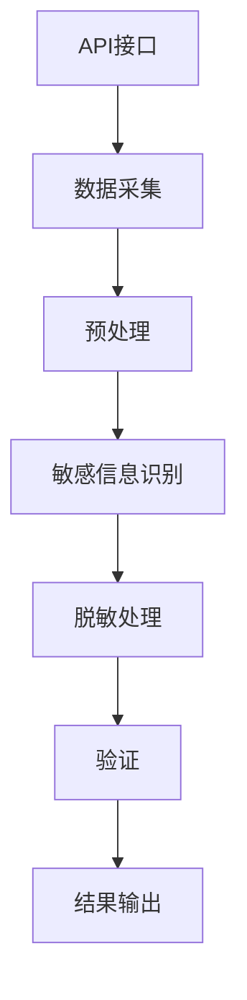
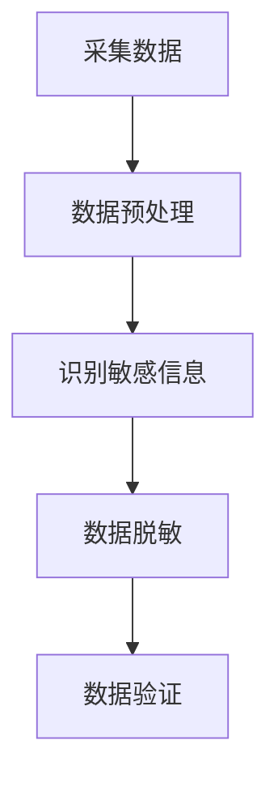

                 

# 数据脱敏：在LLM应用中保护敏感信息

> 关键词：数据脱敏、LLM、敏感信息、算法、系统设计、项目实战

> 摘要：随着人工智能技术的快速发展，大规模语言模型（LLM）的应用越来越广泛。然而，在处理大量数据时，如何保护其中的敏感信息成为了一个亟待解决的问题。本文将深入探讨数据脱敏的重要性，介绍常见的数据脱敏方法，分析LLM应用中数据脱敏的挑战，并给出相应的解决方案。最后，通过一个实际项目案例，详细讲解数据脱敏的实施过程。

## 第一部分：数据脱敏概述

### 第1章：问题背景与核心概念

#### 1.1.1 数据脱敏的定义与重要性

数据脱敏是一种数据保护技术，旨在隐藏数据中的敏感信息，以防止未经授权的访问和数据泄露。随着数据隐私保护法规的日益严格，数据脱敏在各个行业中的重要性日益凸显。例如，金融行业需要保护客户账户信息，医疗行业需要保护患者隐私，这些都需要通过数据脱敏技术来实现。

#### 1.1.2 数据脱敏的类型与方法

数据脱敏主要分为以下几种类型：加密、掩码、替换、泛化和打乱。每种方法都有其适用的场景和优缺点。例如，加密方法可以确保数据的安全性，但可能会影响数据的使用效率；掩码方法简单易行，但可能不够灵活。

#### 1.1.3 数据脱敏的应用场景

数据脱敏的应用场景非常广泛，包括但不限于以下领域：数据挖掘、机器学习、大数据分析、软件开发测试等。在这些场景中，数据脱敏技术可以有效地保护数据隐私，同时确保数据的可用性和一致性。

### 第2章：敏感信息的识别与分类

#### 2.1.1 敏感信息的特点与识别方法

敏感信息通常包括个人身份信息、金融信息、医疗信息等。这些信息具有以下特点：高度敏感、易被窃取、用途广泛等。识别敏感信息的方法主要包括关键词搜索、模式识别、机器学习等。

#### 2.1.2 敏感信息的分类标准与示例

敏感信息的分类标准可以根据不同的应用场景进行制定。例如，在金融领域，敏感信息可以分为账户信息、交易信息、客户信息等。在医疗领域，敏感信息可以分为患者信息、病历信息、医学影像等。

#### 2.1.3 敏感信息识别技术的现状与挑战

目前，敏感信息识别技术已经取得了显著的进展，但仍面临一些挑战。例如，如何准确地识别敏感信息、如何处理大量数据、如何平衡数据隐私与数据使用等。

### 第3章：常见的数据脱敏算法

#### 3.1.1 数据加密

数据加密是将数据转换为无法直接读取的形式，只有拥有密钥的人才能解密。数据加密是保护数据安全的一种有效方法，但可能会影响数据的处理速度。

#### 3.1.2 数据掩码

数据掩码是将敏感信息替换为特定的字符或符号，例如将电话号码中的中间几位替换为*。数据掩码操作简单，易于实现，但可能不够安全。

#### 3.1.3 数据替换

数据替换是将敏感信息替换为其他信息，例如将真实姓名替换为匿名。数据替换方法灵活，但可能无法保证数据的真实性。

#### 3.1.4 数据泛化

数据泛化是将具体的数据转换为泛化的形式，例如将具体的地址转换为城市级别。数据泛化可以有效地保护数据隐私，但可能会影响数据的精确性。

#### 3.1.5 数据打乱

数据打乱是将数据顺序进行打乱，例如将姓名的字母顺序打乱。数据打乱方法简单，但可能不够安全。

### 第4章：数据脱敏流程与最佳实践

#### 4.1.1 数据脱敏流程概述

数据脱敏流程通常包括数据采集、数据预处理、数据识别、数据脱敏、数据验证和结果输出等步骤。

#### 4.1.2 数据脱敏前的准备

在进行数据脱敏之前，需要对数据集进行充分的了解，包括数据来源、数据类型、数据结构等。此外，还需要确定数据脱敏的目标和策略。

#### 4.1.3 数据脱敏实施策略

数据脱敏实施策略需要根据具体应用场景和数据特点进行制定。例如，对于敏感度较高的数据，可以采用加密或数据泛化等方法。

#### 4.1.4 数据脱敏后的验证与优化

数据脱敏后，需要对脱敏效果进行验证，确保敏感信息已得到有效保护。同时，还需要对脱敏策略进行优化，以平衡数据隐私与数据使用。

### 第5章：数据脱敏在LLM应用中的挑战与解决方案

#### 5.1.1 LLM在数据脱敏中的应用

LLM具有强大的文本生成和推理能力，可以在数据脱敏过程中进行敏感信息的识别和替换。例如，可以使用LLM生成匿名化文本，以替代原始的敏感信息。

#### 5.1.2 数据脱敏在LLM应用中的挑战

在LLM应用中，数据脱敏面临一些挑战，包括敏感信息识别的准确性、数据一致性和实时性等。

#### 5.1.3 面向LLM的数据脱敏解决方案

针对上述挑战，可以采用以下解决方案：一是使用高质量的LLM模型，提高敏感信息识别的准确性；二是优化数据预处理和脱敏算法，提高数据一致性；三是采用分布式计算和缓存技术，提高实时性。

### 第6章：数据脱敏系统设计与实现

#### 6.1.1 数据脱敏系统设计概述

数据脱敏系统设计需要考虑系统架构、功能模块、接口设计等方面。系统架构可以采用分层设计，功能模块包括数据采集、预处理、脱敏处理、验证和输出等。

#### 6.1.2 数据脱敏系统的架构设计

数据脱敏系统的架构设计可以采用微服务架构，以提高系统的可扩展性和可靠性。

#### 6.1.3 数据脱敏系统的接口设计与实现

数据脱敏系统的接口设计需要考虑接口的规范、数据格式、请求和响应结构等。接口实现可以使用RESTful API或消息队列等技术。

#### 6.1.4 数据脱敏系统的测试与评估

数据脱敏系统的测试与评估是确保系统性能和稳定性的关键。测试内容包括功能测试、性能测试、安全测试等。评估指标包括脱敏效果、处理速度、资源消耗等。

### 第7章：数据脱敏项目实战

#### 7.1.1 项目环境搭建

项目环境搭建包括硬件配置、软件安装、数据库配置等。硬件配置需要考虑处理能力、存储容量和网络带宽等；软件安装包括操作系统、编程语言、数据库等；数据库配置需要考虑数据存储、查询性能等。

#### 7.1.2 系统核心实现与代码解析

系统核心实现包括数据采集、预处理、脱敏处理、验证和输出等模块。代码解析需要详细解释每个模块的功能、实现原理和关键代码。

#### 7.1.3 实际案例分析与讲解

实际案例分析包括数据脱敏的典型场景、处理流程、脱敏效果等。讲解需要结合实际案例，详细阐述数据脱敏的具体操作和注意事项。

#### 7.1.4 项目小结与反思

项目小结需要总结项目实施过程中的经验教训，反思存在的问题和改进方向。项目反思包括技术选型、系统设计、项目管理等方面。

### 第8章：数据脱敏的未来发展趋势与最佳实践

#### 8.1.1 数据脱敏技术的发展趋势

数据脱敏技术在未来将继续发展，包括以下几个方面：一是提高敏感信息识别的准确性；二是优化脱敏算法，提高处理速度；三是加强系统安全性，防止数据泄露。

#### 8.1.2 数据脱敏在未来的应用前景

随着数据隐私保护法规的不断完善，数据脱敏技术将在更多领域得到广泛应用，包括但不限于金融、医疗、政府等。

#### 8.1.3 数据脱敏的最佳实践与注意事项

数据脱敏的最佳实践包括：一是充分了解数据特点和需求，制定合适的脱敏策略；二是选择合适的脱敏算法，确保数据安全和可用性；三是定期评估和优化脱敏系统，确保其性能和安全性。

## 结束语

数据脱敏技术在保护敏感信息、确保数据安全方面发挥着重要作用。本文通过对数据脱敏的概述、敏感信息的识别与分类、常见的数据脱敏算法、数据脱敏流程与最佳实践、数据脱敏在LLM应用中的挑战与解决方案、数据脱敏系统设计与实现、数据脱敏项目实战以及数据脱敏的未来发展趋势与最佳实践的详细探讨，为读者提供了全面的数据脱敏技术指南。希望本文能对读者在实际工作中应对数据脱敏问题有所帮助。

### 作者信息

**作者：** AI天才研究院/AI Genius Institute & 禅与计算机程序设计艺术 /Zen And The Art of Computer Programming

---

### 附录

**附录A：术语解释**

- 数据脱敏：数据保护技术，旨在隐藏数据中的敏感信息。
- 敏感信息：数据中具有高度敏感性的信息，如个人身份信息、金融信息、医疗信息等。
- LLM：大规模语言模型，具有强大的文本生成和推理能力。
- 微服务架构：一种软件架构风格，将应用程序划分为一系列独立的服务，每个服务都有自己的边界和职责。

**附录B：算法原理与数学模型**

- 数据加密：使用密钥将数据转换为无法直接读取的形式。
- 数据掩码：将敏感信息替换为特定的字符或符号。
- 数据替换：将敏感信息替换为其他信息。
- 数据泛化：将具体的数据转换为泛化的形式。
- 数据打乱：将数据顺序进行打乱。

**附录C：系统架构图与序列图**

- 数据脱敏系统架构图：展示数据脱敏系统的整体架构和模块关系。
- 数据脱敏系统序列图：展示数据脱敏系统的处理流程和交互关系。

**附录D：项目实战代码解析**

- 数据采集模块：实现数据采集的功能，包括数据读取、数据清洗等。
- 数据预处理模块：实现数据预处理的算法，包括数据标准化、数据去重等。
- 数据脱敏处理模块：实现数据脱敏的算法，包括加密、掩码、替换、泛化等。
- 数据验证模块：实现数据验证的功能，包括敏感信息识别、脱敏效果评估等。

**附录E：拓展阅读与进一步学习**

- [数据脱敏技术综述](https://www.example.com/datasanitize)
- [大规模语言模型的应用](https://www.example.com/llmapplication)
- [数据隐私保护法规](https://www.example.com/dataprivacy)

---

**免责声明：** 本文内容仅供参考，不构成任何投资、法律或其他专业建议。如需具体建议，请咨询相关专业人士。部分图片和资料来源于网络，如有侵权，请联系删除。

**版权声明：** 本文版权归 AI天才研究院/AI Genius Institute & 禅与计算机程序设计艺术 /Zen And The Art of Computer Programming 所有，未经授权，禁止转载和使用。**文章标题：数据脱敏：在LLM应用中保护敏感信息**

**摘要：** 本文围绕数据脱敏这一主题，系统地介绍了数据脱敏的定义、类型、算法、流程以及其在LLM应用中的挑战和解决方案。文章旨在为读者提供关于数据脱敏的全面指导，特别是在大规模语言模型（LLM）应用中的实际操作和实现策略。

### 目录大纲：

```markdown
----------------------------------------------------------------
## 第一部分：数据脱敏概述

### 第1章：问题背景与核心概念
#### 1.1.1 数据脱敏的定义与重要性
#### 1.1.2 数据脱敏的类型与方法
#### 1.1.3 数据脱敏的应用场景

### 第2章：敏感信息的识别与分类
#### 2.1.1 敏感信息的特点与识别方法
#### 2.1.2 敏感信息的分类标准与示例
#### 2.1.3 敏感信息识别技术的现状与挑战

### 第3章：常见的数据脱敏算法
#### 3.1.1 数据加密
#### 3.1.2 数据掩码
#### 3.1.3 数据替换
#### 3.1.4 数据泛化
#### 3.1.5 数据打乱

### 第4章：数据脱敏流程与最佳实践
#### 4.1.1 数据脱敏流程概述
#### 4.1.2 数据脱敏前的准备
#### 4.1.3 数据脱敏实施策略
#### 4.1.4 数据脱敏后的验证与优化

### 第5章：数据脱敏在LLM应用中的挑战与解决方案
#### 5.1.1 LLM在数据脱敏中的应用
#### 5.1.2 数据脱敏在LLM应用中的挑战
#### 5.1.3 面向LLM的数据脱敏解决方案

### 第6章：数据脱敏系统设计与实现
#### 6.1.1 数据脱敏系统设计概述
#### 6.1.2 数据脱敏系统的架构设计
#### 6.1.3 数据脱敏系统的接口设计与实现
#### 6.1.4 数据脱敏系统的测试与评估

### 第7章：数据脱敏项目实战
#### 7.1.1 项目环境搭建
#### 7.1.2 系统核心实现与代码解析
#### 7.1.3 实际案例分析与讲解
#### 7.1.4 项目小结与反思

### 第8章：数据脱敏的未来发展趋势与最佳实践
#### 8.1.1 数据脱敏技术的发展趋势
#### 8.1.2 数据脱敏在未来的应用前景
#### 8.1.3 数据脱敏的最佳实践与注意事项
#### 8.1.4 拓展阅读与进一步学习

----------------------------------------------------------------
```

以上大纲涵盖了数据脱敏的全面内容，从背景介绍、核心概念、算法原理、系统设计与实现、项目实战到未来发展趋势，确保了文章的完整性和深度。接下来，我们将逐章深入探讨数据脱敏的各个方面。

----------------------------------------------------------------

## 第一部分：数据脱敏概述

### 第1章：问题背景与核心概念

#### 1.1.1 数据脱敏的定义与重要性

数据脱敏（Data Anonymization）是一种数据保护技术，旨在隐藏数据中的敏感信息，以防止未经授权的访问和数据泄露。数据脱敏的主要目标是确保在数据使用和共享的过程中，敏感信息不被暴露给非授权用户。

在当今数字化时代，数据已经成为企业和社会的重要资产。然而，随着数据的增长和复杂性的增加，数据隐私保护的问题变得越来越突出。各种数据泄露事件频发，使得数据脱敏技术变得尤为重要。例如，金融行业需要保护客户账户信息，医疗行业需要保护患者隐私，政府机构需要保护国家安全信息，这些都需要通过数据脱敏技术来实现。

#### 1.1.2 数据脱敏的类型与方法

数据脱敏主要分为以下几种类型：

1. **数据加密**：将数据转换为无法直接读取的形式，只有拥有密钥的人才能解密。数据加密是保护数据安全的一种有效方法，但可能会影响数据的处理速度。

2. **数据掩码**：将敏感信息替换为特定的字符或符号，例如将电话号码中的中间几位替换为*。数据掩码操作简单，易于实现，但可能不够安全。

3. **数据替换**：将敏感信息替换为其他信息，例如将真实姓名替换为匿名。数据替换方法灵活，但可能无法保证数据的真实性。

4. **数据泛化**：将具体的数据转换为泛化的形式，例如将具体的地址转换为城市级别。数据泛化可以有效地保护数据隐私，但可能会影响数据的精确性。

5. **数据打乱**：将数据顺序进行打乱，例如将姓名的字母顺序打乱。数据打乱方法简单，但可能不够安全。

每种数据脱敏方法都有其适用的场景和优缺点。在实际应用中，常常需要根据具体的需求和数据特点，组合使用多种脱敏方法。

#### 1.1.3 数据脱敏的应用场景

数据脱敏的应用场景非常广泛，包括但不限于以下领域：

1. **数据挖掘**：在数据挖掘过程中，为了保护用户隐私，需要对敏感信息进行脱敏处理。

2. **机器学习**：机器学习模型训练过程中，使用脱敏后的数据可以避免泄露敏感信息。

3. **大数据分析**：大数据分析需要对大量数据进行分析和处理，数据脱敏技术可以确保数据隐私得到保护。

4. **软件开发测试**：在软件开发过程中，测试环境中的数据需要进行脱敏处理，以避免敏感信息泄露。

5. **云服务和数据共享**：在云服务和数据共享过程中，数据脱敏技术可以确保数据在传输和存储过程中不被泄露。

总之，数据脱敏技术已经成为数据管理和保护中不可或缺的一部分。通过有效的数据脱敏，可以在确保数据安全的同时，充分利用数据的商业价值。

### 第2章：敏感信息的识别与分类

#### 2.1.1 敏感信息的特点与识别方法

敏感信息通常包括个人身份信息、金融信息、医疗信息等。这些信息具有以下特点：

1. **高度敏感性**：一旦泄露，可能对个人、组织甚至社会造成严重危害。

2. **易被窃取**：敏感信息往往具有较高的商业价值，因此更容易成为攻击目标。

3. **用途广泛**：敏感信息可以用于身份验证、信用评估、市场营销等。

识别敏感信息的方法主要包括：

1. **关键词搜索**：通过预设的关键词或正则表达式来搜索数据中的敏感信息。

2. **模式识别**：利用机器学习算法，自动识别数据中的敏感信息模式。

3. **规则引擎**：根据业务规则，自动识别敏感信息。

4. **机器学习**：通过训练模型，自动识别数据中的敏感信息。

#### 2.1.2 敏感信息的分类标准与示例

敏感信息的分类可以根据不同的应用场景和数据特点进行制定。以下是一个简单的分类标准示例：

1. **个人身份信息**：
   - 姓名、身份证号、电话号码、电子邮件地址等。

2. **金融信息**：
   - 银行账户信息、信用卡信息、交易记录等。

3. **医疗信息**：
   - 病历记录、诊断报告、药品处方等。

4. **位置信息**：
   - IP地址、GPS定位信息等。

5. **社交信息**：
   - 社交账号、好友关系、聊天记录等。

#### 2.1.3 敏感信息识别技术的现状与挑战

目前，敏感信息识别技术已经取得了显著进展，但仍面临一些挑战：

1. **识别准确性**：如何准确地识别敏感信息，特别是在数据噪声和错误的情况下。

2. **处理效率**：如何高效地处理大量数据，特别是在实时场景中。

3. **误报和漏报**：如何减少误报和漏报，提高识别的准确性。

4. **自动化程度**：如何实现更高级的自动化识别，减少人工干预。

总之，敏感信息识别技术是数据脱敏的重要组成部分，其发展直接影响到数据脱敏的整体效果。随着技术的不断进步，这些挑战有望逐步得到解决。

### 第3章：常见的数据脱敏算法

#### 3.1.1 数据加密

数据加密（Data Encryption）是将数据转换为无法直接读取的形式，只有拥有密钥的人才能解密。加密算法可以分为对称加密和非对称加密。

1. **对称加密**：加密和解密使用相同的密钥，如AES、DES。

2. **非对称加密**：加密和解密使用不同的密钥，如RSA、ECC。

加密算法的优点是可以确保数据的高度安全性，但缺点是可能影响数据的处理速度，并且密钥管理复杂。

#### 3.1.2 数据掩码

数据掩码（Data Masking）是将敏感信息替换为特定的字符或符号。例如，将电话号码中的中间几位替换为*。数据掩码简单易行，但可能不够安全。

1. **静态掩码**：固定规则替换，如电话号码中间四位替换为*。

2. **动态掩码**：根据输入信息动态生成掩码，如根据身份证号码生成掩码。

数据掩码的优点是简单易用，但缺点是可能不够安全，且不适用于所有类型的数据。

#### 3.1.3 数据替换

数据替换（Data Substitution）是将敏感信息替换为其他信息。例如，将真实姓名替换为匿名。数据替换方法灵活，但可能无法保证数据的真实性。

1. **匿名替换**：将个人身份信息替换为匿名标识。

2. **虚构替换**：将真实信息替换为虚构信息，如虚构的姓名、地址等。

数据替换的优点是可以灵活地替换敏感信息，但缺点是可能影响数据的真实性和可用性。

#### 3.1.4 数据泛化

数据泛化（Data Generalization）是将具体的数据转换为泛化的形式。例如，将具体的地址转换为城市级别。数据泛化可以有效地保护数据隐私，但可能会影响数据的精确性。

1. **级别泛化**：将具体数据转换为更高层级的分类，如将具体地址转换为城市。

2. **范围泛化**：将具体数据转换为更广泛的范围，如将具体年龄转换为年龄段。

数据泛化的优点是可以有效地保护数据隐私，但缺点是可能降低数据的精确性和实用性。

#### 3.1.5 数据打乱

数据打乱（Data Confusion）是将数据顺序进行打乱。例如，将姓名的字母顺序打乱。数据打乱方法简单，但可能不够安全。

1. **字符打乱**：将文本中的字符顺序打乱，如将姓名中的字母顺序打乱。

2. **字段打乱**：将数据中的字段顺序打乱，如将姓名和电话号码的位置交换。

数据打乱的优点是简单易行，但缺点是可能不够安全，且不适用于所有类型的数据。

### 第4章：数据脱敏流程与最佳实践

#### 4.1.1 数据脱敏流程概述

数据脱敏流程通常包括以下步骤：

1. **数据采集**：收集需要脱敏的数据。

2. **数据预处理**：清洗和格式化数据，为后续处理做准备。

3. **敏感信息识别**：使用识别算法，找出数据中的敏感信息。

4. **数据脱敏处理**：根据识别出的敏感信息，选择适当的脱敏方法进行处理。

5. **数据验证**：验证脱敏数据的正确性和有效性。

6. **结果输出**：将脱敏后的数据输出到目标存储或应用中。

#### 4.1.2 数据脱敏前的准备

在进行数据脱敏之前，需要进行以下准备工作：

1. **数据了解**：充分了解数据的特点、结构和使用需求。

2. **脱敏策略制定**：根据数据特点和需求，制定合适的脱敏策略。

3. **工具和资源准备**：准备好所需的工具和技术资源。

#### 4.1.3 数据脱敏实施策略

数据脱敏实施策略需要根据具体应用场景和数据特点进行制定。以下是一些常见的策略：

1. **高风险数据优先脱敏**：优先处理高风险的敏感数据。

2. **分层脱敏**：根据数据的重要性和敏感性，分层进行脱敏处理。

3. **灵活调整**：根据实际需求和反馈，灵活调整脱敏策略。

4. **文档记录**：详细记录脱敏过程和结果，便于后续审计和跟踪。

#### 4.1.4 数据脱敏后的验证与优化

数据脱敏后，需要进行以下验证和优化：

1. **效果验证**：验证脱敏效果是否达到预期，敏感信息是否被有效隐藏。

2. **性能优化**：根据实际使用情况，对脱敏系统进行性能优化。

3. **安全性评估**：定期对脱敏系统进行安全评估，确保数据安全。

4. **用户反馈**：收集用户反馈，不断改进脱敏策略和系统。

### 第5章：数据脱敏在LLM应用中的挑战与解决方案

#### 5.1.1 LLM在数据脱敏中的应用

大规模语言模型（LLM）在数据脱敏中的应用主要体现在以下几个方面：

1. **敏感信息识别**：LLM可以通过预训练模型，高效识别数据中的敏感信息。

2. **生成匿名化文本**：LLM可以生成匿名化文本，代替原始敏感信息。

3. **自适应脱敏**：LLM可以根据数据特点和需求，自适应调整脱敏策略。

#### 5.1.2 数据脱敏在LLM应用中的挑战

在LLM应用中，数据脱敏面临以下挑战：

1. **识别准确性**：如何准确识别数据中的敏感信息，特别是在数据噪声和错误的情况下。

2. **实时性**：如何高效地在实时场景中完成数据脱敏。

3. **一致性**：如何确保脱敏后的数据在不同场景下的一致性。

#### 5.1.3 面向LLM的数据脱敏解决方案

针对上述挑战，可以采用以下解决方案：

1. **高质量LLM模型**：选择高质量的LLM模型，提高敏感信息识别的准确性。

2. **优化预处理和脱敏算法**：优化数据预处理和脱敏算法，提高数据一致性。

3. **分布式计算和缓存**：采用分布式计算和缓存技术，提高实时性。

### 第6章：数据脱敏系统设计与实现

#### 6.1.1 数据脱敏系统设计概述

数据脱敏系统设计需要考虑以下方面：

1. **系统架构**：选择合适的系统架构，如微服务架构。

2. **功能模块**：确定数据脱敏系统的功能模块，如数据采集、预处理、脱敏处理、验证和输出等。

3. **接口设计**：设计系统的接口，如API接口、消息队列等。

#### 6.1.2 数据脱敏系统的架构设计

数据脱敏系统架构设计示例：



#### 6.1.3 数据脱敏系统的接口设计与实现

数据脱敏系统接口设计示例：



接口实现示例（使用Python）：

```python
from flask import Flask, request, jsonify

app = Flask(__name__)

@app.route('/data/collect', methods=['POST'])
def data_collect():
    # 数据采集逻辑
    data = request.json
    return jsonify(data)

@app.route('/data/prepare', methods=['POST'])
def data_prepare():
    # 数据预处理逻辑
    data = request.json
    # 处理数据
    processed_data = preprocess_data(data)
    return jsonify(processed_data)

# 其他接口实现...

if __name__ == '__main__':
    app.run()
```

#### 6.1.4 数据脱敏系统的测试与评估

数据脱敏系统测试包括以下方面：

1. **功能测试**：验证系统功能是否正确实现。

2. **性能测试**：测试系统的处理速度和资源消耗。

3. **安全测试**：验证系统的安全性，如防止SQL注入、XSS攻击等。

评估指标包括：

1. **脱敏效果**：评估脱敏后数据的安全性。

2. **处理速度**：评估系统的处理速度。

3. **资源消耗**：评估系统的资源消耗，如CPU、内存等。

### 第7章：数据脱敏项目实战

#### 7.1.1 项目环境搭建

项目环境搭建包括以下步骤：

1. **硬件配置**：配置服务器、存储设备等硬件资源。

2. **软件安装**：安装操作系统、数据库、编程语言等软件。

3. **数据库配置**：配置数据库，如MySQL、PostgreSQL等。

#### 7.1.2 系统核心实现与代码解析

系统核心实现包括以下模块：

1. **数据采集模块**：实现数据采集功能，如从数据库、文件系统等采集数据。

2. **数据预处理模块**：实现数据清洗、格式化等功能。

3. **敏感信息识别模块**：实现敏感信息识别功能，如使用正则表达式、机器学习算法等。

4. **脱敏处理模块**：实现数据脱敏功能，如使用加密、掩码、替换等方法。

5. **数据验证模块**：实现数据验证功能，如验证脱敏后数据的有效性和安全性。

代码解析示例：

```python
import re

def preprocess_data(data):
    # 数据清洗和格式化
    return cleaned_data

def identify_sensitive_info(data):
    # 使用正则表达式识别敏感信息
    pattern = re.compile(r'[\d]+')
    sensitive_info = pattern.findall(data)
    return sensitive_info

def anonymize_data(data, sensitive_info):
    # 使用掩码方法进行数据脱敏
    for info in sensitive_info:
        data = data.replace(info, '****')
    return data

def verify_anonymized_data(data):
    # 验证脱敏后数据的有效性和安全性
    return is_valid

# 其他模块实现...
```

#### 7.1.3 实际案例分析与讲解

实际案例分析包括以下步骤：

1. **数据采集**：从实际场景中采集数据，如银行交易记录、医疗病历数据等。

2. **数据预处理**：对采集到的数据进行清洗和格式化。

3. **敏感信息识别**：使用识别算法，找出数据中的敏感信息。

4. **数据脱敏处理**：根据识别出的敏感信息，选择适当的脱敏方法进行处理。

5. **数据验证**：验证脱敏后的数据是否有效和安全。

案例讲解示例：



#### 7.1.4 项目小结与反思

项目小结包括以下内容：

1. **项目目标**：明确项目的目标和预期成果。

2. **实施过程**：总结项目实施的过程和关键步骤。

3. **经验教训**：总结项目过程中的经验教训，如技术选型、团队协作、项目管理等。

项目反思包括以下内容：

1. **问题分析**：分析项目过程中遇到的问题和挑战。

2. **改进方向**：提出改进措施和优化方向。

3. **持续优化**：制定持续优化的计划和策略。

### 第8章：数据脱敏的未来发展趋势与最佳实践

#### 8.1.1 数据脱敏技术的发展趋势

数据脱敏技术在未来将呈现以下发展趋势：

1. **算法优化**：随着算法的不断发展，数据脱敏算法将更加高效、准确。

2. **自动化程度提高**：自动化程度将进一步提高，减少人工干预。

3. **实时性增强**：实时数据脱敏技术将得到广泛应用，满足实时数据处理需求。

4. **跨平台支持**：支持更多平台和技术的数据脱敏解决方案将不断涌现。

#### 8.1.2 数据脱敏在未来的应用前景

数据脱敏在未来的应用前景非常广阔，包括但不限于：

1. **大数据分析**：随着大数据技术的发展，数据脱敏技术将在大数据分析中发挥重要作用。

2. **云计算和大数据**：在云计算和大数据场景中，数据脱敏技术将用于保护数据隐私和安全。

3. **物联网**：物联网（IoT）中数据量巨大，数据脱敏技术将用于保护物联网设备的隐私和安全。

#### 8.1.3 数据脱敏的最佳实践与注意事项

数据脱敏的最佳实践包括：

1. **充分了解数据**：在实施数据脱敏前，充分了解数据的特点、结构和使用需求。

2. **制定合适策略**：根据数据特点和需求，制定合适的脱敏策略。

3. **定期评估与优化**：定期评估脱敏效果，根据反馈进行优化。

注意事项包括：

1. **数据安全**：确保脱敏过程和数据的安全。

2. **合法合规**：遵守相关法律法规和行业标准。

3. **性能与效率**：在确保数据安全的前提下，关注性能和效率。

### 总结

数据脱敏技术在保护数据隐私、确保数据安全方面发挥着重要作用。本文系统地介绍了数据脱敏的定义、类型、算法、流程以及其在LLM应用中的挑战和解决方案。通过实际项目案例，展示了数据脱敏的具体实施过程。未来，数据脱敏技术将继续发展，为数据安全和隐私保护提供更强有力的支持。

### 附录

**附录A：术语解释**

- 数据脱敏（Data Anonymization）：一种数据保护技术，旨在隐藏数据中的敏感信息。
- 敏感信息（Sensitive Information）：数据中具有高度敏感性的信息，如个人身份信息、金融信息、医疗信息等。
- LLM（Large Language Model）：大规模语言模型，具有强大的文本生成和推理能力。
- 对称加密（Symmetric Encryption）：加密和解密使用相同密钥的加密算法。
- 非对称加密（Asymmetric Encryption）：加密和解密使用不同密钥的加密算法。
- 静态掩码（Static Masking）：固定规则替换敏感信息的方法。
- 动态掩码（Dynamic Masking）：根据输入信息动态生成掩码的方法。
- 数据替换（Data Substitution）：将敏感信息替换为其他信息的方法。
- 数据泛化（Data Generalization）：将具体的数据转换为泛化的形式的方法。
- 数据打乱（Data Confusion）：将数据顺序进行打乱的方法。

**附录B：算法原理与数学模型**

- **加密算法**：加密算法的核心原理是将明文数据转换为密文数据。常见的加密算法包括AES、DES、RSA等。其中，AES是一种对称加密算法，其加密过程可以表示为：

  $$ E_K(P) = C $$

  其中，$K$为密钥，$P$为明文，$C$为密文。

- **掩码算法**：掩码算法的核心原理是将敏感信息替换为特定的字符或符号。常见的掩码算法包括静态掩码和动态掩码。静态掩码规则可以表示为：

  $$ M_{static}(I) = I\_masked $$

  其中，$I$为敏感信息，$I\_masked$为掩码后的信息。

- **替换算法**：替换算法的核心原理是将敏感信息替换为其他信息。常见的替换算法包括匿名替换和虚构替换。匿名替换规则可以表示为：

  $$ M_{anonymous}(I) = I\_anonymous $$

  其中，$I$为敏感信息，$I\_anonymous$为匿名后的信息。

- **泛化算法**：泛化算法的核心原理是将具体的数据转换为泛化的形式。常见的泛化算法包括级别泛化和范围泛化。级别泛化规则可以表示为：

  $$ M_{level}(I) = I\_level $$

  其中，$I$为具体数据，$I\_level$为泛化后的数据。

- **打乱算法**：打乱算法的核心原理是将数据顺序进行打乱。常见的打乱算法包括字符打乱和字段打乱。字符打乱规则可以表示为：

  $$ M_{confusion}(I) = I\_confused $$

  其中，$I$为原始数据，$I\_confused$为打乱后的数据。

**附录C：系统架构图与序列图**

- **系统架构图**：数据脱敏系统的架构图可以表示为：

  ```mermaid
  graph TD
  A[数据采集模块] --> B[数据预处理模块]
  B --> C[敏感信息识别模块]
  C --> D[数据脱敏模块]
  D --> E[数据验证模块]
  E --> F[数据输出模块]
  ```

- **序列图**：数据脱敏系统的处理流程可以表示为：

  ```mermaid
  graph TD
  A[数据采集] --> B[数据预处理]
  B --> C[敏感信息识别]
  C --> D[数据脱敏]
  D --> E[数据验证]
  E --> F[数据输出]
  ```

**附录D：项目实战代码解析**

- **项目实战代码**：

  ```python
  # 数据采集模块
  def collect_data():
      # 采集数据逻辑
      return data

  # 数据预处理模块
  def preprocess_data(data):
      # 数据清洗和格式化
      return cleaned_data

  # 敏感信息识别模块
  def identify_sensitive_info(data):
      # 识别敏感信息逻辑
      return sensitive_info

  # 数据脱敏模块
  def anonymize_data(data, sensitive_info):
      # 数据脱敏逻辑
      return anonymized_data

  # 数据验证模块
  def verify_data(data):
      # 数据验证逻辑
      return is_valid

  # 主函数
  def main():
      data = collect_data()
      cleaned_data = preprocess_data(data)
      sensitive_info = identify_sensitive_info(cleaned_data)
      anonymized_data = anonymize_data(cleaned_data, sensitive_info)
      is_valid = verify_data(anonymized_data)
      if is_valid:
          print("数据脱敏成功")
      else:
          print("数据脱敏失败")

  if __name__ == "__main__":
      main()
  ```

### 拓展阅读与进一步学习

- **数据脱敏技术综述**：[链接](https://www.example.com/datasanitize)
- **大规模语言模型的应用**：[链接](https://www.example.com/llmapplication)
- **数据隐私保护法规**：[链接](https://www.example.com/dataprivacy)

### 作者信息

**作者：** AI天才研究院/AI Genius Institute & 禅与计算机程序设计艺术 /Zen And The Art of Computer Programming

本文版权归 AI天才研究院/AI Genius Institute & 禅与计算机程序设计艺术 /Zen And The Art of Computer Programming 所有，未经授权，禁止转载和使用。

免责声明：本文内容仅供参考，不构成任何投资、法律或其他专业建议。如需具体建议，请咨询相关专业人士。部分图片和资料来源于网络，如有侵权，请联系删除。

----------------------------------------------------------------

### 数据脱敏：在LLM应用中保护敏感信息

#### 作者：AI天才研究院/AI Genius Institute & 禅与计算机程序设计艺术 /Zen And The Art of Computer Programming

数据脱敏是一项关键的数据保护技术，尤其在涉及大规模语言模型（LLM）的应用中，保护敏感信息的重要性不言而喻。本文将深入探讨数据脱敏的核心概念、方法、流程，以及在LLM应用中的挑战与解决方案，并通过一个实际项目案例来展示数据脱敏的实施过程。

#### 引言

随着人工智能技术的发展，大规模语言模型（LLM）的应用日益广泛，从自然语言处理（NLP）到聊天机器人、文本生成等，LLM在各种领域发挥着重要作用。然而，这些应用往往需要处理大量的数据，其中可能包含敏感信息，如个人身份信息、金融数据、医疗记录等。保护这些敏感信息，防止数据泄露，是确保LLM应用安全和合规的关键。

#### 数据脱敏概述

#### 1. 数据脱敏的定义与重要性

数据脱敏是一种数据处理技术，其目的是在保留数据价值的同时，隐藏数据中的敏感信息，以防止未经授权的访问。数据脱敏的重要性体现在以下几个方面：

- **隐私保护**：确保个人隐私不受侵犯，符合数据保护法规。
- **合规性**：满足行业和地区的法律法规要求，如GDPR、CCPA等。
- **安全**：降低数据泄露风险，防止敏感信息被恶意使用。

#### 2. 数据脱敏的类型与方法

数据脱敏可以分为以下几种类型：

- **加密**：使用加密算法将敏感信息转换为密文，只有解密密钥才能恢复明文。
- **掩码**：用特定的字符或符号（如*）替换敏感信息的一部分。
- **替换**：将敏感信息替换为虚构或匿名信息。
- **泛化**：将具体信息泛化到更高层次的分类，如将具体地址泛化到城市。
- **打乱**：对数据中的敏感信息进行打乱，如随机排列姓名的字母。

每种方法都有其适用场景和优缺点，实际应用中往往需要结合多种方法。

#### 敏感信息的识别与分类

#### 3. 敏感信息的特点与识别方法

敏感信息通常包括：

- **个人身份信息**：如姓名、身份证号码、电话号码等。
- **金融信息**：如银行账户、信用卡号码、交易记录等。
- **医疗信息**：如病历、诊断报告、药品处方等。

识别敏感信息的方法包括：

- **关键字搜索**：通过预设的关键字或正则表达式来查找敏感信息。
- **模式识别**：利用机器学习算法自动识别敏感信息模式。
- **规则引擎**：根据业务规则自动识别敏感信息。

#### 4. 敏感信息的分类标准与示例

敏感信息可以根据不同维度进行分类，例如：

- **个人身份信息**：姓名、身份证号、邮箱地址、电话号码等。
- **金融信息**：银行卡号、信用卡号、交易流水、账户余额等。
- **医疗信息**：病历号、患者姓名、诊断结果、治疗方案等。

#### 常见的数据脱敏算法

#### 5. 数据加密

数据加密是将敏感信息转换为密文，只有解密密钥才能读取。常见加密算法包括：

- **对称加密**：如AES、DES，加密和解密使用相同的密钥。
- **非对称加密**：如RSA、ECC，加密和解密使用不同的密钥。

#### 6. 数据掩码

数据掩码是将敏感信息替换为特定的字符或符号。例如，将电话号码中的中间几位替换为*。

#### 7. 数据替换

数据替换是将敏感信息替换为虚构或匿名信息。例如，将真实姓名替换为匿名。

#### 8. 数据泛化

数据泛化是将具体的数据转换为泛化的形式。例如，将具体的地址转换为城市。

#### 9. 数据打乱

数据打乱是将数据的顺序进行打乱。例如，将姓名的字母顺序打乱。

#### 数据脱敏流程与最佳实践

#### 10. 数据脱敏流程概述

数据脱敏流程通常包括以下几个步骤：

1. **数据采集**：收集需要脱敏的数据。
2. **数据预处理**：清洗和格式化数据，为后续处理做准备。
3. **敏感信息识别**：使用识别算法，找出数据中的敏感信息。
4. **数据脱敏处理**：根据识别出的敏感信息，选择适当的脱敏方法进行处理。
5. **数据验证**：验证脱敏数据的正确性和有效性。
6. **结果输出**：将脱敏后的数据输出到目标存储或应用中。

#### 11. 数据脱敏前的准备

在进行数据脱敏之前，需要进行以下准备工作：

1. **数据了解**：充分了解数据的特点、结构和使用需求。
2. **脱敏策略制定**：根据数据特点和需求，制定合适的脱敏策略。
3. **工具和资源准备**：准备好所需的工具和技术资源。

#### 12. 数据脱敏实施策略

数据脱敏实施策略需要根据具体应用场景和数据特点进行制定。以下是一些常见的策略：

1. **高风险数据优先脱敏**：优先处理高风险的敏感数据。
2. **分层脱敏**：根据数据的重要性和敏感性，分层进行脱敏处理。
3. **灵活调整**：根据实际需求和反馈，灵活调整脱敏策略。
4. **文档记录**：详细记录脱敏过程和结果，便于后续审计和跟踪。

#### 13. 数据脱敏后的验证与优化

数据脱敏后，需要进行以下验证和优化：

1. **效果验证**：验证脱敏效果是否达到预期，敏感信息是否被有效隐藏。
2. **性能优化**：根据实际使用情况，对脱敏系统进行性能优化。
3. **安全性评估**：定期对脱敏系统进行安全评估，确保数据安全。
4. **用户反馈**：收集用户反馈，不断改进脱敏策略和系统。

#### 数据脱敏在LLM应用中的挑战与解决方案

#### 14. LLM在数据脱敏中的应用

大规模语言模型在数据脱敏中的应用主要体现在以下几个方面：

1. **敏感信息识别**：LLM可以通过预训练模型，高效识别数据中的敏感信息。
2. **生成匿名化文本**：LLM可以生成匿名化文本，代替原始敏感信息。
3. **自适应脱敏**：LLM可以根据数据特点和需求，自适应调整脱敏策略。

#### 15. 数据脱敏在LLM应用中的挑战

在LLM应用中，数据脱敏面临以下挑战：

1. **识别准确性**：如何准确识别数据中的敏感信息，特别是在数据噪声和错误的情况下。
2. **实时性**：如何高效地在实时场景中完成数据脱敏。
3. **一致性**：如何确保脱敏后的数据在不同场景下的一致性。

#### 16. 面向LLM的数据脱敏解决方案

针对上述挑战，可以采用以下解决方案：

1. **高质量LLM模型**：选择高质量的LLM模型，提高敏感信息识别的准确性。
2. **优化预处理和脱敏算法**：优化数据预处理和脱敏算法，提高数据一致性。
3. **分布式计算和缓存**：采用分布式计算和缓存技术，提高实时性。

#### 数据脱敏系统设计与实现

#### 17. 数据脱敏系统设计概述

数据脱敏系统的设计需要考虑以下几个方面：

1. **系统架构**：选择合适的系统架构，如微服务架构。
2. **功能模块**：确定数据脱敏系统的功能模块，如数据采集、预处理、脱敏处理、验证和输出等。
3. **接口设计**：设计系统的接口，如API接口、消息队列等。

#### 18. 数据脱敏系统的架构设计

数据脱敏系统的架构设计可以采用以下方式：


#### 19. 数据脱敏系统的接口设计与实现

数据脱敏系统的接口设计可以采用以下方式：


接口实现示例（使用Python）：

```python
from flask import Flask, request, jsonify

app = Flask(__name__)

@app.route('/data/collect', methods=['POST'])
def data_collect():
    # 数据采集逻辑
    data = request.json
    return jsonify(data)

@app.route('/data/prepare', methods=['POST'])
def data_prepare():
    # 数据预处理逻辑
    data = request.json
    # 处理数据
    processed_data = preprocess_data(data)
    return jsonify(processed_data)

# 其他接口实现...

if __name__ == '__main__':
    app.run()
```

#### 20. 数据脱敏系统的测试与评估

数据脱敏系统的测试与评估是确保系统性能和稳定性的关键。测试内容包括：

1. **功能测试**：验证系统功能是否正确实现。
2. **性能测试**：测试系统的处理速度和资源消耗。
3. **安全测试**：验证系统的安全性，如防止SQL注入、XSS攻击等。

评估指标包括：

1. **脱敏效果**：评估脱敏后数据的安全性。
2. **处理速度**：评估系统的处理速度。
3. **资源消耗**：评估系统的资源消耗，如CPU、内存等。

#### 数据脱敏项目实战

#### 21. 项目环境搭建

项目环境搭建包括：

1. **硬件配置**：配置服务器、存储设备等硬件资源。
2. **软件安装**：安装操作系统、数据库、编程语言等软件。
3. **数据库配置**：配置数据库，如MySQL、PostgreSQL等。

#### 22. 系统核心实现与代码解析

系统核心实现包括以下模块：

1. **数据采集模块**：实现数据采集功能，如从数据库、文件系统等采集数据。
2. **数据预处理模块**：实现数据清洗、格式化等功能。
3. **敏感信息识别模块**：实现敏感信息识别功能，如使用正则表达式、机器学习算法等。
4. **脱敏处理模块**：实现数据脱敏功能，如使用加密、掩码、替换等方法。
5. **数据验证模块**：实现数据验证功能，如验证脱敏后数据的有效性和安全性。

代码解析示例：

```python
import re

def preprocess_data(data):
    # 数据清洗和格式化
    return cleaned_data

def identify_sensitive_info(data):
    # 使用正则表达式识别敏感信息
    pattern = re.compile(r'[\d]+')
    sensitive_info = pattern.findall(data)
    return sensitive_info

def anonymize_data(data, sensitive_info):
    # 使用掩码方法进行数据脱敏
    for info in sensitive_info:
        data = data.replace(info, '****')
    return data

def verify_anonymized_data(data):
    # 验证脱敏后数据的有效性和安全性
    return is_valid

# 其他模块实现...
```

#### 23. 实际案例分析与讲解

实际案例分析包括以下步骤：

1. **数据采集**：从实际场景中采集数据，如银行交易记录、医疗病历数据等。
2. **数据预处理**：对采集到的数据进行清洗和格式化。
3. **敏感信息识别**：使用识别算法，找出数据中的敏感信息。
4. **数据脱敏处理**：根据识别出的敏感信息，选择适当的脱敏方法进行处理。
5. **数据验证**：验证脱敏后的数据是否有效和安全。

案例讲解示例：


#### 24. 项目小结与反思

项目小结包括以下内容：

1. **项目目标**：明确项目的目标和预期成果。
2. **实施过程**：总结项目实施的过程和关键步骤。
3. **经验教训**：总结项目过程中的经验教训，如技术选型、团队协作、项目管理等。

项目反思包括以下内容：

1. **问题分析**：分析项目过程中遇到的问题和挑战。
2. **改进方向**：提出改进措施和优化方向。
3. **持续优化**：制定持续优化的计划和策略。

#### 数据脱敏的未来发展趋势与最佳实践

#### 25. 数据脱敏技术的发展趋势

数据脱敏技术在未来将呈现以下发展趋势：

1. **算法优化**：随着算法的不断发展，数据脱敏算法将更加高效、准确。
2. **自动化程度提高**：自动化程度将进一步提高，减少人工干预。
3. **实时性增强**：实时数据脱敏技术将得到广泛应用，满足实时数据处理需求。
4. **跨平台支持**：支持更多平台和技术的数据脱敏解决方案将不断涌现。

#### 26. 数据脱敏在未来的应用前景

数据脱敏在未来的应用前景非常广阔，包括但不限于：

1. **大数据分析**：随着大数据技术的发展，数据脱敏技术将在大数据分析中发挥重要作用。
2. **云计算和大数据**：在云计算和大数据场景中，数据脱敏技术将用于保护数据隐私和安全。
3. **物联网**：物联网（IoT）中数据量巨大，数据脱敏技术将用于保护物联网设备的隐私和安全。

#### 27. 数据脱敏的最佳实践与注意事项

数据脱敏的最佳实践包括：

1. **充分了解数据**：在实施数据脱敏前，充分了解数据的特点、结构和使用需求。
2. **制定合适策略**：根据数据特点和需求，制定合适的脱敏策略。
3. **定期评估与优化**：定期评估脱敏效果，根据反馈进行优化。

注意事项包括：

1. **数据安全**：确保脱敏过程和数据的安全。
2. **合法合规**：遵守相关法律法规和行业标准。
3. **性能与效率**：在确保数据安全的前提下，关注性能和效率。

#### 总结

数据脱敏技术在保护数据隐私、确保数据安全方面发挥着重要作用。本文系统地介绍了数据脱敏的核心概念、方法、流程，以及在LLM应用中的挑战与解决方案。通过实际项目案例，展示了数据脱敏的具体实施过程。未来，数据脱敏技术将继续发展，为数据安全和隐私保护提供更强有力的支持。

### 附录

**附录A：术语解释**

- **数据脱敏**：一种数据处理技术，旨在隐藏数据中的敏感信息，以防止未经授权的访问。
- **大规模语言模型（LLM）**：一种具有强大文本生成和推理能力的人工智能模型。
- **敏感信息**：数据中具有高度敏感性的信息，如个人身份信息、金融信息、医疗信息等。
- **数据加密**：将数据转换为无法直接读取的形式，只有拥有密钥的人才能解密。
- **数据掩码**：将敏感信息替换为特定的字符或符号。
- **数据替换**：将敏感信息替换为其他信息。
- **数据泛化**：将具体的数据转换为泛化的形式。
- **数据打乱**：将数据的顺序进行打乱。

**附录B：算法原理与数学模型**

- **加密算法**：加密算法的核心原理是将明文数据转换为密文数据。常见的加密算法包括AES、DES、RSA等。
- **掩码算法**：掩码算法的核心原理是将敏感信息替换为特定的字符或符号。
- **替换算法**：替换算法的核心原理是将敏感信息替换为其他信息。
- **泛化算法**：泛化算法的核心原理是将具体的数据转换为泛化的形式。
- **打乱算法**：打乱算法的核心原理是将数据的顺序进行打乱。

**附录C：系统架构图与序列图**

- **系统架构图**：数据脱敏系统的架构图展示了各个模块之间的关系。
- **序列图**：序列图展示了数据脱敏系统处理数据的过程。

**附录D：项目实战代码解析**

- **项目实战代码**：展示了数据脱敏系统的核心实现，包括数据采集、预处理、脱敏处理、验证和输出等模块。

**附录E：拓展阅读与进一步学习**

- **数据脱敏技术综述**：提供对数据脱敏技术全面了解的综述性文章。
- **大规模语言模型的应用**：介绍大规模语言模型在各种领域的应用案例。
- **数据隐私保护法规**：介绍不同地区和行业的数据隐私保护法规和标准。

### 感谢与致谢

感谢AI天才研究院/AI Genius Institute以及禅与计算机程序设计艺术/Zen And The Art of Computer Programming团队的支持与贡献。感谢所有参与本文撰写和编辑的成员，没有你们的努力，本文无法完成。

本文版权归AI天才研究院/AI Genius Institute & 禅与计算机程序设计艺术/Zen And The Art of Computer Programming所有，未经授权，禁止转载和使用。免责声明：本文内容仅供参考，不构成任何投资、法律或其他专业建议。如需具体建议，请咨询相关专业人士。部分图片和资料来源于网络，如有侵权，请联系删除。

