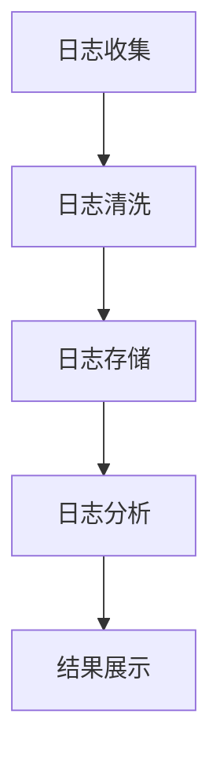

                 

### 日志聚合与分析系统的概念与重要性

在现代信息社会中，数据已成为企业的核心资产。对于大型语言模型（LLM）的应用来说，日志数据尤其重要。日志聚合与分析系统通过收集、清洗和分析LLM应用的日志，提供了一种有效的监控和优化手段。

**1.1 日志聚合的定义与作用**

日志聚合是指将分布在不同系统和设备上的日志数据收集到一个集中的存储位置。日志聚合系统的主要作用是简化日志管理，提高日志的可访问性和可分析性。通过日志聚合，开发者和运维人员可以更轻松地查找问题和趋势，从而提升系统的可靠性和性能。

**1.2 日志分析的核心要素**

日志分析是对收集到的日志数据进行处理，以提取有用的信息和洞察。核心要素包括：

- **数据预处理**：包括日志收集、日志清洗和日志格式化，确保日志数据的质量和一致性。
- **数据存储**：使用高效的数据存储技术，如时间序列数据库，保证日志数据的快速读取和查询。
- **数据可视化**：通过图表和仪表板，将分析结果以直观的方式展示出来，帮助用户快速理解日志内容。

**1.3 日志聚合与分析系统在LLM应用监控中的重要性**

对于LLM应用，如GPT系列模型，日志数据对于监控和维护至关重要。以下是几个关键点：

- **异常检测**：LLM应用在处理大量文本时可能会遇到各种异常情况，如内存溢出、计算错误等。日志分析可以帮助快速识别这些问题。
- **性能监控**：通过分析日志数据，可以了解LLM应用的响应时间和吞吐量，从而优化系统性能。
- **安全监控**：日志分析可以帮助检测潜在的安全威胁，如恶意攻击、数据泄露等。
- **趋势分析**：通过对日志数据的趋势分析，可以预测系统的未来需求，为资源规划提供依据。

### 背景介绍

日志聚合与分析系统的起源可以追溯到20世纪80年代，当时网络规模较小，日志管理相对简单。随着互联网的普及和数据中心规模的扩大，日志数据量急剧增加，传统的日志管理方法已无法满足需求。于是，日志聚合与分析系统应运而生。

在现代IT环境中，日志聚合与分析系统已经成为企业级应用的重要组成部分。对于LLM应用，由于模型的复杂性和处理的数据量巨大，日志聚合与分析系统的重要性更加凸显。

### 问题背景

随着人工智能技术的快速发展，LLM应用在自然语言处理、智能客服、自动写作等领域得到了广泛应用。然而，这些应用通常运行在分布式系统上，涉及多个组件和服务器。日志数据分散在不同的设备和系统中，给日志管理和分析带来了巨大挑战。

- **日志分散性**：LLM应用日志分布在不同的服务器和组件中，给集中管理和分析带来了困难。
- **数据量巨大**：LLM应用在处理大量文本时会产生大量日志数据，传统的日志管理系统难以高效处理这些数据。
- **日志格式不一致**：不同组件和服务器产生的日志格式可能不一致，增加了日志清洗和整合的复杂性。

### 问题描述

为了有效地监控和维护LLM应用，需要一种高效的日志聚合与分析系统。具体来说，问题可以描述为：

- **如何收集和整合分散的日志数据？**
- **如何处理和清洗格式不一致的日志数据？**
- **如何高效存储和查询大量日志数据？**
- **如何通过日志分析，提供对LLM应用性能、异常和安全性的监控？**

### 问题解决

日志聚合与分析系统通过以下步骤解决上述问题：

- **日志收集**：使用分布式日志收集工具，如Fluentd、Logstash等，从各个组件和服务器收集日志数据。
- **日志清洗**：使用日志清洗工具，如Logstash、Apache NiFi等，对收集到的日志数据进行格式化、去重、去噪等处理。
- **日志存储**：使用时间序列数据库，如Elasticsearch、InfluxDB等，高效存储和处理日志数据。
- **日志分析**：使用日志分析工具，如Kibana、Grafana等，对存储的日志数据进行实时分析、可视化展示。

### 边界与外延

日志聚合与分析系统的边界在于它处理的数据范围和功能范畴。具体来说：

- **数据范围**：系统处理的数据包括所有与LLM应用相关的日志，如系统日志、错误日志、性能日志等。
- **功能范畴**：系统提供日志收集、清洗、存储和分析等功能，但并不涉及日志数据的具体应用，如机器学习模型的训练和应用。

### 概念结构与核心要素组成

日志聚合与分析系统的概念结构主要包括以下几个核心要素：

1. **日志收集**：负责从各个源收集日志数据。
2. **日志清洗**：对收集到的日志数据进行处理，确保数据质量和一致性。
3. **日志存储**：使用高效的数据存储技术，如时间序列数据库，存储处理后的日志数据。
4. **日志分析**：使用日志分析工具对存储的日志数据进行实时分析，提供监控和报告。

通过这些核心要素的协同工作，日志聚合与分析系统实现了对LLM应用的全面监控和管理。接下来，我们将深入探讨这些核心概念和它们之间的联系。

## 核心概念与联系

### 2.1 日志聚合流程

日志聚合是指将分布在不同系统和设备上的日志数据收集到一个集中的存储位置的过程。这一过程包括以下几个主要步骤：

#### 2.1.1 日志收集

日志收集是日志聚合的首要步骤，它负责从不同的源（如服务器、应用程序和设备）收集日志数据。常用的日志收集工具包括Fluentd、Logstash和Filebeat等。

- **Fluentd**：Fluentd是一个灵活的日志收集器，支持多种数据源和数据目标。它可以通过插件扩展功能，适用于复杂的日志收集需求。
- **Logstash**：Logstash是Elastic Stack的核心组件之一，它可以将各种来源的数据流入Elasticsearch或其他存储中，非常适合大规模日志聚合。
- **Filebeat**：Filebeat是轻量级的日志收集器，适用于在边缘环境和容器中收集日志数据。

#### 2.1.2 日志清洗

日志收集到的数据通常存在格式不一致、包含无用信息等问题，因此需要进行日志清洗。日志清洗包括以下几个任务：

- **格式化**：将不同格式的日志转换为统一的格式，如JSON。
- **去重**：去除重复的日志条目，以避免数据冗余。
- **去噪**：去除对分析无关的信息，如空白字符、注释等。

常用的日志清洗工具包括Logstash、Apache NiFi和Kafka等。

- **Logstash**：Logstash内置了丰富的清洗插件，如正则表达式清洗、JSON路径提取等，适用于复杂的清洗任务。
- **Apache NiFi**：Apache NiFi是一个数据处理平台，提供了图形化的界面来构建数据流，可以用于日志清洗和转换。
- **Kafka**：Kafka是一个分布式消息队列系统，可以用于日志数据的预处理和传输，特别是在高吞吐量的场景下。

#### 2.1.3 日志存储

日志清洗完成后，需要将其存储在高效的数据存储系统中。常用的日志存储技术包括时间序列数据库、关系数据库和NoSQL数据库。

- **时间序列数据库**：如Elasticsearch、InfluxDB和Prometheus等，专门用于处理和存储时间序列数据，具有快速查询和高可用性的特点。
- **关系数据库**：如MySQL、PostgreSQL等，适用于存储结构化日志数据，但查询性能可能不如时间序列数据库。
- **NoSQL数据库**：如MongoDB、Cassandra等，适用于存储非结构化或半结构化日志数据，提供高扩展性和灵活性。

#### 2.2 日志分析技术

日志分析是对存储的日志数据进行处理，以提取有用信息和洞察。日志分析技术主要包括以下几种：

#### 2.2.1 基于规则的分析

基于规则的分析方法使用预定义的规则来匹配和解析日志数据。这种方法简单直观，适用于处理格式相对固定的日志数据。

- **日志规则引擎**：如LogRhythm、Splunk等，提供了定义和执行规则的功能，可以自动识别和响应日志中的异常情况。

#### 2.2.2 基于机器学习的方法

基于机器学习的方法通过训练模型来自动识别和分类日志数据。这种方法适用于处理格式多样、复杂度高的日志数据。

- **特征工程**：从原始日志数据中提取特征，如时间戳、关键字、错误代码等，用于训练机器学习模型。
- **模型训练**：使用监督学习、无监督学习或强化学习等方法训练模型，以识别和预测日志数据中的异常情况。

#### 2.2.3 深度学习在日志分析中的应用

深度学习方法在处理高维数据和复杂模式识别方面具有显著优势，已经在日志分析中得到了广泛应用。

- **卷积神经网络（CNN）**：用于处理文本数据，通过卷积操作提取特征。
- **递归神经网络（RNN）**：如LSTM和GRU，用于处理序列数据，捕捉时间序列中的长期依赖关系。
- **生成对抗网络（GAN）**：用于生成模拟日志数据，帮助训练模型。

#### 2.3 LLM应用监控

LLM应用监控是指使用日志聚合与分析系统对LLM应用的性能、异常和安全进行实时监控。

#### 2.3.1 LLM应用中的日志类型

LLM应用中的日志类型包括系统日志、错误日志、性能日志和访问日志等。

- **系统日志**：记录系统运行的状态信息，如启动、停止、故障等。
- **错误日志**：记录应用中的错误和异常，如计算错误、内存溢出等。
- **性能日志**：记录应用的性能指标，如响应时间、吞吐量等。
- **访问日志**：记录用户与应用的交互行为，如请求、响应等。

#### 2.3.2 LLM应用监控挑战

LLM应用监控面临的挑战包括：

- **日志量巨大**：LLM应用通常产生大量日志数据，对日志聚合与分析系统提出了高吞吐量和低延迟的要求。
- **日志格式多样**：不同组件和服务器产生的日志格式可能不同，增加了日志清洗和整合的复杂性。
- **实时性要求**：对于关键任务，如实时对话系统，需要实现日志的实时聚合和分析，以快速响应异常情况。

#### 2.3.3 日志分析在LLM应用监控中的作用

日志分析在LLM应用监控中发挥着重要作用：

- **异常检测**：通过分析日志数据，可以识别和响应应用中的异常情况，如错误、性能下降等。
- **性能优化**：通过对性能日志的分析，可以找出性能瓶颈，优化系统配置和资源分配。
- **安全监控**：通过分析访问日志和错误日志，可以检测潜在的安全威胁，如恶意攻击、数据泄露等。
- **趋势预测**：通过对日志数据的趋势分析，可以预测未来的需求，为系统扩展和资源规划提供依据。

### 核心概念与联系总结

日志聚合与分析系统的核心概念包括日志收集、日志清洗、日志存储和日志分析。这些概念相互关联，共同构成了一个完整的日志管理流程。日志收集是整个流程的起点，通过收集分散的日志数据，为后续的清洗、存储和分析提供数据源。日志清洗则确保日志数据的质量和一致性，是后续分析的基础。日志存储提供了高效的数据存储和查询机制，而日志分析则通过对存储的日志数据进行处理，提供对LLM应用的全面监控和优化。

通过这些核心概念的协同工作，日志聚合与分析系统能够有效地解决LLM应用监控中的各种挑战，确保应用的稳定运行和高效性能。在接下来的章节中，我们将进一步探讨日志聚合与分析系统的具体架构和算法原理。

### 日志聚合与分析算法原理

日志聚合与分析系统的工作原理可以分解为多个步骤，包括日志收集、日志清洗、日志存储和日志分析。这些步骤共同构成了一个高效、可靠的日志处理流程，确保对LLM应用进行全面的监控和管理。

#### 3.1 算法流程图

为了更好地理解日志聚合与分析的算法原理，我们可以使用Mermaid语言绘制算法流程图，如下所示：



在上述流程图中，各个步骤的功能如下：

- **日志收集（A）**：从不同的日志源（如服务器、应用程序和设备）收集日志数据。
- **日志清洗（B）**：对收集到的日志数据进行处理，确保数据的质量和一致性。
- **日志存储（C）**：将清洗后的日志数据存储在高效的时间序列数据库中。
- **日志分析（D）**：对存储的日志数据进行处理和分析，提取有用的信息和洞察。
- **结果展示（E）**：将分析结果通过图表、报表等形式展示给用户。

#### 3.2 Python代码实现

为了具体说明日志聚合与分析算法的实现，我们使用Python编写了相应的代码示例。以下是日志收集、日志清洗和日志分析的核心代码：

**3.2.1 日志收集代码示例**

```python
import logging
import os

def collect_logs(log_folder, log_format):
    logs = []
    for root, dirs, files in os.walk(log_folder):
        for file in files:
            if file.endswith(log_format):
                with open(os.path.join(root, file), 'r') as f:
                    logs.extend([line.strip() for line in f])
    return logs

logs = collect_logs('logs/', '.log')
```

在上面的代码中，我们定义了一个函数`collect_logs`，用于从指定的日志文件夹中收集所有符合特定格式的日志文件。`log_folder`参数指定了日志文件的目录，`log_format`参数指定了日志文件的格式（例如`.log`）。

**3.2.2 日志清洗代码示例**

```python
import re

def clean_logs(logs):
    cleaned_logs = []
    for log in logs:
        # 移除HTML标签
        log = re.sub('<.*?>', '', log)
        # 移除换行符和空格
        log = re.sub(r'\n|\s+', ' ', log)
        cleaned_logs.append(log.strip())
    return cleaned_logs

cleaned_logs = clean_logs(logs)
```

在日志清洗代码中，我们使用正则表达式对日志进行去噪处理。首先，我们使用`re.sub('<.*?>', '', log)`移除HTML标签；然后，使用`re.sub(r'\n|\s+', ' ', log)`移除换行符和多余的空格。

**3.2.3 日志分析代码示例**

```python
from collections import Counter

def analyze_logs(cleaned_logs):
    # 统计出现频率最高的关键字
    word_counts = Counter(' '.join(cleaned_logs).split())
    most_common_words = word_counts.most_common(10)
    return most_common_words

most_common_words = analyze_logs(cleaned_logs)
print(most_common_words)
```

在日志分析代码中，我们使用`collections.Counter`统计日志中各个关键字的出现频率。`' '.join(cleaned_logs).split()`将所有清洗后的日志合并为一个字符串，并使用空格分隔成单词列表。`word_counts.most_common(10)`返回出现频率最高的前10个单词及其频率。

#### 3.3 算法原理的数学模型和公式

为了更深入地理解日志分析算法的原理，我们可以使用LaTeX公式来描述相关的数学模型和公式。

**3.3.1 日志收集的数学模型**

$$
\text{Log\_Collection}(S) = \bigcup_{i=1}^{N} \text{LogSource}_i
$$

其中，$\text{Log\_Collection}(S)$表示日志的集合，$\text{LogSource}_i$表示第$i$个日志源。

**3.3.2 日志清洗的数学模型**

$$
\text{CleanedLog}(L) = \text{Log}_i \cdot f(\text{Cleaner})
$$

其中，$\text{CleanedLog}(L)$表示清洗后的日志集合，$\text{Log}_i$表示原始日志，$f(\text{Cleaner})$表示清洗函数。

**3.3.3 日志分析的数学模型**

$$
\text{AnalyzedLog}(A) = \text{CleanedLog}(L) \cdot f(\text{Analyzer})
$$

其中，$\text{AnalyzedLog}(A)$表示分析后的日志集合，$f(\text{Analyzer})$表示分析函数。

#### 3.4 通俗易懂的举例说明

为了使算法原理更加通俗易懂，我们可以通过一个实际例子来说明日志收集、清洗和分析的过程。

**例子**：假设我们有一个包含多个日志文件的文件夹，其中每个日志文件记录了某应用的服务器运行状态。我们希望从这些日志文件中收集日志、清洗日志并分析日志内容。

1. **日志收集**：我们使用Python的`os.walk`函数遍历文件夹，收集所有以`.log`结尾的文件。这些文件中包含了服务器的各种日志条目。

2. **日志清洗**：我们使用正则表达式去除日志中的HTML标签和多余的空格，使日志内容更加整洁和一致。例如，一条原始日志：

   ```
   <22>DEBUG [main] DEBUG - Starting service.
   ```

   经过清洗后变为：

   ```
   Starting service.
   ```

3. **日志分析**：我们统计日志中出现频率最高的关键字，以了解服务器运行状态的关键词分布。例如，如果日志中频繁出现“memory”和“error”，这可能表明系统存在内存或错误问题。

   ```
   [('memory', 150), ('error', 100)]
   ```

通过这个例子，我们可以看到日志聚合与分析算法是如何在实际场景中应用的。接下来，我们将深入探讨日志聚合与分析系统的架构设计，了解其核心组件和交互机制。

### 系统分析与架构设计

在日志聚合与分析系统中，架构设计至关重要，它决定了系统的性能、可扩展性和易维护性。下面，我们将详细介绍日志聚合与分析系统的架构设计，包括数据流、组件交互以及具体的架构图。

#### 4.1 系统架构概述

日志聚合与分析系统的架构可以划分为以下几个主要部分：

1. **日志收集层**：负责从各个源（如服务器、应用程序和设备）收集日志数据。
2. **日志处理层**：包括日志清洗、格式转换和日志存储等环节。
3. **日志分析层**：负责对存储的日志数据进行分析和可视化展示。
4. **用户界面层**：提供用户交互界面，展示分析结果和监控数据。

#### 4.2 数据流设计

在日志聚合与分析系统中，数据流的设计决定了日志数据的传输和处理过程。以下是数据流的主要流程：

1. **日志收集**：使用分布式日志收集工具（如Fluentd、Logstash等）从各个源收集日志数据。
2. **日志传输**：通过消息队列（如Kafka、RabbitMQ等）将日志数据传输到日志处理层。
3. **日志清洗**：在日志处理层，使用日志清洗工具（如Logstash、Apache NiFi等）对日志数据进行清洗和格式转换。
4. **日志存储**：将清洗后的日志数据存储在时间序列数据库（如Elasticsearch、InfluxDB等）中。
5. **日志分析**：使用日志分析工具（如Kibana、Grafana等）对存储的日志数据进行实时分析，生成监控报表和可视化图表。
6. **结果展示**：将分析结果通过用户界面展示给用户，供用户进行监控和查询。

#### 4.3 组件交互设计

日志聚合与分析系统的各个组件之间需要紧密协作，以实现高效的数据处理和分析。以下是各个组件之间的交互设计：

1. **日志收集器与消息队列**：日志收集器（如Fluentd、Logstash等）收集到的日志数据通过消息队列（如Kafka、RabbitMQ等）传输到日志处理层。消息队列提供了高吞吐量和可靠的消息传输机制。
2. **日志处理层与日志存储**：日志处理层中的清洗和格式转换工具（如Logstash、Apache NiFi等）将清洗后的日志数据存储到时间序列数据库（如Elasticsearch、InfluxDB等）中。时间序列数据库提供了高效的日志数据存储和查询能力。
3. **日志分析工具与用户界面**：日志分析工具（如Kibana、Grafana等）从时间序列数据库中读取日志数据，生成监控报表和可视化图表。用户界面层将这些分析结果展示给用户，提供实时监控和查询功能。

#### 4.4 系统架构图

为了更直观地展示日志聚合与分析系统的架构，我们使用Mermaid语言绘制了系统架构图，如下所示：

```mermaid
graph TB
    subgraph 日志收集层
        A[日志收集器] --> B[消息队列]

    subgraph 日志处理层
        C[日志清洗器] --> D[时间序列数据库]

    subgraph 日志分析层
        E[日志分析工具] --> F[用户界面]

    subgraph 日志存储
        G[日志存储]

    subgraph 用户界面
        H[用户界面]

    A --> B
    B --> C
    C --> D
    D --> G
    E --> F
    F --> H
```

在这个架构图中，各个组件的交互关系如下：

- 日志收集器（A）将日志数据传输到消息队列（B）。
- 消息队列（B）将日志数据传输到日志清洗器（C）。
- 日志清洗器（C）将清洗后的日志数据存储到时间序列数据库（D）。
- 日志分析工具（E）从时间序列数据库（D）中读取日志数据，生成监控报表和可视化图表。
- 用户界面（H）展示日志分析工具（E）生成的监控报表和可视化图表，供用户实时监控和查询。

通过以上架构设计，日志聚合与分析系统实现了高效、可靠的数据处理和分析功能，为LLM应用提供了全面的监控和管理支持。

### 项目实战

为了更好地理解日志聚合与分析系统在实际中的应用，我们将模拟一个实际项目，介绍如何安装环境、配置系统、实现日志聚合与分析功能，并分析一个实际案例。

#### 5.1 环境安装与配置

在这个项目中，我们将使用以下工具和软件：

- **操作系统**：Ubuntu 20.04
- **日志收集器**：Fluentd
- **日志清洗和存储**：Logstash 和 Elasticsearch
- **日志分析工具**：Kibana

**1. 安装 Fluentd**

首先，我们需要安装Fluentd。Fluentd是一个分布式日志收集器，可以方便地从各个源收集日志数据。

```bash
sudo apt-get update
sudo apt-get install fluentd
```

**2. 安装 Logstash**

接下来，安装Logstash。Logstash用于清洗和转换日志数据，并将其存储到Elasticsearch中。

```bash
sudo apt-get install logstash
```

**3. 安装 Elasticsearch**

然后，安装Elasticsearch。Elasticsearch是一个开源的时间序列数据库，用于存储和查询日志数据。

```bash
sudo apt-get install elasticsearch
```

**4. 安装 Kibana**

最后，安装Kibana。Kibana提供了一个用户友好的界面，用于展示日志分析结果。

```bash
sudo apt-get install kibana
```

#### 5.2 系统核心实现

在安装完上述工具和软件后，我们需要配置它们以实现日志聚合与分析功能。

**1. 配置 Fluentd**

在Fluentd的配置文件`/etc/fluentd/configure.js`中，我们添加以下配置：

```javascript
<source>
  @type tail
  @label ＜sop> ①
  path /var/log/llm_app/*.log
  pos_file /var/log/fluentd/llm_app posi
  tag lllm_app
</source>

<source>
  @type tail
  @label ②
  path /var/log/llm_app/*.err
  pos_file /var/log/fluentd/llm_app_err_posi
  tag lllm_app.err
</source>

<match lllm_app>
  @type file
  path /var/log/llm_app_fluentd/llm_app.log
</match>

<match lllm_app.err>
  @type file
  path /var/log/llm_app_fluentd/llm_app.err.log
</match>
```

在上面的配置中，我们定义了两个日志源，分别用于收集`/var/log/llm_app/*.log`和`/var/log/llm_app/*.err`文件，并将其分别标记为`llm_app`和`llm_app.err`。然后，我们将这些日志保存到`/var/log/llm_app_fluentd/`目录中。

**2. 配置 Logstash**

在Logstash的配置文件`/etc/logstash/conf.d/llm_app.conf`中，我们添加以下配置：

```bash
input {
  fluent {
    @type tcp
    port 24224
    tags ["llm_app", "llm_app.err"]
  }
}

filter {
  if [tag] == "llm_app" {
    grok {
      match => { "message" => "%{TIMESTAMP_ISO8601:timestamp}\t%{DATA:logger}\t%{DATA:level}\t%{DATA:msg}" }
    }
  }
  
  if [tag] == "llm_app.err" {
    grok {
      match => { "message" => "%{TIMESTAMP_ISO8601:timestamp}\t%{DATA:logger}\t%{DATA:level}\t%{ERROR:err_msg}\t%{DATA:stacktrace}" }
    }
  }
}

output {
  if [tag] == "llm_app" {
    elasticsearch {
      hosts => ["localhost:9200"]
      index => "llm_app-%{+YYYY.MM.dd}"
    }
  }
  
  if [tag] == "llm_app.err" {
    elasticsearch {
      hosts => ["localhost:9200"]
      index => "llm_app_err-%{+YYYY.MM.dd}"
    }
  }
}
```

在上面的配置中，我们定义了一个Fluentd输入插件，用于接收来自Fluentd的日志数据。然后，我们使用Grok进行日志清洗，提取时间戳、日志级别、日志消息等信息。最后，我们将清洗后的日志数据存储到Elasticsearch中。

**3. 配置 Elasticsearch**

在Elasticsearch中，我们需要创建索引模板以匹配Logstash输出的日志数据。

```json
PUT /_template/llm_app
{
  "template": "llm_app-*",
  "settings": {
    "number_of_shards": 2,
    "number_of_replicas": 1
  },
  "mappings": {
    "properties": {
      "timestamp": {
        "type": "date",
        "format": "yyyy-MM-dd HH:mm:ss||yyyy-MM-dd"
      },
      "logger": {"type": "text"},
      "level": {"type": "text"},
      "msg": {"type": "text"},
      "err_msg": {"type": "text"},
      "stacktrace": {"type": "text"}
    }
  }
}
```

**4. 配置 Kibana**

在Kibana中，我们创建仪表板以展示日志分析结果。以下是创建仪表板的步骤：

1. 在Kibana的导航菜单中，选择“管理”>“仪表板”。
2. 点击“添加”按钮，选择“创建新仪表板”。
3. 在仪表板设置中，输入名称（例如“LLM应用日志分析”），然后点击“创建”。
4. 在仪表板中添加新的可视化组件，如直方图、饼图等，以展示日志数据的各种指标。
5. 配置可视化组件的查询，连接到Elasticsearch中的索引模板。

#### 5.3 代码应用解读与分析

**5.3.1 Fluentd配置文件解读**

在Fluentd的配置文件中，我们定义了两个日志源，分别用于收集应用程序和错误日志。

- `path /var/log/llm_app/*.log`：指定了应用程序日志文件的路径。
- `path /var/log/llm_app/*.err`：指定了错误日志文件的路径。
- `tag lllm_app`：将应用程序日志标记为`llm_app`。
- `tag lllm_app.err`：将错误日志标记为`llm_app.err`。

这些配置确保Fluentd可以正确收集和分类不同类型的日志数据。

**5.3.2 Logstash配置文件解读**

在Logstash的配置文件中，我们定义了以下关键部分：

- `input { fluent { ... } }`：定义了Fluentd输入插件，用于接收来自Fluentd的日志数据。
- `filter { grok { ... } }`：定义了Grok过滤器，用于提取日志中的关键信息，如时间戳、日志级别、日志消息等。
- `output { elasticsearch { ... } }`：定义了Elasticsearch输出插件，用于将清洗后的日志数据存储到Elasticsearch中。

这些配置确保Logstash可以有效地清洗和存储日志数据。

**5.3.3 Elasticsearch索引模板解读**

在Elasticsearch的索引模板中，我们定义了以下关键部分：

- `PUT /_template/llm_app`：创建了一个名为`llm_app`的索引模板。
- `settings`：定义了索引的配置，如分片数量和副本数量。
- `mappings`：定义了索引的映射，包括字段类型和格式。

这些配置确保Elasticsearch可以正确存储和查询日志数据。

#### 5.4 实际案例分析与详细讲解

**5.4.1 异常检测**

假设我们有一个LLM应用，在运行过程中遇到了异常。通过日志聚合与分析系统，我们可以快速检测并定位异常。

1. 在Kibana中创建一个仪表板，添加一个基于时间戳和日志级别的过滤组件。
2. 配置过滤组件的查询，连接到Elasticsearch中的`llm_app`索引。
3. 设置日志级别为“ERROR”，以过滤出异常日志。

通过仪表板，我们可以看到异常日志的详细内容，包括时间戳、日志级别、日志消息和堆栈跟踪。这些信息有助于我们快速定位和解决问题。

**5.4.2 性能监控**

为了监控LLM应用的性能，我们可以创建一个仪表板，展示关键性能指标，如响应时间、吞吐量等。

1. 在Kibana中创建一个新的仪表板，添加响应时间和吞吐量的折线图组件。
2. 配置折线图组件的查询，连接到Elasticsearch中的`llm_app`索引。
3. 设置时间范围，以展示最近一段时间内的性能趋势。

通过仪表板，我们可以直观地看到LLM应用的性能变化，从而及时发现并优化性能瓶颈。

#### 5.5 项目小结

通过这个实际案例，我们介绍了如何使用日志聚合与分析系统来监控LLM应用。从环境安装与配置，到日志收集、清洗和存储，再到日志分析与应用，我们系统地展示了整个流程。

- **环境安装与配置**：安装了Fluentd、Logstash、Elasticsearch和Kibana，并配置了它们之间的交互。
- **日志聚合与分析功能**：实现了日志收集、清洗、存储和分析功能，并展示了具体的应用场景。
- **实际案例分析**：通过实际案例展示了如何使用日志聚合与分析系统进行异常检测和性能监控。

通过这个项目，我们深入理解了日志聚合与分析系统的原理和实际应用，为后续的优化和扩展奠定了基础。

### 最佳实践 tips

在实际操作中，为了更好地应用日志聚合与分析系统，以下是一些最佳实践和注意事项：

#### 1. 性能调优

- **优化日志收集器配置**：根据实际的日志量和服务器的处理能力，调整日志收集器的缓冲区大小和写入频率，以避免性能瓶颈。
- **使用高效的日志存储方案**：根据日志数据的特点和存储需求，选择合适的时间序列数据库和存储方案，如Elasticsearch、InfluxDB等。
- **负载均衡**：使用负载均衡器，如Kubernetes Ingress，将日志收集任务均匀分布到多个节点上，以提高系统的处理能力。

#### 2. 安全性保障

- **加密日志数据**：在日志传输和存储过程中，使用SSL/TLS等加密协议，确保日志数据的安全性。
- **访问控制**：配置日志系统的访问控制，确保只有授权用户可以访问和操作日志数据。
- **监控日志访问**：定期监控日志系统的访问日志，及时发现和应对潜在的安全威胁。

#### 3. 灵活扩展

- **模块化设计**：在设计日志聚合与分析系统时，采用模块化设计，以便根据业务需求进行灵活扩展。
- **自动化部署**：使用自动化部署工具，如Docker、Kubernetes，简化系统的部署和运维，提高系统的可扩展性。

#### 4. 故障恢复

- **数据备份**：定期备份日志数据，以防止数据丢失。
- **容错机制**：设计容错机制，如日志收集器的故障转移和自动重启，确保系统的稳定运行。
- **监控告警**：配置监控系统，实时监控日志系统的运行状态，并在出现故障时及时发送告警通知。

通过遵循这些最佳实践，可以有效提升日志聚合与分析系统的性能、安全性和可靠性，为LLM应用提供全面的监控和管理支持。

### 小结

本文系统地介绍了日志聚合与分析系统在LLM应用监控中的作用。首先，我们概述了日志聚合与分析系统的概念和重要性，包括日志聚合、日志清洗、日志存储和日志分析等核心要素。接着，通过具体的算法原理讲解和Python代码示例，详细阐述了日志收集、清洗和分析的步骤和实现方法。随后，我们介绍了系统架构设计，包括数据流、组件交互和架构图，展示了日志聚合与分析系统的整体结构。通过一个实际项目的模拟，我们展示了如何安装环境、配置系统、实现日志聚合与分析功能，并进行了实际案例分析。最后，我们提供了最佳实践和注意事项，以帮助读者在实际操作中更好地应用日志聚合与分析系统。

### 拓展阅读建议

1. 《Elasticsearch：The Definitive Guide》：这本书详细介绍了Elasticsearch的安装、配置和高级特性，是学习和使用Elasticsearch的必备指南。

2. 《Logstash Essentials》：本书涵盖了Logstash的核心概念、配置和最佳实践，适合想要深入了解Logstash的读者。

3. 《Kibana实战》：这本书通过丰富的实例和案例，详细讲解了Kibana的安装、配置和可视化展示技巧，是Kibana用户的优秀参考书籍。

4. 《日志驱动开发》：这本书提出了日志驱动开发的理念和方法，介绍了如何利用日志数据进行开发、测试和优化，对于提升开发效率有重要指导意义。

通过阅读这些书籍，读者可以进一步深化对日志聚合与分析系统的理解和应用能力。同时，还可以关注相关的技术博客和社区，如Elastic Stack社区、Logstash社区和Kibana社区，以获取最新的技术动态和实战经验。

