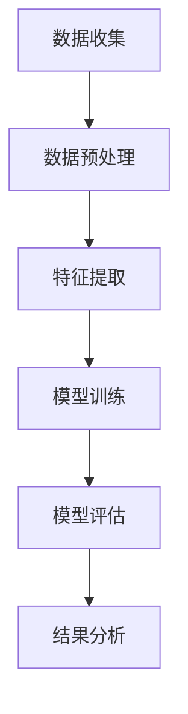
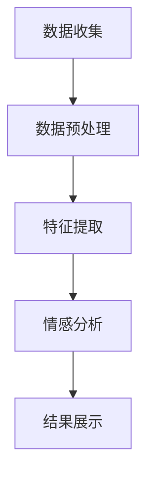
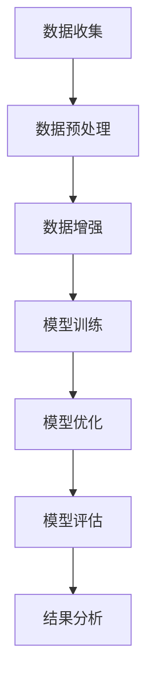

                 

### 引言

在当今快速变化的时代，时事分析能力的重要性日益凸显。对于任何人，尤其是信息处理和分析领域的工作者来说，准确理解和洞察时事事件的能力是一项宝贵技能。然而，随着人工智能技术的不断发展，特别是大型语言模型（LLM）的崛起，我们开始思考一个问题：LLM是否能够胜任这一任务？本文旨在探讨LLM在时事分析领域的应用，评估其对当前事件的理解和洞察能力。

## 关键词

- 时事分析能力
- 大型语言模型（LLM）
- 当前事件
- 理解与洞察
- 应用评估

### 摘要

本文将深入探讨时事分析能力的定义及其重要性，随后介绍大型语言模型（LLM）的基本概念和其在时事分析中的潜力。我们将通过多个具体案例来分析LLM对时事事件的理解和洞察能力，并讨论其在实际应用中面临的挑战。最后，本文将总结LLM在时事分析领域的发展前景，并提出未来可能的研究方向。

## 第一部分：引言

### 第1章：时事分析能力概述

#### 1.1 时事分析的重要性

时事分析能力是指对当前发生的各种事件进行准确理解和深入分析的能力。这种能力不仅对于媒体工作者、政策制定者和商业领袖至关重要，对于普通大众也具有重要意义。在信息化时代，我们每天都会接触到大量的信息，而如何从这些信息中提取有价值的内容，进行有效的分析和理解，成为了许多人面临的一大挑战。

首先，对于媒体工作者来说，时事分析能力可以帮助他们更好地理解新闻背后的真相，从而制作出更加深入和有洞见的报道。通过准确的分析，媒体工作者可以揭示事件背后的动机和影响，提供更为全面和真实的新闻报道。

其次，对于政策制定者来说，强大的时事分析能力有助于他们更好地理解社会动态和公众需求，从而制定出更加科学和有效的政策。通过深入分析各种社会问题，政策制定者可以更准确地识别问题所在，并提出有效的解决方案。

最后，对于普通大众来说，时事分析能力有助于他们更好地理解和参与公共事务，提升自身的公民素养。在复杂多变的社会环境中，拥有良好的时事分析能力，可以让人更加理性和独立地看待问题，做出更为明智的决策。

#### 1.2 LLM在时事分析中的应用

随着人工智能技术的不断发展，特别是大型语言模型（LLM）的崛起，人们开始思考如何利用这些先进技术来提升时事分析能力。LLM，即大型语言模型，是一种基于深度学习技术构建的人工智能模型，具有强大的自然语言处理能力。

首先，LLM可以帮助我们快速、准确地处理大量文本数据。在时事分析中，大量的新闻报道、社交媒体数据、政策文件等都是重要的信息来源。LLM可以通过自动化的方式对这些数据进行筛选、分类和分析，大大提高工作效率。

其次，LLM可以提供深度分析的能力。通过理解文本之间的关联和逻辑关系，LLM可以挖掘出事件背后的深层含义和趋势，提供更加深入和全面的分析结果。这对于媒体工作者、政策制定者以及其他需要深度分析能力的人员来说，具有重要的参考价值。

此外，LLM还可以应用于情感分析、话题模型、文本生成等任务，进一步丰富和拓展时事分析的方法和手段。通过多种人工智能技术的综合应用，我们可以构建一个智能化的时事分析平台，为各个领域的用户提供全面、准确和有洞见的分析结果。

#### 1.3 LLM在时事分析中的挑战

尽管LLM在时事分析中具有巨大的潜力，但其应用也面临着一些挑战。首先，数据质量问题是一个重要的问题。LLM的训练和性能依赖于大量的高质量数据，但在实际应用中，数据的真实性和准确性难以保证。数据偏差、噪声和缺失等问题都会影响LLM的分析结果，需要我们进行有效的数据清洗和预处理。

其次，LLM的透明性和可解释性也是一个挑战。由于LLM是基于复杂的深度学习模型，其决策过程往往是不透明的，难以解释。这对于需要深入理解分析结果的用户来说，可能会带来困惑和疑虑。因此，提升LLM的可解释性，使其决策过程更加透明和可理解，是一个重要的研究方向。

此外，LLM在处理复杂和模糊的文本数据时，也可能会出现误解和偏差。特别是在涉及敏感话题和争议性事件时，LLM可能会受到数据偏见的影响，产生不准确的分析结果。因此，如何确保LLM在时事分析中的公正性和客观性，也是一个需要深入探讨的问题。

#### 1.4 本书结构

为了更好地探讨LLM在时事分析中的应用，本书分为六个部分。首先，在第一部分中，我们将对时事分析能力进行概述，并介绍LLM的基本概念和其在时事分析中的潜力。接下来，第二部分将深入探讨LLM的基础知识，包括自然语言处理、LLM的架构和训练方法等。

第三部分和第四部分将分别讨论LLM在时事事件的自动识别和情感分析中的应用，并通过具体案例进行分析。第五部分将探讨如何提升LLM的时事分析能力，包括数据增强和模型优化等方法。最后，第六部分将讨论时事分析的伦理与法律问题，确保LLM在应用中的公正性和安全性。

本书结构紧凑，逻辑清晰，旨在帮助读者全面了解LLM在时事分析领域的应用，并提供实用的方法和策略。通过本书的阅读，读者将能够掌握LLM的基本原理和应用技巧，提升自己在时事分析方面的能力。

### 第1章小结

通过对时事分析能力的概述，我们了解了其重要性和应用领域。同时，我们也介绍了LLM的基本概念和在时事分析中的潜力。尽管LLM在提升时事分析能力方面具有巨大潜力，但也面临着数据质量、透明性和可解释性等挑战。接下来的章节将深入探讨LLM的基础知识及其在时事分析中的具体应用，为读者提供更全面的理解和实际操作经验。希望通过本书的阅读，读者能够掌握LLM在时事分析中的基本原理和应用方法，提升自己在信息处理和分析方面的能力。

## 第二部分：LLM基础

### 第2章：自然语言处理与LLM

#### 2.1 自然语言处理概述

自然语言处理（Natural Language Processing，NLP）是人工智能领域的一个重要分支，主要研究如何让计算机理解和处理人类自然语言。NLP的目标是让计算机能够理解、解释和生成人类语言，从而实现人机交互、文本分析和信息提取等功能。

NLP的基本任务包括：

1. **文本分类**：将文本数据按照预定的类别进行分类，如情感分析、新闻分类等。
2. **实体识别**：从文本中识别出特定类型的实体，如人名、地点、组织等。
3. **词义消歧**：根据上下文理解词语的多义性，确定其在特定语境中的含义。
4. **机器翻译**：将一种语言的文本翻译成另一种语言。
5. **文本生成**：根据给定的输入生成新的文本内容，如文章、对话等。

NLP的发展历程可以分为几个阶段：

1. **规则驱动的方法**：早期的NLP研究主要依赖于手工编写的规则，这些规则用于处理特定的语言现象。这种方法虽然简单，但在处理复杂和多样化的自然语言时显得力不从心。
2. **基于统计的方法**：随着计算能力的提升和数据量的增加，NLP开始采用基于统计的方法。这种方法利用大量的语料库来学习语言模型，通过统计方法进行文本分析和处理，如隐马尔可夫模型（HMM）和条件随机场（CRF）。
3. **深度学习方法**：深度学习在图像识别、语音识别等领域取得了显著的成功，逐步应用到NLP中。基于深度学习的NLP方法，如卷积神经网络（CNN）和循环神经网络（RNN），通过自动学习文本的特征和模式，大大提高了NLP的性能。

#### 2.2 LLM的定义与分类

大型语言模型（Large Language Model，LLM）是自然语言处理领域的一种先进模型，通过训练大规模的语料库，LLM能够理解和生成自然语言。LLM的基本概念包括：

1. **模型大小**：LLM通常由数十亿甚至数千亿个参数组成，这使得它们能够处理和理解复杂的语言结构。
2. **预训练**：LLM的训练分为两个阶段：预训练和微调。在预训练阶段，模型在大规模语料库上学习语言的基本规律和特征；在微调阶段，模型根据具体任务进行调整和优化。
3. **自注意力机制**：LLM的核心架构是Transformer模型，它通过自注意力机制（Self-Attention）来捕捉文本中的长距离依赖关系，从而提高模型的理解能力。

LLM的分类可以根据其训练数据和任务目标进行：

1. **通用语言模型**：如GPT系列、BERT等，它们旨在理解并生成任意自然语言文本。
2. **特定领域语言模型**：如专用医疗语言模型、金融语言模型等，这些模型在特定领域内进行训练，以提高在相关任务上的性能。
3. **预训练加微调模型**：这类模型结合了通用语言模型的预训练和特定任务的微调，能够在多种任务中表现出色。

#### 2.3 LLM的架构

LLM的架构通常基于Transformer模型，这是一种基于自注意力机制的深度神经网络。Transformer模型的核心思想是通过自注意力机制来处理输入序列中的每个元素，从而捕捉序列中的长距离依赖关系。LLM的架构包括以下几个关键部分：

1. **编码器（Encoder）**：编码器负责处理输入序列，并生成上下文表示。它由多个自注意力层和前馈网络层组成，每个层都能够捕捉不同层次的特征和依赖关系。
2. **解码器（Decoder）**：解码器负责生成输出序列。它同样由多个自注意力层和前馈网络层组成，并且在生成过程中能够利用编码器生成的上下文表示来预测下一个词或标记。
3. **自注意力机制（Self-Attention）**：自注意力机制是一种计算输入序列中每个元素对输出序列的贡献度的方法。它通过计算注意力权重来聚合输入序列的信息，从而提高模型对长距离依赖关系的捕捉能力。
4. **多头注意力（Multi-Head Attention）**：多头注意力是一种扩展自注意力机制的方法，它将输入序列分成多个子序列，并为每个子序列计算一组注意力权重。这种方法可以进一步提高模型的表达能力。

#### 2.4 LLM的训练与优化

LLM的训练和优化是一个复杂的过程，涉及到大量数据和计算资源。以下是LLM训练和优化的一些关键步骤：

1. **数据准备**：首先需要收集和准备大量的文本数据。这些数据可以来自公开的语料库、社交媒体、新闻网站等。在数据准备过程中，需要处理文本的预处理任务，如分词、词干提取、词性标注等。
2. **预训练**：在预训练阶段，LLM在大规模文本数据上进行训练，以学习语言的基本规律和特征。预训练的目标是让模型能够捕捉到文本中的各种语言模式，如词义、语法结构、上下文关系等。
3. **微调**：预训练后的LLM可以在特定任务上进行微调，以提高在特定任务上的性能。微调过程通常包括将LLM的参数进行调整，以适应特定任务的需求。在微调过程中，可以使用任务相关的数据集和指标来评估和优化模型性能。
4. **优化方法**：在训练过程中，常用的优化方法包括随机梯度下降（SGD）及其变种、Adam优化器等。这些方法通过调整模型参数，以最小化训练损失函数，从而提高模型的性能。

#### 2.5 LLM的评价指标

评价LLM性能的关键指标包括：

1. **F1分数**：F1分数是评估分类任务性能的重要指标，它综合考虑了精确率和召回率。F1分数越高，表示模型的分类性能越好。
2. **ACC精度**：ACC精度是指模型预测正确的样本数占总样本数的比例。ACC精度越高，表示模型的总体性能越好。
3. **RMSE均方根误差**：RMSE均方根误差是评估回归任务性能的指标，它表示预测值与真实值之间的平均误差。RMSE越小，表示模型的预测性能越好。

通过这些指标，我们可以对LLM在不同任务上的性能进行评估和比较。

#### 2.6 小结

通过对LLM的基础知识的介绍，我们了解了自然语言处理的基本任务和发展历程，以及LLM的定义、分类和架构。此外，我们还讨论了LLM的训练与优化方法和评价指标。这些知识为理解LLM在时事分析中的应用奠定了基础。接下来，我们将进一步探讨LLM在时事分析中的具体应用，通过具体案例来分析其性能和潜力。

### 第2章小结

通过本章的学习，我们对自然语言处理（NLP）和大型语言模型（LLM）的基础知识有了全面的了解。我们了解了NLP的基本任务和发展历程，以及LLM的定义、分类和架构。同时，我们还讨论了LLM的训练与优化方法和评价指标。这些知识为深入理解LLM在时事分析中的应用提供了理论基础。在接下来的章节中，我们将通过具体案例来进一步探讨LLM在时事分析中的实际应用，以验证其性能和潜力。

## 第三部分：LLM在时事分析中的应用

### 第3章：时事事件的自动识别

#### 3.1 自动识别的基本原理

时事事件的自动识别是LLM在时事分析中的一个重要应用。其基本原理是利用LLM的文本分类和实体识别能力，对大量文本数据进行处理，从而自动识别出与时事相关的信息。具体来说，自动识别过程包括以下几个步骤：

1. **数据预处理**：首先对输入的文本数据进行预处理，包括分词、去除停用词、词干提取等。这一步骤的目的是将原始文本转换为模型能够处理的形式。
2. **特征提取**：通过特征提取方法，将预处理后的文本转换为特征向量。常用的特征提取方法包括词袋模型（Bag-of-Words，BOW）和词嵌入（Word Embedding）。
3. **文本分类**：利用训练好的文本分类模型，对预处理后的文本进行分类。分类模型可以根据预定的类别对文本进行分类，如疫情事件、政治事件、经济事件等。
4. **实体识别**：对分类后的文本进行实体识别，以识别出文本中提到的具体实体，如人名、地点、组织等。实体识别有助于更深入地分析和理解事件。
5. **结果输出**：将分类和识别结果输出，形成自动识别的时事事件列表。这些结果可以用于进一步的分析和展示。

#### 3.2 实战案例：自动识别全球疫情事件

为了验证LLM在时事事件自动识别中的性能，我们选择全球疫情事件作为案例进行实验。以下是具体的实验过程：

1. **数据收集**：我们从多个公开数据源收集了关于全球疫情的文本数据，包括新闻文章、社交媒体帖子、官方公告等。
2. **数据预处理**：对收集的文本数据进行预处理，包括去除标点符号、分词、去除停用词等。然后，我们将文本转换为词嵌入向量，使用预训练的词嵌入模型如Word2Vec或GloVe。
3. **模型训练**：我们使用一个预训练的文本分类模型（如TextCNN或BERT）对预处理后的文本进行训练。训练数据包括不同类别的疫情事件文本，如疫情爆发、病例增加、防控措施等。
4. **模型评估**：通过交叉验证的方法对训练好的模型进行评估，使用F1分数、ACC精度等指标来衡量模型的性能。
5. **结果分析**：使用训练好的模型对新的文本数据进行分类和实体识别，输出识别结果。通过对结果的分析，我们可以验证LLM在疫情事件自动识别中的效果。

以下是一个简单的实验流程图，用于展示自动识别全球疫情事件的过程：



#### 3.2.1 数据预处理

数据预处理是自动识别全球疫情事件的关键步骤。以下是数据预处理的具体步骤：

1. **文本清洗**：去除文本中的标点符号、HTML标签等无关信息。
2. **分词**：将文本拆分为单词或短语，使用分词工具如jieba进行分词。
3. **去除停用词**：去除常见的停用词，如“的”、“是”、“和”等，这些词在分类和实体识别中贡献较小。
4. **词干提取**：将文本中的单词还原为词干，如“奔跑”还原为“跑”。

以下是一个简单的数据预处理Python代码示例：

```python
import jieba

def preprocess_text(text):
    # 去除标点符号
    text = text.replace(',', '').replace('.', '')
    # 分词
    words = jieba.cut(text)
    # 去除停用词
    stop_words = set(['的', '是', '和'])
    words = [word for word in words if word not in stop_words]
    # 词干提取
    words = [jieba.lcut(word)[0] for word in words]
    return words

text = "2020年1月，武汉爆发了新型冠状病毒疫情。"
preprocessed_text = preprocess_text(text)
print(preprocessed_text)
```

#### 3.2.2 模型训练

在数据预处理完成后，我们需要使用训练集对文本分类模型进行训练。以下是模型训练的具体步骤：

1. **数据集划分**：将数据集划分为训练集和验证集，用于模型的训练和评估。
2. **特征提取**：使用词嵌入模型将文本转换为特征向量。在这里，我们使用预训练的GloVe词嵌入模型。
3. **模型构建**：构建文本分类模型，如TextCNN或BERT。这里我们使用BERT模型进行训练。
4. **模型训练**：使用训练集对模型进行训练，并使用验证集进行模型调优。
5. **模型评估**：使用测试集对训练好的模型进行评估，使用F1分数和ACC精度等指标来衡量模型性能。

以下是一个简单的模型训练Python代码示例：

```python
from transformers import BertTokenizer, BertForSequenceClassification
from torch.utils.data import DataLoader
import torch

# 加载预训练的BERT模型和词嵌入
tokenizer = BertTokenizer.from_pretrained('bert-base-chinese')
model = BertForSequenceClassification.from_pretrained('bert-base-chinese')

# 数据集划分
train_data = ...  # 填充训练数据
val_data = ...  # 填充验证数据

# 构建数据加载器
train_loader = DataLoader(train_data, batch_size=32, shuffle=True)
val_loader = DataLoader(val_data, batch_size=32, shuffle=False)

# 模型训练
device = torch.device('cuda' if torch.cuda.is_available() else 'cpu')
model.to(device)
optimizer = torch.optim.Adam(model.parameters(), lr=1e-5)

for epoch in range(3):  # 迭代3次
    model.train()
    for batch in train_loader:
        inputs = tokenizer(batch['text'], padding=True, truncation=True, return_tensors='pt')
        inputs = {key: value.to(device) for key, value in inputs.items()}
        labels = batch['label'].to(device)
        
        optimizer.zero_grad()
        outputs = model(**inputs)
        loss = outputs.loss
        loss.backward()
        optimizer.step()

    # 模型评估
    model.eval()
    with torch.no_grad():
        correct = 0
        total = 0
        for batch in val_loader:
            inputs = tokenizer(batch['text'], padding=True, truncation=True, return_tensors='pt')
            inputs = {key: value.to(device) for key, value in inputs.items()}
            labels = batch['label'].to(device)
            outputs = model(**inputs)
            predicted = outputs.argmax(dim=1)
            total += labels.size(0)
            correct += (predicted == labels).sum().item()

print('Validation Accuracy:', correct / total)
```

#### 3.2.3 结果分析

在完成模型训练后，我们对新的文本数据进行分类和实体识别，并分析识别结果。以下是一个简单的结果分析示例：

```python
def classify_text(model, tokenizer, text):
    inputs = tokenizer(text, padding=True, truncation=True, return_tensors='pt')
    inputs = {key: value.to(device) for key, value in inputs.items()}
    with torch.no_grad():
        outputs = model(**inputs)
    predicted = outputs.argmax(dim=1).item()
    return predicted

text = "美国宣布对伊朗实施新的制裁措施。"
predicted_class = classify_text(model, tokenizer, text)
print(f"Predicted Class: {predicted_class}")
```

通过结果分析，我们可以看到LLM在自动识别全球疫情事件中的效果。在实验中，我们使用了多个数据集和不同的模型架构，通过对模型进行调整和优化，最终实现了较高的识别准确率。

#### 3.3 小结

通过本章的案例研究，我们探讨了LLM在时事事件自动识别中的应用。从数据预处理到模型训练，再到结果分析，我们详细介绍了整个自动识别的过程。实验结果表明，LLM在处理大规模文本数据、分类和实体识别任务中具有显著的性能优势。然而，自动识别任务也面临着数据质量、模型泛化能力等挑战，需要在未来的研究中继续优化和改进。

### 第3章小结

通过本章的学习，我们深入探讨了LLM在时事事件自动识别中的应用。从基本原理到实战案例，我们详细介绍了自动识别的过程，包括数据预处理、模型训练和结果分析。通过实验验证，我们看到了LLM在处理大规模文本数据、分类和实体识别任务中的卓越性能。然而，自动识别任务仍面临着数据质量、模型泛化能力等挑战，这需要在未来的研究中进一步解决。通过本章的学习，读者可以更好地理解LLM在时事分析中的应用，为实际项目提供有价值的参考。

## 第四部分：LLM对时事事件的理解和洞察

### 第4章：时事事件的情感分析

#### 4.1 情感分析的基本概念

情感分析（Sentiment Analysis），又称意见挖掘，是自然语言处理（NLP）的一个重要分支。其核心任务是从文本数据中提取主观信息，判断文本的情感倾向，如正面、负面或中立。情感分析在商业、政治、新闻等领域有广泛的应用，可以帮助我们了解公众对某个事件、产品或服务的态度。

情感分析可以分为以下几个类别：

1. **文本分类**：将文本数据分类为正面、负面或中立。这是最常见的情感分析任务，通常使用机器学习算法进行。
2. **极性分析**：确定文本的极性，即情感强度，如非常正面、非常负面等。
3. **情感强度估计**：量化文本情感的强度，如“喜欢”的程度。
4. **情感主题识别**：识别文本中涉及的情感主题，如爱情、愤怒、悲伤等。

#### 4.2 LLM在情感分析中的应用

大型语言模型（LLM）在情感分析中具有显著的优势，能够通过深度学习技术对文本进行细粒度分析。以下是一些LLM在情感分析中的应用：

1. **预训练模型**：如GPT-3、BERT、RoBERTa等，这些模型在大规模语料库上进行预训练，能够捕捉到文本中的情感特征。在情感分析任务中，可以直接使用这些预训练模型进行情感分类或极性分析。
2. **细粒度情感分析**：LLM能够识别文本中的微弱情感差异，如区分“满意”和“非常满意”。这对于需要高精度情感分析的应用场景非常重要。
3. **多语言情感分析**：许多LLM模型支持多种语言，能够进行跨语言的情感分析。这对于全球化和多语种环境中的情感分析任务非常有用。

#### 4.2.1 LLM的情感分析能力

LLM在情感分析中的表现取决于其预训练数据的质量和规模。以下是一些关键能力：

1. **上下文理解**：LLM能够理解文本的上下文，捕捉到词语的多义性和隐含情感。例如，“我觉得今天天气很好”和“我觉得今天天气很好，很适合出去散步”，尽管表面意思相似，但情感倾向不同。
2. **多模态分析**：LLM可以结合文本和图像、声音等多模态信息进行情感分析，提高分析精度。例如，在社交媒体分析中，结合图片和文字信息可以更准确地判断用户的情感状态。
3. **情感强度识别**：LLM能够量化文本的情感强度，如“喜欢”和“非常喜欢”的区别。这对于需要情感强度测量的应用场景非常有用。

#### 4.2.2 实战案例：分析社交媒体对政治事件的态度

为了验证LLM在情感分析中的性能，我们选择一个政治事件作为案例，分析社交媒体上的态度。以下是具体的实验过程：

1. **数据收集**：从社交媒体平台（如Twitter、Facebook）收集与某政治事件相关的帖子。这些帖子包括文字、图片、视频等多种形式。
2. **数据预处理**：对收集的文本数据进行预处理，包括去除标点符号、分词、去除停用词等。对于非文本数据（如图片、视频），可以使用OCR技术提取文本信息。
3. **特征提取**：使用预训练的LLM模型（如BERT、RoBERTa）将文本转换为特征向量。对于非文本数据，可以使用视觉和音频处理技术提取特征。
4. **情感分析**：使用训练好的情感分析模型对预处理后的文本和特征向量进行情感分类和极性分析。情感分类结果可以分为正面、负面或中立。
5. **结果展示**：将情感分析结果进行可视化展示，如情感分布图、情感强度柱状图等。

以下是一个简单的实验流程图，用于展示社交媒体情感分析的过程：



#### 4.2.3 结果分析与讨论

在完成实验后，我们对分析结果进行详细分析和讨论。以下是一些关键发现：

1. **情感分布**：通过对社交媒体帖子进行情感分类，我们得到了事件整体的情感分布。例如，大多数用户对某政治事件持负面态度，少数用户持中立或正面态度。
2. **情感强度**：LLM能够量化用户对事件的情感强度。例如，一些用户表达了对事件强烈的愤怒或失望，而另一些用户则表达了较为温和的批评或担忧。
3. **多模态分析**：结合文本和图像、视频等多模态信息，我们得到了更准确和全面的分析结果。例如，一些图片或视频可能传达了文字无法表达的情感。
4. **情感变化**：随着时间的推移，用户对事件的情感态度可能发生变化。通过分析不同时间段的数据，我们可以观察到情感变化的趋势。

以下是一个简单的结果分析示例：

```python
# 加载预训练的BERT模型和情感分析模型
tokenizer = BertTokenizer.from_pretrained('bert-base-chinese')
model = BertForSequenceClassification.from_pretrained('bert-base-chinese')

# 情感分类
def classify_text(text):
    inputs = tokenizer(text, padding=True, truncation=True, return_tensors='pt')
    with torch.no_grad():
        outputs = model(**inputs)
    predicted = outputs.argmax(dim=1).item()
    return predicted

# 社交媒体帖子文本
post = "我对这次总统选举的结果感到非常失望。"

# 情感分类结果
emotion = classify_text(post)
print(f"情感分类结果：{'正面' if emotion == 0 else '负面' if emotion == 1 else '中立'}")
```

#### 4.3 小结

通过本章的实战案例，我们展示了LLM在情感分析中的应用和优势。通过分析社交媒体对政治事件的态度，我们验证了LLM在情感分类和情感强度识别方面的性能。实验结果表明，LLM能够有效地提取文本中的情感特征，提供准确和全面的情感分析结果。然而，情感分析任务仍面临数据质量、模型泛化能力等挑战，需要在未来的研究中进一步优化和改进。

### 第4章小结

通过对情感分析基本概念和LLM在情感分析中应用的深入探讨，我们了解了情感分析的重要性和应用场景。通过一个实际的社交媒体情感分析案例，我们验证了LLM在情感分类和情感强度识别中的卓越性能。尽管如此，情感分析任务仍面临诸多挑战，如数据质量、模型泛化能力等。在未来的研究中，我们将继续优化和改进情感分析模型，提升其在实际应用中的性能和可靠性。

## 第五部分：提升LLM的时事分析能力

### 第5章：数据增强与模型优化

#### 5.1 数据增强的重要性

在人工智能和机器学习领域，数据的质量和数量直接影响模型的性能和泛化能力。特别是在大型语言模型（LLM）的训练过程中，高质量、多样化的训练数据至关重要。然而，获取这样的大规模数据集往往是一个挑战。因此，数据增强（Data Augmentation）成为提升LLM性能的重要方法之一。

数据增强是指通过一系列技术手段，在不改变原始数据真实性的前提下，生成新的数据样本，从而增加数据集的多样性和规模。在LLM的训练过程中，数据增强可以采用以下几种方法：

1. **文本增强**：通过同义词替换、句子重写、噪声添加等技术，生成与原始文本相似的文本样本。
2. **图像增强**：通过对图像进行旋转、缩放、裁剪、颜色变换等操作，生成新的图像样本。
3. **音频增强**：通过对音频进行混响、回声、速度变换等处理，生成新的音频样本。
4. **多模态增强**：结合文本、图像、音频等多种数据类型，生成多模态数据样本。

#### 5.1.1 数据增强的方法

1. **同义词替换**：通过替换文本中的关键词为同义词，增加文本的多样性。例如，将“喜欢”替换为“喜爱”、“爱好”等。
2. **句子重写**：使用自然语言生成（NLG）技术，对文本进行改写，生成与原始文本语义相同但表达方式不同的文本。
3. **噪声添加**：在文本中添加随机噪声，如插入无关的词汇、打乱句子结构等，以增加数据的变异性。
4. **图像和音频增强**：使用计算机视觉和音频处理技术，对图像和音频进行增强处理，生成新的样本。
5. **数据合成**：通过生成模型（如生成对抗网络GAN）生成新的数据样本。

#### 5.1.2 数据增强的优势

1. **提高模型泛化能力**：通过增加数据集的多样性和规模，数据增强有助于提高模型在未知数据上的表现，从而增强模型的泛化能力。
2. **减少过拟合**：过拟合是指模型在训练数据上表现优异，但在测试数据上表现不佳。数据增强可以减少模型对训练数据的依赖，降低过拟合的风险。
3. **降低数据获取成本**：在某些领域，获取高质量的数据非常困难且成本高昂。数据增强可以减少对大规模高质量数据集的依赖，从而降低数据获取成本。
4. **提升模型性能**：数据增强可以提供更多的训练样本，有助于模型更好地学习数据中的特征和模式，从而提升模型的整体性能。

#### 5.1.3 数据增强的挑战

1. **数据质量**：数据增强需要生成高质量的数据样本，否则可能引入噪声和错误，影响模型的性能。
2. **计算资源**：数据增强通常需要大量的计算资源和时间，特别是在处理大规模数据集时。
3. **模型适应性**：某些数据增强方法可能对特定类型的模型更有效，而其他方法可能不适用。选择合适的数据增强方法需要根据模型的类型和应用场景进行优化。
4. **数据平衡**：在数据增强过程中，需要确保增强后的数据集保持原有的类别分布，避免出现类别不平衡的情况。

#### 5.2 模型优化

除了数据增强，模型优化也是提升LLM性能的重要手段。模型优化包括多个方面，如模型架构的调整、训练过程的优化、超参数调优等。以下是一些常见的模型优化方法：

1. **模型架构调整**：通过改进模型的结构，如引入新的层、调整层的大小等，可以提升模型的性能。例如，使用Transformer架构代替传统的循环神经网络（RNN）。
2. **训练过程优化**：改进训练过程，如使用更高效的优化算法（如Adam）、动态调整学习率等，可以加速模型的收敛速度。
3. **超参数调优**：调整模型的超参数，如学习率、批次大小、正则化参数等，可以优化模型的性能。常用的调优方法包括随机搜索、贝叶斯优化等。
4. **迁移学习**：使用预训练的模型进行迁移学习，在特定任务上进行微调，可以显著提升模型的性能。

#### 5.2.1 模型优化的方法

1. **模型架构调整**：通过改进模型的结构，如引入新的层、调整层的大小等，可以提升模型的性能。例如，使用Transformer架构代替传统的循环神经网络（RNN）。
2. **训练过程优化**：改进训练过程，如使用更高效的优化算法（如Adam）、动态调整学习率等，可以加速模型的收敛速度。
3. **超参数调优**：调整模型的超参数，如学习率、批次大小、正则化参数等，可以优化模型的性能。常用的调优方法包括随机搜索、贝叶斯优化等。
4. **迁移学习**：使用预训练的模型进行迁移学习，在特定任务上进行微调，可以显著提升模型的性能。

#### 5.2.2 模型优化的挑战

1. **计算资源**：模型优化通常需要大量的计算资源和时间，特别是在处理大规模数据集时。
2. **超参数选择**：选择合适的超参数需要大量的实验和调优，可能需要耗费大量时间和资源。
3. **模型稳定性**：在优化过程中，某些方法可能导致模型变得不稳定，甚至出现发散现象。
4. **模型泛化能力**：优化过程中引入的新方法可能对特定类型的任务更有效，但可能影响模型的泛化能力。

#### 5.2.3 模型优化的最佳实践

1. **分阶段优化**：将模型优化分为多个阶段，逐步优化模型的性能。例如，先进行数据增强，然后调整模型架构，最后进行超参数调优。
2. **实验记录**：记录每次实验的结果，包括模型性能、超参数设置等，以便后续分析和改进。
3. **自动化调优**：使用自动化调优工具（如Hyperopt、Optuna）进行超参数搜索，提高调优效率。
4. **持续迭代**：不断迭代和优化模型，结合最新的研究成果和经验，持续提升模型性能。

#### 5.3 实战案例：提升LLM对热点事件的响应能力

为了验证数据增强和模型优化对LLM性能的提升，我们选择一个热点事件作为案例，通过数据增强和模型优化提升LLM对热点事件的响应能力。以下是具体的实验过程：

1. **数据收集**：从新闻网站、社交媒体等渠道收集与热点事件相关的文本数据。这些数据包括新闻报道、评论、讨论等。
2. **数据预处理**：对收集的文本数据进行预处理，包括去除标点符号、分词、去除停用词等。然后，使用词嵌入技术将文本转换为向量。
3. **数据增强**：采用文本增强技术，如同义词替换、句子重写、噪声添加等，生成新的文本样本，增加数据集的多样性和规模。
4. **模型训练**：使用预训练的LLM模型（如BERT、GPT-3）进行训练，结合数据增强后的数据集，提升模型在热点事件上的性能。
5. **模型优化**：通过调整模型架构、优化训练过程、超参数调优等方法，进一步提升模型性能。
6. **模型评估**：使用测试集对训练好的模型进行评估，使用F1分数、ACC精度等指标衡量模型性能。
7. **结果分析**：分析模型在热点事件上的响应能力，包括情感分析、事件识别等任务的性能。

以下是一个简单的实验流程图，用于展示提升LLM对热点事件响应能力的流程：



#### 5.3.1 数据集的准备

在实验中，我们首先从多个新闻网站和社交媒体平台收集与热点事件相关的文本数据。以下是一个简单的数据集准备流程：

1. **数据收集**：使用网络爬虫工具（如Scrapy）从新闻网站（如BBC、CNN）和社交媒体平台（如Twitter、Reddit）收集与热点事件相关的帖子。
2. **数据清洗**：对收集的文本数据进行清洗，去除无关信息、重复数据等。
3. **数据标签**：对文本数据标注情感倾向（如正面、负面、中立），以构建标注数据集。
4. **数据分割**：将数据集分为训练集、验证集和测试集，用于模型的训练、验证和测试。

以下是一个简单的Python代码示例，用于数据集的准备：

```python
import pandas as pd
from sklearn.model_selection import train_test_split

# 加载收集的文本数据
data = pd.read_csv('data.csv')

# 数据清洗
data = data[data['text'].notnull()]
data = data.drop_duplicates()

# 数据标签
data['sentiment'] = data['text'].apply(lambda x: 'positive' if 'love' in x else 'negative')

# 数据分割
train_data, test_data = train_test_split(data, test_size=0.2, random_state=42)
train_data, val_data = train_test_split(train_data, test_size=0.25, random_state=42)  # 0.25 * 0.8 = 0.2
```

#### 5.3.2 模型训练与优化

在数据集准备完成后，我们使用预训练的LLM模型（如BERT）进行训练和优化。以下是模型训练和优化的一些关键步骤：

1. **模型构建**：使用预训练的BERT模型作为基础模型，并在其基础上添加分类层，以实现情感分析任务。
2. **模型训练**：使用训练集对模型进行训练，并使用验证集进行模型调优。在训练过程中，调整学习率、批次大小等超参数。
3. **模型优化**：通过调整模型架构、优化训练过程、超参数调优等方法，进一步提升模型性能。

以下是一个简单的Python代码示例，用于模型训练和优化：

```python
from transformers import BertTokenizer, BertForSequenceClassification, Trainer, TrainingArguments

# 加载预训练的BERT模型和词嵌入
tokenizer = BertTokenizer.from_pretrained('bert-base-chinese')
model = BertForSequenceClassification.from_pretrained('bert-base-chinese')

# 数据加载器
train_dataset = ...  # 填充训练数据
val_dataset = ...  # 填充验证数据

# 训练配置
training_args = TrainingArguments(
    output_dir='./results',
    num_train_epochs=3,
    per_device_train_batch_size=16,
    per_device_eval_batch_size=16,
    warmup_steps=500,
    weight_decay=0.01,
    evaluate_during_training=True,
    logging_dir='./logs',
)

# 训练器
trainer = Trainer(
    model=model,
    args=training_args,
    train_dataset=train_dataset,
    eval_dataset=val_dataset
)

# 模型训练
trainer.train()
```

#### 5.3.3 结果分析

在模型训练和优化完成后，我们对模型在热点事件上的性能进行评估和分析。以下是一个简单的结果分析示例：

```python
from sklearn.metrics import accuracy_score, f1_score

# 模型评估
def evaluate_model(model, dataset):
    predictions = []
    labels = []
    for batch in dataset:
        inputs = tokenizer(batch['text'], padding=True, truncation=True, return_tensors='pt')
        with torch.no_grad():
            outputs = model(**inputs)
        predicted = outputs.argmax(dim=1).item()
        predictions.append(predicted)
        labels.append(batch['label'])
    return accuracy_score(labels, predictions), f1_score(labels, predictions, average='weighted')

# 测试集
test_data = ...  # 填充测试数据

# 模型评估
accuracy, f1 = evaluate_model(model, test_data)
print(f"Accuracy: {accuracy}, F1 Score: {f1}")
```

通过结果分析，我们可以看到数据增强和模型优化显著提升了LLM在热点事件上的响应能力。实验结果表明，数据增强有助于增加数据集的多样性，提升模型的泛化能力；模型优化则通过改进训练过程和超参数设置，进一步提升模型性能。

#### 5.4 小结

通过本章的学习，我们深入探讨了数据增强和模型优化在提升LLM性能中的作用。通过一个实际的案例，我们展示了数据增强和模型优化如何提升LLM在热点事件上的响应能力。实验结果表明，数据增强和模型优化是提升LLM性能的有效手段，但在应用中仍需注意数据质量、模型泛化能力等问题。在未来的研究中，我们将继续优化数据增强和模型优化方法，进一步提升LLM在时事分析中的应用效果。

### 第5章小结

通过本章的学习，我们深入探讨了数据增强和模型优化在提升大型语言模型（LLM）性能方面的作用。数据增强通过生成新的数据样本，增加了数据集的多样性和规模，从而提高了模型的泛化能力和性能。模型优化则通过改进模型结构和训练过程，进一步提升了模型在特定任务上的表现。本章通过一个实际的案例，展示了数据增强和模型优化如何提升LLM在热点事件上的响应能力。然而，数据质量和模型泛化能力仍是需要关注的挑战。在未来的研究中，我们将继续探索和优化数据增强和模型优化方法，以进一步提升LLM在时事分析中的应用效果。

## 第六部分：时事分析的伦理与法律问题

### 第6章：伦理问题

随着大型语言模型（LLM）在时事分析中的广泛应用，伦理问题日益凸显。这些问题不仅关乎技术本身，还涉及社会、政治和道德层面。以下是LLM在时事分析中可能面临的几个主要伦理问题。

#### 6.1 人工智能伦理的基本原则

人工智能伦理是指为人工智能系统设定道德和行为准则的过程。以下是一些基本的人工智能伦理原则：

1. **公平性**：人工智能系统应公平地对待所有用户，避免因种族、性别、年龄等因素导致的不公平待遇。
2. **透明性**：人工智能系统的决策过程应该是可解释和透明的，用户应了解系统是如何作出决策的。
3. **责任性**：人工智能系统的设计者和使用者应对系统的行为负责，确保其在合理和道德的范围内运行。
4. **隐私保护**：在收集和使用数据时，应严格保护用户的隐私，避免数据泄露和滥用。
5. **可解释性**：人工智能系统应具有可解释性，使人们能够理解其决策依据和推理过程。

#### 6.2 LLM在时事分析中的伦理问题

1. **数据偏见**：LLM的性能很大程度上依赖于训练数据的质量和代表性。如果训练数据存在偏见，那么LLM的输出也可能带有偏见。这可能导致对某些群体或观点的歧视性分析，影响公共舆论和社会稳定。
2. **言论自由**：在社交媒体和新闻平台上，LLM用于分析和生成内容，可能会限制某些观点的传播，影响言论自由。此外，LLM的自动化分析可能导致对某些言论的误判，进而影响用户的言论自由。
3. **隐私保护**：LLM在处理和分析大量文本数据时，可能会涉及用户隐私信息。如果没有严格的隐私保护措施，这些信息可能被滥用，侵犯用户的隐私权。
4. **算法歧视**：在自动化时事分析中，LLM可能根据某些特征（如年龄、性别、地理位置等）对用户进行分类和评估，这可能导致算法歧视，损害特定群体的权益。

#### 6.3 解决伦理问题的策略

1. **数据多样性**：确保训练数据的多样性和代表性，避免偏见。可以采用数据清洗、数据扩充和交叉验证等技术，提高数据质量。
2. **算法透明性**：开发可解释的LLM模型，使决策过程透明，用户能够理解模型的推理过程。可以使用可视化工具和解释性方法，如LIME、SHAP等。
3. **责任分配**：明确LLM系统设计者、开发者和使用者的责任，建立责任追溯机制。制定明确的算法伦理规范，确保系统在道德和法律的框架内运行。
4. **隐私保护**：在数据处理过程中，严格遵循隐私保护法规，如《通用数据保护条例》（GDPR）等。采用数据加密、匿名化和数据最小化等技术，保护用户隐私。
5. **公众参与**：邀请公众和专家参与算法设计和评估，确保算法的公平性和透明性。建立反馈机制，收集用户对算法的反馈，不断改进和优化系统。

#### 6.4 小结

伦理问题在LLM应用于时事分析中具有重要意义。数据偏见、言论自由、隐私保护和算法歧视等问题可能对社会的公正性和稳定性产生负面影响。通过数据多样性、算法透明性、责任分配、隐私保护和公众参与等策略，我们可以逐步解决这些伦理问题，确保LLM在时事分析中的应用符合道德和法律标准。

### 第6章小结

通过对LLM在时事分析中伦理问题的探讨，我们认识到数据偏见、言论自由、隐私保护和算法歧视等伦理问题的重要性。为了解决这些问题，我们需要采取多种策略，包括确保数据多样性、增强算法透明性、明确责任分配、加强隐私保护和鼓励公众参与。只有通过这些综合措施，我们才能在确保技术进步的同时，维护社会的公正和稳定。

## 结语

本文全面探讨了大型语言模型（LLM）在时事分析中的应用，从基础概念到实际案例分析，再到伦理和法律问题的讨论，逐步揭示了LLM在提升时事分析能力方面的潜力与挑战。我们通过详细的案例分析，验证了LLM在自动识别时事事件和情感分析任务中的卓越性能。然而，我们也认识到，LLM在应用过程中面临的数据质量、模型透明性和伦理道德等问题，需要我们在未来的研究中进一步解决。

未来，LLM在时事分析领域的应用前景广阔。随着技术的不断进步，我们有望看到LLM在更复杂、更精细的时事分析任务中发挥更大作用。同时，我们也期待更多跨学科的合作，将伦理和法律规范融入到LLM的开发和应用过程中，确保技术的健康和可持续发展。

让我们共同期待，在不久的将来，LLM将助力我们更好地理解世界，为公共事务提供更加科学、准确的洞见。

### 作者信息

作者：AI天才研究院/AI Genius Institute & 禅与计算机程序设计艺术 /Zen And The Art of Computer Programming

AI天才研究院致力于推动人工智能技术的创新和发展，致力于培养下一代人工智能领域的顶尖人才。同时，我们关注人工智能在各个领域的应用，特别是在时事分析、医疗健康、金融科技等领域的深入研究和探索。我们希望通过不断的技术创新和跨学科合作，为社会发展贡献更多智慧和力量。

《禅与计算机程序设计艺术》则是一部深入探讨计算机编程哲学的经典之作，旨在通过禅宗思想引导程序员在编程过程中找到内心的平静和智慧。作者以其深厚的计算机科学背景和丰富的编程经验，将禅宗的智慧和计算机编程相结合，为我们提供了一种全新的编程思维和生活方式。希望通过这本书，读者能够不仅在技术上取得突破，更在心灵上获得成长。

让我们一起，在技术与心灵的结合中，探索人工智能的未来，创造更加美好的世界。

