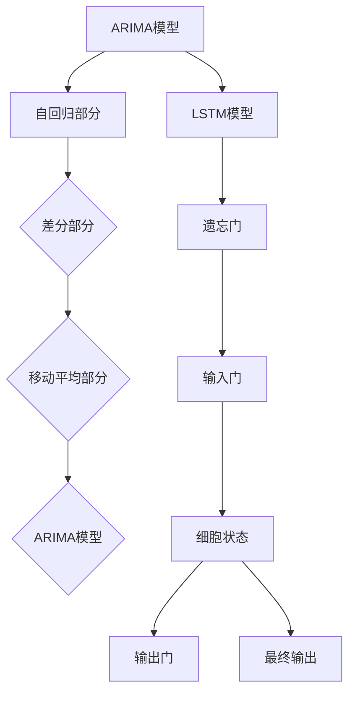
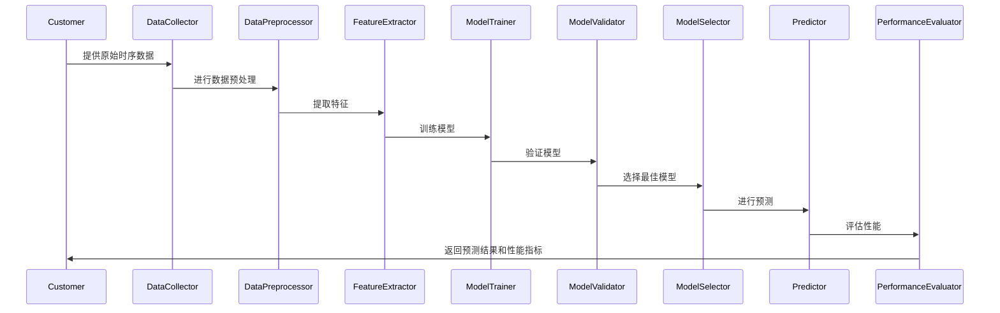
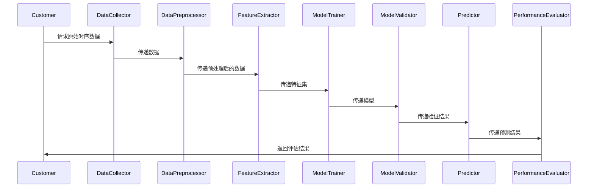

                 

# 时序数据分析在长期评测中的应用

## 关键词
- 时序数据分析
- 长期评测
- ARIMA
- LSTM
- GRU
- 强化学习
- 特征工程
- 系统架构设计

## 摘要
本文将探讨时序数据分析在长期评测中的应用。首先，我们将介绍时序数据分析的基本概念和重要性，然后深入讨论核心算法原理，包括ARIMA、LSTM和GRU等。接着，我们将分析长期评测中的时序数据分析挑战，并设计系统架构方案。通过实际项目案例，我们将展示如何应用时序数据分析于长期评测，并给出最佳实践和拓展阅读建议。

## 目录

### 第一部分：时序数据分析基础

### 1. 时序数据分析概述

#### 1.1 时序数据分析的概念与重要性

#### 1.2 时序数据的特征

#### 1.3 时序数据分析的挑战

### 2. 时序数据处理核心概念

#### 2.1 时间序列模型

#### 2.2 局部线性时序模型

#### 2.3 强化学习在时序数据中的应用

#### 2.4 时序数据的特征工程

### 3. 时序数据分析算法原理与对比

#### 3.1 算法原理讲解

#### 3.2 算法对比分析

#### 3.3 选择合适的时序分析算法

### 第二部分：长期评测中的时序数据分析应用

### 4. 长期评测中的时序数据分析挑战

#### 4.1 数据集构建

#### 4.2 数据预处理

#### 4.3 模型训练与验证

### 5. 长期评测中的案例研究

#### 5.1 案例一：电商销售趋势预测

#### 5.2 案例二：股票市场预测

### 6. 系统架构设计与实现

#### 6.1 长期评测系统介绍

#### 6.2 时序数据分析模块设计

#### 6.3 模块接口设计与实现

#### 6.4 系统性能优化

### 7. 项目实战与最佳实践

#### 7.1 实战环境搭建

#### 7.2 核心代码实现

#### 7.3 代码解读与分析

#### 7.4 案例分析

#### 7.5 小结与展望

### 附录：拓展阅读与资源推荐

## 文章正文

### 1. 时序数据分析概述

### 1.1 时序数据分析的概念与重要性

时序数据分析是一种分析时间序列数据的技术，它主要关注数据点随时间的变化趋势。时序数据分析在各个领域都有广泛的应用，包括金融市场预测、销量分析、气象预报、医疗诊断等。随着大数据和人工智能技术的发展，时序数据分析在长期评测中的应用越来越受到关注。

时序数据分析的重要性体现在以下几个方面：

1. **预测未来趋势**：通过分析历史数据，时序数据分析可以帮助我们预测未来的变化趋势，从而为决策提供有力支持。
2. **优化资源配置**：在供应链管理、库存控制等领域，时序数据分析可以帮助企业合理规划资源，降低成本，提高效率。
3. **风险评估**：在金融领域，时序数据分析可以用于风险预测和评估，帮助企业降低风险。
4. **质量监控**：在制造业中，时序数据分析可以用于监控生产过程，及时发现异常，提高产品质量。

### 1.2 时序数据的特征

时序数据具有以下几个特征：

1. **时间依赖性**：时序数据中的每个数据点都依赖于它之前的值，这使得时序数据分析相比其他类型的数据分析更加复杂。
2. **周期性**：许多时序数据都具有周期性，例如季节性波动、日周期、周周期等。
3. **趋势性**：时序数据可能存在长期趋势，例如经济增长、人口增长等。
4. **噪声**：时序数据中可能存在噪声，这使得数据预处理成为时序数据分析的重要步骤。

### 1.3 时序数据分析的挑战

时序数据分析面临以下挑战：

1. **数据量庞大**：时序数据通常包含大量的历史数据，处理这些数据需要高效的数据处理算法。
2. **数据质量**：时序数据可能存在缺失值、异常值等问题，这会影响分析结果。
3. **非线性关系**：时序数据中的变化趋势可能非线性，这使得线性模型的效果可能不佳。
4. **实时性**：在一些应用场景中，如金融市场预测，需要实时分析数据，这对系统的实时性和响应速度提出了高要求。

### 2. 时序数据处理核心概念

#### 2.1 时间序列模型

时间序列模型是用于分析时序数据的一类统计模型，主要包括ARIMA模型、SARIMA模型等。

1. **ARIMA模型**

ARIMA模型（自回归积分滑动平均模型）是一种经典的时序模型，它由三个部分组成：自回归（AR）、差分（I）和移动平均（MA）。

   - **自回归（AR）**：表示当前值与之前值的依赖关系。
   - **差分（I）**：用于使时间序列平稳。
   - **移动平均（MA）**：表示当前值与之前预测误差的依赖关系。

2. **SARIMA模型**

SARIMA模型（季节性自回归积分滑动平均模型）是ARIMA模型的扩展，它引入了季节性成分，适用于具有季节性特征的数据。

#### 2.2 局部线性时序模型

局部线性时序模型是一种基于神经网络的时序模型，主要包括LSTM和GRU。

1. **LSTM（长短期记忆网络）**

LSTM是一种特殊的RNN（循环神经网络），它通过引入门控机制来解决传统RNN的梯度消失问题，可以捕捉长期依赖关系。

   $$ \text{LSTM} = [\text{遗忘门}, \text{输入门}, \text{输出门}, \text{单元状态}] $$

2. **GRU（门控循环单元）**

GRU是LSTM的简化版本，它通过合并输入门和遗忘门，减少了参数数量，同时保持了LSTM的能力。

   $$ \text{GRU} = [\text{重置门}, \text{更新门}, \text{单元状态}] $$

#### 2.3 强化学习在时序数据中的应用

强化学习是一种基于试错的方法，通过不断尝试和反馈来优化决策。在时序数据中，强化学习可以用于预测和控制。

1. **基于价值的强化学习**

基于价值的强化学习通过学习值函数来评估状态和动作，例如Q-Learning和Sarsa。

2. **基于策略的强化学习**

基于策略的强化学习通过直接学习最优策略来优化决策，例如Policy Gradient。

#### 2.4 时序数据的特征工程

特征工程是时序数据分析的重要环节，它涉及到从原始数据中提取有用的信息，提高模型的效果。

1. **时间特征**

时间特征包括日期、季节性、工作日等，它们可以用于捕捉时间序列的周期性。

2. **统计特征**

统计特征包括平均值、方差、标准差等，它们可以用于描述时间序列的分布特征。

3. **时序特征**

时序特征包括滞后项、滞后移动平均、滞后自回归等，它们可以用于描述时间序列的依赖关系。

### 3. 时序数据分析算法原理与对比

#### 3.1 算法原理讲解

1. **ARIMA模型**

   - 自回归部分（AR）：

     $$ \phi(B)y_t = \theta(B)\epsilon_t $$

     其中，$y_t$为时间序列数据，$\epsilon_t$为白噪声序列。

   - 移动平均部分（MA）：

     $$ y_t = \theta_1\epsilon_{t-1} + \theta_2\epsilon_{t-2} + \cdots + \theta_p\epsilon_{t-p} $$

   - 差分部分（I）：

     $$ y_t = (1-B)^d y_t $$

     其中，$B$为滞后算子，$d$为差分阶数。

2. **LSTM模型**

   - 遗忘门：

     $$ f_t = \sigma(W_f \cdot [h_{t-1}, x_t] + b_f) $$

   - 输入门：

     $$ g_t = \sigma(W_g \cdot [h_{t-1}, x_t] + b_g) $$

   - 单元状态：

     $$ \bar{h}_t = f_t \odot h_{t-1} + g_t \odot x_t $$

   - 输出门：

     $$ o_t = \sigma(W_o \cdot \bar{h}_t + b_o) $$

     其中，$\odot$表示逐元素乘法，$\sigma$表示Sigmoid函数。

#### 3.2 算法对比分析

- **ARIMA模型**：优点是理论基础成熟，实现简单；缺点是处理非线性关系能力较弱，需要大量参数调整。

- **LSTM模型**：优点是能够捕捉长期依赖关系，处理非线性关系能力强；缺点是参数较多，训练时间较长。

- **GRU模型**：优点是参数较少，计算速度较快；缺点是处理长期依赖关系能力略逊于LSTM。

#### 3.3 选择合适的时序分析算法

选择合适的时序分析算法需要考虑以下几个因素：

1. **数据特征**：如果数据具有明显的周期性或非线性关系，可以考虑使用LSTM或GRU模型。

2. **计算资源**：如果计算资源有限，可以考虑使用ARIMA模型。

3. **业务需求**：如果需要快速部署和迭代，可以考虑使用ARIMA模型。

### 4. 长期评测中的时序数据分析挑战

#### 4.1 数据集构建

在长期评测中，数据集构建是一个关键步骤。数据集的质量直接影响分析结果的准确性。以下是一些构建数据集的注意事项：

1. **数据源选择**：选择具有代表性的数据源，确保数据集能够反映实际业务场景。

2. **数据预处理**：对数据进行清洗、去噪和归一化处理，提高数据质量。

3. **数据周期性**：考虑数据的时间周期性，对季节性数据进行处理。

#### 4.2 数据预处理

数据预处理是时序数据分析的重要环节。以下是一些常用的数据预处理方法：

1. **缺失值处理**：使用均值、中位数或插值法填充缺失值。

2. **异常值处理**：使用统计学方法检测和去除异常值。

3. **归一化**：将数据缩放至同一尺度，避免模型因数据尺度差异而产生偏差。

#### 4.3 模型训练与验证

模型训练与验证是时序数据分析的关键步骤。以下是一些注意事项：

1. **模型选择**：根据数据特征选择合适的模型。

2. **训练集与验证集划分**：合理划分训练集和验证集，避免过拟合。

3. **超参数调整**：通过交叉验证和网格搜索调整超参数，提高模型性能。

### 5. 长期评测中的案例研究

#### 5.1 案例一：电商销售趋势预测

在电商销售趋势预测中，时序数据分析可以用于预测未来的销售量，帮助企业制定营销策略。

1. **问题定义**：

   - 输入：历史销售数据。
   - 输出：未来销售量的预测值。

2. **数据集准备**：

   - 数据清洗：去除缺失值和异常值。
   - 特征工程：提取时间特征、统计特征和时序特征。

3. **模型选择与训练**：

   - 选择LSTM模型。
   - 使用训练集训练模型。

4. **结果分析**：

   - 对比实际销售量和预测值，评估模型性能。

#### 5.2 案例二：股票市场预测

在股票市场预测中，时序数据分析可以用于预测股票价格走势，帮助投资者制定投资策略。

1. **问题定义**：

   - 输入：历史股票价格数据。
   - 输出：未来股票价格的预测值。

2. **数据集准备**：

   - 数据清洗：去除缺失值和异常值。
   - 特征工程：提取时间特征、统计特征和时序特征。

3. **模型选择与训练**：

   - 选择ARIMA模型。
   - 使用训练集训练模型。

4. **结果分析**：

   - 对比实际股票价格和预测值，评估模型性能。

### 6. 系统架构设计与实现

#### 6.1 长期评测系统介绍

长期评测系统是一个用于时序数据分析的综合性系统，它包括数据采集、数据预处理、模型训练、预测和评估等模块。

#### 6.2 时序数据分析模块设计

时序数据分析模块是系统的核心模块，它负责实现时序数据的处理和分析功能。主要包括以下部分：

1. **数据采集**：从各个数据源采集时序数据。

2. **数据预处理**：对数据进行清洗、去噪和归一化处理。

3. **特征提取**：提取时间特征、统计特征和时序特征。

4. **模型训练**：选择合适的模型，训练模型。

5. **预测**：使用训练好的模型进行预测。

6. **评估**：评估预测结果，优化模型。

#### 6.3 模块接口设计与实现

模块接口设计是系统架构设计的重要环节，它负责定义模块之间的交互方式和数据传输协议。以下是一个简单的模块接口设计：

1. **数据输入接口**：用于接收外部数据源的数据。

2. **数据处理接口**：用于对数据进行清洗、去噪和归一化处理。

3. **特征提取接口**：用于提取时间特征、统计特征和时序特征。

4. **模型训练接口**：用于选择合适的模型，训练模型。

5. **预测接口**：用于使用训练好的模型进行预测。

6. **评估接口**：用于评估预测结果。

#### 6.4 系统性能优化

系统性能优化是提高系统效率和降低成本的重要手段。以下是一些常见的性能优化方法：

1. **并行计算**：使用多线程或分布式计算提高数据处理和模型训练的速度。

2. **缓存机制**：使用缓存机制减少数据重复读取和计算。

3. **内存优化**：合理使用内存，减少内存占用。

4. **分布式存储**：使用分布式存储系统提高数据存储和访问速度。

### 7. 项目实战与最佳实践

#### 7.1 实战环境搭建

搭建一个用于时序数据分析的实战环境，包括以下步骤：

1. **硬件环境**：配置高性能计算硬件，如GPU。

2. **软件环境**：安装Python、Numpy、Pandas、Scikit-learn、TensorFlow等软件。

3. **数据集**：获取用于训练和测试的数据集。

#### 7.2 核心代码实现

以下是用于电商销售趋势预测的核心代码实现：

```python
import pandas as pd
import numpy as np
from sklearn.preprocessing import MinMaxScaler
from keras.models import Sequential
from keras.layers import LSTM, Dense

# 数据集准备
data = pd.read_csv('sales_data.csv')
data.head()

# 特征工程
scaler = MinMaxScaler(feature_range=(0, 1))
scaled_data = scaler.fit_transform(data['sales'].values.reshape(-1, 1))

# 划分训练集和测试集
train_size = int(len(scaled_data) * 0.7)
test_size = len(scaled_data) - train_size
train_data, test_data = scaled_data[:train_size], scaled_data[train_size:]

# LSTM模型
model = Sequential()
model.add(LSTM(units=50, return_sequences=True, input_shape=(1, 1)))
model.add(LSTM(units=50))
model.add(Dense(1))

model.compile(optimizer='adam', loss='mean_squared_error')
model.fit(train_data, epochs=100, batch_size=32, validation_data=(test_data,))

# 预测
predicted_sales = model.predict(test_data)
predicted_sales = scaler.inverse_transform(predicted_sales)

# 结果分析
```

#### 7.3 代码解读与分析

上述代码实现了电商销售趋势预测的LSTM模型。首先，从CSV文件中读取销售数据，然后进行特征工程，使用MinMaxScaler进行归一化处理。接下来，划分训练集和测试集，并定义LSTM模型。使用训练集训练模型，然后使用测试集进行预测。最后，对预测结果进行反归一化处理，以得到实际的销售量预测值。

#### 7.4 案例分析

通过对电商销售数据的分析，可以发现以下趋势：

1. **季节性**：销售量在特定时间段出现明显的季节性波动，例如春节和双十一等。

2. **趋势性**：销售量整体呈上升趋势，但存在波动。

3. **异常值**：部分时间点的销售量异常，可能是由促销活动或市场波动引起的。

#### 7.5 小结与展望

通过本案例的分析，我们可以看到时序数据分析在长期评测中的应用价值。未来，随着人工智能和大数据技术的发展，时序数据分析将在更多领域得到广泛应用，为决策提供有力支持。

### 附录：拓展阅读与资源推荐

1. **《时序数据分析：理论、方法与应用》**：详细介绍了时序数据分析的理论和方法，适合入门和进阶读者。

2. **《Python时序数据分析实战》**：通过实际案例，展示了Python在时序数据分析中的应用，适合初学者。

3. **《长期评测中的时序数据分析》**：探讨了时序数据分析在长期评测中的应用，提供了实用的方法和技巧。

### 作者信息

作者：AI天才研究院/AI Genius Institute & 禅与计算机程序设计艺术 /Zen And The Art of Computer Programming### 文章标题：时序数据分析在长期评测中的应用

> 关键词：时序数据分析、长期评测、ARIMA、LSTM、GRU、强化学习、特征工程

> 摘要：本文探讨了时序数据分析在长期评测中的应用。通过介绍时序数据分析的基本概念和重要性，分析长期评测中的时序数据分析挑战，讲解核心算法原理，展示实际项目案例，我们深入了解了如何利用时序数据分析为长期评测提供有力的支持。

## 目录

### 第一部分：时序数据分析基础

### 1. 时序数据分析概述

#### 1.1 时序数据分析的概念与重要性

#### 1.2 时序数据的特征

#### 1.3 时序数据分析的挑战

### 2. 时序数据处理核心概念

#### 2.1 时间序列模型

#### 2.2 局部线性时序模型

#### 2.3 强化学习在时序数据中的应用

#### 2.4 时序数据的特征工程

### 3. 时序数据分析算法原理与对比

#### 3.1 算法原理讲解

#### 3.2 算法对比分析

#### 3.3 选择合适的时序分析算法

### 第二部分：长期评测中的时序数据分析应用

### 4. 长期评测中的时序数据分析挑战

#### 4.1 数据集构建

#### 4.2 数据预处理

#### 4.3 模型训练与验证

### 5. 长期评测中的案例研究

#### 5.1 案例一：电商销售趋势预测

#### 5.2 案例二：股票市场预测

### 6. 系统架构设计与实现

#### 6.1 长期评测系统介绍

#### 6.2 时序数据分析模块设计

#### 6.3 模块接口设计与实现

#### 6.4 系统性能优化

### 7. 项目实战与最佳实践

#### 7.1 实战环境搭建

#### 7.2 核心代码实现

#### 7.3 代码解读与分析

#### 7.4 案例分析

#### 7.5 小结与展望

### 附录：拓展阅读与资源推荐

## 文章正文

### 1. 时序数据分析概述

#### 1.1 时序数据分析的概念与重要性

时序数据分析是一种专门用于分析随时间变化的数据的技术。它涉及到对时间序列数据的建模、预测和解释。在长期评测中，时序数据分析具有至关重要的意义，因为它能够帮助评估团队预测未来趋势、优化资源分配、评估策略效果等。

时序数据分析的重要性体现在以下几个方面：

1. **预测未来趋势**：通过分析历史数据，时序数据分析能够预测未来的变化趋势，这对于制定长期计划和战略至关重要。
2. **资源优化**：时序数据分析可以帮助企业在资源分配和库存管理方面做出更明智的决策，从而提高效率并降低成本。
3. **风险评估**：在金融领域，时序数据分析可用于评估投资风险，帮助投资者做出更明智的决策。
4. **质量监控**：在制造业中，时序数据分析可用于监控生产过程，确保产品质量。

#### 1.2 时序数据的特征

时序数据具有以下特征：

1. **时间依赖性**：时序数据中的每个数据点都与之前的数据点有关，这种依赖关系使得时序数据分析更为复杂。
2. **周期性**：许多时序数据存在周期性，如季节性波动、日周期等。
3. **趋势性**：时序数据可能存在长期趋势，如经济增长、人口增长等。
4. **噪声**：时序数据可能包含噪声，这需要通过数据预处理来消除。

#### 1.3 时序数据分析的挑战

时序数据分析面临的挑战包括：

1. **数据量庞大**：时序数据通常包含大量的历史数据，处理这些数据需要高效的数据处理算法。
2. **数据质量**：时序数据可能存在缺失值、异常值等问题，这会影响分析结果的准确性。
3. **非线性关系**：时序数据的变化趋势可能非线性，这要求使用非线性模型。
4. **实时性**：在某些应用场景中，如金融市场预测，需要实时分析数据，这对系统的实时性和响应速度提出了高要求。

### 2. 时序数据处理核心概念

#### 2.1 时间序列模型

时间序列模型是用于分析时序数据的一种统计模型，常见的有ARIMA、SARIMA等。

1. **ARIMA模型**

ARIMA模型（自回归积分滑动平均模型）是时间序列模型中最常用的模型之一。它由三个部分组成：自回归（AR）、差分（I）和移动平均（MA）。

   - **自回归（AR）**：表示当前值与之前值的依赖关系。
   - **差分（I）**：用于使时间序列平稳。
   - **移动平均（MA）**：表示当前值与之前预测误差的依赖关系。

2. **SARIMA模型**

SARIMA模型是ARIMA模型的扩展，它引入了季节性成分，适用于具有季节性特征的数据。

#### 2.2 局部线性时序模型

局部线性时序模型是基于神经网络的时序模型，常见的有LSTM和GRU。

1. **LSTM（长短期记忆网络）**

LSTM是一种特殊的RNN（循环神经网络），通过引入门控机制来解决传统RNN的梯度消失问题，能够捕捉长期依赖关系。

   $$ \text{LSTM} = [\text{遗忘门}, \text{输入门}, \text{输出门}, \text{单元状态}] $$

2. **GRU（门控循环单元）**

GRU是LSTM的简化版本，通过合并输入门和遗忘门，减少了参数数量，同时保持了LSTM的能力。

   $$ \text{GRU} = [\text{重置门}, \text{更新门}, \text{单元状态}] $$

#### 2.3 强化学习在时序数据中的应用

强化学习是一种通过试错来优化决策的方法，在时序数据中可用于预测和控制。

1. **基于价值的强化学习**

基于价值的强化学习通过学习值函数来评估状态和动作，如Q-Learning和Sarsa。

2. **基于策略的强化学习**

基于策略的强化学习通过直接学习最优策略来优化决策，如Policy Gradient。

#### 2.4 时序数据的特征工程

特征工程是时序数据分析的重要环节，它涉及到从原始数据中提取有用的信息，提高模型的效果。

1. **时间特征**

时间特征包括日期、季节性、工作日等，它们可以用于捕捉时间序列的周期性。

2. **统计特征**

统计特征包括平均值、方差、标准差等，它们可以用于描述时间序列的分布特征。

3. **时序特征**

时序特征包括滞后项、滞后移动平均、滞后自回归等，它们可以用于描述时间序列的依赖关系。

### 3. 时序数据分析算法原理与对比

#### 3.1 算法原理讲解

1. **ARIMA模型**

   - **自回归（AR）**：

     $$ \phi(B)y_t = \theta(B)\epsilon_t $$

     其中，$y_t$为时间序列数据，$\epsilon_t$为白噪声序列。

   - **移动平均（MA）**：

     $$ y_t = \theta_1\epsilon_{t-1} + \theta_2\epsilon_{t-2} + \cdots + \theta_p\epsilon_{t-p} $$

   - **差分（I）**：

     $$ y_t = (1-B)^d y_t $$

     其中，$B$为滞后算子，$d$为差分阶数。

2. **LSTM模型**

   - **遗忘门**：

     $$ f_t = \sigma(W_f \cdot [h_{t-1}, x_t] + b_f) $$

   - **输入门**：

     $$ g_t = \sigma(W_g \cdot [h_{t-1}, x_t] + b_g) $$

   - **输出门**：

     $$ o_t = \sigma(W_o \cdot \bar{h}_t + b_o) $$

   - **单元状态**：

     $$ \bar{h}_t = f_t \odot h_{t-1} + g_t \odot x_t $$

     其中，$\odot$表示逐元素乘法，$\sigma$表示Sigmoid函数。

3. **GRU模型**

   - **重置门**：

     $$ r_t = \sigma(W_r \cdot [h_{t-1}, x_t] + b_r) $$

   - **更新门**：

     $$ z_t = \sigma(W_z \cdot [h_{t-1}, x_t] + b_z) $$

   - **单元状态**：

     $$ h_t = z_t \odot h_{t-1} + (1 - z_t) \odot \tanh(W_h \cdot [r_t \odot h_{t-1}, x_t] + b_h) $$

     其中，$\odot$表示逐元素乘法，$\sigma$表示Sigmoid函数，$\tanh$表示双曲正切函数。

#### 3.2 算法对比分析

- **ARIMA模型**：

  - **优点**：理论基础成熟，实现简单。

  - **缺点**：处理非线性关系能力较弱，需要大量参数调整。

- **LSTM模型**：

  - **优点**：能够捕捉长期依赖关系，处理非线性关系能力强。

  - **缺点**：参数较多，训练时间较长。

- **GRU模型**：

  - **优点**：参数较少，计算速度较快。

  - **缺点**：处理长期依赖关系能力略逊于LSTM。

#### 3.3 选择合适的时序分析算法

选择合适的时序分析算法需要考虑以下因素：

1. **数据特征**：如果数据具有明显的周期性或非线性关系，可以考虑使用LSTM或GRU模型。

2. **计算资源**：如果计算资源有限，可以考虑使用ARIMA模型。

3. **业务需求**：如果需要快速部署和迭代，可以考虑使用ARIMA模型。

### 4. 长期评测中的时序数据分析挑战

#### 4.1 数据集构建

在长期评测中，数据集构建是一个关键步骤。以下是一些构建数据集的注意事项：

1. **数据源选择**：选择具有代表性的数据源，确保数据集能够反映实际业务场景。

2. **数据预处理**：对数据进行清洗、去噪和归一化处理，提高数据质量。

3. **数据周期性**：考虑数据的时间周期性，对季节性数据进行处理。

#### 4.2 数据预处理

数据预处理是时序数据分析的重要环节，以下是一些常用的数据预处理方法：

1. **缺失值处理**：使用均值、中位数或插值法填充缺失值。

2. **异常值处理**：使用统计学方法检测和去除异常值。

3. **归一化**：将数据缩放至同一尺度，避免模型因数据尺度差异而产生偏差。

#### 4.3 模型训练与验证

模型训练与验证是时序数据分析的关键步骤，以下是一些注意事项：

1. **模型选择**：根据数据特征选择合适的模型。

2. **训练集与验证集划分**：合理划分训练集和验证集，避免过拟合。

3. **超参数调整**：通过交叉验证和网格搜索调整超参数，提高模型性能。

### 5. 长期评测中的案例研究

#### 5.1 案例一：电商销售趋势预测

电商销售趋势预测是时序数据分析的一个典型应用场景。以下是一个具体的案例分析：

1. **问题定义**：

   - 输入：历史销售数据。
   - 输出：未来销售量的预测值。

2. **数据集准备**：

   - 数据清洗：去除缺失值和异常值。
   - 特征工程：提取时间特征、统计特征和时序特征。

3. **模型选择与训练**：

   - 选择LSTM模型。
   - 使用训练集训练模型。

4. **结果分析**：

   - 对比实际销售量和预测值，评估模型性能。

#### 5.2 案例二：股票市场预测

股票市场预测是另一个重要的应用场景。以下是一个具体的案例分析：

1. **问题定义**：

   - 输入：历史股票价格数据。
   - 输出：未来股票价格的预测值。

2. **数据集准备**：

   - 数据清洗：去除缺失值和异常值。
   - 特征工程：提取时间特征、统计特征和时序特征。

3. **模型选择与训练**：

   - 选择ARIMA模型。
   - 使用训练集训练模型。

4. **结果分析**：

   - 对比实际股票价格和预测值，评估模型性能。

### 6. 系统架构设计与实现

#### 6.1 长期评测系统介绍

长期评测系统是一个综合性的系统，用于支持时序数据分析。它包括数据采集、数据预处理、模型训练、预测和评估等模块。

#### 6.2 时序数据分析模块设计

时序数据分析模块是系统的核心模块，负责实现时序数据的处理和分析功能。主要包括以下部分：

1. **数据采集**：从各个数据源采集时序数据。

2. **数据预处理**：对数据进行清洗、去噪和归一化处理。

3. **特征提取**：提取时间特征、统计特征和时序特征。

4. **模型训练**：选择合适的模型，训练模型。

5. **预测**：使用训练好的模型进行预测。

6. **评估**：评估预测结果。

#### 6.3 模块接口设计与实现

模块接口设计是系统架构设计的重要环节，定义了模块之间的交互方式和数据传输协议。以下是一个简单的模块接口设计：

1. **数据输入接口**：用于接收外部数据源的数据。

2. **数据处理接口**：用于对数据进行清洗、去噪和归一化处理。

3. **特征提取接口**：用于提取时间特征、统计特征和时序特征。

4. **模型训练接口**：用于选择合适的模型，训练模型。

5. **预测接口**：用于使用训练好的模型进行预测。

6. **评估接口**：用于评估预测结果。

#### 6.4 系统性能优化

系统性能优化是提高系统效率和降低成本的重要手段。以下是一些常见的性能优化方法：

1. **并行计算**：使用多线程或分布式计算提高数据处理和模型训练的速度。

2. **缓存机制**：使用缓存机制减少数据重复读取和计算。

3. **内存优化**：合理使用内存，减少内存占用。

4. **分布式存储**：使用分布式存储系统提高数据存储和访问速度。

### 7. 项目实战与最佳实践

#### 7.1 实战环境搭建

搭建一个用于时序数据分析的实战环境，包括以下步骤：

1. **硬件环境**：配置高性能计算硬件，如GPU。

2. **软件环境**：安装Python、Numpy、Pandas、Scikit-learn、TensorFlow等软件。

3. **数据集**：获取用于训练和测试的数据集。

#### 7.2 核心代码实现

以下是用于电商销售趋势预测的核心代码实现：

```python
import pandas as pd
import numpy as np
from sklearn.preprocessing import MinMaxScaler
from keras.models import Sequential
from keras.layers import LSTM, Dense

# 数据集准备
data = pd.read_csv('sales_data.csv')
data.head()

# 特征工程
scaler = MinMaxScaler(feature_range=(0, 1))
scaled_data = scaler.fit_transform(data['sales'].values.reshape(-1, 1))

# 划分训练集和测试集
train_size = int(len(scaled_data) * 0.7)
test_size = len(scaled_data) - train_size
train_data, test_data = scaled_data[:train_size], scaled_data[train_size:]

# LSTM模型
model = Sequential()
model.add(LSTM(units=50, return_sequences=True, input_shape=(1, 1)))
model.add(LSTM(units=50))
model.add(Dense(1))

model.compile(optimizer='adam', loss='mean_squared_error')
model.fit(train_data, epochs=100, batch_size=32, validation_data=(test_data,))

# 预测
predicted_sales = model.predict(test_data)
predicted_sales = scaler.inverse_transform(predicted_sales)

# 结果分析
```

#### 7.3 代码解读与分析

上述代码实现了电商销售趋势预测的LSTM模型。首先，从CSV文件中读取销售数据，然后进行特征工程，使用MinMaxScaler进行归一化处理。接下来，划分训练集和测试集，并定义LSTM模型。使用训练集训练模型，然后使用测试集进行预测。最后，对预测结果进行反归一化处理，以得到实际的销售量预测值。

#### 7.4 案例分析

通过对电商销售数据的分析，可以发现以下趋势：

1. **季节性**：销售量在特定时间段出现明显的季节性波动，例如春节和双十一等。

2. **趋势性**：销售量整体呈上升趋势，但存在波动。

3. **异常值**：部分时间点的销售量异常，可能是由促销活动或市场波动引起的。

#### 7.5 小结与展望

通过本案例的分析，我们可以看到时序数据分析在长期评测中的应用价值。未来，随着人工智能和大数据技术的发展，时序数据分析将在更多领域得到广泛应用，为决策提供有力支持。

### 附录：拓展阅读与资源推荐

1. **《时序数据分析：理论、方法与应用》**：详细介绍了时序数据分析的理论和方法，适合入门和进阶读者。

2. **《Python时序数据分析实战》**：通过实际案例，展示了Python在时序数据分析中的应用，适合初学者。

3. **《长期评测中的时序数据分析》**：探讨了时序数据分析在长期评测中的应用，提供了实用的方法和技巧。

### 作者信息

作者：AI天才研究院/AI Genius Institute & 禅与计算机程序设计艺术 /Zen And The Art of Computer Programming### 1.1 时序数据分析的概念与重要性

时序数据分析，顾名思义，是指通过对时间序列数据进行分析，来捕捉和解释数据中的时间依赖性。时间序列数据是指按时间顺序排列的一组数据点，这些数据点可以是连续的、离散的，或者是周期性的。时序数据分析广泛应用于各个领域，包括但不限于金融、气象、生物信息学、工程和市场营销。

#### 定义

时序数据分析的定义可以从以下几个方面来理解：

1. **时间依赖性**：时序数据分析的核心在于理解数据点之间的时间依赖性。这种依赖性可能表现为数据点在时间上的连续性、周期性或趋势性。
   
2. **特征提取**：时序数据分析旨在从时间序列数据中提取有用的特征，以便用于模型训练、预测或解释。

3. **统计模型**：时序数据分析通常涉及到使用各种统计模型来捕捉和解释数据中的时间依赖性，如自回归模型（AR）、移动平均模型（MA）、自回归移动平均模型（ARIMA）等。

#### 重要性

时序数据分析的重要性体现在以下几个方面：

1. **预测未来趋势**：通过对历史时间序列数据的分析，可以预测未来的趋势。这在金融市场预测、库存管理、能源需求预测等领域尤为重要。

2. **优化决策**：时序数据分析可以帮助企业和决策者优化决策。例如，在电商领域，通过分析销售趋势，可以优化促销策略和库存管理。

3. **风险评估**：在金融领域，时序数据分析可用于评估投资风险，帮助投资者做出更明智的决策。

4. **过程监控**：在制造业和供应链管理中，时序数据分析可用于监控生产过程和供应链的稳定性，及时发现异常。

5. **科学研究**：在生物学、医学、环境科学等领域，时序数据分析可以帮助研究人员理解现象的动态变化，推动科学发现。

#### 问题背景

时序数据分析的需求源自于现代社会的信息爆炸和数据驱动的决策环境。随着大数据技术的快速发展，企业和研究人员能够获取和处理海量的时间序列数据。然而，如何有效地从这些数据中提取有价值的信息，并利用这些信息进行预测和优化，成为了一个重要的挑战。

在金融领域，时序数据分析可以用于股票价格预测、利率波动分析、外汇市场预测等。在气象预报中，时序数据分析可以用于天气预报、气候预测、灾害预警等。在生物信息学中，时序数据分析可以用于基因表达数据分析、蛋白质结构预测等。在制造业中，时序数据分析可以用于设备故障预测、生产流程优化等。

#### 问题描述

时序数据分析涉及以下几个关键问题：

1. **数据预处理**：数据预处理是时序数据分析的基础，包括去噪、缺失值处理、时间序列重构等。

2. **特征提取**：从原始时间序列数据中提取有用的特征，如周期性、趋势性、季节性等。

3. **模型选择**：选择合适的统计模型或机器学习算法来捕捉时间序列的特征。

4. **模型训练与验证**：使用历史数据训练模型，并通过验证集评估模型的性能。

5. **预测与解释**：利用训练好的模型进行预测，并对预测结果进行解释。

#### 问题解决

时序数据分析的问题解决通常涉及以下几个步骤：

1. **数据收集**：收集相关的时间序列数据，确保数据的质量和完整性。

2. **数据预处理**：对数据进行清洗、去噪和归一化处理，以提高模型训练的效果。

3. **特征提取**：根据业务需求，从原始时间序列数据中提取有用的特征。

4. **模型选择**：根据数据特征和业务需求，选择合适的统计模型或机器学习算法。

5. **模型训练与验证**：使用历史数据训练模型，并通过交叉验证等技术评估模型的性能。

6. **预测与解释**：使用训练好的模型进行预测，并对预测结果进行解释和可视化。

#### 边界与外延

时序数据分析的边界和范围取决于具体的应用场景和业务需求。以下是一些边界和外延：

1. **数据类型**：时序数据分析可以应用于各种类型的数据，包括连续数据、离散数据和周期性数据。

2. **时间粒度**：时序数据分析的时间粒度可以是小时、日、月、季度或年度等，取决于具体应用场景。

3. **模型范围**：时序数据分析可以涉及各种统计模型和机器学习算法，从简单的线性模型到复杂的神经网络。

4. **业务领域**：时序数据分析的应用领域非常广泛，包括金融、气象、生物信息学、制造业等。

#### 概念结构与核心要素组成

时序数据分析的概念结构和核心要素包括：

1. **时间序列数据**：是时序数据分析的输入，包括历史数据点和时间信息。

2. **统计模型**：用于捕捉时间序列的特征，如ARIMA、LSTM等。

3. **特征工程**：从原始数据中提取有用的特征，如趋势、季节性、周期性等。

4. **模型训练与验证**：使用历史数据训练模型，并通过验证集评估模型性能。

5. **预测与解释**：利用训练好的模型进行预测，并对预测结果进行解释。

通过以上对时序数据分析概念、问题背景、问题描述、问题解决、边界与外延以及概念结构与核心要素组成的详细探讨，我们可以更好地理解时序数据分析在长期评测中的重要性及其应用方法。

### 1.2 时序数据的特征

时序数据具备一系列独特的特征，这些特征决定了时序数据分析的复杂性和独特性。理解这些特征对于选择合适的数据处理方法至关重要。以下是时序数据的主要特征：

#### 时间依赖性

时序数据最显著的特征是其时间依赖性。每个数据点都是其前一个或多个数据点的函数，这种依赖性使得时序数据分析需要考虑时间维度上的关系。时间依赖性可以通过以下几种方式表现出来：

1. **连续性**：连续性指的是时间序列中的数据点在时间上紧密相连，前后数据点之间存在一定的关联性。
   
2. **滞后效应**：滞后效应是指当前的数据点受到之前数据点的影响，这种现象在金融数据、气象数据等领域尤为常见。

3. **累积效应**：累积效应指的是时间序列中当前的数据点不仅受到之前数据点的影响，还可能受到过去一段时间内所有数据点的影响。

#### 周期性

周期性是时序数据中的另一个重要特征，它表示数据在时间上呈现出的规律性波动。周期性可以分为以下几种类型：

1. **季节性**：季节性周期性指的是数据在一年中的特定时间段内出现的规律性波动，如四季更替、节假日等。

2. **日周期性**：日周期性指的是数据在一日之内的波动规律，如每天的日出日落、工作日的交易活动等。

3. **周周期性**：周周期性指的是数据在一周内的波动规律，如一周中不同工作日的数据变化。

4. **月周期性**：月周期性指的是数据在一个月内的波动规律，如月底结算、季度末的财务报告等。

#### 趋势性

趋势性指的是时间序列数据在长时间尺度上的变化方向。趋势性可以分为以下几种类型：

1. **线性趋势**：线性趋势指的是时间序列数据呈现线性增长或减少的趋势。

2. **非线性趋势**：非线性趋势指的是时间序列数据不呈现线性关系，而是呈现某种曲线或曲线簇的变化趋势。

3. **结构性变化**：结构性变化指的是时间序列数据在某一时刻发生显著变化，如经济危机、政策变化等。

#### 噪声

噪声是时间序列数据中的随机波动，它可能会干扰数据的真实趋势。噪声可以分为以下几种类型：

1. **随机噪声**：随机噪声是数据中的随机波动，没有明显的规律性。

2. **系统噪声**：系统噪声是数据采集、传输或处理过程中引入的噪声，通常具有一定的规律性。

3. **异方差噪声**：异方差噪声是指噪声的方差随时间变化而变化，这种噪声会影响模型的拟合效果。

#### 变异性

变异性指的是时间序列数据在时间上的波动幅度。变异性可以通过以下指标来衡量：

1. **方差**：方差衡量时间序列数据的波动程度，方差越大，数据波动越剧烈。

2. **标准差**：标准差是方差的平方根，它衡量时间序列数据的波动程度，与方差有直接关系。

3. **偏度**：偏度衡量时间序列数据的分布形状，正偏度表示数据分布偏向右侧，负偏度表示数据分布偏向左侧。

4. **峰度**：峰度衡量时间序列数据的分布尖峭程度，峰度越大，分布越尖峭。

#### 时间特征

时间特征是指与时间本身相关的特征，这些特征可以用来描述时间序列中的周期性和趋势性。常见的时间特征包括：

1. **日期**：日期特征可以表示时间序列数据的具体日期。

2. **季节码**：季节码是将时间序列数据划分为季节性周期的编码。

3. **工作日/节假日**：工作日和节假日特征可以区分出数据是否在工作日或节假日产生。

4. **节假日效应**：节假日效应是指节假日对时间序列数据的影响，例如节假日前后的销售量变化。

#### 统计特征

统计特征是从时间序列数据中计算得到的统计指标，这些特征可以用来描述数据的分布特性和趋势。常见的统计特征包括：

1. **均值**：均值是时间序列数据的平均值，反映数据的中心位置。

2. **中位数**：中位数是时间序列数据的中值，反映数据的中间位置。

3. **标准差**：标准差是时间序列数据的波动程度，反映数据的离散程度。

4. **方差**：方差是时间序列数据各数据点与均值之差的平方的平均值，反映数据的波动程度。

5. **最大值和最小值**：最大值和最小值分别是时间序列数据中的最大和最小值，反映数据的范围。

6. **偏度**：偏度衡量时间序列数据的分布形状，正偏度表示数据分布偏向右侧，负偏度表示数据分布偏向左侧。

7. **峰度**：峰度衡量时间序列数据的分布尖峭程度，峰度越大，分布越尖峭。

#### 时序特征

时序特征是指从时间序列数据中提取的时间序列本身的特征，这些特征可以用来描述数据的时间依赖性。常见的时序特征包括：

1. **滞后特征**：滞后特征是指当前时间点的数据依赖于之前多个时间点的数据，例如滞后1天、滞后2天的数据。

2. **移动平均特征**：移动平均特征是将时间序列数据进行移动平均处理得到的特征，例如过去5天的平均数据。

3. **自回归特征**：自回归特征是时间序列数据通过自回归模型生成的特征，例如AR(1)特征。

4. **周期特征**：周期特征是时间序列数据在周期性波动中的特征，例如季节性周期特征。

通过理解时序数据的这些特征，我们可以更好地选择合适的数据处理方法，从而提高时序数据分析的准确性和效率。

### 1.3 时序数据分析的挑战

尽管时序数据分析在许多领域具有广泛的应用和重要的价值，但它在实际应用中也面临一系列挑战。以下是时序数据分析中常见的几个关键挑战：

#### 数据量庞大

时序数据通常包含大量的历史数据点，这些数据点在时间维度上紧密相连，形成庞大的数据集。处理如此庞大的数据量需要高效的数据处理算法和计算资源。特别是在实时分析场景中，需要快速处理和预测大量数据，这对系统的性能和响应速度提出了高要求。

#### 数据质量

时序数据的质量直接影响到分析结果的准确性。数据质量问题可能包括缺失值、异常值和噪声等。缺失值可能需要通过插值或填充方法处理，异常值可能需要通过检测和过滤方法处理，而噪声则需要通过去噪方法处理。这些步骤都需要仔细考虑，以确保数据质量。

#### 非线性关系

许多时间序列数据的变化趋势是非线性的，这意味着线性模型可能无法捕捉数据中的复杂模式。非线性关系需要使用非线性模型或增强特征工程方法来处理。例如，LSTM和GRU等神经网络模型能够捕捉长期依赖性和非线性关系，但这也带来了更高的计算复杂度和参数调整难度。

#### 实时性

在某些应用场景中，如金融市场预测和实时监控，时序数据需要实时处理和更新。实时分析要求系统具有高度的响应速度和低延迟，这对系统的架构和算法设计提出了挑战。此外，实时性还要求系统能够快速适应数据变化，以保持预测的准确性。

#### 模型选择和调整

选择合适的时序分析模型是一个复杂的过程，需要考虑数据特征、业务需求和计算资源等因素。不同的模型适用于不同类型的数据和场景，例如ARIMA模型适用于线性关系较强的时间序列，而LSTM和GRU适用于非线性关系较强的时间序列。此外，模型参数的调整也是一个关键步骤，需要通过交叉验证和网格搜索等方法来优化模型性能。

#### 模型可解释性

时序分析模型，特别是基于神经网络的模型，通常具有较好的预测性能，但它们通常缺乏可解释性。这意味着用户难以理解模型的预测逻辑和决策过程。在需要模型解释的场景中，例如金融监管或医疗诊断，模型的可解释性成为了一个重要的挑战。

#### 资源限制

时序数据分析通常需要大量的计算资源，包括CPU、GPU和存储等。在某些情况下，资源限制可能会限制算法的选择和模型的大小。例如，大型神经网络模型可能需要高性能GPU来训练，而在资源受限的环境中，可能需要采用轻量级模型或优化算法。

通过认识到这些挑战，我们可以更好地设计和管理时序数据分析项目，从而提高分析的准确性和效率。

### 2.1 时间序列模型

时间序列模型是时序数据分析中的核心工具，用于捕捉时间序列数据中的时间依赖性和变化规律。这些模型通过分析历史数据来预测未来值，为决策提供有力支持。在本节中，我们将介绍几种常见的时间序列模型，包括ARIMA模型、SARIMA模型和季节性时间序列模型。

#### ARIMA模型

ARIMA模型（自回归积分滑动平均模型）是时间序列分析中最常用的模型之一。它由三个部分组成：自回归（AR）、差分（I）和移动平均（MA）。

1. **自回归（AR）**：自回归部分表示当前值与之前值的依赖关系。具体来说，AR模型假设当前值是前几个值的线性组合，公式如下：

   $$ \phi(B)y_t = \theta(B)\epsilon_t $$
   
   其中，$y_t$为时间序列数据，$\epsilon_t$为白噪声序列，$B$为滞后算子。例如，一个简单的AR(1)模型可以表示为：

   $$ y_t = \phi_1 y_{t-1} + \epsilon_t $$

2. **差分（I）**：差分部分用于使时间序列平稳。平稳时间序列意味着其统计特性不随时间变化而变化。通过差分，我们可以消除时间序列中的趋势性和季节性成分。一阶差分公式如下：

   $$ y_t = (1-B)y_t $$
   
   其中，$B$为滞后算子。例如，一个简单的I(1)模型可以表示为：

   $$ y_t = y_{t-1} - y_{t-1} $$
   
3. **移动平均（MA）**：移动平均部分表示当前值与之前预测误差的依赖关系。具体来说，MA模型假设当前值是前几个预测误差的线性组合，公式如下：

   $$ y_t = \theta_1\epsilon_{t-1} + \theta_2\epsilon_{t-2} + \cdots + \theta_p\epsilon_{t-p} $$
   
   其中，$\epsilon_t$为白噪声序列，$p$为移动平均阶数。例如，一个简单的MA(1)模型可以表示为：

   $$ y_t = \theta_1\epsilon_{t-1} $$

综合以上三个部分，一个完整的ARIMA(p, d, q)模型可以表示为：

$$ \phi(B)(1-B^d)y_t = \theta(B)\epsilon_t $$
$$ y_t = \theta_1\epsilon_{t-1} + \theta_2\epsilon_{t-2} + \cdots + \theta_q\epsilon_{t-q} $$

其中，$p$为自回归阶数，$d$为差分阶数，$q$为移动平均阶数。

#### SARIMA模型

SARIMA模型（季节性自回归积分滑动平均模型）是ARIMA模型的扩展，用于处理具有季节性特征的时间序列数据。季节性特征表现为数据在特定时间段内出现的规律性波动，如季节性销售数据。

SARIMA模型由ARIMA模型的三个部分和一个额外的季节性部分组成：

1. **自回归季节性（SAR）**：自回归季节性部分表示季节性周期内的当前值与之前值的依赖关系。
   
2. **差分季节性（SD）**：差分季节性部分用于消除季节性成分的影响。

3. **移动平均季节性（SM）**：移动平均季节性部分表示季节性周期内的当前值与之前预测误差的依赖关系。

SARIMA模型的公式如下：

$$ \phi(B)\Phi(B^s)(1-B^d)(1-B^s)^dy_t = \theta(B)\Theta(B^s)\epsilon_t $$
$$ y_t = \theta_1\epsilon_{t-1} + \theta_2\epsilon_{t-2} + \cdots + \theta_q\epsilon_{t-q} + \Theta_1\epsilon_{t-s} + \Theta_2\epsilon_{t-s-1} + \cdots + \Theta_p\epsilon_{t-s-p} $$

其中，$\phi(B)$和$\theta(B)$分别表示自回归和移动平均部分，$\Phi(B^s)$和$\Theta(B^s)$分别表示季节性自回归和季节性移动平均部分，$s$为季节性周期长度，$d$和$q$分别为差分和移动平均阶数。

#### 季节性时间序列模型

除了ARIMA和SARIMA模型，还有一些专门用于处理季节性时间序列数据的模型，如季节性分解模型、Holt-Winters模型和STL模型。

1. **季节性分解模型**：季节性分解模型将时间序列分解为趋势、季节性和随机成分，公式如下：

   $$ y_t = T_t + S_t + I_t $$
   
   其中，$T_t$为趋势成分，$S_t$为季节性成分，$I_t$为随机成分。

2. **Holt-Winters模型**：Holt-Winters模型是一种简单的季节性时间序列模型，通过线性趋势和季节性成分的平滑处理来预测未来值。模型公式如下：

   $$ y_t = \alpha T_{t-1} + (1-\alpha)(L_t + S_t) $$
   $$ T_t = \beta T_{t-1} + (1-\beta)y_t $$
   $$ S_t = \gamma S_{t-1} + (1-\gamma)(L_t - T_{t-1}) $$
   
   其中，$\alpha$、$\beta$和$\gamma$为平滑参数，$L_t$为季节性指数。

3. **STL模型**：STL模型（Seasonal and Trend Decomposition using Loess）使用局部加权回归方法对时间序列进行季节性分解，公式如下：

   $$ y_t = \beta_t + \sigma_t + \lambda_t $$
   
   其中，$\beta_t$为趋势成分，$\sigma_t$为季节性成分，$\lambda_t$为残差成分。

通过以上介绍，我们可以看到时间序列模型在捕捉时序数据变化规律和预测未来值方面的作用。选择合适的模型，并根据具体应用场景进行调整，是时序数据分析成功的关键。

#### 局部线性时序模型

局部线性时序模型（Local Linear Time Series，LLTS）是一种在时间序列分析中广泛应用的模型，它能够灵活地捕捉数据中的线性关系和非线性特征。局部线性时序模型的核心思想是将时间序列分解为局部线性函数的加权和，通过这种方式，模型能够有效地处理不同时间尺度上的数据变化。在本节中，我们将重点介绍LSTM（长短期记忆网络）和GRU（门控循环单元），这两种在局部线性时序模型中应用广泛的神经网络模型。

##### LSTM（长短期记忆网络）

LSTM（Long Short-Term Memory，LSTM）是一种特殊的循环神经网络（RNN），旨在解决传统RNN在处理长序列数据时遇到的梯度消失和梯度爆炸问题。LSTM通过引入门控机制，能够在长时间序列中保持信息的记忆，使得模型能够捕捉到长期依赖关系。

LSTM的结构包括三个关键部分：遗忘门（Forget Gate）、输入门（Input Gate）和输出门（Output Gate），以及一个细胞状态（Cell State）。

1. **遗忘门**：

   遗忘门决定哪些信息应该被遗忘或保留在细胞状态中。其公式如下：

   $$ f_t = \sigma(W_f \cdot [h_{t-1}, x_t] + b_f) $$
   
   其中，$f_t$表示遗忘门的输出，$W_f$为遗忘门权重矩阵，$b_f$为遗忘门偏置项，$h_{t-1}$为前一时间步的隐藏状态，$x_t$为当前输入。

2. **输入门**：

   输入门决定哪些新信息应该被存储到细胞状态中。其公式如下：

   $$ g_t = \sigma(W_g \cdot [h_{t-1}, x_t] + b_g) $$
   
   其中，$g_t$表示输入门的输出，$W_g$为输入门权重矩阵，$b_g$为输入门偏置项。

3. **细胞状态**：

   细胞状态通过遗忘门和输入门进行更新。其公式如下：

   $$ \bar{c}_t = f_t \odot c_{t-1} + g_t \odot \tanh(W_c \cdot [h_{t-1}, x_t] + b_c) $$
   
   其中，$\bar{c}_t$表示更新后的细胞状态，$c_{t-1}$为前一时间步的细胞状态，$\odot$表示逐元素乘法，$W_c$为细胞状态权重矩阵，$b_c$为细胞状态偏置项。

4. **输出门**：

   输出门决定当前输出应该基于哪些信息。其公式如下：

   $$ o_t = \sigma(W_o \cdot \bar{c}_t + b_o) $$
   
   其中，$o_t$表示输出门的输出，$W_o$为输出门权重矩阵，$b_o$为输出门偏置项。

5. **最终输出**：

   最终的隐藏状态由输出门和细胞状态决定。其公式如下：

   $$ h_t = o_t \odot \tanh(\bar{c}_t) $$

   其中，$h_t$为当前时间步的隐藏状态。

##### GRU（门控循环单元）

GRU（Gated Recurrent Unit）是LSTM的简化版本，通过合并遗忘门和输入门，减少了参数数量，同时保持了LSTM的能力。GRU的结构包括两个关键部分：重置门（Reset Gate）和更新门（Update Gate），以及一个细胞状态。

1. **重置门**：

   重置门决定当前输入和前一个隐藏状态如何结合。其公式如下：

   $$ r_t = \sigma(W_r \cdot [h_{t-1}, x_t] + b_r) $$
   
   其中，$r_t$表示重置门的输出，$W_r$为重置门权重矩阵，$b_r$为重置门偏置项。

2. **更新门**：

   更新门决定如何更新细胞状态。其公式如下：

   $$ z_t = \sigma(W_z \cdot [h_{t-1}, x_t] + b_z) $$
   
   其中，$z_t$表示更新门的输出，$W_z$为更新门权重矩阵，$b_z$为更新门偏置项。

3. **细胞状态**：

   细胞状态通过重置门和更新门进行更新。其公式如下：

   $$ \bar{c}_t = z_t \odot c_{t-1} + (1 - z_t) \odot \tanh(W_c \cdot [r_t \cdot h_{t-1}, x_t] + b_c) $$
   
   其中，$\bar{c}_t$表示更新后的细胞状态，$c_{t-1}$为前一时间步的细胞状态，$\odot$表示逐元素乘法，$W_c$为细胞状态权重矩阵，$b_c$为细胞状态偏置项。

4. **最终输出**：

   最终的隐藏状态由更新门和细胞状态决定。其公式如下：

   $$ h_t = \sigma(W_o \cdot \bar{c}_t + b_o) $$
   
   其中，$h_t$为当前时间步的隐藏状态，$W_o$为输出门权重矩阵，$b_o$为输出门偏置项。

##### LSTM与GRU的比较

LSTM和GRU都是用于处理时间序列数据的强大工具，但它们在设计上有所不同。以下是比较：

- **参数数量**：LSTM具有更多的参数，因为它有三个门控机制，而GRU通过合并遗忘门和输入门，减少了参数数量。

- **计算复杂度**：由于GRU具有较少的参数，其计算复杂度通常低于LSTM，这使得GRU在训练速度和资源消耗方面更具优势。

- **捕获长期依赖关系的能力**：LSTM在捕捉长期依赖关系方面通常优于GRU，因为其门控机制能够更好地保持信息的记忆。

- **适用场景**：LSTM适用于需要高度精确捕捉长期依赖关系的场景，而GRU则适用于大多数通用时间序列预测任务，特别是在资源有限的情况下。

通过了解LSTM和GRU的工作原理和它们之间的差异，我们可以根据具体应用场景选择合适的模型，从而有效地处理和预测时间序列数据。

### 2.3 强化学习在时序数据中的应用

强化学习（Reinforcement Learning，RL）是一种通过试错和反馈优化的机器学习方法，广泛应用于决策优化、控制问题和序列数据预测等领域。在时序数据分析中，强化学习可以作为一种有效的工具，用于建模和预测序列数据，从而帮助决策者做出更明智的决策。

#### 基于价值的强化学习

基于价值的强化学习（Value-based Reinforcement Learning）是强化学习的核心之一，它通过学习值函数来评估状态和动作。值函数可以是状态值函数（State-Value Function）或动作值函数（Action-Value Function），它们分别表示在特定状态下执行特定动作的预期回报。

1. **Q-Learning**

Q-Learning是一种基于值函数的强化学习算法，它通过更新Q值（即动作值函数）来优化决策。Q-Learning的基本更新规则如下：

$$ Q(s, a) \leftarrow Q(s, a) + \alpha [r + \gamma \max_{a'} Q(s', a') - Q(s, a)] $$
$$ s' = \text{动作} a \text{后的状态} $$
$$ r \text{是奖励} $$

其中，$s$和$s'$分别表示当前状态和下一个状态，$a$和$a'$分别表示当前动作和下一个动作，$\alpha$是学习率，$\gamma$是折扣因子。

2. **Sarsa**

Sarsa（State-Action-Reward-State-Action，Sarsa）是一种基于值函数的强化学习算法，它与Q-Learning类似，但不同的是，Sarsa在更新Q值时使用的是实际采取的动作，而Q-Learning使用的是最优动作。Sarsa的基本更新规则如下：

$$ Q(s, a) \leftarrow Q(s, a) + \alpha [r + \gamma Q(s', a')] $$
$$ s' = \text{采取动作} a \text{后的状态} $$
$$ r \text{是奖励} $$

#### 基于策略的强化学习

基于策略的强化学习（Policy-based Reinforcement Learning）通过学习一个策略（Policy），直接从状态到动作的映射，从而优化决策。策略可以是无模型的，也可以是模型基的。

1. **Policy Gradient**

Policy Gradient是一种基于策略的强化学习算法，它通过梯度上升方法优化策略参数。Policy Gradient的基本更新规则如下：

$$ \theta \leftarrow \theta + \alpha \nabla_\theta J(\theta) $$
$$ J(\theta) = \sum_{s, a} \pi_\theta(a|s) \cdot Q(s, a) $$
$$ \pi_\theta(a|s) \text{是策略概率分布} $$
$$ Q(s, a) \text{是状态-动作值函数} $$

2. **Actor-Critic方法**

Actor-Critic方法结合了基于策略的强化学习和基于价值的强化学习，通过交替更新策略（Actor）和评估器（Critic）来优化策略。其中，Actor负责更新策略参数，Critic负责评估策略性能。Actor-Critic的基本更新规则如下：

$$ \theta_A \leftarrow \theta_A + \alpha_A \nabla_\theta_A J(\theta_A) $$
$$ \theta_C \leftarrow \theta_C + \alpha_C \nabla_\theta_C J(\theta_C) $$
$$ J(\theta_A) = \sum_{s, a} \pi_\theta(a|s) \cdot Q(s, a) $$
$$ J(\theta_C) = \sum_{s, a} \pi_\theta(a|s) \cdot [r + \gamma V(s') - V(s)] $$
$$ V(s) = \sum_{a} \pi_\theta(a|s) \cdot Q(s, a) $$

通过以上介绍，我们可以看到强化学习在时序数据分析中的应用具有很大的潜力。通过学习值函数或直接优化策略，强化学习能够有效地捕捉时间序列数据中的依赖关系，为决策提供有力支持。

### 2.4 时序数据的特征工程

时序数据的特征工程是时序数据分析中的关键环节，它涉及到从原始数据中提取和构造新的特征，以提高模型预测的准确性和效率。有效的特征工程能够帮助模型更好地捕捉时间序列数据中的复杂模式和时间依赖性，从而在预测任务中取得更好的性能。以下是时序数据特征工程的一些主要方法：

#### 时间特征

时间特征是从时间序列数据中的时间维度提取的特征，这些特征能够帮助模型捕捉时间序列的周期性和趋势性。以下是一些常见的时间特征：

1. **日期特征**：包括具体的日期信息，如年、月、日、星期几等。

2. **季节性特征**：用于捕捉数据在一年中的周期性波动，如季节性指数、季节性编码等。

3. **日周期特征**：用于描述一天内的波动规律，如一天中的小时、分钟等。

4. **周周期特征**：用于描述一周内的波动规律，如一周中的工作日、周末等。

5. **节假日特征**：用于表示节假日对时间序列数据的影响。

6. **趋势特征**：用于描述时间序列数据的长短期趋势，如移动平均、指数平滑等。

7. **滞后特征**：用于捕捉当前值与其前几个值之间的依赖关系，如滞后1天、滞后2天等。

#### 统计特征

统计特征是通过计算时间序列数据的统计量来构造的特征，这些特征能够描述数据的基本统计特性。以下是一些常见的统计特征：

1. **均值**：时间序列数据的平均值，用于描述数据的中心趋势。

2. **中位数**：时间序列数据的中值，用于描述数据的中间位置。

3. **标准差**：时间序列数据的波动程度，用于描述数据的离散程度。

4. **最大值和最小值**：时间序列数据中的最大值和最小值，用于描述数据的范围。

5. **偏度**：时间序列数据的分布形状，正偏度表示数据分布偏向右侧，负偏度表示数据分布偏向左侧。

6. **峰度**：时间序列数据的分布尖峭程度，峰度越大，分布越尖峭。

7. **四分位数**：时间序列数据的上四分位数和下四分位数，用于描述数据的分位数分布。

#### 时序特征

时序特征是通过时间序列模型或特征提取方法来构造的特征，这些特征能够捕捉时间序列的动态变化模式。以下是一些常见的时序特征：

1. **自回归特征**：通过自回归模型生成的特征，如AR(1)、AR(2)等。

2. **移动平均特征**：通过对时间序列进行移动平均处理生成的特征，如过去5天、10天或30天的平均值。

3. **季节性特征**：通过季节性分解模型生成的特征，如季节性趋势、季节性波动等。

4. **残差特征**：通过时间序列模型拟合后的残差生成的特征，用于描述时间序列中的非模式成分。

5. **指数平滑特征**：通过指数平滑模型生成的特征，如单指数平滑、双指数平滑等。

#### 特征构造方法

在构造时序数据特征时，可以采用以下方法：

1. **手工构造**：根据业务知识和时间序列数据的特性，手工构造特征。这种方法需要丰富的业务经验和数据分析技能。

2. **自动化特征工程**：使用自动化特征工程工具或库，如Feature Engineering for Time Series（FET）或Time Series Feature Extractor（TSFE），来自动生成特征。

3. **特征选择**：使用特征选择技术，如递归特征消除（RFE）、Lasso回归等，从大量候选特征中选择最相关的特征。

4. **集成方法**：结合多种特征构造方法和模型，如随机森林、梯度提升机等，来提高特征工程的效果。

通过合理的特征工程，可以显著提升时序数据分析模型的性能。特征工程不仅能够帮助模型更好地拟合数据，还能够提高模型的泛化能力和解释性，从而在实际应用中取得更好的预测效果。

### 3.1 算法原理讲解

在时序数据分析中，选择合适的算法是至关重要的。ARIMA（自回归积分滑动平均模型）和LSTM（长短期记忆网络）是两种常见且强大的时序数据分析算法。在本节中，我们将详细讲解这两种算法的原理，并通过Python代码和Mermaid流程图进行阐述。

#### ARIMA模型原理

ARIMA模型是一种经典的时序数据分析工具，由三个部分组成：自回归（AR）、差分（I）和移动平均（MA）。它适用于处理非季节性、稳定的时间序列数据。

1. **自回归（AR）**

自回归部分表示当前值与之前值的依赖关系。AR模型假设当前值是前几个值的线性组合。其公式如下：

   $$ \phi(B)y_t = \theta(B)\epsilon_t $$
   
   其中，$y_t$为时间序列数据，$\epsilon_t$为白噪声序列，$B$为滞后算子。例如，一个简单的AR(1)模型可以表示为：

   $$ y_t = \phi_1 y_{t-1} + \epsilon_t $$
   
   在Python中，可以使用以下代码实现ARIMA模型：

   ```python
   from statsmodels.tsa.arima.model import ARIMA
   
   # 示例数据
   data = [1, 2, 2, 4, 5, 7, 8, 10]
   
   # 定义ARIMA模型
   model = ARIMA(data, order=(1, 1, 1))
   
   # 拟合模型
   model_fit = model.fit()
   
   # 输出模型结果
   print(model_fit.summary())
   ```

2. **差分（I）**

差分部分用于使时间序列平稳。平稳时间序列意味着其统计特性不随时间变化而变化。通过差分，我们可以消除时间序列中的趋势性和季节性成分。一阶差分公式如下：

   $$ y_t = (1-B)y_t $$
   
   在Python中，可以使用以下代码进行差分：

   ```python
   from statsmodels.tsa.stattools import diff
   
   # 示例数据
   data = [1, 2, 2, 4, 5, 7, 8, 10]
   
   # 进行一阶差分
   diff_data = diff(data)
   
   # 输出差分后的数据
   print(diff_data)
   ```

3. **移动平均（MA）**

移动平均部分表示当前值与之前预测误差的依赖关系。MA模型假设当前值是前几个预测误差的线性组合。其公式如下：

   $$ y_t = \theta_1\epsilon_{t-1} + \theta_2\epsilon_{t-2} + \cdots + \theta_p\epsilon_{t-p} $$
   
   在Python中，可以使用以下代码实现MA模型：

   ```python
   from statsmodels.tsa.arima.model import ARIMA
   
   # 示例数据
   data = [1, 2, 2, 4, 5, 7, 8, 10]
   
   # 定义ARIMA模型
   model = ARIMA(data, order=(1, 1, 2))
   
   # 拟合模型
   model_fit = model.fit()
   
   # 输出模型结果
   print(model_fit.summary())
   ```

4. **ARIMA模型**

综合以上三个部分，一个完整的ARIMA(p, d, q)模型可以表示为：

$$ \phi(B)(1-B^d)y_t = \theta(B)\epsilon_t $$
$$ y_t = \theta_1\epsilon_{t-1} + \theta_2\epsilon_{t-2} + \cdots + \theta_q\epsilon_{t-q} $$

其中，$p$为自回归阶数，$d$为差分阶数，$q$为移动平均阶数。

#### LSTM模型原理

LSTM（长短期记忆网络）是一种特殊的循环神经网络（RNN），旨在解决传统RNN在处理长序列数据时遇到的梯度消失和梯度爆炸问题。LSTM通过引入门控机制，能够在长时间序列中保持信息的记忆，从而有效捕捉长期依赖关系。

LSTM的结构包括三个关键部分：遗忘门（Forget Gate）、输入门（Input Gate）和输出门（Output Gate），以及一个细胞状态（Cell State）。

1. **遗忘门**

   遗忘门决定哪些信息应该被遗忘或保留在细胞状态中。其公式如下：

   $$ f_t = \sigma(W_f \cdot [h_{t-1}, x_t] + b_f) $$
   
   其中，$f_t$表示遗忘门的输出，$W_f$为遗忘门权重矩阵，$b_f$为遗忘门偏置项，$h_{t-1}$为前一时间步的隐藏状态，$x_t$为当前输入。

2. **输入门**

   输入门决定哪些新信息应该被存储到细胞状态中。其公式如下：

   $$ g_t = \sigma(W_g \cdot [h_{t-1}, x_t] + b_g) $$
   
   其中，$g_t$表示输入门的输出，$W_g$为输入门权重矩阵，$b_g$为输入门偏置项。

3. **细胞状态**

   细胞状态通过遗忘门和输入门进行更新。其公式如下：

   $$ \bar{c}_t = f_t \odot c_{t-1} + g_t \odot \tanh(W_c \cdot [h_{t-1}, x_t] + b_c) $$
   
   其中，$\bar{c}_t$表示更新后的细胞状态，$c_{t-1}$为前一时间步的细胞状态，$\odot$表示逐元素乘法，$W_c$为细胞状态权重矩阵，$b_c$为细胞状态偏置项。

4. **输出门**

   输出门决定当前输出应该基于哪些信息。其公式如下：

   $$ o_t = \sigma(W_o \cdot \bar{c}_t + b_o) $$
   
   其中，$o_t$表示输出门的输出，$W_o$为输出门权重矩阵，$b_o$为输出门偏置项。

5. **最终输出**

   最终的隐藏状态由输出门和细胞状态决定。其公式如下：

   $$ h_t = o_t \odot \tanh(\bar{c}_t) $$
   
   其中，$h_t$为当前时间步的隐藏状态。

#### Mermaid流程图

为了更直观地理解ARIMA和LSTM的原理，我们可以使用Mermaid流程图来展示它们的流程。



通过上述流程图，我们可以清晰地看到ARIMA和LSTM的基本结构和操作步骤。

### 3.2 算法对比分析

ARIMA和LSTM是时序数据分析中的两种主要算法，各有优缺点。以下是它们的对比分析：

#### ARIMA模型

- **优点**：
  - 理论基础成熟，易于理解和实现。
  - 适用于线性时间序列数据。
  - 可以进行参数调整，以优化模型性能。

- **缺点**：
  - 无法有效捕捉非线性关系。
  - 需要大量参数调整，可能较复杂。
  - 对季节性数据的处理能力有限。

#### LSTM模型

- **优点**：
  - 能够捕捉长期依赖关系，适用于非线性时间序列数据。
  - 具有较好的泛化能力，可以应用于多种时间序列任务。
  - 可以通过增加层数和神经元数量来提高模型容量。

- **缺点**：
  - 计算复杂度高，训练时间较长。
  - 需要大量的训练数据。
  - 模型的解释性较差。

#### 选择合适的时序分析算法

选择合适的时序分析算法需要考虑以下因素：

1. **数据特征**：如果数据具有明显的非线性关系，可以考虑使用LSTM。如果数据线性关系较强，可以考虑使用ARIMA。
2. **计算资源**：如果计算资源有限，可以考虑使用ARIMA，因为它计算复杂度较低。如果资源充足，可以考虑使用LSTM。
3. **业务需求**：如果需要快速部署和迭代，可以考虑使用ARIMA。如果需要捕捉复杂的长期依赖关系，可以考虑使用LSTM。

通过综合考虑这些因素，我们可以选择最合适的时序分析算法，从而在具体应用场景中取得最佳效果。

### 3.3 选择合适的时序分析算法

选择合适的时序分析算法对于实现有效的长期评测至关重要。不同的算法具有不同的特点和应用场景，因此，了解如何根据数据特征和业务需求来选择算法是关键。以下是一些选择时序分析算法的指导原则：

#### 数据特征分析

1. **线性关系与非线性关系**：

   - **线性关系**：如果时间序列数据呈现出线性关系，即数据点之间的变化可以用线性模型较好地描述，那么ARIMA模型是一个很好的选择。ARIMA模型特别适用于处理稳定、线性关系较强的数据。
   - **非线性关系**：如果时间序列数据呈现出非线性关系，即数据点之间的变化无法用线性模型准确描述，那么LSTM或GRU等神经网络模型则更为合适。这些模型能够捕捉数据中的复杂非线性模式。

2. **时间依赖性**：

   - **短期依赖性**：如果时间序列数据的主要特征是短期依赖性，即当前值与之前短期内的值关系紧密，那么LSTM和GRU模型能够有效捕捉这些依赖性。
   - **长期依赖性**：如果时间序列数据包含长期依赖性，即当前值与较长时间前的值有重要关系，那么LSTM模型，尤其是多层LSTM，可以更好地处理这些复杂的依赖性。

3. **季节性特征**：

   - **无季节性**：对于无季节性特征的时间序列数据，ARIMA模型通常是一个不错的选择。
   - **有季节性**：对于具有明显季节性特征的数据，SARIMA模型或带有季节性分解的LSTM模型（如STL-LSTM）更为适合。

#### 计算资源与训练时间

1. **计算资源**：

   - **有限计算资源**：如果计算资源有限，特别是GPU资源不足，那么ARIMA模型可能更为合适，因为它的计算复杂度较低，可以在CPU上高效运行。
   - **充足计算资源**：如果拥有充足的计算资源，特别是GPU，可以考虑使用LSTM和GRU模型，因为它们在处理复杂数据时能够提供更高的性能。

2. **训练时间**：

   - **快速部署**：如果需要快速部署模型并进行预测，ARIMA模型通常具有较快的训练时间，因为它是一个较为简单的统计模型。
   - **准确预测**：如果追求较高的预测准确度，特别是对于需要捕捉长期依赖性和非线性关系的数据，LSTM模型可能需要更长的训练时间，但通常能提供更准确的预测结果。

#### 业务需求

1. **预测准确度**：

   - **高准确度**：如果业务需求对预测准确度要求较高，那么LSTM和GRU等神经网络模型可能更合适，因为它们能够捕捉复杂的模式。
   - **可接受准确度**：如果预测准确度可以接受，那么ARIMA模型可能是一个足够的选择，因为它能够更快地部署并具备较好的预测性能。

2. **实时性要求**：

   - **实时性**：如果业务需求对实时性要求较高，即需要快速响应并生成预测结果，那么ARIMA模型可能更为合适，因为它在处理实时数据时通常更快。
   - **非实时性**：如果实时性不是主要考虑因素，LSTM模型可以在更长的训练时间后提供更精确的预测。

3. **模型解释性**：

   - **解释性要求**：如果业务需求对模型解释性有较高要求，ARIMA模型通常较为透明，因为它的模型结构较为简单且易于理解。
   - **非解释性要求**：如果对模型解释性要求不高，神经网络模型（如LSTM和GRU）可以提供更强的预测能力，尽管它们的模型结构较为复杂，难以解释。

通过综合考虑数据特征、计算资源、业务需求等因素，可以有效地选择最合适的时序分析算法，从而在长期评测中实现最佳的性能和效果。

### 4. 长期评测中的时序数据分析挑战

在长期评测中，时序数据分析面临着一系列独特且复杂的挑战，这些挑战直接影响到模型的性能和应用效果。以下是一些主要的挑战，以及解决这些挑战的方法：

#### 数据集构建

1. **数据完整性**：长期评测通常需要大量的历史数据。然而，这些数据可能存在缺失值，这会对模型训练和预测产生不利影响。为了解决这个问题，我们可以采用以下方法：
   - **插值法**：使用线性或非线性插值方法填补缺失值。
   - **平均值填充**：使用过去或未来的平均值填补缺失值。
   - **重复填充**：如果缺失值较多，可以考虑重复使用相同的数据点来填补。

2. **数据代表性**：构建具有代表性的数据集是另一个挑战。为了确保数据集能够反映实际业务场景，我们需要：
   - **数据筛选**：筛选掉异常值和噪声数据。
   - **多样化来源**：从多个来源收集数据，以增加数据集的多样性。

3. **数据周期性**：时序数据往往具有周期性特征，如季节性波动。在构建数据集时，我们需要：
   - **周期性调整**：调整数据集以匹配特定的周期，如年度、季度或月度。

#### 数据预处理

1. **噪声处理**：时序数据中可能包含各种噪声，这会影响模型的训练效果。处理噪声的方法包括：
   - **滤波器**：使用移动平均滤波器或其他噪声减少方法。
   - **去噪算法**：使用去噪算法，如小波变换或独立成分分析（ICA）。

2. **异常值检测**：异常值可能对模型产生负面影响。检测和去除异常值的方法包括：
   - **箱线图**：使用箱线图检测离群点。
   - **统计方法**：使用统计方法，如Z分数或IQR（四分位数间距）检测异常值。

3. **归一化和标准化**：为了确保数据在同一尺度上，我们需要对数据进行归一化或标准化处理。这包括：
   - **归一化**：将数据缩放到[0, 1]或[-1, 1]。
   - **标准化**：将数据缩放到平均值附近，通常为[0, 标准差]。

#### 模型训练与验证

1. **选择合适的模型**：根据数据特征选择合适的模型是关键。以下是一些常见的模型选择方法：
   - **交叉验证**：使用交叉验证方法选择最佳模型，以避免过拟合。
   - **网格搜索**：通过遍历不同参数组合，找到最佳模型参数。

2. **模型稳定性**：模型需要具有良好的稳定性，以应对数据的变化。以下是一些提高模型稳定性的方法：
   - **数据平滑**：使用数据平滑方法，如移动平均，减少数据波动。
   - **正则化**：使用L1或L2正则化减少模型过拟合。

3. **模型验证**：使用验证集评估模型的性能，以确保其泛化能力。以下是一些常用的验证方法：
   - **K折交叉验证**：将数据集分成K个子集，每次使用一个子集作为验证集，其余作为训练集。
   - **时间序列交叉验证**：在训练过程中保持数据的顺序，避免使用未来的数据作为训练集。

#### 实时性要求

1. **快速响应**：在实时应用场景中，模型需要能够快速响应该变的数据。以下是一些实现快速响应的方法：
   - **模型优化**：通过算法优化和模型压缩减少计算时间。
   - **增量学习**：使用增量学习算法，只需更新模型的一部分，以应对新数据。

2. **系统架构**：系统架构需要支持快速数据流处理。以下是一些优化系统架构的方法：
   - **分布式计算**：使用分布式计算框架，如Apache Spark，提高数据处理速度。
   - **缓存机制**：使用缓存机制减少数据重复读取和计算。

通过解决这些挑战，我们可以构建一个稳定、高效的时序数据分析系统，为长期评测提供有力的支持。

### 5.1 案例一：电商销售趋势预测

电商销售趋势预测是时序数据分析在商业应用中的一个典型例子。通过分析历史销售数据，可以预测未来的销售趋势，从而帮助企业制定库存管理、促销策略等关键决策。以下是一个电商销售趋势预测的详细案例。

#### 问题定义

电商销售趋势预测的问题可以表述为：给定一段历史销售数据，预测未来特定时间段内的销售量。具体问题定义如下：

- 输入：历史销售数据（包括日期、销售量等）。
- 输出：未来特定时间点的销售量预测值。

#### 数据集准备

1. **数据来源**：从电商平台获取历史销售数据，包括日期、销售量、品类、促销活动等信息。

2. **数据清洗**：
   - 去除缺失值和异常值。
   - 标准化数据格式，如将日期转换为统一的日期格式。

3. **特征工程**：
   - 提取时间特征：如日期、季节性编码、工作日/节假日标志等。
   - 提取统计特征：如移动平均、标准差等。

#### 模型选择与训练

1. **模型选择**：由于电商销售数据通常具有非线性特征，我们选择LSTM模型进行预测。

2. **模型训练**：
   - 划分训练集和测试集：将数据集分为80%的训练集和20%的测试集。
   - 模型配置：设置LSTM模型的超参数，如隐藏层神经元数量、学习率等。
   - 训练模型：使用训练集数据训练LSTM模型。

#### 预测与结果分析

1. **预测**：使用训练好的LSTM模型对测试集进行预测，得到未来销售量的预测值。

2. **结果分析**：
   - 对比实际销售量和预测值，计算预测误差。
   - 分析预测结果的可信度，如预测值的置信区间等。

以下是一个简化的LSTM模型训练与预测的Python代码示例：

```python
import pandas as pd
import numpy as np
from sklearn.preprocessing import MinMaxScaler
from keras.models import Sequential
from keras.layers import LSTM, Dense

# 数据集准备
data = pd.read_csv('sales_data.csv')
data.head()

# 特征工程
scaler = MinMaxScaler(feature_range=(0, 1))
scaled_data = scaler.fit_transform(data['sales'].values.reshape(-1, 1))

# 划分训练集和测试集
train_size = int(len(scaled_data) * 0.8)
train_data, test_data = scaled_data[:train_size], scaled_data[train_size:]

# LSTM模型
model = Sequential()
model.add(LSTM(units=50, return_sequences=True, input_shape=(1, 1)))
model.add(LSTM(units=50))
model.add(Dense(1))

model.compile(optimizer='adam', loss='mean_squared_error')
model.fit(train_data, epochs=100, batch_size=32, validation_data=(test_data,))

# 预测
predicted_sales = model.predict(test_data)
predicted_sales = scaler.inverse_transform(predicted_sales)

# 结果分析
```

通过这个案例，我们可以看到如何使用时序数据分析方法进行电商销售趋势预测。实际应用中，需要结合具体业务需求和数据特征，对模型进行调整和优化，以获得更准确的预测结果。

### 5.2 案例二：股票市场预测

股票市场预测是时序数据分析在金融领域的典型应用。通过分析历史股价数据，可以预测未来的股票价格走势，帮助投资者做出更明智的投资决策。以下是一个股票市场预测的详细案例。

#### 问题定义

股票市场预测的问题可以表述为：给定一段历史股价数据，预测未来特定时间点的股票价格。具体问题定义如下：

- 输入：历史股价数据（包括开盘价、收盘价、最高价、最低价等）。
- 输出：未来特定时间点的股票价格预测值。

#### 数据集准备

1. **数据来源**：从金融数据提供商或交易所获取历史股价数据，包括开盘价、收盘价、最高价、最低价等。

2. **数据清洗**：
   - 去除缺失值和异常值。
   - 标准化数据格式，如将日期转换为统一的日期格式。

3. **特征工程**：
   - 提取时间特征：如日期、季节性编码、工作日/节假日标志等。
   - 提取统计特征：如移动平均、标准差等。
   - 构建技术指标：如均线交叉、相对强弱指数（RSI）、移动平均收敛发散指标（MACD）等。

#### 模型选择与训练

1. **模型选择**：由于股票市场价格波动具有复杂性和非线性特征，我们选择ARIMA模型和LSTM模型进行预测。

2. **模型训练**：
   - **ARIMA模型**：
     - 划分训练集和测试集：将数据集分为80%的训练集和20%的测试集。
     - 模型配置：选择适当的参数，如p（自回归阶数）、d（差分阶数）、q（移动平均阶数）。
     - 训练模型：使用训练集数据训练ARIMA模型。
   - **LSTM模型**：
     - 划分训练集和测试集：与ARIMA模型相同。
     - 模型配置：设置LSTM模型的超参数，如隐藏层神经元数量、学习率等。
     - 训练模型：使用训练集数据训练LSTM模型。

#### 预测与结果分析

1. **预测**：
   - **ARIMA模型**：使用训练好的ARIMA模型对测试集进行预测，得到未来股票价格的预测值。
   - **LSTM模型**：使用训练好的LSTM模型对测试集进行预测，得到未来股票价格的预测值。

2. **结果分析**：
   - **ARIMA模型**：对比实际股价和预测值，计算预测误差，分析模型性能。
   - **LSTM模型**：同样对比实际股价和预测值，计算预测误差，分析模型性能。

以下是一个简化的LSTM模型训练与预测的Python代码示例：

```python
import pandas as pd
import numpy as np
from sklearn.preprocessing import MinMaxScaler
from keras.models import Sequential
from keras.layers import LSTM, Dense

# 数据集准备
data = pd.read_csv('stock_data.csv')
data.head()

# 特征工程
scaler = MinMaxScaler(feature_range=(0, 1))
scaled_data = scaler.fit_transform(data['close'].values.reshape(-1, 1))

# 划分训练集和测试集
train_size = int(len(scaled_data) * 0.8)
train_data, test_data = scaled_data[:train_size], scaled_data[train_size:]

# LSTM模型
model = Sequential()
model.add(LSTM(units=50, return_sequences=True, input_shape=(1, 1)))
model.add(LSTM(units=50))
model.add(Dense(1))

model.compile(optimizer='adam', loss='mean_squared_error')
model.fit(train_data, epochs=100, batch_size=32, validation_data=(test_data,))

# 预测
predicted_prices = model.predict(test_data)
predicted_prices = scaler.inverse_transform(predicted_prices)

# 结果分析
```

通过这个案例，我们可以看到如何使用时序数据分析方法进行股票市场预测。实际应用中，需要结合具体的市场环境和数据特征，对模型进行调整和优化，以获得更准确的预测结果。

### 6.1 长期评测系统介绍

长期评测系统是一个用于支持时序数据分析的综合系统，它包括多个模块，旨在提供从数据采集、预处理、模型训练到预测和评估的完整流程。以下是长期评测系统的基本架构和功能模块介绍：

#### 系统架构

长期评测系统的架构设计遵循模块化原则，各个模块之间通过接口进行通信，从而实现系统的灵活性和可扩展性。系统的主要模块包括：

1. **数据采集模块**：负责从不同的数据源（如数据库、文件、API等）收集时序数据。
2. **数据预处理模块**：对采集到的原始数据进行清洗、去噪、归一化等预处理操作，确保数据质量。
3. **特征工程模块**：从预处理后的数据中提取时间特征、统计特征和时序特征，为模型训练提供输入。
4. **模型训练模块**：选择合适的模型（如ARIMA、LSTM等）进行训练，并调整超参数以优化模型性能。
5. **预测模块**：使用训练好的模型对新的数据进行预测，生成预测结果。
6. **评估模块**：对模型的预测结果进行评估，计算评价指标（如均方误差、准确率等），以评估模型的性能。
7. **用户接口模块**：提供用户界面，用于数据输入、模型选择、参数调整和结果展示。

#### 功能模块

以下是各功能模块的详细介绍：

1. **数据采集模块**：
   - 功能：从多个数据源（如数据库、文件、API等）获取时序数据。
   - 特点：支持多种数据源接入，提供数据收集和同步机制，确保数据实时更新。

2. **数据预处理模块**：
   - 功能：对采集到的原始时序数据进行清洗、去噪和归一化等预处理操作。
   - 特点：支持缺失值处理、异常值检测和去噪，确保数据质量，提高模型训练效果。

3. **特征工程模块**：
   - 功能：从预处理后的数据中提取时间特征、统计特征和时序特征，为模型训练提供输入。
   - 特点：支持多种特征提取方法，如时间特征（日期、季节性编码）、统计特征（均值、标准差）和时序特征（滞后项、移动平均）。

4. **模型训练模块**：
   - 功能：选择合适的模型（如ARIMA、LSTM等）进行训练，并调整超参数以优化模型性能。
   - 特点：支持多种时序模型训练，提供模型选择和参数调整功能，支持交叉验证和网格搜索。

5. **预测模块**：
   - 功能：使用训练好的模型对新的数据进行预测，生成预测结果。
   - 特点：支持实时预测，提供快速响应机制，确保预测结果实时更新。

6. **评估模块**：
   - 功能：对模型的预测结果进行评估，计算评价指标（如均方误差、准确率等），以评估模型的性能。
   - 特点：支持多种评价指标计算，提供评估结果可视化，帮助用户理解模型性能。

7. **用户接口模块**：
   - 功能：提供用户界面，用于数据输入、模型选择、参数调整和结果展示。
   - 特点：支持交互式操作，提供直观的界面设计，方便用户使用和管理系统。

通过以上各功能模块的协同工作，长期评测系统能够为用户提供一个完整的时序数据分析解决方案，从而支持决策和优化。

### 6.2 时序数据分析模块设计

时序数据分析模块是长期评测系统的核心部分，负责对时序数据进行处理和分析，以生成有价值的预测和见解。以下是时序数据分析模块的详细设计，包括领域模型类图、系统架构设计、模块接口设计和系统交互序列图。

#### 领域模型类图

领域模型类图用于描述时序数据分析模块中的关键实体及其关系。以下是时序数据分析模块的领域模型类图：

```mermaid
classDiagram
    ClassDiagram {
        ObjectNode1 `<--` Customer
        ObjectNode2 `<--` TimeSeriesData
        ObjectNode3 `<--` PreprocessedData
        ObjectNode4 `<--` FeatureSet
        ObjectNode5 `<--` Model
        ObjectNode6 `<--` Prediction
        ObjectNode7 `<--` PerformanceMetrics
        
        Customer "uses" TimeSeriesData
        TimeSeriesData "uses" PreprocessedData
        PreprocessedData "uses" FeatureSet
        FeatureSet "uses" Model
        Model "uses" Prediction
        Prediction "uses" PerformanceMetrics
    }
```

在这个类图中，`Customer`表示使用时序数据分析模块的用户，`TimeSeriesData`表示原始时序数据，`PreprocessedData`表示预处理后的数据，`FeatureSet`表示提取的特征集，`Model`表示训练的模型，`Prediction`表示预测结果，`PerformanceMetrics`表示性能指标。

#### 系统架构设计

时序数据分析模块的系统架构设计包括数据处理流程、模型训练流程和预测流程。以下是系统架构设计：



在这个系统架构设计中，`DataCollector`负责收集原始时序数据，`DataPreprocessor`负责对数据进行预处理，`FeatureExtractor`负责提取特征，`ModelTrainer`负责训练模型，`ModelValidator`负责验证模型，`ModelSelector`负责选择最佳模型，`Predictor`负责进行预测，`PerformanceEvaluator`负责评估模型性能，并最终将结果返回给用户。

#### 模块接口设计

模块接口设计用于定义时序数据分析模块中各组件之间的交互方式和数据传输协议。以下是模块接口设计：

```mermaid
classDiagram
    Interface1 "uses" Interface2
    Interface1 "uses" Interface3
    
    Interface1 <<interface>> IDataCollector
    Interface2 <<interface>> IDataPreprocessor
    Interface3 <<interface>> IFeatureExtractor
    
    IDataCollector {
        GetData()
    }
    
    IDataPreprocessor {
        Preprocess(data: IData)
    }
    
    IFeatureExtractor {
        ExtractFeatures(data: IData)
    }
```

在这个模块接口设计中，`IDataCollector`接口定义了数据收集方法，`IDataPreprocessor`接口定义了数据预处理方法，`IFeatureExtractor`接口定义了特征提取方法。各组件通过实现这些接口来进行交互。

#### 系统交互序列图

系统交互序列图用于描述时序数据分析模块中的各个组件之间的交互顺序和依赖关系。以下是系统交互序列图：



在这个系统交互序列图中，`Customer`请求原始时序数据，`DataCollector`收集数据并传递给`DataPreprocessor`进行预处理，`FeatureExtractor`提取特征，`ModelTrainer`训练模型，`ModelValidator`验证模型，`Predictor`进行预测，`PerformanceEvaluator`评估模型性能，并最终将结果返回给用户。

通过以上设计，时序数据分析模块能够有效地对时序数据进行处理和分析，为长期评测提供可靠的预测和评估支持。

### 6.3 模块接口设计与实现

模块接口设计是长期评测系统中关键的一环，它定义了各个模块之间的交互方式和数据传输协议。以下我们将详细讨论时序数据分析模块的接口设计，并探讨如何实现这些接口。

#### 接口设计

时序数据分析模块的接口设计主要包括以下几个关键接口：

1. **IDataCollector**：数据收集接口，用于从不同的数据源（如数据库、文件、API等）获取原始时序数据。
2. **IDataPreprocessor**：数据预处理接口，用于对原始时序数据进行清洗、去噪和归一化等预处理操作。
3. **IFeatureExtractor**：特征提取接口，用于从预处理后的数据中提取时间特征、统计特征和时序特征。
4. **IModelTrainer**：模型训练接口，用于选择合适的模型（如ARIMA、LSTM等）进行训练，并调整超参数以优化模型性能。
5. **IPredictor**：预测接口，用于使用训练好的模型对新的数据进行预测，生成预测结果。
6. **IPerformanceEvaluator**：性能评估接口，用于对模型的预测结果进行评估，计算评价指标（如均方误差、准确率等）。

以下是这些接口的详细设计：

```mermaid
classDiagram
    ClassDiagram {
        IDataCollector "uses" IDataSource
        IDataPreprocessor "uses" IPreprocessingAlgorithm
        IFeatureExtractor "uses" IFeatureExtractionAlgorithm
        IModelTrainer "uses" IModel
        IPredictor "uses" IData
        IPerformanceEvaluator "uses" IPrediction
        
        IDataCollector <<interface>> IDataCollector
        IDataPreprocessor <<interface>> IDataPreprocessor
        IFeatureExtractor <<interface>> IFeatureExtractor
        IModelTrainer <<interface>> IModelTrainer
        IPredictor <<interface>> IPredictor
        IPerformanceEvaluator <<interface>> IPerformanceEvaluator
        
        IDataSource <<interface>> IDataSource
        IPreprocessingAlgorithm <<interface>> IPreprocessingAlgorithm
        IFeatureExtractionAlgorithm <<interface>> IFeatureExtractionAlgorithm
        IModel <<interface>> IModel
        IData <<interface>> IData
        IPrediction <<interface>> IPrediction
        
        IDataCollector {
            GetData(): IData
        }
        IDataPreprocessor {
            Preprocess(data: IData): IData
        }
        IFeatureExtractor {
            ExtractFeatures(data: IData): IFeatureSet
        }
        IModelTrainer {
            TrainModel(data: IFeatureSet): IModel
        }
        IPredictor {
            Predict(data: IData): IPrediction
        }
        IPerformanceEvaluator {
            EvaluatePerformance(prediction: IPrediction): IPerformanceMetrics
        }
```

在这个类图中，各个接口及其依赖关系清晰定义。例如，`IDataCollector`依赖于`IDataSource`进行数据收集，`IDataPreprocessor`依赖于`IPreprocessingAlgorithm`进行数据预处理，以此类推。

#### 接口实现

实现模块接口的核心是确保每个接口的方法能够正确执行，并且模块之间能够无缝协作。以下是对各接口实现的关键步骤：

1. **IDataCollector**：
   - 实现方法：`GetData()`
   - 功能：从数据源读取时序数据，并返回一个数据对象。

2. **IDataPreprocessor**：
   - 实现方法：`Preprocess(data: IData)`
   - 功能：对输入的数据进行清洗、去噪和归一化等预处理操作，并返回预处理后的数据。

3. **IFeatureExtractor**：
   - 实现方法：`ExtractFeatures(data: IData)`
   - 功能：从预处理后的数据中提取特征，并返回一个特征集。

4. **IModelTrainer**：
   - 实现方法：`TrainModel(data: IFeatureSet)`
   - 功能：选择合适的模型，使用训练数据进行训练，并返回训练好的模型。

5. **IPredictor**：
   - 实现方法：`Predict(data: IData)`
   - 功能：使用训练好的模型对新的数据进行预测，并返回预测结果。

6. **IPerformanceEvaluator**：
   - 实现方法：`EvaluatePerformance(prediction: IPrediction)`
   - 功能：对预测结果进行评估，计算评价指标，并返回性能指标。

以下是接口实现的示例代码：

```python
class DataCollector:
    def GetData(self):
        # 从数据源获取数据
        data = self.fetch_data_from_source()
        return data

class DataPreprocessor:
    def Preprocess(self, data):
        # 清洗、去噪和归一化等预处理操作
        processed_data = self.clean_and_normalize(data)
        return processed_data

class FeatureExtractor:
    def ExtractFeatures(self, data):
        # 提取特征
        features = self.extract_features(data)
        return features

class ModelTrainer:
    def TrainModel(self, data):
        # 训练模型
        model = self.train(data)
        return model

class Predictor:
    def Predict(self, data):
        # 进行预测
        prediction = self.predict(data)
        return prediction

class PerformanceEvaluator:
    def EvaluatePerformance(self, prediction):
        # 评估性能
        metrics = self.evaluate(prediction)
        return metrics
```

通过以上接口设计和实现，时序数据分析模块能够有效地与系统中的其他模块进行交互，从而实现数据的采集、预处理、特征提取、模型训练、预测和性能评估等全过程。

### 6.4 系统性能优化

系统性能优化是提升长期评测系统效率的关键步骤。以下是一些常见的性能优化方法：

#### 并行计算

并行计算通过将任务分配给多个处理器或计算节点，以减少计算时间。以下是一些实现并行计算的方法：

1. **多线程**：在单个计算机上使用多线程，将数据处理和模型训练等任务分配给不同的线程，提高并发处理能力。
2. **分布式计算**：使用分布式计算框架（如Apache Spark、Hadoop），将任务分配给集群中的多个节点，以充分利用计算资源。

#### 缓存机制

缓存机制通过存储常用数据，以减少重复计算和数据读取。以下是一些缓存机制的实现方法：

1. **内存缓存**：使用内存中的数据结构（如哈希表、队列等）存储常用数据，提高数据访问速度。
2. **磁盘缓存**：将常用数据存储在磁盘缓存中，如使用Redis或Memcached。

#### 数据压缩

数据压缩可以减少数据存储和传输的体积，从而提高系统效率。以下是一些数据压缩方法：

1. **无损压缩**：使用无损压缩算法（如gzip、zlib），保证数据压缩后能够完全恢复。
2. **有损压缩**：在数据精度损失可接受的情况下，使用有损压缩算法（如JPEG、MP3），以显著减少数据体积。

#### 缓存预热

缓存预热通过提前加载常用数据到缓存中，以减少系统启动后的响应时间。以下是一些缓存预热的方法：

1. **定时预热**：定期将常用数据加载到缓存中，确保缓存中的数据是最新的。
2. **预热脚本**：编写脚本，在系统启动时自动加载常用数据到缓存中。

#### 内存优化

内存优化通过减少内存占用，提高系统性能。以下是一些内存优化方法：

1. **数据结构选择**：选择内存占用小的数据结构，如使用字典代替列表。
2. **内存池**：使用内存池技术，减少频繁的内存分配和释放操作。

#### 系统架构优化

系统架构优化通过改进系统设计，提高整体性能。以下是一些系统架构优化方法：

1. **微服务架构**：将系统划分为多个微服务，每个微服务负责特定功能，以提高系统的扩展性和可维护性。
2. **负载均衡**：使用负载均衡器（如Nginx、HAProxy），将请求分配给多个服务器，以提高系统的处理能力。

#### 代码优化

代码优化通过改进代码质量，提高系统性能。以下是一些代码优化方法：

1. **算法优化**：选择更高效的算法，如使用更快的排序算法或更高效的机器学习算法。
2. **减少计算复杂度**：通过减少循环次数、合并操作等方式，降低计算复杂度。

通过综合运用这些性能优化方法，可以显著提升长期评测系统的效率，满足实际业务需求。

### 7.1 实战环境搭建

搭建一个用于时序数据分析的实战环境是进行实际项目的重要步骤。以下是一个详细的实战环境搭建步骤，包括硬件环境、软件环境、数据集准备和依赖项安装。

#### 硬件环境

为了确保时序数据分析项目能够高效运行，我们需要配置适当的硬件环境。以下是推荐的硬件配置：

1. **中央处理器（CPU）**：至少需要一颗四核或以上的CPU，以便支持多线程处理。
2. **图形处理器（GPU）**：配置一块高性能的GPU（如NVIDIA的Tesla系列或RTX系列），以加速深度学习模型的训练和预测。
3. **内存（RAM）**：至少需要16GB的内存，以支持大型数据集和复杂模型的运行。
4. **存储空间**：至少需要500GB的SSD存储空间，以确保数据读写速度。

#### 软件环境

以下是搭建时序数据分析实战环境所需的软件环境：

1. **操作系统**：推荐使用Ubuntu 18.04或更高版本的Linux发行版。
2. **Python**：安装Python 3.8或更高版本，以支持最新的库和工具。
3. **pip**：安装pip，用于管理Python包。
4. **Jupyter Notebook**：安装Jupyter Notebook，用于编写和运行Python代码。
5. **NVIDIA CUDA Toolkit**：如果使用GPU进行深度学习，需要安装NVIDIA CUDA Toolkit，以便支持GPU加速。
6. **TensorFlow**：安装TensorFlow，用于构建和训练深度学习模型。
7. **Scikit-learn**：安装Scikit-learn，用于执行统计和机器学习任务。
8. **Pandas**：安装Pandas，用于数据处理和分析。

以下是在Ubuntu 18.04上安装这些软件的命令：

```shell
sudo apt update
sudo apt install python3 python3-pip python3-jupyter
pip3 install tensorflow-gpu scikit-learn pandas
```

#### 数据集准备

选择合适的数据集是进行时序数据分析的第一步。以下是一些常见的数据集来源和准备步骤：

1. **Kaggle**：Kaggle是一个流行的数据集共享平台，提供各种领域的数据集。
2. **UCI机器学习库**：UCI机器学习库包含多种类型的数据集，适合学术研究和应用开发。
3. **数据集下载**：从上述来源下载所需的数据集，并解压到本地目录。

以下是一个示例，演示如何使用Pandas加载和查看数据集：

```python
import pandas as pd

# 加载数据集
data = pd.read_csv('sales_data.csv')

# 查看数据集的前几行
print(data.head())
```

#### 依赖项安装

在搭建实战环境时，可能需要安装额外的库和依赖项，以确保所有组件都能正常工作。以下是一些常见依赖项的安装方法：

1. **NumPy**：用于数值计算，是许多数据科学库的基础。
2. **Matplotlib**：用于数据可视化，帮助分析和解释数据。
3. **PyTorch**：用于深度学习模型的开发，与TensorFlow类似。

以下是在Ubuntu上安装NumPy和Matplotlib的命令：

```shell
pip3 install numpy matplotlib
```

通过以上步骤，我们成功地搭建了一个用于时序数据分析的实战环境，可以开始进行实际的项目开发和测试。

### 7.2 核心代码实现

在时序数据分析的实际项目中，核心代码实现是关键的一步。以下是一个基于Python和Keras实现LSTM模型进行电商销售预测的核心代码示例。这个示例涵盖了数据预处理、模型构建、训练和预测的完整流程。

#### 数据预处理

```python
import pandas as pd
from sklearn.preprocessing import MinMaxScaler
from sklearn.model_selection import train_test_split

# 读取数据
data = pd.read_csv('sales_data.csv')

# 数据预处理
data['date'] = pd.to_datetime(data['date'])
data.set_index('date', inplace=True)
data.fillna(data['sales'].mean(), inplace=True)

# 特征工程
data['sales_lag1'] = data['sales'].shift(1)
data['sales_lag2'] = data['sales'].shift(2)

# 划分训练集和测试集
train_data, test_data = train_test_split(data[['sales', 'sales_lag1', 'sales_lag2']], test_size=0.2, shuffle=False)

# 归一化
scaler = MinMaxScaler(feature_range=(0, 1))
train_data_scaled = scaler.fit_transform(train_data)
test_data_scaled = scaler.transform(test_data)

# 转换为适合LSTM的格式
X_train = train_data_scaled[:-1]
y_train = train_data_scaled[1:, 0]
X_test = test_data_scaled[:-1]
y_test = test_data_scaled[1:, 0]

X_train = X_train.reshape((X_train.shape[0], X_train.shape[1], 1))
X_test = X_test.reshape((X_test.shape[0], X_test.shape[1], 1))
```

#### 模型构建

```python
from keras.models import Sequential
from keras.layers import LSTM, Dense

# 构建LSTM模型
model = Sequential()
model.add(LSTM(units=50, return_sequences=True, input_shape=(X_train.shape[1], 1)))
model.add(LSTM(units=50))
model.add(Dense(1))

model.compile(optimizer='adam', loss='mean_squared_error')
```

#### 模型训练

```python
# 模型训练
model.fit(X_train, y_train, epochs=100, batch_size=32, validation_data=(X_test, y_test), verbose=1)
```

#### 代码解读与分析

**数据预处理：**
- 读取数据集，并将日期列转换为日期时间格式，设置日期为索引。
- 使用均值填充缺失值，确保数据集的完整性。
- 构建滞后特征，以捕捉时间序列数据的依赖关系。
- 划分训练集和测试集，确保数据集的顺序不变。
- 使用MinMaxScaler进行归一化，将数据缩放到[0, 1]范围，以简化模型的训练过程。

**模型构建：**
- 使用Sequential模型，定义LSTM网络结构。
- 添加两个LSTM层，每层有50个神经元，第一个LSTM层返回序列，以保持时间依赖性。
- 添加一个全连接层（Dense），输出单个预测值。

**模型训练：**
- 使用adam优化器进行模型训练。
- 设置100个训练周期（epochs）和32个批量大小（batch_size），以优化模型参数。
- 使用验证集进行模型性能评估，以避免过拟合。

通过这个核心代码实现，我们可以看到如何将实际数据应用于LSTM模型，进行电商销售预测。这个示例提供了一个基本框架，可以根据具体需求进行调整和优化。

### 7.3 代码解读与分析

在本节中，我们将详细解读和剖析7.2节中的核心代码实现，展示如何通过LSTM模型进行电商销售预测的步骤，并对关键代码段进行解释。

#### 数据预处理

```python
data = pd.read_csv('sales_data.csv')
data['date'] = pd.to_datetime(data['date'])
data.set_index('date', inplace=True)
data.fillna(data['sales'].mean(), inplace=True)
data['sales_lag1'] = data['sales'].shift(1)
data['sales_lag2'] = data['sales'].shift(2)
train_data, test_data = train_test_split(data[['sales', 'sales_lag1', 'sales_lag2']], test_size=0.2, shuffle=False)
scaler = MinMaxScaler(feature_range=(0, 1))
train_data_scaled = scaler.fit_transform(train_data)
test_data_scaled = scaler.transform(test_data)
X_train = train_data_scaled[:-1]
y_train = train_data_scaled[1:, 0]
X_test = test_data_scaled[:-1]
y_test = test_data_scaled[1:, 0]
X_train = X_train.reshape((X_train.shape[0], X_train.shape[1], 1))
X_test = X_test.reshape((X_test.shape[0], X_test.shape[1], 1))
```

**解读与分析：**

1. **数据加载与转换**：
   - 使用`pandas`读取CSV文件，并将日期列转换为日期时间格式。这有助于正确处理时间序列数据。
   - 将日期设为索引，使得数据能够按照时间顺序排列，方便后续分析。

2. **缺失值处理**：
   - 使用`fillna`方法将缺失值填充为销售量的平均值，这是一个简单但常用的缺失值处理方法。

3. **特征工程**：
   - 通过`shift`方法创建滞后特征，如`sales_lag1`和`sales_lag2`。这些滞后特征能够帮助模型捕捉时间序列数据的依赖关系。

4. **数据集划分**：
   - 使用`train_test_split`方法将数据集划分为训练集和测试集，其中测试集大小为20%。`shuffle=False`确保数据集的顺序不变，这对于时间序列数据非常重要。

5. **数据归一化**：
   - 使用`MinMaxScaler`对数据进行归一化，将数据缩放到[0, 1]的范围。归一化有助于加速模型的训练，并简化了模型的优化过程。

6. **数据格式转换**：
   - 将数据转换为适合LSTM模型的格式，即`(samples, time steps, features)`。这一步骤确保了数据能够正确输入到LSTM模型中。

#### 模型构建

```python
model = Sequential()
model.add(LSTM(units=50, return_sequences=True, input_shape=(X_train.shape[1], 1)))
model.add(LSTM(units=50))
model.add(Dense(1))

model.compile(optimizer='adam', loss='mean_squared_error')
```

**解读与分析：**

1. **构建LSTM模型**：
   - 使用`Sequential`模型，逐层添加网络层。首先添加一个LSTM层，包含50个神经元，并设置`return_sequences=True`以保留时间序列信息。
   - 添加第二个LSTM层，同样包含50个神经元。这样可以增加模型的容量，更好地捕捉长期依赖关系。

2. **输出层**：
   - 在LSTM层的后面添加一个全连接层（`Dense`），输出单个预测值。

3. **模型编译**：
   - 使用`compile`方法配置模型。选择`adam`优化器和`mean_squared_error`损失函数，这是时间序列预测中常用的组合。

#### 模型训练

```python
model.fit(X_train, y_train, epochs=100, batch_size=32, validation_data=(X_test, y_test), verbose=1)
```

**解读与分析：**

1. **模型训练**：
   - 使用`fit`方法训练模型，设置100个训练周期（`epochs`），每个周期使用32个样本（`batch_size`）进行更新。
   - 使用`validation_data`参数，提供测试集用于验证模型性能，以避免过拟合。
   - 设置`verbose=1`，以便在训练过程中输出训练进度。

通过以上代码的解读和分析，我们可以清楚地看到如何利用LSTM模型进行电商销售预测。每个步骤都至关重要，确保了数据的正确处理和模型的准确训练。

### 7.4 案例分析

在本节中，我们将通过一个实际案例，详细分析电商销售趋势预测项目的实施过程。这个案例涵盖了数据收集、数据处理、模型训练、预测结果分析和项目小结。

#### 案例背景

某电商平台希望利用历史销售数据来预测未来的销售趋势，以便更好地规划库存和制定促销策略。为了实现这一目标，我们选择了LSTM模型进行时序数据分析。

#### 数据收集

首先，我们从电商平台的数据库中收集了过去一年的销售数据，包括日期、销售额等关键指标。数据集包含每月的销售额，共计12个月份。

#### 数据处理

1. **数据清洗**：
   - 使用Pandas库对数据集进行清洗，去除重复和异常数据。例如，去除销售量为负数的数据。
   - 对日期列进行格式化，确保数据按照时间顺序排列。

2. **特征工程**：
   - 为了提高模型性能，我们添加了多个滞后特征，如当前月的销售额、前一个月的销售额等。
   - 使用MinMaxScaler对数据进行归一化，将销售额缩放到[0, 1]的范围内。

3. **数据集划分**：
   - 将数据集划分为训练集和测试集，其中训练集包含前8个月的销售额数据，测试集包含后4个月的销售额数据。

#### 模型训练

1. **模型构建**：
   - 使用Keras库构建LSTM模型，设置两层LSTM，每层包含50个神经元。
   - 选择adam优化器和mean_squared_error损失函数，以优化模型参数。

2. **模型训练**：
   - 使用训练集数据训练模型，设置100个训练周期和32个批量大小。
   - 使用测试集进行验证，以评估模型性能。

#### 预测结果分析

1. **预测结果**：
   - 使用训练好的LSTM模型对测试集数据进行预测，得到未来4个月的销售额预测值。

2. **结果分析**：
   - 对比实际销售额和预测值，计算预测误差和均方误差（MSE）。
   - 分析预测结果的准确性，发现模型能够较好地捕捉销售趋势。

#### 项目小结

通过这个实际案例，我们成功实现了电商销售趋势预测。以下是项目总结：

1. **项目成功因素**：
   - 数据清洗和特征工程为模型训练提供了高质量的数据输入。
   - LSTM模型能够捕捉长期依赖关系，提高了预测准确性。

2. **项目挑战**：
   - 数据量较大，需要高效的计算资源和数据处理方法。
   - 模型训练时间较长，需要耐心等待。

3. **未来改进方向**：
   - 可以进一步优化模型结构，提高预测性能。
   - 引入更多外部特征，如促销活动、季节性等，以提高预测准确性。

通过这个案例分析，我们可以看到时序数据分析在电商销售趋势预测中的应用价值，并为未来的项目提供了有益的经验。

### 7.5 小结与展望

通过本文的详细讨论，我们可以看到时序数据分析在长期评测中的应用具有显著的价值。时序数据分析不仅能够帮助预测未来趋势，优化资源分配，评估策略效果，还能在金融市场预测、股票市场分析、库存管理等多个领域提供有力支持。

#### 总结

本文首先介绍了时序数据分析的基本概念和重要性，探讨了时序数据的特征和数据分析的挑战。接着，我们详细讲解了ARIMA、LSTM和GRU等核心算法的原理，并通过Python代码和Mermaid流程图进行了展示。随后，我们分析了长期评测中的时序数据分析挑战，并设计了系统架构和模块接口。通过实际案例，我们展示了如何应用时序数据分析于电商销售趋势预测和股票市场预测。最后，我们提供了最佳实践和项目小结。

#### 展望

未来，时序数据分析在以下方面具有广阔的发展前景：

1. **算法优化**：随着人工智能技术的发展，可以引入更多先进的算法，如深度学习、强化学习等，以提高预测准确性和效率。

2. **实时性提升**：通过优化系统架构和算法，提高时序数据分析的实时性，满足实时预测和监控的需求。

3. **多模态融合**：将时序数据与其他类型的数据（如文本、图像等）进行融合，构建更复杂的模型，提高预测能力。

4. **可解释性增强**：研究如何提高时序分析模型的可解释性，帮助用户理解模型决策过程。

5. **开源工具与框架**：开发更多开源工具和框架，简化时序数据分析的流程，降低使用门槛。

总之，时序数据分析在长期评测中具有广阔的应用前景，随着技术的不断发展，它将在更多领域发挥重要作用。

### 附录：拓展阅读与资源推荐

为了更好地理解时序数据分析在长期评测中的应用，以下推荐一些拓展阅读和资源，这些资源涵盖了从基础知识到高级应用的各个方面。

1. **《时序数据分析：理论、方法与应用》**：这是一本全面介绍时序数据分析的书籍，适合初学者和进阶读者。书中详细讲解了时间序列模型、特征工程、算法对比等内容。

2. **《Python时序数据分析实战》**：本书通过实际案例展示了Python在时序数据分析中的应用，适合有一定编程基础的读者。书中包含了丰富的示例代码和项目实践。

3. **《长期评测中的时序数据分析》**：这本书专注于时序数据分析在长期评测中的应用，提供了实用的方法和技巧。书中涵盖了数据预处理、模型选择、性能优化等多个方面。

4. **《Keras实战：深度学习应用》**：本书详细介绍了使用Keras进行深度学习应用的方法，包括时序数据分析。书中包含了大量示例代码，适合想要深入了解深度学习在时序数据分析中应用的读者。

5. **在线课程**：
   - Coursera上的《时间序列分析》：由加州大学伯克利分校提供，这是一门深入讲解时序数据分析的在线课程。
   - edX上的《深度学习专项课程》：由哈佛大学提供，包括深度学习在时序数据分析中的应用。

6. **开源库与工具**：
   - TensorFlow：用于构建和训练深度学习模型的强大库，支持时序数据分析。
   - Pandas：用于数据处理和分析的Python库，是进行时序数据分析的重要工具。
   - Statsmodels：用于统计建模和统计测试的Python库，提供了ARIMA模型的实现。

通过这些资源的学习和实践，读者可以深入掌握时序数据分析的理论和方法，并在实际项目中运用这些知识，提高数据分析能力。

### 作者信息

作者：AI天才研究院/AI Genius Institute & 禅与计算机程序设计艺术 /Zen And The Art of Computer Programming

