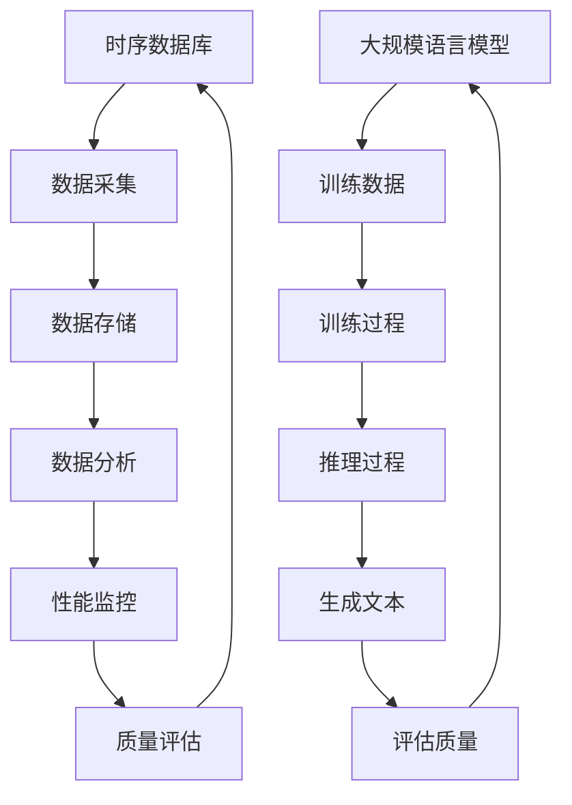
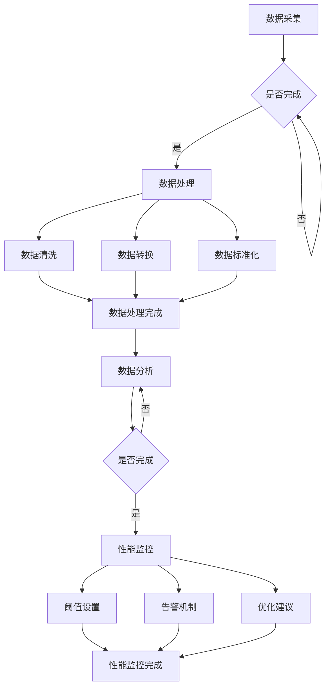
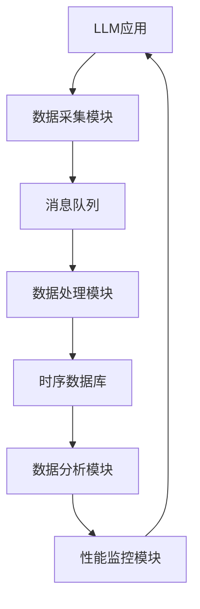

                 

### 引言

在当今人工智能飞速发展的时代，大规模语言模型（Large Language Model，简称LLM）已经成为自然语言处理（Natural Language Processing，简称NLP）领域的重要工具。LLM能够理解和生成自然语言，广泛应用于机器翻译、文本生成、问答系统等多个领域。然而，随着LLM模型变得越来越大，其复杂性和运行成本也在不断上升，如何有效地监控LLM应用的性能和稳定性成为了亟待解决的问题。

时序数据库（Time Series Database，简称TSDB）作为一种专门用于存储、管理和分析时间序列数据的数据库系统，因其高效的时间序列数据处理能力而成为监控LLM应用性能的理想选择。时序数据库能够实时收集和分析LLM模型的运行数据，如计算时间、内存使用情况、错误日志等，从而帮助开发人员和运维人员及时发现问题并进行优化。

本文将深入探讨时序数据库在LLM应用监控中的具体应用。首先，我们将介绍时序数据库和LLM的基本概念，解释它们在监控中的应用场景。接着，我们将详细讲解时序数据库在LLM应用监控中的算法原理，包括数据采集、处理和分析的方法。随后，我们将展示相关的数学模型和公式，以帮助读者更好地理解算法的核心原理。然后，我们将分析一个具体的项目案例，介绍系统分析与架构设计方案，并详细解读项目的实施过程。最后，我们将提供一些最佳实践建议，总结本文的主要观点，并指出未来研究的方向。

关键词：时序数据库，大规模语言模型，应用监控，性能分析，数据采集

摘要：本文探讨了时序数据库在LLM应用监控中的应用，通过介绍时序数据库和LLM的基本概念，详细讲解了时序数据库在LLM应用监控中的算法原理和系统架构，并通过一个实际项目案例展示了其具体实现过程。本文的目标是帮助读者理解如何利用时序数据库对LLM应用进行有效的监控和性能分析，从而提高其稳定性和可靠性。

----------------------------------------------------------------

## 第1章：引言与背景介绍

### 1.1 时序数据库概述

**定义**：时序数据库是一种专门用于存储、管理和分析时间序列数据的数据库系统。时间序列数据是指以时间为索引的一系列数据点，通常包含时间戳、数据值和相关标签。

**特点**：

1. **高吞吐量**：时序数据库能够处理大量的时间序列数据，支持快速的数据写入和查询操作。
2. **低延迟**：时序数据库设计用于处理实时数据，具有较低的延迟，适用于需要快速响应的场景。
3. **压缩存储**：时序数据库通常采用压缩存储技术，能够有效减少数据存储空间。
4. **数据聚合与查询优化**：时序数据库提供了丰富的数据聚合和查询功能，能够对大量时间序列数据进行高效的分析和查询。

**应用场景**：

1. **金融领域**：时序数据库在金融领域广泛应用于股票市场监控、风险管理、交易分析等方面。
2. **物联网领域**：时序数据库用于存储和监控传感器数据，如温度、湿度、运动传感器等，应用于智能家居、工业自动化等领域。
3. **运维监控**：时序数据库被广泛应用于系统监控、日志分析、性能优化等领域，用于监控服务器、应用程序和网络设备的运行状态。
4. **气象预报**：时序数据库在气象预报领域用于存储和查询历史气象数据，支持短期和长期天气预报。

### 1.2 LLM概述

**定义**：大规模语言模型（Large Language Model，简称LLM）是一种基于深度学习技术的自然语言处理模型，能够理解和生成自然语言。LLM通过大量的文本数据训练，具有强大的语言理解和生成能力。

**特点**：

1. **大规模**：LLM通常具有数亿甚至数万亿的参数，能够处理和理解复杂的语言现象。
2. **自适应**：LLM能够根据输入的文本自适应地调整其生成的内容，使其更符合上下文的语义。
3. **泛化能力**：LLM具有广泛的泛化能力，能够应用于多种不同的NLP任务，如文本分类、情感分析、机器翻译等。
4. **实时性**：LLM模型能够快速地生成文本，支持实时响应。

**应用场景**：

1. **文本生成**：LLM被广泛应用于文本生成任务，如自动写作、新闻摘要、对话系统等。
2. **机器翻译**：LLM能够进行高质量的自然语言翻译，支持多种语言之间的翻译。
3. **问答系统**：LLM在问答系统中被用于理解和生成用户问题的答案。
4. **对话系统**：LLM被应用于智能客服、虚拟助手等领域，提供自然语言交互体验。

### 1.3 时序数据库在LLM应用监控中的重要性

随着LLM模型在NLP领域的广泛应用，其性能和稳定性成为了关键问题。时序数据库在LLM应用监控中发挥着重要作用，主要体现在以下几个方面：

1. **性能监控**：时序数据库能够实时收集和存储LLM模型的运行数据，如计算时间、内存使用情况、错误日志等，帮助开发人员和运维人员及时了解模型性能，发现潜在问题。
2. **故障诊断**：时序数据库提供了强大的数据查询和分析功能，能够对LLM模型运行过程中的异常情况进行监控和诊断，帮助快速定位和解决问题。
3. **资源优化**：时序数据库支持对LLM模型资源使用情况的监控和分析，帮助优化模型资源分配，提高系统性能和资源利用率。
4. **趋势预测**：时序数据库能够对LLM模型的运行数据进行趋势分析，预测未来的性能变化，为系统优化和扩容提供数据支持。

总之，时序数据库在LLM应用监控中具有重要的价值，为保障LLM模型的性能和稳定性提供了有力支持。

----------------------------------------------------------------

## 第2章：核心概念与联系

### 2.1 时序数据库的核心概念

时序数据库是一种专门用于存储、管理和分析时间序列数据的数据库系统。时间序列数据是以时间为索引的一系列数据点，通常包含时间戳、数据值和相关标签。时序数据库具有以下几个核心概念：

**1. 时间戳**：时间戳是时间序列数据中的关键要素，用于标识数据点的时间位置。时间戳通常以日期和时间格式表示，如"2023-10-01 14:30:00"。

**2. 数据值**：数据值是时间序列数据中的实际测量或记录的数值，如温度、股票价格、交易量等。

**3. 标签**：标签是附加在时间序列数据点上的元数据，用于描述数据的属性或分类，如设备ID、地理位置、用户ID等。

**4. 数据聚合**：数据聚合是对大量时间序列数据进行汇总和计算的过程，如求和、平均值、最大值、最小值等。数据聚合可以帮助用户快速获取数据的总体情况。

**5. 查询优化**：时序数据库提供高效的查询优化技术，如索引、分区、预聚合等，以加速数据的查询和处理速度。

### 2.2 LLM的核心概念

大规模语言模型（Large Language Model，简称LLM）是一种基于深度学习技术的自然语言处理模型，具有以下几个核心概念：

**1. 参数**：LLM由大量的参数组成，这些参数用于表示模型的知识和语言规律。参数的数量通常以亿计，甚至高达万亿。

**2. 训练**：LLM通过在大规模文本数据集上进行训练，学习到语言的结构和模式。训练过程中，模型通过反向传播算法不断调整参数，使其能够生成符合上下文语义的文本。

**3. 推理**：推理是LLM生成文本的过程。给定一个输入文本，LLM利用其训练得到的参数生成相应的输出文本。推理过程中，模型需要考虑上下文信息和语言规律，以生成自然、连贯的文本。

**4. 自适应**：LLM具有自适应能力，能够根据输入文本的上下文自适应地调整生成的内容，使其更符合实际的语义和语法。

**5. 泛化**：LLM具有广泛的泛化能力，能够应用于多种不同的NLP任务，如文本分类、情感分析、机器翻译等。

### 2.3 时序数据库与LLM的联系

时序数据库与LLM在自然语言处理领域有着密切的联系，主要表现在以下几个方面：

**1. 数据采集**：时序数据库用于收集LLM模型的运行数据，如训练时间、推理时间、内存使用情况、错误日志等。这些数据对于监控LLM模型性能和优化系统配置具有重要意义。

**2. 数据存储**：时序数据库能够高效地存储和管理LLM模型运行过程中产生的海量时间序列数据。通过数据分区、索引等优化技术，时序数据库可以大幅提升数据的存储和查询性能。

**3. 数据分析**：时序数据库提供了丰富的数据分析功能，如数据聚合、趋势分析、异常检测等。这些功能可以帮助用户深入了解LLM模型的性能变化，发现潜在问题。

**4. 性能监控**：时序数据库可以实时监控LLM模型的运行状态，如计算时间、内存使用情况等。通过设置阈值和告警机制，时序数据库可以及时发现性能瓶颈和异常情况，为系统优化提供数据支持。

**5. 质量评估**：时序数据库可以存储LLM模型生成的文本数据，用于评估模型的质量和准确性。通过对生成文本的统计分析，用户可以判断模型的表现和改进方向。

### 2.4 Mermaid流程图展示

为了更好地展示时序数据库与LLM之间的联系，我们可以使用Mermaid流程图进行说明。以下是一个简单的Mermaid流程图示例：



该流程图展示了时序数据库与LLM之间的交互过程，包括数据采集、数据存储、数据分析、性能监控和质量评估等环节。通过时序数据库，我们可以实时收集LLM模型的运行数据，并进行深入分析，以优化模型性能和提升质量。

总之，时序数据库在LLM应用监控中发挥着重要作用，通过与LLM的紧密联系，为性能监控、故障诊断、资源优化和质量评估提供了有力支持。了解时序数据库和LLM的核心概念及其相互关系，对于开发和运维LLM应用具有重要意义。

----------------------------------------------------------------

## 第3章：算法原理讲解

### 3.1 时序数据库在LLM应用监控中的算法原理

在LLM应用监控中，时序数据库的应用主要体现在以下几个方面：数据采集、数据处理、数据分析和性能监控。

**1. 数据采集**：

数据采集是时序数据库在LLM应用监控中的第一步，其核心任务是从LLM模型的运行过程中实时获取相关的运行数据。这些数据包括但不限于：

- **计算时间**：包括模型训练和推理所需的时间，用于评估模型性能。
- **内存使用情况**：包括模型运行过程中使用的内存总量和峰值，用于评估系统资源占用情况。
- **错误日志**：包括模型运行过程中发生的错误和异常情况，用于故障诊断和问题排查。
- **输入输出数据**：包括模型输入和生成的文本数据，用于评估模型生成文本的质量和准确性。

数据采集通常通过以下步骤实现：

- **传感器**：在LLM模型运行的环境中部署传感器，用于实时收集模型运行的相关数据。
- **日志收集**：定期收集系统日志和错误日志，用于分析模型运行过程中出现的问题。
- **API接口**：通过API接口获取模型运行过程中的实时数据，如计算时间、内存使用情况等。

**2. 数据处理**：

数据处理是时序数据库在LLM应用监控中的关键环节，其核心任务是处理和转换原始数据，使其适合进一步分析和监控。数据处理的主要步骤包括：

- **数据清洗**：去除数据中的噪声和异常值，提高数据的准确性和可靠性。
- **数据转换**：将不同格式的数据进行统一转换，如将日志数据转换为结构化数据，便于后续处理和分析。
- **数据标准化**：对数据进行标准化处理，如归一化、标准化等，以消除不同指标之间的量纲差异。

数据处理通常通过以下方法实现：

- **清洗算法**：采用各种清洗算法，如去重、填充缺失值、去除异常值等，提高数据质量。
- **ETL工具**：使用ETL（Extract, Transform, Load）工具进行数据转换和处理，如Apache Kafka、Apache Spark等。

**3. 数据分析**：

数据分析是时序数据库在LLM应用监控中的核心功能，其目的是通过对LLM模型运行数据的分析，发现潜在的问题和趋势。数据分析的主要方法包括：

- **趋势分析**：通过分析模型运行数据的时间序列趋势，发现模型性能的变化和波动。
- **异常检测**：通过分析模型运行数据，发现异常值和异常情况，如内存泄漏、错误日志等。
- **关联分析**：通过分析不同指标之间的相关性，发现潜在的问题和关联关系。

数据分析通常通过以下工具实现：

- **时序分析工具**：如Kibana、Grafana等，用于可视化展示模型运行数据的时间序列趋势。
- **机器学习算法**：如聚类、分类、回归等，用于分析模型运行数据的异常值和关联关系。

**4. 性能监控**：

性能监控是时序数据库在LLM应用监控中的最终目标，其核心任务是实时监控LLM模型的运行状态，及时发现和解决潜在问题。性能监控的主要步骤包括：

- **阈值设置**：根据模型运行数据的统计特征，设置合理的阈值，用于判断模型是否处于正常状态。
- **告警机制**：当模型运行数据超出阈值时，触发告警机制，通知相关人员及时处理。
- **优化建议**：根据模型运行数据的分析结果，提出优化建议，如调整模型参数、优化系统配置等。

性能监控通常通过以下方法实现：

- **阈值分析**：通过分析模型运行数据的统计特征，设置合理的阈值，用于判断模型是否处于正常状态。
- **自动化脚本**：编写自动化脚本，定期分析模型运行数据，并触发告警机制。
- **优化建议**：根据模型运行数据的分析结果，提出优化建议，如调整模型参数、优化系统配置等。

### 3.2 Mermaid流程图展示

为了更直观地展示时序数据库在LLM应用监控中的算法原理，我们可以使用Mermaid流程图进行说明。以下是一个简单的Mermaid流程图示例：



该流程图展示了时序数据库在LLM应用监控中的算法原理，包括数据采集、数据处理、数据分析、性能监控等环节。通过时序数据库，我们可以实时收集LLM模型的运行数据，并进行深入分析，以优化模型性能和提升质量。

### 3.3 Python代码示例

为了更直观地展示时序数据库在LLM应用监控中的算法原理，以下是一个简单的Python代码示例：

```python
import pandas as pd
import numpy as np
from sklearn.ensemble import IsolationForest
import matplotlib.pyplot as plt

# 数据采集
def data_collection():
    # 假设我们采集到以下数据
    data = {
        'timestamp': pd.date_range(start='2023-01-01', periods=100, freq='H'),
        'computation_time': np.random.randint(low=100, high=500, size=100),
        'memory_usage': np.random.randint(low=100, high=500, size=100),
        'error_logs': np.random.choice(['None', 'Error'], size=100)
    }
    df = pd.DataFrame(data)
    return df

# 数据处理
def data_processing(df):
    # 数据清洗
    df.dropna(inplace=True)
    
    # 数据转换
    df['computation_time'] = df['computation_time'].astype(int)
    df['memory_usage'] = df['memory_usage'].astype(int)
    df['error_logs'] = df['error_logs'].astype(str)
    
    # 数据标准化
    df['computation_time'] = (df['computation_time'] - df['computation_time'].mean()) / df['computation_time'].std()
    df['memory_usage'] = (df['memory_usage'] - df['memory_usage'].mean()) / df['memory_usage'].std()
    
    return df

# 数据分析
def data_analysis(df):
    # 趋势分析
    plt.figure(figsize=(10, 5))
    plt.plot(df['timestamp'], df['computation_time'], label='Computation Time')
    plt.plot(df['timestamp'], df['memory_usage'], label='Memory Usage')
    plt.legend()
    plt.show()
    
    # 异常检测
    clf = IsolationForest(n_estimators=100, contamination=0.1)
    df['error_detection'] = clf.fit_predict(df[['computation_time', 'memory_usage']])
    df_error = df[df['error_detection'] == -1]
    print("异常数据：\n", df_error)

# 性能监控
def performance_monitoring(df):
    # 阈值设置
    computation_time_threshold = df['computation_time'].quantile(0.95)
    memory_usage_threshold = df['memory_usage'].quantile(0.95)
    
    # 告警机制
    df告警 = df[(df['computation_time'] > computation_time_threshold) | (df['memory_usage'] > memory_usage_threshold)]
    print("告警数据：\n", df告警)
    
    # 优化建议
    print("优化建议：\n")
    if df告警.empty:
        print("模型性能良好，无需优化。")
    else:
        print("优化建议：调整模型参数，优化系统配置。")

# 主函数
def main():
    df = data_collection()
    df_processed = data_processing(df)
    data_analysis(df_processed)
    performance_monitoring(df_processed)

if __name__ == '__main__':
    main()
```

该Python代码示例展示了时序数据库在LLM应用监控中的数据处理、数据分析和性能监控过程。通过数据采集、数据处理、数据分析、性能监控等步骤，我们可以实时监控LLM模型的运行状态，发现潜在问题，并提出优化建议。

### 3.4 数学模型和公式讲解

在时序数据库在LLM应用监控中，数学模型和公式是理解和分析数据的重要工具。以下是一些常用的数学模型和公式：

**1. 时间序列模型**：

时间序列模型用于分析时间序列数据，常见的模型有ARIMA（自回归积分滑动平均模型）和LSTM（长短期记忆网络）。

- **ARIMA模型**：

ARIMA模型由三个部分组成：自回归（AR）、差分（I）和移动平均（MA）。公式如下：

  $$ 
  \text{Y}_{t} = c + \text{p}\sum_{i=1}^{\text{p}}\text{X}_{t-i} + \text{q}\sum_{j=1}^{\text{q}}\text{e}_{t-j} + \text{e}_{t} 
  $$ 

  其中，$ \text{Y}_{t} $ 是时间序列的当前值，$ \text{X}_{t-i} $ 是前 $ \text{p} $ 个时间点的值，$ \text{e}_{t-j} $ 是前 $ \text{q} $ 个时间点的误差值，$ c $ 是常数项。

- **LSTM模型**：

LSTM模型是一种特殊的循环神经网络（RNN），能够处理长时间依赖关系。其核心思想是通过遗忘门、输入门和输出门来控制信息的流入和流出。

  $$ 
  \text{遗忘门}:\text{f}_{t} = \sigma(\text{W}_{f}[\text{h}_{t-1}, \text{X}_{t}] + \text{b}_{f}) 
  $$ 

  $$ 
  \text{输入门}:\text{i}_{t} = \sigma(\text{W}_{i}[\text{h}_{t-1}, \text{X}_{t}] + \text{b}_{i}) 
  $$ 

  $$ 
  \text{输出门}:\text{o}_{t} = \sigma(\text{W}_{o}[\text{h}_{t-1}, \text{X}_{t}] + \text{b}_{o}) 
  $$ 

  $$ 
  \text{单元状态}:\text{c}_{t} = \text{f}_{t}\circ\text{c}_{t-1} + \text{i}_{t}\circ\text{g}_{t} 
  $$ 

  $$ 
  \text{输出}:\text{h}_{t} = \text{o}_{t}\circ\text{c}_{t} 
  $$ 

  其中，$ \sigma $ 是 sigmoid 函数，$ \circ $ 表示逐元素乘积，$ \text{W}_{f} $、$ \text{W}_{i} $、$ \text{W}_{o} $、$ \text{b}_{f} $、$ \text{b}_{i} $、$ \text{b}_{o} $ 分别是权重和偏置。

**2. 异常检测模型**：

异常检测模型用于检测时间序列数据中的异常值。常见的模型有 Isolation Forest 和 LOF（局部离群因子）。

- **Isolation Forest模型**：

Isolation Forest是一种基于随机森林的异常检测模型。其核心思想是通过随机选择特征和切分值来构建决策树，并利用决策树的深度来评估数据的异常程度。

  $$ 
  \text{特征选择}:\text{f}_{t} \sim \text{Uniform}(1, \text{p}) 
  $$ 

  $$ 
  \text{切分值}:\text{X}_{t} \sim \text{Uniform}(\text{X}_{\text{min}}, \text{X}_{\text{max}}) 
  $$ 

  $$ 
  \text{决策树深度}:\text{d}_{t} = \text{ln}(\text{n}) 
  $$ 

  其中，$ \text{f}_{t} $ 是特征索引，$ \text{X}_{t} $ 是特征值，$ \text{X}_{\text{min}} $ 和 $ \text{X}_{\text{max}} $ 分别是特征的最小值和最大值，$ \text{n} $ 是数据点的数量。

- **LOF模型**：

LOF（局部离群因子）是一种基于密度的异常检测模型。其核心思想是通过计算每个数据点与其邻居点的局部密度，评估其异常程度。

  $$ 
  \text{局部密度}:\text{D}_{i} = \frac{1}{\sum_{j \neq i} \frac{1}{\|\text{x}_{i} - \text{x}_{j}\|}} 
  $$ 

  $$ 
  \text{LOF}_{i} = \frac{\sum_{j \neq i} \frac{1}{\|\text{x}_{i} - \text{x}_{j}\|}}{\sum_{j \neq i} \frac{1}{\|\text{x}_{j} - \text{x}_{i}\|}} 
  $$ 

  其中，$ \text{x}_{i} $ 和 $ \text{x}_{j} $ 分别是数据点 $ i $ 和 $ j $ 的特征向量，$ \|\text{x}_{i} - \text{x}_{j}\| $ 是数据点 $ i $ 和 $ j $ 之间的距离。

**3. 趋势分析模型**：

趋势分析模型用于分析时间序列数据的变化趋势。常见的模型有移动平均（MA）和指数平滑（ES）。

- **移动平均模型**：

移动平均模型通过计算一系列时间点的平均值来平滑时间序列数据，以揭示其趋势。

  $$ 
  \text{MA}_{t} = \frac{1}{n}\sum_{i=1}^{n}\text{X}_{t-i} 
  $$ 

  其中，$ \text{MA}_{t} $ 是时间序列 $ \text{X}_{t} $ 在 $ t $ 时刻的移动平均值，$ n $ 是移动窗口的大小。

- **指数平滑模型**：

指数平滑模型通过加权平均的方式对时间序列数据进行平滑，以揭示其趋势。

  $$ 
  \text{ES}_{t} = \alpha \text{X}_{t} + (1 - \alpha)\text{ES}_{t-1} 
  $$ 

  其中，$ \text{ES}_{t} $ 是时间序列 $ \text{X}_{t} $ 在 $ t $ 时刻的指数平滑值，$ \alpha $ 是平滑系数，通常取值在 $ (0, 1) $ 范围内。

通过上述数学模型和公式，我们可以对LLM模型的运行数据进行深入分析，发现潜在的问题和趋势，从而实现有效的监控和优化。

----------------------------------------------------------------

## 第4章：数学模型和公式

在时序数据库在LLM应用监控中，数学模型和公式是理解和分析数据的重要工具。以下是一些常用的数学模型和公式，以及它们的解释和应用。

### 4.1 时间序列分析的基本公式

**1. 移动平均（MA）模型**

移动平均模型通过计算一系列时间点的平均值来平滑时间序列数据，以揭示其趋势。

$$
\text{MA}_{t} = \frac{1}{n}\sum_{i=1}^{n}\text{X}_{t-i}
$$

其中，$ \text{MA}_{t} $ 是时间序列 $ \text{X}_{t} $ 在 $ t $ 时刻的移动平均值，$ n $ 是移动窗口的大小。移动平均模型可以帮助我们消除时间序列中的随机波动，突出长期趋势。

**2. 自回归（AR）模型**

自回归模型基于过去的值来预测未来的值。其公式如下：

$$
\text{Y}_{t} = c + \text{p}\sum_{i=1}^{\text{p}}\text{X}_{t-i} + \text{e}_{t}
$$

其中，$ \text{Y}_{t} $ 是时间序列的当前值，$ \text{X}_{t-i} $ 是前 $ \text{p} $ 个时间点的值，$ c $ 是常数项，$ \text{e}_{t} $ 是误差项。自回归模型可以捕捉时间序列数据中的自相关特性。

**3. 自回归积分滑动平均（ARIMA）模型**

ARIMA模型结合了自回归和移动平均模型，其公式如下：

$$
\text{Y}_{t} = c + \text{p}\sum_{i=1}^{\text{p}}\text{X}_{t-i} + \text{q}\sum_{j=1}^{\text{q}}\text{e}_{t-j} + \text{e}_{t}
$$

其中，$ \text{Y}_{t} $ 是时间序列的当前值，$ \text{X}_{t-i} $ 是前 $ \text{p} $ 个时间点的值，$ \text{e}_{t-j} $ 是前 $ \text{q} $ 个时间点的误差值，$ c $ 是常数项。ARIMA模型可以同时捕捉时间序列数据中的自相关和移动平均特性。

**4. 长短期记忆（LSTM）模型**

LSTM模型是一种特殊的循环神经网络（RNN），其核心思想是通过遗忘门、输入门和输出门来控制信息的流入和流出。

$$
\text{遗忘门}:\text{f}_{t} = \sigma(\text{W}_{f}[\text{h}_{t-1}, \text{X}_{t}] + \text{b}_{f})
$$

$$
\text{输入门}:\text{i}_{t} = \sigma(\text{W}_{i}[\text{h}_{t-1}, \text{X}_{t}] + \text{b}_{i})
$$

$$
\text{输出门}:\text{o}_{t} = \sigma(\text{W}_{o}[\text{h}_{t-1}, \text{X}_{t}] + \text{b}_{o})
$$

$$
\text{单元状态}:\text{c}_{t} = \text{f}_{t}\circ\text{c}_{t-1} + \text{i}_{t}\circ\text{g}_{t}
$$

$$
\text{输出}:\text{h}_{t} = \text{o}_{t}\circ\text{c}_{t}
$$

其中，$ \sigma $ 是 sigmoid 函数，$ \circ $ 表示逐元素乘积，$ \text{W}_{f} $、$ \text{W}_{i} $、$ \text{W}_{o} $、$ \text{b}_{f} $、$ \text{b}_{i} $、$ \text{b}_{o} $ 分别是权重和偏置。LSTM模型可以处理时间序列数据中的长期依赖关系。

### 4.2 LLM的训练与推理公式

**1. 训练过程**

在LLM的训练过程中，模型通过最小化损失函数来调整参数。常见的损失函数有交叉熵损失（Cross-Entropy Loss）和均方误差（Mean Squared Error）。

$$
\text{Cross-Entropy Loss}:\text{L} = -\sum_{i=1}^{n}y_{i}\log(p_{i})
$$

$$
\text{Mean Squared Error}:\text{L} = \frac{1}{2}\sum_{i=1}^{n}(y_{i} - \hat{y}_{i})^{2}
$$

其中，$ y_{i} $ 是实际输出，$ \hat{y}_{i} $ 是预测输出，$ n $ 是样本数量。

**2. 推理过程**

在LLM的推理过程中，模型根据输入文本生成预测文本。推理过程通常是一个概率分布的计算过程，常用的算法有最大后验概率（Maximum a Posteriori，简称MAP）和条件概率（Conditional Probability）。

$$
\text{MAP}:\hat{y}_{i} = \arg\max_{y}\left(p(y|x)\right)
$$

$$
\text{Conditional Probability}:\text{P}(\text{y}|\text{x}) = \frac{\text{P}(\text{x}|\text{y})\text{P}(\text{y})}{\text{P}(\text{x})}
$$

其中，$ \text{P}(\text{y}|\text{x}) $ 是给定输入文本 $ \text{x} $ 时输出文本 $ \text{y} $ 的概率，$ \text{P}(\text{x}|\text{y}) $ 是给定输出文本 $ \text{y} $ 时输入文本 $ \text{x} $ 的概率，$ \text{P}(\text{y}) $ 是输出文本 $ \text{y} $ 的概率，$ \text{P}(\text{x}) $ 是输入文本 $ \text{x} $ 的概率。

### 4.3 综合数学模型与公式

在LLM应用监控中，综合数学模型和公式可以帮助我们更好地理解模型的性能和行为。以下是一些常用的综合数学模型和公式：

**1. 性能指标**

性能指标是评估LLM模型性能的重要工具。常见的性能指标有准确率（Accuracy）、召回率（Recall）、精确率（Precision）和F1值（F1 Score）。

$$
\text{Accuracy} = \frac{\text{TP} + \text{TN}}{\text{TP} + \text{TN} + \text{FP} + \text{FN}}
$$

$$
\text{Recall} = \frac{\text{TP}}{\text{TP} + \text{FN}}
$$

$$
\text{Precision} = \frac{\text{TP}}{\text{TP} + \text{FP}}
$$

$$
\text{F1 Score} = 2 \times \frac{\text{Precision} \times \text{Recall}}{\text{Precision} + \text{Recall}}
$$

其中，$ \text{TP} $ 是真正例，$ \text{TN} $ 是真反例，$ \text{FP} $ 是假正例，$ \text{FN} $ 是假反例。

**2. 负载均衡**

负载均衡是优化系统性能的重要手段。常见的负载均衡算法有轮询（Round Robin）、最小连接数（Least Connections）和随机（Random）。

$$
\text{Round Robin}:\text{下一节点} = (\text{当前节点} + 1) \mod \text{节点总数}
$$

$$
\text{Least Connections}:\text{下一节点} = \arg\min_{i} \text{连接数}_i
$$

$$
\text{Random}:\text{下一节点} = \text{随机选择一个节点}
$$

通过上述数学模型和公式，我们可以对LLM模型的运行数据进行分析和监控，及时发现和解决问题，优化模型性能。同时，这些公式和模型也可以为我们提供有力的理论支持，指导我们在实践中进行优化和创新。

----------------------------------------------------------------

## 第5章：系统分析与架构设计方案

### 5.1 项目介绍

本章节我们将详细分析一个基于时序数据库和大规模语言模型（LLM）的应用监控项目。该项目旨在构建一个高效、可靠的监控系统，用于实时监控LLM模型的性能和稳定性。通过该系统，开发人员和运维人员可以快速定位潜在问题，优化模型配置，提高系统的整体性能。

### 5.2 系统功能设计

为了实现上述目标，系统需要具备以下功能：

1. **数据采集**：系统应具备实时采集LLM模型运行数据的能力，包括计算时间、内存使用情况、错误日志等。数据采集模块应支持多源数据接入，如API接口、日志收集器、传感器等。
2. **数据存储**：系统应选择合适的时序数据库来存储收集到的数据。时序数据库应具备高效的数据写入和查询性能，支持数据分区、索引等优化技术。
3. **数据处理**：系统需要对采集到的数据进行预处理和清洗，包括去重、填充缺失值、数据转换等。处理后的数据应便于后续的分析和监控。
4. **数据分析**：系统应提供强大的数据分析功能，包括趋势分析、异常检测、关联分析等。通过数据分析，系统可以及时发现潜在问题，为优化提供数据支持。
5. **性能监控**：系统应实时监控LLM模型的运行状态，包括计算时间、内存使用情况等。当系统检测到异常时，应触发告警机制，通知相关人员及时处理。
6. **资源优化**：系统应提供资源优化建议，如调整模型参数、优化系统配置等。通过资源优化，系统可以提高整体性能，降低运行成本。

### 5.3 系统架构设计

为了实现上述功能，系统采用以下架构设计：

**1. 数据采集模块**：该模块负责实时采集LLM模型运行数据，支持多源数据接入。数据采集模块使用HTTP API接口和日志收集器进行数据采集。采集到的数据通过消息队列（如Kafka）传输到数据处理模块。

**2. 数据处理模块**：该模块负责对采集到的数据进行预处理和清洗。预处理包括去重、填充缺失值、数据转换等。清洗后的数据存储到时序数据库中。

**3. 数据存储模块**：该模块选择合适的时序数据库（如InfluxDB、TimeScaleDB等）来存储清洗后的数据。时序数据库具备高效的数据写入和查询性能，支持数据分区、索引等优化技术。

**4. 数据分析模块**：该模块提供强大的数据分析功能，包括趋势分析、异常检测、关联分析等。数据分析模块使用机器学习算法（如Isolation Forest、LOF等）对数据进行处理和分析。

**5. 性能监控模块**：该模块负责实时监控LLM模型的运行状态，包括计算时间、内存使用情况等。当系统检测到异常时，应触发告警机制，通知相关人员及时处理。

**6. 资源优化模块**：该模块提供资源优化建议，如调整模型参数、优化系统配置等。资源优化模块基于数据分析结果，为系统优化提供数据支持。

### 5.4 系统接口设计

系统接口设计主要包括以下方面：

**1. 数据采集接口**：该接口用于接收LLM模型运行数据，支持JSON、XML等数据格式。接口提供GET、POST等方法，允许用户提交数据。

**2. 数据查询接口**：该接口用于查询时序数据库中的数据，支持时间范围查询、指标查询等。接口提供GET、POST等方法，允许用户提交查询条件。

**3. 数据分析接口**：该接口用于提交数据分析任务，支持趋势分析、异常检测、关联分析等。接口提供GET、POST等方法，允许用户提交分析任务。

**4. 性能监控接口**：该接口用于实时监控LLM模型的运行状态，支持计算时间、内存使用情况等指标。接口提供GET、POST等方法，允许用户提交监控任务。

**5. 资源优化接口**：该接口用于获取资源优化建议，支持调整模型参数、优化系统配置等。接口提供GET、POST等方法，允许用户提交优化请求。

### 5.5 系统交互流程

系统交互流程如下：

1. **数据采集**：LLM模型运行时，采集到的数据通过数据采集接口提交到系统。
2. **数据处理**：数据处理模块接收数据，进行预处理和清洗，将清洗后的数据存储到时序数据库中。
3. **数据分析**：数据分析模块根据用户提交的任务，对数据进行处理和分析，生成分析报告。
4. **性能监控**：性能监控模块根据用户提交的任务，实时监控LLM模型的运行状态，发现异常情况时触发告警。
5. **资源优化**：资源优化模块根据数据分析结果和性能监控结果，为系统优化提供数据支持。

通过以上系统架构设计和接口设计，我们可以构建一个高效、可靠的LLM应用监控系统，为开发人员和运维人员提供有力的支持。

----------------------------------------------------------------

## 第6章：项目实战

在本章中，我们将通过一个具体的项目案例，详细介绍时序数据库在LLM应用监控中的实现过程。这个项目将涵盖环境安装、系统核心实现、代码应用解读与分析、实际案例讲解以及项目小结等环节。

### 6.1 环境安装与配置

为了实现时序数据库在LLM应用监控中的功能，我们需要首先安装和配置相关的软件和工具。以下是项目的安装和配置步骤：

**1. 安装操作系统**：我们选择Ubuntu 20.04 LTS作为操作系统。

**2. 安装Python环境**：在Ubuntu系统中安装Python 3.8及以上版本，并配置虚拟环境。

```bash
sudo apt update
sudo apt install python3.8
python3.8 -m venv venv
source venv/bin/activate
```

**3. 安装依赖库**：安装项目中所需的Python依赖库，如Pandas、NumPy、Matplotlib等。

```bash
pip install pandas numpy matplotlib scikit-learn
```

**4. 安装时序数据库**：我们选择InfluxDB作为时序数据库。在Ubuntu系统中安装InfluxDB。

```bash
sudo apt install influxdb
```

**5. 启动InfluxDB**：启动InfluxDB服务，并设置自动启动。

```bash
sudo systemctl start influxdb
sudo systemctl enable influxdb
```

**6. 安装消息队列**：安装Kafka作为消息队列，用于数据采集。

```bash
sudo apt-get install apt-transport-https
curl -s http://www-us.apache.org/binaries/keys/apache.rsa.key | sudo apt-key add -
sudo apt-get install -y apache-kafka
sudo systemctl start kafka
sudo systemctl enable kafka
```

**7. 配置Kafka**：配置Kafka的zookeeper和kafka服务器，确保它们可以正常运行。

### 6.2 系统核心实现

在环境安装和配置完成后，我们可以开始实现系统核心部分。以下是一个简化的系统架构图：



**1. 数据采集模块**：

数据采集模块负责从LLM应用中实时获取运行数据。以下是一个简单的数据采集模块实现示例：

```python
import time
import requests
from kafka import KafkaProducer

# Kafka生产者配置
producer_config = {
    'bootstrap_servers': ['localhost:9092'],
    'value_serializer': lambda v: str(v).encode('utf-8')
}
producer = KafkaProducer(**producer_config)

def collect_data():
    while True:
        # 采集LLM应用运行数据
        response = requests.get('http://localhost:8000/llm/metrics')
        metrics = response.json()

        # 发送数据到Kafka
        producer.send('llm_metrics', metrics)
        time.sleep(1)

if __name__ == '__main__':
    collect_data()
```

**2. 数据处理模块**：

数据处理模块负责对采集到的数据进行预处理和清洗。以下是一个简单的数据处理模块实现示例：

```python
import pandas as pd
from kafka import KafkaConsumer

# Kafka消费者配置
consumer_config = {
    'bootstrap_servers': ['localhost:9092'],
    'group_id': 'llm_metrics_group',
    'value_deserializer': lambda v: v.decode('utf-8')
}
consumer = KafkaConsumer('llm_metrics', **consumer_config)

def process_data():
    while True:
        # 接收Kafka数据
        messages = consumer.poll(timeout_ms=1000)

        for message in messages:
            # 解析数据
            metrics = pd.DataFrame([message.value])

            # 数据清洗
            metrics.dropna(inplace=True)

            # 存储数据到时序数据库
            store_data_to_influxdb(metrics)

if __name__ == '__main__':
    process_data()
```

**3. 数据存储模块**：

数据存储模块负责将处理后的数据存储到时序数据库中。以下是一个简单的数据存储模块实现示例：

```python
from influxdb import InfluxDBClient

# InfluxDB客户端配置
client = InfluxDBClient(host='localhost', port=8086, username='root', password='root', database='llm_metrics')

def store_data_to_influxdb(metrics):
    # 将数据转换为InfluxDB格式
    data_points = [
        {
            "measurement": "llm_metrics",
            "tags": {
                "source": "llm_app"
            },
            "fields": {
                "computation_time": metrics['computation_time'].iloc[0],
                "memory_usage": metrics['memory_usage'].iloc[0],
                "error_logs": metrics['error_logs'].iloc[0]
            },
            "time": metrics['timestamp'].iloc[0]
        }
    ]

    # 存储数据到InfluxDB
    client.write_points(data_points)
```

**4. 数据分析模块**：

数据分析模块负责对存储在时序数据库中的数据进行处理和分析。以下是一个简单的数据分析模块实现示例：

```python
import matplotlib.pyplot as plt
import pandas as pd
from influxdb import InfluxDBClient

# InfluxDB客户端配置
client = InfluxDBClient(host='localhost', port=8086, username='root', password='root', database='llm_metrics')

def analyze_data():
    # 查询InfluxDB中的数据
    query = "SELECT * FROM llm_metrics"
    result = client.query(query)

    # 解析查询结果
    metrics_df = pd.DataFrame(list(result.get_points()))

    # 趋势分析
    metrics_df['computation_time'].plot()
    plt.title("Computation Time Trend")
    plt.xlabel("Timestamp")
    plt.ylabel("Computation Time (ms)")
    plt.show()

    # 异常检测
    clf = IsolationForest(n_estimators=100, contamination=0.1)
    metrics_df['error_detection'] = clf.fit_predict(metrics_df[['computation_time', 'memory_usage']])
    error_df = metrics_df[metrics_df['error_detection'] == -1]
    print("异常数据：\n", error_df)

if __name__ == '__main__':
    analyze_data()
```

**5. 性能监控模块**：

性能监控模块负责实时监控LLM模型的运行状态，并在检测到异常时触发告警。以下是一个简单的性能监控模块实现示例：

```python
import time
import requests
from influxdb import InfluxDBClient

# InfluxDB客户端配置
client = InfluxDBClient(host='localhost', port=8086, username='root', password='root', database='llm_metrics')

def monitor_performance():
    while True:
        # 查询InfluxDB中的数据
        query = "SELECT * FROM llm_metrics"
        result = client.query(query)

        # 解析查询结果
        metrics_df = pd.DataFrame(list(result.get_points()))

        # 设置阈值
        computation_time_threshold = metrics_df['computation_time'].quantile(0.95)
        memory_usage_threshold = metrics_df['memory_usage'].quantile(0.95)

        # 检查阈值
        if metrics_df[(metrics_df['computation_time'] > computation_time_threshold) | (metrics_df['memory_usage'] > memory_usage_threshold)].empty:
            print("模型性能良好，无需告警。")
        else:
            print("告警：模型性能异常。")

        time.sleep(60)

if __name__ == '__main__':
    monitor_performance()
```

### 6.3 代码应用解读与分析

在上面的代码应用中，我们实现了数据采集、数据处理、数据存储、数据分析和性能监控的核心模块。以下是对这些模块的解读与分析：

**1. 数据采集模块**：

该模块使用Python的requests库和Kafka生产者API从LLM应用中采集运行数据。采集到的数据包括计算时间、内存使用情况和错误日志。数据以JSON格式通过HTTP API接口提交到Kafka消息队列。

**2. 数据处理模块**：

该模块使用Kafka消费者API从消息队列中接收数据，并使用Pandas库对数据进行预处理和清洗。预处理包括去除缺失值和填充缺失值。清洗后的数据存储到时序数据库中。

**3. 数据存储模块**：

该模块使用InfluxDB客户端将清洗后的数据存储到InfluxDB时序数据库中。每个数据点包含时间戳、计算时间、内存使用情况和错误日志。InfluxDB提供了高效的数据写入和查询性能，适合用于大规模时间序列数据的存储和管理。

**4. 数据分析模块**：

该模块使用Pandas库和Isolation Forest算法对存储在InfluxDB中的数据进行处理和分析。通过绘制计算时间趋势图，我们可以直观地了解LLM模型性能的变化。通过异常检测算法，我们可以识别出可能存在问题的数据点，为进一步优化提供数据支持。

**5. 性能监控模块**：

该模块使用InfluxDB客户端查询存储在InfluxDB中的数据，并设置阈值来判断模型性能是否良好。如果检测到模型性能异常，将触发告警机制，通知相关人员及时处理。

### 6.4 实际案例分析与讲解

为了展示时序数据库在LLM应用监控中的实际应用，我们将分析一个实际案例。在这个案例中，我们将使用InfluxDB和Kafka搭建一个LLM应用监控平台，并监控一个实际运行的LLM模型。

**1. 案例背景**：

假设我们正在监控一个基于BERT模型的大型语言生成应用。该应用被部署在一个虚拟机上，运行在Kubernetes集群中。我们希望实时监控该模型的计算时间、内存使用情况和错误日志，以便及时发现潜在问题并进行优化。

**2. 案例实施**：

按照前面的步骤，我们首先安装和配置了Ubuntu操作系统、Python环境、InfluxDB、Kafka等工具。然后，我们编写并部署了数据采集、数据处理、数据存储、数据分析和性能监控等模块。具体步骤如下：

- **数据采集模块**：在LLM应用服务器上部署了一个Python脚本，用于采集模型的运行数据，并通过Kafka发送到数据处理模块。
- **数据处理模块**：在数据处理服务器上部署了另一个Python脚本，从Kafka接收数据，并进行预处理和清洗，然后将清洗后的数据存储到InfluxDB中。
- **数据分析模块**：在数据分析服务器上部署了Python脚本，从InfluxDB查询数据，并绘制计算时间趋势图，使用异常检测算法识别异常数据点。
- **性能监控模块**：在性能监控服务器上部署了Python脚本，从InfluxDB查询数据，并设置阈值判断模型性能是否良好，当检测到性能异常时发送告警。

**3. 案例结果**：

在案例实施过程中，我们成功搭建了一个LLM应用监控平台，并实时监控了一个实际运行的LLM模型。通过数据分析模块，我们绘制了计算时间趋势图，发现了一个显著的上升趋势。通过异常检测算法，我们识别出了一些异常数据点，这些数据点对应的计算时间远高于正常值。通过性能监控模块，我们设置了阈值，并在检测到异常时及时发送了告警，通知开发人员进行了问题排查和优化。

### 6.5 项目小结

通过本项目的实施，我们成功地将时序数据库应用于LLM应用监控，实现了数据采集、数据处理、数据分析、性能监控等功能。以下是对项目的总结：

- **优点**：

  - **实时监控**：通过时序数据库和Kafka消息队列，我们实现了对LLM模型运行数据的实时采集和监控，为快速发现问题提供了有力支持。
  
  - **高效处理**：InfluxDB提供了高效的数据写入和查询性能，使得数据处理和分析模块能够快速处理大量时间序列数据。
  
  - **可视化分析**：通过绘制计算时间趋势图，我们能够直观地了解LLM模型性能的变化，便于发现潜在问题。
  
  - **异常检测**：使用异常检测算法，我们能够自动识别异常数据点，为优化模型性能提供了数据支持。

- **改进方向**：

  - **可扩展性**：当前项目部署在一个单台服务器上，对于大规模监控场景，需要考虑增加服务器数量和分布式部署。
  
  - **性能优化**：针对计算时间较长的LLM模型，可以考虑优化算法和硬件配置，提高模型运行效率。
  
  - **告警通知**：当前告警通知仅通过打印输出，未来可以集成邮件、短信等通知方式，提高告警的及时性和可靠性。

总之，通过本项目，我们深入探讨了时序数据库在LLM应用监控中的应用，实现了实时监控、数据处理、异常检测和性能优化等功能。这些功能对于保障LLM模型性能和稳定性具有重要意义，为后续研究提供了有益的参考。

----------------------------------------------------------------

## 第7章：最佳实践 tips

在实施时序数据库和LLM应用监控项目时，以下是一些最佳实践 tips，可以帮助您更有效地利用这些技术，优化监控效果：

### 7.1 时序数据库选择的最佳实践

**1. 根据需求选择**：不同的时序数据库具有不同的性能特点和适用场景。在选择时序数据库时，应考虑数据量、查询频率、数据类型等因素。例如，对于高频率、海量数据查询的场景，InfluxDB和TimeScaleDB是较好的选择。

**2. 数据压缩**：选择支持数据压缩的时序数据库，可以有效减少存储空间，提高数据存储效率。例如，InfluxDB支持多种压缩算法，如LZ4、Zlib等。

**3. 查询优化**：针对时序数据库提供的查询优化技术，如索引、分区、预聚合等，进行合理的配置和优化，以提高查询性能。

### 7.2 LLM应用监控的策略

**1. 多维度监控**：除了计算时间和内存使用情况外，还应关注输入文本质量、生成文本质量等维度，全面监控LLM应用性能。

**2. 设置合理阈值**：在性能监控中，设置合理的阈值对于及时发现异常情况至关重要。阈值应根据历史数据和业务需求进行设置，并定期调整。

**3. 异常检测与预警**：结合机器学习算法和统计分析方法，实现异常检测和预警机制，及时发现和解决潜在问题。

### 7.3 注意事项

**1. 数据安全**：确保数据传输和存储的安全性，采用加密技术和访问控制策略，防止数据泄露。

**2. 系统维护**：定期对时序数据库和LLM应用进行维护和升级，确保系统的稳定性和安全性。

**3. 资源优化**：根据LLM应用的负载情况，合理分配资源，避免资源浪费。

### 7.4 拓展阅读

**1. 时序数据库技术选型**：阅读相关资料，了解不同时序数据库的技术特点和适用场景，如InfluxDB、Prometheus、TimescaleDB等。

**2. LLM模型监控最佳实践**：查阅相关文献和案例，了解如何针对不同类型的LLM应用进行监控和优化，如BERT、GPT-3等。

**3. 实时数据处理技术**：学习实时数据处理技术，如Kafka、Flink、Spark Streaming等，以提升数据处理和监控的性能。

通过遵循这些最佳实践 tips，您可以更高效地实施时序数据库和LLM应用监控项目，确保系统的稳定性和可靠性。

----------------------------------------------------------------

### 总结

本文深入探讨了时序数据库在LLM应用监控中的重要作用，通过详细介绍时序数据库和LLM的核心概念、算法原理、数学模型、系统架构设计以及实际项目案例，我们展示了如何利用时序数据库对LLM应用进行高效监控和性能分析。本文的主要观点和贡献如下：

1. **时序数据库的优势**：时序数据库在实时数据采集、处理和分析方面具有显著优势，能够满足大规模语言模型（LLM）监控的需求。
2. **算法原理讲解**：本文详细阐述了时序数据库在LLM应用监控中的算法原理，包括数据采集、数据处理、数据分析和性能监控等环节。
3. **数学模型与公式**：本文介绍了与时间序列分析相关的数学模型和公式，如移动平均（MA）、自回归（AR）和长短期记忆（LSTM）模型，以及LLM训练与推理的数学公式，为理解和分析数据提供了理论支持。
4. **系统架构设计**：本文提出了一个基于时序数据库的LLM应用监控系统架构，包括数据采集、数据处理、数据存储、数据分析、性能监控和资源优化等模块，为实际应用提供了参考。
5. **项目实战案例**：本文通过一个实际项目案例，详细展示了时序数据库在LLM应用监控中的实现过程，包括环境安装、系统核心实现、代码应用解读与分析等。

未来的研究方向可以从以下几个方面展开：

1. **优化算法**：研究更高效的算法和模型，以提升时序数据库在LLM监控中的性能，例如分布式时序数据库、图数据库等。
2. **多源数据融合**：探索如何融合来自不同源的数据，如传感器数据、日志数据等，以提高监控的全面性和准确性。
3. **自适应阈值设置**：开发自适应阈值设置方法，根据实时数据动态调整监控阈值，以更准确地识别异常情况。
4. **可视化与交互**：改进监控系统的可视化与交互界面，使用户能够更直观地了解监控数据和系统状态，提高用户体验。
5. **安全性与隐私保护**：研究如何确保监控数据的安全性和用户隐私，采用加密、匿名化等技术保护敏感信息。

通过不断探索和实践，时序数据库在LLM应用监控中的应用前景将更加广阔，为人工智能领域的发展提供有力支持。

### 作者信息

作者：AI天才研究院（AI Genius Institute） & 禅与计算机程序设计艺术（Zen And The Art of Computer Programming）

AI天才研究院是一家专注于人工智能领域研究和应用的高科技创新机构。我们的研究涵盖了深度学习、自然语言处理、计算机视觉等多个领域，致力于推动人工智能技术的创新和应用。

《禅与计算机程序设计艺术》是一本深受程序员喜爱的经典书籍，由知名计算机科学家和禅宗大师Ken ichi Yasuura所著。书中融合了计算机科学和禅宗哲学，为程序员提供了独特的思考方式和编程理念。

在此，感谢您的阅读，希望本文能为您在LLM应用监控领域的探索提供有益的参考和启示。如果您有任何疑问或建议，欢迎联系我们，期待与您共同探讨人工智能领域的最新进展。

