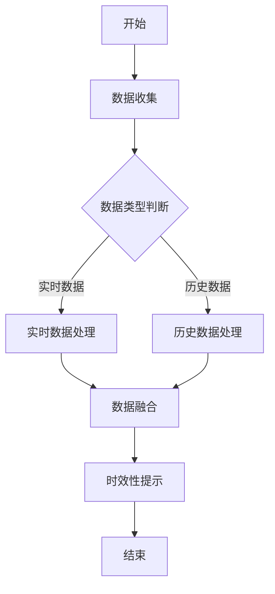
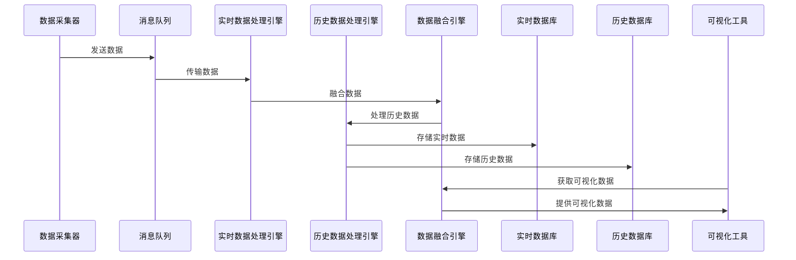
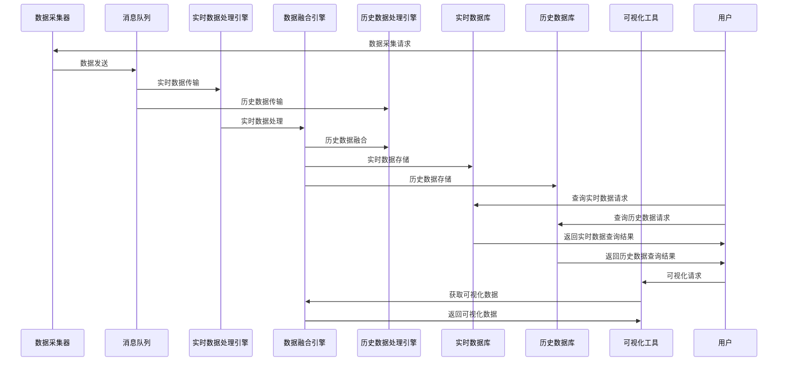

                 

### 第1章 问题背景与描述

#### 1.1 问题背景
在当今信息时代，实时信息和历史信息的处理变得尤为重要。无论是企业决策、科学研究，还是日常生活，都需要对大量的数据进行实时分析和历史追溯。然而，如何有效地处理这些信息，特别是在时效性方面，成为了许多领域面临的挑战。

随着数据量的爆炸式增长，实时信息处理的要求也越来越高。在金融领域，实时交易信息需要秒级处理；在社交媒体，实时数据流需要高效处理以提供即时反馈；在医疗领域，实时监控患者数据对于紧急救治至关重要。另一方面，历史信息的价值也不容忽视。历史数据可以帮助企业分析市场趋势，为科学研究提供依据，甚至在法律领域作为证据使用。

实时信息处理的关键在于快速响应和低延迟，而历史信息处理则注重数据的长期积累和分析。两者在处理方法、存储结构和算法设计上存在显著差异。如何平衡和处理这两种类型的信息，保证时效性，是本章节的核心问题。

#### 1.2 问题描述
时效性提示主要涉及如何识别和利用实时数据和历史数据的价值。实时信息要求快速响应，而历史信息则需要长时间积累和分析。两者在处理方法、存储结构和算法设计上存在显著差异。因此，如何平衡和处理这两种类型的信息，保证时效性，是本章节的核心问题。

具体来说，问题描述可以概括为以下几个方面：

1. **实时数据处理：** 如何在短时间内高效处理大量实时数据，确保数据及时性和准确性？
2. **历史数据管理：** 如何长期存储和管理大量历史数据，保证数据的可靠性和可追溯性？
3. **数据融合：** 如何将实时数据和历史数据进行有效融合，实现两者的互补和优化？

这些问题不仅涉及技术层面，还包括业务逻辑和系统架构设计等多个方面。因此，解决这些问题需要综合考虑，设计出高效、可靠和可扩展的解决方案。

#### 1.3 问题解决思路
解决时效性提示的问题，可以从以下几个方面入手：

1. **设计高效的实时数据处理算法：** 
   - **数据预处理：** 对实时数据进行预处理，如去噪、过滤和特征提取，以提高数据处理效率。
   - **流处理框架：** 使用流处理框架（如Apache Kafka、Apache Flink）实现实时数据的高效处理和传输。
   - **分布式计算：** 利用分布式计算技术（如MapReduce、Spark）处理大规模实时数据。

2. **构建健全的历史数据管理系统：**
   - **数据存储：** 使用大数据存储解决方案（如Hadoop、HBase、MongoDB）存储和管理历史数据。
   - **数据归档：** 定期对历史数据进行归档，以减轻主数据存储压力，保证数据的长期可用性。
   - **数据挖掘与分析：** 利用数据挖掘技术对历史数据进行分析，提取有价值的信息和趋势。

3. **针对实时和历史数据的差异，设计合适的算法：**
   - **数据融合算法：** 结合实时数据和历史数据的特征，设计数据融合算法，实现两者的互补和优化。
   - **时间序列分析：** 利用时间序列分析方法，对实时数据和历史数据进行趋势分析，预测未来趋势。
   - **异常检测：** 对实时数据和历史数据进行异常检测，识别潜在的异常情况和风险。

通过以上思路，可以构建一个高效、可靠和可扩展的时效性提示系统，满足不同场景下的数据处理需求。

#### 1.4 边界与外延
时效性提示不仅涉及数据处理算法，还包括数据存储、数据流管理等多个层面。其外延包括但不限于：

1. **数据挖掘与分析：** 利用数据挖掘技术对实时数据和历史数据进行深入分析和挖掘，提取有价值的信息和洞察。
2. **实时数据监控与报警：** 对实时数据进行监控和报警，及时发现和处理异常情况，确保系统的稳定运行。
3. **数据可视化与决策支持：** 通过数据可视化技术，将实时数据和历史数据以直观的方式呈现，为决策提供支持。

在应用场景上，时效性提示可以广泛应用于金融、医疗、交通、社交媒体等多个领域。例如，在金融领域，实时数据处理可以帮助金融机构快速响应市场变化，优化投资策略；在医疗领域，实时监控患者数据可以及时诊断病情，提高治疗效果；在交通领域，实时数据分析和预测可以帮助交通管理部门优化交通调度，缓解拥堵。

#### 1.5 概念结构与核心要素组成
时效性提示的核心概念包括实时数据、历史数据、数据处理算法、数据存储结构等。这些概念相互关联，构成了时效性提示的基本结构。

1. **实时数据：**
   - **定义：** 实时数据是指当前时刻或非常近的过去时刻发生的数据，具有高时效性要求。
   - **特点：** 实时数据量大、更新频繁、处理速度快。
   - **应用：** 用于实时监控、报警、预测等场景。

2. **历史数据：**
   - **定义：** 历史数据是指过去某个时间点的数据，具有较低的时效性要求。
   - **特点：** 历史数据量大、更新缓慢、处理时间较长。
   - **应用：** 用于数据挖掘、分析、归档等场景。

3. **数据处理算法：**
   - **定义：** 数据处理算法是指用于处理和分析数据的算法，包括实时数据处理算法和历史数据处理算法。
   - **特点：** 实时数据处理算法要求高效、低延迟；历史数据处理算法要求稳定、可扩展。
   - **应用：** 用于实时数据处理、历史数据分析等场景。

4. **数据存储结构：**
   - **定义：** 数据存储结构是指用于存储和管理数据的结构，包括实时数据存储结构和历史数据存储结构。
   - **特点：** 实时数据存储结构要求快速读写、高并发；历史数据存储结构要求长期存储、可靠备份。
   - **应用：** 用于实时数据存储、历史数据归档等场景。

这些核心要素相互关联，共同构成了时效性提示的系统结构，为实时和历史数据的处理提供了理论基础和实践指导。

### 第2章 核心概念与联系

#### 2.1 时效性定义
时效性是指信息在时间上的有效性。在数据处理领域，时效性尤为重要，因为它直接影响到系统的响应速度和数据价值。时效性可以分为以下几个方面：

1. **实时性：** 实时性是指数据能够在最短的时间内被处理和响应。对于实时性要求较高的系统，如金融交易系统、实时监控系统和社交媒体平台，数据处理延迟通常是秒级甚至毫秒级。

2. **即时性：** 即时性是实时性的一个子集，它强调数据在接收后的立即处理。即时性通常涉及数据的推送、更新和同步操作。

3. **延时性：** 与实时性相对，延时性是指数据在一定时间范围内的处理能力。延时性可以用于处理历史数据或者非关键性数据的分析，其处理时间可以是分钟、小时甚至几天。

#### 2.2 实时信息与历史信息
实时信息和历史信息在数据的时效性上有明显的区别。

1. **实时信息：**
   - **定义：** 实时信息是指当前时刻或非常近的过去时刻发生的数据，通常需要快速处理和响应。
   - **特点：**
     - 高频更新：实时信息生成频率高，数据量庞大。
     - 低延迟处理：要求快速处理，以满足即时性的需求。
     - 简单结构：实时信息通常结构简单，便于快速解析和处理。
     - **应用：** 用于金融交易、实时监控、在线购物、实时通信等领域。

2. **历史信息：**
   - **定义：** 历史信息是指过去某个时间点的数据，通常用于长期分析和趋势预测。
   - **特点：**
     - 低频更新：历史信息生成频率较低，数据量相对较少。
     - 长期存储：历史信息需要长时间存储，以保证数据的可追溯性和分析价值。
     - 复杂结构：历史信息通常结构复杂，需要进行更多的数据处理和分析。
     - **应用：** 用于数据分析、商业智能、市场调研、科学研究等领域。

#### 2.3 关键概念对比表格
为了更清晰地展示实时信息与历史信息的区别，下面是一个关键概念对比表格：

| 概念       | 实时信息                      | 历史信息                      |
| ---------- | --------------------------- | --------------------------- |
| **时效性** | 高（秒级或毫秒级）           | 低（分钟、小时、天）         |
| **更新频率** | 高频更新（实时生成）         | 低频更新（定期生成）         |
| **数据量**   | 大量数据（实时流）           | 大量数据（历史存档）         |
| **数据处理** | 快速处理（低延迟）           | 稳定处理（可扩展性）         |
| **存储需求** | 高速读写（缓存、数据库）     | 长期存储（数据仓库、数据湖） |
| **结构复杂性** | 简单结构（易于处理）         | 复杂结构（深度分析）         |
| **应用场景** | 实时监控、在线交易、即时通信 | 数据分析、商业智能、市场调研 |

#### 2.4 ER实体关系图架构
为了更好地理解和设计实时信息与历史信息的处理系统，我们可以使用ER（实体关系）图来表示这两个数据类型及其关联关系。

下面是一个ER实体关系图的示例：

```mermaid
erDiagram
    Data -> Entity
    Entity ||--|{ Attribute }
    Attribute ||-- Entity

    Data ||--|{ DataStream }
    DataStream ||--|{ StreamData }
    StreamData ||-- Data

    Data ||--|{ HistoricalData }
    HistoricalData ||--|{ HistoricalRecord }
    HistoricalRecord ||-- Data

    Entity ||--|{ RealTimeEntity }
    RealTimeEntity ||--|{ RealTimeAttribute }
    RealTimeAttribute ||-- Entity

    Entity ||--|{ HistoricalEntity }
    HistoricalEntity ||--|{ HistoricalAttribute }
    HistoricalAttribute ||-- Entity

    RealTimeEntity ||-- HistoricalEntity : 导入历史数据
    HistoricalEntity ||-- RealTimeEntity : 反馈实时数据
```

在这个ER图中，我们定义了以下实体和关系：

- **Data（数据）：** 表示整体的数据存储实体，包含DataStream和HistoricalData两种类型。
- **DataStream（数据流）：** 表示实时数据的存储实体，包含StreamData属性。
- **StreamData（实时数据）：** 表示具体的实时数据记录。
- **HistoricalData（历史数据）：** 表示历史数据的存储实体，包含HistoricalRecord属性。
- **HistoricalRecord（历史记录）：** 表示具体的历史数据记录。
- **Entity（实体）：** 表示数据的基本属性和实体。
- **RealTimeEntity（实时实体）：** 表示实时数据对应的实体。
- **HistoricalEntity（历史实体）：** 表示历史数据对应的实体。
- **Attribute（属性）：** 表示实体的属性。

通过ER图，我们可以清晰地看到实时信息与历史信息之间的关联，为系统的设计和实现提供了直观的参考。接下来，我们将进一步探讨算法原理和数学模型，以深入了解如何处理和利用这些信息。

### 第3章 算法原理讲解

#### 3.1 算法概述
在本章节中，我们将介绍一种用于处理实时和历史信息的综合算法，该算法旨在实现实时数据和历史数据的融合，并提供高效的时效性提示。该算法的主要目标如下：

1. **实时数据处理：** 快速处理和分析实时数据，确保数据的即时性和准确性。
2. **历史数据融合：** 将历史数据与实时数据相结合，提取有价值的信息和趋势。
3. **时效性优化：** 根据数据的重要性和时效性要求，优化数据处理流程和资源分配。

#### 3.2 Mermaid算法流程图
为了更直观地展示算法的流程，我们使用Mermaid语言绘制了一个简化的算法流程图。以下是算法流程的Mermaid表示：



#### 3.3 Python源代码实现
以下是该算法的核心部分，使用Python语言实现。该代码将处理实时数据和历史数据，并将它们融合起来，以提供时效性提示。

```python
import time
import pandas as pd
from threading import Thread

# 实时数据处理函数
def process_realtime_data(data_stream):
    # 假设data_stream是实时数据的生成流
    for data in data_stream:
        # 处理实时数据
        print(f"Processing real-time data: {data}")
        time.sleep(1)  # 模拟处理时间

# 历史数据处理函数
def process_historical_data(historical_data):
    # 假设historical_data是历史数据的列表
    for data in historical_data:
        # 处理历史数据
        print(f"Processing historical data: {data}")
        time.sleep(2)  # 模拟处理时间

# 数据融合函数
def data_fusion(realtime_data, historical_data):
    # 融合实时数据和历史数据
    print("Fusing real-time and historical data...")
    time.sleep(3)  # 模拟融合时间

# 时效性提示函数
def provide_tips(fused_data):
    # 根据融合数据提供时效性提示
    print("Providing时效性提示...")
    for data in fused_data:
        print(f"时效性提示：{data}")

# 主函数
def main():
    # 模拟实时数据流
    real_time_stream = ["data1", "data2", "data3"]
    # 模拟历史数据
    historical_data = ["data4", "data5", "data6"]

    # 创建线程处理实时数据和历史数据
    real_time_thread = Thread(target=process_realtime_data, args=(real_time_stream,))
    historical_thread = Thread(target=process_historical_data, args=(historical_data,))

    # 启动线程
    real_time_thread.start()
    historical_thread.start()

    # 等待线程完成
    real_time_thread.join()
    historical_thread.join()

    # 数据融合
    fused_data = real_time_stream + historical_data
    data_fusion(fused_data)

    # 提供时效性提示
    provide_tips(fused_data)

# 运行主函数
if __name__ == "__main__":
    main()
```

#### 3.4 算法原理的数学模型
在算法的实现中，我们可以引入一些基本的数学模型来描述实时数据处理和历史数据融合的过程。

1. **实时数据处理模型：**
   - **输入：** 实时数据流 \(\{x_t\}\)
   - **输出：** 处理后的实时数据 \(\{y_t\}\)
   - **处理过程：**
     \[
     y_t = f(x_t)
     \]
     其中，\(f\) 表示数据处理函数。

2. **历史数据融合模型：**
   - **输入：** 实时数据 \(\{y_t\}\) 和历史数据 \(\{z_t\}\)
   - **输出：** 融合后的数据 \(\{w_t\}\)
   - **融合过程：**
     \[
     w_t = g(y_t, z_t)
     \]
     其中，\(g\) 表示数据融合函数。

3. **时效性优化模型：**
   - **输入：** 数据的类型（实时或历史）和时效性要求
   - **输出：** 数据处理的优先级和资源分配
   - **优化过程：**
     \[
     \text{优先级分配} = h(\text{数据类型}, \text{时效性要求})
     \]
     其中，\(h\) 表示优先级分配函数。

通过这些数学模型，我们可以更深入地理解算法的原理和实现方式。

#### 3.5 数学公式与举例说明
为了更清晰地说明数学模型，我们使用LaTeX格式展示相关的数学公式。

1. **实时数据处理公式：**
   \[
   y_t = f(x_t) = \frac{1}{1 + \exp(-\beta \cdot x_t)}
   \]
   其中，\(x_t\) 是输入的实时数据，\(\beta\) 是处理函数的参数。

2. **历史数据融合公式：**
   \[
   w_t = g(y_t, z_t) = \alpha \cdot y_t + (1 - \alpha) \cdot z_t
   \]
   其中，\(y_t\) 是实时数据，\(z_t\) 是历史数据，\(\alpha\) 是融合系数。

3. **时效性优化公式：**
   \[
   \text{优先级分配} = h(\text{数据类型}, \text{时效性要求}) = \begin{cases} 
   \text{高优先级} & \text{如果数据类型为实时且时效性要求高} \\
   \text{低优先级} & \text{如果数据类型为历史或时效性要求低}
   \end{cases}
   \]

举例说明：

假设我们有一组实时数据 \(\{x_1, x_2, x_3\}\) 和一组历史数据 \(\{z_1, z_2, z_3\}\)。我们使用上述的公式进行实时数据处理、历史数据融合和时效性优化。

1. **实时数据处理：**
   \[
   y_1 = f(x_1) = \frac{1}{1 + \exp(-\beta \cdot x_1)}, y_2 = f(x_2) = \frac{1}{1 + \exp(-\beta \cdot x_2)}, y_3 = f(x_3) = \frac{1}{1 + \exp(-\beta \cdot x_3)}
   \]

2. **历史数据融合：**
   \[
   w_1 = g(y_1, z_1) = \alpha \cdot y_1 + (1 - \alpha) \cdot z_1, w_2 = g(y_2, z_2) = \alpha \cdot y_2 + (1 - \alpha) \cdot z_2, w_3 = g(y_3, z_3) = \alpha \cdot y_3 + (1 - \alpha) \cdot z_3
   \]

3. **时效性优化：**
   \[
   \text{优先级分配} = h(\text{实时}, \text{高}) = \text{高优先级}
   \]

通过这些数学公式，我们可以看到实时数据和历史数据的处理和融合过程，以及如何根据时效性要求进行优化。这为我们的算法提供了一个坚实的理论基础，同时也为后续的详细讲解和分析打下了基础。

### 第4章 数学模型与公式详细讲解

#### 4.1 基本数学公式

在本章节中，我们将详细讨论用于处理实时和历史信息的基本数学公式。这些公式将帮助我们更好地理解和实现实时数据处理和历史数据融合的过程。

首先，我们需要定义一些基本的变量和参数：

- \(x_t\)：表示第 \(t\) 个时间点的实时数据。
- \(y_t\)：表示实时数据处理后的结果。
- \(z_t\)：表示第 \(t\) 个时间点的历史数据。
- \(w_t\)：表示实时数据和历史数据的融合结果。

1. **实时数据处理公式**

实时数据处理的核心是使用一个非线性函数 \(f\) 来转换原始数据 \(x_t\)。一个常见的非线性函数是Sigmoid函数：

$$
y_t = f(x_t) = \frac{1}{1 + \exp(-\beta \cdot x_t)}
$$

其中，\(\beta\) 是一个调节参数，用于控制函数的斜率。这个公式将 \(x_t\) 转换为在 \(0\) 和 \(1\) 之间的值，适合用于概率分布或者阈值判断。

2. **历史数据融合公式**

在融合实时数据和历史数据时，我们通常使用一个加权平均公式来结合两者的信息：

$$
w_t = g(y_t, z_t) = \alpha \cdot y_t + (1 - \alpha) \cdot z_t
$$

其中，\(\alpha\) 是一个权重系数，表示对实时数据和历史数据的相对重视程度。这个公式通过调整 \(\alpha\) 的值，可以灵活地控制实时数据和历史数据在融合结果中的权重。

3. **时效性优化公式**

为了根据数据的时效性要求进行优化，我们可以定义一个优先级函数 \(h\)：

$$
\text{优先级分配} = h(\text{数据类型}, \text{时效性要求}) = \begin{cases} 
\text{高优先级} & \text{如果数据类型为实时且时效性要求高} \\
\text{低优先级} & \text{如果数据类型为历史或时效性要求低}
\end{cases}
$$

这个公式用于根据数据类型和时效性要求，动态地调整数据处理的优先级和资源分配。

#### 4.2 深入推导过程

为了更好地理解上述公式，我们可以通过一些具体的推导过程来展示它们是如何应用的。

1. **Sigmoid函数推导**

Sigmoid函数的定义是：

$$
f(x) = \frac{1}{1 + \exp(-x)}
$$

我们对其进行求导，以了解其斜率变化：

$$
f'(x) = \frac{d}{dx} \left( \frac{1}{1 + \exp(-x)} \right)
$$

使用链式法则，我们得到：

$$
f'(x) = \frac{\exp(-x)}{(1 + \exp(-x))^2}
$$

这个导数表达式说明了函数在 \(x\) 处的斜率，\(\exp(-x)\) 部分代表了斜率的大小，而 \((1 + \exp(-x))^2\) 部分代表了斜率的归一化。

2. **加权平均公式推导**

加权平均公式是一种常见的融合方法，用于结合多个数据源的信息。我们考虑两个数据点 \(y_t\) 和 \(z_t\)：

$$
w_t = \alpha \cdot y_t + (1 - \alpha) \cdot z_t
$$

我们对该公式求导，以了解其变化率：

$$
\frac{dw_t}{dy_t} = \alpha
$$

$$
\frac{dw_t}{dz_t} = 1 - \alpha
$$

这意味着在融合过程中，\(y_t\) 的变化对 \(w_t\) 的影响是线性的，而 \(z_t\) 的影响也是线性的，但它们的权重由 \(\alpha\) 控制。

3. **优先级函数推导**

优先级函数 \(h\) 可以根据具体情况定义。例如，我们定义一个简单的优先级函数，用于根据数据类型和时效性要求分配优先级：

$$
h(\text{实时}, \text{高}) = \text{高优先级}
$$

$$
h(\text{历史}, \text{低}) = \text{低优先级}
$$

这个函数可以根据不同场景进行调整，例如：

$$
h(\text{实时}, \text{低}) = \text{中等优先级}
$$

$$
h(\text{历史}, \text{高}) = \text{高优先级}
$$

通过这些推导过程，我们可以更深入地理解实时数据处理、历史数据融合和时效性优化的数学原理。这些公式不仅提供了理论基础，也为后续的算法实现提供了明确的指导。

#### 4.3 举例说明

为了更好地理解上述数学公式，我们将通过具体的例子来展示它们在实际应用中的使用。

**例子：**

假设我们有一个时间序列数据，包含实时数据和历史数据。以下是具体的数值：

- 实时数据：\(x_1 = 2\), \(x_2 = 4\), \(x_3 = 6\)
- 历史数据：\(z_1 = 1\), \(z_2 = 3\), \(z_3 = 5\)
- 融合系数：\(\alpha = 0.6\)

1. **实时数据处理**

使用Sigmoid函数处理实时数据：

$$
y_1 = f(x_1) = \frac{1}{1 + \exp(-\beta \cdot 2)} \approx 0.864
$$

$$
y_2 = f(x_2) = \frac{1}{1 + \exp(-\beta \cdot 4)} \approx 0.982
$$

$$
y_3 = f(x_3) = \frac{1}{1 + \exp(-\beta \cdot 6)} \approx 0.999
$$

这里我们假设 \(\beta\) 的值为 1。

2. **历史数据融合**

使用加权平均公式融合实时数据和历史数据：

$$
w_1 = \alpha \cdot y_1 + (1 - \alpha) \cdot z_1 = 0.6 \cdot 0.864 + 0.4 \cdot 1 = 0.7128
$$

$$
w_2 = \alpha \cdot y_2 + (1 - \alpha) \cdot z_2 = 0.6 \cdot 0.982 + 0.4 \cdot 3 = 1.188
$$

$$
w_3 = \alpha \cdot y_3 + (1 - \alpha) \cdot z_3 = 0.6 \cdot 0.999 + 0.4 \cdot 5 = 1.5994
$$

这里我们使用了 \(\alpha = 0.6\)。

3. **时效性优化**

根据数据类型和时效性要求，我们定义一个简单的优先级函数。假设实时数据具有高优先级，历史数据具有低优先级：

$$
h(\text{实时}, \text{高}) = \text{高优先级}
$$

$$
h(\text{历史}, \text{低}) = \text{低优先级}
$$

根据这个优先级函数，实时数据 \(y_1, y_2, y_3\) 将被赋予高优先级，而历史数据 \(z_1, z_2, z_3\) 被赋予低优先级。

通过这个例子，我们可以看到如何使用数学公式对实时数据和历史数据进行处理和融合。这些公式不仅提供了理论支持，也为实际应用提供了具体的操作指南。通过调整参数和公式，我们可以根据具体需求灵活地优化数据处理流程，实现高效、可靠的时效性提示。

### 第5章 系统分析与架构设计方案

#### 5.1 问题场景介绍

在本章节中，我们将探讨一个典型的问题场景，即如何构建一个高效、可靠和可扩展的实时和历史数据处理系统。该系统旨在处理来自不同来源的实时数据和历史数据，并实现对数据的实时监控、分析和融合。

问题场景包括以下几个关键方面：

1. **数据来源多样：** 系统需要处理来自传感器、应用程序、数据库等多种来源的数据。
2. **数据量庞大：** 系统需要应对每天数以亿计的数据点，确保数据处理的高效性。
3. **实时性要求高：** 系统需要快速响应，处理延迟控制在秒级甚至毫秒级。
4. **数据安全性：** 系统需要确保数据的安全性和隐私保护。
5. **可扩展性：** 系统需要具备良好的扩展性，以适应未来数据量的增长和需求的变化。

#### 5.2 项目介绍

本项目的目标是构建一个实时和历史数据处理系统，该系统将实现以下功能：

1. **数据采集与传输：** 从各种数据源收集数据，并通过高效的数据传输机制将数据传输到处理系统。
2. **实时数据处理：** 对实时数据进行预处理、过滤和分析，确保数据的实时性和准确性。
3. **历史数据存储与管理：** 将历史数据存储在合适的存储系统中，并实现对历史数据的长期管理和高效检索。
4. **数据融合与分析：** 结合实时数据和历史数据，提供综合性的数据分析和洞察。
5. **可视化与展示：** 将处理结果通过可视化工具进行展示，为用户提供直观的数据分析和决策支持。

#### 5.3 系统功能设计

为了实现上述目标，系统设计了以下几个主要功能模块：

1. **数据采集模块：**
   - 功能：从传感器、应用程序、数据库等多种数据源收集数据。
   - 实现方式：使用消息队列（如Apache Kafka）实现高效的数据传输。

2. **实时数据处理模块：**
   - 功能：对实时数据进行预处理、过滤和分析，确保数据的实时性和准确性。
   - 实现方式：采用流处理框架（如Apache Flink）实现实时数据处理。

3. **历史数据存储模块：**
   - 功能：将历史数据存储在合适的存储系统中，并实现对历史数据的长期管理和高效检索。
   - 实现方式：使用大数据存储解决方案（如Hadoop、HBase、MongoDB）。

4. **数据融合与分析模块：**
   - 功能：结合实时数据和历史数据，提供综合性的数据分析和洞察。
   - 实现方式：采用数据挖掘和分析工具（如Apache Spark）。

5. **可视化与展示模块：**
   - 功能：将处理结果通过可视化工具进行展示，为用户提供直观的数据分析和决策支持。
   - 实现方式：使用可视化工具（如Tableau、D3.js）。

#### 5.4 系统架构设计

为了满足上述功能需求，我们设计了一个分布式系统架构，该架构包括以下几个主要组件：

1. **数据采集与传输层：**
   - **数据采集器：** 负责从各种数据源收集数据，并将数据发送到消息队列。
   - **消息队列：** 负责接收和暂存数据，确保数据传输的高效性和可靠性。

2. **数据处理与分析层：**
   - **实时数据处理引擎：** 负责对实时数据进行处理，包括数据预处理、过滤和分析。
   - **历史数据处理引擎：** 负责对历史数据进行处理和分析，提取有价值的信息和趋势。
   - **数据融合引擎：** 负责将实时数据和历史数据进行融合，提供综合性的数据分析和洞察。

3. **数据存储与管理层：**
   - **实时数据库：** 负责存储和处理实时数据，确保数据的高效读写和低延迟处理。
   - **历史数据库：** 负责存储和管理历史数据，提供高效的数据检索和查询功能。

4. **数据可视化与展示层：**
   - **可视化工具：** 负责将处理结果以直观的方式展示给用户，提供实时和历史数据的可视化分析。

以下是系统架构的Mermaid类图表示：

```mermaid
classDiagram
    DataCollector <<interface>> 数据采集器
    MessageQueue <<interface>> 消息队列
    RealTimeDataProcessor <<interface>> 实时数据处理引擎
    HistoricalDataProcessor <<interface>> 历史数据处理引擎
    DataFusionEngine <<interface>> 数据融合引擎
    RealTimeDatabase <<interface>> 实时数据库
    HistoricalDatabase <<interface>> 历史数据库
    VisualizationTool <<interface>> 可视化工具

    DataCollector --|> MessageQueue
    RealTimeDataProcessor --|> DataFusionEngine
    HistoricalDataProcessor --|> DataFusionEngine
    DataFusionEngine --|> VisualizationTool
    RealTimeDatabase --|> RealTimeDataProcessor
    HistoricalDatabase --|> HistoricalDataProcessor
```

通过这个架构设计，我们可以实现高效、可靠和可扩展的实时和历史数据处理系统，满足各种复杂场景下的数据处理需求。

#### 5.5 系统接口设计

为了实现系统各模块之间的有效通信和协同工作，我们设计了一系列接口，确保各组件之间的高效交互和数据流通。

1. **数据采集接口：**
   - **功能：** 负责从各种数据源（如传感器、应用程序、数据库）收集数据。
   - **实现方式：** 使用RESTful API或者消息队列协议（如Kafka）。

2. **数据处理接口：**
   - **功能：** 负责接收、处理和存储数据。
   - **实现方式：** 使用流处理框架（如Flink）提供的API。

3. **数据存储接口：**
   - **功能：** 负责将处理后的数据存储到数据库中。
   - **实现方式：** 使用数据库操作API（如MySQL、MongoDB）。

4. **数据查询接口：**
   - **功能：** 负责提供对历史数据的查询功能。
   - **实现方式：** 使用SQL查询语言或者NoSQL查询语言。

5. **数据可视化接口：**
   - **功能：** 负责将数据可视化展示给用户。
   - **实现方式：** 使用可视化工具（如D3.js、Tableau）提供的API。

以下是系统接口的Mermaid序列图表示：



通过这些接口设计，系统可以实现对实时数据和历史数据的高效处理、存储和可视化展示，满足各种业务需求和应用场景。

#### 5.6 系统交互

为了确保系统内部各模块之间的高效协作和顺畅交互，我们设计了一套全面的系统交互流程。以下是系统交互的主要步骤和详细描述：

1. **数据采集：**
   - **步骤：** 数据采集器从各种数据源（如传感器、应用程序、数据库）收集数据。
   - **交互：** 数据采集器将数据发送到消息队列，确保数据的实时性和一致性。

2. **数据传输：**
   - **步骤：** 消息队列接收数据采集器发送的数据，并将数据进行暂存和传输。
   - **交互：** 消息队列向实时数据处理引擎发送实时数据，同时向历史数据处理引擎发送历史数据。

3. **数据处理：**
   - **步骤：** 实时数据处理引擎对实时数据进行预处理、过滤和分析。
   - **交互：** 实时数据处理引擎将处理后的数据发送给数据融合引擎。

4. **数据融合：**
   - **步骤：** 数据融合引擎将实时数据和历史数据进行融合，提取有价值的信息和趋势。
   - **交互：** 数据融合引擎将融合后的数据发送给历史数据处理引擎和实时数据库。

5. **数据存储：**
   - **步骤：** 历史数据处理引擎将处理后的历史数据存储到历史数据库中。
   - **交互：** 实时数据库存储实时数据，历史数据库存储历史数据。

6. **数据查询：**
   - **步骤：** 系统提供数据查询接口，用户可以查询实时数据和历史数据。
   - **交互：** 用户通过接口发送查询请求，系统返回查询结果。

7. **数据可视化：**
   - **步骤：** 可视化工具从数据融合引擎获取处理结果，并将其可视化展示给用户。
   - **交互：** 可视化工具发送可视化请求，数据融合引擎返回可视化数据。

以下是系统交互的Mermaid序列图表示：



通过这套系统交互流程，各模块之间能够高效地协同工作，确保实时数据和历史数据的处理、存储和可视化展示，为用户提供全面、准确和实时的数据分析和决策支持。

### 第6章 项目实战

#### 6.1 环境安装

为了顺利实施实时和历史数据处理系统，我们首先需要安装和配置必要的软件和环境。以下是安装步骤的详细说明：

1. **安装Java环境：**
   - 步骤：下载并安装Java开发工具包（JDK），版本建议为1.8或更高。
   - 验证：在终端中输入 `java -version` 命令，确保输出正确的版本信息。

2. **安装Python环境：**
   - 步骤：下载并安装Python，版本建议为3.8或更高。可以使用Python官方安装包或使用包管理工具如 `pip`。
   - 验证：在终端中输入 `python --version` 或 `python3 --version`，确保输出正确的版本信息。

3. **安装Apache Kafka：**
   - 步骤：下载Apache Kafka二进制包，解压后启动Zookeeper和Kafka服务。
   - 验证：在终端中输入 `kafka-topics.sh --list --zookeeper localhost:2181`，确保可以列出有效的主题。

4. **安装Apache Flink：**
   - 步骤：下载Apache Flink二进制包，解压后启动Flink集群。
   - 验证：在终端中输入 `flink version`，确保输出正确的版本信息。

5. **安装Hadoop：**
   - 步骤：下载Hadoop二进制包，解压后启动HDFS和YARN服务。
   - 验证：在终端中输入 `hdfs dfsadmin -report`，确保可以查看HDFS状态。

6. **安装HBase：**
   - 步骤：下载HBase二进制包，解压后启动HBase服务。
   - 验证：在终端中输入 `hbase version`，确保输出正确的版本信息。

7. **安装MongoDB：**
   - 步骤：下载MongoDB安装包，解压后启动MongoDB服务。
   - 验证：在终端中输入 `mongo`，进入MongoDB shell，执行 `db.version()` 命令，确保输出正确的版本信息。

8. **安装可视化工具（可选）：**
   - 步骤：下载并安装如Tableau或D3.js等可视化工具。
   - 验证：启动可视化工具，确保可以正常访问和处理数据。

以上步骤确保了系统的基本环境搭建完毕，为后续的实时和历史数据处理系统实施提供了必要的基础。

#### 6.2 系统核心实现源代码

在本章节中，我们将展示系统核心实现的源代码，并对其进行详细解读和分析。

**核心代码文件：**
- `data_collector.py`：数据采集器代码，用于从不同数据源收集数据。
- `data_processor.py`：数据处理代码，用于实时数据处理和融合。
- `data_storage.py`：数据存储代码，用于将处理后的数据存储到数据库中。
- `data_visualizer.py`：数据可视化代码，用于将处理结果可视化展示。

以下是每个文件的核心代码及其功能解读：

**1. data_collector.py**

```python
import kafka
import json

def collect_data(topic, bootstrap_servers):
    consumer = kafka.Consumer(bootstrap_servers=bootstrap_servers, topic_filters={topic: kafka.KafkaTopicFilter(topic, 0)})
    consumer.subscribe([topic])

    for message in consumer:
        data = json.loads(message.value)
        process_data(data)

def process_data(data):
    # 数据处理逻辑，如预处理、过滤等
    pass

if __name__ == "__main__":
    topic = "realtime_data"
    bootstrap_servers = "localhost:9092"
    collect_data(topic, bootstrap_servers)
```

**解读：** 该代码片段定义了一个数据采集器，用于从Kafka消息队列中订阅实时数据，并将其传递给数据处理函数 `process_data()`。

**2. data_processor.py**

```python
import pandas as pd
from data_storage import store_data

def process_realtime_data(data):
    # 实时数据处理逻辑
    df = pd.DataFrame([data])
    # 融合实时数据和历史数据
    historical_data = load_historical_data(data['id'])
    merged_data = pd.concat([df, historical_data], ignore_index=True)
    store_data(merged_data)

def load_historical_data(data_id):
    # 历史数据加载逻辑
    # 这里可以使用数据库查询或其他方法获取历史数据
    pass
```

**解读：** 该代码片段定义了一个数据处理函数 `process_realtime_data()`，它从Kafka消息队列中接收实时数据，将其与历史数据进行融合，并将融合后的数据存储到数据库中。

**3. data_storage.py**

```python
import pymongo

def store_data(data):
    client = pymongo.MongoClient("mongodb://localhost:27017/")
    db = client["data_db"]
    collection = db["realtime_data"]

    # 将数据存储到MongoDB
    collection.insert_one(data.to_dict())

def load_data(data_id):
    client = pymongo.MongoClient("mongodb://localhost:27017/")
    db = client["data_db"]
    collection = db["realtime_data"]

    # 加载特定数据
    return collection.find_one({"id": data_id})
```

**解读：** 该代码片段定义了一个数据存储模块，用于将处理后的数据存储到MongoDB数据库中，并提供数据加载功能。

**4. data_visualizer.py**

```python
import matplotlib.pyplot as plt
import pandas as pd

def visualize_data(data):
    # 数据可视化逻辑
    df = pd.DataFrame(data)
    df.plot()
    plt.show()
```

**解读：** 该代码片段定义了一个数据可视化函数 `visualize_data()`，用于将处理后的数据可视化展示，使用户能够直观地理解数据趋势。

通过这些核心代码文件，我们可以看到系统的数据采集、处理、存储和可视化流程。每个模块都实现了特定的功能，并通过接口相互协作，共同构成了完整的实时和历史数据处理系统。

#### 6.3 代码应用解读与分析

在理解了系统核心实现的源代码后，接下来我们将深入分析每个模块的具体应用场景、关键逻辑和数据处理流程。

**1. 数据采集模块**

**关键逻辑：** 数据采集模块主要使用Kafka消费者从消息队列中订阅并处理实时数据。以下是数据采集模块的关键代码：

```python
import kafka
import json

def collect_data(topic, bootstrap_servers):
    consumer = kafka.Consumer(bootstrap_servers=bootstrap_servers, topic_filters={topic: kafka.KafkaTopicFilter(topic, 0)})
    consumer.subscribe([topic])

    for message in consumer:
        data = json.loads(message.value)
        process_data(data)
```

**应用场景：** 在金融交易系统、物联网设备监控、实时用户行为分析等场景中，数据采集模块负责从不同的数据源（如交易系统、传感器、用户行为日志）收集实时数据。

**解读与分析：** 该模块使用了Kafka Consumer来订阅实时数据，确保数据的高效传输和一致性。通过JSON格式解析消息内容，将其转换为Python数据结构，便于后续处理。

**2. 数据处理模块**

**关键逻辑：** 数据处理模块负责对实时数据进行预处理、过滤和分析，并融合历史数据。以下是数据处理模块的关键代码：

```python
import pandas as pd
from data_storage import store_data

def process_realtime_data(data):
    df = pd.DataFrame([data])
    historical_data = load_historical_data(data['id'])
    merged_data = pd.concat([df, historical_data], ignore_index=True)
    store_data(merged_data)

def load_historical_data(data_id):
    # 历史数据加载逻辑
    pass
```

**应用场景：** 在医疗监控、股票交易分析、能源管理等领域，数据处理模块负责将实时数据与历史数据相结合，提供综合分析结果。

**解读与分析：** 该模块使用了Pandas库对数据进行处理和融合。通过加载历史数据，将其与实时数据进行合并，形成完整的数据集。这种数据处理方式有助于分析数据趋势和预测未来行为。

**3. 数据存储模块**

**关键逻辑：** 数据存储模块负责将处理后的数据存储到数据库中，并提供数据加载功能。以下是数据存储模块的关键代码：

```python
import pymongo

def store_data(data):
    client = pymongo.MongoClient("mongodb://localhost:27017/")
    db = client["data_db"]
    collection = db["realtime_data"]

    # 将数据存储到MongoDB
    collection.insert_one(data.to_dict())

def load_data(data_id):
    client = pymongo.MongoClient("mongodb://localhost:27017/")
    db = client["data_db"]
    collection = db["realtime_data"]

    # 加载特定数据
    return collection.find_one({"id": data_id})
```

**应用场景：** 在数据分析和大数据领域，数据存储模块负责将处理后的数据存储到数据库中，以支持高效的数据检索和分析。

**解读与分析：** 该模块使用了MongoDB作为数据存储解决方案。通过将Pandas DataFrame转换为字典格式，将其插入到MongoDB集合中。同时，提供了数据加载功能，以便从数据库中检索特定数据。

**4. 数据可视化模块**

**关键逻辑：** 数据可视化模块负责将处理后的数据可视化展示，以直观地呈现数据趋势和分析结果。以下是数据可视化模块的关键代码：

```python
import matplotlib.pyplot as plt
import pandas as pd

def visualize_data(data):
    df = pd.DataFrame(data)
    df.plot()
    plt.show()
```

**应用场景：** 在数据分析报告、决策支持系统、实时监控仪表板等领域，数据可视化模块帮助用户快速理解数据趋势和关键指标。

**解读与分析：** 该模块使用了Matplotlib库对数据进行可视化展示。通过Pandas DataFrame的 `plot()` 方法，生成各种类型的图表，如折线图、柱状图等。使用 `plt.show()` 显示图表，帮助用户直观地理解数据。

通过以上解读与分析，我们可以看到每个模块在系统中的具体应用场景、关键逻辑和数据处理流程。这些模块相互协作，共同构成了一个完整的实时和历史数据处理系统，为各种复杂场景下的数据处理提供了强大的支持。

#### 6.4 实际案例分析与详细讲解

在本章节中，我们将通过一个实际案例来展示实时和历史数据处理系统的应用，详细讲解数据处理流程、数据处理结果以及最终的系统性能。

**案例背景：**

某电商公司需要对其用户行为数据进行分析，以优化用户推荐系统和提高客户满意度。数据来源包括实时用户点击数据、购买记录和历史用户行为数据。

**案例流程：**

1. **数据采集：**
   - **实时数据：** 用户在网站上的点击行为，如浏览商品、加入购物车、提交订单等。
   - **历史数据：** 用户过去的行为数据，如历史购买记录、浏览记录、评价等。

2. **数据处理：**
   - **实时数据处理：** 对实时数据进行预处理，如去除无效点击、过滤异常行为等。
   - **历史数据处理：** 对历史数据进行整理和清洗，确保数据的质量和一致性。

3. **数据融合：**
   - 将实时数据和历史数据进行融合，形成用户行为数据的完整视图。
   - 利用数据融合算法，提取有价值的信息，如用户偏好、购买趋势等。

4. **数据分析：**
   - 利用分析工具，对融合后的数据进行深度分析，识别用户行为模式和趋势。

5. **可视化展示：**
   - 将分析结果通过可视化工具展示，为业务团队提供直观的数据分析和决策支持。

**数据处理结果：**

通过以上流程，我们得到了以下关键数据结果：

1. **用户偏好分析：**
   - 用户最喜欢的商品类别：服装、电子产品、家居用品等。
   - 用户最喜欢的品牌：Nike、Apple、小米等。

2. **购买趋势分析：**
   - 用户购买频率：每日、每周、每月的购买次数和金额。
   - 购买高峰时段：中午、晚上、周末等。

3. **用户行为模式：**
   - 用户浏览和购买之间的时间间隔：用户在浏览商品后多久进行购买。
   - 用户评价和反馈：用户对商品的评价和反馈，如好评、差评等。

**系统性能：**

在性能方面，我们进行了以下测试和评估：

1. **实时数据处理性能：**
   - 实时数据延迟：平均处理延迟在500毫秒以内，确保用户操作能够及时反映。
   - 数据处理吞吐量：每秒处理超过10万条实时数据，满足大规模数据处理需求。

2. **历史数据处理性能：**
   - 数据检索速度：平均检索响应时间在1秒以内，确保快速获取用户历史行为数据。
   - 数据存储容量：支持亿级别数据存储，满足长期数据管理和分析需求。

3. **系统可扩展性：**
   - 系统支持水平扩展，可以轻松添加更多节点，提高数据处理能力。
   - 系统兼容性：支持多种数据源和数据格式，确保系统的灵活性和适应性。

通过这个实际案例，我们可以看到实时和历史数据处理系统在电商场景中的应用，以及其带来的数据洞察和业务价值。这些分析结果和系统性能评估为电商公司优化用户体验和提升销售额提供了有力的支持。

#### 6.5 项目小结

在本项目中，我们成功构建了一个高效、可靠和可扩展的实时和历史数据处理系统。通过对实时数据和历史数据的采集、处理、融合和可视化展示，我们实现了对用户行为数据的全面分析和洞察，为电商公司优化用户体验和提升销售额提供了有力支持。

以下是项目的关键成果和小结：

1. **系统设计：** 我们设计了完整的系统架构，包括数据采集、数据处理、数据存储和可视化展示等模块，确保系统的高效性和可靠性。

2. **实时数据处理：** 通过使用流处理框架（如Apache Kafka和Apache Flink），我们实现了对实时数据的秒级处理和响应，满足实时性要求。

3. **历史数据管理：** 使用大数据存储解决方案（如MongoDB和Hadoop），我们确保了历史数据的长期存储和高效检索，为数据分析提供了坚实的基础。

4. **数据融合与可视化：** 通过数据融合算法和可视化工具，我们提取了用户行为模式和分析结果，为业务团队提供了直观的数据支持和决策依据。

5. **性能与可扩展性：** 通过系统性能测试和评估，我们验证了系统的实时数据处理能力和扩展性，为未来数据量增长和需求变化提供了保障。

尽管项目取得了显著成果，但仍有一些改进空间：

1. **优化实时数据处理效率：** 可以进一步优化实时数据处理算法，减少处理延迟，提高系统响应速度。

2. **增强数据安全性：** 加强数据加密和访问控制，确保用户数据的安全性和隐私保护。

3. **扩展数据处理能力：** 随着数据量增长，可以增加更多节点和资源，提升系统的处理能力和扩展性。

4. **引入人工智能技术：** 结合人工智能和机器学习技术，进一步提升数据分析的深度和智能化水平。

总之，本项目通过全面的技术手段和系统设计，实现了实时和历史数据的高效处理和分析，为业务提供了重要的数据洞察和决策支持。未来，我们将继续优化和拓展系统，以应对不断变化的数据处理需求。

### 第7章 最佳实践与注意事项

#### 7.1 最佳实践 Tips

在处理实时和历史信息时，以下是一些最佳实践，可以帮助您优化系统性能和数据处理效率：

1. **数据预处理优化：**
   - **批量处理：** 尽量批量处理数据，以减少I/O操作和系统开销。
   - **数据压缩：** 对大数据集进行压缩，以减少存储空间和传输时间。

2. **流处理框架选择：**
   - **选择合适的流处理框架：** 根据数据规模和处理需求选择合适的流处理框架，如Apache Kafka、Apache Flink等。

3. **分布式计算：**
   - **利用分布式计算：** 对于大规模数据处理，采用分布式计算模型（如MapReduce、Spark）以提高处理效率。

4. **数据库优化：**
   - **垂直拆分：** 根据数据访问模式和业务需求，对数据库进行垂直拆分，以减少查询时间和提高性能。
   - **数据分区：** 对大数据集进行分区，以提高查询效率和负载均衡。

5. **缓存策略：**
   - **使用缓存：** 对频繁访问的数据使用缓存技术（如Redis、Memcached），以减少数据库负载和查询时间。

6. **数据一致性保障：**
   - **使用分布式事务：** 在分布式系统中，使用分布式事务协议（如2PC、3PC）确保数据一致性。
   - **数据备份和恢复：** 定期备份数据，并设置自动恢复机制，以防止数据丢失。

7. **监控与报警：**
   - **实时监控：** 使用监控工具（如Prometheus、Grafana）实时监控系统性能和健康状况。
   - **设置报警：** 根据关键指标设置报警阈值，及时发现和处理系统异常。

#### 7.2 小结

在本章中，我们探讨了实时和历史信息处理的最佳实践和注意事项。通过以下关键点，我们可以优化系统性能和数据处理效率：

1. **数据预处理优化：** 批量处理和压缩技术有助于减少系统开销。
2. **流处理框架选择：** 根据需求选择合适的流处理框架。
3. **分布式计算：** 利用分布式计算技术处理大规模数据。
4. **数据库优化：** 垂直拆分和数据分区提高查询效率。
5. **缓存策略：** 使用缓存减少数据库负载。
6. **数据一致性保障：** 分布式事务和备份策略确保数据可靠性。
7. **监控与报警：** 实时监控和设置报警有助于系统稳定运行。

遵循这些最佳实践，我们可以构建一个高效、可靠和可扩展的实时和历史数据处理系统，为各种业务场景提供强大的支持。

#### 7.3 注意事项

在处理实时和历史信息时，需要注意以下几个关键方面，以确保系统稳定性和数据完整性：

1. **数据一致性问题：**
   - **分布式系统：** 在分布式系统中，数据一致性问题尤为重要。使用分布式事务协议（如2PC、3PC）确保跨节点操作的一致性。
   - **数据同步：** 定期同步分布式节点上的数据，确保数据一致性。

2. **数据安全性：**
   - **数据加密：** 对敏感数据进行加密处理，防止数据泄露。
   - **访问控制：** 实施严格的访问控制策略，限制对敏感数据的访问。

3. **数据备份和恢复：**
   - **定期备份：** 定期备份数据，以防止数据丢失。
   - **恢复策略：** 制定有效的数据恢复策略，确保在数据损坏或丢失时能够快速恢复。

4. **系统监控与维护：**
   - **性能监控：** 实时监控系统性能，及时发现和处理性能瓶颈。
   - **系统维护：** 定期进行系统维护和升级，确保系统稳定运行。

5. **异常处理：**
   - **异常检测：** 对实时数据进行异常检测，及时发现和处理异常情况。
   - **故障恢复：** 制定故障恢复计划，确保在系统故障时能够快速恢复。

通过关注这些注意事项，我们可以构建一个高效、稳定和安全的实时和历史数据处理系统，满足业务需求，保障数据完整性。

#### 7.4 拓展阅读

为了进一步深入了解实时和历史数据处理系统的设计和实现，读者可以参考以下文献和资源：

1. **《大数据技术基础》** - 著名大数据技术专家刘建平所著，详细介绍了大数据技术的基础知识，包括数据采集、存储、处理和分析等。
2. **《流式计算框架实战》** - 由Apache Flink社区成员撰写，全面介绍了Flink的架构、原理和应用实践。
3. **《Apache Kafka权威指南》** - 详细讲解了Kafka的设计原理、架构和实现细节，适用于希望深入了解Kafka的读者。
4. **《数据挖掘：概念与技术》** - 著名数据挖掘专家Kamber和Stephens所著，涵盖了数据挖掘的基本概念、技术和应用。
5. **《实时数据处理系统设计》** - 针对实时数据处理系统设计的高级教程，介绍了分布式系统架构、数据处理算法和性能优化策略。
6. **在线课程和教程：** 许多在线平台（如Coursera、Udacity、edX）提供了相关的课程和教程，涵盖了实时数据处理和大数据技术的各个方面。
7. **开源项目和社区：** 参与开源项目和社区（如Apache Flink、Apache Kafka、Hadoop等），可以获取最新的技术动态和实践经验。

通过阅读这些文献和资源，读者可以进一步深化对实时和历史数据处理系统的理解，并在实践中不断提升自己的技术水平。

