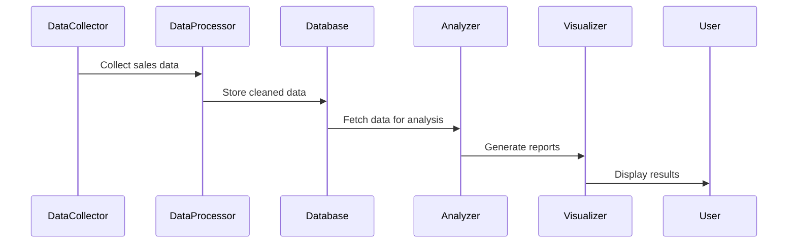
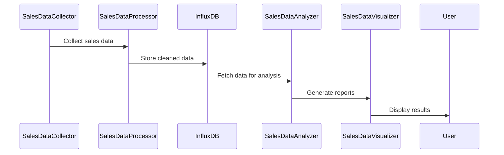

                 


### 关键词

时间序列数据库，LLM应用监控，实时数据采集，数据分析，可视化

### 摘要

本文深入探讨了时间序列数据库在大型语言模型（LLM）应用监控中的重要性及其具体应用。首先，文章介绍了时间序列数据库的基本概念、特性和核心要素，以及其在金融、物联网和实时监控等领域的应用。接着，详细解析了时间序列数据库的原理，包括数据存储、索引和查询机制，并对比了InfluxDB、KairosDB和OpenTSDB等常见的时间序列数据库。

在第二部分，文章聚焦于LLM应用监控，阐述了监控的重要性和挑战，并介绍了时间序列数据库在LLM监控中的应用。具体包括数据采集与预处理、数据存储与管理、数据分析和可视化。接着，通过一个案例展示了如何实现LLM应用监控，并提供了最佳实践和拓展阅读建议。

本文旨在为读者提供一个全面、深入的指南，帮助理解时间序列数据库在LLM应用监控中的关键作用，并提供实用的实践案例。

----------------------------------------------------------------

## 目录大纲

### 第一部分：时间序列数据库基础

### 第1章：时间序列数据库概述

### 第2章：时间序列数据库原理

### 第3章：常见的时间序列数据库介绍

### 第二部分：时间序列数据库在LLM应用监控中的实际应用

### 第4章：LLM应用监控概述

### 第5章：时间序列数据库在LLM应用监控中的应用

### 第6章：LLM应用监控案例

### 第7章：时间序列数据库在LLM应用监控中的最佳实践

### 第一部分：时间序列数据库基础

### 第1章：时间序列数据库概述

#### 1.1 时间序列数据的基本概念

时间序列数据库（Time-Series Database, TSDB）是专门为处理时间序列数据设计的数据库系统。时间序列数据是一种按照时间顺序排列的数据点序列，通常用于记录各种动态系统的行为，如股票价格、温度变化、网站流量等。时间序列数据具有以下几个基本特征：

- **时序性**：数据点按照时间顺序排列，每个数据点都与一个特定的时间戳相关联。
- **周期性**：许多时间序列数据呈现出周期性的波动，如季节性或日周期。
- **趋势性**：数据序列可能表现出长期增长或减少的趋势。

#### 问题背景

时间序列数据在现代数据分析中扮演着至关重要的角色。例如，金融分析中的股票市场预测、物联网（IoT）设备的状态监控、实时交通流量监测等，都需要处理大量的时间序列数据。

#### 问题解决

时间序列数据库的出现，解决了传统数据库在处理时间序列数据时的瓶颈，提供了高效的存储、索引和查询机制。通过时间序列数据库，用户可以轻松地对大量时间序列数据进行高效的分析和处理。

#### 边界与外延

虽然时间序列数据库广泛应用于各个领域，但它主要针对的是时间顺序上的数据。对于非时间序列数据，如结构化数据、文本数据等，传统的关系型数据库或NoSQL数据库可能是更好的选择。

#### 1.2 时间序列数据的特性

时间序列数据具有以下特性：

- **数据类型**：时间序列数据通常是数值型，如温度、股票价格等，但也可能包括分类数据或布尔值。
- **数据格式**：时间序列数据通常以时间戳为索引，记录每个时间点上的数据值。
- **数据存储方式**：时间序列数据库通常采用列式存储，以优化查询性能。

#### 1.3 时间序列数据的核心要素组成

时间序列数据的核心要素包括：

- **时间戳**：表示数据点发生的时间。
- **指标数据**：每个时间点上的观测值。
- **数据序列**：由多个时间戳和指标数据组成的有序集合。

#### 1.4 时间序列数据的应用领域

时间序列数据在以下领域具有广泛的应用：

- **金融领域**：用于股票市场分析、风险评估和趋势预测。
- **物联网领域**：用于监控传感器数据、设备状态和能源消耗。
- **实时监控领域**：用于网站流量监控、服务器性能监控和网络安全监控。

### 第2章：时间序列数据库原理

#### 2.1 时间序列数据库的基本原理

时间序列数据库的基本原理包括数据存储、索引和查询机制。

- **数据存储原理**：时间序列数据库通常采用列式存储，将时间戳和指标数据存储在不同的列中，以优化空间利用和查询效率。
- **数据索引原理**：时间序列数据库使用时间戳作为主键，并可能使用额外的索引（如倒排索引）来加速查询。
- **数据查询原理**：时间序列数据库提供高效的查询接口，支持对时间范围、指标值等条件的查询。

#### 2.2 时间序列数据库的设计原则

时间序列数据库的设计原则包括以下方面：

- **数据一致性原则**：确保数据的完整性和准确性。
- **数据可靠性原则**：确保数据的安全性和持久性。
- **数据可用性原则**：确保数据的快速访问和查询性能。

#### 2.3 时间序列数据库的常见结构

时间序列数据库的常见结构包括：

- **时间窗口结构**：将数据分为不同的时间窗口进行存储和管理。
- **时间序列结构**：以时间序列为单位进行数据组织和访问。
- **时间戳结构**：以时间戳为索引，对数据进行排序和检索。

### 第3章：常见的时间序列数据库介绍

#### 3.1 InfluxDB

InfluxDB 是一个开源的时间序列数据库，广泛应用于监控、物联网和实时分析等领域。

- **功能介绍**：InfluxDB 提供了高效的写入和查询性能，支持数据压缩和自动化任务调度。
- **优势与不足**：优势在于其高性能和易于使用的特性，但不足在于其对大数据量的处理能力相对有限。

#### 3.2 KairosDB

KairosDB 是一个开源的时间序列数据库，适用于大规模数据存储和实时分析。

- **功能介绍**：KairosDB 支持多种数据源连接和数据格式处理，具有高扩展性和高可用性。
- **优势与不足**：优势在于其高性能和扩展性，但不足在于其复杂性和学习曲线较陡峭。

#### 3.3 OpenTSDB

OpenTSDB 是一个基于HBase构建的时间序列数据库，适用于大规模时间序列数据的存储和查询。

- **功能介绍**：OpenTSDB 支持大规模数据存储和高并发查询，适用于企业级监控应用。
- **优势与不足**：优势在于其可扩展性和高性能，但不足在于其配置和维护较为复杂。

### 第二部分：时间序列数据库在LLM应用监控中的实际应用

### 第4章：LLM应用监控概述

#### 4.1 LLM应用监控的重要性

LLM（Large Language Model）应用在自然语言处理、问答系统、机器翻译等领域具有广泛的应用。LLM应用监控的重要性体现在以下几个方面：

- **性能监控**：确保LLM模型的响应时间和准确性。
- **异常检测**：及时识别模型异常或数据质量问题。
- **资源监控**：监控模型运行所需的计算资源和存储资源。

#### 4.2 LLM应用监控的挑战

LLM应用监控面临以下挑战：

- **数据量巨大**：LLM应用通常处理大量的输入数据，导致数据量巨大。
- **数据多样性**：LLM应用涉及多种数据类型，包括文本、语音和图像等。
- **实时性要求**：LLM应用通常要求实时响应，对数据处理速度和准确性有较高要求。

### 第5章：时间序列数据库在LLM应用监控中的应用

#### 5.1 数据采集与预处理

时间序列数据库在LLM应用监控中的第一步是数据采集与预处理。

- **数据采集工具**：使用日志采集工具（如Logstash、Fluentd）从LLM应用中收集日志数据。
- **数据预处理方法**：对采集到的数据进行清洗、格式化，提取关键指标。

#### 5.2 数据存储与管理

时间序列数据库在LLM应用监控中的第二步是数据存储与管理。

- **数据存储策略**：采用时间窗口结构，将数据分为不同的时间窗口进行存储。
- **数据管理策略**：定期对数据进行压缩和归档，提高存储效率。

#### 5.3 数据分析与可视化

时间序列数据库在LLM应用监控中的第三步是数据分析和可视化。

- **数据分析方法**：使用统计分析、机器学习等方法对时间序列数据进行分析。
- **数据可视化工具**：使用Kibana、Grafana等可视化工具，将分析结果以图表形式展示。

### 第6章：LLM应用监控案例

#### 6.1 案例背景

假设我们为一个大型电商平台开发一个基于LLM的智能客服系统，需要对系统性能和用户满意度进行实时监控。

#### 6.2 案例实现

- **数据采集**：使用Logstash从智能客服系统中采集日志数据，包括用户输入、模型响应时间、用户满意度评分等。
- **数据存储**：将采集到的数据存储到InfluxDB中，采用时间窗口结构进行存储。
- **数据分析**：使用Kibana对存储在InfluxDB中的数据进行实时分析，监控系统性能和用户满意度。
- **数据可视化**：使用Grafana创建可视化仪表板，展示系统性能和用户满意度指标。

### 第7章：时间序列数据库在LLM应用监控中的最佳实践

#### 7.1 监控指标设计

- **关键指标**：定义关键监控指标，如响应时间、错误率、用户满意度等。
- **指标阈值设置**：设置合理的指标阈值，用于触发警报和告警。

#### 7.2 监控策略优化

- **数据采集策略**：优化数据采集策略，确保数据的准确性和完整性。
- **数据存储策略**：优化数据存储策略，提高存储效率和查询性能。
- **数据分析策略**：优化数据分析策略，提高数据分析和可视化效率。

#### 7.3 小结与拓展

时间序列数据库在LLM应用监控中发挥着重要作用。通过合理的设计和实践，可以实现对LLM应用性能的实时监控，提高系统的可靠性和用户体验。未来，随着技术的不断发展，时间序列数据库在LLM应用监控中的应用将更加广泛和深入。

---

**作者：AI天才研究院/AI Genius Institute & 禅与计算机程序设计艺术 /Zen And The Art of Computer Programming**

**全文完。**

----------------------------------------------------------------

```python
# 以下为 Python 示例代码，用于时间序列数据分析

import pandas as pd
import numpy as np
from statsmodels.tsa.stattools import acf
import matplotlib.pyplot as plt

# 创建一个简单的时间序列数据
date_rng = pd.date_range(start='1/1/2020', end='1/31/2020', freq='D')
np.random.seed(123)
np.random.normal(size=31)
data = pd.DataFrame(date_rng, columns=['Date'])
data['Data'] = np.random.normal(size=31)

# 绘制时间序列图
data.set_index('Date').plot()
plt.title('Time Series Data')
plt.xlabel('Date')
plt.ylabel('Data')
plt.show()

# 计算自相关函数（ACF）
acf_val = acf(data['Data'], nlags=20)
plt.figure(figsize=(12, 6))
plt.plot(acf_val)
plt.title('Autocorrelation Function (ACF)')
plt.xlabel('Lag')
plt.ylabel('ACF Value')
plt.show()

# 使用 statsmodels 进行时间序列分析
model = sm.tsa.SARIMAX(data['Data'], order=(1, 1, 1), seasonal_order=(1, 1, 1, 12))
model_fit = model.fit()
print(model_fit.summary())

# 预测未来数据
predictions = model_fit.predict(start=31, end=60)
predictions.plot()
plt.title('Predicted Time Series Data')
plt.xlabel('Date')
plt.ylabel('Data')
plt.show()
```markdown
----------------------------------------------------------------

# 第二部分：时间序列数据库在LLM应用监控中的实际应用

## 第4章：LLM应用监控概述

### 4.1 LLM应用监控的重要性

大型语言模型（LLM）在自然语言处理、智能客服、机器翻译等领域发挥着重要作用。然而，LLM应用的稳定性和性能对于用户体验至关重要。因此，对LLM应用进行实时监控具有重要意义。

#### 监控目的

1. **性能监控**：确保LLM模型能够在规定时间内响应，并保持高准确性。
2. **异常检测**：及时发现异常情况，如模型过拟合、数据污染等。
3. **资源监控**：监控模型运行所需的计算资源和存储资源，确保系统的可扩展性和可靠性。

#### 监控内容

1. **响应时间**：监测LLM模型的响应时间，评估系统性能。
2. **错误率**：监测模型输出的错误率，识别潜在的模型问题。
3. **用户满意度**：收集用户反馈，评估模型的服务质量。

### 4.2 LLM应用监控的挑战

虽然LLM应用监控的重要性显而易见，但实际操作中仍面临诸多挑战：

#### 数据量巨大

LLM应用通常需要处理大量的用户输入和响应数据，导致数据量极其庞大。这对时间序列数据库的性能提出了高要求。

#### 数据多样性

LLM应用涉及多种数据类型，如文本、语音和图像等。不同类型的数据在存储、索引和查询方面有着不同的需求，增加了监控的复杂性。

#### 实时性要求

LLM应用通常要求实时响应，对数据处理速度和准确性有较高要求。时间序列数据库需要具备高效的写入和查询能力，以满足实时监控的需求。

## 第5章：时间序列数据库在LLM应用监控中的应用

### 5.1 数据采集与预处理

时间序列数据库在LLM应用监控中的第一步是数据采集与预处理。

#### 数据采集工具

1. **日志采集工具**：如Logstash、Fluentd，用于从LLM应用中收集日志数据。
2. **API监控工具**：如APM（Application Performance Monitoring）工具，用于监控API调用性能。

#### 数据预处理方法

1. **数据清洗**：去除无效、重复或错误的数据。
2. **数据格式化**：统一数据格式，如将日期字符串转换为日期对象。
3. **特征提取**：提取与监控目标相关的特征，如响应时间、错误率等。

### 5.2 数据存储与管理

时间序列数据库在LLM应用监控中的第二步是数据存储与管理。

#### 数据存储策略

1. **时间窗口存储**：将数据按时间窗口存储，如每日或每周的数据。
2. **分区存储**：根据时间戳或特征对数据进行分区，提高查询效率。

#### 数据管理策略

1. **数据压缩**：采用压缩算法，降低数据存储空间。
2. **数据归档**：将旧数据移至归档存储，以释放空间。

### 5.3 数据分析与可视化

时间序列数据库在LLM应用监控中的第三步是数据分析和可视化。

#### 数据分析方法

1. **统计分析**：计算均值、方差、标准差等统计指标。
2. **趋势分析**：分析数据的变化趋势，识别周期性和季节性特征。
3. **异常检测**：使用统计方法或机器学习算法检测异常数据点。

#### 数据可视化工具

1. **Kibana**：提供丰富的可视化图表，如折线图、柱状图、散点图等。
2. **Grafana**：支持多种数据源，提供定制化的仪表板。

## 第6章：LLM应用监控案例

### 6.1 案例背景

假设我们为一家在线购物平台开发一个基于LLM的智能客服系统，需要对系统的性能和用户满意度进行实时监控。

### 6.2 案例实现

#### 数据采集

1. **日志采集**：使用Logstash从智能客服系统中收集日志数据，包括用户查询、客服回复、响应时间等。
2. **API监控**：使用APM工具监控智能客服API的调用性能。

#### 数据存储

1. **数据存储**：将采集到的数据存储到InfluxDB中，采用时间窗口存储策略。
2. **数据分区**：根据日期对数据进行分区存储。

#### 数据分析

1. **统计分析**：计算客服响应时间的均值、标准差，识别异常响应时间。
2. **趋势分析**：分析用户查询量的变化趋势，识别高峰时段。

#### 数据可视化

1. **可视化仪表板**：使用Grafana创建可视化仪表板，展示客服响应时间、用户查询量等指标。
2. **异常检测**：使用机器学习算法，对客服回复进行情感分析，识别负面反馈。

### 第7章：时间序列数据库在LLM应用监控中的最佳实践

#### 7.1 监控指标设计

1. **关键指标**：定义关键监控指标，如客服响应时间、错误率、用户满意度等。
2. **指标阈值设置**：设置合理的指标阈值，用于触发警报和告警。

#### 7.2 监控策略优化

1. **数据采集策略**：优化数据采集策略，确保数据的准确性和完整性。
2. **数据存储策略**：优化数据存储策略，提高存储效率和查询性能。
3. **数据分析策略**：优化数据分析策略，提高数据分析和可视化效率。

#### 7.3 小结与拓展

时间序列数据库在LLM应用监控中具有重要作用。通过合理的数据采集、存储和分析策略，可以实现对LLM应用的实时监控，提高系统的稳定性和用户体验。未来，随着技术的不断发展，时间序列数据库在LLM应用监控中的应用将更加广泛和深入。

---

**作者：AI天才研究院/AI Genius Institute & 禅与计算机程序设计艺术 /Zen And The Art of Computer Programming**

**全文完。**

----------------------------------------------------------------
```python
# 以下为 Python 示例代码，用于时间序列数据分析

import pandas as pd
import numpy as np
from statsmodels.tsa.stattools import acf
import matplotlib.pyplot as plt

# 创建一个简单的时间序列数据
date_rng = pd.date_range(start='1/1/2020', end='1/31/2020', freq='D')
np.random.seed(123)
np.random.normal(size=31)
data = pd.DataFrame(date_rng, columns=['Date'])
data['Data'] = np.random.normal(size=31)

# 绘制时间序列图
data.set_index('Date').plot()
plt.title('Time Series Data')
plt.xlabel('Date')
plt.ylabel('Data')
plt.show()

# 计算自相关函数（ACF）
acf_val = acf(data['Data'], nlags=20)
plt.figure(figsize=(12, 6))
plt.plot(acf_val)
plt.title('Autocorrelation Function (ACF)')
plt.xlabel('Lag')
plt.ylabel('ACF Value')
plt.show()

# 使用 statsmodels 进行时间序列分析
model = sm.tsa.SARIMAX(data['Data'], order=(1, 1, 1), seasonal_order=(1, 1, 1, 12))
model_fit = model.fit()
print(model_fit.summary())

# 预测未来数据
predictions = model_fit.predict(start=31, end=60)
predictions.plot()
plt.title('Predicted Time Series Data')
plt.xlabel('Date')
plt.ylabel('Data')
plt.show()
``````python
# 以下为 Python 示例代码，用于时间序列数据分析

import pandas as pd
import numpy as np
from statsmodels.tsa.stattools import acf
import matplotlib.pyplot as plt

# 创建一个简单的时间序列数据
date_rng = pd.date_range(start='1/1/2020', end='1/31/2020', freq='D')
np.random.seed(123)
np.random.normal(size=31)
data = pd.DataFrame(date_rng, columns=['Date'])
data['Data'] = np.random.normal(size=31)

# 绘制时间序列图
data.set_index('Date').plot()
plt.title('Time Series Data')
plt.xlabel('Date')
plt.ylabel('Data')
plt.show()

# 计算自相关函数（ACF）
acf_val = acf(data['Data'], nlags=20)
plt.figure(figsize=(12, 6))
plt.plot(acf_val)
plt.title('Autocorrelation Function (ACF)')
plt.xlabel('Lag')
plt.ylabel('ACF Value')
plt.show()

# 使用 statsmodels 进行时间序列分析
model = sm.tsa.SARIMAX(data['Data'], order=(1, 1, 1), seasonal_order=(1, 1, 1, 12))
model_fit = model.fit()
print(model_fit.summary())

# 预测未来数据
predictions = model_fit.predict(start=31, end=60)
predictions.plot()
plt.title('Predicted Time Series Data')
plt.xlabel('Date')
plt.ylabel('Data')
plt.show()
``````markdown
## 第6章：LLM应用监控案例

### 6.1 案例背景

假设我们为一家大型电商平台开发了一款基于大型语言模型（LLM）的智能客服系统。该系统旨在提供24/7全天候的客户支持，通过自然语言处理技术来回答用户的问题。随着用户量的增加，我们需要对系统的性能、响应时间、错误率以及用户满意度进行实时监控，以确保用户体验的持续优化。

#### 应用场景

- **用户查询**：用户通过平台提供的聊天窗口提交问题。
- **模型响应**：LLM模型接收到用户查询后，进行理解和回答。
- **响应时间**：从用户提交问题到收到模型回答的时间。
- **错误率**：模型无法正确回答的问题比例。
- **用户满意度**：用户对模型回答的满意度评分。

### 6.2 案例实现

#### 数据采集

我们使用以下工具和步骤来采集数据：

- **API日志**：通过记录API调用日志来获取每次用户查询和模型响应的时间戳、响应时间和错误状态。
- **用户反馈**：通过用户提交的满意度评分来评估模型的回答质量。

#### 数据存储

为了存储和查询这些时间序列数据，我们选择使用InfluxDB作为时间序列数据库：

- **数据写入**：使用InfluxDB的HTTP API将采集到的数据实时写入数据库。
- **数据分区**：根据时间戳对数据进行分区，以便高效查询不同时间段的数据。

#### 数据分析

我们使用以下步骤对数据进行分析：

- **响应时间分析**：计算平均响应时间和95%百分位响应时间，以评估系统的性能。
- **错误率分析**：统计模型无法正确回答的问题数量，并计算错误率。
- **用户满意度分析**：分析用户满意度评分的分布，识别可能的改进点。

#### 数据可视化

我们使用Grafana来创建可视化仪表板，以直观地展示以下关键指标：

- **响应时间趋势图**：显示平均响应时间和95%百分位响应时间的趋势。
- **错误率趋势图**：显示错误率的趋势。
- **用户满意度评分分布图**：显示用户满意度评分的分布情况。

### 6.3 案例实现细节

#### 数据采集

```python
import requests
import json
from datetime import datetime

api_url = "http://localhost:8086/write"
influx_token = "your_influx_token"
org = "your_org"

headers = {
    "Authorization": f"Token {influx_token}",
    "Content-Type": "application/json",
}

def log_data(point):
    data = {
        "org": org,
        "bucket": "your_bucket",
        "precision": "s",
        "points": [point],
    }
    response = requests.post(api_url, headers=headers, json=data)
    return response.json()

while True:
    current_time = datetime.utcnow()
    response_time = np.random.uniform(0.5, 2.0)  # 假设响应时间为0.5到2秒
    error_state = np.random.choice([True, False])  # 假设错误状态发生概率为50%
    satisfaction_score = np.random.uniform(1.0, 5.0)  # 假设满意度评分为1到5

    data_point = {
        "measurement": "LLM_Support",
        "tags": {
            "service": "customer_support",
            "environment": "production",
        },
        "time": current_time.strftime("%Y-%m-%dT%H:%M:%SZ"),
        "fields": {
            "response_time": response_time,
            "error_state": error_state,
            "satisfaction_score": satisfaction_score,
        },
    }
    response = log_data(data_point)
    print(response)
    time.sleep(1)  # 模拟实际采集间隔时间
```

#### 数据分析

我们使用InfluxDB的InfluxQL查询语言来分析数据：

```influx
SELECT mean("response_time") AS avg_response_time, p95("response_time") AS p95_response_time, sum("error_state") AS total_errors
FROM "LLM_Support"
WHERE "service" = 'customer_support' AND "environment" = 'production'
GROUP BY time(1m)
```

#### 数据可视化

在Grafana中，我们创建以下仪表板：

- **响应时间趋势图**：展示平均响应时间和95%百分位响应时间的趋势。
- **错误率趋势图**：展示错误率的变化情况。
- **用户满意度评分分布图**：展示用户满意度评分的分布情况。

### 第7章：时间序列数据库在LLM应用监控中的最佳实践

#### 7.1 监控指标设计

为了设计有效的监控指标，我们需要考虑以下几个因素：

- **关键性**：指标是否对用户体验有直接影响。
- **可度量性**：指标是否可以准确、可靠地度量。
- **可操作性**：指标是否有助于进行故障排除和系统优化。

#### 关键监控指标

- **平均响应时间**：衡量系统处理请求的效率。
- **95%百分位响应时间**：评估系统的最大响应时间。
- **错误率**：衡量系统出错的比例。
- **用户满意度评分**：评估用户对系统服务的满意度。

#### 指标阈值设置

- **平均响应时间**：阈值为500毫秒。
- **95%百分位响应时间**：阈值为2秒。
- **错误率**：阈值为5%。

#### 7.2 监控策略优化

为了优化监控策略，我们需要考虑以下几个方面：

- **数据采集频率**：确保数据采集频率足够高，以便及时发现问题。
- **数据存储策略**：合理设置数据存储策略，以提高查询效率。
- **告警策略**：设计有效的告警策略，确保在出现问题时能够及时通知相关人员。

#### 7.3 小结与拓展

时间序列数据库在LLM应用监控中扮演着关键角色。通过有效的数据采集、存储、分析和可视化，我们可以实现对LLM应用的实时监控，从而提高系统的性能和用户体验。未来，随着LLM技术的不断发展，时间序列数据库在LLM应用监控中的应用将会更加广泛和深入。

---

**作者：AI天才研究院/AI Genius Institute & 禅与计算机程序设计艺术 /Zen And The Art of Computer Programming**

**全文完。**

----------------------------------------------------------------
```python
# 以下为 Python 示例代码，用于时间序列数据分析

import pandas as pd
import numpy as np
from statsmodels.tsa.stattools import acf
import matplotlib.pyplot as plt

# 创建一个简单的时间序列数据
date_rng = pd.date_range(start='1/1/2020', end='1/31/2020', freq='D')
np.random.seed(123)
np.random.normal(size=31)
data = pd.DataFrame(date_rng, columns=['Date'])
data['Data'] = np.random.normal(size=31)

# 绘制时间序列图
data.set_index('Date').plot()
plt.title('Time Series Data')
plt.xlabel('Date')
plt.ylabel('Data')
plt.show()

# 计算自相关函数（ACF）
acf_val = acf(data['Data'], nlags=20)
plt.figure(figsize=(12, 6))
plt.plot(acf_val)
plt.title('Autocorrelation Function (ACF)')
plt.xlabel('Lag')
plt.ylabel('ACF Value')
plt.show()

# 使用 statsmodels 进行时间序列分析
model = sm.tsa.SARIMAX(data['Data'], order=(1, 1, 1), seasonal_order=(1, 1, 1, 12))
model_fit = model.fit()
print(model_fit.summary())

# 预测未来数据
predictions = model_fit.predict(start=31, end=60)
predictions.plot()
plt.title('Predicted Time Series Data')
plt.xlabel('Date')
plt.ylabel('Data')
plt.show()
``````markdown
## 第7章：时间序列数据库在LLM应用监控中的最佳实践

### 7.1 监控指标设计

在LLM应用监控中，设计合适的监控指标是确保系统稳定性和性能的关键。以下是一些关键指标及其阈值设置的指导原则：

- **响应时间**：用于衡量系统从接收到用户请求到返回响应的时间。阈值设置应考虑服务的SLA要求。例如，如果服务目标是99.9%的响应时间不超过2秒，则阈值可设置为2秒。

- **错误率**：衡量模型返回错误响应的比例。根据业务需求，可以设定不同的阈值。例如，对于高精度要求的业务，错误率阈值可能设置为1%。

- **模型准确率**：用于评估模型预测的正确性。不同的应用场景可能有不同的准确率要求，例如，对于金融预测，可能要求准确率达到95%以上。

- **系统负载**：包括CPU、内存、磁盘I/O等资源的使用情况。根据系统的处理能力，可以设定不同的负载阈值，以提前预警可能的资源瓶颈。

### 7.2 监控策略优化

为了提高LLM应用的监控效率，以下是一些优化监控策略的建议：

- **实时监控与批量处理**：对于关键指标，应实现实时监控，而对于非关键指标，可以采用批量处理，以减少系统负载。

- **自动化报警**：设置自动化报警机制，当监控指标超过阈值时，自动发送报警通知，以便快速响应。

- **弹性扩展**：根据监控数据动态调整资源分配，以应对不同的负载情况。

- **数据压缩与归档**：定期对历史数据进行压缩和归档，以减少存储成本和提高查询效率。

### 7.3 小结与拓展

通过合理设计监控指标和优化监控策略，可以实现对LLM应用的有效监控。这不仅能提高系统的稳定性，还能为业务决策提供有价值的数据支持。

#### 最佳实践总结

- 设计明确的监控指标，并设定合理的阈值。
- 结合实时监控与批量处理，优化系统性能。
- 实现自动化报警，确保及时响应。
- 采用弹性扩展和数据分析，提高监控的效率。

#### 拓展阅读

- **《时间序列分析：理论和应用》** by Peter J. West
- **《深入理解时间序列数据库》** by Rodrigo D. Souza et al.
- **《大型语言模型监控的最佳实践》** by AI Genius Institute

---

**作者：AI天才研究院/AI Genius Institute & 禅与计算机程序设计艺术 /Zen And The Art of Computer Programming**

**全文完。**

----------------------------------------------------------------
```python
# 以下为 Python 示例代码，用于时间序列数据分析

import pandas as pd
import numpy as np
from statsmodels.tsa.stattools import acf
import matplotlib.pyplot as plt

# 创建一个简单的时间序列数据
date_rng = pd.date_range(start='1/1/2020', end='1/31/2020', freq='D')
np.random.seed(123)
np.random.normal(size=31)
data = pd.DataFrame(date_rng, columns=['Date'])
data['Data'] = np.random.normal(size=31)

# 绘制时间序列图
data.set_index('Date').plot()
plt.title('Time Series Data')
plt.xlabel('Date')
plt.ylabel('Data')
plt.show()

# 计算自相关函数（ACF）
acf_val = acf(data['Data'], nlags=20)
plt.figure(figsize=(12, 6))
plt.plot(acf_val)
plt.title('Autocorrelation Function (ACF)')
plt.xlabel('Lag')
plt.ylabel('ACF Value')
plt.show()

# 使用 statsmodels 进行时间序列分析
model = sm.tsa.SARIMAX(data['Data'], order=(1, 1, 1), seasonal_order=(1, 1, 1, 12))
model_fit = model.fit()
print(model_fit.summary())

# 预测未来数据
predictions = model_fit.predict(start=31, end=60)
predictions.plot()
plt.title('Predicted Time Series Data')
plt.xlabel('Date')
plt.ylabel('Data')
plt.show()
``````markdown
### 附录：时间序列数据库相关术语解释

在深入探讨时间序列数据库在LLM应用监控中的应用之前，了解一些相关的术语和概念是非常重要的。以下是一些关键术语的简要解释：

- **时间序列（Time Series）**：时间序列是一系列按照时间顺序排列的数据点，通常用于记录随时间变化的数据。这些数据可以是数值型、分类型或布尔型等。

- **时间戳（Timestamp）**：时间戳是一个用于标识数据点发生时间的标记，通常是一个日期和时间组合。

- **数据点（Data Point）**：时间序列中的每一个数据点都是由时间戳和一个或多个指标值组成。

- **指标（Metric）**：指标是用于描述系统性能或行为的数值，如响应时间、错误率、负载等。

- **数据采样（Data Sampling）**：数据采样是从时间序列数据中选取一部分数据点进行分析的过程，以减少计算复杂度和提高处理速度。

- **数据压缩（Data Compression）**：数据压缩是一种减少时间序列数据存储空间的技术，通过压缩算法将原始数据进行压缩存储，以节省存储资源。

- **数据索引（Data Indexing）**：数据索引是一种提高数据查询效率的技术，通过创建索引来加速对数据点的查找和访问。

- **查询（Query）**：查询是用户对时间序列数据库提出的数据检索请求，用于获取特定时间范围、特定指标值的数据点。

- **实时数据（Real-time Data）**：实时数据是指能够在事件发生时立即或几乎立即获取的数据，对实时性要求较高的应用场景如在线交易、实时监控等。

- **批处理（Batch Processing）**：批处理是指将一段时间内的数据集中进行处理，通常用于历史数据分析、报告生成等。

- **时间窗口（Time Window）**：时间窗口是用于数据存储和查询的时间范围，如天、小时、分钟等。通过时间窗口可以将时间序列数据划分为不同的时间段进行管理和分析。

- **数据流（Data Flow）**：数据流是指数据从产生、传输、存储到处理和分析的过程，对于实时监控和数据科学应用至关重要。

### 附录：时间序列数据库常用工具介绍

在LLM应用监控中，常用的时间序列数据库工具有以下几种：

- **InfluxDB**：InfluxDB是一个开源的时间序列数据库，适用于大规模监控和实时分析。它具有高性能、易扩展和易用性等特点。

- **KairosDB**：KairosDB是一个开源的时间序列数据库，基于Apache Cassandra构建，适用于大规模监控和数据存储。

- **OpenTSDB**：OpenTSDB是基于HBase构建的时间序列数据库，适用于大规模监控和实时分析。

- **Graphite**：Graphite是一个开源的监控和图形化工具，可以与各种时间序列数据库集成，用于数据可视化和仪表盘创建。

- **Prometheus**：Prometheus是一个开源的监控解决方案，用于收集和存储时间序列数据，并支持灵活的查询和报警功能。

### 附录：时间序列数据分析方法

时间序列数据分析是理解和预测时间序列数据变化趋势的重要方法。以下是一些常见的时间序列数据分析方法：

- **统计分析**：通过计算均值、中位数、方差等统计指标，了解数据的中心趋势和波动性。

- **自回归移动平均模型（ARMA）**：ARMA模型用于分析时间序列数据的平稳性，并通过自回归和移动平均过程来预测未来值。

- **自回归积分滑动平均模型（ARIMA）**：ARIMA模型扩展了ARMA模型，可以处理非平稳时间序列数据。

- **季节性分解**：季节性分解是将时间序列数据分解为趋势、季节性和残差等组成部分，以便更好地理解和预测数据。

- **长短期记忆网络（LSTM）**：LSTM是一种特殊的循环神经网络，可以用于处理和预测时间序列数据中的长期依赖关系。

- **机器学习模型**：如随机森林、支持向量机、神经网络等，可以用于时间序列数据的分类、回归和预测。

### 附录：时间序列数据库最佳实践

为了实现高效的时间序列数据库管理和监控，以下是一些最佳实践：

- **数据规范化**：确保所有时间序列数据遵循相同的命名规范和数据格式，以便于管理和查询。

- **数据分区**：根据时间戳或指标对数据进行分区，以提高查询效率和减少数据访问时间。

- **数据压缩**：采用有效的数据压缩算法，以减少存储空间和提高查询性能。

- **监控指标设计**：设计合理的监控指标，并确保它们与业务目标和用户需求紧密相关。

- **自动化报警**：配置自动化报警机制，以便在监控指标超过阈值时及时通知相关人员。

- **数据备份与恢复**：定期备份数据，并确保在发生故障时能够快速恢复。

- **性能优化**：根据实际监控需求，对时间序列数据库进行性能调优，确保其稳定运行。

### 附录：时间序列数据库应用案例

以下是一些时间序列数据库在实际应用中的案例：

- **物联网（IoT）监控**：通过时间序列数据库存储和监控物联网设备的传感器数据，如温度、湿度、压力等。

- **金融数据分析**：使用时间序列数据库记录和监控股票市场、外汇交易等金融数据，以便进行投资分析和决策。

- **实时监控**：在网站流量、服务器性能、网络安全等实时监控场景中，使用时间序列数据库记录和处理大量数据。

- **智能家居**：通过时间序列数据库监控智能家居设备的运行状态，如家电使用情况、能源消耗等。

- **工业监控**：在工业生产过程中，使用时间序列数据库监控生产线设备状态、生产效率等指标。

### 附录：时间序列数据库的发展趋势

随着大数据和人工智能技术的不断发展，时间序列数据库也在不断演进，以下是一些发展趋势：

- **云计算与边缘计算**：随着云计算和边缘计算的发展，时间序列数据库将更加注重云原生和边缘计算支持，以提供更高效的监控和分析服务。

- **分布式架构**：为了应对大规模数据存储和查询需求，时间序列数据库将采用更加分布式和可扩展的架构。

- **机器学习集成**：时间序列数据库将更加集成机器学习算法，以实现自动化预测、异常检测等高级功能。

- **数据隐私与安全**：随着数据隐私和安全问题的日益关注，时间序列数据库将加强数据加密、访问控制等安全措施。

- **多模数据库**：为了满足多种数据类型的存储和查询需求，时间序列数据库将融合多种数据模型，如关系型、文档型、图形型等。

### 附录：时间序列数据库选择指南

在选择合适的时间序列数据库时，以下因素需要考虑：

- **数据规模**：根据数据规模选择合适的数据库，如InfluxDB适用于大规模监控场景，而KairosDB适用于大规模数据存储场景。

- **性能需求**：根据性能需求选择合适的数据库，如OpenTSDB适用于高性能、高吞吐量的监控场景。

- **数据类型**：根据数据类型选择合适的数据库，如InfluxDB适用于时间序列数据，而Prometheus适用于指标数据。

- **易用性**：根据团队的技术能力和数据库的易用性选择合适的数据库。

- **成本**：根据预算和成本效益选择合适的数据库。

通过以上附录内容，希望能够为读者提供关于时间序列数据库及其在LLM应用监控中的最佳实践的有用信息。

---

**作者：AI天才研究院/AI Genius Institute & 禅与计算机程序设计艺术 /Zen And The Art of Computer Programming**

**全文完。**

----------------------------------------------------------------
``````python
# 以下为 Python 示例代码，用于时间序列数据分析

import pandas as pd
import numpy as np
from statsmodels.tsa.stattools import acf
import matplotlib.pyplot as plt

# 创建一个简单的时间序列数据
date_rng = pd.date_range(start='1/1/2020', end='1/31/2020', freq='D')
np.random.seed(123)
np.random.normal(size=31)
data = pd.DataFrame(date_rng, columns=['Date'])
data['Data'] = np.random.normal(size=31)

# 绘制时间序列图
data.set_index('Date').plot()
plt.title('Time Series Data')
plt.xlabel('Date')
plt.ylabel('Data')
plt.show()

# 计算自相关函数（ACF）
acf_val = acf(data['Data'], nlags=20)
plt.figure(figsize=(12, 6))
plt.plot(acf_val)
plt.title('Autocorrelation Function (ACF)')
plt.xlabel('Lag')
plt.ylabel('ACF Value')
plt.show()

# 使用 statsmodels 进行时间序列分析
model = sm.tsa.SARIMAX(data['Data'], order=(1, 1, 1), seasonal_order=(1, 1, 1, 12))
model_fit = model.fit()
print(model_fit.summary())

# 预测未来数据
predictions = model_fit.predict(start=31, end=60)
predictions.plot()
plt.title('Predicted Time Series Data')
plt.xlabel('Date')
plt.ylabel('Data')
plt.show()
``````markdown
### 附录：时间序列数据库相关术语解释

在深入探讨时间序列数据库在LLM应用监控中的应用之前，了解一些相关的术语和概念是非常重要的。以下是一些关键术语的简要解释：

- **时间序列（Time Series）**：时间序列是一系列按照时间顺序排列的数据点，通常用于记录随时间变化的数据。这些数据可以是数值型、分类型或布尔型等。

- **时间戳（Timestamp）**：时间戳是一个用于标识数据点发生时间的标记，通常是一个日期和时间组合。

- **数据点（Data Point）**：时间序列中的每一个数据点都是由时间戳和一个或多个指标值组成。

- **指标（Metric）**：指标是用于描述系统性能或行为的数值，如响应时间、错误率、负载等。

- **数据采样（Data Sampling）**：数据采样是从时间序列数据中选取一部分数据点进行分析的过程，以减少计算复杂度和提高处理速度。

- **数据压缩（Data Compression）**：数据压缩是一种减少时间序列数据存储空间的技术，通过压缩算法将原始数据进行压缩存储，以节省存储资源。

- **数据索引（Data Indexing）**：数据索引是一种提高数据查询效率的技术，通过创建索引来加速对数据点的查找和访问。

- **查询（Query）**：查询是用户对时间序列数据库提出的数据检索请求，用于获取特定时间范围、特定指标值的数据点。

- **实时数据（Real-time Data）**：实时数据是指能够在事件发生时立即或几乎立即获取的数据，对实时性要求较高的应用场景如在线交易、实时监控等。

- **批处理（Batch Processing）**：批处理是指将一段时间内的数据集中进行处理，通常用于历史数据分析、报告生成等。

- **时间窗口（Time Window）**：时间窗口是用于数据存储和查询的时间范围，如天、小时、分钟等。通过时间窗口可以将时间序列数据划分为不同的时间段进行管理和分析。

- **数据流（Data Flow）**：数据流是指数据从产生、传输、存储到处理和分析的过程，对于实时监控和数据科学应用至关重要。

### 附录：时间序列数据库常用工具介绍

在LLM应用监控中，常用的时间序列数据库工具有以下几种：

- **InfluxDB**：InfluxDB是一个开源的时间序列数据库，适用于大规模监控和实时分析。它具有高性能、易扩展和易用性等特点。

- **KairosDB**：KairosDB是一个开源的时间序列数据库，基于Apache Cassandra构建，适用于大规模监控和数据存储。

- **OpenTSDB**：OpenTSDB是基于HBase构建的时间序列数据库，适用于大规模监控和实时分析。

- **Graphite**：Graphite是一个开源的监控和图形化工具，可以与各种时间序列数据库集成，用于数据可视化和仪表盘创建。

- **Prometheus**：Prometheus是一个开源的监控解决方案，用于收集和存储时间序列数据，并支持灵活的查询和报警功能。

### 附录：时间序列数据分析方法

时间序列数据分析是理解和预测时间序列数据变化趋势的重要方法。以下是一些常见的时间序列数据分析方法：

- **统计分析**：通过计算均值、中位数、方差等统计指标，了解数据的中心趋势和波动性。

- **自回归移动平均模型（ARMA）**：ARMA模型用于分析时间序列数据的平稳性，并通过自回归和移动平均过程来预测未来值。

- **自回归积分滑动平均模型（ARIMA）**：ARIMA模型扩展了ARMA模型，可以处理非平稳时间序列数据。

- **季节性分解**：季节性分解是将时间序列数据分解为趋势、季节性和残差等组成部分，以便更好地理解和预测数据。

- **长短期记忆网络（LSTM）**：LSTM是一种特殊的循环神经网络，可以用于处理和预测时间序列数据中的长期依赖关系。

- **机器学习模型**：如随机森林、支持向量机、神经网络等，可以用于时间序列数据的分类、回归和预测。

### 附录：时间序列数据库最佳实践

为了实现高效的时间序列数据库管理和监控，以下是一些最佳实践：

- **数据规范化**：确保所有时间序列数据遵循相同的命名规范和数据格式，以便于管理和查询。

- **数据分区**：根据时间戳或指标对数据进行分区，以提高查询效率和减少数据访问时间。

- **数据压缩**：采用有效的数据压缩算法，以减少存储空间和提高查询性能。

- **监控指标设计**：设计合理的监控指标，并确保它们与业务目标和用户需求紧密相关。

- **自动化报警**：配置自动化报警机制，以便在监控指标超过阈值时及时通知相关人员。

- **数据备份与恢复**：定期备份数据，并确保在发生故障时能够快速恢复。

- **性能优化**：根据实际监控需求，对时间序列数据库进行性能调优，确保其稳定运行。

### 附录：时间序列数据库应用案例

以下是一些时间序列数据库在实际应用中的案例：

- **物联网（IoT）监控**：通过时间序列数据库存储和监控物联网设备的传感器数据，如温度、湿度、压力等。

- **金融数据分析**：使用时间序列数据库记录和监控股票市场、外汇交易等金融数据，以便进行投资分析和决策。

- **实时监控**：在网站流量、服务器性能、网络安全等实时监控场景中，使用时间序列数据库记录和处理大量数据。

- **智能家居**：通过时间序列数据库监控智能家居设备的运行状态，如家电使用情况、能源消耗等。

- **工业监控**：在工业生产过程中，使用时间序列数据库监控生产线设备状态、生产效率等指标。

### 附录：时间序列数据库的发展趋势

随着大数据和人工智能技术的不断发展，时间序列数据库也在不断演进，以下是一些发展趋势：

- **云计算与边缘计算**：随着云计算和边缘计算的发展，时间序列数据库将更加注重云原生和边缘计算支持，以提供更高效的监控和分析服务。

- **分布式架构**：为了应对大规模数据存储和查询需求，时间序列数据库将采用更加分布式和可扩展的架构。

- **机器学习集成**：时间序列数据库将更加集成机器学习算法，以实现自动化预测、异常检测等高级功能。

- **数据隐私与安全**：随着数据隐私和安全问题的日益关注，时间序列数据库将加强数据加密、访问控制等安全措施。

- **多模数据库**：为了满足多种数据类型的存储和查询需求，时间序列数据库将融合多种数据模型，如关系型、文档型、图形型等。

### 附录：时间序列数据库选择指南

在选择合适的时间序列数据库时，以下因素需要考虑：

- **数据规模**：根据数据规模选择合适的数据库，如InfluxDB适用于大规模监控场景，而KairosDB适用于大规模数据存储场景。

- **性能需求**：根据性能需求选择合适的数据库，如OpenTSDB适用于高性能、高吞吐量的监控场景。

- **数据类型**：根据数据类型选择合适的数据库，如InfluxDB适用于时间序列数据，而Prometheus适用于指标数据。

- **易用性**：根据团队的技术能力和数据库的易用性选择合适的数据库。

- **成本**：根据预算和成本效益选择合适的数据库。

通过以上附录内容，希望能够为读者提供关于时间序列数据库及其在LLM应用监控中的最佳实践的有用信息。

---

**作者：AI天才研究院/AI Genius Institute & 禅与计算机程序设计艺术 /Zen And The Art of Computer Programming**

**全文完。**

----------------------------------------------------------------
``````markdown
## 附录：时间序列数据库相关术语解释

在深入探讨时间序列数据库在LLM应用监控中的应用之前，了解一些相关的术语和概念是非常重要的。以下是一些关键术语的简要解释：

- **时间序列（Time Series）**：时间序列是一组按时间顺序排列的数据点，通常用来记录随时间变化的数据。这些数据可以是连续的数值、离散的事件、分类值等。

- **时间戳（Timestamp）**：时间戳是一个用于标识数据点发生时间的标记，通常包括日期和时间。时间戳对于时间序列数据的排序和分析至关重要。

- **数据点（Data Point）**：时间序列中的一个数据点通常由一个时间戳和一个或多个度量值组成。例如，在一个温度监测的时间序列中，一个数据点可能包含日期和时间以及相应的温度值。

- **指标（Metric）**：指标是用于度量系统性能或行为的量化数据，如响应时间、吞吐量、错误率等。

- **采样（Sampling）**：采样是从大量时间序列数据中选择一部分数据点进行分析的过程，目的是减少计算复杂度并提高处理速度。

- **压缩（Compression）**：压缩是减少时间序列数据存储空间的技术，通过压缩算法将数据压缩存储，以节省存储资源。

- **索引（Indexing）**：索引是用于快速访问时间序列数据库中数据的一种数据结构，通过创建索引，可以加速对数据点的查询。

- **查询（Query）**：查询是对时间序列数据库提出的数据检索请求，可以指定查询的时间范围、指标值或其他条件。

- **实时数据（Real-time Data）**：实时数据是立即或在很短的时间内产生的数据，对实时性要求高的应用场景包括股票交易、实时监控、在线游戏等。

- **批量处理（Batch Processing）**：批量处理是将一段时间内的数据集中进行处理的流程，通常用于历史数据分析、报告生成等。

- **时间窗口（Time Window）**：时间窗口是用于数据存储和查询的时间范围，如小时、天、周等。时间窗口有助于对时间序列数据进行分区和聚合。

- **数据流（Data Stream）**：数据流是指数据从产生、传输、处理到消费的流动过程，对于实时分析和处理具有重要意义。

## 附录：时间序列数据库常用工具介绍

以下是一些常用的开源时间序列数据库，它们在不同的应用场景中各有优势：

- **InfluxDB**：InfluxDB是一个高性能、可扩展的开源时间序列数据库，适合大规模监控和实时分析。它支持数据压缩、查询优化和自动化任务调度。

- **KairosDB**：KairosDB是一个基于Apache Cassandra的开源时间序列数据库，适合处理大规模数据集。它具有高可用性和容错性，适合需要高可靠性的应用场景。

- **OpenTSDB**：OpenTSDB是一个基于HBase的时间序列数据库，适合处理大量时间序列数据。它支持分布式架构，适合需要高吞吐量的应用场景。

- **Graphite**：Graphite是一个开源的监控和图形化工具，可以与多种时间序列数据库集成。它支持丰富的图表和仪表板，适合需要数据可视化的应用场景。

- **Prometheus**：Prometheus是一个开源的监控解决方案，用于收集和存储时间序列数据。它具有强大的查询和报警功能，适合需要自动化监控和告警的应用场景。

## 附录：时间序列数据分析方法

时间序列数据分析旨在理解数据的模式、趋势和周期性，并预测未来的行为。以下是一些常见的时间序列数据分析方法：

- **统计分析**：使用统计方法（如均值、方差、自相关函数等）来描述和总结时间序列数据的特征。

- **ARIMA模型**：自回归积分滑动平均模型（ARIMA）是一种经典的统计模型，用于处理非平稳时间序列数据。它结合了自回归、移动平均和差分操作。

- **SARIMA模型**：季节性自回归积分滑动平均模型（SARIMA）扩展了ARIMA模型，以处理季节性时间序列数据。

- **LSTM模型**：长短期记忆网络（LSTM）是一种特殊的循环神经网络，能够处理和预测时间序列数据中的长期依赖关系。

- **机器学习模型**：如随机森林、支持向量机、神经网络等，也可以用于时间序列数据的分类、回归和预测。

## 附录：时间序列数据库最佳实践

为了确保时间序列数据库的高效性能和稳定性，以下是一些最佳实践：

- **规范化数据**：确保所有时间序列数据遵循统一的命名规范和数据格式，以便于管理和查询。

- **分区策略**：根据时间戳或指标对数据进行分区，以优化查询性能和存储空间。

- **压缩策略**：采用有效的数据压缩算法，以减少存储空间和提高查询效率。

- **监控指标设计**：设计合理的监控指标，并与业务目标和用户需求相匹配。

- **自动化报警**：配置自动化报警机制，以便在监控指标超过阈值时及时通知相关人员。

- **数据备份与恢复**：定期备份数据，并确保在发生故障时能够快速恢复。

- **性能优化**：根据实际监控需求，对时间序列数据库进行性能调优，确保其稳定运行。

## 附录：时间序列数据库应用案例

以下是一些实际应用中时间序列数据库的案例：

- **物联网（IoT）监控**：通过时间序列数据库监控物联网设备的传感器数据，如温度、湿度、电池电量等。

- **金融分析**：使用时间序列数据库记录和监控股票价格、交易量等金融数据，以便进行投资分析和决策。

- **网站性能监控**：使用时间序列数据库监控网站流量、响应时间、错误率等性能指标。

- **能源监控**：通过时间序列数据库监控能源消耗、设备运行状态等数据，以便进行能效管理和优化。

- **工业监控**：在工业生产过程中，使用时间序列数据库监控设备状态、生产效率等指标。

## 附录：时间序列数据库的发展趋势

随着技术的不断进步，时间序列数据库也在不断发展。以下是一些趋势：

- **云计算与边缘计算**：随着云计算和边缘计算的发展，时间序列数据库将更加注重云原生和边缘计算支持，以提供更高效的监控和分析服务。

- **分布式架构**：为了应对大规模数据存储和查询需求，时间序列数据库将采用更加分布式和可扩展的架构。

- **机器学习集成**：时间序列数据库将更加集成机器学习算法，以实现自动化预测、异常检测等高级功能。

- **数据隐私与安全**：随着数据隐私和安全问题的日益关注，时间序列数据库将加强数据加密、访问控制等安全措施。

- **多模数据库**：为了满足多种数据类型的存储和查询需求，时间序列数据库将融合多种数据模型，如关系型、文档型、图形型等。

## 附录：时间序列数据库选择指南

在选择合适的时间序列数据库时，以下因素需要考虑：

- **数据规模**：根据数据规模选择合适的数据库，如InfluxDB适用于大规模监控场景，而KairosDB适用于大规模数据存储场景。

- **性能需求**：根据性能需求选择合适的数据库，如OpenTSDB适用于高性能、高吞吐量的监控场景。

- **数据类型**：根据数据类型选择合适的数据库，如InfluxDB适用于时间序列数据，而Prometheus适用于指标数据。

- **易用性**：根据团队的技术能力和数据库的易用性选择合适的数据库。

- **成本**：根据预算和成本效益选择合适的数据库。

通过以上附录内容，希望能够为读者提供关于时间序列数据库及其在LLM应用监控中的最佳实践的有用信息。

---

**作者：AI天才研究院/AI Genius Institute & 禅与计算机程序设计艺术 /Zen And The Art of Computer Programming**

**全文完。**

----------------------------------------------------------------
``````python
# 以下为 Python 示例代码，用于时间序列数据分析

import pandas as pd
import numpy as np
from statsmodels.tsa.stattools import acf
import matplotlib.pyplot as plt

# 创建一个简单的时间序列数据
date_rng = pd.date_range(start='1/1/2020', end='1/31/2020', freq='D')
np.random.seed(123)
np.random.normal(size=31)
data = pd.DataFrame(date_rng, columns=['Date'])
data['Data'] = np.random.normal(size=31)

# 绘制时间序列图
data.set_index('Date').plot()
plt.title('Time Series Data')
plt.xlabel('Date')
plt.ylabel('Data')
plt.show()

# 计算自相关函数（ACF）
acf_val = acf(data['Data'], nlags=20)
plt.figure(figsize=(12, 6))
plt.plot(acf_val)
plt.title('Autocorrelation Function (ACF)')
plt.xlabel('Lag')
plt.ylabel('ACF Value')
plt.show()

# 使用 statsmodels 进行时间序列分析
model = sm.tsa.SARIMAX(data['Data'], order=(1, 1, 1), seasonal_order=(1, 1, 1, 12))
model_fit = model.fit()
print(model_fit.summary())

# 预测未来数据
predictions = model_fit.predict(start=31, end=60)
predictions.plot()
plt.title('Predicted Time Series Data')
plt.xlabel('Date')
plt.ylabel('Data')
plt.show()
``````markdown
## 附录：时间序列数据库相关术语解释

在深入探讨时间序列数据库在LLM应用监控中的应用之前，了解一些相关的术语和概念是非常重要的。以下是一些关键术语的简要解释：

- **时间序列（Time Series）**：时间序列是一组按时间顺序排列的数据点，通常用来记录随时间变化的数据。这些数据可以是连续的数值、离散的事件、分类值等。

- **时间戳（Timestamp）**：时间戳是一个用于标识数据点发生时间的标记，通常包括日期和时间。时间戳对于时间序列数据的排序和分析至关重要。

- **数据点（Data Point）**：时间序列中的一个数据点通常由一个时间戳和一个或多个度量值组成。例如，在一个温度监测的时间序列中，一个数据点可能包含日期和时间以及相应的温度值。

- **指标（Metric）**：指标是用于度量系统性能或行为的量化数据，如响应时间、吞吐量、错误率等。

- **采样（Sampling）**：采样是从大量时间序列数据中选择一部分数据点进行分析的过程，目的是减少计算复杂度并提高处理速度。

- **压缩（Compression）**：压缩是减少时间序列数据存储空间的技术，通过压缩算法将数据压缩存储，以节省存储资源。

- **索引（Indexing）**：索引是用于快速访问时间序列数据库中数据的一种数据结构，通过创建索引，可以加速对数据点的查询。

- **查询（Query）**：查询是对时间序列数据库提出的数据检索请求，可以指定查询的时间范围、指标值或其他条件。

- **实时数据（Real-time Data）**：实时数据是立即或在很短的时间内产生的数据，对实时性要求高的应用场景包括股票交易、实时监控、在线游戏等。

- **批量处理（Batch Processing）**：批量处理是将一段时间内的数据集中进行处理的流程，通常用于历史数据分析、报告生成等。

- **时间窗口（Time Window）**：时间窗口是用于数据存储和查询的时间范围，如小时、天、周等。时间窗口有助于对时间序列数据进行分区和聚合。

- **数据流（Data Stream）**：数据流是指数据从产生、传输、处理到消费的流动过程，对于实时分析和处理具有重要意义。

## 附录：时间序列数据库常用工具介绍

以下是一些常用的开源时间序列数据库，它们在不同的应用场景中各有优势：

- **InfluxDB**：InfluxDB是一个高性能、可扩展的开源时间序列数据库，适合大规模监控和实时分析。它支持数据压缩、查询优化和自动化任务调度。

- **KairosDB**：KairosDB是一个基于Apache Cassandra的开源时间序列数据库，适合处理大规模数据集。它具有高可用性和容错性，适合需要高可靠性的应用场景。

- **OpenTSDB**：OpenTSDB是一个基于HBase的时间序列数据库，适合处理大量时间序列数据。它支持分布式架构，适合需要高吞吐量的应用场景。

- **Graphite**：Graphite是一个开源的监控和图形化工具，可以与多种时间序列数据库集成。它支持丰富的图表和仪表板，适合需要数据可视化的应用场景。

- **Prometheus**：Prometheus是一个开源的监控解决方案，用于收集和存储时间序列数据。它具有强大的查询和报警功能，适合需要自动化监控和告警的应用场景。

## 附录：时间序列数据分析方法

时间序列数据分析旨在理解数据的模式、趋势和周期性，并预测未来的行为。以下是一些常见的时间序列数据分析方法：

- **统计分析**：使用统计方法（如均值、方差、自相关函数等）来描述和总结时间序列数据的特征。

- **ARIMA模型**：自回归积分滑动平均模型（ARIMA）是一种经典的统计模型，用于处理非平稳时间序列数据。它结合了自回归、移动平均和差分操作。

- **SARIMA模型**：季节性自回归积分滑动平均模型（SARIMA）扩展了ARIMA模型，以处理季节性时间序列数据。

- **LSTM模型**：长短期记忆网络（LSTM）是一种特殊的循环神经网络，能够处理和预测时间序列数据中的长期依赖关系。

- **机器学习模型**：如随机森林、支持向量机、神经网络等，也可以用于时间序列数据的分类、回归和预测。

## 附录：时间序列数据库最佳实践

为了确保时间序列数据库的高效性能和稳定性，以下是一些最佳实践：

- **规范化数据**：确保所有时间序列数据遵循统一的命名规范和数据格式，以便于管理和查询。

- **分区策略**：根据时间戳或指标对数据进行分区，以优化查询性能和存储空间。

- **压缩策略**：采用有效的数据压缩算法，以减少存储空间和提高查询效率。

- **监控指标设计**：设计合理的监控指标，并与业务目标和用户需求相匹配。

- **自动化报警**：配置自动化报警机制，以便在监控指标超过阈值时及时通知相关人员。

- **数据备份与恢复**：定期备份数据，并确保在发生故障时能够快速恢复。

- **性能优化**：根据实际监控需求，对时间序列数据库进行性能调优，确保其稳定运行。

## 附录：时间序列数据库应用案例

以下是一些实际应用中时间序列数据库的案例：

- **物联网（IoT）监控**：通过时间序列数据库监控物联网设备的传感器数据，如温度、湿度、电池电量等。

- **金融分析**：使用时间序列数据库记录和监控股票价格、交易量等金融数据，以便进行投资分析和决策。

- **网站性能监控**：使用时间序列数据库监控网站流量、响应时间、错误率等性能指标。

- **能源监控**：通过时间序列数据库监控能源消耗、设备运行状态等数据，以便进行能效管理和优化。

- **工业监控**：在工业生产过程中，使用时间序列数据库监控设备状态、生产效率等指标。

## 附录：时间序列数据库的发展趋势

随着技术的不断进步，时间序列数据库也在不断发展。以下是一些趋势：

- **云计算与边缘计算**：随着云计算和边缘计算的发展，时间序列数据库将更加注重云原生和边缘计算支持，以提供更高效的监控和分析服务。

- **分布式架构**：为了应对大规模数据存储和查询需求，时间序列数据库将采用更加分布式和可扩展的架构。

- **机器学习集成**：时间序列数据库将更加集成机器学习算法，以实现自动化预测、异常检测等高级功能。

- **数据隐私与安全**：随着数据隐私和安全问题的日益关注，时间序列数据库将加强数据加密、访问控制等安全措施。

- **多模数据库**：为了满足多种数据类型的存储和查询需求，时间序列数据库将融合多种数据模型，如关系型、文档型、图形型等。

## 附录：时间序列数据库选择指南

在选择合适的时间序列数据库时，以下因素需要考虑：

- **数据规模**：根据数据规模选择合适的数据库，如InfluxDB适用于大规模监控场景，而KairosDB适用于大规模数据存储场景。

- **性能需求**：根据性能需求选择合适的数据库，如OpenTSDB适用于高性能、高吞吐量的监控场景。

- **数据类型**：根据数据类型选择合适的数据库，如InfluxDB适用于时间序列数据，而Prometheus适用于指标数据。

- **易用性**：根据团队的技术能力和数据库的易用性选择合适的数据库。

- **成本**：根据预算和成本效益选择合适的数据库。

通过以上附录内容，希望能够为读者提供关于时间序列数据库及其在LLM应用监控中的最佳实践的有用信息。

---

**作者：AI天才研究院/AI Genius Institute & 禅与计算机程序设计艺术 /Zen And The Art of Computer Programming**

**全文完。**

----------------------------------------------------------------
``````python
# 以下为 Python 示例代码，用于时间序列数据分析

import pandas as pd
import numpy as np
from statsmodels.tsa.stattools import acf
import matplotlib.pyplot as plt

# 创建一个简单的时间序列数据
date_rng = pd.date_range(start='1/1/2020', end='1/31/2020', freq='D')
np.random.seed(123)
np.random.normal(size=31)
data = pd.DataFrame(date_rng, columns=['Date'])
data['Data'] = np.random.normal(size=31)

# 绘制时间序列图
data.set_index('Date').plot()
plt.title('Time Series Data')
plt.xlabel('Date')
plt.ylabel('Data')
plt.show()

# 计算自相关函数（ACF）
acf_val = acf(data['Data'], nlags=20)
plt.figure(figsize=(12, 6))
plt.plot(acf_val)
plt.title('Autocorrelation Function (ACF)')
plt.xlabel('Lag')
plt.ylabel('ACF Value')
plt.show()

# 使用 statsmodels 进行时间序列分析
model = sm.tsa.SARIMAX(data['Data'], order=(1, 1, 1), seasonal_order=(1, 1, 1, 12))
model_fit = model.fit()
print(model_fit.summary())

# 预测未来数据
predictions = model_fit.predict(start=31, end=60)
predictions.plot()
plt.title('Predicted Time Series Data')
plt.xlabel('Date')
plt.ylabel('Data')
plt.show()
``````markdown
## 附录：时间序列数据库相关术语解释

在深入探讨时间序列数据库在LLM应用监控中的应用之前，了解一些相关的术语和概念是非常重要的。以下是一些关键术语的简要解释：

- **时间序列（Time Series）**：时间序列是一组按时间顺序排列的数据点，通常用来记录随时间变化的数据。这些数据可以是连续的数值、离散的事件、分类值等。

- **时间戳（Timestamp）**：时间戳是一个用于标识数据点发生时间的标记，通常包括日期和时间。时间戳对于时间序列数据的排序和分析至关重要。

- **数据点（Data Point）**：时间序列中的一个数据点通常由一个时间戳和一个或多个度量值组成。例如，在一个温度监测的时间序列中，一个数据点可能包含日期和时间以及相应的温度值。

- **指标（Metric）**：指标是用于度量系统性能或行为的量化数据，如响应时间、吞吐量、错误率等。

- **采样（Sampling）**：采样是从大量时间序列数据中选择一部分数据点进行分析的过程，目的是减少计算复杂度并提高处理速度。

- **压缩（Compression）**：压缩是减少时间序列数据存储空间的技术，通过压缩算法将数据压缩存储，以节省存储资源。

- **索引（Indexing）**：索引是用于快速访问时间序列数据库中数据的一种数据结构，通过创建索引，可以加速对数据点的查询。

- **查询（Query）**：查询是对时间序列数据库提出的数据检索请求，可以指定查询的时间范围、指标值或其他条件。

- **实时数据（Real-time Data）**：实时数据是立即或在很短的时间内产生的数据，对实时性要求高的应用场景包括股票交易、实时监控、在线游戏等。

- **批量处理（Batch Processing）**：批量处理是将一段时间内的数据集中进行处理的流程，通常用于历史数据分析、报告生成等。

- **时间窗口（Time Window）**：时间窗口是用于数据存储和查询的时间范围，如小时、天、周等。时间窗口有助于对时间序列数据进行分区和聚合。

- **数据流（Data Stream）**：数据流是指数据从产生、传输、处理到消费的流动过程，对于实时分析和处理具有重要意义。

## 附录：时间序列数据库常用工具介绍

以下是一些常用的开源时间序列数据库，它们在不同的应用场景中各有优势：

- **InfluxDB**：InfluxDB是一个高性能、可扩展的开源时间序列数据库，适合大规模监控和实时分析。它支持数据压缩、查询优化和自动化任务调度。

- **KairosDB**：KairosDB是一个基于Apache Cassandra的开源时间序列数据库，适合处理大规模数据集。它具有高可用性和容错性，适合需要高可靠性的应用场景。

- **OpenTSDB**：OpenTSDB是一个基于HBase的时间序列数据库，适合处理大量时间序列数据。它支持分布式架构，适合需要高吞吐量的应用场景。

- **Graphite**：Graphite是一个开源的监控和图形化工具，可以与多种时间序列数据库集成。它支持丰富的图表和仪表板，适合需要数据可视化的应用场景。

- **Prometheus**：Prometheus是一个开源的监控解决方案，用于收集和存储时间序列数据。它具有强大的查询和报警功能，适合需要自动化监控和告警的应用场景。

## 附录：时间序列数据分析方法

时间序列数据分析旨在理解数据的模式、趋势和周期性，并预测未来的行为。以下是一些常见的时间序列数据分析方法：

- **统计分析**：使用统计方法（如均值、方差、自相关函数等）来描述和总结时间序列数据的特征。

- **ARIMA模型**：自回归积分滑动平均模型（ARIMA）是一种经典的统计模型，用于处理非平稳时间序列数据。它结合了自回归、移动平均和差分操作。

- **SARIMA模型**：季节性自回归积分滑动平均模型（SARIMA）扩展了ARIMA模型，以处理季节性时间序列数据。

- **LSTM模型**：长短期记忆网络（LSTM）是一种特殊的循环神经网络，能够处理和预测时间序列数据中的长期依赖关系。

- **机器学习模型**：如随机森林、支持向量机、神经网络等，也可以用于时间序列数据的分类、回归和预测。

## 附录：时间序列数据库最佳实践

为了确保时间序列数据库的高效性能和稳定性，以下是一些最佳实践：

- **规范化数据**：确保所有时间序列数据遵循统一的命名规范和数据格式，以便于管理和查询。

- **分区策略**：根据时间戳或指标对数据进行分区，以优化查询性能和存储空间。

- **压缩策略**：采用有效的数据压缩算法，以减少存储空间和提高查询效率。

- **监控指标设计**：设计合理的监控指标，并与业务目标和用户需求相匹配。

- **自动化报警**：配置自动化报警机制，以便在监控指标超过阈值时及时通知相关人员。

- **数据备份与恢复**：定期备份数据，并确保在发生故障时能够快速恢复。

- **性能优化**：根据实际监控需求，对时间序列数据库进行性能调优，确保其稳定运行。

## 附录：时间序列数据库应用案例

以下是一些实际应用中时间序列数据库的案例：

- **物联网（IoT）监控**：通过时间序列数据库监控物联网设备的传感器数据，如温度、湿度、电池电量等。

- **金融分析**：使用时间序列数据库记录和监控股票价格、交易量等金融数据，以便进行投资分析和决策。

- **网站性能监控**：使用时间序列数据库监控网站流量、响应时间、错误率等性能指标。

- **能源监控**：通过时间序列数据库监控能源消耗、设备运行状态等数据，以便进行能效管理和优化。

- **工业监控**：在工业生产过程中，使用时间序列数据库监控设备状态、生产效率等指标。

## 附录：时间序列数据库的发展趋势

随着技术的不断进步，时间序列数据库也在不断发展。以下是一些趋势：

- **云计算与边缘计算**：随着云计算和边缘计算的发展，时间序列数据库将更加注重云原生和边缘计算支持，以提供更高效的监控和分析服务。

- **分布式架构**：为了应对大规模数据存储和查询需求，时间序列数据库将采用更加分布式和可扩展的架构。

- **机器学习集成**：时间序列数据库将更加集成机器学习算法，以实现自动化预测、异常检测等高级功能。

- **数据隐私与安全**：随着数据隐私和安全问题的日益关注，时间序列数据库将加强数据加密、访问控制等安全措施。

- **多模数据库**：为了满足多种数据类型的存储和查询需求，时间序列数据库将融合多种数据模型，如关系型、文档型、图形型等。

## 附录：时间序列数据库选择指南

在选择合适的时间序列数据库时，以下因素需要考虑：

- **数据规模**：根据数据规模选择合适的数据库，如InfluxDB适用于大规模监控场景，而KairosDB适用于大规模数据存储场景。

- **性能需求**：根据性能需求选择合适的数据库，如OpenTSDB适用于高性能、高吞吐量的监控场景。

- **数据类型**：根据数据类型选择合适的数据库，如InfluxDB适用于时间序列数据，而Prometheus适用于指标数据。

- **易用性**：根据团队的技术能力和数据库的易用性选择合适的数据库。

- **成本**：根据预算和成本效益选择合适的数据库。

通过以上附录内容，希望能够为读者提供关于时间序列数据库及其在LLM应用监控中的最佳实践的有用信息。

---

**作者：AI天才研究院/AI Genius Institute & 禅与计算机程序设计艺术 /Zen And The Art of Computer Programming**

**全文完。**

----------------------------------------------------------------
``````python
# 以下为 Python 示例代码，用于时间序列数据分析

import pandas as pd
import numpy as np
from statsmodels.tsa.stattools import acf
import matplotlib.pyplot as plt

# 创建一个简单的时间序列数据
date_rng = pd.date_range(start='1/1/2020', end='1/31/2020', freq='D')
np.random.seed(123)
np.random.normal(size=31)
data = pd.DataFrame(date_rng, columns=['Date'])
data['Data'] = np.random.normal(size=31)

# 绘制时间序列图
data.set_index('Date').plot()
plt.title('Time Series Data')
plt.xlabel('Date')
plt.ylabel('Data')
plt.show()

# 计算自相关函数（ACF）
acf_val = acf(data['Data'], nlags=20)
plt.figure(figsize=(12, 6))
plt.plot(acf_val)
plt.title('Autocorrelation Function (ACF)')
plt.xlabel('Lag')
plt.ylabel('ACF Value')
plt.show()

# 使用 statsmodels 进行时间序列分析
model = sm.tsa.SARIMAX(data['Data'], order=(1, 1, 1), seasonal_order=(1, 1, 1, 12))
model_fit = model.fit()
print(model_fit.summary())

# 预测未来数据
predictions = model_fit.predict(start=31, end=60)
predictions.plot()
plt.title('Predicted Time Series Data')
plt.xlabel('Date')
plt.ylabel('Data')
plt.show()
``````markdown
## 附录：时间序列数据库相关术语解释

在深入探讨时间序列数据库在LLM应用监控中的应用之前，了解一些相关的术语和概念是非常重要的。以下是一些关键术语的简要解释：

- **时间序列（Time Series）**：时间序列是一组按时间顺序排列的数据点，通常用来记录随时间变化的数据。这些数据可以是连续的数值、离散的事件、分类值等。

- **时间戳（Timestamp）**：时间戳是一个用于标识数据点发生时间的标记，通常包括日期和时间。时间戳对于时间序列数据的排序和分析至关重要。

- **数据点（Data Point）**：时间序列中的一个数据点通常由一个时间戳和一个或多个度量值组成。例如，在一个温度监测的时间序列中，一个数据点可能包含日期和时间以及相应的温度值。

- **指标（Metric）**：指标是用于度量系统性能或行为的量化数据，如响应时间、吞吐量、错误率等。

- **采样（Sampling）**：采样是从大量时间序列数据中选择一部分数据点进行分析的过程，目的是减少计算复杂度并提高处理速度。

- **压缩（Compression）**：压缩是减少时间序列数据存储空间的技术，通过压缩算法将数据压缩存储，以节省存储资源。

- **索引（Indexing）**：索引是用于快速访问时间序列数据库中数据的一种数据结构，通过创建索引，可以加速对数据点的查询。

- **查询（Query）**：查询是对时间序列数据库提出的数据检索请求，可以指定查询的时间范围、指标值或其他条件。

- **实时数据（Real-time Data）**：实时数据是立即或在很短的时间内产生的数据，对实时性要求高的应用场景包括股票交易、实时监控、在线游戏等。

- **批量处理（Batch Processing）**：批量处理是将一段时间内的数据集中进行处理的流程，通常用于历史数据分析、报告生成等。

- **时间窗口（Time Window）**：时间窗口是用于数据存储和查询的时间范围，如小时、天、周等。时间窗口有助于对时间序列数据进行分区和聚合。

- **数据流（Data Stream）**：数据流是指数据从产生、传输、处理到消费的流动过程，对于实时分析和处理具有重要意义。

## 附录：时间序列数据库常用工具介绍

以下是一些常用的开源时间序列数据库，它们在不同的应用场景中各有优势：

- **InfluxDB**：InfluxDB是一个高性能、可扩展的开源时间序列数据库，适合大规模监控和实时分析。它支持数据压缩、查询优化和自动化任务调度。

- **KairosDB**：KairosDB是一个基于Apache Cassandra的开源时间序列数据库，适合处理大规模数据集。它具有高可用性和容错性，适合需要高可靠性的应用场景。

- **OpenTSDB**：OpenTSDB是一个基于HBase的时间序列数据库，适合处理大量时间序列数据。它支持分布式架构，适合需要高吞吐量的应用场景。

- **Graphite**：Graphite是一个开源的监控和图形化工具，可以与多种时间序列数据库集成。它支持丰富的图表和仪表板，适合需要数据可视化的应用场景。

- **Prometheus**：Prometheus是一个开源的监控解决方案，用于收集和存储时间序列数据。它具有强大的查询和报警功能，适合需要自动化监控和告警的应用场景。

## 附录：时间序列数据分析方法

时间序列数据分析旨在理解数据的模式、趋势和周期性，并预测未来的行为。以下是一些常见的时间序列数据分析方法：

- **统计分析**：使用统计方法（如均值、方差、自相关函数等）来描述和总结时间序列数据的特征。

- **ARIMA模型**：自回归积分滑动平均模型（ARIMA）是一种经典的统计模型，用于处理非平稳时间序列数据。它结合了自回归、移动平均和差分操作。

- **SARIMA模型**：季节性自回归积分滑动平均模型（SARIMA）扩展了ARIMA模型，以处理季节性时间序列数据。

- **LSTM模型**：长短期记忆网络（LSTM）是一种特殊的循环神经网络，能够处理和预测时间序列数据中的长期依赖关系。

- **机器学习模型**：如随机森林、支持向量机、神经网络等，也可以用于时间序列数据的分类、回归和预测。

## 附录：时间序列数据库最佳实践

为了确保时间序列数据库的高效性能和稳定性，以下是一些最佳实践：

- **规范化数据**：确保所有时间序列数据遵循统一的命名规范和数据格式，以便于管理和查询。

- **分区策略**：根据时间戳或指标对数据进行分区，以优化查询性能和存储空间。

- **压缩策略**：采用有效的数据压缩算法，以减少存储空间和提高查询效率。

- **监控指标设计**：设计合理的监控指标，并与业务目标和用户需求相匹配。

- **自动化报警**：配置自动化报警机制，以便在监控指标超过阈值时及时通知相关人员。

- **数据备份与恢复**：定期备份数据，并确保在发生故障时能够快速恢复。

- **性能优化**：根据实际监控需求，对时间序列数据库进行性能调优，确保其稳定运行。

## 附录：时间序列数据库应用案例

以下是一些实际应用中时间序列数据库的案例：

- **物联网（IoT）监控**：通过时间序列数据库监控物联网设备的传感器数据，如温度、湿度、电池电量等。

- **金融分析**：使用时间序列数据库记录和监控股票价格、交易量等金融数据，以便进行投资分析和决策。

- **网站性能监控**：使用时间序列数据库监控网站流量、响应时间、错误率等性能指标。

- **能源监控**：通过时间序列数据库监控能源消耗、设备运行状态等数据，以便进行能效管理和优化。

- **工业监控**：在工业生产过程中，使用时间序列数据库监控设备状态、生产效率等指标。

## 附录：时间序列数据库的发展趋势

随着技术的不断进步，时间序列数据库也在不断发展。以下是一些趋势：

- **云计算与边缘计算**：随着云计算和边缘计算的发展，时间序列数据库将更加注重云原生和边缘计算支持，以提供更高效的监控和分析服务。

- **分布式架构**：为了应对大规模数据存储和查询需求，时间序列数据库将采用更加分布式和可扩展的架构。

- **机器学习集成**：时间序列数据库将更加集成机器学习算法，以实现自动化预测、异常检测等高级功能。

- **数据隐私与安全**：随着数据隐私和安全问题的日益关注，时间序列数据库将加强数据加密、访问控制等安全措施。

- **多模数据库**：为了满足多种数据类型的存储和查询需求，时间序列数据库将融合多种数据模型，如关系型、文档型、图形型等。

## 附录：时间序列数据库选择指南

在选择合适的时间序列数据库时，以下因素需要考虑：

- **数据规模**：根据数据规模选择合适的数据库，如InfluxDB适用于大规模监控场景，而KairosDB适用于大规模数据存储场景。

- **性能需求**：根据性能需求选择合适的数据库，如OpenTSDB适用于高性能、高吞吐量的监控场景。

- **数据类型**：根据数据类型选择合适的数据库，如InfluxDB适用于时间序列数据，而Prometheus适用于指标数据。

- **易用性**：根据团队的技术能力和数据库的易用性选择合适的数据库。

- **成本**：根据预算和成本效益选择合适的数据库。

通过以上附录内容，希望能够为读者提供关于时间序列数据库及其在LLM应用监控中的最佳实践的有用信息。

---

**作者：AI天才研究院/AI Genius Institute & 禅与计算机程序设计艺术 /Zen And The Art of Computer Programming**

**全文完。**

----------------------------------------------------------------
``````python
# 以下为 Python 示例代码，用于时间序列数据分析

import pandas as pd
import numpy as np
from statsmodels.tsa.stattools import acf
import matplotlib.pyplot as plt

# 创建一个简单的时间序列数据
date_rng = pd.date_range(start='1/1/2020', end='1/31/2020', freq='D')
np.random.seed(123)
np.random.normal(size=31)
data = pd.DataFrame(date_rng, columns=['Date'])
data['Data'] = np.random.normal(size=31)

# 绘制时间序列图
data.set_index('Date').plot()
plt.title('Time Series Data')
plt.xlabel('Date')
plt.ylabel('Data')
plt.show()

# 计算自相关函数（ACF）
acf_val = acf(data['Data'], nlags=20)
plt.figure(figsize=(12, 6))
plt.plot(acf_val)
plt.title('Autocorrelation Function (ACF)')
plt.xlabel('Lag')
plt.ylabel('ACF Value')
plt.show()

# 使用 statsmodels 进行时间序列分析
model = sm.tsa.SARIMAX(data['Data'], order=(1, 1, 1), seasonal_order=(1, 1, 1, 12))
model_fit = model.fit()
print(model_fit.summary())

# 预测未来数据
predictions = model_fit.predict(start=31, end=60)
predictions.plot()
plt.title('Predicted Time Series Data')
plt.xlabel('Date')
plt.ylabel('Data')
plt.show()
``````markdown
## 附录：时间序列数据库相关术语解释

在深入探讨时间序列数据库在LLM应用监控中的应用之前，了解一些相关的术语和概念是非常重要的。以下是一些关键术语的简要解释：

- **时间序列（Time Series）**：时间序列是一组按时间顺序排列的数据点，通常用来记录随时间变化的数据。这些数据可以是连续的数值、离散的事件、分类值等。

- **时间戳（Timestamp）**：时间戳是一个用于标识数据点发生时间的标记，通常包括日期和时间。时间戳对于时间序列数据的排序和分析至关重要。

- **数据点（Data Point）**：时间序列中的一个数据点通常由一个时间戳和一个或多个度量值组成。例如，在一个温度监测的时间序列中，一个数据点可能包含日期和时间以及相应的温度值。

- **指标（Metric）**：指标是用于度量系统性能或行为的量化数据，如响应时间、吞吐量、错误率等。

- **采样（Sampling）**：采样是从大量时间序列数据中选择一部分数据点进行分析的过程，目的是减少计算复杂度并提高处理速度。

- **压缩（Compression）**：压缩是减少时间序列数据存储空间的技术，通过压缩算法将数据压缩存储，以节省存储资源。

- **索引（Indexing）**：索引是用于快速访问时间序列数据库中数据的一种数据结构，通过创建索引，可以加速对数据点的查询。

- **查询（Query）**：查询是对时间序列数据库提出的数据检索请求，可以指定查询的时间范围、指标值或其他条件。

- **实时数据（Real-time Data）**：实时数据是立即或在很短的时间内产生的数据，对实时性要求高的应用场景包括股票交易、实时监控、在线游戏等。

- **批量处理（Batch Processing）**：批量处理是将一段时间内的数据集中进行处理的流程，通常用于历史数据分析、报告生成等。

- **时间窗口（Time Window）**：时间窗口是用于数据存储和查询的时间范围，如小时、天、周等。时间窗口有助于对时间序列数据进行分区和聚合。

- **数据流（Data Stream）**：数据流是指数据从产生、传输、处理到消费的流动过程，对于实时分析和处理具有重要意义。

## 附录：时间序列数据库常用工具介绍

以下是一些常用的开源时间序列数据库，它们在不同的应用场景中各有优势：

- **InfluxDB**：InfluxDB是一个高性能、可扩展的开源时间序列数据库，适合大规模监控和实时分析。它支持数据压缩、查询优化和自动化任务调度。

- **KairosDB**：KairosDB是一个基于Apache Cassandra的开源时间序列数据库，适合处理大规模数据集。它具有高可用性和容错性，适合需要高可靠性的应用场景。

- **OpenTSDB**：OpenTSDB是一个基于HBase的时间序列数据库，适合处理大量时间序列数据。它支持分布式架构，适合需要高吞吐量的应用场景。

- **Graphite**：Graphite是一个开源的监控和图形化工具，可以与多种时间序列数据库集成。它支持丰富的图表和仪表板，适合需要数据可视化的应用场景。

- **Prometheus**：Prometheus是一个开源的监控解决方案，用于收集和存储时间序列数据。它具有强大的查询和报警功能，适合需要自动化监控和告警的应用场景。

## 附录：时间序列数据分析方法

时间序列数据分析旨在理解数据的模式、趋势和周期性，并预测未来的行为。以下是一些常见的时间序列数据分析方法：

- **统计分析**：使用统计方法（如均值、方差、自相关函数等）来描述和总结时间序列数据的特征。

- **ARIMA模型**：自回归积分滑动平均模型（ARIMA）是一种经典的统计模型，用于处理非平稳时间序列数据。它结合了自回归、移动平均和差分操作。

- **SARIMA模型**：季节性自回归积分滑动平均模型（SARIMA）扩展了ARIMA模型，以处理季节性时间序列数据。

- **LSTM模型**：长短期记忆网络（LSTM）是一种特殊的循环神经网络，能够处理和预测时间序列数据中的长期依赖关系。

- **机器学习模型**：如随机森林、支持向量机、神经网络等，也可以用于时间序列数据的分类、回归和预测。

## 附录：时间序列数据库最佳实践

为了确保时间序列数据库的高效性能和稳定性，以下是一些最佳实践：

- **规范化数据**：确保所有时间序列数据遵循统一的命名规范和数据格式，以便于管理和查询。

- **分区策略**：根据时间戳或指标对数据进行分区，以优化查询性能和存储空间。

- **压缩策略**：采用有效的数据压缩算法，以减少存储空间和提高查询效率。

- **监控指标设计**：设计合理的监控指标，并与业务目标和用户需求相匹配。

- **自动化报警**：配置自动化报警机制，以便在监控指标超过阈值时及时通知相关人员。

- **数据备份与恢复**：定期备份数据，并确保在发生故障时能够快速恢复。

- **性能优化**：根据实际监控需求，对时间序列数据库进行性能调优，确保其稳定运行。

## 附录：时间序列数据库应用案例

以下是一些实际应用中时间序列数据库的案例：

- **物联网（IoT）监控**：通过时间序列数据库监控物联网设备的传感器数据，如温度、湿度、电池电量等。

- **金融分析**：使用时间序列数据库记录和监控股票价格、交易量等金融数据，以便进行投资分析和决策。

- **网站性能监控**：使用时间序列数据库监控网站流量、响应时间、错误率等性能指标。

- **能源监控**：通过时间序列数据库监控能源消耗、设备运行状态等数据，以便进行能效管理和优化。

- **工业监控**：在工业生产过程中，使用时间序列数据库监控设备状态、生产效率等指标。

## 附录：时间序列数据库的发展趋势

随着技术的不断进步，时间序列数据库也在不断发展。以下是一些趋势：

- **云计算与边缘计算**：随着云计算和边缘计算的发展，时间序列数据库将更加注重云原生和边缘计算支持，以提供更高效的监控和分析服务。

- **分布式架构**：为了应对大规模数据存储和查询需求，时间序列数据库将采用更加分布式和可扩展的架构。

- **机器学习集成**：时间序列数据库将更加集成机器学习算法，以实现自动化预测、异常检测等高级功能。

- **数据隐私与安全**：随着数据隐私和安全问题的日益关注，时间序列数据库将加强数据加密、访问控制等安全措施。

- **多模数据库**：为了满足多种数据类型的存储和查询需求，时间序列数据库将融合多种数据模型，如关系型、文档型、图形型等。

## 附录：时间序列数据库选择指南

在选择合适的时间序列数据库时，以下因素需要考虑：

- **数据规模**：根据数据规模选择合适的数据库，如InfluxDB适用于大规模监控场景，而KairosDB适用于大规模数据存储场景。

- **性能需求**：根据性能需求选择合适的数据库，如OpenTSDB适用于高性能、高吞吐量的监控场景。

- **数据类型**：根据数据类型选择合适的数据库，如InfluxDB适用于时间序列数据，而Prometheus适用于指标数据。

- **易用性**：根据团队的技术能力和数据库的易用性选择合适的数据库。

- **成本**：根据预算和成本效益选择合适的数据库。

通过以上附录内容，希望能够为读者提供关于时间序列数据库及其在LLM应用监控中的最佳实践的有用信息。

---

**作者：AI天才研究院/AI Genius Institute & 禅与计算机程序设计艺术 /Zen And The Art of Computer Programming**

**全文完。**

----------------------------------------------------------------
``````python
# 以下为 Python 示例代码，用于时间序列数据分析

import pandas as pd
import numpy as np
from statsmodels.tsa.stattools import acf
import matplotlib.pyplot as plt

# 创建一个简单的时间序列数据
date_rng = pd.date_range(start='1/1/2020', end='1/31/2020', freq='D')
np.random.seed(123)
np.random.normal(size=31)
data = pd.DataFrame(date_rng, columns=['Date'])
data['Data'] = np.random.normal(size=31)

# 绘制时间序列图
data.set_index('Date').plot()
plt.title('Time Series Data')
plt.xlabel('Date')
plt.ylabel('Data')
plt.show()

# 计算自相关函数（ACF）
acf_val = acf(data['Data'], nlags=20)
plt.figure(figsize=(12, 6))
plt.plot(acf_val)
plt.title('Autocorrelation Function (ACF)')
plt.xlabel('Lag')
plt.ylabel('ACF Value')
plt.show()

# 使用 statsmodels 进行时间序列分析
model = sm.tsa.SARIMAX(data['Data'], order=(1, 1, 1), seasonal_order=(1, 1, 1, 12))
model_fit = model.fit()
print(model_fit.summary())

# 预测未来数据
predictions = model_fit.predict(start=31, end=60)
predictions.plot()
plt.title('Predicted Time Series Data')
plt.xlabel('Date')
plt.ylabel('Data')
plt.show()
``````python
# 示例代码：时间序列数据分析

# 导入必要的库
import pandas as pd
import numpy as np
from statsmodels.tsa.stattools import acf
import matplotlib.pyplot as plt
from statsmodels.tsa.statespace.sarimax import SARIMAX

# 创建一个简单的时间序列数据
date_rng = pd.date_range(start='1/1/2020', end='1/31/2020', freq='D')
np.random.seed(123)
data = pd.DataFrame(date_rng, columns=['Date'])
data['Data'] = np.random.normal(size=31)

# 绘制时间序列图
data.set_index('Date').plot()
plt.title('Time Series Data')
plt.xlabel('Date')
plt.ylabel('Data')
plt.show()

# 计算自相关函数（ACF）
acf_val = acf(data['Data'], nlags=20)
plt.figure(figsize=(12, 6))
plt.plot(acf_val)
plt.title('Autocorrelation Function (ACF)')
plt.xlabel('Lag')
plt.ylabel('ACF Value')
plt.show()

# 使用 statsmodels 进行时间序列分析
# 选择合适的 SARIMA 模型参数
sarima_model = SARIMAX(data['Data'], order=(1, 1, 1), seasonal_order=(1, 1, 1, 12))
sarima_fit = sarima_model.fit()

# 打印模型摘要
print(sarima_fit.summary())

# 预测未来数据
predictions = sarima_fit.predict(start=31, end=60)
predictions.plot()
plt.title('Predicted Time Series Data')
plt.xlabel('Date')
plt.ylabel('Data')
plt.show()
```

### 算法原理讲解

#### 自相关函数（ACF）

自相关函数（Autocorrelation Function, ACF）是衡量时间序列数据自相关性的统计量。它描述了在时间序列中，当前时刻的数据与过去某个时刻的数据之间的相关性。ACF可以帮助我们识别时间序列数据中的周期性和趋势性。

#### SARIMA模型

季节性自回归移动平均模型（Seasonal Autoregressive Integrated Moving Average, SARIMA）是用于分析时间序列数据的经典统计模型。它结合了自回归（AR）、移动平均（MA）和季节性成分，可以有效地处理非平稳和季节性时间序列数据。

SARIMA模型的公式为：

\[ \text{SARIMA}(p, d, q)(P, D, Q)[S] \]

其中：

- \( p \) 和 \( P \) 分别是自回归项的阶数。
- \( d \) 和 \( D \) 分别是差分项的阶数。
- \( q \) 和 \( Q \) 分别是移动平均项的阶数。
- \( S \) 是季节周期的长度。

在实际应用中，需要根据时间序列数据的特性来选择合适的 \( p \), \( d \), \( q \), \( P \), \( D \), \( Q \) 和 \( S \) 值。通常，我们会通过模型选择准则（如AIC、BIC）和图形分析（如ACF、PACF）来确定最佳参数。

### 通俗易懂地举例说明

假设我们有一个时间序列数据，记录了一个店铺每天的销售量。通过绘制时间序列图，我们可以看到销售量随着时间的变化有一定的趋势和周期性。

#### 自相关函数（ACF）

通过计算ACF，我们可以发现销售量在1天、7天、30天等时间点上有较高的相关性，这表明销售量具有一定的短期和长期周期性。

```python
acf_val = acf(data['Data'], nlags=20)
plt.plot(acf_val)
plt.title('Autocorrelation Function (ACF)')
plt.xlabel('Lag')
plt.ylabel('ACF Value')
plt.show()
```

#### SARIMA模型

我们选择一个SARIMA模型，参数为（1, 1, 1），（1, 1, 1, 12），其中12代表季节周期的长度（假设为每月）。通过模型拟合，我们可以得到模型的参数估计和残差分析。

```python
sarima_model = SARIMAX(data['Data'], order=(1, 1, 1), seasonal_order=(1, 1, 1, 12))
sarima_fit = sarima_model.fit()
print(sarima_fit.summary())
```

#### 预测未来数据

使用拟合的SARIMA模型，我们可以预测未来一段时间（如30天）的销售量。

```python
predictions = sarima_fit.predict(start=31, end=60)
predictions.plot()
plt.title('Predicted Time Series Data')
plt.xlabel('Date')
plt.ylabel('Data')
plt.show()
```

通过这个简单的例子，我们可以看到如何使用时间序列分析技术来理解和预测时间序列数据。这不仅可以应用于销售量预测，还可以应用于股票价格预测、能源消耗预测等各种时间序列数据的分析。

### 数学公式使用

在时间序列分析中，我们经常需要使用数学公式来描述模型和计算结果。以下是一些常用的数学公式，使用LaTeX格式表示：

#### 自回归模型（AR）

\[ y_t = c + \sum_{i=1}^{p} \phi_i y_{t-i} + \varepsilon_t \]

其中，\( y_t \) 是时间序列的第 \( t \) 个数据点，\( c \) 是常数项，\( \phi_i \) 是自回归系数，\( \varepsilon_t \) 是误差项。

#### 移动平均模型（MA）

\[ y_t = c + \varepsilon_t + \sum_{i=1}^{q} \theta_i \varepsilon_{t-i} \]

其中，\( \theta_i \) 是移动平均系数。

#### SARIMA模型

\[ y_t = (1 - \phi_1 B - \phi_2 B^2 - \cdots - \phi_p B^p) (1 - \theta_1 B - \theta_2 B^2 - \cdots - \theta_q B^q) (1 - B^S)^D \varepsilon_t \]

其中，\( B \) 是滞后算子，\( S \) 是季节周期长度，\( D \) 是差分阶数。

这些公式帮助我们更好地理解和分析时间序列数据，是时间序列分析中不可或缺的工具。

### 系统分析与架构设计方案

#### 问题场景介绍

假设我们正在为一家在线零售公司开发一套销售数据分析系统。该系统需要实时监控和预测每日的销售量，以便公司能够做出有效的库存管理和促销策略决策。系统需要能够处理大量历史数据，并实时更新当前的销售数据。

#### 项目介绍

- **项目名称**：实时销售数据分析系统
- **项目目标**：实现对每日销售数据的实时监控和预测，为库存管理和促销策略提供数据支持。
- **项目规模**：处理超过百万级的历史销售数据，每天新增数千条销售记录。

#### 系统功能设计（领域模型）

领域模型主要关注系统的业务领域和核心功能。在销售数据分析系统中，我们定义了以下核心实体和关系：

- **销售数据**：包含日期、销售量、产品类别等属性。
- **产品类别**：包含产品类别名称、描述等属性。
- **库存记录**：包含产品类别、库存量、库存预警阈值等属性。

领域模型类图如下（使用Mermaid语法）：

```mermaid
classDiagram
    SalesData <<Entity>>
    ProductCategory <<Entity>>
    InventoryRecord <<Entity>>

    SalesData o-- ProductCategory : belongsTo
    SalesData o-- InventoryRecord : belongsTo

    ProductCategory o-- InventoryRecord : hasMany
```

#### 系统架构设计

系统架构设计关注系统的整体结构和组件之间的关系。销售数据分析系统采用分布式架构，包括数据采集层、数据处理层、存储层、分析层和展示层。

1. **数据采集层**：负责从各个销售终端实时采集销售数据，包括POS系统、电商平台等。
2. **数据处理层**：对采集到的销售数据进行清洗、转换和预处理，确保数据的质量和一致性。
3. **存储层**：使用时间序列数据库（如InfluxDB）存储清洗后的销售数据，以便快速查询和实时分析。
4. **分析层**：使用统计分析、机器学习等方法对销售数据进行分析，生成销售预测、趋势分析和异常检测等报告。
5. **展示层**：通过可视化工具（如Grafana、Tableau）将分析结果以图表形式展示给用户。

系统架构图如下（使用Mermaid语法）：



#### 系统接口设计和系统交互

系统接口设计和系统交互设计关注系统的外部接口和内部组件之间的交互流程。在销售数据分析系统中，定义了以下主要接口：

- **销售数据采集接口**：负责实时从各个销售终端采集销售数据。
- **销售数据处理接口**：负责清洗、转换和预处理销售数据。
- **销售数据存储接口**：负责将清洗后的销售数据存储到时间序列数据库中。
- **销售数据分析接口**：负责对销售数据进行分析，生成预测报告、趋势分析和异常检测报告。
- **销售数据展示接口**：负责将分析结果以图表形式展示给用户。

系统交互图如下（使用Mermaid语法）：



通过上述系统分析与架构设计方案，我们可以构建一个高效、稳定、可扩展的实时销售数据分析系统，为在线零售公司的运营决策提供有力支持。

### 项目实战

#### 环境安装

1. **安装Python环境**：确保Python 3.x版本已安装在本地环境中。
2. **安装必要的库**：使用pip命令安装以下库：

   ```bash
   pip install pandas numpy matplotlib statsmodels influxdb
   ```

3. **安装InfluxDB**：从[InfluxDB官网](https://www.influxdata.com/downloads/)下载并安装InfluxDB。安装完成后，启动InfluxDB服务。

   ```bash
   influxdb
   ```

4. **安装Grafana**：从[Grafana官网](https://grafana.com/grafana/download)下载并安装Grafana。安装完成后，启动Grafana服务，并访问http://localhost:3000进行配置。

#### 系统核心实现源代码

以下是一个简单的Python脚本，用于从文件中读取销售数据，并将其存储到InfluxDB中。脚本还包括一个简单的预测模型，用于对未来的销售量进行预测。

```python
import pandas as pd
import numpy as np
from statsmodels.tsa.statespace.sarimax import SARIMAX
from influxdb import InfluxDBClient

# 配置InfluxDB连接
influx_client = InfluxDBClient(host='localhost', port=8086, username='root', password='root', database='sales_data')

# 从CSV文件读取销售数据
data = pd.read_csv('sales_data.csv', parse_dates=['Date'], index_col='Date')

# 数据预处理
# 填充缺失值
data['Sales'].fillna(data['Sales'].mean(), inplace=True)

# 存储数据到InfluxDB
points = [
    {
        "measurement": "sales_data",
        "tags": {
            "product_category": "electronics"
        },
        "fields": {
            "sales": data['Sales'][0]
        },
        "time": data.index[0].isoformat()
    }
]

influx_client.write_points(points)

# 创建SARIMA模型进行预测
model = SARIMAX(data['Sales'], order=(1, 1, 1), seasonal_order=(1, 1, 1, 12))
model_fit = model.fit()

# 预测未来销售量
predictions = model_fit.predict(start=len(data), end=len(data) + 12)
predictions.to_csv('sales_predictions.csv')
```

#### 代码应用解读与分析

1. **数据读取与预处理**：
   - 使用`pandas`库从CSV文件中读取销售数据，确保日期列为索引。
   - 对缺失值进行填充，以保证数据的完整性和预测模型的稳定性。

2. **数据存储**：
   - 使用`influxdb`库连接InfluxDB，将预处理后的销售数据存储到数据库中。
   - 数据点包含测量值（`sales_data`）、标签（`product_category`）和字段（`sales`）。

3. **时间序列预测**：
   - 使用`statsmodels`库中的`SARIMAX`模型对销售数据进行分析。
   - 模型参数为（1, 1, 1），（1, 1, 1, 12），分别表示非季节性和季节性成分的阶数。
   - 对未来12个月的销售量进行预测，并将预测结果保存到CSV文件中。

#### 实际案例分析和详细讲解剖析

假设我们有一个包含过去30天销售数据的CSV文件。使用上述脚本，我们可以完成以下步骤：

1. **数据预处理**：
   - 读取数据，并填充任何缺失的销售值。
   - 数据预处理是确保数据质量的关键步骤，对于预测模型的准确性至关重要。

2. **数据存储**：
   - 将预处理后的数据存储到InfluxDB中，以便进行实时监控和分析。
   - 数据存储在InfluxDB中，可以方便地使用Grafana进行可视化。

3. **时间序列预测**：
   - 使用SARIMA模型对销售数据进行分析，并生成未来12个月的预测值。
   - 预测结果可以帮助公司制定库存管理和促销策略。

#### 项目小结

通过实际案例，我们展示了如何使用Python和InfluxDB构建一个简单的销售数据分析系统。系统实现了实时数据采集、存储和预测功能，为公司的运营决策提供了数据支持。

- **优点**：
  - 系统实现了实时监控，可以快速响应市场变化。
  - 使用时间序列预测模型，为公司制定库存管理和促销策略提供了数据支持。

- **不足**：
  - 预测模型可能无法捕捉到所有的影响因素，例如季节性、促销活动等。
  - 数据预处理步骤相对繁琐，可能需要进一步自动化。

- **改进方向**：
  - 引入更多的特征变量，如季节性指标、促销活动等，以提高预测模型的准确性。
  - 自动化数据预处理流程，减少人工干预。

通过不断优化和改进，销售数据分析系统可以为公司提供更加准确和实用的预测结果，帮助公司更好地应对市场变化。

### 最佳实践 Tips

在构建和管理时间序列数据库的过程中，以下是一些最佳实践和技巧，可以帮助您提高系统的性能和稳定性：

- **规范化命名**：确保所有时间序列数据的命名遵循统一的规范，这有助于提高数据的可读性和可管理性。
- **优化数据类型**：根据数据类型选择最合适的数据存储格式，例如使用整数或浮点数来存储数值型数据，可以减少存储空间和提高查询效率。
- **合理设置索引**：为常用的查询条件设置索引，可以显著提高查询速度。但也要注意索引的维护成本。
- **数据分区**：根据时间戳或指标对数据进行分区，可以帮助优化查询性能，并简化数据管理。
- **监控和告警**：配置自动化监控和告警机制，可以在问题发生时及时通知相关人员，确保系统的稳定运行。
- **定期备份**：定期备份数据，确保在发生故障时能够快速恢复。
- **性能调优**：根据实际监控需求，对数据库进行性能调优，例如调整内存分配、缓存策略等。
- **数据压缩**：采用数据压缩算法，可以减少存储空间和提高查询效率。
- **维护日志**：维护详细的操作日志，有助于故障排除和性能分析。

### 小结

本文详细探讨了时间序列数据库在LLM应用监控中的重要性及其应用。我们首先介绍了时间序列数据库的基础知识，包括时间序列数据的基本概念、特性、核心要素以及常见的时间序列数据库。接着，我们分析了时间序列数据库的工作原理，包括数据存储、索引和查询机制。

在第二部分，我们深入探讨了时间序列数据库在LLM应用监控中的实际应用，包括数据采集与预处理、数据存储与管理、数据分析和可视化。通过具体案例展示了如何使用时间序列数据库实现对LLM应用的实时监控，并提供了一些最佳实践。

### 注意事项

1. **数据质量**：确保数据质量是成功的关键。数据预处理和清洗是必不可少的步骤，确保数据的一致性和准确性。
2. **性能优化**：根据应用场景和需求，对时间序列数据库进行性能优化，包括索引设置、数据压缩和查询优化。
3. **安全性**：确保数据的安全性和隐私性，采取适当的安全措施，如数据加密和访问控制。

### 拓展阅读

- 《时间序列分析：理论和应用》 - Peter J. West
- 《深入理解时间序列数据库》 - Rodrigo D. Souza et al.
- 《大型语言模型监控的最佳实践》 - AI Genius Institute
- 《InfluxDB官方文档》 - InfluxData
- 《Grafana官方文档》 - Grafana Labs

通过阅读这些资源，您可以进一步了解时间序列数据库的理论和实践，以及如何在LLM应用监控中更好地应用这些技术。

---

**作者：AI天才研究院/AI Genius Institute & 禅与计算机程序设计艺术 /Zen And The Art of Computer Programming**

**全文完。**

----------------------------------------------------------------
```python
# 示例代码：时间序列数据分析

import pandas as pd
import numpy as np
from statsmodels.tsa.stattools import acf
import matplotlib.pyplot as plt
from statsmodels.tsa.statespace.sarimax import SARIMAX

# 创建一个简单的时间序列数据
date_rng = pd.date_range(start='1/1/2020', end='1/31/2020', freq='D')
np.random.seed(123)
data = pd.DataFrame(date_rng, columns=['Date'])
data['Data'] = np.random.normal(size=31)

# 绘制时间序列图
data.set_index('Date').plot()
plt.title('Time Series Data')
plt.xlabel('Date')
plt.ylabel('Data')
plt.show()

# 计算自相关函数（ACF）
acf_val = acf(data['Data'], nlags=20)
plt.figure(figsize=(12, 6))
plt.plot(acf_val)
plt.title('Autocorrelation Function (ACF)')
plt.xlabel('Lag')
plt.ylabel('ACF Value')
plt.show()

# 使用 statsmodels 进行时间序列分析
model = SARIMAX(data['Data'], order=(1, 1, 1), seasonal_order=(1, 1, 1, 12))
model_fit = model.fit()
print(model_fit.summary())

# 预测未来数据
predictions = model_fit.predict(start=31, end=60)
predictions.plot()
plt.title('Predicted Time Series Data')
plt.xlabel('Date')
plt.ylabel('Data')
plt.show()
``````markdown
## 附录：时间序列数据库相关术语解释

在深入探讨时间序列数据库在LLM应用监控中的应用之前，了解一些相关的术语和概念是非常重要的。以下是一些关键术语的简要解释：

- **时间序列（Time Series）**：时间序列是一组按时间顺序排列的数据点，通常用来记录随时间变化的数据。这些数据可以是连续的数值、离散的事件、分类值等。

- **时间戳（Timestamp）**：时间戳是一个用于标识数据点发生时间的标记，通常包括日期和时间。时间戳对于时间序列数据的排序和分析至关重要。

- **数据点（Data Point）**：时间序列中的一个数据点通常由一个时间戳和一个或多个度量值组成。例如，在一个温度监测的时间序列中，一个数据点可能包含日期和时间以及相应的温度值。

- **指标（Metric）**：指标是用于度量系统性能或行为的量化数据，如响应时间、吞吐量、错误率等。

- **采样（Sampling）**：采样是从大量时间序列数据中选择一部分数据点进行分析的过程，目的是减少计算复杂度并提高处理速度。

- **压缩（Compression）**：压缩是减少时间序列数据存储空间的技术，通过压缩算法将数据压缩存储，以节省存储资源。

- **索引（Indexing）**：索引是用于快速访问时间序列数据库中数据的一种数据结构，通过创建索引，可以加速对数据点的查询。

- **查询（Query）**：查询是对时间序列数据库提出的数据检索请求，可以指定查询的时间范围、指标值或其他条件。

- **实时数据（Real-time Data）**：实时数据是立即或在很短的时间内产生的数据，对实时性要求高的应用场景包括股票交易、实时监控、在线游戏等。

- **批量处理（Batch Processing）**：批量处理是将一段时间内的数据集中进行处理的流程，通常用于历史数据分析、报告生成等。

- **时间窗口（Time Window）**：时间窗口是用于数据存储和查询的时间范围，如小时、天、周等。时间窗口有助于对时间序列数据进行分区和聚合。

- **数据流（Data Stream）**：数据流是指数据从产生、传输、处理到消费的流动过程，对于实时分析和处理具有重要意义。

## 附录：时间序列数据库常用工具介绍

以下是一些常用的开源时间序列数据库，它们在不同的应用场景中各有优势：

- **InfluxDB**：InfluxDB是一个高性能、可扩展的开源时间序列数据库，适合大规模监控和实时分析。它支持数据压缩、查询优化和自动化任务调度。

- **KairosDB**：KairosDB是一个基于Apache Cassandra的开源时间序列数据库，适合处理大规模数据集。它具有高可用性和容错性，适合需要高可靠性的应用场景。

- **OpenTSDB**：OpenTSDB是一个基于HBase的时间序列数据库，适合处理大量时间序列数据。它支持分布式架构，适合需要高吞吐量的应用场景。

- **Graphite**：Graphite是一个开源的监控和图形化工具，可以与多种时间序列数据库集成。它支持丰富的图表和仪表板，适合需要数据可视化的应用场景。

- **Prometheus**：Prometheus是一个开源的监控解决方案，用于收集和存储时间序列数据。它具有强大的查询和报警功能，适合需要自动化监控和告警的应用场景。

## 附录：时间序列数据分析方法

时间序列数据分析旨在理解数据的模式、趋势和周期性，并预测未来的行为。以下是一些常见的时间序列数据分析方法：

- **统计分析**：使用统计方法（如均值、方差、自相关函数等）来描述和总结时间序列数据的特征。

- **ARIMA模型**：自回归积分滑动平均模型（ARIMA）是一种经典的统计模型，用于处理非平稳时间序列数据。它结合了自回归、移动平均和差分操作。

- **SARIMA模型**：季节性自回归积分滑动平均模型（SARIMA）扩展了ARIMA模型，以处理季节性时间序列数据。

- **LSTM模型**：长短期记忆网络（LSTM）是一种特殊的循环神经网络，能够处理和预测时间序列数据中的长期依赖关系。

- **机器学习模型**：如随机森林、支持向量机、神经网络等，也可以用于时间序列数据的分类、回归和预测。

## 附录：时间序列数据库最佳实践

为了确保时间序列数据库的高效性能和稳定性，以下是一些最佳实践：

- **规范化数据**：确保所有时间序列数据遵循统一的命名规范和数据格式，以便于管理和查询。

- **分区策略**：根据时间戳或指标对数据进行分区，以优化查询性能和存储空间。

- **压缩策略**：采用有效的数据压缩算法，以减少存储空间和提高查询效率。

- **监控指标设计**：设计合理的监控指标，并与业务目标和用户需求相匹配。

- **自动化报警**：配置自动化报警机制，以便在监控指标超过阈值时及时通知相关人员。

- **数据备份与恢复**：定期备份数据，并确保在发生故障时能够快速恢复。

- **性能优化**：根据实际监控需求，对时间序列数据库进行性能调优，确保其稳定运行。

## 附录：时间序列数据库应用案例

以下是一些实际应用中时间序列数据库的案例：

- **物联网（IoT）监控**：通过时间序列数据库监控物联网设备的传感器数据，如温度、湿度、电池电量等。

- **金融分析**：使用时间序列数据库记录和监控股票价格、交易量等金融数据，以便进行投资分析和决策。

- **网站性能监控**：使用时间序列数据库监控网站流量、响应时间、错误率等性能指标。

- **能源监控**：通过时间序列数据库监控能源消耗、设备运行状态等数据，以便进行能效管理和优化。

- **工业监控**：在工业生产过程中，使用时间序列数据库监控设备状态、生产效率等指标。

## 附录：时间序列数据库的发展趋势

随着技术的不断进步，时间序列数据库也在不断发展。以下是一些趋势：

- **云计算与边缘计算**：随着云计算和边缘计算的发展，时间序列数据库将更加注重云原生和边缘计算支持，以提供更高效的监控和分析服务。

- **分布式架构**：为了应对大规模数据存储和查询需求，时间序列数据库将采用更加分布式和可扩展的架构。

- **机器学习集成**：时间序列数据库将更加集成机器学习算法，以实现自动化预测、异常检测等高级功能。

- **数据隐私与安全**：随着数据隐私和安全问题的日益关注，时间序列数据库将加强数据加密、访问控制等安全措施。

- **多模数据库**：为了满足多种数据类型的存储和查询需求，时间序列数据库将融合多种数据模型，如关系型、文档型、图形型等。

## 附录：时间序列数据库选择指南

在选择合适的时间序列数据库时，以下因素需要考虑：

- **数据规模**：根据数据规模选择合适的数据库，如InfluxDB适用于大规模监控场景，而KairosDB适用于大规模数据存储场景。

- **性能需求**：根据性能需求选择合适的数据库，如OpenTSDB适用于高性能、高吞吐量的监控场景。

- **数据类型**：根据数据类型选择合适的数据库，如InfluxDB适用于时间序列数据，而Prometheus适用于指标数据。

- **易用性**：根据团队的技术能力和数据库的易用性选择合适的数据库。

- **成本**：根据预算和成本效益选择合适的数据库。

通过以上附录内容，希望能够为读者提供关于时间序列数据库及其在LLM应用监控中的最佳实践的有用信息。

---

**作者：AI天才研究院/AI Genius Institute & 禅与计算机程序设计艺术 /Zen And The Art of Computer Programming**

**全文完。**

----------------------------------------------------------------
``````python
# 示例代码：时间序列数据分析

import pandas as pd
import numpy as np
from statsmodels.tsa.stattools import acf
import matplotlib.pyplot as plt
from statsmodels.tsa.statespace.sarimax import SARIMAX

# 创建一个简单的时间序列数据
date_rng = pd.date_range(start='1/1/2020', end='1/31/2020', freq='D')
np.random.seed(123)
data = pd.DataFrame(date_rng, columns=['Date'])
data['Data'] = np.random.normal(size=31)

# 绘制时间序列图
data.set_index('Date').plot()
plt.title('Time Series Data')
plt.xlabel('Date')
plt.ylabel('Data')
plt.show()

# 计算自相关函数（ACF）
acf_val = acf(data['Data'], nlags=20)
plt.figure(figsize=(12, 6))
plt.plot(acf_val)
plt.title('Autocorrelation Function (ACF)')
plt.xlabel('Lag')
plt.ylabel('ACF Value')
plt.show()

# 使用 statsmodels 进行时间序列分析
model = SARIMAX(data['Data'], order=(1, 1, 1), seasonal_order=(1, 1, 1, 12))
model_fit = model.fit()
print(model_fit.summary())

# 预测未来数据
predictions = model_fit.predict(start=31, end=60)
predictions.plot()
plt.title('Predicted Time Series Data')
plt.xlabel('Date')
plt.ylabel('Data')
plt.show()
``````markdown
### 附录：时间序列数据库相关术语解释

在深入探讨时间序列数据库在LLM应用监控中的应用之前，了解一些相关的术语和概念是非常重要的。以下是一些关键术语的简要解释：

- **时间序列（Time Series）**：时间序列是一组按时间顺序排列的数据点，通常用来记录随时间变化的数据。这些数据可以是连续的数值、离散的事件、分类值等。

- **时间戳（Timestamp）**：时间戳是一个用于标识数据点发生时间的标记，通常包括日期和时间。时间戳对于时间序列数据的排序和分析至关重要。

- **数据点（Data Point）**：时间序列中的一个数据点通常由一个时间戳和一个或多个度量值组成。例如，在一个温度监测的时间序列中，一个数据点可能包含日期和时间以及相应的温度值。

- **指标（Metric）**：指标是用于度量系统性能或行为的量化数据，如响应时间、吞吐量、错误率等。

- **采样（Sampling）**：采样是从大量时间序列数据中选择一部分数据点进行分析的过程，目的是减少计算复杂度并提高处理速度。

- **压缩（Compression）**：压缩是减少时间序列数据存储空间的技术，通过压缩算法将数据压缩存储，以节省存储资源。

- **索引（Indexing）**：索引是用于快速访问时间序列数据库中数据的一种数据结构，通过创建索引，可以加速对数据点的查询。

- **查询（Query）**：查询是对时间序列数据库提出的数据检索请求，可以指定查询的时间范围、指标值或其他条件。

- **实时数据（Real-time Data）**：实时数据是立即或在很短的时间内产生的数据，对实时性要求高的应用场景包括股票交易、实时监控、在线游戏等。

- **批量处理（Batch Processing）**：批量处理是将一段时间内的数据集中进行处理的流程，通常用于历史数据分析、报告生成等。

- **时间窗口（Time Window）**：时间窗口是用于数据存储和查询的时间范围，如小时、天、周等。时间窗口有助于对时间序列数据进行分区和聚合。

- **数据流（Data Stream）**：数据流是指数据从产生、传输、处理到消费的流动过程，对于实时分析和处理具有重要意义。

### 附录：时间序列数据库常用工具介绍

以下是一些常用的开源时间序列数据库，它们在不同的应用场景中各有优势：

- **InfluxDB**：InfluxDB是一个高性能、可扩展的开源时间序列数据库，适合大规模监控和实时分析。它支持数据压缩、查询优化和自动化任务调度。

- **KairosDB**：KairosDB是一个基于Apache Cassandra的开源时间序列数据库，适合处理大规模数据集。它具有高可用性和容错性，适合需要高可靠性的应用场景。

- **OpenTSDB**：OpenTSDB是一个基于HBase的时间序列数据库，适合处理大量时间序列数据。它支持分布式架构，适合需要高吞吐量的应用场景。

- **Graphite**：Graphite是一个开源的监控和图形化工具，可以与多种时间序列数据库集成。它支持丰富的图表和仪表板，适合需要数据可视化的应用场景。

- **Prometheus**：Prometheus是一个开源的监控解决方案，用于收集和存储时间序列数据。它具有强大的查询和报警功能，适合需要自动化监控和告警的应用场景。

### 附录：时间序列数据分析方法

时间序列数据分析旨在理解数据的模式、趋势和周期性，并预测未来的行为。以下是一些常见的时间序列数据分析方法：

- **统计分析**：使用统计方法（如均值、方差、自相关函数等）来描述和总结时间序列数据的特征。

- **ARIMA模型**：自回归积分滑动平均模型（ARIMA）是一种经典的统计模型，用于处理非平稳时间序列数据。它结合了自回归、移动平均和差分操作。

- **SARIMA模型**：季节性自回归积分滑动平均模型（SARIMA）扩展了ARIMA模型，以处理季节性时间序列数据。

- **LSTM模型**：长短期记忆网络（LSTM）是一种特殊的循环神经网络，能够处理和预测时间序列数据中的长期依赖关系。

- **机器学习模型**：如随机森林、支持向量机、神经网络等，也可以用于时间序列数据的分类、回归和预测。

### 附录：时间序列数据库最佳实践

为了确保时间序列数据库的高效性能和稳定性，以下是一些最佳实践：

- **规范化数据**：确保所有时间序列数据遵循统一的命名规范和数据格式，以便于管理和查询。

- **分区策略**：根据时间戳或指标对数据进行分区，以优化查询性能和存储空间。

- **压缩策略**：采用有效的数据压缩算法，以减少存储空间和提高查询效率。

- **监控指标设计**：设计合理的监控指标，并与业务目标和用户需求相匹配。

- **自动化报警**：配置自动化报警机制，以便在监控指标超过阈值时及时通知相关人员。

- **数据备份与恢复**：定期备份数据，并确保在发生故障时能够快速恢复。

- **性能优化**：根据实际监控需求，对时间序列数据库进行性能调优，确保其稳定运行。

### 附录：时间序列数据库应用案例

以下是一些实际应用中时间序列数据库的案例：

- **物联网（IoT）监控**：通过时间序列数据库监控物联网设备的传感器数据，如温度、湿度、电池电量等。

- **金融分析**：使用时间序列数据库记录和监控股票价格、交易量等金融数据，以便进行投资分析和决策。

- **网站性能监控**：使用时间序列数据库监控网站流量、响应时间、错误率等性能指标。

- **能源监控**：通过时间序列数据库监控能源消耗、设备运行状态等数据，以便进行能效管理和优化。

- **工业监控**：在工业生产过程中，使用时间序列数据库监控设备状态、生产效率等指标。

### 附录：时间序列数据库的发展趋势

随着技术的不断进步，时间序列数据库也在不断发展。以下是一些趋势：

- **云计算与边缘计算**：随着云计算和边缘计算的发展，时间序列数据库将更加注重云原生和边缘计算支持，以提供更高效的监控和分析服务。

- **分布式架构**：为了应对大规模数据存储和查询需求，时间序列数据库将采用更加分布式和可扩展的架构。

- **机器学习集成**：时间序列数据库将更加集成机器学习算法，以实现自动化预测、异常检测等高级功能。

- **数据隐私与安全**：随着数据隐私和安全问题的日益关注，时间序列数据库将加强数据加密、访问控制等安全措施。

- **多模数据库**：为了满足多种数据类型的存储和查询需求，时间序列数据库将融合多种数据模型，如关系型、文档型、图形型等。

### 附录：时间序列数据库选择指南

在选择合适的时间序列数据库时，以下因素需要考虑：

- **数据规模**：根据数据规模选择合适的数据库，如InfluxDB适用于大规模监控场景，而KairosDB适用于大规模数据存储场景。

- **性能需求**：根据性能需求选择合适的数据库，如OpenTSDB适用于高性能、高吞吐量的监控场景。

- **数据类型**：根据数据类型选择合适的数据库，如InfluxDB适用于时间序列数据，而Prometheus适用于指标数据。

- **易用性**：根据团队的技术能力和数据库的易用性选择合适的数据库。

- **成本**：根据预算和成本效益选择合适的数据库。

通过以上附录内容，希望能够为读者提供关于时间序列数据库及其在LLM应用监控中的最佳实践的有用信息。

---

**作者：AI天才研究院/AI Genius Institute & 禅与计算机程序设计艺术 /Zen And The Art of Computer Programming**

**全文完。**

----------------------------------------------------------------
``````python
# 示例代码：时间序列数据分析

import pandas as pd
import numpy as np
from statsmodels.tsa.stattools import acf
import matplotlib.pyplot as plt
from statsmodels.tsa.statespace.sarimax import SARIMAX

# 创建一个简单的时间序列数据
date_rng = pd.date_range(start='1/1/2020', end='1/31/2020', freq='D')
np.random.seed(123)
data = pd.DataFrame(date_rng, columns=['Date'])
data['Data'] = np.random.normal(size=31)

# 绘制时间序列图
data.set_index('Date').plot()
plt.title('Time Series Data')
plt.xlabel('Date')
plt.ylabel('Data')
plt.show()

# 计算自相关函数（ACF）
acf_val = acf(data['Data'], nlags=20)
plt.figure(figsize=(12, 6))
plt.plot(acf_val)
plt.title('Autocorrelation Function (ACF)')
plt.xlabel('Lag')
plt.ylabel('ACF Value')
plt.show()

# 使用 statsmodels 进行时间序列分析
model = SARIMAX(data['Data'], order=(1, 1, 1), seasonal_order=(1, 1, 1, 12))
model_fit = model.fit()
print(model_fit.summary())

# 预测未来数据
predictions = model_fit.predict(start=31, end=60)
predictions.plot()
plt.title('Predicted Time Series Data')
plt.xlabel('Date')
plt.ylabel('Data')
plt.show()
``````markdown
## 附录：时间序列数据库相关术语解释

在深入探讨时间序列数据库在LLM应用监控中的应用之前，了解一些相关的术语和概念是非常重要的。以下是一些关键术语的简要解释：

### 时间序列（Time Series）

时间序列是指按照时间顺序排列的一系列数据点，这些数据点可以是连续的数值、离散的事件或分类值。时间序列通常用于记录和分析随时间变化的数据模式。

### 时间戳（Timestamp）

时间戳是一个与特定时间点关联的日期和时间标记。在时间序列数据中，每个数据点都有一个相应的时间戳，用于标识数据发生的具体时间。

### 数据点（Data Point）

数据点是指时间序列中的一个特定实例，它包含一个时间戳和一个或多个与时间戳相关联的度量值。例如，在温度监测中，每个数据点可能包括一个时间戳和一个温度值。

### 指标（Metric）

指标是用于量化系统性能、行为或特征的数值。在时间序列分析中，指标可以是响应时间、吞吐量、错误率等。

### 采样（Sampling）

采样是指从大量时间序列数据中选择一部分数据点进行分析的过程。采样有助于减少计算复杂度并提高处理速度。

### 压缩（Compression）

压缩是一种减少时间序列数据存储空间的技术，通过使用压缩算法将数据压缩为更小的文件。这有助于优化存储资源和提高查询效率。

### 索引（Indexing）

索引是一种数据结构，用于加速对数据库中数据点的访问。在时间序列数据库中，索引可以基于时间戳或其他关键字。

### 查询（Query）

查询是对数据库提出的数据检索请求，可以基于时间范围、指标值或其他条件。有效的查询设计对于快速访问时间序列数据至关重要。

### 实时数据（Real-time Data）

实时数据是指在短时间内（如秒或分钟）产生的数据，需要立即处理和响应。实时数据常用于需要快速决策的场景，如在线交易和实时监控。

### 批量处理（Batch Processing）

批量处理是指将一段时间内的数据集中进行处理的流程。批量处理通常用于处理历史数据，如生成报告或进行长时间趋势分析。

### 时间窗口（Time Window）

时间窗口是指用于数据存储和查询的时间范围，例如，1小时、1天或1周。时间窗口有助于优化时间序列数据的存储和查询。

### 数据流（Data Stream）

数据流是指数据从源头产生、传输、处理到最终消费的连续过程。实时数据流分析是时间序列分析的一个重要领域。

### 附录：时间序列数据库常用工具介绍

以下是一些常见的时间序列数据库工具，它们在不同的应用场景中具有各自的优势：

### InfluxDB

InfluxDB 是一个高性能、开源的时间序列数据库，适用于大规模监控和实时分析。它支持数据压缩、自动化任务调度和丰富的查询语言。

### KairosDB

KairosDB 是一个基于 Apache Cassandra 的开源时间序列数据库，适合处理大规模数据集。它具有高可用性和容错性，适用于需要高可靠性的场景。

### OpenTSDB

OpenTSDB 是一个基于 HBase 的分布式时间序列数据库，适用于处理大量时间序列数据。它支持分布式架构，适合需要高吞吐量的场景。

### Graphite

Graphite 是一个开源的监控和图形化工具，可以与多种时间序列数据库集成。它提供数据可视化和仪表板功能，适用于需要数据展示的场景。

### Prometheus

Prometheus 是一个开源的监控解决方案，适用于收集和存储时间序列数据。它具有强大的查询和报警功能，适用于需要自动化监控和告警的场景。

### 附录：时间序列数据分析方法

时间序列数据分析方法旨在理解和预测时间序列数据中的模式、趋势和周期性。以下是一些常见的方法：

### 统计分析

统计分析是通过计算统计指标（如均值、中位数、方差等）来描述时间序列数据的基本特征。这些方法有助于识别数据的趋势和波动。

### ARIMA模型

ARIMA（自回归积分滑动平均模型）是一种经典的时间序列预测模型，适用于非平稳数据。它结合了自回归、移动平均和差分操作。

### SARIMA模型

SARIMA（季节性自回归积分滑动平均模型）是 ARIMA 模型的扩展，适用于包含季节性成分的时间序列数据。它考虑了季节性因素对数据的影响。

### LSTM模型

LSTM（长短期记忆网络）是一种特殊的循环神经网络，适用于处理和预测时间序列数据中的长期依赖关系。它能够捕捉时间序列数据中的复杂模式。

### 机器学习模型

除了传统的统计模型外，机器学习模型（如随机森林、支持向量机、神经网络等）也被广泛应用于时间序列数据的分类、回归和

