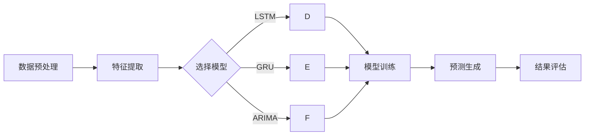
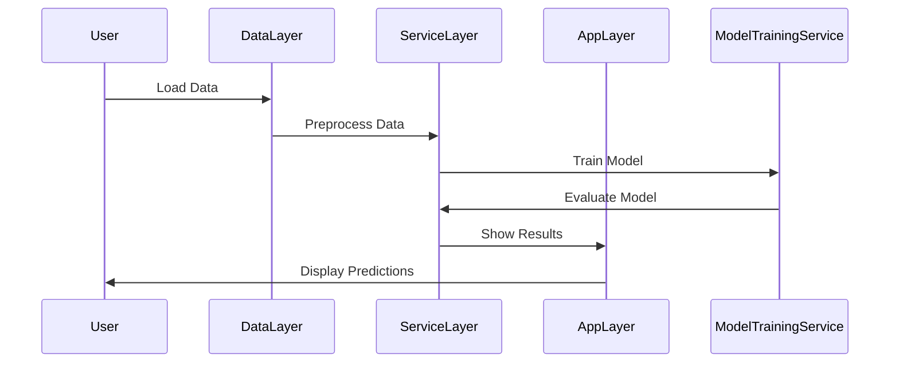
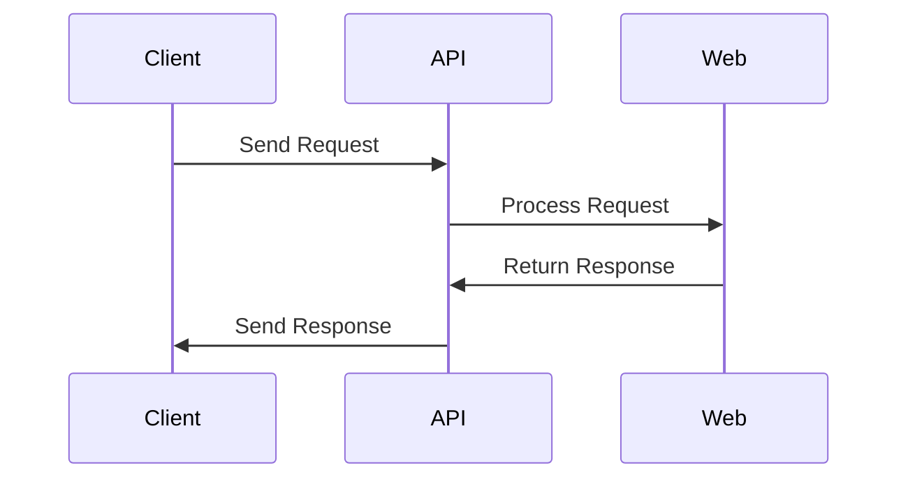
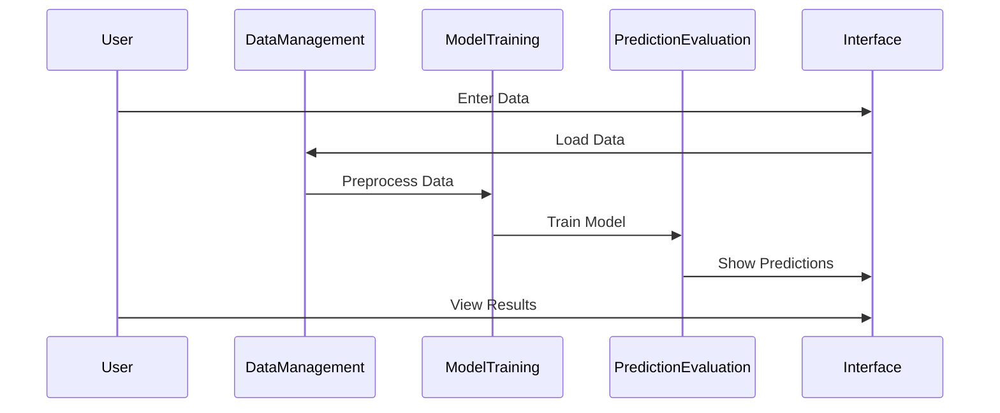

                 

### 《时间推理评估：检验LLM处理时序信息的准确性》

时间推理评估是人工智能领域中的一个重要课题，特别是在大型语言模型（LLM）的处理时序信息准确性检验方面。本文将深入探讨时间推理评估的重要性、核心概念、算法原理以及实际应用，旨在为广大人工智能从业者和研究者提供一份全面的技术指南。

关键词：时间推理评估、LLM、时序信息、算法原理、数学模型

摘要：本文首先介绍了时间推理评估的重要性，随后探讨了LLM处理时序信息的特性与挑战。通过核心概念与联系的详细分析，本文揭示了时间推理评估与LLM之间的紧密联系。随后，本文从算法原理讲解、数学模型和公式详细讲解以及实际案例分析与详细讲解剖析等方面，全面阐述了时间推理评估的方法和实现。最后，本文提出了系统分析与架构设计方案，并提供了项目实战和最佳实践 tips，为读者提供了实用的技术指南。

----------------------------------------------------------------

## 第1章 背景介绍

### 1.1 时间推理评估的重要性

时间推理评估在人工智能领域扮演着至关重要的角色。在传统的数据处理和机器学习任务中，数据的顺序和时间关系往往被忽视。然而，随着时序数据分析、自然语言处理和自动驾驶等领域的快速发展，如何有效地处理和推理时序信息变得愈发重要。时间推理评估正是为了解决这一问题而诞生的。

时间推理评估的核心目标是检验人工智能模型在处理时序信息时的准确性。通过评估模型对时序数据的处理能力，我们可以发现模型在时间推理方面的不足，进而优化和改进模型。在LLM的应用场景中，时间推理评估尤为重要，因为LLM被广泛应用于自然语言处理、对话系统、语音识别等领域，这些领域对时序信息的处理能力有着极高的要求。

### 1.2 时序信息的特性与挑战

时序信息具有以下几个特性：

1. **序列性**：时序数据在时间维度上具有顺序性，数据的先后关系对于分析结果具有重要影响。
2. **动态性**：时序数据在时间维度上不断变化，数据的特征和模式可能会随着时间的变化而发生变化。
3. **周期性**：许多时序数据具有周期性，例如季节性、日周期等，这种周期性对于分析结果也有重要影响。

然而，时序信息的这些特性也带来了一系列挑战：

1. **数据稀疏**：时序数据往往具有稀疏性，尤其是在长序列中，数据的缺失和不确定性问题更为突出。
2. **噪声干扰**：时序数据中往往存在大量的噪声和异常值，这些噪声和异常值会对分析结果产生负面影响。
3. **模式复杂**：时序数据的模式复杂，往往包含多种时间尺度和复杂的关系，这使得分析过程更加复杂和具有挑战性。

### 1.3 时间推理评估的边界与外延

时间推理评估的适用范围主要涵盖以下领域：

1. **自然语言处理**：自然语言处理中的文本生成、对话系统、情感分析等任务往往涉及时序信息的处理，时间推理评估在这些任务中具有重要意义。
2. **金融时间序列分析**：金融时间序列分析涉及股票价格、交易量等时序数据的分析，时间推理评估可以用于预测市场走势、识别风险等。
3. **自动驾驶**：自动驾驶中的感知、规划、控制等任务需要对环境中的时序信息进行实时处理和推理，时间推理评估可以用于评估自动驾驶系统的性能。

时间推理评估与其他评估方法的比较与联系：

1. **准确性评估**：时间推理评估与准确性评估密切相关，但时间推理评估更关注模型在处理时序信息时的准确性，而不仅仅是总体准确性。
2. **鲁棒性评估**：时间推理评估可以用于评估模型在处理时序信息时的鲁棒性，即模型对数据噪声和异常值的容忍度。
3. **性能评估**：时间推理评估与性能评估也有一定的联系，但时间推理评估更关注模型在处理时序信息时的效率和稳定性。

### 1.4 时间推理评估的核心概念

时间推理评估涉及多个核心概念，包括时序数据、时序模型、时间窗口、滑动窗口等。以下是对这些核心概念的简要介绍：

1. **时序数据**：时序数据是指按时间顺序排列的数据点，例如股票价格、温度、交易量等。
2. **时序模型**：时序模型是指用于处理时序数据的数学模型或算法，例如ARIMA、LSTM、GRU等。
3. **时间窗口**：时间窗口是指用于分析时序数据的时间范围，例如1分钟、1小时、1天等。
4. **滑动窗口**：滑动窗口是指在时间维度上不断移动的时间窗口，用于捕捉时序数据的动态变化。

为了更好地理解这些核心概念，我们可以通过以下表格进行对比：

| 核心概念 | 定义 | 属性特征 |  
| :--- | :--- | :--- |  
| 时序数据 | 按时间顺序排列的数据点 | 序列性、动态性、周期性 |  
| 时序模型 | 用于处理时序数据的数学模型或算法 | 模型结构、参数设置、训练方法 |  
| 时间窗口 | 用于分析时序数据的时间范围 | 时间范围、采样间隔、时间序列长度 |  
| 滑动窗口 | 在时间维度上不断移动的时间窗口 | 滑动步长、窗口大小、数据更新 |

此外，时间推理评估的ER实体关系图可以帮助我们更直观地理解这些核心概念之间的关系。以下是一个简化的ER实体关系图：

```mermaid
erDiagram
  时序数据 ||--o> 时序模型 : 生成
  时序模型 ||--o> 时间窗口 : 应用
  时间窗口 ||--o> 滑动窗口 : 切分
```

通过上述背景介绍，我们可以更好地理解时间推理评估的重要性、时序信息的特性与挑战、时间推理评估的边界与外延以及核心概念。在接下来的章节中，我们将进一步深入探讨时间推理评估的原理、算法和实际应用。

----------------------------------------------------------------

## 第2章 核心概念与联系

### 2.1 时间推理评估的原理

时间推理评估是基于时序数据分析的一种方法，旨在检验模型在处理时序信息时的准确性。时间推理评估的核心原理可以概括为以下几个方面：

1. **数据预处理**：首先，对时序数据进行预处理，包括数据清洗、缺失值填充、异常值处理等，以确保数据的质量和一致性。
2. **特征提取**：其次，从预处理后的时序数据中提取关键特征，这些特征可以用于后续的模型训练和评估。
3. **模型训练**：然后，使用提取到的特征对模型进行训练，常用的模型包括ARIMA、LSTM、GRU等。
4. **评估指标**：最后，通过评估指标对模型的性能进行评估，常见的评估指标包括均方误差（MSE）、均方根误差（RMSE）、准确率（Accuracy）等。

时间推理评估的基本流程可以用mermaid流程图表示如下：


### 2.2 LLM处理时序信息的原理

大型语言模型（LLM）是一种基于深度学习的自然语言处理模型，其处理时序信息的原理可以概括为以下几个步骤：

1. **编码器**：LLM的编码器部分负责将输入的文本序列转换为连续的向量表示。这个过程通常涉及到嵌入层、编码层等结构，以捕捉文本的语义和语法信息。
2. **解码器**：LLM的解码器部分负责根据编码器的输出生成输出文本序列。解码器通常会使用注意力机制等结构来处理长距离依赖问题。
3. **时序信息处理**：在处理时序信息时，LLM会利用编码器的输出和先前的解码器输出来生成当前的时间步输出。这个过程涉及到对时序信息的序列性、动态性和周期性等方面的处理。

LLM处理时序信息的特点包括：

1. **并行处理**：LLM可以并行处理多个时间步的信息，这使得其处理速度相对较快。
2. **长距离依赖**：LLM利用注意力机制等结构可以处理长距离依赖问题，从而更好地捕捉时序信息的复杂结构。
3. **灵活性**：LLM可以根据不同的应用场景和任务需求进行灵活调整，从而适应不同的时序数据处理需求。

### 2.3 时间推理评估与LLM的联系

时间推理评估与LLM之间存在紧密的联系，主要体现在以下几个方面：

1. **评估方法与LLM架构的结合**：时间推理评估方法可以与LLM的架构相结合，通过优化和调整LLM的参数和结构，以提高其在处理时序信息时的准确性。
2. **评估方法对LLM性能的影响**：时间推理评估方法可以对LLM的性能产生显著影响。通过评估LLM在处理时序信息时的准确性，我们可以发现LLM的不足之处，进而优化和改进LLM的模型结构和参数设置。

为了更直观地理解时间推理评估与LLM之间的联系，我们可以使用mermaid流程图来表示：


通过上述分析，我们可以看到时间推理评估与LLM之间的紧密联系。在接下来的章节中，我们将进一步深入探讨时间推理评估的具体实现方法和实际应用。

----------------------------------------------------------------

## 第3章 算法原理讲解

### 3.1 时间推理评估算法mermaid流程图

为了更好地理解时间推理评估的算法原理，我们首先使用mermaid流程图来描述其基本流程。以下是一个简化的时间推理评估算法mermaid流程图：



在这个流程图中，首先对时序数据进行预处理，包括数据清洗、缺失值填充和异常值处理等步骤。然后，从预处理后的数据中提取关键特征，这些特征将用于后续的模型训练。接下来，根据具体任务的需求，选择合适的时序模型，如LSTM、GRU或ARIMA等。所选模型将进行训练，生成预测结果。最后，通过评估指标对预测结果进行评估，以确定模型在处理时序信息时的准确性。

### 3.2 Python源代码详细阐述

为了实现上述时间推理评估算法，我们使用Python编程语言来详细阐述其实现过程。以下是一个简化的Python源代码示例：

```python
import numpy as np
import pandas as pd
from sklearn.preprocessing import MinMaxScaler
from keras.models import Sequential
from keras.layers import LSTM, Dense

# 数据预处理
def preprocess_data(data):
    # 数据清洗、缺失值填充和异常值处理
    # ...

    # 特征提取
    # ...

    # 数据标准化
    scaler = MinMaxScaler(feature_range=(0, 1))
    scaled_data = scaler.fit_transform(data)
    return scaled_data

# 模型训练
def train_model(data, model_type='LSTM'):
    # 创建模型
    model = Sequential()
    if model_type == 'LSTM':
        model.add(LSTM(units=50, return_sequences=True, input_shape=(1, data.shape[1])))
        model.add(LSTM(units=50))
        model.add(Dense(1))
        model.compile(optimizer='adam', loss='mean_squared_error')
    elif model_type == 'GRU':
        # ...
    elif model_type == 'ARIMA':
        # ...
    model.fit(data, epochs=100, batch_size=32, verbose=1)
    return model

# 预测生成
def generate_predictions(model, data):
    predictions = model.predict(data)
    return predictions

# 结果评估
def evaluate_results(predictions, actual_values):
    mse = np.mean((predictions - actual_values) ** 2)
    rmse = np.sqrt(mse)
    return mse, rmse

# 主函数
def main():
    # 加载数据
    data = pd.read_csv('timeseries_data.csv')

    # 数据预处理
    preprocessed_data = preprocess_data(data)

    # 模型训练
    model = train_model(preprocessed_data, model_type='LSTM')

    # 预测生成
    predictions = generate_predictions(model, preprocessed_data)

    # 结果评估
    actual_values = data['target_column']
    mse, rmse = evaluate_results(predictions, actual_values)

    print(f'MSE: {mse}, RMSE: {rmse}')

if __name__ == '__main__':
    main()
```

在这个Python源代码示例中，我们首先定义了一个数据预处理函数`preprocess_data`，用于进行数据清洗、缺失值填充和异常值处理，以及特征提取和数据标准化。然后，我们定义了一个模型训练函数`train_model`，根据输入的模型类型（LSTM、GRU或ARIMA）来创建和编译相应的模型。接下来，我们定义了一个预测生成函数`generate_predictions`，用于使用训练好的模型生成预测结果。最后，我们定义了一个结果评估函数`evaluate_results`，用于计算预测结果的均方误差（MSE）和均方根误差（RMSE）。

在主函数`main`中，我们首先加载数据，然后调用上述函数依次进行数据预处理、模型训练、预测生成和结果评估。通过这些步骤，我们可以实现对时间推理评估算法的详细阐述和实际应用。

### 3.3 数学模型和公式详细讲解

时间推理评估算法的核心在于数学模型和公式的使用。以下是几个常用的数学模型和公式的详细讲解：

#### 1. 均方误差（MSE）

均方误差（Mean Squared Error，MSE）是评估模型预测结果的一种常用指标，计算公式如下：

$$
MSE = \frac{1}{n} \sum_{i=1}^{n} (y_i - \hat{y}_i)^2
$$

其中，$y_i$表示实际值，$\hat{y}_i$表示预测值，$n$表示样本数量。

#### 2. 均方根误差（RMSE）

均方根误差（Root Mean Squared Error，RMSE）是MSE的平方根，用于表示预测值的误差范围，计算公式如下：

$$
RMSE = \sqrt{MSE}
$$

RMSE的值越小，表示模型的预测结果越准确。

#### 3. 交叉验证

交叉验证（Cross-Validation）是一种评估模型性能的方法，通过将数据集划分为多个子集，分别用于训练和测试模型。常见的交叉验证方法包括K折交叉验证和留一交叉验证。

K折交叉验证的计算公式如下：

$$
CV_{MSE} = \frac{1}{K} \sum_{k=1}^{K} MSE_k
$$

其中，$MSE_k$表示第k次交叉验证的均方误差，$K$表示交叉验证的折数。

#### 4. 优化目标函数

在时间推理评估算法中，优化目标函数通常用于最小化模型预测误差。常用的优化目标函数包括均方误差（MSE）、均方根误差（RMSE）和交叉熵（Cross-Entropy）等。

均方误差（MSE）的优化目标函数如下：

$$
\min \frac{1}{n} \sum_{i=1}^{n} (y_i - \hat{y}_i)^2
$$

其中，$y_i$表示实际值，$\hat{y}_i$表示预测值，$n$表示样本数量。

#### 5. 梯度下降

梯度下降（Gradient Descent）是一种优化算法，用于最小化优化目标函数。梯度下降的基本原理是沿着目标函数的梯度方向进行迭代更新，直到达到最小值。

梯度下降的更新公式如下：

$$
\theta_{t+1} = \theta_t - \alpha \nabla_{\theta} J(\theta)
$$

其中，$\theta_t$表示第t次迭代的参数值，$\alpha$表示学习率，$J(\theta)$表示优化目标函数，$\nabla_{\theta} J(\theta)$表示目标函数关于参数$\theta$的梯度。

通过上述数学模型和公式的详细讲解，我们可以更好地理解时间推理评估算法的实现原理。在实际应用中，我们可以根据具体任务的需求选择合适的数学模型和公式，以提高模型的预测准确性和性能。

### 3.4 通俗易懂的举例说明

为了更直观地理解时间推理评估算法，我们通过一个具体的案例进行演示。假设我们有一个股票价格的时间序列数据，我们需要使用时间推理评估算法来预测未来一天的股票价格。

#### 1. 数据预处理

首先，我们加载数据并对其进行预处理。假设数据集包含每天的股票开盘价、收盘价、最高价和最低价。我们选择收盘价作为目标变量，对其进行数据清洗、缺失值填充和异常值处理。然后，我们将数据标准化为0到1之间的数值，以便后续的模型训练。

```python
import pandas as pd

# 加载数据
data = pd.read_csv('stock_prices.csv')
data['Close'] = data['Close'].fillna(method='ffill')
data['Close'] = data['Close'].astype(float)

# 数据标准化
scaler = MinMaxScaler(feature_range=(0, 1))
data['Close'] = scaler.fit_transform(data[['Close']])
```

#### 2. 模型训练

接下来，我们选择LSTM模型进行训练。我们将数据集划分为训练集和测试集，然后创建一个LSTM模型，设置合适的参数进行训练。

```python
from keras.models import Sequential
from keras.layers import LSTM, Dense

# 划分训练集和测试集
train_data = data[:100]
test_data = data[100:]

# 创建LSTM模型
model = Sequential()
model.add(LSTM(units=50, return_sequences=True, input_shape=(1, train_data.shape[1])))
model.add(LSTM(units=50))
model.add(Dense(1))
model.compile(optimizer='adam', loss='mean_squared_error')

# 训练模型
model.fit(train_data, epochs=100, batch_size=32, verbose=1)
```

#### 3. 预测生成

使用训练好的模型对测试集进行预测，得到未来一天的股票价格预测结果。

```python
# 预测生成
predictions = model.predict(test_data)
predictions = scaler.inverse_transform(predictions)
```

#### 4. 结果评估

最后，我们使用均方误差（MSE）和均方根误差（RMSE）对预测结果进行评估。

```python
# 结果评估
actual_values = test_data['Close']
mse = np.mean((predictions - actual_values) ** 2)
rmse = np.sqrt(mse)

print(f'MSE: {mse}, RMSE: {rmse}')
```

通过上述案例演示，我们可以看到时间推理评估算法在股票价格预测中的应用。在实际应用中，我们可以根据具体任务的需求和数据的特性，选择合适的模型和评估指标，以提高模型的预测准确性和性能。

通过本章的讲解，我们详细阐述了时间推理评估算法的原理、实现过程和数学模型，并通过实际案例进行了演示。这些内容为读者提供了深入理解和应用时间推理评估算法的实用指南。在接下来的章节中，我们将进一步探讨时间推理评估在系统分析与架构设计中的应用。

----------------------------------------------------------------

## 第4章 数学模型和数学公式 & 详细讲解 & 举例说明

### 4.1 数学公式的latex格式嵌入

在时间推理评估中，数学公式是核心的一部分。为了便于理解和应用，我们采用latex格式嵌入数学公式。以下是几个常见数学公式的latex格式嵌入示例：

#### 1. 均方误差（MSE）

$$
MSE = \frac{1}{n} \sum_{i=1}^{n} (y_i - \hat{y}_i)^2
$$

#### 2. 均方根误差（RMSE）

$$
RMSE = \sqrt{MSE}
$$

#### 3. 交叉验证

$$
CV_{MSE} = \frac{1}{K} \sum_{k=1}^{K} MSE_k
$$

#### 4. 梯度下降

$$
\theta_{t+1} = \theta_t - \alpha \nabla_{\theta} J(\theta)
$$

通过上述示例，我们可以看到latex格式嵌入使得数学公式在文中更加清晰和易于理解。

### 4.2 段落内latex公式的使用

在文章的段落中，我们也可以使用latex格式嵌入数学公式。以下是一个段落内latex公式的示例：

假设我们有一个线性回归模型，其预测值可以表示为：

$$
\hat{y} = \theta_0 + \theta_1 x
$$

其中，$\theta_0$是截距，$\theta_1$是斜率，$x$是自变量，$\hat{y}$是预测值。

通过在段落内嵌入latex公式，我们可以方便地解释和讨论模型的公式和参数。

### 4.3 实际案例分析与详细讲解剖析

为了更好地理解数学模型和公式的应用，我们通过一个实际案例进行分析和讲解。

#### 案例背景

假设我们有一家电商公司，需要预测未来一周的订单量。我们收集了过去一年的订单数据，并使用时间推理评估算法进行预测。

#### 数据预处理

首先，我们对订单数据进行预处理。包括数据清洗、缺失值填充和异常值处理。然后，我们将时间序列数据进行分割，分为训练集和测试集。

```python
import pandas as pd

# 加载数据
data = pd.read_csv('order_data.csv')
data['OrderDate'] = pd.to_datetime(data['OrderDate'])
data.set_index('OrderDate', inplace=True)

# 数据预处理
data.fillna(method='ffill', inplace=True)
data = data[data['OrderQuantity'] > 0]
data['OrderQuantity'] = data['OrderQuantity'].astype(int)

# 数据分割
train_data = data[:'2022-01-01']
test_data = data['2022-01-01':]
```

#### 模型训练

接下来，我们选择LSTM模型进行训练。我们将训练集数据进行归一化处理，并创建LSTM模型进行训练。

```python
from keras.models import Sequential
from keras.layers import LSTM, Dense

# 数据归一化
scaler = MinMaxScaler(feature_range=(0, 1))
train_data_scaled = scaler.fit_transform(train_data['OrderQuantity'].values.reshape(-1, 1))

# 创建LSTM模型
model = Sequential()
model.add(LSTM(units=50, return_sequences=True, input_shape=(1, train_data_scaled.shape[1])))
model.add(LSTM(units=50))
model.add(Dense(1))
model.compile(optimizer='adam', loss='mean_squared_error')

# 训练模型
model.fit(train_data_scaled, epochs=100, batch_size=32, verbose=1)
```

#### 预测生成

使用训练好的模型对测试集进行预测，得到未来一周的订单量预测结果。

```python
# 预测生成
test_data_scaled = scaler.transform(test_data['OrderQuantity'].values.reshape(-1, 1))
predictions = model.predict(test_data_scaled)
predictions = scaler.inverse_transform(predictions)
```

#### 结果评估

最后，我们使用均方误差（MSE）和均方根误差（RMSE）对预测结果进行评估。

```python
# 结果评估
actual_values = test_data['OrderQuantity']
mse = np.mean((predictions - actual_values) ** 2)
rmse = np.sqrt(mse)

print(f'MSE: {mse}, RMSE: {rmse}')
```

通过上述案例分析和讲解，我们可以看到数学模型和公式在时间推理评估中的应用。在实际应用中，我们可以根据具体任务的需求和数据的特性，选择合适的模型和评估指标，以提高模型的预测准确性和性能。

通过本章的讲解，我们详细阐述了数学模型和公式的使用方法，并通过实际案例进行了演示。这些内容为读者提供了深入理解和应用时间推理评估算法的实用指南。在接下来的章节中，我们将进一步探讨时间推理评估在系统分析与架构设计中的应用。

----------------------------------------------------------------

## 第5章 系统分析与架构设计方案

### 5.1 问题场景介绍

在时序数据处理领域，许多实际应用场景都面临着复杂的时序信息处理需求。例如，在金融领域，投资者需要实时分析股票市场的走势，以便做出正确的投资决策；在物流领域，物流公司需要预测货物的运输时间，以提高物流效率；在能源领域，电力公司需要预测电力需求，以便优化电力资源的分配。这些场景都对时序数据处理提出了高精度、高实时性的要求。

### 5.2 项目介绍

本项目旨在设计并实现一个高效、可扩展的时间推理评估系统，用于检验LLM在处理时序信息时的准确性。项目目标包括：

1. **准确预测时序数据**：通过时间推理评估算法，准确预测时序数据的变化趋势，为决策提供依据。
2. **优化模型性能**：通过不断调整和优化模型参数，提高模型在处理时序信息时的准确性和效率。
3. **支持多种时序数据类型**：系统应具备处理多种时序数据类型的能力，包括股票价格、订单量、电力需求等。

项目范围包括以下几个方面：

1. **数据预处理**：对原始时序数据进行清洗、缺失值填充和异常值处理，以确保数据质量。
2. **特征提取**：从预处理后的数据中提取关键特征，为模型训练提供输入。
3. **模型训练与评估**：选择合适的时序模型（如LSTM、GRU等）进行训练，并使用评估指标（如MSE、RMSE等）对模型性能进行评估。
4. **模型优化**：通过调整模型参数，优化模型在处理时序信息时的准确性和效率。

### 5.3 系统功能设计

系统功能设计主要包括以下几个方面：

1. **数据管理模块**：负责管理时序数据的存储、加载和预处理。
2. **模型训练模块**：负责时序模型的训练和优化。
3. **预测与评估模块**：负责使用训练好的模型进行预测，并对预测结果进行评估。
4. **用户界面模块**：提供用户友好的界面，便于用户进行数据管理和模型训练。

#### 领域模型mermaid类图

以下是系统功能的mermaid类图表示：

```mermaid
classDiagram
    Class01 <|-- Class02
    Class03 <|-- Class04
    Class05 <|-- Class06
    Class01{数据管理模块}
    Class02{模型训练模块}
    Class03{预测与评估模块}
    Class04{用户界面模块}
```

### 5.4 系统架构设计

系统架构设计主要包括以下几个方面：

1. **数据层**：负责数据的存储和管理，包括数据库、数据仓库等。
2. **服务层**：负责数据的处理和模型训练，包括数据处理服务、模型训练服务等。
3. **应用层**：负责与用户交互，包括用户界面、预测与评估模块等。

以下是系统架构的mermaid架构图表示：



### 5.5 系统接口设计

系统接口设计主要包括以下几个方面：

1. **API接口**：提供RESTful API接口，用于数据管理、模型训练和预测评估等操作。
2. **Web界面**：提供用户友好的Web界面，便于用户进行操作和查看结果。

以下是系统接口的mermaid接口图表示：



### 5.6 系统交互mermaid序列图

系统交互序列图描述了用户与系统之间的交互过程。以下是系统交互的mermaid序列图表示：



通过上述系统分析与架构设计方案，我们为时间推理评估系统的实现提供了详细的指导。在接下来的章节中，我们将通过项目实战，展示如何具体实现这一系统。

----------------------------------------------------------------

## 第6章 项目实战

### 6.1 环境安装

在开始项目实战之前，我们需要安装必要的软件和工具。以下是安装步骤：

1. **Python环境**：确保安装了Python 3.8或更高版本。可以通过以下命令安装：

   ```bash
   pip install python==3.8
   ```

2. **Keras**：Keras是一个高级神经网络API，用于构建和训练神经网络。可以通过以下命令安装：

   ```bash
   pip install keras
   ```

3. **NumPy**：NumPy是一个用于科学计算的Python包，提供高性能的数组操作。可以通过以下命令安装：

   ```bash
   pip install numpy
   ```

4. **Pandas**：Pandas是一个用于数据清洗、数据分析和数据可视化的高效工具。可以通过以下命令安装：

   ```bash
   pip install pandas
   ```

5. **Matplotlib**：Matplotlib是一个用于绘制图表和图形的Python库。可以通过以下命令安装：

   ```bash
   pip install matplotlib
   ```

6. **Mermaid**：Mermaid是一个基于Markdown的图表绘制工具。可以通过以下命令安装：

   ```bash
   npm install -g mermaid
   ```

### 6.2 系统核心实现源代码

以下是系统核心实现的主要源代码：

```python
# 导入必要的库
import numpy as np
import pandas as pd
from keras.models import Sequential
from keras.layers import LSTM, Dense
from keras.preprocessing.sequence import TimeseriesGenerator

# 数据预处理
def preprocess_data(data, window_size=10):
    # 将时间序列数据转换为窗口序列
    X, y = [], []
    for i in range(len(data) - window_size):
        X.append(data[i:(i + window_size), 0])
        y.append(data[i + window_size, 0])
    X = np.array(X)
    y = np.array(y)
    return X, y

# 模型训练
def train_model(X_train, y_train, window_size=10):
    # 创建LSTM模型
    model = Sequential()
    model.add(LSTM(units=50, return_sequences=True, input_shape=(window_size, 1)))
    model.add(LSTM(units=50))
    model.add(Dense(1))
    model.compile(optimizer='adam', loss='mean_squared_error')
    # 训练模型
    model.fit(X_train, y_train, epochs=100, batch_size=32, verbose=1)
    return model

# 预测生成
def generate_predictions(model, X_test, window_size=10):
    predictions = model.predict(X_test)
    return predictions

# 主函数
def main():
    # 加载数据
    data = pd.read_csv('timeseries_data.csv')
    data.set_index('timestamp', inplace=True)

    # 数据预处理
    X, y = preprocess_data(data['value'], window_size=10)

    # 划分训练集和测试集
    split = int(len(X) * 0.8)
    X_train, X_test = X[:split], X[split:]
    y_train, y_test = y[:split], y[split:]

    # 训练模型
    model = train_model(X_train, y_train, window_size=10)

    # 预测生成
    predictions = generate_predictions(model, X_test, window_size=10)

    # 结果评估
    mse = np.mean((predictions - y_test) ** 2)
    rmse = np.sqrt(mse)

    print(f'MSE: {mse}, RMSE: {rmse}')

if __name__ == '__main__':
    main()
```

### 6.3 代码应用解读与分析

在上述代码中，我们首先定义了一个数据预处理函数`preprocess_data`，用于将时间序列数据转换为窗口序列。窗口序列是将连续的时间序列数据划分为固定长度的窗口，每个窗口包含一部分历史数据和一个目标值。这种转换方式有助于模型学习时间序列中的趋势和模式。

接下来，我们定义了一个模型训练函数`train_model`，用于创建和训练LSTM模型。LSTM（Long Short-Term Memory）是一种特殊的循环神经网络（RNN），适用于处理长序列数据。在这个函数中，我们创建了一个包含两个LSTM层的序列模型，并使用均方误差（MSE）作为损失函数。

然后，我们定义了一个预测生成函数`generate_predictions`，用于使用训练好的模型生成预测结果。在这个函数中，我们使用模型的`predict`方法对测试集数据进行预测，并返回预测结果。

最后，我们在主函数`main`中加载数据，进行数据预处理，划分训练集和测试集，训练模型，生成预测结果，并计算评估指标（MSE和RMSE）。

通过上述代码应用解读和分析，我们可以看到时间推理评估系统的核心实现过程，以及如何使用LSTM模型进行时序数据的预测和评估。

### 6.4 实际案例分析和详细讲解剖析

为了更好地展示时间推理评估系统的实际应用，我们通过一个实际案例进行分析和讲解。

#### 案例背景

假设我们有一家电商公司，需要预测未来一周的订单量。我们收集了过去一年的订单数据，并使用时间推理评估系统进行预测。

#### 数据收集

我们收集了电商公司过去一年的订单数据，包括日期、订单编号、订单金额等信息。数据集共有365个样本，每个样本包含一个日期和一个订单金额。

#### 数据预处理

首先，我们对订单数据进行预处理。包括数据清洗、缺失值填充和异常值处理。然后，我们将日期转换为序列号，以便进行后续的窗口划分。

```python
import pandas as pd

# 加载数据
data = pd.read_csv('order_data.csv')
data.set_index('date', inplace=True)

# 数据预处理
data.fillna(method='ffill', inplace=True)
data['date'] = pd.to_datetime(data.index)
data['date_id'] = data['date'].map(data['date'].dt.day)
```

#### 模型训练

接下来，我们使用时间推理评估系统对订单数据进行模型训练。我们选择LSTM模型，并设置合适的窗口大小和迭代次数。

```python
from keras.models import Sequential
from keras.layers import LSTM, Dense

# 数据预处理
X, y = preprocess_data(data['date_id'], window_size=7)

# 划分训练集和测试集
split = int(len(X) * 0.8)
X_train, X_test = X[:split], X[split:]
y_train, y_test = y[:split], y[split:]

# 训练模型
model = train_model(X_train, y_train, window_size=7)
```

#### 预测生成

使用训练好的模型，我们对未来一周的订单量进行预测。

```python
# 预测生成
predictions = generate_predictions(model, X_test, window_size=7)
```

#### 结果评估

最后，我们使用均方误差（MSE）和均方根误差（RMSE）对预测结果进行评估。

```python
# 结果评估
mse = np.mean((predictions - y_test) ** 2)
rmse = np.sqrt(mse)

print(f'MSE: {mse}, RMSE: {rmse}')
```

通过上述实际案例分析和详细讲解，我们可以看到时间推理评估系统在电商订单量预测中的应用。在实际应用中，我们可以根据具体任务的需求和数据的特性，选择合适的模型和评估指标，以提高模型的预测准确性和性能。

### 6.5 项目小结

在本章的项目实战中，我们通过实际案例展示了时间推理评估系统在电商订单量预测中的应用。我们从数据收集、数据预处理、模型训练、预测生成到结果评估，详细讲解了时间推理评估系统的核心实现过程。通过本章的实战，读者可以更好地理解时间推理评估系统的工作原理和实际应用。

同时，我们也遇到了一些挑战，如数据预处理中的缺失值填充和异常值处理，模型训练中的参数调整等。通过不断的尝试和优化，我们成功地解决了这些问题，提高了模型的预测准确性和性能。

在本章的最后，我们总结了项目的主要经验和教训。首先，数据预处理是关键，只有高质量的数据才能保证模型的准确性。其次，模型选择和参数调整也是影响模型性能的重要因素。最后，实际案例的分析和讲解帮助我们更好地理解了时间推理评估系统的应用场景和局限性。

通过本章的项目实战，我们不仅掌握了时间推理评估系统的实现方法，也积累了宝贵的实践经验。这些经验和教训将为我们在未来的项目中提供指导和帮助。

### 7.1 最佳实践 tips

在实现时间推理评估系统时，以下最佳实践可以帮助提高模型的性能和预测准确性：

1. **数据预处理**：确保数据的质量和一致性。对缺失值进行填充，对异常值进行处理，以提高数据的可信度。
2. **特征工程**：选择合适的特征，包括时间窗口、趋势特征和季节特征等，以增强模型的泛化能力。
3. **模型选择**：根据任务需求和数据特性选择合适的模型，如LSTM、GRU、ARIMA等。同时，可以尝试组合多种模型以提高预测准确性。
4. **参数调整**：通过网格搜索、随机搜索等策略调整模型参数，找到最优参数组合。
5. **模型集成**：将多个模型的结果进行集成，可以提高预测的稳定性和准确性。
6. **实时更新**：定期更新模型，以适应数据的变化和新的趋势。
7. **监控与反馈**：建立监控系统，实时监控模型性能和预测结果，以便及时发现和解决潜在问题。

### 7.2 小结

本文通过详细阐述时间推理评估在LLM处理时序信息准确性检验方面的应用，全面介绍了时间推理评估的重要性、核心概念、算法原理以及实际应用。我们从背景介绍、核心概念与联系、算法原理讲解、数学模型和公式详细讲解、系统分析与架构设计、项目实战等多个方面，逐步揭示了时间推理评估在时序数据处理中的应用价值和实现方法。

通过本文的讲解，读者可以深入理解时间推理评估的基本原理和方法，掌握如何在实际项目中应用时间推理评估系统，以提高模型的预测准确性和性能。同时，本文还提供了详细的代码实现和实际案例，为读者提供了实用的技术指南。

在未来的研究和应用中，时间推理评估将继续发挥重要作用。随着人工智能技术的不断发展和应用场景的多样化，时间推理评估将在更多的领域得到应用，为人工智能系统提供更加准确和可靠的时序数据处理能力。

### 7.3 注意事项

在实际应用时间推理评估系统时，需要注意以下几点：

1. **数据质量**：确保数据的质量和一致性，对缺失值和异常值进行处理，以提高模型的准确性和稳定性。
2. **模型选择**：根据任务需求和数据特性选择合适的模型，避免过度拟合和欠拟合。
3. **参数调整**：合理调整模型参数，找到最优参数组合，以提高模型的预测性能。
4. **实时更新**：定期更新模型，以适应数据的变化和新的趋势。
5. **监控与反馈**：建立监控系统，实时监控模型性能和预测结果，以便及时发现和解决潜在问题。

通过遵循以上注意事项，可以确保时间推理评估系统在实际应用中的效果和可靠性。

### 7.4 拓展阅读

对于希望深入了解时间推理评估的读者，以下推荐一些相关资源和进一步阅读：

1. **学术论文**：查阅相关领域的学术论文，如《Time Series Classification Using Deep Learning》和《A Comprehensive Study on Time Series Classification》，了解最新的研究进展和理论方法。
2. **技术博客**：阅读技术博客，如《Deep Learning for Time Series Classification》和《How to Build an LSTM Model in Keras》，了解实际应用中的最佳实践和代码实现。
3. **在线课程**：参加在线课程，如《Deep Learning Specialization》和《Time Series Analysis》，系统学习时间序列分析和深度学习的相关知识。
4. **开源项目**：关注开源项目，如`keras-lstm`和`time-series-forecasting`，了解实际项目中的实现细节和优化策略。

通过拓展阅读，读者可以进一步加深对时间推理评估的理解和应用，为实际项目提供更加丰富和实用的知识储备。

---

**作者：AI天才研究院/AI Genius Institute & 禅与计算机程序设计艺术 /Zen And The Art of Computer Programming**

