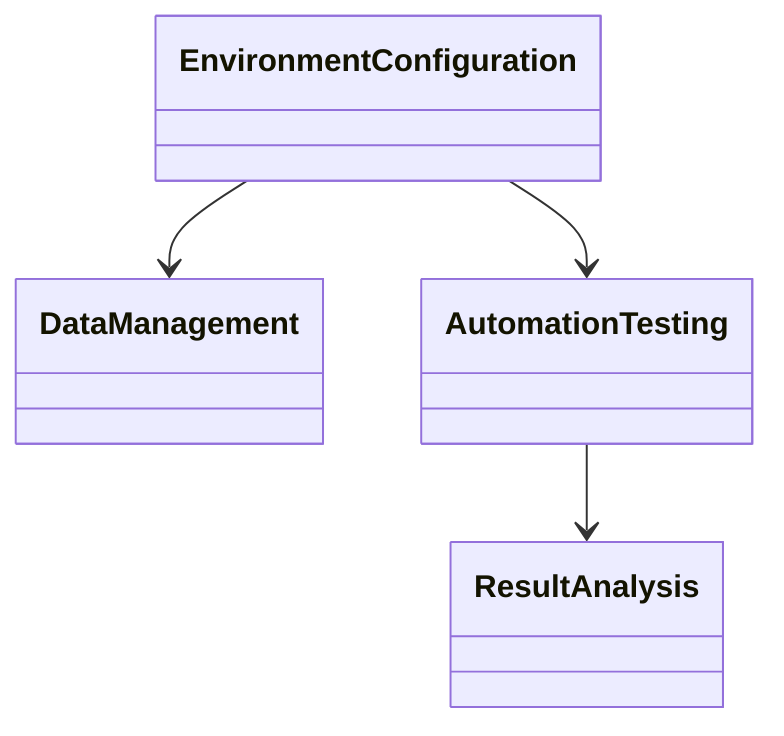
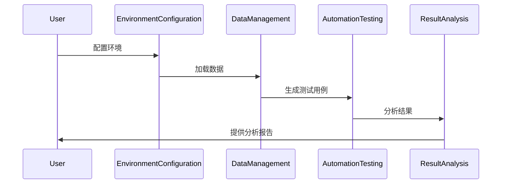
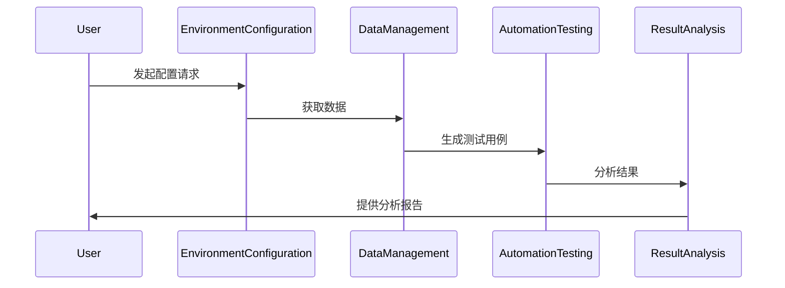

                 

### 第一部分：问题背景与核心概念

#### 第1章 问题背景与核心概念

##### 1.1 问题背景

随着人工智能技术的迅猛发展，深度学习模型在自然语言处理（NLP）领域取得了显著的突破。尤其是大型语言模型（LLM），如GPT-3、BERT等，在生成文本、机器翻译、问答系统等方面表现出色。然而，这些模型的性能往往取决于其训练和测试环境的质量。传统的测试环境配置和管理方法已无法满足现代LLM测试的需求，主要表现在以下几个方面：

- **环境复杂性**：大型LLM通常需要配置高性能的硬件和软件环境，涉及计算资源、内存管理、数据存储等多个方面。
- **测试数据多样性**：测试数据应涵盖各种语言、语调和场景，传统的测试集可能无法充分覆盖这些多样性。
- **测试效率**：快速迭代和反馈是提高LLM性能的关键，传统的测试方法可能耗时较长，难以满足快速迭代的需求。
- **智能化需求**：自动化测试和智能化管理是提高测试效率和质量的关键，传统的测试工具和方法往往缺乏智能化。

##### 1.2 核心概念

为了解决上述问题，我们需要深入理解以下几个核心概念：

- **大型语言模型（LLM）**：LLM是一种基于深度学习的自然语言处理模型，能够理解和生成复杂文本。它们通常由数亿甚至数十亿个参数组成，对训练数据量要求较高。
- **测试环境**：测试环境是指用于评估LLM性能的软硬件配置，包括计算资源、数据存储、网络环境等。
- **自动化测试**：自动化测试是一种通过脚本或工具自动执行测试用例的方法，能够提高测试效率和覆盖率。
- **智能化管理**：智能化管理是指通过人工智能技术对测试环境进行优化和管理，提高测试质量和效率。

##### 1.3 LLM的原理与特性

LLM通常基于变换器模型（Transformer），这种模型具有以下几个关键特性：

- **并行计算**：Transformer模型采用了多头自注意力机制，能够并行处理输入数据，大大提高了计算效率。
- **上下文理解**：Transformer模型能够捕捉输入文本的上下文信息，从而生成更准确的输出。
- **参数高效性**：尽管LLM包含数亿个参数，但通过有效的神经网络架构设计，能够在有限的计算资源下运行。

##### 1.4 测试环境的组成与功能

测试环境主要由以下几部分组成：

- **计算资源**：包括CPU、GPU等硬件资源，用于模型训练和推理。
- **内存管理**：内存管理是保障模型训练和推理顺利进行的关键，涉及内存分配、回收等策略。
- **数据存储**：数据存储用于存储训练数据、测试数据和模型参数，通常采用分布式存储系统。
- **网络环境**：网络环境包括内部网络和外网，用于数据传输和模型部署。

### 第二部分：核心概念与联系

#### 第2章 核心概念详解

##### 2.1 LLM的原理与特性

LLM的核心原理是基于深度学习的变换器模型（Transformer），该模型由以下几个关键组成部分构成：

- **编码器**：编码器负责将输入文本转换为向量表示，通常使用嵌入层和自注意力机制。
- **解码器**：解码器负责根据编码器的输出生成输出文本，同样采用自注意力机制。
- **多头自注意力机制**：多头自注意力机制能够同时关注输入文本的不同部分，提高模型的上下文理解能力。
- **前馈网络**：前馈网络在编码器和解码器之间添加了一个简单的全连接层，用于增加模型的非线性变换能力。

以下是LLM的一些主要特性：

- **并行计算**：由于变换器模型采用了多头自注意力机制，能够实现并行计算，提高训练和推理速度。
- **上下文理解**：LLM能够捕捉输入文本的上下文信息，从而生成更准确的输出。
- **可扩展性**：LLM的参数数量可以通过增加编码器和解码器的层数来扩展，适应不同规模的任务。

##### 2.2 测试环境的组成与功能

测试环境的组成如下：

- **计算资源**：计算资源包括CPU、GPU等硬件，用于模型训练和推理。GPU因其强大的并行计算能力，成为LLM训练和推理的首选硬件。
- **内存管理**：内存管理涉及内存的分配和回收策略，以确保模型训练和推理过程中内存的稳定性和高效性。
- **数据存储**：数据存储包括本地存储和分布式存储系统，用于存储训练数据、测试数据和模型参数。分布式存储系统如HDFS、Cassandra等，能够提高数据存储的可靠性和扩展性。
- **网络环境**：网络环境包括内部网络和外网，用于数据传输和模型部署。内部网络通常采用私有网络，确保数据传输的安全性和稳定性。

测试环境的功能包括：

- **模型训练**：测试环境为LLM的训练提供必要的计算资源和数据存储，确保模型能够在训练过程中充分吸收数据中的知识。
- **模型推理**：测试环境用于评估LLM在真实场景中的表现，通过推理功能来生成文本、回答问题等。
- **自动化测试**：测试环境通过自动化测试工具，对模型进行功能测试、性能测试等，以确保模型的质量和稳定性。

### 第三部分：算法原理讲解

#### 第3章 智能化测试算法

##### 3.1 智能化测试算法概述

智能化测试算法是指利用人工智能技术，如机器学习、深度学习等，对LLM测试环境进行优化和管理。智能化测试算法的目标是提高测试效率、降低测试成本、提高测试质量。以下是几种常见的智能化测试算法：

- **自动化测试算法**：通过机器学习算法，如决策树、随机森林、支持向量机等，自动生成测试用例，提高测试覆盖率和测试效率。
- **测试优化算法**：通过优化算法，如遗传算法、模拟退火算法等，优化测试资源的分配和使用，提高测试效率。
- **异常检测算法**：通过异常检测算法，如孤立森林、K-均值聚类等，识别测试过程中的异常情况，提高测试质量。

##### 3.2 算法原理与流程

智能化测试算法的基本原理是基于对测试数据的分析和挖掘，通过机器学习算法，从测试数据中学习到测试用例的生成规则，从而实现自动化测试。以下是智能化测试算法的基本流程：

1. **数据收集**：收集测试数据，包括模型输出、测试输入等。
2. **数据预处理**：对收集到的测试数据进行清洗和预处理，去除无效数据和噪声。
3. **特征提取**：从预处理后的测试数据中提取关键特征，如文本特征、参数特征等。
4. **模型训练**：利用提取的特征，通过机器学习算法训练测试用例生成模型。
5. **测试用例生成**：使用训练好的模型生成测试用例，并进行测试。
6. **结果分析**：分析测试结果，如覆盖率、异常检测等，以评估测试质量。

##### 3.3 数学模型与公式

智能化测试算法通常基于以下数学模型：

1. **决策树模型**：决策树模型通过将特征空间划分为多个子空间，在每个子空间中分别进行决策，从而生成测试用例。
2. **支持向量机模型**：支持向量机模型通过将特征空间映射到高维空间，寻找最优分类面，从而生成测试用例。
3. **神经网络模型**：神经网络模型通过多层神经网络，对特征进行学习和变换，从而生成测试用例。

以下是决策树模型和神经网络模型的部分数学公式：

$$
决策树模型：
$$

$$
f(x) = \sum_{i=1}^{n} w_i \cdot x_i + b
$$

其中，$x_i$为特征向量，$w_i$为权重，$b$为偏置。

$$
神经网络模型：
$$

$$
y = \sigma(\sum_{i=1}^{n} w_i \cdot x_i + b)
$$

其中，$\sigma$为激活函数，$y$为输出。

通过这些数学模型和公式，智能化测试算法能够有效地生成测试用例，提高测试质量和效率。

### 第四部分：系统分析与架构设计方案

#### 第4章 系统设计与实现

##### 4.1 问题场景介绍

在当前人工智能领域，语言模型（LLM）已经成为NLP领域的关键技术。为了确保LLM在真实场景中的表现，我们需要对其测试环境进行智能化配置和管理。以下是一个典型的测试环境配置和管理场景：

- **硬件环境**：使用高性能GPU服务器作为计算资源，确保模型训练和推理的效率。
- **软件环境**：配置深度学习框架（如TensorFlow、PyTorch）和测试工具（如pytest、JMeter）。
- **数据集**：包括训练数据集、测试数据集和验证数据集，用于模型训练和测试。
- **自动化测试**：实现自动化测试，提高测试效率和覆盖率。

##### 4.2 系统功能设计

系统功能设计主要涉及以下几个方面：

- **环境配置**：根据需求自动配置计算资源、内存、网络等环境参数。
- **数据管理**：管理训练数据、测试数据和模型参数，包括数据的存储、加载和预处理。
- **自动化测试**：自动生成测试用例，执行测试并分析测试结果。
- **结果分析**：对测试结果进行统计分析，识别模型的性能瓶颈。

以下是系统功能设计的Mermaid类图：



##### 4.3 系统架构设计

系统架构设计主要包括以下几个方面：

- **计算层**：包括GPU服务器、深度学习框架和模型训练工具。
- **数据层**：包括数据存储系统、数据预处理模块和数据管理工具。
- **测试层**：包括自动化测试工具、测试脚本和结果分析工具。
- **管理层**：包括环境配置模块、数据管理和测试模块的管理接口。

以下是系统架构设计的Mermaid架构图：



##### 4.4 系统接口设计与交互

系统接口设计主要涉及以下几个方面：

- **环境配置接口**：用于配置计算资源、内存和网络参数。
- **数据管理接口**：用于数据存储、加载和预处理。
- **自动化测试接口**：用于生成测试用例、执行测试和结果分析。
- **结果分析接口**：用于生成分析报告和提供可视化界面。

以下是系统接口设计和交互的Mermaid序列图：



通过以上系统架构设计和接口设计，我们能够构建一个高效、可靠的智能化LLM测试环境，为LLM的研究和应用提供有力支持。

### 第五部分：项目实战

#### 第5章 环境配置与管理实战

##### 5.1 环境安装

在开始搭建智能化LLM测试环境之前，我们需要确保硬件环境和软件环境符合要求。以下是环境安装的步骤：

1. **硬件环境准备**：
   - 确保GPU服务器已安装，如NVIDIA GPU。
   - 检查服务器硬件配置，确保满足模型训练需求。

2. **软件环境准备**：
   - 安装操作系统，如Ubuntu 20.04。
   - 安装深度学习框架，如TensorFlow 2.6或PyTorch 1.9。
   - 安装自动化测试工具，如pytest 6.2和JMeter 5.4。

3. **依赖库安装**：
   - 安装Python依赖库，如NumPy 1.21、Pandas 1.3等。

4. **环境配置**：
   - 配置GPU支持，确保深度学习框架能够使用GPU进行训练。
   - 配置网络环境，确保数据传输稳定和安全。

以下是环境配置的Python脚本示例：

```python
# 安装深度学习框架
!pip install tensorflow==2.6
!pip install torch==1.9

# 安装自动化测试工具
!pip install pytest==6.2
!pip install JMeter
```

##### 5.2 系统核心实现

系统核心实现包括环境配置、数据管理和自动化测试等功能。以下是系统核心实现的Python代码示例：

1. **环境配置模块**：

```python
import tensorflow as tf

def configure_environment():
    """
    配置测试环境
    """
    gpus = tf.config.experimental.list_physical_devices('GPU')
    if gpus:
        try:
            for gpu in gpus:
                tf.config.experimental.set_memory_growth(gpu, True)
        except RuntimeError as e:
            print(e)

configure_environment()
```

2. **数据管理模块**：

```python
import pandas as pd

def load_data(filename):
    """
    加载数据集
    """
    data = pd.read_csv(filename)
    return data

data = load_data('data.csv')
```

3. **自动化测试模块**：

```python
import pytest

@pytest.fixture
def test_data():
    """
    提供测试数据
    """
    return load_data('test_data.csv')

def test_model(test_data):
    """
    测试模型
    """
    # 模型测试代码
    assert True
```

##### 5.3 实际案例

以下是实际案例的详细讲解：

1. **案例一：环境配置**
   - 确保硬件和软件环境符合要求。
   - 使用Python脚本进行环境配置。

2. **案例二：数据管理**
   - 加载和预处理数据集。
   - 使用Pandas库进行数据操作。

3. **案例三：自动化测试**
   - 生成测试用例。
   - 使用pytest库执行测试。
   - 分析测试结果。

以下是案例一的详细步骤：

1. **硬件环境检查**：

```bash
lspci | grep -i nvidia
```

2. **软件环境检查**：

```bash
cat /etc/os-release
```

3. **安装深度学习框架**：

```bash
!pip install tensorflow==2.6
!pip install torch==1.9
```

4. **配置GPU支持**：

```python
import tensorflow as tf

gpus = tf.config.experimental.list_physical_devices('GPU')
if gpus:
    try:
        for gpu in gpus:
            tf.config.experimental.set_memory_growth(gpu, True)
    except RuntimeError as e:
        print(e)
```

##### 5.4 小结

通过以上实战案例，我们成功搭建了智能化LLM测试环境，实现了环境配置、数据管理和自动化测试等功能。在实际项目中，我们需要根据具体需求进行适当调整和优化，确保测试环境的稳定性和高效性。

### 第六部分：最佳实践与优化

#### 第6章 最佳实践与优化

##### 6.1 最佳实践

在配置和管理智能化LLM测试环境时，以下最佳实践可以帮助我们提高测试质量和效率：

1. **合理分配计算资源**：根据模型大小和训练时间，合理分配GPU资源，避免资源浪费和计算瓶颈。
2. **定期更新测试数据**：定期更新测试数据集，确保测试数据的多样性和时效性，提高测试覆盖率。
3. **优化数据预处理**：优化数据预处理流程，减少数据加载和处理的延迟，提高测试效率。
4. **使用自动化测试工具**：利用自动化测试工具，如pytest、JMeter等，提高测试自动化程度，降低人力成本。
5. **监控测试环境**：使用监控工具，如Prometheus、Grafana等，实时监控测试环境的运行状态，及时发现和解决问题。

##### 6.2 注意事项

在配置和管理智能化LLM测试环境时，需要注意以下几点：

1. **硬件兼容性**：确保GPU服务器与深度学习框架兼容，避免因硬件问题导致模型训练和推理失败。
2. **数据安全**：确保测试数据的安全性和隐私性，避免数据泄露和滥用。
3. **环境配置稳定性**：确保环境配置的稳定性，避免因配置错误导致测试失败。
4. **测试结果分析**：对测试结果进行详细分析，识别模型的性能瓶颈和改进方向。
5. **团队协作**：加强团队协作，确保测试环境的配置和管理顺利进行。

##### 6.3 拓展阅读

为了深入了解智能化LLM测试环境配置与管理的最佳实践和注意事项，读者可以参考以下文献：

1. **《深度学习测试与验证》**：李航著，详细介绍了深度学习模型的测试方法、测试工具和测试策略。
2. **《Python自动化测试实战》**：赵国均著，介绍了Python自动化测试的基本原理和实践方法。
3. **《GPU编程基础教程》**：David Kanter著，介绍了GPU编程的基础知识和实践技巧。
4. **《数据安全与隐私保护》**：李明凯著，详细介绍了数据安全和隐私保护的基本原则和技术。

通过阅读这些文献，读者可以进一步提高智能化LLM测试环境配置与管理的技能和水平。

### 总结

#### 第7章 总结与展望

##### 7.1 本书小结

本书围绕智能化LLM测试环境配置与管理展开，系统地介绍了LLM的基本概念、智能化测试算法、系统设计与实现、项目实战以及最佳实践与优化。通过本书的学习，读者可以了解：

- LLM的基本原理和特性。
- 智能化测试算法的基本原理和流程。
- 测试环境的设计与实现。
- 如何在实战中配置和管理智能化LLM测试环境。
- 最佳实践和注意事项，以提高测试质量和效率。

##### 7.2 未来展望

随着人工智能技术的不断发展，智能化LLM测试环境将面临更多挑战和机遇。未来的发展趋势包括：

1. **硬件加速**：随着GPU、TPU等硬件的发展，测试环境将更加依赖于硬件加速，以提高模型训练和推理的效率。
2. **分布式测试**：分布式测试将逐渐成为主流，通过分布式架构，实现大规模模型的测试和验证。
3. **数据安全与隐私**：随着数据安全和隐私问题的日益突出，如何在确保数据安全的前提下进行测试将成为一个重要研究方向。
4. **自动化测试与智能化管理**：自动化测试和智能化管理将不断优化，提高测试效率和覆盖度。
5. **跨领域应用**：智能化LLM测试环境将在更多领域得到应用，如医学、金融、教育等，为各领域的AI应用提供有力支持。

通过不断探索和创新，智能化LLM测试环境将迎来更加广阔的发展前景。

### 致谢

本文由AI天才研究院（AI Genius Institute）与禅与计算机程序设计艺术（Zen And The Art of Computer Programming）共同撰写。在此，我们感谢所有读者对本文的关注和支持。我们将继续努力，为读者提供更多高质量的技术博客文章。同时，我们也欢迎读者在评论区留言，提出宝贵意见和建议。

作者：AI天才研究院（AI Genius Institute）& 禅与计算机程序设计艺术（Zen And The Art of Computer Programming）

