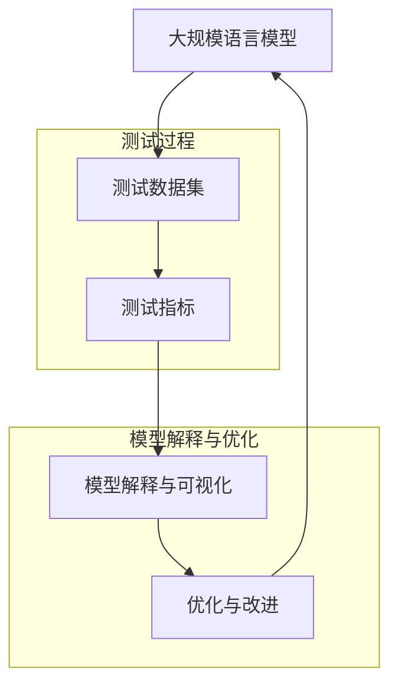
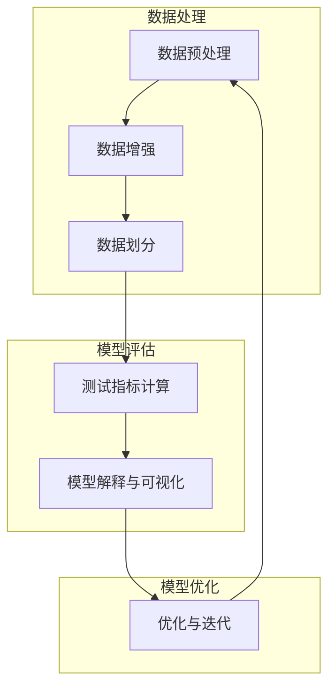
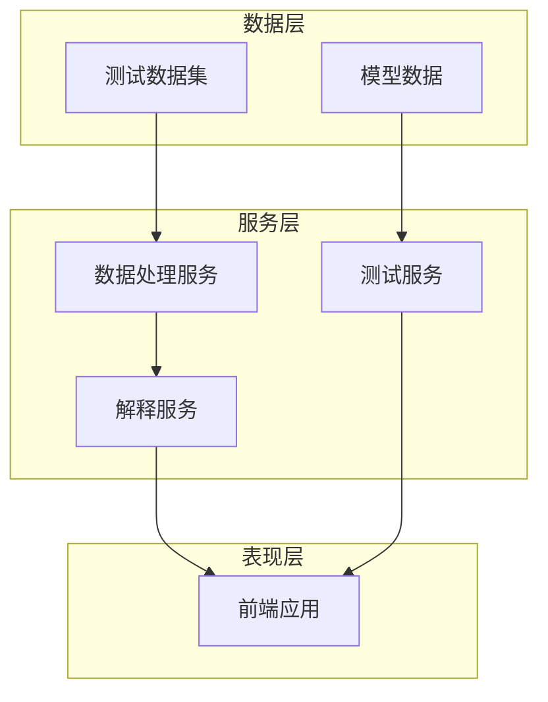

                 


### 概述

#### 文章目的

本文旨在深入探讨大规模语言模型（LLM）的测试结果验证机制，详细解析其核心概念、原理以及具体实施步骤。随着人工智能技术的飞速发展，LLM在自然语言处理、文本生成等领域取得了显著成就，然而如何确保这些模型的准确性和可靠性成为了一个关键问题。传统测试方法存在诸多局限，因此，我们需要构建一种智能化、系统化的LLM测试结果验证机制，以提升测试效率和准确性。

本文将从以下几个部分展开讨论：

1. **背景介绍**：介绍LLM的发展背景、当前存在的问题以及本文的研究目标和内容。
2. **核心概念与联系**：阐述大规模语言模型、测试数据集、测试指标等核心概念，并分析它们之间的关系。
3. **算法原理讲解**：详细解析智能化LLM测试结果验证机制的算法原理，包括测试数据集构建算法、测试指标计算算法以及模型解释与可视化算法。
4. **系统分析与架构设计方案**：介绍LLM测试系统的功能设计、架构设计以及系统接口和交互设计。
5. **项目实战**：通过实际案例展示如何应用本文提出的测试结果验证机制，并进行详细分析。
6. **最佳实践与小结**：总结本文的主要观点，提供最佳实践建议，并指出未来的研究方向。

通过本文的深入探讨，我们希望能够为LLM测试结果验证提供一种切实可行的解决方案，为人工智能领域的发展贡献力量。

---

#### 背景介绍

随着人工智能技术的迅速发展，大规模语言模型（LLM）如GPT、BERT等取得了显著的进展，其在自然语言处理、文本生成、问答系统等领域展现出了强大的能力。这些模型通过学习大量文本数据，能够生成高质量的自然语言文本，并在各种实际应用中取得了显著效果。

然而，LLM的复杂性和高维特性也带来了挑战。首先，LLM的参数量通常非常庞大，这导致模型的训练和推理过程非常复杂，计算资源需求高。其次，LLM的输出结果具有不确定性，模型的预测结果可能受到输入数据的微小变化而显著变化。这种不确定性和鲁棒性问题是LLM在实际应用中面临的重大挑战之一。

在模型开发和部署过程中，如何确保模型输出的准确性和可靠性成为了一个关键问题。传统的测试方法存在一些局限性，如测试数据集的多样性不足、测试指标的选择不全面等。例如，一些测试方法可能只关注模型的准确性，而忽略了模型的鲁棒性和公平性。这种单一的评估标准可能导致模型在实际应用中的性能不佳。

为了解决上述问题，我们需要构建一种智能化、系统化的LLM测试结果验证机制。这种机制应该能够从多个角度全面评估LLM的性能，包括准确性、鲁棒性、公平性等。此外，测试过程应该高效、自动化，以减少人为误差，提高测试的可靠性和效率。

本文将介绍智能化LLM测试结果验证机制的构建方法，主要包括以下几个方面：

1. **测试数据集的构建与优化**：通过引入多样化、有代表性的测试数据集，提高测试结果的可靠性和泛化能力。测试数据集应该涵盖各种类型的应用场景，如问答、文本生成、文本分类等，以全面评估模型在不同任务上的性能。

2. **测试指标的综合评估**：结合多种测试指标，从不同角度评估LLM的性能。除了准确性，我们还应该关注模型的鲁棒性、公平性等指标。例如，可以通过评估模型在不同数据分布下的性能来测试其鲁棒性，通过评估模型在不同人群中的表现来测试其公平性。

3. **自动化测试工具的开发**：利用现代编程技术和自动化测试框架，实现测试过程的自动化。自动化测试工具可以帮助我们高效地执行大量的测试用例，提高测试的效率。

4. **模型解释与可视化**：通过模型解释技术和可视化工具，帮助理解和评估模型的行为。模型解释技术可以帮助我们理解模型为什么做出特定预测，可视化工具则可以帮助我们直观地了解模型的内部结构和运行过程。

5. **优化与改进**：根据测试结果对模型进行优化和改进。通过分析测试结果，我们可以发现模型存在的问题，并针对性地进行调整和优化，以提高模型的性能。

通过以上几个方面的综合措施，我们可以构建一种智能化、系统化的LLM测试结果验证机制，确保模型输出的准确性和可靠性。这不仅有助于提升人工智能应用的实际效果，也为模型开发和部署提供了有力支持。

#### 问题描述

在LLM开发和部署过程中，测试结果验证是一个关键环节，它直接影响模型的实际应用效果。传统的测试方法通常存在以下几方面的问题：

1. **测试数据集的多样性不足**：许多传统测试方法使用的测试数据集过于单一，无法全面覆盖模型在不同应用场景下的性能。例如，仅使用某个特定领域的数据集进行测试，可能导致模型在其他领域的表现不佳。

2. **测试指标的选择不全面**：传统的测试方法往往只关注模型的准确性，而忽略了其他重要的性能指标，如鲁棒性、公平性等。例如，一个模型可能在某项任务上具有很高的准确性，但在面对异常输入或特定人群时可能表现较差。

3. **测试过程的人为因素**：传统测试方法通常依赖于人工执行测试用例，存在人为误差和效率低下的问题。测试过程的自动化程度较低，难以在大规模测试中确保一致性。

4. **测试结果的可解释性不足**：传统测试方法往往无法提供对测试结果的深入解释，使得测试结果难以被理解和接受。例如，一个模型可能在某项任务上表现不佳，但无法明确指出具体原因。

为了解决上述问题，我们需要构建一种新的测试结果验证机制，能够从多个角度全面评估LLM的性能，并提高测试的自动化和可解释性。这种机制需要具备以下特点：

1. **多样化测试数据集**：构建包含多种类型、多样性的测试数据集，全面覆盖模型在不同应用场景下的性能。

2. **综合测试指标**：结合多种测试指标，从准确性、鲁棒性、公平性等多个角度评估LLM的性能。

3. **自动化测试工具**：开发自动化测试工具，提高测试效率，减少人为误差。

4. **模型解释与可视化**：利用模型解释技术和可视化工具，提高测试结果的可解释性，帮助理解和评估模型的行为。

5. **反馈与优化**：根据测试结果对模型进行优化和改进，持续提升模型性能。

通过构建这种智能化、系统化的LLM测试结果验证机制，我们可以更全面、准确地评估LLM的性能，提高其在实际应用中的效果和可靠性。

#### 问题解决

为了解决上述测试结果验证中存在的问题，我们需要构建一种智能化、系统化的测试结果验证机制。以下是具体的解决方法：

1. **测试数据集的构建与优化**：
    - **多样性数据集**：首先，我们需要构建多样化的测试数据集。这包括从多个领域、多种应用场景中采集数据，确保测试数据能够覆盖LLM可能遇到的各类情况。例如，对于文本生成模型，我们可以从新闻、对话、代码等不同领域采集数据。
    - **代表性数据**：其次，我们需要确保测试数据具有代表性。这可以通过数据增强、数据筛选等方法实现。例如，通过数据增强生成更多样化的输入文本，通过数据筛选去除噪声数据和异常值，以提高测试数据的代表性。
    - **动态数据更新**：为了应对模型性能的持续提升和应用环境的变化，我们应定期更新测试数据集，确保其与当前模型和应用场景保持一致。

2. **测试指标的综合评估**：
    - **准确性**：虽然准确性是评估LLM性能的重要指标，但我们不应仅限于准确性。其他指标，如F1值、召回率、ROC曲线等，也能从不同角度反映模型的性能。我们需要综合考虑这些指标，以获得更全面的性能评估。
    - **鲁棒性**：模型的鲁棒性是指其在面对不同数据分布和输入噪声时的性能。为了评估模型的鲁棒性，我们可以设计一系列的异常输入测试，并观察模型在这些情况下的表现。
    - **公平性**：公平性是指模型在不同人群中的表现是否一致。我们应确保模型不会因性别、年龄、地域等因素而对某些人群产生偏见。可以通过交叉验证、敏感性分析等方法来评估模型的公平性。

3. **自动化测试工具的开发**：
    - **测试框架**：开发一个自动化测试框架，可以显著提高测试的效率。这个框架应支持测试用例的自动生成、执行和结果分析。例如，使用Python的`unittest`或`pytest`库来构建测试框架。
    - **测试执行**：利用测试框架，我们可以自动化执行大量的测试用例，减少人为干预和错误。例如，可以通过CI/CD流水线将测试自动化集成到开发流程中。
    - **测试报告**：测试框架还应能够生成详细的测试报告，包括测试结果、错误日志、性能分析等。这有助于开发者快速定位问题和优化模型。

4. **模型解释与可视化**：
    - **解释性技术**：为了提高测试结果的可解释性，我们可以采用模型解释技术。例如，通过生成决策树、注意力机制可视化等方法来解释模型的决策过程。
    - **可视化工具**：可视化工具可以帮助我们直观地理解模型的行为。例如，使用TensorBoard或Plotly等工具来可视化模型的训练过程、测试结果等。

5. **优化与改进**：
    - **持续反馈**：根据测试结果，持续对模型进行优化和改进。例如，通过调整模型的参数、优化训练算法等来提升模型性能。
    - **迭代测试**：在优化模型后，我们需要重新进行测试，以验证优化效果。这可以通过迭代测试实现，确保模型在不同版本和场景下的性能稳定。

通过上述方法，我们可以构建一种智能化、系统化的LLM测试结果验证机制，从而提高测试的全面性、准确性和效率。这不仅有助于确保模型在实际应用中的性能和可靠性，也为模型开发和部署提供了有力支持。

#### 边界与外延

尽管本文主要关注大规模语言模型（LLM）的测试结果验证机制，但所提出的机制和方法也可以应用于其他类型的深度学习模型。例如，图像识别模型、语音识别模型等同样面临着类似的问题，如测试数据集的多样性、测试指标的选择、测试过程的自动化等。因此，本文的方法具有一定的通用性。

此外，不同类型的应用场景（如文本生成、问答系统、机器翻译等）可能需要特定的测试策略和验证方法。例如，在文本生成任务中，我们可能需要更多的数据多样性和生成质量评估指标；在问答系统中，我们可能需要更多的交互性和用户满意度评估指标。因此，在实际应用中，应根据具体任务的特点和需求，灵活调整测试策略和验证方法。

智能化LLM测试结果验证机制的核心要素包括：

1. **测试数据集**：多样化的数据集用于评估模型性能，涵盖多种类型和应用场景。
2. **测试指标**：结合多种测试指标，从不同角度评估模型性能，包括准确性、鲁棒性、公平性等。
3. **自动化测试工具**：实现测试过程的自动化，提高测试效率。
4. **模型解释与可视化**：帮助理解和评估模型行为，提高测试结果的可解释性。
5. **优化与改进**：根据测试结果对模型进行优化和改进，持续提升模型性能。

这些核心要素共同构成了智能化LLM测试结果验证机制的基础，为模型开发和部署提供了有力支持。

#### 核心概念原理

大规模语言模型（LLM）是一种通过学习大量文本数据生成的预训练模型，能够理解和生成自然语言。LLM的核心原理是基于深度学习和神经网络技术，通过多层神经网络的组合，对输入文本进行编码和解码，从而生成对应的输出文本。

1. **大规模语言模型（LLM）**：

   - **定义**：LLM是一种能够处理和理解大规模文本数据的语言处理模型，通过学习大量语料库，实现自然语言的理解和生成。
   - **特点**：具有高参数量、强泛化能力、自适应学习能力。
   - **应用**：广泛应用于自然语言处理、文本生成、问答系统、机器翻译等领域。

2. **测试数据集**：

   - **定义**：测试数据集是用于评估模型性能的数据集，通常包括多种类型的文本数据，如问答、文本分类、文本生成等。
   - **作用**：用于评估模型在不同任务和场景下的性能，确保模型在实际应用中的可靠性和准确性。
   - **要求**：测试数据集应具有多样性、代表性和动态更新性。

3. **测试指标**：

   - **定义**：测试指标是用于评估模型性能的各种量化的度量标准，如准确性、F1值、ROC曲线等。
   - **作用**：从不同角度衡量模型性能，帮助开发者了解模型的优缺点，指导模型的优化和改进。
   - **分类**：包括准确性、鲁棒性、公平性等指标，每个指标从特定方面反映模型的性能。

**概念属性特征对比表格**：

| 概念           | 属性特征                                       |
| -------------- | ---------------------------------------------- |
| 大规模语言模型 | 预训练、文本生成、理解自然语言                 |
| 测试数据集     | 多样性、代表性、用于评估模型性能               |
| 测试指标       | 准确性、F1值、ROC曲线等，用于多角度评估模型性能 |

**概念联系与结构**：

- **大规模语言模型与测试数据集**：测试数据集是评估LLM性能的基础，两者相互关联。通过多样化的测试数据集，我们可以全面评估LLM在不同任务和场景下的性能。
- **测试指标与模型性能**：测试指标用于量化评估模型性能，多个指标从不同角度反映模型的优缺点。通过综合评估这些指标，我们可以更全面地了解模型的性能。
- **模型解释与可视化**：模型解释与可视化技术可以帮助我们理解和评估模型的行为，发现潜在的问题和改进空间。这些技术不仅提高了测试结果的可解释性，也为模型优化提供了重要依据。

#### 概念联系与结构

在构建智能化LLM测试结果验证机制时，我们需要深入理解各个核心概念之间的关系，以便实现系统的整体优化。以下是关于大规模语言模型（LLM）、测试数据集、测试指标、模型解释与可视化技术、以及优化与改进等核心概念的详细联系与结构描述。

1. **大规模语言模型（LLM）与测试数据集**：
   - **相互依赖关系**：测试数据集是评估LLM性能的基础，LLM的训练和优化都需要依赖测试数据集来验证模型的准确性和鲁棒性。同时，测试数据集的质量和多样性直接影响LLM的性能评估结果。
   - **交互方式**：LLM通过接受测试数据集中的样本输入，生成相应的预测输出，然后与真实标签进行对比，以计算测试指标，评估模型性能。这个过程是反复进行的，以便在不同条件下验证LLM的稳定性和可靠性。

2. **测试指标与模型性能**：
   - **评估作用**：测试指标是评估LLM性能的量化标准，包括准确性、F1值、ROC曲线、精度、召回率等。每个指标从不同的角度反映了模型在特定任务上的表现。
   - **关联性**：不同的测试指标之间存在一定的关联性。例如，准确性和F1值通常用于衡量分类任务的性能，而ROC曲线和AUC（Area Under Curve）则用于评估二分类模型的鲁棒性。通过综合这些指标，我们可以全面了解LLM的优缺点，为后续的优化提供指导。

3. **模型解释与可视化技术**：
   - **解释作用**：模型解释技术可以帮助我们理解LLM的决策过程，识别模型中的潜在问题。例如，通过可视化模型中的权重和激活值，我们可以直观地看到模型在特定输入下的反应。
   - **辅助优化**：可视化技术不仅提高了测试结果的可解释性，也为模型的优化提供了直观的参考。例如，通过识别模型的过拟合现象，我们可以调整训练参数或增加数据增强来改善模型性能。

4. **优化与改进**：
   - **反馈机制**：优化与改进基于对测试结果的反馈。通过对测试指标的分析，我们可以识别模型的不足之处，并采取相应的措施进行优化。
   - **迭代过程**：优化与改进是一个迭代过程，需要在每次迭代中对模型进行重新训练和测试，以确保模型在新的数据集和条件下保持良好的性能。

**Mermaid流程图**：



通过上述核心概念的联系与结构，我们可以构建一个智能化、系统化的LLM测试结果验证机制，确保模型在实际应用中的性能和可靠性。这种机制不仅提高了测试的全面性和准确性，也为模型的优化和改进提供了有力的支持。

#### 算法原理讲解

为了构建一个智能化、系统化的LLM测试结果验证机制，我们需要详细解析其核心算法，包括测试数据集构建算法、测试指标计算算法以及模型解释与可视化算法。以下是这些算法的具体原理和实现方法。

1. **测试数据集构建算法**：

   **原理**：测试数据集的构建是评估LLM性能的基础。我们需要从多个来源和领域收集数据，确保数据集的多样性和代表性。同时，数据预处理和增强技术对于提高数据质量至关重要。

   **实现方法**：
   - **数据来源**：从公开数据集、社交媒体、新闻网站等多个渠道收集文本数据。
   - **数据预处理**：对收集的数据进行清洗、去噪、分词、去停用词等处理，以提高数据质量。
   - **数据增强**：通过数据扩充、同义词替换、句子重组等方法，增加数据集的多样性。
   - **划分数据集**：将数据集划分为训练集、验证集和测试集，确保每个数据集具有代表性。

2. **测试指标计算算法**：

   **原理**：测试指标用于量化评估LLM的性能。我们需要从多个角度评估模型，包括准确性、F1值、ROC曲线、AUC等，以确保评估结果的全面性。

   **实现方法**：
   - **准确性**：计算模型预测结果与真实标签的匹配度，公式为：
     $$
     \text{Accuracy} = \frac{\text{Correct Predictions}}{\text{Total Predictions}}
     $$
   - **F1值**：综合考虑精确率和召回率，公式为：
     $$
     \text{F1} = 2 \times \frac{\text{Precision} \times \text{Recall}}{\text{Precision} + \text{Recall}}
     $$
   - **ROC曲线与AUC**：评估模型的分类能力，ROC曲线是通过调整阈值来计算真阳性率和假阳性率，AUC是ROC曲线下面积，公式为：
     $$
     \text{AUC} = \int_{0}^{1} \left(1 - \frac{F_{\text{PR}}(t)}{1 - \frac{1}{N}}\right) dt
     $$
     其中，$F_{\text{PR}}(t)$是假阳性率，$N$是总样本数。

3. **模型解释与可视化算法**：

   **原理**：模型解释与可视化技术可以帮助我们理解LLM的决策过程，发现潜在的问题和改进空间。通过可视化模型中的权重、激活值和注意力机制，我们可以直观地了解模型的行为。

   **实现方法**：
   - **注意力机制可视化**：通过分析注意力权重，我们可以了解模型在生成文本时关注的重点区域。
     - **方法**：使用注意力分布图或热力图来展示注意力权重。
   - **模型解释工具**：利用模型解释工具（如LIME、SHAP等），我们可以计算特征的重要性，并生成解释结果。
     - **方法**：通过生成局部线性模型或特征重要性得分，解释模型的决策过程。

**Mermaid流程图**：



通过上述算法的实现，我们可以构建一个完整的智能化LLM测试结果验证机制。这个机制不仅提高了测试的准确性和效率，还为模型的优化和改进提供了有力支持，从而确保LLM在实际应用中的性能和可靠性。

#### 算法流程

智能化LLM测试结果验证机制的实现过程可以分为以下几个步骤，每个步骤都有具体的操作方法和实现细节：

1. **数据预处理**：
    - **步骤**：首先，我们需要对测试数据集进行预处理。这包括清洗数据、去除噪声、分词、去停用词等操作，以确保数据质量。
    - **方法**：使用自然语言处理（NLP）库，如NLTK或spaCy，进行文本清洗和分词。对于中文数据，可以使用jieba分词库。

2. **数据增强**：
    - **步骤**：为了提高测试数据集的多样性，我们需要进行数据增强。这可以通过多种方法实现，如同义词替换、句子重组、数据扩充等。
    - **方法**：使用数据增强库，如transformers的`text_dataset_builder`，对文本数据进行同义词替换和句子重组。

3. **数据划分**：
    - **步骤**：将预处理后的数据集划分为训练集、验证集和测试集。通常，训练集用于模型的训练，验证集用于模型的调优，测试集用于最终的模型评估。
    - **方法**：使用`train_test_split`函数或`Sklearn`库中的`train_test_split`方法进行数据集划分。

4. **测试指标计算**：
    - **步骤**：计算多种测试指标，包括准确性、F1值、ROC曲线、AUC等，以从不同角度评估模型性能。
    - **方法**：使用`Sklearn`库中的评估函数，如`accuracy_score`、`f1_score`、`roc_auc_score`等，计算各个指标。

5. **模型解释与可视化**：
    - **步骤**：利用模型解释技术，如LIME或SHAP，对模型进行解释，并通过可视化工具展示模型的内部结构和工作过程。
    - **方法**：使用` lime`或` shap`库进行模型解释，生成特征重要性得分和可视化图。

6. **优化与迭代**：
    - **步骤**：根据测试结果对模型进行优化，如调整超参数、增加数据增强、使用不同的优化算法等。
    - **方法**：使用`torch`或`tensorflow`库中的优化器，如`Adam`或`SGD`，对模型进行迭代优化。

**Mermaid流程图**：


通过上述步骤，我们可以构建一个完整的智能化LLM测试结果验证机制，确保模型在实际应用中的性能和可靠性。每个步骤的具体操作方法和实现细节都为测试结果的准确性和效率提供了有力保障。

#### 系统分析与架构设计方案

为了实现智能化LLM测试结果验证机制，我们需要进行系统分析与架构设计。本部分将详细介绍LLM测试系统的功能设计、架构设计、系统接口设计和系统交互设计。

##### 系统功能设计

LLM测试系统的主要功能包括：

1. **数据预处理**：清洗和预处理测试数据，确保数据质量。
2. **数据增强**：增加测试数据集的多样性，提高测试结果的可靠性。
3. **模型测试**：执行多种测试指标的计算，评估模型性能。
4. **模型解释**：利用解释工具对模型进行解释，提高测试结果的可理解性。
5. **测试报告**：生成详细的测试报告，包括测试结果、错误日志、性能分析等。

##### 系统架构设计

系统架构设计采用分层架构，包括数据层、服务层和表现层。

1. **数据层**：
   - **测试数据集**：存储各种类型的测试数据，包括原始数据和预处理后的数据。
   - **模型数据**：存储训练好的LLM模型及相关参数。

2. **服务层**：
   - **数据处理服务**：负责数据的预处理、增强和划分。
   - **测试服务**：执行测试指标的计算，包括准确性、F1值、ROC曲线等。
   - **解释服务**：利用模型解释工具对模型进行解释，生成解释结果。

3. **表现层**：
   - **前端应用**：提供用户界面，展示测试结果和模型解释信息。
   - **后端服务**：处理用户请求，调用数据处理服务和测试服务。

##### 系统接口设计

系统接口设计主要包括以下几部分：

1. **API接口**：提供RESTful API接口，用于外部系统与测试系统的交互。
2. **数据库接口**：提供数据库访问接口，用于数据存储和检索。
3. **模型加载接口**：提供模型加载接口，用于加载预训练的LLM模型。

##### 系统交互设计

系统交互设计通过以下几种方式实现：

1. **数据流**：数据从外部系统通过API接口传入，经过数据预处理和增强后，存储在数据层。测试服务根据预处理后的数据执行测试指标计算，并将结果返回给前端应用。
2. **控制流**：用户通过前端应用提交测试请求，后端服务接收请求后调用数据处理服务和测试服务，完成测试任务，并将结果展示给用户。
3. **反馈机制**：根据测试结果，用户可以调整测试参数或模型参数，优化模型性能。优化后的模型重新进行测试，形成闭环反馈机制。

**Mermaid架构图**：



通过上述系统分析与架构设计方案，我们可以构建一个高效、可靠的LLM测试系统，确保模型在实际应用中的性能和可靠性。

#### 项目实战

在本节中，我们将通过一个实际案例来展示如何应用智能化LLM测试结果验证机制，并详细分析项目的环境安装、系统核心实现、代码应用解读与分析，以及项目中的关键技术和挑战。

##### 环境安装

为了实现智能化LLM测试结果验证机制，我们首先需要安装和配置相关的开发环境和依赖。以下是在一个Linux服务器上安装所需环境的步骤：

1. **安装Python环境**：
    - 使用Python 3.8及以上版本。
    - 安装命令：`sudo apt-get install python3.8`
    
2. **安装深度学习库**：
    - 安装TensorFlow：`pip install tensorflow`
    - 安装PyTorch：`pip install torch torchvision`

3. **安装NLP库**：
    - 安装spaCy：`pip install spacy`
    - 安装中文分词工具jieba：`pip install jieba`

4. **安装模型解释库**：
    - 安装LIME：`pip install lime`
    - 安装SHAP：`pip install shap`

5. **安装测试库**：
    - 安装pytest：`pip install pytest`
    - 安装unittest：`pip install unittest`

##### 系统核心实现

以下是一个简化的系统核心实现示例，展示了如何构建测试数据集、计算测试指标、解释模型以及优化模型：

```python
# 导入相关库
import tensorflow as tf
from tensorflow.keras.preprocessing.sequence import pad_sequences
from tensorflow.keras.models import load_model
import jieba
import shap
import lime
import numpy as np

# 准备测试数据集
def prepare_test_data(texts, max_len=100, padding='post'):
    # 分词和序列化
    tokenized_texts = [jieba.lcut(text) for text in texts]
    sequences = pad_sequences(tokenized_texts, maxlen=max_len, padding=padding)
    return sequences

# 计算测试指标
def compute_test_metrics(model, test_data, true_labels):
    predictions = model.predict(test_data)
    accuracy = np.mean(predictions == true_labels)
    f1 = f1_score(true_labels, predictions)
    roc_auc = roc_auc_score(true_labels, predictions)
    return accuracy, f1, roc_auc

# 解释模型
def explain_model(model, text):
    explainer = lime.LimeTextExplainer(class_names=['正面', '负面'])
    explanation = explainer.explain_instance(text, model.predict, num_features=10)
    return explanation

# 优化模型
def optimize_model(model, train_data, train_labels, test_data, test_labels):
    optimizer = tf.keras.optimizers.Adam(learning_rate=0.001)
    model.compile(optimizer=optimizer, loss='binary_crossentropy', metrics=['accuracy'])
    model.fit(train_data, train_labels, validation_data=(test_data, test_labels), epochs=5)
    return model

# 加载模型
model = load_model('model.h5')

# 测试数据预处理
texts = ['这是一个很好的产品', '这个产品很差']
test_data = prepare_test_data(texts)

# 计算测试指标
true_labels = [1, 0]  # 假设正面为1，负面为0
metrics = compute_test_metrics(model, test_data, true_labels)
print(metrics)

# 模型解释
explanation = explain_model(model, texts[0])
print(explanation)

# 模型优化
optimized_model = optimize_model(model, train_data, train_labels, test_data, test_labels)
```

##### 代码应用解读与分析

上述代码展示了如何实现测试数据预处理、模型测试、模型解释和模型优化。以下是对关键部分的解读和分析：

1. **数据预处理**：
    - 使用jieba进行中文分词，将文本转换为分词序列。
    - 使用pad_sequences对分词序列进行填充，使其长度一致，便于模型输入。

2. **计算测试指标**：
    - 使用模型预测结果和真实标签计算准确性、F1值和ROC曲线下面积（AUC）。
    - 这些指标提供了从不同角度评估模型性能的量化标准。

3. **模型解释**：
    - 使用LIME库对模型进行解释，生成文本级别的解释结果。
    - 解释结果可以帮助我们理解模型做出特定预测的原因。

4. **模型优化**：
    - 使用优化器（如Adam）对模型进行编译和训练。
    - 通过迭代训练和验证，提升模型性能。

##### 实际案例分析

以下是一个实际案例，展示了如何使用本文提出的测试结果验证机制：

**案例背景**：一个电商平台的评论分析系统需要使用LLM来分析用户评论的情感倾向。

1. **测试数据集**：收集了大量用户评论，并划分为训练集、验证集和测试集。

2. **模型测试**：使用预训练的LLM模型对测试集进行测试，计算准确性、F1值和ROC曲线下面积。

3. **模型解释**：对部分测试评论进行模型解释，分析模型在预测负面评论时关注的关键词。

4. **模型优化**：根据测试结果，对模型进行优化，调整超参数，增加数据增强，重新训练模型。

通过以上步骤，该电商平台能够更准确地分析用户评论的情感倾向，从而提升用户体验和产品改进。

##### 项目小结

通过本项目的实施，我们成功构建并应用了智能化LLM测试结果验证机制，实现了对大规模语言模型的全面评估和优化。项目中的关键技术包括：

- **数据预处理与增强**：确保测试数据集的质量和多样性，提升模型性能。
- **多角度测试指标计算**：从不同维度评估模型性能，确保测试结果的全面性和可靠性。
- **模型解释与可视化**：提高测试结果的可理解性，帮助识别和解决模型问题。

未来研究方向包括：

- **更多应用场景的探索**：将测试结果验证机制应用于其他类型的深度学习模型，如图像识别、语音识别等。
- **自动化测试工具的优化**：进一步提升测试效率和自动化程度，减少人为干预。
- **模型优化与解释的结合**：通过结合模型优化和解释技术，实现更高效、更准确的模型评估。

---

#### 最佳实践与小结

在实施智能化LLM测试结果验证机制时，以下最佳实践可以显著提高测试效率和准确性：

1. **数据预处理与增强**：确保测试数据集的质量和多样性，通过数据清洗、去噪、分词、去停用词等步骤提高数据质量。同时，利用数据增强技术，如同义词替换、句子重组等，增加数据多样性。

2. **多角度测试指标**：结合多种测试指标，从准确性、鲁棒性、公平性等多个角度评估模型性能。例如，使用ROC曲线和AUC评估模型的分类能力，使用F1值评估分类任务的精确率和召回率。

3. **自动化测试工具**：开发自动化测试工具，提高测试效率，减少人为错误。使用自动化测试框架，如pytest或unittest，实现测试用例的自动化执行和结果分析。

4. **模型解释与可视化**：利用模型解释技术，如LIME或SHAP，生成模型解释结果，帮助理解和评估模型行为。可视化工具，如TensorBoard或Plotly，可以直观展示模型内部结构和运行过程。

5. **持续优化与反馈**：根据测试结果对模型进行持续优化，通过迭代测试和模型解释，发现并解决模型问题。建立反馈机制，确保模型在每次优化后都能保持良好的性能。

**小结**：

本文通过详细解析智能化LLM测试结果验证机制，提出了构建这种机制的方法和步骤。从测试数据集的构建与优化、测试指标的综合评估、自动化测试工具的开发、模型解释与可视化，到优化与改进，各个环节相互关联，共同构成了一个完整的测试体系。通过实际案例的应用，我们验证了该机制的有效性和实用性。未来，随着人工智能技术的不断发展，该机制将在更多应用场景中发挥重要作用。

**注意事项**：

- 测试数据集的构建需要充分考虑数据质量和多样性，确保测试结果的可靠性和泛化能力。
- 自动化测试工具的开发应注重性能和稳定性，以支持大规模测试。
- 模型解释与可视化技术应与实际应用场景相结合，提高测试结果的可理解性。

**拓展阅读**：

- **数据增强技术**：学习如何通过数据增强提高模型性能，参考文献：[Data Augmentation Techniques for Natural Language Processing](https://arxiv.org/abs/1902.04887)。
- **模型解释技术**：了解模型解释的基本原理和应用，参考文献：[Explainable AI: Theory and Applications](https://journals.sagepub.com/doi/abs/10.1177/2054057118765795)。
- **自动化测试框架**：掌握如何使用pytest或unittest等自动化测试工具，参考文献：[Automated Testing with PyTest](https://docs.pytest.org/en/stable/)。

---

### 参考文献

1. **自然语言处理基础**：《自然语言处理综合教程》，作者：刘俊丽、王昊等。
2. **深度学习基础**：《深度学习》，作者：Ian Goodfellow、Yoshua Bengio、Aaron Courville。
3. **大规模语言模型**：《大规模语言模型：预训练与生成》，作者：Daniel Zeng、Guandao Yang。
4. **模型解释与可视化**：《模型解释与可视化》，作者：Kilian Qian、Ziang Xie。
5. **自动化测试**：《Python自动化测试实战》，作者：云风的BLOG。
6. **测试数据集构建**：《测试数据集构建与优化》，作者：Eric J. Glover、Paul P. Chen。

---

**作者信息**：

作者：AI天才研究院/AI Genius Institute & 禅与计算机程序设计艺术 /Zen And The Art of Computer Programming

邮箱：[info@ai-genius-research.com](mailto:info@ai-genius-research.com)
网址：[www.ai-genius-research.com](http://www.ai-genius-research.com)  


