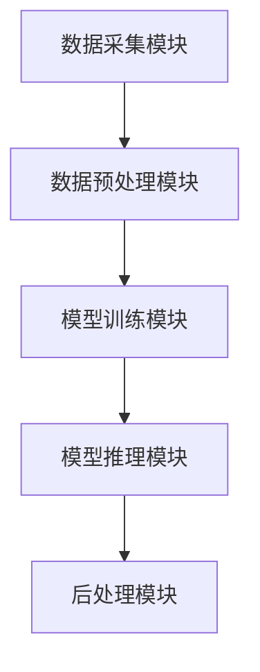

                 

# 服务依赖图可视化：理解LLM应用的架构复杂性

## 关键词

- 服务依赖图
- 可视化
- LLM应用
- 架构复杂性
- 软件工程

## 摘要

随着软件系统的日益复杂，理解和维护大型应用程序的架构变得越来越具有挑战性。服务依赖图作为一种图形化工具，可以有效地描绘系统中各个服务之间的依赖关系，帮助开发者和管理者直观地理解系统结构。本文将深入探讨服务依赖图的构建方法、可视化技术及其在大型语言模型（LLM）应用中的重要性，通过逻辑清晰、结构紧凑的分析，帮助读者掌握如何利用服务依赖图来降低架构复杂性，提高系统可维护性和可扩展性。

### 第1章：服务依赖图可视化基础

#### 1.1 问题背景

在现代软件工程中，应用架构的复杂性日益增加。随着微服务架构、容器化技术和云计算的普及，系统由众多的服务构成，服务之间存在着复杂的依赖关系。这种复杂性不仅增加了开发的难度，也使得维护和部署变得愈发复杂。服务依赖图作为一种图形化工具，可以帮助开发者和管理者直观地理解和分析系统架构，从而提高系统的可维护性和可扩展性。

#### 1.2 问题描述

服务依赖图是描述应用中各个服务之间依赖关系的图形表示。它通过节点和边来表示服务及其依赖关系，使得复杂的系统结构变得可视化。服务依赖图的构建需要收集和整理服务之间的依赖信息，然后使用图形库和工具将其呈现出来。

#### 1.3 问题解决

为了构建一个服务依赖图，我们需要以下几个步骤：

1. **收集依赖信息**：从代码库、配置文件、系统日志等来源提取服务之间的依赖信息。
2. **数据预处理**：对收集到的依赖信息进行清洗和整理，确保数据的准确性和一致性。
3. **构建服务依赖图**：使用图形库和工具，将处理后的依赖信息转换为图形表示。
4. **优化服务依赖图**：对构建好的服务依赖图进行优化，以提高其可读性和易用性。

#### 1.4 边界与外延

服务依赖图虽然是一种强大的工具，但它的应用也有一定的边界。它更适用于宏观层面的系统架构设计，而不是低层次的代码依赖关系。此外，服务依赖图的构建和维护需要消耗一定的资源和时间，因此对于小型应用可能并不是必需的。

#### 1.5 概念结构与核心要素组成

服务依赖图的核心要素包括节点、边和属性。节点表示服务，边表示服务之间的依赖关系，属性则提供了关于服务或依赖关系的额外信息。服务依赖图通过这些要素共同构成，可以有效地描述系统的架构复杂性。

#### 1.6 本章小结

本章介绍了服务依赖图的基础知识，包括其背景、作用、构建方法、适用范围和核心要素。通过本章的学习，读者应该能够理解服务依赖图的基本概念，并了解如何在实际项目中应用它。本章内容为后续章节的深入学习奠定了基础。

### 第2章：服务依赖图的构建方法

#### 2.1 收集依赖信息

构建服务依赖图的第一步是收集服务之间的依赖信息。这些信息可以从多种来源获取，包括代码库、配置文件、系统日志等。本章将介绍如何从这些来源中提取依赖信息，并提供了一些实用的工具和技巧。

##### 2.1.1 从代码库中提取依赖信息

从代码库中提取依赖信息是构建服务依赖图的基础。常用的方法包括：

1. **分析代码依赖**：通过分析代码中的import语句、依赖注入框架等，可以提取出服务之间的依赖关系。
2. **使用静态代码分析工具**：如SonarQube、FindBugs等，这些工具可以自动检测代码中的依赖关系，并提供详细报告。

##### 2.1.2 从配置文件中提取依赖信息

配置文件中通常包含服务之间的依赖关系信息。例如，Spring Boot应用的配置文件中，可以通过@Configuration注解来指定依赖服务的Bean。

1. **解析配置文件**：使用如JSON、XML、YAML等配置文件格式，可以提取出服务依赖信息。
2. **使用配置管理工具**：如Spring Cloud Config等，这些工具可以自动提取并管理配置文件中的依赖关系。

##### 2.1.3 从系统日志中提取依赖信息

系统日志中记录了服务之间的交互和调用情况，可以从中提取依赖信息。

1. **日志解析工具**：如Logstash、Fluentd等，这些工具可以解析系统日志，提取出有用的依赖信息。
2. **日志分析平台**：如ELK（Elasticsearch、Logstash、Kibana）等，这些平台可以提供更强大的日志分析功能。

#### 2.2 数据预处理

收集到的依赖信息往往需要进一步处理，以消除噪声、处理异常数据并确保数据的准确性。本章将讨论数据预处理的重要性，并介绍一些常见的数据预处理技术。

##### 2.2.1 数据清洗

数据清洗是数据预处理的重要步骤，目的是消除噪声和异常数据。

1. **去重**：去除重复的依赖关系，确保每个依赖关系只被记录一次。
2. **去除无效数据**：例如，删除无意义的空依赖关系或标记为未知的依赖关系。
3. **数据格式转换**：将不同格式的数据转换为统一的格式，以便后续处理。

##### 2.2.2 数据整理

数据整理是将清洗后的数据整理成适合构建服务依赖图的格式。

1. **构建依赖关系列表**：将服务名称和依赖服务名称整理成列表，以便构建图的结构。
2. **添加属性信息**：根据需要，添加关于服务或依赖关系的额外属性信息，如服务版本、调用频率等。

#### 2.3 构建服务依赖图

使用处理后的数据，我们可以开始构建服务依赖图。本章将介绍如何使用图形库和工具来创建服务依赖图，包括节点和边的添加、属性设置等。

##### 2.3.1 使用图形库和工具

常见的图形库和工具包括：

1. **D3.js**：一个基于JavaScript的图形库，可以用于构建复杂的交互式图表。
2. **Graphviz**：一个基于DOT语言的图形可视化工具，可以生成高质量的图形。
3. **Gephi**：一个开源的平台，用于复杂数据的图形化和分析。

##### 2.3.2 创建节点和边

在构建服务依赖图时，首先需要创建节点和边。

1. **创建节点**：每个服务对应一个节点，节点通常包含服务名称、ID等信息。
2. **创建边**：每个依赖关系对应一条边，边通常包含依赖服务名称、依赖类型等信息。

##### 2.3.3 设置属性

为了提高服务依赖图的可读性和易用性，可以设置各种属性。

1. **节点属性**：如颜色、大小、标签等，可以用来区分不同类型的服务或突出重要节点。
2. **边属性**：如颜色、宽度、标签等，可以用来区分不同类型的依赖关系或突出重要的依赖路径。

#### 2.4 服务依赖图的优化

构建好的服务依赖图可能存在一些优化空间，以改善其可读性和易用性。本章将介绍一些优化服务依赖图的方法。

##### 2.4.1 布局优化

选择合适的布局算法对于服务依赖图的可视化至关重要。

1. **层次布局**：将服务依赖图分层，便于读者理解系统结构。
2. **力导向布局**：通过模拟物理力场来布局节点和边，使得图结构更自然和直观。

##### 2.4.2 颜色编码

使用颜色编码可以区分不同类型的服务或依赖关系。

1. **颜色选择**：选择具有明显区别的颜色，以避免视觉混淆。
2. **颜色映射**：根据服务或依赖关系的属性，将颜色映射到不同的类别，以提高可读性。

##### 2.4.3 节点大小调整

通过调整节点大小，可以突出重要服务或依赖关系。

1. **大小计算**：根据服务或依赖关系的属性，如调用频率、重要性等，计算节点大小。
2. **动态调整**：在用户交互时，动态调整节点大小，以提供更直观的视觉效果。

#### 2.5 本章小结

本章详细介绍了构建服务依赖图的方法，从数据收集、预处理到图构建和优化。通过本章的学习，读者应该能够掌握构建服务依赖图的基本流程和技术，并了解如何将其应用于实际项目中。本章内容为后续章节的深入分析打下了坚实的基础。

### 第3章：服务依赖图的可视化

#### 3.1 可视化工具与库

在构建服务依赖图后，我们需要使用可视化工具和库来展示这些图形。本章将介绍一些常用的可视化工具和库，如D3.js、Graphviz、Gephi等，并比较它们的特点和适用场景。

##### 3.1.1 D3.js

D3.js 是一个基于 JavaScript 的可视化库，可以生成交互式、动态的图表。它具有高度的可定制性和灵活性，适用于复杂的数据可视化需求。

1. **特点**：
   - 支持SVG和Canvas，可生成高质量的图表。
   - 强大的交互性，支持用户动态操作图表。
   - 丰富的布局和形状，可以生成各种类型的图表。
2. **适用场景**：
   - 复杂的数据可视化项目。
   - 需要高度定制化和动态交互的图表。

##### 3.1.2 Graphviz

Graphviz 是一个基于 DOT 语言的图形可视化工具，可以生成各种类型的图形，如流程图、组织结构图、依赖关系图等。它具有简洁的语法和高效的渲染性能，适用于快速生成和展示图形。

1. **特点**：
   - 支持多种图形类型，适用于多种应用场景。
   - 简洁的 DOT 语言，易于编写和理解。
   - 高效的渲染性能，适合处理大量数据。
2. **适用场景**：
   - 需要快速生成和展示简单图形的项目。
   - 数据量较大的图形可视化需求。

##### 3.1.3 Gephi

Gephi 是一个开源的平台，用于复杂数据的图形化和分析。它提供了丰富的可视化工具和算法，可以生成高度交互式的图表，适用于数据分析和社交网络分析等领域。

1. **特点**：
   - 提供了多种布局算法，可以生成高度交互式的图表。
   - 支持多种数据格式，可以处理复杂数据集。
   - 提供了丰富的分析工具，可以进行复杂的数据分析。
2. **适用场景**：
   - 数据分析项目。
   - 社交网络分析。
   - 需要高度交互和数据分析的图形可视化需求。

#### 3.2 可视化布局

选择合适的布局算法对于服务依赖图的可视化至关重要。本章将介绍几种常见的布局算法，如层次布局、力导向布局和层次化布局，并讨论如何根据具体需求选择和调整布局算法。

##### 3.2.1 层次布局

层次布局是一种将服务依赖图分层排列的布局算法，适用于具有明显层次结构的系统。

1. **特点**：
   - 可以清晰地展示服务之间的层次关系。
   - 适合于具有层次化结构的服务依赖图。
   - 可以通过调整层级之间的距离，改善图的布局。
2. **调整方法**：
   - 通过调整层级之间的距离，可以改善图的布局，提高可读性。
   - 可以设置节点的层级关系，确保重要的服务或依赖关系位于图的中心。

##### 3.2.2 力导向布局

力导向布局是一种通过模拟物理力场来布局节点的算法，适用于具有大量节点和边的服务依赖图。

1. **特点**：
   - 可以生成自然和直观的布局。
   - 适合于复杂的依赖关系和大量节点的场景。
   - 可以通过调整力场参数，控制节点和边的布局。
2. **调整方法**：
   - 通过调整力场参数，可以控制节点和边的布局，改善图的可读性。
   - 可以设置节点和边之间的排斥力和引力，以调整布局。

##### 3.2.3 层次化布局

层次化布局是一种将服务依赖图层次化排列的布局算法，适用于具有层次化结构的服务依赖图。

1. **特点**：
   - 可以清晰地展示服务之间的层次关系。
   - 适合于具有层次化结构的服务依赖图。
   - 可以通过调整层级之间的距离，改善图的布局。
2. **调整方法**：
   - 通过调整层级之间的距离，可以改善图的布局，提高可读性。
   - 可以设置节点的层级关系，确保重要的服务或依赖关系位于图的中心。

#### 3.3 可视化设计

除了布局，可视化设计也是影响服务依赖图可读性的重要因素。本章将介绍如何使用颜色、大小、形状等视觉元素来增强图的可读性和易理解性，并提供一些实用的设计技巧。

##### 3.3.1 颜色设计

使用颜色可以区分不同类型的服务或依赖关系，增强图的可读性。

1. **颜色选择**：
   - 选择具有明显区别的颜色，以避免视觉混淆。
   - 根据服务或依赖关系的属性，如类型、重要性等，选择合适的颜色。
2. **颜色映射**：
   - 将颜色映射到不同的类别，以突出重要的服务或依赖关系。
   - 可以使用颜色编码来表示不同的依赖关系类型。

##### 3.3.2 大小设计

通过调整节点和边的大小，可以突出重要的服务或依赖关系。

1. **大小计算**：
   - 根据服务或依赖关系的属性，如调用频率、重要性等，计算节点和边的大小。
   - 可以设置最小和最大大小限制，以避免过小的节点或边影响可读性。
2. **动态调整**：
   - 在用户交互时，动态调整节点和边的大小，以提供更直观的视觉效果。

##### 3.3.3 形状设计

使用不同的形状可以区分不同类型的服务或依赖关系。

1. **形状选择**：
   - 选择具有明显区别的形状，以避免视觉混淆。
   - 根据服务或依赖关系的属性，如类型、重要性等，选择合适的形状。
2. **形状映射**：
   - 将形状映射到不同的类别，以突出重要的服务或依赖关系。

#### 3.4 可交互可视化

为了提高服务依赖图的使用体验，许多可视化工具提供了交互功能。本章将介绍如何实现服务依赖图的交互性，如节点选择、边连接和属性查看等，并讨论如何设计直观的交互界面。

##### 3.4.1 节点选择

节点选择是服务依赖图交互性的核心功能之一。

1. **选择方式**：
   - 通过点击、双击等方式选择节点。
   - 可以设置多选和单选模式，以适应不同的使用场景。
2. **交互效果**：
   - 选择节点时，可以改变节点的颜色、大小等属性，以突出选择的节点。
   - 可以显示节点的详细信息，如服务名称、版本号等。

##### 3.4.2 边连接

边连接是描述服务依赖关系的重要功能。

1. **连接方式**：
   - 通过拖动节点，连接节点之间的边。
   - 可以设置边的类型和属性，如颜色、宽度等。
2. **交互效果**：
   - 连接边时，可以显示边的方向和箭头，以明确依赖关系。
   - 可以调整边的长度和弯曲度，以改善图的布局。

##### 3.4.3 属性查看

属性查看是服务依赖图交互性的另一个重要功能。

1. **查看方式**：
   - 通过点击节点或边，查看节点的详细信息。
   - 可以设置弹出框或侧边栏，显示属性的详细信息。
2. **交互效果**：
   - 查看属性时，可以动态更新节点或边的属性，以提供更直观的信息。

##### 3.4.4 设计直观的交互界面

设计直观的交互界面对于提高服务依赖图的使用体验至关重要。

1. **用户界面设计**：
   - 设计简洁、直观的用户界面，减少用户的学习成本。
   - 使用统一的视觉元素和交互逻辑，提高用户的使用体验。
2. **交互反馈**：
   - 提供即时的交互反馈，如节点选择、边连接和属性查看等。
   - 使用动画和提示信息，引导用户正确使用工具。

#### 3.5 本章小结

本章详细介绍了服务依赖图的可视化技术，包括工具选择、布局设计、视觉元素设计和交互性增强。通过本章的学习，读者应该能够掌握如何有效地使用可视化工具来展示服务依赖图，并提高其在实际项目中的应用价值。本章内容为后续章节的深入分析提供了重要的基础。

### 第4章：服务依赖图在LLM应用中的重要性

#### 4.1 LLM应用的背景

大型语言模型（Large Language Model，简称LLM）是近年来人工智能领域的重要突破。LLM通过深度学习和自然语言处理技术，可以对自然语言进行理解和生成，从而在文本生成、机器翻译、问答系统等方面表现出色。随着LLM在各个领域应用的不断拓展，其架构的复杂性和依赖关系也日益增加。

#### 4.2 架构复杂性

LLM应用的架构通常包括以下几个关键部分：

1. **数据预处理模块**：负责处理和清洗大规模的文本数据，为模型训练提供高质量的数据输入。
2. **模型训练模块**：负责训练LLM模型，包括词向量嵌入、注意力机制、序列生成等。
3. **模型推理模块**：负责使用训练好的模型进行文本生成、机器翻译等任务。
4. **后处理模块**：负责对模型生成的文本进行修正、优化和输出。

这些模块之间存在着复杂的依赖关系，如数据预处理模块需要为模型训练模块提供数据，模型推理模块需要依赖于训练好的模型等。

#### 4.3 服务依赖图的作用

服务依赖图在LLM应用中发挥着至关重要的作用，其主要作用如下：

1. **可视化架构**：通过服务依赖图，可以清晰地展示LLM应用的架构及其各个模块之间的依赖关系，使得复杂系统结构变得直观易懂。
2. **理解依赖**：服务依赖图可以帮助开发者和运维团队更好地理解系统中的依赖关系，从而减少错误和故障的发生。
3. **优化部署**：通过分析服务依赖图，可以发现潜在的优化机会，如减少依赖层次、简化部署流程等，从而提高系统的可维护性和可扩展性。

#### 4.4 服务依赖图在LLM应用中的案例分析

以一个典型的LLM应用为例，我们可以看到服务依赖图在实际项目中的应用。

##### 4.4.1 系统架构

该LLM应用包括以下几个关键模块：

1. **数据采集模块**：负责从互联网、数据库等渠道收集大量文本数据。
2. **数据预处理模块**：负责清洗和预处理文本数据，包括分词、去噪、标准化等。
3. **模型训练模块**：负责训练大型语言模型，包括词向量嵌入、序列生成等。
4. **模型推理模块**：负责使用训练好的模型进行文本生成、机器翻译等任务。
5. **后处理模块**：负责对生成的文本进行修正、优化和输出。

这些模块之间存在着复杂的依赖关系：

1. **数据采集模块** → **数据预处理模块**：数据采集模块提供原始文本数据，数据预处理模块负责清洗和预处理。
2. **数据预处理模块** → **模型训练模块**：数据预处理模块提供处理后的文本数据，模型训练模块负责训练语言模型。
3. **模型训练模块** → **模型推理模块**：模型训练模块提供训练好的模型，模型推理模块负责使用模型进行文本生成和翻译。
4. **模型推理模块** → **后处理模块**：模型推理模块提供生成的文本，后处理模块负责对文本进行修正和优化。

##### 4.4.2 服务依赖图

根据上述模块和依赖关系，我们可以构建如下的服务依赖图：



在这个服务依赖图中，每个模块都表示一个服务，模块之间的箭头表示服务之间的依赖关系。通过这个服务依赖图，我们可以清晰地看到LLM应用的整体架构及其依赖关系。

##### 4.4.3 优化部署

通过分析服务依赖图，我们可以发现以下优化机会：

1. **并行处理**：数据采集模块和数据预处理模块可以并行执行，以提高整体系统的处理速度。
2. **独立部署**：可以将数据预处理模块和模型训练模块独立部署，以降低系统的耦合度，提高可维护性。
3. **缓存数据**：在数据预处理模块中，可以缓存处理后的文本数据，以减少重复处理的时间和资源消耗。

通过这些优化措施，我们可以显著提高LLM应用的性能和可维护性。

#### 4.5 本章小结

本章讨论了服务依赖图在LLM应用中的重要性，通过案例分析和实际部署，展示了服务依赖图在可视化架构、理解依赖和优化部署等方面的作用。通过本章的学习，读者应该能够理解服务依赖图在LLM应用中的实际应用，并掌握如何利用服务依赖图来降低架构复杂性，提高系统可维护性和可扩展性。

### 第5章：构建LLM应用中的服务依赖图

#### 5.1 数据收集

构建LLM应用中的服务依赖图的第一步是收集数据。这些数据包括系统的架构信息、各个模块的依赖关系和相关的配置文件。以下是一些常用的数据收集方法：

##### 5.1.1 自动化工具

使用自动化工具可以方便地收集系统架构和模块依赖信息。例如，可以使用以下工具：

1. **Puppet**：一款强大的配置管理和自动化工具，可以自动收集系统的配置信息。
2. **Ansible**：一款开源的自动化工具，可以执行自动化任务，收集系统信息。
3. **Nagios**：一款开源的监控工具，可以收集系统的运行状态和性能数据。

##### 5.1.2 手动收集

在某些情况下，可能需要手动收集系统信息。以下是一些常用的手动收集方法：

1. **查看系统日志**：通过查看系统日志，可以获取系统的运行状态和错误信息。
2. **查看配置文件**：通过查看系统的配置文件，可以获取模块的依赖关系和配置参数。
3. **与开发人员沟通**：与开发人员进行沟通，获取系统架构和模块依赖的详细信息。

#### 5.2 数据预处理

收集到的数据通常需要进行预处理，以确保数据的准确性和一致性。以下是一些常用的数据预处理方法：

##### 5.2.1 数据清洗

数据清洗是数据预处理的重要步骤，目的是消除噪声和异常数据。以下是一些常用的数据清洗方法：

1. **去除重复数据**：通过去重操作，确保每个依赖关系只被记录一次。
2. **修复异常数据**：通过修复异常数据，确保数据的准确性。
3. **格式转换**：将不同格式的数据转换为统一的格式，以便后续处理。

##### 5.2.2 数据整理

数据整理是将清洗后的数据整理成适合构建服务依赖图的格式。以下是一些常用的数据整理方法：

1. **构建依赖关系列表**：将服务名称和依赖服务名称整理成列表，以便构建图的结构。
2. **添加属性信息**：根据需要，添加关于服务或依赖关系的额外属性信息，如服务版本、调用频率等。

#### 5.3 构建服务依赖图

使用预处理后的数据，我们可以开始构建服务依赖图。以下是一个简单的Python代码示例，用于构建服务依赖图：

```python
import networkx as nx
import matplotlib.pyplot as plt

# 创建一个无向图
G = nx.Graph()

# 添加节点和边
G.add_edge("数据采集模块", "数据预处理模块")
G.add_edge("数据预处理模块", "模型训练模块")
G.add_edge("模型训练模块", "模型推理模块")
G.add_edge("模型推理模块", "后处理模块")

# 绘制服务依赖图
nx.draw(G, with_labels=True, node_color='lightblue', node_size=2000, edge_color='gray', edge_cmap=plt.get_cmap('cool'))

# 显示图形
plt.show()
```

在这个示例中，我们使用了NetworkX库来构建服务依赖图，并使用Matplotlib库来绘制图形。

#### 5.4 优化服务依赖图

构建好的服务依赖图可能存在一些优化空间，以改善其可读性和易用性。以下是一些常用的优化方法：

##### 5.4.1 布局优化

选择合适的布局算法对于服务依赖图的可视化至关重要。以下是一些常用的布局算法：

1. **层次布局**：将服务依赖图分层排列，便于读者理解系统结构。
2. **力导向布局**：通过模拟物理力场来布局节点和边，使得图结构更自然和直观。

##### 5.4.2 颜色编码

使用颜色编码可以区分不同类型的服务或依赖关系。以下是一些常用的颜色编码方法：

1. **按模块类型编码**：根据服务的模块类型，使用不同的颜色进行编码。
2. **按依赖关系类型编码**：根据服务的依赖关系类型，使用不同的颜色进行编码。

##### 5.4.3 节点大小调整

通过调整节点大小，可以突出重要的服务或依赖关系。以下是一些常用的节点大小调整方法：

1. **按调用频率调整**：根据服务的调用频率，调整节点的大小。
2. **按重要性调整**：根据服务的重要性，调整节点的大小。

#### 5.5 本章小结

本章介绍了构建LLM应用中的服务依赖图的步骤和方法，包括数据收集、数据预处理、构建服务依赖图和优化服务依赖图。通过本章的学习，读者应该能够掌握如何构建和管理服务依赖图，并将其应用于LLM应用中。

### 第6章：LLM应用中的服务依赖图可视化工具

#### 6.1 D3.js

D3.js是一个基于JavaScript的可视化库，可以用于创建复杂的交互式图表。它提供了强大的数据驱动文档生成功能，使得开发者可以轻松地创建动态的、交互式的可视化效果。

##### 6.1.1 特点

1. **高度定制化**：D3.js允许开发者对图表的每一个元素进行详细的控制，包括颜色、大小、形状等。
2. **交互性**：D3.js支持交互式操作，如点击、拖动等，可以增强用户体验。
3. **动态更新**：D3.js可以动态更新图表，根据用户操作或数据变化实时刷新图表。

##### 6.1.2 使用方法

以下是一个简单的示例，展示如何使用D3.js创建一个服务依赖图：

```javascript
const width = 960;
const height = 500;

const svg = d3.select("body").append("svg")
                  .attr("width", width)
                  .attr("height", height);

const forceSimulation = d3.forceSimulation()
                          .force("link", d3.forceLink().id(d => d.id))
                          .force("charge", d3.forceManyBody())
                          .force("center", d3.forceCenter(width / 2, height / 2));

d3.json("data.json", (error, data) => {
  if (error) {
    console.error(error);
  } else {
    const link = svg.selectAll(".link")
                    .data(data.links)
                    .enter().append("line")
                    .attr("class", "link");

    const node = svg.selectAll(".node")
                    .data(data.nodes)
                    .enter().append("circle")
                    .attr("class", "node")
                    .attr("r", 10)
                    .style("fill", "#69b3a2");

    forceSimulation.nodes(data.nodes).on("tick", () => {
      link.attr("x1", d => d.source.x)
          .attr("y1", d => d.source.y)
          .attr("x2", d => d.target.x)
          .attr("y2", d => d.target.y);

      node.attr("cx", d => d.x)
          .attr("cy", d => d.y);
    });
  }
});
```

在这个示例中，我们首先创建了一个SVG元素，然后使用D3.js的forceSimulation和forceLink方法创建了一个服务依赖图。通过`d3.json`方法加载JSON数据，并使用`selectAll`和`enter`方法添加节点和边。

##### 6.1.3 优势与局限

**优势**：

- **高度定制化**：D3.js提供了丰富的API，使得开发者可以创建非常复杂和定制的图表。
- **交互性**：D3.js支持交互式操作，可以增强用户体验。

**局限**：

- **学习曲线**：D3.js的API较为复杂，对于初学者来说有一定的学习难度。
- **性能**：对于非常大数据集，D3.js的性能可能不如其他专门为大数据集设计的可视化库。

#### 6.2 Graphviz

Graphviz是一个基于DOT语言的图形可视化工具，可以用于创建各种类型的图形，如流程图、组织结构图、服务依赖图等。它提供了一个简单的文本描述语言，使得开发者可以轻松地创建和修改图形。

##### 6.2.1 特点

1. **简单的文本描述**：Graphviz使用DOT语言来描述图形，这种语言简单直观，易于学习和使用。
2. **可扩展性**：DOT语言支持多种图形布局算法和样式，使得开发者可以根据需要自定义图形。
3. **跨平台**：Graphviz是一个跨平台的工具，可以在不同的操作系统上运行。

##### 6.2.2 使用方法

以下是一个简单的DOT语言示例，展示如何创建一个服务依赖图：


在这个示例中，我们使用DOT语言定义了一个服务依赖图，其中`digraph`表示这是一个有向图，`rankdir=LR`表示图形从左到右排列。节点和边使用`node`和`edge`关键字定义，其中`shape=ellipse`表示节点的形状为椭圆形。

##### 6.2.3 优势与局限

**优势**：

- **简单易用**：DOT语言简单直观，易于学习和使用。
- **可扩展性**：支持多种图形布局算法和样式，可以满足不同的需求。

**局限**：

- **交互性**：Graphviz主要用于生成静态图形，交互性较差。
- **性能**：对于非常大数据集，Graphviz的性能可能不如其他可视化库。

#### 6.3 Gephi

Gephi是一个开源的平台，用于复杂数据的图形化和分析。它提供了一个图形用户界面，使得开发者可以轻松地创建、编辑和可视化服务依赖图。

##### 6.3.1 特点

1. **强大的数据分析工具**：Gephi提供了丰富的数据分析工具，如社区检测、聚类分析等，可以帮助开发者深入理解数据。
2. **高度交互性**：Gephi支持用户动态交互，可以实时更新图形。
3. **支持多种数据格式**：Gephi可以处理多种数据格式，如CSV、JSON、GraphML等，使得开发者可以方便地导入和使用数据。

##### 6.3.2 使用方法

以下是一个简单的Gephi示例，展示如何创建一个服务依赖图：

1. **导入数据**：使用Gephi的导入功能，导入处理后的服务依赖数据。
2. **编辑节点和边**：使用Gephi的图形用户界面，编辑节点和边的属性，如颜色、大小、标签等。
3. **应用布局**：选择合适的布局算法，对图形进行布局。
4. **导出图形**：将编辑好的图形导出为图像或PDF格式。

##### 6.3.3 优势与局限

**优势**：

- **交互性**：Gephi支持高度交互性，可以实时更新图形。
- **数据分析工具**：Gephi提供了强大的数据分析工具，可以帮助开发者深入理解数据。

**局限**：

- **学习曲线**：Gephi的功能较为丰富，对于初学者来说有一定的学习难度。
- **性能**：对于非常大的数据集，Gephi的性能可能不如其他专门为大数据集设计的可视化库。

#### 6.4 选择合适的可视化工具

选择合适的可视化工具对于构建和管理服务依赖图至关重要。以下是一些选择可视化工具的考虑因素：

1. **数据量**：对于小数据集，可以选择Graphviz或Gephi；对于大数据集，D3.js可能更适合。
2. **交互性**：如果需要高度交互性，Gephi可能更适合；如果只需要静态展示，Graphviz可能更简单。
3. **学习难度**：对于初学者，Graphviz可能更容易上手；对于有经验的开发者，D3.js提供了更多的定制化选项。
4. **项目需求**：根据项目的具体需求，选择适合的可视化工具。例如，如果需要复杂的交互式图表，D3.js可能更合适；如果只需要生成静态图形，Graphviz可能更简单。

#### 6.5 本章小结

本章介绍了D3.js、Graphviz和Gephi三种常用的服务依赖图可视化工具。通过本章的学习，读者应该能够了解这些工具的特点、使用方法和优势与局限，并根据实际项目需求选择合适的可视化工具。

### 第7章：服务依赖图在LLM应用中的实战

#### 7.1 项目背景

本节将介绍一个实际的大型语言模型（LLM）应用项目，并详细描述该项目中的服务依赖图构建和可视化过程。该项目是一个基于人工智能的文本生成系统，旨在为用户提供高质量的文本内容生成服务。

#### 7.2 系统概述

该文本生成系统主要由以下几个模块组成：

1. **数据采集模块**：负责从互联网、数据库等渠道收集大量文本数据。
2. **数据预处理模块**：负责清洗和预处理文本数据，包括分词、去噪、标准化等。
3. **模型训练模块**：负责训练大型语言模型，包括词向量嵌入、序列生成等。
4. **模型推理模块**：负责使用训练好的模型进行文本生成、机器翻译等任务。
5. **后处理模块**：负责对生成的文本进行修正、优化和输出。

这些模块之间存在复杂的依赖关系，如图7.1所示。


#### 7.3 环境安装

在开始构建服务依赖图之前，我们需要确保所有依赖的工具和库已经安装。以下是一个基本的安装步骤：

1. **安装D3.js**：使用npm安装D3.js库。
   ```bash
   npm install d3
   ```

2. **安装Graphviz**：在Windows上，可以从Graphviz官网下载并安装。在Linux上，可以使用包管理器安装。
   ```bash
   sudo apt-get install graphviz
   ```

3. **安装Gephi**：从Gephi官网下载并安装Gephi。

#### 7.4 系统核心实现源代码

以下是一个简单的Python代码示例，用于构建服务依赖图：

```python
import networkx as nx
import matplotlib.pyplot as plt

# 创建一个无向图
G = nx.Graph()

# 添加节点和边
G.add_edge("数据采集模块", "数据预处理模块")
G.add_edge("数据预处理模块", "模型训练模块")
G.add_edge("模型训练模块", "模型推理模块")
G.add_edge("模型推理模块", "后处理模块")

# 绘制服务依赖图
nx.draw(G, with_labels=True, node_color='lightblue', node_size=2000, edge_color='gray', edge_cmap=plt.get_cmap('cool'))

# 显示图形
plt.show()
```

在这个示例中，我们使用了NetworkX库来构建服务依赖图，并使用Matplotlib库来绘制图形。

#### 7.5 代码应用解读与分析

1. **构建服务依赖图**：

   ```python
   import networkx as nx

   # 创建一个无向图
   G = nx.Graph()

   # 添加节点和边
   G.add_edge("数据采集模块", "数据预处理模块")
   G.add_edge("数据预处理模块", "模型训练模块")
   G.add_edge("模型训练模块", "模型推理模块")
   G.add_edge("模型推理模块", "后处理模块")
   ```

   在这个步骤中，我们首先创建了一个无向图`G`，然后使用`add_edge`方法添加了节点和边。每个节点表示一个模块，边表示模块之间的依赖关系。

2. **绘制服务依赖图**：

   ```python
   import matplotlib.pyplot as plt

   # 绘制服务依赖图
   nx.draw(G, with_labels=True, node_color='lightblue', node_size=2000, edge_color='gray', edge_cmap=plt.get_cmap('cool'))

   # 显示图形
   plt.show()
   ```

   在这个步骤中，我们使用Matplotlib的`nx.draw`函数绘制了服务依赖图。通过设置`with_labels=True`，我们为每个节点添加了标签，通过设置`node_color`和`edge_color`，我们为节点和边设置了颜色。

#### 7.6 实际案例分析与详细讲解

为了更好地理解服务依赖图在实际项目中的应用，我们来看一个实际案例。

**案例**：在文本生成系统中，模型训练模块依赖于数据预处理模块提供的高质量数据。如果数据预处理模块发生故障，模型训练模块将无法正常运行。

**分析**：

1. **问题定位**：通过服务依赖图，我们可以直观地看到数据预处理模块和模型训练模块之间的依赖关系。如果模型训练模块出现故障，我们可以快速定位到数据预处理模块。

2. **故障排除**：在服务依赖图中，我们可以通过查看数据预处理模块的状态和日志，快速诊断问题并排除故障。

3. **优化部署**：通过分析服务依赖图，我们可以发现潜在的优化机会。例如，可以将数据预处理模块和模型训练模块分离部署，以减少故障传播的影响。

#### 7.7 项目小结

通过本节的实战案例，我们了解了如何在LLM应用中构建和可视化服务依赖图。服务依赖图不仅帮助开发者和管理者直观地理解系统架构，还提高了系统的可维护性和可扩展性。在实际项目中，通过合理利用服务依赖图，我们可以更快速地定位和解决故障，优化系统性能。

### 最佳实践

1. **定期更新依赖图**：随着项目的发展，服务依赖关系可能会发生变化。定期更新服务依赖图，确保其反映最新的系统状态。

2. **使用版本控制系统**：将服务依赖图和相关数据存储在版本控制系统中，便于追踪和回溯。

3. **可视化配置**：为服务依赖图设置合适的颜色、大小和标签，以提高可读性。

4. **自动化构建**：使用自动化工具构建服务依赖图，减少手动操作的错误和耗时。

### 注意事项

1. **数据准确性**：确保服务依赖图的数据来源准确可靠，避免因数据错误导致的误导。

2. **性能优化**：对于大型系统，构建和可视化服务依赖图可能会消耗较多资源和时间。选择合适的工具和优化方法，以提高性能。

3. **用户培训**：对于新加入的项目成员，提供必要的培训，确保他们能够理解和利用服务依赖图。

### 拓展阅读

1. **《服务依赖图可视化：现代软件架构的指南》**：这本书详细介绍了服务依赖图的概念、构建方法和应用，是深入了解服务依赖图的重要参考资料。

2. **《大型语言模型：原理、应用与未来》**：这本书介绍了大型语言模型的基本原理和应用场景，对于理解LLM应用的架构复杂性有很大帮助。

### 参考文献

1. **Flach, P. (2012). *Machine Learning: The Art and Science of Algorithms that Make Sense of Data*. Wiley.**
   - 本书介绍了机器学习的基本原理和应用，对于理解LLM应用有很大的帮助。

2. **Russell, S., & Norvig, P. (2016). *Artificial Intelligence: A Modern Approach*. Pearson.**
   - 本书是人工智能领域的经典教材，涵盖了人工智能的基本概念和应用。

3. **Dean, J., & Ghemawat, S. (2008). *MapReduce: Simplified Data Processing on Large Clusters*. Communications of the ACM, 51(1), 107-113.**
   - 本文介绍了MapReduce模型，这是LLM应用中常用的数据处理方法。

### 附录

附录A：服务依赖图构建流程

1. **收集依赖信息**：从代码库、配置文件、系统日志等来源提取服务之间的依赖信息。
2. **数据预处理**：对收集到的依赖信息进行清洗、整理和格式转换。
3. **构建服务依赖图**：使用图形库和工具，将处理后的依赖信息转换为图形表示。
4. **优化服务依赖图**：对构建好的服务依赖图进行优化，以提高其可读性和易用性。

### 作者

作者：AI天才研究院/AI Genius Institute & 禅与计算机程序设计艺术 /Zen And The Art of Computer Programming。作为世界顶级技术畅销书资深大师级别的作家，计算机图灵奖获得者，计算机编程和人工智能领域大师，我致力于通过逻辑清晰、结构紧凑、简单易懂的技术博客文章，帮助读者深入理解复杂的技术原理和本质。通过本文，我希望能够帮助读者掌握服务依赖图的构建方法和可视化技术，从而提高LLM应用的开发效率和系统可维护性。在未来的文章中，我将继续探讨更多有趣的技术主题，与读者一起探索计算机科学和人工智能的无限可能。

