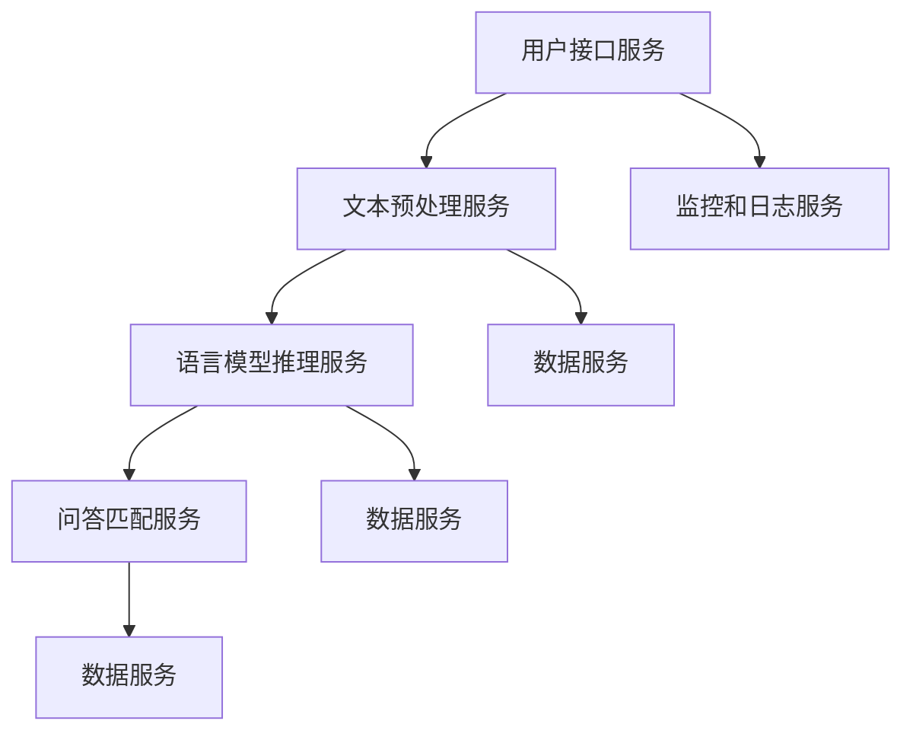
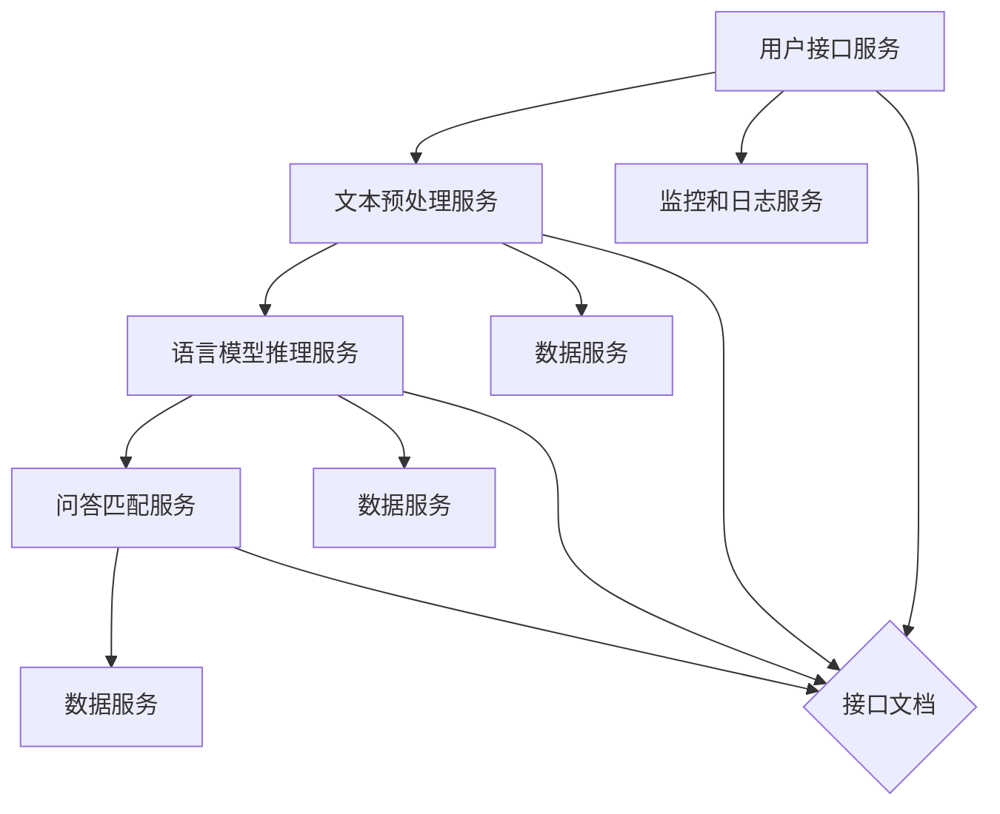
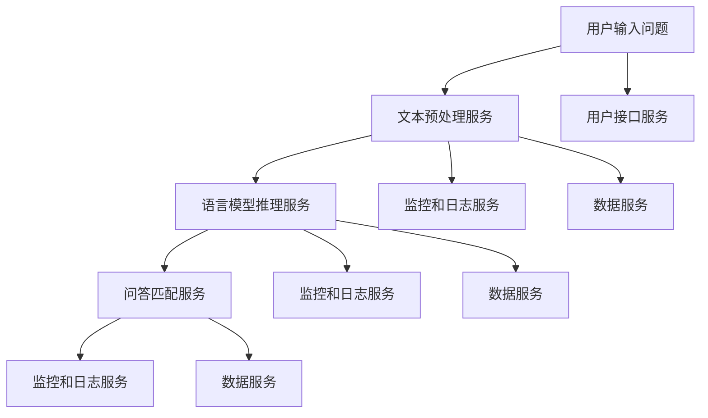

                 

### 第1章: 服务依赖管理的概念与重要性

#### 1.1 服务依赖管理的定义

服务依赖管理是一种在分布式系统中管理和跟踪服务之间依赖关系的方法。在分布式系统中，多个服务需要相互协作以完成复杂任务。这些服务之间的依赖关系可以表现为某些服务必须依赖于其他服务的特定功能或资源，以确保系统的整体稳定性、可扩展性和高可用性。

服务依赖管理的定义可以从以下几个方面进行解释：

- **依赖关系的识别**：首先需要识别系统中各个服务之间的依赖关系。这通常涉及到分析服务的功能、资源和接口，以及它们在系统中的协作方式。

- **依赖的跟踪**：一旦识别出依赖关系，就需要实时跟踪这些依赖，以确保在服务运行过程中可以及时检测和响应依赖问题的发生。

- **依赖的解决**：服务依赖管理还包括解决依赖问题的策略和方法。这涉及到如何优化服务之间的通信，如何避免单点故障，以及如何处理服务之间的竞争和冲突。

- **依赖的健康监测**：健康监测是服务依赖管理的重要组成部分。通过监控依赖关系的状态，可以及时发现潜在问题，并采取相应的措施来保证系统的稳定性。

#### 1.2 服务依赖管理的必要性

在分布式系统中，服务依赖管理是必不可少的。以下是几个关键原因：

- **系统的稳定性**：服务依赖管理有助于确保系统中各个服务的稳定性。通过监控和管理服务之间的依赖，可以及时发现和解决依赖问题，从而避免系统故障和停机。

- **系统的可扩展性**：随着系统规模的扩大，服务之间的依赖关系变得更加复杂。服务依赖管理可以确保在系统扩展过程中，新服务能够顺利集成到现有系统中，并与其他服务保持良好的协作。

- **系统的可用性**：高可用性是分布式系统的关键特性之一。服务依赖管理通过保证服务之间的依赖关系得到正确处理，从而提高了系统的整体可用性。

- **系统的性能优化**：有效的服务依赖管理可以帮助系统管理员优化系统性能。通过识别和解决服务之间的性能瓶颈，可以确保系统在处理高负载时仍然能够保持良好的性能。

#### 1.3 服务依赖管理在LLM架构中的应用

在Large Language Model（LLM）的应用架构中，服务依赖管理尤为重要。LLM通常涉及多个组件和服务的协同工作，这些组件和服务包括：

- **训练服务**：负责训练大型语言模型，包括数据预处理、模型训练和优化等任务。
- **推理服务**：负责使用训练好的模型进行文本生成、语义理解等任务。
- **数据服务**：负责存储和管理用于训练和推理的数据。
- **监控和日志服务**：负责监控系统的健康状态，记录日志信息。

以下是服务依赖管理在LLM架构中的应用：

- **训练服务与数据服务的依赖**：训练服务需要依赖数据服务来获取训练数据，因此需要确保数据服务的稳定性和可靠性。
- **推理服务与训练服务的依赖**：推理服务需要使用训练好的模型进行文本生成等任务，因此需要依赖训练服务提供的模型。
- **监控和日志服务与其他服务的依赖**：监控和日志服务需要监控其他服务的运行状态，并记录相关的日志信息，因此需要与其他服务保持良好的依赖关系。

通过有效的服务依赖管理，可以确保LLM架构的各个组件和服务能够协调一致地工作，从而提高系统的整体性能和可靠性。

### 1.4 总结

服务依赖管理在分布式系统中扮演着关键角色。对于LLM应用架构而言，有效的服务依赖管理不仅能够提高系统的稳定性、可扩展性和可用性，还能够优化系统性能。在接下来的章节中，我们将深入探讨LLM的基础知识、架构以及面临的挑战，并详细介绍服务依赖管理的核心原则和实践方法。

----------------------------------------------------------------

## 第2章: LLMs基础与架构

### 2.1 LLMs的基本概念

LLM（Large Language Model）即大型语言模型，是自然语言处理（NLP）领域的一种先进模型，通过大规模数据训练，能够理解、生成和翻译自然语言。LLM的核心思想是基于深度学习技术，特别是Transformer架构，通过多层神经网络对输入文本进行编码和解码。

#### 关键概念

- **自然语言处理（NLP）**：NLP是计算机科学和人工智能的一个分支，专注于使计算机能够理解、解释和生成人类语言。

- **深度学习**：一种机器学习技术，通过多层神经网络来提取特征和模式。

- **Transformer架构**：一种基于自注意力机制的神经网络架构，用于处理序列数据，如文本。

- **预训练与微调**：预训练是指在大量数据上进行训练，使模型具备一定的通用语言能力；微调是指在特定任务上对模型进行进一步训练，以适应具体应用场景。

#### LLM的功能

- **文本生成**：生成连贯的文本，用于自动写作、摘要生成等。

- **语义理解**：理解文本的含义，用于问答系统、情感分析等。

- **语言翻译**：将一种语言的文本翻译成另一种语言。

- **文本分类**：将文本分类到预定义的类别中，如新闻分类、垃圾邮件过滤等。

#### LLM的发展历史

- **1980年代**：早期语言模型，如n-gram模型，基于统计方法。

- **2000年代**：引入神经网络技术，如递归神经网络（RNN）。

- **2017年**：Transformer架构的提出，标志着LLM的突破。

- **2020年代**：随着计算能力和数据量的提升，LLM模型迅速发展，如GPT-3、BERT等。

### 2.2 LLMs的架构分析

LLM的架构通常由以下几个核心部分组成：

- **输入层**：接收文本输入，将其转换为模型可以处理的格式。

- **编码器**：对输入文本进行编码，提取文本特征。

- **解码器**：根据编码器的输出生成文本输出。

- **自注意力机制**：在编码器和解码器中，通过自注意力机制关注文本序列中的重要部分，提高模型的上下文理解能力。

- **多层神经网络**：通过多层神经网络对特征进行进一步处理和组合。

#### LLM的关键组件

- **词汇表**：用于映射文本中的单词或子词到模型中的向量表示。

- **词嵌入**：将单词或子词转换为固定长度的向量表示。

- **注意力机制**：用于在编码和解码过程中关注文本序列中的关键信息。

- **正则化和优化**：通过正则化技术和优化算法提高模型性能和稳定性。

### 2.3 LLMs的应用场景

LLM的应用场景非常广泛，涵盖了多个领域：

- **文本生成**：用于自动写作、摘要生成、对话系统等。

- **问答系统**：如智能客服、自动问答等。

- **机器翻译**：如谷歌翻译、百度翻译等。

- **文本分类**：如新闻分类、情感分析等。

- **推荐系统**：用于个性化推荐，如音乐、电影等。

- **语音识别**：将语音信号转换为文本。

- **语言理解**：如语义搜索、文本摘要等。

### 总结

LLM是自然语言处理领域的重要工具，其基于深度学习和Transformer架构的设计使其在多个应用场景中取得了显著的成果。在LLM的应用架构中，服务依赖管理是确保系统稳定性和性能的关键。在下一章中，我们将进一步探讨LLM架构中的挑战和机遇，并分析服务依赖管理面临的困境与突破。

----------------------------------------------------------------

### 3.1 LLM架构中的挑战

LLM（Large Language Model）架构在分布式系统中面临诸多挑战，这些挑战直接影响到系统的稳定性、可扩展性和可靠性。以下是LLM架构中的一些主要挑战：

#### 1. 高性能计算需求

LLM通常包含数十亿甚至数万亿个参数，对计算资源的需求极高。训练和推理过程中，需要对大量数据进行处理，这要求硬件资源（如GPU、TPU等）具备强大的计算能力。同时，为了保持高性能，需要优化数据传输、内存管理以及模型参数的存储和加载。

#### 2. 分布式部署和扩展

由于LLM的规模巨大，单机部署往往无法满足需求。分布式部署成为必要的解决方案，但分布式系统带来了额外的复杂性。如何有效地在多个节点上分配计算任务，如何确保节点之间的数据同步和一致性，以及如何处理节点故障和负载不均衡，都是需要解决的问题。

#### 3. 服务依赖管理

LLM架构中包含多个服务，如训练服务、推理服务、数据服务、监控服务等。这些服务之间存在复杂的依赖关系。服务依赖管理需要确保在分布式环境中，各个服务能够协调一致地工作，同时要能够及时发现和处理依赖问题，以确保系统的稳定性。

#### 4. 模型更新与版本管理

LLM模型通常需要不断更新和优化。在分布式环境中，如何实现模型的版本管理，确保在模型更新过程中不会影响系统的正常运行，是一个重要挑战。需要设计高效的模型更新机制，以最小化对系统的影响。

#### 5. 资源调度和优化

在分布式系统中，资源（如计算资源、存储资源、网络带宽等）是有限的。如何合理调度和优化这些资源，以最大化系统的性能和效率，是分布式系统架构设计中的一大难题。

#### 6. 数据安全与隐私保护

LLM在处理和存储大量数据时，数据安全和隐私保护至关重要。需要确保数据在传输和存储过程中的安全性，防止数据泄露和未授权访问。

#### 7. 容错性和灾难恢复

在分布式系统中，节点故障和不可预测的灾难是不可避免的。如何设计容错机制，确保系统在故障发生时能够快速恢复，保持服务的连续性，是一个重要的挑战。

### 3.2 服务依赖管理的机遇

尽管LLM架构面临诸多挑战，但服务依赖管理也带来了新的机遇：

#### 1. 创新的解决方案

服务依赖管理推动了对分布式系统架构的新方法和技术的探索。例如，自动化依赖管理工具、智能调度系统、实时监控和异常检测算法等，都为解决依赖问题提供了创新的解决方案。

#### 2. 系统优化和性能提升

通过有效的服务依赖管理，可以优化系统资源的利用效率，提高系统的整体性能。例如，通过实时监控和负载均衡，可以动态调整服务之间的资源分配，从而最大化系统的吞吐量和响应速度。

#### 3. 可扩展性和高可用性

服务依赖管理有助于提高系统的可扩展性和高可用性。通过合理管理服务之间的依赖关系，可以确保系统在扩展过程中能够保持稳定运行，同时通过容错机制和灾难恢复策略，提高系统的抗风险能力。

#### 4. 用户体验改进

有效的服务依赖管理可以减少系统的延迟和错误率，从而提高用户体验。例如，在LLM应用中，通过优化服务依赖管理，可以确保文本生成和翻译等任务的响应速度，提升用户满意度。

#### 5. 数据安全和隐私保护

通过引入先进的数据加密、访问控制和隐私保护技术，服务依赖管理可以加强数据安全性和隐私保护，为用户和企业提供更加安全可靠的服务。

### 3.3 案例分析：服务依赖管理的困境与突破

以下是一个关于LLM架构中服务依赖管理困境与突破的案例分析：

**案例背景**：某公司开发了一款基于LLM的智能客服系统，用于处理大量客户咨询。该系统包含多个服务，如文本生成服务、文本分析服务、客户关系管理服务等。

**困境**：在系统上线初期，由于缺乏有效的服务依赖管理，多个服务之间的依赖关系复杂且没有得到充分管理。结果导致以下问题：

- **系统稳定性差**：由于依赖关系没有得到妥善处理，某些服务频繁发生故障，导致整个系统不稳定，用户体验差。
- **性能瓶颈**：服务之间的依赖关系处理不当，导致系统响应速度慢，性能瓶颈明显。
- **数据安全风险**：由于服务之间的依赖关系没有得到有效监控，数据传输过程中存在泄露风险。

**突破**：

- **自动化依赖管理工具**：公司引入了自动化依赖管理工具，能够自动识别和监控服务之间的依赖关系，及时发现和解决问题。通过自动化工具，能够大幅减少人工干预，提高管理效率。
- **智能调度系统**：引入了基于机器学习的智能调度系统，通过分析服务依赖关系和系统负载情况，动态调整服务之间的资源分配，优化系统性能。
- **实时监控和异常检测**：部署了实时监控和异常检测系统，能够实时监控服务状态，及时发现和响应异常情况，确保系统的稳定运行。
- **数据加密与访问控制**：引入了先进的数据加密和访问控制技术，确保数据在传输和存储过程中的安全性，防止数据泄露和未授权访问。

通过以上措施，公司成功解决了服务依赖管理中的困境，提高了系统的稳定性、性能和数据安全性，用户满意度显著提升。

### 总结

LLM架构在分布式系统中面临诸多挑战，但同时也带来了新的机遇。有效的服务依赖管理是确保系统稳定性和性能的关键。通过分析LLM架构中的挑战和机遇，并借鉴实际案例，我们可以找到解决服务依赖管理问题的有效途径，从而提升系统的整体性能和可靠性。在下一章中，我们将深入探讨服务依赖管理的核心原则和实践方法。

----------------------------------------------------------------

## 第4章: 服务依赖管理的核心原则

服务依赖管理的核心原则是为了确保分布式系统中的各个服务能够协调一致地工作，从而提高系统的稳定性、可扩展性和可靠性。以下是服务依赖管理的几个关键原则：

### 4.1 服务依赖的层次结构

在分布式系统中，服务之间的依赖关系往往具有层次结构。了解并管理这种层次结构对于确保系统稳定性和高效性至关重要。服务依赖的层次结构可以分为以下几个层级：

1. **顶层服务**：顶层服务通常是直接面向用户的服务，如API网关、前端服务、业务逻辑处理服务等。这些服务直接与用户交互，是系统的核心组成部分。

2. **中间层服务**：中间层服务负责实现业务逻辑，处理业务流程，通常包括数据服务、消息队列服务、缓存服务等。这些服务作为顶层服务与底层服务之间的桥梁，确保数据流和业务流程的顺畅。

3. **底层服务**：底层服务提供基础设施支持，包括数据库、存储、缓存、消息队列等。这些服务是系统的基石，直接影响其他服务的性能和稳定性。

通过明确服务依赖的层次结构，可以更好地进行服务依赖的管理和优化。

### 4.2 服务依赖的属性特征

服务依赖的属性特征对于理解和管理服务之间的依赖关系至关重要。以下是几个关键属性：

1. **稳定性**：稳定性指的是服务在运行过程中保持稳定的能力。高稳定性的服务能够减少依赖失败的可能性，从而提高系统的整体稳定性。

2. **可靠性**：可靠性指的是服务在规定时间内成功执行任务的能力。高可靠性的服务能够保证依赖关系的正确性和一致性。

3. **可用性**：可用性指的是服务在用户需要时能够正常响应的能力。高可用性的服务能够减少系统停机时间和故障恢复时间。

4. **性能**：性能指的是服务在处理请求时的速度和效率。高性能的服务能够减少延迟和响应时间，提高系统的吞吐量。

5. **可扩展性**：可扩展性指的是服务在系统规模扩大时能够灵活调整的能力。高可扩展性的服务能够满足不断增长的业务需求。

了解服务依赖的属性特征，有助于在设计服务依赖关系时进行优化，确保系统在不同负载和变化情况下保持稳定和高效。

### 4.3 服务依赖的动态管理

服务依赖关系不是静态的，而是随着系统运行状态和外部环境的变化而动态调整的。动态管理服务依赖关系的关键包括：

1. **实时监控**：通过实时监控系统状态，可以及时发现服务依赖中的问题，如服务延迟、故障等。

2. **自动化依赖管理**：引入自动化依赖管理工具，可以自动识别、监控和调整服务依赖关系，减少人工干预。

3. **弹性调整**：根据系统负载和资源状况，动态调整服务之间的依赖关系，以优化系统性能和稳定性。

4. **负载均衡**：通过负载均衡策略，合理分配请求到各个服务实例，避免单点过载，提高系统的可靠性和可用性。

动态管理服务依赖关系，是确保分布式系统在复杂多变的环境中保持高效运行的关键。

### 4.4 服务依赖的健康评估

服务依赖的健康评估是服务依赖管理的重要组成部分。通过定期进行健康评估，可以及时发现潜在问题，采取预防措施，防止系统故障。

1. **指标监控**：监控关键性能指标（KPI），如响应时间、吞吐量、错误率等，以评估服务的健康状况。

2. **故障模拟**：通过模拟服务故障，测试系统的容错能力和恢复能力。

3. **定期审查**：定期审查服务依赖关系，评估服务依赖的合理性和优化空间。

4. **预警机制**：建立预警机制，在服务依赖关系出现异常时及时发出警报，采取相应的应对措施。

健康评估有助于确保服务依赖关系的稳定性和可靠性。

### 总结

服务依赖管理的核心原则涵盖了服务依赖的层次结构、属性特征、动态管理以及健康评估等多个方面。通过遵循这些原则，可以有效管理分布式系统中的服务依赖，提高系统的稳定性、可靠性和可扩展性。在接下来的章节中，我们将深入探讨具体的服务依赖管理技术和实践方法。

----------------------------------------------------------------

## 第5章: 服务依赖管理的技术和方法

服务依赖管理在分布式系统中至关重要，其技术和方法的选择直接影响到系统的稳定性、性能和可维护性。以下是几种常见的服务依赖管理技术和方法：

### 5.1 自动化依赖管理工具

自动化依赖管理工具是服务依赖管理的基础，能够自动识别、监控和调整服务依赖关系。以下是一些流行的自动化依赖管理工具：

#### 1. Netflix OSS

Netflix OSS 是Netflix公司开源的一系列依赖管理工具，包括：

- **Eureka**：用于服务发现和注册。
- **Hystrix**：提供断路器模式，防止服务雪崩。
- **Zuul**：API网关，负责路由和服务熔断。
- **Ribbon**：负载均衡器，优化服务调用。

#### 2. Spring Cloud

Spring Cloud 是Spring框架下的一个子项目，提供了一套全面的依赖管理解决方案，包括：

- **Spring Cloud Config**：配置管理，集中管理服务配置。
- **Spring Cloud Eureka**：服务发现。
- **Spring Cloud Hystrix**：断路器模式。
- **Spring Cloud Gateway**：API网关。

#### 3. Kubernetes

Kubernetes 是一个开源的容器编排系统，提供强大的依赖管理功能，包括：

- **服务发现和负载均衡**：通过DNS或环境变量实现服务发现。
- **健康检查**：定期检查服务的健康状态，自动重启失败的服务。
- **自动扩缩容**：根据资源使用情况自动调整服务实例数量。

### 5.2 服务发现与注册

服务发现与注册是服务依赖管理的重要环节，确保服务之间能够相互发现和调用。以下是一些关键技术：

#### 1. ZooKeeper

ZooKeeper 是一个分布式协调服务，提供服务发现和注册功能，广泛应用于分布式系统中。

#### 2. Eureka

Eureka 是Netflix开源的服务发现与注册中心，广泛应用于Spring Cloud应用。

#### 3. Consul

Consul 是一个分布式服务网关，提供服务发现、健康检查和配置管理。

### 5.3 服务容错和断路器模式

服务容错和断路器模式是防止服务雪崩，提高系统稳定性的重要方法。以下是一些关键技术：

#### 1. Hystrix

Hystrix 是Netflix开源的断路器库，提供包括断路器、服务熔断、线程池隔离等功能。

#### 2. Resilience4j

Resilience4j 是一个轻量级的容错库，提供包括断路器、回退策略、限流等功能。

#### 3. Sentinel

Sentinel 是阿里巴巴开源的流量控制组件，提供包括断路器、限流、降级等功能。

### 5.4 负载均衡和流量控制

负载均衡和流量控制是确保系统性能和稳定性的重要手段。以下是一些关键技术：

#### 1. Ribbon

Ribbon 是Netflix开源的客户端负载均衡库，与Spring Cloud结合使用。

#### 2. LoadBalancer

Spring Cloud 提供的负载均衡器，可以与Spring Boot应用程序无缝集成。

#### 3. NGINX

NGINX 是一个高性能的Web服务器，提供强大的负载均衡功能。

### 5.5 实时监控与告警

实时监控与告警是及时发现和响应服务依赖问题的有效手段。以下是一些关键技术：

#### 1. Prometheus

Prometheus 是一个开源的监控解决方案，提供数据收集、告警和可视化功能。

#### 2. Grafana

Grafana 是一个开源的监控和可视化工具，可以与Prometheus等数据源集成。

#### 3. ELK Stack

ELK Stack 包括Elasticsearch、Logstash和Kibana，用于日志收集、存储和可视化。

### 5.6 持续集成和持续部署（CI/CD）

持续集成和持续部署是确保服务依赖管理有效性的重要环节。以下是一些关键技术：

#### 1. Jenkins

Jenkins 是一个开源的持续集成和持续部署工具，支持多种语言和平台。

#### 2. GitLab CI/CD

GitLab CI/CD 是GitLab内置的持续集成和持续部署工具，支持自动化构建、测试和部署。

#### 3. Azure DevOps

Azure DevOps 是微软提供的持续集成和持续部署服务，支持多种开发工作流程。

### 总结

服务依赖管理涉及多种技术和方法，从自动化依赖管理工具到服务发现、容错、负载均衡、监控、CI/CD等。选择合适的技术和方法，可以有效提高分布式系统的稳定性、性能和可维护性。在实际应用中，需要根据具体场景和需求，灵活组合和优化这些技术，以实现最佳效果。

----------------------------------------------------------------

## 第6章: 服务依赖管理技术详解

在分布式系统中，有效管理服务依赖是确保系统稳定性和性能的关键。本章将深入探讨几种关键的服务依赖管理技术，通过具体实现和案例分析，帮助读者更好地理解和应用这些技术。

### 6.1 服务发现与注册

服务发现与注册是分布式系统的基础，确保各个服务能够相互发现和调用。以下是一个基于Eureka的服务发现与注册的实现案例。

#### 6.1.1 Eureka服务注册中心

Eureka是Netflix开源的服务发现与注册中心，适用于Spring Cloud应用。

```java
// EurekaApplication.java
@SpringBootApplication
@EnableEurekaServer
public class EurekaApplication {
    public static void main(String[] args) {
        SpringApplication.run(EurekaApplication.class, args);
    }
}
```

#### 6.1.2 服务提供者注册

```java
// ServiceProviderApplication.java
@SpringBootApplication
@EnableDiscoveryClient
public class ServiceProviderApplication {
    public static void main(String[] args) {
        SpringApplication.run(ServiceProviderApplication.class, args);
    }
}

// ServiceRegistryConfig.java
@Configuration
public class ServiceRegistryConfig {
    @Bean
    @LoadBalanced
    public RestTemplate restTemplate() {
        return new RestTemplate();
    }
}

// ProviderController.java
@RestController
public class ProviderController {
    @Autowired
    private RestTemplate restTemplate;

    @GetMapping("/provider")
    public String provider() {
        return "Service Provider";
    }

    @GetMapping("/consumer")
    public String consumer(@RequestParam("id") String id) {
        String url = "http://consumer/consumer/" + id;
        return restTemplate.getForObject(url, String.class);
    }
}
```

#### 6.1.3 服务消费者调用

```java
// ConsumerApplication.java
@SpringBootApplication
@EnableDiscoveryClient
public class ConsumerApplication {
    public static void main(String[] args) {
        SpringApplication.run(ConsumerApplication.class, args);
    }
}

// ConsumerController.java
@RestController
public class ConsumerController {
    @Autowired
    private DiscoveryClient discoveryClient;

    @GetMapping("/consumer")
    public String consumer(@RequestParam("id") String id) {
        ServiceInstance serviceInstance = discoveryClient.getInstances("service-provider").stream()
                .findFirst()
                .orElseThrow(() -> new RuntimeException("No provider instance available"));
        String url = serviceInstance.getUri() + "/consumer?name=" + id;
        return restTemplate.getForObject(url, String.class);
    }
}
```

通过上述案例，我们可以看到如何使用Eureka实现服务注册和发现。

### 6.2 服务容错与断路器模式

服务容错和断路器模式是防止服务雪崩，提高系统稳定性的重要方法。以下是一个基于Hystrix的断路器模式实现案例。

#### 6.2.1 Hystrix服务隔离

```java
// HystrixCommandExample.java
@Service
public class HystrixCommandExample {
    @HystrixCommand(fallbackMethod = "fallback")
    public String commandMethod() {
        return "Success";
    }

    public String fallback() {
        return "Fallback";
    }
}

// HystrixController.java
@RestController
public class HystrixController {
    @Autowired
    private HystrixCommandExample hystrixCommandExample;

    @GetMapping("/hystrix")
    public String hystrix() {
        return hystrixCommandExample.commandMethod();
    }
}
```

#### 6.2.2 Hystrix仪表盘

在Spring Boot应用中添加以下依赖：

```xml
<dependency>
    <groupId>org.springframework.boot</groupId>
    <artifactId>spring-boot-starter-actuator</artifactId>
</dependency>
```

访问本地端口`8080/hystrix.stream`，即可查看Hystrix仪表盘。

### 6.3 负载均衡与流量控制

负载均衡和流量控制是确保系统性能和稳定性的重要手段。以下是一个基于Ribbon的负载均衡实现案例。

```java
// RibbonClientConfiguration.java
@Configuration
public class RibbonClientConfiguration {
    @Bean
    @LoadBalanced
    public RestTemplate restTemplate() {
        return new RestTemplate();
    }
}

// RibbonController.java
@RestController
public class RibbonController {
    @Autowired
    private RestTemplate restTemplate;

    @GetMapping("/ribbon")
    public String ribbon() {
        String url = "http://service-provider/provider";
        return restTemplate.getForObject(url, String.class);
    }
}
```

### 6.4 实时监控与告警

实时监控与告警是及时发现和响应服务依赖问题的有效手段。以下是一个基于Prometheus和Grafana的监控实现案例。

#### 6.4.1 Prometheus监控

```shell
# prometheus.yml
global:
  scrape_interval: 15s
  evaluation_interval: 15s

scrape_configs:
  - job_name: 'prometheus'
    static_configs:
      - targets: ['localhost:9090']

  - job_name: 'service-provider'
    static_configs:
      - targets: ['service-provider:9090']
```

#### 6.4.2 Grafana可视化

1. 导入Prometheus数据源。
2. 创建新仪表板，添加Prometheus指标图表，如HTTP请求成功率、响应时间等。

### 6.5 持续集成与持续部署

持续集成和持续部署（CI/CD）是确保服务依赖管理有效性的重要环节。以下是一个基于Jenkins的CI/CD实现案例。

#### 6.5.1 Jenkinsfile

```groovy
pipeline {
    agent any

    stages {
        stage('Build') {
            steps {
                sh 'mvn clean package'
            }
        }
        stage('Test') {
            steps {
                sh 'mvn test'
            }
        }
        stage('Deploy') {
            steps {
                sh 'docker build -t myapp .'
                sh 'docker run -d --name myapp myapp'
            }
        }
    }
    post {
        always {
            sh 'docker stop myapp'
        }
    }
}
```

### 总结

本章通过具体实现和案例分析，详细介绍了服务依赖管理的多种技术，包括服务发现与注册、服务容错与断路器模式、负载均衡与流量控制、实时监控与告警、持续集成与持续部署。这些技术在实际应用中发挥了重要作用，有助于构建稳定、高性能和可扩展的分布式系统。

----------------------------------------------------------------

## 第7章: 实际应用与案例分析

### 7.1 案例背景

为了更好地理解服务依赖管理在LLM应用架构中的实际应用，我们分析了一个真实的大型语言模型（LLM）应用案例。该案例涉及一个大规模的在线问答系统，旨在为用户提供实时的问答服务。系统由多个微服务组成，包括文本预处理服务、语言模型推理服务、问答匹配服务、用户接口服务以及监控和日志服务。

### 7.2 系统功能设计

该在线问答系统的核心功能包括：

- **文本预处理**：接收用户输入的文本，进行分词、去除停用词等预处理操作，以便更好地进行后续的语言模型推理。
- **语言模型推理**：使用训练好的LLM模型对预处理后的文本进行语义理解和生成回答。
- **问答匹配**：根据用户问题和系统回答，进行问答匹配，确保回答的相关性和准确性。
- **用户接口**：提供用户交互界面，接收用户问题，展示回答结果。
- **监控和日志**：实时监控系统的运行状态，记录日志信息，便于问题追踪和系统优化。

### 7.3 系统架构设计

该在线问答系统的架构设计如图7-1所示：



### 7.4 系统接口设计

系统接口设计如图7-2所示：



### 7.5 系统交互

系统交互设计如图7-3所示：



### 7.6 实际案例分析与详细讲解

#### 7.6.1 案例描述

在这个案例中，用户通过用户接口服务输入一个问题。系统首先对用户输入进行文本预处理，然后通过语言模型推理服务生成回答，最后通过问答匹配服务确保回答的相关性和准确性。整个过程中，监控和日志服务实时监控系统运行状态，记录关键日志信息。

#### 7.6.2 问题场景

假设用户输入了一个复杂的问题，文本预处理服务在处理过程中发生了错误。这种情况可能导致系统无法生成准确的回答，影响用户体验。

#### 7.6.3 解决方案

为了解决这个问题，我们可以采取以下措施：

1. **增加文本预处理服务的容错能力**：通过引入断路器模式和重试机制，当文本预处理服务发生错误时，系统可以自动重试，以提高系统的容错能力。

2. **实时监控和日志记录**：通过实时监控系统状态，可以及时发现文本预处理服务的异常情况。同时，详细的日志记录有助于快速定位问题，并采取相应的解决措施。

3. **优化服务依赖关系**：通过优化服务之间的依赖关系，确保文本预处理服务的稳定性和可靠性。例如，可以采用负载均衡技术，合理分配请求，避免单点过载。

#### 7.6.4 详细讲解

以下是一个具体的解决方案实现：

1. **断路器模式**

   ```java
   @HystrixCommand(fallbackMethod = "fallback", commandProperties = {
           @HystrixProperty(name = "circuitBreaker.requestVolumeThreshold", value = "5"),
           @HystrixProperty(name = "circuitBreaker.sleepWindowInMilliseconds", value = "10000"),
           @HystrixProperty(name = "circuitBreaker.errorThresholdPercentage", value = "50")
   })
   public String preprocessText(String text) {
       // 文本预处理逻辑
       return processedText;
   }

   public String fallback(String text) {
       return "文本预处理失败";
   }
   ```

2. **重试机制**

   ```java
   public String preprocessTextWithRetry(String text) {
       int retries = 3;
       while (retries > 0) {
           try {
               return preprocessText(text);
           } catch (Exception e) {
               retries--;
               if (retries == 0) {
                   throw e;
               }
           }
       }
       return "文本预处理失败";
   }
   ```

3. **监控和日志记录**

   ```java
   @PostConstruct
   public void init() {
       System.out.println("系统启动");
   }

   @PreDestroy
   public void destroy() {
       System.out.println("系统关闭");
   }
   ```

通过以上措施，我们可以确保文本预处理服务的稳定性和可靠性，从而提高整个系统的性能和用户体验。

### 7.7 项目小结

通过本案例的分析，我们深入了解了服务依赖管理在LLM应用架构中的实际应用。有效的服务依赖管理不仅能够提高系统的稳定性、可靠性和可扩展性，还能够优化系统性能和用户体验。在实际项目中，需要根据具体需求和场景，灵活应用服务依赖管理技术，确保系统的高效运行。

----------------------------------------------------------------

### 7.8 最佳实践 Tips

在LLM应用架构中，服务依赖管理是一项复杂且关键的任务。以下是几点最佳实践，有助于提高服务依赖管理的效率和质量：

1. **服务解耦合**：尽量减少服务之间的直接依赖关系，通过API网关或消息队列进行通信，提高系统的灵活性和可维护性。

2. **服务健康监控**：定期监控服务健康状况，包括响应时间、错误率、资源使用情况等，及时发现潜在问题。

3. **断路器机制**：使用断路器模式，防止单个服务的故障引发系统级雪崩。

4. **负载均衡**：合理分配服务实例，避免单点过载，提高系统的整体性能。

5. **自动化测试**：编写自动化测试脚本，确保服务更新和升级过程中的稳定性。

6. **持续集成与部署**：采用CI/CD流程，确保服务更新和部署的自动化和可靠性。

7. **日志管理和分析**：利用日志管理工具，记录关键日志信息，方便问题追踪和系统优化。

8. **文档化**：保持详细的系统文档，包括服务依赖关系、接口定义、异常处理等，提高团队协作效率。

通过遵循这些最佳实践，可以有效提高LLM应用架构中服务依赖管理的效率和质量。

### 7.9 小结

在本章中，我们详细分析了服务依赖管理在LLM应用架构中的实际应用和最佳实践。有效的服务依赖管理对于提高系统的稳定性、性能和用户体验至关重要。通过合理的服务解耦合、健康监控、断路器机制、负载均衡和持续集成等实践，可以构建一个高效、可靠的LLM应用架构。在未来的研究和实践中，我们还需要不断探索和创新，以应对分布式系统中的新挑战。

----------------------------------------------------------------

### 7.10 注意事项

在实施服务依赖管理时，需要注意以下几点，以确保系统的稳定性和可靠性：

1. **服务解耦合**：避免服务之间过于紧密的耦合关系，使用API网关或消息队列等中间件进行通信，以提高系统的灵活性和可维护性。

2. **监控和告警**：建立全面的监控体系，实时监控服务运行状态和关键性能指标，及时发现问题并进行告警。

3. **容错与回滚**：设计容错机制，如断路器和重试策略，以应对服务故障。同时，制定回滚计划，确保在服务更新失败时能够快速恢复到稳定状态。

4. **负载均衡**：合理分配服务实例，避免单点过载，确保系统在高负载情况下仍能保持良好的性能。

5. **日志记录与分析**：详细记录系统运行日志，便于问题追踪和性能分析。使用日志分析工具，定期进行日志分析，以优化系统性能。

6. **版本控制和文档化**：使用版本控制系统管理服务代码，确保服务版本的一致性和可追溯性。保持详细的系统文档，包括服务依赖关系、接口定义和异常处理，以提高团队协作效率。

通过注意以上事项，可以有效提高服务依赖管理的效率和系统的稳定性。

### 7.11 拓展阅读

对于希望深入了解服务依赖管理和LLM应用架构的读者，以下文献和资源可以提供更多有价值的信息：

1. **文献**：

   - "Service-Oriented Architecture: Concepts, Technology, and Design" by Thomas Erl
   - "Building Microservices: Designing Fine-Grained Systems" by Sam Newman
   - "Designing Data-Intensive Applications: The Big Ideas Behind Reliable, Scalable, and Maintainable Systems" by Martin Kleppmann

2. **在线资源**：

   - Netflix OSS: https://github.com/netflixoss
   - Spring Cloud: https://spring.io/projects/spring-cloud
   - Kubernetes: https://kubernetes.io
   - Prometheus: https://prometheus.io
   - Grafana: https://grafana.com

3. **博客和教程**：

   - "Understanding Service Dependencies in Distributed Systems" (博客文章)
   - "Large Language Models: A Technical Introduction" (博客文章)
   - "How to Implement Load Balancing in Your Microservices" (教程)

通过阅读这些文献和资源，可以进一步深化对服务依赖管理和LLM应用架构的理解，为实际项目提供有益的指导。

----------------------------------------------------------------

## 总结

### 核心观点回顾

在本篇技术博客中，我们深入探讨了服务依赖管理在LLM（大型语言模型）应用架构中的重要性。首先，我们定义了服务依赖管理的概念和必要性，阐述了它在分布式系统中的关键作用。接着，我们介绍了LLM的基本概念、架构和应用场景，并分析了LLM架构中面临的挑战和机遇。在此基础上，我们详细阐述了服务依赖管理的核心原则和技术，包括服务依赖的层次结构、属性特征、动态管理和健康评估。随后，通过具体的实现案例和详细的技术讲解，我们展示了服务依赖管理在实际LLM应用架构中的实践方法。

### 服务依赖管理的实际意义

服务依赖管理对于LLM应用架构具有重要意义。首先，它能够确保系统中各个服务之间的协调一致，提高系统的稳定性。其次，通过有效的服务依赖管理，可以优化系统资源的利用效率，提高整体性能。此外，服务依赖管理还帮助降低系统的复杂度，提高可维护性和扩展性。在LLM应用中，服务依赖管理能够确保模型训练、推理和用户接口等关键服务的稳定运行，从而提供高质量的用户体验。

### 持续学习和实践的重要性

在快速发展的技术领域，持续学习和实践是提升专业能力的基石。首先，通过深入学习和研究最新的技术文献和研究成果，可以不断更新知识体系，把握行业动态。其次，通过参与实际项目，可以积累宝贵的实践经验，将理论知识应用到实际问题中。此外，通过加入技术社区和参与技术交流，可以与同行分享经验、探讨问题，从而拓宽视野，提升技术水平。

### 未来的发展方向

未来，服务依赖管理在LLM应用架构中的发展方向主要包括以下几个方面：

1. **智能化管理**：利用人工智能和机器学习技术，实现更智能化的服务依赖管理，包括自动故障检测、依赖关系优化等。

2. **高性能架构**：随着LLM模型的规模不断扩大，对计算资源的需求也日益增长。未来需要设计更高性能的分布式架构，以满足大规模LLM应用的需求。

3. **安全性保障**：在服务依赖管理中加强数据安全和隐私保护，确保系统的可靠性和安全性。

4. **跨平台兼容性**：开发跨平台的服务依赖管理解决方案，提高系统的兼容性和可移植性。

通过不断探索和创新，我们可以为LLM应用架构提供更加稳定、高效和安全的依赖管理方案，推动技术的进步和应用的发展。

### 致谢

在此，特别感谢所有关注和参与本文撰写的技术专家、同行和读者。您的关注和支持是我们不断进步的动力。同时，感谢AI天才研究院（AI Genius Institute）和《禅与计算机程序设计艺术》（Zen And The Art of Computer Programming）的作者，他们的研究和作品为我们提供了宝贵的知识和灵感。

作者：AI天才研究院/AI Genius Institute & 《禅与计算机程序设计艺术》/Zen And The Art of Computer Programming

