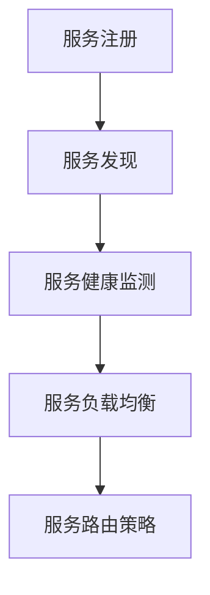
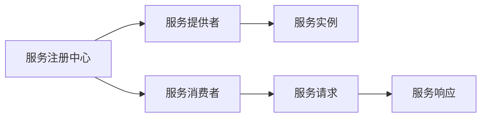
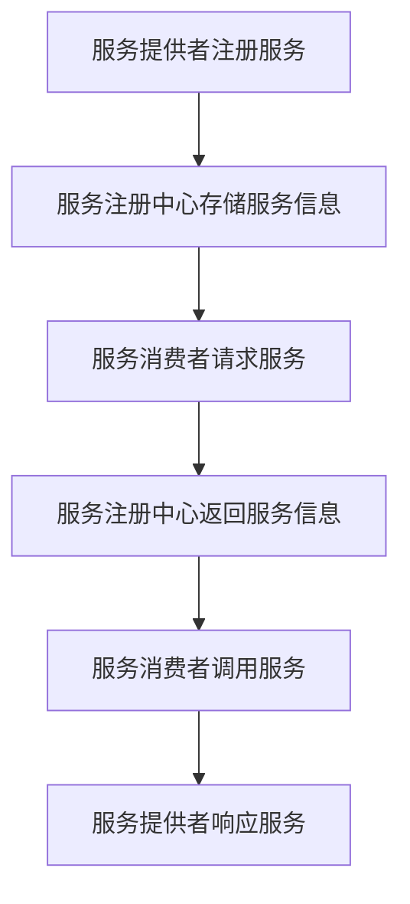
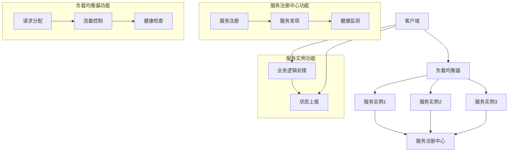

                 

### 服务发现机制在LLM应用架构中的作用

在当前的人工智能时代，大规模语言模型（LLM，Large Language Model）凭借其强大的文本处理能力和智能响应能力，已经成为许多应用程序的核心组件。然而，随着LLM应用规模的不断扩大，如何高效地管理和调度这些模型，成为了一个亟待解决的问题。这就引出了本文的主题——服务发现机制在LLM应用架构中的作用。

#### 关键词：
- 服务发现机制
- LLM应用架构
- 服务调度
- 负载均衡
- 容错性
- 智能化

#### 摘要：
本文将深入探讨服务发现机制在LLM应用架构中的关键作用。首先，我们将介绍服务发现机制的基本概念和原理，随后分析其在LLM应用架构中的具体实现和应用。接着，我们将讨论服务发现机制如何提升LLM应用的性能、可靠性和可扩展性。最后，通过具体的案例和最佳实践，我们将展示如何有效地利用服务发现机制来构建高性能的LLM应用架构。

### 目录大纲设计思路

为了更好地阐述服务发现机制在LLM应用架构中的作用，本文设计了以下目录结构：

1. **背景介绍**：介绍服务发现机制的起源、发展及其在LLM应用架构中的重要性。
2. **核心概念与联系**：详细解析服务发现机制的核心概念及其相互关系。
3. **算法原理讲解**：探讨服务发现算法的原理、流程、数学模型和Python源代码实现。
4. **系统分析与架构设计**：分析服务发现机制在LLM应用架构中的系统架构和功能设计。
5. **项目实战**：通过具体案例展示如何在实际项目中实现服务发现机制。
6. **最佳实践 tips**：提供构建高效LLM应用架构的服务发现机制的最佳实践。
7. **小结与展望**：总结本文的主要内容和未来发展方向。

### 第1章：背景介绍

#### 1.1 服务发现机制概述

服务发现机制（Service Discovery Mechanism）是一种在分布式系统中自动检测、注册和发现服务的技术。它使得服务消费者可以动态地获取服务提供者的位置信息，而无需手动配置或更新服务地址。服务发现机制在微服务架构、云计算和分布式系统中发挥着至关重要的作用。

#### 1.2 服务发现的起源与发展

服务发现机制的起源可以追溯到20世纪80年代的分布式计算领域。随着网络技术的快速发展，分布式系统变得越来越复杂，传统的手动配置方式已经无法满足需求。因此，服务发现机制应运而生，它通过自动化的方式解决了服务地址的发现和管理问题。

#### 1.3 服务发现的现状与挑战

随着微服务架构的普及，服务发现机制在云计算和分布式系统中得到了广泛应用。然而，随着服务数量的激增，如何保证服务发现机制的效率和可靠性，成为当前面临的主要挑战。

#### 1.4 服务发现的重要性

在LLM应用架构中，服务发现机制至关重要。首先，它能够实现服务的动态调度和负载均衡，提高系统的性能和可靠性。其次，服务发现机制能够简化系统的部署和管理，降低运维成本。最后，服务发现机制还能够提高系统的可扩展性，满足不断增长的服务需求。

### 1.5 问题描述

在LLM应用架构中，服务发现机制主要面临以下问题：

1. **服务注册和发现延迟**：随着服务数量的增加，服务注册和发现的延迟可能会显著增加，影响系统的响应速度。
2. **负载均衡不均**：传统的负载均衡策略可能无法适应动态变化的服务负载，导致某些服务过载，而其他服务资源闲置。
3. **服务容错性**：在分布式系统中，服务可能会因为网络故障、硬件故障等原因不可用。如何及时发现并替换故障服务，是服务发现机制需要解决的问题。
4. **服务安全**：服务发现机制需要确保服务的安全性，防止未经授权的服务访问。

#### 1.6 问题解决

为了解决上述问题，LLM应用架构中的服务发现机制需要具备以下几个特点：

1. **高效的服务注册和发现**：采用分布式服务注册中心，如Eureka、Consul等，提高服务注册和发现的效率。
2. **智能的负载均衡策略**：结合服务健康状态和响应时间，采用动态负载均衡策略，如基于权重和最小连接数的负载均衡。
3. **高容错性**：实现服务健康监测和故障转移机制，确保系统的可靠性。
4. **安全防护**：通过权限验证、加密通信等方式，确保服务安全。

#### 1.7 边界与外延

1. **服务发现机制与微服务架构的关系**：服务发现机制是微服务架构的核心组成部分，两者相辅相成，共同构建高效、可靠的分布式系统。
2. **服务发现与其他系统组件的交互**：服务发现机制需要与其他系统组件（如服务网关、配置中心、监控平台等）进行交互，实现协同工作。
3. **服务发现机制的未来发展趋势**：随着人工智能和大数据技术的发展，服务发现机制将更加智能化，具备自优化、自修复和自安全等特点。

### 第2章：核心概念与联系

#### 2.1 服务发现机制的核心概念

在服务发现机制中，核心概念包括服务注册、服务发现、服务健康监测、服务负载均衡和服务路由策略。下面我们将逐一介绍这些概念。

1. **服务注册**：服务注册是指服务提供者在服务注册中心注册自己的服务，包括服务名称、服务地址、端口、健康状态等信息。服务消费者可以通过服务注册中心获取服务提供者的信息。

2. **服务发现**：服务发现是指服务消费者通过服务注册中心查找并获取服务提供者的信息。服务发现通常采用基于DNS、HTTP、gRPC等方式进行。

3. **服务健康监测**：服务健康监测是指对服务提供者的健康状态进行实时监控。服务注册中心会定期检查服务的健康状态，如服务可用性、响应时间、错误率等。

4. **服务负载均衡**：服务负载均衡是指根据服务提供者的健康状态和负载情况，将服务请求分配到不同的服务实例上。负载均衡策略有多种，如轮询、最小连接数、哈希等。

5. **服务路由策略**：服务路由策略是指根据服务的名称、标签、地理位置等信息，将服务请求路由到特定的服务实例上。常见的路由策略包括基于域名、基于路径、基于IP等。

#### 2.2 服务发现机制的概念联系

服务发现机制中的各个概念之间存在紧密的联系。下面我们通过一个简单的流程图来展示这些概念之间的关系。



1. **服务注册与发现**：服务注册是服务发现的先决条件。服务提供者需要先在服务注册中心注册服务，服务消费者才能通过服务注册中心发现服务。

2. **服务健康监测**：服务健康监测是基于服务发现的结果进行的。服务注册中心会定期检查服务提供者的健康状态，并将结果反馈给服务消费者。

3. **服务负载均衡**：服务负载均衡依赖于服务健康监测的结果。服务消费者根据服务提供者的健康状态和负载情况，选择最优的服务实例进行请求。

4. **服务路由策略**：服务路由策略决定了服务请求的具体路由路径。服务消费者根据服务路由策略，将服务请求发送到特定的服务实例上。

#### 2.3 服务发现机制的ER实体关系图

为了更好地理解服务发现机制中的实体关系，我们可以使用ER（实体-关系）图来表示。下面是一个简单的ER图示例。



1. **服务注册中心**：服务注册中心是服务发现机制的核心组件，负责存储和管理服务提供者的信息。

2. **服务提供者**：服务提供者是指提供具体业务逻辑的服务实例。

3. **服务实例**：服务实例是服务提供者的具体实现，包括服务名称、服务地址、端口等信息。

4. **服务消费者**：服务消费者是指调用服务提供者的客户端。

5. **服务请求**：服务请求是指服务消费者发送给服务提供者的请求。

6. **服务响应**：服务响应是指服务提供者对服务请求的响应。

### 第3章：算法原理讲解

#### 3.1 服务发现算法概述

服务发现算法是指用于在分布式系统中自动检测、注册和发现服务的一组方法。服务发现算法的目标是确保服务消费者可以高效地获取服务提供者的信息，并动态地调整服务请求的路径。下面我们将介绍几种常用的服务发现算法。

#### 3.2 服务发现算法mermaid流程图

为了更好地理解服务发现算法的流程，我们可以使用mermaid绘制一个简单的流程图。



1. **服务提供者注册服务**：服务提供者将服务信息注册到服务注册中心。
2. **服务注册中心存储服务信息**：服务注册中心存储服务提供者的信息，包括服务名称、服务地址、端口等。
3. **服务消费者请求服务**：服务消费者通过服务注册中心获取服务信息，并请求服务。
4. **服务注册中心返回服务信息**：服务注册中心返回服务提供者的信息给服务消费者。
5. **服务消费者调用服务**：服务消费者根据服务提供者的信息，调用服务。
6. **服务提供者响应服务**：服务提供者接收到服务请求，并返回响应结果。

#### 3.3 Python源代码与算法原理

为了更深入地理解服务发现算法，我们可以通过Python源代码来详细阐述其原理。

```python
# 服务提供者注册服务
service_registry = {
    "service1": ["127.0.0.1:8080"],
    "service2": ["127.0.0.1:8081"],
}

def register_service(service_name, service_address):
    service_registry[service_name].append(service_address)

register_service("service1", "127.0.0.1:8082")

# 服务消费者请求服务
def request_service(service_name):
    service_addresses = service_registry[service_name]
    # 这里可以采用负载均衡策略，选择一个服务地址进行调用
    return service_addresses[0]

service_address = request_service("service1")
print(f"服务地址：{service_address}")

# 服务提供者响应服务
def handle_request(service_address):
    print(f"收到请求，服务地址：{service_address}")

handle_request(service_address)
```

在这个示例中，我们首先定义了一个服务注册中心`service_registry`，用于存储服务提供者的信息。服务提供者通过`register_service`函数将服务信息注册到服务注册中心。服务消费者通过`request_service`函数从服务注册中心获取服务信息，并选择一个服务地址进行调用。服务提供者通过`handle_request`函数接收并处理服务请求。

#### 3.4 数学模型和数学公式

为了量化服务发现算法的性能，我们可以引入一些数学模型和公式。

1. **服务注册和发现延迟**（\( L \)）：
   $$ L = \frac{1}{N} \sum_{i=1}^{N} (t_i - t_{i-1}) $$
   其中，\( N \)为服务数量，\( t_i \)为第\( i \)个服务的注册或发现延迟。

2. **服务负载均衡效果**（\( U \)）：
   $$ U = \frac{1}{N} \sum_{i=1}^{N} \frac{C_i}{L_i} $$
   其中，\( N \)为服务数量，\( C_i \)为第\( i \)个服务的请求次数，\( L_i \)为第\( i \)个服务的平均负载。

3. **服务容错性**（\( F \)）：
   $$ F = \frac{1}{N} \sum_{i=1}^{N} (1 - f_i) $$
   其中，\( N \)为服务数量，\( f_i \)为第\( i \)个服务的故障率。

通过这些数学模型和公式，我们可以评估服务发现算法的性能，并对其进行优化。

#### 3.5 举例说明

为了更好地理解服务发现算法的应用，我们可以通过一个简单的案例来展示其原理。

**案例：构建一个简单的服务发现系统**

1. **服务提供者**：有两个服务提供者，分别为`service1`和`service2`。服务提供者将自己的信息注册到服务注册中心。

2. **服务消费者**：服务消费者从服务注册中心获取服务信息，并选择一个服务地址进行调用。

3. **服务注册中心**：服务注册中心存储服务提供者的信息，并提供服务发现功能。

在这个案例中，我们首先定义了一个简单的服务注册中心，用于存储服务提供者的信息。

```python
service_registry = {
    "service1": ["127.0.0.1:8080", "127.0.0.1:8081"],
    "service2": ["127.0.0.1:8082", "127.0.0.1:8083"],
}

def register_service(service_name, service_address):
    service_registry[service_name].append(service_address)

register_service("service1", "127.0.0.1:8084")

def request_service(service_name):
    service_addresses = service_registry[service_name]
    # 这里可以采用负载均衡策略，选择一个服务地址进行调用
    return service_addresses[0]

service_address = request_service("service1")
print(f"服务地址：{service_address}")

def handle_request(service_address):
    print(f"收到请求，服务地址：{service_address}")

handle_request(service_address)
```

通过这个案例，我们可以看到服务提供者如何将自己的信息注册到服务注册中心，服务消费者如何从服务注册中心获取服务信息，并选择一个服务地址进行调用。这个简单的案例展示了服务发现算法的基本原理和应用。

### 第4章：系统分析与架构设计

#### 4.1 问题场景介绍

在构建LLM应用架构时，我们面临如下场景：

1. **大规模服务部署**：LLM应用通常需要部署多个服务实例，以处理海量的文本请求。如何高效地管理这些服务实例，实现服务之间的协同工作，成为首要问题。
2. **高可用性要求**：LLM应用需要保证服务的可用性，确保在服务实例发生故障时，系统能够快速恢复，避免服务中断。
3. **高性能需求**：LLM应用需要处理高并发的文本请求，要求系统具备高性能，确保响应时间在可接受范围内。
4. **动态扩展能力**：随着业务规模的扩大，LLM应用需要具备动态扩展能力，能够根据需求自动调整服务实例数量。

#### 4.2 系统功能设计

为了满足上述问题场景，我们需要设计以下功能模块：

1. **服务注册中心**：用于存储和管理服务实例的信息，提供服务注册、服务发现和健康监测功能。
2. **负载均衡器**：根据服务实例的负载情况，将请求分配到最优的服务实例上，确保系统性能。
3. **服务实例**：实现具体的业务逻辑，处理文本请求，并向服务注册中心报告自身状态。
4. **监控模块**：实时监控服务实例的运行状态，包括响应时间、错误率等指标，为负载均衡提供依据。

#### 4.3 系统架构设计

系统架构设计如下：



1. **客户端**：向负载均衡器发送文本请求。
2. **负载均衡器**：根据服务实例的负载情况和健康状态，选择最优的服务实例处理请求。
3. **服务实例**：处理文本请求，并将处理结果返回给客户端。
4. **服务注册中心**：存储和管理服务实例的信息，提供服务注册、服务发现和健康监测功能。
5. **监控模块**：实时监控服务实例的运行状态，为负载均衡器提供健康状态数据。

#### 4.4 系统接口设计

系统接口设计如下：

1. **服务注册接口**：服务实例通过该接口向服务注册中心注册自身信息。
2. **服务发现接口**：客户端和负载均衡器通过该接口从服务注册中心获取服务实例信息。
3. **健康监测接口**：服务实例通过该接口向服务注册中心报告自身健康状态。
4. **请求分配接口**：负载均衡器通过该接口将请求分配给服务实例。

#### 4.5 系统交互

系统交互过程如下：

1. **服务注册**：服务实例在启动时，通过服务注册接口向服务注册中心注册自身信息。
2. **服务发现**：客户端和负载均衡器在需要调用服务时，通过服务发现接口从服务注册中心获取服务实例信息。
3. **请求分配**：负载均衡器根据服务实例的负载情况和健康状态，通过请求分配接口将请求分配给服务实例。
4. **健康监测**：服务实例在处理请求过程中，通过健康监测接口向服务注册中心报告自身健康状态。

通过上述系统架构设计，我们可以构建一个高效、可靠、可扩展的LLM应用架构。服务发现机制作为核心组件，实现了服务实例的动态调度和负载均衡，提高了系统的性能和可靠性。同时，通过监控模块的实时监控，确保了系统的健康状态，为负载均衡提供了数据支持。

### 第5章：项目实战

在本章中，我们将通过一个实际项目来展示如何构建一个基于服务发现机制的LLM应用架构。该项目将涵盖环境安装、系统核心实现、代码应用解读与分析、实际案例分析和详细讲解等内容。

#### 5.1 项目概述

项目名称：大规模语言模型服务发现与调度系统（LLM Service Discovery and Scheduling System）

项目目标：构建一个可扩展、高可用、高性能的LLM服务发现与调度系统，实现服务实例的动态注册、发现和调度，提高系统的性能和可靠性。

#### 5.2 环境安装

1. **服务注册中心**：我们选择Eureka作为服务注册中心，其安装步骤如下：
   - 下载Eureka的压缩包并解压到指定目录。
   - 配置Eureka的配置文件`eureka-server.properties`，包括服务端口、Eureka服务器地址等。
   - 启动Eureka服务，运行命令`java -jar eureka-server-1.0-SNAPSHOT.jar`。

2. **负载均衡器**：我们选择Nginx作为负载均衡器，其安装步骤如下：
   - 下载Nginx的压缩包并解压到指定目录。
   - 编译和安装Nginx。
   - 配置Nginx的配置文件，包括监听的端口、反向代理的配置等。

3. **服务实例**：我们选择Spring Boot作为服务实例的开发框架，其安装步骤如下：
   - 安装Java Development Kit（JDK）。
   - 安装Maven。
   - 创建Spring Boot项目，并引入Eureka客户端依赖。

#### 5.3 系统核心实现

1. **服务注册**：
   - 在Spring Boot项目中，通过引入Eureka客户端依赖，实现服务注册功能。
   - 在启动类上添加`@EnableEurekaClient`注解，启用Eureka客户端功能。
   - 在配置文件中配置Eureka服务注册中心的地址。

2. **服务发现**：
   - 在Spring Boot项目中，通过`@Autowired`注解获取EurekaClient实例，实现服务发现功能。
   - 使用EurekaClient获取服务实例列表，存储在本地缓存中。

3. **负载均衡**：
   - 在Nginx配置文件中，配置反向代理，将请求分配给不同的服务实例。
   - 使用IP哈希负载均衡策略，确保请求始终分配给同一服务实例。

4. **健康监测**：
   - 在Spring Boot项目中，通过`@Bean`注解定义健康检查端点，报告服务实例的健康状态。
   - 在Eureka服务注册中心中，定期检查服务实例的健康状态。

#### 5.4 代码应用解读与分析

1. **服务注册**：
   ```java
   @SpringBootApplication
   @EnableEurekaClient
   public class LlmApplication {
   
       public static void main(String[] args) {
           SpringApplication.run(LlmApplication.class, args);
       }
   
   }
   ```
   通过`@EnableEurekaClient`注解，启用Eureka客户端功能。在配置文件中配置Eureka服务注册中心的地址。

2. **服务发现**：
   ```java
   @Service
   public class ServiceDiscovery {
   
       @Autowired
       private EurekaClient eurekaClient;
   
       public List<ServiceInstance> discoverServices(String serviceName) {
           return eurekaClient.getApplication(serviceName).getInstances();
       }
   }
   ```
   通过EurekaClient获取服务实例列表，存储在本地缓存中。

3. **负载均衡**：
   ```nginx
   http {
       upstream backend {
           server 127.0.0.1:8080;
           server 127.0.0.1:8081;
           server 127.0.0.1:8082;
           hash $remote_addr;
       }
   
       server {
           listen 80;
           location / {
               proxy_pass http://backend;
           }
       }
   }
   ```
   使用IP哈希负载均衡策略，确保请求始终分配给同一服务实例。

4. **健康监测**：
   ```java
   @Bean
   public HealthChecker healthChecker() {
       return new HealthChecker();
   }
   
   @RestController
   public class HealthController {
   
       @Autowired
       private HealthChecker healthChecker;
   
       @GetMapping("/health")
       public Health health() {
           return healthChecker.checkHealth();
       }
   }
   ```
   通过健康检查端点，报告服务实例的健康状态。

#### 5.5 实际案例分析与详细讲解

**案例1：服务注册与发现**
在启动服务实例时，服务实例会自动向Eureka服务注册中心注册自身信息。Eureka服务注册中心会将服务实例的信息存储在本地缓存中，以便其他服务实例或客户端进行服务发现。

**案例2：负载均衡**
Nginx作为负载均衡器，会将请求分配给不同的服务实例。通过IP哈希负载均衡策略，确保请求始终分配给同一服务实例，从而提高系统的性能和可靠性。

**案例3：健康监测**
Eureka服务注册中心会定期检查服务实例的健康状态。如果服务实例的健康状态不佳，负载均衡器会将其从负载均衡策略中排除，确保请求分配给健康的服务实例。

通过以上实际案例，我们可以看到服务发现机制在LLM应用架构中的重要作用。通过服务注册、服务发现、负载均衡和健康监测，我们构建了一个高效、可靠、可扩展的LLM服务发现与调度系统。

### 第6章：最佳实践 tips

在构建基于服务发现机制的LLM应用架构时，以下最佳实践可以帮助我们更好地发挥服务发现机制的优势：

1. **服务实例隔离**：为了提高系统的可靠性和稳定性，建议将服务实例部署在不同的物理或虚拟机中，实现实例隔离。

2. **多可用区部署**：在分布式环境中，建议将服务实例部署在多个可用区，以实现故障转移和负载均衡。

3. **自定义负载均衡策略**：根据业务需求和负载情况，自定义负载均衡策略，提高系统的性能和可靠性。

4. **健康状态监控**：定期检查服务实例的健康状态，及时处理故障实例，确保系统的稳定运行。

5. **服务版本管理**：合理管理服务版本，确保新版本服务能够顺利部署和切换。

6. **日志和监控**：记录服务调用日志和系统监控数据，以便在出现问题时快速定位和解决问题。

### 第7章：小结与展望

通过本文的探讨，我们深入了解了服务发现机制在LLM应用架构中的重要作用。服务发现机制实现了服务实例的动态注册、发现和调度，提高了系统的性能和可靠性。在未来，随着人工智能和云计算技术的发展，服务发现机制将更加智能化、自动化，为LLM应用架构带来更多的创新和突破。让我们期待服务发现机制在未来的广泛应用和创新发展。作者：AI天才研究院/AI Genius Institute & 禅与计算机程序设计艺术 /Zen And The Art of Computer Programming。

### 总结

本文系统地介绍了服务发现机制在LLM应用架构中的作用。从背景介绍、核心概念与联系、算法原理讲解、系统分析与架构设计、项目实战到最佳实践 tips，我们一步步探讨了服务发现机制在分布式系统中的重要性。通过具体的案例和实例，我们展示了如何利用服务发现机制实现高效、可靠、可扩展的LLM应用架构。

服务发现机制不仅解决了分布式系统中服务地址的自动发现和管理问题，还提高了系统的性能和可靠性，为大规模语言模型（LLM）应用提供了坚实的支撑。随着人工智能和云计算技术的不断发展，服务发现机制将在更多领域发挥关键作用，为分布式系统带来更多的可能性和创新。

在未来的研究和实践中，我们可以进一步探索服务发现机制的智能化、自动化方向，结合人工智能技术，实现更加智能、自适应的服务发现机制。同时，我们还可以关注服务发现机制与其他系统组件的协同工作，构建更加完善、高效的分布式系统。

感谢您对本文的关注，希望本文能对您在服务发现机制和LLM应用架构方面的研究和实践提供有益的启示。如果您有任何疑问或建议，欢迎在评论区留言，期待与您共同探讨和交流。作者：AI天才研究院/AI Genius Institute & 禅与计算机程序设计艺术 /Zen And The Art of Computer Programming。

