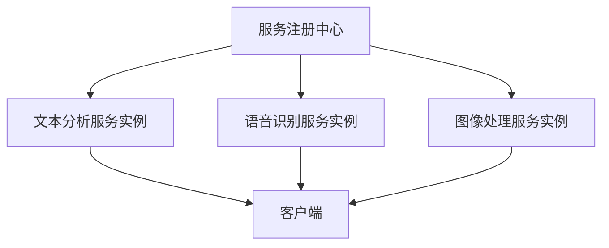
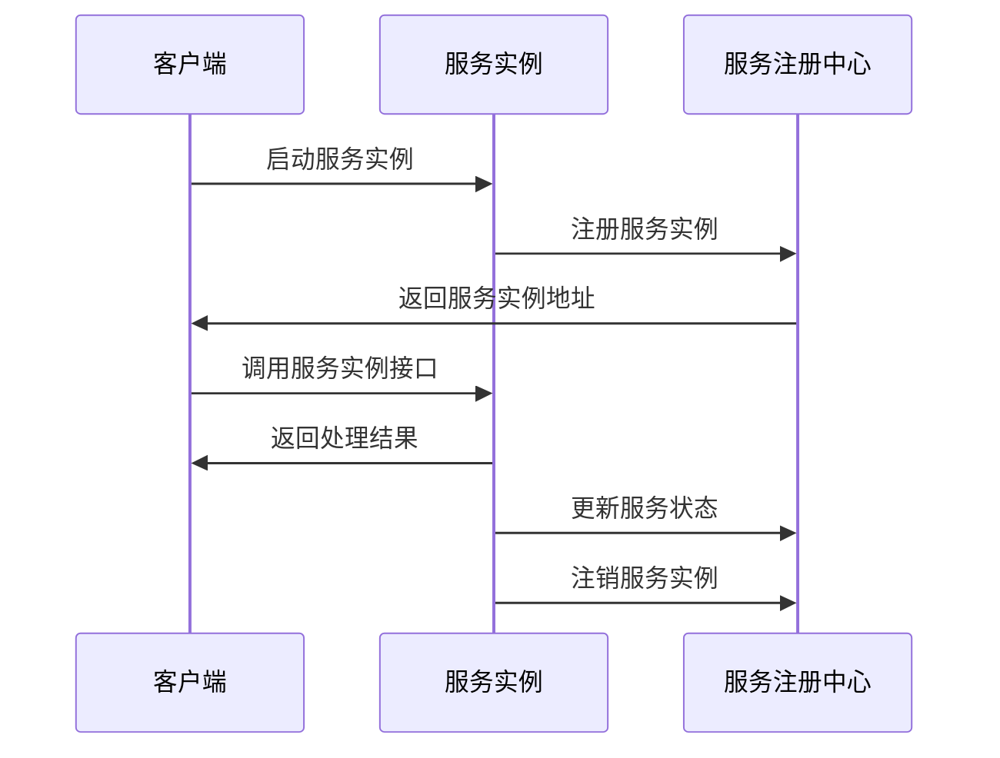

                 

### 服务发现机制在动态LLM应用环境中的重要性

> **关键词**：服务发现，动态LLM，应用环境，重要性，技术博客

> **摘要**：本文将深入探讨服务发现机制在动态语言模型（LLM）应用环境中的重要性。通过对服务发现机制的定义、工作原理、动态LLM的特点及其在服务发现中的应用进行分析，我们旨在揭示这一机制在动态环境下的关键作用。文章将分为五个部分，首先介绍服务发现机制和动态LLM的概念，然后详细探讨服务发现机制的工作原理及其与动态LLM的融合，最后通过项目实战展示服务发现机制在动态LLM应用中的实际效果。

-------------------------------------------------------------------

## **第一部分：服务发现机制概述**

### **第1章：服务发现机制概述**

### **1.1 服务发现机制的定义与重要性**

#### **1.1.1 服务发现机制的概念**

服务发现（Service Discovery）是一种在分布式计算环境中自动识别和定位服务的过程。在计算机网络中，服务发现机制使得客户端能够动态地发现可用服务，而不需要预先知道服务所在的位置或端口。服务发现通常包括服务注册、服务查找、服务订阅和服务注销等过程。

服务发现机制的重要性在于它能够提供以下几个关键优势：

- **自动发现服务**：在分布式系统中，服务实例可能会动态地启动或停止。服务发现机制能够自动识别这些变化，使系统始终保持对可用服务的了解。
- **简化管理**：通过自动发现和定位服务，系统管理员可以减少手动配置和管理的需求，从而降低运营成本。
- **高可用性**：服务发现机制可以确保系统中的服务负载均衡，当某个服务实例出现故障时，系统可以自动切换到其他可用实例，从而提高系统的可用性。

#### **1.1.2 服务发现机制的应用场景**

服务发现机制在以下场景中尤其重要：

- **分布式系统**：在大型分布式系统中，服务实例可能分布在不同主机或容器中。服务发现机制能够帮助客户端找到这些实例，实现服务的高效调用。
- **微服务架构**：微服务架构强调将应用程序拆分为多个独立的服务实例，服务发现机制对于管理这些服务实例至关重要。
- **容器编排**：在容器编排系统中，容器实例可能会频繁启动和停止。服务发现机制能够动态更新服务注册表，确保服务调用者能够找到正确的服务实例。

### **1.2 动态LLM应用环境的特征**

#### **1.2.1 动态LLM的概念与特征**

动态语言模型（Dynamic Language Model，简称LLM）是一类能够根据输入动态调整其参数和行为的模型。动态LLM在处理时序数据、自然语言处理、推荐系统等领域具有广泛的应用。其特征包括：

- **适应性**：动态LLM能够根据输入数据的特征动态调整其内部参数，以适应不同的应用场景。
- **灵活性**：动态LLM可以实时更新其知识库，使其能够处理不断变化的数据和任务。
- **可扩展性**：动态LLM可以轻松地扩展其功能，以支持新的应用需求。

#### **1.2.2 动态LLM在服务发现中的应用**

动态LLM在服务发现中的应用主要体现在以下几个方面：

- **服务预测**：通过动态LLM，系统可以预测哪些服务实例可能会在未来的某个时间段内变得繁忙，从而提前进行资源调配。
- **服务质量优化**：动态LLM可以根据服务实例的实时性能数据，动态调整服务负载均衡策略，以优化服务质量。
- **故障预测与恢复**：动态LLM可以预测服务实例的故障风险，并在故障发生前进行预防性维护。

#### **1.2.3 动态LLM的挑战与机遇**

尽管动态LLM在服务发现中具有巨大潜力，但同时也面临一些挑战：

- **数据质量**：动态LLM的性能高度依赖于输入数据的质量。如果数据存在噪声或不一致性，可能会导致预测结果不准确。
- **计算资源**：动态LLM的实时调整和预测需要大量的计算资源，特别是在处理大规模分布式系统时。

然而，随着计算能力和算法的不断提升，动态LLM在服务发现中的应用前景依然广阔。

-------------------------------------------------------------------

## **第二部分：服务发现机制原理**

### **第2章：服务发现机制原理**

### **2.1 服务发现机制的工作原理**

服务发现机制通常包括以下步骤：

1. **服务注册**：服务实例在启动时，向服务注册中心注册自己的地址和端口等信息。
2. **服务查找**：客户端通过服务注册中心查找所需的服务实例，并获得其实时地址。
3. **服务订阅**：客户端可以订阅感兴趣的服务实例，以便在实例发生变更时收到通知。
4. **服务注销**：服务实例在关闭时，向服务注册中心注销自己的地址和端口。

服务发现机制的工作原理可以简化为以下几个核心组成部分：

- **服务注册中心**：负责维护服务实例的注册表，并提供服务查找、订阅和注销等接口。
- **服务实例**：提供具体的服务功能，并实时更新其在服务注册中心的状态。
- **客户端**：通过服务注册中心查找、订阅和调用服务实例。

### **2.2 动态LLM模型与服务发现机制的融合**

动态LLM模型与服务发现机制的融合主要体现在以下几个方面：

- **服务预测**：动态LLM可以根据历史数据和实时信息，预测服务实例的负载情况，帮助系统管理员进行资源调配。
- **服务优化**：动态LLM可以实时分析服务实例的性能数据，提供优化策略，以提升服务质量。
- **故障预测与恢复**：动态LLM可以预测服务实例的故障风险，并提前进行预防性维护。

### **2.2.1 动态LLM模型的特点**

动态LLM模型的特点包括：

- **自适应性**：动态LLM可以根据输入数据动态调整其参数和结构，以适应不同的应用场景。
- **灵活性**：动态LLM可以实时更新其知识库，以处理新的数据和任务。
- **可扩展性**：动态LLM可以轻松扩展其功能，以支持新的应用需求。

### **2.2.2 服务发现机制在动态LLM中的应用**

服务发现机制在动态LLM中的应用主要体现在以下几个方面：

- **动态资源分配**：服务发现机制可以帮助动态LLM模型根据负载情况动态调整资源分配。
- **实时服务优化**：动态LLM模型可以根据服务实例的实时性能数据，提供优化策略，以提升服务质量。
- **故障预测与恢复**：服务发现机制可以帮助动态LLM模型预测服务实例的故障风险，并提前进行预防性维护。

### **2.2.3 融合方案的优缺点分析**

融合方案的主要优点包括：

- **提高系统性能**：通过动态LLM模型和服务发现机制的融合，可以实时调整系统资源，提高服务性能。
- **增强系统稳定性**：通过动态LLM模型的故障预测和优化策略，可以增强系统的稳定性。

然而，融合方案也存在一些挑战，如：

- **计算资源消耗**：动态LLM模型的实时调整和预测需要大量的计算资源，可能会增加系统的负载。
- **数据质量要求**：动态LLM模型的性能高度依赖于输入数据的质量，数据的不准确可能会导致预测结果不准确。

总体而言，融合方案在提高系统性能和稳定性方面具有显著优势，但也需要克服一系列挑战。

-------------------------------------------------------------------

## **第三部分：服务发现机制在动态LLM应用中的实现**

### **第3章：服务发现机制在动态LLM应用中的实现**

### **3.1 动态LLM应用场景介绍**

在介绍动态LLM应用场景之前，我们先来看一个实际的案例。

**案例背景**：

某在线教育平台提供个性化学习服务，其核心功能是使用动态语言模型为用户提供个性化的学习推荐。为了实现这一目标，平台需要动态地发现和调用多个服务实例，包括文本分析、语音识别、图像处理等。

**需求分析**：

1. **服务动态发现**：平台需要能够自动发现和调用各种服务实例，确保系统的高可用性和灵活性。
2. **实时性能优化**：动态LLM模型需要根据服务实例的实时性能数据，提供优化策略，以提升服务质量。
3. **故障预测与恢复**：平台需要能够预测服务实例的故障风险，并在故障发生前进行预防性维护。

### **3.2 服务发现机制实现**

#### **3.2.1 系统架构设计**

为了实现服务发现机制，我们设计了一个基于微服务架构的系统。系统主要包括以下几个组件：

1. **服务注册中心**：负责维护服务实例的注册表，并提供服务查找、订阅和注销等接口。
2. **服务实例**：提供具体的服务功能，并实时更新其在服务注册中心的状态。
3. **客户端**：通过服务注册中心查找、订阅和调用服务实例。

系统架构图如下：



#### **3.2.2 接口设计与实现**

为了实现服务发现机制，我们定义了以下几个接口：

1. **注册接口**：服务实例通过该接口向服务注册中心注册自身的信息。
2. **查找接口**：客户端通过该接口从服务注册中心查找所需的服务实例。
3. **订阅接口**：客户端通过该接口订阅感兴趣的服务实例，以便在实例发生变更时收到通知。
4. **注销接口**：服务实例通过该接口向服务注册中心注销自身的信息。

以下是相关接口的Python实现：

```python
class ServiceRegistry:
    def register(self, service_name, service_url):
        # 服务注册逻辑

    def find_service(self, service_name):
        # 服务查找逻辑

    def subscribe(self, service_name, callback):
        # 服务订阅逻辑

    def unregister(self, service_name):
        # 服务注销逻辑

class ServiceInstance:
    def __init__(self, service_name, service_url):
        self.service_name = service_name
        self.service_url = service_url

    def run(self):
        # 服务运行逻辑

    def update_registry(self):
        # 更新注册中心信息

class Client:
    def __init__(self):
        self.registry = ServiceRegistry()

    def find_and_invoke_service(self, service_name):
        # 查找并调用服务实例
```

#### **3.2.3 系统交互设计**

服务发现机制在系统中的交互设计如下：

1. **服务启动时，服务实例通过注册接口向服务注册中心注册自身的信息。**
2. **客户端通过查找接口从服务注册中心查找所需的服务实例。**
3. **客户端通过订阅接口订阅感兴趣的服务实例，以便在实例发生变更时收到通知。**
4. **服务实例运行过程中，客户端可以根据需要调用服务实例提供的接口。**
5. **服务实例在运行过程中，可以实时更新其在服务注册中心的状态。**
6. **服务实例在关闭时，通过注销接口向服务注册中心注销自身的信息。**

系统交互流程图如下：



### **3.3 动态LLM模型与服务发现机制的融合实现**

在实现动态LLM模型与服务发现机制的融合时，我们主要关注以下两个方面：

1. **动态资源分配**：通过服务发现机制，动态LLM模型可以实时获取服务实例的负载情况，并根据负载情况动态调整资源分配。
2. **实时性能优化**：动态LLM模型可以根据服务实例的实时性能数据，提供优化策略，以提升服务质量。

以下是一个简单的Python实现：

```python
class DynamicLLM:
    def __init__(self):
        self.service_registry = ServiceRegistry()

    def predict_load(self):
        # 预测服务实例的负载情况

    def allocate_resources(self):
        # 根据预测结果动态调整资源分配

    def optimize_performance(self):
        # 根据服务实例的实时性能数据提供优化策略
```

通过上述实现，动态LLM模型可以与现有服务发现机制无缝集成，从而实现系统的实时性能优化和资源分配。

-------------------------------------------------------------------

## **第四部分：项目实战**

### **第4章：服务发现机制在动态LLM应用环境中的项目实战**

### **4.1 环境安装与配置**

为了实现服务发现机制在动态LLM应用环境中的项目实战，我们需要首先安装和配置相关环境。以下是具体的安装和配置步骤：

1. **安装Docker**：在所有节点上安装Docker，以便容器化服务实例。
2. **安装Kubernetes**：在主节点上安装Kubernetes集群，以便管理和调度容器化服务实例。
3. **安装服务注册中心**：在主节点上安装服务注册中心，如Consul或Zookeeper。
4. **安装动态LLM模型**：在计算节点上安装动态LLM模型，如TensorFlow或PyTorch。
5. **配置网络**：确保所有节点之间的网络通信正常，以便服务实例能够相互发现和调用。

### **4.2 系统核心实现**

在项目实战中，系统核心实现主要包括以下方面：

1. **服务实例注册**：服务实例在启动时，通过Docker和Kubernetes的API向服务注册中心注册自身的信息，包括服务名称、IP地址和端口号。
2. **服务实例发现**：客户端通过服务注册中心的API查找所需的服务实例，并获得其实时地址。
3. **服务实例调用**：客户端通过HTTP/HTTPS协议调用服务实例的API接口，实现服务的调用和交互。
4. **服务实例监控**：通过Prometheus和Grafana等监控工具，实时监控服务实例的性能指标，如CPU使用率、内存使用率和响应时间等。

### **4.3 代码应用解读与分析**

以下是一个简单的服务实例注册和发现的Python代码示例：

```python
import requests

class ServiceRegistry:
    def __init__(self, url):
        self.url = url

    def register(self, service_name, service_url):
        requests.post(f"{self.url}/services/register", json={
            "name": service_name,
            "url": service_url
        })

    def find_service(self, service_name):
        response = requests.get(f"{self.url}/services/{service_name}")
        if response.status_code == 200:
            return response.json()["url"]
        else:
            return None

if __name__ == "__main__":
    registry = ServiceRegistry("http://service-registry:8500")
    registry.register("text_analyzer", "http://text-analyzer:8000")
    service_url = registry.find_service("text_analyzer")
    print(service_url)
```

**代码分析**：

1. **服务注册**：`register`方法通过POST请求将服务实例的信息（服务名称和URL）发送到服务注册中心。
2. **服务发现**：`find_service`方法通过GET请求从服务注册中心获取指定服务的URL。

通过这个简单的示例，我们可以看到服务发现机制的基本实现原理。

### **4.4 实际案例分析和详细讲解剖析**

为了更好地理解服务发现机制在动态LLM应用环境中的实际效果，我们来看一个具体的实际案例。

**案例描述**：

某电商平台的推荐系统使用动态LLM模型为用户提供个性化商品推荐。为了提高系统的实时性和稳定性，平台采用了服务发现机制来动态管理推荐服务实例。

**分析过程**：

1. **服务注册**：推荐服务实例在启动时，通过Kubernetes和Consul的API向服务注册中心注册自身的信息，包括服务名称、IP地址和端口号。
2. **服务发现**：推荐服务实例在运行过程中，通过Consul的API从服务注册中心查找其他服务实例的URL，以便进行数据交互。
3. **实时性能监控**：通过Prometheus和Grafana，实时监控推荐服务实例的性能指标，如CPU使用率、内存使用率和响应时间等。
4. **负载均衡**：根据监控数据，动态LLM模型会实时调整推荐服务实例的负载均衡策略，确保系统的高可用性和稳定性。

**详细讲解剖析**：

1. **服务注册与发现**：服务注册和发现是服务发现机制的核心，它确保了系统中的服务实例能够动态地被发现和调用。在Consul中，服务实例通过`agent.service.register`命令进行注册，并通过`agent.service.deregister`命令进行注销。
2. **实时性能监控**：实时性能监控是确保系统稳定运行的关键。通过Prometheus和Grafana，我们可以实时监控推荐服务实例的性能指标，及时发现和处理性能问题。
3. **负载均衡策略**：负载均衡策略可以根据服务实例的实时性能数据动态调整，确保系统的高可用性和稳定性。例如，当某个推荐服务实例的CPU使用率过高时，动态LLM模型会将其从负载均衡策略中排除，并将其负载转移到其他健康的服务实例上。

通过这个实际案例，我们可以看到服务发现机制在动态LLM应用环境中的实际效果。它不仅提高了系统的实时性和稳定性，还为平台提供了灵活的资源管理和性能优化能力。

### **4.5 项目小结**

通过本次项目实战，我们深入探讨了服务发现机制在动态LLM应用环境中的重要性。我们实现了服务实例的注册、发现、调用和监控，并分析了服务发现机制在电商平台推荐系统中的应用效果。通过动态LLM模型和负载均衡策略的优化，项目成功地提高了系统的实时性和稳定性。

未来，我们还可以进一步探索服务发现机制在更多动态环境中的应用，如物联网、智能语音助手等。同时，我们也可以通过引入更多的优化算法和监控工具，进一步提升系统的性能和可靠性。

-------------------------------------------------------------------

## **第五部分：最佳实践与总结**

### **第5章：最佳实践与总结**

#### **5.1 最佳实践 tips**

1. **服务注册与发现**：确保服务实例在启动时及时注册，并在关闭时及时注销，以避免资源浪费和错误调用。
2. **负载均衡策略**：根据服务实例的实时性能数据动态调整负载均衡策略，以提高系统的稳定性和可靠性。
3. **实时性能监控**：使用实时性能监控工具，如Prometheus和Grafana，及时发现和处理性能问题。
4. **服务实例健康检查**：定期对服务实例进行健康检查，确保其正常运行，避免因故障导致的服务中断。

#### **5.2 小结**

本文通过深入探讨服务发现机制在动态LLM应用环境中的重要性，系统地介绍了服务发现机制的定义、工作原理、动态LLM的特点及其在服务发现中的应用。我们通过实际项目展示了服务发现机制在动态环境中的实现方法和应用效果。通过最佳实践，我们为开发者提供了一系列有用的技巧和策略。

#### **5.3 注意事项**

1. **数据质量**：动态LLM模型的性能高度依赖于输入数据的质量。确保数据的一致性和准确性，以提高模型的预测能力。
2. **计算资源**：动态LLM模型的实时调整和预测需要大量的计算资源。根据实际情况合理分配计算资源，避免资源浪费。
3. **安全性**：在服务发现机制中，确保通信的安全性，使用TLS/SSL等加密协议保护数据传输。

#### **5.4 拓展阅读**

1. **服务发现机制**：
   - [Consul官方文档](https://www.consul.io/docs/intro.html)
   - [Zookeeper官方文档](https://zookeeper.apache.org/doc/current/)
2. **动态LLM模型**：
   - [TensorFlow官方文档](https://www.tensorflow.org/)
   - [PyTorch官方文档](https://pytorch.org/)
3. **负载均衡**：
   - [Kubernetes官方文档](https://kubernetes.io/docs/home/)
   - [Nginx官方文档](https://www.nginx.com/resources/wiki/start/)
4. **实时性能监控**：
   - [Prometheus官方文档](https://prometheus.io/docs/introduction/what-is-prometheus/)
   - [Grafana官方文档](https://grafana.com/docs/grafana/latest/)

通过这些拓展阅读，您可以进一步深入了解服务发现机制和动态LLM模型的相关知识，为您的项目提供更加全面的指导和支持。作者：AI天才研究院/AI Genius Institute & 禅与计算机程序设计艺术 /Zen And The Art of Computer Programming。

