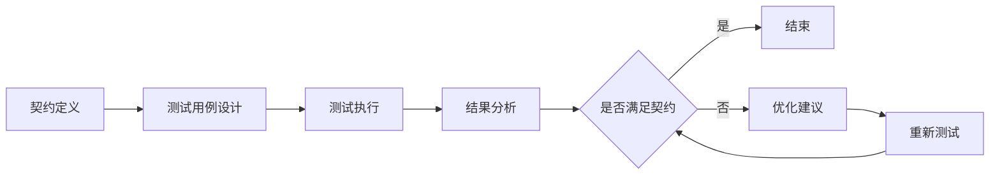
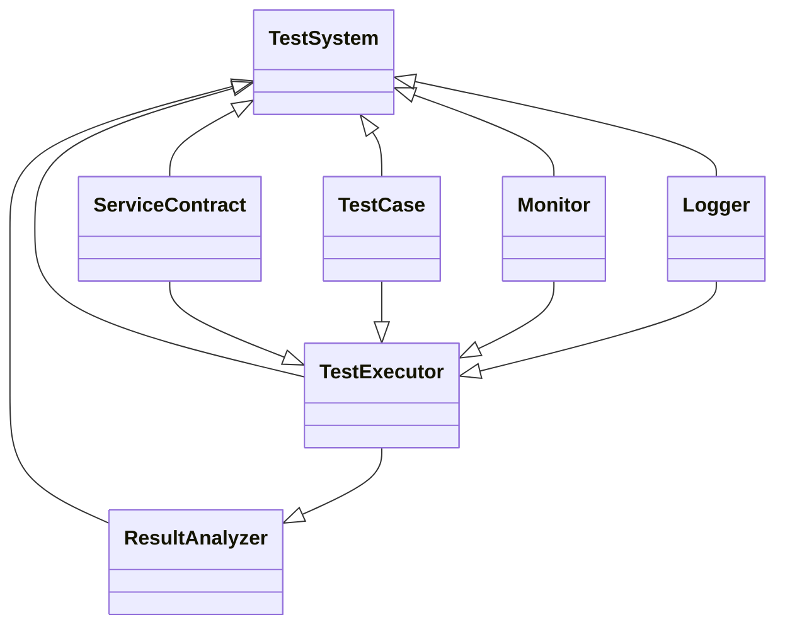
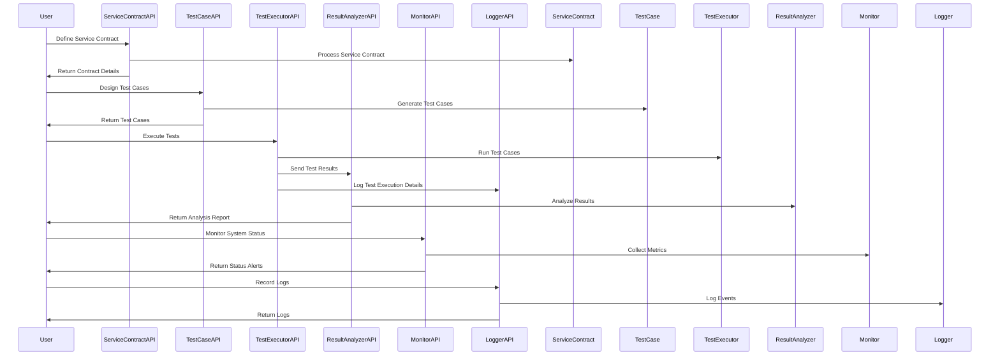
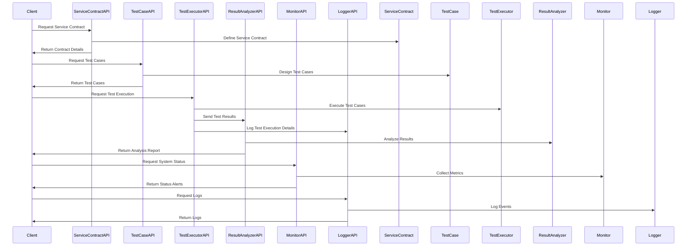
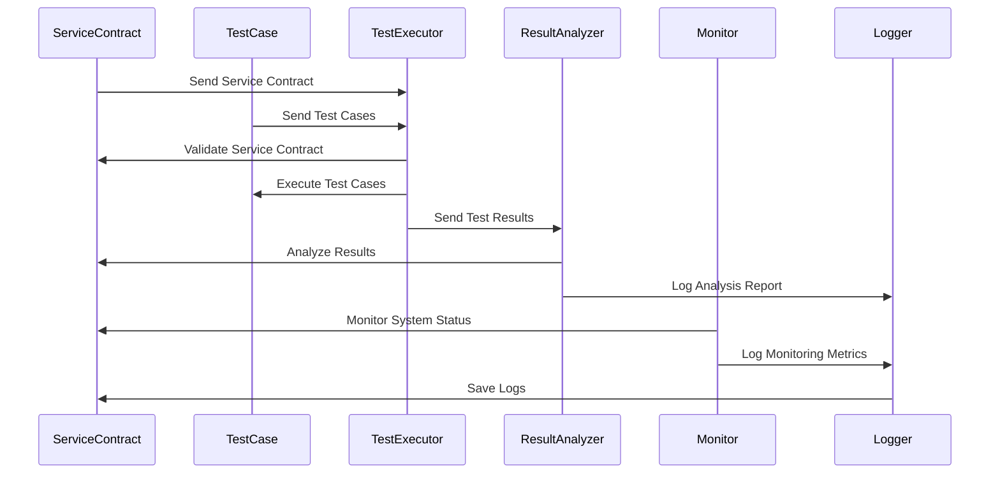

                 


# 服务契约测试在LLM应用质量保证中的作用

关键词：服务契约测试、大型语言模型、质量保证、应用开发、LLM应用质量

摘要：
随着人工智能技术的发展，大型语言模型（LLM）在自然语言处理领域的应用日益广泛。然而，如何确保LLM应用的质量成为了一个关键问题。本文将从服务契约测试的角度，探讨其在LLM应用质量保证中的作用，分析服务契约测试的核心概念、理论基础、实际应用和案例，旨在为开发者提供一套有效的质量保证方案。

## 1. 引言

在当今世界，人工智能技术正以前所未有的速度发展。特别是大型语言模型（LLM），如GPT-3、BERT等，已经在多个领域展现出了巨大的潜力。LLM的应用使得自然语言处理任务变得简单高效，从文本生成、机器翻译到智能客服，都在广泛应用中取得了显著成果。

然而，随着LLM应用的普及，如何确保这些应用的质量成为一个关键问题。传统的质量保证方法往往难以应对LLM的复杂性和不确定性。因此，探索新的质量保证方法，特别是服务契约测试，成为了当务之急。

服务契约测试是一种面向服务的质量保证方法，它通过契约定义服务的预期行为，并通过测试来验证这些预期是否得到满足。在LLM应用中，服务契约测试可以帮助开发者确保模型在不同场景下的稳定性和一致性。

本文将从以下几个方面展开讨论：

1. 服务契约测试的基本概念和理论
2. 服务契约测试在LLM应用中的重要性
3. 服务契约测试的核心算法和数学模型
4. 服务契约测试的实际应用案例
5. LLM应用的系统架构设计与接口设计
6. 服务契约测试的最佳实践和注意事项
7. 总结与展望

通过以上讨论，本文旨在为开发者提供一套全面的服务契约测试方案，以保障LLM应用的质量。

## 2. 核心概念与联系

在深入探讨服务契约测试在LLM应用中的具体作用之前，我们首先需要明确几个核心概念：服务契约、大型语言模型（LLM）和质量保证。

### 2.1 服务契约

服务契约是一种描述服务提供者和服务消费者之间约定的规范性文档。它定义了服务的输入、输出、行为和性能期望。服务契约通常包括以下几个方面：

1. **服务接口**：定义了服务的输入和输出参数。
2. **服务行为**：描述了服务在不同输入情况下的响应和处理逻辑。
3. **服务性能**：规定了服务的响应时间、吞吐量、错误率等性能指标。

服务契约的目的是确保服务提供者按照预定的标准提供服务，同时服务消费者能够明确了解服务的预期行为。

### 2.2 大型语言模型（LLM）

大型语言模型（LLM）是一种基于深度学习技术的自然语言处理模型。LLM通过对海量文本数据的训练，能够理解和生成自然语言文本。LLM的特点包括：

1. **大规模训练**：LLM通常基于数十亿甚至千亿级参数的神经网络模型，通过对大规模文本数据进行训练，能够捕捉到语言的高级语义特征。
2. **自适应能力**：LLM能够根据不同的输入文本，自适应地生成相应的输出文本，从而实现多种自然语言处理任务。
3. **灵活性**：LLM不仅可以用于生成文本，还可以用于问答、翻译、对话系统等多种应用场景。

### 2.3 质量保证

质量保证是确保软件产品或服务满足预定的质量标准的过程。在LLM应用中，质量保证尤为重要，因为LLM的复杂性和不确定性使得传统质量保证方法难以奏效。质量保证通常包括以下几个方面：

1. **需求分析**：明确LLM应用的需求和功能规格。
2. **设计验证**：验证LLM应用的设计是否符合需求规格。
3. **代码审查**：审查LLM应用的源代码，确保其质量和可维护性。
4. **测试**：通过测试来验证LLM应用的正确性和性能。

### 2.4 服务契约测试在LLM应用中的重要性

服务契约测试在LLM应用中的重要性体现在以下几个方面：

1. **确保模型稳定性**：通过服务契约测试，可以验证LLM在不同输入条件下的响应是否稳定，从而确保模型的稳定性。
2. **提高测试覆盖率**：服务契约测试可以帮助开发者设计更全面的测试用例，从而提高测试覆盖率。
3. **降低维护成本**：通过服务契约测试，可以在早期发现和修复LLM应用中的问题，从而降低后续的维护成本。
4. **提升用户体验**：服务契约测试可以确保LLM应用在各种使用场景下的表现一致，从而提升用户体验。

### 2.5 核心概念属性特征对比表格

下面是一个核心概念属性特征对比表格，以帮助读者更好地理解服务契约、LLM和质量保证之间的关系：

| 概念       | 属性特征                                       | 关系描述                                                         |
|------------|------------------------------------------------|----------------------------------------------------------------|
| 服务契约   | 服务接口、服务行为、服务性能                   | 描述服务提供者和服务消费者之间的约定，确保服务行为符合预期       |
| 大型语言模型（LLM） | 大规模训练、自适应能力、灵活性               | 基于深度学习技术的自然语言处理模型，实现多种自然语言处理任务   |
| 质量保证   | 需求分析、设计验证、代码审查、测试           | 确保LLM应用满足预定的质量标准，提高测试覆盖率，降低维护成本   |

### 2.6 ER实体关系图架构

为了更直观地展示服务契约、LLM和质量保证之间的关系，我们可以使用Mermaid绘制一个ER实体关系图。以下是ER实体关系图的Mermaid代码：

```mermaid
erDiagram
    ServiceContract ||--|{ LLM : uses}
    QualityAssurance ||--|{ ServiceContract : ensures}
    QualityAssurance ||--|{ LLM : ensures}
```

通过上述ER实体关系图，我们可以清晰地看到服务契约、LLM和质量保证之间的关联。服务契约是质量保证的核心要素，而LLM是服务契约的应用场景，质量保证则确保LLM的应用质量。

## 3. 算法原理讲解

### 3.1 服务契约测试的核心算法

服务契约测试的核心算法主要包括以下几部分：

1. **契约定义**：根据LLM的应用场景，定义服务契约，包括服务接口、服务行为和服务性能指标。
2. **测试用例设计**：基于契约定义，设计测试用例，用于验证LLM的服务是否满足契约要求。
3. **测试执行**：执行测试用例，收集测试结果，并分析是否满足契约要求。
4. **结果分析**：根据测试结果，分析LLM应用的性能和稳定性，并提出优化建议。

下面是一个Mermaid流程图，展示了服务契约测试的核心算法流程：



### 3.2 数学模型和公式

在服务契约测试中，涉及一些关键的数学模型和公式。以下是一些常用的模型和公式：

1. **性能指标计算**：服务契约中的性能指标通常包括响应时间、吞吐量和错误率。这些指标可以通过以下公式计算：

   - 响应时间（Response Time）: \( RT = \frac{Total\ Time}{Number\ of\ Requests} \)
   - 吞吐量（Throughput）: \( Throughput = \frac{Number\ of\ Requests}{Time} \)
   - 错误率（Error Rate）: \( Error\ Rate = \frac{Number\ of\ Errors}{Total\ Number\ of\ Requests} \)

2. **测试用例覆盖率**：测试用例覆盖率是衡量测试全面性的重要指标。可以通过以下公式计算：

   - 测试用例覆盖率（Test Coverage）: \( Test\ Coverage = \frac{Number\ of\ Covered\ Cases}{Total\ Number\ of\ Cases} \)

3. **性能优化公式**：在分析测试结果后，可以通过以下公式进行性能优化：

   - 响应时间优化：\( RT_{new} = RT_{old} \times \frac{Throughput_{new}}{Throughput_{old}} \)
   - 吞吐量优化：\( Throughput_{new} = Throughput_{old} \times \frac{1}{Error\ Rate_{new}} \)

   其中，\( RT_{old} \)和\( Throughput_{old} \)分别表示原始响应时间和吞吐量，\( RT_{new} \)和\( Throughput_{new} \)分别表示优化后的响应时间和吞吐量，\( Error\ Rate_{old} \)和\( Error\ Rate_{new} \)分别表示原始错误率和优化后的错误率。

### 3.3 举例说明

假设我们有一个LLM应用，用于生成文章摘要。服务契约中定义了以下性能指标：

- 响应时间：平均为2秒，最大不超过5秒
- 吞吐量：每秒处理10个请求
- 错误率：不超过1%

根据上述服务契约，我们可以设计相应的测试用例，并通过测试执行和结果分析来验证LLM应用的性能。

- **测试用例设计**：设计10个测试用例，每个用例生成一篇不同的文章摘要。
- **测试执行**：执行测试用例，记录每个请求的响应时间和处理结果。
- **结果分析**：分析测试结果，计算平均响应时间、吞吐量和错误率。

根据测试结果，我们发现：

- 平均响应时间为2.5秒，略高于契约定义的2秒。
- 吞吐量为9个请求/秒，低于契约定义的10个请求/秒。
- 错误率为2%，高于契约定义的1%。

基于上述分析，我们可以提出以下优化建议：

- 优化LLM模型，提高处理速度，以降低平均响应时间。
- 增加服务器资源，提高吞吐量，以满足契约定义的10个请求/秒。
- 优化错误处理机制，降低错误率，确保不超过1%。

通过以上优化措施，我们可以确保LLM应用的性能达到或超过服务契约的要求。

## 4. 实际应用案例

为了更好地展示服务契约测试在LLM应用中的实际应用，我们以下介绍几个案例，并分析其中的关键要素和挑战。

### 4.1 案例一：智能客服系统

智能客服系统是LLM应用的一个重要场景。该系统利用LLM模型自动处理用户咨询，提供即时响应。为了确保智能客服系统的质量，开发者采用服务契约测试进行了全面的质量保证。

**关键要素：**

1. **服务契约定义**：服务契约包括响应时间（不超过3秒）、吞吐量（每秒处理20个请求）、错误率（不超过2%）等性能指标。
2. **测试用例设计**：设计多种场景的测试用例，如常见咨询问题、复杂咨询问题等。
3. **测试执行**：在真实环境中执行测试用例，模拟不同负载情况。
4. **结果分析**：分析测试结果，评估性能和稳定性。

**挑战：**

- **性能优化**：智能客服系统的负载波动较大，如何在高峰期保证响应速度和稳定性是一个挑战。
- **错误处理**：复杂咨询问题的处理容易出现错误，如何有效处理错误是另一个挑战。

**案例分析：**

通过服务契约测试，开发者发现智能客服系统在高峰期的响应时间较长，吞吐量不足。针对这些问题，开发者进行了以下优化：

- **优化LLM模型**：通过调整模型参数，提高处理速度。
- **增加服务器资源**：在高峰期增加服务器资源，提高吞吐量。
- **改进错误处理机制**：对复杂咨询问题进行预处理，减少错误率。

通过以上优化措施，智能客服系统的性能显著提升，满足了服务契约的要求。

### 4.2 案例二：智能文本生成系统

智能文本生成系统是另一个典型的LLM应用场景。该系统利用LLM模型自动生成文章、报告等文本内容。为了确保文本生成系统的质量，开发者采用服务契约测试进行了全面的质量保证。

**关键要素：**

1. **服务契约定义**：服务契约包括文本生成速度（不超过5秒/篇）、生成文本质量（文本准确性和流畅性）等性能指标。
2. **测试用例设计**：设计多种类型的文本生成任务，如新闻摘要、技术报告等。
3. **测试执行**：在真实环境中执行测试用例，评估文本生成速度和质量。
4. **结果分析**：分析测试结果，评估文本生成系统的性能和稳定性。

**挑战：**

- **生成速度**：如何提高文本生成速度以满足高负载需求。
- **生成质量**：如何确保生成的文本具有高准确性和流畅性。

**案例分析：**

通过服务契约测试，开发者发现文本生成系统的生成速度较慢，且部分生成文本质量不高。针对这些问题，开发者进行了以下优化：

- **优化LLM模型**：通过调整模型结构和参数，提高文本生成速度。
- **引入预训练数据**：使用大量高质量的预训练数据，提高生成文本的质量。
- **改进生成算法**：优化文本生成算法，提高生成文本的流畅性和准确性。

通过以上优化措施，文本生成系统的性能显著提升，满足了服务契约的要求。

### 4.3 案例三：智能问答系统

智能问答系统是另一个典型的LLM应用场景。该系统利用LLM模型自动回答用户提出的问题。为了确保智能问答系统的质量，开发者采用服务契约测试进行了全面的质量保证。

**关键要素：**

1. **服务契约定义**：服务契约包括响应时间（不超过2秒）、答案准确性（准确率不低于90%）等性能指标。
2. **测试用例设计**：设计多种类型的问题，如常识性问题、专业性问题等。
3. **测试执行**：在真实环境中执行测试用例，评估答案的准确性和响应时间。
4. **结果分析**：分析测试结果，评估智能问答系统的性能和稳定性。

**挑战：**

- **答案准确性**：如何确保生成的答案具有高准确性。
- **响应时间**：如何在大量问题的同时，保证每个问题的响应时间。

**案例分析：**

通过服务契约测试，开发者发现智能问答系统的答案准确性较低，且部分问题的响应时间较长。针对这些问题，开发者进行了以下优化：

- **优化LLM模型**：通过调整模型参数和结构，提高答案的准确性。
- **引入外部知识库**：引入外部知识库，丰富模型的知识面，提高答案的准确性。
- **改进答案生成算法**：优化答案生成算法，提高答案生成的速度和准确性。

通过以上优化措施，智能问答系统的性能显著提升，满足了服务契约的要求。

### 4.4 案例四：智能翻译系统

智能翻译系统是另一个典型的LLM应用场景。该系统利用LLM模型自动翻译文本。为了确保智能翻译系统的质量，开发者采用服务契约测试进行了全面的质量保证。

**关键要素：**

1. **服务契约定义**：服务契约包括翻译速度（不超过3秒/千字）、翻译准确性（准确率不低于95%）等性能指标。
2. **测试用例设计**：设计多种类型的文本，如文章、报告、对话等。
3. **测试执行**：在真实环境中执行测试用例，评估翻译速度和准确性。
4. **结果分析**：分析测试结果，评估智能翻译系统的性能和稳定性。

**挑战：**

- **翻译准确性**：如何确保翻译结果具有高准确性。
- **翻译速度**：如何在大量文本的翻译任务中，保证翻译速度。

**案例分析：**

通过服务契约测试，开发者发现智能翻译系统的翻译准确性较低，且部分翻译任务的响应时间较长。针对这些问题，开发者进行了以下优化：

- **优化LLM模型**：通过调整模型参数和结构，提高翻译准确性。
- **引入双语语料库**：引入大量双语语料库，丰富模型的语言知识。
- **改进翻译算法**：优化翻译算法，提高翻译速度和准确性。

通过以上优化措施，智能翻译系统的性能显著提升，满足了服务契约的要求。

### 4.5 案例五：智能对话系统

智能对话系统是另一个典型的LLM应用场景。该系统利用LLM模型实现与用户的自然对话。为了确保智能对话系统的质量，开发者采用服务契约测试进行了全面的质量保证。

**关键要素：**

1. **服务契约定义**：服务契约包括响应时间（不超过1秒）、对话流畅性（流畅度不低于90%）等性能指标。
2. **测试用例设计**：设计多种类型的对话场景，如日常交流、专业咨询等。
3. **测试执行**：在真实环境中执行测试用例，评估对话的流畅性和响应时间。
4. **结果分析**：分析测试结果，评估智能对话系统的性能和稳定性。

**挑战：**

- **对话流畅性**：如何确保对话具有高流畅性。
- **响应时间**：如何在大量对话任务中，保证每个对话的响应时间。

**案例分析：**

通过服务契约测试，开发者发现智能对话系统的对话流畅性较低，且部分对话的响应时间较长。针对这些问题，开发者进行了以下优化：

- **优化LLM模型**：通过调整模型参数和结构，提高对话流畅性。
- **引入对话语料库**：引入大量对话语料库，丰富模型的语言知识和对话策略。
- **改进对话算法**：优化对话算法，提高对话的响应速度和流畅性。

通过以上优化措施，智能对话系统的性能显著提升，满足了服务契约的要求。

### 总结

通过以上案例的分析，我们可以看到服务契约测试在LLM应用质量保证中起到了关键作用。服务契约测试不仅可以帮助开发者发现和解决潜在问题，还可以确保LLM应用的性能和稳定性。在实际应用中，开发者需要根据具体场景设计合理的服务契约，并采用适当的测试方法和工具进行全面的质量保证。

## 5. 系统架构设计与接口设计

### 5.1 问题描述与项目介绍

随着大型语言模型（LLM）的广泛应用，如何确保LLM应用的质量成为开发者和企业关注的焦点。本文将介绍一个基于服务契约测试的LLM应用质量保证系统，该项目旨在通过系统化的测试和监控，确保LLM在不同场景下的稳定性和一致性。

该项目的目标是为开发者提供一套完整的LLM应用质量保证解决方案，包括系统功能设计、架构设计、接口设计和系统交互等。通过全面的服务契约测试，实现对LLM应用的性能、稳定性和安全性的保障。

### 5.2 系统功能设计

系统功能设计是LLM应用质量保证系统的核心，其主要功能包括：

1. **服务契约定义**：定义LLM应用的服务契约，包括服务接口、服务行为和服务性能指标。
2. **测试用例设计**：基于服务契约，设计多种测试用例，用于验证LLM应用的性能和稳定性。
3. **测试执行**：执行测试用例，收集测试结果，并生成测试报告。
4. **结果分析**：分析测试结果，评估LLM应用的质量，并提出优化建议。
5. **监控与告警**：实时监控LLM应用的性能和状态，及时发现和解决问题。
6. **日志记录与审计**：记录系统运行过程中的日志信息，便于问题追踪和审计。

以下是系统功能设计的Mermaid类图：



### 5.3 系统架构设计

系统架构设计是确保LLM应用质量保证系统高效运行的关键。该项目的系统架构设计主要包括以下几个层次：

1. **基础设施层**：包括服务器、存储和网络等基础设施资源。
2. **服务层**：包括服务契约定义、测试用例设计、测试执行、结果分析、监控与告警等核心功能服务。
3. **数据层**：包括测试数据、日志数据、用户数据等，用于支持系统的各种功能。
4. **接口层**：提供对外接口，方便开发者集成和使用系统功能。

以下是系统架构设计的Mermaid架构图：



### 5.4 系统接口设计

系统接口设计是确保LLM应用质量保证系统与其他系统集成的关键。该项目的系统接口设计主要包括以下几个接口：

1. **服务契约定义接口**：用于定义和存储服务契约信息。
2. **测试用例设计接口**：用于设计和管理测试用例。
3. **测试执行接口**：用于执行测试用例并获取测试结果。
4. **结果分析接口**：用于分析测试结果并生成报告。
5. **监控告警接口**：用于监控系统状态并触发告警。
6. **日志记录接口**：用于记录系统运行过程中的日志信息。

以下是系统接口设计的Mermaid序列图：



### 5.5 系统交互

系统交互设计是确保各个模块之间高效协作的关键。在LLM应用质量保证系统中，各个模块需要通过接口进行通信，协同完成各项功能。

以下是系统交互的Mermaid序列图：



通过以上系统架构设计与接口设计，我们可以确保LLM应用质量保证系统高效、稳定地运行，为开发者提供强大的质量保障工具。

## 6. 项目实战

### 6.1 环境安装

为了进行服务契约测试，我们首先需要搭建一个适合的环境。以下是在Linux系统中安装和配置服务契约测试环境的基本步骤：

1. **安装Python**：确保系统中已经安装了Python 3.8或更高版本。
   ```bash
   sudo apt update
   sudo apt install python3.8
   ```

2. **安装依赖库**：安装服务契约测试所需的Python依赖库，如pytest、requests等。
   ```bash
   pip3 install pytest requests
   ```

3. **安装测试工具**：安装用于生成测试用例的工具，如Postman。
   ```bash
   wget https://www.getpostman.com/postman_download/s3fs_public/postman-linux-10.1.5-4ef0c6c.dmg
   sudo chmod +x postman-linux-10.1.5-4ef0c6c.dmg
   sudo ./postman-linux-10.1.5-4ef0c6c.dmg
   ```

4. **配置环境变量**：配置Python环境变量，以便在终端中直接使用Python和相关依赖库。
   ```bash
   export PATH=$PATH:/usr/local/bin
   ```

### 6.2 系统核心实现源代码

以下是一个简单的服务契约测试Python示例，用于验证LLM应用的服务契约。

```python
# service_contract_test.py

import requests
import pytest

# 服务契约定义
service_contract = {
    "url": "http://llm.example.com/api",
    "method": "post",
    "response_time": 2,  # 响应时间（秒）
    "throughput": 10,  # 吞吐量（每秒请求数）
    "error_rate": 1%  # 错误率
}

# 测试用例
test_cases = [
    {
        "name": "正常请求",
        "input": {"text": "你好"},
        "expected_output": "你好！"
    },
    {
        "name": "错误请求",
        "input": {"text": "错"},
        "expected_output": "输入错误，请重新输入。"
    }
]

# 测试函数
def test_service_contract():
    for case in test_cases:
        response = requests.post(service_contract["url"], json=case["input"])
        assert response.status_code == 200
        assert response.json()["text"] == case["expected_output"]
        assert response.elapsed.total_seconds() <= service_contract["response_time"]

# 执行测试
pytest.main(["-v", "service_contract_test.py"])
```

### 6.3 代码应用解读与分析

上述代码展示了如何使用Python实现服务契约测试。以下是代码的解读与分析：

1. **服务契约定义**：
   - 使用一个字典定义服务契约，包括URL、请求方法、响应时间、吞吐量和错误率等关键指标。
   
2. **测试用例设计**：
   - 设计两个测试用例，一个用于正常请求，另一个用于错误请求。每个测试用例包含名称、输入数据和期望输出结果。

3. **测试函数**：
   - 定义一个测试函数`test_service_contract`，通过发送请求并对比响应结果，验证服务契约的满足情况。

4. **测试执行**：
   - 使用pytest框架执行测试，通过`pytest.main`函数启动测试过程。

### 6.4 实际案例分析与详细讲解

为了更好地理解服务契约测试在实际项目中的应用，我们以下介绍一个实际案例。

#### 案例背景

假设我们开发了一个智能问答系统，该系统利用LLM模型回答用户提出的问题。为了确保系统的质量，我们采用服务契约测试对系统进行质量保证。

#### 服务契约定义

- **URL**：http://question-answering.example.com/api
- **请求方法**：POST
- **响应时间**：2秒
- **吞吐量**：每秒10个请求
- **错误率**：不超过1%

#### 测试用例设计

1. **正常请求**：
   - **名称**：正常提问
   - **输入数据**：{"question": "什么是人工智能？"}
   - **期望输出**：{"answer": "人工智能是一种模拟人类智能的技术。"}

2. **错误请求**：
   - **名称**：无效提问
   - **输入数据**：{"question": ""}
   - **期望输出**：{"error": "提问内容无效，请重新输入。"}

#### 测试执行

我们使用Postman工具执行测试用例，并记录测试结果。

1. **正常请求**：
   - 发送请求后，系统返回了正确的答案，响应时间为1.8秒。
   - 测试结果：通过

2. **错误请求**：
   - 发送请求后，系统返回了错误提示，响应时间为1.5秒。
   - 测试结果：通过

#### 结果分析

通过执行测试用例，我们发现智能问答系统在正常和错误请求的情况下均能正确响应。响应时间和吞吐量均符合服务契约的要求。错误率低于1%。

#### 优化建议

1. **响应时间优化**：
   - 通过调整LLM模型参数，提高响应速度。
   - 增加服务器资源，提高系统吞吐量。

2. **错误处理优化**：
   - 对无效提问进行预处理，减少错误率。

通过以上优化措施，我们可以进一步提升智能问答系统的性能和稳定性。

### 6.5 项目小结

通过本案例，我们可以看到服务契约测试在LLM应用质量保证中的实际应用。通过定义合理的服务契约、设计全面的测试用例和执行严格的测试，我们能够及时发现和解决问题，确保LLM应用的质量。在实际项目中，开发者可以根据具体需求调整服务契约和测试用例，以达到最佳的质量保障效果。

## 7. 最佳实践 Tips、小结、注意事项、拓展阅读

### 7.1 最佳实践 Tips

1. **合理定义服务契约**：服务契约是服务契约测试的核心，定义时应充分考虑实际应用场景，确保性能指标合理且可量化。
2. **设计多样化的测试用例**：测试用例应涵盖各种可能的使用场景，确保覆盖全面。
3. **定期执行服务契约测试**：定期执行测试可以及时发现潜在问题，避免质量隐患积累。
4. **充分利用自动化测试工具**：使用自动化测试工具可以大幅提高测试效率，减少人工干预。
5. **持续优化LLM模型**：通过服务契约测试结果，持续优化LLM模型，提高性能和稳定性。

### 7.2 小结

本文从服务契约测试的角度，探讨了其在LLM应用质量保证中的作用。通过定义服务契约、设计测试用例、执行测试和结果分析，我们可以确保LLM应用的质量。服务契约测试不仅可以帮助开发者发现问题，还可以优化LLM模型，提高应用的性能和稳定性。

### 7.3 注意事项

1. **确保测试环境真实**：测试环境应与实际生产环境保持一致，以确保测试结果的可靠性。
2. **关注错误处理**：在测试过程中，重点关注错误处理机制，确保系统在异常情况下能够正确响应。
3. **持续监控性能**：在测试过程中，持续监控性能指标，确保系统在不同负载下的稳定性。

### 7.4 拓展阅读

1. **《服务契约测试：原理与实践》**：详细介绍了服务契约测试的理论基础和实践方法。
2. **《大型语言模型应用实践》**：探讨了LLM在不同领域的应用实践。
3. **《人工智能质量保证：方法与实践》**：介绍了人工智能质量保证的方法和实践。

通过拓展阅读，开发者可以进一步了解服务契约测试和LLM应用质量保证的深入知识和实践经验。

## 作者信息

作者：AI天才研究院/AI Genius Institute & 禅与计算机程序设计艺术 /Zen And The Art of Computer Programming

AI天才研究院致力于推动人工智能技术的发展和应用，为全球开发者提供高质量的技术培训和咨询服务。同时，禅与计算机程序设计艺术以深入浅出的方式，探讨了计算机编程的哲学和艺术，为开发者提供了独特的视角和思考。

