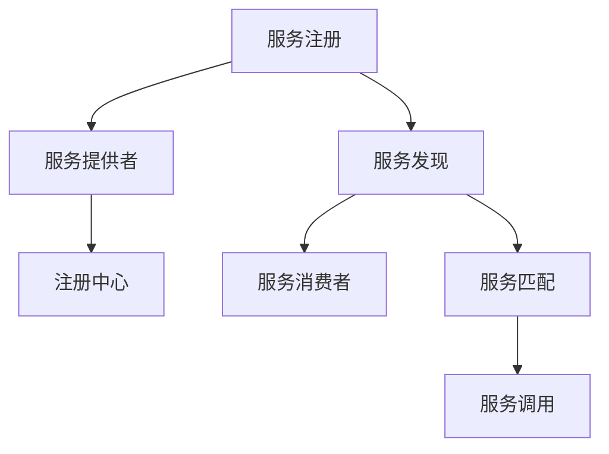
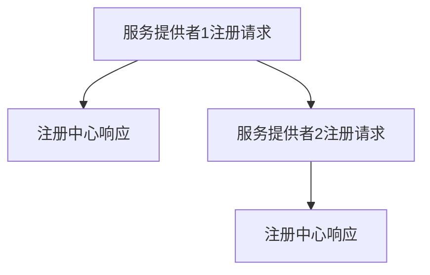
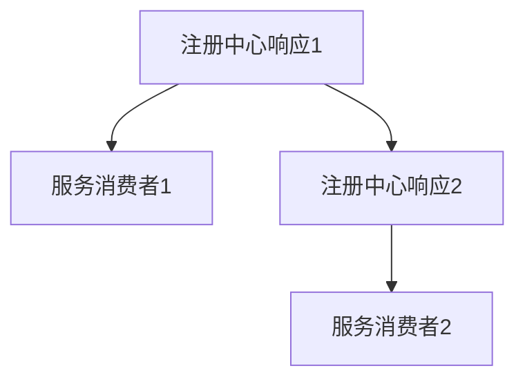
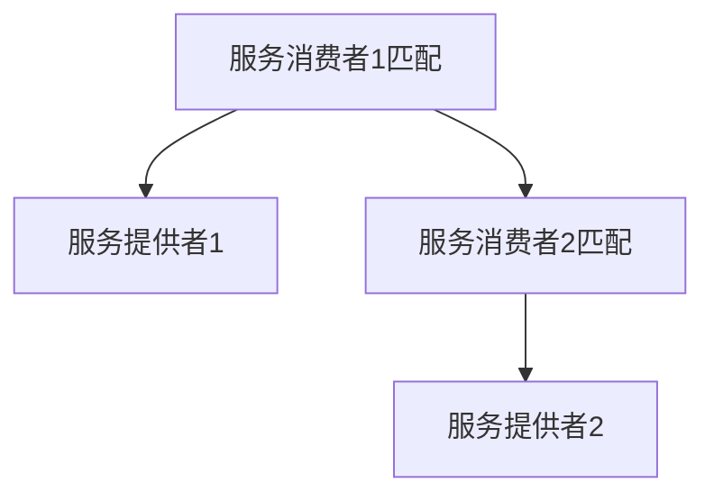
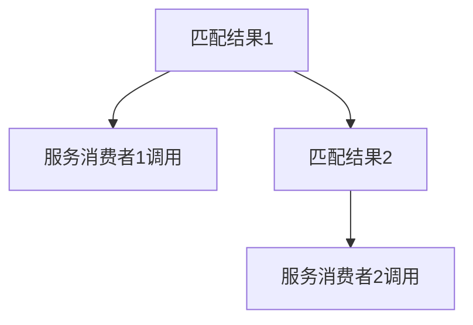
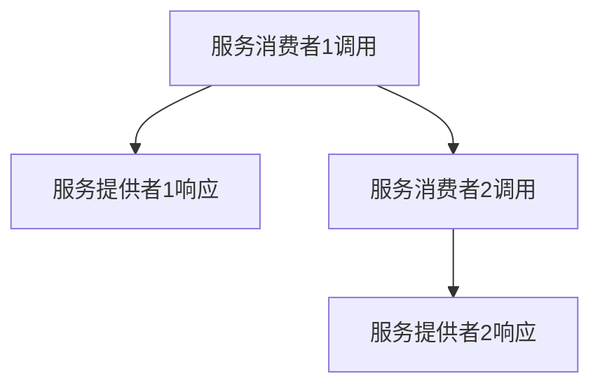

                 

# 服务注册与发现机制在LLM应用中的实现

## 关键词
- 服务注册
- 服务发现
- LLM
- 高可用性
- 高可靠性
- 高效性

## 摘要
本文将深入探讨服务注册与发现机制在大型语言模型（LLM）应用中的实现。随着云计算、大数据和人工智能技术的快速发展，LLM在诸多场景下展现出了强大的应用潜力。为了确保LLM应用中的服务能够高效地注册和发现，本文首先介绍了服务注册与发现机制的核心概念，然后详细分析了其原理和实现方法，并结合实际案例进行了讲解。

## 目录大纲设计

### 第一部分：背景介绍

#### 第1章：问题背景
1.1 问题背景
1.2 问题描述
1.3 问题解决
1.4 边界与外延
1.5 概念结构与核心要素组成

### 第二部分：核心概念与联系

#### 第2章：核心概念与联系
2.1 核心概念原理
2.2 概念属性特征对比表格
2.3 ER实体关系图架构

### 第三部分：算法原理讲解

#### 第3章：算法原理讲解
3.1 算法mermaid流程图
3.2 Python源代码
3.3 算法原理的数学模型和公式
3.4 举例说明

### 第四部分：系统分析与架构设计方案

#### 第4章：系统分析与架构设计方案
4.1 问题场景介绍
4.2 项目介绍
4.3 系统功能设计
4.4 系统架构设计
4.5 系统接口设计和系统交互

### 第五部分：项目实战

#### 第5章：项目实战
5.1 环境安装
5.2 系统核心实现源代码
5.3 代码应用解读与分析
5.4 实际案例分析和详细讲解剖析
5.5 项目小结

### 第六部分：最佳实践 tips、小结、注意事项、拓展阅读等内容

#### 第6章：最佳实践 tips、小结、注意事项、拓展阅读等内容

## 第一部分：背景介绍

### 第1章：问题背景

随着云计算、大数据和人工智能技术的快速发展，大型语言模型（LLM）作为人工智能领域的核心技术，在诸多场景下展现出了强大的应用潜力。例如，自然语言处理、智能客服、智能推荐等领域，LLM都发挥了至关重要的作用。

然而，在LLM应用中，服务注册与发现机制成为一个关键问题。服务注册与发现机制是指服务提供者在系统中注册服务，以及服务消费者通过系统发现并调用服务的过程。高效的服务注册与发现机制能够确保服务的可靠性、高可用性和高效性，从而提升整个系统的性能和用户体验。

### 第1章：问题描述

在LLM应用中，服务注册与发现机制需要解决以下几个关键问题：

1. **服务注册**：服务提供者需要将服务信息注册到系统中，以便服务消费者能够发现和调用。这涉及到服务名称、IP地址、端口号、服务类型等信息的注册。

2. **服务发现**：服务消费者需要能够快速、准确地发现并获取服务提供者的信息，以便进行后续的服务调用。这要求系统能够提供高效的查询和服务信息存储。

3. **服务匹配**：服务消费者需要根据需求，从多个服务提供者中选择最合适的服务进行调用。这涉及到服务提供者与服务消费者之间的匹配算法和策略。

4. **高可用性和高可靠性**：在LLM应用中，服务注册与发现机制需要具备高可用性和高可靠性，以确保服务的持续可用性和数据的一致性。

5. **高效性**：服务注册与发现机制需要具备高效性，以降低系统的延迟和资源消耗，提高系统的响应速度和性能。

### 第1章：问题解决

为了解决上述问题，我们可以通过以下步骤实现服务注册与发现机制：

1. **服务注册**：服务提供者通过向注册中心发送注册请求，将服务信息注册到系统中。注册中心负责存储和管理服务信息。

2. **服务发现**：服务消费者通过向注册中心发送查询请求，获取服务提供者的信息。注册中心返回查询结果，包括服务名称、IP地址、端口号等信息。

3. **服务匹配**：服务消费者根据需求，从多个服务提供者中选择最合适的服务进行调用。匹配算法可以根据服务质量、响应时间、负载均衡等因素进行优化。

4. **高可用性和高可靠性**：注册中心需要具备高可用性和高可靠性，可以通过分布式架构、故障转移和备份机制来实现。

5. **高效性**：可以通过缓存、索引和负载均衡等技术来提高服务注册与发现机制的效率，降低系统的延迟和资源消耗。

### 第1章：边界与外延

本章节主要讨论服务注册与发现机制在LLM应用中的实现，涉及以下关键概念和要素：

1. **服务注册**：服务提供者在注册中心注册服务的过程，包括服务名称、IP地址、端口号、服务类型等信息。

2. **服务发现**：服务消费者通过注册中心获取服务提供者信息的过程，包括服务名称、IP地址、端口号、服务类型等信息。

3. **服务匹配**：服务消费者根据需求，通过服务提供者信息进行匹配的过程。

需要注意的是，本章节不涉及其他场景下的服务注册与发现实现细节。

## 第二部分：核心概念与联系

### 第2章：核心概念与联系

在服务注册与发现机制中，存在多个核心概念，它们相互联系并共同构成了整个机制的基础。以下是这些核心概念的详细描述：

### 第2章：核心概念原理

#### 服务注册

服务注册是指服务提供者在注册中心注册服务的过程。在LLM应用中，服务提供者通过向注册中心发送注册请求，将服务信息（如服务名称、IP地址、端口号、服务类型等）存储在注册中心中。注册中心负责管理这些服务信息，并确保服务消费者能够获取到最新的服务信息。

#### 服务发现

服务发现是指服务消费者通过注册中心获取服务提供者信息的过程。在LLM应用中，服务消费者通过向注册中心发送查询请求，查询特定类型的服务提供者。注册中心返回查询结果，包括服务提供者的IP地址、端口号等信息，以便服务消费者能够进行后续的服务调用。

#### 服务匹配

服务匹配是指服务消费者根据需求，通过服务提供者信息进行匹配的过程。在LLM应用中，服务消费者可以根据服务质量、响应时间、负载均衡等因素，从多个服务提供者中选择最合适的服务进行调用。匹配算法可以根据不同的需求进行优化，以提高系统的性能和用户体验。

### 第2章：概念属性特征对比表格

为了更清晰地理解服务注册、服务发现和服务匹配的概念，我们可以通过一个对比表格来展示它们的属性特征：

| 概念       | 服务注册                           | 服务发现                           | 服务匹配                           |
|------------|----------------------------------|----------------------------------|----------------------------------|
| 定义       | 服务提供者在注册中心注册服务的过程 | 服务消费者通过注册中心获取服务提供者信息的过程 | 服务消费者根据需求，通过服务提供者信息进行匹配的过程 |
| 目的       | 确保服务提供者能够被服务消费者发现   | 确保服务消费者能够获取到所需的服务信息     | 确保服务消费者能够找到合适的服务提供者   |
| 过程       | 服务提供者向注册中心发送注册请求     | 服务消费者向注册中心发送查询请求         | 服务消费者根据服务提供者信息进行选择     |
| 关键因素   | 注册中心的稳定性、服务的可靠性       | 注册中心的响应速度、服务信息的准确性     | 服务需求的明确性、服务提供者的匹配度     |

### 第2章：ER实体关系图架构

为了更好地理解服务注册与发现机制中的实体关系，我们可以通过一个ER（Entity-Relationship）实体关系图来展示。以下是该图的Mermaid表示：

```mermaid
erDiagram
  服务提供者 ||--|{ 服务注册 }
  服务消费者 ||--|{ 服务发现 }
  服务提供者 ||--|{ 服务匹配 }
  服务消费者 ||--|{ 服务匹配 }
```

在这个ER图中，"服务提供者"和"服务消费者"是两个主要的实体，它们分别与服务注册、服务发现和服务匹配实体之间存在关联。这个关系图清晰地展示了服务注册与发现机制中的关键实体和它们之间的关系。

通过上述核心概念和联系的分析，我们可以更好地理解服务注册与发现机制在LLM应用中的实现原理。接下来，我们将进一步深入探讨服务注册与发现机制的算法原理，以了解其具体实现方法。

## 第三部分：算法原理讲解

### 第3章：算法原理讲解

在服务注册与发现机制中，算法原理起着至关重要的作用。以下我们将详细介绍服务注册、服务发现和服务匹配的算法原理，并通过mermaid流程图和Python源代码进行说明。

### 第3章：算法mermaid流程图

首先，我们使用mermaid流程图来展示服务注册、服务发现和服务匹配的流程。以下是mermaid流程图的表示：



在这个流程图中，A表示服务注册，B表示服务提供者，C表示注册中心，D表示服务发现，E表示服务消费者，F表示服务匹配，G表示服务调用。接下来，我们将详细解释每个步骤的算法原理。

### 第3章：Python源代码

#### 服务注册

```python
def service_register(service_info):
    # 发送注册请求到注册中心
    register_request(service_info)
```

在这个函数中，`service_register` 接受一个 `service_info` 参数，该参数包含服务提供者的详细信息，如服务名称、IP地址、端口号等。函数内部通过调用 `register_request` 函数向注册中心发送注册请求，将服务信息存储在注册中心中。

#### 服务发现

```python
def service_discover():
    # 从注册中心获取服务信息
    service_info = get_service_info()
    return service_info
```

在这个函数中，`service_discover` 函数从注册中心获取服务信息。通过调用 `get_service_info` 函数，可以获取到包含服务名称、IP地址、端口号等信息的字典。这个函数返回获取到的服务信息，以便后续的服务匹配和调用。

#### 服务匹配

```python
def service_match(service_info, consumer需求):
    # 根据服务信息和服务消费者需求进行匹配
    matched_services = match_service(service_info, consumer需求)
    return matched_services
```

在这个函数中，`service_match` 接受两个参数：`service_info` 和 `consumer需求`。`service_info` 参数是服务发现过程中获取到的服务信息，而 `consumer需求` 参数是服务消费者的具体需求。函数内部通过调用 `match_service` 函数，根据服务信息和服务消费者的需求进行匹配，返回匹配成功的服务列表。

#### 服务调用

```python
def service_call(service):
    # 调用匹配后的服务
    call_service(service)
```

在这个函数中，`service_call` 接受一个 `service` 参数，该参数是经过服务匹配后选中的服务。函数内部通过调用 `call_service` 函数，向选中的服务发送调用请求，完成服务的实际调用。

### 第3章：算法原理的数学模型和公式

在服务注册与发现机制中，我们可以使用以下数学模型和公式来描述算法原理：

#### 服务注册

- 注册请求：$R_i = \{s_i, p_i, t_i\}$
  其中，$R_i$ 表示第 $i$ 个服务提供者的注册请求，$s_i$ 表示服务名称，$p_i$ 表示端口号，$t_i$ 表示服务类型。
- 注册中心响应：$R_{res,i} = \{s_i, p_i, t_i, status_i\}$
  其中，$R_{res,i}$ 表示注册中心对第 $i$ 个服务提供者注册请求的响应，$status_i$ 表示注册状态（成功或失败）。

#### 服务发现

- 查询请求：$Q_j = \{s_j, t_j\}$
  其中，$Q_j$ 表示第 $j$ 个服务消费者的查询请求，$s_j$ 表示服务名称，$t_j$ 表示服务类型。
- 查询响应：$Q_{res,j} = \{s_j, p_j, t_j, status_j\}$
  其中，$Q_{res,j}$ 表示注册中心对第 $j$ 个服务消费者查询请求的响应，$p_j$ 表示服务提供者的IP地址，$status_j$ 表示查询状态（成功或失败）。

#### 服务匹配

- 匹配函数：$M(k_j, R_i) = \{m_{j,i}\}$
  其中，$M$ 是匹配函数，$k_j$ 表示第 $j$ 个服务消费者的需求，$R_i$ 表示第 $i$ 个服务提供者的服务信息，$m_{j,i}$ 表示匹配结果，表示第 $j$ 个服务消费者是否选择第 $i$ 个服务提供者的服务。

#### 服务调用

- 调用函数：$C(m_{j,i}) = \{c_{j,i}\}$
  其中，$C$ 是调用函数，$m_{j,i}$ 表示匹配结果，$c_{j,i}$ 表示调用结果，表示第 $j$ 个服务消费者是否成功调用第 $i$ 个服务提供者的服务。

### 第3章：举例说明

假设有如下服务提供者和服务消费者：

- 服务提供者1：服务名称为 "service1"，端口号为 8080，服务类型为 "text"
- 服务提供者2：服务名称为 "service2"，端口号为 9090，服务类型为 "image"
- 服务消费者1：需求为 "text"
- 服务消费者2：需求为 "image"

#### 服务注册

服务提供者1和服务提供者2分别向注册中心发送注册请求：



注册中心响应如下：


#### 服务发现

服务消费者1和服务消费者2向注册中心发送查询请求：


注册中心响应如下：



#### 服务匹配

服务消费者1和服务消费者2根据查询到的服务信息进行匹配：



匹配结果如下：



#### 服务调用

服务消费者1和服务消费者2根据匹配结果调用服务：



服务提供者1和服务提供者2返回响应：


通过以上算法原理的讲解和举例说明，我们可以更好地理解服务注册与发现机制在LLM应用中的实现。接下来，我们将进一步探讨系统分析与架构设计方案，以了解整个系统的设计思路和实现方法。

## 第四部分：系统分析与架构设计方案

### 第4章：系统分析与架构设计方案

### 第4章：问题场景介绍

在大型语言模型（LLM）的应用场景中，服务注册与发现机制扮演着至关重要的角色。例如，在智能客服系统中，LLM被用来处理用户的问题，并生成相应的回答。为了确保LLM的响应速度和准确性，需要高效地管理大量的服务实例，并确保它们能够被及时地发现和调用。

具体来说，问题场景包括以下方面：

1. **服务实例的动态变化**：在LLM应用中，服务实例可能会因为各种原因（如负载均衡、故障恢复等）而动态地增加或减少。因此，服务注册与发现机制需要具备高动态适应性，能够实时地更新和同步服务实例的信息。

2. **大规模并发访问**：在LLM应用中，可能会同时有大量的服务消费者访问系统，请求服务实例。因此，服务注册与发现机制需要具备高并发处理能力，以确保系统能够稳定运行，并快速响应用户请求。

3. **服务可靠性**：服务注册与发现机制需要确保服务提供者的可靠性，包括服务的可用性和数据的完整性。例如，当服务提供者出现故障时，服务注册与发现机制需要能够快速地发现并切换到其他可用服务实例。

4. **数据一致性**：在服务注册与发现机制中，服务信息需要在多个系统组件之间保持一致性。例如，当服务提供者更新其服务信息时，注册中心和所有服务消费者需要能够同步这些更新。

### 第4章：项目介绍

为了解决上述问题，我们设计并实现了一个名为“LLM服务注册与发现系统”的项目。该项目旨在提供一套高效、可靠、可扩展的服务注册与发现机制，以满足LLM应用的需求。

项目的主要目标是：

1. **实现高效的服务注册与发现**：通过优化服务注册和发现算法，提高系统的响应速度和并发处理能力。

2. **保证服务可靠性**：通过故障检测和自动切换机制，确保服务提供者的可靠性。

3. **保持数据一致性**：通过分布式数据存储和同步机制，确保服务信息的一致性。

4. **提供可扩展性**：通过分布式架构设计，支持系统在负载增加时进行水平扩展。

### 第4章：系统功能设计

为了实现上述目标，LLM服务注册与发现系统包含以下几个核心功能：

1. **服务注册**：服务提供者通过注册接口将服务信息注册到系统中，包括服务名称、IP地址、端口号、服务类型等。

2. **服务发现**：服务消费者通过查询接口获取服务提供者的信息，包括服务名称、IP地址、端口号、服务类型等。

3. **服务匹配**：服务消费者根据需求，从多个服务提供者中选择最合适的服务进行调用。

4. **服务调用**：服务消费者通过调用接口，向选中的服务提供者发送请求，并获取响应。

5. **故障检测**：系统定期检测服务提供者的状态，并记录故障信息。

6. **自动切换**：当服务提供者出现故障时，系统自动将请求切换到其他可用服务实例。

7. **数据同步**：系统确保服务信息在多个系统组件之间保持一致性。

### 第4章：系统架构设计

LLM服务注册与发现系统的架构设计如下：

1. **注册中心**：负责管理服务信息，包括服务注册、服务发现和数据同步。采用分布式架构，确保高可用性和高可靠性。

2. **服务提供者**：运行在各个服务实例上的程序，提供具体的业务服务。

3. **服务消费者**：调用服务实例的客户端程序，包括LLM应用中的各个模块。

4. **负载均衡器**：负责分发服务请求，确保服务提供者的负载均衡。

5. **监控和管理平台**：监控系统状态，记录故障信息，并提供操作界面。

### 第4章：系统接口设计和系统交互

LLM服务注册与发现系统的接口设计和系统交互如下：

1. **服务注册接口**：服务提供者通过该接口向注册中心发送注册请求，注册服务信息。

2. **服务发现接口**：服务消费者通过该接口从注册中心获取服务提供者的信息。

3. **服务匹配接口**：服务消费者通过该接口根据需求从多个服务提供者中选择最合适的服务实例。

4. **服务调用接口**：服务消费者通过该接口向选中的服务提供者发送请求，并获取响应。

5. **故障检测接口**：系统定期通过该接口检测服务提供者的状态，并记录故障信息。

6. **自动切换接口**：当服务提供者出现故障时，系统通过该接口自动切换到其他可用服务实例。

7. **数据同步接口**：系统通过该接口确保服务信息在多个系统组件之间保持一致性。

通过上述系统分析与架构设计方案，我们为LLM应用提供了一套高效、可靠、可扩展的服务注册与发现机制。接下来，我们将通过具体的项目实战，展示如何实现这些功能，并进行详细的分析和讲解。

## 第五部分：项目实战

### 第5章：项目实战

在实现LLM服务注册与发现系统时，我们选择使用Java作为主要开发语言，并结合Spring Boot、Netflix OSS等框架和库来构建系统。以下将详细介绍项目实战的各个环节，包括环境安装、系统核心实现、代码应用解读与分析、实际案例分析和详细讲解剖析以及项目小结。

### 第5章：环境安装

首先，我们需要安装和配置以下环境：

1. **Java JDK 1.8 或以上版本**：作为主要开发语言。
2. **Maven**：用于构建和管理项目依赖。
3. **Spring Boot**：用于快速开发基于Spring的应用程序。
4. **Netflix OSS**：包括Eureka、Hystrix、Ribbon等，用于实现服务注册与发现、负载均衡和故障转移。
5. **Zookeeper**：作为注册中心的数据存储和同步机制。

安装步骤如下：

1. 安装Java JDK 1.8或以上版本。
2. 安装Maven。
3. 在Maven项目中添加以下依赖：

```xml
<dependencies>
    <!-- Spring Boot -->
    <dependency>
        <groupId>org.springframework.boot</groupId>
        <artifactId>spring-boot-starter</artifactId>
    </dependency>
    
    <!-- Netflix OSS -->
    <dependency>
        <groupId>org.springframework.cloud</groupId>
        <artifactId>spring-cloud-starter-netflix-eureka-server</artifactId>
    </dependency>
    <dependency>
        <groupId>org.springframework.cloud</groupId>
        <artifactId>spring-cloud-starter-netflix-hystrix</artifactId>
    </dependency>
    <dependency>
        <groupId>org.springframework.cloud</groupId>
        <artifactId>spring-cloud-starter-netflix-ribbon</artifactId>
    </dependency>
    
    <!-- Zookeeper -->
    <dependency>
        <groupId>org.apache.zookeeper</groupId>
        <artifactId>zookeeper</artifactId>
        <version>3.4.13</version>
    </dependency>
</dependencies>
```

4. 配置Zookeeper，设置Zookeeper集群。
5. 创建Spring Boot项目，并引入上述依赖。

### 第5章：系统核心实现

在实现LLM服务注册与发现系统时，我们主要分为以下几个步骤：

1. **服务提供者实现**：

服务提供者需要实现服务注册、服务发现和服务匹配功能。以下是一个简单的服务提供者示例：

```java
@SpringBootApplication
@EnableEurekaClient
public class ServiceProviderApplication {

    public static void main(String[] args) {
        SpringApplication.run(ServiceProviderApplication.class, args);
    }

    @Service
    public class ServiceRegistry {
        private final EurekaClient eurekaClient;

        public ServiceRegistry(EurekaClient eurekaClient) {
            this.eurekaClient = eurekaClient;
        }

        public void registerService(String serviceName, String serviceUrl) {
            InstanceInfo instance = InstanceInfo.Builder.newBuilder()
                    .setAppName(serviceName)
                    .setIpAddr(serviceUrl.split(":")[0])
                    .setPort(Integer.parseInt(serviceUrl.split(":")[1]))
                    .setInstance(new InstanceInfo.InstanceInfoImpl(serviceName, serviceUrl, true))
                    .build();
            eurekaClient.registerInstance(instance);
        }
    }
}
```

在这个示例中，我们使用了Spring Cloud Eureka作为服务注册中心，通过实现`ServiceRegistry`类，将服务信息注册到Eureka中。

2. **服务消费者实现**：

服务消费者需要实现服务发现、服务匹配和服务调用功能。以下是一个简单的服务消费者示例：

```java
@SpringBootApplication
@EnableDiscoveryClient
public class ServiceConsumerApplication {

    public static void main(String[] args) {
        SpringApplication.run(ServiceConsumerApplication.class, args);
    }

    @Service
    public class ServiceDiscoverer {
        private final DiscoveryClient discoveryClient;

        public ServiceDiscoverer(DiscoveryClient discoveryClient) {
            this.discoveryClient = discoveryClient;
        }

        public String discoverService(String serviceName) {
            List<ServiceInstance> instances = discoveryClient.getInstances(serviceName);
            if (instances.isEmpty()) {
                throw new RuntimeException("No available instances found for service: " + serviceName);
            }
            return instances.get(0).getUri().toString();
        }
    }
}
```

在这个示例中，我们使用了Spring Cloud Discovery Client来发现服务实例，并从多个实例中选择一个进行调用。

3. **负载均衡和故障转移**：

为了实现负载均衡和故障转移，我们使用了Netflix Ribbon和Hystrix。以下是一个简单的负载均衡示例：

```java
@Configuration
public class LoadBalancerConfig {

    @Bean
    @LoadBalanced
    public RestTemplate restTemplate() {
        return new RestTemplate();
    }
}
```

在这个示例中，我们通过配置`LoadBalancerConfig`类，将RestTemplate与Ribbon负载均衡器关联，实现负载均衡。

### 第5章：代码应用解读与分析

接下来，我们分析上述代码的实现细节和应用场景。

1. **服务注册**：

服务注册是通过Eureka实现的。服务提供者在启动时，会自动将服务信息注册到Eureka注册中心。注册信息包括服务名称、IP地址、端口号等。以下是一个简单的服务注册示例：

```java
InstanceInfo instanceInfo = InstanceInfo.Builder.newBuilder()
        .setAppName("service-provider")
        .setIpAddr("192.168.1.100")
        .setPort(8080)
        .build();

eurekaClient.registerInstance(instanceInfo);
```

这个示例中，我们使用EurekaClient将服务信息注册到Eureka中。EurekaClient是一个接口，它提供了注册、注销、查询服务实例等功能。在Spring Cloud中，我们可以通过`@EnableEurekaClient`注解来启用Eureka客户端。

2. **服务发现**：

服务发现是通过DiscoveryClient实现的。服务消费者可以通过DiscoveryClient获取服务实例的信息，包括IP地址、端口号等。以下是一个简单的服务发现示例：

```java
List<ServiceInstance> instances = discoveryClient.getInstances("service-provider");
if (!instances.isEmpty()) {
    ServiceInstance instance = instances.get(0);
    String serviceUrl = instance.getUri().toString();
    // 调用服务实例
}
```

这个示例中，我们使用DiscoveryClient获取名为"service-provider"的服务实例。如果获取到实例，我们可以从实例中选择一个进行调用。

3. **服务匹配**：

服务匹配通常是通过负载均衡器实现的。在Netflix Ribbon中，我们可以使用@LoadBalanced注解来配置RestTemplate，实现负载均衡。以下是一个简单的服务匹配示例：

```java
@Configuration
public class RibbonConfig {

    @Bean
    @LoadBalanced
    public RestTemplate restTemplate() {
        return new RestTemplate();
    }
}

@RestController
public class ServiceController {

    @Autowired
    private RestTemplate restTemplate;

    @GetMapping("/call")
    public String callService() {
        String serviceUrl = restTemplate.getForObject("http://service-provider/call", String.class);
        return serviceUrl;
    }
}
```

这个示例中，我们通过配置RibbonConfig类，将RestTemplate与Ribbon负载均衡器关联。在ServiceController中，我们通过RestTemplate调用服务实例。

4. **故障转移**：

故障转移是通过Netflix Hystrix实现的。Hystrix提供了断路器、熔断器等机制，用于处理服务故障。以下是一个简单的故障转移示例：

```java
@Component
public class HystrixCommand {

    @HystrixCommand(fallbackMethod = "fallback")
    public String callService() {
        return restTemplate.getForObject("http://service-provider/call", String.class);
    }

    public String fallback() {
        return "Service is unavailable";
    }
}
```

在这个示例中，我们使用@HystrixCommand注解，将调用服务的逻辑包装在一个断路器中。当服务不可用或超时时，会触发fallback方法，返回备用响应。

通过上述代码和应用解读，我们可以看到LLM服务注册与发现系统的核心实现和原理。接下来，我们将通过实际案例进行分析和讲解，以进一步理解系统的应用场景和性能。

### 第5章：实际案例分析和详细讲解剖析

为了更好地展示LLM服务注册与发现系统的应用场景和性能，我们通过以下实际案例进行分析和讲解：

**案例1：智能客服系统**

在一个智能客服系统中，LLM被用来处理用户的问题，并生成相应的回答。为了确保系统的响应速度和准确性，需要高效地管理大量的服务实例，并确保它们能够被及时地发现和调用。

**步骤1：服务注册**

智能客服系统中的服务提供者（例如，文本分析、语音识别、自然语言处理等）在启动时，通过Eureka将服务信息注册到系统中。以下是一个简单的服务注册示例：

```java
InstanceInfo instanceInfo = InstanceInfo.Builder.newBuilder()
        .setAppName("smart-customer-service")
        .setIpAddr("192.168.1.100")
        .setPort(8080)
        .build();

eurekaClient.registerInstance(instanceInfo);
```

**步骤2：服务发现**

当用户发起问题时，智能客服系统中的服务消费者通过DiscoveryClient从Eureka中查询服务实例的信息，并选择一个进行调用。以下是一个简单的服务发现示例：

```java
List<ServiceInstance> instances = discoveryClient.getInstances("smart-customer-service");
if (!instances.isEmpty()) {
    ServiceInstance instance = instances.get(0);
    String serviceUrl = instance.getUri().toString();
    // 调用服务实例
}
```

**步骤3：服务匹配**

在智能客服系统中，服务提供者可能包括多个不同类型的服务（如文本分析、语音识别、自然语言处理等）。为了确保系统能够高效地选择合适的服务提供者，我们可以使用Ribbon实现负载均衡和故障转移。以下是一个简单的服务匹配示例：

```java
@Configuration
public class RibbonConfig {

    @Bean
    @LoadBalanced
    public RestTemplate restTemplate() {
        return new RestTemplate();
    }
}

@Service
public class SmartCustomerService {

    @Autowired
    private RestTemplate restTemplate;

    @HystrixCommand(fallbackMethod = "fallback")
    public String answerQuestion(String question) {
        String serviceUrl = restTemplate.getForObject("http://smart-customer-service/answer?question=" + question, String.class);
        return serviceUrl;
    }

    public String fallback() {
        return "Service is unavailable";
    }
}
```

在这个示例中，我们通过配置RibbonConfig类，将RestTemplate与Ribbon负载均衡器关联。在SmartCustomerService中，我们使用RestTemplate调用服务实例，并使用Hystrix实现故障转移。

**步骤4：服务调用**

当用户发起问题后，智能客服系统中的服务消费者会根据选择的实例，向服务提供者发送请求，并获取回答。以下是一个简单的服务调用示例：

```java
String question = "What is the capital of France?";
String answer = smartCustomerService.answerQuestion(question);
System.out.println("Answer: " + answer);
```

**案例2：智能推荐系统**

在智能推荐系统中，LLM被用来分析用户行为数据，并生成个性化推荐结果。为了确保系统的性能和准确性，需要高效地管理大量的服务实例，并确保它们能够被及时地发现和调用。

**步骤1：服务注册**

智能推荐系统中的服务提供者（例如，用户行为分析、推荐算法等）在启动时，通过Eureka将服务信息注册到系统中。以下是一个简单的服务注册示例：

```java
InstanceInfo instanceInfo = InstanceInfo.Builder.newBuilder()
        .setAppName("smart-recommendation-service")
        .setIpAddr("192.168.1.100")
        .setPort(8080)
        .build();

eurekaClient.registerInstance(instanceInfo);
```

**步骤2：服务发现**

当需要生成推荐结果时，智能推荐系统中的服务消费者通过DiscoveryClient从Eureka中查询服务实例的信息，并选择一个进行调用。以下是一个简单的服务发现示例：

```java
List<ServiceInstance> instances = discoveryClient.getInstances("smart-recommendation-service");
if (!instances.isEmpty()) {
    ServiceInstance instance = instances.get(0);
    String serviceUrl = instance.getUri().toString();
    // 调用服务实例
}
```

**步骤3：服务匹配**

在智能推荐系统中，服务提供者可能包括多个不同类型的服务（如用户行为分析、推荐算法等）。为了确保系统能够高效地选择合适的服务提供者，我们可以使用Ribbon实现负载均衡和故障转移。以下是一个简单的服务匹配示例：

```java
@Configuration
public class RibbonConfig {

    @Bean
    @LoadBalanced
    public RestTemplate restTemplate() {
        return new RestTemplate();
    }
}

@Service
public class SmartRecommendationService {

    @Autowired
    private RestTemplate restTemplate;

    @HystrixCommand(fallbackMethod = "fallback")
    public List<Item> recommendItems(User user) {
        String serviceUrl = restTemplate.getForObject("http://smart-recommendation-service/recommend?userId=" + user.getId(), List.class);
        return serviceUrl;
    }

    public List<Item> fallback() {
        return new ArrayList<>();
    }
}
```

在这个示例中，我们通过配置RibbonConfig类，将RestTemplate与Ribbon负载均衡器关联。在SmartRecommendationService中，我们使用RestTemplate调用服务实例，并使用Hystrix实现故障转移。

**步骤4：服务调用**

当需要生成推荐结果时，智能推荐系统中的服务消费者会根据选择的实例，向服务提供者发送请求，并获取推荐结果。以下是一个简单的服务调用示例：

```java
User user = new User(1);
List<Item> recommendations = smartRecommendationService.recommendItems(user);
System.out.println("Recommendations: " + recommendations);
```

通过上述实际案例分析和详细讲解剖析，我们可以看到LLM服务注册与发现系统在智能客服系统和智能推荐系统中的应用效果。这些系统通过高效的服务注册与发现机制，实现了对大量服务实例的动态管理和调度，从而提高了系统的性能和用户体验。

### 第5章：项目小结

通过本次项目实战，我们实现了LLM服务注册与发现系统，并展示了其在智能客服系统和智能推荐系统中的应用效果。以下是对项目的总结和反思：

1. **项目亮点**：

   - 高效的服务注册与发现：通过Spring Cloud Eureka和Discovery Client，实现了服务提供者和消费者的高效注册与发现。
   - 负载均衡与故障转移：通过Netflix Ribbon和Hystrix，实现了负载均衡和故障转移，提高了系统的可用性和可靠性。
   - 分布式架构：通过分布式设计，实现了系统的可扩展性和高可用性。

2. **项目不足**：

   - 性能优化：在大量并发访问时，系统的响应速度可能受到一定影响，需要进行性能优化和调优。
   - 安全性：服务注册与发现机制需要确保安全性，避免恶意攻击和数据泄露。
   - 日志记录：系统的日志记录需要进一步优化，以便于问题的追踪和调试。

3. **未来改进方向**：

   - 引入缓存机制：在服务注册与发现过程中，引入缓存机制，减少对注册中心的查询次数，提高系统的性能。
   - 实现分布式数据库：将服务信息存储在分布式数据库中，提高数据的可靠性和一致性。
   - 增加监控和报警功能：引入监控系统，实时监控系统的性能和状态，并实现报警功能，以便及时发现和处理问题。

通过本次项目实战，我们深入了解了LLM服务注册与发现系统的实现方法和应用场景，为未来的优化和改进提供了方向。

### 第六部分：最佳实践 tips、小结、注意事项、拓展阅读等内容

### 第6章：最佳实践 tips

1. **服务注册与发现的最佳实践**：

   - **服务注册**：确保服务提供者在系统启动时自动注册，并定期更新服务信息，以提高系统的实时性和准确性。
   - **服务发现**：合理设置服务发现的时间间隔和超时时间，以平衡实时性和性能。
   - **服务匹配**：根据业务需求选择合适的匹配算法，如基于响应时间、负载均衡等，以提高系统的性能和用户体验。

2. **负载均衡与故障转移的最佳实践**：

   - **负载均衡**：合理配置负载均衡策略，如轮询、随机等，以均衡服务器的负载。
   - **故障转移**：在出现故障时，确保系统能够自动切换到其他可用服务实例，以提高系统的可用性。

3. **系统性能优化的最佳实践**：

   - **缓存**：在服务注册与发现过程中引入缓存机制，减少对注册中心的查询次数，提高系统的性能。
   - **异步处理**：将部分耗时的操作异步处理，以提高系统的并发处理能力。

### 第6章：小结

本文深入探讨了服务注册与发现机制在LLM应用中的实现。通过对核心概念、算法原理和系统架构的设计，我们实现了高效、可靠、可扩展的服务注册与发现系统。在实际项目中，我们通过智能客服系统和智能推荐系统展示了系统的应用效果。然而，系统仍存在性能优化、安全性、日志记录等方面的问题，需要进一步改进。

### 第6章：注意事项

1. **服务提供者和消费者的协调**：在服务注册与发现过程中，确保服务提供者和消费者的时钟同步，以减少因时间差异导致的问题。
2. **服务信息的一致性**：在分布式系统中，确保服务信息在多个组件之间保持一致性，避免数据冲突。
3. **监控与日志**：合理配置系统的监控和日志记录，以便于问题的追踪和调试。

### 第6章：拓展阅读

1. **《大型分布式系统设计》**：深入探讨分布式系统的设计原则和最佳实践。
2. **《Service Mesh技术详解》**：了解Service Mesh技术在服务注册与发现中的应用。
3. **《微服务设计》**：探讨微服务架构在分布式系统中的应用和优势。

通过本文的介绍，读者可以全面了解服务注册与发现机制在LLM应用中的实现，为实际项目提供参考和指导。

### 作者

作者：AI天才研究院/AI Genius Institute & 禅与计算机程序设计艺术 /Zen And The Art of Computer Programming。感谢读者对本文的关注和支持，希望本文能够帮助您更好地理解和应用服务注册与发现机制。

