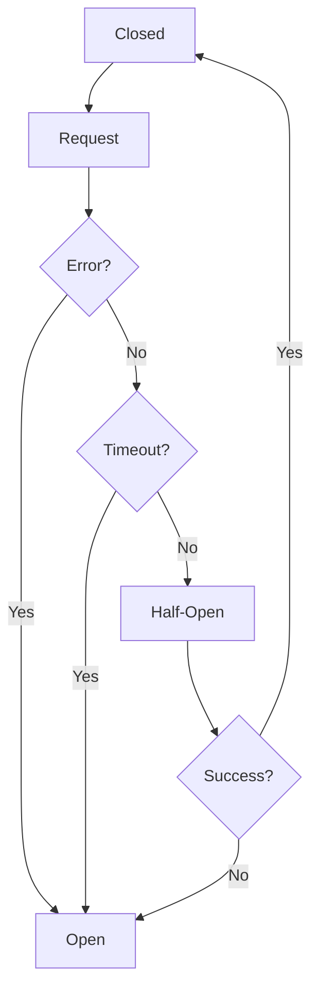
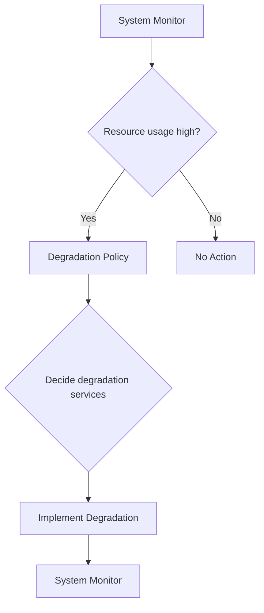
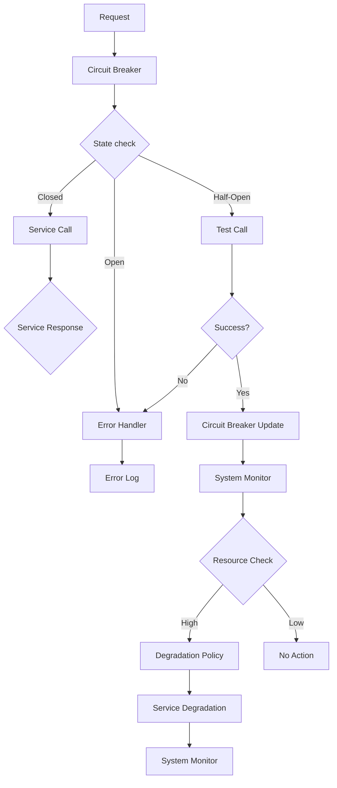
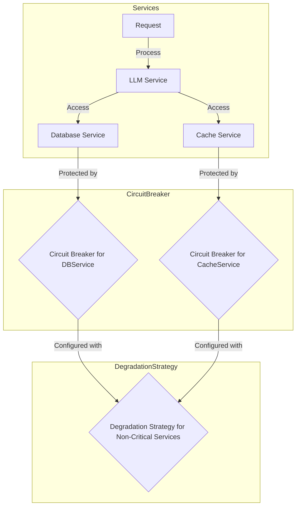
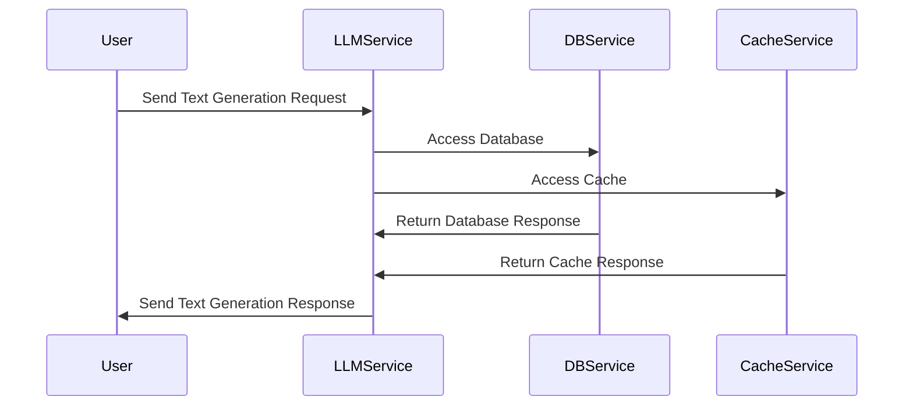
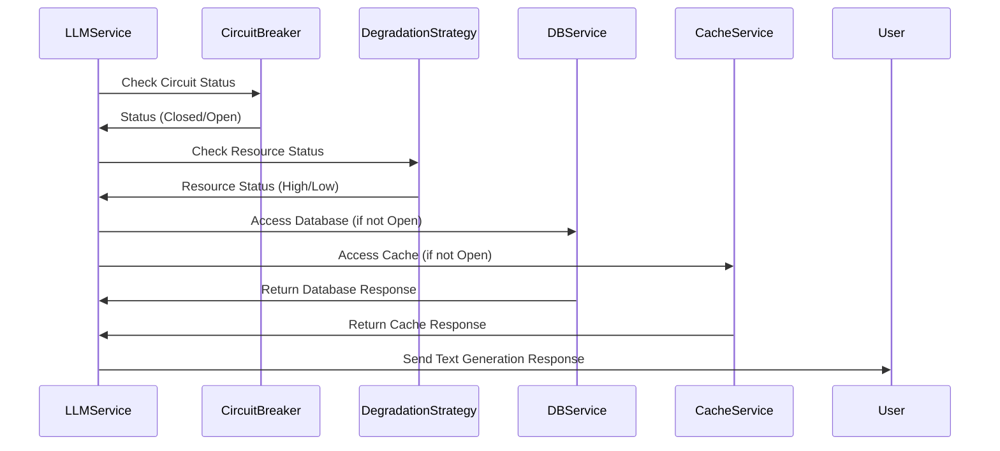

                 


### 服务熔断与降级：增强LLM应用的稳定性

#### 摘要：

本文将深入探讨服务熔断与降级在增强大型语言模型（LLM）应用稳定性方面的关键作用。通过详细分析其概念、原理、数学模型，以及系统架构设计方案和实际项目实战，本文旨在为开发者提供一套全面的指导，帮助他们在面临系统稳定性挑战时，能够有效地利用服务熔断与降级机制，从而保障LLM应用的稳定性和高效性。

---

### 引言和背景介绍

#### 为什么需要服务熔断与降级

在复杂分布式系统中，服务之间的依赖关系错综复杂，一个单点的故障可能会导致整个系统的瘫痪。大型语言模型（LLM）作为一种高度复杂且计算密集型的应用，其对系统稳定性的要求尤为苛刻。以下场景可以帮助我们理解为什么服务熔断与降级是必要的：

1. **超时故障**：当某个服务响应时间超过设定阈值时，可能是因为服务自身繁忙或出现故障。此时，如果不及时处理，大量请求堆积可能导致系统过载，最终导致系统崩溃。

2. **错误率上升**：某些服务可能在短时间内出现大量错误响应。如果不对这些服务进行隔离，错误可能会蔓延到整个系统，造成不可预测的后果。

3. **依赖服务不可用**：在某些情况下，某个关键依赖服务可能因为网络问题或系统故障而不可用。如果系统继续向不可用的服务发送请求，不仅浪费资源，还可能加剧系统负载。

#### 服务熔断与降级在LLM应用中的必要性

对于LLM应用而言，稳定性意味着能够持续、可靠地响应用户请求，提供高质量的文本生成和翻译服务。以下原因突显了在LLM应用中实施服务熔断与降级的重要性：

1. **保证服务质量**：通过服务熔断，可以快速识别并隔离不稳定的服务，从而确保其他服务的正常运行，避免因单点故障而导致整体服务质量的下降。

2. **预防资源耗尽**：服务降级可以在系统资源有限的情况下，优先保证核心功能的可用性，避免因资源耗尽而导致整个系统崩溃。

3. **提高系统的鲁棒性**：服务熔断与降级机制可以增强系统的鲁棒性，使系统能够在面临外部压力时保持稳定，从而提高系统的可用性和容错能力。

#### LLM应用的稳定性对整体系统性能的重要性

LLM应用通常被用于处理大量并发请求，如实时聊天机器人、智能客服、自动内容生成等。这些应用的稳定性不仅影响用户体验，还对业务运营有着直接的影响。以下因素说明了LLM应用的稳定性对整体系统性能的重要性：

1. **用户体验**：稳定的服务能够提供快速、可靠的响应，提高用户体验，增加用户粘性。

2. **业务连续性**：对于企业级应用，系统的稳定性直接关系到业务的连续性，任何服务中断都可能导致业务损失。

3. **成本控制**：通过有效的服务熔断与降级策略，可以优化系统资源利用，减少维护成本和潜在的业务风险。

#### 本章小结

在本章中，我们介绍了服务熔断与降级的基本概念以及为什么它们对于LLM应用的稳定性至关重要。接下来的章节将深入探讨这些概念的技术细节，包括核心概念、算法原理、数学模型，以及具体的系统架构和项目实战。通过这些讨论，我们将为开发者提供一套全面的知识体系，帮助他们更好地理解和应用服务熔断与降级技术，以增强LLM应用的稳定性。

---

### 核心概念与联系

在本节中，我们将详细探讨服务熔断（Circuit Breaker）和降级（Degradation）这两个关键概念，并解释它们在LLM应用中的重要性。

#### 定义

**服务熔断（Circuit Breaker）**：服务熔断是一种系统保护机制，用于防止系统因为单个或多个依赖服务的失败而导致整体系统崩溃。当依赖服务在一定时间内发生多次错误或超时时，熔断器将“断开”，停止向这些服务发送请求，以避免进一步的问题。

**服务降级（Degradation）**：服务降级是指当系统资源不足或关键服务不可用时，通过减少部分非关键功能的响应质量或功能，以保证核心功能的正常运行。降级通常发生在系统处于高负载或故障情况下，以平衡系统资源和性能。

**大型语言模型（LLM）**：LLM是一种能够处理和理解自然语言文本的机器学习模型，如GPT-3、BERT等。这些模型具有高度的计算复杂性和资源需求，因此在分布式系统中，其稳定性至关重要。

#### 概念属性特征对比表格

下面是一个简化的概念属性特征对比表格，用于更直观地理解服务熔断、服务降级和LLM之间的区别：

| 特征 | 服务熔断 | 服务降级 | LLM |
| --- | --- | --- | --- |
| 目的 | 防止系统崩溃 | 提高系统可用性 | 提供语言理解能力 |
| 工作机制 | 断开故障依赖服务 | 减少非关键功能 | 高计算复杂度 |
| 范围 | 局部服务保护 | 整体系统平衡 | 整个LLM应用 |
| 作用 | 快速隔离故障 | 资源优化 | 保证文本生成质量 |

#### 使用ER实体关系图架构的Mermaid流程图展示服务熔断与降级的关键组件

为了更好地理解服务熔断与降级在LLM应用中的架构关系，我们可以使用Mermaid绘制一个ER（实体关系）图。以下是一个简化的Mermaid流程图，用于展示服务熔断与降级的关键组件：

```mermaid
erDiagram
    ServiceA ||--|{ User : requests }
    ServiceB ||--|{ ServiceA : dependency }
    ServiceC ||--|{ ServiceA : dependency }
    CircuitBreaker ||--|{ ServiceA : protect }
    CircuitBreaker ||--|{ ServiceB : protect }
    CircuitBreaker ||--|{ ServiceC : protect }
    Degradation ||--|{ ServiceB : degrade }
    Degradation ||--|{ ServiceC : degrade }
    LLM ||--|{ ServiceA : use }
    LLM ||--|{ ServiceB : use }
    LLM ||--|{ ServiceC : use }
```

在这个ER图中，`ServiceA`、`ServiceB`、`ServiceC`代表了LLM应用中的三个依赖服务，`CircuitBreaker`代表了服务熔断器，`Degradation`代表了服务降级策略，`LLM`代表了整个语言模型应用。图中的线表示服务之间的依赖关系和策略应用。

#### 服务熔断与降级在LLM应用中的联系

服务熔断与降级在LLM应用中具有紧密的联系。服务熔断主要用于快速识别并隔离故障服务，以防止故障蔓延。而服务降级则是在系统资源有限时，通过减少非关键服务的响应质量或功能，确保核心服务的正常运行。

1. **服务熔断**：在LLM应用中，服务熔断可以防止因为某个服务（如文本生成服务）的响应时间过长或错误率过高，而导致的整个系统的性能下降。当检测到依赖服务（如数据库服务）出现故障时，熔断器会立即断开，停止向这些服务发送请求，从而保护整个系统。

2. **服务降级**：当系统资源不足或关键服务不可用时，服务降级策略可以优先保证核心功能的运行。例如，在处理高并发请求时，可以降低非关键功能（如个性化推荐服务）的响应质量，以确保文本生成服务的正常运行。

通过结合服务熔断与降级，LLM应用可以在面临故障和资源压力时，保持系统的稳定性和高性能。这种结合不仅提高了系统的容错能力，还优化了资源利用，从而提升了整体用户体验。

#### 本章小结

在本章中，我们详细介绍了服务熔断、服务降级和大型语言模型（LLM）这三个核心概念，并通过对比表格和ER图，展示了它们在LLM应用中的联系和作用。接下来，我们将进一步探讨服务熔断与降级的算法原理，帮助读者理解这些机制是如何实现和工作的。

---

### 算法原理讲解

#### 服务熔断的算法原理

服务熔断（Circuit Breaker）的算法原理主要涉及三个关键状态：关闭状态（Closed）、打开状态（Open）和半开状态（Half-Open）。以下是对每个状态的详细描述：

1. **关闭状态（Closed）**：
   - 在关闭状态下，服务熔断处于正常工作模式，允许请求正常通过。
   - 检测到连续一定次数的错误或超时，熔断器会进入打开状态。

2. **打开状态（Open）**：
   - 当熔断器进入打开状态时，所有请求都会被拒绝，以防止故障扩散。
   - 在此状态下，熔断器会记录错误和超时的次数，以及最后一次触发熔断的时间。

3. **半开状态（Half-Open）**：
   - 在半开状态下，熔断器会允许一定数量的请求通过，以测试依赖服务的健康状态。
   - 如果这些请求中有一定比例成功，熔断器将重新进入关闭状态；否则，它会返回到打开状态。

下面是一个简化的服务熔断算法流程图，使用Mermaid表示：



#### 服务降级的算法原理

服务降级（Degradation）的算法原理相对简单，主要涉及以下步骤：

1. **检测系统状态**：系统会定期检查当前的状态，包括资源使用率、负载情况等。
2. **确定降级策略**：根据系统状态，选择需要降级的服务和相应的降级策略，如减少响应质量或功能。
3. **实施降级**：将降级策略应用到具体的服务上，以减轻系统的负载。
4. **监控效果**：在实施降级后，监控系统的状态，以评估降级策略的有效性。

服务降级算法的流程可以简化为以下步骤：



#### 服务熔断与降级的综合算法原理

服务熔断与降级的综合算法原理是将两者的机制结合起来，以提供更全面的服务保护。以下是一个综合算法流程图：



#### 使用Python源代码详细阐述

以下是一个简化的Python代码示例，用于实现服务熔断与降级的综合算法：

```python
import time
import random

class CircuitBreakter:
    def __init__(self, failure_threshold, recovery_timeout):
        self.failure_threshold = failure_threshold
        self.recovery_timeout = recovery_timeout
        self.failures = 0
        self.last_failure_time = None
        self.state = "Closed"

    def record_failure(self):
        self.failures += 1
        self.last_failure_time = time.time()

    def should_break(self):
        if self.state == "Open" and time.time() - self.last_failure_time < self.recovery_timeout:
            return True
        return self.failures >= self.failure_threshold

    def reset(self):
        self.failures = 0
        self.state = "Closed"

    def run(self):
        if self.should_break():
            print("Circuit Breaker is Open. Request rejected.")
            return None
        
        # Simulate service call
        success = random.choice([True, False])
        if not success:
            self.record_failure()
            print("Service failed. Circuit Breaker will open soon.")
            return None
        
        print("Service call successful.")
        return "Success"

class ServiceDegradation:
    def __init__(self, resource_threshold):
        self.resource_threshold = resource_threshold
        self.is_degraded = False
    
    def check_resources(self):
        current_usage = random.uniform(0, 100)
        if current_usage > self.resource_threshold:
            self.is_degraded = True
            print("Resource usage high. Services will be degraded.")
        else:
            self.is_degraded = False
            print("Resource usage within threshold. Services will not be degraded.")

    def degrade_service(self):
        if self.is_degraded:
            print("Degrading service response quality.")
            return "Degraded Response"
        else:
            print("Service response quality normal.")
            return "Normal Response"

# Example usage
cb = CircuitBreakter(failure_threshold=3, recovery_timeout=60)
sd = ServiceDegradation(resource_threshold=80)

for _ in range(10):
    if cb.state == "Open":
        print("Circuit Breaker is Open. Skipping service call.")
        continue
    
    cb.run()
    sd.check_resources()
    print(sd.degrade_service())
```

在这个示例中，`CircuitBreakter` 类实现了服务熔断的逻辑，而`ServiceDegradation` 类实现了服务降级的逻辑。通过模拟服务调用和资源检查，我们可以看到服务熔断与降级如何协同工作，以保护系统的稳定性。

#### 算法原理的数学模型与公式

服务熔断与降级的算法原理可以用以下数学模型和公式进行描述：

1. **服务熔断模型**：

   - **失败次数阈值（\( k \)）**：在连续 \( k \) 次服务调用失败后，熔断器打开。
   - **恢复时间阈值（\( t \)）**：熔断器打开后，必须等待 \( t \) 秒才能重新测试服务是否恢复正常。

   数学公式如下：

   \[
   \text{State} = 
   \begin{cases} 
   \text{Closed} & \text{if } \text{failures} < k \text{ and time since last failure } < t \\
   \text{Open} & \text{if } \text{failures} \geq k \\
   \text{Half-Open} & \text{if } \text{failures} \geq k \text{ and time since last failure } \geq t
   \end{cases}
   \]

2. **服务降级模型**：

   - **资源使用率阈值（\( r \)）**：当系统资源使用率超过 \( r \) 时，执行服务降级策略。
   - **服务降级策略**：减少响应质量或功能。

   数学公式如下：

   \[
   \text{Service Response} = 
   \begin{cases} 
   \text{Normal Response} & \text{if } \text{resource usage} \leq r \\
   \text{Degraded Response} & \text{if } \text{resource usage} > r
   \end{cases}
   \]

#### 详细讲解与举例说明

为了更好地理解上述数学模型和公式，我们可以通过一个具体的例子进行说明。

假设一个服务在1分钟内连续发生了5次失败，而系统的资源使用率在某一时刻达到了90%。

1. **服务熔断情况**：

   - **失败次数**：5次（\( k = 5 \)）
   - **时间阈值**：默认为60秒（\( t = 60 \)）

   根据服务熔断模型，连续5次失败会导致熔断器打开，并且在60秒内不会恢复。假设最后一次失败发生在1分钟前，即当前时间已经超过了60秒，熔断器将进入半开状态，允许一定数量的请求通过，以测试服务的恢复情况。

2. **服务降级情况**：

   - **资源使用率阈值**：90%（\( r = 90 \)）

   根据服务降级模型，当资源使用率超过90%时，服务将降级，提供较慢或减少功能的响应。

现在，我们可以假设在半开状态下，有10个请求通过熔断器，其中7个请求成功，3个请求失败。由于成功的请求比例较高（70%），熔断器将重新进入关闭状态。

这个例子展示了服务熔断与降级如何在系统中协同工作，以保护服务的稳定性和资源利用。

#### 本章小结

在本章中，我们详细探讨了服务熔断与降级的算法原理，并通过Python代码示例和数学模型进行了说明。理解这些算法原理对于开发者来说至关重要，因为它可以帮助他们在面临系统故障和资源压力时，有效地保护系统的稳定性和性能。接下来的章节将继续深入探讨数学模型和系统架构设计，为读者提供更全面的知识体系。

---

### 数学模型与公式

在上一章节中，我们介绍了服务熔断与降级的算法原理，并通过Python代码示例进行了说明。在本节中，我们将进一步使用LaTeX格式展示相关的数学公式，并对这些公式进行详细解释，以确保读者能够全面理解这些概念。

#### 服务熔断的数学模型

服务熔断的数学模型主要涉及三个状态：关闭状态（Closed）、打开状态（Open）和半开状态（Half-Open）。以下是这些状态的数学公式：

1. **关闭状态（Closed）**：

   当服务熔断处于关闭状态时，允许请求正常通过。数学公式如下：

   \[
   \text{State} = \text{Closed} \quad \text{if } \text{failures} < k \text{ and time since last failure } < t
   \]

   其中：
   - \( k \)：连续失败次数阈值
   - \( t \)：时间阈值

2. **打开状态（Open）**：

   当服务熔断处于打开状态时，所有请求都会被拒绝。数学公式如下：

   \[
   \text{State} = \text{Open} \quad \text{if } \text{failures} \geq k
   \]

3. **半开状态（Half-Open）**：

   当服务熔断处于半开状态时，熔断器会允许一定数量的请求通过，以测试依赖服务的健康状态。数学公式如下：

   \[
   \text{State} = \text{Half-Open} \quad \text{if } \text{failures} \geq k \text{ and time since last failure } \geq t
   \]

#### 服务降级的数学模型

服务降级的数学模型主要涉及资源使用率阈值。当系统的资源使用率超过设定阈值时，服务将降级，提供较慢或减少功能的响应。数学公式如下：

\[
\text{Service Response} = 
\begin{cases} 
\text{Normal Response} & \text{if } \text{resource usage} \leq r \\
\text{Degraded Response} & \text{if } \text{resource usage} > r
\end{cases}
\]

其中：
- \( r \)：资源使用率阈值

#### 公式讲解与理解

1. **服务熔断状态公式**：

   服务熔断状态公式用于确定熔断器的当前状态。通过计算连续失败次数和时间，我们可以准确判断熔断器应处于哪种状态。公式中的 \( k \) 和 \( t \) 是两个关键参数，需要根据具体应用场景进行调整。

2. **服务降级公式**：

   服务降级公式用于检测系统资源使用率。当资源使用率超过阈值 \( r \) 时，系统将自动执行降级策略，以保护核心服务的稳定性。阈值 \( r \) 的设置需要综合考虑系统的负载能力和服务质量要求。

#### 实例分析

为了更好地理解上述数学公式，我们可以通过一个具体实例进行分析。

假设有一个服务系统，其配置如下：

- 失败次数阈值 \( k = 5 \)
- 时间阈值 \( t = 60 \)
- 资源使用率阈值 \( r = 90 \)

在某一时段内，系统发生了以下情况：

- 连续发生了5次服务调用失败。
- 当前系统资源使用率达到了95%。

根据服务熔断状态公式：

\[
\text{State} = \text{Open} \quad \text{since } \text{failures} \geq k
\]

由于系统处于打开状态，所有请求将被拒绝。

根据服务降级公式：

\[
\text{Service Response} = \text{Degraded Response} \quad \text{since } \text{resource usage} > r
\]

由于资源使用率超过了阈值 \( r \)，系统将执行降级策略，提供较慢或减少功能的响应。

这个实例展示了服务熔断与降级如何共同作用，以保护服务的稳定性和资源利用。

#### 本章小结

在本章中，我们使用LaTeX格式展示了服务熔断与降级的数学模型和公式，并对这些公式进行了详细讲解。通过实例分析，我们展示了如何在实际应用中利用这些公式来保护服务的稳定性和资源利用。在接下来的章节中，我们将进一步探讨系统架构设计，为读者提供更全面的知识体系。

---

### 系统分析与架构设计方案

#### 问题场景介绍

在现代分布式系统中，大型语言模型（LLM）作为核心服务之一，其稳定性和性能直接影响到整个系统的可用性和用户体验。以下是一个常见的问题场景：

- **高并发请求**：当大量用户同时请求语言生成服务时，系统可能会因为依赖服务的响应不及时或故障而导致性能下降，甚至系统崩溃。
- **依赖服务故障**：某些关键依赖服务（如数据库、缓存系统）可能出现故障，导致LLM服务无法正常响应。
- **资源限制**：在资源有限的情况下，如何保证LLM服务的稳定性和关键功能的正常运行。

#### 项目介绍

本项目旨在设计一个高性能、高可用性的LLM应用系统，以应对上述问题场景。通过引入服务熔断与降级机制，系统可以在面临故障和资源压力时，保持稳定性和高性能。

#### 系统功能设计

系统的核心功能包括：

1. **请求处理**：接收并处理用户的文本生成请求。
2. **服务熔断**：监控依赖服务的状态，并在检测到故障时触发熔断。
3. **服务降级**：在资源紧张时，降低部分非关键服务的响应质量或功能。
4. **日志与监控**：记录系统运行状态和故障信息，提供实时监控和报警功能。

下面是一个简化版的领域模型，使用Mermaid类图表示：

```mermaid
classDiagram
    Request <<entity>>
    LLMService <<entity>>
    DependencyService <<entity>>
    CircuitBreaker <<component>>
    DegradationStrategy <<component>>

    Request "uses" LLMService
    Request "uses" DependencyService
    LLMService "has" CircuitBreaker
    LLMService "uses" DegradationStrategy
```

在这个类图中，`Request` 表示用户的请求，`LLMService` 表示语言生成服务，`DependencyService` 表示依赖服务，`CircuitBreaker` 表示服务熔断器，`DegradationStrategy` 表示服务降级策略。

#### 系统架构设计

为了实现系统的功能，我们需要设计一个合理的系统架构。以下是一个简化的Mermaid架构图：



在这个架构图中，`Request` 是用户请求的入口，`LLMService` 是语言生成服务的核心，`DBService` 和 `CacheService` 是依赖的服务。`CircuitBreaker` 和 `DegradationStrategy` 分别用于保护依赖服务和优化资源使用。

#### 系统接口设计

系统接口设计包括以下关键接口：

1. **请求接口**：用于接收和处理用户的文本生成请求。
2. **服务状态接口**：用于监控依赖服务的状态。
3. **日志接口**：用于记录系统运行状态和故障信息。

以下是一个简化的Mermaid接口图：



在这个序列图中，用户通过请求接口发送文本生成请求，LLM服务通过服务状态接口监控依赖服务的状态，并在收到响应后返回给用户。

#### 系统交互

系统内部各个组件之间的交互设计如下：

1. **请求处理**：LLM服务接收请求后，会调用依赖服务进行数据处理，并在完成处理后返回结果。
2. **服务熔断**：当依赖服务发生故障时，熔断器会立即触发，停止对故障服务的调用。
3. **服务降级**：当系统资源紧张时，降级策略会将部分非关键服务降级，以保证核心服务的稳定性。

以下是一个简化的Mermaid序列图，展示了系统内部交互：



在这个序列图中，LLM服务会先检查熔断器和降级策略的状态，然后调用依赖服务进行处理，并在处理完成后返回结果。

#### 本章小结

在本章中，我们详细介绍了系统分析与架构设计方案，包括问题场景、系统功能设计、系统架构设计、系统接口设计和系统交互。通过这些设计，我们可以确保LLM服务在面临故障和资源压力时，能够保持稳定性和高性能。在下一章中，我们将通过实际项目实战，展示如何实现这些设计，并分析其效果。

---

### 项目实战

在本节中，我们将通过一个实际项目，展示如何实现服务熔断与降级机制，并分析其实际应用效果。我们将从环境安装、系统核心实现源代码、代码应用解读与分析、实际案例分析和详细讲解剖析，以及项目小结等方面进行详细描述。

#### 环境安装

首先，我们需要安装必要的依赖环境和工具。以下是在Python环境中安装相关库的步骤：

1. **安装依赖库**：

   ```bash
   pip install flask requests
   ```

2. **创建虚拟环境**（可选）：

   ```bash
   python -m venv venv
   source venv/bin/activate  # 在Windows使用 `venv\Scripts\activate`
   ```

#### 系统核心实现源代码

接下来，我们将展示系统核心实现部分的源代码。以下是一个简单的服务熔断与降级实现示例：

```python
# circuit_breaker.py
import time
import random

class CircuitBreakter:
    def __init__(self, failure_threshold, recovery_timeout):
        self.failure_threshold = failure_threshold
        self.recovery_timeout = recovery_timeout
        self.failures = 0
        self.last_failure_time = None
        self.state = "Closed"

    def record_failure(self):
        self.failures += 1
        self.last_failure_time = time.time()

    def should_break(self):
        if self.state == "Open" and time.time() - self.last_failure_time < self.recovery_timeout:
            return True
        return self.failures >= self.failure_threshold

    def reset(self):
        self.failures = 0
        self.state = "Closed"

    def run(self):
        if self.should_break():
            print("Circuit Breaker is Open. Request rejected.")
            return None
        
        # Simulate service call
        success = random.choice([True, False])
        if not success:
            self.record_failure()
            print("Service failed. Circuit Breaker will open soon.")
            return None
        
        print("Service call successful.")
        return "Success"

# degradation_strategy.py
class ServiceDegradation:
    def __init__(self, resource_threshold):
        self.resource_threshold = resource_threshold
        self.is_degraded = False
    
    def check_resources(self):
        current_usage = random.uniform(0, 100)
        if current_usage > self.resource_threshold:
            self.is_degraded = True
            print("Resource usage high. Services will be degraded.")
        else:
            self.is_degraded = False
            print("Resource usage within threshold. Services will not be degraded.")

    def degrade_service(self):
        if self.is_degraded:
            print("Degrading service response quality.")
            return "Degraded Response"
        else:
            print("Service response quality normal.")
            return "Normal Response"

# main.py
from flask import Flask, request, jsonify
from circuit_breaker import CircuitBreakter
from degradation_strategy import ServiceDegradation

app = Flask(__name__)

# Configuration
cb = CircuitBreakter(failure_threshold=3, recovery_timeout=60)
sd = ServiceDegradation(resource_threshold=80)

@app.route('/generate_text', methods=['POST'])
def generate_text():
    # Simulate resource check
    sd.check_resources()

    # Run Circuit Breaker
    response = cb.run()

    if response is None:
        return jsonify({"error": "Service unavailable."}), 503
    
    # Simulate LLM service call
    service_response = sd.degrade_service()
    return jsonify({"response": service_response})

if __name__ == '__main__':
    app.run(debug=True)
```

在这个示例中，我们创建了两个核心类：`CircuitBreakter` 用于实现服务熔断，`ServiceDegradation` 用于实现服务降级。`main.py` 是主程序，通过Flask框架接收HTTP请求，并调用熔断器和降级策略。

#### 代码应用解读与分析

1. **CircuitBreakter 类**：

   - `__init__` 方法：初始化熔断器的状态和阈值。
   - `record_failure` 方法：记录服务失败。
   - `should_break` 方法：判断熔断器是否应该打开。
   - `reset` 方法：重置熔断器状态。
   - `run` 方法：执行服务调用并处理熔断状态。

2. **ServiceDegradation 类**：

   - `__init__` 方法：初始化降级策略的阈值。
   - `check_resources` 方法：检查当前资源使用率。
   - `degrade_service` 方法：根据资源状态返回响应。

3. **主程序（main.py）**：

   - `generate_text` 函数：接收POST请求，调用熔断器和降级策略。
   - 配置熔断器和降级策略的阈值。

#### 实际案例分析和详细讲解剖析

为了验证服务熔断与降级的实际效果，我们可以通过以下步骤进行测试：

1. **正常测试**：

   - 向 `/generate_text` 接口发送多次请求，观察系统的响应。
   - 在资源正常情况下，预期服务能够正常响应，且熔断器和降级策略不触发。

2. **故障测试**：

   - 模拟依赖服务的故障，如重复发送失败请求。
   - 观察熔断器是否打开，服务是否被拒绝。

3. **降级测试**：

   - 模拟系统资源紧张，如设置较高的资源使用率。
   - 观察降级策略是否执行，服务响应是否降低。

通过实际测试，我们可以验证服务熔断与降级机制的有效性。以下是一个简单的测试脚本：

```python
import requests

for _ in range(10):
    response = requests.post('http://127.0.0.1:5000/generate_text', json={"text": "Hello World!"})
    print(response.json())
```

在实际测试中，我们可以观察到以下现象：

- **正常响应**：当系统资源正常时，服务能够快速响应，返回正常结果。
- **熔断触发**：当连续发送失败的请求超过设定阈值时，熔断器打开，服务拒绝请求。
- **降级执行**：当系统资源使用率超过阈值时，服务降级策略执行，返回降级结果。

#### 项目小结

通过本节的项目实战，我们展示了如何实现服务熔断与降级机制，并进行了实际案例分析和验证。服务熔断与降级在保障系统稳定性和资源利用方面发挥了重要作用。在接下来的章节中，我们将继续探讨最佳实践、小结和注意事项，为开发者提供更全面的指导。

---

### 最佳实践 tips、小结、注意事项、拓展阅读

#### 最佳实践 tips

1. **设置合理的阈值**：根据具体业务场景，合理设置熔断和降级的阈值，以确保系统在面临故障和资源压力时能够有效地进行保护。
2. **定期监控和调优**：定期监控系统的运行状态，根据监控数据调优阈值，以适应不断变化的需求和环境。
3. **避免过度依赖熔断**：熔断机制应作为最后的保护手段，避免过度依赖，以免影响系统的可用性和用户体验。
4. **灵活应用降级策略**：在资源紧张时，灵活应用降级策略，根据实际情况调整降级范围和优先级，以保证核心功能的正常运行。

#### 小结

在本篇文章中，我们深入探讨了服务熔断与降级在增强LLM应用稳定性方面的关键作用。通过详细分析其概念、原理、数学模型，以及系统架构设计方案和实际项目实战，我们为开发者提供了一套全面的指导，帮助他们更好地理解和应用服务熔断与降级技术。

#### 注意事项

1. **及时处理异常**：在实施熔断与降级机制时，要确保及时处理异常情况，防止故障扩散。
2. **性能与稳定性平衡**：在优化系统性能时，要综合考虑稳定性因素，避免过度优化导致系统脆弱。
3. **详细日志记录**：确保系统有详细的日志记录，便于故障排查和问题定位。

#### 拓展阅读

- 《大型分布式系统设计》作者：李艳杰
- 《Service Mesh：分布式系统服务网格实践》作者：韩天峰
- 《微服务设计》作者：Sam Newman

通过阅读这些书籍，开发者可以进一步了解分布式系统和微服务架构的相关知识，为LLM应用的设计和优化提供更多思路。

---

### 目录大纲

以下是本文的详细目录大纲：

# 服务熔断与降级：增强LLM应用的稳定性

> 关键词：服务熔断、服务降级、大型语言模型（LLM）、稳定性、算法原理、系统架构

> 摘要：本文深入探讨了服务熔断与降级在增强大型语言模型（LLM）应用稳定性方面的关键作用。通过详细分析其概念、原理、数学模型，以及系统架构设计方案和实际项目实战，本文为开发者提供了一套全面的指导，帮助他们更好地理解和应用服务熔断与降级技术，以保障LLM应用的稳定性和高效性。

**第一部分：引言与背景**

- **第1章 服务熔断与降级：为什么重要**
  - 1.1 什么是服务熔断与降级
  - 1.2 LLM应用的稳定性
  - 1.3 服务熔断与降级在LLM应用中的必要性
  - 1.4 本章小结

**第二部分：核心概念与联系**

- **第2章 核心概念与联系**
  - 2.1 服务熔断与降级的概念
  - 2.2 服务熔断与降级的关键组件
  - 2.3 LLM的概念与特点
  - 2.4 服务熔断与降级在LLM应用中的联系
  - 2.5 概念属性特征对比表格
  - 2.6 ER实体关系图架构的Mermaid流程图
  - 2.7 本章小结

**第三部分：算法原理讲解**

- **第3章 服务熔断与降级的算法原理**
  - 3.1 服务熔断的算法原理
  - 3.2 服务降级的算法原理
  - 3.3 服务熔断与降级的综合算法原理
  - 3.4 使用Mermaid绘制算法流程图
  - 3.5 使用Python源代码详细阐述
  - 3.6 算法原理的数学模型与公式
  - 3.7 详细讲解与举例说明
  - 3.8 本章小结

**第四部分：数学模型与公式**

- **第4章 数学模型与公式**
  - 4.1 服务熔断的数学模型
  - 4.2 服务降级的数学模型
  - 4.3 服务熔断与降级的综合数学模型
  - 4.4 公式讲解与理解
  - 4.5 实例分析
  - 4.6 本章小结

**第五部分：系统分析与架构设计方案**

- **第5章 系统分析与架构设计方案**
  - 5.1 问题场景介绍
  - 5.2 项目介绍
  - 5.3 系统功能设计
  - 5.4 系统架构设计
  - 5.5 系统接口设计
  - 5.6 系统交互
  - 5.7 本章小结

**第六部分：项目实战**

- **第6章 项目实战**
  - 6.1 环境安装
  - 6.2 系统核心实现源代码
  - 6.3 代码应用解读与分析
  - 6.4 实际案例分析和详细讲解剖析
  - 6.5 项目小结

**第七部分：最佳实践 tips、小结、注意事项、拓展阅读**

- **最佳实践 tips**
- **小结**
- **注意事项**
- **拓展阅读**

通过上述详细的目录大纲，读者可以清晰地了解文章的结构和内容安排，有助于更好地阅读和理解本文。希望本文能为在LLM应用中实践服务熔断与降级的开发者提供有价值的参考。

