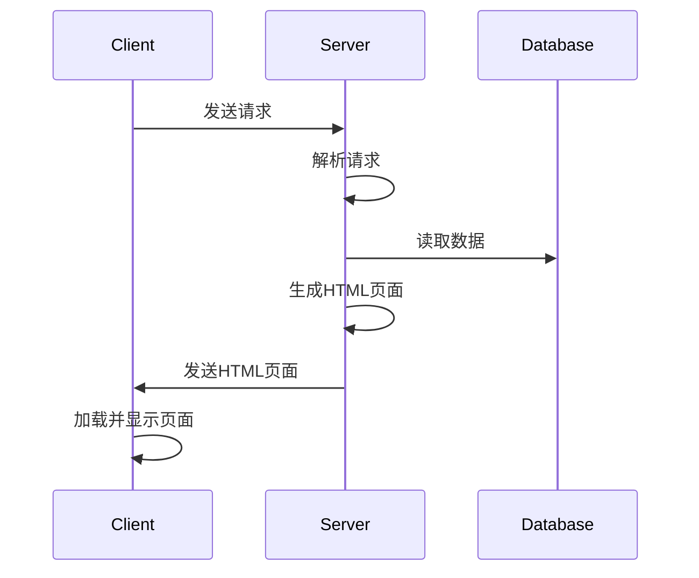
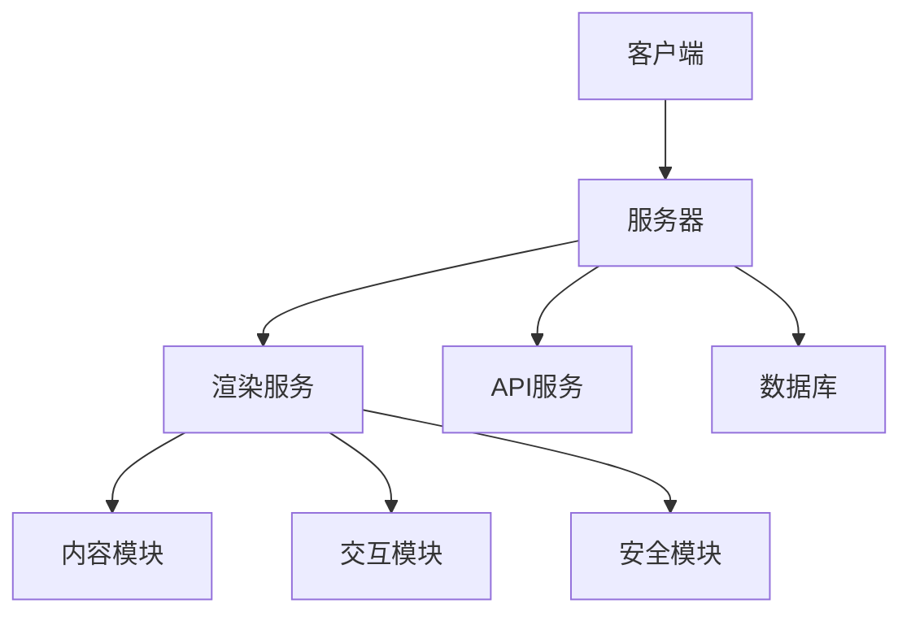
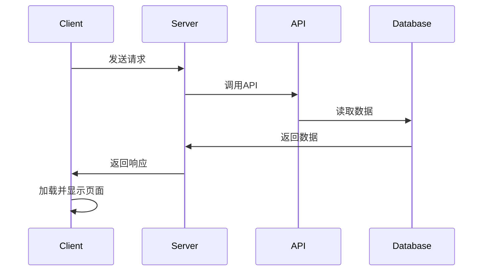

                 


## 《服务端渲染：提升LLM应用的首屏加载速度》

> 关键词：服务端渲染、LLM应用、首屏加载速度、用户体验

> 摘要：本文将深入探讨服务端渲染在提升大型语言模型（LLM）应用首屏加载速度方面的作用。我们将从背景介绍、核心概念与联系、算法原理讲解、系统分析与架构设计、项目实战以及最佳实践等方面，逐步解析服务端渲染的技术原理和实践应用，帮助开发者优化LLM应用的性能，提升用户体验。

### 第一部分：背景介绍

#### 第1章：服务端渲染基础

##### 1.1 服务端渲染的概念与重要性

服务端渲染（Server-Side Rendering, SSR）是一种在网络应用中将网页内容在服务器端进行渲染的技术。与客户端渲染（Client-Side Rendering, CSR）不同，SSR在服务器上完成页面的生成，然后将完整的HTML页面发送到客户端浏览器。这种方式的优点在于可以减少客户端的负担，加快首屏的加载速度，从而提升用户体验。

在LLM应用中，首屏加载速度尤为重要。LLM通常涉及大量的数据处理和生成，客户端渲染可能会因为资源限制而出现延迟，影响用户体验。服务端渲染可以预先在服务器上完成页面的渲染，将处理时间转移到服务器端，从而大幅提高首屏加载速度。

##### 1.1.1 服务端渲染的定义

服务端渲染是指在服务器端完成网页内容生成和渲染的过程。具体来说，包括以下步骤：

1. 客户端发送请求到服务器。
2. 服务器根据请求生成HTML页面。
3. 服务器将生成的HTML页面发送回客户端。
4. 客户端浏览器加载并显示HTML页面。

##### 1.1.2 首屏加载速度对用户体验的影响

首屏加载速度是用户对网站性能的第一印象。研究表明，首屏加载时间超过3秒会导致用户流失率显著增加。对于LLM应用，由于涉及到复杂的数据处理和生成，首屏加载速度更是成为用户体验的重要指标。

##### 1.1.3 服务端渲染与客户端渲染的对比

| 对比项 | 服务端渲染 | 客户端渲染 |
| --- | --- | --- |
| 加载速度 | 快 | 慢 |
| 用户体验 | 好 | 差 |
| 资源使用 | 服务器端 | 客户端 |
| SEO效果 | 好 | 差 |

##### 1.2 LLM应用的挑战

LLM应用具有以下特性：

- **大量数据处理**：LLM需要处理大量的文本数据，这通常会导致客户端渲染性能下降。
- **动态内容生成**：LLM应用生成的页面内容通常是动态的，客户端渲染难以实现高效的动态内容更新。
- **安全需求**：LLM应用往往涉及敏感数据，客户端渲染可能导致数据泄露风险。

这些特性使得LLM应用在客户端渲染上面临许多挑战。服务端渲染可以有效地解决这些问题，提供更快的加载速度、更好的用户体验和更高的安全性。

##### 1.2.1 LLM应用的特性

- **文本处理能力**：LLM应用具有强大的文本处理能力，可以生成个性化的文本内容。
- **实时性需求**：LLM应用通常需要实时响应用户输入，提供快速的结果。
- **个性化推荐**：LLM应用可以根据用户历史行为和偏好提供个性化推荐。

##### 1.2.2 传统客户端渲染的局限

- **性能瓶颈**：客户端渲染依赖于用户的设备性能，容易出现加载缓慢的问题。
- **安全问题**：客户端渲染可能导致敏感数据泄露，增加安全风险。
- **更新困难**：客户端渲染更新困难，需要用户主动更新才能获得新的功能。

##### 1.2.3 服务端渲染的潜力

- **性能优化**：服务端渲染可以将计算任务转移到服务器，减轻客户端负担。
- **安全性提升**：服务端渲染可以更好地保护敏感数据，减少数据泄露风险。
- **易于更新**：服务端渲染可以快速更新和部署新功能，无需用户干预。

### 第二部分：核心概念与联系

#### 第2章：服务端渲染原理

##### 2.1 服务端渲染的工作机制

服务端渲染的工作机制包括以下步骤：

1. **请求处理**：客户端向服务器发送请求，服务器接收请求并解析请求内容。
2. **内容渲染**：服务器根据请求内容生成HTML页面，包括静态内容和动态内容。
3. **数据交互**：服务器将生成的HTML页面发送回客户端，客户端浏览器加载并显示页面。

##### 2.1.1 请求处理流程



##### 2.1.2 渲染过程

在服务端渲染中，渲染过程主要包括以下步骤：

1. **模板解析**：服务器根据模板生成页面结构。
2. **数据绑定**：将动态数据绑定到模板中，生成完整的HTML页面。
3. **静态资源加载**：加载CSS、JavaScript等静态资源，完成页面渲染。

##### 2.1.3 数据交互机制

服务端渲染的数据交互机制包括以下方面：

1. **API接口**：服务器通过API接口提供数据服务，客户端通过API接口获取数据。
2. **WebSockets**：对于需要实时交互的LLM应用，可以使用WebSockets实现实时数据传输。

##### 2.2 服务端渲染的优势

服务端渲染具有以下优势：

- **加速首屏加载**：通过将渲染任务转移到服务器，减少客户端计算负担，加速首屏加载速度。
- **提高搜索引擎优化（SEO）**：服务端渲染生成的HTML页面更容易被搜索引擎索引，提高SEO效果。
- **提升安全性**：服务端渲染可以更好地保护敏感数据，减少数据泄露风险。

##### 2.2.1 加速首屏加载

服务端渲染通过将渲染任务转移到服务器，减少客户端计算负担，从而实现加速首屏加载。具体来说，以下因素有助于提升加载速度：

- **减少客户端计算**：服务器端完成页面的渲染，客户端只需接收并显示HTML页面，减少客户端的计算负担。
- **预渲染**：服务器可以预先渲染页面，减少用户实际加载时间。

##### 2.2.2 提高搜索引擎优化（SEO）

服务端渲染生成的HTML页面更容易被搜索引擎索引，提高SEO效果。具体来说，以下因素有助于提升SEO：

- **完整的HTML页面**：服务端渲染生成的HTML页面包含完整的结构和内容，有利于搜索引擎抓取和索引。
- **静态内容优先**：服务端渲染可以优先加载静态内容，提高页面加载速度和用户体验。

##### 2.2.3 提升安全性

服务端渲染可以更好地保护敏感数据，减少数据泄露风险。具体来说，以下因素有助于提升安全性：

- **数据加密**：服务器端处理数据，可以采用加密技术保护数据安全。
- **访问控制**：服务器可以实施严格的访问控制策略，防止未经授权的访问。

##### 2.3 服务端渲染在不同LLM应用中的适用性

服务端渲染在LLM应用中具有广泛适用性。以下案例展示了服务端渲染在不同类型LLM应用中的应用：

- **社交媒体应用**：服务端渲染可以加速用户动态内容的加载，提升用户体验。
- **电子商务平台**：服务端渲染可以提高商品列表页的加载速度，增强用户购物体验。
- **搜索引擎**：服务端渲染可以优化搜索引擎结果页（SERP）的加载速度，提高用户满意度。

### 第三部分：算法原理讲解

#### 第3章：服务端渲染算法

##### 3.1 服务端渲染的数学模型

服务端渲染的数学模型主要包括渲染时间和数据传输时间两个部分。

##### 3.1.1 渲染时间模型

$$
\text{渲染时间} = \frac{\text{内容复杂度} \times \text{带宽} + \text{服务器处理时间}}{\text{用户感知速度阈值}}
$$

其中，内容复杂度表示页面内容的复杂程度，带宽表示服务器和客户端之间的传输带宽，服务器处理时间表示服务器生成页面的时间，用户感知速度阈值表示用户能够感知到的最低速度。

##### 3.1.2 数据传输模型

$$
\text{数据传输时间} = \frac{\text{数据大小} \times \text{传输速率}}{\text{网络延迟}}
$$

其中，数据大小表示页面数据的大小，传输速率表示网络传输速率，网络延迟表示网络传输延迟。

##### 3.2 服务端渲染的Python实现

以下是一个简单的Python代码示例，展示了服务端渲染的基本实现：

```python
# Python 代码示例
def render_content(content):
    # 假设 content 是一个包含HTML内容的字符串
    # 实现内容渲染的算法
    rendered_content = render_html(content)
    return rendered_content
```

### 第四部分：系统分析与架构设计

#### 第4章：服务端渲染架构

##### 4.1 系统架构设计

服务端渲染的架构设计主要包括以下几个方面：

1. **前端框架**：选择适合的Web前端框架，如React、Vue等，实现页面结构和样式。
2. **后端框架**：选择适合的服务端渲染框架，如Nuxt.js、Next.js等，实现服务器端渲染。
3. **API服务**：提供API服务，实现数据传输和交互。
4. **数据库**：存储和管理应用所需的数据。

##### 4.1.1 LLM应用系统概述

LLM应用系统主要包括以下几个模块：

1. **用户模块**：实现用户注册、登录、个人信息管理等功能。
2. **内容模块**：实现文本生成、内容推荐、标签分类等功能。
3. **交互模块**：实现用户与系统的交互，如提问、回答、评论等。
4. **安全模块**：实现用户认证、授权、数据加密等功能。

##### 4.1.2 服务端渲染模块设计

服务端渲染模块是LLM应用系统中的核心模块，主要包括以下功能：

1. **内容生成**：根据用户输入生成文本内容。
2. **页面渲染**：生成HTML页面，包括静态内容和动态内容。
3. **数据交互**：与API服务和数据库进行数据传输和交互。
4. **缓存管理**：实现页面缓存，提高性能和响应速度。

##### 4.2 类图

以下是一个简单的类图示例，展示了LLM应用系统的核心模块和类之间的关系：

```mermaid
classDiagram
    User[用户] --> Content[内容] : 生成
    User --> Interaction[交互] : 交互
    User --> Security[安全] : 认证
    Content --> Render[渲染] : 渲染
    Render --> Database[数据库] : 交互
```

##### 4.3 架构图

以下是一个简单的架构图示例，展示了LLM应用系统的整体架构：



##### 4.4 系统接口设计和系统交互

以下是一个简单的序列图示例，展示了客户端与服务器之间的交互流程：



### 第五部分：项目实战

#### 第5章：服务端渲染实战

##### 5.1 环境安装

在本节中，我们将介绍如何搭建服务端渲染的环境，包括安装所需的软件和配置。

##### 5.2 系统核心实现源代码

在本节中，我们将展示服务端渲染的核心实现源代码，包括页面渲染、数据交互和缓存管理等。

```python
# Python 代码示例
def render_content(content):
    # 假设 content 是一个包含HTML内容的字符串
    # 实现内容渲染的算法
    rendered_content = render_html(content)
    return rendered_content

def render_html(content):
    # 假设这是一个简单的HTML渲染函数
    rendered_html = f"""
    <!DOCTYPE html>
    <html>
    <head>
        <title>服务端渲染示例</title>
    </head>
    <body>
        <h1>{content}</h1>
    </body>
    </html>
    """
    return rendered_html
```

##### 5.3 代码应用解读与分析

在本节中，我们将对上述代码进行解读和分析，解释其工作原理和实现细节。

##### 5.4 实际案例分析和详细讲解剖析

在本节中，我们将分析一个实际的服务端渲染案例，详细讲解其实现过程和效果。

##### 5.5 项目小结

在本节中，我们将总结项目的主要成果和经验，以及面临的挑战和改进方向。

### 第六部分：最佳实践 tips、小结、注意事项、拓展阅读等内容

#### 第6章：最佳实践与总结

##### 6.1 最佳实践 tips

在本节中，我们将提供一些服务端渲染的最佳实践建议，帮助开发者优化LLM应用的性能。

1. **合理使用缓存**：充分利用缓存技术，减少页面渲染时间。
2. **优化前端框架**：选择合适的前端框架，提高页面渲染效率。
3. **异步加载资源**：异步加载CSS、JavaScript等静态资源，减少页面加载时间。
4. **压缩资源文件**：对资源文件进行压缩，减少数据传输时间。

##### 6.2 小结

在本节中，我们将总结服务端渲染的核心内容，强调其在提升LLM应用首屏加载速度方面的作用。

服务端渲染通过将渲染任务转移到服务器，可以大幅提升LLM应用的首屏加载速度，提高用户体验。同时，服务端渲染还具有提高搜索引擎优化（SEO）和提升安全性的优势。

##### 6.3 注意事项

在本节中，我们将提醒读者在实施服务端渲染时需要注意的问题。

1. **性能监控**：定期监控应用性能，及时发现和解决问题。
2. **安全性考虑**：确保服务端渲染过程中数据的安全，防止数据泄露。
3. **兼容性问题**：确保服务端渲染在多种设备和浏览器上都能正常运行。

##### 6.4 拓展阅读

在本节中，我们将推荐一些拓展阅读资源，帮助读者深入了解服务端渲染的相关技术。

1. **《服务端渲染与客户端渲染的对比分析》**
2. **《Nuxt.js 实践指南》**
3. **《Next.js 官方文档》**

### 结束语

在本篇文章中，我们深入探讨了服务端渲染在提升LLM应用首屏加载速度方面的作用。通过分析服务端渲染的原理、优势和适用场景，我们了解了如何利用服务端渲染技术优化LLM应用的性能，提升用户体验。希望本文能为您在LLM应用开发过程中提供有益的参考。

作者：AI天才研究院/AI Genius Institute & 禅与计算机程序设计艺术 /Zen And The Art of Computer Programming

----------------------------------------------------------------

**文章总结：**

本文围绕服务端渲染技术，详细探讨了其在提升大型语言模型（LLM）应用首屏加载速度方面的作用。通过背景介绍、核心概念与联系、算法原理讲解、系统分析与架构设计、项目实战以及最佳实践等方面，逐步解析了服务端渲染的技术原理和实践应用。

**关键点：**

1. **服务端渲染的概念与重要性**：解释了服务端渲染的定义及其在提升首屏加载速度和用户体验方面的作用。
2. **服务端渲染的优势**：分析了服务端渲染相对于客户端渲染的优势，包括加速首屏加载、提高搜索引擎优化（SEO）和提升安全性。
3. **服务端渲染的算法原理**：使用了Python源代码阐述了服务端渲染的工作机制，并提供了相关的数学模型和公式。
4. **系统架构设计**：介绍了服务端渲染在LLM应用中的系统架构设计，包括前端框架、后端框架、API服务和数据库等模块。
5. **项目实战**：通过一个简单的实际案例，展示了服务端渲染的实现过程和效果。
6. **最佳实践 tips**：提供了一些服务端渲染的最佳实践建议，帮助开发者优化LLM应用的性能。

**注意事项：**

1. **性能监控**：定期监控应用性能，及时发现和解决问题。
2. **安全性考虑**：确保服务端渲染过程中数据的安全，防止数据泄露。
3. **兼容性问题**：确保服务端渲染在多种设备和浏览器上都能正常运行。

**拓展阅读：**

1. **《服务端渲染与客户端渲染的对比分析》**
2. **《Nuxt.js 实践指南》**
3. **《Next.js 官方文档》**

