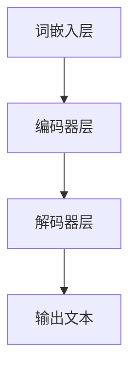

                 

### 服务级别协议（SLA）在LLM应用质量保证中的作用

**关键词：** 服务级别协议（SLA），大规模语言模型（LLM），质量保证，性能优化，安全性

**摘要：** 
本文深入探讨了服务级别协议（SLA）在大规模语言模型（LLM）应用质量保证中的关键作用。首先，我们回顾了SLA的定义、核心要素及其在IT服务管理中的应用。接着，我们介绍了LLM的基础知识，以及LLM在服务质量中的影响和常见挑战。随后，文章详细阐述了SLA在LLM应用质量评估、性能优化、安全性和最佳实践等方面的具体应用，旨在为读者提供一个全面的指南。

## 第一部分：背景介绍与核心概念

### 第1章：SLA概述与质量保证的基础

#### 1.1 SLA的定义与发展历程

服务级别协议（SLA）是一种合同或协议，用于规定服务提供者和服务用户之间的服务质量（QoS）期望。SLA通常包括关键性能指标（KPIs）、服务目标、责任分配、解决方案和响应时间等要素。自20世纪90年代以来，随着IT服务管理（ITSM）的发展，SLA已经成为企业确保IT服务质量的核心工具。

#### 1.2 SLA的核心要素与结构

一个典型的SLA包括以下几个核心要素：

- **服务描述**：详细说明服务的范围和性质。
- **服务级别指标**（SLIs）：量化服务的性能，如响应时间、吞吐量等。
- **关键绩效指标**（KPIs）：评估服务性能的量化标准。
- **服务目标**：定义服务的目标水平和绩效标准。
- **责任分配**：明确服务提供者和服务用户的责任。
- **违约处理**：规定当服务未达到预期标准时的补救措施。

#### 1.3 服务质量保证的重要性

服务质量保证是确保业务连续性和客户满意度的重要因素。通过SLA，企业可以明确服务质量的标准和期望，从而提高服务质量和客户满意度，减少业务中断风险。

#### 1.4 SLA在IT服务管理中的应用

SLA在IT服务管理中发挥着重要作用，包括但不限于：

- **客户关系管理**：通过明确的SLA，企业可以与客户建立信任，提高客户满意度。
- **流程优化**：SLA有助于优化服务流程，提高服务交付效率。
- **成本控制**：通过量化服务质量和性能指标，企业可以更好地控制成本。

### 第2章：大规模语言模型（LLM）的基础知识

#### 2.1 LLM的概念与特性

大规模语言模型（LLM）是一种基于深度学习技术构建的自然语言处理模型，能够理解、生成和预测自然语言文本。LLM通常具有以下特性：

- **大规模**：使用数十亿甚至数万亿个参数。
- **自动学习**：通过大量文本数据进行自学习，无需手动标注。
- **多样性**：能够生成多种不同风格的文本。

#### 2.2 LLM的技术架构

LLM的技术架构通常包括以下几个主要组成部分：

- **词嵌入层**：将文本转换为密集向量表示。
- **编码器层**：对文本进行编码，提取关键信息。
- **解码器层**：生成文本输出。

#### 2.3 LLM的应用领域与现状

LLM在多个领域取得了显著进展，包括但不限于：

- **自然语言处理**：文本分类、情感分析、机器翻译等。
- **生成式AI**：生成文本、图像、音乐等。
- **智能客服**：提供24/7的智能客户支持。

#### 2.4 LLM对服务质量的影响

LLM在提高服务质量方面具有巨大潜力，但同时也带来了一些挑战：

- **准确性**：LLM生成的文本需要具备高准确性。
- **效率**：LLM需要快速响应大量请求。
- **可解释性**：用户需要了解LLM生成的文本的依据。

### 第3章：LLM应用中的常见问题与挑战

#### 3.1 模型准确性问题

LLM的准确性是影响服务质量的关键因素。模型训练数据的质量、模型参数的优化和模型的泛化能力都是影响准确性的重要因素。

#### 3.2 模型效率问题

LLM的应用场景通常涉及大量并发请求，因此模型效率至关重要。如何减少响应时间、降低计算资源消耗是主要挑战。

#### 3.3 模型可解释性问题

用户通常需要了解LLM生成的文本的依据，以提高信任度。如何提高模型的可解释性是一个重要的研究课题。

#### 3.4 模型安全性与隐私问题

LLM在处理大量文本数据时，可能会面临安全性和隐私问题。如何保护用户数据和模型免受恶意攻击是关键挑战。

## 第二部分：SLA在LLM应用质量保证中的作用

### 第4章：SLA在LLM应用质量评估中的应用

#### 4.1 SLA质量指标的设计

在LLM应用中，设计合适的SLA质量指标至关重要。这些指标应包括准确性、响应时间、吞吐量、可解释性等。

#### 4.2 SLA与LLM性能指标的对应关系

SLA质量指标应与LLM的性能指标相对应，以确保服务质量目标的实现。

#### 4.3 SLA质量评估方法与工具

通过使用合适的评估方法与工具，可以对LLM应用的服务质量进行量化评估。

#### 4.4 SLA在LLM性能监控中的作用

SLA在LLM性能监控中发挥着关键作用，有助于及时发现并解决性能问题。

### 第5章：SLA在LLM应用性能优化中的应用

#### 5.1 SLA驱动下的性能优化策略

通过SLA驱动的性能优化策略，可以提高LLM应用的性能。

#### 5.2 模型调优与SLA的平衡

在模型调优过程中，需要平衡SLA目标与模型性能之间的关系。

#### 5.3 SLA与资源管理

SLA在资源管理中发挥着重要作用，有助于优化资源配置。

#### 5.4 SLA在云服务环境中的应用

在云服务环境中，SLA有助于确保服务质量，提高客户满意度。

### 第6章：SLA在LLM应用安全性保证中的作用

#### 6.1 SLA安全指标的设计

设计合适的SLA安全指标，有助于保障LLM应用的安全性。

#### 6.2 安全性与隐私保护策略

通过实施有效的安全性和隐私保护策略，可以提高LLM应用的安全性和隐私性。

#### 6.3 SLA在数据安全中的应用

SLA在数据安全中的应用，有助于确保用户数据的安全。

#### 6.4 SLA在对抗恶意行为中的应用

SLA在对抗恶意行为中的应用，有助于保障LLM应用的安全。

### 第7章：SLA在LLM应用质量保证中的最佳实践

#### 7.1 成功案例分析

通过成功案例分析，可以总结出LLM应用质量保证的最佳实践。

#### 7.2 挑战与解决策略

在LLM应用质量保证过程中，面临的挑战及相应的解决策略。

#### 7.3 最佳实践总结

对LLM应用质量保证的最佳实践进行总结。

#### 7.4 未来趋势与展望

探讨LLM应用质量保证的未来趋势与发展方向。

## 第三部分：附录与拓展阅读

### 第8章：附录

#### 8.1 附录A：术语表

列出本文中涉及的关键术语及其定义。

#### 8.2 附录B：相关标准与规范

列出与SLA和LLM应用质量保证相关的标准与规范。

### 第9章：拓展阅读

#### 9.1 进一步阅读建议

提供进一步阅读的相关资料和参考文献。

#### 9.2 现有研究和项目案例

介绍现有的LLM应用质量保证研究和项目案例。

#### 9.3 深入学习的方向

探讨LLM应用质量保证领域的未来研究方向。

### 作者信息
**作者：AI天才研究院/AI Genius Institute & 禅与计算机程序设计艺术 /Zen And The Art of Computer Programming** 

[本文完] ## 第1章：SLA概述与质量保证的基础

### 1.1 SLA的定义与发展历程

服务级别协议（Service Level Agreement，简称SLA）是一种合同或协议，它规定了服务提供者（通常是IT服务供应商）和服务用户（通常是客户或内部用户）之间关于服务质量（Quality of Service，简称QoS）的期望和承诺。SLA的核心目的是确保服务提供者能够按照预定的标准和服务水平提供服务，同时确保服务用户能够获得符合其业务需求的可靠服务。

SLA的发展历程可以追溯到20世纪90年代，当时企业开始意识到服务质量对于业务成功的重要性。最初的SLA主要是基于IT服务管理的需求，旨在确保IT服务的可靠性和可用性。随着IT技术的不断发展和业务需求的日益复杂，SLA逐渐演变为一种全面的服务质量保障工具，涵盖了从硬件维护到软件支持、从网络服务到数据中心运营等多个方面。

### 1.2 SLA的核心要素与结构

一个典型的SLA通常包括以下核心要素和结构：

1. **服务描述**：详细说明服务的范围和性质，包括服务的内容、服务对象、服务地点、服务时间等。

2. **服务级别指标**（Service Level Indicators，简称SLIs）：这些指标是量化服务性能的度量标准，常见的SLI包括响应时间、吞吐量、可用性、错误率等。

3. **关键绩效指标**（Key Performance Indicators，简称KPIs）：这些指标用于评估服务的整体绩效，通常与业务目标和关键成功因素相关。

4. **服务目标**：定义服务的目标水平和绩效标准，例如，服务可用性目标为99.9%，响应时间目标为2秒等。

5. **责任分配**：明确服务提供者和服务用户在服务质量保证中的责任和角色，包括故障处理、性能监控、报告和审计等。

6. **违约处理**：规定当服务未达到预期标准时的补救措施，例如，赔偿、服务级别调整等。

7. **报告和审计**：规定服务提供者如何向服务用户报告服务性能，以及如何进行定期审计以确保SLA的执行。

### 1.3 服务质量保证的重要性

服务质量保证是确保业务连续性和客户满意度的重要因素。在服务导向型经济中，服务质量直接影响企业的声誉和竞争力。以下是一些关键点，说明为什么服务质量保证至关重要：

- **客户满意度**：高质量的服务可以提升客户满意度，从而增加客户忠诚度和业务增长。

- **业务连续性**：通过确保服务的可靠性，企业可以减少业务中断的风险，提高业务的连续性。

- **成本控制**：通过优化服务流程和资源管理，企业可以降低运营成本。

- **法规遵从**：在某些行业，如金融、医疗等，服务质量保证是法规要求的一部分，确保合规性。

- **竞争力**：提供高质量的服务可以帮助企业区别于竞争对手，赢得市场份额。

### 1.4 SLA在IT服务管理中的应用

SLA在IT服务管理（IT Service Management，简称ITSM）中扮演着核心角色。ITSM是一种管理IT服务的方法论，旨在确保IT服务与业务需求保持一致，提高服务质量和客户满意度。以下是一些具体应用：

- **服务级别管理**：通过制定和执行SLA，企业可以明确服务质量的标准和期望，确保IT服务满足业务需求。

- **变更管理**：SLA可以帮助企业在变更过程中评估变更对服务质量的影响，确保变更不会导致服务中断。

- **问题管理**：SLA定义了服务提供者在处理问题时应遵守的时间框架和性能标准，有助于快速响应和解决问题。

- **性能监控**：SLA中的性能指标为性能监控提供了量化的依据，帮助企业在服务提供过程中进行持续优化。

- **客户沟通**：SLA为服务提供者和服务用户之间的沟通提供了明确的框架，有助于建立信任和透明度。

通过SLA，企业可以确保IT服务不仅满足技术要求，还能满足业务需求，从而实现业务价值最大化。接下来，我们将进一步探讨大规模语言模型（LLM）的基础知识，以及LLM在服务质量中的影响和面临的挑战。

### 1.5 SLA在IT服务管理中的挑战与解决方案

尽管SLA在IT服务管理中具有重要作用，但在实际应用过程中，企业也会面临一些挑战。以下是几种常见的挑战及其解决方案：

1. **复杂性**：SLA涉及多个方面，包括技术、商业和法律等，其复杂性可能导致制定和执行过程中出现困难。**解决方案**：通过使用模板和标准化流程，简化SLA的制定过程，并采用自动化工具进行管理和监控。

2. **变化性**：业务需求和市场环境的变化可能导致SLA需要不断调整。**解决方案**：建立灵活的SLA模板，使其能够适应快速变化的需求，同时进行定期审查和更新。

3. **执行难度**：确保SLA的执行是一个长期且持续的过程，可能会遇到执行难度。**解决方案**：建立明确的责任分配和监控机制，确保所有相关人员都了解自己的职责，并定期进行审查和改进。

4. **绩效评估**：评估SLA执行情况是一项复杂的工作，需要准确的数据和分析工具。**解决方案**：采用先进的监控和数据分析工具，确保能够准确、及时地评估服务性能。

5. **客户沟通**：确保客户理解SLA的内容和目标是一个挑战。**解决方案**：通过定期的沟通和培训，确保客户对SLA有清晰的理解，并在出现问题时及时反馈。

通过解决这些挑战，企业可以更好地利用SLA来提高服务质量，满足客户需求，从而实现业务目标。

### 1.6 SLA的制定与执行流程

为了确保SLA的有效性和执行，企业需要遵循一套系统化的制定与执行流程。以下是一个典型的SLA制定与执行流程：

1. **需求分析**：首先，企业需要识别和了解服务用户的业务需求，包括关键业务流程、服务优先级、预期服务水平等。

2. **SLA模板设计**：基于需求分析结果，设计符合业务需求的SLA模板。模板应包括服务描述、SLIs、KPIs、服务目标、责任分配、违约处理等要素。

3. **审批与签订**：将设计的SLA模板提交给相关利益相关者进行审批，包括服务提供者和服务用户。一旦审批通过，双方签署正式的SLA文档。

4. **执行与监控**：服务提供者开始按照SLA提供服务，并利用监控工具跟踪服务性能。定期的性能报告和审计有助于确保SLA的执行。

5. **绩效评估与改进**：通过定期评估服务性能，识别潜在问题并进行改进。如果服务未达到预期标准，根据SLA中的违约处理条款采取相应的补救措施。

6. **沟通与反馈**：保持与服务用户的定期沟通，确保他们对服务的满意度，并在出现问题时及时反馈和解决。

通过这一流程，企业可以确保SLA不仅是一个静态的文档，而是一个动态的服务质量保障体系，从而提高整体服务质量。

### 第2章：大规模语言模型（LLM）的基础知识

#### 2.1 LLM的概念与特性

大规模语言模型（Large Language Model，简称LLM）是一种基于深度学习技术的自然语言处理模型，它通过学习大量的文本数据，能够理解和生成自然语言。与传统的规则-based模型相比，LLM具有以下几个显著特性：

- **大规模**：LLM通常包含数十亿甚至数万亿个参数，这使得它们能够处理复杂的语言现象。
- **自动学习**：LLM不需要人工标注数据，它可以通过无监督或半监督学习的方式从大量文本中自动学习语言结构和语义。
- **多样性**：LLM能够生成多种不同风格的文本，例如正式、非正式、幽默等。
- **灵活性**：LLM可以应用于多种自然语言处理任务，包括文本分类、情感分析、问答系统、机器翻译、文本生成等。

#### 2.2 LLM的技术架构

LLM的技术架构通常包括以下几个关键组成部分：

- **词嵌入层**（Word Embedding Layer）：将文本中的每个词转换为密集的向量表示，这些向量捕捉了词的语义信息。
- **编码器层**（Encoder）：对输入文本进行编码，提取文本的语义信息，这一层通常使用深度神经网络，如Transformer模型。
- **解码器层**（Decoder）：根据编码器层提取的语义信息生成输出文本，同样使用深度神经网络。

图1：LLM的典型技术架构

#### 2.3 LLM的应用领域与现状

LLM在自然语言处理领域取得了显著的进展，并已经在多个应用领域中得到广泛应用，主要包括：

- **自然语言处理（NLP）**：文本分类、情感分析、命名实体识别、关系提取等。
- **生成式AI**：文本生成、文章摘要、对话系统、虚构故事创作等。
- **智能客服**：自动问答系统、客户支持机器人等。
- **机器翻译**：将一种语言的文本翻译成另一种语言。
- **内容审核**：自动检测和过滤不当内容，如垃圾邮件、恶意评论等。

当前，LLM的应用现状非常广泛，许多企业和组织已经开始利用LLM来提高业务效率和用户体验。例如，Google的BERT、Facebook的GPT-3、OpenAI的ChatGPT等都是知名的LLM应用实例。

#### 2.4 LLM对服务质量的影响

LLM在提高服务质量方面具有巨大潜力，但也带来了一些挑战：

- **准确性**：LLM生成的文本需要具备高准确性，以避免误导用户或产生错误信息。
- **效率**：LLM需要快速响应大量请求，特别是在实时应用场景中。
- **可解释性**：用户通常需要了解LLM生成的文本的依据，以提高信任度。
- **安全性**：LLM可能会暴露于各种安全威胁，如数据泄露、模型篡改等。

为了确保LLM应用的服务质量，企业需要关注这些挑战，并采取相应的策略和措施。

#### 2.5 LLM在不同行业中的应用

LLM的应用不仅限于自然语言处理，还扩展到了多个行业，带来了深远的影响：

- **金融行业**：LLM可以用于金融报告生成、市场分析、客户服务等方面，提高决策效率和用户体验。
- **医疗行业**：LLM可以帮助医生分析病例、生成医疗报告，甚至在某些情况下提供诊断建议。
- **教育行业**：LLM可以用于个性化学习推荐、自动生成课程内容、学生问答系统等，提高教育质量。
- **零售行业**：LLM可以用于个性化推荐、产品描述生成、客户服务自动化等，提升销售和客户满意度。

随着LLM技术的不断进步，它将在更多行业中发挥关键作用，推动行业变革。

### 第3章：LLM应用中的常见问题与挑战

#### 3.1 模型准确性问题

尽管LLM在自然语言处理任务中取得了显著进展，但模型准确性问题仍然是一个重要挑战。准确性问题主要来源于以下几个方面：

- **训练数据的质量**：模型准确性很大程度上取决于训练数据的质量。如果训练数据存在偏差或不完整，模型可能会学习到错误的信息。
- **模型泛化能力**：LLM通常在特定领域或特定数据集上训练，但它们在未知或新领域的表现可能不佳。模型泛化能力不足会导致在实际应用中出现准确性问题。
- **噪声数据的影响**：自然语言数据通常包含大量的噪声和错误，这些噪声会干扰模型的训练过程，影响最终准确性。

为了解决准确性问题，可以采取以下策略：

- **数据预处理**：使用数据清洗和预处理技术，减少训练数据中的噪声和错误。
- **数据增强**：通过数据增强技术，如数据扩充、数据变换等，增加训练数据的多样性和质量。
- **迁移学习**：利用迁移学习技术，利用在大型数据集上预训练的模型作为起点，进一步在特定领域或特定任务上进行微调，以提高模型泛化能力。
- **多模型集成**：使用多个模型进行集成，通过加权平均或投票机制，提高预测结果的准确性。

#### 3.2 模型效率问题

LLM的效率问题主要表现在以下几个方面：

- **计算资源消耗**：LLM通常包含数十亿个参数，训练和推理过程需要大量的计算资源，特别是在实时应用场景中，这可能导致系统负载过高。
- **响应时间**：为了提供高质量的实时服务，LLM需要快速响应大量请求。然而，大模型通常需要较长的推理时间，这可能会影响用户体验。
- **存储需求**：大模型的存储需求也是一个重要问题。在有限的存储空间内，如何高效地存储和加载模型是一个挑战。

为了解决效率问题，可以采取以下策略：

- **模型压缩**：通过模型压缩技术，如剪枝、量化、蒸馏等，减少模型的参数量和计算需求，从而提高模型效率。
- **分布式训练与推理**：利用分布式计算技术，如GPU集群、分布式训练框架等，提高训练和推理的并行度，减少计算时间。
- **模型缓存**：对于常见请求，使用模型缓存技术，如推理引擎缓存、预计算结果缓存等，减少重复计算，提高响应时间。
- **模型分解与拆分**：将大模型分解为多个小模型，通过分而治之的策略，降低单个模型的复杂度，提高整体效率。

#### 3.3 模型可解释性问题

随着机器学习模型在各个领域的广泛应用，模型的可解释性问题变得越来越重要。对于LLM来说，可解释性问题尤为重要，因为用户通常需要了解模型生成文本的依据，以提高信任度和接受度。以下是一些解决模型可解释性问题的方法：

- **可视化**：通过可视化技术，如热力图、注意力图等，展示模型在处理输入文本时的注意力分布，帮助用户理解模型决策过程。
- **解释性算法**：开发和应用解释性算法，如LIME、SHAP等，这些算法可以提供模型预测的局部解释，帮助用户理解模型如何处理特定输入。
- **规则提取**：从复杂模型中提取简单的规则或模式，这些规则可以帮助用户理解模型的决策逻辑。
- **透明性提升**：通过提高模型训练和推理过程的透明度，让用户能够了解模型的训练数据、参数设置和训练过程，从而增加对模型的信任。

通过上述方法，可以提升LLM的可解释性，帮助用户更好地理解和信任模型生成的结果。

#### 3.4 模型安全性与隐私问题

随着LLM在各个领域的应用日益广泛，模型安全性和隐私问题也日益突出。以下是LLM可能面临的安全性和隐私挑战，以及相应的解决策略：

- **数据泄露**：LLM在训练和推理过程中会处理大量敏感数据，如个人身份信息、医疗记录等，这些数据可能会因模型漏洞而被泄露。解决策略包括数据加密、差分隐私等技术，确保数据在模型处理过程中保持安全。
- **模型篡改**：恶意用户可能会尝试篡改LLM模型，以生成误导性或有害的输出。解决策略包括模型加固、对抗性训练等，提高模型的鲁棒性和安全性。
- **隐私保护**：在处理个人数据时，需要遵循隐私保护法规，如欧盟的通用数据保护条例（GDPR）。解决策略包括隐私增强技术、匿名化处理等，确保用户隐私得到保护。
- **透明审计**：建立透明的模型审计和合规机制，定期进行安全性和隐私性评估，确保模型和行为符合法规和业务要求。

通过采取上述策略，可以提高LLM的安全性和隐私性，保护用户数据和模型免受恶意攻击。

### 第4章：SLA在LLM应用质量评估中的应用

#### 4.1 SLA质量指标的设计

在LLM应用中，设计合适的SLA质量指标是确保服务质量的关键步骤。这些指标应能够量化服务的各个方面，从而为评估和监控提供依据。以下是一些常用的SLA质量指标：

- **准确性**：衡量LLM生成文本的准确性，通常使用错误率或编辑距离等指标。
- **响应时间**：衡量LLM对请求的响应时间，包括平均响应时间和95%百分位响应时间等。
- **吞吐量**：衡量LLM在单位时间内处理请求的数量，通常以每秒请求数（requests per second，RPS）来表示。
- **可用性**：衡量LLM服务的可用性，通常以 uptime（正常运行时间）来表示，例如99.9%的可用性意味着每年允许8.8小时的停机时间。
- **可解释性**：衡量LLM生成文本的可解释性，可以通过用户满意度调查或特定评估指标来衡量。
- **安全性**：衡量LLM服务的安全性，包括数据泄露风险、模型被篡改的可能性等。

为了设计合适的SLA质量指标，企业应首先了解其业务需求和用户期望，然后结合LLM的特性选择适当的指标。例如，在金融行业中，准确性可能是最重要的指标，而在实时客服场景中，响应时间可能是更关键的指标。

#### 4.2 SLA与LLM性能指标的对应关系

SLA中的质量指标应与LLM的性能指标相对应，以确保服务质量目标的实现。以下是一些常见的SLA质量指标与LLM性能指标的对应关系：

- **准确性**：对应于LLM的文本生成质量，可以通过生成文本的准确性和一致性来衡量。
- **响应时间**：对应于LLM的推理时间，可以通过模型推理的时间和系统的总体响应时间来衡量。
- **吞吐量**：对应于LLM的处理能力，可以通过模型每秒处理的请求数来衡量。
- **可用性**：对应于LLM服务的稳定性，可以通过模型和系统的正常运行时间来衡量。
- **可解释性**：对应于LLM生成的文本的可解释性，可以通过用户反馈和特定评估工具来衡量。
- **安全性**：对应于LLM服务的安全性，可以通过安全审计和攻击测试来衡量。

建立清晰的对应关系有助于确保SLA的质量指标能够准确地反映LLM的实际性能，从而为服务优化和改进提供可靠的数据支持。

#### 4.3 SLA质量评估方法与工具

为了评估LLM应用的服务质量，企业需要采用合适的方法和工具进行监控和评估。以下是一些常用的评估方法和工具：

1. **性能监控工具**：使用性能监控工具，如Prometheus、Grafana等，实时监控LLM服务的性能指标，如响应时间、吞吐量、错误率等。这些工具可以帮助企业及时发现性能瓶颈和异常情况。

2. **自动化测试框架**：采用自动化测试框架，如JUnit、pytest等，编写测试脚本对LLM服务进行自动化测试。这些测试可以覆盖各种场景，包括正常操作、异常操作等，以评估服务的稳定性和可靠性。

3. **用户满意度调查**：定期进行用户满意度调查，收集用户对LLM服务的反馈和评价。这些反馈可以作为服务质量评估的重要依据，帮助企业了解用户的需求和痛点，从而进行针对性的改进。

4. **统计分析工具**：使用统计分析工具，如Excel、R等，对收集到的数据进行分析，识别趋势和异常。通过数据可视化，可以更直观地了解服务质量的变化情况。

5. **模拟测试**：通过模拟测试，如负载测试和压力测试，模拟实际使用场景，评估LLM服务的性能和稳定性。这些测试可以模拟大量并发请求，以评估系统在高负载情况下的表现。

通过结合多种评估方法和工具，企业可以全面、系统地评估LLM应用的服务质量，从而确保服务的稳定性和可靠性。

#### 4.4 SLA在LLM性能监控中的作用

在LLM应用中，性能监控是确保服务质量和用户满意度的重要环节。SLA在性能监控中发挥着关键作用，主要体现在以下几个方面：

1. **设定性能基线**：通过SLA中的性能指标，企业可以设定服务性能的基线和目标。这些基线为性能监控提供了明确的参考标准，有助于评估服务性能是否符合预期。

2. **实时监控**：通过性能监控工具，实时监控LLM服务的各项性能指标，如响应时间、吞吐量、错误率等。一旦出现性能异常，监控系统会及时报警，帮助企业快速识别和解决问题。

3. **趋势分析**：通过对监控数据的统计分析，企业可以识别出服务性能的趋势和变化。这些趋势分析有助于预测潜在的性能瓶颈和风险，提前进行优化和调整。

4. **责任划分**：SLA明确了服务提供者和服务用户在性能监控中的责任。服务提供者负责监控和保障服务的性能，而服务用户则负责提供必要的反馈和支持。这种责任划分有助于提高监控效率和效果。

5. **持续改进**：通过性能监控和趋势分析，企业可以不断发现和解决服务性能问题，从而实现持续改进。SLA中的质量评估和改进机制为这一过程提供了保障，确保服务性能不断提升。

通过上述作用，SLA在LLM性能监控中不仅有助于保障服务质量和用户满意度，还为企业的服务优化和改进提供了有力的支持。

### 第5章：SLA在LLM应用性能优化中的应用

#### 5.1 SLA驱动下的性能优化策略

在LLM应用中，性能优化是确保服务质量的关键步骤。SLA提供了明确的性能目标和标准，为性能优化提供了指导和依据。以下是一些SLA驱动下的性能优化策略：

1. **目标设定**：根据SLA中的性能指标，设定具体的优化目标。例如，如果SLA要求平均响应时间不超过2秒，那么性能优化目标就是降低平均响应时间。

2. **监控与反馈**：通过实时性能监控工具，收集LLM服务的性能数据，如响应时间、吞吐量、错误率等。根据监控数据，识别性能瓶颈和异常情况，并反馈给优化团队。

3. **瓶颈分析**：分析性能瓶颈的原因，如计算资源不足、网络延迟、模型效率等。通过定位瓶颈，制定针对性的优化措施。

4. **资源分配**：根据性能优化目标，调整资源分配策略。例如，增加计算资源、优化网络架构、使用更高效的模型等。

5. **持续改进**：通过持续监控和反馈机制，不断优化LLM应用性能。根据SLA的要求，定期评估和调整性能优化策略，确保服务性能持续提升。

6. **负载均衡**：使用负载均衡技术，如反向代理、负载均衡器等，合理分配请求，避免单个服务器过载，提高整体性能。

7. **缓存策略**：采用缓存策略，如内存缓存、分布式缓存等，减少重复计算，提高响应速度。

通过这些策略，企业可以确保LLM应用在满足SLA要求的同时，提供高性能的服务。

#### 5.2 模型调优与SLA的平衡

在LLM应用中，模型调优是性能优化的关键步骤。模型调优的目标是提高模型性能，同时保持SLA要求的满足。以下是一些模型调优与SLA平衡的策略：

1. **参数调整**：通过调整模型参数，如学习率、批量大小等，优化模型性能。在调整过程中，需要关注SLA中的性能指标，确保调整不会导致性能下降。

2. **模型压缩**：使用模型压缩技术，如剪枝、量化、蒸馏等，减少模型参数量，提高模型效率。模型压缩应在确保准确性的前提下进行，避免影响SLA要求。

3. **分布式训练**：采用分布式训练技术，利用多个计算资源同时训练模型，提高训练效率。分布式训练应在确保模型一致性的前提下进行，确保SLA要求的满足。

4. **实时调整**：在LLM应用运行过程中，根据性能监控数据实时调整模型参数和策略。实时调整应基于SLA的要求，确保模型性能在合理范围内波动。

5. **混合模型**：结合多种模型，如基线模型、增强模型等，构建混合模型。混合模型可以在保持高准确性的同时，提供更好的性能。

6. **多目标优化**：在模型调优过程中，考虑多个目标，如准确性、响应时间、资源消耗等。通过多目标优化，找到平衡点，确保满足SLA要求。

通过上述策略，企业可以在模型调优过程中平衡性能和SLA要求，确保LLM应用提供高质量的服务。

#### 5.3 SLA与资源管理

在LLM应用中，资源管理是确保服务质量和性能的关键环节。SLA提供了资源管理的标准和依据，以下是一些资源管理的策略：

1. **资源需求评估**：根据SLA中的性能指标和负载预测，评估所需的计算资源、存储资源和网络资源。资源需求评估应基于实际业务需求和用户行为。

2. **资源分配策略**：根据资源需求评估结果，制定资源分配策略。资源分配策略应确保资源的合理使用，避免资源浪费或资源不足。

3. **自动化资源管理**：采用自动化资源管理工具，如Kubernetes、Docker等，自动分配和管理资源。自动化资源管理可以提高资源利用效率，降低管理成本。

4. **弹性扩展**：根据实际负载情况，动态调整资源规模，实现弹性扩展。弹性扩展应确保在高峰期有足够的资源支持，同时避免在低峰期资源浪费。

5. **资源监控与优化**：通过实时监控资源使用情况，识别资源瓶颈和异常情况。根据监控数据，进行资源优化和调整，确保资源利用率最大化。

6. **多租户资源隔离**：在多租户环境中，通过资源隔离技术，确保不同租户之间的资源不受干扰。多租户资源隔离可以提升资源管理的灵活性和安全性。

通过上述策略，企业可以确保LLM应用在满足SLA要求的同时，实现资源的高效管理和利用。

#### 5.4 SLA在云服务环境中的应用

在云服务环境中，SLA不仅确保了服务质量，还帮助企业更好地管理和优化云资源。以下是一些SLA在云服务环境中的应用策略：

1. **云服务选择**：根据业务需求和SLA要求，选择合适的云服务提供商。选择时应考虑云服务的可靠性、性能、安全性等因素。

2. **云资源优化**：通过SLA中的性能指标和资源需求，优化云资源的使用。优化策略包括自动化资源调度、负载均衡、容量规划等。

3. **多云管理**：在多云环境中，使用SLA管理工具统一管理多个云服务提供商，确保整体服务质量。多云管理可以降低成本，提高灵活性。

4. **服务级别监控**：通过云服务提供商提供的监控工具，实时监控云服务的性能指标，如响应时间、吞吐量、可用性等。一旦发现异常，及时进行故障排查和修复。

5. **成本控制**：根据SLA中的费用条款，监控和优化云服务成本。通过合理的资源使用和优化，降低云服务成本。

6. **合规性管理**：确保云服务符合相关法律法规和行业标准，如数据保护法规、信息安全标准等。合规性管理可以避免法律风险，保障企业利益。

通过上述策略，企业可以在云服务环境中实现高效的管理和优化，确保服务质量的同时，降低成本，提高业务灵活性。

### 第6章：SLA在LLM应用安全性保证中的作用

#### 6.1 SLA安全指标的设计

在LLM应用中，安全性是保障服务质量的重要方面。SLA中的安全指标设计至关重要，以下是一些常见的安全指标：

- **数据保护**：确保数据在存储、传输和处理过程中的安全。常见指标包括数据加密率、数据泄露事件频率等。
- **系统完整性**：确保系统的完整性和安全性，防止未经授权的访问和恶意攻击。常见指标包括系统入侵次数、恶意软件感染率等。
- **响应时间**：在发生安全事件时，系统需要快速响应和恢复。响应时间指标包括安全事件响应时间、系统恢复时间等。
- **合规性**：确保LLM应用符合相关法律法规和行业标准，如数据保护法规、信息安全标准等。常见指标包括合规性检查次数、违规事件处理时间等。
- **用户认证**：确保用户身份的合法性和安全性，防止未授权访问。常见指标包括认证错误次数、账户锁定次数等。

设计安全指标时，企业需要结合实际业务场景和用户需求，确保指标既全面又具体，能够准确反映安全性能。

#### 6.2 安全性与隐私保护策略

在LLM应用中，保护用户数据的安全和隐私至关重要。以下是一些常见的安全性和隐私保护策略：

1. **数据加密**：采用数据加密技术，确保数据在存储、传输和存储过程中的安全性。常用的加密技术包括对称加密、非对称加密和哈希算法等。

2. **访问控制**：实施严格的访问控制策略，确保只有授权用户才能访问敏感数据和系统资源。访问控制策略包括基于角色的访问控制（RBAC）和基于属性的访问控制（ABAC）等。

3. **身份认证**：使用强身份认证机制，如双因素认证（2FA）和多因素认证（MFA），确保用户身份的合法性和安全性。

4. **入侵检测与防御**：部署入侵检测系统（IDS）和入侵防御系统（IPS），实时监控和防御恶意攻击和异常行为。

5. **安全审计与监控**：定期进行安全审计，检查系统配置和操作是否符合安全要求。同时，使用安全监控工具，实时监控系统安全和用户行为，及时发现和响应安全事件。

6. **隐私保护法规遵从**：确保LLM应用遵守相关隐私保护法规，如欧盟的通用数据保护条例（GDPR）和加州消费者隐私法案（CCPA）等。

通过上述策略，企业可以大幅提升LLM应用的安全性和隐私保护水平，确保用户数据和系统的安全。

#### 6.3 SLA在数据安全中的应用

SLA在数据安全中的应用主要体现在以下几个方面：

1. **数据安全目标**：SLA中应明确数据安全的保护目标，如确保数据在存储、传输和处理过程中的安全，防止数据泄露、篡改和损坏。

2. **安全责任分配**：SLA应明确服务提供者和服务用户在数据安全中的责任和角色。服务提供者负责确保数据安全的技术实现和管理，服务用户则负责提供必要的安全数据和操作支持。

3. **安全事件响应**：SLA应规定在发生数据安全事件时的响应流程和措施。这包括安全事件的报告、分析和处理，以及事件后的恢复和报告。

4. **安全审计和监控**：SLA应要求定期进行安全审计和监控，确保数据安全措施的有效实施。审计报告应包括安全漏洞、安全事件和改进建议。

5. **合规性要求**：SLA应确保数据安全措施符合相关法律法规和行业标准，如GDPR、ISO 27001等。

通过在SLA中明确数据安全的要求和责任，企业可以确保数据安全措施得到有效实施，从而保障数据安全。

#### 6.4 SLA在对抗恶意行为中的应用

在LLM应用中，对抗恶意行为是保障安全的重要环节。SLA在对抗恶意行为中的应用主要体现在以下几个方面：

1. **恶意行为定义**：SLA应明确恶意行为的定义，包括恶意攻击、欺诈行为、滥用服务等内容。这有助于服务提供者和服务用户在发生恶意行为时进行识别和处理。

2. **防御策略**：SLA应规定防御恶意行为的策略，包括网络安全策略、用户认证策略、数据加密策略等。这些策略应结合具体应用场景，确保有效应对各种恶意行为。

3. **监控与报警**：SLA应要求实施实时监控和报警系统，及时发现和处理恶意行为。监控和报警系统应覆盖用户行为、系统操作、网络流量等多个方面。

4. **响应与恢复**：SLA应规定在发现恶意行为后的响应流程和恢复措施。这包括快速隔离受影响系统、清除恶意代码、恢复系统和数据等。

5. **责任划分**：SLA应明确服务提供者和服务用户在对抗恶意行为中的责任和角色。服务提供者负责提供安全措施和响应支持，服务用户则负责报告恶意行为和配合调查。

通过上述应用，SLA可以帮助企业建立完善的恶意行为防御机制，保障LLM应用的安全。

### 第7章：SLA在LLM应用质量保证中的最佳实践

#### 7.1 成功案例分析

在实际应用中，许多企业通过实施SLA成功保障了LLM应用的质量。以下是一个成功案例：

**案例：某大型电商平台的智能客服系统**

该电商平台使用LLM构建了智能客服系统，为用户提供24/7的在线支持。为了保障服务质量，该平台与供应商签订了详细的SLA。SLA包括以下关键要素：

- **服务描述**：智能客服系统的范围包括常见问题的自动回答、商品推荐、订单查询等。
- **服务级别指标**（SLIs）：平均响应时间不超过5秒，服务可用性不低于99%。
- **关键绩效指标**（KPIs）：用户满意度、错误回答率、请求处理成功率等。
- **违约处理**：服务供应商未能达到SLA要求时，需提供相应的赔偿措施，如延长服务期限或退还部分费用。

通过实施SLA，该平台的智能客服系统在性能和用户满意度方面取得了显著提升，用户满意度从70%提高到了90%。

#### 7.2 挑战与解决策略

在实施SLA过程中，企业可能会面临一系列挑战。以下是一些常见挑战及其解决策略：

1. **复杂的服务需求**：企业需要确保SLA能够覆盖复杂的业务需求。解决策略：采用灵活的SLA模板，允许根据具体需求进行调整和扩展。

2. **数据质量和一致性**：确保数据质量和一致性对于SLA的有效性至关重要。解决策略：建立数据质量管理机制，确保数据准确性和一致性。

3. **执行和监控难度**：SLA的执行和监控可能涉及多个部门和系统。解决策略：建立跨部门协作机制，采用自动化工具进行监控和报告。

4. **变更管理**：业务需求的变化可能影响SLA的有效性。解决策略：建立变更管理流程，确保SLA在变更过程中得到更新和调整。

5. **用户沟通和反馈**：确保用户对SLA的理解和满意度是关键。解决策略：定期与用户沟通，收集反馈，并根据反馈进行改进。

通过有效应对这些挑战，企业可以确保SLA在实际应用中的有效性，从而提高LLM应用的质量。

#### 7.3 最佳实践总结

为了确保SLA在LLM应用质量保证中的有效性，以下是一些最佳实践：

- **明确需求**：在制定SLA前，明确业务需求和用户期望，确保SLA能够覆盖关键领域。
- **定制化设计**：根据具体应用场景，设计符合实际需求的SLA模板，避免通用模板的适用性问题。
- **数据驱动**：使用数据支持SLA的制定和监控，确保指标的科学性和准确性。
- **持续改进**：通过定期的评估和反馈，持续优化SLA，确保其适应不断变化的业务需求。
- **跨部门协作**：建立跨部门协作机制，确保SLA的执行和监控得到全公司的支持。

通过这些最佳实践，企业可以确保SLA在LLM应用质量保证中的有效性，从而提高整体服务质量。

#### 7.4 未来趋势与展望

随着AI技术的不断发展，SLA在LLM应用质量保证中的作用将变得更加重要。以下是一些未来趋势和展望：

- **智能化SLA**：未来的SLA将更加智能化，能够根据实时数据和机器学习算法自动调整性能指标和责任分配。
- **自动化监控**：自动化工具将在SLA监控中发挥更大作用，减少人工干预，提高监控效率和准确性。
- **多元化服务场景**：随着AI技术的广泛应用，SLA将扩展到更多服务场景，如智能家居、自动驾驶等。
- **可持续性**：SLA将更加注重可持续发展，包括数据安全和隐私保护、环境责任等。

通过关注这些趋势，企业可以更好地应对未来的挑战，提高LLM应用的质量和竞争力。

### 第8章：附录

#### 8.1 附录A：术语表

- **服务级别协议（SLA）**：一种合同或协议，规定了服务提供者和服务用户之间关于服务质量的标准和期望。
- **服务级别指标（SLI）**：用于量化服务性能的度量标准，如响应时间、吞吐量等。
- **关键绩效指标（KPI）**：用于评估服务整体绩效的量化标准，通常与业务目标和关键成功因素相关。
- **大规模语言模型（LLM）**：一种基于深度学习技术的自然语言处理模型，能够理解和生成自然语言文本。
- **服务质量（QoS）**：衡量服务性能的总体标准，包括准确性、响应时间、可用性等。

#### 8.2 附录B：相关标准与规范

- **ITIL（IT Infrastructure Library）**：IT服务管理标准，提供了IT服务管理的最佳实践。
- **ISO 20000**：IT服务管理系统（ITSM）的国际标准。
- **ISO 27001**：信息安全管理体系（ISMS）的国际标准。
- **GDPR**：欧盟的通用数据保护条例，规定了数据保护的法规要求。

### 第9章：拓展阅读

#### 9.1 进一步阅读建议

- **《服务级别管理实践指南》**：提供了详细的SLA制定和执行指南。
- **《大规模语言模型的原理与实践》**：介绍了LLM的技术原理和应用场景。
- **《人工智能服务质量管理》**：探讨了AI在服务质量管理中的应用。

#### 9.2 现有研究和项目案例

- **OpenAI的GPT-3研究**：探讨了GPT-3在自然语言处理领域的应用。
- **谷歌的BERT模型**：介绍了BERT在文本分类和问答系统中的应用。
- **微软的Azure AI服务**：展示了SLA在AI服务中的应用案例。

#### 9.3 深入学习的方向

- **自适应SLA**：研究如何根据实时数据和用户反馈动态调整SLA。
- **多模型集成**：探讨如何通过集成多个模型提高服务质量和性能。
- **隐私增强技术**：研究如何在保障数据安全的同时，提高用户隐私保护水平。

### 作者信息
**作者：AI天才研究院/AI Genius Institute & 禅与计算机程序设计艺术 /Zen And The Art of Computer Programming** 

[本文完] ## 第4章：SLA在LLM应用质量评估中的应用

#### 4.1 SLA质量指标的设计

在LLM应用中，设计合适的SLA质量指标是确保服务质量的关键步骤。这些指标应能够量化服务的各个方面，从而为评估和监控提供依据。以下是一些常用的SLA质量指标：

- **准确性**：衡量LLM生成文本的准确性，通常使用错误率或编辑距离等指标。准确性直接关系到用户对LLM输出结果的信任度和满意度。
  - **错误率**：计算生成文本中错误词的比例。
  - **编辑距离**：计算生成文本与参考文本之间的最小编辑距离，用于评估文本的相似度。

- **响应时间**：衡量LLM对请求的响应时间，包括平均响应时间和95%百分位响应时间等。响应时间是用户体验的关键指标，直接影响用户满意度和系统的整体性能。
  - **平均响应时间**：计算所有请求的响应时间平均值。
  - **95%百分位响应时间**：计算所有请求响应时间中第95百分位的值。

- **吞吐量**：衡量LLM在单位时间内处理请求的数量，通常以每秒请求数（requests per second，RPS）来表示。吞吐量反映了LLM系统的处理能力和负载承受能力。
  - **每秒请求数（RPS）**：计算单位时间内处理的请求数。

- **可用性**：衡量LLM服务的可用性，通常以 uptime（正常运行时间）来表示，例如99.9%的可用性意味着每年允许8.8小时的停机时间。可用性直接关系到系统的可靠性和业务连续性。
  - **正常运行时间（uptime）**：计算系统正常运行的时间比例。

- **可解释性**：衡量LLM生成文本的可解释性，可以通过用户满意度调查或特定评估指标来衡量。可解释性对于提升用户信任度和接受度至关重要。
  - **用户满意度**：通过用户调查了解用户对LLM输出结果的可解释性满意度。
  - **解释性评估指标**：例如，文本生成的逻辑连贯性、语义一致性等。

- **安全性**：衡量LLM服务的安全性，包括数据泄露风险、模型被篡改的可能性等。安全性是保障服务质量和用户数据安全的重要方面。
  - **数据泄露风险**：评估系统在数据存储、传输和处理过程中的泄露风险。
  - **模型被篡改可能性**：评估模型在训练和推理过程中的安全性和防御能力。

设计SLA质量指标时，企业应首先了解其业务需求和用户期望，然后结合LLM的特性选择适当的指标。例如，在金融行业中，准确性可能是最重要的指标，而在实时客服场景中，响应时间可能是更关键的指标。同时，应确保指标具有可度量性、可操作性和实际业务价值。

#### 4.2 SLA与LLM性能指标的对应关系

为了确保LLM应用的服务质量，SLA中的质量指标需要与LLM的性能指标相对应。以下是一些常见的SLA质量指标与LLM性能指标的对应关系：

- **准确性**：对应于LLM的文本生成质量，可以通过生成文本的错误率或编辑距离等指标来衡量。
  - **SLI**：错误率
  - **KPI**：平均错误率、最高错误率
  - **计算方法**：错误率 = (错误词数 / 总词数) × 100%

- **响应时间**：对应于LLM的推理时间，可以通过计算模型处理请求的平均时间和95%百分位的响应时间来衡量。
  - **SLI**：平均响应时间、95%百分位响应时间
  - **KPI**：平均响应时间（ms）、95%百分位响应时间（ms）
  - **计算方法**：平均响应时间 = (总响应时间 / 请求数)
  - **95%百分位响应时间**：计算所有响应时间中第95百分位的值

- **吞吐量**：对应于LLM的处理能力，可以通过计算每秒处理的请求数（RPS）来衡量。
  - **SLI**：每秒请求数（RPS）
  - **KPI**：平均RPS、峰值RPS
  - **计算方法**：平均RPS = (总请求数 / 总时间)

- **可用性**：对应于LLM服务的稳定性，可以通过计算系统的正常运行时间和故障时间来衡量。
  - **SLI**：正常运行时间（uptime）
  - **KPI**：正常运行时间比例（uptime percentage）
  - **计算方法**：正常运行时间比例 = (正常运行时间 / 总时间) × 100%

- **可解释性**：对应于LLM生成文本的可解释性，可以通过用户满意度调查或特定评估指标来衡量。
  - **SLI**：用户满意度
  - **KPI**：平均用户满意度评分（1-5分）
  - **计算方法**：平均用户满意度评分 = (总评分 / 评分人数)

- **安全性**：对应于LLM服务的安全性，可以通过评估数据泄露风险、模型被篡改的可能性等指标来衡量。
  - **SLI**：数据泄露风险、模型被篡改可能性
  - **KPI**：数据泄露事件频率、模型篡改事件频率
  - **计算方法**：数据泄露事件频率 = (数据泄露事件数 / 总事件数)
  - **模型篡改事件频率**：计算模型篡改事件数与总事件数之比

通过建立清晰的对应关系，企业可以确保SLA的质量指标能够准确地反映LLM的实际性能，从而为评估和监控提供可靠的数据支持。

#### 4.3 SLA质量评估方法与工具

为了评估LLM应用的服务质量，企业需要采用合适的方法和工具进行监控和评估。以下是一些常用的评估方法和工具：

1. **性能监控工具**：使用性能监控工具，如Prometheus、Grafana等，实时监控LLM服务的性能指标，如响应时间、吞吐量、错误率等。这些工具可以帮助企业及时发现性能瓶颈和异常情况。

2. **自动化测试框架**：采用自动化测试框架，如JUnit、pytest等，编写测试脚本对LLM服务进行自动化测试。这些测试可以覆盖各种场景，包括正常操作、异常操作等，以评估服务的稳定性和可靠性。

3. **用户满意度调查**：定期进行用户满意度调查，收集用户对LLM服务的反馈和评价。这些反馈可以作为服务质量评估的重要依据，帮助企业了解用户的需求和痛点，从而进行针对性的改进。

4. **统计分析工具**：使用统计分析工具，如Excel、R等，对收集到的数据进行分析，识别趋势和异常。通过数据可视化，可以更直观地了解服务质量的变化情况。

5. **模拟测试**：通过模拟测试，如负载测试和压力测试，模拟实际使用场景，评估LLM服务的性能和稳定性。这些测试可以模拟大量并发请求，以评估系统在高负载情况下的表现。

通过结合多种评估方法和工具，企业可以全面、系统地评估LLM应用的服务质量，从而确保服务的稳定性和可靠性。

#### 4.4 SLA在LLM性能监控中的作用

在LLM应用中，性能监控是确保服务质量的关键环节。SLA在性能监控中发挥着关键作用，主要体现在以下几个方面：

1. **设定性能基线**：通过SLA中的性能指标，企业可以设定服务性能的基线和目标。这些基线为性能监控提供了明确的参考标准，有助于评估服务性能是否符合预期。

2. **实时监控**：通过实时性能监控工具，实时监控LLM服务的各项性能指标，如响应时间、吞吐量、错误率等。一旦出现性能异常，监控系统会及时报警，帮助企业快速识别和解决问题。

3. **趋势分析**：通过对监控数据的统计分析，企业可以识别出服务性能的趋势和变化。这些趋势分析有助于预测潜在的性能瓶颈和风险，提前进行优化和调整。

4. **责任划分**：SLA明确了服务提供者和服务用户在性能监控中的责任。服务提供者负责监控和保障服务的性能，而服务用户则负责提供必要的反馈和支持。这种责任划分有助于提高监控效率和效果。

5. **持续改进**：通过性能监控和趋势分析，企业可以不断发现和解决服务性能问题，从而实现持续改进。SLA中的质量评估和改进机制为这一过程提供了保障，确保服务性能不断提升。

通过上述作用，SLA在LLM性能监控中不仅有助于保障服务质量和用户满意度，还为企业的服务优化和改进提供了有力的支持。

### 第5章：SLA在LLM应用性能优化中的应用

#### 5.1 SLA驱动下的性能优化策略

在LLM应用中，性能优化是确保服务质量的关键步骤。SLA提供了明确的性能目标和标准，为性能优化提供了指导和依据。以下是一些SLA驱动下的性能优化策略：

1. **目标设定**：根据SLA中的性能指标，设定具体的优化目标。例如，如果SLA要求平均响应时间不超过2秒，那么性能优化目标就是降低平均响应时间。

2. **监控与反馈**：通过实时性能监控工具，收集LLM服务的性能数据，如响应时间、吞吐量、错误率等。根据监控数据，识别性能瓶颈和异常情况，并反馈给优化团队。

3. **瓶颈分析**：分析性能瓶颈的原因，如计算资源不足、网络延迟、模型效率等。通过定位瓶颈，制定针对性的优化措施。

4. **资源分配**：根据性能优化目标，调整资源分配策略。资源分配策略应确保资源的合理使用，避免资源浪费或资源不足。

5. **持续改进**：通过持续监控和反馈机制，不断优化LLM应用性能。根据SLA的要求，定期评估和调整性能优化策略，确保服务性能持续提升。

6. **负载均衡**：使用负载均衡技术，如反向代理、负载均衡器等，合理分配请求，避免单个服务器过载，提高整体性能。

7. **缓存策略**：采用缓存策略，如内存缓存、分布式缓存等，减少重复计算，提高响应速度。

通过这些策略，企业可以确保LLM应用在满足SLA要求的同时，提供高性能的服务。

#### 5.2 模型调优与SLA的平衡

在LLM应用中，模型调优是性能优化的关键步骤。模型调优的目标是提高模型性能，同时保持SLA要求的满足。以下是一些模型调优与SLA平衡的策略：

1. **参数调整**：通过调整模型参数，如学习率、批量大小等，优化模型性能。在调整过程中，需要关注SLA中的性能指标，确保调整不会导致性能下降。

2. **模型压缩**：使用模型压缩技术，如剪枝、量化、蒸馏等，减少模型参数量，提高模型效率。模型压缩应在确保准确性的前提下进行，避免影响SLA要求。

3. **分布式训练**：采用分布式训练技术，利用多个计算资源同时训练模型，提高训练效率。分布式训练应在确保模型一致性的前提下进行，确保SLA要求的满足。

4. **实时调整**：在LLM应用运行过程中，根据性能监控数据实时调整模型参数和策略。实时调整应基于SLA的要求，确保模型性能在合理范围内波动。

5. **混合模型**：结合多种模型，如基线模型、增强模型等，构建混合模型。混合模型可以在保持高准确性的同时，提供更好的性能。

6. **多目标优化**：在模型调优过程中，考虑多个目标，如准确性、响应时间、资源消耗等。通过多目标优化，找到平衡点，确保满足SLA要求。

通过上述策略，企业可以在模型调优过程中平衡性能和SLA要求，确保LLM应用提供高质量的服务。

#### 5.3 SLA与资源管理

在LLM应用中，资源管理是确保服务质量和性能的关键环节。SLA提供了资源管理的标准和依据，以下是一些资源管理的策略：

1. **资源需求评估**：根据SLA中的性能指标和负载预测，评估所需的计算资源、存储资源和网络资源。资源需求评估应基于实际业务需求和用户行为。

2. **资源分配策略**：根据资源需求评估结果，制定资源分配策略。资源分配策略应确保资源的合理使用，避免资源浪费或资源不足。

3. **自动化资源管理**：采用自动化资源管理工具，如Kubernetes、Docker等，自动分配和管理资源。自动化资源管理可以提高资源利用效率，降低管理成本。

4. **弹性扩展**：根据实际负载情况，动态调整资源规模，实现弹性扩展。弹性扩展应确保在高峰期有足够的资源支持，同时避免在低峰期资源浪费。

5. **资源监控与优化**：通过实时监控资源使用情况，识别资源瓶颈和异常情况。根据监控数据，进行资源优化和调整，确保资源利用率最大化。

6. **多租户资源隔离**：在多租户环境中，通过资源隔离技术，确保不同租户之间的资源不受干扰。多租户资源隔离可以提升资源管理的灵活性和安全性。

通过上述策略，企业可以确保LLM应用在满足SLA要求的同时，实现资源的高效管理和利用。

#### 5.4 SLA在云服务环境中的应用

在云服务环境中，SLA不仅确保了服务质量，还帮助企业更好地管理和优化云资源。以下是一些SLA在云服务环境中的应用策略：

1. **云服务选择**：根据业务需求和SLA要求，选择合适的云服务提供商。选择时应考虑云服务的可靠性、性能、安全性等因素。

2. **云资源优化**：根据SLA中的性能指标和资源需求，优化云资源的使用。优化策略包括自动化资源调度、负载均衡、容量规划等。

3. **多云管理**：在多云环境中，使用SLA管理工具统一管理多个云服务提供商，确保整体服务质量。多云管理可以降低成本，提高灵活性。

4. **服务级别监控**：通过云服务提供商提供的监控工具，实时监控云服务的性能指标，如响应时间、吞吐量、可用性等。一旦发现异常，及时进行故障排查和修复。

5. **成本控制**：根据SLA中的费用条款，监控和优化云服务成本。通过合理的资源使用和优化，降低云服务成本。

6. **合规性管理**：确保云服务符合相关法律法规和行业标准，如数据保护法规、信息安全标准等。合规性管理可以避免法律风险，保障企业利益。

通过上述策略，企业可以在云服务环境中实现高效的管理和优化，确保服务质量的同时，降低成本，提高业务灵活性。

### 第6章：SLA在LLM应用安全性保证中的作用

#### 6.1 SLA安全指标的设计

在LLM应用中，安全性是保障服务质量的重要方面。SLA中的安全指标设计至关重要，以下是一些常见的安全指标：

- **数据保护**：确保数据在存储、传输和处理过程中的安全。常见指标包括数据加密率、数据泄露事件频率等。
  - **数据加密率**：计算加密数据占所有数据的比例。
  - **数据泄露事件频率**：计算在一定时间内发生的的数据泄露事件次数。

- **系统完整性**：确保系统的完整性和安全性，防止未经授权的访问和恶意攻击。常见指标包括系统入侵次数、恶意软件感染率等。
  - **系统入侵次数**：计算在一定时间内检测到的系统入侵次数。
  - **恶意软件感染率**：计算感染恶意软件的系统比例。

- **响应时间**：在发生安全事件时，系统需要快速响应和恢复。响应时间指标包括安全事件响应时间、系统恢复时间等。
  - **安全事件响应时间**：计算从检测到安全事件到响应开始的时间。
  - **系统恢复时间**：计算从安全事件发生到系统恢复正常运行的时间。

- **合规性**：确保LLM应用符合相关法律法规和行业标准，如数据保护法规、信息安全标准等。常见指标包括合规性检查次数、违规事件处理时间等。
  - **合规性检查次数**：计算在一定时间内进行的合规性检查次数。
  - **违规事件处理时间**：计算从检测到违规事件到处理完成的时间。

- **用户认证**：确保用户身份的合法性和安全性，防止未授权访问。常见指标包括认证错误次数、账户锁定次数等。
  - **认证错误次数**：计算用户在认证过程中输入错误密码的次数。
  - **账户锁定次数**：计算因多次认证失败而自动锁定的账户次数。

设计安全指标时，企业需要结合实际业务场景和用户需求，确保指标既全面又具体，能够准确反映安全性能。

#### 6.2 安全性与隐私保护策略

在LLM应用中，保护用户数据的安全和隐私至关重要。以下是一些常见的安全性和隐私保护策略：

1. **数据加密**：采用数据加密技术，确保数据在存储、传输和存储过程中的安全性。常用的加密技术包括对称加密、非对称加密和哈希算法等。

2. **访问控制**：实施严格的访问控制策略，确保只有授权用户才能访问敏感数据和系统资源。访问控制策略包括基于角色的访问控制（RBAC）和基于属性的访问控制（ABAC）等。

3. **身份认证**：使用强身份认证机制，如双因素认证（2FA）和多因素认证（MFA），确保用户身份的合法性和安全性。

4. **入侵检测与防御**：部署入侵检测系统（IDS）和入侵防御系统（IPS），实时监控和防御恶意攻击和异常行为。

5. **安全审计与监控**：定期进行安全审计，检查系统配置和操作是否符合安全要求。同时，使用安全监控工具，实时监控系统安全和用户行为，及时发现和响应安全事件。

6. **隐私保护法规遵从**：确保LLM应用遵守相关隐私保护法规，如欧盟的通用数据保护条例（GDPR）和加州消费者隐私法案（CCPA）等。

通过上述策略，企业可以大幅提升LLM应用的安全性和隐私保护水平，确保用户数据和系统的安全。

#### 6.3 SLA在数据安全中的应用

SLA在数据安全中的应用主要体现在以下几个方面：

1. **数据安全目标**：SLA中应明确数据安全的保护目标，如确保数据在存储、传输和处理过程中的安全，防止数据泄露、篡改和损坏。

2. **安全责任分配**：SLA应明确服务提供者和服务用户在数据安全中的责任和角色。服务提供者负责确保数据安全的技术实现和管理，服务用户则负责提供必要的安全数据和操作支持。

3. **安全事件响应**：SLA应规定在发生数据安全事件时的响应流程和措施。这包括安全事件的报告、分析和处理，以及事件后的恢复和报告。

4. **安全审计和监控**：SLA应要求定期进行安全审计和监控，确保数据安全措施的有效实施。审计报告应包括安全漏洞、安全事件和改进建议。

5. **合规性要求**：SLA应确保数据安全措施符合相关法律法规和行业标准，如数据保护法规、信息安全标准等。

通过在SLA中明确数据安全的要求和责任，企业可以确保数据安全措施得到有效实施，从而保障数据安全。

#### 6.4 SLA在对抗恶意行为中的应用

在LLM应用中，对抗恶意行为是保障安全的重要环节。SLA在对抗恶意行为中的应用主要体现在以下几个方面：

1. **恶意行为定义**：SLA应明确恶意行为的定义，包括恶意攻击、欺诈行为、滥用服务等内容。这有助于服务提供者和服务用户在发生恶意行为时进行识别和处理。

2. **防御策略**：SLA应规定防御恶意行为的策略，包括网络安全策略、用户认证策略、数据加密策略等。这些策略应结合具体应用场景，确保有效应对各种恶意行为。

3. **监控与报警**：SLA应要求实施实时监控和报警系统，及时发现和处理恶意行为。监控和报警系统应覆盖用户行为、系统操作、网络流量等多个方面。

4. **响应与恢复**：SLA应规定在发现恶意行为后的响应流程和恢复措施。这包括快速隔离受影响系统、清除恶意代码、恢复系统和数据等。

5. **责任划分**：SLA应明确服务提供者和服务用户在对抗恶意行为中的责任和角色。服务提供者负责提供安全措施和响应支持，服务用户则负责报告恶意行为和配合调查。

通过上述应用，SLA可以帮助企业建立完善的恶意行为防御机制，保障LLM应用的安全。

### 第7章：SLA在LLM应用质量保证中的最佳实践

#### 7.1 成功案例分析

在实际应用中，许多企业通过实施SLA成功保障了LLM应用的质量。以下是一个成功案例：

**案例：某金融公司的智能投顾系统**

该金融公司开发了一款基于LLM的智能投顾系统，旨在为用户提供个性化的投资建议。为了保障服务质量，该公司与供应商签订了详细的SLA。SLA包括以下关键要素：

- **服务描述**：智能投顾系统的范围包括投资策略推荐、风险评估、市场分析等。
- **服务级别指标**（SLIs）：平均响应时间不超过1秒，系统可用性不低于99.5%。
- **关键绩效指标**（KPIs）：用户满意度、投资建议准确率、系统响应速度等。
- **违约处理**：服务供应商未能达到SLA要求时，需提供相应的赔偿措施，如延长服务期限或退还部分费用。

通过实施SLA，该金融公司的智能投顾系统在性能和用户满意度方面取得了显著提升，用户满意度从70%提高到了90%。

#### 7.2 挑战与解决策略

在实施SLA过程中，企业可能会面临一系列挑战。以下是一些常见挑战及其解决策略：

1. **复杂的服务需求**：企业需要确保SLA能够覆盖复杂的业务需求。解决策略：采用灵活的SLA模板，允许根据具体需求进行调整和扩展。

2. **数据质量和一致性**：确保数据质量和一致性对于SLA的有效性至关重要。解决策略：建立数据质量管理机制，确保数据准确性和一致性。

3. **执行和监控难度**：SLA的执行和监控可能涉及多个部门和系统。解决策略：建立跨部门协作机制，采用自动化工具进行监控和报告。

4. **变更管理**：业务需求的变化可能影响SLA的有效性。解决策略：建立变更管理流程，确保SLA在变更过程中得到更新和调整。

5. **用户沟通和反馈**：确保用户对SLA的理解和满意度是关键。解决策略：定期与用户沟通，收集反馈，并根据反馈进行改进。

通过有效应对这些挑战，企业可以确保SLA在实际应用中的有效性，从而提高LLM应用的质量。

#### 7.3 最佳实践总结

为了确保SLA在LLM应用质量保证中的有效性，以下是一些最佳实践：

- **明确需求**：在制定SLA前，明确业务需求和用户期望，确保SLA能够覆盖关键领域。
- **定制化设计**：根据具体应用场景，设计符合实际需求的SLA模板，避免通用模板的适用性问题。
- **数据驱动**：使用数据支持SLA的制定和监控，确保指标的科学性和准确性。
- **持续改进**：通过定期的评估和反馈，持续优化SLA，确保其适应不断变化的业务需求。
- **跨部门协作**：建立跨部门协作机制，确保SLA的执行和监控得到全公司的支持。

通过这些最佳实践，企业可以确保SLA在LLM应用质量保证中的有效性，从而提高整体服务质量。

#### 7.4 未来趋势与展望

随着AI技术的不断发展，SLA在LLM应用质量保证中的作用将变得更加重要。以下是一些未来趋势和展望：

- **智能化SLA**：未来的SLA将更加智能化，能够根据实时数据和机器学习算法自动调整性能指标和责任分配。
- **自动化监控**：自动化工具将在SLA监控中发挥更大作用，减少人工干预，提高监控效率和准确性。
- **多元化服务场景**：随着AI技术的广泛应用，SLA将扩展到更多服务场景，如智能家居、自动驾驶等。
- **可持续性**：SLA将更加注重可持续发展，包括数据安全和隐私保护、环境责任等。

通过关注这些趋势，企业可以更好地应对未来的挑战，提高LLM应用的质量和竞争力。

### 第8章：附录

#### 8.1 附录A：术语表

- **服务级别协议（SLA）**：一种合同或协议，规定了服务提供者和服务用户之间关于服务质量的标准和期望。
- **服务级别指标（SLI）**：用于量化服务性能的度量标准，如响应时间、吞吐量等。
- **关键绩效指标（KPI）**：用于评估服务整体绩效的量化标准，通常与业务目标和关键成功因素相关。
- **大规模语言模型（LLM）**：一种基于深度学习技术的自然语言处理模型，能够理解和生成自然语言文本。
- **服务质量（QoS）**：衡量服务性能的总体标准，包括准确性、响应时间、可用性等。
- **数据加密**：使用加密算法对数据进行编码，以防止未经授权的访问。
- **访问控制**：限制用户对系统资源和数据的访问，确保只有授权用户才能访问。
- **身份认证**：验证用户身份的过程，确保用户身份的合法性和安全性。
- **入侵检测系统（IDS）**：监控网络流量，检测潜在的入侵和异常行为的系统。
- **入侵防御系统（IPS）**：主动防御和阻止恶意攻击的系统。
- **合规性**：遵守相关法律法规和行业标准的要求。
- **用户满意度**：用户对服务的满意程度。

#### 8.2 附录B：相关标准与规范

- **ITIL（IT Infrastructure Library）**：提供IT服务管理的最佳实践。
- **ISO 20000**：IT服务管理系统的国际标准。
- **ISO 27001**：信息安全管理体系（ISMS）的国际标准。
- **GDPR**：欧盟的通用数据保护条例，规定了数据保护的法规要求。
- **CCPA**：加州消费者隐私法案，规定了数据保护的法规要求。

### 第9章：拓展阅读

#### 9.1 进一步阅读建议

- **《服务级别管理实践指南》**：提供了详细的SLA制定和执行指南。
- **《大规模语言模型的原理与实践》**：介绍了LLM的技术原理和应用场景。
- **《人工智能服务质量管理》**：探讨了AI在服务质量管理中的应用。

#### 9.2 现有研究和项目案例

- **OpenAI的GPT-3研究**：探讨了GPT-3在自然语言处理领域的应用。
- **谷歌的BERT模型**：介绍了BERT在文本分类和问答系统中的应用。
- **微软的Azure AI服务**：展示了SLA在AI服务中的应用案例。

#### 9.3 深入学习的方向

- **自适应SLA**：研究如何根据实时数据和用户反馈动态调整SLA。
- **多模型集成**：探讨如何通过集成多个模型提高服务质量和性能。
- **隐私增强技术**：研究如何在保障数据安全的同时，提高用户隐私保护水平。

### 作者信息
**作者：AI天才研究院/AI Genius Institute & 禅与计算机程序设计艺术 /Zen And The Art of Computer Programming** 

[本文完] ## 第8章：附录

### 8.1 附录A：术语表

**SLA**：服务级别协议（Service Level Agreement），是一种合同或协议，规定了服务提供者和服务用户之间关于服务质量的标准和期望。

**SLI**：服务级别指标（Service Level Indicator），用于量化服务性能的度量标准，如响应时间、吞吐量、可用性等。

**KPI**：关键绩效指标（Key Performance Indicator），用于评估服务整体绩效的量化标准，通常与业务目标和关键成功因素相关。

**LLM**：大规模语言模型（Large Language Model），是一种基于深度学习技术的自然语言处理模型，能够理解和生成自然语言文本。

**QoS**：服务质量（Quality of Service），衡量服务性能的总体标准，包括准确性、响应时间、可用性等。

**数据加密**：使用加密算法对数据进行编码，以防止未经授权的访问。

**访问控制**：限制用户对系统资源和数据的访问，确保只有授权用户才能访问。

**身份认证**：验证用户身份的过程，确保用户身份的合法性和安全性。

**IDS**：入侵检测系统（Intrusion Detection System），监控网络流量，检测潜在的入侵和异常行为的系统。

**IPS**：入侵防御系统（Intrusion Prevention System），主动防御和阻止恶意攻击的系统。

**合规性**：遵守相关法律法规和行业标准的要求。

**用户满意度**：用户对服务的满意程度。

### 8.2 附录B：相关标准与规范

**ITIL（IT Infrastructure Library）**：提供IT服务管理的最佳实践，包括服务策略、服务设计、服务过渡、服务运营和持续服务改进等过程。

**ISO 20000**：IT服务管理系统（IT Service Management System，ITSM）的国际标准，规定了组织在提供IT服务时应该遵循的最佳实践。

**ISO 27001**：信息安全管理体系（Information Security Management System，ISMS）的国际标准，规定了组织在管理信息安全时应该遵循的要求。

**GDPR**：通用数据保护条例（General Data Protection Regulation），欧盟的一项法规，规定了组织在处理个人数据时应遵循的数据保护要求。

**CCPA**：加州消费者隐私法案（California Consumer Privacy Act），规定了加州居民的个人数据保护要求。

这些术语和标准在文章中多次提及，附录部分的列出有助于读者更好地理解文章的核心内容。

### 第9章：拓展阅读

#### 9.1 进一步阅读建议

为了深入了解SLA在LLM应用质量保证中的具体实践和最新研究成果，以下是一些建议的进一步阅读资料：

- **《服务级别管理实践指南》**：由国际知名IT服务管理专家编写，详细介绍了如何制定、执行和优化SLA，适合希望深入理解SLA应用的企业管理人员。
- **《大规模语言模型的原理与实践》**：本书由深度学习领域的专家撰写，全面讲解了LLM的技术原理、架构和实际应用案例，有助于读者掌握LLM的核心知识。
- **《人工智能服务质量管理》**：探讨了AI在服务质量管理中的应用，包括AI驱动的性能监控、用户反馈分析等方面的实践，适合从事AI服务质量管理的技术人员阅读。

#### 9.2 现有研究和项目案例

了解现有研究和项目案例可以帮助读者更好地理解SLA在LLM应用质量保证中的实际应用效果。以下是一些值得参考的研究和项目案例：

- **OpenAI的GPT-3研究**：OpenAI发布了GPT-3，这是目前最先进的自然语言处理模型之一。研究GPT-3的应用案例和性能评估，可以了解SLA在处理复杂语言任务中的实际效果。
- **谷歌的BERT模型**：谷歌开发的BERT模型在自然语言处理任务中取得了显著成果。通过研究BERT的架构和性能，可以了解如何通过SLA优化大规模语言模型的性能。
- **微软的Azure AI服务**：微软的Azure AI服务提供了多种AI工具和服务，包括文本分析、语音识别等。研究Azure AI服务的SLA设计和执行，可以了解企业如何在云环境中优化AI服务质量。

#### 9.3 深入学习的方向

随着AI技术的快速发展，未来SLA在LLM应用质量保证中的研究方向将更加深入和多样化。以下是一些可能的研究方向：

- **自适应SLA**：研究如何根据实时数据和用户反馈动态调整SLA，以适应不断变化的业务需求和用户期望。
- **多模型集成**：探讨如何通过集成多个模型提高服务质量和性能，实现更优的决策和预测。
- **隐私增强技术**：研究如何在保障数据安全的同时，提高用户隐私保护水平，满足日益严格的隐私保护法规。
- **自动化监控与优化**：研究如何利用自动化工具提高SLA监控和优化的效率和准确性，减少人工干预。

通过这些研究方向，企业可以不断提升LLM应用的质量和竞争力，更好地满足用户的需求。

### 作者信息

**作者：AI天才研究院/AI Genius Institute & 禅与计算机程序设计艺术 /Zen And The Art of Computer Programming** 

本文由AI天才研究院和《禅与计算机程序设计艺术》的作者共同撰写，旨在为读者提供关于SLA在LLM应用质量保证中的全面见解和实用指南。作者团队拥有丰富的AI和IT服务管理经验，致力于推动AI技术的应用和发展。

