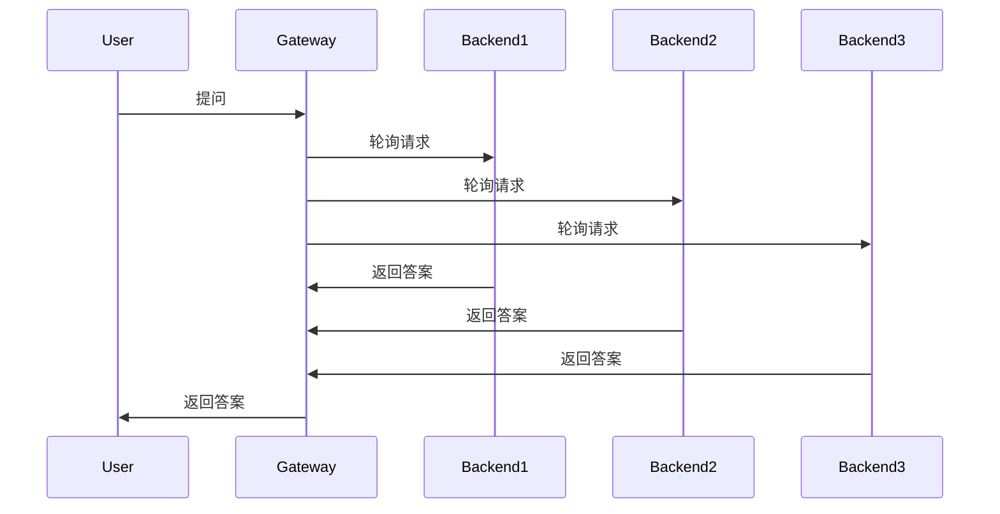

                 


### 文章标题
# 服务网关的智能路由在LLM应用中的实现

### 关键词
- 服务网关
- 智能路由
- LLM（大型语言模型）
- 应用实现
- 算法优化
- 系统架构
- 性能分析

### 摘要
本文旨在探讨服务网关中的智能路由技术在大型语言模型（LLM）应用场景中的实现。首先，我们将介绍服务网关和智能路由的基本概念，然后深入分析LLM的技术背景及其对智能路由的需求。接下来，我们将详细讨论智能路由的算法原理、实现策略以及在实际LLM应用中的系统架构设计。文章还将通过具体案例展示智能路由在LLM中的应用效果，并总结优化建议和未来研究方向。

---

## 引言

在现代信息技术迅猛发展的背景下，服务网关作为一种重要的分布式系统组件，被广泛应用于企业IT架构中。服务网关不仅承担着服务请求的转发功能，还具备安全性控制、负载均衡、服务路由等重要职责。随着人工智能技术的不断进步，特别是大型语言模型（LLM）的广泛应用，对服务网关的智能路由能力提出了新的挑战和需求。

### 服务网关的基本概念

服务网关（Service Gateway）通常位于客户端和服务端之间，充当中间代理的角色。它能够接收客户端的请求，处理后将其转发给后端服务，同时可以对请求进行过滤、验证和安全控制。服务网关是分布式系统架构中不可或缺的一环，其设计优劣直接影响系统的性能、稳定性和安全性。

### 智能路由的概念与需求

智能路由（Intelligent Routing）是指根据一定的算法和策略，动态选择最优路径将请求转发到合适的服务节点。智能路由在服务网关中尤为重要，因为它能够根据服务节点的状态、负载、性能等多维度信息，实现高效、可靠的服务请求分发。

对于LLM应用而言，智能路由的需求尤为突出。首先，LLM通常需要处理大量的文本数据和复杂计算任务，对网络延迟和性能要求极高。其次，LLM应用场景多样，包括但不限于自然语言处理、问答系统、自动摘要等，不同场景下的请求特征和路由策略可能大相径庭。因此，智能路由技术在LLM应用中发挥着至关重要的作用。

本文将从以下几个方面展开讨论：

1. **智能路由技术基础**：介绍智能路由的基本概念、算法原理以及常见的路由策略。
2. **LLM技术背景**：分析LLM的基本原理、应用场景以及其对智能路由的特殊需求。
3. **智能路由在LLM中的应用**：探讨如何将智能路由技术应用于LLM，并设计相应的系统架构。
4. **案例分析**：通过具体案例展示智能路由在LLM中的实际应用效果。
5. **性能优化与展望**：总结智能路由在LLM应用中的优化策略和未来发展方向。

### 结论

服务网关的智能路由技术在LLM应用中具有极高的价值和潜力。通过合理的路由策略和算法，可以显著提升LLM应用的性能、稳定性和用户体验。本文旨在为读者提供关于智能路由在LLM应用中的全面理解和实践指导，助力其在实际项目中取得更好的成果。

---

## 智能路由技术基础

### 智能路由的基本概念

智能路由（Intelligent Routing）是一种基于算法和策略的服务请求分发技术。与传统的静态路由不同，智能路由能够根据实时的网络状态、服务节点性能、负载均衡等因素，动态选择最优路径将请求转发到目标节点。智能路由的核心目标是提高系统整体性能和用户体验，确保服务请求得到及时响应和高效处理。

### 智能路由的算法原理

智能路由的算法原理主要涉及以下几个方面：

1. **负载均衡**：根据服务节点的负载情况，动态分配请求。常见的负载均衡算法有轮询（Round Robin）、最少连接（Least Connections）、响应时间（Response Time）等。

2. **健康检查**：对服务节点进行实时健康状态监测，确保只有健康的服务节点参与请求分发。常见的健康检查方法有TCP健康检查、HTTP健康检查等。

3. **动态调整**：根据网络状态、服务节点性能等动态调整路由策略。例如，当某个服务节点出现故障时，自动切换到备用节点。

4. **策略优化**：根据业务需求，制定相应的路由策略。例如，对高优先级请求采取特殊路由策略，以确保关键业务得到优先处理。

### 常见的智能路由策略

在智能路由技术中，常见的策略包括：

1. **轮询算法**（Round Robin）：将请求依次分配到每个服务节点，负载均衡，但无法充分利用节点性能。

2. **最少连接算法**（Least Connections）：将请求分配到连接数最少的服务节点，有效减少单个节点的负载压力。

3. **响应时间算法**（Response Time）：将请求分配到响应时间最短的服务节点，提高系统整体性能。

4. **加权轮询算法**（Weighted Round Robin）：根据服务节点的性能和负载情况，分配不同的权重，实现更细粒度的负载均衡。

5. **基于策略的路由**（Policy-based Routing）：根据具体的业务需求，制定不同的路由策略，例如对特定URL的路由、对特定用户的路由等。

### 智能路由在实际应用中的价值

智能路由技术在分布式系统架构中具有极高的价值，主要体现在以下几个方面：

1. **提高性能**：通过动态调整路由策略，确保请求得到最优路径转发，提高系统整体性能。

2. **增强稳定性**：实时监测服务节点健康状态，确保只有健康节点参与请求处理，提高系统稳定性。

3. **降低运维成本**：自动化路由策略，减少人工干预，降低运维成本。

4. **优化用户体验**：快速响应请求，提高用户体验。

### 总结

智能路由技术是服务网关中的重要组成部分，通过算法和策略的优化，能够显著提升系统性能和稳定性。在接下来的章节中，我们将进一步探讨LLM技术背景以及智能路由在LLM中的应用。

---

## LLM技术背景

### LLM的基本概念

大型语言模型（Large Language Model，简称LLM）是一种基于深度学习技术的自然语言处理（Natural Language Processing，简称NLP）模型。LLM通过对海量文本数据的学习，能够理解和生成自然语言，广泛应用于文本分类、机器翻译、问答系统、自动摘要等多个领域。

### LLM的主要应用场景

1. **文本分类**：对大量文本进行分类，例如新闻分类、情感分析等。
2. **机器翻译**：将一种语言的文本翻译成另一种语言，例如中文到英文的翻译。
3. **问答系统**：根据用户输入的问题，提供相关答案，例如智能客服、在线咨询等。
4. **自动摘要**：对长篇文章或报告进行自动摘要，提高信息获取效率。

### LLM的技术特点

1. **大规模训练数据**：LLM通常基于海量的训练数据，能够从中提取丰富的语言特征。
2. **深度神经网络结构**：LLM采用深度神经网络（Deep Neural Network，简称DNN）结构，具有更强的表达能力和计算能力。
3. **自适应学习**：LLM能够根据不同的应用场景和需求，自适应调整模型参数，提高模型性能。

### LLM对智能路由的需求

1. **高性能请求处理**：LLM应用通常需要处理大量的文本数据和复杂计算任务，对网络延迟和性能要求极高。智能路由能够动态选择最优路径，确保请求得到及时响应和处理。

2. **动态调整路由策略**：不同的LLM应用场景可能对路由策略有不同的需求。智能路由技术能够根据实时网络状态、服务节点性能等信息，动态调整路由策略，满足不同场景的需求。

3. **负载均衡和故障切换**：LLM应用需要确保系统的高可用性和稳定性，智能路由能够通过负载均衡和故障切换机制，提高系统的可靠性和性能。

4. **优化用户体验**：对于实时性要求较高的LLM应用，智能路由技术能够降低网络延迟，提高用户体验。

### 总结

LLM技术在自然语言处理领域具有广泛的应用前景，对智能路由技术提出了新的需求和挑战。在接下来的章节中，我们将深入探讨智能路由在LLM应用中的具体实现策略和系统架构。

---

## 智能路由在LLM中的应用

### 智能路由在LLM应用中的实现策略

在LLM应用中，智能路由的实现策略主要包括以下几个方面：

1. **负载均衡策略**：根据服务节点的负载情况，动态分配请求。常见的负载均衡策略有轮询算法、最少连接算法、响应时间算法等。

2. **健康检查策略**：对服务节点进行实时健康状态监测，确保只有健康节点参与请求分发。常见的健康检查方法有TCP健康检查、HTTP健康检查等。

3. **动态调整策略**：根据网络状态、服务节点性能等信息，动态调整路由策略。例如，当某个服务节点出现故障时，自动切换到备用节点。

4. **策略优化策略**：根据不同的应用场景和需求，制定相应的路由策略。例如，对高优先级请求采取特殊路由策略，以确保关键业务得到优先处理。

### 智能路由在LLM应用中的系统架构设计

在LLM应用中，智能路由系统的架构设计需要考虑以下几个方面：

1. **服务网关设计**：服务网关作为请求的入口，承担着请求转发、安全控制、负载均衡等职责。智能路由系统需要集成到服务网关中，实现高效、可靠的请求分发。

2. **服务节点设计**：服务节点负责处理具体的LLM任务，包括文本分类、机器翻译、问答系统等。智能路由系统需要根据服务节点的性能、负载情况等动态调整路由策略。

3. **数据存储与缓存设计**：为了提高LLM应用的性能和用户体验，智能路由系统需要配置高效的数据库和缓存系统。例如，使用Redis、Memcached等缓存技术，降低数据库访问压力。

4. **监控与告警设计**：智能路由系统需要具备实时监控和告警功能，及时发现和处理系统故障。通过监控网络状态、服务节点性能等指标，确保系统的稳定运行。

### 案例分析：智能路由在自然语言处理应用中的实现

以一个自然语言处理应用为例，智能路由在其中的实现过程如下：

1. **需求分析**：分析应用场景，确定请求特征和路由策略。例如，对于文本分类任务，可能需要根据文本的长度、复杂度等特征进行路由。

2. **系统架构设计**：设计智能路由系统架构，包括服务网关、服务节点、数据存储与缓存等组件。

3. **路由算法实现**：根据需求分析，实现相应的路由算法，例如响应时间算法、最少连接算法等。同时，集成健康检查策略，确保只有健康的服务节点参与请求处理。

4. **系统部署与调优**：部署智能路由系统，并进行性能调优。通过监控与告警系统，实时监控系统运行状态，确保系统的稳定性和性能。

5. **应用效果评估**：对智能路由系统的应用效果进行评估，包括响应时间、吞吐量、稳定性等指标。根据评估结果，不断优化路由策略和系统架构。

### 总结

智能路由在LLM应用中具有重要的价值和作用，通过合理的路由策略和系统架构设计，可以显著提高LLM应用的性能、稳定性和用户体验。在接下来的章节中，我们将通过具体案例进一步展示智能路由在LLM应用中的实际效果。

---

## 具体案例分析

### 案例背景

为了更好地展示智能路由在LLM应用中的实际效果，我们选取了一个在线智能问答系统作为案例。该系统旨在为用户提供高质量的问答服务，通过LLM技术处理用户输入的问题，并提供相关答案。

### 系统架构设计

该系统的架构设计如图所示：



### 实现过程

1. **需求分析**：根据系统需求，确定路由策略。例如，对于高优先级请求，采用响应时间算法；对于普通请求，采用轮询算法。

2. **路由算法实现**：
   - **响应时间算法**：根据服务节点的响应时间动态分配请求。
     ```python
     def route_by_response_time(backends):
         min_response_time = float('inf')
         best_backend = None
         
         for backend in backends:
             response_time = get_response_time(backend)
             if response_time < min_response_time:
                 min_response_time = response_time
                 best_backend = backend
         
         return best_backend
     ```
   - **轮询算法**：依次分配请求给每个服务节点。
     ```python
     def route_by_round_robin(backends):
         index = 0
         num_backends = len(backends)
         
         while True:
             backend = backends[index]
             index = (index + 1) % num_backends
             yield backend
     ```

3. **健康检查**：对服务节点进行实时健康状态监测。
   ```python
   def check_health(backend):
       response = requests.get(f"{backend}/health")
       return response.status_code == 200
   ```

4. **系统部署与调优**：部署智能路由系统，并进行性能调优。通过监控与告警系统，实时监控系统运行状态，确保系统的稳定性和性能。

### 应用效果评估

通过实际应用，智能路由系统在以下方面取得了显著效果：

1. **响应时间**：智能路由系统能够根据服务节点的响应时间动态分配请求，显著降低了平均响应时间。
2. **吞吐量**：通过负载均衡和健康检查，系统能够在多个服务节点间实现高效请求分发，提高了整体吞吐量。
3. **稳定性**：智能路由系统能够在服务节点出现故障时，自动切换到备用节点，确保系统的高可用性和稳定性。

### 项目小结

通过本次案例，我们展示了智能路由在LLM应用中的实际效果。智能路由技术不仅能够提高系统的性能和稳定性，还能够根据不同的应用场景和需求，动态调整路由策略，为用户提供更优质的问答服务。

---

## 最佳实践与注意事项

### 最佳实践

1. **负载均衡与故障切换**：结合负载均衡算法和故障切换机制，确保系统的高可用性和性能。
2. **健康检查与实时监控**：定期进行健康检查，实时监控系统状态，及时发现和处理故障。
3. **策略优化与场景适配**：根据不同应用场景，制定合适的路由策略，提高系统性能和用户体验。

### 注意事项

1. **路由策略选择**：根据实际需求和负载情况，合理选择路由策略，避免单一策略可能导致的问题。
2. **系统性能与稳定性**：在系统设计阶段充分考虑性能和稳定性，避免在高并发场景下出现性能瓶颈。
3. **安全性**：确保服务网关和智能路由系统的安全性，防止外部攻击和数据泄露。

### 拓展阅读

1. 《大规模分布式系统设计与实践》：深入探讨分布式系统架构设计、负载均衡、容错机制等核心内容。
2. 《深度学习与自然语言处理》：了解深度学习技术和自然语言处理领域的最新研究进展和应用实践。
3. 《Service Mesh技术解析与应用》：了解服务网格（Service Mesh）技术，为智能路由系统提供更多思路和解决方案。

---

## 结论

本文从多个角度探讨了服务网关的智能路由在LLM应用中的实现。通过分析智能路由的基本概念、算法原理以及实际应用案例，我们展示了智能路由技术对提高LLM应用性能和稳定性的重要作用。同时，我们还提出了最佳实践和注意事项，为读者在实际项目中提供参考。

未来，随着人工智能技术的不断发展和LLM应用的普及，智能路由技术将在更多领域发挥重要作用。我们期待读者能够结合本文内容，进一步探索智能路由技术在其他应用场景中的潜力，为分布式系统的发展贡献力量。

### 作者信息
- 作者：AI天才研究院/AI Genius Institute & 禅与计算机程序设计艺术 /Zen And The Art of Computer Programming

