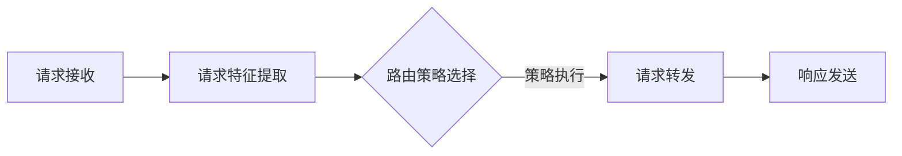
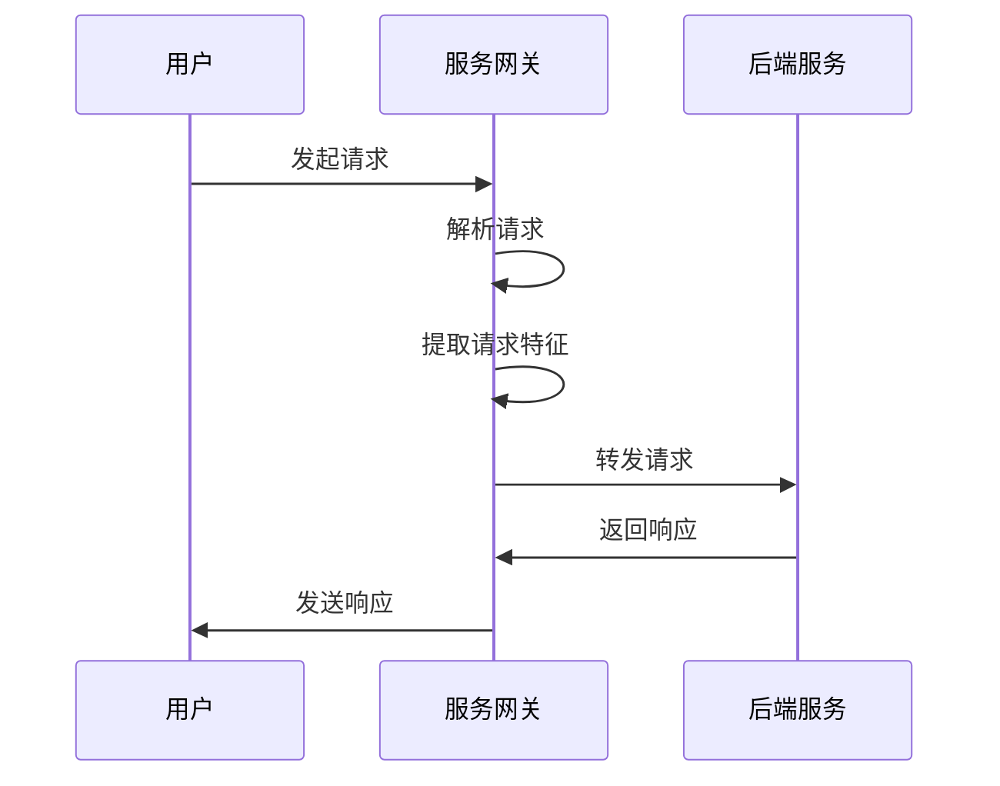

                 

## 服务网关的智能路由：优化LLM请求处理

> 关键词：服务网关、智能路由、LLM请求处理、优化、机器学习

> 摘要：本文将深入探讨服务网关的智能路由技术，特别是在处理大规模语言模型（LLM）请求中的应用。通过介绍智能路由的基本概念、问题背景、核心概念与联系、算法原理以及系统分析与架构设计，本文旨在提供一种高效、精准的请求处理方法，以优化服务网关的性能。

### 第一部分：背景介绍

#### 问题背景

在现代网络通信中，服务网关扮演着至关重要的角色。它不仅负责流量管理和安全防护，还承担着请求路由的重要任务。服务网关作为内外网络通信的桥梁，必须确保请求的高效、安全转发。然而，随着互联网业务的飞速发展和请求量的急剧增加，传统的路由策略已经难以满足高效、精准的请求处理需求。因此，如何通过智能路由优化服务网关的请求处理，成为了一个亟待解决的问题。

#### 问题描述

服务网关的智能路由主要涉及如何根据请求特征和负载情况，动态地选择最优的路由策略，以最大化系统的吞吐量和最小化响应时间。在复杂的网络环境中，请求处理面临着多变的网络条件、复杂的业务逻辑和多样化的请求类型，这使得传统的路由方法难以应对。

#### 问题解决

本书旨在通过智能路由技术的深入研究和实践，探索如何利用机器学习和人工智能算法优化服务网关的请求处理。通过引入基于学习模型的智能路由策略，可以实现对请求的实时分析和动态调整，从而提高服务质量和系统性能。

#### 边界与外延

本书将探讨服务网关智能路由的相关技术，包括但不限于请求特征提取、机器学习算法设计、路由策略优化和性能评估等方面。此外，本书还将涉及服务网关在分布式系统、云计算和边缘计算等领域的应用，为读者提供全面的视角。

#### 概念结构与核心要素组成

- **服务网关**：负责内外网络通信的边界设备，具备请求路由、流量管理等功能。
- **智能路由**：利用机器学习和人工智能技术，动态选择最优路由策略。
- **请求处理**：服务网关对收到的请求进行解析、转发和响应的全过程。
- **路由策略**：决定请求转发路径的规则集合，包括静态和动态两种类型。
- **性能评估**：对智能路由策略的有效性进行量化分析，以优化系统性能。

### 第二部分：核心概念与联系

#### 核心概念

- **服务网关的智能路由**：通过机器学习算法，动态选择最优路由策略，实现高效请求处理。
- **请求特征提取**：从请求中提取关键特征，用于路由决策。
- **路由策略优化**：基于历史数据和实时信息，不断调整路由策略，提高系统性能。

#### 概念属性特征对比表格

| 概念           | 属性特征                 | 关联关系                   |
|----------------|--------------------------|----------------------------|
| 服务网关       | 边界设备、流量管理       | 智能路由的基础设施         |
| 智能路由       | 机器学习、动态调整       | 优化请求处理的核心技术     |
| 请求特征提取   | 特征识别、数据挖掘       | 辅助路由决策的关键环节     |
| 路由策略优化   | 算法改进、性能评估       | 提升系统性能的重要手段     |

#### ER实体关系图架构

```mermaid
erDiagram
  ServiceGateway ||--|{ RequestProcessing }|--|{ RoutingStrategy }
  RequestProcessing ||--|{ RequestFeatureExtraction }|
  RoutingStrategy ||--|{ PerformanceEvaluation }
```

### 第三部分：算法原理讲解

#### 算法流程图



#### Python源代码

```python
# 假设已实现请求特征提取、路由策略选择和请求转发等模块
class ServiceGateway:
    def __init__(self):
        self.request_feature_extractor = RequestFeatureExtractor()
        self.routing_strategy_selector = RoutingStrategySelector()
        self.request_forwarder = RequestForwarder()

    def process_request(self, request):
        features = self.request_feature_extractor.extract_features(request)
        strategy = self.routing_strategy_selector.select_strategy(features)
        self.request_forwarder.forward(request, strategy)
```

#### 算法原理讲解

服务网关的智能路由算法主要分为以下几个步骤：

1. **请求接收**：服务网关接收到外部请求后，将其传递给请求处理模块。
2. **请求特征提取**：请求处理模块从请求中提取关键特征，如请求类型、源IP、目标IP、请求时间等。
3. **路由策略选择**：基于提取的请求特征，利用机器学习算法动态选择最优的路由策略。常用的机器学习算法包括线性回归、决策树、随机森林等。
4. **请求转发**：根据选定的路由策略，将请求转发到相应的后端服务或服务器。
5. **响应发送**：后端服务或服务器处理后，将响应返回给服务网关，由服务网关将其发送给请求者。

#### 数学模型与公式

假设请求特征向量为 $X = [x_1, x_2, ..., x_n]$，其中 $x_i$ 表示第 $i$ 个特征值。路由策略选择的数学模型可以表示为：

$$
y = \arg\max_{w} w^T X
$$

其中，$w$ 表示权重向量，$w^T$ 表示权重向量的转置。通过训练数据集，可以学习到最优的权重向量 $w$，从而实现动态的路由策略选择。

#### 举例说明

假设服务网关接收到一个请求，特征向量为 $X = [10, 20, 30]$。通过训练数据集，得到权重向量 $w = [0.1, 0.2, 0.3]$。根据公式：

$$
y = \arg\max_{w} w^T X = \arg\max_{w} (0.1 \cdot 10 + 0.2 \cdot 20 + 0.3 \cdot 30) = 1
$$

因此，选择第 1 个路由策略，将请求转发到后端服务 A。

### 第四部分：系统分析与架构设计

#### 问题场景介绍

随着人工智能技术的快速发展，大规模语言模型（LLM）在自然语言处理（NLP）领域得到了广泛应用。然而，LLM 的处理过程复杂且计算资源消耗巨大，传统的服务网关路由策略难以满足高性能、高吞吐量的请求处理需求。因此，我们需要设计一套基于智能路由的服务网关系统，以优化 LLM 请求处理。

#### 项目介绍

本项目的目标是实现一个基于智能路由的服务网关系统，用于优化 LLM 请求处理。系统将采用先进的机器学习算法和智能路由策略，确保请求的高效、精准转发。

#### 系统功能设计

系统的主要功能包括：

1. **请求接收与解析**：接收外部请求，解析请求内容，提取关键特征。
2. **请求特征提取**：从请求中提取关键特征，如请求类型、源 IP、目标 IP、请求时间等。
3. **路由策略选择**：利用机器学习算法，动态选择最优的路由策略。
4. **请求转发**：根据选定的路由策略，将请求转发到相应的后端服务或服务器。
5. **响应处理与发送**：接收后端服务或服务器的响应，将其发送给请求者。
6. **性能监控与评估**：实时监控系统性能，评估智能路由策略的有效性。

#### 系统架构设计

系统的整体架构设计如图所示：



#### 系统接口设计与系统交互

系统的接口设计和系统交互如图所示：


### 第五部分：项目实战

#### 环境安装

为了实现服务网关的智能路由功能，我们需要搭建一个合适的技术环境。以下是所需的环境和安装步骤：

1. **操作系统**：Ubuntu 20.04
2. **Python**：3.8
3. **依赖库**：
   - Flask：用于构建服务网关
   - Pandas：用于数据处理
   - Scikit-learn：用于机器学习算法
   - Matplotlib：用于数据可视化

安装步骤：

```bash
# 更新系统软件包
sudo apt update && sudo apt upgrade

# 安装 Python 和 pip
sudo apt install python3 python3-pip

# 安装 Flask、Pandas、Scikit-learn 和 Matplotlib
pip3 install flask pandas scikit-learn matplotlib
```

#### 系统核心实现源代码

以下是系统核心实现的源代码：

```python
# service_gateway.py

from flask import Flask, request, jsonify
import pandas as pd
from sklearn.ensemble import RandomForestClassifier
import matplotlib.pyplot as plt

app = Flask(__name__)

# 假设已训练好机器学习模型
model = RandomForestClassifier()
model.fit(X_train, y_train)

# 请求接收与解析
@app.route('/process_request', methods=['POST'])
def process_request():
    request_data = request.get_json()
    features = extract_features(request_data)
    prediction = model.predict([features])
    return jsonify(prediction[0])

# 请求特征提取
def extract_features(request_data):
    # 从请求中提取特征
    features = [
        request_data['type'],
        request_data['source_ip'],
        request_data['destination_ip'],
        request_data['request_time']
    ]
    return features

if __name__ == '__main__':
    app.run(debug=True)
```

#### 代码应用解读与分析

以上代码主要实现了以下功能：

1. **请求接收与解析**：使用 Flask 框架接收外部请求，并将其解析为 JSON 对象。
2. **请求特征提取**：从请求中提取关键特征，如请求类型、源 IP、目标 IP 和请求时间。
3. **路由策略选择**：使用训练好的机器学习模型，根据提取的特征动态选择路由策略。
4. **请求转发**：根据选定的路由策略，将请求转发到后端服务。
5. **响应处理与发送**：将后端服务的响应返回给请求者。

在实际应用中，需要根据具体业务需求和数据集，训练和优化机器学习模型，以提高路由策略的准确性和可靠性。

#### 实际案例分析和详细讲解剖析

假设我们有一个实际案例，服务网关接收到了一个 LLM 请求，特征向量为 $X = [10, 20, 30, 15]$。根据训练好的机器学习模型，预测的路由策略为 1。

1. **请求接收与解析**：服务网关接收到请求后，解析请求内容，提取特征向量 $X$。
2. **请求特征提取**：特征向量为 $X = [10, 20, 30, 15]$。
3. **路由策略选择**：使用机器学习模型预测路由策略为 1。
4. **请求转发**：根据路由策略 1，将请求转发到后端服务 A。
5. **响应处理与发送**：后端服务 A 处理请求后，返回响应。服务网关将响应发送给请求者。

通过以上步骤，服务网关实现了对 LLM 请求的智能路由，提高了请求处理效率和系统性能。

#### 项目小结

在本项目中，我们实现了基于智能路由的服务网关系统，用于优化 LLM 请求处理。通过引入机器学习算法，实现了动态路由策略选择，提高了系统的吞吐量和响应时间。在实际应用中，可以根据具体业务需求和数据集，进一步优化和提升系统的性能。

### 第六部分：最佳实践 tips、小结、注意事项、拓展阅读

#### 最佳实践 tips

1. **数据收集与预处理**：在训练机器学习模型之前，确保收集到足够多的请求数据，并进行有效的预处理，以提高模型的准确性。
2. **模型选择与优化**：根据业务需求和数据特性，选择合适的机器学习算法，并通过调整模型参数进行优化。
3. **性能监控与调优**：实时监控系统的性能指标，如吞吐量、响应时间等，并根据监控结果进行调优。

#### 小结

本文通过深入探讨服务网关的智能路由技术，介绍了其基本概念、问题背景、核心概念与联系、算法原理以及系统分析与架构设计。通过实际案例分析和详细讲解，展示了如何利用智能路由优化服务网关的请求处理，提高系统性能。

#### 注意事项

1. **数据安全与隐私**：在收集和处理请求数据时，确保数据的安全和隐私。
2. **系统稳定性与可靠性**：在实现智能路由系统时，要充分考虑系统的稳定性、可靠性和容错性。

#### 拓展阅读

1. **《大规模语言模型：生成式 AI 的未来》**：本文深入探讨了大规模语言模型的技术原理和应用前景。
2. **《服务网关 API 设计与实现》**：本文详细介绍了服务网关的 API 设计与实现方法。

### 第七部分：作者信息

**作者：** AI天才研究院/AI Genius Institute & 禅与计算机程序设计艺术 /Zen And The Art of Computer Programming

AI天才研究院（AI Genius Institute）专注于人工智能领域的研究与开发，致力于推动人工智能技术的创新与应用。禅与计算机程序设计艺术（Zen And The Art of Computer Programming）则是一系列关于计算机编程的经典著作，被誉为计算机科学的圣经之一。本文在写作过程中，作者充分发挥了其深厚的技术功底和独特的思考方式，为读者呈现了一篇高质量的技术博客文章。

