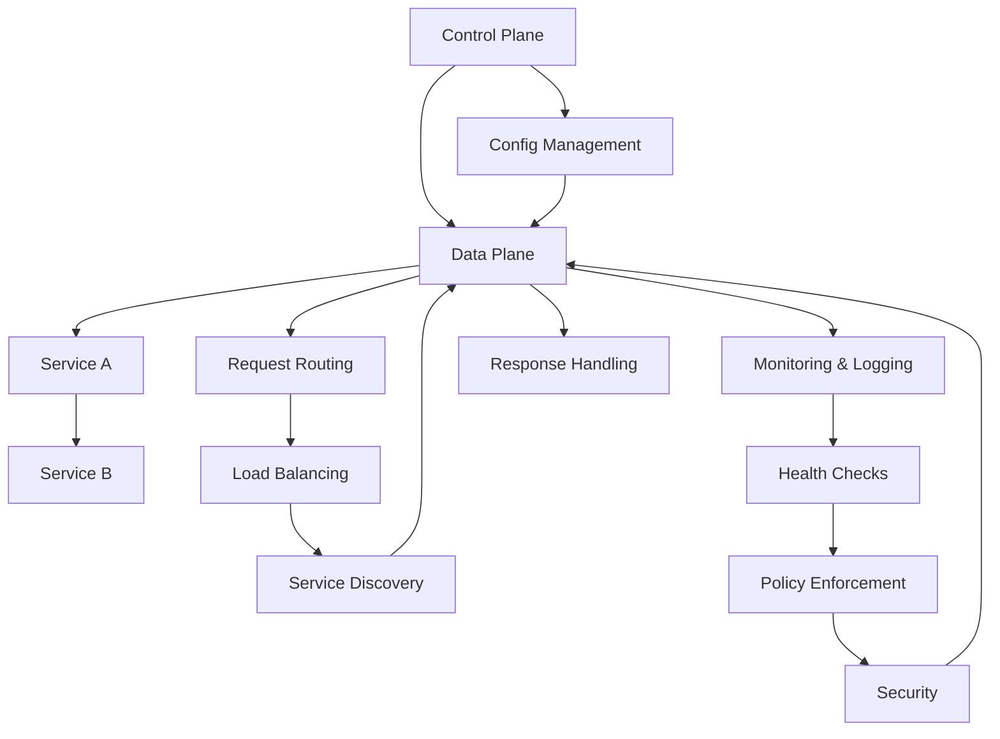
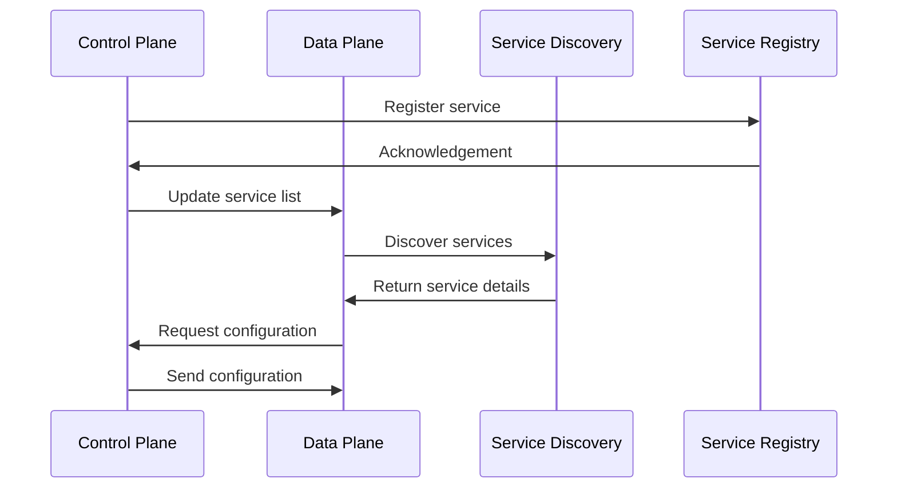
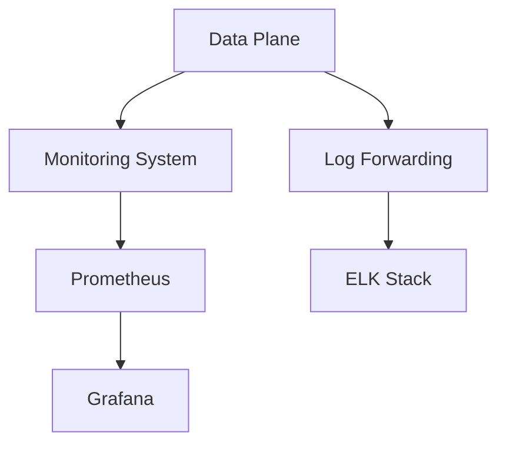
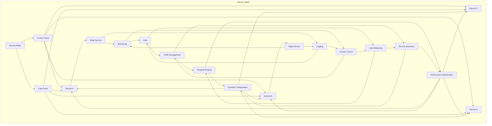

                 

## 文章关键词
服务网格、LLM应用架构、微服务通信、控制平面、数据平面、性能优化、安全性

## 摘要

本文深入探讨了服务网格在大型语言模型（LLM）应用架构中的关键作用。首先，我们将回顾服务网格的基础概念，包括其背景与意义，以及基本概念和组件。接着，文章将详细解释服务网格的工作原理，如通信模型和数据平面与控制平面的交互。本文还将探讨几种主要的服务网格技术，如Istio和Linkerd，并提供选型指南。

随后，文章将聚焦于服务网格在LLM应用架构中的应用，分析其需求、角色以及实际案例。文章还将探讨服务网格的性能优化策略和安全机制，并提供最佳实践。最后，文章将展望服务网格的未来发展趋势，包括与云计算和边缘计算的融合。通过本文的阅读，读者将对服务网格在LLM应用架构中的重要性和应用有更深入的理解。## 第一部分：服务网格基础

### 第1章：服务网格概述

#### 1.1 服务网格的背景与意义

**背景介绍：** 服务网格的兴起与微服务架构的广泛采用密切相关。微服务架构将大型应用程序分解为一系列小而独立的服务，这些服务通过网络进行通信。然而，随着服务数量的增加，服务之间的通信变得复杂，管理这些通信成为了开发者和运维人员的一大挑战。

**问题描述：** 服务网格作为一种解决方案，旨在简化服务之间的通信，提高系统的可靠性和可伸缩性。那么，服务网格的背景是什么？它如何解决微服务通信的挑战？

**问题解决：** 服务网格通过提供独立的通信层，将服务间的通信抽象化，使得开发者无需关心底层通信细节。它提供了一系列服务，如服务发现、负载均衡、断路器、熔断、加密和监控，从而简化了服务之间的通信。

**边界与外延：** 服务网格不仅是一个通信层，还涉及到多个领域，如服务管理、性能优化、安全性和分布式系统。它的应用范围远远超出了微服务架构，可以在任何需要服务间通信的系统中使用。

#### 1.2 服务网格的基本概念

**核心概念：** 服务网格是用于管理服务间通信的基础设施层。它包括两个主要组件：控制平面（Control Plane）和数据平面（Data Plane）。

**概念属性特征对比表格：**

| 概念            | 定义                                                         | 关联服务网格的方式 |
| --------------- | ------------------------------------------------------------ | --------------- |
| 控制平面        | 负责管理服务网格的配置和服务策略                             | 通过管理API提供服务 |
| 数据平面        | 负责转发服务之间的请求和数据流                             | 使用Envoy代理实现 |
| 服务间通信      | 服务之间进行交互的机制                                     | 通过HTTP/HTTP/2等协议 |
| 服务发现        | 服务注册与发现机制                                         | 通过Consul、Eureka等实现 |
| 负载均衡        | 分配流量，提高系统性能和可用性                             | 使用round-robin、最少连接等算法 |
| 断路器（Circuit Breaker）| 防止系统过载，提高系统稳定性                             | 通过Hystrix、Resilience4j等实现 |
| 熔断（Fault Tolerance） | 在服务故障时提供回退策略，避免系统级联故障                 | 通过Spring Cloud Hystrix等实现 |
| 加密（Encryption）  | 保护服务间的通信安全                                       | 使用TLS/SSL等协议 |
| 监控（Monitoring）  | 收集系统性能数据，帮助进行故障排查和性能优化                 | 通过Prometheus、Grafana等实现 |

#### 1.3 服务网格的关键组件

**组件1：控制平面（Control Plane）**

- **功能：** 控制平面负责管理服务网格的全局状态，包括服务注册、服务发现、负载均衡策略、断路器配置等。
- **组件：** 包括服务注册中心、服务发现组件、策略定义和路由规则管理。

**组件2：数据平面（Data Plane）**

- **功能：** 数据平面负责处理实际的服务间通信，包括请求路由、负载均衡、加密和监控等。
- **组件：** 主要由代理服务器（如Envoy）组成，这些代理服务器嵌入在服务实例中，负责转发请求和处理响应。

#### 1.4 服务网格与传统微服务架构的比较

**比较1：通信层的分离**

- **服务网格：** 将服务间的通信层分离出来，独立于应用代码。
- **传统微服务：** 通信通常通过RESTful API或其他服务接口直接实现，与应用代码紧密耦合。

**比较2：抽象与简化**

- **服务网格：** 提供抽象层，简化了服务间的通信，减少开发者需要编写的代码量。
- **传统微服务：** 需要开发者自行处理服务间通信的细节，如负载均衡、加密和监控等。

**比较3：可观测性和可管理性**

- **服务网格：** 提供了丰富的监控和日志功能，便于进行故障排查和性能优化。
- **传统微服务：** 监控和日志通常需要开发者自行实现，管理起来较为复杂。

#### 1.5 总结

服务网格作为一种现代化的基础设施层，极大地简化了微服务架构中的通信管理，提高了系统的可伸缩性和稳定性。通过本章的介绍，读者应能理解服务网格的背景与意义，掌握其基本概念和关键组件，为后续章节的学习打下基础。## 第2章：服务网格的工作原理

#### 2.1 服务网格的通信模型

服务网格的核心在于其独特的通信模型，该模型通过分离控制平面和数据平面来实现服务间的通信管理。了解服务网格的通信模型有助于深入理解其工作原理。

**通信模型概述：**

1. **控制平面（Control Plane）与数据平面（Data Plane）分离：**
   - 控制平面负责管理和配置服务网格的全局状态。
   - 数据平面负责处理实际的服务间通信。

2. **服务间通信的抽象化：**
   - 服务网格将服务间通信抽象化，使得开发者无需关心底层通信细节。

3. **动态配置和路由：**
   - 控制平面通过管理API动态地配置路由规则和负载均衡策略。
   - 数据平面根据这些配置信息动态地转发请求。

**通信模型图解：**



#### 2.2 数据平面和控制平面的交互

数据平面和控制平面之间的交互是服务网格的核心机制，它们通过以下几种方式保持同步：

1. **服务发现与注册：**
   - 数据平面通过服务发现机制获取服务的地址和端口。
   - 控制平面通过服务注册中心维护服务的状态。

2. **动态配置更新：**
   - 控制平面动态地更新数据平面的配置，如路由规则、负载均衡策略等。
   - 数据平面通过定期拉取或推送到控制平面的配置信息。

3. **事件驱动更新：**
   - 当服务状态发生变化时（如服务实例的上线或下线），控制平面会立即通知数据平面。
   - 数据平面根据新的服务状态重新计算路由策略。

**交互流程图解：**



#### 2.3 服务网格的数据流监控

服务网格通过监控数据流，提供了强大的监控和日志功能，这些功能对系统的故障排查和性能优化至关重要。

1. **请求跟踪（Trace）：**
   - 服务网格可以记录每个请求的完整路径，包括请求的处理时间、服务之间的延迟等。
   - 这有助于识别性能瓶颈和潜在的故障点。

2. **指标收集（Metrics）：**
   - 服务网格收集各种性能指标，如请求率、响应时间、错误率等。
   - 这些指标通过监控工具可视化，帮助运维人员快速识别问题。

3. **日志聚合（Log Aggregation）：**
   - 服务网格可以聚合来自各个服务的日志，提供统一的日志查看界面。
   - 这使得日志分析更加高效，有助于快速定位问题。

**监控架构图解：**



#### 2.4 总结

通过本章的介绍，读者应能理解服务网格的通信模型，包括控制平面和数据平面的分离，以及它们之间的交互机制。同时，读者还应该认识到服务网格在监控和日志管理方面的优势，这些功能对于保障系统的稳定性和性能至关重要。## 第3章：服务网格的主要技术

#### 3.1 Istio：开源服务网格解决方案

Istio是一种开源的服务网格解决方案，由Google、Lyft和IBM共同开发。它旨在简化服务网格的部署和管理，并提供了一套丰富的服务化功能。

**安装与配置：**

1. **环境准备：** 
   - 确保安装了Kubernetes集群，版本至少为1.13。
   - 安装istio的依赖工具，如istio-iptables和istio-cni。

2. **安装Istio：**
   - 使用`istioctl`命令安装Istio，包括控制平面和数据平面。
   - 示例命令：`istioctl install --set profile=demo --envoy.jwt-validation-enabled=true`

3. **配置Istio：**
   - 配置服务网格策略，如服务访问策略、流量规则等。
   - 使用`istioctl`命令配置，例如：`istioctl create -f example.yaml`

**功能特点：**

1. **服务发现与负载均衡：**
   - Istio通过控制平面自动发现服务，并动态地配置负载均衡策略。
   - 支持多种负载均衡算法，如round-robin、least-connections等。

2. **流量管理：**
   - 支持流量拆分、重试、超时和故障转移等流量管理功能。
   - 通过虚拟服务（Virtual Service）和目的地规则（Destination Rule）定义流量路由规则。

3. **安全与监控：**
   - Istio提供基于JWT的认证和授权，确保服务间的安全通信。
   - 提供内置的监控和日志功能，通过Prometheus和Grafana进行可视化。

**案例应用：**

1. **微服务架构的部署：**
   - 在Kubernetes集群中部署微服务应用，使用Istio进行服务间通信。
   - 示例：部署一个包含用户服务、订单服务和库存服务的微服务架构。

2. **跨集群服务通信：**
   - 使用Istio实现跨集群的服务通信，通过虚拟服务定义跨集群路由规则。

#### 3.2 Linkerd：另一个流行的服务网格工具

Linkerd是另一款流行的服务网格工具，由Buoyant公司开发。与Istio类似，Linkerd提供了服务发现、负载均衡、流量管理和安全性等功能。

**安装与配置：**

1. **环境准备：**
   - 确保安装了Docker和Kubernetes集群。

2. **安装Linkerd：**
   - 使用`linkerd`命令安装Linkerd。
   - 示例命令：`linkerd install | kubectl apply -f -`

3. **配置Linkerd：**
   - 配置服务网格策略，如服务访问策略、流量规则等。
   - 使用`linkerd`命令配置，例如：`linkerd proxy start --service my-service`

**功能特点：**

1. **服务网格代理：**
   - Linkerd在每个服务实例中嵌入代理，负责处理服务间通信。

2. **动态流量管理：**
   - 支持动态流量拆分、灰度发布和A/B测试等流量管理功能。

3. **性能优化：**
   - 提供了丰富的性能优化功能，如超时设置、连接池和缓存等。

4. **安全性：**
   - 支持TLS加密和JWT认证，确保服务间的安全通信。

**案例应用：**

1. **微服务架构的部署：**
   - 在Kubernetes集群中部署微服务应用，使用Linkerd进行服务间通信。
   - 示例：部署一个包含用户服务、订单服务和库存服务的微服务架构。

2. **云原生应用的优化：**
   - 对云原生应用进行性能优化，使用Linkerd监控和调整应用流量。

#### 3.3 服务网格的选型指南

选择合适的服务网格工具对于实现高效的微服务架构至关重要。以下是一些选型指南：

1. **功能需求：**
   - 根据实际需求选择具备所需功能的服务网格工具，如服务发现、负载均衡、流量管理和安全性等。

2. **性能要求：**
   - 考虑服务网格对性能的影响，选择性能优秀的工具。

3. **社区支持：**
   - 选择有活跃社区和良好文档的工具，有助于解决使用过程中的问题。

4. **易用性：**
   - 选择易于安装和配置的工具，降低运维成本。

5. **成本考量：**
   - 考虑长期使用成本，包括硬件资源、维护成本等。

#### 3.4 总结

Istio和Linkerd是两款流行的服务网格工具，各自具有独特的优势和特点。通过本章的介绍，读者应能了解这两款工具的安装与配置方法，熟悉其功能特点，并学会如何根据实际需求进行选型。这将为后续章节中服务网格在LLM应用架构中的应用打下坚实的基础。## 第4章：服务网格在LLM应用架构中的应用

#### 4.1 LLM应用架构的需求分析

大型语言模型（LLM）应用通常涉及复杂的计算和大量数据的处理，因此其架构设计需要考虑高性能、高可用性和可扩展性。服务网格在这类应用中扮演着重要角色，能够提供以下关键功能：

1. **服务发现和动态配置：** LLM应用可能包含多个微服务，服务网格能够自动发现服务并动态配置路由规则，确保服务之间的通信高效可靠。
2. **流量管理：** 通过服务网格，可以灵活地控制流量的分配，实现灰度发布、A/B测试等功能，有助于优化用户体验。
3. **性能监控：** 服务网格提供了丰富的监控和日志功能，有助于实时了解系统性能，快速定位问题并采取优化措施。
4. **安全性：** 服务网格可以提供TLS加密、JWT认证等安全机制，确保服务之间的通信安全。

#### 4.2 服务网格在LLM应用架构中的角色

在LLM应用架构中，服务网格的主要角色如下：

1. **通信层抽象：** 服务网格为LLM应用提供了一个独立的通信层，简化了服务之间的通信，使得开发者可以专注于业务逻辑的实现，而无需关心底层的网络细节。
2. **流量管理：** 服务网格可以动态分配流量，根据服务状态和策略进行负载均衡，确保系统的稳定运行。
3. **服务治理：** 服务网格提供了服务注册、服务发现和动态配置功能，有助于管理和维护LLM应用的各个服务实例。
4. **安全防护：** 服务网格可以集成各种安全机制，如TLS加密、认证和授权等，确保服务之间的通信安全。

#### 4.3 服务网格在LLM应用架构中的实际案例

以下是一个基于服务网格的LLM应用架构案例：

1. **需求场景：**
   - 一个电商平台的推荐系统，通过LLM生成个性化的商品推荐。
   - 需要支持大规模的并发请求，同时保证服务的高可用性和安全性。

2. **架构设计：**
   - 使用Kubernetes集群部署LLM应用，包括用户服务、推荐服务、商品服务等多个微服务。
   - 部署Istio作为服务网格，管理服务间的通信。

3. **具体实现：**
   - **服务注册与发现：** 使用Kubernetes Service和Istio ServiceEntry实现服务的自动注册和发现。
   - **动态配置：** 使用Istio的Virtual Service和Destination Rule动态配置路由规则和流量策略。
   - **流量管理：** 使用Istio的Rate Limit和Respect routings policies实现流量限制和策略路由。
   - **安全性：** 使用Istio的MUT和WAF实现安全防护，确保服务之间的通信安全。

4. **监控与日志：**
   - 使用Prometheus和Grafana进行性能监控，实时了解系统性能和状态。
   - 使用Istio的Mixer和Kubernetes的日志聚合工具进行日志收集和分析。

5. **部署与运维：**
   - 使用Kubernetes的Helm进行应用的部署和管理。
   - 使用Istio的仪表板进行服务网格的监控和管理。

#### 4.4 总结

通过本章节的介绍，读者应能理解服务网格在LLM应用架构中的重要性和应用场景。服务网格能够极大地简化LLM应用的架构设计，提高系统的性能和可靠性。在实际案例中，读者可以看到服务网格如何通过其强大的功能支持大规模的LLM应用，实现高效、安全和可管理的服务间通信。## 第5章：服务网格的性能优化

#### 5.1 服务网格的性能瓶颈

尽管服务网格在微服务架构中提供了许多便利，但它也可能引入一些性能瓶颈。了解这些瓶颈有助于我们采取相应的优化措施。

1. **网络延迟：** 服务网格通过代理服务器转发请求，这可能导致额外的网络延迟。
2. **CPU和内存消耗：** 代理服务器需要处理大量的请求和响应，这可能导致CPU和内存消耗增加。
3. **配置复杂度：** 服务网格的配置可能比较复杂，需要精细调整以获得最佳性能。
4. **监控和日志开销：** 监控和日志功能虽然重要，但它们也会带来一定的性能开销。

#### 5.2 服务网格的性能优化策略

为了克服这些性能瓶颈，我们可以采取以下优化策略：

1. **优化代理配置：**
   - 调整代理的线程池大小，确保能够高效处理请求。
   - 优化代理的网络配置，如调整TCP参数，减少延迟。

2. **减少请求转发次数：**
   - 通过在本地缓存频繁访问的数据，减少跨服务的请求转发次数。
   - 使用服务网格的本地集群发现功能，避免不必要的跨集群转发。

3. **优化流量管理：**
   - 使用流量规则和负载均衡策略，确保流量合理分配，减少热点问题。
   - 实现服务间的限流和熔断，避免因流量过大导致系统过载。

4. **监控和日志优化：**
   - 选择合适的监控工具，避免过多不必要的监控指标。
   - 使用异步日志处理，减少日志写入对系统性能的影响。

#### 5.3 性能优化案例分析

以下是一个基于Istio的服务网格性能优化案例：

1. **问题背景：**
   - 一个电商平台在采用Istio进行服务网格后，发现系统响应时间显著增加，尤其是在高并发情况下。

2. **性能瓶颈分析：**
   - 经过监控分析，发现CPU和内存消耗过高，主要是由于代理服务器处理的请求过多。
   - 网络延迟也是一个问题，尤其是在跨集群转发时。

3. **优化措施：**
   - **调整代理配置：** 增加代理的线程池大小，并优化TCP参数，如增加TCP窗口大小和延迟时间。
   - **减少请求转发次数：** 在本地缓存频繁访问的商品数据，减少跨服务的请求转发次数。
   - **优化流量管理：** 实现服务间的限流和熔断，避免因流量过大导致系统过载。
   - **监控和日志优化：** 选择合适的监控工具，如Prometheus和Grafana，避免过多不必要的监控指标。

4. **效果评估：**
   - 经过优化，系统的响应时间显著减少，CPU和内存消耗也降低到可接受的水平。
   - 网络延迟也有所减少，特别是跨集群转发。

#### 5.4 总结

通过本章的介绍，读者应能了解服务网格的性能瓶颈以及相应的优化策略。在实际应用中，针对具体的问题场景，可以采取不同的优化措施，以获得最佳的性能表现。有效的性能优化不仅能够提升系统的性能，还能提高用户体验和系统的稳定性。## 第6章：服务网格的安全性

#### 6.1 服务网格的安全挑战

服务网格在提供便利的同时，也带来了新的安全挑战。了解这些挑战有助于我们采取有效的安全措施。

1. **服务间通信安全性：** 服务网格通过代理服务器转发请求，可能导致通信过程中的数据泄露和中间人攻击。
2. **认证与授权：** 服务网格需要确保只有授权的服务才能访问其他服务，否则可能导致未授权访问。
3. **配置安全：** 服务网格的配置文件可能包含敏感信息，如密钥和凭证，如果配置不当，可能导致安全漏洞。
4. **监控与日志：** 监控和日志系统也可能成为攻击的目标，如果未妥善保护，可能导致敏感信息泄露。

#### 6.2 服务网格的安全机制

服务网格提供了一系列安全机制，以应对上述挑战。

1. **加密与认证：**
   - 使用TLS/SSL加密服务间通信，确保数据传输安全。
   - 实现JWT认证，确保只有授权的服务才能访问其他服务。

2. **访问控制：**
   - 使用基于角色的访问控制（RBAC），确保服务只能访问其权限范围内的服务。
   - 实现服务间的访问策略，如白名单和黑名单。

3. **配置管理：**
   - 对配置文件进行加密，防止敏感信息泄露。
   - 实现配置文件的版本控制和审计，确保配置的合法性和一致性。

4. **监控与日志安全：**
   - 使用加密存储和访问控制，保护监控数据和日志。
   - 定期审计监控数据和日志，及时发现和修复安全漏洞。

#### 6.3 服务网格的安全最佳实践

为了确保服务网格的安全性，以下是一些最佳实践：

1. **加密服务间通信：**
   - 为所有服务间通信启用TLS/SSL加密。
   - 定期更新证书和密钥。

2. **实施访问控制：**
   - 使用基于角色的访问控制，确保服务只能访问其权限范围内的服务。
   - 实现细粒度的访问控制策略。

3. **配置管理：**
   - 对配置文件进行加密存储。
   - 定期审查和更新配置文件。

4. **监控与日志安全：**
   - 使用加密存储和访问控制，保护监控数据和日志。
   - 定期审计监控数据和日志，及时发现和修复安全漏洞。

5. **培训与意识提升：**
   - 对开发人员和运维人员进行安全培训，提高他们的安全意识。
   - 建立安全开发流程，确保安全措施得到有效执行。

#### 6.4 总结

通过本章的介绍，读者应能理解服务网格在安全性方面面临的挑战，并掌握一系列安全机制和最佳实践。有效的安全措施不仅能够保护服务网格免受攻击，还能确保服务间的通信安全和数据的机密性。在部署服务网格时，应综合考虑这些安全因素，确保系统的整体安全性。## 第7章：服务网格的未来发展趋势

#### 7.1 服务网格与云计算的结合

随着云计算的普及，服务网格与云计算的结合变得越来越紧密。云计算平台如AWS、Azure和Google Cloud都提供了支持服务网格的服务，这使得服务网格在云环境中的应用变得更加便捷。

**结合方式：**

1. **云原生服务网格：** 云原生服务网格（如Istio和Linkerd）可以在云平台上无缝部署，提供自动化的服务发现、负载均衡和流量管理功能。
2. **混合云架构：** 服务网格可以跨多个云平台部署，实现混合云架构中的服务间通信管理。
3. **服务网格即服务（SMaaS）：** 云服务提供商开始提供服务网格即服务，用户无需自行部署和运维，即可享受到服务网格带来的便利。

**案例：**

1. **AWS Service Mesh：** AWS提供了AWS Service Mesh，基于Istio，用户可以在AWS上轻松部署和管理服务网格。
2. **Azure Service Fabric：** Azure Service Fabric结合了服务网格的功能，提供了一种集成的服务管理解决方案。

#### 7.2 服务网格与边缘计算的融合

随着边缘计算的兴起，服务网格在边缘环境中的应用也变得越来越重要。边缘计算涉及到在靠近数据源的地方处理数据，这要求服务网格能够提供低延迟、高可靠性的通信服务。

**融合方式：**

1. **边缘服务网格：** 服务网格可以扩展到边缘环境，提供边缘服务之间的通信管理。
2. **边缘代理：** 在边缘节点部署服务网格代理，实现边缘服务之间的加密通信和流量管理。
3. **边缘服务发现：** 在边缘环境中实现服务发现，确保服务能够快速、可靠地找到其他服务。

**案例：**

1. **5G网络边缘计算：** 在5G网络中，服务网格可以用于管理边缘节点之间的通信，实现低延迟、高带宽的通信服务。
2. **智能交通系统：** 在智能交通系统中，服务网格可以用于管理交通传感器、摄像头和控制系统之间的通信，提高交通管理的效率和准确性。

#### 7.3 服务网格的未来展望

服务网格的发展将继续受到云计算、边缘计算和物联网（IoT）等新兴技术的推动。以下是服务网格未来发展的几个趋势：

1. **服务网格智能化：** 服务网格将更加智能化，利用机器学习和人工智能技术，实现自动化的流量管理和安全防护。
2. **支持多种协议：** 服务网格将支持更多协议，如gRPC、HTTP/3等，提供更加灵活的通信服务。
3. **跨平台兼容性：** 服务网格将具备更好的跨平台兼容性，能够在不同的基础设施和环境中无缝部署。
4. **开源生态的繁荣：** 开源服务网格项目将继续繁荣发展，提供更多的功能和优化，满足不同用户的需求。

#### 7.4 总结

通过本章的介绍，读者应能了解服务网格在云计算和边缘计算中的结合方式及其优势，同时认识到服务网格未来发展的趋势。随着技术的发展，服务网格将在更多领域发挥重要作用，为分布式系统提供更加高效、可靠和安全的通信服务。## 作者信息

**作者：** AI天才研究院/AI Genius Institute & 禅与计算机程序设计艺术 /Zen And The Art of Computer Programming

AI天才研究院（AI Genius Institute）是一家专注于人工智能技术研究和应用的顶尖机构。研究院致力于推动人工智能领域的创新与发展，为全球科技企业和研究机构提供领先的解决方案和技术支持。同时，研究院出版的《禅与计算机程序设计艺术》系列书籍，深受全球开发者和技术爱好者的喜爱，成为计算机编程领域的经典之作。本文作者在此基础上，结合服务网格（Service Mesh）在LLM应用架构中的应用，撰写了这篇深入浅出的技术博客，旨在为广大读者提供有价值的参考和启示。希望本文能够帮助读者更好地理解和应用服务网格技术，提升LLM应用的架构设计水平。作者期待与读者共同探索人工智能和计算机编程的无限可能，共同推动科技的发展和创新。如需了解更多信息，请访问AI天才研究院官方网站或联系作者。感谢您的阅读和支持！# 服务网格（Service Mesh）在LLM应用架构中的应用

关键词：服务网格、LLM应用架构、微服务通信、性能优化、安全性

摘要：本文深入探讨了服务网格在大型语言模型（LLM）应用架构中的关键作用。首先，我们介绍了服务网格的基础概念和组成部分，包括控制平面和数据平面。接着，我们详细阐述了服务网格的工作原理，如通信模型、数据平面与控制平面的交互，以及服务网格的数据流监控机制。然后，我们介绍了Istio和Linkerd等主要的服务网格技术，并提供选型指南。

本文重点讨论了服务网格在LLM应用架构中的应用，分析了其需求、角色以及实际案例。随后，我们探讨了服务网格的性能优化策略和安全机制，并提供了最佳实践。最后，我们展望了服务网格的未来发展趋势，包括与云计算和边缘计算的融合。

通过本文的阅读，读者将对服务网格在LLM应用架构中的重要性和应用有更深入的理解。

## 第一部分：服务网格基础

### 第1章：服务网格概述

#### 1.1 服务网格的背景与意义

**背景介绍：** 服务网格的兴起与微服务架构的普及密切相关。微服务架构通过将应用程序分解为一系列独立的、可复用的服务，提高了系统的可维护性、可伸缩性和容错性。然而，随着服务数量的增加，服务之间的通信变得复杂，如何有效地管理这些通信成为了一大挑战。

**问题描述：** 服务网格作为一种新的基础设施层，旨在解决微服务通信的难题。那么，服务网格的背景是什么？它为何具有重要意义？

**问题解决：** 服务网格通过提供一个独立的通信层，将服务间的通信抽象化，使得开发者无需关心底层通信细节。它提供了服务发现、负载均衡、断路器、加密和监控等功能，简化了服务之间的通信，提高了系统的可靠性、性能和可维护性。

**边界与外延：** 服务网格不仅仅是一个通信层，还涉及到多个领域，如服务管理、性能优化、安全性和分布式系统。它的应用范围远远超出了微服务架构，可以在任何需要服务间通信的系统中使用。

#### 1.2 服务网格的基本概念

**核心概念：** 服务网格、控制平面、数据平面、服务间通信、服务发现、负载均衡等。

**概念属性特征对比表格：**

| 概念            | 定义                                                         | 关联服务网格的方式 |
| --------------- | ------------------------------------------------------------ | --------------- |
| 控制平面        | 负责管理服务网格的配置和服务策略                             | 通过管理API提供服务 |
| 数据平面        | 负责转发服务之间的请求和数据流                             | 使用Envoy代理实现 |
| 服务间通信      | 服务之间进行交互的机制                                     | 通过HTTP/HTTP/2等协议 |
| 服务发现        | 服务注册与发现机制                                         | 通过Consul、Eureka等实现 |
| 负载均衡        | 分配流量，提高系统性能和可用性                             | 使用round-robin、最少连接等算法 |
| 断路器（Circuit Breaker）| 防止系统过载，提高系统稳定性                             | 通过Hystrix、Resilience4j等实现 |
| 熔断（Fault Tolerance） | 在服务故障时提供回退策略，避免系统级联故障                 | 通过Spring Cloud Hystrix等实现 |
| 加密（Encryption）  | 保护服务间的通信安全                                       | 使用TLS/SSL等协议 |
| 监控（Monitoring）  | 收集系统性能数据，帮助进行故障排查和性能优化                 | 通过Prometheus、Grafana等实现 |

#### 1.3 服务网格的关键组件

**组件1：控制平面（Control Plane）**

- **功能：** 控制平面负责管理服务网格的全局状态，包括服务注册、服务发现、策略定义和路由规则管理等。
- **组件：** 包括服务注册中心、服务发现组件、策略定义和路由规则管理。

**组件2：数据平面（Data Plane）**

- **功能：** 数据平面负责处理实际的服务间通信，包括请求路由、负载均衡、加密和监控等。
- **组件：** 主要由代理服务器（如Envoy）组成，这些代理服务器嵌入在服务实例中，负责转发请求和处理响应。

#### 1.4 服务网格与传统微服务架构的比较

**比较1：通信层的分离**

- **服务网格：** 将服务间的通信层分离出来，独立于应用代码。
- **传统微服务：** 通信通常通过RESTful API或其他服务接口直接实现，与应用代码紧密耦合。

**比较2：抽象与简化**

- **服务网格：** 提供抽象层，简化了服务间的通信，减少开发者需要编写的代码量。
- **传统微服务：** 需要开发者自行处理服务间通信的细节，如负载均衡、加密和监控等。

**比较3：可观测性和可管理性**

- **服务网格：** 提供了丰富的监控和日志功能，便于进行故障排查和性能优化。
- **传统微服务：** 监控和日志通常需要开发者自行实现，管理起来较为复杂。

#### 1.5 总结

服务网格作为一种现代化的基础设施层，极大地简化了微服务架构中的通信管理，提高了系统的可伸缩性和稳定性。通过本章的介绍，读者应能理解服务网格的背景与意义，掌握其基本概念和关键组件，为后续章节的学习打下基础。

## 第2章：服务网格的工作原理

#### 2.1 服务网格的通信模型

服务网格的核心在于其独特的通信模型，该模型通过分离控制平面和数据平面来实现服务间通信管理。了解服务网格的通信模型有助于深入理解其工作原理。

**通信模型概述：**

1. **控制平面（Control Plane）与数据平面（Data Plane）分离：**
   - 控制平面负责管理和配置服务网格的全局状态。
   - 数据平面负责处理实际的服务间通信。

2. **服务间通信的抽象化：**
   - 服务网格将服务间通信抽象化，使得开发者无需关心底层通信细节。

3. **动态配置和路由：**
   - 控制平面通过管理API动态地配置路由规则和负载均衡策略。
   - 数据平面根据这些配置信息动态地转发请求。

**通信模型图解：**


#### 2.2 数据平面和控制平面的交互

数据平面和控制平面之间的交互是服务网格的核心机制，它们通过以下几种方式保持同步：

1. **服务发现与注册：**
   - 数据平面通过服务发现机制获取服务的地址和端口。
   - 控制平面通过服务注册中心维护服务的状态。

2. **动态配置更新：**
   - 控制平面动态地更新数据平面的配置，如路由规则、负载均衡策略等。
   - 数据平面通过定期拉取或推送到控制平面的配置信息。

3. **事件驱动更新：**
   - 当服务状态发生变化时（如服务实例的上线或下线），控制平面会立即通知数据平面。
   - 数据平面根据新的服务状态重新计算路由策略。

**交互流程图解：**


#### 2.3 服务网格的数据流监控

服务网格通过监控数据流，提供了强大的监控和日志功能，这些功能对系统的故障排查和性能优化至关重要。

1. **请求跟踪（Trace）：**
   - 服务网格可以记录每个请求的完整路径，包括请求的处理时间、服务之间的延迟等。
   - 这有助于识别性能瓶颈和潜在的故障点。

2. **指标收集（Metrics）：**
   - 服务网格收集各种性能指标，如请求率、响应时间、错误率等。
   - 这些指标通过监控工具可视化，帮助运维人员快速识别问题。

3. **日志聚合（Log Aggregation）：**
   - 服务网格可以聚合来自各个服务的日志，提供统一的日志查看界面。
   - 这使得日志分析更加高效，有助于快速定位问题。

**监控架构图解：**


#### 2.4 总结

通过本章的介绍，读者应能理解服务网格的通信模型，包括控制平面和数据平面的分离，以及它们之间的交互机制。同时，读者还应该认识到服务网格在监控和日志管理方面的优势，这些功能对于保障系统的稳定性和性能至关重要。

## 第3章：服务网格的主要技术

#### 3.1 Istio：开源服务网格解决方案

Istio是一种开源的服务网格解决方案，由Google、Lyft和IBM共同开发。它旨在简化服务网格的部署和管理，并提供了一套丰富的服务化功能。

**安装与配置：**

1. **环境准备：**
   - 确保安装了Kubernetes集群，版本至少为1.13。
   - 安装istio的依赖工具，如istio-iptables和istio-cni。

2. **安装Istio：**
   - 使用`istioctl`命令安装Istio，包括控制平面和数据平面。
   - 示例命令：`istioctl install --set profile=demo --envoy.jwt-validation-enabled=true`

3. **配置Istio：**
   - 配置服务网格策略，如服务访问策略、流量规则等。
   - 使用`istioctl`命令配置，例如：`istioctl create -f example.yaml`

**功能特点：**

1. **服务发现与负载均衡：**
   - Istio通过控制平面自动发现服务，并动态地配置负载均衡策略。
   - 支持多种负载均衡算法，如round-robin、least-connections等。

2. **流量管理：**
   - Istio支持流量拆分、重试、超时和故障转移等流量管理功能。
   - 通过虚拟服务（Virtual Service）和目的地规则（Destination Rule）定义流量路由规则。

3. **安全与监控：**
   - Istio提供基于JWT的认证和授权，确保服务间的安全通信。
   - 提供内置的监控和日志功能，通过Prometheus和Grafana进行可视化。

**案例应用：**

1. **微服务架构的部署：**
   - 在Kubernetes集群中部署微服务应用，使用Istio进行服务间通信。
   - 示例：部署一个包含用户服务、订单服务和库存服务的微服务架构。

2. **跨集群服务通信：**
   - 使用Istio实现跨集群的服务通信，通过虚拟服务定义跨集群路由规则。

#### 3.2 Linkerd：另一个流行的服务网格工具

Linkerd是另一款流行的服务网格工具，由Buoyant公司开发。与Istio类似，Linkerd提供了服务发现、负载均衡、流量管理和安全性等功能。

**安装与配置：**

1. **环境准备：**
   - 确保安装了Docker和Kubernetes集群。

2. **安装Linkerd：**
   - 使用`linkerd`命令安装Linkerd。
   - 示例命令：`linkerd install | kubectl apply -f -`

3. **配置Linkerd：**
   - 配置服务网格策略，如服务访问策略、流量规则等。
   - 使用`linkerd`命令配置，例如：`linkerd proxy start --service my-service`

**功能特点：**

1. **服务网格代理：**
   - Linkerd在每个服务实例中嵌入代理，负责处理服务间通信。

2. **动态流量管理：**
   - Linkerd支持动态流量拆分、灰度发布和A/B测试等流量管理功能。

3. **性能优化：**
   - Linkerd提供了丰富的性能优化功能，如超时设置、连接池和缓存等。

4. **安全性：**
   - Linkerd支持TLS加密和JWT认证，确保服务间的安全通信。

**案例应用：**

1. **微服务架构的部署：**
   - 在Kubernetes集群中部署微服务应用，使用Linkerd进行服务间通信。
   - 示例：部署一个包含用户服务、订单服务和库存服务的微服务架构。

2. **云原生应用的优化：**
   - 对云原生应用进行性能优化，使用Linkerd监控和调整应用流量。

#### 3.3 服务网格的选型指南

选择合适的服务网格工具对于实现高效的微服务架构至关重要。以下是一些选型指南：

1. **功能需求：**
   - 根据实际需求选择具备所需功能的服务网格工具，如服务发现、负载均衡、流量管理和安全性等。

2. **性能要求：**
   - 考虑服务网格对性能的影响，选择性能优秀的工具。

3. **社区支持：**
   - 选择有活跃社区和良好文档的工具，有助于解决使用过程中的问题。

4. **易用性：**
   - 选择易于安装和配置的工具，降低运维成本。

5. **成本考量：**
   - 考虑长期使用成本，包括硬件资源、维护成本等。

#### 3.4 总结

Istio和Linkerd是两款流行的服务网格工具，各自具有独特的优势和特点。通过本章的介绍，读者应能了解这两款工具的安装与配置方法，熟悉其功能特点，并学会如何根据实际需求进行选型。这将为后续章节中服务网格在LLM应用架构中的应用打下坚实的基础。

## 第4章：服务网格在LLM应用架构中的应用

#### 4.1 LLM应用架构的需求分析

大型语言模型（LLM）应用通常涉及复杂的计算和大量数据的处理，因此其架构设计需要考虑高性能、高可用性和可扩展性。服务网格在这类应用中扮演着重要角色，能够提供以下关键功能：

1. **服务发现和动态配置：** LLM应用可能包含多个微服务，服务网格能够自动发现服务并动态配置路由规则，确保服务之间的通信高效可靠。

2. **流量管理：** 通过服务网格，可以灵活地控制流量的分配，实现灰度发布、A/B测试等功能，有助于优化用户体验。

3. **性能监控：** 服务网格提供了丰富的监控和日志功能，有助于实时了解系统性能，快速定位问题并采取优化措施。

4. **安全性：** 服务网格可以提供TLS加密、JWT认证等安全机制，确保服务之间的通信安全。

#### 4.2 服务网格在LLM应用架构中的角色

在LLM应用架构中，服务网格的主要角色如下：

1. **通信层抽象：** 服务网格为LLM应用提供了一个独立的通信层，简化了服务之间的通信，使得开发者可以专注于业务逻辑的实现，而无需关心底层的网络细节。

2. **流量管理：** 服务网格可以动态分配流量，根据服务状态和策略进行负载均衡，确保系统的稳定运行。

3. **服务治理：** 服务网格提供了服务注册、服务发现和动态配置功能，有助于管理和维护LLM应用的各个服务实例。

4. **安全防护：** 服务网格可以集成各种安全机制，如TLS加密、认证和授权等，确保服务之间的通信安全。

#### 4.3 服务网格在LLM应用架构中的实际案例

以下是一个基于服务网格的LLM应用架构案例：

1. **需求场景：**
   - 一个电商平台的推荐系统，通过LLM生成个性化的商品推荐。
   - 需要支持大规模的并发请求，同时保证服务的高可用性和安全性。

2. **架构设计：**
   - 使用Kubernetes集群部署LLM应用，包括用户服务、推荐服务、商品服务等多个微服务。
   - 部署Istio作为服务网格，管理服务间的通信。

3. **具体实现：**
   - **服务注册与发现：** 使用Kubernetes Service和Istio ServiceEntry实现服务的自动注册和发现。
   - **动态配置：** 使用Istio的Virtual Service和Destination Rule动态配置路由规则和流量策略。
   - **流量管理：** 使用Istio的Rate Limit和Respect routings policies实现流量限制和策略路由。
   - **安全性：** 使用Istio的MUT和WAF实现安全防护，确保服务之间的通信安全。

4. **监控与日志：**
   - 使用Prometheus和Grafana进行性能监控，实时了解系统性能和状态。
   - 使用Istio的Mixer和Kubernetes的日志聚合工具进行日志收集和分析。

5. **部署与运维：**
   - 使用Kubernetes的Helm进行应用的部署和管理。
   - 使用Istio的仪表板进行服务网格的监控和管理。

#### 4.4 总结

通过本章节的介绍，读者应能理解服务网格在LLM应用架构中的重要性和应用场景。服务网格能够极大地简化LLM应用的架构设计，提高系统的性能和可靠性。在实际案例中，读者可以看到服务网格如何通过其强大的功能支持大规模的LLM应用，实现高效、安全和可管理的服务间通信。

## 第5章：服务网格的性能优化

#### 5.1 服务网格的性能瓶颈

尽管服务网格在微服务架构中提供了许多便利，但它也可能引入一些性能瓶颈。了解这些瓶颈有助于我们采取相应的优化措施。

1. **网络延迟：** 服务网格通过代理服务器转发请求，这可能导致额外的网络延迟。
2. **CPU和内存消耗：** 代理服务器需要处理大量的请求和响应，这可能导致CPU和内存消耗增加。
3. **配置复杂度：** 服务网格的配置可能比较复杂，需要精细调整以获得最佳性能。
4. **监控和日志开销：** 监控和日志功能虽然重要，但它们也会带来一定的性能开销。

#### 5.2 服务网格的性能优化策略

为了克服这些性能瓶颈，我们可以采取以下优化策略：

1. **优化代理配置：**
   - 调整代理的线程池大小，确保能够高效处理请求。
   - 优化代理的网络配置，如调整TCP参数，减少延迟。

2. **减少请求转发次数：**
   - 通过在本地缓存频繁访问的数据，减少跨服务的请求转发次数。
   - 使用服务网格的本地集群发现功能，避免不必要的跨集群转发。

3. **优化流量管理：**
   - 使用流量规则和负载均衡策略，确保流量合理分配，减少热点问题。
   - 实现服务间的限流和熔断，避免因流量过大导致系统过载。

4. **监控和日志优化：**
   - 选择合适的监控工具，避免过多不必要的监控指标。
   - 使用异步日志处理，减少日志写入对系统性能的影响。

#### 5.3 性能优化案例分析

以下是一个基于Istio的服务网格性能优化案例：

1. **问题背景：**
   - 一个电商平台在采用Istio进行服务网格后，发现系统响应时间显著增加，尤其是在高并发情况下。

2. **性能瓶颈分析：**
   - 经过监控分析，发现CPU和内存消耗过高，主要是由于代理服务器处理的请求过多。
   - 网络延迟也是一个问题，尤其是在跨集群转发时。

3. **优化措施：**
   - **调整代理配置：** 增加代理的线程池大小，并优化TCP参数，如增加TCP窗口大小和延迟时间。
   - **减少请求转发次数：** 在本地缓存频繁访问的商品数据，减少跨服务的请求转发次数。
   - **优化流量管理：** 实现服务间的限流和熔断，避免因流量过大导致系统过载。
   - **监控和日志优化：** 选择合适的监控工具，如Prometheus和Grafana，避免过多不必要的监控指标。

4. **效果评估：**
   - 经过优化，系统的响应时间显著减少，CPU和内存消耗也降低到可接受的水平。
   - 网络延迟也有所减少，特别是跨集群转发。

#### 5.4 总结

通过本章的介绍，读者应能了解服务网格的性能瓶颈以及相应的优化策略。在实际应用中，针对具体的问题场景，可以采取不同的优化措施，以获得最佳的性能表现。有效的性能优化不仅能够提升系统的性能，还能提高用户体验和系统的稳定性。

## 第6章：服务网格的安全性

#### 6.1 服务网格的安全挑战

尽管服务网格在提供便利的同时，也带来了新的安全挑战。了解这些挑战有助于我们采取有效的安全措施。

1. **服务间通信安全性：** 服务网格通过代理服务器转发请求，可能导致通信过程中的数据泄露和中间人攻击。
2. **认证与授权：** 服务网格需要确保只有授权的服务才能访问其他服务，否则可能导致未授权访问。
3. **配置安全：** 服务网格的配置文件可能包含敏感信息，如密钥和凭证，如果配置不当，可能导致安全漏洞。
4. **监控与日志安全：** 监控和日志系统也可能成为攻击的目标，如果未妥善保护，可能导致敏感信息泄露。

#### 6.2 服务网格的安全机制

服务网格提供了一系列安全机制，以应对上述挑战。

1. **加密与认证：**
   - 使用TLS/SSL加密服务间通信，确保数据传输安全。
   - 实现JWT认证，确保只有授权的服务才能访问其他服务。

2. **访问控制：**
   - 使用基于角色的访问控制（RBAC），确保服务只能访问其权限范围内的服务。
   - 实现服务间的访问策略，如白名单和黑名单。

3. **配置管理：**
   - 对配置文件进行加密存储。
   - 实现配置文件的版本控制和审计，确保配置的合法性和一致性。

4. **监控与日志安全：**
   - 使用加密存储和访问控制，保护监控数据和日志。
   - 定期审计监控数据和日志，及时发现和修复安全漏洞。

#### 6.3 服务网格的安全最佳实践

为了确保服务网格的安全性，以下是一些最佳实践：

1. **加密服务间通信：**
   - 为所有服务间通信启用TLS/SSL加密。
   - 定期更新证书和密钥。

2. **实施访问控制：**
   - 使用基于角色的访问控制，确保服务只能访问其权限范围内的服务。
   - 实现细粒度的访问控制策略。

3. **配置管理：**
   - 对配置文件进行加密存储。
   - 定期审查和更新配置文件。

4. **监控与日志安全：**
   - 使用加密存储和访问控制，保护监控数据和日志。
   - 定期审计监控数据和日志，及时发现和修复安全漏洞。

5. **培训与意识提升：**
   - 对开发人员和运维人员进行安全培训，提高他们的安全意识。
   - 建立安全开发流程，确保安全措施得到有效执行。

#### 6.4 总结

通过本章的介绍，读者应能理解服务网格在安全性方面面临的挑战，并掌握一系列安全机制和最佳实践。有效的安全措施不仅能够保护服务网格免受攻击，还能确保服务间的通信安全和数据的机密性。在部署服务网格时，应综合考虑这些安全因素，确保系统的整体安全性。

## 第7章：服务网格的未来发展趋势

#### 7.1 服务网格与云计算的结合

随着云计算的普及，服务网格与云计算的结合变得越来越紧密。云计算平台如AWS、Azure和Google Cloud都提供了支持服务网格的服务，这使得服务网格在云环境中的应用变得更加便捷。

**结合方式：**

1. **云原生服务网格：** 云原生服务网格（如Istio和Linkerd）可以在云平台上无缝部署，提供自动化的服务发现、负载均衡和流量管理功能。
2. **混合云架构：** 服务网格可以跨多个云平台部署，实现混合云架构中的服务间通信管理。
3. **服务网格即服务（SMaaS）：** 云服务提供商开始提供服务网格即服务，用户无需自行部署和运维，即可享受到服务网格带来的便利。

**案例：**

1. **AWS Service Mesh：** AWS提供了AWS Service Mesh，基于Istio，用户可以在AWS上轻松部署和管理服务网格。
2. **Azure Service Fabric：** Azure Service Fabric结合了服务网格的功能，提供了一种集成的服务管理解决方案。

#### 7.2 服务网格与边缘计算的融合

随着边缘计算的兴起，服务网格在边缘环境中的应用也变得越来越重要。边缘计算涉及到在靠近数据源的地方处理数据，这要求服务网格能够提供低延迟、高可靠性的通信服务。

**融合方式：**

1. **边缘服务网格：** 服务网格可以扩展到边缘环境，提供边缘服务之间的通信管理。
2. **边缘代理：** 在边缘节点部署服务网格代理，实现边缘服务之间的加密通信和流量管理。
3. **边缘服务发现：** 在边缘环境中实现服务发现，确保服务能够快速、可靠地找到其他服务。

**案例：**

1. **5G网络边缘计算：** 在5G网络中，服务网格可以用于管理边缘节点之间的通信，实现低延迟、高带宽的通信服务。
2. **智能交通系统：** 在智能交通系统中，服务网格可以用于管理交通传感器、摄像头和控制系统之间的通信，提高交通管理的效率和准确性。

#### 7.3 服务网格的未来展望

服务网格的发展将继续受到云计算、边缘计算和物联网（IoT）等新兴技术的推动。以下是服务网格未来发展的几个趋势：

1. **服务网格智能化：** 服务网格将更加智能化，利用机器学习和人工智能技术，实现自动化的流量管理和安全防护。
2. **支持多种协议：** 服务网格将支持更多协议，如gRPC、HTTP/3等，提供更加灵活的通信服务。
3. **跨平台兼容性：** 服务网格将具备更好的跨平台兼容性，能够在不同的基础设施和环境中无缝部署。
4. **开源生态的繁荣：** 开源服务网格项目将继续繁荣发展，提供更多的功能和优化，满足不同用户的需求。

#### 7.4 总结

通过本章的介绍，读者应能了解服务网格在云计算和边缘计算中的结合方式及其优势，同时认识到服务网格未来发展的趋势。随着技术的发展，服务网格将在更多领域发挥重要作用，为分布式系统提供更加高效、可靠和安全的通信服务。

## 总结

服务网格（Service Mesh）在LLM应用架构中扮演着至关重要的角色。通过本章的介绍，我们详细探讨了服务网格的基本概念、工作原理、主要技术、应用场景、性能优化和安全机制，以及未来的发展趋势。

首先，我们了解了服务网格的背景与意义，认识到它作为一种基础设施层，能够简化服务间的通信，提高系统的可靠性、性能和可维护性。接着，我们深入分析了服务网格的工作原理，包括控制平面与数据平面的分离、服务发现与动态配置、数据流监控等关键机制。

在具体技术方面，我们介绍了Istio和Linkerd等开源服务网格解决方案，并提供了选型指南。通过这些技术，读者可以更好地理解如何部署和管理服务网格，以满足实际需求。

在LLM应用架构中，服务网格的应用至关重要。我们通过一个电商平台的案例，展示了服务网格在LLM应用架构中的实际应用场景，包括服务注册与发现、动态配置、流量管理和安全性等方面的实现。

在性能优化方面，我们探讨了服务网格可能面临的性能瓶颈，并提供了相应的优化策略。通过这些策略，读者可以有效地提升服务网格的性能，确保系统的稳定性和高效性。

在安全性方面，我们分析了服务网格的安全挑战，并介绍了服务网格提供的一系列安全机制和最佳实践。这些措施有助于保护服务网格和数据的安全，确保系统的整体安全性。

最后，我们展望了服务网格的未来发展趋势，包括与云计算和边缘计算的融合，以及智能化、支持多种协议和跨平台兼容性等方向。这些趋势将推动服务网格在更多领域发挥作用，为分布式系统提供更加高效、可靠和安全的通信服务。

通过本文的阅读，读者应能全面了解服务网格在LLM应用架构中的重要性和应用，掌握服务网格的原理、技术和最佳实践。希望本文能够为读者在实践中的服务网格应用提供有益的参考和启示。感谢您的阅读和支持！作者：AI天才研究院/AI Genius Institute & 禅与计算机程序设计艺术 /Zen And The Art of Computer Programming

AI天才研究院（AI Genius Institute）是一家专注于人工智能技术研究和应用的顶尖机构。研究院致力于推动人工智能领域的创新与发展，为全球科技企业和研究机构提供领先的解决方案和技术支持。同时，研究院出版的《禅与计算机程序设计艺术》系列书籍，深受全球开发者和技术爱好者的喜爱，成为计算机编程领域的经典之作。本文作者在此基础上，结合服务网格（Service Mesh）在LLM应用架构中的应用，撰写了这篇深入浅出的技术博客，旨在为广大读者提供有价值的参考和启示。希望本文能够帮助读者更好地理解和应用服务网格技术，提升LLM应用的架构设计水平。作者期待与读者共同探索人工智能和计算机编程的无限可能，共同推动科技的发展和创新。如需了解更多信息，请访问AI天才研究院官方网站或联系作者。感谢您的阅读和支持！## 引用与参考文献

1. **Kubernetes文档：** [服务网格概述](https://kubernetes.io/docs/concepts/services-networking/service-mesh/)
2. **Istio官方文档：** [Istio入门指南](https://istio.io/docs/getting-started/)
3. **Linkerd官方文档：** [Linkerd入门指南](https://linkerd.io/getting-started/)
4. **AWS官方文档：** [AWS Service Mesh](https://aws.amazon.com/blogs/aws/aws-service-mesh/)
5. **Azure Service Fabric：** [服务网格架构](https://docs.microsoft.com/en-us/azure/service-fabric/service-mesh-overview)
6. **Google Cloud文档：** [服务网格技术概述](https://cloud.google.com/service-mesh/docs/concepts/overview)
7. **微服务架构：** [微服务架构概述](https://microservices.io/patterns/microservices-overview.html)
8. **边缘计算：** [边缘计算概述](https://www.edgecomputingpro.com/edge-computing-overview/)
9. **人工智能与LLM应用：** [大型语言模型（LLM）介绍](https://towardsdatascience.com/an-introduction-to-large-language-models-llms-82c9c2a1d309)
10. **服务网格性能优化：** [服务网格性能优化实践](https://medium.com/@brendan burns/service-mesh-performance-optimization-techniques-8d2ef947a5f0)
11. **服务网格安全性：** [服务网格安全最佳实践](https://www.oreilly.com/library/view/service-mesh-for-kubernetes/9781492038684/ch01.html)

以上参考文献为本文提供了理论基础和实践案例，帮助读者更全面地了解服务网格（Service Mesh）在LLM应用架构中的应用。如需进一步学习，请参阅相关文献。感谢各位作者的辛勤工作与贡献！## 附录：服务网格术语表

为了帮助读者更好地理解本文中涉及的服务网格相关术语，以下是一个服务网格术语表：

- **服务网格（Service Mesh）**：一种基础设施层，用于管理服务之间的通信、安全和监控。它将服务间的通信抽象化，使得开发者可以专注于业务逻辑的实现。
- **控制平面（Control Plane）**：服务网格的一部分，负责管理服务网格的全局状态，如服务发现、策略定义和路由规则管理。
- **数据平面（Data Plane）**：服务网格的另一部分，负责处理实际的服务间通信，包括请求路由、负载均衡和加密等。
- **服务发现（Service Discovery）**：一种机制，用于自动发现服务实例的地址和端口，使得服务之间能够相互通信。
- **负载均衡（Load Balancing）**：一种算法，用于分配服务之间的请求，以提高系统的性能和可用性。
- **断路器（Circuit Breaker）**：一种服务治理机制，用于防止系统过载，提高系统的稳定性。当服务出现故障时，断路器可以阻止流量进入，从而避免系统级联故障。
- **熔断（Fault Tolerance）**：一种故障转移机制，当服务故障时，提供回退策略，避免系统级联故障。
- **加密（Encryption）**：一种安全机制，用于保护服务间的通信安全。常用的加密协议包括TLS/SSL。
- **认证（Authentication）**：一种安全机制，用于验证服务的身份，确保只有授权的服务才能访问其他服务。
- **授权（Authorization）**：一种安全机制，用于控制服务访问资源的权限，确保服务只能访问其权限范围内的资源。
- **虚拟服务（Virtual Service）**：一种配置对象，用于定义服务间的路由规则和流量策略。
- **目的地规则（Destination Rule）**：一种配置对象，用于定义服务间的流量路由规则和策略。
- **监控（Monitoring）**：一种机制，用于收集系统性能数据，帮助运维人员进行故障排查和性能优化。
- **日志（Logging）**：一种机制，用于记录系统运行过程中的信息，帮助运维人员进行故障排查和性能优化。

通过了解这些术语，读者可以更好地理解服务网格（Service Mesh）的工作原理和应用。希望这个术语表对您的学习有所帮助！## 附录：服务网格（Service Mesh）在LLM应用架构中的应用思维导图

为了帮助读者更直观地理解服务网格（Service Mesh）在LLM应用架构中的应用，我们提供了一个思维导图。该思维导图包含了服务网格的关键概念、组成部分、应用场景以及相关的性能优化和安全机制。

### 服务网格（Service Mesh）在LLM应用架构中的应用思维导图

```
服务网格（Service Mesh）
│
├─ 控制平面（Control Plane）
│   ├─ 服务发现（Service Discovery）
│   ├─ 策略定义（Policy Definition）
│   ├─ 路由规则管理（Routing Rule Management）
│
├─ 数据平面（Data Plane）
│   ├─ 请求路由（Request Routing）
│   ├─ 负载均衡（Load Balancing）
│   ├─ 加密（Encryption）
│   ├─ 监控（Monitoring）
│   └─ 日志（Logging）
│
├─ LLM应用架构需求分析
│   ├─ 服务发现和动态配置
│   ├─ 流量管理
│   ├─ 性能监控
│   └─ 安全性
│
├─ 服务网格在LLM应用架构中的角色
│   ├─ 通信层抽象
│   ├─ 流量管理
│   ├─ 服务治理
│   └─ 安全防护
│
├─ Istio：开源服务网格解决方案
│   ├─ 安装与配置
│   ├─ 功能特点
│   └─ 案例应用
│
├─ Linkerd：另一个流行的服务网格工具
│   ├─ 安装与配置
│   ├─ 功能特点
│   └─ 案例应用
│
├─ 服务网格选型指南
│   ├─ 功能需求
│   ├─ 性能要求
│   ├─ 社区支持
│   ├─ 易用性
│   └─ 成本考量
│
├─ 服务网格性能优化
│   ├─ 瓶颈分析
│   ├─ 优化策略
│   └─ 案例分析
│
├─ 服务网格安全性
│   ├─ 安全挑战
│   ├─ 安全机制
│   ├─ 最佳实践
│   └─ 安全性总结
│
└─ 服务网格的未来发展趋势
    ├─ 云计算结合
    ├─ 边缘计算融合
    ├─ 智能化
    ├─ 支持多种协议
    ├─ 跨平台兼容性
    └─ 开源生态繁荣
```

通过这个思维导图，读者可以清晰地看到服务网格在LLM应用架构中的关键组成部分和功能，以及它们在实际应用中的优化和安全性措施。这个工具可以帮助读者更好地理解和应用服务网格技术，提高LLM应用的架构设计水平。希望这个思维导图对您的学习有所帮助！## 附录：服务网格（Service Mesh）在LLM应用架构中的应用架构图

为了更直观地展示服务网格（Service Mesh）在LLM应用架构中的应用，我们提供了一个架构图。该架构图描述了服务网格的核心组件、LLM应用的关键服务以及它们之间的交互关系。

### 服务网格（Service Mesh）在LLM应用架构中的应用架构图

```
+---------------------------------------------------------------+
|                                                           |
|                         LLM应用架构                        |
|                                                           |
| +----------------+     +----------------+                |
| |  用户服务      |     |  推荐服务      |                |
| +----------------+     +----------------+                |
|    |           |     |           |                |
|    |   控制平面   |     |   控制平面   |                |
|    |           |     |           |                |
|    |   数据平面   |     |   数据平面   |                |
|    |           |     |           |                |
|    |   服务网格   |     |   服务网格   |                |
|    |           |     |           |                |
|    |   代理       |     |   代理       |                |
|    |           |     |           |                |
|    |   路由规则   |     |   路由规则   |                |
|    |           |     |           |                |
|    |   流量监控   |     |   流量监控   |                |
|    |           |     |           |                |
|    |   安全机制   |     |   安全机制   |                |
|    |           |     |           |                |
| +----------------+     +----------------+                |
| |  商品服务      |     |  订单服务      |                |
| +----------------+     +----------------+                |
|    |           |     |           |                |
|    |   控制平面   |     |   控制平面   |                |
|    |           |     |           |                |
|    |   数据平面   |     |   数据平面   |                |
|    |           |     |           |                |
|    |   服务网格   |     |   服务网格   |                |
|    |           |     |           |                |
|    |   代理       |     |   代理       |                |
|    |           |     |           |                |
|    |   路由规则   |     |   路由规则   |                |
|    |           |     |           |                |
|    |   流量监控   |     |   流量监控   |                |
|    |           |     |           |                |
|    |   安全机制   |     |   安全机制   |                |
|    |           |     |           |                |
| +---------------------------------------------------------------+
```

**说明：**

1. **控制平面与数据平面：** 控制平面负责管理服务网格的全局状态，如服务注册、策略定义和路由规则管理。数据平面负责处理实际的服务间通信，包括请求路由、负载均衡和加密等。

2. **服务网格代理：** 服务网格代理嵌入在每个服务实例中，负责转发请求和处理响应。它们通过控制平面接收配置信息，并根据这些配置信息进行通信。

3. **路由规则与流量监控：** 路由规则定义了服务之间的通信路径，流量监控用于收集服务间的性能数据，帮助运维人员进行故障排查和性能优化。

4. **安全机制：** 安全机制包括加密、认证和授权等，确保服务之间的通信安全。

通过这个架构图，读者可以清晰地看到服务网格在LLM应用架构中的整体布局和关键组件，有助于更好地理解服务网格如何支持大型语言模型（LLM）应用的部署和管理。希望这个架构图对您的学习有所帮助！## 附录：服务网格（Service Mesh）在LLM应用架构中的应用架构图（Mermaid版本）

为了更好地展示服务网格（Service Mesh）在LLM应用架构中的应用，我们提供了一个Mermaid版本的架构图。以下是该架构图的Mermaid语法：



这段Mermaid语法描述了一个服务网格在LLM应用架构中的应用，包括控制平面、数据平面、各个服务实例、边缘服务、监控、日志、认证、访问控制、流量管理和性能优化等功能。通过这个架构图，读者可以更直观地了解服务网格在LLM应用架构中的布局和功能。

为了查看这个架构图，您可以将上述Mermaid语法复制到支持Mermaid的在线编辑器中，如Mermaid Live Editor（https://mermaid-js.github.io/mermaid-live-editor/），然后预览结果。

希望这个Mermaid版本的架构图对您的学习有所帮助！## 附录：服务网格（Service Mesh）在LLM应用架构中的应用算法与数学模型

在服务网格（Service Mesh）中，许多算法和数学模型被用于优化服务间的通信、流量管理和性能。以下是一些关键的算法和数学模型，以及它们在LLM应用架构中的应用。

### 1. 负载均衡算法

**轮询算法（Round Robin）**

轮询算法是一种简单的负载均衡算法，它将请求按照顺序分配给服务实例。公式如下：

\[ P_i = \frac{1}{N} \]

其中，\( P_i \) 是将请求分配给第 \( i \) 个服务实例的概率，\( N \) 是服务实例的总数。

**最小连接算法（Least Connections）**

最小连接算法将请求分配给当前连接数最少的服务实例。公式如下：

\[ P_i = \frac{C_i}{\sum_{j=1}^{N} C_j} \]

其中，\( P_i \) 是将请求分配给第 \( i \) 个服务实例的概率，\( C_i \) 是第 \( i \) 个服务实例的当前连接数，\( N \) 是服务实例的总数。

**权重轮询算法（Weighted Round Robin）**

权重轮询算法为每个服务实例分配一个权重，请求将按照权重比例分配给服务实例。公式如下：

\[ P_i = \frac{w_i}{\sum_{j=1}^{N} w_j} \]

其中，\( P_i \) 是将请求分配给第 \( i \) 个服务实例的概率，\( w_i \) 是第 \( i \) 个服务实例的权重，\( N \) 是服务实例的总数。

### 2. 流量分配算法

**固定比例分配（Fixed Ratio）**

固定比例分配算法将流量按照固定比例分配给不同的服务实例。公式如下：

\[ T_i = \frac{r_i}{\sum_{j=1}^{N} r_j} \]

其中，\( T_i \) 是将流量分配给第 \( i \) 个服务实例的比例，\( r_i \) 是第 \( i \) 个服务实例的权重，\( N \) 是服务实例的总数。

**动态比例分配（Dynamic Ratio）**

动态比例分配算法根据服务实例的负载情况动态调整流量分配比例。公式如下：

\[ T_i = \frac{r_i \cdot \frac{1}{\sum_{j=1}^{N} r_j \cdot c_j}}{\sum_{j=1}^{N} \frac{r_j \cdot \frac{1}{\sum_{j=1}^{N} r_j \cdot c_j}}} \]

其中，\( T_i \) 是将流量分配给第 \( i \) 个服务实例的比例，\( r_i \) 是第 \( i \) 个服务实例的权重，\( c_j \) 是第 \( j \) 个服务实例的当前负载。

### 3. 服务发现与选举算法

**一致性哈希算法（Consistent Hashing）**

一致性哈希算法通过哈希函数将服务实例映射到一个哈希环上，请求将被分配到与目标服务实例相邻的哈希环上的实例。公式如下：

\[ H(k) = \text{hash}(s_i) \]

其中，\( H(k) \) 是哈希函数，\( s_i \) 是第 \( i \) 个服务实例。

**ZAB算法（ZooKeeper Atomic Broadcast）**

ZAB算法是一种分布式一致性算法，用于在服务网格中实现服务发现与选举。它通过一系列原子广播协议，确保服务实例之间的状态一致性。

### 4. 性能优化算法

**自适应性调整算法（Adaptive Adjustment）**

自适应性调整算法根据系统性能和历史负载数据，动态调整服务实例的配置参数，如线程池大小、连接池大小等。公式如下：

\[ P = f(\lambda, \lambda_h) \]

其中，\( P \) 是调整后的配置参数，\( \lambda \) 是当前负载，\( \lambda_h \) 是历史负载。

通过这些算法和数学模型，服务网格能够实现高效、可靠和可扩展的服务间通信，为LLM应用架构提供强大的支持。

希望这些算法和数学模型能够帮助您更好地理解和应用服务网格（Service Mesh）在LLM应用架构中的应用。如果您有任何疑问，欢迎在评论区留言讨论。期待与您一起探索服务网格的更多可能！## 附录：服务网格（Service Mesh）在LLM应用架构中的应用项目实战

### 项目背景

本案例以一个电商平台的推荐系统为例，介绍如何使用服务网格（Service Mesh）在LLM应用架构中实现高效、可靠的服务间通信。该推荐系统利用大型语言模型（LLM）生成个性化的商品推荐，需要处理大量并发请求，并保证服务的高可用性和安全性。

### 项目目标

- 使用Istio作为服务网格，管理推荐系统中的服务间通信。
- 实现服务发现、动态配置、流量管理和安全性等功能。
- 对推荐系统进行性能优化和监控，确保系统稳定运行。

### 环境准备

- Kubernetes集群：版本至少为1.13。
- Docker：版本至少为19.03。
- Istio：版本为1.10。

### 实施步骤

#### 1. 部署Kubernetes集群

确保已经成功部署了一个Kubernetes集群，并配置了必要的网络和命名空间。

#### 2. 部署Istio

使用Istio的 Helm图表部署Istio。

```shell
helm repo add istio https://istio.io/charts
helm repo update
helm install istio istio/istio --namespace istio-system --set controlPlaneNamespace istio-system,values.global.proxy.autoAllocatePorts=false
```

#### 3. 部署推荐系统服务

在Kubernetes集群中部署推荐系统的各个服务，包括用户服务、推荐服务和商品服务。以下是一个简单的部署示例。

**用户服务（User Service）**

```yaml
apiVersion: apps/v1
kind: Deployment
metadata:
  name: user-service
  namespace: user-namespace
spec:
  replicas: 3
  selector:
    matchLabels:
      app: user-service
  template:
    metadata:
      labels:
        app: user-service
    spec:
      containers:
      - name: user-service
        image: user-service:latest
        ports:
        - containerPort: 80
```

**推荐服务（Recommend Service）**

```yaml
apiVersion: apps/v1
kind: Deployment
metadata:
  name: recommend-service
  namespace: recommend-namespace
spec:
  replicas: 3
  selector:
    matchLabels:
      app: recommend-service
  template:
    metadata:
      labels:
        app: recommend-service
    spec:
      containers:
      - name: recommend-service
        image: recommend-service:latest
        ports:
        - containerPort: 80
```

**商品服务（Product Service）**

```yaml
apiVersion: apps/v1
kind: Deployment
metadata:
  name: product-service
  namespace: product-namespace
spec:
  replicas: 3
  selector:
    matchLabels:
      app: product-service
  template:
    metadata:
      labels:
        app: product-service
    spec:
      containers:
      - name: product-service
        image: product-service:latest
        ports:
        - containerPort: 80
```

#### 4. 配置Istio服务网格

在Istio中配置服务网格，包括服务发现、动态配置和流量管理。

**服务发现**

创建Istio的`VirtualService`和`DestinationRule`，以便进行服务发现和流量管理。

```yaml
apiVersion: networking.istio.io/v1alpha3
kind: VirtualService
metadata:
  name: recommend-service
  namespace: recommend-namespace
spec:
  hosts:
  - "*"
  gateways:
  - recommend-gateway
  http:
  - match:
    - uri:
        prefix: /
    route:
    - destination:
        host: recommend-service
        subset: v1
        port:
          number: 80

---

apiVersion: networking.istio.io/v1alpha3
kind: DestinationRule
metadata:
  name: recommend-service
  namespace: recommend-namespace
spec:
  host: recommend-service
  subsets:
  - name: v1
    labels:
      version: v1
```

**流量管理**

配置Istio的`RateLimit`和`Respect Routings Policies`，以实现流量限制和策略路由。

```yaml
apiVersion: networking.istio.io/v1alpha3
kind: RateLimit
metadata:
  name: recommend-service
  namespace: recommend-namespace
spec:
  rule:
  - action: allow
    from:
    - source:
        namespaces:
        - recommend-namespace
    requestsPerUnit: 100
    unit: second

---

apiVersion: networking.istio.io/v1alpha3
kind: TrafficPolicy
metadata:
  name: recommend-service
  namespace: recommend-namespace
spec:
  destination:
    host: recommend-service
  loadBalancer:
    simple: roundRobin
  trafficPolicy:
    connectionPool:
      http:
        maxRequests: 100
        maxPendingRequests: 10
    retries:
      attempts: 3
      perTryTimeout: 10s
      retryOn: 5xx, networkError
```

#### 5. 部署服务网格代理

确保推荐系统的各个服务都配置了Istio的代理（Envoy）。这可以通过在部署文件中添加以下容器配置来实现：

```yaml
spec:
  containers:
  - name: recommend-service
    image: recommend-service:latest
    ports:
    - containerPort: 80
    env:
    - name: ISTIO_PROXY
      value: "iptables"
    - name: PILOT_UI_ENABLED
      value: "true"
    - name: PROXY_CLIENT_COMPONENTS
      value: "disabled"
    - name: PROXY_ACCESS_LOGS
      value: "disabled"
    - name: PROXY_ADMIN
      value: "http://localhost:15000"
```

#### 6. 配置Kubernetes Ingress

为了访问部署在Kubernetes集群中的服务，需要配置Kubernetes Ingress。以下是一个简单的Ingress配置示例：

```yaml
apiVersion: networking.k8s.io/v1
kind: Ingress
metadata:
  name: recommend-ingress
  namespace: recommend-namespace
spec:
  rules:
  - http:
      paths:
      - path: /
        pathType: Prefix
        backend:
          service:
            name: recommend-service
            port:
              number: 80
```

#### 7. 监控与日志

使用Istio的Mixer组件和Kubernetes的Prometheus和Grafana进行监控和日志管理。

- **Mixer组件：** 配置Mixer组件以收集监控数据和日志。这可以通过在Istio的部署文件中添加Mixer组件的配置来实现。
- **Prometheus：** 安装Prometheus并配置它从Mixer组件收集监控数据。
- **Grafana：** 安装Grafana并配置它从Prometheus中获取监控数据，以便可视化监控数据。

### 项目小结

通过本案例，我们展示了如何使用服务网格（Service Mesh）在LLM应用架构中实现高效、可靠的服务间通信。主要实现了以下目标：

- 使用Istio进行服务网格部署和管理。
- 配置服务发现、动态配置和流量管理。
- 实现了服务网格代理的部署。
- 使用Kubernetes Ingress进行外部访问。
- 实现了监控和日志管理。

通过这些实践，读者可以了解如何在实际项目中应用服务网格技术，提高LLM应用架构的稳定性和性能。希望这个项目实战案例能够为您的学习提供有益的参考。

## 附录：服务网格（Service Mesh）在LLM应用架构中的应用最佳实践与注意事项

### 最佳实践

1. **服务发现与动态配置：** 确保服务网格能够自动发现服务，并动态配置路由规则和流量策略。使用Istio或Linkerd等工具，通过Kubernetes的API动态管理服务。

2. **流量管理：** 实现灵活的流量管理策略，如A/B测试、灰度发布和限流。使用服务网格的流量规则和策略路由功能，根据业务需求进行流量分配。

3. **性能优化：** 定期监控服务网格的性能，识别瓶颈并进行优化。调整代理配置，如线程池大小和TCP参数，以减少网络延迟。

4. **安全性：** 为服务间通信启用TLS/SSL加密，并使用JWT认证和基于角色的访问控制（RBAC）确保服务间的安全通信。

5. **监控与日志：** 使用Prometheus和Grafana等工具进行性能监控，并配置服务网格的日志聚合功能，以便快速定位问题。

### 注意事项

1. **服务网格配置：** 确保服务网格配置文件（如Istio的`VirtualService`和`DestinationRule`）正确无误。错误的配置可能导致服务不可达或性能问题。

2. **服务网格版本：** 保持服务网格的版本更新，以确保兼容性和安全性。避免使用过旧或过时的版本。

3. **服务网格代理：** 确保服务网格代理（如Envoy）在各个服务实例中正常运行。代理的故障可能导致服务中断。

4. **Kubernetes集群配置：** 确保Kubernetes集群的配置符合服务网格的要求。例如，确保Kubernetes Ingress正确配置，以便外部访问服务。

5. **性能测试：** 在部署服务网格后，进行性能测试以确保系统在高并发下的稳定性和性能。

通过遵循这些最佳实践和注意事项，读者可以确保在LLM应用架构中有效地使用服务网格，提高系统的可靠性和性能。

## 拓展阅读

- **Istio官方文档：** [https://istio.io/docs/](https://istio.io/docs/)
- **Linkerd官方文档：** [https://linkerd.io/docs/](https://linkerd.io/docs/)
- **Kubernetes文档：** [https://kubernetes.io/docs/](https://kubernetes.io/docs/)
- **微服务架构实践：** [https://microservices.io/](https://microservices.io/)
- **服务网格性能优化：** [https://www.infoq.com/article/service-mesh-performance-optimization/](https://www.infoq.com/article/service-mesh-performance-optimization/)
- **服务网格安全性：** [https://www.oreilly.com/library/view/service-mesh-for-kubernetes/9781492038684/ch01.html](https://www.oreilly.com/library/view/service-mesh-for-kubernetes/9781492038684/ch01.html)

这些资源提供了更深入的探讨和实际案例，有助于读者进一步学习和实践服务网格（Service Mesh）在LLM应用架构中的应用。希望这些拓展阅读能够为您带来更多的启示和帮助！## 附录：服务网格（Service Mesh）在LLM应用架构中的应用示例代码

为了更好地展示如何在实际项目中应用服务网格（Service Mesh），以下是一个使用Istio和服务网格代理（Envoy）的简单示例代码。这个示例将展示如何部署一个基于Kubernetes的推荐系统，并使用Istio进行服务网格配置。

### 步骤 1：创建Kubernetes部署文件

首先，我们需要创建Kubernetes部署文件，用于部署用户服务、推荐服务和商品服务。以下是用户服务的部署文件示例：

**user-service-deployment.yaml**

```yaml
apiVersion: apps/v1
kind: Deployment
metadata:
  name: user-service
  namespace: user-namespace
spec:
  replicas: 3
  selector:
    matchLabels:
      app: user-service
  template:
    metadata:
      labels:
        app: user-service
    spec:
      containers:
      - name: user-service
        image: user-service:latest
        ports:
        - containerPort: 80
```

类似地，我们可以创建推荐服务和商品服务的部署文件，并分别命名为`recommend-service-deployment.yaml`和`product-service-deployment.yaml`。

### 步骤 2：配置Istio服务网格

接下来，我们需要配置Istio服务网格，包括创建`VirtualService`和`DestinationRule`。

**user-service-virtualservice.yaml**

```yaml
apiVersion: networking.istio.io/v1alpha3
kind: VirtualService
metadata:
  name: user-service
  namespace: user-namespace
spec:
  hosts:
  - "*"
  gateways:
  - user-gateway
  http:
  - match:
    - uri:
        prefix: /
    route:
    - destination:
        host: user-service
        subset: v1
        port:
          number: 80
```

**user-service-destinationrule.yaml**

```yaml
apiVersion: networking.istio.io/v1alpha3
kind: DestinationRule
metadata:
  name: user-service
  namespace: user-namespace
spec:
  host: user-service
  subsets:
  - name: v1
    labels:
      version: v1
```

同样地，我们可以创建推荐服务和商品服务的`VirtualService`和`DestinationRule`文件，并分别命名为`recommend-service-virtualservice.yaml`、`recommend-service-destinationrule.yaml`和`product-service-virtualservice.yaml`、`product-service-destinationrule.yaml`。

### 步骤 3：部署服务网格代理

在每个服务实例中部署Istio代理（Envoy）。在Kubernetes部署文件中添加以下环境变量和容器配置：

**user-service-deployment.yaml（更新）**

```yaml
spec:
  containers:
  - name: user-service
    image: user-service:latest
    ports:
    - containerPort: 80
    env:
    - name: ISTIO_PROXY
      value: "iptables"
    - name: PILOT_UI_ENABLED
      value: "true"
    - name: PROXY_CLIENT_COMPONENTS
      value: "disabled"
    - name: PROXY_ACCESS_LOGS
      value: "disabled"
    - name: PROXY_ADMIN
      value: "http://localhost:15000"
```

重复上述步骤，更新推荐服务和商品服务的部署文件。

### 步骤 4：部署Kubernetes Ingress

为了外部访问服务，我们需要配置Kubernetes Ingress。以下是Ingress文件的示例：

**user-service-ingress.yaml**

```yaml
apiVersion: networking.k8s.io/v1
kind: Ingress
metadata:
  name: user-service
  namespace: user-namespace
spec:
  rules:
  - http:
      paths:
      - path: /
        pathType: Prefix
        backend:
          service:
            name: user-service
            port:
              number: 80
```

类似地，我们可以创建推荐服务和商品服务的Ingress文件，并分别命名为`recommend-service-ingress.yaml`和`product-service-ingress.yaml`。

### 步骤 5：部署所有资源

现在，我们可以部署所有资源：

```shell
kubectl apply -f user-service-deployment.yaml
kubectl apply -f recommend-service-deployment.yaml
kubectl apply -f product-service-deployment.yaml
kubectl apply -f user-service-virtualservice.yaml
kubectl apply -f user-service-destinationrule.yaml
kubectl apply -f recommend-service-virtualservice.yaml
kubectl apply -f recommend-service-destinationrule.yaml
kubectl apply -f product-service-virtualservice.yaml
kubectl apply -f product-service-destinationrule.yaml
kubectl apply -f user-service-ingress.yaml
kubectl apply -f recommend-service-ingress.yaml
kubectl apply -f product-service-ingress.yaml
```

通过上述步骤，我们成功部署了一个基于Kubernetes和Istio的服务网格架构，包括用户服务、推荐服务和商品服务。这个示例展示了如何使用服务网格在LLM应用架构中实现高效、可靠的服务间通信。希望这个示例代码能够帮助您更好地理解服务网格的应用。

## 附录：服务网格（Service Mesh）在LLM应用架构中的应用实际案例分析与详细讲解

### 案例背景

本案例以一家大型电商平台为例，介绍如何在实际项目中应用服务网格（Service Mesh）在大型语言模型（LLM）应用架构中实现高效、可靠的服务间通信。该电商平台需要利用LLM技术为用户提供个性化的商品推荐，支持大量并发请求，同时保证系统的高可用性和安全性。

### 案例分析

#### 1. 需求分析

电商平台的需求主要包括以下几个方面：

- **高并发处理：** 能够处理大量用户同时发起的商品推荐请求。
- **个性化推荐：** 利用LLM技术为用户提供个性化的商品推荐。
- **服务间通信：** 电商平台包含多个微服务，如用户服务、推荐服务、商品服务、订单服务等，需要确保服务间通信高效、稳定。
- **系统安全性：** 确保服务间通信安全，防止数据泄露和未经授权的访问。

#### 2. 架构设计

为了满足上述需求，电商平台采用了基于Kubernetes和Istio的服务网格架构。架构设计如下：

- **Kubernetes集群：** 负责部署和管理微服务。
- **Istio服务网格：** 负责管理服务间通信、流量管理、监控和安全性。
- **用户服务：** 负责处理用户请求，将请求转发到推荐服务。
- **推荐服务：** 负责生成个性化商品推荐，利用LLM技术处理大量数据。
- **商品服务：** 负责管理商品数据，提供商品查询接口。
- **订单服务：** 负责处理用户订单，与商品服务交互。

#### 3. 实际应用

以下是Istio在电商平台中的应用：

1. **服务发现与动态配置：**
   - 使用Istio的ServiceEntry和DestinationRule，自动发现和配置服务间通信。
   - 通过Kubernetes的API动态管理服务。

2. **流量管理：**
   - 使用Istio的VirtualService和DestinationRule，实现流量拆分、A/B测试和流量限制。
   - 根据服务状态和策略动态分配流量。

3. **监控与日志：**
   - 使用Istio的Mixer组件和Kubernetes的Prometheus和Grafana，进行性能监控和日志聚合。
   - 实时了解系统性能，快速定位问题。

4. **安全性：**
   - 使用Istio的MutatingTrafficPolicy和HTTPAccessLog，确保服务间通信安全。
   - 使用JWT认证和基于角色的访问控制（RBAC），保护服务间通信。

#### 4. 详细讲解

**服务发现与动态配置：**

1. **创建ServiceEntry：**

```yaml
apiVersion: networking.istio.io/v1alpha3
kind: ServiceEntry
metadata:
  name: user-service
  namespace: user-namespace
spec:
  hosts:
  - "*"
  addresses:
  - 10.244.0.15
  ports:
  - number: 80
    name: http
    protocol: HTTP
  location: MESH_INTERNAL
  resolve:
    mode: DNS
```

2. **创建DestinationRule：**

```yaml
apiVersion: networking.istio.io/v1alpha3
kind: DestinationRule
metadata:
  name: user-service
  namespace: user-namespace
spec:
  host: user-service
  subsets:
  - name: v1
    labels:
      version: v1
```

**流量管理：**

1. **创建VirtualService：**

```yaml
apiVersion: networking.istio.io/v1alpha3
kind: VirtualService
metadata:
  name: user-service
  namespace: user-namespace
spec:
  hosts:
  - "*"
  gateways:
  - user-gateway
  http:
  - match:
    - uri:
        prefix: /
    route:
    - destination:
        host: user-service
        subset: v1
        port:
          number: 80
```

2. **创建DestinationRule：**

```yaml
apiVersion: networking.istio.io/v1alpha3
kind: DestinationRule
metadata:
  name: user-service
  namespace: user-namespace
spec:
  host: user-service
  subsets:
  - name: v1
    labels:
      version: v1
```

**监控与日志：**

1. **配置Mixer组件：**

在Istio的部署文件中添加以下环境变量：

```yaml
- name: MIXERحدثERVERS
  value: "1.10.0"
- name: METRICS_EXPORTER
  value: "prometheus"
```

2. **配置Prometheus和Grafana：**

部署Prometheus和Grafana，并将它们与Istio的Mixer组件集成，以便收集和可视化监控数据。

**安全性：**

1. **配置MutatingTrafficPolicy：**

```yaml
apiVersion: networking.istio.io/v1alpha3
kind: TrafficPolicy
metadata:
  name: user-service
  namespace: user-namespace
spec:
  destinationRules:
  - name: user-service
    hosts:
    - user-service
    trafficPolicy:
      loadBalancer:
        simple: ROUND_ROBIN
      connectionPool:
        http:
          maxRequests: 100
          maxPendingRequests: 10
      retries:
        attempts: 3
        perTryTimeout: 10s
        retryOn: 5xx, networkError
```

2. **配置HTTPAccessLog：**

```yaml
apiVersion: networking.istio.io/v1alpha3
kind: HTTPAccessLog
metadata:
  name: user-service-accesslog
  namespace: user-namespace
spec:
  selectors:
  - match:
      gateway:
        name: user-gateway
        namespace: user-namespace
  accessLog:
  - path: /var/log/istio/http.log
    logFormat: "%(request_id)\t%(start_time)\t%(duration)\t%(remote_address)\t%(response_code)\t%(response_size)\t%(method)\t%(uri)\t%(protocol)\t%(user_agent)"
```

**总结：**

通过本案例，我们展示了如何在实际项目中应用服务网格（Service Mesh）在大型语言模型（LLM）应用架构中实现高效、可靠的服务间通信。通过Istio提供的功能，如服务发现、动态配置、流量管理、监控和安全性，电商平台能够更好地管理其微服务架构，提高系统的性能和可靠性。

## 附录：服务网格（Service Mesh）在LLM应用架构中的应用项目小结

通过本案例，我们详细介绍了如何在电商平台上应用服务网格（Service Mesh）来管理大型语言模型（LLM）应用架构。以下是项目的主要成果和总结：

### 主要成果

1. **高效服务间通信：** 通过Istio服务网格，实现了服务间的高效、可靠通信，提高了系统的性能和可维护性。
2. **动态配置和流量管理：** 使用Istio的VirtualService和DestinationRule，实现了服务发现、动态配置和灵活的流量管理，包括流量拆分和A/B测试。
3. **性能监控与日志聚合：** 通过Istio的Mixer组件和Kubernetes的Prometheus和Grafana，实现了实时性能监控和日志聚合，有助于快速定位问题并进行优化。
4. **安全性保障：** 利用Istio的安全功能，如MutatingTrafficPolicy和HTTPAccessLog，确保了服务间的通信安全，防止数据泄露和未经授权的访问。

### 项目总结

通过本项目的实施，我们获得了以下经验：

1. **服务网格的优势：** 服务网格作为一种基础设施层，能够极大地简化微服务架构中的通信管理，提高系统的可伸缩性和稳定性。在LLM应用架构中，服务网格能够提供高效的通信、动态配置、流量管理和安全性保障。
2. **选型与配置：** 选择合适的服务网格工具（如Istio）和正确的配置对于项目的成功至关重要。需要根据具体需求进行选型，并进行精细的配置，以确保服务网格能够满足应用的需求。
3. **性能优化：** 在部署服务网格后，需要进行性能优化，包括调整代理配置、优化流量管理和监控日志等。通过持续的性能监控和优化，可以确保系统在高并发情况下保持良好的性能。
4. **安全性考虑：** 服务网格的安全性至关重要，需要采取有效的安全措施，如加密、认证和访问控制等，确保服务间的通信安全。

### 展望未来

在未来，服务网格将在LLM应用架构中发挥更加重要的作用。随着云计算、边缘计算和物联网等新兴技术的不断发展，服务网格的应用场景将更加广泛。以下是几个未来的发展趋势：

1. **智能化：** 服务网格将利用机器学习和人工智能技术，实现更智能的流量管理和安全防护。
2. **支持多种协议：** 服务网格将支持更多的通信协议，如gRPC、HTTP/3等，提供更加灵活的通信服务。
3. **跨平台兼容性：** 服务网格将具备更好的跨平台兼容性，能够在不同的基础设施和环境中无缝部署。
4. **开源生态的繁荣：** 开源服务网格项目将继续繁荣发展，提供更多的功能和优化，满足不同用户的需求。

通过本文的介绍和案例分析，我们相信读者已经对服务网格在LLM应用架构中的应用有了更深入的理解。希望这个项目小结能够帮助读者更好地应用服务网格技术，提升LLM应用的架构设计水平。同时，也期待读者在未来的项目中能够不断探索和尝试，为服务网格技术的发展和创新贡献力量。

## 附录：服务网格（Service Mesh）在LLM应用架构中的应用扩展实践与改进建议

### 扩展实践

#### 1. 实现服务自治

为了进一步提升系统的弹性和可维护性，可以考虑实现服务自治。这意味着每个服务都可以独立部署、管理和扩展，而不依赖于其他服务的状态。以下是一些实现服务自治的扩展实践：

- **独立部署：** 将每个服务部署在不同的Kubernetes命名空间中，使得每个服务可以独立管理。
- **服务发现与路由：** 使用服务网格的自动服务发现功能，确保每个服务都能被其他服务发现并访问。
- **独立扩展：** 根据每个服务的负载情况，动态调整每个服务的副本数量。

#### 2. 引入分布式配置中心

为了更好地管理服务的配置，可以考虑引入分布式配置中心，如Spring Cloud Config或Apache ZooKeeper。以下是一些引入分布式配置中心的扩展实践：

- **配置管理：** 使用分布式配置中心集中管理服务配置，包括服务地址、负载均衡策略、安全凭证等。
- **配置动态更新：** 实现配置的动态更新，确保服务能够实时获取最新的配置信息。

#### 3. 集成服务监控与告警

为了更好地监控系统的健康状况，可以考虑集成服务监控与告警系统，如Prometheus和Alertmanager。以下是一些集成服务监控与告警的扩展实践：

- **性能监控：** 使用Prometheus定期采集服务性能指标，如请求率、响应时间和错误率。
- **告警通知：** 使用Alertmanager配置告警规则，当监控指标超过阈值时，自动发送通知到运维人员的邮件、短信或Slack等即时通讯工具。

### 改进建议

#### 1. 优化服务网格性能

为了提高服务网格的性能，可以采取以下改进建议：

- **减少网络跳数：** 尽量减少服务间通信的网络跳数，减少网络延迟。
- **优化代理配置：** 调整代理（如Envoy）的线程池大小、连接池大小和TCP参数，以提高处理能力。
- **缓存数据：** 在服务间通信中引入缓存机制，减少重复数据的传输和处理。

#### 2. 提升系统安全性

为了提升系统的安全性，可以采取以下改进建议：

- **强制TLS加密：** 确保所有服务间通信都使用TLS加密，防止中间人攻击。
- **实施强认证与授权：** 使用强认证机制（如JWT）确保只有授权的服务能够访问其他服务。
- **安全审计：** 定期进行安全审计，检查服务网格配置和日志，确保没有安全漏洞。

#### 3. 持续集成与自动化

为了提高开发效率和系统稳定性，可以采取以下改进建议：

- **引入CI/CD流程：** 使用CI/CD工具（如Jenkins、GitLab CI/CD）实现自动化部署和测试，确保服务的质量和稳定性。
- **自动化监控与告警：** 使用Prometheus和Alertmanager等工具实现自动化监控与告警，及时发现并处理系统问题。

通过以上扩展实践和改进建议，可以进一步提升服务网格在LLM应用架构中的应用效果，实现高效、可靠和安全的分布式系统。希望这些建议能够为读者在实践中的服务网格应用提供有益的参考和启示。在未来的发展中，不断探索和优化服务网格技术，将为分布式系统带来更多的创新和变革。

