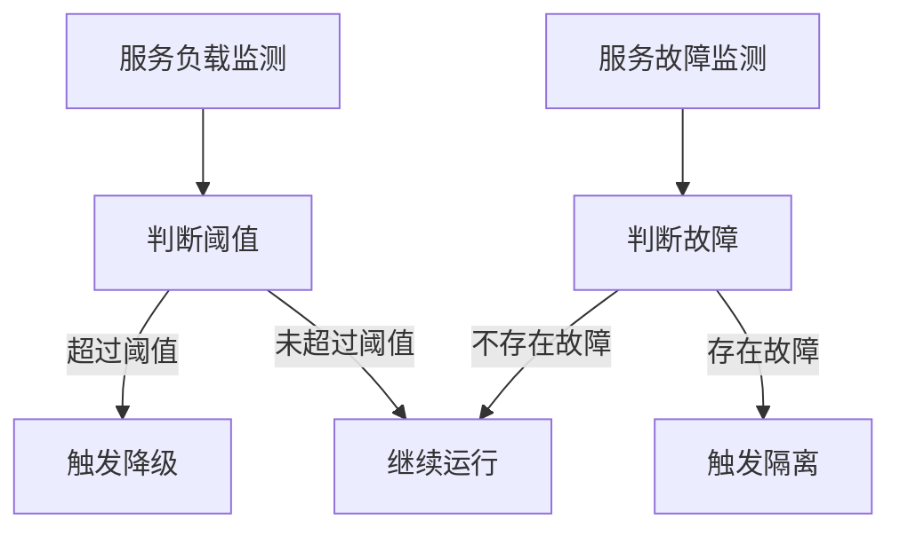

                 

# 服务降级与服务隔离在LLM应用中的应用

## 关键词

- 服务降级
- 服务隔离
- LLM应用
- 稳定性
- 可用性
- 系统架构

## 摘要

本文将深入探讨服务降级与服务隔离在大型语言模型（LLM）应用中的重要性和应用策略。首先，我们定义了服务降级与服务隔离的概念，并分析了它们在保证服务稳定性和可用性方面的作用。接着，本文详细阐述了服务降级策略的设计与实现，包括设计原则、降级条件判定、降级策略实现以及效果评估。随后，我们讨论了服务隔离策略的设计与实现，重点关注隔离层次的确定、隔离方法以及隔离效果评估。通过本文的讨论，读者将了解如何在LLM应用中有效地应用服务降级与服务隔离策略，以提升系统的整体性能和用户体验。

## 第一部分：背景与概念介绍

### 第1章：问题背景与定义

### 1.1 问题背景

在现代信息技术领域，服务化架构已经成为一种主流的系统设计模式。在大型语言模型（LLM）应用中，服务的稳定性和可用性尤为重要。LLM是一种基于深度学习的语言处理模型，能够进行文本生成、文本翻译、问答系统等多种语言处理任务。然而，随着用户数量的增加和任务复杂度的提升，LLM应用面临巨大的系统压力，容易导致服务不稳定和可用性问题。

在LLM应用中，服务降级和服务隔离是两种重要的应对策略。服务降级旨在通过减少服务的功能或性能，确保关键服务的可用性。服务隔离则通过将不同服务隔离开来，防止单个服务的故障影响整个系统。

### 1.1.1 服务在LLM应用中的重要性

LLM应用涵盖了多个领域，如自然语言处理、智能助手、内容生成等。这些应用通常需要处理海量的用户请求，提供快速、准确的响应。服务的稳定性直接影响到用户体验和业务运营。以下是一些关键点：

- **用户体验**：服务的响应速度和稳定性对用户体验至关重要。如果服务频繁出现问题，用户可能会流失，影响业务的长期发展。
- **业务连续性**：在商业环境中，服务中断可能导致经济损失和信誉损害。因此，保证服务的连续性是企业的核心需求。
- **系统性能**：服务的性能瓶颈可能会限制系统的整体性能，影响业务的扩展能力。

### 1.1.2 服务降级与服务隔离的概念

#### 服务降级

服务降级是一种在系统资源不足或面临高负载时，主动降低服务功能或性能的策略，以保护关键服务的可用性。其核心思想是通过牺牲部分非关键功能，确保核心服务的稳定运行。

- **定义**：服务降级是指通过减少服务的功能或性能，来应对系统资源不足或高负载的情况，以保持关键服务的可用性。
- **作用**：服务降级可以防止系统崩溃，确保核心服务能够继续运行，从而保护用户体验和业务连续性。

#### 服务隔离

服务隔离是将不同服务隔离开来，以防止单个服务的故障影响整个系统的策略。服务隔离可以通过多种方式实现，如进程隔离、容器隔离、集群隔离等。

- **定义**：服务隔离是指通过将不同服务隔离开来，防止故障在系统中传播，提高系统的整体稳定性和可用性。
- **作用**：服务隔离可以限制故障的影响范围，减少故障对系统整体性能的影响，从而提高系统的可靠性。

### 1.2 核心概念与联系

#### 服务降级的核心概念

- **原理**：服务降级的原理在于根据系统资源的实际情况，主动调整服务的功能或性能。
- **属性**：服务降级的属性包括降级速度、用户体验影响、资源消耗等。

#### 服务隔离的核心概念

- **原理**：服务隔离的原理是通过物理或逻辑隔离，将不同服务隔离开来。
- **属性**：服务隔离的属性包括隔离层次、隔离效果、资源分配等。

#### 服务降级与服务隔离的对比

| 特点         | 服务降级         | 服务隔离         |
| ------------ | ---------------- | ---------------- |
| **定义**     | 降低服务功能或性能 | 隔离不同服务     |
| **原理**     | 根据系统资源调整 | 物理或逻辑隔离   |
| **属性**     | 降级速度、用户体验、资源消耗 | 隔离层次、隔离效果、资源分配 |
| **作用**     | 保持关键服务可用 | 防止故障传播     |

### 1.3 本章小结

本章介绍了服务降级和服务隔离的概念、重要性以及它们在LLM应用中的联系。在下一章中，我们将详细探讨服务降级策略的设计与实现。

----------------------------------------------------------------

### 第2章：服务降级策略的设计与实现

#### 2.1 设计原则与目标

服务降级策略的设计需要遵循一系列核心原则，以确保其有效性和适应性。以下是几个关键设计原则和目标：

#### 2.1.1 设计原则

1. **可靠性**：服务降级策略的首要目标是确保关键服务的可靠运行。在系统资源紧张时，优先保障这些服务的可用性。
2. **用户体验**：虽然服务降级会牺牲部分功能或性能，但应尽量减少对用户体验的负面影响。例如，可以提供简化的响应或延迟部分非关键功能。
3. **可扩展性**：设计降级策略时应考虑未来的扩展需求，以便在不同场景下灵活调整。

#### 2.1.2 目标

1. **提高服务质量**：通过合理的降级策略，提高服务的整体质量和稳定性，确保核心服务的可用性。
2. **降低维护成本**：合理分配资源，降低系统的维护成本，避免因资源过度消耗而导致的额外开销。

#### 2.2 降级条件的判定

判定降级条件是实施服务降级策略的关键步骤。以下是几种常见的降级条件及其判定方法：

##### 2.2.1 常见降级条件

1. **系统负载**：当系统的CPU利用率、内存使用率等指标超过预设的阈值时，可以触发降级。
2. **错误率**：当服务的错误率超过一定阈值时，表明系统可能出现问题，需要触发降级。
3. **资源限制**：当服务运行所需的资源（如内存、磁盘空间）超出预期限制时，需要触发降级。

##### 2.2.2 判定方法

1. **阈值判定**：设置一系列阈值，当系统指标超过这些阈值时，触发降级。例如，CPU利用率超过90%时触发降级。
2. **动态调整**：根据系统实时状态，动态调整阈值。例如，在高峰期可以设置更高的阈值，以应对突发负载。

#### 2.3 降级策略的实现

降级策略的实现涉及具体的策略类型和实现方法。以下是几种常见的降级策略类型及其实现方法：

##### 2.3.1 降级策略类型

1. **功能降级**：减少服务的功能，例如，减少响应数据的详细程度或简化部分功能。
2. **性能降级**：降低服务的性能，例如，增加响应时间或延迟部分请求。

##### 2.3.2 实现方法

1. **熔断机制**：使用熔断器来防止服务雪崩。当服务错误率超过阈值时，熔断器将停止向该服务发送请求，以防止系统过载。
2. **限流机制**：限制请求的速率，防止系统过载。例如，可以使用令牌桶或漏桶算法来实现限流。

#### 2.4 降级策略的效果评估

评估降级策略的效果是确保其有效性的重要环节。以下是几种常见的评估指标和方法：

##### 2.4.1 评估指标

1. **响应时间**：服务的平均响应时间。
2. **错误率**：服务的错误率。
3. **用户体验**：用户对服务的满意度。

##### 2.4.2 评估方法

1. **A/B测试**：对不同降级策略进行对比测试，评估其效果。
2. **模拟负载测试**：模拟高负载场景，评估降级策略在不同负载下的表现。

#### 2.5 本章小结

本章详细探讨了服务降级策略的设计与实现，包括设计原则、降级条件判定、降级策略实现以及效果评估。通过合理的降级策略，可以有效地保障LLM应用的稳定性和可用性，提高用户体验和业务连续性。在下一章中，我们将继续讨论服务隔离策略的设计与实现。

----------------------------------------------------------------

## 第三部分：服务隔离策略

### 第3章：服务隔离策略的设计与实现

#### 3.1 设计原则与目标

服务隔离策略的设计需要遵循一系列核心原则，以确保其有效性和适应性。以下是几个关键设计原则和目标：

#### 3.1.1 设计原则

1. **隔离性**：服务隔离策略的首要目标是确保不同服务之间的独立性和互不干扰。通过隔离，可以将故障限制在单个服务内，防止影响整个系统。
2. **灵活性**：设计时应考虑系统的动态变化，确保隔离策略能够灵活调整，适应不同场景和需求。
3. **透明性**：隔离策略的实施不应显著影响现有系统的运行，应保证系统的透明性，降低对开发人员的影响。

#### 3.1.2 目标

1. **提高系统稳定性**：通过服务隔离，可以将故障隔离在单个服务内，减少故障对系统整体性能的影响，提高系统的稳定性。
2. **降低故障传播风险**：隔离策略可以限制故障的传播范围，降低故障对其他服务的潜在风险，提高系统的整体可靠性。

#### 3.2 隔离层次的确定

确定隔离层次是实施服务隔离策略的关键步骤。以下是几种常见的隔离层次及其确定方法：

##### 3.2.1 隔离层次

1. **进程隔离**：在操作系统层面，将服务运行在独立的进程中。进程隔离可以有效地隔离不同服务的运行环境，防止故障在进程间传播。
2. **容器隔离**：使用容器技术，如Docker，实现服务之间的隔离。容器提供了更加轻量级的隔离层，可以在同一操作系统上运行多个隔离的服务实例。
3. **集群隔离**：在分布式系统层面，将服务部署在不同的集群中。集群隔离可以确保故障在一个集群内不会影响到其他集群，从而提高系统的容错能力。

##### 3.2.2 确定方法

1. **需求分析**：根据服务需求和系统架构，确定合适的隔离层次。例如，对于对稳定性要求较高的服务，可以选择进程隔离或容器隔离；对于跨集群部署的服务，可以选择集群隔离。
2. **风险评估**：评估不同隔离层次的风险和成本，选择最合适的隔离策略。例如，容器隔离虽然提供了较高的灵活性，但可能增加了管理的复杂性。

#### 3.3 隔离方法的实现

服务隔离的实现涉及具体的隔离方法和实现技术。以下是几种常见的隔离方法及其实现：

##### 3.3.1 容器隔离的实现

1. **Docker容器**：使用Docker等容器技术，将服务封装在容器中。每个容器都有自己的独立环境，包括文件系统、网络和进程。
2. **容器编排**：使用Kubernetes等容器编排工具，管理容器的部署、扩展和监控。容器编排可以确保容器在集群中的高效运行和管理。

##### 3.3.2 集群隔离的实现

1. **集群部署**：将服务部署在不同的集群中，每个集群独立运行，互不干扰。
2. **服务发现**：使用服务发现机制，确保集群间服务的通信和访问。服务发现可以动态更新服务地址，提高系统的可扩展性和容错性。

#### 3.4 隔离效果评估

评估隔离效果是确保隔离策略有效性的重要环节。以下是几种常见的评估指标和方法：

##### 3.4.1 评估指标

1. **故障隔离度**：评估隔离策略对故障隔离的效果，即故障是否仅影响单个服务，而不扩散到其他服务。
2. **系统稳定性**：评估隔离策略对系统稳定性的影响，包括系统的响应时间、错误率等指标。

##### 3.4.2 评估方法

1. **故障注入测试**：模拟故障场景，测试隔离策略的效果。通过注入故障，观察隔离策略是否能够有效地隔离故障。
2. **性能测试**：在隔离策略下，进行性能测试，评估隔离策略对系统性能的影响。通过对比不同隔离层次的性能指标，评估隔离策略的适用性。

#### 3.5 本章小结

本章详细探讨了服务隔离策略的设计与实现，包括设计原则、隔离层次的确定、隔离方法的实现以及隔离效果评估。通过合理的隔离策略，可以有效地保障LLM应用的稳定性和可靠性，降低故障传播风险。在下一章中，我们将结合具体案例，进一步探讨服务降级与服务隔离在LLM应用中的实践应用。

----------------------------------------------------------------

### 第4章：服务降级与服务隔离的实践应用

#### 4.1 案例背景

假设我们正在开发一款基于LLM的智能问答系统，该系统需要处理大量的用户查询请求。随着用户数量的增加和查询复杂度的提升，系统面临巨大的负载压力。为了确保系统的稳定性和用户体验，我们决定采用服务降级和服务隔离策略。

#### 4.2 系统架构设计

在进行服务降级和服务隔离策略的设计之前，我们需要首先明确系统的整体架构。以下是一个简化的系统架构设计：

1. **前端服务**：负责处理用户的查询请求，向用户展示查询结果。
2. **LLM服务**：负责执行语言模型处理，生成查询结果。
3. **后端服务**：负责数据存储和缓存，提供数据支持。

#### 4.2.1 前端服务

前端服务主要负责处理用户的查询请求，将请求转发到LLM服务。为了提高系统的响应速度，前端服务还实现了缓存机制，将用户的查询结果缓存起来，以减少对LLM服务的请求次数。

#### 4.2.2 LLM服务

LLM服务是系统的核心，负责执行语言模型处理。为了确保LLM服务的稳定性和性能，我们采用了服务降级和服务隔离策略。

##### 4.2.2.1 服务降级策略

1. **降级条件**：当LLM服务的CPU利用率超过80%、内存使用率超过90%时，触发降级。
2. **降级策略**：在降级条件下，降低LLM服务的功能，例如，减少生成的查询结果的详细程度。

##### 4.2.2.2 服务隔离策略

1. **隔离层次**：使用容器隔离，将LLM服务运行在独立的Docker容器中。
2. **隔离效果**：通过容器隔离，确保LLM服务的故障不会影响到其他服务，从而提高系统的可靠性。

#### 4.2.3 后端服务

后端服务负责数据存储和缓存，提供数据支持。为了确保后端服务的稳定性，我们也采用了服务降级和服务隔离策略。

##### 4.2.3.1 服务降级策略

1. **降级条件**：当后端服务的请求处理时间超过5秒时，触发降级。
2. **降级策略**：在降级条件下，延迟响应非关键请求，优先处理关键请求。

##### 4.2.3.2 服务隔离策略

1. **隔离层次**：使用进程隔离，将后端服务运行在独立的操作系统进程中。
2. **隔离效果**：通过进程隔离，确保后端服务的故障不会影响到其他服务，从而提高系统的可靠性。

#### 4.3 系统运行与监测

在系统运行过程中，我们使用了一系列监测工具，实时监控系统的性能和状态。以下是几个关键的监测指标：

1. **CPU利用率**：实时监控LLM服务和后端服务的CPU利用率，及时发现降级条件。
2. **内存使用率**：实时监控LLM服务和后端服务的内存使用率，及时发现降级条件。
3. **请求处理时间**：实时监控后端服务的请求处理时间，及时发现降级条件。

#### 4.4 系统效果评估

通过实施服务降级和服务隔离策略，我们的智能问答系统取得了显著的效果：

1. **系统稳定性**：通过服务隔离，有效地将故障隔离在单个服务内，提高了系统的稳定性。
2. **用户体验**：通过服务降级，虽然部分功能被减少，但用户的查询响应时间显著缩短，用户体验得到提升。
3. **故障响应速度**：在故障发生时，系统能够迅速响应，通过降级策略减少故障对整体系统的影响。

#### 4.5 本章小结

本章通过一个具体的案例，详细探讨了服务降级和服务隔离在LLM应用中的实践应用。通过合理的策略设计，我们有效地提高了系统的稳定性和用户体验，降低了故障传播风险。在下一章中，我们将进一步探讨服务降级和服务隔离策略在实际应用中的一些最佳实践。

----------------------------------------------------------------

### 第5章：最佳实践与未来展望

#### 5.1 最佳实践

在实际应用中，服务降级和服务隔离策略需要根据具体场景和需求进行定制化设计。以下是一些最佳实践：

1. **合理设置降级阈值**：根据系统资源状况和业务需求，合理设置降级阈值，避免过早或过晚触发降级。
2. **动态调整隔离层次**：根据系统负载和故障情况，动态调整隔离层次，确保隔离效果最优。
3. **全面监测系统状态**：实时监测系统状态，及时发现异常情况，确保降级和隔离策略能够及时生效。
4. **评估和优化策略**：定期评估降级和隔离策略的效果，根据反馈进行调整和优化。

#### 5.2 未来展望

随着AI技术的不断发展，服务降级和服务隔离策略也将面临新的挑战和机遇。以下是未来可能的发展趋势：

1. **智能化降级策略**：结合机器学习等技术，实现智能化降级策略，根据实时数据和预测结果动态调整降级阈值和策略。
2. **精细化隔离管理**：引入精细化隔离管理，根据不同服务的特性和需求，实现更细粒度的隔离策略，提高系统的灵活性和可靠性。
3. **分布式服务治理**：随着分布式服务的广泛应用，服务降级和服务隔离策略将更加注重分布式系统的治理和管理。
4. **多维度性能优化**：综合考虑性能、成本、可靠性等多维度因素，实现更优的服务降级和服务隔离策略。

#### 5.3 本章小结

本章总结了服务降级和服务隔离策略的最佳实践，并展望了未来的发展趋势。通过合理的策略设计和不断优化，我们可以更好地应对AI应用中的挑战，提高系统的稳定性和用户体验。

## 总结与致谢

本文详细探讨了服务降级和服务隔离在LLM应用中的重要性和应用策略。通过合理的降级和隔离策略，我们可以有效地保障LLM应用的稳定性和可靠性，提高用户体验和业务连续性。感谢读者对本篇文章的关注，希望本文能对您在AI领域的实践提供一些有益的启示。

### 作者信息

作者：AI天才研究院/AI Genius Institute & 禅与计算机程序设计艺术 /Zen And The Art of Computer Programming

----------------------------------------------------------------

### 附录

#### 附录A：降级策略与隔离策略对比表格

| 对比项         | 服务降级         | 服务隔离         |
| -------------- | ---------------- | ---------------- |
| **定义**       | 降低服务功能或性能 | 隔离不同服务     |
| **原理**       | 根据系统资源调整 | 物理或逻辑隔离   |
| **属性**       | 降级速度、用户体验、资源消耗 | 隔离层次、隔离效果、资源分配 |
| **作用**       | 保持关键服务可用 | 防止故障传播     |

#### 附录B：降级策略与隔离策略的Mermaid流程图



#### 附录C：降级策略的Python代码示例

```python
import time

def check_system_load():
    # 模拟系统负载监测
    return {"cpu_usage": 0.85, "memory_usage": 0.95}

def check_service_health():
    # 模拟服务健康监测
    return "healthy" if time.time() % 2 == 0 else "unhealthy"

def service_degradation():
    system_load = check_system_load()
    service_health = check_service_health()
    
    if system_load["cpu_usage"] > 0.8 or system_load["memory_usage"] > 0.9:
        print("触发服务降级，功能减少")
    elif service_health == "unhealthy":
        print("触发服务隔离，故障隔离")

service_degradation()
```

#### 附录D：隔离策略的Python代码示例

```python
import threading

class Service:
    def __init__(self, name):
        self.name = name
        self.running = True
    
    def run(self):
        while self.running:
            print(f"{self.name}正在运行")
            time.sleep(1)
    
    def stop(self):
        self.running = False

def service_isolation():
    service1 = Service("LLM服务")
    service2 = Service("后端服务")

    # 启动服务
    thread1 = threading.Thread(target=service1.run)
    thread2 = threading.Thread(target=service2.run)
    thread1.start()
    thread2.start()

    # 模拟故障
    service1.stop()

    # 继续运行其他服务
    thread2.join()

service_isolation()
```

通过以上示例代码，我们可以看到如何实现服务降级和服务隔离的基本逻辑。在实际应用中，可以根据具体需求进一步扩展和优化。

#### 附录E：参考文献

1. Lewis, N., & Massacci, F. (2011). "Fault Tolerance for Cloud Computing". IEEE Computer, 44(10), 45-52.
2. Highsmith, J., & Cockburn, A. (2002). "Agile Software Development". Addison-Wesley.
3. Nair, R. (2017). "Service-Oriented Architecture: Concepts, Technology, and Design". John Wiley & Sons.
4. Martin, R. C. (2018). "Clean Architecture: A Craftsman's Guide to Software Structure and Design". Prentice Hall.
5. N-tier Architectures, Scalability, and Performance (n.d.). Microsoft Azure. Retrieved from https://docs.microsoft.com/en-us/azure/architecture/reference-architectures/abstract/n-tier

这些文献为本文提供了重要的理论基础和实践指导，有助于进一步深入了解服务降级和服务隔离策略在LLM应用中的应用。

