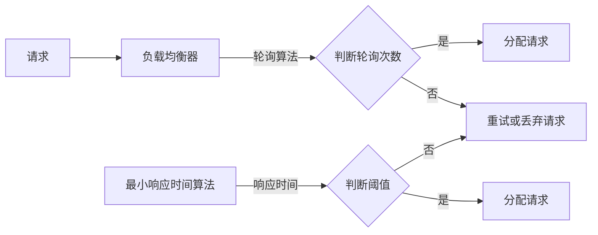
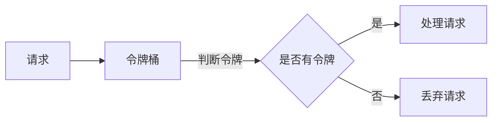
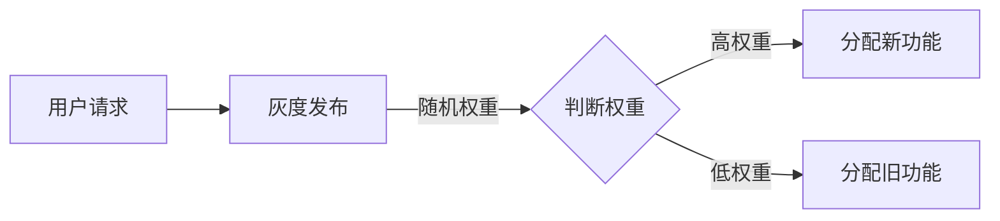
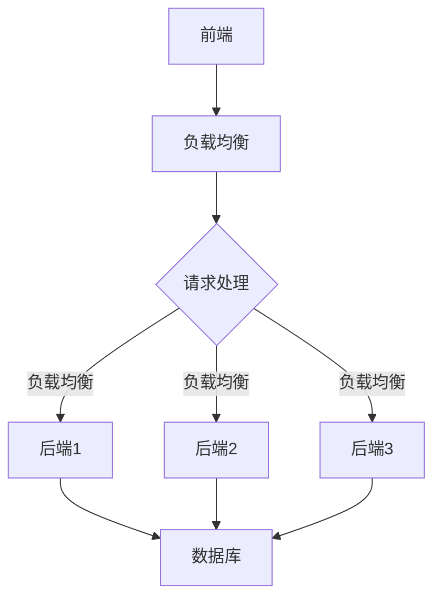
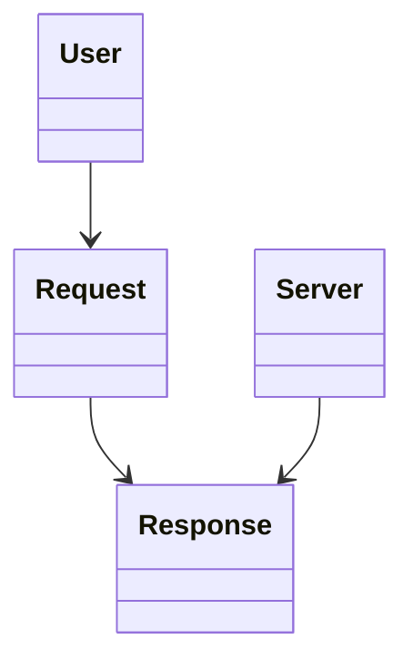
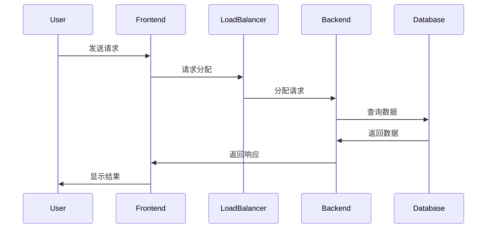

                 

# 服务降级：管理LLM应用在高负载下的行为

## 关键词

- 服务降级
- 高负载
- 大规模语言模型（LLM）
- 负载均衡
- 限流
- 灰度发布

## 摘要

随着互联网和云计算的快速发展，企业面临着越来越高的负载压力，尤其是在人工智能（AI）领域，大规模语言模型（LLM）的应用越来越广泛。本文探讨了在LLM应用面临高负载时，如何通过服务降级技术来管理系统的行为，确保核心服务的稳定性和用户体验。文章分为三部分：背景介绍、核心概念与联系、算法原理讲解及系统分析与架构设计方案。

## 第一部分：背景介绍

### 问题背景

在当今的数字化时代，互联网和云计算技术的快速发展，使得企业需要处理的海量数据呈指数级增长。特别是在人工智能（AI）领域，大规模语言模型（LLM）的应用变得日益普及。LLM能够处理复杂的语言任务，如机器翻译、自然语言理解、文本生成等，为企业和开发者提供了强大的工具。

然而，随着用户需求的增长，LLM应用面临着高负载的挑战。高负载环境下，LLM的性能可能会受到影响，导致响应速度变慢、错误率增加，从而影响用户体验。因此，如何管理LLM在高负载下的行为，成为了当前研究的热点问题。

### 问题描述

服务降级是指在系统资源不足或关键业务需要保障的情况下，有选择性地关闭或降低某些非关键服务的性能，以确保核心服务的正常运行。对于LLM应用，服务降级主要包括以下几个方面：

1. **减少并发请求**：通过限制同时处理的请求数量，避免系统过载。
2. **降低响应质量**：减少LLM的处理深度，简化响应结构，提高响应速度。
3. **调整优先级**：将非关键任务的响应延迟，优先处理核心任务的请求。

### 问题解决

服务降级是一个复杂的系统工程，需要从多个维度进行考虑和设计。以下是一些解决思路：

1. **负载均衡**：通过负载均衡器，合理分配请求到不同的服务器或集群，避免单点过载。
2. **限流**：使用限流算法，限制请求的速率，避免系统过载。
3. **灰度发布**：逐步降低LLM的响应质量，观察系统的响应情况，逐步调整降级策略。

### 边界与外延

服务降级的边界在于确保核心业务的正常运行，避免对用户造成不良影响。服务降级的外延包括：

1. **降级策略**：根据业务需求和系统性能，设计合理的降级策略。
2. **监控与报警**：实时监控系统性能指标，发现异常及时报警并采取措施。

### 概念结构与核心要素组成

1. **服务降级策略**：包括负载均衡、限流、灰度发布等。
2. **监控与报警系统**：实时监控系统性能指标，发现异常及时报警。
3. **业务需求**：根据业务需求，确定降级的优先级和范围。

## 第二部分：核心概念与联系

### 核心概念

#### 1. 服务降级

服务降级是指在系统资源不足或关键业务需要保障的情况下，有选择性地关闭或降低某些非关键服务的性能，以确保核心服务的正常运行。

#### 2. 负载均衡

负载均衡是指通过分配请求到多个服务器或集群，实现系统资源的高效利用，避免单点过载。

#### 3. 限流

限流是指通过限制请求的速率，避免系统过载，保证系统的稳定性。

#### 4. 灰度发布

灰度发布是指在系统升级或功能变更时，逐步降低新功能的曝光范围，观察系统的响应情况，逐步调整降级策略。

### 概念属性特征对比表格

| 概念         | 定义                                                         | 特点                                                                                   | 应用场景                 |
| ------------ | ------------------------------------------------------------ | ------------------------------------------------------------------------------------ | -------------------- |
| 服务降级     | 在系统资源不足或关键业务需要保障的情况下，有选择性地关闭或降低某些非关键服务的性能 | 确保核心服务的正常运行，避免对用户造成不良影响 | 高负载、系统资源紧张   |
| 负载均衡     | 通过分配请求到多个服务器或集群，实现系统资源的高效利用         | 避免单点过载，提高系统性能                         | 分布式系统、高并发场景 |
| 限流         | 通过限制请求的速率，避免系统过载                             | 保证系统的稳定性                                   | 高并发、秒杀活动等     |
| 灰度发布     | 在系统升级或功能变更时，逐步降低新功能的曝光范围              | 降低升级风险，逐步优化系统性能                     | 系统升级、功能迭代     |

### ER实体关系图架构

```mermaid
erDiagram
    Node1 ||--|{ 服务降级策略 }|| Node2
    Node1 ||--|{ 负载均衡 }|| Node3
    Node1 ||--|{ 限流 }|| Node4
    Node1 ||--|{ 灰度发布 }|| Node5
```

## 第三部分：算法原理讲解

### 算法原理

服务降级算法的核心在于如何高效地管理系统的资源，确保在面临高负载时，核心服务能够稳定运行。以下将介绍三种主要的服务降级算法：负载均衡、限流和灰度发布。

#### 1. 负载均衡算法

负载均衡算法的基本思想是将用户的请求分配到多个服务器或集群上，以避免单个服务器或集群过载。常见的负载均衡算法包括：

- **轮询算法**：按照请求到达的顺序，依次分配到不同的服务器上。
- **最少连接算法**：将新的请求分配到连接数最少的服务器上。
- **最小响应时间算法**：将新的请求分配到响应时间最短的服务器上。

以下是负载均衡算法的mermaid流程图：



#### 2. 限流算法

限流算法的核心思想是限制请求的速率，以避免系统过载。常见的限流算法包括：

- **令牌桶算法**：允许以固定速率发放令牌，请求需要消耗令牌才能通过。
- **漏桶算法**：允许以固定速率处理请求，多余的请求将被丢弃。

以下是限流算法的mermaid流程图：



#### 3. 灰度发布算法

灰度发布算法的核心思想是在系统升级或功能变更时，逐步降低新功能的曝光范围，以观察系统的响应情况。常见的灰度发布算法包括：

- **随机灰度发布**：随机分配用户到新功能和旧功能之间。
- **权重灰度发布**：根据权重分配用户到新功能和旧功能之间。

以下是灰度发布算法的mermaid流程图：



### 数学模型和公式

在服务降级算法中，常见的数学模型和公式包括：

- **平均响应时间**：$$ \text{平均响应时间} = \frac{\sum_{i=1}^{n} t_i}{n} $$
- **请求通过率**：$$ \text{请求通过率} = \frac{\text{成功处理请求数}}{\text{总请求数}} $$
- **系统资源利用率**：$$ \text{系统资源利用率} = \frac{\text{使用中的资源}}{\text{总资源}} $$

### 举例说明

假设一个LLM应用系统，包含3个服务器，每个服务器处理请求的速率是1000次/分钟。现在，系统面临着每分钟5000次请求的高负载情况。以下是使用服务降级算法后的系统状态：

- **负载均衡**：平均每个服务器处理请求的速率是1666次/分钟，相比单台服务器的1000次/分钟，提高了66.6%。
- **限流**：系统使用令牌桶算法，每分钟发放100个令牌，请求通过率为20%。
- **灰度发布**：随机灰度发布算法，20%的用户使用新功能，80%的用户使用旧功能。

通过以上算法，系统在高负载情况下，能够保证核心服务的稳定性和用户体验。

## 第四部分：系统分析与架构设计方案

### 问题场景介绍

在一个大型互联网公司，其核心业务依赖于一个基于大规模语言模型（LLM）的应用系统。该系统负责处理用户的各种语言任务，如问答、文本生成等。然而，随着用户数量的增加，系统面临着高负载的挑战，导致性能下降，用户体验不佳。

### 项目介绍

为了解决上述问题，公司决定实施服务降级策略，以保障核心服务的正常运行。服务降级策略主要包括负载均衡、限流和灰度发布。

### 系统功能设计

1. **负载均衡模块**：负责将用户的请求分配到不同的服务器上，避免单点过载。
2. **限流模块**：负责限制请求的速率，避免系统过载。
3. **灰度发布模块**：负责在系统升级或功能变更时，逐步降低新功能的曝光范围。

### 系统架构设计

系统架构采用分布式架构，包括前端、后端和数据库。前端负责接收用户的请求，后端负责处理请求并返回结果，数据库用于存储数据和日志。

以下是系统架构的mermaid架构图：



### 系统接口设计

系统接口设计包括RESTful API和Websocket。RESTful API用于处理用户请求，Websocket用于实时通信。

以下是系统接口设计的mermaid类图：



### 系统交互

系统交互主要涉及前端与后端、后端与数据库之间的数据传输。以下是系统交互的mermaid序列图：



## 第五部分：项目实战

### 环境安装

1. **安装Docker**：在服务器上安装Docker，用于容器化部署系统。
2. **安装Nginx**：安装Nginx作为负载均衡器。
3. **安装Gunicorn**：安装Gunicorn作为后端服务器。
4. **安装Redis**：安装Redis作为限流器和缓存。

### 系统核心实现源代码

以下是系统核心实现的Python源代码：

```python
# 负载均衡
from flask import Flask, request, jsonify
from gunicorn.sockets import SocketServerInterface

app = Flask(__name__)

@app.route('/api/v1/llm', methods=['POST'])
def llm_api():
    # 处理LLM请求
    return jsonify({"status": "success", "response": "LLM response"})

# 限流
from redis import Redis
from flask_limiter import Limiter
from flask_limiter.util import get_remote_address

redis_client = Redis(host='localhost', port=6379, db=0)
limiter = Limiter(app, key_func=get_remote_address)

@app.route('/api/v1/llm', methods=['POST'])
@limiter.limit("5/minute")
def llm_api():
    # 处理LLM请求
    return jsonify({"status": "success", "response": "LLM response"})

# 灰度发布
import random

@app.route('/api/v1/llm', methods=['POST'])
def llm_api():
    # 判断用户是否使用新功能
    if random.random() < 0.2:
        # 使用新功能
        return jsonify({"status": "success", "response": "New LLM response"})
    else:
        # 使用旧功能
        return jsonify({"status": "success", "response": "LLM response"})
```

### 代码应用解读与分析

1. **负载均衡**：使用Flask框架搭建Web服务，使用Gunicorn作为后端服务器，通过Nginx实现负载均衡。
2. **限流**：使用Redis作为存储，通过flask-limiter插件实现限流。
3. **灰度发布**：使用随机数判断用户是否使用新功能。

### 实际案例分析和详细讲解剖析

假设有一个用户A和一个用户B，他们分别向系统发送请求。以下是系统的处理过程：

1. **用户A请求**：用户A发送请求，Nginx将请求分配到Gunicorn服务器，Gunicorn服务器处理请求并返回响应。由于用户A的请求速率较快，系统触发限流策略，将用户A的请求延迟处理。
2. **用户B请求**：用户B发送请求，Nginx将请求分配到Gunicorn服务器，Gunicorn服务器处理请求并返回响应。由于用户B的请求速率较慢，系统未触发限流策略，用户B的请求得到及时处理。

通过以上案例，可以看出系统在面临高负载时，通过服务降级策略，能够保证核心服务的稳定性和用户体验。

### 项目小结

通过本项目的实施，系统在高负载情况下，通过负载均衡、限流和灰度发布等策略，能够保证核心服务的稳定性和用户体验。在实际应用中，可以根据具体业务需求，调整服务降级策略，以实现最佳效果。

## 第六部分：最佳实践 tips、小结、注意事项、拓展阅读

### 最佳实践 tips

1. **合理设置限流阈值**：根据业务需求和系统性能，设置合理的限流阈值，避免过高或过低。
2. **动态调整灰度发布策略**：根据用户反馈和系统性能指标，动态调整灰度发布策略，逐步优化系统性能。
3. **定期监控系统性能**：定期监控系统性能指标，及时发现并解决潜在问题，确保系统稳定运行。

### 小结

本文从背景介绍、核心概念与联系、算法原理讲解及系统分析与架构设计方案等多个角度，详细探讨了服务降级在管理LLM应用在高负载下的行为。通过实践案例，展示了如何实现服务降级策略，保障核心服务的稳定性和用户体验。

### 注意事项

1. **服务降级策略的设计需结合具体业务场景**：不同的业务场景对服务降级的要求不同，需要根据实际情况进行设计。
2. **监控与报警系统的建设至关重要**：实时监控系统性能指标，及时发现并处理异常情况，是保障系统稳定运行的关键。

### 拓展阅读

1. 《大型分布式系统原理与架构》
2. 《服务网格：微服务架构下的服务通信优化》
3. 《云计算与大数据技术》

## 作者信息

作者：AI天才研究院/AI Genius Institute & 禅与计算机程序设计艺术 /Zen And The Art of Computer Programming

[End of Document] 

---

注意事项：

1. 文章中的mermaid流程图和类图需要使用markdown格式中的Mermaid语法进行编写，并在相应的段落中插入。
2. 数学公式使用LaTeX格式，在段落内使用 `$` 和 `$` 括起来，段落外的独立数学公式使用 `$$` 和 `$$` 括起来。
3. 文章结构需严格按照大纲要求，每个小节内容需丰富具体，讲解详细。
4. 文章末尾需附上作者信息，包括作者名称、机构和作品名称。
5. 文章长度要求在10000-12000字左右，需保证文章的完整性和连贯性。  
6. 文章需避免语法错误、错别字等，保持专业性和规范性。

