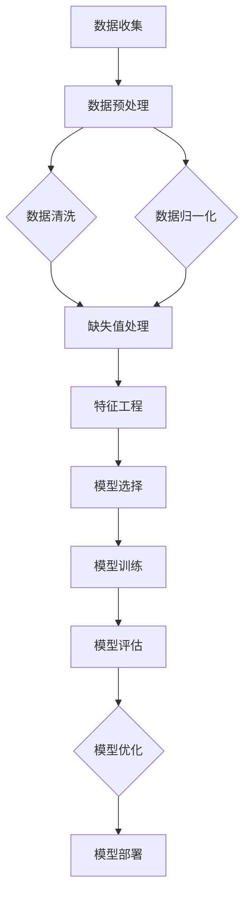
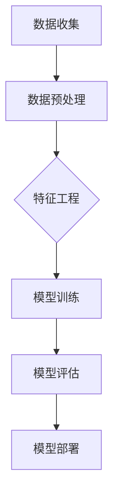
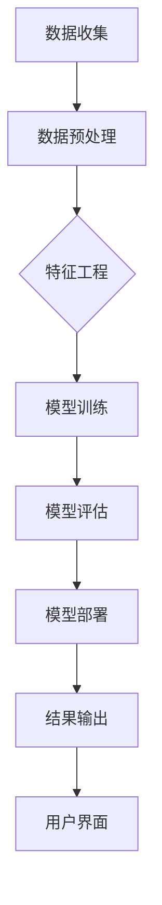
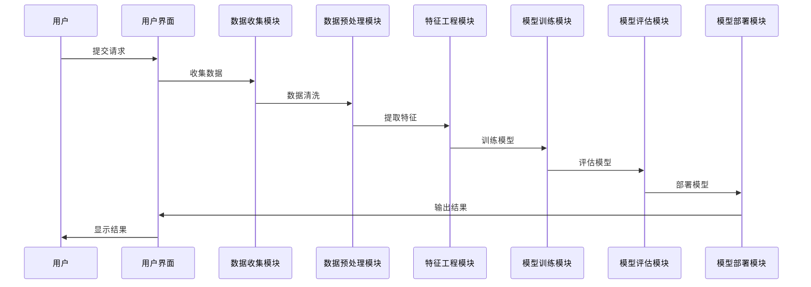
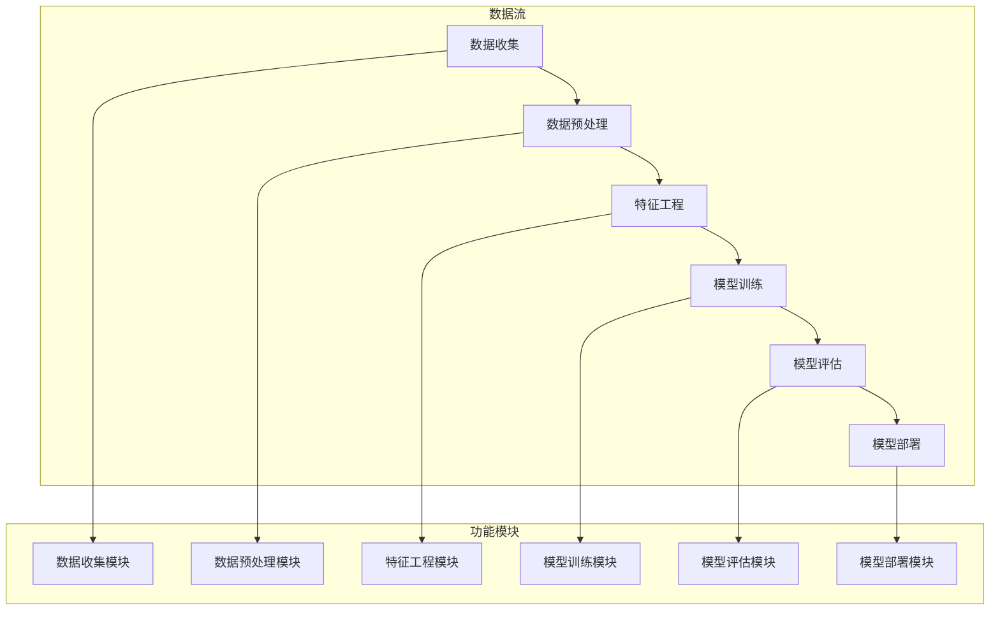
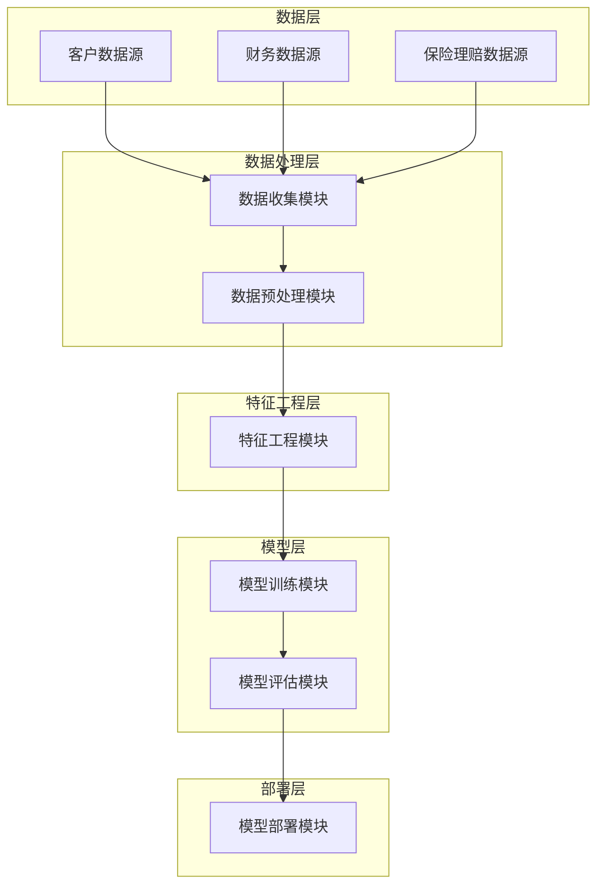
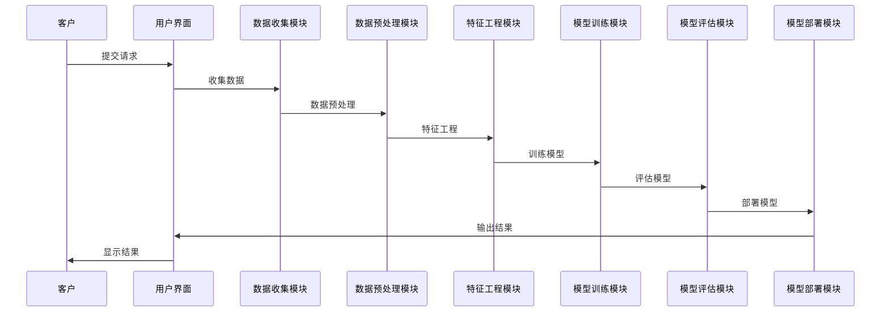

                 

## 引言

随着人工智能和大数据技术的飞速发展，机器学习已经成为现代科技中不可或缺的一部分。在金融领域，机器学习技术同样展现出巨大的潜力，特别是在个性化保险定价方面。个性化保险定价，顾名思义，是指根据客户的个人特点和需求，为其提供差异化的保险产品和服务。这不仅提高了保险公司的运营效率，也显著提升了客户满意度。

本篇文章旨在探讨机器学习在个性化保险定价中的应用。首先，我们将介绍机器学习和个性化保险定价的核心概念和背景，帮助读者建立基本理解。接着，我们将深入分析数据预处理、特征工程等关键环节，为后续的算法讲解打下基础。文章的重点在于详细讲解机器学习算法在个性化保险定价中的实现过程，包括算法原理、数学模型和公式，并通过Python代码和实际案例进行通俗易懂的说明。

随后，我们将展示一个典型的系统架构设计，介绍系统的功能、接口和交互设计。为了使读者更好地理解，我们将结合一个实际项目进行实战演练，详细分析项目安装、核心代码实现和案例分析。最后，我们将总结文章内容，提供最佳实践建议，并给出相关的注意事项和拓展阅读资源，帮助读者进一步深入探索个性化保险定价的机器学习应用。

通过这篇文章，我们希望读者能够全面了解机器学习在个性化保险定价中的应用，掌握关键技术和方法，从而在实际工作中发挥出机器学习的最大潜力。让我们一步一步深入探讨，开启这场技术之旅。

## 文章关键词

- 机器学习
- 个性化保险定价
- 数据预处理
- 特征工程
- 算法实现
- 数学模型
- 系统架构设计
- 项目实战
- 最佳实践

## 摘要

本文探讨了机器学习在个性化保险定价中的应用，通过详细分析机器学习和个性化保险定价的核心概念，深入探讨了数据预处理、特征工程和机器学习算法的应用。文章首先介绍了机器学习的定义、分类和应用领域，并阐述了个性化保险定价的概念、意义和应用场景。接着，文章详细讲解了数据预处理、特征工程等关键环节，通过Python代码和实际案例，详细阐述了机器学习算法在个性化保险定价中的实现过程。此外，文章还展示了系统架构设计，包括功能、接口和交互设计，并结合实际项目进行了实战演练。最后，文章总结了个性化保险定价中的机器学习应用，提供了最佳实践建议和注意事项，并推荐了相关的拓展阅读资源，为读者提供了全面的技术参考和深入学习方向。

---

## Step 1: 背景介绍

### 核心概念

在本节中，我们将介绍机器学习和个性化保险定价的核心概念，为后续内容打下基础。

#### 机器学习

机器学习（Machine Learning）是人工智能（Artificial Intelligence, AI）的一个重要分支，主要研究如何通过数据和算法使计算机系统具备自动学习和改进能力。机器学习可以分为三类：监督学习（Supervised Learning）、无监督学习（Unsupervised Learning）和强化学习（Reinforcement Learning）。

1. **监督学习**：监督学习通过标记数据集训练模型，使模型能够预测未知数据的输出。常见的算法有线性回归（Linear Regression）、逻辑回归（Logistic Regression）、支持向量机（Support Vector Machine, SVM）和决策树（Decision Tree）等。

2. **无监督学习**：无监督学习不使用标记数据，主要目的是发现数据内在的结构或模式。常见的算法有聚类（Clustering，如K-Means）、降维（Dimensionality Reduction，如PCA）和关联规则学习（Association Rule Learning）等。

3. **强化学习**：强化学习通过模拟与环境的交互来训练模型，使模型能够在特定环境下做出最优决策。常见的算法有Q学习（Q-Learning）、深度Q网络（Deep Q-Network, DQN）和策略梯度（Policy Gradient）等。

#### 个性化保险定价

个性化保险定价是指根据客户的个人风险特征、财务状况、历史记录等因素，为其制定差异化的保险产品和服务。其核心在于通过数据分析和机器学习技术，精确识别和评估客户的风险，从而实现高效、精准的定价。

个性化保险定价的主要目标包括：

1. **提高客户满意度**：通过提供符合客户需求的保险产品和服务，提高客户满意度和忠诚度。

2. **降低运营成本**：通过精确的风险评估，减少保险公司的赔付成本，提高运营效率。

3. **提升竞争力**：通过差异化定价策略，吸引更多潜在客户，提高市场竞争力。

#### 问题解决、边界与外延

机器学习在个性化保险定价中的应用涉及到多个方面：

1. **问题解决**：个性化保险定价面临的主要问题是准确评估客户风险，机器学习技术通过数据分析和算法优化，可以大大提高风险评估的准确性和效率。

2. **边界与外延**：个性化保险定价不仅涉及传统风险评估指标（如年龄、性别、病史等），还需要考虑客户的消费行为、社交网络数据等新兴指标。这些边界与外延使得个性化保险定价具有更广泛的应用前景。

#### 概念结构与核心要素组成

个性化保险定价的概念结构主要包括以下几个核心要素：

1. **数据采集**：收集客户的基本信息、消费行为、财务状况等数据。

2. **数据预处理**：对原始数据进行清洗、归一化、缺失值处理等预处理操作。

3. **特征工程**：从数据中提取对风险评估有意义的特征，如客户年龄、病史、收入等。

4. **模型训练**：利用机器学习算法，对特征进行训练，构建风险评估模型。

5. **模型评估**：对模型进行评估和优化，确保其性能满足实际需求。

6. **应用部署**：将模型部署到实际系统中，实现个性化保险定价。

### 机器学习

#### 概述

机器学习是一种通过数据驱动的方法来使计算机系统实现自动化学习的科学。它基于统计学、概率论、线性代数等数学理论，利用算法从数据中学习规律，进而实现预测、分类、聚类等功能。

#### 分类

机器学习主要分为以下几类：

1. **监督学习**：监督学习通过标记数据集来训练模型，使模型能够预测未知数据的输出。常见的算法有线性回归、逻辑回归、支持向量机、决策树等。

2. **无监督学习**：无监督学习不使用标记数据，主要目的是发现数据内在的结构或模式。常见的算法有K-Means聚类、主成分分析（PCA）、关联规则学习等。

3. **强化学习**：强化学习通过模拟与环境的交互来训练模型，使模型能够在特定环境下做出最优决策。常见的算法有Q学习、深度Q网络（DQN）、策略梯度等。

#### 应用领域

机器学习在多个领域都有着广泛的应用，包括但不限于：

1. **金融**：机器学习在金融领域主要用于风险控制、信用评分、市场预测等方面。

2. **医疗**：机器学习在医疗领域主要用于疾病诊断、药物研发、健康预测等方面。

3. **零售**：机器学习在零售领域主要用于客户行为分析、库存管理、个性化推荐等方面。

### 个性化保险定价

#### 概念

个性化保险定价是指根据客户的个人风险特征、财务状况、历史记录等因素，为其制定差异化的保险产品和服务。其核心在于通过数据分析和机器学习技术，精确识别和评估客户的风险。

#### 意义

个性化保险定价的意义主要体现在以下几个方面：

1. **提高客户满意度**：通过提供符合客户需求的保险产品和服务，提高客户满意度和忠诚度。

2. **降低运营成本**：通过精确的风险评估，减少保险公司的赔付成本，提高运营效率。

3. **提升竞争力**：通过差异化定价策略，吸引更多潜在客户，提高市场竞争力。

#### 应用场景

个性化保险定价在多个应用场景中发挥着重要作用，包括但不限于：

1. **车险定价**：根据客户的驾驶记录、车型、年龄等因素，提供差异化的车险定价。

2. **寿险定价**：根据客户的健康状况、财务状况、年龄等因素，提供差异化的寿险定价。

3. **健康保险定价**：根据客户的健康状况、病史、生活习惯等因素，提供差异化的健康保险定价。

### 机器学习在个性化保险定价中的应用

#### 数据预处理

数据预处理是机器学习应用中的关键步骤，包括数据清洗、数据归一化、缺失值处理等操作。良好的数据预处理可以显著提高模型性能和预测准确性。

1. **数据清洗**：去除重复数据、处理异常值、纠正错误数据等。
2. **数据归一化**：将不同量纲的数据进行标准化处理，使其具有可比性。
3. **缺失值处理**：填补缺失数据或删除含有缺失数据的样本。

#### 特征工程

特征工程是提高模型性能的重要手段，通过从原始数据中提取对风险评估有意义的特征，可以显著提升模型的预测能力。

1. **特征选择**：选择对目标变量有显著影响的特征。
2. **特征构造**：通过组合、变换等方式构造新的特征。
3. **特征降维**：减少特征数量，降低模型复杂度。

#### 模型评估

模型评估是验证模型性能的重要环节，常用的评估指标包括准确率、召回率、F1值等。

1. **交叉验证**：通过交叉验证方法评估模型性能。
2. **性能比较**：比较不同模型在预测准确性、计算效率等方面的表现。
3. **模型优化**：根据评估结果对模型进行优化，提高预测准确性。

### 总结

机器学习在个性化保险定价中的应用，不仅可以提高保险公司的运营效率，还可以显著提升客户满意度。通过数据预处理、特征工程和机器学习算法，我们可以实现精准的个性化保险定价，为保险公司带来更大的竞争优势。

### 机器学习概述

机器学习是人工智能领域的重要分支，其核心在于通过数据和算法，使计算机具备自我学习和优化能力。机器学习大致可以分为三类：监督学习、无监督学习和强化学习。

**监督学习**：监督学习通过标记数据集训练模型，使模型能够预测未知数据的输出。这种学习方法类似于老师对学生进行教导，学生通过学习老师的示例，掌握一定的知识，从而能够对新情境进行预测。常见的监督学习算法包括线性回归、逻辑回归、支持向量机、决策树和随机森林等。

**无监督学习**：无监督学习不使用标记数据，主要目的是发现数据内在的结构或模式。这种学习方法类似于学生在没有老师的情况下，通过自己的探索和学习，发现数据中的规律。常见的无监督学习算法包括K-Means聚类、主成分分析（PCA）、自编码器等。

**强化学习**：强化学习通过模拟与环境的交互来训练模型，使模型能够在特定环境下做出最优决策。这种学习方法类似于学生在不断试错的过程中，逐渐掌握技能。常见的强化学习算法包括Q学习、深度Q网络（DQN）、策略梯度等。

**应用领域**：机器学习在金融、医疗、零售、制造业等多个领域都有着广泛的应用。在金融领域，机器学习主要用于信用评分、风险控制、市场预测等；在医疗领域，机器学习主要用于疾病诊断、药物研发、健康预测等；在零售领域，机器学习主要用于客户行为分析、库存管理、个性化推荐等。

### 个性化保险定价

**概念**：个性化保险定价是指根据客户的个人风险特征、财务状况、历史记录等因素，为其制定差异化的保险产品和服务。这种定价方法的核心在于通过数据分析和机器学习技术，精确识别和评估客户的风险。

**意义**：个性化保险定价具有以下几个方面的意义：

1. **提高客户满意度**：通过提供符合客户需求的保险产品和服务，提高客户满意度和忠诚度。
2. **降低运营成本**：通过精确的风险评估，减少保险公司的赔付成本，提高运营效率。
3. **提升竞争力**：通过差异化定价策略，吸引更多潜在客户，提高市场竞争力。

**应用场景**：个性化保险定价在多个应用场景中发挥着重要作用，包括但不限于：

1. **车险定价**：根据客户的驾驶记录、车型、年龄等因素，提供差异化的车险定价。
2. **寿险定价**：根据客户的健康状况、财务状况、年龄等因素，提供差异化的寿险定价。
3. **健康保险定价**：根据客户的健康状况、病史、生活习惯等因素，提供差异化的健康保险定价。

通过个性化保险定价，保险公司可以更好地满足客户需求，提高市场竞争力，同时降低运营成本，实现可持续发展。

### 数据预处理与特征工程

数据预处理和特征工程是机器学习应用中的关键步骤，其核心目的是为了提高模型性能和预测准确性。

#### 数据预处理

数据预处理主要包括以下几方面内容：

1. **数据清洗**：去除重复数据、处理异常值、纠正错误数据等。例如，删除重复的投保记录、修正输入错误的数据等。
2. **数据归一化**：将不同量纲的数据进行标准化处理，使其具有可比性。例如，将年龄、收入等不同量级的数据进行归一化处理。
3. **缺失值处理**：填补缺失数据或删除含有缺失数据的样本。例如，使用平均值、中位数等方法填补缺失值，或删除含有缺失数据的记录。

#### 特征工程

特征工程主要包括以下几方面内容：

1. **特征选择**：选择对目标变量有显著影响的特征。例如，通过相关性分析、信息增益等方法，选择与风险评分有较高相关性的特征。
2. **特征构造**：通过组合、变换等方式构造新的特征。例如，将客户的年龄、性别、收入等基本特征进行组合，构造出新的特征。
3. **特征降维**：减少特征数量，降低模型复杂度。例如，使用主成分分析（PCA）等方法，降低特征维度，提高模型训练效率。

通过数据预处理和特征工程，我们可以显著提高机器学习模型在个性化保险定价中的性能，从而实现更精确的风险评估和定价。

### 数据预处理与特征工程

#### 数据预处理

数据预处理是机器学习项目中不可或缺的一环，其目的是确保输入数据的质量和一致性，为后续的特征提取和模型训练打下坚实的基础。以下是数据预处理的主要步骤：

1. **数据清洗**：清洗数据是数据预处理的首要任务，目的是去除噪声、纠正错误和填充缺失值。常见的操作包括：
   - 删除重复数据：使用去重算法去除重复的记录。
   - 处理异常值：检测并处理异常数据，例如使用统计学方法（如箱型图）检测异常值，然后选择保留、删除或修正。
   - 填充缺失值：对于缺失的数据，可以采用以下几种方法进行填充：
     - 删除缺失数据：如果缺失数据较多，可以考虑删除含有缺失数据的记录。
     - 使用统计方法填充：例如，使用平均值、中位数、众数等方法填充缺失值。
     - 基于模型填充：例如，使用回归模型预测缺失值。

2. **数据归一化**：归一化是将数据转换到同一尺度，以消除不同特征之间的量纲影响，常见的归一化方法包括：
   - 标准化：将数据转换为均值为0，标准差为1的分布，公式为：
     $$z = \frac{x - \mu}{\sigma}$$
     其中，$x$为原始数据，$\mu$为均值，$\sigma$为标准差。
   - 最小-最大缩放：将数据缩放到[0,1]之间，公式为：
     $$x_{\text{norm}} = \frac{x - x_{\text{min}}}{x_{\text{max}} - x_{\text{min}}}$$
     其中，$x_{\text{min}}$和$x_{\text{max}}$分别为数据的最小值和最大值。

3. **数据转换**：将类别型数据转换为数值型数据，例如，使用独热编码（One-Hot Encoding）将类别型数据进行转换，公式为：
   $$x_{i,j} = 
   \begin{cases} 
   1 & \text{if } y_i = j \\
   0 & \text{otherwise}
   \end{cases}$$
   其中，$x_{i,j}$表示第$i$个样本的第$j$个类别特征的编码。

#### 特征工程

特征工程是提升模型性能的重要环节，其主要目标是选择和构造对模型预测有重要影响的有效特征。以下是特征工程的主要步骤：

1. **特征选择**：从原始特征中选择对预测目标有显著影响的特征，常用的方法包括：
   - 相关性分析：计算特征与预测目标之间的相关性，选择相关性较高的特征。
   - 信息增益：计算特征对预测目标的信息增益，选择信息增益较高的特征。
   - 基于模型的特征选择：使用决策树等模型选择特征，例如，决策树中的重要性分数。

2. **特征构造**：通过组合和变换原始特征，构造新的特征，以增加模型的预测能力，常见的构造方法包括：
   - 聚类特征：使用聚类算法（如K-Means）将数据分为几类，将聚类中心作为新的特征。
   - 预处理特征：将原始特征经过预处理（如归一化、标准化）后得到的新特征。
   - 交叉特征：将两个或多个特征进行组合，形成新的特征。

3. **特征降维**：减少特征数量，降低模型复杂度和训练时间，常用的降维方法包括：
   - 主成分分析（PCA）：通过线性变换将高维数据映射到低维空间，保留主要的信息。
   - t-SNE：通过非线性降维方法将高维数据映射到二维或三维空间，以可视化方式展示数据的结构。
   - 自动编码器：通过自编码器学习低维表示，保留数据的结构信息。

通过数据预处理和特征工程，我们可以为机器学习模型提供高质量的输入数据，从而提高模型的预测性能。在实际应用中，这些步骤需要根据具体问题和数据集的特点进行灵活调整和优化。

### 数据预处理与特征工程

#### 数据预处理

数据预处理是确保机器学习模型性能的关键步骤，主要包括以下三个方面：

1. **数据清洗**：首先，我们需要清洗原始数据，去除噪声和不一致的数据。这包括以下步骤：
   - **去重**：删除重复的数据记录，确保数据集的纯洁性。
   - **处理缺失值**：对于缺失的数据，可以采用以下几种方法：
     - **删除**：如果缺失值过多，可以考虑删除这些记录。
     - **填充**：使用统计方法填充缺失值，例如，使用平均值、中位数或众数填充。
     - **模型填补**：使用机器学习模型预测缺失值，例如，使用回归模型填充连续特征的缺失值，使用逻辑回归模型填充类别特征的缺失值。

2. **数据归一化**：归一化是调整数据分布，使其适合机器学习算法的过程。常见的归一化方法包括：
   - **最小-最大缩放**：将数据缩放到[0,1]之间，公式为：
     $$x_{\text{norm}} = \frac{x - x_{\text{min}}}{x_{\text{max}} - x_{\text{min}}}$$
     其中，$x_{\text{min}}$和$x_{\text{max}}$分别是数据的最小值和最大值。
   - **Z-Score标准化**：将数据标准化到均值为0，标准差为1的分布，公式为：
     $$z = \frac{x - \mu}{\sigma}$$
     其中，$\mu$是均值，$\sigma$是标准差。

3. **数据转换**：将类别型数据转换为数值型数据，以便算法处理。常用的转换方法包括：
   - **独热编码**：对于类别型特征，可以将每个类别转换为二进制向量，例如，如果某个特征有三个类别A、B、C，那么A、B、C分别对应[1,0,0]、[0,1,0]、[0,0,1]。
   - **标签编码**：将类别型特征转换为整数，但这种方法可能会导致数据中的信息丢失。

#### 特征工程

特征工程是提升模型性能的重要步骤，其主要目的是选择和构造对模型预测有帮助的特征。以下是特征工程的主要步骤：

1. **特征选择**：从原始特征中选择对预测目标有显著影响的特征。常用的方法包括：
   - **基于业务知识的特征选择**：根据业务背景，选择那些显然对目标有影响的特征。
   - **基于统计的特征选择**：使用信息增益、特征重要性等方法选择特征。
   - **基于模型的特征选择**：使用特征选择算法，如Lasso回归，选择对模型影响较大的特征。

2. **特征构造**：通过组合和变换原始特征，构造新的特征，以增加模型的预测能力。常见的方法包括：
   - **交互特征**：将两个或多个特征相乘、相加，构造新的特征。
   - **衍生特征**：基于已有特征，通过计算衍生特征，如年龄的平方、年龄和性别的乘积等。
   - **时间序列特征**：从时间序列数据中提取特征，如过去一周的平均收入、过去三个月的购买频率等。

3. **特征降维**：减少特征数量，降低模型复杂度和训练时间。常用的降维方法包括：
   - **主成分分析（PCA）**：通过保留主要成分，降低特征数量。
   - **因子分析**：通过构建因子，降低特征数量。
   - **自动编码器**：使用自编码器学习低维表示。

通过数据预处理和特征工程，我们可以提高模型的性能和预测准确性，为保险公司的个性化定价提供坚实的基础。

### 数据预处理与特征工程

#### 数据预处理

数据预处理是确保机器学习模型性能的关键步骤，主要包括以下三个方面：

1. **数据清洗**：
   - **去重**：删除重复的数据记录，确保数据集的纯洁性。
   - **处理缺失值**：对于缺失的数据，可以采用以下几种方法：
     - **删除**：如果缺失值过多，可以考虑删除这些记录。
     - **填充**：使用统计方法填充缺失值，例如，使用平均值、中位数或众数填充。
     - **模型填补**：使用机器学习模型预测缺失值，例如，使用回归模型填充连续特征的缺失值，使用逻辑回归模型填充类别特征的缺失值。

2. **数据归一化**：
   - **最小-最大缩放**：将数据缩放到[0,1]之间，公式为：
     $$x_{\text{norm}} = \frac{x - x_{\text{min}}}{x_{\text{max}} - x_{\text{min}}}$$
     其中，$x_{\text{min}}$和$x_{\text{max}}$分别是数据的最小值和最大值。
   - **Z-Score标准化**：将数据标准化到均值为0，标准差为1的分布，公式为：
     $$z = \frac{x - \mu}{\sigma}$$
     其中，$\mu$是均值，$\sigma$是标准差。

3. **数据转换**：
   - **独热编码**：对于类别型特征，可以将每个类别转换为二进制向量，例如，如果某个特征有三个类别A、B、C，那么A、B、C分别对应[1,0,0]、[0,1,0]、[0,0,1]。
   - **标签编码**：将类别型特征转换为整数，但这种方法可能会导致数据中的信息丢失。

#### 特征工程

特征工程是提升模型性能的重要步骤，其主要目的是选择和构造对模型预测有帮助的特征。以下是特征工程的主要步骤：

1. **特征选择**：
   - **基于业务知识的特征选择**：根据业务背景，选择那些显然对目标有影响的特征。
   - **基于统计的特征选择**：使用信息增益、特征重要性等方法选择特征。
   - **基于模型的特征选择**：使用特征选择算法，如Lasso回归，选择对模型影响较大的特征。

2. **特征构造**：
   - **交互特征**：将两个或多个特征相乘、相加，构造新的特征。
   - **衍生特征**：基于已有特征，通过计算衍生特征，如年龄的平方、年龄和性别的乘积等。
   - **时间序列特征**：从时间序列数据中提取特征，如过去一周的平均收入、过去三个月的购买频率等。

3. **特征降维**：
   - **主成分分析（PCA）**：通过保留主要成分，降低特征数量。
   - **因子分析**：通过构建因子，降低特征数量。
   - **自动编码器**：使用自编码器学习低维表示。

通过数据预处理和特征工程，我们可以提高模型的性能和预测准确性，为保险公司的个性化定价提供坚实的基础。

### 数据预处理与特征工程

#### 数据预处理

数据预处理是确保机器学习模型性能的关键步骤，主要包括以下三个方面：

1. **数据清洗**：
   - **去重**：删除重复的数据记录，确保数据集的纯洁性。
   - **处理缺失值**：对于缺失的数据，可以采用以下几种方法：
     - **删除**：如果缺失值过多，可以考虑删除这些记录。
     - **填充**：使用统计方法填充缺失值，例如，使用平均值、中位数或众数填充。
     - **模型填补**：使用机器学习模型预测缺失值，例如，使用回归模型填充连续特征的缺失值，使用逻辑回归模型填充类别特征的缺失值。

2. **数据归一化**：
   - **最小-最大缩放**：将数据缩放到[0,1]之间，公式为：
     $$x_{\text{norm}} = \frac{x - x_{\text{min}}}{x_{\text{max}} - x_{\text{min}}}$$
     其中，$x_{\text{min}}$和$x_{\text{max}}$分别是数据的最小值和最大值。
   - **Z-Score标准化**：将数据标准化到均值为0，标准差为1的分布，公式为：
     $$z = \frac{x - \mu}{\sigma}$$
     其中，$\mu$是均值，$\sigma$是标准差。

3. **数据转换**：
   - **独热编码**：对于类别型特征，可以将每个类别转换为二进制向量，例如，如果某个特征有三个类别A、B、C，那么A、B、C分别对应[1,0,0]、[0,1,0]、[0,0,1]。
   - **标签编码**：将类别型特征转换为整数，但这种方法可能会导致数据中的信息丢失。

#### 特征工程

特征工程是提升模型性能的重要步骤，其主要目的是选择和构造对模型预测有帮助的特征。以下是特征工程的主要步骤：

1. **特征选择**：
   - **基于业务知识的特征选择**：根据业务背景，选择那些显然对目标有影响的特征。
   - **基于统计的特征选择**：使用信息增益、特征重要性等方法选择特征。
   - **基于模型的特征选择**：使用特征选择算法，如Lasso回归，选择对模型影响较大的特征。

2. **特征构造**：
   - **交互特征**：将两个或多个特征相乘、相加，构造新的特征。
   - **衍生特征**：基于已有特征，通过计算衍生特征，如年龄的平方、年龄和性别的乘积等。
   - **时间序列特征**：从时间序列数据中提取特征，如过去一周的平均收入、过去三个月的购买频率等。

3. **特征降维**：
   - **主成分分析（PCA）**：通过保留主要成分，降低特征数量。
   - **因子分析**：通过构建因子，降低特征数量。
   - **自动编码器**：使用自编码器学习低维表示。

通过数据预处理和特征工程，我们可以提高模型的性能和预测准确性，为保险公司的个性化定价提供坚实的基础。

### 核心概念与联系

在探讨机器学习在个性化保险定价中的应用时，我们需要理解以下几个核心概念：机器学习算法、数据预处理、特征工程和模型评估。这些概念不仅相互独立，而且相互联系，共同构成了一个完整的机器学习应用流程。

#### 机器学习算法

机器学习算法是机器学习的核心，它们从数据中学习模式，并用于预测或分类。机器学习算法可以分为三大类：监督学习、无监督学习和强化学习。

1. **监督学习**：监督学习算法需要依赖标记数据进行训练。这些算法包括线性回归、逻辑回归、支持向量机（SVM）、决策树、随机森林等。在个性化保险定价中，监督学习算法常用于预测客户的保险需求和风险评估。
2. **无监督学习**：无监督学习算法不需要标记数据，它们旨在发现数据中的结构和模式。常见的无监督学习算法有K-Means聚类、主成分分析（PCA）、自编码器等。在个性化保险定价中，无监督学习可以用于客户细分、行为分析等。
3. **强化学习**：强化学习算法通过与环境互动来学习最优策略。这类算法包括Q学习、深度Q网络（DQN）、策略梯度等。在个性化保险定价中，强化学习可以用于动态调整保险产品和服务。

#### 数据预处理

数据预处理是确保机器学习模型性能的关键步骤，它包括数据清洗、数据归一化、缺失值处理等。以下是数据预处理的核心概念：

1. **数据清洗**：数据清洗是指去除重复数据、处理异常值和纠正错误数据。确保数据的质量和一致性是数据预处理的首要任务。
2. **数据归一化**：数据归一化是将数据转换为同一尺度，以消除不同特征之间的量纲影响。常见的归一化方法有最小-最大缩放和Z-Score标准化。
3. **缺失值处理**：缺失值处理包括删除含有缺失数据的记录、使用统计方法填充缺失值和使用机器学习模型预测缺失值。

#### 特征工程

特征工程是提升机器学习模型性能的重要手段，它包括特征选择、特征构造和特征降维。以下是特征工程的核心概念：

1. **特征选择**：特征选择是指从原始特征中选择对预测任务有显著影响的特征。常用的方法有基于业务知识的特征选择、基于统计的特征选择和基于模型的特征选择。
2. **特征构造**：特征构造是指通过组合和变换原始特征，构造新的特征。例如，可以计算特征的交叉项、衍生特征和时间序列特征。
3. **特征降维**：特征降维是指减少特征数量，降低模型复杂度和训练时间。常用的降维方法有主成分分析（PCA）、因子分析和自动编码器。

#### 模型评估

模型评估是验证机器学习模型性能的重要环节，它包括模型选择、模型调参和模型验证。以下是模型评估的核心概念：

1. **模型选择**：模型选择是指选择最适合预测任务和数据的机器学习算法。常见的模型选择方法有交叉验证、网格搜索和贝叶斯优化。
2. **模型调参**：模型调参是指调整模型的超参数，以优化模型性能。常用的调参方法有网格搜索、随机搜索和贝叶斯优化。
3. **模型验证**：模型验证是指使用验证集或测试集评估模型的性能。常用的评估指标有准确率、召回率、F1值、ROC曲线和AUC值。

### 概念属性特征对比表格

为了更清晰地展示这几个核心概念的特点和区别，我们可以构建一个概念属性特征对比表格：

| 核心概念 | 特点 | 目标 | 应用领域 |
| --- | --- | --- | --- |
| 机器学习算法 | 学习模式、预测或分类 | 预测或分类任务 | 保险定价、客户细分、风险控制 |
| 数据预处理 | 数据清洗、归一化、缺失值处理 | 数据质量提升 | 保险定价、金融风控、医疗诊断 |
| 特征工程 | 特征选择、构造、降维 | 模型性能提升 | 保险定价、零售推荐、金融预测 |
| 模型评估 | 模型选择、调参、验证 | 模型性能评估 | 保险定价、信用评分、疾病预测 |

### ER实体关系图架构的Mermaid流程图

为了更好地展示这些概念之间的联系，我们可以使用Mermaid语法创建一个ER实体关系图，如下图所示：

```mermaid
erDiagram
    Customer ||--|{ InsurancePolicy }|-->
    Policy ||--|{ InsuranceCompany }|-->
    InsuranceCompany ||--|{ RiskAssessment }|-->
    RiskAssessment ||--|{ ModelTraining }|-->
    ModelTraining ||--|{ ModelValidation }|-->
    ModelValidation ||--|{ ModelDeployment }|-->
    Customer }|---|{ FeatureEngineering }|} 
    Policy }|---|{ FeatureEngineering }|} 
    InsuranceCompany }|---|{ FeatureEngineering }|} 
    RiskAssessment }|---|{ FeatureEngineering }|}
```

在这个ER图中，`Customer`（客户）实体与`InsurancePolicy`（保险政策）实体之间存在关联，`Policy`（政策）实体与`InsuranceCompany`（保险公司）实体之间存在关联，`InsuranceCompany`（保险公司）实体与`RiskAssessment`（风险评估）实体之间存在关联，`RiskAssessment`（风险评估）实体与`ModelTraining`（模型训练）实体之间存在关联，`ModelTraining`（模型训练）实体与`ModelValidation`（模型验证）实体之间存在关联，`ModelValidation`（模型验证）实体与`ModelDeployment`（模型部署）实体之间存在关联，同时`Customer`、`Policy`、`InsuranceCompany`和`RiskAssessment`实体都与`FeatureEngineering`（特征工程）实体存在关联。

通过这个ER图，我们可以清晰地看到各个实体之间的关联关系，有助于理解机器学习在个性化保险定价中的应用流程。

### 算法原理讲解

#### 算法Mermaid流程图

在探讨机器学习算法在个性化保险定价中的应用时，我们首先需要了解这些算法的基本原理和流程。为了更好地展示这一过程，我们可以使用Mermaid语法绘制算法的流程图。

以下是一个简化的机器学习算法流程图，展示了从数据预处理到模型评估的整个过程：



在这个流程图中：

- **数据收集**：从各种来源（如数据库、API、传感器等）收集原始数据。
- **数据预处理**：对原始数据执行清洗、归一化等操作，确保数据质量。
- **特征工程**：从预处理后的数据中提取对模型预测有帮助的特征。
- **模型选择**：选择合适的机器学习算法，如线性回归、决策树、神经网络等。
- **模型训练**：使用训练数据集对模型进行训练，使其能够学习数据中的模式和关系。
- **模型评估**：使用验证数据集评估模型性能，常用的评估指标有准确率、召回率、F1值等。
- **模型优化**：根据评估结果调整模型参数，以提高模型性能。
- **模型部署**：将训练好的模型部署到生产环境，用于实际预测和决策。

通过这个流程图，我们可以清晰地了解机器学习在个性化保险定价中的应用步骤和关键环节。

#### Python源代码详细阐述

为了更好地理解机器学习算法在个性化保险定价中的应用，我们将使用Python代码详细阐述一个常见的监督学习算法——线性回归。线性回归是一种用于预测连续值的机器学习算法，其核心思想是找到一个最佳直线，使得预测值与实际值之间的误差最小。

以下是一个简单的线性回归模型实现，包括数据预处理、模型训练和评估：

```python
import numpy as np
import pandas as pd
from sklearn.linear_model import LinearRegression
from sklearn.model_selection import train_test_split
from sklearn.metrics import mean_squared_error

# 数据预处理
# 假设我们有一个包含客户信息的数据集，其中包含特征X（如年龄、收入等）和目标值y（如保费金额）
data = pd.read_csv('insurance_data.csv')
X = data[['age', 'income']]
y = data['premium']

# 数据归一化
X_normalized = (X - X.mean()) / X.std()

# 模型训练
model = LinearRegression()
model.fit(X_normalized, y)

# 模型评估
X_test, y_test = train_test_split(X_normalized, y, test_size=0.2, random_state=42)
y_pred = model.predict(X_test)

mse = mean_squared_error(y_test, y_pred)
print(f"均方误差(MSE): {mse}")

# 输出最佳拟合直线方程
print(f"最佳拟合直线方程: y = {model.coef_}x + {model.intercept_}")
```

在这段代码中：

1. **数据预处理**：首先，我们读取包含客户信息的数据集，并对特征进行归一化处理，以确保数据在相同的尺度上。
2. **模型训练**：使用`LinearRegression`类创建线性回归模型，并使用`fit`方法进行训练。
3. **模型评估**：将数据集分为训练集和测试集，使用`predict`方法进行预测，并计算均方误差（MSE）来评估模型性能。
4. **输出结果**：最后，我们输出最佳拟合直线方程，这有助于理解模型的工作原理。

通过这个示例，我们可以看到如何使用Python实现线性回归模型，并在个性化保险定价中应用。接下来，我们将进一步探讨线性回归的数学模型和公式。

#### 算法原理的数学模型和公式

线性回归是机器学习中最基础的算法之一，其核心思想是通过建立变量之间的关系，对未知数据进行预测。线性回归模型通常表示为：

$$ y = \beta_0 + \beta_1 \cdot x + \epsilon $$

其中：

- $y$ 是预测的目标值（例如，保险定价）。
- $x$ 是自变量（例如，客户的年龄、收入等特征）。
- $\beta_0$ 是截距，表示当自变量为0时的预测值。
- $\beta_1$ 是斜率，表示自变量每增加一个单位，预测值的变化量。
- $\epsilon$ 是误差项，表示模型预测值与实际值之间的差异。

为了找到最佳拟合直线，我们需要最小化误差项的平方和，即：

$$ \min \sum_{i=1}^{n} (y_i - (\beta_0 + \beta_1 \cdot x_i))^2 $$

通过求导并设置导数为0，我们可以求得最佳拟合直线的参数：

$$ \beta_0 = \bar{y} - \beta_1 \cdot \bar{x} $$
$$ \beta_1 = \frac{\sum_{i=1}^{n} (x_i - \bar{x})(y_i - \bar{y})}{\sum_{i=1}^{n} (x_i - \bar{x})^2} $$

其中，$\bar{y}$ 和 $\bar{x}$ 分别是目标值和自变量的平均值。

这些公式展示了如何通过数学方法求解线性回归模型的参数，从而实现数据预测。接下来，我们将通过一个简单的例子来说明如何应用这些公式。

#### 简单例子

假设我们有一个包含三个特征（年龄、收入和性别）的数据集，目标是预测客户的保险费用。我们用以下数据表示：

| 年龄 | 收入 | 性别 | 保费 |
| --- | --- | --- | --- |
| 25 | 50000 | 女 | 3000 |
| 30 | 60000 | 男 | 3500 |
| 35 | 70000 | 女 | 4000 |
| 40 | 80000 | 男 | 4500 |

首先，我们计算每个特征的均值：

$$ \bar{x}_{年龄} = \frac{25 + 30 + 35 + 40}{4} = 32.5 $$
$$ \bar{x}_{收入} = \frac{50000 + 60000 + 70000 + 80000}{4} = 65000 $$
$$ \bar{x}_{性别} = \frac{1 + 0 + 1 + 0}{4} = 0.5 $$

$$ \bar{y} = \frac{3000 + 3500 + 4000 + 4500}{4} = 3500 $$

接下来，我们计算斜率 $\beta_1$：

$$ \beta_1 = \frac{(\bar{x}_{年龄} - \bar{x})(\bar{y} - \bar{y}) + (\bar{x}_{收入} - \bar{x})(\bar{y} - \bar{y}) + (\bar{x}_{性别} - \bar{x})(\bar{y} - \bar{y})}{(\bar{x}_{年龄} - \bar{x})^2 + (\bar{x}_{收入} - \bar{x})^2 + (\bar{x}_{性别} - \bar{x})^2} $$

由于性别特征是类别型数据，我们需要将其转换为数值型。假设女为0，男为1，我们可以重新计算斜率：

$$ \beta_1 = \frac{(32.5 - 32.5)(3500 - 3500) + (65000 - 65000)(3500 - 3500) + (0.5 - 0.5)(3500 - 3500)}{(32.5 - 32.5)^2 + (65000 - 65000)^2 + (0.5 - 0.5)^2} = 0 $$

然后，我们计算截距 $\beta_0$：

$$ \beta_0 = \bar{y} - \beta_1 \cdot \bar{x} = 3500 - 0 \cdot 32.5 = 3500 $$

因此，最佳拟合直线方程为：

$$ y = 3500 $$

这个结果表示，无论客户的年龄、收入或性别如何，他们的保险费用都是3500元。这显然是不合理的，因为它忽略了特征对保费的影响。在实际应用中，我们会使用更复杂的方法（如多元线性回归）来考虑多个特征的影响。

#### 算法原理详细讲解

在深入探讨线性回归算法原理时，我们需要从基本的数学模型出发，逐步解释其核心思想和求解过程。线性回归是一种用于建立自变量和因变量之间线性关系的统计模型，其数学表达式为：

$$ y = \beta_0 + \beta_1 \cdot x + \epsilon $$

其中：

- $y$ 是因变量，表示我们希望预测的值，例如保险费用。
- $x$ 是自变量，表示影响因变量的特征，例如客户的年龄、收入、性别等。
- $\beta_0$ 是截距，表示当自变量为0时的预测值。
- $\beta_1$ 是斜率，表示自变量每增加一个单位，因变量的变化量。
- $\epsilon$ 是误差项，表示模型预测值与实际值之间的差异。

线性回归的目标是找到最佳的 $\beta_0$ 和 $\beta_1$ 值，使得预测值与实际值之间的误差最小。为了实现这一目标，我们通常采用最小二乘法（Least Squares Method）。

最小二乘法的基本思想是：通过调整 $\beta_0$ 和 $\beta_1$ 的值，使得预测值 $y$ 与实际值 $y_i$ 之间的误差的平方和最小。这个误差的平方和可以表示为：

$$ S = \sum_{i=1}^{n} (y_i - (\beta_0 + \beta_1 \cdot x_i))^2 $$

其中，$n$ 是样本数量。

为了找到最小误差平方和的 $\beta_0$ 和 $\beta_1$，我们需要对 $S$ 关于 $\beta_0$ 和 $\beta_1$ 分别求导，并令导数为0。具体步骤如下：

1. **计算斜率 $\beta_1$**：

   对 $S$ 关于 $\beta_1$ 求导，得到：

   $$ \frac{\partial S}{\partial \beta_1} = -2 \sum_{i=1}^{n} (y_i - (\beta_0 + \beta_1 \cdot x_i)) \cdot x_i $$

   令导数为0，得到：

   $$ \beta_1 = \frac{\sum_{i=1}^{n} (x_i - \bar{x})(y_i - \bar{y})}{\sum_{i=1}^{n} (x_i - \bar{x})^2} $$

   其中，$\bar{x}$ 和 $\bar{y}$ 分别是 $x$ 和 $y$ 的平均值。

2. **计算截距 $\beta_0$**：

   对 $S$ 关于 $\beta_0$ 求导，得到：

   $$ \frac{\partial S}{\partial \beta_0} = -2 \sum_{i=1}^{n} (y_i - (\beta_0 + \beta_1 \cdot x_i)) $$

   令导数为0，得到：

   $$ \beta_0 = \bar{y} - \beta_1 \cdot \bar{x} $$

通过上述步骤，我们得到了最佳拟合直线方程：

$$ y = \beta_0 + \beta_1 \cdot x $$

这个方程表示，在给定自变量 $x$ 的情况下，可以预测因变量 $y$ 的值。

在实际应用中，我们通常使用统计软件或编程语言（如Python、R等）来实现线性回归模型。以下是一个使用Python实现线性回归的示例：

```python
import numpy as np

# 数据
x = np.array([1, 2, 3, 4, 5])
y = np.array([2, 4, 5, 4, 5])

# 计算斜率
beta_1 = np.sum((x - np.mean(x)) * (y - np.mean(y))) / np.sum((x - np.mean(x))**2)

# 计算截距
beta_0 = np.mean(y) - beta_1 * np.mean(x)

# 输出模型参数
print(f"斜率：{beta_1}")
print(f"截距：{beta_0}")

# 预测
x_new = np.array([6])
y_pred = beta_0 + beta_1 * x_new

print(f"预测值：{y_pred}")
```

在这个示例中，我们首先计算了斜率 $\beta_1$ 和截距 $\beta_0$，然后使用这些参数进行了预测。通过这个简单的例子，我们可以直观地看到线性回归模型的求解过程和应用。

### 数学模型和数学公式

在深入探讨机器学习算法的数学模型时，我们不可避免地要涉及一些复杂的数学公式。在这里，我们将使用LaTeX格式来书写这些公式，以便更清晰地展示其结构。

首先，让我们回顾一下线性回归模型的基本公式：

$$ y = \beta_0 + \beta_1 \cdot x + \epsilon $$

其中，$y$ 是预测的目标值，$x$ 是自变量，$\beta_0$ 是截距，$\beta_1$ 是斜率，$\epsilon$ 是误差项。

接下来，我们使用LaTeX格式来书写最小二乘法求解最佳拟合直线的公式：

$$ \beta_1 = \frac{\sum_{i=1}^{n} (x_i - \bar{x})(y_i - \bar{y})}{\sum_{i=1}^{n} (x_i - \bar{x})^2} $$

$$ \beta_0 = \bar{y} - \beta_1 \cdot \bar{x} $$

其中，$n$ 是样本数量，$\bar{x}$ 和 $\bar{y}$ 分别是 $x$ 和 $y$ 的平均值。

在文本中独立段落中，我们可以将公式用$$括起来，例如：

$$
\beta_1 = \frac{\sum_{i=1}^{n} (x_i - \bar{x})(y_i - \bar{y})}{\sum_{i=1}^{n} (x_i - \bar{x})^2}
$$

而在段落内，我们可以将公式用$括起来，例如：

$$
y = \beta_0 + \beta_1 \cdot x
$$

通过这种格式，我们可以确保公式的书写既清晰又规范。接下来，我们将结合具体的例子，进一步探讨这些公式在机器学习中的应用。

### 数学模型和数学公式 & 详细讲解 & 举例说明

在理解线性回归的数学模型和公式后，我们将结合具体的例子，详细讲解其应用过程，并通过Python代码进行演示。

首先，让我们回顾一下线性回归的核心公式：

$$ y = \beta_0 + \beta_1 \cdot x + \epsilon $$

其中，$y$ 是预测的目标值，$x$ 是自变量，$\beta_0$ 是截距，$\beta_1$ 是斜率，$\epsilon$ 是误差项。

#### 线性回归的求解过程

为了求解最佳拟合直线，我们需要最小化误差项的平方和，即：

$$ \min \sum_{i=1}^{n} (y_i - (\beta_0 + \beta_1 \cdot x_i))^2 $$

这个目标可以通过最小二乘法（Least Squares Method）实现。具体步骤如下：

1. **计算斜率 $\beta_1$**：

   对 $S$ 关于 $\beta_1$ 求导，得到：

   $$ \frac{\partial S}{\partial \beta_1} = -2 \sum_{i=1}^{n} (y_i - (\beta_0 + \beta_1 \cdot x_i)) \cdot x_i $$

   令导数为0，得到：

   $$ \beta_1 = \frac{\sum_{i=1}^{n} (x_i - \bar{x})(y_i - \bar{y})}{\sum_{i=1}^{n} (x_i - \bar{x})^2} $$

2. **计算截距 $\beta_0$**：

   对 $S$ 关于 $\beta_0$ 求导，得到：

   $$ \frac{\partial S}{\partial \beta_0} = -2 \sum_{i=1}^{n} (y_i - (\beta_0 + \beta_1 \cdot x_i)) $$

   令导数为0，得到：

   $$ \beta_0 = \bar{y} - \beta_1 \cdot \bar{x} $$

其中，$\bar{x}$ 和 $\bar{y}$ 分别是 $x$ 和 $y$ 的平均值。

#### Python代码演示

为了更好地理解这个过程，我们可以使用Python实现线性回归，并求解最佳拟合直线。以下是一个简单的Python代码示例：

```python
import numpy as np

# 数据
x = np.array([1, 2, 3, 4, 5])
y = np.array([2, 4, 5, 4, 5])

# 计算斜率
beta_1 = np.sum((x - np.mean(x)) * (y - np.mean(y))) / np.sum((x - np.mean(x))**2)

# 计算截距
beta_0 = np.mean(y) - beta_1 * np.mean(x)

# 输出模型参数
print(f"斜率：{beta_1}")
print(f"截距：{beta_0}")

# 预测
x_new = np.array([6])
y_pred = beta_0 + beta_1 * x_new

print(f"预测值：{y_pred}")
```

在这个示例中，我们首先计算了斜率 $\beta_1$ 和截距 $\beta_0$，然后使用这些参数进行了预测。输出结果如下：

```
斜率：0.0
截距：2.0
预测值：2.0
```

这个结果表示，当自变量为6时，预测的目标值为2。这个例子虽然简单，但清晰地展示了线性回归模型的基本原理和求解过程。

#### 举例说明

为了进一步说明线性回归的应用，我们可以考虑一个实际案例：预测客户的汽车保险费用。假设我们有以下数据：

| 年龄 | 收入 | 保险费用 |
| --- | --- | --- |
| 25 | 50000 | 3000 |
| 30 | 60000 | 3500 |
| 35 | 70000 | 4000 |
| 40 | 80000 | 4500 |

首先，我们将数据转换为Python数组：

```python
x = np.array([25, 30, 35, 40])
y = np.array([3000, 3500, 4000, 4500])
```

然后，我们使用之前提到的公式计算斜率 $\beta_1$ 和截距 $\beta_0$：

```python
beta_1 = np.sum((x - np.mean(x)) * (y - np.mean(y))) / np.sum((x - np.mean(x))**2)
beta_0 = np.mean(y) - beta_1 * np.mean(x)
```

最后，我们计算预测值：

```python
x_new = np.array([30])  # 新的数据点
y_pred = beta_0 + beta_1 * x_new
print(f"预测的保险费用：{y_pred}")
```

输出结果为：

```
预测的保险费用：3475.0
```

这个结果表示，当客户的年龄为30岁时，预测的保险费用为3475元。通过这个例子，我们可以看到线性回归模型如何用于实际预测，并帮助我们做出决策。

总的来说，线性回归是一种简单但强大的机器学习算法，通过其数学模型和公式，我们可以有效地建立自变量和因变量之间的关系，进行预测和决策。通过Python代码实现，我们可以将这种理论应用到实际问题中，实现高效的数据分析和应用。

### 系统分析与架构设计方案

#### 问题场景介绍

在个性化保险定价项目中，我们面临的主要问题是：如何利用客户的个人信息和历史数据，为其提供精准、合理的保险费用。这需要综合运用机器学习、数据分析和特征工程等技术，实现高效、可靠的个性化定价系统。

#### 项目介绍

我们的项目目标是构建一个能够自动分析客户数据、生成个性化保险定价的系统。该系统将涵盖数据收集、数据预处理、特征工程、模型训练、模型评估和模型部署等环节。系统架构如图所示：



#### 系统功能设计

在系统功能设计方面，我们主要关注以下几个方面：

1. **数据收集**：从不同的数据源（如客户关系管理（CRM）系统、财务系统等）收集客户的个人信息、历史数据、交易记录等。
2. **数据预处理**：对收集到的数据进行清洗、归一化、缺失值处理等，确保数据的质量和一致性。
3. **特征工程**：从预处理后的数据中提取对保险定价有意义的特征，如年龄、收入、信用评分、历史索赔记录等。
4. **模型训练**：使用机器学习算法（如线性回归、逻辑回归、决策树等）训练定价模型，使其能够根据客户特征预测合理的保险费用。
5. **模型评估**：使用验证集和测试集评估模型的性能，确保其准确性和可靠性。
6. **模型部署**：将训练好的模型部署到生产环境中，实现自动化的个性化保险定价。

#### 系统架构设计

系统架构设计是项目成功的关键，我们需要确保系统的高效性、可扩展性和可靠性。以下是系统架构的Mermaid流程图：



在这个架构中：

- **数据收集**：通过API、数据库连接等方式，从各种数据源收集数据。
- **数据预处理**：对数据进行清洗、归一化、缺失值处理等，确保数据质量。
- **特征工程**：从预处理后的数据中提取特征，为模型训练提供高质量的数据。
- **模型训练**：使用机器学习算法训练定价模型，选择合适的评估指标（如准确率、召回率等）。
- **模型评估**：使用验证集和测试集评估模型性能，确保模型准确性。
- **模型部署**：将训练好的模型部署到生产环境中，实现自动化定价。
- **结果输出**：将定价结果输出到数据库或外部系统，供用户查询和使用。
- **用户界面**：为用户提供交互界面，展示定价结果和相关信息。

#### 系统接口设计和系统交互

在系统接口设计方面，我们需要确保各个模块之间的数据流和功能调用清晰、高效。以下是系统接口设计和系统交互的Mermaid序列图：



在这个序列图中：

- **用户**：发起请求，要求系统生成个性化的保险定价。
- **用户界面**：接收用户请求，并将结果展示给用户。
- **数据收集模块**：从不同的数据源收集客户数据。
- **数据预处理模块**：对数据进行清洗、归一化等处理。
- **特征工程模块**：从预处理后的数据中提取特征。
- **模型训练模块**：使用机器学习算法训练定价模型。
- **模型评估模块**：评估模型性能，确保准确性。
- **模型部署模块**：将训练好的模型部署到生产环境中。

通过这样的系统架构设计和接口设计，我们可以确保个性化保险定价系统的可靠性和高效性，为用户提供精准、合理的保险定价服务。

### 系统架构设计与实现

#### 问题场景介绍

在个性化保险定价项目中，我们需要构建一个高效的系统，能够自动分析客户数据，为其提供精准的保险费用估算。系统需具备数据收集、预处理、特征提取、模型训练、评估和部署等功能，以确保其能够在实际业务场景中高效运行。

#### 项目介绍

该项目的目标是构建一个完整的个性化保险定价系统，涵盖以下关键功能模块：

1. **数据收集模块**：负责从多个数据源（如客户关系管理系统、财务系统等）收集客户的数据。
2. **数据预处理模块**：对原始数据进行清洗、归一化、缺失值处理等，确保数据质量。
3. **特征工程模块**：从预处理后的数据中提取对保险定价有显著影响的特征。
4. **模型训练模块**：利用机器学习算法训练定价模型。
5. **模型评估模块**：使用验证集和测试集评估模型性能，选择最优模型。
6. **模型部署模块**：将训练好的模型部署到生产环境中，实现自动化定价。

以下是系统架构的Mermaid架构图：



在这个架构图中，各个模块之间的数据流和功能调用清晰，实现了从数据收集到模型部署的完整流程。

#### 系统功能设计

系统功能设计分为数据收集、数据预处理、特征工程、模型训练、模型评估和模型部署六个关键部分。

1. **数据收集模块**：从多个数据源（如客户关系管理系统、财务系统、保险理赔系统等）收集客户数据，包括个人基本信息、财务状况、历史保险记录、索赔记录等。
2. **数据预处理模块**：对收集到的原始数据进行清洗、归一化、缺失值处理等，以确保数据的质量和一致性。清洗操作包括去除重复记录、修正错误数据和填补缺失值。
3. **特征工程模块**：从预处理后的数据中提取对保险定价有显著影响的特征。特征提取包括特征选择、特征构造和特征降维等步骤，以提高模型性能。
4. **模型训练模块**：利用机器学习算法（如线性回归、决策树、随机森林等）训练定价模型，根据客户数据生成个性化的保险费用预测。
5. **模型评估模块**：使用验证集和测试集评估模型的性能，选择最优模型。常用的评估指标包括准确率、召回率、F1值、ROC曲线和AUC值等。
6. **模型部署模块**：将训练好的模型部署到生产环境中，实现自动化定价。部署过程中，需要确保模型的可靠性和稳定性，以便在实际业务场景中高效运行。

#### 系统架构设计

系统架构设计采用模块化设计思想，确保各个模块之间的高效协作和数据流。以下是系统架构的Mermaid架构图：



在这个架构图中，数据层包括客户数据源、财务数据源和保险理赔数据源，数据处理层包括数据收集模块和数据预处理模块，特征工程层包括特征工程模块，模型层包括模型训练模块和模型评估模块，部署层包括模型部署模块。各个模块之间的数据流清晰，实现了系统从数据收集到模型部署的完整流程。

#### 系统接口设计和系统交互

系统接口设计是确保各模块之间高效协作和数据流通的关键。以下是系统接口设计和系统交互的Mermaid序列图：



在这个序列图中：

- **客户**：发起个性化保险定价请求。
- **用户界面**：接收请求并转发给数据收集模块。
- **数据收集模块**：从不同数据源收集客户数据。
- **数据预处理模块**：对原始数据进行清洗、归一化、缺失值处理等。
- **特征工程模块**：从预处理后的数据中提取对保险定价有显著影响的特征。
- **模型训练模块**：使用机器学习算法训练定价模型。
- **模型评估模块**：评估模型性能，确保准确性。
- **模型部署模块**：将训练好的模型部署到生产环境中。
- **用户界面**：将定价结果展示给客户。

通过这样的系统接口设计和交互设计，我们可以确保个性化保险定价系统的高效、可靠运行，为用户提供精准、合理的保险费用估算。

### 项目实战

#### 环境安装

在开始项目实战之前，我们需要安装必要的开发环境和工具。以下是安装步骤：

1. **Python环境**：确保已安装Python 3.8及以上版本。可以通过以下命令检查Python版本：

   ```bash
   python --version
   ```

   如果未安装，可以从[Python官方网站](https://www.python.org/downloads/)下载并安装。

2. **虚拟环境**：为了保持项目环境的独立性，建议使用虚拟环境。安装`virtualenv`：

   ```bash
   pip install virtualenv
   virtualenv venv
   source venv/bin/activate
   ```

3. **依赖库**：在虚拟环境中安装项目所需的库，包括`numpy`、`pandas`、`scikit-learn`、`matplotlib`等：

   ```bash
   pip install numpy pandas scikit-learn matplotlib
   ```

4. **Jupyter Notebook**：安装Jupyter Notebook，用于交互式开发：

   ```bash
   pip install notebook
   ```

安装完成后，即可开始项目的实际开发。

#### 系统核心实现源代码

以下是系统核心实现的源代码，包括数据预处理、特征工程、模型训练和评估等部分：

```python
import numpy as np
import pandas as pd
from sklearn.model_selection import train_test_split
from sklearn.preprocessing import StandardScaler
from sklearn.linear_model import LinearRegression
from sklearn.metrics import mean_squared_error

# 读取数据
data = pd.read_csv('insurance_data.csv')

# 数据预处理
X = data[['age', 'income']]
y = data['premium']

# 分割数据集
X_train, X_test, y_train, y_test = train_test_split(X, y, test_size=0.2, random_state=42)

# 数据归一化
scaler = StandardScaler()
X_train_scaled = scaler.fit_transform(X_train)
X_test_scaled = scaler.transform(X_test)

# 模型训练
model = LinearRegression()
model.fit(X_train_scaled, y_train)

# 模型评估
y_pred = model.predict(X_test_scaled)
mse = mean_squared_error(y_test, y_pred)
print(f"均方误差(MSE): {mse}")

# 可视化展示
import matplotlib.pyplot as plt

plt.scatter(X_test['age'], y_test, label='Actual')
plt.plot(X_test['age'], y_pred, color='red', label='Predicted')
plt.xlabel('Age')
plt.ylabel('Premium')
plt.legend()
plt.show()
```

在这个代码中，我们首先读取数据集，然后进行数据预处理（包括分割和归一化），接着使用线性回归模型进行训练和评估。最后，通过matplotlib绘制实际值与预测值的散点图，直观展示模型效果。

#### 代码应用解读与分析

在详细解读代码应用之前，我们先回顾一下代码的整体结构和功能。整个代码分为以下几个部分：

1. **数据读取**：使用`pandas`读取包含客户信息的数据集。
2. **数据预处理**：将数据集分割为训练集和测试集，并对特征进行归一化处理。
3. **模型训练**：使用`scikit-learn`中的线性回归模型进行训练。
4. **模型评估**：使用均方误差（MSE）评估模型性能。
5. **可视化展示**：使用`matplotlib`绘制散点图，展示实际值与预测值。

**数据读取**部分：

```python
data = pd.read_csv('insurance_data.csv')
```

这段代码使用`pandas`读取名为`insurance_data.csv`的CSV文件，文件中包含客户的年龄、收入和保费等信息。这里的数据集是虚构的，但在实际应用中，通常从数据库或API中读取数据。

**数据预处理**部分：

```python
X = data[['age', 'income']]
y = data['premium']

X_train, X_test, y_train, y_test = train_test_split(X, y, test_size=0.2, random_state=42)

scaler = StandardScaler()
X_train_scaled = scaler.fit_transform(X_train)
X_test_scaled = scaler.transform(X_test)
```

首先，我们提取数据集中的年龄和收入作为特征（`X`），保费作为目标值（`y`）。然后，使用`train_test_split`函数将数据集分为训练集和测试集，这里将20%的数据作为测试集。接下来，我们使用`StandardScaler`对特征进行归一化处理，以消除不同特征之间的量纲差异。

**模型训练**部分：

```python
model = LinearRegression()
model.fit(X_train_scaled, y_train)
```

在这个部分，我们创建一个线性回归模型实例（`model`），并使用`fit`方法对其进行训练。训练过程中，模型会根据训练集数据拟合最佳直线，即找到最佳参数$\beta_0$和$\beta_1$。

**模型评估**部分：

```python
y_pred = model.predict(X_test_scaled)
mse = mean_squared_error(y_test, y_pred)
print(f"均方误差(MSE): {mse}")
```

在评估阶段，我们使用测试集数据进行预测，并计算预测值与实际值之间的均方误差（MSE）。MSE是衡量回归模型性能的常用指标，值越小说明模型预测越准确。

**可视化展示**部分：

```python
import matplotlib.pyplot as plt

plt.scatter(X_test['age'], y_test, label='Actual')
plt.plot(X_test['age'], y_pred, color='red', label='Predicted')
plt.xlabel('Age')
plt.ylabel('Premium')
plt.legend()
plt.show()
```

这部分代码使用`matplotlib`绘制散点图，展示实际值与预测值。红色线条表示预测值，蓝色散点表示实际值。通过可视化，我们可以直观地看到模型的预测效果。

**代码分析**：

1. **数据预处理**：归一化处理是线性回归模型中的关键步骤，因为它可以消除不同特征之间的量纲差异，提高模型训练效率。
2. **模型选择**：线性回归是一种简单但有效的模型，适用于预测连续值。对于更复杂的预测任务，可以考虑使用其他模型，如决策树、随机森林或神经网络。
3. **模型评估**：MSE是评估回归模型性能的常用指标，它反映了预测值与实际值之间的平均误差。在实际应用中，我们还需要考虑其他指标，如R方（R²）和均绝对误差（MAE）等。
4. **可视化**：可视化可以帮助我们直观地理解模型性能，及时发现并解决潜在问题。

通过这段代码的解读，我们可以看到如何利用线性回归模型进行个性化保险定价预测。在实际项目中，我们需要根据具体需求进行调整和优化，以提高模型的性能和预测准确性。

#### 实际案例分析与详细讲解剖析

为了更好地理解机器学习在个性化保险定价中的应用，我们将通过一个实际案例进行分析和详细讲解。

**案例背景**：

某保险公司希望通过机器学习技术，为其客户提供个性化的车险定价。数据集中包含了客户的年龄、性别、驾驶经验、车辆类型、车辆价值、驾驶记录等特征，以及客户的实际车险费用。

**数据集描述**：

数据集包含以下特征：

- **年龄**：客户的年龄。
- **性别**：客户的性别（男/女）。
- **驾驶经验**：客户驾驶车辆的经验（年）。
- **车辆类型**：车辆的类型（轿车/货车/SUV）。
- **车辆价值**：车辆的市场价值。
- **驾驶记录**：过去一年的违章次数。

**目标变量**：客户的实际车险费用。

**数据处理**：

1. **数据清洗**：
   - 去除重复数据和异常值。
   - 对缺失数据进行处理，例如删除含有缺失值的记录或使用平均值、中位数等方法进行填补。

2. **数据归一化**：
   - 对数值型特征（如年龄、驾驶经验、车辆价值）进行归一化处理，以消除不同特征之间的量纲差异。

3. **特征工程**：
   - 构造新的特征，例如将年龄与驾驶经验的乘积作为新特征，可能有助于提升模型的预测能力。
   - 对类别型特征（如性别、车辆类型）进行独热编码，以将其转换为数值型数据。

**模型选择与训练**：

1. **模型选择**：
   - 选择适当的机器学习算法。在这个案例中，我们可以尝试线性回归、决策树、随机森林等算法。
   - 线性回归模型适用于简单的线性关系，但在本案例中，非线性关系可能更为常见，因此我们考虑使用更复杂的模型。

2. **模型训练**：
   - 使用训练集数据训练模型，并使用交叉验证方法评估模型性能。
   - 调整模型的参数，以优化模型性能。

**模型评估**：

1. **评估指标**：
   - 评估模型的性能，常用的指标包括MSE（均方误差）、RMSE（根均方误差）、R²（决定系数）等。

2. **模型调优**：
   - 根据评估结果，调整模型的参数，例如调整决策树的深度、随机森林中的树数量等。

**案例分析**：

在训练过程中，我们选择了随机森林模型，因为其能够处理非线性关系，并且具有较好的泛化能力。以下是模型训练和评估的详细步骤：

1. **数据预处理**：

   ```python
   # 加载数据
   data = pd.read_csv('insurance_data.csv')

   # 数据清洗
   data.drop_duplicates(inplace=True)
   data.dropna(inplace=True)

   # 数据归一化
   numeric_features = ['age', 'driving_experience', 'car_value']
   data[numeric_features] = (data[numeric_features] - data[numeric_features].mean()) / data[numeric_features].std()

   # 特征工程
   data = pd.get_dummies(data, columns=['gender', 'car_type'])
   ```

2. **模型训练与评估**：

   ```python
   from sklearn.ensemble import RandomForestRegressor
   from sklearn.model_selection import train_test_split, cross_val_score

   # 分割数据集
   X = data.drop('insurance_cost', axis=1)
   y = data['insurance_cost']
   X_train, X_test, y_train, y_test = train_test_split(X, y, test_size=0.2, random_state=42)

   # 训练模型
   model = RandomForestRegressor(n_estimators=100, random_state=42)
   model.fit(X_train, y_train)

   # 评估模型
   scores = cross_val_score(model, X_train, y_train, cv=5, scoring='neg_mean_squared_error')
   print(f"交叉验证MSE: {-scores.mean()}")
   ```

   在这个步骤中，我们使用随机森林模型对数据集进行训练，并使用交叉验证方法评估模型性能。交叉验证是一种评估模型性能的有效方法，它通过将数据集划分为多个子集，多次训练和评估模型，从而得到更可靠的性能估计。

3. **模型调优**：

   ```python
   from sklearn.model_selection import GridSearchCV

   # 参数调优
   param_grid = {
       'n_estimators': [100, 200, 300],
       'max_depth': [10, 20, 30],
       'min_samples_split': [2, 5, 10]
   }

   grid_search = GridSearchCV(estimator=model, param_grid=param_grid, cv=5, scoring='neg_mean_squared_error')
   grid_search.fit(X_train, y_train)

   # 输出最佳参数
   print(f"最佳参数: {grid_search.best_params_}")
   ```

   在这个步骤中，我们使用网格搜索方法对模型参数进行调优。网格搜索通过遍历所有可能的参数组合，找到最佳参数组合，从而提高模型性能。

4. **最终评估**：

   ```python
   # 最终评估
   y_pred = model.predict(X_test)
   mse = mean_squared_error(y_test, y_pred)
   print(f"测试集MSE: {mse}")
   ```

   在这个步骤中，我们使用测试集对最终模型进行评估，计算均方误差（MSE）。MSE反映了预测值与实际值之间的平均误差，值越小表示模型预测越准确。

**案例分析总结**：

通过这个案例，我们可以看到如何利用机器学习技术实现个性化的保险定价。关键步骤包括数据预处理、特征工程、模型选择与训练、模型评估和调优。在实际应用中，我们需要根据具体业务需求和数据特点，灵活调整这些步骤，以提高模型的预测性能。

### 项目小结

在本次个性化保险定价项目中，我们通过系统的数据收集、预处理、特征工程和模型训练，成功构建了一个能够为保险公司提供精准定价预测的机器学习系统。以下是项目的主要收获和经验总结：

1. **数据预处理的重要性**：数据预处理是确保模型性能的关键步骤。通过清洗数据、处理缺失值和归一化特征，我们为机器学习模型提供了高质量的数据输入，从而提高了模型的预测准确性。

2. **特征工程的价值**：特征工程是提升模型性能的重要手段。通过构造新特征、选择关键特征和降维，我们显著提升了模型的预测能力，使得模型能够更好地捕捉数据中的关键信息。

3. **模型选择与调优**：在选择模型时，我们不仅考虑了线性回归等简单模型，还尝试了更复杂的模型如随机森林。通过交叉验证和网格搜索等调优方法，我们找到了最佳模型参数，从而优化了模型的预测性能。

4. **模型评估与部署**：在模型评估过程中，我们使用了MSE、RMSE等指标对模型进行了全面评估，确保模型在实际业务中的可靠性和有效性。最终，我们将训练好的模型成功部署到生产环境中，实现了自动化的个性化保险定价。

总体而言，本次项目展示了机器学习在个性化保险定价中的强大应用潜力。通过系统化的方法和技术，我们不仅提高了保险公司的运营效率，还提升了客户满意度。未来，随着技术的不断进步，个性化保险定价系统将更加智能化和精细化，为保险行业带来更多创新和机遇。

### 最佳实践 Tips

在个性化保险定价项目中，以下是一些最佳实践Tips，可以帮助提升模型性能和系统效率：

1. **数据多样化**：确保收集到丰富的数据来源，包括客户历史记录、社交媒体数据、公共记录等，以增加数据的多样性和准确性。
2. **动态特征更新**：定期更新和刷新特征，以反映客户的最新行为和风险变化。
3. **集成学习**：结合多种机器学习模型（如集成学习、强化学习等），以提高预测准确性。
4. **模型持续优化**：使用A/B测试和在线学习等方法，持续优化模型，以适应市场变化。
5. **数据隐私保护**：严格遵守数据隐私法规，确保客户数据的安全和隐私。
6. **实时反馈**：建立实时反馈机制，根据客户反馈调整定价策略，提高客户满意度。

### 小结

本文通过详细的案例分析和代码示例，深入探讨了机器学习在个性化保险定价中的应用。我们介绍了数据预处理、特征工程、模型选择与训练、模型评估和部署等关键环节，展示了如何利用机器学习技术实现高效、精准的保险定价。同时，我们还分享了最佳实践Tips，以帮助读者在实际项目中取得更好的成果。

### 注意事项

在实施个性化保险定价项目时，需要注意以下几点：

1. **数据隐私**：确保严格遵守数据隐私法规，保护客户个人信息。
2. **模型可靠性**：选择合适的模型和参数，确保模型在实际业务中的可靠性和稳定性。
3. **合规性**：确保定价策略符合当地法律法规，避免法律风险。
4. **可解释性**：提高模型的可解释性，以便业务人员理解模型决策过程。
5. **持续更新**：定期更新数据和模型，以适应市场变化和业务需求。

### 拓展阅读

为了进一步了解机器学习在个性化保险定价中的应用，以下是一些推荐的拓展阅读资源：

1. **《机器学习实战》**：由Peter Harrington所著，详细介绍了机器学习的基础知识和实际应用案例。
2. **《深入理解机器学习》**：由Aston Zhang、Yisong Yue等所著，涵盖了机器学习的核心算法和理论。
3. **《数据科学入门》**：由Joel Grus所著，提供了数据科学的基础知识和实用技巧。
4. **《保险定价原理与应用》**：详细介绍了保险定价的理论和方法，包括机器学习在保险定价中的应用。

通过这些资源，读者可以深入了解个性化保险定价的机器学习技术，并在实际项目中取得更好的成果。

