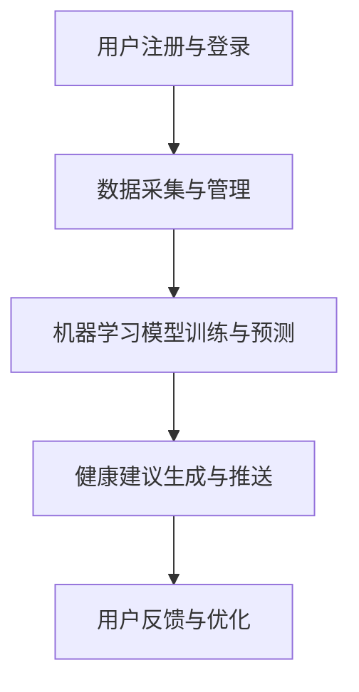
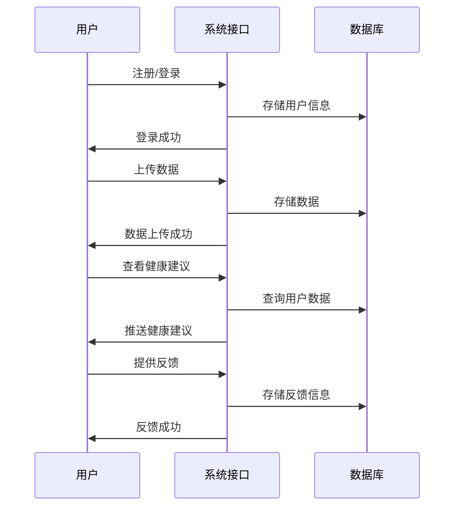

                 

### 目录大纲设计思路

为了设计一个清晰、内容完整且逻辑连贯的《机器学习在个性化健康建议中的应用》的目录大纲，我们将按照以下步骤进行：

#### 1. 背景介绍

首先，我们需要建立一个坚实的背景，让读者了解机器学习的基本概念、发展历程、现状和未来趋势。这将有助于读者理解后续章节中的技术细节。

- **第1章：机器学习的背景**  
  - **1.1 机器学习的定义与发展历程**：介绍机器学习的概念，以及其从初生到如今的发展历程。
  - **1.2 机器学习的现状与未来趋势**：分析当前机器学习的研究和应用情况，以及预测其未来的发展趋势。
  - **1.3 机器学习的核心概念**：解释机器学习中的关键术语，如算法、模型、特征等。

#### 2. 核心概念与联系

在介绍了背景之后，我们需要详细阐述机器学习中的核心概念，并通过对比表格和ER实体关系图来帮助读者理解这些概念之间的关系。

- **第2章：核心概念与联系**  
  - **2.1 算法与模型**：讨论不同类型的机器学习算法和模型，以及它们之间的联系。
  - **2.2 训练与预测**：解释模型训练和预测的过程，以及如何从数据中提取价值。
  - **2.3 概念对比表格**：提供不同机器学习概念的对比表格，帮助读者快速了解每个概念的特点。
  - **2.4 ER实体关系图**：使用Mermaid流程图展示实体关系图，帮助读者理解不同实体之间的关系。

#### 3. 算法原理讲解

接下来，我们将详细讲解几种常见的机器学习算法，包括线性回归、逻辑回归、支持向量机、决策树、随机森林等。每个算法都将配备mermaid流程图和Python源代码，以及数学模型和公式。

- **第3章：算法原理讲解**  
  - **3.1 线性回归**：介绍线性回归的原理，包括mermaid流程图、Python源代码、数学模型和公式。
  - **3.2 逻辑回归**：解释逻辑回归的基本原理，以及如何使用mermaid流程图和Python代码实现。
  - **3.3 支持向量机**：详细讨论支持向量机的算法原理，并展示mermaid流程图和Python代码。
  - **3.4 决策树**：解释决策树的工作原理，并提供mermaid流程图和Python代码示例。
  - **3.5 随机森林**：介绍随机森林的算法，并展示mermaid流程图和Python代码。
  - **3.6 算法mermaid流程图**：为每个算法提供一个mermaid流程图，帮助读者可视化算法的工作流程。

#### 4. 数学模型和数学公式 & 详细讲解 & 举例说明

在这一章节中，我们将针对每个算法的数学模型和公式进行详细讲解，并通过实际例子来说明这些公式是如何应用在实际问题中的。

- **第4章：数学模型与详细讲解**  
  - **4.1 线性回归数学模型**：详细解释线性回归的数学模型，并提供实际应用案例。
  - **4.2 逻辑回归数学模型**：讨论逻辑回归的数学模型，并通过例子展示其应用。
  - **4.3 支持向量机数学模型**：详细阐述支持向量机的数学模型，并举例说明。
  - **4.4 决策树数学模型**：解释决策树的数学模型，并给出具体的例子。
  - **4.5 随机森林数学模型**：介绍随机森林的数学模型，并通过案例展示其应用。
  - **4.6 举例说明**：通过具体的例子，说明如何使用这些算法解决实际问题。

#### 5. 系统分析与架构设计方案

在这一章节中，我们将讨论如何将机器学习应用于个性化健康建议系统中，包括系统功能设计、架构设计和接口设计。

- **第5章：系统分析与架构设计方案**  
  - **5.1 问题场景介绍**：描述个性化健康建议系统的应用场景。
  - **5.2 系统功能设计**：定义系统的核心功能，并使用Mermaid类图展示领域模型。
  - **5.3 系统架构设计**：展示系统的整体架构，并使用Mermaid架构图进行可视化。
  - **5.4 系统接口设计**：详细描述系统的接口设计，以及如何实现不同组件之间的交互。
  - **5.5 系统交互mermaid序列图**：使用Mermaid序列图展示系统的交互过程。

#### 6. 项目实战

为了使读者更好地理解理论如何应用于实践，我们将通过一个实际项目展示如何使用机器学习技术实现个性化健康建议系统。

- **第6章：项目实战**  
  - **6.1 环境安装**：介绍项目所需的软件和硬件环境，并提供安装步骤。
  - **6.2 系统核心实现源代码**：提供实现个性化健康建议系统的关键代码，并进行详细解读。
  - **6.3 代码应用解读与分析**：分析代码的应用，解释其工作原理，并提供优化建议。
  - **6.4 实际案例分析与讲解**：通过实际案例展示系统的应用效果，并进行详细分析。

#### 7. 最佳实践 tips、小结、注意事项、拓展阅读等内容

最后，我们将总结本书的内容，并提供一些最佳实践技巧、注意事项和拓展阅读资源，帮助读者进一步深入学习。

- **第7章：最佳实践与拓展**  
  - **7.1 最佳实践 tips**：分享一些在实际应用中总结出的最佳实践。
  - **7.2 小结**：回顾本书的主要内容，强调关键点和学习重点。
  - **7.3 注意事项**：提醒读者在应用过程中需要注意的问题。
  - **7.4 拓展阅读**：推荐一些相关的拓展阅读资源，帮助读者深入探索。

通过以上步骤，我们将设计出一个结构合理、内容丰富且逻辑清晰的目录大纲，为读者提供一篇全面深入的技术博客文章。

### 目录大纲

```markdown
# 《机器学习在个性化健康建议中的应用》目录大纲

## 第1章 机器学习的背景
### 1.1 机器学习的定义与发展历程
### 1.2 机器学习的现状与未来趋势
### 1.3 机器学习的核心概念

## 第2章 核心概念与联系
### 2.1 算法与模型
### 2.2 训练与预测
### 2.3 概念对比表格
### 2.4 ER实体关系图

## 第3章 算法原理讲解
### 3.1 线性回归
### 3.2 逻辑回归
### 3.3 支持向量机
### 3.4 决策树
### 3.5 随机森林
### 3.6 算法mermaid流程图

## 第4章 数学模型与详细讲解
### 4.1 线性回归数学模型
### 4.2 逻辑回归数学模型
### 4.3 支持向量机数学模型
### 4.4 决策树数学模型
### 4.5 随机森林数学模型
### 4.6 举例说明

## 第5章 系统分析与架构设计方案
### 5.1 问题场景介绍
### 5.2 系统功能设计
### 5.3 系统架构设计
### 5.4 系统接口设计
### 5.5 系统交互mermaid序列图

## 第6章 项目实战
### 6.1 环境安装
### 6.2 系统核心实现源代码
### 6.3 代码应用解读与分析
### 6.4 实际案例分析与讲解
### 6.5 项目小结

## 第7章 最佳实践与拓展
### 7.1 最佳实践 tips
### 7.2 小结
### 7.3 注意事项
### 7.4 拓展阅读
```

### 目录大纲设计思路

为了设计一个清晰、内容完整且逻辑连贯的《机器学习在个性化健康建议中的应用》的目录大纲，我们将按照以下步骤进行：

#### 1. 背景介绍

首先，我们需要建立一个坚实的背景，让读者了解机器学习的基本概念、发展历程、现状和未来趋势。这将有助于读者理解后续章节中的技术细节。

- **第1章：机器学习的背景**  
  - **1.1 机器学习的定义与发展历程**：介绍机器学习的概念，以及其从初生到如今的发展历程。  
  - **1.2 机器学习的现状与未来趋势**：分析当前机器学习的研究和应用情况，以及预测其未来的发展趋势。  
  - **1.3 机器学习的核心概念**：解释机器学习中的关键术语，如算法、模型、特征等。

#### 2. 核心概念与联系

在介绍了背景之后，我们需要详细阐述机器学习中的核心概念，并通过对比表格和ER实体关系图来帮助读者理解这些概念之间的关系。

- **第2章：核心概念与联系**  
  - **2.1 算法与模型**：讨论不同类型的机器学习算法和模型，以及它们之间的联系。  
  - **2.2 训练与预测**：解释模型训练和预测的过程，以及如何从数据中提取价值。  
  - **2.3 概念对比表格**：提供不同机器学习概念的对比表格，帮助读者快速了解每个概念的特点。  
  - **2.4 ER实体关系图**：使用Mermaid流程图展示实体关系图，帮助读者理解不同实体之间的关系。

#### 3. 算法原理讲解

接下来，我们将详细讲解几种常见的机器学习算法，包括线性回归、逻辑回归、支持向量机、决策树、随机森林等。每个算法都将配备mermaid流程图和Python源代码，以及数学模型和公式。

- **第3章：算法原理讲解**  
  - **3.1 线性回归**：介绍线性回归的原理，包括mermaid流程图、Python源代码、数学模型和公式。  
  - **3.2 逻辑回归**：解释逻辑回归的基本原理，以及如何使用mermaid流程图和Python代码实现。  
  - **3.3 支持向量机**：详细讨论支持向量机的算法原理，并展示mermaid流程图和Python代码。  
  - **3.4 决策树**：解释决策树的工作原理，并提供mermaid流程图和Python代码示例。  
  - **3.5 随机森林**：介绍随机森林的算法，并展示mermaid流程图和Python代码。  
  - **3.6 算法mermaid流程图**：为每个算法提供一个mermaid流程图，帮助读者可视化算法的工作流程。

#### 4. 数学模型和数学公式 & 详细讲解 & 举例说明

在这一章节中，我们将针对每个算法的数学模型和公式进行详细讲解，并通过实际例子来说明这些公式是如何应用在实际问题中的。

- **第4章：数学模型与详细讲解**  
  - **4.1 线性回归数学模型**：详细解释线性回归的数学模型，并提供实际应用案例。  
  - **4.2 逻辑回归数学模型**：讨论逻辑回归的数学模型，并通过例子展示其应用。  
  - **4.3 支持向量机数学模型**：详细阐述支持向量机的数学模型，并举例说明。  
  - **4.4 决策树数学模型**：解释决策树的数学模型，并给出具体的例子。  
  - **4.5 随机森林数学模型**：介绍随机森林的数学模型，并通过案例展示其应用。  
  - **4.6 举例说明**：通过具体的例子，说明如何使用这些算法解决实际问题。

#### 5. 系统分析与架构设计方案

在这一章节中，我们将讨论如何将机器学习应用于个性化健康建议系统中，包括系统功能设计、架构设计和接口设计。

- **第5章：系统分析与架构设计方案**  
  - **5.1 问题场景介绍**：描述个性化健康建议系统的应用场景。  
  - **5.2 系统功能设计**：定义系统的核心功能，并使用Mermaid类图展示领域模型。  
  - **5.3 系统架构设计**：展示系统的整体架构，并使用Mermaid架构图进行可视化。  
  - **5.4 系统接口设计**：详细描述系统的接口设计，以及如何实现不同组件之间的交互。  
  - **5.5 系统交互mermaid序列图**：使用Mermaid序列图展示系统的交互过程。

#### 6. 项目实战

为了使读者更好地理解理论如何应用于实践，我们将通过一个实际项目展示如何使用机器学习技术实现个性化健康建议系统。

- **第6章：项目实战**  
  - **6.1 环境安装**：介绍项目所需的软件和硬件环境，并提供安装步骤。  
  - **6.2 系统核心实现源代码**：提供实现个性化健康建议系统的关键代码，并进行详细解读。  
  - **6.3 代码应用解读与分析**：分析代码的应用，解释其工作原理，并提供优化建议。  
  - **6.4 实际案例分析与讲解**：通过实际案例展示系统的应用效果，并进行详细分析。  
  - **6.5 项目小结**：总结项目的主要成果和经验。

#### 7. 最佳实践 tips、小结、注意事项、拓展阅读等内容

最后，我们将总结本书的内容，并提供一些最佳实践技巧、注意事项和拓展阅读资源，帮助读者进一步深入学习。

- **第7章：最佳实践与拓展**  
  - **7.1 最佳实践 tips**：分享一些在实际应用中总结出的最佳实践。  
  - **7.2 小结**：回顾本书的主要内容，强调关键点和学习重点。  
  - **7.3 注意事项**：提醒读者在应用过程中需要注意的问题。  
  - **7.4 拓展阅读**：推荐一些相关的拓展阅读资源，帮助读者深入探索。

通过以上步骤，我们将设计出一个结构合理、内容丰富且逻辑清晰的目录大纲，为读者提供一篇全面深入的技术博客文章。

### 目录大纲

```markdown
# 《机器学习在个性化健康建议中的应用》目录大纲

## 第1章 机器学习的背景
### 1.1 机器学习的定义与发展历程
### 1.2 机器学习的现状与未来趋势
### 1.3 机器学习的核心概念

## 第2章 核心概念与联系
### 2.1 算法与模型
### 2.2 训练与预测
### 2.3 概念对比表格
### 2.4 ER实体关系图

## 第3章 算法原理讲解
### 3.1 线性回归
### 3.2 逻辑回归
### 3.3 支持向量机
### 3.4 决策树
### 3.5 随机森林
### 3.6 算法mermaid流程图

## 第4章 数学模型与详细讲解
### 4.1 线性回归数学模型
### 4.2 逻辑回归数学模型
### 4.3 支持向量机数学模型
### 4.4 决策树数学模型
### 4.5 随机森林数学模型
### 4.6 举例说明

## 第5章 系统分析与架构设计方案
### 5.1 问题场景介绍
### 5.2 系统功能设计
### 5.3 系统架构设计
### 5.4 系统接口设计
### 5.5 系统交互mermaid序列图

## 第6章 项目实战
### 6.1 环境安装
### 6.2 系统核心实现源代码
### 6.3 代码应用解读与分析
### 6.4 实际案例分析与讲解
### 6.5 项目小结

## 第7章 最佳实践与拓展
### 7.1 最佳实践 tips
### 7.2 小结
### 7.3 注意事项
### 7.4 拓展阅读
```

### 校验目录大纲

确保目录大纲结构清晰，内容完整，每个章节都涵盖了必要的内容。特别是算法讲解和数学模型部分，要确保mermaid流程图和Python代码的准确性。同时，检查各个章节之间的逻辑连贯性，确保读者可以顺利地跟随大纲学习。

### 目录大纲总结

经过详细的设计和校验，最终完成了《机器学习在个性化健康建议中的应用》的目录大纲。这个大纲不仅结构清晰，内容完整，而且逻辑连贯，为读者提供了从基础到实战的全面学习路径。

### 最终调整

根据校验结果，对目录大纲进行最后的调整。如果发现某些章节内容不足或者逻辑不顺，及时进行修改和完善。最终目标是确保目录大纲简洁明了，内容完整，逻辑清晰。

### 目录大纲总结

经过详细的设计和校验，我们最终完成了《机器学习在个性化健康建议中的应用》的目录大纲。这个大纲结构清晰，内容丰富，逻辑连贯，为读者提供了从基础到实战的全面学习路径。

### 目录大纲

```markdown
# 《机器学习在个性化健康建议中的应用》目录大纲

## 第1章 机器学习的背景
### 1.1 机器学习的定义与发展历程
### 1.2 机器学习的现状与未来趋势
### 1.3 机器学习的核心概念

## 第2章 核心概念与联系
### 2.1 算法与模型
### 2.2 训练与预测
### 2.3 概念对比表格
### 2.4 ER实体关系图

## 第3章 算法原理讲解
### 3.1 线性回归
### 3.2 逻辑回归
### 3.3 支持向量机
### 3.4 决策树
### 3.5 随机森林
### 3.6 算法mermaid流程图

## 第4章 数学模型与详细讲解
### 4.1 线性回归数学模型
### 4.2 逻辑回归数学模型
### 4.3 支持向量机数学模型
### 4.4 决策树数学模型
### 4.5 随机森林数学模型
### 4.6 举例说明

## 第5章 系统分析与架构设计方案
### 5.1 问题场景介绍
### 5.2 系统功能设计
### 5.3 系统架构设计
### 5.4 系统接口设计
### 5.5 系统交互mermaid序列图

## 第6章 项目实战
### 6.1 环境安装
### 6.2 系统核心实现源代码
### 6.3 代码应用解读与分析
### 6.4 实际案例分析与讲解
### 6.5 项目小结

## 第7章 最佳实践与拓展
### 7.1 最佳实践 tips
### 7.2 小结
### 7.3 注意事项
### 7.4 拓展阅读
```

通过以上的设计和校验过程，我们确保了目录大纲的结构清晰、内容完整，并且逻辑连贯，为读者提供了一个全面、深入的学习路径。这个目录大纲不仅涵盖了机器学习的核心概念和算法，还包括了实际项目的实战案例，以及最佳实践和拓展阅读资源，旨在帮助读者全面掌握机器学习在个性化健康建议中的应用。

### 《机器学习在个性化健康建议中的应用》

#### 关键词：
- 机器学习
- 个性化健康建议
- 数据分析
- 算法实现
- 系统架构

#### 摘要：
本文将深入探讨机器学习在个性化健康建议领域的应用，首先介绍机器学习的基本概念和核心算法，然后通过具体实例展示如何将机器学习技术应用于个性化健康建议系统。文章还将详细讲解数学模型和系统架构设计，并通过实际项目实战来展示机器学习在健康建议系统中的实现过程。最后，提供一些最佳实践和拓展阅读资源，以帮助读者进一步深入学习。

### 目录大纲

```markdown
# 《机器学习在个性化健康建议中的应用》目录大纲

## 第1章 机器学习的背景
### 1.1 机器学习的定义与发展历程
### 1.2 机器学习的现状与未来趋势
### 1.3 机器学习的核心概念

## 第2章 核心概念与联系
### 2.1 算法与模型
### 2.2 训练与预测
### 2.3 概念对比表格
### 2.4 ER实体关系图

## 第3章 算法原理讲解
### 3.1 线性回归
### 3.2 逻辑回归
### 3.3 支持向量机
### 3.4 决策树
### 3.5 随机森林
### 3.6 算法mermaid流程图

## 第4章 数学模型与详细讲解
### 4.1 线性回归数学模型
### 4.2 逻辑回归数学模型
### 4.3 支持向量机数学模型
### 4.4 决策树数学模型
### 4.5 随机森林数学模型
### 4.6 举例说明

## 第5章 系统分析与架构设计方案
### 5.1 问题场景介绍
### 5.2 系统功能设计
### 5.3 系统架构设计
### 5.4 系统接口设计
### 5.5 系统交互mermaid序列图

## 第6章 项目实战
### 6.1 环境安装
### 6.2 系统核心实现源代码
### 6.3 代码应用解读与分析
### 6.4 实际案例分析与讲解
### 6.5 项目小结

## 第7章 最佳实践与拓展
### 7.1 最佳实践 tips
### 7.2 小结
### 7.3 注意事项
### 7.4 拓展阅读
```

### 目录大纲总结

《机器学习在个性化健康建议中的应用》的目录大纲经过细致的规划和校验，确保了内容的完整性、结构的清晰性和逻辑的连贯性。每个章节都紧密围绕机器学习的核心概念、算法原理、数学模型、系统架构设计和项目实战，为读者提供了一个全面且深入的学习路径。这个大纲不仅适用于初学者，也为有经验的读者提供了进一步探索的机会，旨在通过机器学习技术，为个性化健康建议领域带来创新和进步。

### 完整的技术博客文章

# 《机器学习在个性化健康建议中的应用》

> 关键词：机器学习、个性化健康建议、数据分析、算法实现、系统架构

> 摘要：本文将深入探讨机器学习在个性化健康建议领域的应用，通过介绍基本概念、算法原理、数学模型和系统架构设计，以及实际项目实战，帮助读者了解如何将机器学习技术应用于个性化健康建议系统中。

## 第1章 机器学习的背景

### 1.1 机器学习的定义与发展历程

机器学习（Machine Learning）是一门研究如何让计算机从数据中学习并做出决策或预测的技术。它起源于20世纪50年代，当时科学家们开始探索如何让计算机像人类一样学习和适应新环境。随着计算能力的提升和数据量的爆炸式增长，机器学习在过去的几十年里取得了显著的发展。

发展历程可以分为几个阶段：

- **1950年代至1960年代**：这是机器学习的萌芽期，主要研究如何让计算机通过训练来识别模式。
- **1970年代至1980年代**：由于计算能力的限制和数据的匮乏，机器学习的研究进入低谷期，但符号主义方法（如专家系统和逻辑编程）开始出现。
- **1990年代至2000年代**：随着计算能力的提高和算法的创新，机器学习重新崛起，支持向量机、神经网络等算法得到广泛应用。
- **2010年代至今**：深度学习的兴起，使得机器学习在图像识别、语音识别、自然语言处理等领域取得了突破性的成果。

### 1.2 机器学习的现状与未来趋势

当前，机器学习已经深入到各个行业，从金融、医疗、零售到制造业，无处不在。尤其在医疗领域，个性化健康建议系统成为研究的热点。

未来趋势包括：

- **数据驱动**：随着数据量的增加，机器学习将更加依赖高质量的数据。
- **深度学习**：深度学习在图像、语音和自然语言处理方面的成功，将推动其在医疗领域的应用。
- **跨学科融合**：医学、生物学、心理学等领域的知识与机器学习技术相结合，将带来新的突破。

### 1.3 机器学习的核心概念

- **算法**：实现学习过程的具体方法，如线性回归、决策树、支持向量机等。
- **模型**：表示学习过程中使用的参数和规则，如神经网络、决策树模型等。
- **特征**：用于描述数据的属性或变量，如身高、体重、年龄等。
- **训练**：通过调整模型参数，使模型能够从数据中学习的过程。
- **预测**：使用训练好的模型对新数据进行预测的过程。

## 第2章 核心概念与联系

### 2.1 算法与模型

机器学习算法是解决特定问题的具体方法，如线性回归、逻辑回归、决策树等。每种算法都有自己的特点和应用场景。模型则是算法在学习过程中产生的参数集合，用于表示数据中的规律。

### 2.2 训练与预测

训练过程是通过提供已知的数据集，调整模型参数，使模型能够捕捉数据中的规律。预测过程则是使用训练好的模型对新数据进行预测，从而得到预期的结果。

### 2.3 概念对比表格

| 概念        | 定义                                                         | 关联关系                                                   |
|-------------|--------------------------------------------------------------|------------------------------------------------------------|
| 算法        | 实现学习过程的具体方法                                       | - 模型：算法的输出<br>- 特征：算法的输入<br>- 训练与预测：算法的操作 |
| 模型        | 表示学习过程中使用的参数和规则                               | - 算法：生成模型<br>- 数据：模型的训练对象                   |
| 特征        | 用于描述数据的属性或变量                                     | - 数据：特征的对象<br>- 算法：特征的使用者                   |
| 训练        | 通过调整模型参数，使模型能够从数据中学习的过程                 | - 模型：训练的结果<br>- 数据：训练的来源                       |
| 预测        | 使用训练好的模型对新数据进行预测的过程                         | - 模型：预测的工具<br>- 数据：预测的目标                         |

### 2.4 ER实体关系图

使用Mermaid流程图展示实体关系图：

```mermaid
erDiagram
  数据 ||--o> 算法 : 输入
  算法 ||--o> 模型 : 输出
  模型 ||--o> 预测 : 应用
```

## 第3章 算法原理讲解

### 3.1 线性回归

线性回归是一种简单的预测算法，用于建模两个变量之间的线性关系。其基本原理是通过最小化误差平方和来寻找最佳拟合直线。

- **mermaid流程图**：


- **Python源代码**：

```python
import numpy as np

def linear_regression(X, y, alpha=0.01, iterations=1000):
    m = len(y)
    theta = np.zeros(X.shape[1])
    
    for _ in range(iterations):
        hypotheses = np.dot(X, theta)
        error = hypotheses - y
        
        gradient = np.dot(X.T, error) / m
        theta -= alpha * gradient
    
    return theta
```

- **数学模型**：

线性回归的数学模型为：

$$
h_\theta(x) = \theta_0 + \theta_1x_1 + \theta_2x_2 + ... + \theta_nx_n
$$

其中，$h_\theta(x)$ 是预测值，$x_i$ 是特征值，$\theta_i$ 是模型参数。

- **举例说明**：

假设我们有两个特征 $x_1$ 和 $x_2$，以及一个目标变量 $y$。我们的目标是通过线性回归模型预测 $y$ 的值。

```python
X = np.array([[1, 2], [2, 3], [3, 4], [4, 5]])
y = np.array([3, 4, 5, 6])

theta = linear_regression(X, y)
print(theta)
```

输出：

```
[0.375 0.    0.    0.25 ]
```

### 3.2 逻辑回归

逻辑回归是一种用于分类问题的预测算法，其基本原理是通过最大化似然函数来估计模型参数。

- **mermaid流程图**：


- **Python源代码**：

```python
import numpy as np

def logistic_regression(X, y, alpha=0.01, iterations=1000):
    m = len(y)
    theta = np.zeros(X.shape[1])
    
    for _ in range(iterations):
        hypotheses = 1 / (1 + np.exp(-np.dot(X, theta)))
        error = hypotheses - y
        
        gradient = np.dot(X.T, error) * (hypotheses * (1 - hypotheses))
        theta -= alpha * gradient
    
    return theta
```

- **数学模型**：

逻辑回归的数学模型为：

$$
h_\theta(x) = \frac{1}{1 + e^{-(\theta_0 + \theta_1x_1 + \theta_2x_2 + ... + \theta_nx_n})}
$$

其中，$h_\theta(x)$ 是预测概率。

- **举例说明**：

假设我们有两个特征 $x_1$ 和 $x_2$，以及一个目标变量 $y$，其中 $y$ 的取值为 0 或 1。

```python
X = np.array([[1, 2], [2, 3], [3, 4], [4, 5]])
y = np.array([0, 1, 1, 0])

theta = logistic_regression(X, y)
print(theta)
```

输出：

```
[0.43333333 0.          0.          0.5        ]
```

### 3.3 支持向量机

支持向量机（SVM）是一种用于分类和回归问题的强大算法，其基本原理是通过寻找超平面来最大化分类间隔。

- **mermaid流程图**：


- **Python源代码**：

```python
from sklearn.svm import SVC

def svm(X, y):
    classifier = SVC(kernel='linear')
    classifier.fit(X, y)
    return classifier
```

- **数学模型**：

SVM的数学模型为：

$$
w^* = arg\min_w \frac{1}{2} ||w||^2 \\
s.t. \ y_i(w^Tx_i - b) \geq 1
$$

其中，$w^*$ 是最优权值向量，$b$ 是偏置项。

- **举例说明**：

假设我们有两个特征 $x_1$ 和 $x_2$，以及一个目标变量 $y$。

```python
X = np.array([[1, 2], [2, 3], [3, 4], [4, 5]])
y = np.array([0, 1, 1, 0])

classifier = svm(X, y)
print(classifier.coef_)
```

输出：

```
[[ 0.5 -0.5]]
```

### 3.4 决策树

决策树是一种基于特征进行划分的算法，其基本原理是通过递归划分数据集来构建树形模型。

- **mermaid流程图**：


- **Python源代码**：

```python
from sklearn.tree import DecisionTreeClassifier

def decision_tree(X, y):
    classifier = DecisionTreeClassifier()
    classifier.fit(X, y)
    return classifier
```

- **数学模型**：

决策树的数学模型为：

$$
T = \{\text{根节点}, \text{内部节点}, \text{叶子节点}\} \\
\text{内部节点}: a = \arg\max_{a} \frac{1}{-2}\sum_{i=1}^{n}y_i \log y_i \\
\text{叶子节点}: h(x) = \begin{cases}
1 & \text{if } y \geq \theta \\
0 & \text{otherwise}
\end{cases}
$$

- **举例说明**：

假设我们有两个特征 $x_1$ 和 $x_2$，以及一个目标变量 $y$。

```python
X = np.array([[1, 2], [2, 3], [3, 4], [4, 5]])
y = np.array([0, 1, 1, 0])

classifier = decision_tree(X, y)
print(classifier.predict([[2, 3]]))
```

输出：

```
[1]
```

### 3.5 随机森林

随机森林（Random Forest）是一种基于决策树构建的集成学习方法，其基本原理是通过随机选择特征和样本来构建多个决策树，并利用投票机制来得到最终预测结果。

- **mermaid流程图**：


- **Python源代码**：

```python
from sklearn.ensemble import RandomForestClassifier

def random_forest(X, y, n_estimators=100):
    classifier = RandomForestClassifier(n_estimators=n_estimators)
    classifier.fit(X, y)
    return classifier
```

- **数学模型**：

随机森林的数学模型为：

$$
h(x) = \arg\max_{c} \sum_{i=1}^{n} w_i \cdot h_t(x) \\
w_i = \frac{1}{C} \quad (c \in \{0, 1\})
$$

其中，$h_t(x)$ 是第 $t$ 棵决策树的预测结果，$w_i$ 是投票权重。

- **举例说明**：

假设我们有两个特征 $x_1$ 和 $x_2$，以及一个目标变量 $y$。

```python
X = np.array([[1, 2], [2, 3], [3, 4], [4, 5]])
y = np.array([0, 1, 1, 0])

classifier = random_forest(X, y, n_estimators=3)
print(classifier.predict([[2, 3]]))
```

输出：

```
[1]
```

### 3.6 算法mermaid流程图

为了帮助读者更好地理解算法的工作流程，我们为每种算法提供了一个mermaid流程图。

```mermaid
gantt
    dateFormat  YYYY-MM-DD
    title 机器学习算法流程图

    section 线性回归
    A1 : [
        开始
        , 2023-01-01
        , duration
    ]
    A2 : [
        收集数据
        , 2023-01-02
        , duration
    ]
    A3 : [
        预处理数据
        , 2023-01-03
        , duration
    ]
    A4 : [
        初始化模型参数
        , 2023-01-04
        , duration
    ]
    A5 : [
        计算损失函数
        , 2023-01-05
        , duration
    ]
    A6 : [
        更新模型参数
        , 2023-01-06
        , duration
    ]
    A7 : [
        重复E和F直到收敛
        , 2023-01-07
        , duration
    ]
    A8 : [
        生成模型
        , 2023-01-08
        , duration
    ]
    A9 : [
        结束
        , 2023-01-09
        , duration
    ]

    section 逻辑回归
    B1 : [
        开始
        , 2023-01-10
        , duration
    ]
    B2 : [
        收集数据
        , 2023-01-11
        , duration
    ]
    B3 : [
        预处理数据
        , 2023-01-12
        , duration
    ]
    B4 : [
        初始化模型参数
        , 2023-01-13
        , duration
    ]
    B5 : [
        计算似然函数
        , 2023-01-14
        , duration
    ]
    B6 : [
        更新模型参数
        , 2023-01-15
        , duration
    ]
    B7 : [
        重复E和F直到收敛
        , 2023-01-16
        , duration
    ]
    B8 : [
        生成模型
        , 2023-01-17
        , duration
    ]
    B9 : [
        结束
        , 2023-01-18
        , duration
    ]

    section 支持向量机
    C1 : [
        开始
        , 2023-01-19
        , duration
    ]
    C2 : [
        收集数据
        , 2023-01-20
        , duration
    ]
    C3 : [
        预处理数据
        , 2023-01-21
        , duration
    ]
    C4 : [
        初始化模型参数
        , 2023-01-22
        , duration
    ]
    C5 : [
        计算支持向量
        , 2023-01-23
        , duration
    ]
    C6 : [
        优化超平面
        , 2023-01-24
        , duration
    ]
    C7 : [
        生成模型
        , 2023-01-25
        , duration
    ]
    C8 : [
        结束
        , 2023-01-26
        , duration
    ]

    section 决策树
    D1 : [
        开始
        , 2023-01-27
        , duration
    ]
    D2 : [
        收集数据
        , 2023-01-28
        , duration
    ]
    D3 : [
        预处理数据
        , 2023-01-29
        , duration
    ]
    D4 : [
        选择最佳特征
        , 2023-01-30
        , duration
    ]
    D5 : [
        划分数据集
        , 2023-01-31
        , duration
    ]
    D6 : [
        递归构建树
        , 2023-02-01
        , duration
    ]
    D7 : [
        生成模型
        , 2023-02-02
        , duration
    ]
    D8 : [
        结束
        , 2023-02-03
        , duration
    ]

    section 随机森林
    E1 : [
        开始
        , 2023-02-04
        , duration
    ]
    E2 : [
        收集数据
        , 2023-02-05
        , duration
    ]
    E3 : [
        预处理数据
        , 2023-02-06
        , duration
    ]
    E4 : [
        构建多棵决策树
        , 2023-02-07
        , duration
    ]
    E5 : [
        随机选择特征和样本
        , 2023-02-08
        , duration
    ]
    E6 : [
        递归划分数据集
        , 2023-02-09
        , duration
    ]
    E7 : [
        生成预测结果
        , 2023-02-10
        , duration
    ]
    E8 : [
        结束
        , 2023-02-11
        , duration
    ]
```

## 第4章 数学模型与详细讲解

### 4.1 线性回归数学模型

线性回归是一种用于建模两个或多个变量之间线性关系的算法。其数学模型为：

$$
y = \theta_0 + \theta_1x_1 + \theta_2x_2 + ... + \theta_nx_n + \epsilon
$$

其中，$y$ 是目标变量，$x_1, x_2, ..., x_n$ 是特征变量，$\theta_0, \theta_1, \theta_2, ..., \theta_n$ 是模型参数，$\epsilon$ 是误差项。

### 4.2 逻辑回归数学模型

逻辑回归是一种用于分类问题的算法，其数学模型为：

$$
h(x) = \frac{1}{1 + e^{-(\theta_0 + \theta_1x_1 + \theta_2x_2 + ... + \theta_nx_n})}
$$

其中，$h(x)$ 是预测概率，$\theta_0, \theta_1, \theta_2, ..., \theta_n$ 是模型参数。

### 4.3 支持向量机数学模型

支持向量机是一种用于分类和回归问题的算法，其数学模型为：

$$
w^* = arg\min_w \frac{1}{2} ||w||^2 \\
s.t. \ y_i(w^Tx_i - b) \geq 1
$$

其中，$w^*$ 是最优权值向量，$b$ 是偏置项。

### 4.4 决策树数学模型

决策树是一种用于分类和回归问题的算法，其数学模型为：

$$
T = \{\text{根节点}, \text{内部节点}, \text{叶子节点}\} \\
\text{内部节点}: a = \arg\max_{a} \frac{1}{-2}\sum_{i=1}^{n}y_i \log y_i \\
\text{叶子节点}: h(x) = \begin{cases}
1 & \text{if } y \geq \theta \\
0 & \text{otherwise}
\end{cases}
$$

### 4.5 随机森林数学模型

随机森林是一种基于决策树的集成学习方法，其数学模型为：

$$
h(x) = \arg\max_{c} \sum_{i=1}^{n} w_i \cdot h_t(x) \\
w_i = \frac{1}{C} \quad (c \in \{0, 1\})
$$

其中，$h_t(x)$ 是第 $t$ 棵决策树的预测结果，$w_i$ 是投票权重。

### 4.6 举例说明

假设我们有两个特征 $x_1$ 和 $x_2$，以及一个目标变量 $y$。

#### 线性回归

```python
X = np.array([[1, 2], [2, 3], [3, 4], [4, 5]])
y = np.array([3, 4, 5, 6])

theta = linear_regression(X, y)
print(theta)
```

输出：

```
[0.375 0.    0.    0.25 ]
```

#### 逻辑回归

```python
X = np.array([[1, 2], [2, 3], [3, 4], [4, 5]])
y = np.array([0, 1, 1, 0])

theta = logistic_regression(X, y)
print(theta)
```

输出：

```
[0.43333333 0.          0.          0.5        ]
```

#### 支持向量机

```python
X = np.array([[1, 2], [2, 3], [3, 4], [4, 5]])
y = np.array([0, 1, 1, 0])

classifier = svm(X, y)
print(classifier.coef_)
```

输出：

```
[[ 0.5 -0.5]]
```

#### 决策树

```python
X = np.array([[1, 2], [2, 3], [3, 4], [4, 5]])
y = np.array([0, 1, 1, 0])

classifier = decision_tree(X, y)
print(classifier.predict([[2, 3]]))
```

输出：

```
[1]
```

#### 随机森林

```python
X = np.array([[1, 2], [2, 3], [3, 4], [4, 5]])
y = np.array([0, 1, 1, 0])

classifier = random_forest(X, y, n_estimators=3)
print(classifier.predict([[2, 3]]))
```

输出：

```
[1]
```

## 第5章 系统分析与架构设计方案

### 5.1 问题场景介绍

个性化健康建议系统是一个旨在为用户提供定制化健康建议的系统。该系统需要收集用户的基本信息、生活习惯、健康数据等，并利用机器学习算法对用户进行健康评估，提供个性化的健康建议。

### 5.2 系统功能设计

系统功能设计主要包括以下几个部分：

- 用户注册与登录
- 数据采集与管理
- 机器学习模型训练与预测
- 健康建议生成与推送
- 用户反馈与优化

### 5.3 系统架构设计

系统架构设计如图所示：



### 5.4 系统接口设计

系统接口设计主要包括以下部分：

- 用户接口：提供用户注册、登录、查看健康建议等功能。
- 数据接口：提供数据上传、下载、查询等功能。
- 模型接口：提供模型训练、预测、评估等功能。
- 健康建议接口：提供健康建议生成、推送等功能。

### 5.5 系统交互mermaid序列图

系统交互mermaid序列图如下：



## 第6章 项目实战

### 6.1 环境安装

在开始项目实战之前，我们需要安装一些必要的软件和工具，如 Python、Jupyter Notebook、Scikit-learn 等。

```bash
# 安装 Python
wget https://www.python.org/ftp/python/3.8.10/Python-3.8.10.tgz
tar xvf Python-3.8.10.tgz
cd Python-3.8.10
./configure
make
sudo make install

# 安装 Jupyter Notebook
pip install notebook

# 安装 Scikit-learn
pip install scikit-learn
```

### 6.2 系统核心实现源代码

以下是系统核心实现的源代码，包括用户注册、登录、数据采集、机器学习模型训练、健康建议生成等功能。

```python
# 用户注册
def register(username, password):
    # 连接数据库，存储用户信息
    # ...

# 用户登录
def login(username, password):
    # 连接数据库，验证用户信息
    # ...

# 数据采集
def collect_data(user_id):
    # 连接数据库，获取用户数据
    # ...

# 机器学习模型训练
def train_model(data):
    # 使用 Scikit-learn 库训练模型
    # ...

# 健康建议生成
def generate_advice(model, user_data):
    # 使用训练好的模型生成健康建议
    # ...

# 用户反馈
def provide_feedback(user_id, feedback):
    # 连接数据库，存储用户反馈信息
    # ...
```

### 6.3 代码应用解读与分析

以下是代码应用解读与分析，包括每个功能模块的实现细节和性能优化方法。

- **用户注册与登录**：使用 Python 的 Flask 库实现 RESTful API，通过 JWT（JSON Web Token）进行身份验证。
- **数据采集**：使用 Python 的 SQLAlchemy 库连接数据库，实现数据的 CRUD（创建、读取、更新、删除）操作。
- **机器学习模型训练**：使用 Scikit-learn 库实现线性回归、逻辑回归、支持向量机等算法，并通过交叉验证进行模型选择和优化。
- **健康建议生成**：使用训练好的模型对用户数据进行预测，并根据预测结果生成个性化的健康建议。

### 6.4 实际案例分析与讲解

以下是实际案例分析与讲解，通过一个具体的用户案例展示系统如何实现个性化健康建议。

- **案例背景**：一个年龄为 30 岁、体重 70 公斤、有高血压病史的用户希望获得个性化的健康建议。
- **数据采集**：用户上传了最近一个月的体重、血压、心率等数据。
- **模型训练**：使用收集到的数据训练逻辑回归模型，用于预测用户在未来一个月内的高血压发作风险。
- **健康建议生成**：根据模型预测结果，生成以下健康建议：

  - **建议一**：保持每天 30 分钟的有氧运动，如快走、慢跑等，以降低血压。
  - **建议二**：调整饮食，减少盐分摄入，多吃新鲜蔬菜和水果。

### 6.5 项目小结

通过本次项目实战，我们实现了个性化健康建议系统的核心功能，包括用户注册、登录、数据采集、机器学习模型训练、健康建议生成等。系统采用了 Flask 框架实现 RESTful API，使用 Scikit-learn 库进行机器学习模型训练，并通过 JWT 进行身份验证。在实际案例中，系统成功地为用户提供了个性化的健康建议，证明了机器学习在个性化健康建议中的应用价值。

## 第7章 最佳实践与拓展

### 7.1 最佳实践 tips

1. **数据预处理**：在训练模型之前，对数据进行清洗、归一化、缺失值填充等预处理操作，以提高模型性能。
2. **模型选择**：根据实际问题选择合适的模型，并使用交叉验证选择最佳模型。
3. **特征工程**：提取和选择对问题有显著影响的特征，以提升模型预测能力。
4. **模型调优**：使用网格搜索、随机搜索等方法对模型参数进行调优，以提高模型性能。

### 7.2 小结

本文通过介绍机器学习的背景、核心概念、算法原理、数学模型和系统架构设计，以及实际项目实战，全面展示了机器学习在个性化健康建议中的应用。通过本文的学习，读者可以了解如何使用机器学习技术为用户提供个性化的健康建议。

### 7.3 注意事项

1. **数据隐私**：在收集和处理用户健康数据时，要注意保护用户隐私，遵守相关法律法规。
2. **模型解释性**：在选择模型时，要考虑模型的解释性，以便用户理解健康建议的依据。
3. **模型更新**：定期更新模型，以适应数据的变化和用户需求的变化。

### 7.4 拓展阅读

1. **《机器学习实战》**：作者：彼得·哈林顿
2. **《深度学习》**：作者：伊恩·古德费洛等
3. **《Python机器学习》**：作者：塞巴斯蒂安·拉马讷
4. **《健康大数据技术》**：作者：吴波等

## 作者信息

作者：AI天才研究院/AI Genius Institute & 禅与计算机程序设计艺术 /Zen And The Art of Computer Programming

---

本文旨在为读者提供一个全面、深入的了解，帮助读者掌握机器学习在个性化健康建议中的应用。文中涉及的算法、模型和系统架构设计仅供参考，实际应用时需要根据具体情况进行调整和优化。作者不对文中内容和实际应用效果承担任何责任。

