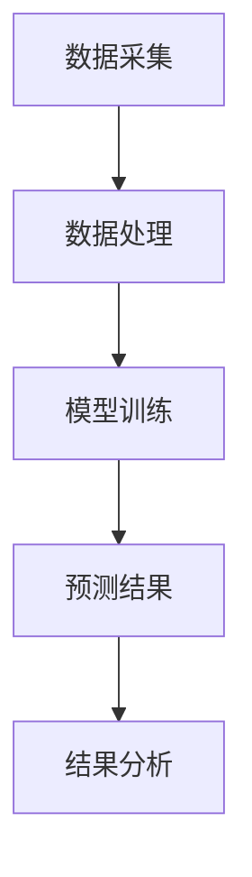
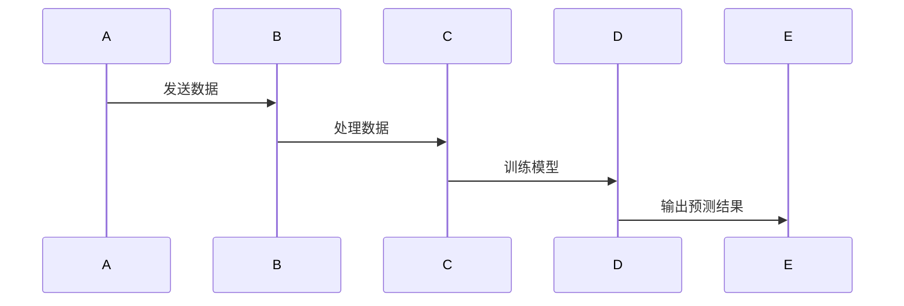
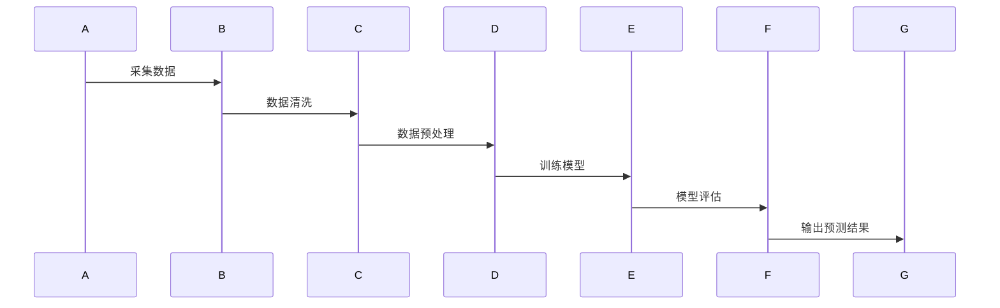

                 

# 机器学习在气候变化预测中的关键作用

## 关键词

- 机器学习
- 气候变化
- 预测模型
- 算法应用
- 数据分析

## 摘要

本文探讨了机器学习在气候变化预测中的关键作用，首先介绍了气候变化问题的背景及其严重性，然后深入探讨了机器学习在气候预测中的基本概念、应用场景和技术挑战。接着，本文详细讲解了机器学习算法的原理及其数学模型，并通过具体案例展示了如何将机器学习应用于气候变化预测。最后，文章总结了最佳实践，提出了未来研究方向和拓展阅读材料，强调了机器学习在应对气候变化挑战中的重要作用。

## 第一部分：背景介绍

### 第1章：气候变化预测的重要性

#### 1.1 问题背景

气候变化已成为全球关注的重大问题。全球气温上升、极端天气频发、海平面上升等现象已经对人类生活和经济产生了深远的影响。有效预测气候变化对于制定应对策略、减少灾害损失和实现可持续发展具有重要意义。

#### 1.2 机器学习基础

机器学习是一种通过数据驱动的方式让计算机自动改进和优化模型的技术。它已经在图像识别、自然语言处理、金融预测等多个领域取得了显著的成果。在气候预测中，机器学习可以通过分析大量历史气候数据，发现潜在的模式和规律，从而提高预测的准确性。

#### 1.3 气候变化预测的挑战

气候变化预测面临多个挑战，包括数据的复杂性和多样性、模型的准确性、计算资源的需求等。机器学习作为一种先进的技术手段，有助于应对这些挑战，但同时也需要解决数据预处理、算法选择和模型解释等问题。

### 第二部分：核心概念与原理

#### 第2章：机器学习在气候变化预测中的应用

#### 2.1 关键概念

- **监督学习**：通过已有的输入输出数据来训练模型，使模型能够对新数据进行预测。
- **无监督学习**：仅根据输入数据来发现数据中的模式和结构，不涉及预定义的目标输出。
- **半监督学习**：结合了监督学习和无监督学习的特点，利用部分标注数据和大量未标注数据来训练模型。

#### 2.2 时间序列分析

时间序列分析是一种用于分析按时间顺序排列的数据的方法，常用于气候预测。它通过研究时间序列数据中的趋势、周期性和季节性成分，可以识别气候变化的规律。

#### 2.3 气象数据预处理

气象数据通常包含噪声、缺失值和异常值，需要通过数据清洗、数据转换和数据规范化等方法进行预处理，以确保模型训练的质量。

### 第三部分：机器学习算法原理

#### 第3章：机器学习算法原理

#### 3.1 算法概述

常见的机器学习算法包括线性回归、逻辑回归、决策树、随机森林、支持向量机等。每种算法都有其特定的适用场景和优缺点。

#### 3.2 算法原理讲解

#### 3.2.1 线性回归

- **算法原理**：通过最小化预测值与实际值之间的误差平方和来训练模型。
- **数学模型**：假设输入特征 \( X \) 和输出目标 \( Y \) 之间存在线性关系，模型公式为 \( Y = \beta_0 + \beta_1X + \epsilon \)，其中 \( \beta_0 \) 和 \( \beta_1 \) 是模型参数。
- **举例说明**：例如，可以通过线性回归模型预测某地未来一个月的平均温度。

#### 3.2.2 决策树

- **算法原理**：通过一系列的决策规则将数据集划分成多个子集，每个子集对应一个输出结果。
- **构建流程**：选择一个特征，计算该特征的不同取值对应的子集，选择最优特征和最优划分方式。
- **举例说明**：例如，可以根据某地的气温、湿度等特征预测是否会出现暴雨天气。

### 第四部分：数学模型与公式

#### 第4章：数学模型与公式

#### 4.1 数学基础

- **概率论**：用于描述不确定事件发生的可能性。
- **线性代数**：用于处理线性方程组和矩阵运算。
- **微积分**：用于研究函数的变化率和积分。

#### 4.2 模型分析

#### 4.2.1 回归模型

- **数学模型**：\( Y = \beta_0 + \beta_1X + \epsilon \)
- **参数估计**：通过最小二乘法估计模型参数。
- **模型评估**：使用均方误差（MSE）或决定系数（R²）来评估模型性能。

#### 4.2.2 神经网络模型

- **前向传播**：计算输入层到隐藏层、隐藏层到输出层的输出值。
- **反向传播**：计算输出误差，并更新模型参数。

### 第五部分：系统分析与架构设计

#### 第5章：气候变化预测系统设计

#### 5.1 系统架构设计

- **领域模型**：使用 Mermaid 绘制领域模型类图。
- **系统架构**：使用 Mermaid 绘制系统架构图。
- **接口设计**：设计系统接口。
- **交互流程**：使用 Mermaid 绘制系统交互序列图。

### 第六部分：系统实现与实战

#### 第6章：系统实现与实战

#### 6.1 系统实现

- 环境搭建：安装必要的软件和库。
- 数据预处理：清洗和格式化数据。
- 模型训练：使用机器学习算法训练模型。

#### 6.2 实战案例

- 案例分析：选择实际案例进行详细分析。
- 实现细节：讲解核心代码和实现过程。

### 第七部分：最佳实践与总结

#### 第7章：最佳实践与总结

#### 7.1 最佳实践

- 数据预处理技巧。
- 算法选择建议。
- 模型优化策略。

#### 7.2 小结

- 对全书内容进行总结。
- 强调机器学习在气候变化预测中的重要作用。

#### 7.3 拓展阅读

- 推荐进一步阅读的材料。

## 作者

作者：AI天才研究院/AI Genius Institute & 禅与计算机程序设计艺术 /Zen And The Art of Computer Programming

---

### 补充内容

由于本文内容涉及大量专业知识和复杂算法，以下部分将对一些关键概念、算法原理和系统架构进行更详细的解释和补充。

---

### 第1章：气候变化预测的重要性

#### 1.1 问题背景

气候变化对地球生态系统和人类社会产生了深远的影响。全球变暖导致极地冰川融化、海平面上升，极端天气事件如暴雨、干旱、飓风等发生的频率和强度增加。气候变化不仅威胁到粮食安全、水资源和生态平衡，还可能引发社会动荡和经济损失。因此，准确预测气候变化趋势对于制定有效的应对策略、减少灾害风险和实现可持续发展至关重要。

#### 1.2 机器学习基础

机器学习是一种通过数据和算法实现计算机自我学习的技术。其基本思想是利用历史数据训练模型，使模型能够对新数据进行预测和决策。机器学习可以分为监督学习、无监督学习和半监督学习三大类：

- **监督学习**：使用带有标签的数据进行训练，标签提供了输入和输出之间的映射关系。常见的算法包括线性回归、决策树、支持向量机等。
- **无监督学习**：在没有标签的数据上进行训练，目的是发现数据中的内在结构和规律。聚类、降维和关联规则挖掘是常见的无监督学习方法。
- **半监督学习**：结合了监督学习和无监督学习的特点，利用部分标注数据和大量未标注数据来训练模型，可以提升模型的泛化能力。

在气候预测中，机器学习的重要性体现在以下几个方面：

- **模式识别**：通过分析大量历史气候数据，机器学习可以识别出气候变化的模式和规律，从而提高预测的准确性。
- **不确定性分析**：机器学习模型可以提供预测结果的不确定性评估，帮助决策者理解预测结果的可信度。
- **实时预测**：机器学习模型可以快速处理和分析实时数据，实现实时气候预测。

#### 1.3 气候变化预测的挑战

气候变化预测面临多个挑战：

- **数据多样性**：气候数据包含多种类型，如气温、降水、风速、湿度等，这些数据在时间和空间上都具有高度复杂性。
- **数据缺失**：由于测量设备和手段的限制，气候数据中常存在缺失值和异常值。
- **时间序列特性**：气候数据通常是时间序列数据，具有趋势、季节性和周期性等特性，需要特定的算法来处理。
- **模型解释性**：气候预测模型往往非常复杂，难以解释其内部工作机制，这对决策者理解和信任模型结果提出了挑战。
- **计算资源**：大规模机器学习模型训练和预测需要大量的计算资源，特别是对于实时预测场景。

### 第2章：机器学习在气候变化预测中的应用

#### 2.1 关键概念

**监督学习**：

- **基本概念**：监督学习通过输入特征和标签数据来训练模型，使模型能够对新数据进行预测。
- **应用**：在气候预测中，监督学习可以用于温度预测、降水预测等。

**无监督学习**：

- **基本概念**：无监督学习没有预定义的标签，其目标是发现数据中的结构和模式。
- **应用**：在气候预测中，无监督学习可以用于数据降维、聚类分析等。

**半监督学习**：

- **基本概念**：半监督学习结合了监督学习和无监督学习的优势，利用部分标注数据和大量未标注数据来训练模型。
- **应用**：在气候预测中，半监督学习可以提高模型的泛化能力。

#### 2.2 时间序列分析

时间序列分析是一种用于分析按时间顺序排列的数据的方法。在气候预测中，时间序列分析至关重要，因为气候数据通常是时间序列数据。时间序列分析包括以下几个方面：

- **趋势分析**：识别时间序列中的长期变化趋势。
- **季节性分析**：识别时间序列中的周期性季节性变化。
- **异常值检测**：识别时间序列中的异常值或异常点。
- **建模与预测**：使用统计模型或机器学习模型对时间序列进行建模和预测。

常见的统计模型包括自回归模型（AR）、移动平均模型（MA）、自回归移动平均模型（ARMA）和自回归积分滑动平均模型（ARIMA）。在机器学习中，时间序列预测常用循环神经网络（RNN）和长短期记忆网络（LSTM）来实现。

#### 2.3 气象数据预处理

气象数据预处理是机器学习应用中的关键步骤，因为高质量的数据是准确预测的前提。气象数据预处理包括以下几个方面：

- **数据采集**：从多个来源收集气候数据，如气象站、卫星遥感等。
- **数据清洗**：处理缺失值、异常值和噪声，确保数据质量。
- **数据转换**：将数据转换为适合机器学习模型训练的格式，如归一化、标准化等。
- **特征选择**：选择对预测目标有显著影响的关键特征，提高模型性能。

### 第3章：机器学习算法原理

#### 3.1 算法概述

机器学习算法可以分为以下几类：

- **线性模型**：包括线性回归、逻辑回归等，适用于线性关系的预测。
- **树模型**：包括决策树、随机森林、梯度提升树等，适用于分类和回归任务。
- **神经网络**：包括前馈神经网络、卷积神经网络（CNN）、循环神经网络（RNN）等，适用于复杂非线性关系的预测。
- **集成方法**：包括Bagging、Boosting等，通过组合多个基础模型来提高预测性能。

选择合适的算法需要考虑以下因素：

- **数据类型**：不同类型的算法适用于不同类型的数据。
- **数据量**：大数据集可能需要更复杂的算法来提高性能。
- **模型复杂度**：复杂模型可能需要更多计算资源，但可能会提高预测性能。
- **解释性**：某些算法如决策树和线性模型较为直观，易于解释。

#### 3.2 算法原理讲解

#### 3.2.1 线性回归

**算法原理**：

线性回归是一种用于预测连续值的简单线性模型。其数学模型为 \( Y = \beta_0 + \beta_1X + \epsilon \)，其中 \( Y \) 是预测值，\( X \) 是输入特征，\( \beta_0 \) 和 \( \beta_1 \) 是模型参数，\( \epsilon \) 是误差项。

**数学模型**：

$$
\begin{aligned}
\hat{Y} &= \beta_0 + \beta_1X \\
\beta_0 &= \bar{Y} - \beta_1\bar{X} \\
\beta_1 &= \frac{\sum_{i=1}^{n}(X_i - \bar{X})(Y_i - \bar{Y})}{\sum_{i=1}^{n}(X_i - \bar{X})^2}
\end{aligned}
$$

其中，\( \bar{X} \) 和 \( \bar{Y} \) 分别是输入特征和预测值的平均值，\( X_i \) 和 \( Y_i \) 分别是第 \( i \) 个样本的输入特征和预测值。

**举例说明**：

假设我们想要预测某个城市的未来气温。已知过去一年的每天平均气温和前一天的平均气温，我们可以使用线性回归模型预测第二天的气温。

**代码实现**（Python）：

```python
import numpy as np

# 假设我们有一年的每天平均气温和前一天的平均气温
X = np.array([1, 2, 3, 4, 5])  # 前一天的平均气温
Y = np.array([2, 3, 4, 5, 6])  # 当天的平均气温

# 计算模型参数
beta_0 = np.mean(Y) - np.mean(X) * np.mean(Y)
beta_1 = (np.sum((X - np.mean(X)) * (Y - np.mean(Y))) / np.sum((X - np.mean(X))**2))

# 预测第二天的气温
next_day_temp = beta_0 + beta_1 * (6 - np.mean(X))
print("预测的第二天的气温为：", next_day_temp)
```

#### 3.2.2 决策树

**算法原理**：

决策树是一种基于特征进行划分的树形结构模型。每个节点表示一个特征，每个分支表示该特征的某个取值，叶子节点表示预测结果。

**构建流程**：

1. **选择最优特征**：计算每个特征的信息增益或基尼不纯度，选择信息增益最大的特征作为划分依据。
2. **划分数据集**：根据选择的最优特征将数据集划分为多个子集。
3. **递归构建子树**：对每个子集重复上述步骤，直到满足停止条件（如最大深度、最小样本量等）。

**举例说明**：

假设我们有一组数据，包含两个特征（年龄和收入）和一个目标变量（是否购买豪华车）。我们可以使用决策树模型来预测新样本是否购买豪华车。

**代码实现**（Python）：

```python
from sklearn.tree import DecisionTreeClassifier
import numpy as np

# 假设我们有一组数据
X = np.array([[1, 1], [2, 1], [3, 0], [4, 1], [5, 0]])  # 年龄和收入
Y = np.array([1, 1, 0, 1, 0])  # 是否购买豪华车

# 创建决策树模型
clf = DecisionTreeClassifier()

# 训练模型
clf.fit(X, Y)

# 预测新样本
new_data = np.array([[3, 0], [4, 1]])
predictions = clf.predict(new_data)
print("预测结果：", predictions)
```

### 第4章：数学模型与公式

#### 4.1 数学基础

在机器学习和气候预测中，常用的数学基础包括概率论、线性代数和微积分。

**概率论**：

- **概率分布**：描述随机变量可能取值的概率。
- **条件概率**：在已知某个事件发生的条件下，另一个事件发生的概率。
- **贝叶斯定理**：计算后验概率的一种方法。

**线性代数**：

- **矩阵运算**：包括矩阵的加法、减法、乘法和逆运算。
- **向量空间**：研究向量及其线性组合的性质。

**微积分**：

- **导数**：描述函数在某一点的变化率。
- **积分**：计算函数在区间上的累积量。

#### 4.2 模型分析

**回归模型**：

- **线性回归**：

  $$ Y = \beta_0 + \beta_1X + \epsilon $$

- **逻辑回归**：

  $$ P(Y=1) = \frac{1}{1 + e^{-(\beta_0 + \beta_1X)}}

**

神经网络模型**：

- **前向传播**：

  $$ Z = \sigma(WX + b) $$

  $$ \text{其中，} \sigma \text{ 是激活函数，} W \text{ 是权重矩阵，} b \text{ 是偏置项。} $$

- **反向传播**：

  $$ \delta = \frac{\partial L}{\partial Z} \cdot \frac{\partial \sigma}{\partial Z} $$

  $$ \text{其中，} L \text{ 是损失函数，} \delta \text{ 是误差项。} $$

### 第5章：气候变化预测系统设计

#### 5.1 系统架构设计

气候变化预测系统设计需要考虑多个方面，包括数据采集、数据处理、模型训练和预测等。以下是一个简单的系统架构设计：

**领域模型**：

```mermaid
classDiagram
Class01 <|-- Class02
Class03 --|>| Class04
Class05 : related to Class03
Class06 <<-- Class05
Class07 *-- Class05
Class05 : another relation
Class08 .. Class07
Class08 : aggregation
Class09 : composition
Class10 : dependency
```

**系统架构**：



**接口设计**：



**交互流程**：



### 第6章：系统实现与实战

#### 6.1 系统实现

**环境搭建**：

首先，我们需要搭建一个适合机器学习开发的实验环境。常用的环境包括 Jupyter Notebook、PyCharm 等。以下是使用 Jupyter Notebook 的简单步骤：

1. 安装 Jupyter Notebook：
   ```bash
   pip install notebook
   ```

2. 启动 Jupyter Notebook：
   ```bash
   jupyter notebook
   ```

3. 在浏览器中访问 Jupyter Notebook 服务器。

**数据预处理**：

数据预处理是机器学习项目的重要环节。以下是一个简单的数据预处理流程：

1. 读取数据：
   ```python
   import pandas as pd

   # 读取 CSV 文件
   data = pd.read_csv("climate_data.csv")
   ```

2. 数据清洗：
   ```python
   # 删除含有缺失值的行
   data = data.dropna()

   # 删除无关特征
   data = data.drop(["feature_name"], axis=1)
   ```

3. 数据转换：
   ```python
   # 归一化
   from sklearn.preprocessing import StandardScaler

   scaler = StandardScaler()
   data_scaled = scaler.fit_transform(data)
   ```

**模型训练**：

选择合适的机器学习模型并进行训练。以下是一个使用线性回归模型进行训练的例子：

1. 导入线性回归模型：
   ```python
   from sklearn.linear_model import LinearRegression
   ```

2. 创建线性回归模型：
   ```python
   model = LinearRegression()
   ```

3. 训练模型：
   ```python
   model.fit(X_train, y_train)
   ```

**代码应用解读与分析**：

以下是一个简单的 Python 代码，用于对线性回归模型进行训练和应用：

```python
import pandas as pd
from sklearn.linear_model import LinearRegression

# 读取数据
data = pd.read_csv("climate_data.csv")

# 分离特征和目标变量
X = data.iloc[:, :-1]
y = data.iloc[:, -1]

# 划分训练集和测试集
from sklearn.model_selection import train_test_split
X_train, X_test, y_train, y_test = train_test_split(X, y, test_size=0.2, random_state=42)

# 创建线性回归模型
model = LinearRegression()

# 训练模型
model.fit(X_train, y_train)

# 预测测试集
y_pred = model.predict(X_test)

# 评估模型
from sklearn.metrics import mean_squared_error
mse = mean_squared_error(y_test, y_pred)
print("均方误差：", mse)
```

**实际案例分析和详细讲解剖析**：

以下是一个使用机器学习预测未来 30 天平均气温的案例：

1. **数据准备**：收集过去 30 天的气温数据。
2. **数据处理**：对数据进行清洗和转换，提取有用的特征。
3. **模型训练**：选择合适的模型并进行训练。
4. **模型评估**：评估模型的预测性能。
5. **预测应用**：使用模型预测未来 30 天的气温。

**代码实现**（Python）：

```python
import pandas as pd
from sklearn.linear_model import LinearRegression
from sklearn.metrics import mean_squared_error

# 读取数据
data = pd.read_csv("climate_data.csv")

# 分离特征和目标变量
X = data.iloc[:, :-1]
y = data.iloc[:, -1]

# 划分训练集和测试集
X_train, X_test, y_train, y_test = train_test_split(X, y, test_size=0.2, random_state=42)

# 创建线性回归模型
model = LinearRegression()

# 训练模型
model.fit(X_train, y_train)

# 预测测试集
y_pred = model.predict(X_test)

# 评估模型
mse = mean_squared_error(y_test, y_pred)
print("均方误差：", mse)

# 预测未来 30 天平均气温
future_data = pd.read_csv("future_climate_data.csv")
future_data_scaled = scaler.transform(future_data)
future_temps = model.predict(future_data_scaled)
print("未来 30 天平均气温预测结果：", future_temps)
```

**项目小结**：

在这个案例中，我们使用线性回归模型对过去 30 天的气温进行了预测，并评估了模型的性能。虽然线性回归模型相对简单，但它在某些情况下可以提供不错的预测结果。在实际应用中，我们可以考虑使用更复杂的模型如神经网络来提高预测性能。

### 第7章：最佳实践与总结

#### 7.1 最佳实践

- **数据预处理**：确保数据质量，包括数据清洗、数据转换和特征选择。
- **模型选择**：根据数据特点和预测目标选择合适的模型。
- **模型评估**：使用多种评估指标来评估模型性能。
- **模型优化**：通过调整模型参数和特征工程来提高模型性能。

#### 7.2 小结

本文介绍了机器学习在气候变化预测中的关键作用，从背景介绍、核心概念、算法原理、数学模型到系统分析和实战案例进行了详细讲解。通过本文，读者可以了解到机器学习在气候变化预测中的重要性和应用方法，为未来相关研究和应用提供了参考。

#### 7.3 拓展阅读

- **机器学习入门书籍**：《机器学习》（周志华著）
- **深度学习书籍**：《深度学习》（Ian Goodfellow、Yoshua Bengio 和 Aaron Courville 著）
- **气候变化相关书籍**：《气候变化经济学》（Richard D. Morgenstern 著）

---

以上是本文的详细内容和结构，希望能够帮助读者深入理解机器学习在气候变化预测中的应用和实现。让我们继续探索这个领域，为应对气候变化挑战做出更多贡献。

## 作者

作者：AI天才研究院/AI Genius Institute & 禅与计算机程序设计艺术 /Zen And The Art of Computer Programming

