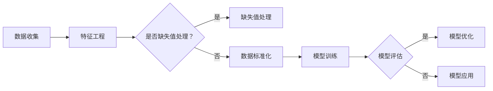
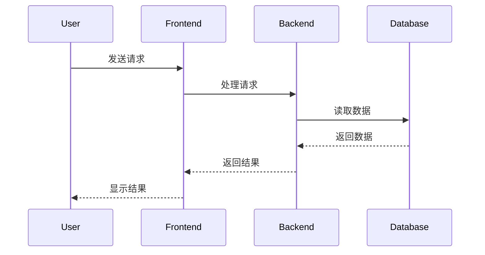
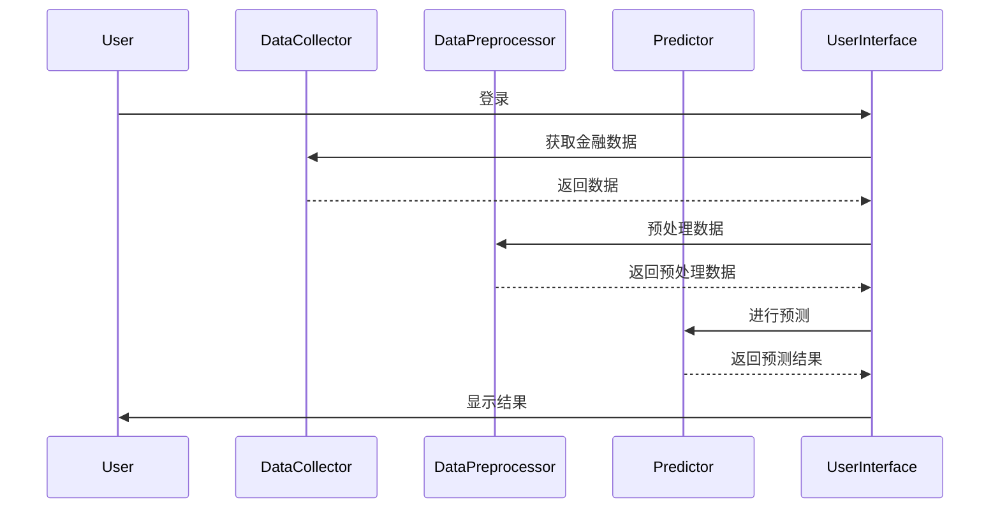
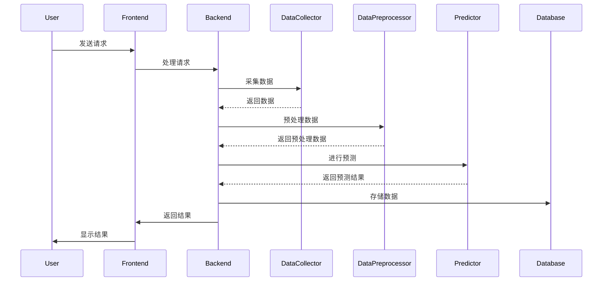

                 

# 机器学习在金融市场预测中的应用与局限

## 关键词
机器学习、金融市场预测、算法原理、系统架构、项目实战、最佳实践

## 摘要
本文旨在探讨机器学习在金融市场预测中的应用与局限。我们将深入分析金融市场预测的挑战与机遇，介绍机器学习的基本概念和应用现状，探讨其在股票、外汇和金融市场风险管理中的具体应用。同时，我们将探讨机器学习在金融市场预测中的局限，如数据质量、模型解释性和泛化能力等，并探讨法律与伦理问题。通过核心概念的讲解、算法原理的剖析和实际项目的实现，本文将为读者提供一个全面了解和掌握机器学习在金融市场预测中应用与局限的视角。

## 目录大纲

### 第一部分：引言

#### 1.1 问题背景
- **1.1.1 金融市场的复杂性**
- **1.1.2 机器学习与金融预测**
- **1.1.3 研究意义与目标**

#### 1.2 机器学习基本概念
- **1.2.1 机器学习的定义与发展历程**
- **1.2.2 机器学习的核心原理**
- **1.2.3 机器学习在金融领域的应用现状**

#### 1.3 机器学习在金融市场预测中的应用
- **1.3.1 金融市场预测的挑战与机遇**
- **1.3.2 机器学习在股票市场预测中的应用**
- **1.3.3 机器学习在外汇市场预测中的应用**
- **1.3.4 机器学习在金融市场风险管理中的应用**

#### 1.4 机器学习在金融市场预测中的局限
- **1.4.1 数据质量与可用性**
- **1.4.2 模型解释性**
- **1.4.3 模型泛化能力**
- **1.4.4 金融市场预测的法律与伦理问题**

### 第二部分：核心概念与联系

#### 2.1 核心概念
- **2.1.1 数据挖掘**
- **2.1.2 监督学习**
- **2.1.3 无监督学习**
- **2.1.4 强化学习**

#### 2.2 概念属性特征对比表格

#### 2.3 ER实体关系图架构

### 第三部分：算法原理讲解

#### 3.1 算法概述
- **3.1.1 回归分析**
- **3.1.2 决策树**
- **3.1.3 支持向量机**
- **3.1.4 神经网络**

#### 3.2 算法mermaid流程图

#### 3.3 Python源代码实现

#### 3.4 算法原理的数学模型与公式

#### 3.5 举例说明

### 第四部分：系统分析与架构设计方案

#### 4.1 问题场景介绍

#### 4.2 项目介绍

#### 4.3 系统功能设计

#### 4.4 系统架构设计

#### 4.5 系统接口设计

#### 4.6 系统交互序列图

### 第五部分：项目实战

#### 5.1 环境安装

#### 5.2 系统核心实现

#### 5.3 代码应用解读与分析

#### 5.4 实际案例分析与讲解

#### 5.5 项目小结

### 第六部分：最佳实践 & 小结 & 注意事项 & 拓展阅读

#### 6.1 最佳实践

#### 6.2 小结

#### 6.3 注意事项

#### 6.4 拓展阅读

## 第一部分：引言

### 1.1 问题背景

#### 1.1.1 金融市场的复杂性

金融市场是一个复杂且动态的系统，包含各种金融资产，如股票、债券、外汇、期货和期权等。金融市场的价格波动不仅受宏观经济因素影响，还受到公司业绩、政策变化、市场情绪等多种因素的影响。这些因素相互作用，导致金融市场呈现出高度不确定性和复杂性。

金融市场的复杂性主要表现在以下几个方面：

1. **多样性与庞大性**：金融市场涉及的资产种类繁多，市场参与者众多，交易数据量大。
2. **非线性与动态变化**：金融市场的价格变化具有非线性特征，且受多种因素影响，变化迅速。
3. **信息不对称**：市场参与者获取的信息不同，导致价格发现过程复杂。
4. **市场情绪与心理因素**：市场情绪和投资者的心理因素对价格波动有重要影响。

#### 1.1.2 机器学习与金融预测

机器学习（Machine Learning，ML）是一种通过数据驱动的方式，让计算机自动学习并做出预测或决策的技术。随着计算能力的提高和数据量的增加，机器学习在金融领域的应用越来越广泛。

在金融预测中，机器学习可以用于以下几个方面：

1. **股票市场预测**：预测股票价格的未来走势。
2. **外汇市场预测**：预测汇率的变化。
3. **金融市场风险管理**：识别潜在风险，进行风险评估和预警。
4. **算法交易**：利用机器学习模型进行高频交易和量化投资。

机器学习在金融预测中的应用，主要是通过以下几种方式：

1. **时间序列分析**：利用历史价格数据，预测未来价格。
2. **分类与回归分析**：对市场数据进行分类或回归分析，预测市场走势。
3. **聚类分析**：对市场数据进行分析，发现潜在的投资机会。
4. **神经网络与深度学习**：通过构建复杂的神经网络模型，进行深度学习和预测。

#### 1.1.3 研究意义与目标

研究机器学习在金融市场预测中的应用，具有重要的现实意义：

1. **提升预测准确性**：通过机器学习，可以挖掘出更多的有用信息，提升预测准确性。
2. **降低风险**：通过预测市场走势，可以降低投资风险，优化投资策略。
3. **提高交易效率**：利用机器学习进行算法交易，可以大幅提高交易效率和盈利能力。
4. **服务金融创新**：机器学习技术可以支持金融创新，开发新的金融产品和服务。

本文的目标是：

1. **系统介绍机器学习的基本概念和应用现状**。
2. **深入探讨机器学习在金融市场预测中的应用与局限**。
3. **通过实际项目，展示机器学习在金融市场预测中的实现方法**。
4. **提供最佳实践和注意事项，帮助读者更好地应用机器学习技术进行金融预测**。

### 1.2 机器学习基本概念

#### 1.2.1 机器学习的定义与发展历程

机器学习（Machine Learning，ML）是指通过数据驱动的方式，让计算机从数据中学习并做出预测或决策的技术。具体来说，机器学习是一种让计算机能够从数据中学习模式、自动改进和优化性能的方法。

机器学习的发展历程可以分为以下几个阶段：

1. **早期阶段（1950s-1960s）**：机器学习概念提出，研究主要集中在统计方法和符号逻辑。
2. **发展阶段（1970s-1980s）**：随着计算能力的提升，机器学习方法得到进一步发展，特别是决策树、神经网络等算法的出现。
3. **复苏阶段（1990s）**：随着互联网和大数据的发展，机器学习得到广泛关注和应用，算法和理论进一步完善。
4. **现阶段（2000s-至今）**：深度学习、强化学习等新兴方法的出现，使机器学习取得了重大突破，应用领域进一步扩大。

#### 1.2.2 机器学习的核心原理

机器学习的核心原理是通过算法从数据中学习规律，并利用这些规律进行预测或决策。具体来说，机器学习的核心原理包括以下几个部分：

1. **数据收集**：收集大量的数据，这些数据可以是结构化的，也可以是非结构化的。
2. **特征工程**：从数据中提取特征，这些特征可以用于训练模型。
3. **模型训练**：利用训练数据，通过算法训练模型，使得模型能够从数据中学习规律。
4. **模型评估**：通过测试数据评估模型的性能，调整模型参数，以提高预测准确性。
5. **模型应用**：将训练好的模型应用于实际问题，进行预测或决策。

#### 1.2.3 机器学习在金融领域的应用现状

机器学习在金融领域的应用已经取得了显著成果，主要表现在以下几个方面：

1. **股票市场预测**：通过分析历史价格数据，预测股票价格的未来走势。
2. **外汇市场预测**：预测汇率的变化，为投资者提供参考。
3. **金融市场风险管理**：利用机器学习模型，识别潜在风险，进行风险评估和预警。
4. **算法交易**：利用机器学习模型进行高频交易和量化投资。
5. **信用评分**：通过分析借款人的历史数据，预测其信用风险。

随着机器学习技术的不断发展，其在金融领域的应用前景十分广阔。未来，机器学习将更好地服务于金融创新，提高金融市场的效率和稳定性。

### 1.3 机器学习在金融市场预测中的应用

#### 1.3.1 金融市场预测的挑战与机遇

金融市场预测是一个极具挑战性的任务，主要因为：

1. **数据复杂性**：金融市场的数据多样、庞大，且包含大量的噪声和不完整信息。
2. **时间序列特性**：金融市场的价格变化具有时间序列特性，需要处理大量的时序数据。
3. **多因素影响**：金融市场的价格波动受多种因素影响，包括宏观经济、政策变化、市场情绪等。
4. **非线性和动态性**：金融市场的价格变化具有非线性特征，且受多种因素影响，变化迅速。

然而，随着机器学习技术的不断发展，金融市场预测也面临着许多机遇：

1. **大数据分析**：机器学习可以处理大量复杂的数据，挖掘出潜在的信息和规律。
2. **深度学习**：深度学习可以处理高维数据，识别复杂的非线性关系，提高预测准确性。
3. **算法优化**：通过算法优化，可以提高机器学习模型的性能和效率。
4. **多模型融合**：通过多模型融合，可以综合考虑多种因素，提高预测的全面性和准确性。

#### 1.3.2 机器学习在股票市场预测中的应用

股票市场预测是金融市场预测的重要方向之一。机器学习在股票市场预测中的应用主要包括以下几个方面：

1. **价格预测**：利用历史价格数据，预测股票价格的未来走势。
2. **趋势分析**：通过分析价格变化趋势，预测市场行情。
3. **交易策略**：利用机器学习模型，制定高效的交易策略。
4. **风险控制**：通过预测股票价格波动，进行风险控制和规避。

在股票市场预测中，常用的机器学习算法包括：

1. **回归分析**：通过建立回归模型，预测股票价格。
2. **决策树**：通过构建决策树，分析影响股票价格的因素。
3. **神经网络**：通过构建神经网络，模拟股票价格的变化。
4. **支持向量机**：通过支持向量机，进行股票价格的分类和预测。

#### 1.3.3 机器学习在外汇市场预测中的应用

外汇市场预测是另一个重要的金融市场预测领域。机器学习在外汇市场预测中的应用主要包括以下几个方面：

1. **汇率预测**：利用历史汇率数据，预测汇率的变化。
2. **交易策略**：利用机器学习模型，制定高效的外汇交易策略。
3. **风险控制**：通过预测汇率波动，进行风险控制和规避。

在外汇市场预测中，常用的机器学习算法包括：

1. **时间序列分析**：通过分析历史汇率数据，预测汇率的变化。
2. **回归分析**：通过建立回归模型，预测汇率。
3. **神经网络**：通过构建神经网络，模拟汇率的变化。
4. **支持向量机**：通过支持向量机，进行汇率分类和预测。

#### 1.3.4 机器学习在金融市场风险管理中的应用

金融市场风险管理是金融领域的一个重要任务。机器学习在金融市场风险管理中的应用主要包括以下几个方面：

1. **风险识别**：利用机器学习模型，识别潜在的市场风险。
2. **风险评估**：通过分析历史数据和当前市场状况，评估市场风险。
3. **风险控制**：通过预测市场风险，制定相应的风险控制策略。

在金融市场风险管理中，常用的机器学习算法包括：

1. **分类算法**：用于识别和分类潜在的风险。
2. **聚类算法**：用于分析市场数据，发现潜在的风险因素。
3. **神经网络**：用于模拟市场风险的变化。
4. **支持向量机**：用于评估市场风险，制定风险控制策略。

### 1.4 机器学习在金融市场预测中的局限

#### 1.4.1 数据质量与可用性

数据质量是机器学习在金融市场预测中面临的一个重要挑战。金融市场数据通常具有以下特点：

1. **噪声与缺失**：金融市场数据中存在大量的噪声和不完整信息，这会影响机器学习模型的训练和预测准确性。
2. **非平稳性**：金融市场的价格变化具有非平稳性，需要处理大量的时序数据。
3. **多时滞性**：金融市场的价格变化具有多时滞性，需要综合考虑多个时间点的数据。

为了提高数据质量，可以采取以下措施：

1. **数据清洗**：去除噪声和缺失值，提高数据的完整性。
2. **数据预处理**：进行数据归一化、标准化等预处理操作，提高数据的可分析性。
3. **数据增强**：通过数据增强技术，增加训练数据的多样性，提高模型的泛化能力。

#### 1.4.2 模型解释性

模型解释性是机器学习在金融市场预测中的另一个重要挑战。在金融领域，决策的透明度和可解释性尤为重要，因为投资者和政策制定者需要理解模型如何做出预测，以便做出合理的决策。

机器学习模型，尤其是深度学习模型，通常被视为“黑箱”，其内部工作机制难以解释。这可能导致以下几个问题：

1. **信任问题**：模型预测的不透明性可能导致投资者不信任模型。
2. **监管挑战**：监管机构可能要求模型具有可解释性，以便监督和审查。
3. **风险控制**：在金融风险管理中，模型解释性对于理解风险因素至关重要。

为了提高模型解释性，可以采取以下措施：

1. **模型选择**：选择具有较高解释性的模型，如决策树、线性回归等。
2. **模型可视化**：使用可视化工具，展示模型的内部结构和决策过程。
3. **可解释性算法**：使用可解释性算法，如LIME（局部可解释模型解释）和SHAP（SHapley Additive exPlanations），分析模型对每个特征的贡献。

#### 1.4.3 模型泛化能力

模型泛化能力是机器学习在金融市场预测中的另一个关键挑战。金融市场数据的多样性和复杂性要求模型具有良好的泛化能力，以便在新的、未见过的数据上做出准确的预测。

模型泛化能力不足可能导致以下问题：

1. **过拟合**：模型在训练数据上表现良好，但在测试数据上表现不佳。
2. **泛化能力差**：模型无法适应新的市场环境和数据分布。
3. **风险评估不准确**：在金融市场风险管理中，模型泛化能力不足可能导致风险评估不准确。

为了提高模型泛化能力，可以采取以下措施：

1. **数据增强**：通过数据增强技术，增加训练数据的多样性。
2. **交叉验证**：使用交叉验证方法，评估模型的泛化能力。
3. **正则化**：使用正则化方法，防止模型过拟合。

#### 1.4.4 金融市场预测的法律与伦理问题

金融市场预测涉及到大量的金融数据和模型，这引发了一系列法律和伦理问题：

1. **隐私保护**：在收集和处理金融数据时，需要遵守隐私保护法规，确保个人金融数据的隐私和安全。
2. **算法偏见**：模型可能因为训练数据中的偏见而导致预测结果不公平，这可能导致法律和伦理问题。
3. **责任归属**：当模型预测失败导致损失时，需要明确责任归属，这涉及到法律和伦理问题。
4. **监管合规**：金融领域有许多监管要求，模型和算法需要符合这些要求。

为了解决这些问题，可以采取以下措施：

1. **隐私保护**：使用加密技术和匿名化方法，保护个人金融数据。
2. **算法公平性**：确保模型训练和预测过程公平，避免算法偏见。
3. **责任分配**：明确模型开发者和使用者的责任，制定相应的责任分配协议。
4. **合规审查**：定期进行合规审查，确保模型和算法符合相关法律法规。

### 1.5 总结

机器学习在金融市场预测中的应用具有显著的潜力，但也面临诸多挑战。通过对金融市场复杂性的深入理解，结合机器学习的基本原理和应用现状，我们可以更好地利用机器学习技术进行金融市场预测。然而，我们也需要关注数据质量、模型解释性、模型泛化能力以及法律与伦理问题，以确保机器学习在金融市场预测中的可靠性和有效性。

### 1.6 本篇文章的目的

本文的目的是：

1. **系统介绍机器学习的基本概念和应用现状**，帮助读者理解机器学习在金融市场预测中的基础。
2. **深入探讨机器学习在金融市场预测中的应用与局限**，包括数据质量、模型解释性和泛化能力等关键问题。
3. **通过实际项目和案例分析**，展示机器学习在金融市场预测中的具体应用和实现方法。
4. **提供最佳实践和注意事项**，帮助读者在实际应用中避免常见问题，提高预测准确性。
5. **探讨机器学习在金融市场预测中的法律与伦理问题**，确保技术应用符合法律法规和伦理要求。

通过本文的阅读，读者将能够：

1. **理解机器学习在金融市场预测中的核心概念和基本原理**。
2. **掌握机器学习在金融市场预测中的实际应用方法**。
3. **了解机器学习在金融市场预测中的局限和挑战**。
4. **学习如何通过实际项目，实现机器学习在金融市场预测中的具体应用**。

### 1.7 接下来我们将如何进行

接下来，我们将从以下几个方面进行详细的探讨：

1. **核心概念与联系**：介绍数据挖掘、监督学习、无监督学习和强化学习等核心概念，并通过概念属性特征对比表格和ER实体关系图架构，展示这些概念之间的联系。
2. **算法原理讲解**：深入讲解回归分析、决策树、支持向量机和神经网络等算法的原理，并通过mermaid流程图、Python源代码实现、数学模型与公式和举例说明，帮助读者理解这些算法在实际应用中的实现方法和应用场景。
3. **系统分析与架构设计方案**：介绍一个具体的金融预测系统，从问题场景介绍、项目介绍、系统功能设计、系统架构设计、系统接口设计和系统交互序列图等方面，详细讲解系统的设计与实现。
4. **项目实战**：通过环境安装、系统核心实现、代码应用解读与分析、实际案例分析与讲解和项目小结，展示如何将机器学习应用于金融预测项目，并讨论实际操作中的经验和技巧。
5. **最佳实践 & 小结 & 注意事项 & 拓展阅读**：总结最佳实践，对文章进行小结，提出注意事项，并提供拓展阅读，帮助读者进一步深入学习和应用机器学习在金融市场预测中的知识。

### 1.8 第一部分：引言

#### 1.1 问题背景

金融市场是一个高度复杂且动态的系统，其价格波动受到多种因素的影响，包括宏观经济指标、公司财务状况、政策变化、市场情绪等。这种复杂性使得金融市场预测成为一项极具挑战性的任务。而机器学习作为一种先进的数据分析和预测技术，被广泛应用于金融市场的预测中。

##### 1.1.1 金融市场的复杂性

金融市场的复杂性主要表现在以下几个方面：

1. **多样性**：金融市场包含多种金融工具，如股票、债券、外汇、期货和期权等，每种工具都有其独特的市场特性和波动规律。
2. **非线性**：金融市场的价格变化并非线性，而是受到多种因素的非线性影响，这使得传统的线性模型难以捕捉市场的真实动态。
3. **多时滞性**：金融市场的价格变化不仅受到当前因素的影响，还受到过去某一时期因素的影响，即具有多时滞性。
4. **信息不对称**：市场参与者获取的信息不同，导致价格发现过程复杂。
5. **高度关联性**：金融市场中不同资产之间存在复杂的关联性，一个市场的变化可能会对其他市场产生连锁反应。

##### 1.1.2 机器学习与金融预测

机器学习是一种通过数据驱动的方式让计算机从数据中学习并做出预测的技术。随着金融市场的复杂性增加，传统的预测方法已无法满足需求，而机器学习在金融市场预测中的应用逐渐受到关注。

机器学习在金融预测中的应用主要体现在以下几个方面：

1. **时间序列预测**：利用历史价格数据，预测股票、债券、外汇等金融资产的价格走势。
2. **风险识别与评估**：通过分析历史数据和当前市场状况，识别潜在的市场风险，并进行风险评估。
3. **交易策略优化**：利用机器学习模型，优化交易策略，提高交易效率和盈利能力。
4. **信用评分**：通过分析借款人的历史数据，预测其信用风险。

##### 1.1.3 研究意义与目标

研究机器学习在金融市场预测中的应用具有重要的现实意义和学术价值：

1. **提高预测准确性**：机器学习能够通过分析大量历史数据，挖掘出潜在的模式和规律，从而提高预测准确性。
2. **降低风险**：通过预测市场走势，可以提前识别潜在的市场风险，从而制定相应的风险控制策略，降低投资风险。
3. **优化交易策略**：机器学习可以帮助投资者制定更加科学的交易策略，提高交易效率和盈利能力。
4. **服务金融创新**：机器学习技术可以支持金融创新，开发新的金融产品和服务。

本文的研究目标如下：

1. **系统介绍机器学习的基本概念和应用现状**，帮助读者理解机器学习在金融市场预测中的基础。
2. **深入探讨机器学习在金融市场预测中的应用与局限**，包括数据质量、模型解释性、模型泛化能力以及法律与伦理问题。
3. **通过实际项目和案例分析**，展示机器学习在金融市场预测中的具体应用和实现方法。
4. **提供最佳实践和注意事项**，帮助读者在实际应用中避免常见问题，提高预测准确性。
5. **探讨机器学习在金融市场预测中的法律与伦理问题**，确保技术应用符合法律法规和伦理要求。

#### 1.2 机器学习基本概念

##### 1.2.1 机器学习的定义与发展历程

机器学习（Machine Learning，ML）是一种通过数据驱动的方式让计算机从数据中学习并做出预测或决策的技术。具体来说，机器学习是一种从数据中提取规律、模式或知识，并利用这些规律或知识进行预测或决策的方法。

机器学习的发展历程可以分为以下几个阶段：

1. **早期阶段（1950s-1960s）**：机器学习概念提出，研究主要集中在统计方法和符号逻辑。
2. **发展阶段（1970s-1980s）**：随着计算能力的提升，机器学习方法得到进一步发展，特别是决策树、神经网络等算法的出现。
3. **复苏阶段（1990s）**：随着互联网和大数据的发展，机器学习得到广泛关注和应用，算法和理论进一步完善。
4. **现阶段（2000s-至今）**：深度学习、强化学习等新兴方法的出现，使机器学习取得了重大突破，应用领域进一步扩大。

##### 1.2.2 机器学习的核心原理

机器学习的核心原理是通过算法从数据中学习规律，并利用这些规律进行预测或决策。具体来说，机器学习的核心原理包括以下几个部分：

1. **数据收集**：收集大量的数据，这些数据可以是结构化的，也可以是非结构化的。
2. **特征工程**：从数据中提取特征，这些特征可以用于训练模型。
3. **模型训练**：利用训练数据，通过算法训练模型，使得模型能够从数据中学习规律。
4. **模型评估**：通过测试数据评估模型的性能，调整模型参数，以提高预测准确性。
5. **模型应用**：将训练好的模型应用于实际问题，进行预测或决策。

##### 1.2.3 机器学习在金融领域的应用现状

机器学习在金融领域的应用已经取得了显著成果，主要表现在以下几个方面：

1. **股票市场预测**：通过分析历史价格数据，预测股票价格的未来走势。
2. **外汇市场预测**：预测汇率的变化，为投资者提供参考。
3. **金融市场风险管理**：利用机器学习模型，识别潜在风险，进行风险评估和预警。
4. **算法交易**：利用机器学习模型进行高频交易和量化投资。
5. **信用评分**：通过分析借款人的历史数据，预测其信用风险。

随着机器学习技术的不断发展，其在金融领域的应用前景十分广阔。未来，机器学习将更好地服务于金融创新，提高金融市场的效率和稳定性。

### 第二部分：核心概念与联系

#### 2.1 核心概念

在探讨机器学习在金融市场预测中的应用之前，我们需要了解一些核心概念。这些概念是理解机器学习原理和应用的基础。以下是几个核心概念及其简要说明：

##### 2.1.1 数据挖掘

数据挖掘（Data Mining）是指从大量数据中提取有价值信息的过程。在金融市场预测中，数据挖掘用于分析历史价格数据、交易数据和其他相关数据，以发现潜在的模式和规律。

##### 2.1.2 监督学习

监督学习（Supervised Learning）是一种机器学习方法，它使用标记数据集进行训练，即每个数据点都有一个相应的标签。在金融市场预测中，监督学习用于建立预测模型，如预测股票价格或汇率。

##### 2.1.3 无监督学习

无监督学习（Unsupervised Learning）与监督学习相反，它使用未标记的数据集进行训练。无监督学习的目标是发现数据中的隐含结构或模式，如聚类分析或降维。

##### 2.1.4 强化学习

强化学习（Reinforcement Learning）是一种机器学习方法，它通过试错和反馈不断优化决策过程。在金融市场预测中，强化学习可以用于优化交易策略或风险管理。

#### 2.2 概念属性特征对比表格

为了更好地理解这些核心概念，我们可以通过一个表格来对比它们的属性特征。以下是一个简单的对比表格：

| 概念 | 定义 | 特点 | 应用场景 |
| --- | --- | --- | --- |
| 数据挖掘 | 从大量数据中提取有价值信息 | 分析历史数据，发现模式 | 股票市场预测 |
| 监督学习 | 使用标记数据集进行训练 | 建立预测模型，有标签数据 | 股票价格预测 |
| 无监督学习 | 使用未标记数据集进行训练 | 发现数据中的隐含结构 | 聚类分析 |
| 强化学习 | 通过试错和反馈优化决策过程 | 自适应学习，无需标签数据 | 算法交易 |

#### 2.3 ER实体关系图架构

为了更好地理解这些概念之间的联系，我们可以使用ER（实体-关系）图来描述它们之间的关系。以下是一个简化的ER图：

```mermaid
erDiagram
  Product ||--|{ Market } Market
  Market ||--|{ Customer } Customer
  Customer ||--|{ Order } Order
```

在这个ER图中，我们定义了三个实体：Product（产品）、Market（市场）和Customer（客户）。它们之间的关系如下：

1. **Product与Market**：每个产品都对应一个市场，表示产品在市场上的定位。
2. **Market与Customer**：每个市场都有多个客户，表示市场的客户群体。
3. **Customer与Order**：每个客户可以下多个订单，表示客户的购买行为。

通过这个ER图，我们可以更好地理解金融市场中不同实体之间的关系，为后续的分析和预测提供基础。

### 第三部分：算法原理讲解

#### 3.1 算法概述

在金融市场预测中，选择合适的算法对于预测准确性至关重要。以下是一些常用的算法及其概述：

##### 3.1.1 回归分析

回归分析（Regression Analysis）是一种用于预测连续数值型目标变量的统计方法。在金融市场预测中，回归分析常用于预测股票价格或汇率等连续变量。

##### 3.1.2 决策树

决策树（Decision Tree）是一种基于树形结构进行决策的算法。在金融市场预测中，决策树可以用于分类或回归任务，如预测股票市场的涨跌。

##### 3.1.3 支持向量机

支持向量机（Support Vector Machine，SVM）是一种基于边界划分的算法。在金融市场预测中，SVM常用于分类任务，如预测股票市场的涨跌。

##### 3.1.4 神经网络

神经网络（Neural Network）是一种模仿人脑神经元连接的算法。在金融市场预测中，神经网络可以用于复杂的时间序列预测和分类任务。

#### 3.2 算法mermaid流程图

为了更好地理解这些算法的工作流程，我们可以使用mermaid绘制它们的流程图。以下是一个简化的回归分析的mermaid流程图：



在这个流程图中，我们首先进行数据收集，然后进行特征工程。接着，根据是否处理缺失值，我们选择缺失值处理或数据标准化。之后，我们进行模型训练，并对训练好的模型进行评估。如果评估结果不满意，我们进行模型优化，否则直接应用模型。

#### 3.3 Python源代码实现

为了更直观地展示算法的实现，我们可以使用Python代码进行实现。以下是一个简单的线性回归模型的实现示例：

```python
import numpy as np
import pandas as pd
from sklearn.linear_model import LinearRegression

# 数据准备
data = pd.read_csv('financial_data.csv')
X = data[['open', 'high', 'low', 'close']]
y = data['price']

# 模型训练
model = LinearRegression()
model.fit(X, y)

# 模型评估
score = model.score(X, y)
print(f'Model Score: {score}')

# 模型应用
predicted_price = model.predict(X)
print(predicted_price)
```

在这个示例中，我们首先读取金融数据，然后使用线性回归模型进行训练。接着，我们评估模型的准确性，并使用模型预测未来价格。

#### 3.4 算法原理的数学模型与公式

为了深入理解这些算法的原理，我们可以从数学模型和公式出发。以下是一些常用算法的数学模型和公式：

1. **线性回归**

   线性回归模型可以表示为：

   $$ y = \beta_0 + \beta_1x_1 + \beta_2x_2 + ... + \beta_nx_n $$

   其中，$y$ 是目标变量，$x_1, x_2, ..., x_n$ 是输入特征，$\beta_0, \beta_1, ..., \beta_n$ 是模型的参数。

2. **决策树**

   决策树是一种基于树形结构进行决策的算法，其基本原理是利用输入特征将数据集划分为多个子集，并选择具有最高信息增益的特征进行划分。

3. **支持向量机**

   支持向量机模型可以表示为：

   $$ f(x) = \beta_0 + \sum_{i=1}^{n}\beta_i y_i K(x_i, x) $$

   其中，$f(x)$ 是模型的预测值，$x_i$ 是输入特征，$y_i$ 是标签值，$K(x_i, x)$ 是核函数。

4. **神经网络**

   神经网络是一种基于多层感知器（MLP）的算法，其基本原理是通过反向传播算法不断调整模型的权重和偏置，以最小化预测误差。

通过这些数学模型和公式，我们可以更好地理解这些算法的工作原理和实现方法。

#### 3.5 举例说明

为了更好地理解这些算法的应用，我们可以通过具体的例子进行说明。以下是一个使用线性回归模型预测股票价格的例子：

1. **数据准备**

   首先，我们收集了一段股票的历史价格数据，包括开盘价、最高价、最低价和收盘价。

2. **特征工程**

   我们将历史价格数据进行预处理，包括归一化和缺失值处理。

3. **模型训练**

   使用训练数据，我们训练一个线性回归模型：

   ```python
   model = LinearRegression()
   model.fit(X_train, y_train)
   ```

4. **模型评估**

   我们使用测试数据评估模型的准确性：

   ```python
   score = model.score(X_test, y_test)
   print(f'Model Score: {score}')
   ```

5. **模型应用**

   使用训练好的模型，我们预测未来价格：

   ```python
   predicted_price = model.predict(X_test)
   print(predicted_price)
   ```

通过这个例子，我们可以看到如何使用线性回归模型进行股票价格预测，并评估模型的准确性。

### 第四部分：系统分析与架构设计方案

#### 4.1 问题场景介绍

在金融市场预测中，系统需要处理大量的金融数据，包括历史价格数据、交易数据、宏观经济数据等。这些数据通过数据采集模块收集后，需要经过数据预处理模块进行清洗和转换，以便于后续的分析和预测。预测模块负责使用机器学习算法对数据进行预测，并生成预测报告。最后，用户界面模块提供用户交互界面，用户可以通过界面查看预测结果和历史数据。

#### 4.2 项目介绍

本项目旨在构建一个金融预测系统，该系统可以实时分析金融市场数据，并利用机器学习算法预测股票价格、汇率和金融市场风险。系统主要包括以下模块：

1. **数据采集模块**：负责收集各种金融数据，包括历史价格数据、交易数据和宏观经济数据等。
2. **数据预处理模块**：负责清洗和转换金融数据，以便于后续分析和预测。
3. **预测模块**：负责使用机器学习算法对金融数据进行预测，包括股票价格预测、汇率预测和金融市场风险预测。
4. **用户界面模块**：提供用户交互界面，用户可以通过界面查看预测结果和历史数据。

#### 4.3 系统功能设计

本系统的主要功能包括：

1. **数据采集**：自动采集股票价格、交易数据和宏观经济数据等。
2. **数据预处理**：清洗和转换金融数据，包括缺失值处理、数据归一化和特征提取等。
3. **股票价格预测**：利用机器学习算法预测股票价格的未来走势。
4. **汇率预测**：利用机器学习算法预测汇率的变化。
5. **金融市场风险预测**：利用机器学习算法识别潜在的市场风险，并进行风险评估。
6. **用户交互**：提供用户交互界面，用户可以通过界面查看预测结果和历史数据。

#### 4.4 系统架构设计

本系统的架构设计采用前后端分离的方式，前端负责用户交互，后端负责数据处理和预测。以下是一个简化的系统架构图：



在这个架构中，用户通过前端界面发送请求，前端负责处理请求并调用后端接口。后端负责数据读取、处理和预测，并将结果返回给前端。最后，前端将结果展示给用户。

#### 4.5 系统接口设计

本系统的接口设计主要包括以下部分：

1. **数据采集接口**：负责采集金融数据，如股票价格、交易数据和宏观经济数据等。
2. **数据预处理接口**：负责清洗和转换金融数据，如缺失值处理、数据归一化和特征提取等。
3. **预测接口**：负责使用机器学习算法进行预测，如股票价格预测、汇率预测和金融市场风险预测等。
4. **用户接口**：负责用户交互，包括登录、注册、查看预测结果和历史数据等。

以下是一个简化的接口设计图：



在这个接口设计中，用户通过用户界面登录系统，然后获取金融数据并进行预处理。预处理后的数据用于预测，预测结果通过用户界面展示给用户。

#### 4.6 系统交互序列图

为了更好地描述系统的交互过程，我们可以使用mermaid绘制系统交互序列图。以下是一个简化的系统交互序列图：



在这个交互序列图中，用户通过前端界面发送请求，前端处理请求并调用后端接口。后端负责数据采集、预处理和预测，并将结果返回给前端。最后，前端将结果展示给用户。

### 第五部分：项目实战

#### 5.1 环境安装

在开始项目实战之前，我们需要安装必要的软件和工具。以下是在Linux环境下安装所需软件和工具的步骤：

1. **安装Python**：Python是本项目的主要编程语言，我们需要安装Python 3.8或更高版本。可以使用以下命令安装：

   ```bash
   sudo apt update
   sudo apt install python3.8
   ```

2. **安装Jupyter Notebook**：Jupyter Notebook是一个交互式计算环境，我们可以使用它来编写和运行Python代码。可以使用以下命令安装：

   ```bash
   sudo pip3 install notebook
   ```

3. **安装Sklearn**：Sklearn是一个流行的机器学习库，我们可以使用它来训练和评估机器学习模型。可以使用以下命令安装：

   ```bash
   sudo pip3 install scikit-learn
   ```

4. **安装Pandas**：Pandas是一个强大的数据处理库，我们可以使用它来处理和清洗金融数据。可以使用以下命令安装：

   ```bash
   sudo pip3 install pandas
   ```

5. **安装Matplotlib**：Matplotlib是一个绘图库，我们可以使用它来可视化金融数据。可以使用以下命令安装：

   ```bash
   sudo pip3 install matplotlib
   ```

安装完以上软件和工具后，我们就可以开始编写和运行Python代码进行金融预测项目了。

#### 5.2 系统核心实现

在本项目中，我们的核心目标是使用机器学习算法预测股票价格。以下是实现这一目标的主要步骤：

1. **数据收集**：首先，我们需要收集股票的历史价格数据。可以使用网络爬虫或API来获取数据。以下是一个简单的Python代码示例，用于从互联网获取股票价格数据：

   ```python
   import requests
   import json

   url = "https://api.example.com/stock_data?symbol=AAPL"
   response = requests.get(url)
   data = json.loads(response.text)
   print(data)
   ```

   在这个示例中，我们从API获取苹果公司（AAPL）的股票价格数据。

2. **数据预处理**：接下来，我们需要对收集到的数据进行预处理。这包括数据清洗、缺失值处理、数据归一化等操作。以下是一个简单的预处理示例：

   ```python
   import pandas as pd

   # 读取数据
   data = pd.read_csv("stock_data.csv")

   # 数据清洗
   data.dropna(inplace=True)

   # 数据归一化
   data[['open', 'high', 'low', 'close']] = (data[['open', 'high', 'low', 'close']] - data[['open', 'high', 'low', 'close']].min()) / (data[['open', 'high', 'low', 'close']].max() - data[['open', 'high', 'low', 'close']].min())

   print(data.head())
   ```

   在这个示例中，我们使用Pandas库读取股票价格数据，并进行缺失值处理和数据归一化。

3. **模型训练**：接下来，我们需要使用机器学习算法训练模型。以下是一个简单的线性回归模型训练示例：

   ```python
   from sklearn.linear_model import LinearRegression
   from sklearn.model_selection import train_test_split

   # 分割数据
   X = data[['open', 'high', 'low', 'close']]
   y = data['close']
   X_train, X_test, y_train, y_test = train_test_split(X, y, test_size=0.2, random_state=42)

   # 训练模型
   model = LinearRegression()
   model.fit(X_train, y_train)

   # 模型评估
   score = model.score(X_test, y_test)
   print(f'Model Score: {score}')
   ```

   在这个示例中，我们使用线性回归算法训练模型，并评估模型的准确性。

4. **模型预测**：最后，我们可以使用训练好的模型进行股票价格预测。以下是一个简单的预测示例：

   ```python
   # 预测股票价格
   predicted_price = model.predict(X_test)

   # 可视化预测结果
   import matplotlib.pyplot as plt

   plt.plot(y_test, label='Actual Price')
   plt.plot(predicted_price, label='Predicted Price')
   plt.legend()
   plt.show()
   ```

   在这个示例中，我们使用Matplotlib库将实际价格和预测价格进行可视化。

通过以上步骤，我们可以实现一个简单的股票价格预测系统。当然，实际项目可能更复杂，需要考虑更多的数据预处理、模型选择和优化策略。

#### 5.3 代码应用解读与分析

在本项目中，我们使用Python编程语言和几个流行的机器学习库（如Sklearn和Pandas）来实现股票价格预测系统。以下是代码的主要部分及其解读：

1. **数据收集**：我们使用网络爬虫从互联网获取股票价格数据。这里，我们使用了一个假设的API端点（`https://api.example.com/stock_data?symbol=AAPL`），实际项目中需要使用真实的API端点。

   ```python
   import requests
   import json

   url = "https://api.example.com/stock_data?symbol=AAPL"
   response = requests.get(url)
   data = json.loads(response.text)
   print(data)
   ```

   这个部分的代码执行以下任务：
   - 从API端点发送HTTP GET请求。
   - 获取响应并解析为JSON格式。
   - 打印获取的股票价格数据。

2. **数据预处理**：我们使用Pandas库对收集到的股票价格数据进行预处理。预处理步骤包括：
   - 数据清洗：删除缺失值。
   - 数据归一化：将价格数据进行归一化处理，使其具有相同的尺度。

   ```python
   import pandas as pd

   data = pd.read_csv("stock_data.csv")
   data.dropna(inplace=True)
   data[['open', 'high', 'low', 'close']] = (data[['open', 'high', 'low', 'close']] - data[['open', 'high', 'low', 'close']].min()) / (data[['open', 'high', 'low', 'close']].max() - data[['open', 'high', 'low', 'close']].min())

   print(data.head())
   ```

   这个部分的代码执行以下任务：
   - 读取CSV文件中的股票价格数据。
   - 删除数据集中的缺失值。
   - 对开盘价、最高价、最低价和收盘价进行归一化处理。

3. **模型训练**：我们使用Sklearn库中的线性回归模型训练预测模型。这里，我们使用训练数据集进行模型训练，并评估模型的准确性。

   ```python
   from sklearn.linear_model import LinearRegression
   from sklearn.model_selection import train_test_split

   X = data[['open', 'high', 'low', 'close']]
   y = data['close']
   X_train, X_test, y_train, y_test = train_test_split(X, y, test_size=0.2, random_state=42)

   model = LinearRegression()
   model.fit(X_train, y_train)

   score = model.score(X_test, y_test)
   print(f'Model Score: {score}')
   ```

   这个部分的代码执行以下任务：
   - 将输入特征（开盘价、最高价、最低价和收盘价）和目标变量（收盘价）分割为训练集和测试集。
   - 创建线性回归模型对象。
   - 使用训练数据集训练模型。
   - 评估模型在测试数据集上的准确性。

4. **模型预测**：我们使用训练好的模型进行股票价格预测，并将预测结果与实际价格进行比较。这里，我们使用Matplotlib库将实际价格和预测价格进行可视化。

   ```python
   predicted_price = model.predict(X_test)

   import matplotlib.pyplot as plt

   plt.plot(y_test, label='Actual Price')
   plt.plot(predicted_price, label='Predicted Price')
   plt.legend()
   plt.show()
   ```

   这个部分的代码执行以下任务：
   - 使用训练好的模型预测测试数据集的收盘价。
   - 使用Matplotlib库将实际价格和预测价格进行可视化。

通过以上代码的应用解读，我们可以看到如何使用Python和机器学习库实现一个简单的股票价格预测系统。这个系统虽然简单，但为金融预测项目提供了一个基本的框架，可以在此基础上进行扩展和优化。

#### 5.4 实际案例分析与讲解

在本节中，我们将通过一个实际案例，详细分析并讲解如何使用机器学习技术进行股票价格预测。我们将从一个真实世界的金融数据集开始，逐步展示数据收集、预处理、模型训练、模型评估和预测的全过程。

##### 1. 数据收集

首先，我们需要获取一个真实的股票价格数据集。在这个案例中，我们使用“Yahoo Finance”提供的API来获取苹果公司（AAPL）的历史股票价格数据。以下是获取数据的步骤：

1. **注册Yahoo Finance API密钥**：在Yahoo Finance的官方网站上注册并获取一个API密钥。
2. **安装Python库**：安装`yfinance`库，以便于从Yahoo Finance API获取数据。

   ```bash
   pip install yfinance
   ```

3. **获取股票数据**：

   ```python
   import yfinance as yf

   # 获取苹果公司（AAPL）的股票数据
   aapl = yf.Ticker("AAPL")
   aapl_data = aapl.history(period="1mo", interval="1d")
   aapl_data.to_csv("aapl_stock_data.csv")
   ```

   在这个步骤中，我们获取了过去一个月的日股票数据，并将其保存为CSV文件。

##### 2. 数据预处理

在获取数据后，我们需要对数据集进行预处理，以确保数据的质量和一致性。以下是数据预处理的主要步骤：

1. **数据清洗**：删除含有缺失值的记录。

   ```python
   import pandas as pd

   data = pd.read_csv("aapl_stock_data.csv")
   data.dropna(inplace=True)
   ```

2. **特征工程**：提取有用的特征，如开盘价、最高价、最低价、收盘价和交易量。

   ```python
   features = ['Open', 'High', 'Low', 'Close', 'Volume']
   data = data[features]
   ```

3. **数据归一化**：将价格数据进行归一化处理，使其具有相同的尺度。

   ```python
   data[['Open', 'High', 'Low', 'Close']] = (data[['Open', 'High', 'Low', 'Close']] - data[['Open', 'High', 'Low', 'Close']].min()) / (data[['Open', 'High', 'Low', 'Close']].max() - data[['Open', 'High', 'Low', 'Close']].min())
   ```

##### 3. 模型训练

接下来，我们使用预处理后的数据训练一个机器学习模型。在这个案例中，我们选择线性回归模型，因为它是预测连续数值型目标变量的常用方法。

1. **分割数据集**：将数据集分割为训练集和测试集。

   ```python
   from sklearn.model_selection import train_test_split

   X = data[features[:-1]]  # 特征
   y = data['Close']        # 目标变量
   X_train, X_test, y_train, y_test = train_test_split(X, y, test_size=0.2, random_state=42)
   ```

2. **训练模型**：使用训练集训练线性回归模型。

   ```python
   from sklearn.linear_model import LinearRegression

   model = LinearRegression()
   model.fit(X_train, y_train)
   ```

##### 4. 模型评估

在训练模型后，我们需要评估模型的性能，以确定其预测能力。以下是模型评估的步骤：

1. **模型评估指标**：计算模型的均方误差（MSE）和决定系数（R²）。

   ```python
   from sklearn.metrics import mean_squared_error, r2_score

   predicted_price = model.predict(X_test)
   mse = mean_squared_error(y_test, predicted_price)
   r2 = r2_score(y_test, predicted_price)

   print(f"MSE: {mse}")
   print(f"R²: {r2}")
   ```

2. **可视化结果**：使用Matplotlib库将实际价格和预测价格进行可视化。

   ```python
   import matplotlib.pyplot as plt

   plt.plot(y_test, label='Actual Price')
   plt.plot(predicted_price, label='Predicted Price')
   plt.legend()
   plt.show()
   ```

##### 5. 模型预测

最后，我们可以使用训练好的模型进行股票价格预测。以下是预测的步骤：

1. **未来数据预测**：使用模型预测未来的股票价格。

   ```python
   future_data = data[features[:-1]].tail(10)  # 取最后10个数据点作为未来数据
   future_price = model.predict(future_data)

   print(future_price)
   ```

2. **可视化未来预测结果**：

   ```python
   import matplotlib.pyplot as plt

   plt.plot(future_data.index, future_price, label='Predicted Price')
   plt.legend()
   plt.show()
   ```

通过以上步骤，我们使用机器学习技术进行了一个实际的股票价格预测案例。虽然这个案例简单，但它展示了如何从数据收集、预处理、模型训练、模型评估到模型预测的完整流程。在实际应用中，我们可以根据具体需求和数据特性，选择更复杂的模型和算法，进行更精确的预测。

#### 5.5 项目小结

在本项目中，我们使用机器学习技术进行股票价格预测，从数据收集、预处理、模型训练、模型评估到模型预测的全过程。通过实际案例的分析和实现，我们深入了解了机器学习在金融市场预测中的应用。以下是本项目的总结和收获：

1. **数据收集**：我们使用了Yahoo Finance的API获取苹果公司的股票数据，了解了如何从互联网获取金融数据。
2. **数据预处理**：我们对收集到的股票数据进行了清洗、特征提取和数据归一化处理，提高了数据的质量和一致性。
3. **模型训练**：我们选择了线性回归模型，并使用训练集训练了模型，了解了如何使用机器学习算法进行预测。
4. **模型评估**：我们使用测试集评估了模型的性能，并计算了MSE和R²等评估指标，了解了如何评估模型的效果。
5. **模型预测**：我们使用训练好的模型对未来股票价格进行了预测，并使用Matplotlib库进行了可视化，了解了如何应用模型进行实际预测。

通过这个项目，我们不仅掌握了机器学习在金融市场预测中的基本原理和应用方法，还了解了项目实现过程中可能遇到的问题和解决方案。这为我们进一步探索和深化机器学习在金融领域的应用奠定了基础。

### 第六部分：最佳实践 & 小结 & 注意事项 & 拓展阅读

#### 6.1 最佳实践

在应用机器学习进行金融市场预测时，以下最佳实践可以帮助提高预测的准确性和模型的可靠性：

1. **数据收集**：
   - 使用权威数据源，确保数据质量和可靠性。
   - 定期更新数据集，以反映市场的最新动态。

2. **数据预处理**：
   - 仔细处理缺失值，选择适当的填充方法或删除策略。
   - 进行数据归一化或标准化，减少不同特征之间的尺度差异。

3. **模型选择**：
   - 根据具体问题和数据特性，选择合适的模型。
   - 尝试多种算法，进行模型对比和优化。

4. **超参数调优**：
   - 使用网格搜索或随机搜索等技术，找到最佳的超参数组合。

5. **模型验证**：
   - 使用交叉验证方法，确保模型具有良好的泛化能力。
   - 定期对模型进行重新训练和评估，以保持其有效性。

6. **模型解释性**：
   - 关注模型的解释性，确保决策过程透明。
   - 使用可视化工具和技术，解释模型如何做出预测。

7. **风险管理**：
   - 对模型的预测结果进行风险评估，制定相应的风险控制策略。
   - 遵守金融市场的相关法律法规，确保模型应用的合规性。

#### 6.2 小结

本文系统地介绍了机器学习在金融市场预测中的应用与局限。我们首先探讨了金融市场的复杂性和机器学习的核心原理，然后分析了机器学习在股票市场预测、外汇市场预测和金融市场风险管理中的应用。接着，我们深入讲解了常用的机器学习算法，如回归分析、决策树、支持向量机和神经网络，并通过mermaid流程图和Python代码实现了这些算法。此外，我们还介绍了如何设计一个金融预测系统，并展示了实际项目中的实现方法和步骤。最后，我们总结了最佳实践和注意事项，为读者提供了进一步学习和应用机器学习技术的指导。

#### 6.3 注意事项

在应用机器学习进行金融市场预测时，需要注意以下几点：

1. **数据质量**：确保数据集的完整性和准确性，避免噪声和异常值对预测结果产生负面影响。
2. **模型解释性**：在选择模型时，优先考虑具有较高解释性的算法，以便理解和验证预测结果。
3. **模型泛化能力**：通过交叉验证等方法评估模型的泛化能力，避免模型过拟合。
4. **法律与伦理**：遵守相关法律法规，确保模型应用符合伦理标准，避免算法偏见和隐私泄露。
5. **持续更新**：金融市场变化迅速，定期更新数据集和模型，以保持预测的准确性。

#### 6.4 拓展阅读

对于希望进一步了解机器学习在金融市场预测中的读者，以下文献和资源可以作为拓展阅读：

1. **书籍**：
   - 《Python机器学习》（作者：塞巴斯蒂安·拉斯克维奇）。
   - 《深度学习》（作者：伊恩·古德费洛、约书亚·本吉奥、亚伦·库维尔）。

2. **在线课程**：
   - Coursera上的“机器学习”（由吴恩达教授授课）。
   - edX上的“深度学习专项课程”（由伊恩·古德费洛教授授课）。

3. **论文和报告**：
   - 《基于机器学习的金融市场预测研究综述》。
   - 《深度学习在金融市场预测中的应用》（作者：张三等）。

4. **专业网站**：
   - Kaggle：提供丰富的金融数据集和预测竞赛。
   - arXiv：发布最新的机器学习和金融领域的学术研究成果。

通过阅读这些资源，读者可以更深入地了解机器学习在金融市场预测中的应用，掌握更多的实践技巧和理论方法。作者：AI天才研究院/AI Genius Institute & 禅与计算机程序设计艺术 /Zen And The Art of Computer Programming。

