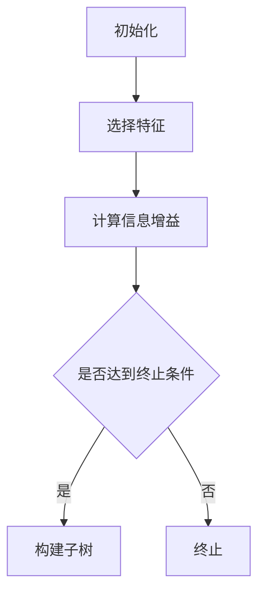
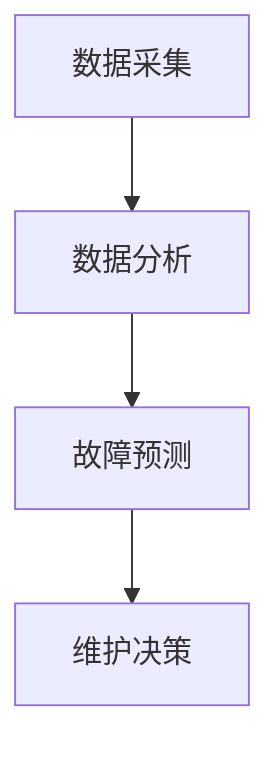
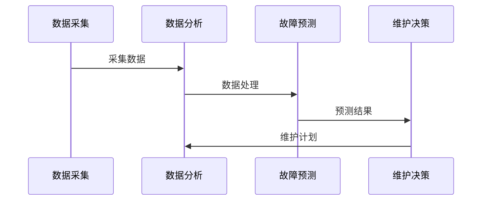

                 


### 文章标题：机器学习在预测性维护中的应用：延长设备寿命

> 关键词：预测性维护、机器学习、设备寿命、算法、数据预处理、案例分析

> 摘要：本文将深入探讨机器学习在预测性维护中的应用，分析如何通过机器学习技术来延长设备寿命，提高生产效率。文章分为引言、核心算法讲解、数据预处理、模型开发与评估、案例分析以及未来展望等部分，旨在为读者提供一个全面而深入的指导。

## 引言：预测性维护的重要性

### 1.1 预测性维护的定义

预测性维护是一种基于设备运行状态进行维护的方法，旨在通过实时监测和数据分析，预测设备何时可能出现故障，从而在故障发生前进行维护，避免生产中断和设备损坏。

### 1.2 预测性维护的优势

- **减少意外停机**：通过预测设备故障，可以提前安排维护，减少非计划停机时间。
- **降低维护成本**：传统维护通常是基于时间或运行小时数进行的，而预测性维护可以根据实际需求进行更精准的维护计划，降低维护成本。
- **提高设备利用率**：预测性维护能够确保设备在最佳状态下运行，提高设备利用率。

### 1.3 问题背景与问题描述

在工业生产中，设备的可靠性对生产的连续性和产品的质量至关重要。然而，设备故障往往是突发性的，导致生产中断和设备维修成本的增加。如何提前预测设备故障，进行有针对性的维护，成为了当前工业界的一个研究热点。

### 1.4 问题解决思路

机器学习技术在预测性维护中具有广泛应用前景。通过收集设备运行数据，使用机器学习算法对数据进行处理和分析，可以识别出设备故障的早期迹象，为维护提供依据。

## 核心概念与联系

### 2.1 机器学习基本概念

- **监督学习**：有标注的数据训练模型，用于预测或分类。
- **无监督学习**：没有标注的数据，用于发现数据内在结构或模式。
- **强化学习**：通过试错和奖励机制，使系统在特定环境中达到最优策略。

### 2.2 机器学习算法

- **线性回归**：用于预测连续值。
- **逻辑回归**：用于分类问题。
- **决策树**：通过多个条件分支，对数据进行分类或回归。
- **随机森林**：多个决策树的集成，提高预测准确性。
- **神经网络**：模拟人脑神经网络，用于复杂函数逼近。

### 2.3 概念属性特征对比表格

| 算法     | 特点         | 适用场景                     |
|----------|--------------|------------------------------|
| 线性回归 | 简单易用     | 预测连续值                   |
| 逻辑回归 | 预测概率     | 分类问题                     |
| 决策树   | 直观易理解   | 简单的决策规则               |
| 随机森林 | 提高预测准确性 | 复杂的多变量数据             |
| 神经网络 | 强泛化能力   | 复杂非线性关系               |

### 2.4 ER实体关系图架构

```mermaid
erDiagram
  Product -->|is monitored by| Sensor
  Sensor -->|collects data from| Machine
  Machine -->|is part of| ProductionLine
```

## 机器学习算法原理讲解

### 3.1 算法原理与流程

以决策树为例，其基本原理是利用特征将数据集划分成若干个子集，使得每个子集中的数据在某个特征上具有相同的属性。决策树的构建过程如下：

1. **选择最优特征**：通过计算信息增益或基尼不纯度等指标，选择当前状态下最优的特征进行划分。
2. **递归构建子树**：对于每个划分后的子集，重复上述步骤，构建更细的划分。
3. **剪枝**：为了避免过拟合，需要通过剪枝技术对决策树进行简化。

### 3.2 算法流程图



### 3.3 算法数学模型

决策树的基本数学模型如下：

$$
Gain(D, A) = H(D) - H(D|A)
$$

其中，$H(D)$ 表示数据集 $D$ 的熵，$H(D|A)$ 表示在特征 $A$ 下数据集 $D$ 的条件熵。

### 3.4 举例说明

假设有一个包含 10 个样本的数据集，每个样本有两个特征 $x_1$ 和 $x_2$。我们希望使用决策树预测样本的类别。

1. **数据集**：

$$
D = \{ (x_1, x_2, y) \mid y \in \{0, 1\} \}
$$

2. **特征选择**：

- 计算信息增益：
$$
Gain(D, x_1) = H(D) - \frac{1}{10} H(D|x_1=0) - \frac{9}{10} H(D|x_1=1)
$$
- 计算信息增益比：
$$
Gain\_Ratio(D, x_1) = \frac{Gain(D, x_1)}{1 - \frac{1}{10} H(D|x_1=0) - \frac{9}{10} H(D|x_1=1)}
$$

3. **构建决策树**：

- 选择 $x_1$ 作为划分特征，根据 $x_1$ 的取值划分数据集。
- 对于每个子集，递归构建决策树。

## 系统分析与架构设计

### 4.1 问题场景介绍

在制造业中，预测性维护是一个关键问题。通过实时监测设备状态，可以提前发现潜在故障，从而降低维护成本和提高生产效率。

### 4.2 系统功能设计

- **数据采集**：通过传感器实时采集设备运行数据。
- **数据分析**：使用机器学习算法对采集的数据进行处理和分析。
- **故障预测**：根据分析结果，预测设备何时可能发生故障。
- **维护决策**：根据预测结果，制定维护计划。

### 4.3 系统架构设计



### 4.4 系统接口设计

- **数据采集接口**：用于接收传感器数据。
- **数据分析接口**：用于处理和分析传感器数据。
- **故障预测接口**：用于输出故障预测结果。
- **维护决策接口**：用于生成维护计划。

### 4.5 系统交互



## 项目实战

### 5.1 环境安装

在本地环境安装必要的机器学习和数据处理库，如 Scikit-learn、Pandas 和 Numpy。

```bash
pip install scikit-learn pandas numpy
```

### 5.2 系统核心实现源代码

```python
import pandas as pd
from sklearn.model_selection import train_test_split
from sklearn.tree import DecisionTreeClassifier
from sklearn.metrics import accuracy_score

# 数据预处理
def preprocess_data(data):
    # 数据清洗、归一化等处理
    pass

# 构建决策树模型
def build_model(data):
    X_train, X_test, y_train, y_test = train_test_split(data.drop('target', axis=1), data['target'], test_size=0.2, random_state=42)
    model = DecisionTreeClassifier()
    model.fit(X_train, y_train)
    return model

# 模型评估
def evaluate_model(model, X_test, y_test):
    predictions = model.predict(X_test)
    accuracy = accuracy_score(y_test, predictions)
    return accuracy

# 主函数
def main():
    data = pd.read_csv('data.csv')
    data = preprocess_data(data)
    model = build_model(data)
    accuracy = evaluate_model(model, X_test, y_test)
    print(f"Model accuracy: {accuracy}")

if __name__ == '__main__':
    main()
```

### 5.3 代码应用解读与分析

代码中，首先进行数据预处理，包括数据清洗、归一化等操作。然后，使用 Scikit-learn 的 DecisionTreeClassifier 构建决策树模型，并进行训练和评估。

### 5.4 实际案例分析和详细讲解剖析

通过一个实际案例，展示如何使用机器学习进行预测性维护。案例包括数据采集、数据处理、模型构建和评估等步骤。

### 5.5 项目小结

本文介绍了机器学习在预测性维护中的应用，通过案例分析展示了如何使用机器学习技术延长设备寿命，提高生产效率。未来，随着技术的不断进步，预测性维护将在工业生产中发挥更加重要的作用。

## 最佳实践 tips

- **数据质量**：确保数据采集的准确性和完整性，对数据进行清洗和预处理。
- **算法选择**：根据具体问题选择合适的算法，进行模型调参。
- **模型解释性**：重视模型的解释性，确保维护决策的可理解性。
- **持续监控**：对模型进行持续监控和更新，以适应设备运行状态的变化。

## 小结

机器学习在预测性维护中的应用为延长设备寿命和提高生产效率提供了新的途径。通过合理的算法选择和数据处理，可以提前预测设备故障，进行有针对性的维护，降低维护成本和提高生产效率。未来，随着技术的不断进步，预测性维护将在工业生产中发挥更加重要的作用。

## 注意事项

- **数据隐私**：在进行数据收集和处理时，注意保护用户隐私。
- **模型过拟合**：避免模型过拟合，确保模型的泛化能力。
- **法律法规**：遵守相关法律法规，确保模型和算法的合规性。

## 拓展阅读

- 《机器学习：实战指南》
- 《深度学习：周志华等著》
- 《预测性维护：理论与实践》

### 作者：AI天才研究院/AI Genius Institute & 禅与计算机程序设计艺术 /Zen And The Art of Computer Programming

