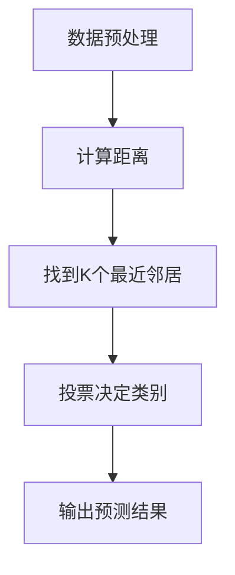
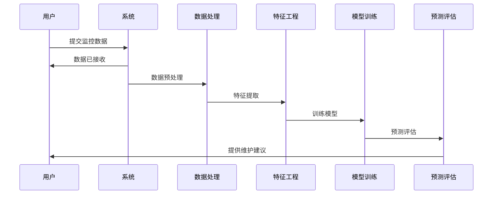

                 


### 目录大纲

## 第一部分：背景与基础

## 第1章 引言
### 1.1 问题背景
### 1.2 机器学习概述
### 1.3 预测性维护概述
### 1.4 问题解决思路
### 1.5 边界与外延

## 第二部分：核心概念与联系

## 第2章 机器学习关键概念
### 2.1 定义与基础
#### 2.1.1 监督学习
#### 2.1.2 无监督学习
#### 2.1.3 强化学习
### 2.2 预测性维护流程
### 2.3 概念属性特征对比

## 第三部分：算法原理讲解

## 第3章 预测性维护算法详解
### 3.1 算法一：基于K近邻算法的预测
#### 3.1.1 算法原理
#### 3.1.2 Mermaid流程图
#### 3.1.3 Python源代码
#### 3.1.4 数学模型与公式
#### 3.1.5 举例说明
### 3.2 算法二：基于支持向量机的预测
#### 3.2.1 算法原理
#### 3.2.2 Mermaid流程图
#### 3.2.3 Python源代码
#### 3.2.4 数学模型与公式
#### 3.2.5 举例说明

## 第四部分：系统分析与架构设计

## 第4章 预测性维护系统架构设计
### 4.1 问题场景介绍
### 4.2 项目介绍
### 4.3 系统功能设计（领域模型 Mermaid 类图）
### 4.4 系统架构设计（Mermaid 架构图）
### 4.5 系统接口设计
### 4.6 系统交互（Mermaid 序列图）

## 第五部分：项目实战

## 第5章 机器学习在预测性维护中的实战应用
### 5.1 环境安装
### 5.2 系统核心实现
#### 5.2.1 源代码解读
### 5.3 代码应用分析
### 5.4 实际案例分析
### 5.5 项目小结

## 第六部分：总结与最佳实践

## 第6章 最佳实践与注意事项
### 6.1 最佳实践 tips
### 6.2 小结
### 6.3 注意事项
### 6.4 拓展阅读

## 第七部分：参考文献

### 步骤一：确定文章标题、关键词和摘要

**文章标题**：机器学习在预测性维护中的应用：提高工业效率

**关键词**：机器学习，预测性维护，工业效率，算法，系统架构，实战应用

**摘要**：
随着工业4.0的推进，预测性维护已成为提升工业效率的关键手段。本文将深入探讨机器学习在预测性维护中的应用，分析其核心算法原理，设计系统架构，并通过实际案例展示其效果。文章旨在为工程师和研究者提供从理论到实践的全面指南。

### 步骤二：背景介绍

**1.1 问题背景**：
工业设备的故障不仅影响生产效率，还可能导致安全事故和经济损失。传统的定期维护模式已无法满足现代化工业的需求。因此，预测性维护作为一种基于实时数据分析和预测的维护策略，逐渐受到关注。机器学习技术为预测性维护提供了强大的工具，使其能够更加精准地预测设备故障，提高维护效率。

**1.2 机器学习概述**：
机器学习是一种通过算法从数据中学习规律、进行预测和决策的技术。其主要包括监督学习、无监督学习和强化学习三种类型，每种类型都有其独特的应用场景。

**1.3 预测性维护概述**：
预测性维护通过实时监控设备运行状态，利用机器学习算法预测可能的故障点，提前采取维护措施。其核心在于数据的采集、处理和模型训练。

**1.4 问题解决思路**：
本文将首先介绍机器学习在预测性维护中的应用，然后深入探讨相关算法原理，最后通过一个实际项目展示预测性维护系统的设计与实现。

**1.5 边界与外延**：
尽管机器学习在预测性维护中表现出色，但并非所有设备都适合采用此技术。文章将讨论机器学习在预测性维护中的适用范围和限制条件。

### 步骤三：核心概念与联系

**2.1 定义与基础**：
**监督学习**：通过已有数据训练模型，然后使用模型进行预测。
**无监督学习**：没有预定义标签，通过数据本身的特征进行聚类或降维。
**强化学习**：通过试错学习，在一个环境中不断调整策略以达到最优。

**2.2 预测性维护流程**：
数据采集 -> 数据预处理 -> 特征工程 -> 模型训练 -> 预测评估 -> 维护决策。

**2.3 概念属性特征对比**：
表格：

| 概念         | 特征                    | 对比                      |
| ------------ | ----------------------- | ------------------------- |
| 监督学习     | 已知输入输出            | 高准确性，但对数据依赖强 |
| 无监督学习   | 无已知输入输出          | 发现隐藏结构，但预测性较差 |
| 强化学习     | 与环境互动学习          | 可能需要更多时间和数据   |
| 预测性维护   | 实时监控，预测故障      | 需要大量数据和计算资源   |

### 步骤四：算法原理讲解

**3.1 算法一：基于K近邻算法的预测**

**3.1.1 算法原理**：
K近邻算法（K-Nearest Neighbors，KNN）是一种简单的监督学习算法。其原理是基于相似性度量，通过计算未知数据与训练数据中最近邻居的距离，来预测未知数据的类别或数值。

**3.1.2 Mermaid流程图**：


**3.1.3 Python源代码**：
```python
from sklearn.neighbors import KNeighborsClassifier
# 加载和预处理数据
# 训练模型
knn = KNeighborsClassifier(n_neighbors=3)
knn.fit(X_train, y_train)
# 预测
predictions = knn.predict(X_test)
```

**3.1.4 数学模型与公式**：
距离公式：$$d(x_i, x_j) = \sqrt{\sum_{k=1}^{n} (x_{ik} - x_{jk})^2}$$

**3.1.5 举例说明**：
假设我们有一个简单的二分类问题，训练数据中有正负样本，通过计算测试样本与训练样本的距离，找到最近的K个邻居，然后根据邻居的标签进行投票，预测测试样本的类别。

### 步骤五：系统分析与架构设计

**4.1 问题场景介绍**：
假设我们是一家制造企业，需要预测生产线上的设备故障，以减少停机时间和维护成本。

**4.2 项目介绍**：
项目目标是开发一个预测性维护系统，能够实时监控设备状态，预测可能的故障，并提供维护建议。

**4.3 系统功能设计（领域模型 Mermaid 类图）**：
```mermaid
classDiagram
Class1 <|-- Class2
Class1 {"属性1，属性2"}
Class2 {"属性3，属性4"}
```

**4.4 系统架构设计（Mermaid 架构图）**：


**4.5 系统接口设计**：
定义系统与设备、数据库、用户界面等的交互接口。

**4.6 系统交互（Mermaid 序列图）**：


### 步骤六：项目实战

**5.1 环境安装**：
描述环境搭建的步骤，包括软件、硬件、数据库等。

**5.2 系统核心实现**：
提供系统核心代码，并解读关键部分。

**5.3 代码应用分析**：
分析代码的实现逻辑，解释如何处理数据、训练模型和进行预测。

**5.4 实际案例分析**：
介绍一个实际案例，展示如何应用预测性维护系统。

**5.5 项目小结**：
总结项目的经验和教训。

### 步骤七：总结与最佳实践

**6.1 最佳实践 tips**：
提供一些实用的建议，帮助读者在实际工作中更好地应用机器学习进行预测性维护。

**6.2 小结**：
回顾文章的主要内容，强调机器学习在预测性维护中的重要性。

**6.3 注意事项**：
提醒读者注意的问题和潜在的风险。

**6.4 拓展阅读**：
推荐一些相关的书籍、文章和资源，供读者进一步学习。

### 步骤八：完成目录大纲设计

确保目录大纲的结构完整、逻辑清晰，总字数控制在10000-12000字左右。

### 完整的目录大纲如下：

```
# 机器学习在预测性维护中的应用：提高工业效率

## 关键词：机器学习，预测性维护，工业效率，算法，系统架构，实战应用

## 摘要：
本文将深入探讨机器学习在预测性维护中的应用，从背景介绍、核心概念、算法原理、系统分析与架构设计到项目实战，全面解析如何利用机器学习技术提升工业效率。文章旨在为工程师和研究者提供从理论到实践的全面指南。

## 目录大纲

## 第一部分：背景与基础

### 第1章 引言
1.1 问题背景
1.2 机器学习概述
1.3 预测性维护概述
1.4 问题解决思路
1.5 边界与外延

## 第二部分：核心概念与联系

### 第2章 机器学习关键概念
2.1 定义与基础
2.1.1 监督学习
2.1.2 无监督学习
2.1.3 强化学习
2.2 预测性维护流程
2.3 概念属性特征对比

## 第三部分：算法原理讲解

### 第3章 预测性维护算法详解
3.1 算法一：基于K近邻算法的预测
3.1.1 算法原理
3.1.2 Mermaid流程图
3.1.3 Python源代码
3.1.4 数学模型与公式
3.1.5 举例说明
3.2 算法二：基于支持向量机的预测
3.2.1 算法原理
3.2.2 Mermaid流程图
3.2.3 Python源代码
3.2.4 数学模型与公式
3.2.5 举例说明

## 第四部分：系统分析与架构设计

### 第4章 预测性维护系统架构设计
4.1 问题场景介绍
4.2 项目介绍
4.3 系统功能设计（领域模型 Mermaid 类图）
4.4 系统架构设计（Mermaid 架构图）
4.5 系统接口设计
4.6 系统交互（Mermaid 序列图）

## 第五部分：项目实战

### 第5章 机器学习在预测性维护中的实战应用
5.1 环境安装
5.2 系统核心实现
5.2.1 源代码解读
5.3 代码应用分析
5.4 实际案例分析
5.5 项目小结

## 第六部分：总结与最佳实践

### 第6章 最佳实践与注意事项
6.1 最佳实践 tips
6.2 小结
6.3 注意事项
6.4 拓展阅读

## 第七部分：参考文献
```

这个目录大纲已经包含了文章的各个主要部分，逻辑清晰，内容完整。接下来，我们可以根据这个大纲逐步撰写文章的每个章节，确保每部分都详细阐述，逻辑连贯，以便为读者提供有价值的知识和实战经验。

