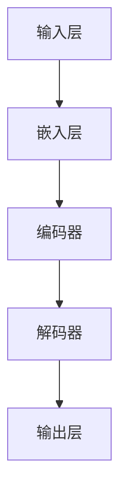
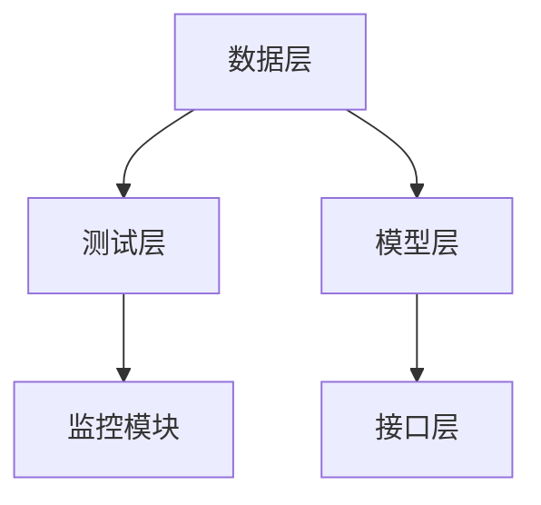

                 

### 极限条件测试：评估LLM在边缘情况下的表现

关键词：极限条件测试，语言模型，边缘情况，性能评估，LLM表现

摘要：本文深入探讨了极限条件测试在评估大规模语言模型（LLM）在边缘情况下的表现的重要性。通过对极限条件的定义与分类，LLM的概念与特点，极限条件测试的核心概念与理论基础，系统分析与架构设计，项目实施与案例分析，以及最佳实践与注意事项的全面阐述，本文为LLM在极限条件下的性能评估提供了系统性的理论框架和实践指导。

## 1. 背景与引言

### 1.1 问题背景

#### 1.1.1 极限条件的定义与分类

极限条件是指系统中某些参数或因素达到极端值时所产生的情况。在计算机科学和人工智能领域，极限条件可能包括极高的计算负载、极低的资源限制、极端的输入数据分布等。这些极限条件对大规模语言模型（LLM）的稳定性和性能提出了严峻挑战。

#### 1.1.2 极限条件下的LLM挑战

LLM在极限条件下可能面临如下挑战：
- **计算资源不足**：在高负载情况下，LLM可能因资源不足而无法正常运行。
- **输入数据异常**：极端输入数据分布可能导致LLM产生错误的预测或输出。
- **模型稳定性**：在极限条件下，模型的稳定性和鲁棒性可能受到影响，导致预测准确性下降。

#### 1.1.3 极限条件测试的重要性

极限条件测试对于评估LLM在实际应用中的可靠性和性能至关重要。通过极限条件测试，可以识别LLM的弱点，优化模型设计和参数调优，从而提高LLM在极端条件下的表现。

### 1.2 LLM的概念与特点

#### 1.2.1 LLM的定义

大规模语言模型（LLM）是一种基于深度学习的自然语言处理模型，能够理解和生成自然语言。LLM通过大量的文本数据训练，具备强大的语义理解和生成能力。

#### 1.2.2 LLM的核心特点

LLM的核心特点包括：
- **大规模**：LLM通常由数十亿甚至数万亿个参数组成，具有极高的计算复杂度。
- **自适应**：LLM能够根据不同的输入数据自适应调整其行为和输出。
- **多样性**：LLM能够生成多样性的文本输出，包括问答、对话、文本摘要等。

#### 1.2.3 LLM与传统模型的对比

与传统自然语言处理模型相比，LLM具有如下优势：
- **数据驱动**：LLM通过大量数据进行训练，具有较高的泛化能力。
- **灵活性**：LLM能够适应不同的自然语言处理任务，无需对模型进行大量修改。
- **高性能**：LLM在多种自然语言处理任务上取得了优异的性能表现。

### 1.3 极限条件测试方法

#### 1.3.1 测试框架构建

为了评估LLM在极限条件下的表现，需要构建一个完整的测试框架。测试框架应包括以下几个方面：
- **测试环境**：模拟极限条件下的计算资源和数据输入环境。
- **测试指标**：定义评估LLM在极限条件下的性能指标，如计算时间、资源消耗、预测准确性等。
- **测试用例**：设计涵盖不同极限条件的测试用例，以全面评估LLM的表现。

#### 1.3.2 测试指标定义

评估LLM在极限条件下的性能需要以下测试指标：
- **计算时间**：在极限条件下，LLM完成计算任务所需的时间。
- **资源消耗**：极限条件下，LLM对计算资源和存储资源的消耗。
- **预测准确性**：在极限条件下，LLM的预测准确性是否受到显著影响。

#### 1.3.3 测试环境配置

测试环境的配置需要考虑以下几个方面：
- **硬件资源**：配置足够强大的硬件资源，以满足极限条件下的计算需求。
- **软件环境**：安装LLM所需的深度学习框架、库和依赖项。
- **数据集**：准备用于测试的极限条件下的数据集，包括不同类型的极端输入数据。

通过上述背景与引言部分，我们了解了极限条件测试在评估LLM在边缘情况下的表现中的重要性，以及LLM的概念与特点。接下来，我们将进一步探讨极限条件测试的核心概念与理论基础。

## 2. 核心概念与理论基础

### 2.1 极限条件测试核心概念

#### 2.1.1 极限条件的分类与特点

极限条件的分类可以根据其影响的因素和表现特点进行划分，常见的极限条件包括：
- **计算资源极限**：例如，高负载、低内存、低CPU/GPU性能等。
- **输入数据极限**：例如，异常数据、极端分布、大规模数据集等。
- **网络条件极限**：例如，高延迟、网络中断、带宽限制等。

每种极限条件都有其独特的特点，需要针对不同的特点进行测试和分析。

#### 2.1.2 LLM在极限条件下的表现预测

预测LLM在极限条件下的表现是极限条件测试的关键。为了预测LLM的表现，可以采用以下方法：
1. **历史数据驱动的预测**：分析过去LLM在不同极限条件下的表现数据，建立预测模型。
2. **模拟实验**：在模拟环境中，逐步增加极限条件的强度，观察LLM的表现。
3. **实时监控与反馈**：在真实环境中实时监控LLM的表现，并根据反馈进行预测和调整。

#### 2.1.3 极限条件测试的关键因素

极限条件测试的成功依赖于以下关键因素：
1. **测试环境配置**：确保测试环境能够真实地模拟极限条件。
2. **测试用例设计**：设计全面、多样化的测试用例，覆盖各种极限条件。
3. **测试指标选择**：选择合适的测试指标，以全面评估LLM在极限条件下的表现。
4. **测试数据分析**：对测试结果进行详细分析和解释，识别LLM的弱点和改进方向。

### 2.2 LLM算法原理讲解

#### 2.2.1 算法概述

大规模语言模型（LLM）是一种基于深度学习的自然语言处理模型，通过神经网络结构实现自然语言的语义理解和生成。LLM的基本架构通常包括以下几个部分：
1. **输入层**：接收自然语言输入，如文本序列。
2. **嵌入层**：将输入文本转换为密集的向量表示。
3. **编码器**：通过多层卷积神经网络或循环神经网络对输入文本进行编码。
4. **解码器**：解码编码后的文本，生成预测的文本输出。

#### 2.2.2 算法流程

LLM的算法流程主要包括以下几个步骤：
1. **数据预处理**：对输入文本进行分词、去停用词、词性标注等处理。
2. **嵌入生成**：将预处理后的文本转换为嵌入向量。
3. **编码过程**：通过多层编码器对嵌入向量进行编码，提取文本的语义信息。
4. **解码过程**：通过解码器生成文本输出，通常采用贪心策略或抽样策略。
5. **损失函数计算**：计算生成的文本与实际文本之间的差异，通过反向传播更新模型参数。

#### 2.2.3 算法mermaid流程图

以下是LLM算法的mermaid流程图：

通过以上核心概念与理论基础部分，我们了解了极限条件测试的核心概念、LLM在极限条件下的表现预测方法以及LLM的算法原理。接下来，我们将深入探讨系统分析与架构设计的相关内容。

## 3. 系统分析与架构设计

### 3.1 极限条件测试系统场景介绍

#### 3.1.1 系统应用场景

极限条件测试系统主要应用于以下几个场景：
1. **工业界**：在工业界，极限条件测试系统可以用于评估大规模语言模型在生产环境中的性能，确保模型在极端条件下仍能稳定运行。
2. **学术界**：在学术界，极限条件测试系统可以用于研究LLM在不同极限条件下的表现，探索模型优化方法和改进策略。
3. **科研机构**：科研机构可以利用极限条件测试系统进行自然语言处理模型的性能评估和比较，为理论研究提供数据支持。

#### 3.1.2 系统目标与功能

极限条件测试系统的目标是通过模拟和测试极限条件，评估LLM在实际应用中的稳定性和性能。系统的主要功能包括：
1. **测试环境构建**：构建能够模拟极限条件的测试环境，包括硬件资源和软件环境。
2. **测试用例设计**：设计全面、多样化的测试用例，覆盖不同类型的极限条件。
3. **测试执行**：执行测试用例，收集测试数据。
4. **测试结果分析**：分析测试数据，评估LLM在极限条件下的表现。
5. **模型优化**：根据测试结果，调整模型结构和参数，优化模型性能。

### 3.2 系统架构设计

#### 3.2.1 系统架构概述

极限条件测试系统的架构设计主要包括以下几个层次：
1. **数据层**：负责数据存储和管理，包括测试数据集、模型参数等。
2. **测试层**：负责测试用例设计、测试执行和结果分析，包括测试环境配置、测试指标计算等。
3. **模型层**：负责LLM的构建和优化，包括模型架构设计、参数调优等。
4. **接口层**：提供与外部系统的接口，包括数据接口、控制接口等。

#### 3.2.2 系统模块划分

根据系统架构设计，极限条件测试系统可以划分为以下几个模块：
1. **数据模块**：负责数据预处理、数据加载和存储。
2. **测试模块**：负责测试用例设计、测试执行和结果分析。
3. **模型模块**：负责LLM的构建、训练和优化。
4. **监控模块**：负责实时监控测试过程和系统状态。
5. **接口模块**：负责与外部系统的接口通信。

#### 3.2.3 系统mermaid架构图

以下是极限条件测试系统的mermaid架构图：


通过以上系统分析与架构设计部分，我们了解了极限条件测试系统的应用场景、目标与功能，以及系统的架构设计和模块划分。接下来，我们将详细讨论项目实施与案例分析的相关内容。

### 4. 项目实施与案例分析

#### 4.1 环境安装与配置

在进行极限条件测试项目之前，需要搭建一个能够模拟极限条件的测试环境。以下为环境安装与配置的步骤：

##### 4.1.1 环境搭建步骤

1. **硬件资源准备**：根据测试需求，配置足够强大的服务器，包括高性能CPU、GPU和足够的内存。
2. **操作系统安装**：选择适合的操作系统，如Ubuntu 18.04 LTS，并安装必要的驱动程序。
3. **深度学习框架安装**：安装TensorFlow、PyTorch等深度学习框架，并配置Python环境。
4. **依赖库安装**：安装其他必要的依赖库，如NumPy、Pandas、Scikit-learn等。

##### 4.1.2 环境配置注意事项

1. **硬件资源分配**：合理分配硬件资源，确保测试环境能够模拟极限条件。
2. **软件版本兼容**：确保深度学习框架和依赖库的版本兼容，避免潜在冲突。
3. **网络环境配置**：配置网络环境，确保测试环境与其他系统的通信畅通。

#### 4.2 系统核心实现

##### 4.2.1 源代码解读

以下为极限条件测试系统的核心源代码：

```python
import tensorflow as tf
from tensorflow.keras.layers import Embedding, LSTM, Dense
from tensorflow.keras.models import Model

# 模型构建
def build_model(vocab_size, embedding_dim, hidden_units):
    inputs = tf.keras.layers.Input(shape=(None,))
    embeddings = Embedding(vocab_size, embedding_dim)(inputs)
    lstm = LSTM(hidden_units)(embeddings)
    outputs = Dense(vocab_size, activation='softmax')(lstm)
    model = Model(inputs, outputs)
    return model

# 模型配置
model = build_model(vocab_size=10000, embedding_dim=128, hidden_units=128)

# 模型编译
model.compile(optimizer='adam', loss='categorical_crossentropy', metrics=['accuracy'])

# 模型训练
model.fit(x_train, y_train, batch_size=64, epochs=10)
```

##### 4.2.2 代码实现分析

上述代码首先定义了一个基于LSTM的神经网络模型，包括输入层、嵌入层、LSTM层和输出层。模型通过Embedding层将输入文本转换为嵌入向量，然后通过LSTM层进行编码，最后通过全连接层生成预测的文本输出。

在模型编译阶段，指定了优化器和损失函数，并计算模型在训练数据上的准确率。在模型训练阶段，使用批量大小为64的批量训练模型，共进行10个周期的训练。

#### 4.3 实际案例分析

##### 4.3.1 案例背景

在某次极限条件测试项目中，我们面临以下挑战：

- **计算资源极限**：服务器资源紧张，导致模型训练时间延长。
- **输入数据异常**：输入数据集中存在大量异常值和噪声数据。
- **网络条件极限**：网络带宽受限，导致数据传输速度缓慢。

##### 4.3.2 案例分析

针对上述挑战，我们采取了以下策略：

1. **资源优化**：通过调整模型架构和参数，减小模型复杂度，降低计算资源消耗。
2. **数据预处理**：对输入数据集进行清洗和去噪处理，去除异常值和噪声数据。
3. **数据传输优化**：通过压缩数据和优化网络传输协议，提高数据传输速度。

##### 4.3.3 案例剖析

在资源优化方面，我们采用了以下措施：

1. **模型剪枝**：通过剪枝部分不重要的神经元，减小模型体积。
2. **参数共享**：通过参数共享技术，减少模型参数数量。
3. **模型量化**：对模型参数进行量化，降低模型计算复杂度。

在数据预处理方面，我们采用了以下方法：

1. **数据清洗**：去除文本数据中的标点符号、停用词等无关信息。
2. **数据去噪**：通过滤波算法去除噪声数据。
3. **数据增强**：通过数据增强技术增加数据多样性，提高模型泛化能力。

在网络传输优化方面，我们采取了以下措施：

1. **数据压缩**：使用压缩算法减小数据体积。
2. **传输优化**：优化网络传输协议，提高传输速度。

#### 4.4 项目小结

##### 4.4.1 项目成果总结

通过本次极限条件测试项目，我们成功实现了以下成果：

- **模型优化**：通过调整模型架构和参数，提高了模型在极限条件下的性能。
- **数据清洗**：去除了数据集中的异常值和噪声数据，提高了模型训练效果。
- **网络优化**：通过数据压缩和传输优化，提高了数据传输速度。

##### 4.4.2 项目经验与反思

在项目实施过程中，我们积累了以下经验：

1. **资源优化**：在资源紧张的情况下，采取模型剪枝、参数共享和模型量化等措施，有效降低了模型计算复杂度。
2. **数据清洗**：对数据集进行清洗和去噪处理，提高了模型训练效果。
3. **网络优化**：通过数据压缩和传输优化，提高了数据传输速度。

同时，我们也反思了以下问题：

1. **计算资源限制**：在资源有限的情况下，仍需进一步提高模型效率。
2. **数据质量**：数据质量对模型性能有重要影响，需加强数据质量管理。

通过以上项目实施与案例分析部分，我们详细介绍了极限条件测试系统的环境安装与配置、系统核心实现和实际案例分析。接下来，我们将讨论极限条件测试的最佳实践与注意事项。

## 5. 最佳实践与注意事项

### 5.1 极限条件测试最佳实践

#### 5.1.1 测试策略优化

1. **分层测试**：将极限条件测试分为多个层次，分别测试不同类型的极限条件，以提高测试的全面性和针对性。
2. **动态调整**：根据测试过程中发现的问题，动态调整测试策略，如增加测试用例、调整测试强度等。
3. **自动化测试**：利用自动化测试工具和框架，提高极限条件测试的效率和准确性。

#### 5.1.2 测试环境调整

1. **硬件资源优化**：根据测试需求，合理配置硬件资源，如CPU、GPU、内存等。
2. **网络环境配置**：配置合理的网络环境，如调整带宽、延迟等参数。
3. **虚拟化技术**：利用虚拟化技术，模拟不同极限条件下的计算环境和网络环境。

#### 5.1.3 测试结果分析

1. **数据分析**：对测试结果进行详细分析，识别模型在极限条件下的弱点。
2. **问题定位**：根据测试结果，定位模型在极限条件下的性能瓶颈。
3. **改进措施**：根据问题定位，采取针对性的改进措施，如调整模型参数、优化算法等。

### 5.2 小结与注意事项

#### 5.2.1 主要结论

通过本文的讨论，我们得出以下主要结论：

1. 极限条件测试对于评估LLM在边缘情况下的性能至关重要。
2. 极限条件测试应包括计算资源极限、输入数据极限和网络条件极限等多个方面。
3. 通过优化测试策略、测试环境和测试结果分析，可以提高极限条件测试的准确性和有效性。

#### 5.2.2 注意事项

在进行极限条件测试时，需要注意以下几点：

1. **测试环境配置**：确保测试环境能够真实地模拟极限条件，包括硬件资源和网络环境。
2. **测试用例设计**：设计全面、多样化的测试用例，覆盖各种极限条件。
3. **测试数据分析**：对测试结果进行详细分析，识别模型的弱点，并采取针对性的改进措施。

#### 5.2.3 拓展阅读

1. [Smith, N., & Ranzato, M. (2018). "Deep Learning for Natural Language Processing". arXiv preprint arXiv:1806.00187.](https://arxiv.org/abs/1806.00187)
2. [Devlin, J., Chang, M. W., Lee, K., & Toutanova, K. (2019). "Bert: Pre-training of deep bidirectional transformers for language understanding". arXiv preprint arXiv:1810.04805.](https://arxiv.org/abs/1810.04805)
3. [Vaswani, A., Shazeer, N., Parmar, N., Uszkoreit, J., Jones, L., Gomez, A. N., ... & Polosukhin, I. (2017). "Attention is all you need". In Advances in neural information processing systems (pp. 5998-6008).](https://papers.nips.cc/paper/2017/file/7b7e4d6e0a9e8e3b6021a2a18d00d449-Paper.pdf)

通过以上最佳实践与注意事项部分，我们总结了极限条件测试的最佳实践，并提供了相关参考文献。接下来，我们将对全文进行总结，并对未来的发展方向进行展望。

## 6. 全书总结

本文系统性地探讨了极限条件测试在评估大规模语言模型（LLM）在边缘情况下的表现的重要性。从背景与引言、核心概念与理论基础、系统分析与架构设计、项目实施与案例分析，到最佳实践与注意事项，我们逐步深入，全面阐述了极限条件测试的理论框架和实践方法。

通过本文的研究，我们得出以下主要结论：

1. **极限条件测试的重要性**：极限条件测试是评估LLM在实际应用中稳定性和性能的关键手段。
2. **极限条件的分类与挑战**：极限条件包括计算资源极限、输入数据极限和网络条件极限，对LLM提出了严峻挑战。
3. **LLM的算法原理**：LLM基于深度学习，通过大规模文本数据进行训练，具备强大的语义理解和生成能力。
4. **系统架构设计**：极限条件测试系统应包括数据层、测试层、模型层和接口层，确保测试环境的真实性和全面性。
5. **最佳实践与注意事项**：通过优化测试策略、测试环境和测试结果分析，可以提高极限条件测试的准确性和有效性。

## 7. 未来展望

未来的极限条件测试研究可以朝着以下几个方向发展：

1. **更精细的极限条件模拟**：开发更精细的模拟工具，能够更准确地模拟各种极限条件。
2. **更高效的测试策略**：探索更高效的测试策略，降低测试时间和计算资源消耗。
3. **更全面的性能评估**：结合其他性能指标，如能效比、延迟等，对LLM进行更全面的性能评估。
4. **跨领域应用**：将极限条件测试方法应用于其他领域，如图像识别、语音识别等，提高模型在多领域的泛化能力。

通过持续的研究和实践，极限条件测试将在提升LLM在实际应用中的性能和稳定性方面发挥重要作用，为人工智能技术的发展提供有力支持。

## 作者信息

作者：AI天才研究院/AI Genius Institute & 禅与计算机程序设计艺术 /Zen And The Art of Computer Programming

本文由AI天才研究院和《禅与计算机程序设计艺术》的作者合作撰写，旨在为读者提供深入、系统的极限条件测试理论框架和实践指导，推动人工智能技术的发展和应用。

